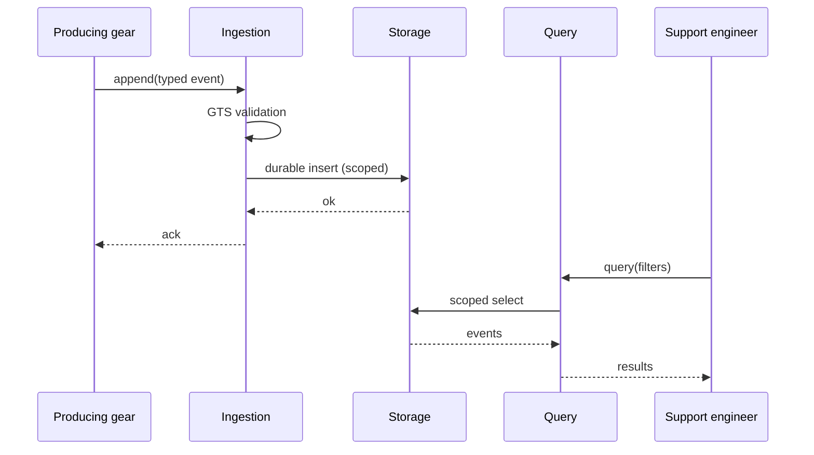

# Technical Design — Audit Log

<!-- toc -->

- [1. Architecture Overview](#1-architecture-overview)
  - [1.1 Architectural Vision](#11-architectural-vision)
  - [1.2 Architecture Drivers](#12-architecture-drivers)
- [2. Gear Structure](#2-gear-structure)
- [3. Domain Model and GTS Types](#3-domain-model-and-gts-types)
- [4. Component Model](#4-component-model)
  - [Ingestion Service](#ingestion-service)
  - [Query Service](#query-service)
  - [Retention Task](#retention-task)
  - [Scoped Storage](#scoped-storage)
- [5. API Surface](#5-api-surface)
- [6. Dependencies](#6-dependencies)
- [7. Interactions](#7-interactions)
- [8. Storage](#8-storage)

<!-- /toc -->

## 1. Architecture Overview

### 1.1 Architectural Vision

The audit-log gear is a REST+DB service gear with an append-optimized write path and a query path isolated from it. Producing gears append through the SDK; events are validated against GTS-derived types, durably stored tenant-scoped, and queried through OData-filtered REST. Retention runs as a background task that itself emits audit events.

### 1.2 Architecture Drivers

**ADRs**: `cpt-cf-audit-log-adr-retention-enforcement`

#### Functional Drivers

| Requirement | Design Response |
|-------------|------------------|
| `cpt-cf-audit-log-fr-append-event` | Append-only ingestion service; acknowledgment after durable insert |
| `cpt-cf-audit-log-fr-reject-malformed` | GTS instance validation at the SDK boundary; typed rejection errors |
| `cpt-cf-audit-log-fr-query-trail` | OData-filtered query service over scoped storage; PDP check per query |
| `cpt-cf-audit-log-fr-enforce-retention` | Retention background task with per-tenant policy; deletions re-enter ingestion |

#### NFR Allocation

| NFR ID | Allocated To | Design Response | Verification |
|--------|--------------|-----------------|--------------|
| `cpt-cf-audit-log-nfr-ingestion-isolation` | Ingestion service | Bounded write path: validation + single insert, no fan-out | Latency test in gear e2e suite |

## 2. Gear Structure

| Crate | Purpose |
|-------|---------|
| `cf-gears-audit-log-sdk` | Append/query traits, models, GTS event base type, error catalog |
| `cf-gears-audit-log` | Implementation: api/rest, domain (ingestion, query, retention), infra/storage |

**Gear macro declaration**: name `audit-log`, capabilities `rest, db, stateful`, deps `authz_resolver, types_registry, tenant_resolver`.

Registration surface: workspace member entries, example-server optional dependency and feature `audit-log`, `registered_gears.rs` import, cargo-shear ignore entries, e2e configuration block.

## 3. Domain Model and GTS Types

| Entity / Type | GTS ID | Where declared |
|---------------|--------|----------------|
| Audit event base | `gts.cf.core.audit.event.v1~` | sdk gts module |
| Producer event types | `gts.cf.core.audit.event.v1~{vendor}.{package}._.{type}.v1` | producing gears, via types-registry |
| Error catalog | `gts.cf.core.errors.err.v1~hx.audit.audit_log.*` | gear gts error catalog file |

## 4. Component Model

### Ingestion Service

- [ ] `p1` - **ID**: `cpt-cf-audit-log-component-ingestion`

**Why it exists**: The trustworthy append path is the gear's core obligation.
**Responsibility scope**: Validate typed events, durably append, acknowledge; bounded latency.
**Responsibility boundaries**: No querying, no retention; never blocks on downstream consumers.
**Related components**: `cpt-cf-audit-log-component-storage` — writes through; `cpt-cf-audit-log-component-retention` — emits deletion events into it.

### Query Service

- [ ] `p1` - **ID**: `cpt-cf-audit-log-component-query`

**Why it exists**: The one-minute support answer requires filtered, authorized reads.
**Responsibility scope**: OData-filtered, tenant-scoped queries; per-query authorization.
**Responsibility boundaries**: Read-only; no aggregation (usage-collector owns that).
**Related components**: `cpt-cf-audit-log-component-storage` — reads from.

### Retention Task

- [ ] `p2` - **ID**: `cpt-cf-audit-log-component-retention`

**Why it exists**: Retention is a compliance obligation in both directions.
**Responsibility scope**: Per-tenant policy evaluation, scheduled deletion, deletion auditing.
**Responsibility boundaries**: Policy source is a plugin seam; the task consumes decisions, it does not make policy.
**Related components**: `cpt-cf-audit-log-component-ingestion` — records deletions; `cpt-cf-audit-log-component-storage` — deletes from.

### Scoped Storage

- [ ] `p1` - **ID**: `cpt-cf-audit-log-component-storage`

**Why it exists**: Tenant isolation and append-only semantics live in one place.
**Responsibility scope**: Secure-ORM entities, migrations, append/query/delete repositories.
**Responsibility boundaries**: No business rules; all access scoped, no raw connections.
**Related components**: `cpt-cf-audit-log-component-ingestion`, `cpt-cf-audit-log-component-query`, `cpt-cf-audit-log-component-retention` — sole data owner for all three.

## 5. API Surface

| Kind | Name | Consumers | Notes |
|------|------|-----------|-------|
| SDK trait | AuditAppendV1 | producing gears | fire-and-forget append with typed errors |
| SDK trait | AuditQueryV1 | support tooling | filtered queries |
| REST | GET /audit/events | support engineer | OData filters; stable |
| Plugin seam | RetentionPolicyV1 | deployments | default: static per-tenant config |

## 6. Dependencies

| Dependency | Interface | Purpose |
|------------|-----------|---------|
| authz-resolver | SDK client | query authorization decisions |
| types-registry | SDK client | event type registration and validation |
| tenant-resolver | SDK client | tenant scoping |
| toolkit-db, toolkit-db-macros | workspace dep | secure scoped storage |
| toolkit-odata | workspace dep | query filtering and pagination |

## 7. Interactions

#### Append and Query Round Trip

**ID**: `cpt-cf-audit-log-seq-append-query`

**Description**: The primary use case `cpt-cf-audit-log-usecase-who-did-what` end to end.

## 8. Storage

| Table | Purpose | Tenant scoping |
|-------|---------|----------------|
| audit_events | append-only event records | tenant_id (secure-ORM scoped) |
| retention_policies | per-tenant retention settings | tenant_id (secure-ORM scoped) |
