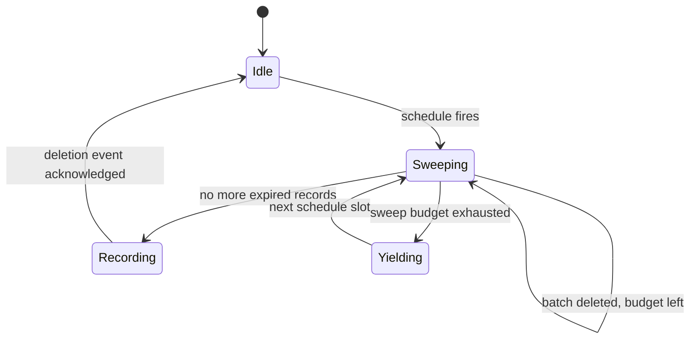

# Feature — Retention Sweep

<!-- toc -->

- [Summary](#summary)
- [Behavior](#behavior)
- [Definition of Done](#definition-of-done)
- [Test Scenarios](#test-scenarios)

<!-- /toc -->

- [ ] `p2` - **ID**: `cpt-cf-audit-log-feature-retention-sweep`
## Summary

The retention sweep deletes a tenant's expired audit records in bounded batches and records the deletion as an audit event. Implements `cpt-cf-audit-log-fr-enforce-retention`; delivered by phase `cpt-cf-audit-log-phase-retention-e2e`.

## Behavior

- The sweep evaluates the tenant's retention policy at start; a policy change mid-sweep applies from the next batch.
- Batches are bounded; each batch deletes through scoped storage and yields to the runtime.
- When the per-sweep budget is exhausted, the sweep parks and resumes at the next slot — no unbounded runs.
- After the final batch, one deletion event per tenant-sweep is appended through the normal ingestion path; a rejected deletion event fails the sweep loudly (it must never be silent).
- A tenant with no expired records produces no deletion event.

## Definition of Done

- [ ] Expired records are gone after a sweep; unexpired records remain.
- [ ] One deletion event per tenant-sweep appears in the trail with counts and the policy applied.
- [ ] A sweep interrupted by budget exhaustion resumes and completes without double-recording.
- [ ] A rejected deletion event surfaces as a sweep failure metric and log, never silence.

## Test Scenarios

| Scenario | Given | When | Then |
|----------|-------|------|------|
| Basic expiry | records older than policy | sweep runs | expired deleted, deletion event appended |
| Nothing expired | all records within policy | sweep runs | nothing deleted, no deletion event |
| Budget exhaustion | more expired records than one budget allows | sweep runs twice | all expired deleted, exactly one deletion event per completed tenant-sweep |
| Rejected deletion event | ingestion rejects the deletion event type | sweep completes batches | sweep reports failure; no silent completion |
