> NOTE: this document describes target architecture and the current state of the codebase. Some components and scenarios are not yet implemented.

# CONVENTIONS

## Versioning conventions

This document describes the Constructor Fabric Gears and their roles in typical scenarios. Every feature or scenario step has an inline indicator of the priority/phase tag (p1-p5) and implementation status of given functionality:

- [ ] - not implemented
- [x] - implemented

The objective of such notation is to provide a clear overview of the current state of the codebase and the next priorities of selected scenarios.

## Type System

Gears use the [Global Type System](https://github.com/GlobalTypeSystem/gts-rust) ([specification](https://github.com/GlobalTypeSystem/gts-spec)) to implement a powerful **extension point architecture** where virtually everything in the system can be extended without modifying core code.

The GTS naming conventions provide simple, human-readable, globally unique identifier and referencing system for data type definitions (e.g., JSON Schemas) and global data instances (e.g., JSON objects).

# ARCHITECTURE

## Detailed Overview


The diagram above illustrates the principal Gear architecture. The deployed component set depends on the target environment and build configuration; for example it can be a single executable for the desktop build or multiple containers for a cloud server.

Each gear encapsulates a well-defined piece of business logic and exposes **versioned contracts** to its consumers via Rust-native interfaces, HTTP APIs, or gRPC. In addition, gears can define their own **plugin interfaces** that allow pluggable implementations of processing and storage concerns, enabling extensibility without coupling core logic to concrete backends. Additionally, gears can define **adapter interfaces** for compile-time selection of an implementation.

All interaction between gears and between gears and their plugins happens strictly through these versioned public interfaces. No gear or plugin is allowed to depend on another gear’s internal structures or implementation details. This enforces loose coupling, enables independent evolution and versioning, and allows gears or plugin implementations to be replaced without impacting the rest of the system.

## Gears Categories

All gears can be divided into several categories:
- **API Ingress** - the public ingress layer for external traffic; currently represented by API gateway
- **Business Logic Gears** - gears implementing the main SaaS service logic built on top of CF/Gears Toolkit and system gears
- **Gen AI Gears** - foundational generative AI capabilities such as chat, model management, agents, memory, search, crawling, scheduling, and MCP integration
- **Serverless** - functions/workflows, runtimes, durable state, settings, and cluster coordination gears
- **BSS (Business Support System)** - monetization and commercial gears: product catalog, pricing, rating, billing, subscriptions, payments, invoicing, contracts, and marketplace
- **Core Functionality** - shared platform capabilities such as audit, usage collection, jobs, registries, file handling, quotas, notifications, analytics, and approvals
- **Core Platform Integration Gears** - interfaces for other gears and adapters for real Core Platform services (see below)
- **Core Platform Services** - external services that implement Core Platform functionality, such as tenancy management, access policies, licensing, credentials, and outbound egress control
- **OSS (Operations Support System)** - operational gears for infrastructure management, DNS, certificates, monitoring, service catalog, and multi-region operations
- **Studio** - developer experience and governance gears for the Constructor Studio product

The **Core Platform Integration Gears** layer abstracts integration with core platform services, such as IdP, policy management, licensing, and credentials management that that can be out of scope of Gears. This keeps Gears reusable: it can run as a standalone platform, or it can integrate into an existing enterprise platform by wiring adapters to the platform’s services.

## Dependency rules
- Authentication/authorization: all **external HTTP** traffic is enforced by `api-gateway` middleware, and secure ORM access is scoped by `SecurityContext`. In-process calls must propagate `SecurityContext` and use SDK/clients; bypassing middlewares is not permitted for gateway paths.
- Business Logic Gears MAY depend on Gen AI Gears, Serverless gears, and Core Functionality gears through stable contracts
- Gen AI Gears MAY depend on Serverless gears and Core Functionality gears
- Only integration/adapters talk to external components
- No “cross-category sideways” deps except through contracts.
- No circular dependencies allowed

## API Ingress

API Gateway is the single public entry point into Gears for all external clients. It terminates protocols, exposes versioned REST APIs with OpenAPI documentation, and applies a consistent middleware stack for authentication, authorization hooks, rate limiting, validation, and observability. API Gateway is responsible for request shaping and policy enforcement, but contains no business logic.

Once a request is validated, it is routed to the appropriate gear via stable contracts. All domain decisions and state changes occur downstream, allowing gateway to remain simple, auditable, and scalable while internal gears evolve independently.

Every external request MUST pass through:
API Gateway → Auth Resolver → Policy Manager → License Resolver → Execution Gear → Tenant Resolver → Audit / Usage Collector → Response

### API Gateway
#### Responsibility
Provide the single public API entrypoint for Gears, including request routing, auth hooks, versioned REST surface, and OpenAPI publication.
#### High Level Scenarios
- [x] p1 - route versioned HTTP APIs to gears and expose OpenAPI
- [x] p1 - enforce request limits, timeouts, and basic middleware
- [x] p2 - unified authn/z + license checks at gateway
- [ ] p3 - streaming endpoints (SSE) for long-running operations
- [ ] p4 - multi-region routing and traffic shaping policies
#### More details
- TODO: PRD link
- TODO: Design link
- [API](../gears/system/api-gateway/README.md)
- TODO: SDK link

## Business Logic Gears

**Business Logic Gears** are the primary user-facing SaaS capabilities built on top of Gears. They compose Gen AI Gears, Serverless gears, Core Functionality gears, and Core Platform integrations into domain-specific product workflows while keeping product semantics isolated from shared platform infrastructure.

The architecture diagram uses placeholder business gears `A-E` to illustrate that multiple independent product domains can coexist on the same platform contracts. Each business gear owns its domain models, user journeys, and business rules, while shared platform gears provide reusable execution, AI, governance, and integration capabilities.

## Gen AI Gears

**Gen AI Gears** provide the core AI capabilities of Gears and represent the primary value layer for building AI-powered SaaS applications. These gears encapsulate domain-specific GenAI functionality such as conversational orchestration, model inference, retrieval-augmented generation (RAG), agent execution, prompt management, and tool invocation. They are responsible for transforming user intent and contextual data into AI-generated outputs while enforcing platform-level constraints such as tenancy, security, policy, and usage limits.

These gears are designed to be highly composable and extensible: they rely on Serverless and Core Functionality gears (e.g., settings, jobs, usage collection, audit) and integrate with external AI providers or local runtimes through well-defined gateways. Gen AI Gears do not directly manage enterprise governance concerns (licensing, identity, credentials); instead, they delegate those responsibilities to shared platform gears and core platform adapters to remain focused on AI behavior and orchestration logic.

### Execution flow overview
1. Chat Engine / API-triggered entry
2. Configuration & assets (Settings Service, Prompts Registry, Models Registry)
3. Retrieval & discovery (Web Search Gateway, URL Crawler, Local Search Index)
4. Execution & tools (LLM Gateway, MCP Registry, Model Provider Controller)
5. Agent orchestration (AI Agents Registry, Serverless Gateway, Serverless Runtimes)
6. Persistence & feedback (Agent Memory, Usage Collector, Audit)

The principal diagram visualizes the primary Gen AI gears. `Prompts Registry`, `Model Runtime Controller`, and `Local Search Index` are supporting gears kept in this document even though they are omitted from the top-level diagram for readability.

### Chat Engine
#### Responsibility
Provide conversational capabilities (chat messages, conversation history) as a core GenAI building block for SaaS applications.
#### High Level Scenarios
- [ ] p1 - create chat sessions and append messages
- [ ] p2 - chat messages interceptors and custom hooks support
- [ ] p2 - streaming assistant responses with tool-call metadata
- [ ] p3 - multi-tenant retention, export, and compliance controls
- [ ] p4 - conversation evaluation and quality metrics integration
- [ ] p5 - enterprise-grade auditability and policy enforcement across conversations
#### More details
- [PRD](../gears/chat-engine/docs/PRD.md)
- [Design](../gears/chat-engine/docs/DESIGN.md)
- [Webhook protocol](../gears/chat-engine/docs/WEBHOOK-PROTOCOL.md)
- TODO: SDK link

### Models Registry
#### Responsibility
Maintain a catalog of available models with tenant-level availability and approval workflow.
#### High Level Scenarios
- [ ] p1 - get tenant model (availability check)
- [ ] p1 - list tenant models with filtering
- [ ] p2 - model discovery from providers (via Outbound API Gateway)
- [ ] p2 - model approval workflow (pending → approved | rejected | revoked)
- [ ] p2 - capability tagging (embeddings, vision, tools, function calling)
- [ ] p3 - auto-approval configuration per tenant/provider
- [ ] p4 - model lifecycle tracking (deprecated, archived)
#### More details
- [PRD](../gears/model-registry/docs/PRD.md)
- [Design](../gears/model-registry/docs/DESIGN.md)
- [API](../gears/model-registry/README.md)
- TODO: SDK link

### Prompts Registry
#### Responsibility
Manage versioned prompt assets (system prompts, templates, chains) with governance and rollout controls.
#### High Level Scenarios
- [ ] p1 - create, version, and retrieve prompts
- [ ] p2 - tenant-scoped and environment-scoped prompt variants
- [ ] p3 - prompt evaluation, approval workflows, and rollback
- [ ] p4 - A/B rollout and progressive delivery of prompt versions
- [ ] p5 - safety, policy, and compliance validation on prompt publish
#### More details
- TODO: PRD link
- TODO: Design link
- TODO: API link
- TODO: SDK link

### AI Agents Registry
#### Responsibility
Maintain agent definitions, skills, tool bindings, and orchestration policies as reusable AI application assets.
#### High Level Scenarios
- [ ] p1 - create agents with basic tool invocation
- [ ] p2 - multi-step planning and tool chaining
- [ ] p3 - policy-aware tool access and tenant scoping
- [ ] p4 - agent evaluation, monitoring, and safety guardrails
- [ ] p5 - enterprise-grade agent governance and lifecycle management
#### More details
- TODO: PRD link
- TODO: Design link
- TODO: API link
- TODO: SDK link

### Web Search Gateway
#### Responsibility
Provide a unified abstraction over web search providers, with consistent response shapes for downstream retrieval and agents.
#### High Level Scenarios
- [ ] p1 - execute web search queries and return normalized results
- [ ] p2 - search traffic interception and hooks for custom policies
- [ ] p2 - provider plugins with per-tenant configuration
- [ ] p3 - pluggable search providers
- [ ] p3 - safe browsing policies and content filtering
- [ ] p4 - query rewriting and enrichment via LLM Gateway
- [ ] p5 - compliance and audit trails for outbound searches
#### More details
- TODO: PRD link
- TODO: Design link
- TODO: API link
- TODO: SDK link

### MCP Registry
#### Responsibility
Register and expose MCP-compatible tools and services as first-class capabilities for agents and automation.
#### High Level Scenarios
- [ ] p1 - connect to MCP servers and register/list available tools
- [ ] p2 - enforce auth and tenant scoping on MCP tool calls
- [ ] p3 - intercept or transform MCP traffic for policy and observability
- [ ] p4 - tool discovery, caching, and capability matching
- [ ] p5 - governed tool marketplaces and tenant allowlists
#### More details
- TODO: PRD link
- TODO: Design link
- TODO: API link
- TODO: SDK link

### LLM Gateway
#### Responsibility
Provide unified access to multiple LLM providers with multimodal support, tool calling, and enterprise-governance controls.
#### High Level Scenarios
- [ ] p1 - chat completion routed to configured provider
- [ ] p1 - streaming chat completion (SSE)
- [ ] p1 - embeddings generation
- [ ] p1 - multimodal input/output (vision, audio, video, documents)
- [ ] p1 - tool/function calling with schema resolution
- [ ] p1 - structured output with schema validation
- [ ] p1 - model discovery (delegation to Models Registry)
- [ ] p2 - provider fallback on failure
- [ ] p2 - retry with exponential backoff
- [ ] p2 - request/response interceptors (hook plugins)
- [ ] p2 - per-tenant budget enforcement (usage plugin)
- [ ] p2 - rate limiting (tenant and user levels)
- [ ] p2 - async jobs for long-running operations
- [ ] p2 - realtime audio (WebSocket)
- [ ] p2 - request cancellation
- [ ] p3 - cost/latency-aware routing
- [ ] p3 - embeddings batching
- [ ] p4 - audit events (audit plugin)
#### More details
- [PRD](../gears/llm-gateway/docs/PRD.md)
- [Design](../gears/llm-gateway/docs/DESIGN.md)
- [API](../gears/llm-gateway/README.md)
- [SDK](../gears/llm-gateway/llm-gateway-sdk/)

### Model Provider Controller
#### Responsibility
Defines own provider agnostic APIs for working with models.
#### High level scenarios
- [ ] p1 - model browsing
- [ ] p1 - inference API
- [ ] p1 - embedding API
- [ ] p1 - responses API
- [ ] p2 - model provider capabilities detection
#### More details
- TODO: PRD link
- TODO: Design link
- TODO: API link
- TODO: SDK link

### Model Runtime Controller
#### Responsibility
Manage model provider integrations and local model lifecycle, including download, storage, loading, and runtime wiring.
#### High Level Scenarios
- [ ] p1 - download and store models via pluggable backends
- [ ] p2 - manage model cache, versions, and disk quotas
- [ ] p2 - traffic tunneling for distributed inference
- [ ] p3 - start or stop local runtimes and expose endpoints to LLM Gateway
- [ ] p4 - hardware-aware configuration (GPU/CPU, quantization profiles)
- [ ] p5 - fleet management for distributed on-prem deployments
#### More details
- TODO: PRD link
- TODO: Design link
- TODO: API link
- TODO: SDK link

### Agent Memory
#### Responsibility
Persist and retrieve agent memory (short-term and long-term) to enable personalization, continuity, and automation.
#### High Level Scenarios
- [ ] p1 - store and retrieve episodic memory entries
- [ ] p1 - tenant isolation and proper access checks
- [ ] p2 - vector or key-value backends and retrieval strategies
- [ ] p3 - privacy controls and TTLs
- [ ] p4 - memory governance and redaction workflows
- [ ] p5 - enterprise portability and compliance exports
#### More details
- TODO: PRD link
- TODO: Design link
- TODO: API link
- TODO: SDK link

### URL Crawler
#### Responsibility
Fetch and normalize remote web content for search, grounding, and knowledge-ingestion workflows.
#### High Level Scenarios
- [ ] p1 - fetch and normalize HTML pages and linked assets
- [ ] p2 - respect robots.txt, per-host throttling, and crawl policies
- [ ] p2 - extract metadata, canonical URLs, and content chunks
- [ ] p3 - support incremental recrawls, change detection, and deduplication
- [ ] p4 - support authenticated crawling with tenant-scoped credentials
#### More details
- TODO: PRD link
- TODO: Design link
- TODO: API link
- TODO: SDK link

### Model Scheduler
#### Responsibility
Schedule model execution across providers and runtimes based on capability, budget, latency, and capacity.
#### High Level Scenarios
- [ ] p1 - select an eligible model endpoint for a request
- [ ] p2 - queue and dispatch asynchronous model jobs
- [ ] p3 - route by cost, latency, and capability policies
- [ ] p4 - support capacity-aware failover and load balancing
- [ ] p5 - apply placement policies for local, on-prem, and remote providers
#### More details
- TODO: PRD link
- TODO: Design link
- TODO: API link
- TODO: SDK link

### Local Search Index
#### Responsibility
Provide fast local indexing and retrieval over ingested content for search and grounding workflows, independent of external providers.
#### High Level Scenarios
- [ ] p1 - index documents and run keyword or vector queries
- [ ] p1 - Qdrant provider support
- [ ] p1 - multi-tenant isolation
- [ ] p2 - hybrid search and relevance tuning
- [ ] p2 - other pluggable index backends (e.g. Meilisearch)
- [ ] p3 - incremental updates and delete propagation
- [ ] p4 - enterprise-scale sharding
#### More details
- TODO: PRD link
- TODO: Design link
- TODO: API link
- TODO: SDK link

## Serverless

**Serverless** gears provide functions/workflows execution, runtime management, durable state primitives, settings, and cross-instance coordination primitives. In the current target architecture this category includes Serverless Gateway, Serverless Runtimes, Settings Service, Durable Objects, and Cluster Plane.

This layer is reusable by both Business Logic Gears and Gen AI Gears. It exposes stable contracts for function execution and runtime orchestration while delegating identity, licensing, credentials, quotas, and other governance concerns to Core Functionality and Core Platform Integration gears.

### Serverless Gateway
#### Responsibility
Provide workflow orchestration and serverless-style functions for automation, integrations, and agentic pipelines.
#### High Level Scenarios
- [ ] p1 - define and execute workflows and basic functions
- [ ] p2 - scheduled triggers and event-driven execution
- [ ] p3 - integration with Durable Objects for durable execution
- [ ] p4 - visual workflows
- [ ] p5 - reusable workflow marketplaces
#### More details
- TODO: PRD link
- TODO: Design link
- TODO: API link
- TODO: SDK link

### Serverless Runtimes
#### Responsibility
Provide actual runtimes for function and workflow execution.
#### High Level Scenarios
- [ ] p1 - Starlark workflows and functions
- [ ] p2 - Python workflows and functions
- [ ] p3 - declarative workflows (serverless workflows)
- [ ] p4 - per-runtime isolation and resource policies
#### More details
- TODO: PRD link
- TODO: Design link
- TODO: API link
- TODO: SDK link

### Settings Service
#### Responsibility
Provide typed configuration and preferences at tenant/user scope, supporting feature flags and customization.
#### High Level Scenarios
- [ ] p1 - CRUD settings per tenant and per user
- [ ] p1 - schema validation and versioning
- [ ] p2 - settings inheritance rules
- [ ] p3 - feature flags and rollout controls
- [ ] p3 - events generation per setting creation/update/deletion
#### More details
- TODO: PRD link
- TODO: Design link
- TODO: API link
- TODO: SDK link

### Durable Objects
#### Responsibility
Provide durable state primitives and generic CRUD storage for typed resources that do not warrant a dedicated gear, using a fixed schema envelope (identity, ownership, timestamps) and a flexible JSON payload governed by GTS type definitions.
#### High Level Scenarios
- [ ] p1 - create, read, update, and soft-delete typed resources with tenant isolation and GTS type-based access control
- [ ] p1 - OData $filter/$orderby and cursor-based pagination on schema fields
- [ ] p1 - GTS type existence validation via Types Registry
- [ ] p1 - pluggable storage backend (Relational Database plugin via SecureORM as default)
- [ ] p1 - configurable soft-delete retention with background purge task
- [ ] p2 - batch CRUD operations (POST /resources:batch, POST /resources:batch-get) per DNA BATCH.md
- [ ] p2 - per-resource-type lifecycle notification events (created/updated/deleted) via Event Broker
- [ ] p2 - per-resource-type audit events via Audit Gear
- [ ] p3 - alternative storage plugins (search engines, vendor-provided backends) with per-type routing
- [ ] p4 - on-change events and serverless functions or workflows invocation
- [ ] p4 - full-text search API with search-capable plugin support
#### More details
- [PRD](../gears/simple-resource-registry/docs/PRD.md)
- [Design](../gears/simple-resource-registry/docs/DESIGN.md)
- TODO: API link
- TODO: SDK link

### Cluster Plane
#### Responsibility
Provide platform-wide cross-instance coordination primitives with uniform semantics across backends, including distributed cache, leader election, distributed locks, and service discovery.
#### High Level Scenarios
- [ ] p1 - expose distributed cache with versioned values, TTLs, compare-and-swap operations, and reactive watch notifications
- [ ] p1 - provide leader election and distributed locks for cross-instance coordination with bounded failover and TTL-based safety
- [ ] p1 - provide service discovery with instance registration, serving intent, metadata filtering, and topology watch notifications
- [ ] p2 - validate consumer capability requirements against operator-selected backends at startup and fail loudly on mismatches
- [ ] p2 - support per-primitive backend routing with convenient cache-backed defaults for unbound primitives
#### More details
- TODO: PRD link
- TODO: Design link
- TODO: API link
- TODO: SDK link

## Core Functionality

**Core Functionality** gears provide the cross-cutting platform capabilities required to run Gears as a secure, observable, and operationally consistent system. They implement system-wide concerns such as notifications, approvals, analytics, auditability, usage collection, background job execution, eventing, node discovery, file handling, quotas, and type registration.

Core Functionality gears provide reusable operational services that Business Logic, Gen AI, and Serverless gears consume through stable contracts, ensuring consistency, compliance, and operational correctness across the platform.

### Emails Storage
#### Responsibility
Store and retrieve outbound or inbound email payloads, templates, attachments, and delivery metadata for notification and compliance workflows.
#### High Level Scenarios
- [ ] p1 - store email messages and attachments
- [ ] p2 - track delivery status and message threading metadata
- [ ] p3 - support retention, search, and compliance export for email records
#### More details
- TODO: PRD link
- TODO: Design link
- TODO: API link
- TODO: SDK link

### Notifications Service
#### Responsibility
Deliver user and system notifications across channels such as email, in-app, webhooks, and push adapters.
#### High Level Scenarios
- [ ] p1 - create and deliver notifications to users and tenants
- [ ] p2 - template-based multi-channel delivery rules
- [ ] p3 - delivery status tracking, retries, and preference handling
#### More details
- TODO: PRD link
- TODO: Design link
- TODO: API link
- TODO: SDK link

### Approvals
#### Responsibility
Manage approval requests, reviewers, decisions, and audit trails for governed platform and business workflows.
#### High Level Scenarios
- [ ] p1 - create approval requests and capture approve or reject decisions
- [ ] p2 - support multi-step and role-based approval chains
- [ ] p3 - enforce reminders, SLAs, and escalation rules
#### More details
- TODO: PRD link
- TODO: Design link
- TODO: API link
- TODO: SDK link

### Jobs Manager
#### Responsibility
Run and coordinate background jobs (download/upload, benchmarks, parsing, indexing, workflows) with retries and scheduling.
#### High Level Scenarios
- [ ] p1 - enqueue and execute jobs with status tracking
- [ ] p1 - jobs suspend/resume
- [ ] p2 - retry policies, backoff, and dead-letter handling
- [ ] p3 - scheduling and periodic jobs
- [ ] p4 - distributed workers and horizontal scale
- [ ] p5 - SLA management and priority queues per tenant
#### More details
- TODO: PRD link
- TODO: Design link
- TODO: API link
- TODO: SDK link

### File Parser
#### Responsibility
Parse and extract structured content from user files for downstream indexing, search, and business workflows.
#### High Level Scenarios
- [x] p1 - parse common document types (DOCX, PPTX, PDF, Markdown, HTML, text) and extract text/metadata
- [x] p2 - plugin parsers (embedded, Apache Tika, custom)
- [ ] p3 - streaming parsing for large files
- [ ] p4 - entity extraction and enrichment hooks
- [ ] p5 - compliance controls and redaction pipelines
#### More details
- [PRD](../gears/file-parser/docs/PRD.md)
- [Design](../gears/file-parser/docs/DESIGN.md)
- [API](../gears/file-parser/file-parser/README.md)
- [SDK](../gears/file-parser/file-parser-sdk/README.md)

### Analytics
#### Responsibility
Provide metrics collection, aggregation, monitoring views, and operational analysis primitives.
#### High Level Scenarios
- [ ] p1 - collect metrics
- [ ] p1 - metrics aggregates
- [ ] p2 - custom filters and drilldowns
- [ ] p3 - dashboards and trend analysis
#### More details
- TODO: PRD link
- TODO: Design link
- TODO: API link
- TODO: SDK link

### Nodes Registry
#### Responsibility
Maintain registry of Gears nodes/deployments and their capabilities for discovery and operational management.
#### High Level Scenarios
- [x] p1 - register nodes and list node inventory
- [ ] p2 - node health and heartbeat tracking
- [ ] p3 - capability-aware routing and scheduling hints
- [ ] p4 - multi-region topology awareness
#### More details
- TODO: PRD link
- TODO: Design link
- [API](../gears/system/nodes-registry/README.md)
- [SDK](../gears/system/nodes-registry/nodes-registry-sdk/README.md)

### Usage Collector
#### Responsibility
Measure platform usage (API calls, compute, storage) for quotas, billing, and internal capacity planning.
#### High Level Scenarios
- [ ] p1 - record usage events with tenant or resource attribution (push model)
- [ ] p1 - comprehensive usage metrics API
- [ ] p2 - pull model
- [ ] p3 - aggregate reports and dashboards, data export
- [ ] p4 - custom storages support (e.g. Clickhouse)
#### More details
- [PRD](../gears/system/usage-collector/docs/PRD.md)
- [Design](../gears/system/usage-collector/docs/DESIGN.md)
- TODO: API link
- TODO: SDK link

### Event Broker
#### Responsibility
Provide platform-wide event publishing and subscription for asynchronous workflows and loose coupling between gears.
#### High Level Scenarios
- [ ] p1 - publish and subscribe to typed events
- [ ] p1 - integration with GTS and authz
- [ ] p2 - support custom plugins for events persistency (per topic)
- [ ] p2 - support in-memory filtering
- [ ] p3 - provide delivery retries, dead-letter handling, and replay
- [ ] p4 - enforce event-contract governance across gears
#### More details
- TODO: PRD link
- TODO: Design link
- TODO: API link
- TODO: SDK link

### File Storage
#### Responsibility
Store and retrieve files and media for LLM Gateway (input-media assets, generated content).
#### High Level Scenarios
- [ ] p1 - fetch media by URL for LLM input
- [ ] p1 - store generated content (images, audio, video)
- [ ] p1 - get file metadata
- [ ] p2 - tenant quotas and usage reporting integration
- [ ] p2 - pluggable backends (filesystem, object storage)
- [ ] p3 - encryption, retention, and lifecycle policies
- [ ] p4 - compliance exports and legal hold support
#### More details
- TODO: PRD link
- TODO: Design link
- [API](../gears/file-storage/README.md)
- TODO: SDK link

### Resource Groups
#### Responsibility
Group related durable resources into lifecycle-linked collections for bulk access control, discovery, and operations.
#### High Level Scenarios
- [ ] p1 - create and manage resource groups
- [ ] p2 - attach resources and query group membership
- [ ] p3 - apply lifecycle and access policies at group level
#### More details
- TODO: PRD link
- TODO: Design link
- TODO: API link
- TODO: SDK link

### Types Registry
#### Responsibility
GTS schema-storage service for tool definitions and contracts.
#### High Level Scenarios
- [x] p1 - get schema by ID (for LLM Gateway tool resolution)
- [x] p1 - batch get schemas
- [x] p2 - validate, register and resolve types and instances by versioned identifiers
- [ ] p2 - distribute GTS instances and schemas updates across gears safely via events generation
- [ ] p3 - schemas and instances import/export in different formats (YAML, RAML)
#### More details
- [PRD](../gears/system/types-registry/docs/PRD.md)
- TODO: Design link
- [API](../gears/system/types-registry/types-registry/README.md)
- [SDK](../gears/system/types-registry/types-registry-sdk/README.md)

### Quota Enforcer
#### Responsibility
Track and enforce quotas, rate limits, and consumption policies across tenants, users, and workloads.
#### High Level Scenarios
- [ ] p1 - check and reserve quota before execution
- [ ] p1 - enforce tenant, user, and workload limits
- [ ] p2 - reconcile quota usage from Usage Collector
- [ ] p3 - support soft and hard limit policies with alerts
#### More details
- TODO: PRD link
- TODO: Design link
- TODO: API link
- TODO: SDK link

### Audit
#### Responsibility
Capture immutable audit events for security-relevant and business-relevant actions across the platform.
#### High Level Scenarios
- [ ] p1 - record audit events with actor/tenant/resource context
- [ ] p1 - query audit events with pagination and filters
- [ ] p2 - export audit events to external systems
- [ ] p3 - compliance retention policies and legal hold
- [ ] p4 - cross-tenant governance and anomaly detection signals
#### More details
- TODO: PRD link
- TODO: Design link
- TODO: API link
- TODO: SDK link

### File Downloader
#### Responsibility
Fetch remote files and stage them for parsing, storage, and workflow execution under controlled policies.
#### High Level Scenarios
- [ ] p1 - download remote files via HTTP and supported transports
- [ ] p1 - validate size, content type, and checksums before staging
- [ ] p2 - support retries, resume, and secure staging lifecycle
- [ ] p3 - support authenticated downloads through Outbound API Interface or credentials integration
#### More details
- TODO: PRD link
- TODO: Design link
- TODO: API link
- TODO: SDK link

## Core Platform Integration Gears

**Core Platform Integration Gears** provide a thin abstraction layer between Gears and external or enterprise-grade platform services such as identity providers, license managers, credential stores, and outbound traffic governance systems. These gears expose minimal, stable interfaces that Gears can depend on without being coupled to a specific vendor, protocol, or deployment environment.

The primary role of these adapter gears is decoupling: they allow Gears to operate either as a standalone platform (using local implementations) or as a component embedded into a larger enterprise ecosystem. Adapter gears do not own authoritative state or business rules; instead, they translate Gears’s internal contracts into calls to external core platform services, handling protocol adaptation, caching, and integration-specific concerns.

### Tenant Resolver
#### Responsibility
Introduces an abstraction layer over tenant relationship services. The goal is to expose a single entry point for retrieving related tenants (parents, children, siblings) without coupling gears to a specific directory implementation.
#### High Level Scenarios
- [x] p1 - resolve related tenant IDs (parent, children) based on given ID
- [x] p1 - integrated adapter for single-tenant and single-user use-case (desktop app)
- [ ] p2 - tenant resolution cache with invalidation rules
#### More details
- TODO: PRD link
- TODO: Design link
- [API](../gears/system/tenant-resolver/README.md)
- [SDK](../gears/system/tenant-resolver/tenant-resolver-sdk/README.md)

### Auth Resolver
#### Responsibility
Introduces an abstraction layer behind real token validation and claims extraction. Contains minimalistic logic as main goal is to provide a single entrypoint for policy rules retrieval
#### High Level Scenarios
- [ ] p1 - validate JWTs and extract claims (roles and permissions)
- [ ] p1 - integrated adapter for single-tenant and single-user use-case (desktop app)
- [ ] p2 - tokens cache with invalidation rules
#### More details
- TODO: PRD link
- TODO: Design link
- [API](../gears/system/authn-resolver/README.md)
- [SDK](../gears/system/authn-resolver/authn-resolver-sdk/README.md)

### License Resolver
#### Responsibility
Introduces an abstraction layer over the upstream License Manager service. The goal is to provide a single entry point for license retrieval without coupling feature code to a specific subscription & billing system.
#### High Level Scenarios
- [ ] p1 - features and quota provisioning on tenants/users/resources
- [ ] p1 - adapter for single-user and single-tenant use-cases (desktop app)
- [ ] p2 - cache and refresh license state
- [ ] p2 - metrics collection for license acquisitions
- [ ] p3 - audit with retention for license acquisitions
#### More details
- TODO: PRD link
- TODO: Design link
- TODO: API link
- TODO: SDK link

### Credentials Store
#### Responsibility
Introduces an abstraction layer for credentials storage, either as a local service or a connector to upstream Credentials Store service. The goal is to provide a single entry point for storing, resolving, and injecting secrets without coupling feature code to a specific vault or secret-management backend.
#### High Level Scenarios
- [ ] p1 - store and retrieve secrets with tenant scoping
- [ ] p1 - adapter for single-user and single-tenant use-cases (desktop app)
- [ ] p2 - cache credential metadata and resolve provider-specific bindings
- [ ] p3 - audit secret access through stable adapter contracts
- [ ] p4 - integrate with external vault backends (AWS Secrets Manager, HashiCorp Vault, etc.)
#### More details
- [PRD](../gears/credstore/docs/PRD.md)
- [Design](../gears/credstore/docs/DESIGN.md)
- [API](../gears/credstore/credstore/README.md)
- [SDK](../gears/credstore/credstore-sdk/README.md)

### Outbound API Interface
#### Responsibility
Introduces an abstraction layer behind the real Outbound API Gateway. The main goal is to provide a single entrypoint for outbound calls.
#### High Level Scenarios
- [x] p1 - define outbound endpoints and execute calls with tracing
- [ ] p2 - adapter for single-user and single-tenant use-cases (desktop app)
- [ ] p2 - outbound calls metrics collection
- [ ] p3 - minimalistic rate limiting
- [ ] p4 - audit with retention for outbound calls
#### More details
- [PRD](../gears/system/oagw/docs/PRD.md)
- [Design](../gears/system/oagw/docs/DESIGN.md)
- [API](../gears/system/oagw/oagw/README.md)
- [SDK](../gears/system/oagw/oagw-sdk/README.md)

### Event Broker

Multi-consumer, partitioned, append-only event streaming for Cyber Ware modules.
Typed events, at-least-once delivery, idempotent producers (chained/monotonic/stateless),
pluggable storage backends, consumer-group cursor tracking.

**Status**: SDK landed (`cf-gears-event-broker-sdk`) — impl crate TODO.

#### High Level Scenarios
- [x] p0 - SDK + in-memory mock broker landed against a frozen wire contract (openapi + schemas)
- [ ] p1 - ingest: single/batch publish, per-topic outbox, idempotent producers (chained/monotonic/stateless), partition + sequence assignment
- [ ] p1 - storage backend trait + first backend (Postgres): retention floor, durable offsets and producer cursors, pluggable for additional backends
- [ ] p2 - dispatcher: consumer-group rebalance + topology versioning, per-partition cursor/frontier tracking, per-member CEL filtering, at-least-once fan-out
- [ ] p2 - delivery: JOIN/subscription lifecycle, multipart/mixed + SSE streaming, seek + offset commit, graceful terminal frames
- [ ] p3 - performance suite: publish-throughput and end-to-end-latency benchmarks, load/soak under rebalance, backpressure + DoS limits, CI regression gates
- [ ] p3 - dead-letter path, retention/compaction, observability (metrics, tracing, structured logs)
- [ ] p4 - production hardening: migrations, deployment, second storage backend + second filter engine as plugin proofs

#### More details
- [PRD](../gears/system/event-broker/docs/PRD.md)
- [Design](../gears/system/event-broker/docs/DESIGN.md) (R4 signed off)
- [SDK](../gears/system/event-broker/event-broker-sdk/README.md)

## BSS (Business Support System)

**BSS Gears** implement the monetization and commercial capabilities of the platform. They cover the full revenue lifecycle: product catalog, plan and price modeling, subscriptions, usage rating, invoicing, payments, billing ledger, tax, FX rates, contracts, orders, and marketplace. BSS gears compose Core Functionality gears (Usage Collector, Event Broker, Types Registry) and Core Platform Integration gears (Credentials Store, License Resolver) to deliver end-to-end commercial workflows.

BSS gears follow a strict separation of concerns: each gear owns one domain and delegates cross-cutting concerns to its neighbors through stable SDK contracts. Financial-grade auditability, deterministic replay, and multi-tenant isolation are foundational requirements across all BSS gears.

### Product & SKU Management
#### Responsibility
Authoritative multi-tenant catalog registry: System of Record for products, SKUs, categories, taxonomy, attributes, localization, and immutable catalog versions with financial-grade governance.
#### High Level Scenarios
- [ ] p1 - create and manage products and SKUs with tenant isolation
- [ ] p1 - category and taxonomy management with hierarchical classification
- [ ] p2 - attribute schemas, localization, and multi-currency display names
- [ ] p2 - immutable catalog versioning and deterministic snapshots
- [ ] p2 - approval-gated publishing with two-person rule and CloudEvents audit trail
- [ ] p3 - bulk operations, cloning, and import/export
- [ ] p4 - partner/brand/region-scoped offerings and marketplace integration
#### More details
- [PRD](../gears/bss/products/docs/PRD.md)
- TODO: Design link
- TODO: API link
- TODO: SDK link

### Plan & Price Modeling
#### Responsibility
Define subscription plans, price structures, add-ons, bundles, and billing descriptors so that Subscriptions can sell, Tariffs can resolve inputs, and Rating can charge deterministically from frozen snapshots.
#### High Level Scenarios
- [ ] p1 - plan definition with billing cycles and plan types
- [ ] p1 - price structure and model kinds (flat, per_unit, tiered, volume, package, hybrid)
- [ ] p1 - plan composition, descriptors, and billing phases
- [ ] p2 - multi-currency, regional, and tax-display pricing
- [ ] p2 - price window linkage and effective-dated price schedules
- [ ] p2 - publish validation, approval workflow, and plan lifecycle events
- [ ] p3 - price overlays and segment-based pricing
- [ ] p3 - plan lifecycle: retirement, grandfathering, and scheduled migration
- [ ] p4 - advanced pricing primitives and promotion rules
#### More details
- [PRD](../gears/bss/pricing/docs/PRD.md)
- [Design](../gears/bss/pricing/docs/DESIGN.md)
- TODO: API link
- TODO: SDK link

### Tariffs
#### Responsibility
Tariff definitions consumed by Rating and Product Catalog with configurable conditional clauses and tariff shapes.
#### High Level Scenarios
- [ ] p1 - define and manage tariff structures
- [ ] p1 - conditional clause evaluation and tariff shape resolution
- [ ] p2 - tariff versioning and effective dating
- [ ] p3 - integration with Rating and Plan & Price Modeling
#### More details
- TODO: PRD link
- TODO: Design link
- TODO: API link
- TODO: SDK link

### Rating
#### Responsibility
Convert metered usage and subscription state into deterministic, auditable charges via a pure evaluation core and an operational pipeline.
#### High Level Scenarios
- [ ] p1 - deterministic charge evaluation with byte-for-byte reproducible outputs
- [ ] p1 - pricing model coverage: flat, per_unit, tiered, volume, package, hybrid, committed-usage
- [ ] p1 - multi-tenant hierarchy evaluation (platform owner, channel partner, end customer)
- [ ] p2 - multi-currency correctness with separated price/invoice/settlement currencies
- [ ] p2 - rule-version audit trail with UTC effective dating
- [ ] p2 - usage ingestion, windowed aggregation, dedup, and evaluation-unit synthesis
- [ ] p3 - retroactivity, corrections, and period-level obligations
- [ ] p4 - commitments, reservations, and coupons overlay
#### More details
- [PRD](../gears/bss/rating/docs/PRD.md)
- [Design](../gears/bss/rating/docs/DESIGN.md)
- TODO: API link
- TODO: SDK link

### FX Rate Provider
#### Responsibility
Supply the Billing Ledger with live foreign-exchange reference rates from configured external sources via a stateless, plugin-based adapter.
#### High Level Scenarios
- [x] p1 - fetch and compose rates from configured source plugins (ECB primary)
- [x] p1 - register composite rate provider via types-registry plugin pattern
- [x] p1 - return per-rate provider provenance and original publication
- [x] p2 - onboard plain REST feeds via the http-json source plugin
- [ ] p3 - additional external-FX source plugins (bank/PSP and other provider families)
#### More details
- [PRD](../gears/bss/rate-provider/docs/PRD.md)
- [Design](../gears/bss/rate-provider/docs/DESIGN.md)
- TODO: API link
- TODO: SDK link

### Subscriptions
#### Responsibility
Own the subscription as the primary commercial aggregate for recurring revenue: a versioned, auditable lifecycle state machine with effective-dated composition that aligns Rating and Billing under multi-tenant ownership.
#### High Level Scenarios
- [ ] p1 - subscription lifecycle state machine (create, activate, suspend, cancel, expire)
- [ ] p1 - versioning and effective-dated plan/add-on composition
- [ ] p1 - multi-tenant ownership (resource, payer, seller tenants)
- [ ] p2 - plan changes (upgrade/downgrade) with proration triggers
- [ ] p2 - renewal semantics, grace periods, and failed-renewal handling
- [ ] p2 - entitlement lifecycle (issue, revoke, point-of-use check)
- [ ] p3 - trial runtime and conversion
- [ ] p3 - event model and billing alignment
#### More details
- [PRD](../gears/bss/subscriptions/docs/PRD.md)
- [Design](../gears/bss/subscriptions/docs/DESIGN.md)
- TODO: API link
- TODO: SDK link

### Contracts & Agreements
#### Responsibility
System of Record for the signed commercial relationship between selling and paying tenants: terms, negotiated prices, commitments, and renewal rules consumed by downstream BSS gears.
#### High Level Scenarios
- [ ] p1 - contract document lifecycle (draft, active, expired, terminated)
- [ ] p1 - terms consumed by Subscriptions (renewal, grace, limits)
- [ ] p2 - negotiated price overrides as highest-precedence rating layer
- [ ] p2 - commitments, prepaid pools, and ramps
- [ ] p3 - booking, acceptance, and eligibility rules
- [ ] p3 - event publication for downstream consumers
#### More details
- [PRD](../gears/bss/contracts/docs/PRD.md)
- TODO: Design link
- TODO: API link
- TODO: SDK link

### Order Management
#### Responsibility
Manage purchase orders and order documents that reference contracts, subscriptions, and catalog items.
#### High Level Scenarios
- [ ] p1 - create, track, and fulfill purchase orders
- [ ] p2 - order validation against contracts and catalog
- [ ] p3 - order lifecycle with approval and cancellation
#### More details
- TODO: PRD link
- TODO: Design link
- TODO: API link
- TODO: SDK link

### Order Workflow
#### Responsibility
Orchestrate multi-step order fulfillment workflows across BSS and OSS gears.
#### High Level Scenarios
- [ ] p1 - define and execute order fulfillment workflows
- [ ] p2 - step-level error handling, retries, and compensations
- [ ] p3 - integration with provisioning and activation gears
#### More details
- TODO: PRD link
- TODO: Design link
- TODO: API link
- TODO: SDK link

### Invoicing
#### Responsibility
Generate and manage invoice documents from rated charges, applying tax, discounts, and billing rules.
#### High Level Scenarios
- [ ] p1 - invoice generation from rated charges and subscription state
- [ ] p1 - invoice lifecycle management (draft, issued, paid, voided)
- [ ] p2 - invoice templates and configurable line-item formatting
- [ ] p2 - tax and discount application
- [ ] p3 - credit/debit note generation
- [ ] p4 - PDF rendering and multi-channel delivery
#### More details
- TODO: PRD link
- TODO: Design link
- TODO: API link
- TODO: SDK link

### Billing Ledger
#### Responsibility
Append-only, double-entry subledger recording every financially material movement with balanced journal lines, multi-tenant isolation, and immutable audit history.
#### High Level Scenarios
- [ ] p1 - double-entry journal engine with balanced posting
- [ ] p1 - posting rules for invoices, payments, adjustments, and refunds
- [ ] p2 - AR balances, aging, and statement generation
- [ ] p2 - ASC 606-compatible revenue recognition
- [ ] p2 - immutability, audit, and compliance controls
- [ ] p3 - reconciliation and period close
- [ ] p3 - chargebacks and dispute handling
- [ ] p4 - idempotent export to ERP/GL
#### More details
- [PRD](../gears/bss/ledger/docs/PRD.md)
- [Design](../gears/bss/ledger/docs/DESIGN.md)
- TODO: API link
- TODO: SDK link

### Tax Engine
#### Responsibility
Tax calculation engine with pluggable third-party adapters for jurisdiction-aware tax determination.
#### High Level Scenarios
- [ ] p1 - tax calculation for invoice line items
- [ ] p2 - jurisdiction rules and tax type classification
- [ ] p3 - pluggable third-party tax adapters (Avalara, Vertex)
- [ ] p4 - tax exemption and override management
#### More details
- TODO: PRD link
- TODO: Design link
- TODO: API link
- TODO: SDK link

### Payments
#### Responsibility
Payment processing and lifecycle management with pluggable payment provider backends.
#### High Level Scenarios
- [ ] p1 - payment capture, authorization, and settlement lifecycle
- [ ] p2 - payment method management and tokenization
- [ ] p2 - pluggable payment providers (Stripe plugin as first backend)
- [ ] p3 - refunds, chargebacks, and dispute resolution
- [ ] p4 - recurring payment automation and dunning
#### More details
- TODO: PRD link
- TODO: Design link
- TODO: API link
- TODO: SDK link

### Quota Manager
#### Responsibility
Manage quota definitions, allocations, and consumption tracking for tenant-level resource governance.
#### High Level Scenarios
- [ ] p1 - define and allocate quotas per tenant and resource type
- [ ] p2 - track quota consumption from Usage Collector
- [ ] p3 - quota lifecycle with overage policies and alerts
#### More details
- TODO: PRD link
- TODO: Design link
- TODO: API link
- TODO: SDK link

### Marketplace
#### Responsibility
Multi-tenant marketplace for third-party and partner offerings with catalog integration and revenue sharing.
#### High Level Scenarios
- [ ] p1 - list and discover marketplace offerings
- [ ] p2 - partner onboarding and offering publishing workflows
- [ ] p3 - revenue sharing and commission management
- [ ] p4 - marketplace governance and compliance controls
#### More details
- TODO: PRD link
- TODO: Design link
- TODO: API link
- TODO: SDK link

### Ticketing Service
#### Responsibility
Support ticket management for customer and partner issue tracking within the BSS domain.
#### High Level Scenarios
- [ ] p1 - create and manage support tickets with tenant isolation
- [ ] p2 - ticket lifecycle, assignment, and escalation rules
- [ ] p3 - SLA tracking and compliance reporting
#### More details
- TODO: PRD link
- TODO: Design link
- TODO: API link
- TODO: SDK link

## Core Platform Services

Core Platform Services are authoritative, enterprise-level services that may exist outside of Gears and act as systems of record for critical governance domains such as accounts, identity, access policies, licensing, credentials, and outbound egress control. These components typically belong to an organization’s broader platform or SaaS ecosystem and may already be deployed, certified, and governed independently of Gears.

Gears does not aim to be the system of record for these capabilities at enterprise level, but allows to integrate with external components operating in an integrated environment. It relies on adapter gears to interact with these external components through well-defined contracts. This approach allows Gears to inherit enterprise-grade security, compliance, and governance guarantees while remaining portable, reusable, and safe to embed into existing platforms without duplicating or conflicting with core business infrastructure.

### Account Manager
#### Responsibility
Core platform service managing accounts and tenant relationships (system of record when Gears runs standalone).
#### High Level Scenarios
- [ ] p1 - create and manage accounts/tenants and users
- [ ] p2 - hierarchical multi-tenancy
- [ ] p2 - link tenants to identities and organizations
- [ ] p3 - account lifecycle (suspend, soft-delete, hard-delete, archive, move)
- [ ] p4 - map external tenant IDs to internal IDs
- [ ] p4 - enterprise org structures and delegated administration
- [ ] p5 - federation across multiple account systems
#### More details
- TODO: PRD link
- TODO: Design link
- TODO: API link
- TODO: SDK link

### Policy Manager
#### Responsibility
Core platform service managing authorization policies for resources and actions.
#### High Level Scenarios
- [ ] p1 - user/client roles definition
- [ ] p1 - evaluate policies for API requests
- [ ] p2 - role/attribute-based policy models
- [ ] p3 - policy authoring and versioning
- [ ] p3 - enterprise SSO patterns (SAML/LDAP) via adapters
- [ ] p4 - audit integration and policy analytics
- [ ] p5 - advanced enterprise policy federation
#### More details
- TODO: PRD link
- TODO: Design link
- TODO: API link
- TODO: SDK link

### License Manager
#### Responsibility
Core platform service responsible for local license state, quota enforcement, feature gating hooks, and integration with License Resolver.
#### High Level Scenarios
- [ ] p1 - features and quota provisioning on tenants/users/resources
- [ ] p3 - per-resource feature check and assignment
- [ ] p2 - integrate with Usage Tracker for quota enforcement
- [ ] p3 - manage plan tiers and feature bundles
- [ ] p4 - support offline/air-gapped license operation
#### More details
- TODO: PRD link
- TODO: Design link
- TODO: API link
- TODO: SDK link

### Outbound API Gateway
#### Responsibility
Centralized gateway for external-API calls with credentials injection, reliability, and observability.
#### High Level Scenarios
- [ ] p1 - HTTP requests to external APIs
- [ ] p1 - SSE streaming
- [ ] p1 - WebSocket connections
- [ ] p1 - credential injection via Credentials Store
- [ ] p2 - retry with exponential backoff
- [ ] p2 - circuit breaker
- [ ] p2 - rate limiting (per-target)
- [ ] p2 - timeouts (connect, read, total)
- [ ] p3 - audit with retention
#### More details
- TODO: PRD link
- TODO: Design link
- TODO: API link
- TODO: SDK link

## OSS (Operations Support System)

**OSS Gears** provide infrastructure management, operational tooling, and service delivery capabilities. They cover resource lifecycle orchestration, DNS and certificate management, monitoring, service catalogs, user task management, and multi-region operations. OSS gears compose Core Functionality gears and Core Platform Integration gears to deliver operational workflows for platform and tenant administrators.

### Infrastructure Resource Manager
#### Responsibility
Central orchestration layer for all infrastructure and application resources: unified management surface, declarative deployment model with safe reconciliation, day-2 lifecycle actions, and automated discovery.
#### High Level Scenarios
- [ ] p1 - unified resource management API with typed resource registry
- [ ] p1 - resource state management and versioning
- [ ] p2 - custom resource lifecycle actions
- [ ] p2 - resources explorer and virtual resource graph
- [ ] p3 - diff engine (no change, create, update, replace, delete)
- [ ] p3 - declarative deployments with preview, apply, and rollback
- [ ] p4 - adapter lifecycle management and public adapter Rust SDK
- [ ] p4 - automated discovery of existing estates
#### More details
- [PRD](../gears/infrastructure-resource-manager/docs/PRD.md)
- [Design](../gears/infrastructure-resource-manager/docs/DESIGN.md)
- TODO: API link
- TODO: SDK link

### Infrastructure Inventory
#### Responsibility
Maintain a discoverable inventory of infrastructure assets and their relationships across deployment environments.
#### High Level Scenarios
- [ ] p1 - asset registration and inventory queries
- [ ] p2 - relationship tracking and topology views
- [ ] p3 - compliance and drift detection
#### More details
- TODO: PRD link
- TODO: Design link
- TODO: API link
- TODO: SDK link

### Reference Account Server
#### Responsibility
Reference implementation of account management for standalone Gears deployments without an external identity platform.
#### High Level Scenarios
- [ ] p1 - user and tenant account CRUD
- [ ] p1 - JWT issuance and JWKS endpoint
- [ ] p2 - hierarchical multi-tenancy
- [ ] p3 - account lifecycle (suspend, delete, archive)
#### More details
- TODO: PRD link
- TODO: Design link
- TODO: API link
- TODO: SDK link

### DNS Manager
#### Responsibility
Manage DNS zones and records with pluggable provider backends for automated domain lifecycle.
#### High Level Scenarios
- [ ] p1 - zone and record CRUD with tenant isolation
- [ ] p2 - pluggable DNS providers (PowerDNS plugin as first backend)
- [ ] p3 - automated DNS provisioning as part of resource lifecycle
#### More details
- TODO: PRD link
- TODO: Design link
- TODO: API link
- TODO: SDK link

### SSL Certificates Manager
#### Responsibility
Manage SSL/TLS certificate lifecycle including issuance, renewal, and deployment across platform services.
#### High Level Scenarios
- [ ] p1 - certificate issuance and storage
- [ ] p2 - automated renewal and deployment
- [ ] p3 - integration with DNS Manager for domain validation
#### More details
- TODO: PRD link
- TODO: Design link
- TODO: API link
- TODO: SDK link

### Service Catalog
#### Responsibility
Publish and discover service offerings available to tenants, bridging BSS product catalog and OSS provisioning.
#### High Level Scenarios
- [ ] p1 - list and discover available service offerings
- [ ] p2 - tenant-scoped service availability and entitlements
- [ ] p3 - self-service provisioning workflows
#### More details
- TODO: PRD link
- TODO: Design link
- TODO: API link
- TODO: SDK link

### User Tasks Manager
#### Responsibility
Track and manage user-facing operational tasks, approvals, and action items within the platform.
#### High Level Scenarios
- [ ] p1 - create and assign tasks with tenant isolation
- [ ] p2 - task lifecycle, due dates, and status tracking
- [ ] p3 - integration with approval workflows and notifications
#### More details
- TODO: PRD link
- TODO: Design link
- TODO: API link
- TODO: SDK link

### Translation Engine
#### Responsibility
Provide multi-language translation and localization services for platform content and tenant-facing artifacts.
#### High Level Scenarios
- [ ] p1 - translate content between supported languages
- [ ] p2 - tenant-scoped translation overrides and glossaries
- [ ] p3 - batch translation and localization pipelines
#### More details
- TODO: PRD link
- TODO: Design link
- TODO: API link
- TODO: SDK link

### Calendar Manager
#### Responsibility
Manage calendar events, schedules, and business-day calculations for platform workflows and billing cycles.
#### High Level Scenarios
- [ ] p1 - business calendar definitions and holiday rules
- [ ] p2 - scheduling and event management
- [ ] p3 - integration with billing cycles and SLA calculations
#### More details
- TODO: PRD link
- TODO: Design link
- TODO: API link
- TODO: SDK link

### Location Manager (Multi-Region)
#### Responsibility
Manage deployment locations, regions, and availability zones for multi-region platform operations.
#### High Level Scenarios
- [ ] p1 - location and region registry
- [ ] p2 - data sovereignty and placement policies
- [ ] p3 - cross-region resource topology
#### More details
- TODO: PRD link
- TODO: Design link
- TODO: API link
- TODO: SDK link

### Monitoring
#### Responsibility
Collect and expose platform health metrics, alerts, and operational dashboards for infrastructure and service observability.
#### High Level Scenarios
- [ ] p1 - health check aggregation and status pages
- [ ] p2 - alerting rules and notification routing
- [ ] p3 - operational dashboards and trend analysis
#### More details
- TODO: PRD link
- TODO: Design link
- TODO: API link
- TODO: SDK link

### Construct Service
#### Responsibility
Provide infrastructure provisioning and orchestration primitives for automated deployment workflows.
#### High Level Scenarios
- [ ] p1 - provisioning primitives and deployment automation
- [ ] p2 - integration with Infrastructure Resource Manager
- [ ] p3 - multi-tenant provisioning policies
#### More details
- TODO: PRD link
- TODO: Design link
- TODO: API link
- TODO: SDK link

## Studio

**Studio Gears** provide the developer experience and governance capabilities for the Constructor Studio product. They enable collaborative development workflows, GitHub integration, and platform governance controls.

### Studio Backend
#### Responsibility
Provide the backend services for Constructor Studio: project management, artifact storage, and collaboration features.
#### High Level Scenarios
- [ ] p1 - project and workspace management
- [ ] p1 - artifact storage and retrieval
- [ ] p2 - collaboration and sharing
- [ ] p3 - version history and diff views
#### More details
- TODO: PRD link
- TODO: Design link
- TODO: API link
- TODO: SDK link

### GitHub Mirror
#### Responsibility
Synchronize platform artifacts and configurations with GitHub repositories for version control and CI/CD integration.
#### High Level Scenarios
- [ ] p1 - bi-directional sync between platform and GitHub repos
- [ ] p2 - webhook-driven change propagation
- [ ] p3 - conflict resolution and merge strategies
#### More details
- TODO: PRD link
- TODO: Design link
- TODO: API link
- TODO: SDK link

### Governance Service
#### Responsibility
Enforce platform governance policies, compliance controls, and quality gates across artifacts and deployments.
#### High Level Scenarios
- [ ] p1 - policy definition and enforcement
- [ ] p2 - compliance checks and quality gates
- [ ] p3 - governance audit trails and reporting
#### More details
- TODO: PRD link
- TODO: Design link
- TODO: API link
- TODO: SDK link

# SCENARIOS EXAMPLES

## Sub-scenario - incoming API call processing

This diagram reflects the **actual middleware stack** from `api-gateway` (see `apply_middleware_stack` in `gears/system/api-gateway/src/lib.rs`).

**Middleware execution order (outermost → innermost):**
1. Request ID (SetRequestId + PropagateRequestId)
2. Trace span (tower-http TraceLayer)
3. Timeout (30s default)
4. Body limit
5. CORS (if enabled)
6. MIME validation
7. **Rate limiting** (per-route RPS + in-flight semaphore)
8. Error mapping (converts errors to RFC-9457 Problem)
9. **Auth** (JWT validation → RBAC check → build SecurityContext with tenant from claims)
10. Policy engine injection
11. **License validation** (checks `license_requirement` from OperationSpec)
12. Router → Handler

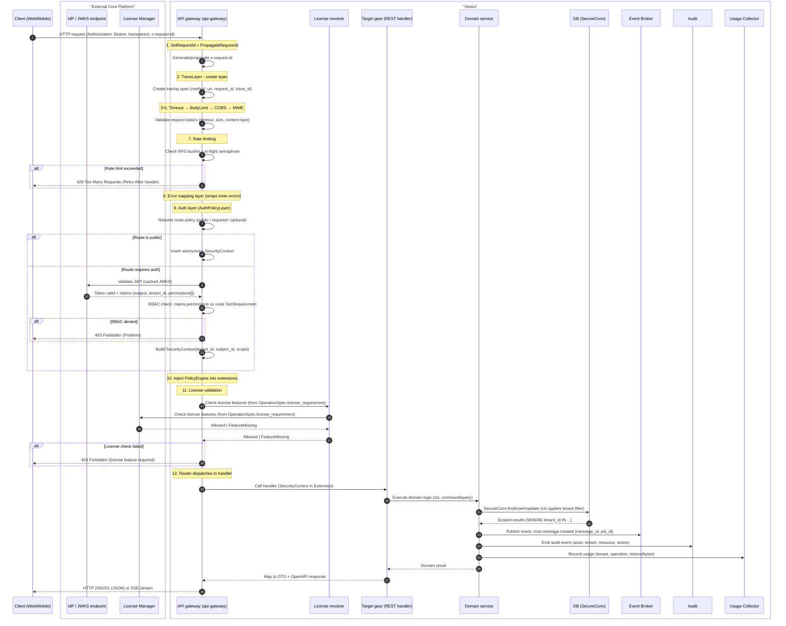

## Sub-scenario - chat hook invocation

Chat hooks allow integrations to intercept internal message/file/search traffic within the chat system. Hooks enable:
- **Blocking**: Return error and stop processing
- **Override**: Modify content before proceeding

### Hook types

| Hook ID | Trigger point | Capabilities | Use case |
|---------|---------------|--------------|----------|
| `gts.cf.genai.flow.hook.v1~x.genai.chat.user_message_pre_store.v1~` | After user message submitted, before DB store | BLOCK, OVERRIDE | DLP: scan outgoing content |
| `gts.cf.genai.flow.hook.v1~x.genai.file.post_parse.v1~` | After file content parsed | INFORMATIVE | Audit, classification |
| `gts.cf.genai.flow.hook.v1~x.genai.llm.pre_call.v1~` | Before final message goes to LLM | BLOCK, OVERRIDE | Content filtering, PII redaction |
| `gts.cf.genai.flow.hook.v1~x.genai.llm.post_response.v1~` | After LLM response, before DB store | BLOCK, OVERRIDE | Response filtering |
| `gts.cf.genai.flow.hook.v1~x.genai.search.pre_request.v1~` | Before search request (RAG or WebSearch) | BLOCK, OVERRIDE | Query sanitization |
| `gts.cf.genai.flow.hook.v1~x.genai.search.post_response.v1~` | After search response received | BLOCK, OVERRIDE | Result filtering |

All the hook types are registered in GTS and can be enabled/disabled per tenant/user by customers or integrations. All the registered hooks will be executed in the priority order.

### Hook invocation flow

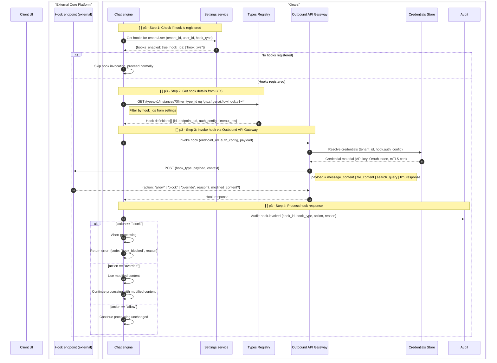

### Hook payload examples

**user_message.pre_store:**
```json
{
  "hook_type": "gts.cf.genai.flow.hook.v1~x.genai.chat.user_message_pre_store.v1~",
  "payload": {
    "message_id": "msg_123",
    "content": "Please analyze this financial report",
    "attachments": [{"file_id": "file_456"}]
  },
  "context": {"tenant_id": "...", "user_id": "...", "conversation_id": "..."}
}
```

**llm.pre_call:**
```json
{
  "hook_type": "gts.cf.genai.flow.hook.v1~x.genai.chat.llm_pre_call.v1~",
  "payload": {
    "messages": [...],
    "tools": [...],
    "model": "gpt-4",
    "estimated_tokens": 4500
  },
  "context": {"tenant_id": "...", "conversation_id": "..."}
}
```

## Typical chat scenario with ASYNCHRONOUS file attachment processing

> NOTE: This is target architecture and not the current state of the codebase. Some components and scenarios steps are not yet implemented.

This scenario follows patterns from **LangChain/LangGraph** (agent loop, state machine) and **Rig** (Rust AI framework):
- **ReAct pattern**: Reason → Act → Observe loop for tool calls
- **Streaming-first**: SSE for real-time token delivery
- **Async file processing**: Background jobs for parsing/indexing

**Steps:**
1. User uploads file + sends message (file stored, job enqueued) — **Hook: user_message.pre_store**
2. File processed asynchronously (parse → chunk → embed → index) — **Hook: file.post_parse**
3. RAG retrieval from indexed documents — **Hooks: search.pre_request, search.post_response**
4. WebSearch for real-time information (if enabled) — **Hooks: search.pre_request, search.post_response**
5. Agent state preparation (tools + prompt + model + token budget) — **Hooks: llm.pre_call**
6. Agent loop + SSE streaming — **Hooks: llm.pre_call, llm.post_response**

### Step 1/6 - Upload file + send message (async processing)

File upload stores the blob, then **Chat Engine orchestrates** job creation. The UI tracks job progress via SSE or polling before proceeding.

**Key architectural points:**
- API gateway remains simple (middleware + routing only)
- **Chat Engine** owns orchestration — it triggers the **Jobs Manager**
- UI must wait for job completion before file content is usable

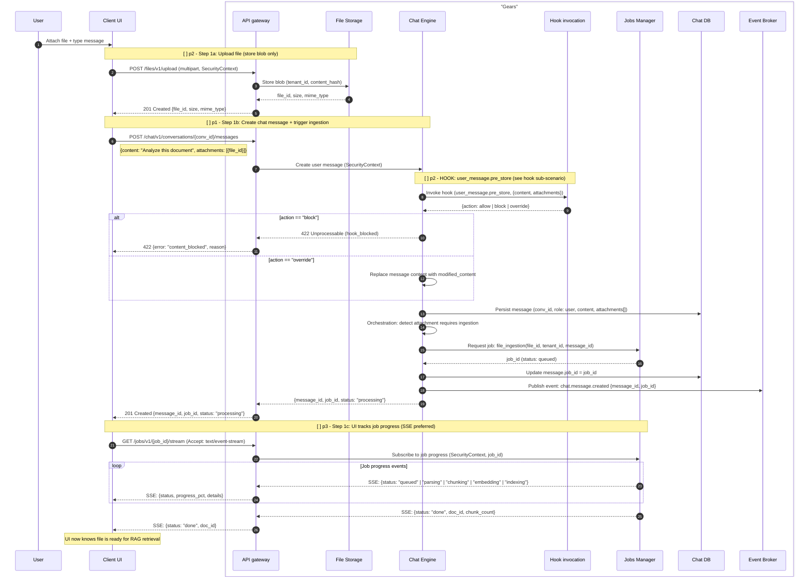

### Step 2/6 - File ingestion pipeline (background job)

 The **Jobs Manager** executes the file ingestion pipeline asynchronously, emitting progress events for UI tracking. When complete, **Chat Engine** proceeds with RAG retrieval.

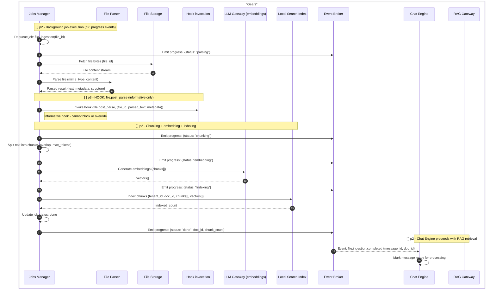

### Step 3/6 - RAG retrieval from indexed documents

Retrieve relevant context from indexed documents using hybrid search (vector + keyword).

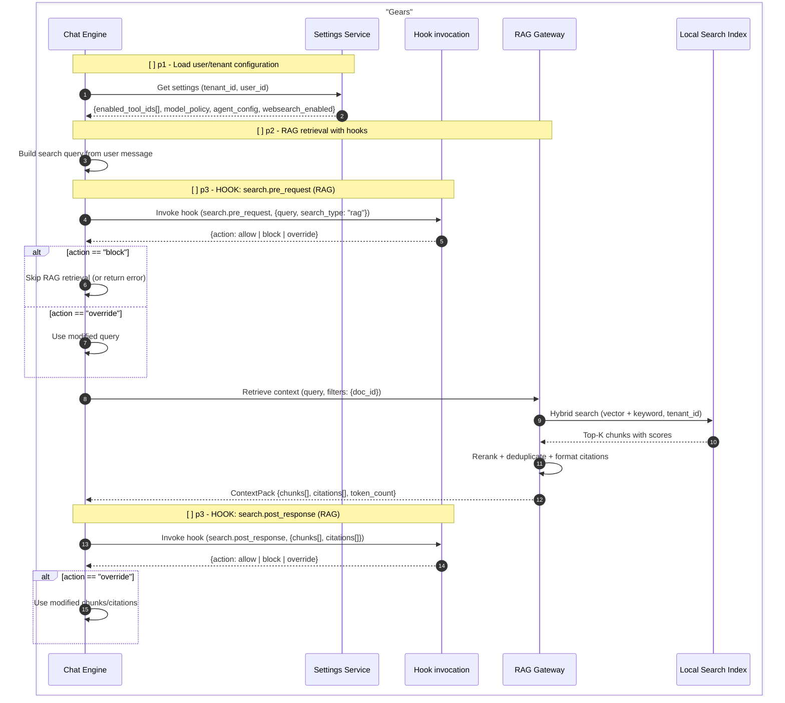

### Step 4/6 - WebSearch for real-time information (if enabled)

When WebSearch is enabled, query external search engines for real-time information. Results are merged with RAG context.

**WebSearch best practices:**
- Query rewriting (LLM-assisted or rule-based)
- Result deduplication with RAG context
- Source URL attribution for citations

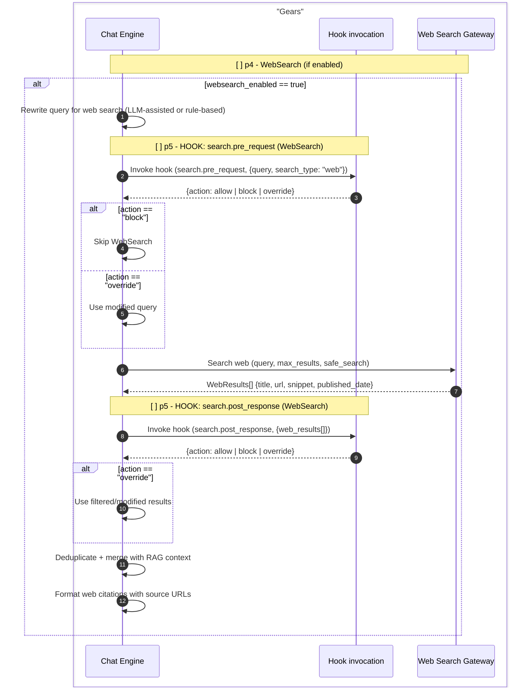

### Step 5/6 - Agent state preparation (tools + prompt + model + token budget)

Prepare the full agent state before LLM invocation.

**Key rules:**
- **No runtime tool validation** via MCP (too slow) — rely on GTS-registered definitions
- **Token budget check** before LLM call — reject or mitigate if context too large

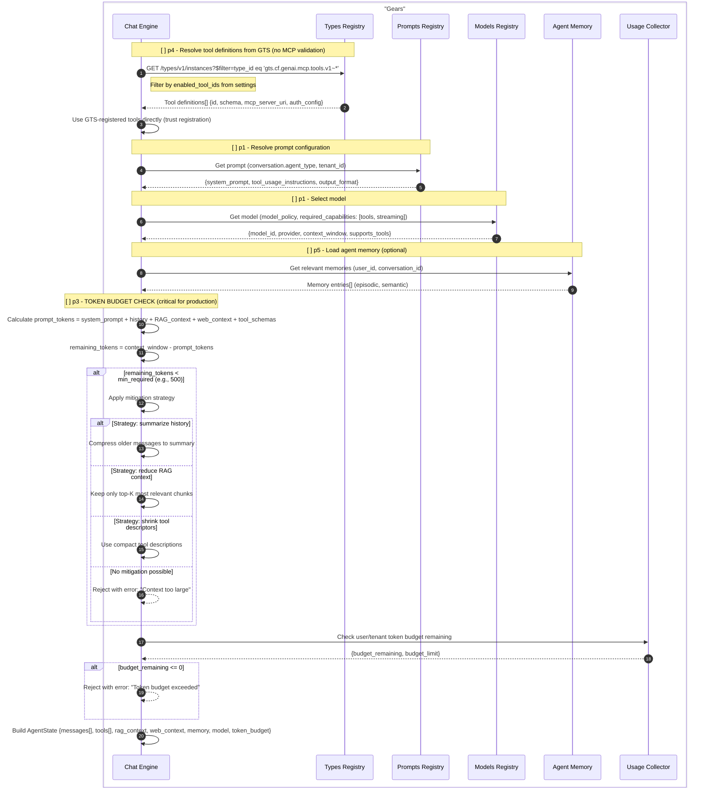

### Step 6/6 - ReAct agent loop + SSE streaming

This implements the **ReAct pattern** (Reason + Act): the agent iteratively calls the LLM, executes any requested tools, and feeds results back until the LLM produces a final answer.

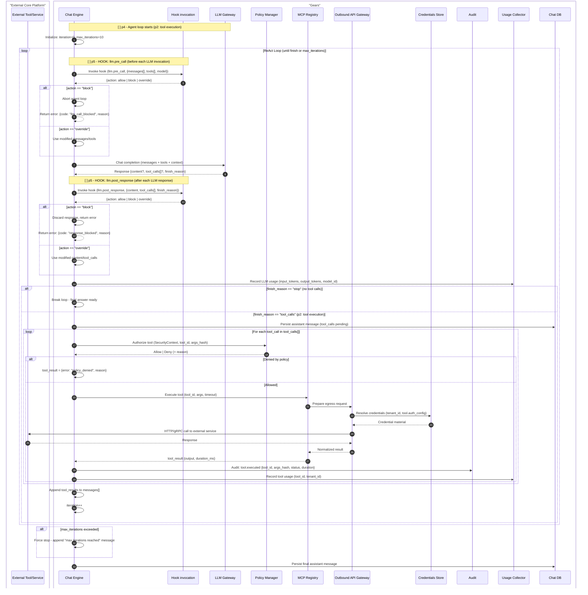

#### SSE streaming with throttling (continuation of Step 6/6)

The final answer is streamed to the client using **Server-Sent Events (SSE)**. The Chat engine uses ToolKit's `SseBroadcaster` for efficient fan-out.

**Key rules:**
- **SSE throttling**: If user/tenant consumes too many tokens, slow down or terminate stream
- Track token budget in real-time during streaming

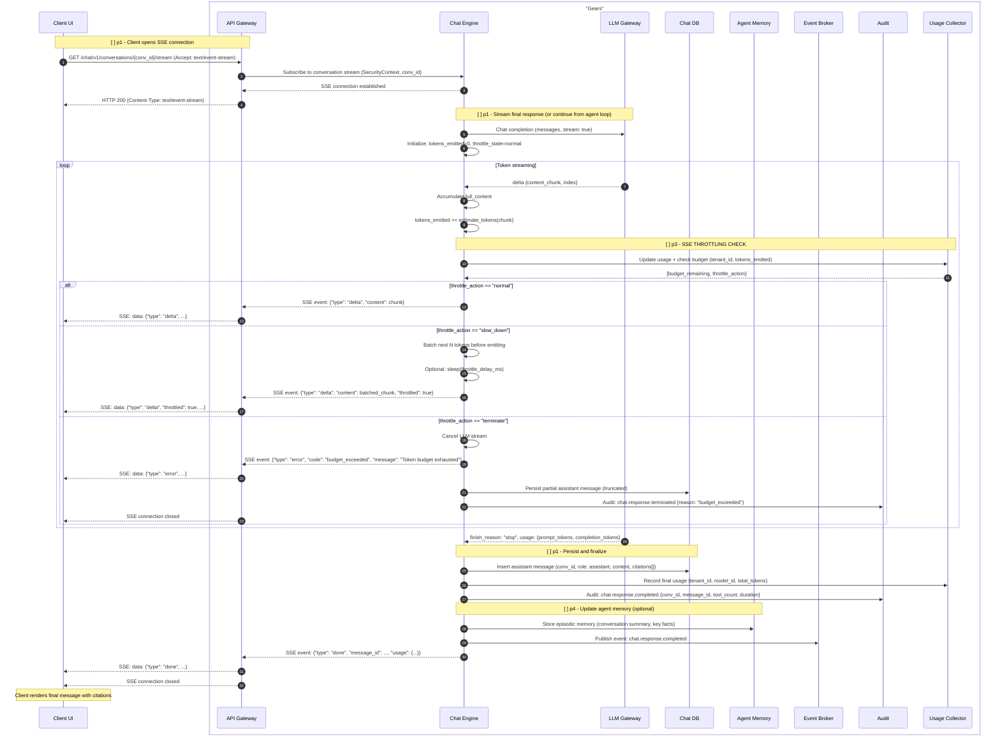


## Typical chat scenario with SYNCHRONOUS file attachment w/o RAG and WebSearch processing

This is a **simpler** alternative version of the async scenario:
- **No Jobs Manager** — file is parsed immediately during the request
- **No RAG** — file content is injected directly into chat context
- **No WebSearch** — no external search engines are used
- Aligned with current Go implementation (`/chat/threads/{thread_id}/attachment` and `/chat/attachments`)

**Steps:**
1. User uploads file → synchronous parse → create "file attachment message" — **Hook: file.post_parse**
2. User sends message — **Hook: user_message.pre_store**
3. Prepare agent state + agent loop + SSE streaming — **Hooks: llm.pre_call, llm.post_response** (same as async Steps 5-6)

### Step 1/3 - Upload file + synchronous parse + create attachment message

File is uploaded, parsed immediately (using File Parser), and a **file attachment message** is created with the parsed/truncated content. No background job, no RAG indexing, no WebSearch.

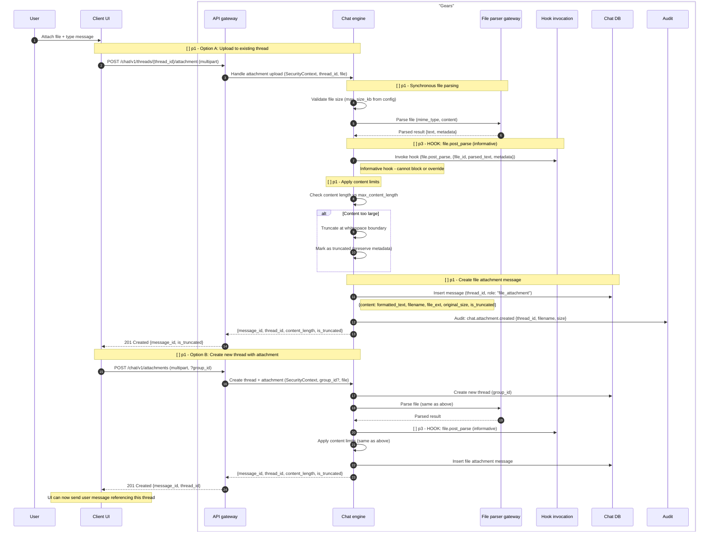

### Step 2/3 - Send user message + prepare agent state

After the file attachment message exists, user sends their actual question. Chat Engine prepares agent state with file content included in context.

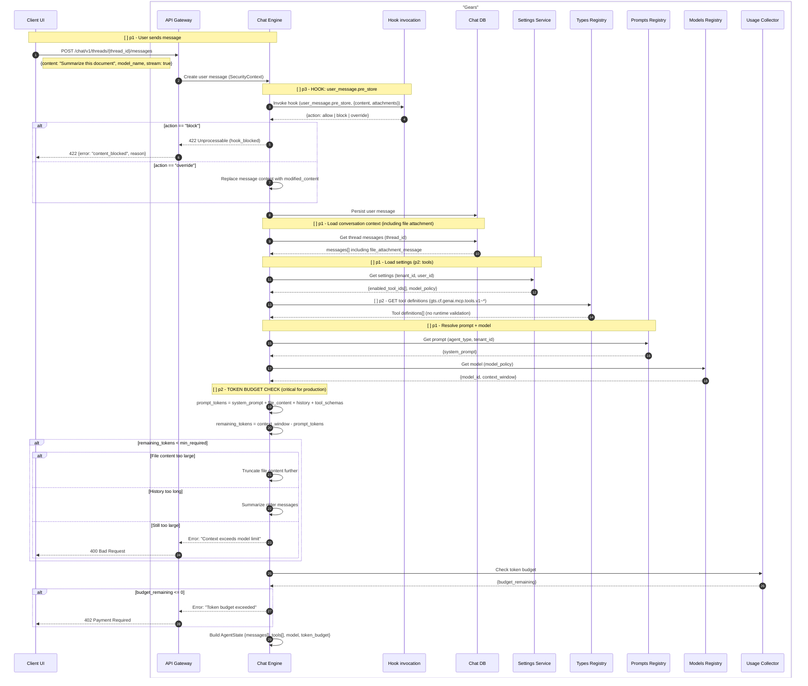

### Step 3/3 - Agent loop + SSE streaming (same as async Step 6/6)

For the agent loop and SSE streaming, refer to the **async scenario Step 6/6** above. The flow is identical:
1. ReAct agent loop (LLM call → tool execution → repeat)
2. SSE streaming with throttling

The only difference is that the context includes the **full file attachment content** (possibly truncated) directly in messages, rather than RAG-retrieved chunks with citations.
