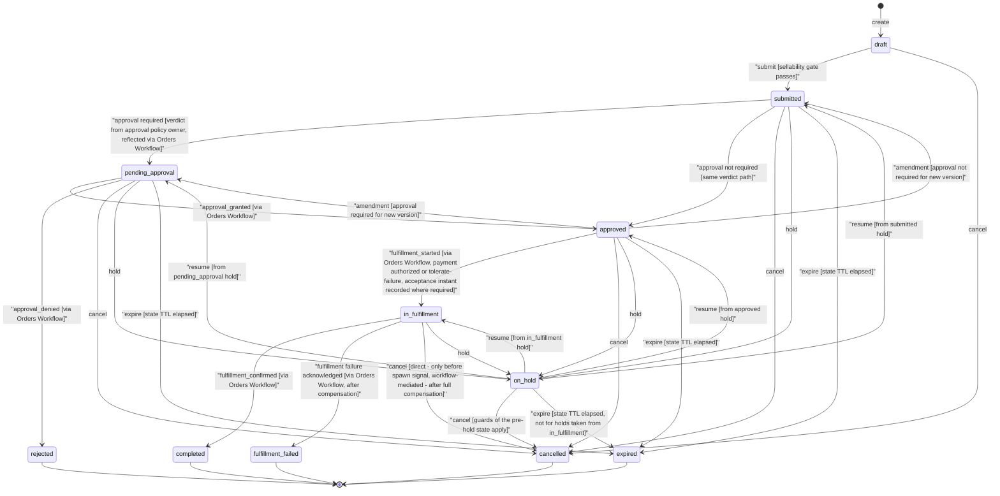

---
refs:
  - bss/manifest/vz-arch-manifest-bss-only.md
  - bss/prd/PRD-billing-ledger-balances-202604041200
  - bss/prd/PRD-contracts-agreements-202601120119
  - bss/prd/PRD-orders-workflow-202608111157
  - bss/prd/PRD-plan-price-modeling-202605281200
  - bss/prd/PRD-product-catalog-marketplace-202601120119
  - bss/prd/PRD-product-sku-management-202606101924
  - bss/prd/PRD-subscriptions-entitlements-202601120119
  - bss/prd/PRD-tariffs-pricing-logic-202604011200
---

Created:  2026-08-21 by Virtuozzo International GmbH
Updated:  2026-09-01 by Virtuozzo International GmbH

# PRD — Orders Lifecycle

<!-- toc -->

- [1. Overview](#1-overview)
  - [1.1 Purpose](#11-purpose)
  - [1.2 Background / Problem Statement](#12-background--problem-statement)
  - [1.3 Goals (Business Outcomes)](#13-goals-business-outcomes)
  - [1.4 Glossary](#14-glossary)
- [2. Architecture Alignment](#2-architecture-alignment)
- [3. Actors](#3-actors)
  - [3.1 Human Actors](#31-human-actors)
  - [3.2 System Actors](#32-system-actors)
- [4. Operational Concept & Environment](#4-operational-concept--environment)
  - [4.1 Module-Specific Environment Constraints](#41-module-specific-environment-constraints)
- [5. Scope](#5-scope)
  - [5.1 In Scope](#51-in-scope)
  - [5.2 Out of Scope](#52-out-of-scope)
- [6. Functional Requirements](#6-functional-requirements)
  - [6.1 Order Document and State](#61-order-document-and-state)
  - [6.2 Versioning and Amendment](#62-versioning-and-amendment)
  - [6.3 Cancellation and Hold](#63-cancellation-and-hold)
  - [6.4 Boundary with Orders Workflow and Subscriptions (R1–R5)](#64-boundary-with-orders-workflow-and-subscriptions-r1r5)
  - [6.5 Event Publication](#65-event-publication)
  - [6.6 Authorization](#66-authorization)
- [7. Non-Functional Requirements](#7-non-functional-requirements)
  - [7.1 NFR Inclusions](#71-nfr-inclusions)
  - [7.2 NFR Exclusions](#72-nfr-exclusions)
- [8. Five Quality Vectors Analysis](#8-five-quality-vectors-analysis)
- [9. Public Library Interfaces](#9-public-library-interfaces)
  - [9.1 Public API Surface](#91-public-api-surface)
  - [9.2 External Integration Contracts](#92-external-integration-contracts)
- [10. Use Cases](#10-use-cases)
  - [UC-001 — Partner Places New Acquisition Order](#uc-001--partner-places-new-acquisition-order)
  - [UC-002 — Amendment Before Approval](#uc-002--amendment-before-approval)
  - [UC-003 — Order Cancelled During Approval](#uc-003--order-cancelled-during-approval)
  - [UC-004 — Fulfillment Completion Spawning Subscription](#uc-004--fulfillment-completion-spawning-subscription)
- [11. User Interaction and Design](#11-user-interaction-and-design)
- [12. Acceptance Criteria](#12-acceptance-criteria)
  - [Order Creation and Submission](#order-creation-and-submission)
  - [Amendment and Versioning](#amendment-and-versioning)
  - [Cancellation and Hold](#cancellation-and-hold)
  - [Boundary with Orders Workflow and Subscriptions (R1–R5)](#boundary-with-orders-workflow-and-subscriptions-r1r5)
  - [Tenant Axes](#tenant-axes)
  - [Authorization](#authorization)
  - [Non-Functional Requirements (Show-Stoppers)](#non-functional-requirements-show-stoppers)
- [13. Dependencies](#13-dependencies)
- [14. Assumptions](#14-assumptions)
- [15. Open Questions](#15-open-questions)
- [16. Risks](#16-risks)
- [17. Reference Materials](#17-reference-materials)

<!-- /toc -->

## 1. Overview

### 1.1 Purpose

Orders Lifecycle is the **System of Record (SoR)** for the order document and its finite-state machine in the BSS layer. It owns WHAT was ordered (the order document: line items, parties, pricing references) and the CURRENT state of the order from initial capture through to a terminal state. It feeds the sibling gear **Orders Workflow**, which owns the approval and fulfillment process; once an order is fulfilled, it spawns one or more subscriptions via that workflow.

The Orders boundary is **commercially initiated transactions**: a new acquisition (this phase) and, as a declared later phase, commercially initiated changes to existing subscriptions (quantity change, plan change in either direction) — each order carries a `category` (`new_sale` \| `change`). System-driven transitions (renewal, trial conversion, dunning-driven suspension) are clockwork, stay with Subscriptions, and produce no order.

The order deliberately does double duty as **quote and order** — the draft → submit → approval arc is the pre-commitment lifecycle, and in self-service, submit *is* the commitment. No separate quote artifact is planned: validity/expiry is the per-state TTL (§6.3), negotiated pricing is a contract-scoped override window (Contracts), competing options are N draft orders of which one is accepted, and a configurator is a presentation concern. If CPQ arrives it is a front-end producing a draft order, not a new SoR. User-facing surfaces MAY present the pre-submit state as a "cart"; the artifact remains an order.

The pair "Orders Lifecycle ↔ Orders Workflow" maps to "document ↔ process" — the same separation as "Invoice ↔ Bill-Run" in the billing domain. Orders Lifecycle holds the durable record; Orders Workflow drives the procedural transitions.

### 1.2 Background / Problem Statement

BSS currently has no first-class commercial artifact representing a commercially initiated transaction before it becomes a subscription change. In the canonical gears implementation, subscription `create` is a client-invoked constructor commit — there is no document that captures WHAT was ordered, by WHOM, under WHICH contract (where one exists), at WHICH price, with a complete state and audit trail independent of the downstream subscription. The same gap applies to commercially initiated changes: expanding 10 units to 25 today produces no price pin, no approval gate, and no booking record, while the initial purchase of 10 is fully audited.

Without an order artifact:
- Partners and operators cannot track the status of a new purchase or monitor approval progress.
- Price integrity between catalogue capture and subscription activation is enforced only by convention.
- Amendment, cancellation, and on-hold workflows have no clear ownership.

Orders Lifecycle fills this gap **additively**: it inserts a new commercial document for commercially initiated transactions without breaking the existing subscription lifecycle path, which continues to own system-driven transitions (renewals, trial conversions, dunning-driven suspensions). The change-order path (`category = change`) is phased in after the new-acquisition path, but the boundary is stated now because the state machine, event set, and line model depend on whether a line may target an existing subscription.

**Target users**: Partner admins placing orders for customers; seller operators processing and approving orders; customers viewing their pending orders; and downstream BSS systems (Subscriptions, Contracts, Catalog/Tariffs) that consume order records.

### 1.3 Goals (Business Outcomes)

- Partners and seller operators can place, track, amend, cancel, and hold new commercial acquisitions via a first-class order record with a clear state at all times.
- Every submitted order carries a **catalog price pin** on every line item, fixing the catalog-written segment of the downstream pricing snapshot at submit (zero catalog-drift defects between capture and subscription spawn; the full `pricingSnapshotRef` is sealed downstream at activation and rating time).
- The order's finite-state machine and all transitions are fully audited, with zero duplicate orders or duplicate effects achievable via idempotency keys.
- Orders Workflow can rely on the Lifecycle SoR for order state without maintaining its own authoritative copy, keeping the seam clean and the provisioning path through Subscriptions/OSS unambiguous.
- A new acquisition path integrates into the existing BSS monetization sequence (Order → Subscription → Rating → Billing) without breaking the existing direct-subscription path for system-driven transitions. A **Contract is an optional governing artifact**, not a precondition: it **MAY** be referenced at submit or attached later, and where none is referenced platform defaults govern (§1.4 Order, §6.1 Order Creation). Contract-first and uncontracted entry points are both valid.

### 1.4 Glossary

| Term | Definition |
|------|------------|
| **Order** | A first-class commercial artifact representing a commercially initiated transaction. It is the SoR for WHAT was ordered, by WHOM, and the current order state. An order **MAY** be placed under a Contract — where none is referenced, platform defaults govern commercial terms. When fulfilled, it spawns (or, for the phased `change` category, modifies) subscriptions. |
| **Order Category** | `new_sale` (this phase — every line spawns a new subscription) or `change` (declared, phased — a line targets an existing subscription for a commercially initiated quantity/plan change). The `change` category MUST be rejected until its path ships. |
| **Order Line Item** | A single purchasable unit within an order: references a `skuId`, `planId`, and `priceId`; carries `qty` and a `catalogPricePin`. Multiple line items may appear in one order. Cardinality: one fulfilled line item spawns **exactly one** subscription carrying the line's `qty`. A **bundle plan is one line item**: the bundle is a first-class sellable plan with its own price basis (`sum_of_parts` \| `own_price`), rev-share, and invoice itemization (pricing PRD, gears-rust; see §17) — it is **never expanded** into component lines at capture and spawns one subscription. Non-subscription items (setup fees, hardware, prepaid credit packs) are sold as ordinary lines bound to a **one-time plan** (catalog-supported; Subscriptions bills once at activation) — the MVP route; a dedicated non-subscription line kind is an additive target once a Billing gear exists. |
| **Order Version / Amendment** | From `submitted` onwards, **commercial content** (line items, qty, plan/price refs, tenant axes, dates/term, category) is immutable — a pre-fulfillment change creates a new version of the same order (prior version preserved in history; each version carries a `supersedesVersion` reference) and re-runs the sellability gate. **Administrative content** (external references, display labels, internal notes) MAY be edited in non-terminal states without a version bump; such edits are audited. These are **order-scoped terms**: downstream, `version` is a concurrency counter and the subscription-side counterpart of an amendment is a plan/quantity change with an effective-date envelope. |
| **Catalog Price Pin (`catalogPricePin`)** | The catalog-written segment of the downstream composed `pricingSnapshotRef`, resolvable and frozen at order submission: committed `catalogVersion`, resolved price ids (incl. cohort), and evaluation-policy version. Every submitted order line MUST carry a resolvable catalog price pin. This is what the order captures — nothing more. |
| **pricingSnapshotRef** | The full pricing snapshot is a multi-writer **composite** sealed downstream, not at order submit: the catalog segment is pre-stamped at publish (pricing), the `(currency, region)` binding is frozen by Subscriptions at activation, and overlays/coupons/FX-lock/commitments are added by the rating gear at evaluation time — Rating is the composition SoR (rating PRD §1.4, gears-rust; see §17). Orders Lifecycle never captures or stores the full ref; it captures the catalog price pin only. |
| **Resolved Order Total** | A non-authoritative monetary value (per line and per order) produced by the price-evaluation contract during the sellability gate and captured on the order at submit (refreshed on each amendment). Structure: per line and per order it carries **gross** (list) and **net** (post-discount) figures with an explicit **discount component** and promotion reference where applied; charge-kind decomposition names all four kinds — **recurring** (per billing period), **usage** (no committed amount; excluded from the total, flagged, priced at rating time per the downstream-sealed `pricingSnapshotRef`), **one_time**, and **one_time_setup** (named separately so setup is visible to the buyer). **Tax is not included** — tax computation is owned by the billing chain at invoice time; the total is explicitly pre-tax. The single named figure exposed to approval policy is the **net pre-tax total-contract-value (TCV)**: for each line, `recurring × periods-in-term` (from the line's term duration and billing cycle) + `one_time` + `one_time_setup`, then summed across lines; usage remains excluded. For an **open-ended / rolling** term (no finite `periods-in-term`), the recurring component **MUST** be annualised as `recurring × periods-per-year` of that line's billing cycle (**12** monthly, **4** quarterly, **1** annual) so the threshold figure is defined and two rolling deals that differ only in cycle are comparable; `one_time` and `one_time_setup` are still added once. The per-period recurring amount is still stored in the charge-kind decomposition for display. **TCV is therefore not total deal value** where a line's value is predominantly usage-based: such an order presents a low or zero TCV to approval policy, and the policy owner **MUST NOT** read TCV as the commercial size of the deal. Committed usage amounts are not representable on the line this phase (§15). Which threshold the approval policy owner compares this figure against is owned by that service (Generic Approval), not defined here. Display and approval-context use only; MUST NOT be used as a billing input — billing derives exclusively from the Subscription → Rating → Billing chain. |
| **Sellability Gate** | A fail-closed validation run at order submission (and on each amendment). The catalog predicates are **adopted by reference** from the published pricing sellability gate (pricing PRD, gears-rust — the same gate Subscriptions enforces at create/changePlan); Orders adds its delta: tenant-axes validity, contract-active where referenced, purchase-quantity floor, order-market consistency, single currency, no duplicate lines, overlap-rule uniqueness. Rejection carries a machine-readable business-level reason. |
| **Order Market** | A derived, non-authoritative `(currency, region)` binding computed at submit from the **payer's** commercial profile. Gate currency/region checks are consistency assertions against it; the authoritative binding is frozen by Subscriptions at activation, and divergence at activation is a fulfillment-time rejection. |
| **System of Record (SoR)** | The single authoritative source for a domain object's state and identity. Orders Lifecycle is the SoR for the order document and order state. It is NOT the SoR for subscription state, pricing math, provisioning, or approval execution. |
| **Tenant axes** | The three tenant-ID axes on an order, aligned with BSS manifest §8.2 and the ledger's multi-axis identity: `resourceTenantId` (resource recipient), `payerTenantId` (billing party), `sellerTenantId` (selling party). The **buyer is not a tenant-ID axis** — the placing party is the initiating actor, an authorization/audit attribute covered by the §6.6 delegation-proof requirement. Axes fixed at order submit; payer change only via pre-fulfillment amendment, and where the change crosses seller scope it follows the paired payer/seller rebinding semantics (ownership transfer, manifest §4.11). |
| **Orders Workflow** | The sibling process gear that owns approval execution (routing, gates, escalation via Generic Approval service) and fulfillment orchestration (subscription spawn, provisioning signal via Subscriptions). Orders Lifecycle and Orders Workflow together realize the full Order Management capability. |

## 2. Architecture Alignment

| **Field** | **Value** |
|-----------|----------|
| **Applicable Manifest(s)** | BSS |
| **Relevant Chapters** | §4.6 Contracts and Agreements — §4.6.1 Orders (sub-area); §2.1.2 (BSS boundary: MUST NOT mutate OSS topology / bypass Policy Engine); §2.4 Domain model (Order aggregate — additive); §3.1 Capability inventory (Orders sub-area row — additive); §6 BSS↔OSS interlocks and canonical monetization sequence; §8.2 Tenant axes (`resourceTenantId` / `payerTenantId` / `sellerTenantId`; the initiating actor is an audit attribute, not an axis) |

> **Normative alignment**: This PRD introduces an additive Orders sub-area under BSS manifest §4.6 (Contracts and Agreements). The architecture-repo BSS manifest already records: (a) an Orders sub-area in §4.6 recognizing Order as a commercial artifact placed under a Contract; (b) an Orders capability row in §3.1; (c) an Order aggregate in §2.4; and (d) amendments to §4.6 (snapshotting invariant, signing flow, consumers) and the §2.1.5 value stream so the pre-existing direct `ContractSigned → Subscription` narrative is explicitly scoped to system-driven transitions while the new-acquisition path routes through Orders. This PRD MUST NOT contradict: (a) BSS manifest §2.1.2 — BSS MUST NOT mutate OSS topology or bypass the Policy Engine; (b) Contracts PRD as SoR for contract terms; (c) Subscriptions as SoR for subscription state post-fulfillment; (d) pricing/Rating as SoR for price data, the catalog price pin, and the composed `pricingSnapshotRef` semantics (composition SoR: Rating).

> **Terminology note**: the pricing-domain name "Tariffs" used by architecture-repo kit artifacts maps to the **rating** gear (evaluation core) in the canonical gears sources; "Plan & Price / Catalog" maps to **pricing**, and "Product/SKU" to **products** (see §17 for revision-pinned citations). `draft`, `version`, and `amendment` are **order-scoped terms** in this PRD — downstream, `draft` is a subscription status that has already passed the gate, `version` is a concurrency counter, and the subscription-side counterpart of an amendment is an effective-dated plan/quantity change. Renaming the architecture-repo Tariffs PRD is tracked separately and is out of scope for this PRD. Until that rename, newly authored prose in this PRD **MUST** use "price-evaluation / rating" rather than introducing additional "Tariffs" occurrences beyond the file path and this mapping note.

> **Insertion point (normative):** Orders Lifecycle inserts a commercial document for **commercially initiated transactions** — new acquisitions now (`category = new_sale`), commercially initiated changes as a declared later phase (`category = change`). It does NOT intercept **system-driven** transitions of existing subscriptions (renewal, trial conversion, dunning-driven suspension), which remain owned by Subscriptions and produce no order. Factual basis (verified against the canonical gears sources, §17): subscription `create` is a **client-invoked constructor commit** — there is no `ContractSigned`-driven creation chain to preserve (the event appears in diagrams as an inbound expectation with no emitter). Orders is therefore the additive **caller-of-record** for commercially initiated creates; the open question is who calls `create` today and whether that call carries an order reference (§15). This coexistence is intentional and is stated reciprocally in Orders Workflow (`PRD-orders-workflow-202608111157`, §5.2 and §14).

## 3. Actors

> **Note**: Stakeholder needs are managed at project/task level. This section documents actors that interact with Orders Lifecycle.

### 3.1 Human Actors

#### Partner Admin

**ID**: `cpt-cf-bss-orders-lifecycle-actor-orders-partner-admin`

**Role**: Places orders for customers within their managed tenancy. Manages draft orders, submits them for processing, initiates amendments and cancellations before fulfillment.
**Needs**: Create and submit orders; track order state; amend or cancel pending orders; view order history.

#### Direct Customer

**ID**: `cpt-cf-bss-orders-lifecycle-actor-orders-direct-customer`

**Role**: Views their own pending and completed orders; may place self-service orders on platforms that allow it.
**Needs**: Read-only visibility of order state and history; receipt of order status change notifications.

#### Seller Operator

**ID**: `cpt-cf-bss-orders-lifecycle-actor-orders-seller-operator`

**Role**: Processes and monitors orders on behalf of the seller; applies holds; views all orders within the seller tenancy; coordinates with approval workflows.
**Needs**: Full read access to all orders within seller scope; ability to apply hold/resume; visibility of approval state.

### 3.2 System Actors

#### Orders Workflow

**ID**: `cpt-cf-bss-orders-lifecycle-actor-orders-workflow`

**Role**: The sibling process gear that drives order state transitions by calling Orders Lifecycle idempotently. Receives the "approved, ready for fulfillment" signal from Lifecycle and orchestrates subscription creation and provisioning. MUST NOT maintain authoritative order state — Lifecycle is the SoR.
**Integration direction**: Bidirectional — Workflow reads order state from Lifecycle and calls Lifecycle to drive transitions; Lifecycle emits state-change events consumed by Workflow.

#### Catalog and Pricing

**ID**: `cpt-cf-bss-orders-lifecycle-actor-orders-catalog-pricing`

**Role**: Supplies published SKU, plan, price, and catalog-pin data consumed during sellability validation and order capture. Orders Lifecycle MUST reference only published SKU/plan/price data from this source.
**Integration direction**: Inbound to Orders Lifecycle (consumed).

#### Contracts

**ID**: `cpt-cf-bss-orders-lifecycle-actor-orders-contracts`

**Role**: SoR for contract terms and pricing overrides. An order **MAY** reference a contract; where none is referenced, platform defaults govern. Where a contract is referenced, its terms apply. Orders Lifecycle reads contract status and terms at order creation and submit when a `contractId` is present.
**Integration direction**: Inbound to Orders Lifecycle (consumed).

#### Subscriptions

**ID**: `cpt-cf-bss-orders-lifecycle-actor-orders-subscriptions`

**Role**: Receives the fulfilled-order signal from Orders Workflow and creates the subscription(s). From that point, Subscriptions is the SoR for subscription state. Orders Lifecycle is NOT responsible for subscription lifecycle after spawn.
**Integration direction**: Outbound from Orders Lifecycle (event produced, consumed downstream by Workflow → Subscriptions).

#### IdP / Account Management

**ID**: `cpt-cf-bss-orders-lifecycle-actor-orders-idp-ams`

**Role**: Supplies tenant identity and party eligibility data consumed during sellability validation. The three tenant axes and the initiating actor on the order are verified against this source at submit.
**Integration direction**: Inbound to Orders Lifecycle (consumed).

## 4. Operational Concept & Environment

### 4.1 Module-Specific Environment Constraints

No module-specific deviations — project defaults apply.

## 5. Scope

### 5.1 In Scope

| **Feature** | **Priority** | **Notes** |
|-------------|-------------|-----------|
| Order document capture: line items referencing `skuId`/`planId`/`priceId` + `qty` + `catalogPricePin`; tenant parties (`resourceTenantId`, `payerTenantId`, `sellerTenantId`) + initiating actor | `p1` | SoR for order content; commercial content immutable from `submitted` onwards |
| Order state machine: draft → submitted → pending_approval → approved → in_fulfillment → completed; terminals cancelled / rejected / fulfillment_failed / expired; pausable via on_hold (resumable to the pre-hold state) per guards | `p1` | Full state machine with guards, idempotent transitions, audit on every transition |
| Order category: `new_sale` (this phase) / `change` (declared, phased — a line will target an existing subscription) | `p1` | Boundary = commercially initiated transactions (§1.1); `change` rejected until its path ships |
| Sellability gate at submit: pricing gate adopted by reference + Orders delta (tenant axes, contract-active where referenced, purchase floor, order-market consistency, single currency, no duplicate lines, overlap uniqueness) | `p1` | Fail-closed; machine-readable business-level rejection reason |
| Non-authoritative resolved total: per-line and order gross/net pre-tax figures (discount component, four charge kinds, usage excluded) produced by the price-evaluation domain at submit (refreshed on each amendment), stored for display; the named TCV figure is passed in the approval-request context | `p1` | Explicitly NOT a billing input; all price math stays in the price-evaluation domain (R4); threshold evaluation owned by Generic Approval |
| Order identity / numbering / versioning: order ID, human-readable number, version counter; amendment creates new version, prior preserved | `p1` | Idempotency key per operation |
| Amendment workflow: new version before fulfillment starts; triggers sellability re-run; amendment after `approved` returns to appropriate pre-approval state | `p1` | Immutable from `in_fulfillment` onwards |
| Hold and resume: `on_hold` pause from `submitted` / `pending_approval` / `approved` / `in_fulfillment`; resumable | `p2` | Seller operator and workflow may apply hold |
| State expiry: configurable TTL per in-flight state (`submitted`, `pending_approval`, `approved`, `on_hold`) with automatic transition to `expired` and `OrderExpired` publication | `p1` | `in_fulfillment` is never auto-expired — overdue fulfillment escalates via Orders Workflow |
| Audit / history: full transition log, every version retained, actor and timestamp on each event | `p1` | 100% completeness requirement |
| Event publication: the eleven order lifecycle events per §6.5 (`OrderSubmitted`, `OrderAmended`, `OrderApproved`, `OrderRejected`, `OrderCompleted`, `OrderFulfillmentFailed`, `OrderCancelled`, `OrderExpired`, `OrderAcceptanceRecorded`, `OrderHeld`, `OrderResumed`) with idempotent consumer semantics and payload sufficiency | `p1` | No wire-format specification — shapes in Design |
| Line dates (contract-effective mandatory; service-activation, customer-acceptance due date with cascading defaults), term duration and billing cycle as quoted | `p1` | Mixed dates wait for expected fulfillment time; deferred lines start at actual activation, not backdated; deferral visible on read/Preview |
| Payment authorization as a begin-fulfillment precondition (tolerate-failure per seller policy) | `p1` | Mechanism owned by Payments; credit scoring out of scope |
| Order preview: gate + resolved total (incl. named TCV) with no state created; indicative tax returned, not stored; mixed-date deferral visible | `p2` | Basket lines MUST carry term duration and billing cycle; does not return an approval verdict (R2) |
| Buyer acceptance: self-service submit = acceptance; partner-placed orders record a customer-acceptance instant (`OrderAcceptanceRecorded`); gates fulfillment when required | `p1` | Acceptance-required flag from contract, else platform default; instant is never defaulted |
| Seam rules R1–R5: Workflow boundary (R1–R5, see §6.4) including no mirroring of the downstream TransitionRequest machine (R5) | `p1` | Explicit MUST-level requirements |
| Order console for partner admin + customer order view (UX surface, details in §11) | `p2` | Mockup column `—` |

### 5.2 Out of Scope

- **Process orchestration, approval execution, provisioning** → Orders Workflow (sibling gear; see `PRD-orders-workflow-202608111157`).
- **Pricing math and price resolution** → price-evaluation domain (`PRD-tariffs-pricing-logic-202604011200`; maps to the rating gear — Terminology note, §2); Orders captures refs only.
- **Subscription lifecycle** → Subscriptions (`PRD-subscriptions-entitlements-202601120119`); Orders spawns subscriptions but does not manage them.
- **Actual provisioning** → OSS Provisioning, accessed only through the subscription path.
- **Approval decision logic, routing, escalation** → Generic Approval service, invoked by Orders Workflow; Lifecycle reflects state only.
- **CPQ / formal Quote** — configure-price-quote and customer-facing offer configurators are out of scope, consistent with the Contracts PRD. The order deliberately does double duty as quote and order (§1.1); negotiated pricing is a **contract-scoped override window** (Contracts draft), not a quote function — this exclusion does not mean negotiated pricing is impossible. The quote-to-order question is closed (§15).
- **Billing and invoicing of orders** — orders are never billed directly. The invariant is scoped to **recurring and usage revenue** via the Subscription → Rating → Billing chain; the documented exception is at-sale money (one-time plans, commitment and prepaid-pool sales), which is emitted by Subscriptions at activation and posted by Billing — still never by Orders.
- **Commercial returns / credit memos** — not an order `category` and not an order terminal. A post-`completed` reversal is a billing-chain artifact (credit note / ChargeAdjustment); its approval path and audit trail live on that artifact, not on the order. The credit-note language in §6.1 is scoped to compensating **failed** fulfillment, not to a buyer return.
- **System-driven subscription transitions** (renewal, trial conversion, dunning-driven suspension) → remain owned by Subscriptions; they produce no order. **Renewal price** is governed by contract and the spawned subscription — never by the order or the acquisition `catalogPricePin`. **Commercially initiated changes** (quantity change, plan change) are inside the Orders boundary by design — the change-order path (`category = change`) is phased in after the new-acquisition path (§15).
- **Add-on selection at order capture** — the order line carries `skuId`, `planId`, `priceId`, `qty`, and the catalog price pin; it does **not** express which plan-scoped add-ons were selected against a base plan. Add-on rules are authored in the pricing gear and composed on the subscription (`AddOn`) downstream; ordering a plan **with** add-ons is not modeled this phase, and the submit gate therefore evaluates no add-on bounds (§6.1). Tracked in §15.
- **Deferred execution** ("submit now, execute later" scheduling of the order itself) — out of scope; distinct from a future-dated service start, which is supported per line (§6.1 Line Dates).
- **Booking-time commercial metrics** (recurring-revenue deltas, total contract value, quantities) — derived downstream by Analytics/DWH from order events; `OrderCompleted` carries the per-line net components as the data source. Orders owns no metrics.

## 6. Functional Requirements

> **Testing strategy**: All requirements verified via automated tests (unit, integration, e2e) unless otherwise noted.

### 6.1 Order Document and State

#### Order Creation and Document Capture

- [ ] `p1` - **ID**: `cpt-cf-bss-orders-lifecycle-fr-order-create`

The system **MUST** allow creation of an order in `draft` state by a Partner Admin, Seller Operator, or (self-service) Direct Customer. An order **MUST** carry: a category (`new_sale` \| `change` — the `change` category is declared for the phased change path and **MUST** be rejected until that path ships, §1.1); one or more line items each referencing a `skuId`, `planId`, `priceId`, and `qty`; the three tenant axes (`resourceTenantId`, `payerTenantId`, `sellerTenantId`); and the initiating actor, recorded for audit and delegation-proof purposes (§6.6). An order **MAY** reference an active contract (`contractId`); where none is referenced, **platform defaults** govern commercial terms — uncontracted subscriptions on platform defaults are a first-class downstream state, and self-service orders typically carry no contract. Basket composition: an order is a **single-currency** basket (enforced at submit, §Sellability Gate); line items **MAY** differ in billing frequency — each spawned subscription owns its own billing cycle; all lines share the order's tenant axes, in particular a single `payerTenantId`. A `draft` order **MAY** be modified freely before submission. The order and each line **MAY** carry an optional **external reference** (e.g. a purchase-order number) for buyer-side accounts-payable reconciliation — administrative content (editable without a version bump, audited, §6.2) that **MUST** propagate to billing documents. The system **MUST** assign a unique order identity (`orderId`) and a human-readable order number at creation.

**Rationale**: The draft state enables basket/pre-submit workflows without triggering validation, matching the CPQ gap decision.

**Actors**: `cpt-cf-bss-orders-lifecycle-actor-orders-partner-admin`, `cpt-cf-bss-orders-lifecycle-actor-orders-seller-operator`, `cpt-cf-bss-orders-lifecycle-actor-orders-direct-customer`

#### Line Dates, Term, and Billing Cycle

- [ ] `p1` - **ID**: `cpt-cf-bss-orders-lifecycle-fr-order-line-dates`

Each line item **MUST** carry a **contract-effective date** (mandatory; defaults to submit time) and **MAY** carry a **service-activation date** and a **customer-acceptance due date**, with cascading defaults from the contract-effective date; a tenant-level policy switch governs whether the latter two calendar fields are required. The due date is a calendar field ("when acceptance is due") and **MUST NOT** be treated as recorded assent — it never satisfies the customer-acceptance instant (§6.1 Buyer Acceptance). "When access begins" and "when billing begins" are independent axes. Mixed service-activation dates on one order **are permitted** and do **not** produce staggered live subscriptions: the activation wave waits until **expected fulfillment time** (`max(now, latest service-activation date among lines)`) — no line is activated while another still waits on its date. This PRD does not add a waiting state. The overdue SLA in §6.3 is measured from that instant, not from begin-fulfillment. Direct cancel remains available until the first activation intent of that wave (§6.3). When that barrier defers a line past its quoted service-activation date, the **spawned subscription's start MUST be the actual activation instant** (expected fulfillment time): billing and entitlement **MUST NOT** be backdated to the earlier quoted date. The quoted service-activation date **MUST** remain on the order as the requested date. If it is earlier than expected fulfillment time, order read and Preview **MUST** show the deferral per line. Each line **MUST** also record the **term duration** and **billing cycle** the price was quoted against (a one-year commitment and a monthly rolling deal MUST be distinguishable on the order). Auto-renewal **election**, term windows, and the notice ladder remain **contract-governed** (or platform defaults): they are **read and displayed** on the order, never authored by it. **Renewal price** is likewise governed by contract and the spawned subscription — never by the order; the `catalogPricePin` is the acquisition pin, not a renewal-price election. The line MUST NOT become a second authority for either. Authoritative line fields for the spawned subscription: plan/price references, `qty`, term duration, billing cycle, and the service dates as **requested**. When activation is deferred by the mixed-date barrier, the subscription **start** is the actual activation instant (expected fulfillment time), not the earlier quoted service-activation date. Whether a missing required date holds the order in a distinct waiting state is flagged for Design (§15).

**Rationale**: Without dates a future service start is inexpressible; without term/cycle the quoted commercial shape of the deal is lost between order and subscription.

**Actors**: `cpt-cf-bss-orders-lifecycle-actor-orders-partner-admin`, `cpt-cf-bss-orders-lifecycle-actor-orders-seller-operator`, `cpt-cf-bss-orders-lifecycle-actor-orders-contracts`

#### Payment Authorization Precondition

- [ ] `p1` - **ID**: `cpt-cf-bss-orders-lifecycle-fr-order-payment-auth`

Entering fulfillment (`approved` → `in_fulfillment`) **MUST** be preceded by a **payment-authorization check** for the payer (mechanism owned by the Payments capability; consumed by Orders Workflow as a begin-fulfillment precondition). A seller **MAY** configure a tolerate-failure policy — fulfillment proceeds on authorization failure with the risk flagged on the order and audited. Credit scoring is out of scope and stays out of scope.

**Rationale**: Without a money gate at order time, a non-paying tenant receives resources and the failure surfaces later as dunning over consumed capacity, routing into the expensive compensation path.

**Actors**: `cpt-cf-bss-orders-lifecycle-actor-orders-workflow`

#### Buyer Acceptance

- [ ] `p1` - **ID**: `cpt-cf-bss-orders-lifecycle-fr-order-acceptance`

In **self-service**, submit by the buyer **constitutes acceptance** and **MUST** be recorded as such (no separate field). On the **partner-placed** path, the order evidences delegation (the right to act) but not agreement to the purchase: a **customer-acceptance instant** **MUST** be recordable as a first-class fact, publishing `OrderAcceptanceRecorded`. The "acceptance required" flag is sourced from the contract where one exists (platform default otherwise). When acceptance is required, the order **MUST NOT** enter `in_fulfillment` until the acceptance instant is recorded. The instant **MUST NOT** be defaulted under any policy — including cascading defaults that fill the line-level customer-acceptance due date.

**Rationale**: In a dispute over a partner-placed order there is otherwise nothing showing the customer agreed to the purchase; acceptance is also where the quote/order conflation (§1.1) resolves into commitment.

**Actors**: `cpt-cf-bss-orders-lifecycle-actor-orders-partner-admin`, `cpt-cf-bss-orders-lifecycle-actor-orders-direct-customer`

#### Order Submission and Sellability Gate

- [ ] `p1` - **ID**: `cpt-cf-bss-orders-lifecycle-fr-order-submit`

The submit gate **MUST** adopt the published **pricing sellability gate by reference** (pricing PRD, gears-rust — see §17: committed catalog version, lifecycle-not-retired, per-market GA, registry `sellable`, active windows, full conjunction over every scope key the purchase binds; the same gate Subscriptions enforces at `create`/`changePlan`) and validate, fail-closed, the **Orders-specific delta**: (a) all tenant axes are valid against IdP/AMS; where a `contractId` is referenced, it resolves to an active contract (party-eligibility policy is owned by Contracts — a newly drafted capability with no implementation yet — and is consulted only when a contract is referenced); (b) `qty` on each line satisfies the purchase-quantity floor where the price row declares one (`minQtyThreshold` of type `purchase`) and the declared bounds on one-time plans — **add-on selection is not modeled on the order line this phase** (§5.2), so plan-scoped add-on rule bounds are **not** evaluated at this gate; there is **no plan-level maximum**: upper bounds are resource quotas owned by the quota/policy subsystem and enforced at fulfillment, not at the gate; (c) currency and region on each line are consistent with the **order market** — a derived, non-authoritative `(currency, region)` binding resolved from the **payer's** commercial profile (not the calling tenant — in the partner path they differ); the authoritative binding is frozen by Subscriptions at activation; (d) all `skuId`/`planId`/`priceId` references resolve without collision or duplication across lines; (e) all line items share a single order currency — mixed-currency baskets **MUST** be rejected (MVP basket constraint); (f) the basket satisfies the downstream **overlap rule**: for each line, projected activation does not violate the configured concurrent-active cardinality per `overlapScopeKey` (default `(payerTenantId, catalogSubscriptionProductKey)`, default cardinality 1, configurable via Catalog/Contract `maxConcurrentActive`) — evaluated both **within the basket** and **against existing subscriptions** (presence read raised upstream as `SUB-O5`); (g) at most one **in-flight order** (`submitted` through `in_fulfillment`) per overlap key — a second submit against the same key while one is in flight **MUST** be rejected with a machine-readable reason (idempotency keys protect against repeated calls, not against two distinct orders with identical content). If the payer's commercial profile changes between submit and activation such that the activation-time binding diverges from the order market, fulfillment **MUST** reject the affected lines with a machine-readable market-divergence reason (surfaced as a fulfillment failure per §6.1). If an overlap collision appears between submit and the activation wave (state changed since the gate), fulfillment **MUST** reject the affected lines with a machine-readable overlap-collision reason (same failure path). On success, the system **MUST** capture a **catalog price pin** on every line item (the full `pricingSnapshotRef` is sealed downstream — see Glossary), capture the produced non-authoritative resolved total (per line and per order: gross and net pre-tax, explicit discount component and promotion reference where applied, all four charge kinds — recurring per period, usage flagged and excluded, `one_time`, `one_time_setup`; tax not included; the named figure is net pre-tax TCV — see Glossary), and transition the order to `submitted`. On failure, the system **MUST** reject the submission with a machine-readable business-level reason code — no HTTP status codes or technical error formats in this requirement.

**Rationale**: Price integrity between catalogue capture and subscription spawn is a business-critical requirement; a single failed line MUST block the whole order to prevent partial fulfillment with stale pricing.

**Actors**: `cpt-cf-bss-orders-lifecycle-actor-orders-partner-admin`, `cpt-cf-bss-orders-lifecycle-actor-orders-seller-operator`, `cpt-cf-bss-orders-lifecycle-actor-orders-catalog-pricing`, `cpt-cf-bss-orders-lifecycle-actor-orders-idp-ams`

#### Order State Machine

- [ ] `p1` - **ID**: `cpt-cf-bss-orders-lifecycle-fr-order-state-machine`

The system **MUST** enforce the following state machine:

Terminal states are `completed`, `rejected`, `cancelled`, `fulfillment_failed`, and `expired`. The `on_hold` state is a pause-and-resume state reachable from `submitted`, `pending_approval`, `approved`, and `in_fulfillment`; on resume the order returns to the state it was in before the hold. Amendments from `submitted` / `pending_approval` do not change order state — they create a new order version and publish `OrderAmended` (§6.2, §6.5); an amendment from `approved` returns the order to the appropriate pre-approval state as shown. Expiry transitions are system-initiated per §6.3 (State Expiry); `in_fulfillment` is never auto-expired. No amendments are permitted from `in_fulfillment` onwards — only cancel and hold per guards. Every transition **MUST** be recorded in the audit log with actor identity and timestamp.

**Rationale**: A well-defined state machine is the foundation for accurate order tracking, approval integration, and fulfillment handoff.

**Actors**: All actors; state transitions driven by `cpt-cf-bss-orders-lifecycle-actor-orders-workflow` for approval and fulfillment transitions.

#### Idempotent Transitions

- [ ] `p1` - **ID**: `cpt-cf-bss-orders-lifecycle-fr-order-idempotency`

Every state-changing operation **MUST** accept an idempotency key. A repeated call with the same idempotency key and same input **MUST** produce exactly one durable effect — subsequent calls return the same result without re-executing; cached failure outcomes replay as failures. A repeated call with the same key and a **different** payload **MUST** be rejected as a payload-mismatch error. A call arriving while the original is still in flight **MUST** receive a still-processing conflict outcome (retry with the same key). Key lifetime/expiry is a Design concern: unlike per-state TTLs (commercial lifetime of the order document), the idempotency-key window is request-cache infrastructure and is not a commercial state bound — Design **MUST** still set a finite window. The system **MUST NOT** create duplicate orders or duplicate order effects under concurrent or retried requests.

**Rationale**: Orders Workflow drives transitions idempotently; without this guarantee, network retries could double-spawn subscriptions or double-advance state.

**Actors**: `cpt-cf-bss-orders-lifecycle-actor-orders-workflow`

#### Tenant Axes Validation and Party Locking

- [ ] `p1` - **ID**: `cpt-cf-bss-orders-lifecycle-fr-order-tenant-axes`

The system **MUST** fix the three tenant axes (`resourceTenantId`, `payerTenantId`, `sellerTenantId`) and record the initiating actor at the time the order transitions to `submitted`. After that point, tenant axes **MUST NOT** be modified except `payerTenantId`, which **MAY** be changed via a pre-fulfillment amendment (a new order version); a payer change that crosses seller scope **MUST** follow the paired payer/seller rebinding semantics (ownership-transfer alignment, manifest §4.11) — the payer is never silently rebound alone across sellers. All axes **MUST** be validated against IdP/Account Management at submit.

**Rationale**: Tenant axes determine billing, resource ownership, and seller attribution; locking them at submit prevents silent party changes that would cause mis-billing.

**Actors**: `cpt-cf-bss-orders-lifecycle-actor-orders-partner-admin`, `cpt-cf-bss-orders-lifecycle-actor-orders-idp-ams`

#### Atomic Fulfillment (All-or-Nothing)

- [ ] `p1` - **ID**: `cpt-cf-bss-orders-lifecycle-fr-order-atomic-fulfillment`

Order fulfillment **MUST** be atomic at order granularity and **two-phase**. **Phase 1 — create**: Orders Workflow creates a subscription in `draft` for every line item; draft creation is not resource-affecting (no policy gate, no provisioning, no billable facts — canonical draft semantics per the subscriptions PRD, gears-rust; see §17). **Phase 2 — activate**: only after every create has succeeded **and expected fulfillment time has been reached** does Workflow dispatch activation intents; no line is activated while another line of the same order still waits on a future service-activation date. Each spawned subscription's start **MUST** be that activation instant — **MUST NOT** backdate to an earlier quoted service-activation date. The order transitions to `completed` only when every line's subscription is activated. There is intentionally no per-line fulfillment state machine in the order SoR. The **subscription-spawn signal** — the guard anchor for cancellation (§6.3) — is the **first activation intent** of that wave; draft creation does not trigger it. On a **permanent, unremediated** failure (retry and operator-remediation semantics are owned by Orders Workflow; transient failures are retried and MAY be remediated before any terminal outcome): a failure **before any activation** is compensated by **voiding the draft subscriptions** (`draft → cancelled` void — not resource-affecting, no billable facts to retract); a failure **after activation has begun** requires compensating activated subscriptions via Subscriptions (per R3). In both cases the order transitions to `fulfillment_failed` **only after operational compensation has completed** (no active subscription remains). Operational compensation **MUST NOT** be taken to retract posted at-sale money: one-time / setup billable facts emitted at activation remain posted; the reversing artifact is a Billing credit note / ChargeAdjustment in the billing chain, triggered by the Subscriptions compensation cancel (`SUB-O1`). `fulfillment_failed` **MUST NOT** wait on that credit note — financial reverse is a Billing-chain concern, not an order-state guard. If compensation of an **activated** subscription cannot be completed, the order **MUST NOT** be acknowledged as `fulfillment_failed` — it remains in `in_fulfillment` (non-terminal) under the named escalation SLA (§6.3 State Expiry, explicit exemption) until operational compensation reaches a known outcome. Compensation evidence (which drafts were voided, which activated subscriptions were rolled back, and whether at-sale facts had been emitted) **MUST** be recorded in the order audit log.

**Rationale**: Line items in one order form one commercial intent; partial fulfillment would create subscriptions the buyer never agreed to consume standalone. Two-phase creation makes the common failure mode (a create failing mid-order) trivially compensable — one-time billable facts are emitted only at activation, so pre-activation compensation retracts no posted money — and confines the expensive compensation path to activation-phase failures.

**Actors**: `cpt-cf-bss-orders-lifecycle-actor-orders-workflow`, `cpt-cf-bss-orders-lifecycle-actor-orders-subscriptions`

#### Fulfillment Outcome Recording (Subscription Linkage)

- [ ] `p1` - **ID**: `cpt-cf-bss-orders-lifecycle-fr-order-subscription-linkage`

On fulfillment acknowledgement, the system **MUST** persist the resulting subscription identifiers on the order record as a per-line mapping — line → subscription is **1:1** (the subscription carries the line's `qty`; see Glossary, Order Line Item) — and **MUST** carry the mapping in the `OrderCompleted` event payload. The linkage **MUST** be retrievable via the order read operations. The read model **MUST** additionally expose a **read-only per-line fulfillment status** (`created`, `activated`, `failed`), sourced from Workflow acknowledgements — explicitly a projection for operator visibility (with two-phase fulfillment, execution is two visible waves), **not** a per-line state machine; atomic order-level terminals (§6.1) are unchanged.

**Rationale**: "Which order produced this subscription?" is the audit question this PRD exists to answer; without persisted linkage the trace breaks at the exact hand-off point.

**Actors**: `cpt-cf-bss-orders-lifecycle-actor-orders-workflow`, `cpt-cf-bss-orders-lifecycle-actor-orders-subscriptions`

### 6.2 Versioning and Amendment

#### Order Amendment

- [ ] `p1` - **ID**: `cpt-cf-bss-orders-lifecycle-fr-order-amendment`

The system **MUST** support amendments to orders in states `submitted`, `pending_approval`, and `approved`. An amendment **MUST** create a new version of the order while preserving all prior versions in history. The amendment **MUST** trigger a full sellability gate re-run on the new version (re-capturing the catalog price pin and the resolved total). Every amendment **MUST** publish `OrderAmended` carrying the new `orderVersion` (§6.5), regardless of whether the amendment changes the order state. An amendment to an `approved` order **MUST** return the order to the appropriate pre-approval state (either `submitted` or `pending_approval` depending on whether approval is required) and require re-approval before fulfillment. Once version N+1 exists, the system **MUST** reject approval reflections and fulfillment acknowledgements that carry version N (stale asynchronous results) via the optimistic version check (§9.1), with a machine-readable stale-version reason. The system **MUST NOT** permit amendments to orders in `in_fulfillment` or terminal (`completed`, `rejected`, `cancelled`, `fulfillment_failed`, `expired`) states — only cancel or hold are available from `in_fulfillment`.

**Rationale**: Price and party data may need correction before fulfillment begins; amendment with version preservation maintains a complete commercial audit trail.

**Actors**: `cpt-cf-bss-orders-lifecycle-actor-orders-partner-admin`, `cpt-cf-bss-orders-lifecycle-actor-orders-seller-operator`

#### Version History and Audit

- [ ] `p1` - **ID**: `cpt-cf-bss-orders-lifecycle-fr-order-history`

The system **MUST** retain all versions of an order indefinitely (subject to retention policy in §7). Every version **MUST** record: the full order content at that version, the actor who created it, the timestamp, the reason (submit, amendment, approval reflection, hold, resume, cancel, fulfillment outcome, expiry), and a **`supersedesVersion` reference** to the version it replaces (carried also in the `OrderAmended` event payload), so consumers reconstruct the commercial trail without inferring the chain from ordering. Versioning applies to **commercial content**; administrative edits (external references, labels, notes) do not create versions and are audited separately (§1.4 Order Version / Amendment). The system **MUST** support retrieval of any historical version by order ID and version number.

**Rationale**: Complete version history is required for financial audit and dispute resolution.

**Actors**: `cpt-cf-bss-orders-lifecycle-actor-orders-partner-admin`, `cpt-cf-bss-orders-lifecycle-actor-orders-seller-operator`, `cpt-cf-bss-orders-lifecycle-actor-orders-direct-customer`

### 6.3 Cancellation and Hold

#### Cancellation

- [ ] `p1` - **ID**: `cpt-cf-bss-orders-lifecycle-fr-order-cancel`

The system **MUST** support cancellation from any non-terminal state (`draft`, `submitted`, `pending_approval`, `approved`, `in_fulfillment`, `on_hold`). Cancellation from `in_fulfillment` **MUST** be guarded: a **direct** cancel request **MUST** be rejected once Orders Workflow has issued a subscription-spawn signal (the **first activation intent** per §6.1 Atomic Fulfillment — draft creation does not close the direct-cancel window; a cancel during the create phase is compensated by draft void). The single exception is the **workflow-mediated cancel**: Orders Workflow **MAY** cancel the order from `in_fulfillment` after completing saga compensation — every subscription created for the order cancelled/voided, no active subscription remaining — and **MUST** attach the compensation evidence to the cancel request. Cancellation **MUST** be recorded in the audit log with actor and reason.

After `completed`, the order has **no cancellation window**: post-purchase cancellation rights (statutory cooling-off, commercial returns) are exercised on the spawned subscriptions via the subscription lifecycle, with its early-termination reason classes and commercial consequences — not on the order. A commercial return is **not** an order `category` and does **not** produce an order terminal: the reversing artifact is a Billing credit note / ChargeAdjustment; approval and audit of that return live on the billing artifact.

**Rationale**: Partners and operators need the ability to withdraw orders before they become subscriptions; once a subscription exists, the subscription lifecycle owns the cancellation path, and money reverse is a Billing-chain concern.

**Actors**: `cpt-cf-bss-orders-lifecycle-actor-orders-partner-admin`, `cpt-cf-bss-orders-lifecycle-actor-orders-seller-operator`, `cpt-cf-bss-orders-lifecycle-actor-orders-workflow`

#### Hold and Resume

- [ ] `p2` - **ID**: `cpt-cf-bss-orders-lifecycle-fr-order-hold`

The system **MUST** support transitioning an order to `on_hold` from states `submitted`, `pending_approval`, `approved`, and `in_fulfillment`. A held order **MUST** be resumable, returning it to the exact state it was in before the hold. Hold and resume **MUST** each be idempotent and audited. A hold taken from `in_fulfillment` changes only the order: **already-activated subscriptions keep serving and keep billing** — the hold pauses neither entitlement nor billing axes and does not extend the term (pausing an activated subscription is a subscription-lifecycle concern: `collectionPaused` / suspension per the subscriptions PRD, gears-rust). Wave-1 subscription drafts created during two-phase fulfillment are process artifacts: a hold does not void them and does not extend the Subscriptions draft auto-void TTL. Rebuild-or-reconcile of the fulfillment plan when those drafts expire — including during a future-dated wait with no hold — is owned by the Orders Workflow PRD. What suspension means for process execution — dispatch of new intents, in-flight intents, timers — is owned by the same Workflow section.

**Rationale**: Compliance holds, payment verification, or operational pauses may be needed at any active stage without permanently cancelling the order.

**Actors**: `cpt-cf-bss-orders-lifecycle-actor-orders-seller-operator`, `cpt-cf-bss-orders-lifecycle-actor-orders-workflow`

#### State Expiry

- [ ] `p1` - **ID**: `cpt-cf-bss-orders-lifecycle-fr-order-expiry`

Every in-flight state **MUST** have a bounded lifetime. The system **MUST** support a configurable expiry (TTL) per state for `submitted`, `pending_approval`, `approved`, and `on_hold`; when the TTL elapses, the system **MUST** automatically transition the order to the `expired` terminal state, publish `OrderExpired`, and record the expiry in the audit log (actor: system). A `submitted` order whose approval-requirement verdict cannot be obtained (Orders Workflow fail-closed park) **remains `submitted`**: the `submitted` TTL **continues to elapse** and expiry is the bound of that park — the park **MUST NOT** suspend the TTL. Orders Workflow **MUST** escalate before that TTL elapses. `in_fulfillment` **MUST NOT** be auto-expired — a subscription-spawn signal may already have been issued. This is an **explicit exemption** from the bounded-lifetime rule: the bound for `in_fulfillment` is an operational SLA, not an automatic transition — Orders Workflow **MUST** raise the overdue escalation within a configurable window (business default: 24 hours past **expected fulfillment time**), with the fulfillment operator as the named owner; the same SLA bounds a stuck operational compensation (§6.1). **Expected fulfillment time** is `max(now, latest service-activation date among the order's lines)` at begin-fulfillment — a legitimately future-dated line does not start the overdue clock until that date, and the activation wave waits for that instant (§6.1). Exhausting the SLA **MUST NOT** auto-terminal the order; the outcome is an operational escalation (incident / operator abort), not a new order state. Two-phase fulfillment shrinks the unbounded window but does not remove it. The same rule applies to a hold taken from `in_fulfillment`: an `on_hold` order whose pre-hold state is `in_fulfillment` **MUST NOT** be auto-expired — expiry would orphan any already-created subscriptions with no compensation; it **MUST** raise the same operational escalation instead. Abandoned `draft` orders are governed by the auto-void TTL in §7.1 (Data Retention).

**Rationale**: An unbounded in-flight commercial state pins the pricing snapshot, holds an open promise to a customer, and accumulates operational debt; `on_hold` is deliberately open-ended and is the worst case.

**Actors**: `cpt-cf-bss-orders-lifecycle-actor-orders-seller-operator`, `cpt-cf-bss-orders-lifecycle-actor-orders-workflow`

### 6.4 Boundary with Orders Workflow and Subscriptions (R1–R5)

These five rules are the normative seam between Orders Lifecycle (document / state SoR), Orders Workflow (process / orchestration), and Subscriptions (downstream transition SoR). **This section is their single normative home**: the Orders Workflow PRD binds to R1–R5 by reference (its §6.5) and states only the Workflow-side execution consequences — per the shared placement rule (*what is true of the order* → this PRD; *how execution gets there* → Workflow PRD). Boundary regression test for both documents: no rule may require reading both to know the answer.

#### R1 — State SoR

- [ ] `p1` - **ID**: `cpt-cf-bss-orders-lifecycle-fr-orders-boundary-r1-state-sor`

Orders Lifecycle **MUST** be the single SoR for order state. Orders Workflow **MUST** drive all state transitions by calling Orders Lifecycle idempotently and **MUST NOT** store authoritative order state in its own data store. This is the same pattern as "Subscriptions = SoR; Policy Engine / OSS drive transitions."

**Rationale**: Dual-SoR creates divergence under partial failures; keeping Lifecycle as the sole authority makes state recoverable and auditable from one source.

**Actors**: `cpt-cf-bss-orders-lifecycle-actor-orders-workflow`

#### R2 — Approval Execution in Workflow

- [ ] `p1` - **ID**: `cpt-cf-bss-orders-lifecycle-fr-orders-boundary-r2-approval`

The approval requirement is **determined by the approval policy owner** (Generic Approval service, evaluating the order context — including the resolved total — passed by Orders Workflow) and **received** by Orders Lifecycle via idempotent reflection calls: Lifecycle stores the verdict, it **MUST NOT** compute it, and Orders Workflow **MUST NOT** derive it either. Approval **execution** — routing, gate evaluation, escalation chains — **MUST** live in Orders Workflow via the Generic Approval service. Orders Lifecycle **MUST** only reflect approval state transitions (`submitted` → `pending_approval` / `approved` on the requirement verdict; `pending_approval` → `approved` / `rejected` on gate outcomes) as driven by Orders Workflow calls; it **MUST NOT** implement approval logic.

**Rationale**: Approval policy (who approves, under what conditions) is a process concern; embedding it in the document SoR would couple it to the state machine and make it hard to evolve independently.

**Actors**: `cpt-cf-bss-orders-lifecycle-actor-orders-workflow`

#### R3 — Provisioning Only via Subscriptions

- [ ] `p1` - **ID**: `cpt-cf-bss-orders-lifecycle-fr-orders-boundary-r3-provisioning`

Orders Lifecycle **MUST NOT** contain provisioning logic. Orders Workflow **MUST** create subscriptions from a fulfilled order; the Policy Engine gate → OSS provision → confirm sequence happens on the subscription lifecycle. Orders Lifecycle **MUST** update order state to `completed` (or `fulfillment_failed`) only on signals from Orders Workflow confirming the fulfillment outcome.

**Rationale**: All provisioning flows through Subscriptions and the BSS→OSS boundary (manifest §2.1.2 and §6); short-circuiting this path would violate the BSS boundary constraint.

**Actors**: `cpt-cf-bss-orders-lifecycle-actor-orders-workflow`, `cpt-cf-bss-orders-lifecycle-actor-orders-subscriptions`

#### R4 — No Price Computation or Access

- [ ] `p1` - **ID**: `cpt-cf-bss-orders-lifecycle-fr-orders-boundary-r4-no-price`

Orders Lifecycle **MUST NOT** compute or derive prices; it **MUST** only capture price references (`priceId`, `catalogPricePin`) on line items. Orders Workflow **MUST NOT** compute, derive, or modify price values. All price math is owned by the price-evaluation domain (rating gear; repo artifact `PRD-tariffs-pricing-logic-202604011200` — see Terminology note, §2). Storing the evaluation-produced non-authoritative resolved total (captured at submit/amendment per §6.1) is not price computation and is permitted. Reading that stored value solely to include it in the approval-request context passed to the approval policy owner (Generic Approval service) is the only price access Orders Workflow **MAY** perform — approval-requirement and threshold evaluation are owned by that service, not by Orders Workflow. The stored value **MUST NOT** be used as a billing input.

**Rationale**: Computing prices in Orders would create a duplicate pricing source and risk divergence from the rating-authoritative calculation.

**Actors**: `cpt-cf-bss-orders-lifecycle-actor-orders-catalog-pricing`

#### R5 — No Mirroring of Downstream Transition Requests

- [ ] `p1` - **ID**: `cpt-cf-bss-orders-lifecycle-fr-orders-boundary-r5-no-mirroring`

While in `in_fulfillment`, the order tracks the **set** of downstream subscription transition requests only by their order-level outcome (per-line create/activate results, §6.1). Orders Lifecycle **MUST NOT** mirror the per-request status of the Subscriptions `TransitionRequest` machine (`pending` / `approved` / `applied` / `failed` — that machine is Subscriptions' SoR, manifest §4.3). Approval-hold authority is split explicitly: the **order-level approval hold** (`pending_approval`) is authoritative for the order; subscription-level maker-checker approval holds are authoritative for individual subscription transitions and **MUST NOT** be reflected into order state.

**Rationale**: The order's approval-to-fulfillment arc shadows the downstream transition-request machine; mirroring per-request status would recreate the dual-source-of-record hazard R1 exists to prevent — aimed at Subscriptions instead of Workflow.

**Actors**: `cpt-cf-bss-orders-lifecycle-actor-orders-workflow`, `cpt-cf-bss-orders-lifecycle-actor-orders-subscriptions`

### 6.5 Event Publication

#### Order Domain Events

- [ ] `p1` - **ID**: `cpt-cf-bss-orders-lifecycle-fr-order-events`

The system **MUST** publish the following domain events on the corresponding lifecycle changes, with idempotent consumer semantics (at-least-once delivery, consumer de-duplication via event ID): `OrderSubmitted` (on successful submission), `OrderAmended` (on creation of a new order version, carrying the new `orderVersion`; published even when the amendment does not change order state), `OrderApproved` (on transition to `approved`), `OrderRejected` (on transition to `rejected` when approval is denied), `OrderCompleted` (on transition to `completed`, carrying the resulting subscription identifier(s), the per-line net components of the stored resolved total, and the external reference where present), `OrderFulfillmentFailed` (on transition to `fulfillment_failed`), `OrderCancelled` (on transition to `cancelled`), `OrderExpired` (on automatic transition to `expired`), `OrderAcceptanceRecorded` (on recording of the customer-acceptance instant, §6.1 Buyer Acceptance), `OrderHeld` (on transition to `on_hold`), `OrderResumed` (on resume from `on_hold` back to the pre-hold state). Each event payload **MUST** carry sufficient data for downstream consumers (Orders Workflow, Subscriptions, Billing, audit) to act without fetching back the full order record, including the external reference where present on the order. Event envelope and delivery **MUST** follow the platform event standard per the BSS manifest (§6 interlocks); concrete envelope attributes and payload schema are defined in Design.

**Rationale**: Event-driven notification of state changes decouples Workflow and downstream consumers from polling; payload sufficiency avoids thundering-herd callbacks to the Lifecycle API.

**Actors**: `cpt-cf-bss-orders-lifecycle-actor-orders-workflow`, `cpt-cf-bss-orders-lifecycle-actor-orders-subscriptions`

### 6.6 Authorization

#### Per-Actor Order Permissions

- [ ] `p1` - **ID**: `cpt-cf-bss-orders-lifecycle-fr-order-authorization`

Every order operation **MUST** be authorized against the acting actor's role and scope. The system **MUST** enforce the following per-actor permissions at the business level (mechanism details owned by IdP/authz and Design):

- Partner Admin **MAY** create, submit, amend, and cancel orders within their delegated tenancy scope; **MUST NOT** act on orders outside that scope.
- Direct Customer **MAY** create, submit, and cancel their own orders where self-service is enabled; **MUST NOT** act on other tenants' orders.
- Seller Operator **MAY** hold and resume orders within their seller scope, cancel orders with audited reason, and view all orders in the seller tenancy; **MUST NOT** amend commercial content on behalf of the buyer.
- Orders Workflow (system actor) **MAY** drive state transitions (`approve` reflection, fulfillment acknowledgement, hold/resume) idempotently; **MUST NOT** author commercial content.
- Cross-tenant operations (e.g. partner acting on customer orders) **MUST** be permitted only with explicit, auditable delegation proof aligned with BSS manifest §2.1.3.

**Rationale**: Explicit per-actor authorization prevents privilege drift, keeps the seam between commercial capture (partner/customer) and process orchestration (workflow) clean, and provides an auditable authorization contract independent of any specific auth mechanism.

**Actors**: `cpt-cf-bss-orders-lifecycle-actor-orders-partner-admin`, `cpt-cf-bss-orders-lifecycle-actor-orders-direct-customer`, `cpt-cf-bss-orders-lifecycle-actor-orders-seller-operator`, `cpt-cf-bss-orders-lifecycle-actor-orders-workflow`

## 7. Non-Functional Requirements

> **Working baselines** — the thresholds below are working assumptions pending the program-wide NFR workshop. Latency baselines align with the p95 control-plane latency classes established in the Subscriptions PRD; DR baselines align with BSS manifest §10.4.

### 7.1 NFR Inclusions

#### Order Transition Latency

- [ ] `p1` - **ID**: `cpt-cf-bss-orders-lifecycle-nfr-order-transition-latency`

The system **MUST** commit an order state transition (durable write + event publish) at p95 < 1 second for synchronous-intent operations (submit, approve reflection, cancel, hold, resume).

**Threshold**: p95 < 1 s (synchronous intent commit class, aligned with Subscriptions control-plane class)

**Rationale**: Partners and operators expect near-instant acknowledgement of order actions; delays erode trust and complicate idempotency handling.

#### Order Read / List Latency

- [ ] `p1` - **ID**: `cpt-cf-bss-orders-lifecycle-nfr-order-read-latency`

The system **MUST** return individual order reads and paginated order list results at p95 < 200 ms.

**Threshold**: p95 < 200 ms

**Rationale**: Order consoles and downstream systems query order state frequently; higher latency blocks UI responsiveness and approval workflows.

#### Audit Completeness

- [ ] `p1` - **ID**: `cpt-cf-bss-orders-lifecycle-nfr-order-audit-completeness`

The system **MUST** log 100% of state transitions and amendment events in the audit log; zero silent drops are permitted.

**Threshold**: 100% transition coverage in audit log

**Rationale**: Financial-grade auditability requires a complete and tamper-evident record of all order lifecycle events.

#### Idempotency and Duplicate Prevention

- [ ] `p1` - **ID**: `cpt-cf-bss-orders-lifecycle-nfr-order-idempotency`

The system **MUST** guarantee zero duplicate orders or duplicate transition effects under concurrent or retried requests when idempotency keys are supplied.

**Threshold**: Zero duplicates

**Rationale**: Orders drive subscription creation; a duplicate order could double-provision resources and double-charge the customer.

#### Catalog Price Pin Integrity

- [ ] `p1` - **ID**: `cpt-cf-bss-orders-lifecycle-nfr-order-snapshot-integrity`

100% of submitted order lines **MUST** carry a resolvable, frozen **catalog price pin** at the time of submission. Any line without a resolvable pin **MUST** cause the submit to fail. The full `pricingSnapshotRef` is a downstream composite sealed at activation/rating time (see Glossary) and is explicitly **not** an order-time artifact.

**Threshold**: 100% of submitted lines carry a resolvable `catalogPricePin`

**Rationale**: Catalog drift between capture and subscription spawn is a revenue-integrity risk; the pin freezes the catalog-written segment at submit — the only segment that exists at that point.

#### Order Recovery (RPO / RTO)

- [ ] `p1` - **ID**: `cpt-cf-bss-orders-lifecycle-nfr-order-recovery`

Committed orders **MUST NOT** be lost. The system **MUST** target zero data loss (business RPO: zero) for orders in `submitted` state or beyond, including all versions and audit entries. On disruption, the order capture service **MUST** be restorable within a business RTO target of 60 minutes from declared incident start, per the BSS manifest §10.4 DR baseline.

**Threshold**: RPO = zero data loss for `submitted+` orders (stricter than the manifest §10.4 baseline of RPO ≤ 5 minutes); RTO ≤ 60 minutes (manifest §10.4; subject to confirmation at the program NFR workshop)

**Rationale**: Orders are financial commitments; losing a committed order breaks customer trust and revenue integrity, and prolonged outages block new commercial acquisitions.

#### Data Retention

- [ ] `p2` - **ID**: `cpt-cf-bss-orders-lifecycle-nfr-order-retention`

The system **MUST** retain all order records, including all historical versions, for the duration specified by the program retention policy (to be confirmed — see §15 Open Questions). Abandoned `draft` orders (not submitted within a configurable TTL) **SHOULD** be auto-voided and archived rather than permanently deleted, to preserve the audit trail.

**Threshold**: Per program retention policy; draft auto-void TTL configurable

**Rationale**: Regulatory and financial audit requirements demand long-term order record retention; auto-voiding abandoned drafts prevents unbounded storage growth.

### 7.2 NFR Exclusions

- **Offline capability** (UX-PRD-004): Not applicable — Orders Lifecycle is a server-side BSS service; no offline client mode is required.
- **Internationalization** (UX-PRD-003): Not applicable in this PRD — locale/language rendering is a presentation-layer concern; Orders Lifecycle stores structured data, not localized strings.
- **Accessibility** (UX-PRD-001): Not applicable in this PRD — accessibility of user-facing surfaces is owned by frontend DESIGN docs; Orders Lifecycle exposes structured business APIs only.
- **Device / platform coverage**: Not applicable in this PRD — device- and browser-platform coverage is a presentation concern owned by frontend DESIGN docs.
- **Safety** (SAFE-PRD-001/002): Not applicable — Orders Lifecycle is a pure information system with no physical interaction or safety-critical operations.
- **Payment-card compliance (PCI DSS)**: Not applicable — Orders Lifecycle handles no cardholder data; card capture, tokenization, and settlement are owned by the Payments / Billing chain.

## 8. Five Quality Vectors Analysis

| **Quality Vector** | **Show-Stopper Requirements** | **Rationale** |
|--------------------|-------------------------------|---------------|
| **Efficiency** | Every order action (submit, amend, cancel) MUST complete within the latency SLAs in §7.1; no action requires more than one round-trip from the initiating actor. | Partner portals are the primary revenue touch-point; slow order actions directly delay revenue capture. |
| **Reliability** | Zero order records or audit entries MUST be lost; the system MUST survive single-node failure without data loss and without creating duplicate order effects. | An order is a financial commitment; loss or duplication causes billing errors and customer disputes. |
| **Performance** | Order transition commit MUST be p95 < 1 s; order read/list MUST be p95 < 200 ms; these thresholds apply at production load (sizing in Design). | Orders Workflow and approval UIs poll order state frequently; missing the SLA degrades the entire new-acquisition flow. |
| **Security** | Every order operation MUST be authorized by the actor's role and tenancy scope (partner admin may only act within their managed tenancy; seller operator within their seller scope); order data MUST NOT be readable across tenant boundaries. | Multi-tenant BSS platform; cross-tenant data leakage is a critical confidentiality and compliance failure. |
| **Versatility** | The order model MUST support multi-line orders and the full range of tenant-axis combinations defined in manifest §8.2; the state machine MUST be extensible without breaking existing consumers when new states are added. | The platform supports diverse commercial models (direct, partner-reseller, multi-tier); the order model must accommodate all without bespoke variations. |

## 9. Public Library Interfaces

> **Note**: Shapes (request/response structures, event payloads, concurrency tokens) are defined in Design. This section specifies business-operations requirements only — no REST paths, methods, headers, or status codes.

### 9.1 Public API Surface

- [ ] `p1` - **ID**: `cpt-cf-bss-orders-lifecycle-interface-order-ops`

**Description**: Orders Lifecycle MUST expose the following business operations:

| Operation | Description | Idempotency | Concurrency |
|-----------|-------------|-------------|-------------|
| Create order | Creates an order in `draft` state | Idempotency key REQUIRED | — |
| Preview order | Runs the sellability gate and resolved-total evaluation over a basket **without creating or mutating any state**: returns per-line gate results, the resolved total (gross/net, components, named TCV figure), an **indicative tax amount per line and in total** sourced from the tax owner (billing chain), and — when line service-activation dates differ — **expected fulfillment time** plus a per-line deferral when the quoted date is earlier. Tax is explicitly non-authoritative and **MUST NOT** be stored on the order. Each preview-basket line **MUST** carry term duration and billing cycle (same fields as an order line); without them Preview **MUST NOT** return a TCV figure. Specified against the upstream pre-purchase evaluation contract. **MUST NOT** return an approval-requirement verdict (R2: the verdict is obtained by Orders Workflow from the policy owner) | Read-only (no state) | — |
| Get order | Retrieves current order state and content by order ID. When mixed service-activation dates deferred a line, the read **MUST** show expected fulfillment time and the per-line deferral | Read-only | — |
| Get order version | Retrieves a specific historical version of an order | Read-only | — |
| List orders | Paginated list of orders scoped to actor tenancy; filterable by state, date range, contract | Read-only | — |
| Submit order | Transitions `draft` → `submitted` after sellability gate | Idempotency key REQUIRED | Optimistic version check REQUIRED |
| Amend order | Creates a new version; triggers sellability re-run; available pre-`in_fulfillment` | Idempotency key REQUIRED | Optimistic version check REQUIRED |
| Cancel order | Transitions to `cancelled` from any non-terminal state per guards | Idempotency key REQUIRED | Optimistic version check REQUIRED |
| Hold order | Transitions to `on_hold` from eligible states | Idempotency key REQUIRED | — |
| Resume order | Returns from `on_hold` to the pre-hold state | Idempotency key REQUIRED | — |
| Reflect approval | Workflow-only: transitions `pending_approval` → `approved` or `rejected` | Idempotency key REQUIRED | Optimistic version check REQUIRED |
| Begin fulfillment | Workflow-only: transitions `approved` → `in_fulfillment`; MUST be durably committed before Orders Workflow issues any subscription-spawn signal, so the `in_fulfillment` cancel guard (§6.3) is established race-free. Preconditions: payment authorization and, where required, recorded buyer acceptance (§6.1) | Idempotency key REQUIRED | Optimistic version check REQUIRED |
| Acknowledge fulfillment | Workflow-only: transitions `in_fulfillment` → `completed` (carrying resulting subscription IDs) or `fulfillment_failed` per outcome | Idempotency key REQUIRED | Optimistic version check REQUIRED |

> State expiry (§6.3) is system-initiated (scheduler-driven), not a public operation; it transitions eligible states to `expired` and publishes `OrderExpired`.

**Breaking Change Policy**: Additive changes (new optional fields, new states, new operations) are non-breaking. Removal or rename of fields or operations requires a major version bump (defined in Design/ADR).

**Stability**: unstable (pre-GA; expected to stabilize after Orders Workflow PRD lands and the seam is co-reviewed).

### 9.2 External Integration Contracts

- [ ] `p2` - **ID**: `cpt-cf-bss-orders-lifecycle-contract-order-events`

**Direction**: Provided by Orders Lifecycle (published events).

**Description**: Orders Lifecycle MUST publish domain events (`OrderSubmitted`, `OrderAmended`, `OrderApproved`, `OrderRejected`, `OrderCompleted`, `OrderFulfillmentFailed`, `OrderCancelled`, `OrderExpired`, `OrderAcceptanceRecorded`, `OrderHeld`, `OrderResumed`) with idempotent consumer semantics. Each event MUST carry a unique event ID, the `orderId`, the `orderVersion` at time of event, and sufficient order summary fields for consumers to act without a callback read, including the external reference where present on the order. `OrderCompleted` MUST additionally carry the resulting subscription identifier(s) and the per-line net components of the stored resolved total. `OrderAmended` MUST carry the new `orderVersion`. Protocol and payload schema are defined in Design.

**Compatibility**: Events MUST be backward-compatible (additive fields only) within a major version.

## 10. Use Cases

### UC-001 — Partner Places New Acquisition Order

- [ ] `p2` - **ID**: `cpt-cf-bss-orders-lifecycle-usecase-order-new-acquisition`

**Actor**: `cpt-cf-bss-orders-lifecycle-actor-orders-partner-admin`

**Preconditions**: Partner Admin is authenticated; the target plan/price is published; an active contract MAY exist (not required — platform defaults govern where none is referenced).

**Main Flow**:
1. Partner Admin creates a draft order with one or more line items referencing `planId`, `priceId`, and `qty` for the customer (`resourceTenantId`).
2. Partner Admin submits the order; sellability gate runs.
3. System captures the catalog price pin on each line; order transitions to `submitted`.
4. The approval-requirement verdict (determined by the approval policy owner, reflected via Orders Workflow) moves the order to `pending_approval` — or directly to `approved` when no approval is required.
5. Once approved (or immediately if no approval required), order is in `approved` state.
6. Orders Workflow picks up the approved order, creates a subscription, and confirms fulfillment.
7. Order transitions to `completed`; `OrderCompleted` event is published.

**Postconditions**: Order is in `completed` state; subscription exists; audit log records all transitions.

**Alternative Flows**:
- **Sellability gate fails**: System rejects the submit with a machine-readable business reason; order remains in `draft`.
- **Approval denied**: Order transitions to `rejected` (terminal); `OrderRejected` event is published.

### UC-002 — Amendment Before Approval

- [ ] `p2` - **ID**: `cpt-cf-bss-orders-lifecycle-usecase-order-amendment`

**Actor**: `cpt-cf-bss-orders-lifecycle-actor-orders-partner-admin`

**Preconditions**: Order exists in `pending_approval` state; amendment is not yet in fulfillment.

**Main Flow**:
1. Partner Admin initiates an amendment (e.g., qty change).
2. System creates a new order version; sellability gate re-runs.
3. Order returns to `submitted` (or `pending_approval` if approval is still required for the new version).
4. Prior version is preserved in history; `OrderAmended` (carrying the new `orderVersion`) is published; Orders Workflow reacts to it and restarts the approval workflow if applicable.

**Postconditions**: New version is the current version; prior version preserved.

### UC-003 — Order Cancelled During Approval

- [ ] `p2` - **ID**: `cpt-cf-bss-orders-lifecycle-usecase-order-cancel-during-approval`

**Actor**: `cpt-cf-bss-orders-lifecycle-actor-orders-partner-admin`, `cpt-cf-bss-orders-lifecycle-actor-orders-seller-operator`

**Preconditions**: Order is in `pending_approval` state.

**Main Flow**:
1. Partner Admin or Seller Operator cancels the order.
2. System transitions order to `cancelled`; `OrderCancelled` event published.
3. Orders Workflow, which was processing the approval, receives the event and aborts.

**Postconditions**: Order is in `cancelled` (terminal); approval workflow terminated; no subscription created.

### UC-004 — Fulfillment Completion Spawning Subscription

- [ ] `p2` - **ID**: `cpt-cf-bss-orders-lifecycle-usecase-order-fulfillment-complete`

**Actor**: `cpt-cf-bss-orders-lifecycle-actor-orders-workflow`

**Preconditions**: Order is in `in_fulfillment` state; Orders Workflow has created all subscriptions as drafts (phase 1), activated them all (phase 2), and received provisioning confirmation.

**Main Flow**:
1. Orders Workflow calls the acknowledge-fulfillment operation on Orders Lifecycle with the fulfillment outcome and the resulting `subscriptionId`(s).
2. Orders Lifecycle persists the subscription identifier(s) on the order record (per line item) and transitions the order to `completed`.
3. `OrderCompleted` event published, carrying the subscription identifier(s); subscription is now the authoritative record for the acquired service.

**Postconditions**: Order is in `completed` (terminal); order record links to the spawned subscription(s); subscription is the SoR for service state going forward.

**Alternative Flows**:
- **Provisioning fails**: Orders Workflow compensates first — cancels/voids any subscriptions already created for this order (per §6.1 Atomic Fulfillment) — then calls acknowledge-fulfillment with a failure outcome; order transitions to `fulfillment_failed` (terminal); `OrderFulfillmentFailed` event is published.

## 11. User Interaction and Design

| **Interface Name** | **Role** | **Steps** | **Mockup Screen** |
|--------------------|----------|-----------|-------------------|
| Order Console (Partner Admin) | As a partner admin, I want to view and manage my orders so that I can track new acquisitions and amend or cancel them before fulfillment | 1. Open Orders console scoped to partner tenancy 2. Filter by state (draft / submitted / in approval / completed) 3. Click order to view detail, line items, and state history 4. From eligible states: submit, amend, cancel, or hold the order | — |
| Customer Order View | As a direct customer, I want to view my pending and completed orders so that I can confirm what I have purchased and its current status | 1. Open My Orders view scoped to customer tenancy 2. See list of orders with current state and timestamps 3. Click order for detail view including line items and fulfillment status | — |

## 12. Acceptance Criteria

### Order Creation and Submission

**1. Draft order creation**
- **Given** a Partner Admin with an authenticated session
- **When** the admin creates a draft order with at least one line item referencing a valid `planId`, `priceId`, and `qty`, the three tenant axes, and the initiating actor
- **Then** the system **MUST** persist the order in `draft` state and return a unique `orderId` and human-readable order number
- **And** the order version **MUST** be set to 1
- **And** the order **MAY** omit `contractId` (platform defaults govern)

**2. Successful submission with catalog price pin capture**
- **Given** a draft order with all valid line items and tenant axes
- **When** the order is submitted with an idempotency key
- **Then** the system **MUST** run the sellability gate against Catalog, IdP/AMS, and — where a contract is referenced — the referenced contract
- **And** on gate pass, capture a catalog price pin on each line item
- **And** capture the evaluation-produced non-authoritative resolved total (per line and per order: gross/net pre-tax, four charge kinds, named TCV figure)
- **And** transition the order to `submitted` — the subsequent move to `pending_approval` or `approved` follows the requirement verdict reflected via Orders Workflow
- **And** publish `OrderSubmitted` event

**2b. Submit with no contract reference under platform defaults**
- **Given** a draft order with all valid line items and tenant axes and no `contractId`
- **When** the order is submitted with an idempotency key
- **Then** the system **MUST** accept the submission (platform defaults govern commercial terms)
- **And** the sellability gate **MUST NOT** require a contract-active check
- **And** on gate pass, transition the order to `submitted`

**2c. Preview requires term and cycle; returns indicative tax; does not store tax**
- **Given** a preview basket whose lines each carry term duration and billing cycle
- **When** Preview is invoked
- **Then** the system **MUST** return per-line gate results, the resolved total (named TCV figure), and an indicative tax amount per line and in total
- **And** **MUST NOT** persist tax or any other preview result on an order
- **And** **MUST NOT** return an approval-requirement verdict
- **Given** a preview basket line that omits term duration or billing cycle
- **When** Preview is invoked
- **Then** the system **MUST NOT** return a TCV figure

**2d. Open-ended term TCV is annualised by cycle**
- **Given** a submitted or previewed line with an open-ended / rolling term (no finite `periods-in-term`)
- **When** the named TCV figure is produced
- **Then** the recurring component **MUST** be `recurring × periods-per-year` of that line's billing cycle (12 monthly, 4 quarterly, 1 annual)
- **And** `one_time` and `one_time_setup` **MUST** still be added once

**3. Sellability gate rejection**
- **Given** a draft order referencing a plan whose price window has expired
- **When** the order is submitted
- **Then** the system **MUST** reject the submission with a machine-readable business-level reason code
- **And** the order **MUST** remain in `draft` state
- **And** no catalog price pin **MUST** be captured

**3a. Mixed-currency basket rejected**
- **Given** a draft order whose line items reference prices in two different currencies
- **When** the order is submitted
- **Then** the system **MUST** reject the submission with a machine-readable business-level reason indicating the mixed-currency basket
- **And** the order **MUST** remain in `draft` state

**4. Duplicate submission idempotency**
- **Given** an order submitted with idempotency key `K`
- **When** the same submission is retried with the same idempotency key `K`
- **Then** the system **MUST** return the same result without creating a second order or re-running the sellability gate

**4a. Idempotency payload mismatch**
- **Given** an order submitted with idempotency key `K` and payload P1
- **When** a subsequent call arrives with the same key `K` and a different payload P2
- **Then** the system **MUST** reject the call as a payload-mismatch error
- **And** the original durable effect **MUST** remain unchanged

**4b. Concurrent in-flight idempotency conflict**
- **Given** a state-changing call with idempotency key `K` that is still in flight
- **When** a second call arrives with the same key `K`
- **Then** the system **MUST** return a still-processing conflict outcome
- **And** the caller **MUST** retry with the same key `K`

### Amendment and Versioning

**5. Amendment before fulfillment**
- **Given** an order in `submitted` or `pending_approval` state at version N
- **When** a Partner Admin submits an amendment (e.g., qty change) with an optimistic version check matching N
- **Then** the system **MUST** create version N+1 with the new content
- **And** version N **MUST** be preserved in history
- **And** the sellability gate **MUST** re-run on version N+1
- **And** the system **MUST** publish `OrderAmended` carrying version N+1
- **And** the order **MUST** return to the appropriate pre-approval state

**5a. Stale asynchronous result rejected after amendment**
- **Given** an order amended from version N to version N+1
- **When** Orders Workflow submits an approval reflection or fulfillment acknowledgement carrying version N
- **Then** the system **MUST** reject the call with a machine-readable stale-version reason
- **And** the order state and version **MUST** remain unchanged

**6. Amendment blocked in fulfillment**
- **Given** an order in `in_fulfillment` state
- **When** an amendment is attempted
- **Then** the system **MUST** reject the amendment with a business-level reason indicating the order is in fulfillment
- **And** the order state **MUST** remain unchanged

### Cancellation and Hold

**7. Cancellation from any eligible state**
- **Given** an order in any non-terminal state (`draft`, `submitted`, `pending_approval`, `approved`, `in_fulfillment`, `on_hold`)
- **And** any state-specific guard permits cancellation (from `in_fulfillment`: either no subscription-spawn signal has been issued, or the cancel is workflow-mediated after completed compensation)
- **When** a cancellation is submitted by an authorized actor
- **Then** the system **MUST** transition the order to `cancelled`
- **And** publish `OrderCancelled` event
- **And** record the actor and reason in the audit log

**7a. Direct cancellation from in_fulfillment blocked by subscription-spawn guard**
- **Given** an order in `in_fulfillment` state
- **And** Orders Workflow has already issued a subscription-spawn signal
- **When** a direct cancellation (without completed Workflow compensation) is attempted
- **Then** the system **MUST** reject the cancellation with a machine-readable business-level reason indicating fulfillment has already spawned a subscription
- **And** the order state **MUST** remain unchanged

**7b. Approval denied publishes OrderRejected**
- **Given** an order in `pending_approval` state
- **When** Orders Workflow reflects approval denial via the reflect-approval operation
- **Then** the system **MUST** transition the order to `rejected` (terminal)
- **And** publish `OrderRejected` (not `OrderCancelled`)
- **And** record the actor and reason in the audit log

**7c. Fulfillment failure routes to fulfillment_failed, not cancelled**
- **Given** an order in `in_fulfillment` state whose provisioning has failed after a subscription-spawn signal was issued
- **When** Orders Workflow, having compensated (cancelled/voided any subscriptions already created for this order), acknowledges the failure outcome
- **Then** the system **MUST** transition the order to `fulfillment_failed` (terminal)
- **And** publish `OrderFulfillmentFailed` (not `OrderCancelled`)
- **And** record the compensation evidence in the audit log

**7d. Workflow-mediated cancel after full compensation ends in cancelled**
- **Given** an order in `in_fulfillment` state for which an authorized actor has cancelled the workflow
- **And** Orders Workflow has completed compensation (no active subscription remains)
- **When** Orders Workflow submits the cancel with compensation evidence
- **Then** the system **MUST** transition the order to `cancelled` (terminal)
- **And** publish `OrderCancelled` (a deliberate cancellation, not a fulfillment failure)
- **And** record the initiating actor, reason, and compensation evidence in the audit log

**8. Hold and resume**
- **Given** an order in `approved` state
- **When** a hold is applied by a Seller Operator
- **Then** the system **MUST** transition the order to `on_hold`
- **And** the system **MUST** publish `OrderHeld`
- **And** when resume is called, the order **MUST** return to `approved`
- **And** the system **MUST** publish `OrderResumed`
- **And** both transitions **MUST** be audited

**8a. State expiry**
- **Given** an order in `on_hold` state (held from `approved`) whose configured expiry TTL has elapsed
- **When** the system evaluates state expiry
- **Then** the system **MUST** transition the order to `expired` (terminal)
- **And** publish `OrderExpired`
- **And** record the expiry in the audit log with system actor and timestamp

**8b. Hold taken from in_fulfillment is never auto-expired**
- **Given** an order in `on_hold` state whose pre-hold state is `in_fulfillment`
- **When** the configured expiry TTL elapses
- **Then** the system **MUST NOT** transition the order to `expired`
- **And** an operational escalation **MUST** be raised via Orders Workflow

**8c. Payment authorization failure without tolerate-failure blocks fulfillment**
- **Given** an order in `approved` state
- **And** the seller has not configured a tolerate-failure policy
- **When** the payment-authorization check for the payer fails
- **Then** the system **MUST NOT** transition the order to `in_fulfillment`
- **And** the order **MUST** remain in `approved`

**8d. Acceptance-required order cannot enter fulfillment before the instant is recorded**
- **Given** an order in `approved` state whose acceptance-required flag is set
- **And** no customer-acceptance instant has been recorded
- **When** begin-fulfillment is attempted
- **Then** the system **MUST** reject the transition to `in_fulfillment`
- **And** the order **MUST** remain in `approved` until `OrderAcceptanceRecorded` has been published

**8e. Fail-closed park does not suspend the submitted TTL**
- **Given** an order remaining in `submitted` because the approval-requirement verdict cannot be obtained
- **When** the configured `submitted` TTL elapses
- **Then** the system **MUST** transition the order to `expired`
- **And** publish `OrderExpired`

**8f. Mixed service dates do not stagger live subscriptions**
- **Given** an order in `in_fulfillment` whose lines have different service-activation dates
- **When** the earliest line's date has been reached and a later line's date has not
- **Then** the order **MUST** remain in `in_fulfillment`
- **And** a direct cancel **MUST** still be accepted (the subscription-spawn signal has not been issued)
- **And** the order **MUST NOT** be acknowledged `completed`

**8g. Deferred activation does not backdate the subscription**
- **Given** an order whose lines have different service-activation dates, and expected fulfillment time is later than an earlier line's quoted date
- **When** the activation wave runs
- **Then** each spawned subscription's start **MUST** be the actual activation instant (expected fulfillment time)
- **And** billing and entitlement **MUST NOT** be backdated to the earlier quoted service-activation date
- **And** order read and Preview **MUST** show that deferral per line

### Boundary with Orders Workflow and Subscriptions (R1–R5)

**9. R1 — Workflow drives transitions, Lifecycle is SoR**
- **Given** an order in `in_fulfillment` state
- **When** Orders Workflow calls the acknowledge-fulfillment operation with a success outcome, the resulting subscription identifier(s), and idempotency key `K`
- **Then** Orders Lifecycle **MUST** transition the order to `completed`
- **And** persist the subscription identifier(s) on the order record and carry them, the per-line net components, and the external reference where present in the `OrderCompleted` payload
- **And** the transition **MUST** be durable and reflected in the order state returned to any subsequent reader
- **And** a retry with the same key `K` **MUST** return the same result without re-applying the transition

**10. R3 — No direct provisioning in Orders**
- **Given** an order transitions to `completed`
- **Then** the system **MUST NOT** initiate any provisioning action directly
- **And** provisioning **MUST** occur only via the subscription spawned by Orders Workflow

**11. R4 — No price computation in Orders**
- **Given** any order operation
- **Then** the system **MUST NOT** compute, derive, or modify any price value
- **And** every line item on a submitted order **MUST** carry only the captured `catalogPricePin` and the referenced `priceId`

**11a. R2 — Lifecycle does not compute the approval verdict**
- **Given** an order in `submitted` state
- **When** the approval-requirement verdict is reflected
- **Then** Orders Lifecycle **MUST** store the verdict received via Orders Workflow
- **And** **MUST NOT** compute, derive, or query the approval policy owner itself
- **And** the Preview operation **MUST NOT** return an approval verdict
- **And** Preview **MAY** return an indicative tax amount that **MUST NOT** be stored on the order

**11b. R5 — order does not surface downstream per-request status**
- **Given** an order in `in_fulfillment` state
- **When** a reader retrieves the order
- **Then** the order state **MUST NOT** expose the per-request status of any Subscriptions `TransitionRequest` (`pending` / `approved` / `applied` / `failed`)
- **And** any per-line fulfillment status on the read model **MUST** remain a projection from Workflow acknowledgements, not a mirror of that machine

### Tenant Axes

**12. Tenant axes fixed at submit**
- **Given** an order in `submitted` state with tenant axes A
- **When** a modification to `resourceTenantId` or `sellerTenantId` is attempted without an amendment
- **Then** the system **MUST** reject the modification
- **And** only `payerTenantId` **MAY** be changed via a formal amendment (paired with seller rebinding where the change crosses seller scope)

### Authorization

**13. Direct Customer cannot act on another tenant's order**
- **Given** a Direct Customer authenticated to tenancy T1
- **When** the customer attempts to read, submit, amend, or cancel an order belonging to tenancy T2
- **Then** the system **MUST** deny the request with a business-level authorization failure
- **And** no order data from T2 **MUST** be disclosed

**14. Seller Operator cannot amend commercial content**
- **Given** a Seller Operator acting on an order within their seller scope
- **When** the action is hold, resume, or cancel
- **Then** the system **MUST** permit the operation
- **When** the action attempts to amend commercial content (line items, quantities, or price references)
- **Then** the system **MUST** deny the request with a business-level authorization failure

**15. Orders Workflow may only drive state transitions**
- **Given** the Orders Workflow system actor calls Orders Lifecycle
- **When** the operation is an idempotent state transition (approve reflection, fulfillment acknowledgement, hold, or resume)
- **Then** the system **MUST** accept the operation when a valid idempotency key is supplied
- **When** the operation attempts to author or modify commercial order content
- **Then** the system **MUST** deny the request

**16. Cross-tenant operation without delegation proof is denied and audited**
- **Given** any actor attempting a cross-tenant order operation
- **When** no explicit delegation proof aligned with BSS manifest §2.1.3 is present
- **Then** the system **MUST** deny the request with a business-level authorization failure
- **And** the attempt **MUST** be recorded in the audit log with actor identity and timestamp
### Non-Functional Requirements (Show-Stoppers)

**17. Transition latency SLA**
- **Given** the system is under production load
- **When** an order submit, approve reflection, or cancel operation is executed
- **Then** the durable commit and event publish **MUST** complete at p95 < 1 s

**18. Read latency SLA**
- **Given** any actor requests an order read or list
- **When** the request is processed
- **Then** the response **MUST** be returned at p95 < 200 ms

**19. Audit completeness**
- **Given** any state transition or amendment occurs
- **When** the operation completes
- **Then** the audit log entry **MUST** be written atomically with the state change
- **And** 100% of transitions **MUST** appear in the audit log with no silent drops

**20. Catalog price pin integrity**
- **Given** an order submit is attempted
- **When** any line item cannot produce a resolvable `catalogPricePin`
- **Then** the system **MUST** fail the entire submission
- **And** no partial submission with some lines missing a pin **MUST** be permitted

**21. Cross-tenant data isolation**
- **Given** a Partner Admin authenticated to tenancy T1
- **When** the admin attempts to read or act on an order belonging to tenancy T2
- **Then** the system **MUST** deny the request with an authorization error
- **And** no order data from T2 **MUST** be disclosed

## 13. Dependencies

| Dependency | Description | Criticality |
|------------|-------------|-------------|
| Catalog / Plan & Price (`PRD-plan-price-modeling-202605281200`, `PRD-product-sku-management-202606101924`) | Published SKU/plan/price data and `CatalogVersion` / `PriceWindow` — required for sellability gate at submit | `p1` |
| Tariffs / price evaluation (`PRD-tariffs-pricing-logic-202604011200`; canonical gears counterpart: rating gear — see §17) | Catalog price pin composition (the pricing-written segment of the composed `pricingSnapshotRef`) and the non-authoritative resolved total — Orders Lifecycle captures both, does not compute prices. A pre-subscription evaluation operation is required to produce the resolved total for price-list scopes that need subscription-level context (e.g. brand overlays) — see §15 | `p1` |
| Contracts (`PRD-contracts-agreements-202601120119`) | Contract reference and terms where referenced — `contractId` is optional; platform defaults govern uncontracted orders; party-eligibility policy is a Contracts draft with no implementation yet | `p2` |
| IdP / Account Management | Tenant identity and party eligibility validation at submit | `p1` |
| Orders Workflow (`PRD-orders-workflow-202608111157`) | Process gear that drives approval and fulfillment transitions; binds to the seam rules R1–R5 by reference (§6.5 there) — this PRD is their single normative home | `p1` |
| Generic Approval service | Invoked by Orders Workflow (not directly by Lifecycle); approval execution dependency for the workflow | `p2` |
| Subscriptions (`PRD-subscriptions-entitlements-202601120119`; canonical gears counterpart: subscriptions gear — see §17) | Receives draft-create and activation intents from Orders Workflow (two-phase fulfillment); Subscriptions becomes SoR post-spawn. Upstream asks: dedicated compensation cancel-reason (`SUB-O1`), overlap-presence read for the submit gate (`SUB-O5`) | `p1` |
| Payments | Payment-authorization check consumed as a begin-fulfillment precondition (§6.1); tolerate-failure per seller policy | `p1` |
| Billing (ledger / invoicing chain) | Reversing artifact for posted at-sale money after activation-phase operational compensation: credit note / ChargeAdjustment (triggered by the Subscriptions compensation cancel; upstream ask `SUB-O1` is still unagreed). External reference on the order/line **MUST** propagate to billing documents. Orders never posts or reverses money itself | `p1` |

## 14. Assumptions

- Where an order references a contract, it exists and is resolvable at order creation time; Orders does not create contracts. Contract-governed ordering is a follow-up: `contractId` is optional, and platform defaults govern uncontracted orders.
- The Generic Approval service (consumed by Orders Workflow) is the approval policy owner; routing configuration is out of scope for this PRD. Until that service exists, Workflow uses a stand-in that returns `approval not required`. After it exists, unavailability is fail-closed park in `submitted`; the `submitted` TTL still elapses (§6.3).
- The catalog price pin (pricing-written segment of the composed `pricingSnapshotRef`) is resolvable at order submission from published catalog data; Orders Lifecycle receives the pin and the non-authoritative resolved total as outputs of the sellability gate interaction with Catalog/pricing. The full `pricingSnapshotRef` is sealed downstream (Subscriptions at activation, Rating at evaluation — composition SoR is Rating). For price-list scopes that require subscription-level evaluation context (e.g. brand overlays), a pre-subscription evaluation operation for the resolved total does not yet exist — tracked as an Open Question (§15).
- The program-wide NFR workshop will confirm or adjust the latency/retention baselines in §7; values in this PRD are working baselines.
- The Orders Workflow PRD (`PRD-orders-workflow-202608111157`) binds to the seam rules R1–R5 by reference (its §6.5) and specifies the Workflow-side event/call expectations in its §9; the rules' single normative home is §6.4 of this PRD.
- System-driven subscription transitions (renewal, trial conversion, dunning-driven suspension) operate directly on Subscriptions without an order; nothing in this PRD alters them. Subscription `create` in the canonical gears sources is a client-invoked constructor commit; Orders becomes the caller-of-record for commercially initiated creates (§2, §15).

## 15. Open Questions

| **Question** | **Owner** | **Target Date** | **Answer** | **Date Answered** |
|--------------|-----------|-----------------|------------|-------------------|
| Quote-to-order future path: when CPQ / formal Quote functionality is needed, should it produce a Quote artifact that converts to an Order, or extend the `draft` state? Scope and timeline pending scoping. | Product | 2026-10-30 | Closed — no quote artifact planned. The order deliberately does double duty (§1.1): validity/expiry = per-state TTL; negotiated price = contract-scoped override window (Contracts); competing options = N draft orders; configurator = presentation concern. CPQ, if it arrives, is a front-end producing a draft order, not a new SoR. | 2026-08-18 |
| Change-order path phasing (`category = change`): which commercially initiated change types ship first (quantity change, plan change), how a change line targets an existing subscription (incl. the `supersedesSubscriptionId` linkage per the subscriptions PRD, gears-rust), and how change orders interact with the overlap rule and setup-charge dedup. | Product (with Architecture) | 2026-11-30 | — | — |
| Subscription-create caller-of-record: in the canonical gears implementation, subscription `create` is a client-invoked constructor commit — no `ContractSigned`-driven creation chain exists (the event appears only as a diagram arrow / inbound expectation with no emitter). Who calls `create` today per deployment surface, and MUST that call carry an order reference (`orderId` + line) so acquisition provenance is auditable end-to-end? | Architecture | 2026-09-15 | — | — |
| Orders Workflow PRD: sibling process gear — Workflow-side seam counterpart and event/call contract. | Architecture | 2026-09-30 | Resolved — `PRD-orders-workflow-202608111157` authored; it binds to R1–R5 by reference (its §6.5) and co-specifies event/call expectations in its §9; single normative home stays here (§6.4). | 2026-08-11 |
| Order retention and auto-void TTL: what is the program-wide retention period for completed/cancelled orders? What TTL should be used for auto-voiding abandoned drafts? | Product | 2026-10-30 | — | — |
| Pre-subscription resolved-total evaluation for subscription-scoped price-list scopes: brand and similar overlays require subscription-level evaluation context (per-sale `brandId`, SoR: Subscriptions), which does not exist at order submit — so the non-authoritative resolved total cannot include such overlays at submit. Needs either a pre-subscription evaluation operation taking order-level scope inputs (e.g. `brandId` captured on the order), or an explicit statement of which overlays the order-time total excludes. (The catalog price pin itself is unaffected — it freezes only the catalog-written segment.) | Architecture (with Rating/pricing) | 2026-09-30 | — | — |
| Per-state expiry TTL defaults: what are the default TTL values per state (`submitted`, `pending_approval`, `approved`, `on_hold`) and who may override them (platform vs seller scope)? | Product | 2026-10-30 | — | — |
| Missing required line date: does an order whose required service-activation or customer-acceptance due date is absent hold in a distinct waiting state, or is submission blocked at the gate? (§6.1 Line Dates) | Product (with Design) | 2026-10-30 | — | — |
| Add-on selection on the order line: add-on rules are plan-scoped in the pricing gear (eligible add-on SKU, required/optional, min/max/step quantity, optional price override) and compose on the subscription as `AddOn` downstream, but the order line cannot express which add-ons a buyer selected — so a plan with a required add-on is not orderable as one commercial intent. Does the line model gain add-on selection (with the submit gate then evaluating add-on bounds), or do add-ons stay out of order capture permanently? | Product (with Architecture) | 2026-11-30 | Interim — add-on selection is out of scope this phase and the gate evaluates no add-on bounds (§5.2, §6.1); the exclusion is explicit rather than implied. | 2026-09-01 |
| Commercially initiated vs system-driven conversion and renewal: `trial conversion` and `renewal` are currently classified system-driven in full (§1.1, §1.2, §2, §5.2, §14). Auto-conversion on trial expiry and clockwork renewal are clearly system-driven. A **buyer-decided** trial conversion (quoted, contracted, approved) and a **re-negotiated** renewal are commercially initiated by this PRD's own §1.2 test — they need a price pin, an approval gate, and a booking record. Downstream the mechanism already exists: trials are a plan **phase** and `convertTrial` is a first-class `TransitionRequest` ("the phase twin of `changePlan`") in the subscriptions gear, so conversion advances a phase on the **same** subscription rather than spawning or superseding one — which also means no overlap-rule collision at conversion. Should the classification split, and if so is a buyer-decided conversion a third `category` or a widening of `change` from *supersede* to *rebind*? | Product (with Architecture) | 2026-11-30 | — | — |
| Quantity model — commercial bounds on a usage-bearing line: the line carries `qty` plus a purchase floor and explicitly no ceiling, with all upper bounds delegated to the quota/policy subsystem. A negotiated **commercial cap** ("how much the customer agreed to be billed for") is not the same object as a **resource quota** ("how much the tenant may consume before the platform protects itself"), and routing the former to the quota subsystem places a negotiated term outside the order, the price pin, and the approval path. Related: a committed usage amount is not representable on the line, which is why TCV cannot reflect it (§1.4). Does the line gain commercial soft/hard bounds and an overuse price reference, and what are `qty` semantics per charge kind? | Product (with Architecture, Rating/pricing) | 2026-11-30 | — | — |
| Overlap-key dimension for the partner path: the default `overlapScopeKey` `(payerTenantId, catalogSubscriptionProductKey)` at cardinality 1 is **adopted by reference** from the subscriptions gear, not authored here. Read literally it collides in the partner path this PRD's §3 assumes — a Partner Admin buying the same product for several customer tenants is the same payer, so the second order is rejected. The subscriptions gear allows differing dimensions (e.g. `resourceTenantId`) only "when those dimensions are part of the key", and leaves overlap **dimension** binding open to its Design. Raise upstream; Orders **MUST NOT** fork the default locally. | Architecture (with Subscriptions) | 2026-09-30 | — | — |
| Subscription composition granularity: this PRD fixes line → subscription at **1:1**, inherited from the subscriptions gear aggregate. A deployment that models one tenant with several enabled products as a **single** subscription with a multi-product entitlement set (rather than one subscription per product) cannot be expressed, and "enable one more product on an existing tenant" has no order shape short of a bundle plan change. The aggregate is owned by the subscriptions gear — resolve there first, then reflect here. | Architecture (with Subscriptions) | 2026-10-30 | — | — |
| Deal and quote provenance on the order: the quote-to-order row above is closed **for this PRD's scope** (no quote artifact authored here) and is not a platform-wide statement about deal-registration or CPQ work defined elsewhere. Where such artifacts exist, an order needs first-class seller-side provenance (`dealId` / `quoteId`); the existing per-line/per-order **external reference** is not the right home — it is scoped to buyer-side accounts-payable reconciliation and propagates to billing documents (§6.1). Add optional provenance references? | Product | 2026-10-30 | — | — |
| Partial fulfillment as a future additive extension: the atomic all-or-nothing model is normative for MVP. A "deliver what you can" mode would require per-line fulfillment state in the order SoR, distinct terminal semantics (e.g. `completed_partial`), and — critically — an analysis of basket price separability: cross-line/bundle pricing makes the submit-time snapshot invalid for a partially delivered order, and R4 forbids Orders from recomputing. Revisit if partner demand materializes; extension is additive per the state-machine extensibility clause (§8 Versatility). | Product (with Architecture) | 2026-11-30 | — | — |

## 16. Risks

| Risk | Impact | Mitigation |
|------|--------|------------|
| **Unowned subscription-create caller**: subscription `create` is a client-invoked constructor commit with no designated caller-of-record; until Orders Workflow becomes that caller for commercially initiated transactions, creates can bypass the order trail entirely. | Untraceable acquisitions (no price pin, no approval gate, no booking record) coexisting with fully audited ordered ones; the canonical sources may advance without an order reference on `create`. | The insertion-point note (§2) declares Orders the caller-of-record for commercially initiated creates; the create-call order-reference ask is tracked as an Open Question (§15) with Architecture as owner. |
| **Orders Workflow PRD absent** (closed 2026-08-11): The seam rules R1–R5 were previously specified one-sided in this PRD. | Was: inconsistent implementation of the Lifecycle↔Workflow boundary; risk of Workflow storing authoritative state (violating R1) or implementing approval logic in Lifecycle (violating R2). | Resolved by `PRD-orders-workflow-202608111157`, which binds to R1–R5 by reference (its §6.5) — single normative home here (§6.4), no restatement, no drift channel. |
| **Catalog pin staleness between capture and fulfillment**: The catalog price pin is captured at submit; if the catalog publishes a price change between submit and activation, the pinned rows may be stale relative to the newest catalog version. | Customer's subscription binds to the pinned rows even if a favorable change was published; or operator incurs margin loss if price fell. | Re-validation is mandatory on amendment (re-pin); the downstream composed `pricingSnapshotRef` seals the authoritative pricing at activation/rating. Document acceptable staleness window in NFR workshop. |
| **Approval-flag divergence** (closed by design 2026-08-18): the approval requirement previously had no single owner. | Was: orders entering `approved` without authorization, or blocked indefinitely in `pending_approval`. | Resolved: the requirement verdict has exactly one owner — the approval policy owner (Generic Approval); Lifecycle receives and stores it, Workflow transports and executes it, neither computes it (R2). |

## 17. Reference Materials

| **Material** | **Link** | **Comments** |
|--------------|----------|--------------|
| BSS Architecture Manifest | `docs/bss/manifest/vz-arch-manifest-bss-only.md` | §4.6 Contracts and Agreements — §4.6.1 Orders (sub-area, additive); §2.1.2 BSS boundary; §2.4 domain model; §3.1 capability inventory; §6 BSS↔OSS interlocks; §8.2 tenant axes |
| Tariffs PRD | `docs/bss/prd/PRD-tariffs-pricing-logic-202604011200/` | Architecture-repo artifact for the price-evaluation domain (maps to the **rating** gear — see Terminology note, §2); the composed `pricingSnapshotRef` contract is canonical in the rating PRD below |
| Plan & Price Modeling PRD | `docs/bss/prd/PRD-plan-price-modeling-202605281200/` | Canonical pricing scope key; `CatalogVersion` / `PriceWindow` primitives |
| Contracts PRD | `docs/bss/prd/PRD-contracts-agreements-202601120119/` | Contract lifecycle; CPQ explicitly excluded there as well |
| gears / bss / contracts PRD (canonical, informative) | [`gears/bss/contracts/docs/PRD.md`](../../contracts/docs/PRD.md) | First draft; its stated sources include the asks this PRD raised on Contracts. Relevant here because it commits the gear to **publishing** contract-signed events: the observation in §2 and §15 that `ContractSigned` is an inbound expectation with no emitter describes the state at authoring time, and the emitter is now being specified. Re-verify at sign-off. |
| Subscriptions PRD | `docs/bss/prd/PRD-subscriptions-entitlements-202601120119/` | Architecture-repo artifact for the Subscriptions capability; the canonical lifecycle evidence base is the gears subscriptions PRD below |
| Billing Ledger PRD | `docs/bss/prd/PRD-billing-ledger-balances-202604041200/` | Downstream billing chain (orders are not billed directly) |
| Product & SKU Management PRD | `docs/bss/prd/PRD-product-sku-management-202606101924/` | Published SKU/plan data consumed by sellability gate |
| Product Catalog & Marketplace PRD | `docs/bss/prd/PRD-product-catalog-marketplace-202601120119/` | Upstream marketplace/catalog offering context; Orders references published Catalog offers as an input to the sellability gate |
| gears / bss / subscriptions PRD (canonical, informative) | [`gears/bss/subscriptions/docs/PRD.md`](../../subscriptions/docs/PRD.md) | Subscriptions Lifecycle + Entitlements. Source for: subscription `draft` status and void, TransitionRequest machine, overlap rule and `overlapScopeKey` default (`fr-overlap-cardinality`), `supersedesSubscriptionId` linkage, currency binding at activation, one-time billable facts at activation, effective-dated composition (`PlanLink` / `AddOn`), and trials as a plan **phase** with `convertTrial` / `convertsToPhaseId` conversion. Re-verify at sign-off. |
| gears / bss / rating PRD (canonical, informative) | [`gears/bss/rating/docs/PRD.md`](../../rating/docs/PRD.md) | Rating (evaluation core). Source for: the composed `pricingSnapshotRef` contract (§1.4 there — per-segment writers; composition SoR: Rating), from which the catalog price pin is defined. Re-verify at sign-off. |
| gears / bss / pricing PRD (canonical, informative) | [`gears/bss/pricing/docs/PRD.md`](../../pricing/docs/PRD.md) | Plan & Price catalog gear. Source for: the sellability gate adopted by reference (§6.1), bundle price basis, `minQtyThreshold` purchase floor, plan-scoped add-on rules, first-class `includedAllowance`, and `reservedRate` / `reservationFlavor`. Re-verify at sign-off. |
| gears / bss / ledger PRD (canonical, informative) | [`gears/bss/ledger/docs/PRD.md`](../../ledger/docs/PRD.md) | Ledger gear. Source for: three-axis multi-axis identity (buyer is a tenant type, not an axis). Re-verify at sign-off. **Canonical source:** the BSS sibling gears (subscriptions / rating / pricing / ledger) are resolved in-repo; earlier revisions of this PRD pinned them to a pre-merge checkout, which is superseded. |
