---
refs:
  - bss/manifest/vz-arch-manifest-bss-only.md
  - bss/prd/PRD-contracts-agreements-202601120119
  - bss/prd/PRD-orders-lifecycle-202608101404
  - bss/prd/PRD-subscriptions-entitlements-202601120119
---

Created:  2026-08-21 by Virtuozzo International GmbH
Updated:  2026-09-01 by Virtuozzo International GmbH

# PRD — Orders Workflow

<!-- toc -->

- [1. Overview](#1-overview)
  - [1.1 Purpose](#11-purpose)
  - [1.2 Background / Problem Statement](#12-background--problem-statement)
  - [1.3 Goals (Business Outcomes)](#13-goals-business-outcomes)
  - [1.4 Glossary](#14-glossary)
- [2. Architecture Alignment](#2-architecture-alignment)
- [3. Actors](#3-actors)
  - [3.1 Human Actors](#31-human-actors)
  - [3.2 System Actors](#32-system-actors)
- [4. Operational Concept & Environment](#4-operational-concept--environment)
  - [4.1 Module-Specific Environment Constraints](#41-module-specific-environment-constraints)
- [5. Scope](#5-scope)
  - [5.1 In Scope](#51-in-scope)
  - [5.2 Out of Scope](#52-out-of-scope)
- [6. Functional Requirements](#6-functional-requirements)
  - [6.1 Process State Ownership](#61-process-state-ownership)
  - [6.2 Approval Execution](#62-approval-execution)
  - [6.3 Fulfillment Orchestration](#63-fulfillment-orchestration)
  - [6.4 Saga and Compensation](#64-saga-and-compensation)
  - [6.5 Boundary with Orders Lifecycle](#65-boundary-with-orders-lifecycle)
  - [6.6 Process Event Publication](#66-process-event-publication)
  - [6.7 Authorization](#67-authorization)
- [7. Non-Functional Requirements](#7-non-functional-requirements)
  - [7.1 NFR Inclusions](#71-nfr-inclusions)
  - [7.2 NFR Exclusions](#72-nfr-exclusions)
- [8. Five Quality Vectors Analysis](#8-five-quality-vectors-analysis)
- [9. Public Library Interfaces](#9-public-library-interfaces)
  - [9.1 Public API Surface](#91-public-api-surface)
  - [9.2 External Integration Contracts](#92-external-integration-contracts)
- [10. Use Cases](#10-use-cases)
  - [UC-001 — Order With Approval Gate and Escalation](#uc-001--order-with-approval-gate-and-escalation)
  - [UC-002 — Happy-Path Multi-Line Fulfillment](#uc-002--happy-path-multi-line-fulfillment)
  - [UC-003 — Partial Failure With Compensation and Manual Task](#uc-003--partial-failure-with-compensation-and-manual-task)
  - [UC-004 — Cancel During Fulfillment With Rollback](#uc-004--cancel-during-fulfillment-with-rollback)
- [11. User Interaction and Design](#11-user-interaction-and-design)
- [12. Acceptance Criteria](#12-acceptance-criteria)
  - [Approval Execution](#approval-execution)
  - [Fulfillment Orchestration](#fulfillment-orchestration)
  - [Saga and Compensation](#saga-and-compensation)
  - [Boundary with Orders Lifecycle (R1–R5)](#boundary-with-orders-lifecycle-r1r5)
  - [Non-Functional Requirements (Show-Stoppers)](#non-functional-requirements-show-stoppers)
  - [Authorization](#authorization)
- [13. Dependencies](#13-dependencies)
- [14. Assumptions](#14-assumptions)
- [15. Open Questions](#15-open-questions)
- [16. Risks](#16-risks)
- [17. Reference Materials](#17-reference-materials)
  - [17.1 Process Flow Diagram](#171-process-flow-diagram)

<!-- /toc -->

## 1. Overview

### 1.1 Purpose

Orders Workflow is the **process orchestration engine** for commercially initiated transactions in the BSS layer (new acquisitions this phase; commercially initiated changes phased per the Lifecycle boundary, Lifecycle PRD §1.1). It owns the execution of the approval and fulfillment process for an order — obtaining and reflecting the approval-requirement verdict, sequencing approval gates, coordinating two-phase provisioning intents via Subscriptions, managing retries and compensation (saga), and tracking per-line-item progress.

Orders Workflow acts **on** the order record but does not own it. The order document and its authoritative state live in the sibling gear **Orders Lifecycle** (SoR). The pair "Orders Lifecycle ↔ Orders Workflow" maps to "document ↔ process" — the same separation as "Invoice ↔ Bill-Run" in the billing domain.

### 1.2 Background / Problem Statement

The direct path from an approved order to provisioned subscriptions requires a stateful, fault-tolerant coordinator that can handle multi-party approval gates, per-line fulfillment sequencing, provisioning confirmations from OSS (via Subscriptions), retries with bounded attempts, and compensation on permanent failure. None of these process-execution concerns belong in Orders Lifecycle (the document SoR) or in Subscriptions (the subscription SoR).

Without Orders Workflow:
- Multi-party approval gates and escalation timers have no owner; escalation lapses silently.
- Per-line fulfillment sequencing and dependency management are undefined; parallel vs sequential line handling is inconsistent.
- Compensation on partial fulfillment failure has no defined executor; partially provisioned orders leave stranded resources and no actionable manual task.
- Retry and idempotency guarantees across the BSS→OSS boundary are unspecified; duplicate provisioning requests are possible.

Orders Workflow fills this process gap additively, coordinating between Orders Lifecycle, the Generic Approval service, and Subscriptions without introducing new authoritative state about the order itself.

**Target users**: Approvers acting on approval requests; fulfillment operators resolving failed line tasks; system actors (Orders Lifecycle, Generic Approval service, Subscriptions/OSS events).

### 1.3 Goals (Business Outcomes)

- Every submitted, approved order is driven to a terminal fulfillment outcome (completed or compensated) with zero lost in-flight workflows across service restarts.
- Multi-party approval gates with configurable escalation ensure no order waits silently beyond the configured escalation window (default 72 hours).
- Per-line fulfillment with explicit dependencies and compensation guarantees that partial failures result in a tracked manual task rather than a stranded resource.
- Zero duplicate provisioning intents reach Subscriptions/OSS for a given order line under concurrent or retried execution.
- Fulfillment SLA: standard orders (no manual steps, no future-dated wait) complete within 15 minutes p95 from activation-wave eligibility.

### 1.4 Glossary

| Term | Definition |
|------|------------|
| **Orders Workflow** | The process orchestration gear that drives approval execution and fulfillment for an approved order. It acts on the order document owned by Orders Lifecycle. |
| **Process (execution) state** | Transient, non-authoritative state owned by Orders Workflow: step progress, retry counters, saga log, timer handles, approval-request tracking, process `correlationId`, and the process-definition version the instance started with. Reconstructible from durable storage owned by this gear and MUST NOT serve as a source of truth about order semantics. |
| **Saga / Compensation** | The pattern used for multi-step fulfillment. Each step is classified **compensable** or **irreversible** at design time. This phase's two waves are both compensable: draft-void (wave 1) and activated-cancel (wave 2). On permanent failure the saga compensates compensable steps in reverse order. There is no intra-saga pivot this phase. |
| **Process correlation identifier (`correlationId`)** | Identifier generated when a process instance starts. Distinct from a per-call idempotency key and from a downstream transition-request id. Carried on every outbound call, echoed on confirmations, and recorded in this gear's audit entries. |
| **OrderApprovalRequest** | An entity created by Orders Workflow to track a pending approval for a specific order and approval gate. Semantics (pending/approved/rejected status cycle, idempotency by request key) are aligned with the BSS manifest §4.3 TransitionRequest/Approval pattern, but the entity is independent — Orders Workflow does not write into the Subscriptions data model. |
| **OrderApprovalDecision** | The response emitted by the Generic Approval service for a given `OrderApprovalRequest` — carries the outcome (approved/rejected) and a reason. |
| **FulfillmentTask** | An entity representing the fulfillment intent for one order line: tracks wave-aligned step progress (`pending → draft_created → activated / failed`), retry count, compensation state, the process `correlationId`, and the downstream Subscriptions transition-request identifier (join key only — **MUST NOT** be mirrored into order state, Lifecycle R5). |
| **Provisioning intent** | A request sent from Orders Workflow to Subscriptions for one order line. Forward: **draft-create** (wave 1, not resource-affecting) or **activation** (wave 2 — Subscriptions then handles the Policy Engine gate → OSS provision → confirm sequence). Compensation: **draft-void** (wave 1) or **activated-cancel** (wave 2). Identity and idempotency of every intent are specified in §6.3 / §9.2. |
| **Manual task** | A tracked work item assigned to a fulfillment operator when a line fails permanently, carrying a defined SLA. Every failed line MUST produce exactly one manual task with 100% visibility. |
| **Escalation** | The action triggered by a durable timer when an approval gate has not been resolved within the configured window (default 72 h). Produces an `OrderApprovalEscalated` event and notifies the configured escalation path. |

> **Alignment note**: `OrderApprovalRequest` / `OrderApprovalDecision` semantics are deliberately aligned with the manifest §4.3 TransitionRequest/Approval pattern (the same pattern used for approval in Subscriptions and Contracts). However, these are Orders Workflow–owned entities; Orders Workflow does NOT write into the Subscriptions or Contracts data models.

> **Cross-reference**: For definitions of Order, Order Line Item, and `pricingSnapshotRef`, see the Orders Lifecycle PRD (`PRD-orders-lifecycle-202608101404`).

## 2. Architecture Alignment

| **Field** | **Value** |
|-----------|----------|
| **Applicable Manifest(s)** | BSS |
| **Relevant Chapters** | §4.6 Contracts and Agreements — §4.6.1 Orders (sub-area); §4.3 TransitionRequest/Approval pattern (approval vocabulary alignment); §3.1 Capability inventory (Orders Workflow row — additive); §6 BSS↔OSS interlocks and canonical monetization sequence; §8.2 Tenant axes; §2.1.2 BSS boundary (MUST NOT mutate OSS topology / bypass Policy Engine) |

> **Normative alignment**: This PRD introduces the Orders Workflow component additively under BSS manifest §4.6.1 (Orders sub-area). The architecture-repo BSS manifest v0.32 already adds an Orders Workflow row in §3.1. This PRD MUST NOT contradict: (a) BSS manifest §2.1.2 — BSS MUST NOT mutate OSS topology or bypass the Policy Engine; (b) Orders Lifecycle as the SoR for order state (no process state may masquerade as authoritative order state); (c) Subscriptions as the SoR for subscription state post-fulfillment; (d) the price-evaluation / rating domain as the SoR for pricing math (Lifecycle Terminology note).

> **Manifest amendment (v0.32)**: Architecture-repo BSS manifest v0.32 adds a §3.1 Orders Workflow capability row, reflecting the process orchestration component under the Orders sub-area. The amendment is additive and does not modify existing chapter semantics.

## 3. Actors

> **Note**: Stakeholder needs are managed at project/task level. This section documents actors that interact with Orders Workflow.

### 3.1 Human Actors

#### Approver

**ID**: `cpt-cf-bss-orders-workflow-actor-owf-approver`

**Role**: An individual (partner admin, seller operator, or named approver) who receives an approval request for an order and provides an approve or reject decision. May be part of a multi-party gate.
**Needs**: Receive approval inbox notifications; view order context for a pending approval request; submit an approve/reject decision with a reason; view escalation status.

#### Fulfillment Operator

**ID**: `cpt-cf-bss-orders-workflow-actor-owf-fulfillment-operator`

**Role**: A seller-side operator responsible for resolving failed fulfillment line tasks and monitoring the fulfillment task queue. Acts when a line fails permanently and a manual task is created.
**Needs**: View the fulfillment task queue filtered by state and SLA; read order line context and failure reason for each task; mark a task resolved (retry, override, or escalate); view SLA countdown.

#### Seller Operator

**ID**: `cpt-cf-bss-orders-workflow-actor-owf-seller-operator`

**Role**: A seller-side operator with commercial oversight of running workflows within the seller tenancy. May cancel a running workflow with compensation and resolve or cancel manual tasks on orders in seller scope. Distinct from the Fulfillment Operator role: the Seller Operator acts on the workflow at the commercial-cancellation level; the Fulfillment Operator acts on individual failed lines.
**Needs**: Cancel a running workflow when commercial context changes (e.g., customer withdrawal, seller policy); resolve or cancel manual tasks within seller scope; view workflow status across orders in seller scope with audit.

### 3.2 System Actors

#### Orders Lifecycle

**ID**: `cpt-cf-bss-orders-workflow-actor-owf-orders-lifecycle`

**Role**: The document SoR that Orders Workflow acts upon. Orders Workflow reads order state and content from Orders Lifecycle and calls Orders Lifecycle idempotently to drive state transitions (`fulfillment_started`, fulfillment acknowledgement — `completed` or `fulfillment_failed`, approval reflection). Orders Lifecycle publishes order state-change events that Orders Workflow consumes (including `OrderAmended` for re-approval, and terminal events — `OrderCancelled` / `OrderExpired` / `OrderRejected` — for process termination).
**Integration direction**: Bidirectional — Workflow calls Lifecycle (transition calls); Lifecycle publishes events consumed by Workflow.

#### Generic Approval Service

**ID**: `cpt-cf-bss-orders-workflow-actor-owf-generic-approval`

**Role**: The shared BSS service that owns approval **policy**: routing, multi-party gate evaluation, and approval-requirement/threshold evaluation over the submitted request context. Orders Workflow submits `OrderApprovalRequest` instances (carrying order context, including the named TCV figure) and receives `OrderApprovalDecision` responses, and queries the approval-requirement verdict keyed on order + version. The routing and threshold configuration (who approves, under what conditions) lives in this service — not in Orders Workflow. Escalation timers are scheduled, persisted, and fired by Orders Workflow (§6.2); this service provides the escalation configuration and receives/routes the escalation command. Until the service exists, a stand-in behind the §9.2 contract returns `approval not required` (audited).
**Integration direction**: Outbound from Orders Workflow (request); inbound decision callback or event.

#### Subscriptions

**ID**: `cpt-cf-bss-orders-workflow-actor-owf-subscriptions`

**Role**: Receives draft-create and activation intents (per order line, two waves) from Orders Workflow and owns the subscription lifecycle post-creation: Policy Engine gate → OSS provision → confirm sequence on activation. Orders Workflow consumes confirmation **or failure** events to advance `FulfillmentTask` state.
**Integration direction**: Outbound from Orders Workflow (provisioning intents); inbound confirmations and failure events consumed by Workflow.

#### Payments

**ID**: `cpt-cf-bss-orders-workflow-actor-owf-payments`

**Role**: Provides the payment-authorization check consumed as a begin-fulfillment process precondition. Pending vs failed are process outcomes in this gear; the order remains `approved` until begin-fulfillment. Credit scoring is out of scope.
**Integration direction**: Outbound from Orders Workflow (authorization request).

#### Events / Audit

**ID**: `cpt-cf-bss-orders-workflow-actor-owf-events-audit`

**Role**: The platform event bus and audit sink that receives process events published by Orders Workflow (`OrderFulfillmentStarted`, `OrderFulfillmentStepCompleted`, `OrderFulfillmentCompleted`, `OrderFulfillmentAborted`, `OrderApprovalRequested`, `OrderApprovalEscalated`) and provides the audit trail for process execution.
**Integration direction**: Outbound from Orders Workflow (event publication).

## 4. Operational Concept & Environment

### 4.1 Module-Specific Environment Constraints

No module-specific deviations — project defaults apply.

## 5. Scope

### 5.1 In Scope

| **Feature** | **Priority** | **Notes** |
|-------------|-------------|-----------|
| Approval execution: obtain the approval-requirement verdict from the policy owner (or the §9.2 stand-in) and reflect `submitted → pending_approval` or `submitted → approved`; route requests; multi-party gates; durable escalation timers (default 72 h); reflect approve/reject | `p1` | Until the Generic Approval service exists the stand-in returns `approval not required` — multi-party gates, escalation, inbox, and ACs #1–#4a are inert and deferred with the service |
| Fulfillment plan per order line: build a `FulfillmentTask` per line; respect inter-line dependencies; advance each task through wave-aligned states `pending → draft_created → activated / failed` | `p1` | Two-phase per Lifecycle §6.1; per-line granularity; explicit dependency ordering |
| Provisioning intents via Subscriptions: draft-create intents (wave 1), activation intents (wave 2, only after all creates succeed **and expected fulfillment time**); compensating draft-void / activated-cancel; consume confirmation **or failure** events; mark `FulfillmentTask` activated or failed | `p1` | Intent identity includes `orderVersion`; MUST NOT bypass Subscriptions or OSS directly; mixed line dates do not stagger live activations |
| Payment authorization as a begin-fulfillment precondition (pending vs failed as process outcomes; tolerate-failure per Lifecycle) | `p1` | Order stays `approved` until begin-fulfillment; no payment_pending order state |
| Retry with backoff and bounded attempts: retry **submission** failures of a wave intent with configurable backoff and a bounded attempt count; escalate to manual task on permanent failure | `p1` | Per-attempt timeout and step deadline are distinct from the retry budget; in-flight intents are not retried as resubmits |
| Step timeout, process deadline, reconciliation sweep, and dead-letter for unknown or poisoned outcomes | `p1` | Process deadline is the overdue window (Lifecycle §6.3); it does not auto-terminal the order |
| Concurrency and back-pressure toward provisioning (per-order parallel-line cap, aggregate inflight-intent cap, honour throttle) | `p1` | Numeric caps are a Design/ADR concern; per-tenant fairness is required |
| Saga / compensation: two legs — draft void (wave 1) and activated cancel (wave 2); both classified compensable; on order-level failure compensate in reverse order via Subscriptions; outcomes: `fulfillment_failed` (failure), `cancelled` (workflow-mediated business cancellation), `on_hold` + manual task while remediation is pending | `p1` | Operational compensation only; posted at-sale money is reversed by Billing, not by this gear |
| Process-execution state ownership: Workflow MUST own step progress, retry counters, saga log, timer handles, approval-request tracking, `correlationId`, and definition version; this state MUST be non-authoritative for order semantics — order state is always read from Orders Lifecycle | `p1` | Fundamental split; MUST requirement — see §6.1 |
| Process event publication: publish the six named process events (`OrderFulfillmentStarted`, `OrderFulfillmentStepCompleted`, `OrderFulfillmentCompleted`, `OrderFulfillmentAborted`, `OrderApprovalRequested`, `OrderApprovalEscalated`) with idempotent consumer semantics per platform event standard (BSS manifest §6) | `p1` | Order-STATE events (`OrderSubmitted`…`OrderResumed`) remain exclusively with Orders Lifecycle |
| Manual task creation: on permanent line failure, create exactly one tracked manual task with a defined SLA for the fulfillment operator; 100% of failed lines MUST produce a tracked task | `p1` | SLA visibility 100% requirement |
| Fulfillment operator task queue: UI surface exposing pending manual tasks, SLA countdown, order/line context, and resolution actions | `p2` | Mockup `—` |
| Approver inbox view: UI surface exposing pending approval requests with order context, approve/reject action, and escalation status | `p2` | Mockup `—` |

### 5.2 Out of Scope

- **Order document and state model** → Orders Lifecycle (`PRD-orders-lifecycle-202608101404`); state machine ownership is there.
- **Subscription lifecycle** → Subscriptions (`PRD-subscriptions-entitlements-202601120119`); Workflow creates subscriptions; lifecycle beyond creation is Subscriptions'.
- **Actual provisioning** → OSS Provisioning, accessed only through the subscription path per R3.
- **Approval decision logic and routing configuration** → Generic Approval service; orchestration (when/how to call) is here; what the decision means is there.
- **Pricing math** → the price-evaluation domain (rating gear; see the Lifecycle PRD Terminology note); Workflow performs no price computation; the catalog price pin and the non-authoritative resolved total were captured in Lifecycle. The only price access Workflow performs is reading that stored resolved total to pass it in the approval-request context (threshold evaluation is owned by the Generic Approval service; Lifecycle R4, bound in §6.5).
- **Catalog / Plan & Price / Contracts** → untouched; already fixed in the order by Lifecycle.
- **Billing and invoicing** → Workflow never bills; the Subscription → Rating → Billing chain applies after fulfillment.
- **Payment collection** — this gear consumes a payment-**authorization** outcome as a begin-fulfillment precondition (§6.3) and nothing further. Capture, settlement, refunds, chargebacks and disputes, strong-customer-authentication challenges (3-D Secure / SCA) and their asynchronous return, retry with an alternative instrument, and payment-service-provider webhooks are **out of scope** and belong to a Payments capability that has no canonical spec in this repository today. The consequence is that only one payment ordering is expressible here — provision first, collect after, with authorization as a risk check — which does not cover a self-service card checkout that collects before provisioning (§15, §16).
- **CPQ / formal Quote** → out of scope per the sibling Lifecycle PRD's scope decision.
- **Durable-execution engine selection** → ADR decision (Open Questions §15); this PRD states requirements only.
- **Numeric timeout, retry-curve, concurrency, and sweep-schedule values** → Design/ADR; this PRD requires the axes to exist.
- **Operator migration of a running process onto a new definition version** → out of scope; the instance runs the definition it started with.
- **Approver reassignment / delegation of an open gate** → deferred (§15); interim answer is escalation.
- **Approval routing configuration authoring** → Generic Approval service spec (Open Questions §15).
- **Change-category orders** (`category = change`) — out of scope for this phase. Lifecycle rejects that category until its path ships; this gear defines process only for `new_sale`.
- **System-driven subscription transitions** (renewal, trial conversion, dunning-driven suspension) → remain owned by Subscriptions; they produce no order. Commercially initiated changes are inside the Orders boundary, phased per the Lifecycle PRD (§1.1, §15 there).

## 6. Functional Requirements

> **Testing strategy**: All requirements verified via automated tests (unit, integration, e2e) unless otherwise noted.

### 6.1 Process State Ownership

#### Non-Authoritative Process State

- [ ] `p1` - **ID**: `cpt-cf-bss-orders-workflow-fr-owf-process-state-nonauth`

Orders Workflow **MUST** own all process-execution state — step progress, retry counters, saga/compensation log, durable timer handles, approval-request tracking, the process `correlationId`, and the process-definition version the instance started with. Two authorities are explicitly distinguished: **Orders Lifecycle is authoritative for the commercial order document and order state**; **this gear's process audit and saga log** are authoritative for process execution progress (step progress, accepted provisioning intents, saga/compensation log, timer state, retry counters) — **independently of** durable-execution **engine** history, which is not the audit SoR. Workflow execution state **MUST** be recoverable/replayable from that gear-owned record (zero loss for committed steps per §7.1) and **MUST NOT** be presented as authoritative commercial order state: what was ordered and the current order state are **always** read from Orders Lifecycle. A process instance **MUST** execute to completion under the definition version it started with; that version **MUST** be recorded on the instance and in the audit trail. An operator **MUST NOT** migrate a running instance onto a later definition.

**Rationale**: Dual-SoR for order state creates divergence under partial failures and makes audit impossible from a single source. Process execution history is operational record-keeping with its own zero-loss durability requirement — non-authoritative for commercial semantics, but never casually discardable.

**Actors**: `cpt-cf-bss-orders-workflow-actor-owf-orders-lifecycle`

#### Workflow Start Contract

- [ ] `p1` - **ID**: `cpt-cf-bss-orders-workflow-fr-owf-start-contract`

Orders Workflow **MUST** start or advance processing on the following Orders Lifecycle triggers, and only these: `OrderSubmitted` — obtain the approval-requirement verdict from the approval policy owner, reflect it into Lifecycle, and start approval execution where required (§6.2); `OrderApproved` — start (or resume) fulfillment; `OrderAmended` — supersede any processing for the prior version and start processing for the new version (§6.2); `OrderHeld` / `OrderResumed` — suspend or resume the process per §Process Suspension on Hold and Resume; `OrderAcceptanceRecorded` — re-evaluate begin-fulfillment eligibility (payment authorization and, where required, recorded buyer acceptance); terminal state events (`OrderCancelled`, `OrderExpired`, `OrderRejected`) — terminate the process (§Process Termination). Every process instance **MUST** be correlated to `orderId` + `orderVersion` and **MUST** carry a process `correlationId` generated at start — distinct from per-call idempotency keys and from downstream transition-request identifiers. Duplicate triggers (event redelivery) **MUST** be absorbed idempotently via event ID and that `correlationId`. Out-of-order triggers **MUST** be resolved by reading the current order state and version from Orders Lifecycle (R1) before acting; a trigger for a superseded order version **MUST** be ignored. The exact transport (event subscription vs. command) is a Design concern.

**Rationale**: Without a defined trigger contract the entry point is ambiguous (approval processing starts from `OrderSubmitted` plus the requirement-verdict reflection, fulfillment from `OrderApproved`) and duplicate or stale triggers could start conflicting process instances for the same order.

**Actors**: `cpt-cf-bss-orders-workflow-actor-owf-orders-lifecycle`

> **Data classification**: Process artifacts owned by Orders Workflow (approval requests and decisions, manual tasks, saga logs, timer handles, retry counters, dead-letter records) carry commercial order context. They **MUST** be tenant-scoped, retained at audit grade **by this gear** independently of engine history, and **MUST NOT** carry payment-card data. Classification is aligned with the underlying order record owned by Orders Lifecycle.

#### Process Termination on Terminal Order Events

- [ ] `p1` - **ID**: `cpt-cf-bss-orders-workflow-fr-owf-terminal-order-events`

On consuming a terminal order state event from Orders Lifecycle (`OrderCancelled`, `OrderExpired`, or `OrderRejected`) for an order with an active process, Orders Workflow **MUST** terminate the process: cancel open approval requests and their escalation timers, cease pending provisioning intents, and execute compensation per §6.4 for any steps already completed — including **voiding any wave-1 draft subscriptions** that have not been activated (drafts are process artifacts of wave 1 and **MUST NOT** be left for a platform TTL this gear does not own). Termination **MUST** be recorded in the process audit log. The same void-on-terminate rule applies when a trigger for a superseded `orderVersion` ends processing of the prior version.

**Rationale**: Orders Lifecycle owns terminal transitions (including automatic state expiry); a process left running against a terminally closed order would issue provisioning intents and approval requests for a dead commercial artifact.

**Actors**: `cpt-cf-bss-orders-workflow-actor-owf-orders-lifecycle`, `cpt-cf-bss-orders-workflow-actor-owf-generic-approval`, `cpt-cf-bss-orders-workflow-actor-owf-subscriptions`

### 6.2 Approval Execution

#### Approval Request and Multi-Party Gate

- [ ] `p1` - **ID**: `cpt-cf-bss-orders-workflow-fr-owf-approval-request`

On `OrderSubmitted`, Orders Workflow **MUST** obtain the approval-**requirement** verdict from the approval policy owner (Generic Approval service, evaluating the order context — including the named TCV figure of the stored resolved total) and reflect it into Orders Lifecycle (`submitted → pending_approval` or `submitted → approved`) — the verdict is determined by the policy owner and computed by neither Workflow nor Lifecycle. Until that service exists, Workflow **MUST** invoke a **stand-in behind the same §9.2 expectations contract** (not a second policy author): the stand-in **MUST** return `approval not required` and the reflection **MUST** be audited as stand-in. After the service exists, unavailability **MUST** park the process with the order remaining in `submitted` (fail-closed) — Workflow **MUST NOT** fail-open to `approved`. The park **MUST NOT** suspend the Lifecycle `submitted` TTL: expiry is the bound (Lifecycle §6.3); Workflow **MUST** escalate to the fulfillment-operator / operator queue **before** that TTL elapses. The verdict query **MUST** be keyed on `orderId` + `orderVersion`; the result **MUST** be cached against that version; a later query that disagrees with an already-reflected verdict **MUST** be treated as stale and **MUST NOT** be re-reflected. For an order entering `pending_approval`, Orders Workflow **MUST** create an `OrderApprovalRequest` and submit it to the Generic Approval service. The Workflow **MUST** support multi-party gate configuration: an order **MAY** require sequential or parallel approvals from multiple parties as defined by the approval routing configuration in the Generic Approval service. Each party constitutes one gate; all gates **MUST** be satisfied before the order is considered approved. On consuming `OrderAmended` (a new order version was created), Orders Workflow **MUST** cancel any open approval gates for the prior version and, if the amended order requires approval, open new `OrderApprovalRequest`(s) keyed to the new `orderVersion` — re-approval is event-driven, per the Lifecycle amendment contract.

**Rationale**: Commercial acquisitions often require financial authorization, legal review, or partner-channel sign-off; multi-party gating is a business requirement for these flows.

**Actors**: `cpt-cf-bss-orders-workflow-actor-owf-approver`, `cpt-cf-bss-orders-workflow-actor-owf-generic-approval`

#### Approval Idempotency

- [ ] `p1` - **ID**: `cpt-cf-bss-orders-workflow-fr-owf-approval-idempotency`

Every `OrderApprovalRequest` **MUST** carry an idempotency key derived from the order ID, order version, and gate identifier. A retried submission with the same key **MUST** produce exactly one durable approval request — no duplicate approval gates **MUST** be opened for the same order and version.

**Rationale**: Network retries under long-running workflow execution must not open duplicate approval gates, which would require multiple decisions for a single commercial event.

**Actors**: `cpt-cf-bss-orders-workflow-actor-owf-generic-approval`

#### Escalation Timer

- [ ] `p1` - **ID**: `cpt-cf-bss-orders-workflow-fr-owf-approval-escalation`

For each open approval gate, Orders Workflow **MUST** set a durable timer with a configurable escalation window (default: 72 hours). Orders Workflow is the **single owner** of scheduling, persisting, and firing escalation timers; the Generic Approval service provides the escalation configuration and receives the escalation command — it does not own timer state. On timer expiry without a decision, the Workflow **MUST** trigger escalation: publish `OrderApprovalEscalated` and issue the escalation command to the configured escalation path via the Generic Approval service. Escalation timers **MUST** survive service restarts. After the Generic Approval service exists, an outage while a gate is **already open** **MUST** pause that gate's escalation timer (the window **MUST NOT** burn into a dead dependency) — the same pause mechanism as hold. If the outage lasts beyond a configurable threshold (value is a Design concern), Workflow **MUST** escalate to the operator queue **without** issuing the escalation command through the unavailable service; it **MUST NOT** fail-open to `approved` and **MUST NOT** auto-reject the gate.

**Rationale**: Without durable escalation, approvals can stall indefinitely — blocking fulfillment and violating the customer's acquisition SLA.

**Actors**: `cpt-cf-bss-orders-workflow-actor-owf-approver`, `cpt-cf-bss-orders-workflow-actor-owf-generic-approval`, `cpt-cf-bss-orders-workflow-actor-owf-events-audit`

#### Approval Decision Reflection

- [ ] `p1` - **ID**: `cpt-cf-bss-orders-workflow-fr-owf-approval-decision`

On receiving an `OrderApprovalDecision` (approved or rejected) from the Generic Approval service, Orders Workflow **MUST** call Orders Lifecycle idempotently to reflect the state transition (`pending_approval → approved` or `pending_approval → rejected`). On approval, the Workflow **MUST** proceed to fulfillment. On rejection, the Workflow **MUST** terminate the process and record the rejection reason.

**Rationale**: The state reflection in Lifecycle is the canonical record of approval outcome; Workflow's role is to execute the routing and then drive the Lifecycle transition.

**Actors**: `cpt-cf-bss-orders-workflow-actor-owf-orders-lifecycle`, `cpt-cf-bss-orders-workflow-actor-owf-generic-approval`

#### Approver Inbox

- [ ] `p2` - **ID**: `cpt-cf-bss-orders-workflow-fr-owf-approver-inbox`

Orders Workflow **MUST** surface pending `OrderApprovalRequest` items to eligible approvers with the order context, requesting party, gate identifier, and escalation SLA countdown, and **MUST** capture the approver's approve or reject decision with a reason. The inbox **MUST** be scoped to the approver's assigned gates; requests outside the approver's scope **MUST NOT** be shown.

**Rationale**: Approvers need a single surface to view and act on pending requests within their scope; without a dedicated surface, approval decisions rely on out-of-band notifications and undermine escalation SLA visibility.

**Actors**: `cpt-cf-bss-orders-workflow-actor-owf-approver`, `cpt-cf-bss-orders-workflow-actor-owf-generic-approval`

### 6.3 Fulfillment Orchestration

#### Fulfillment Plan Construction

- [ ] `p1` - **ID**: `cpt-cf-bss-orders-workflow-fr-owf-fulfillment-plan`

Orders Workflow **MUST** build a fulfillment plan from the approved order's line items: one `FulfillmentTask` per line item. Inter-line dependencies are **owned by Catalog** (product topology — e.g., an add-on requires its platform plan); the order document carries no dependency data. Workflow **MUST** resolve dependencies against the published Catalog data referenced by the order's lines at plan-construction time, **validate** the resulting graph (acyclic; every dependency present among the order's lines), and **freeze** the plan per `orderId` + `orderVersion` before the first provisioning intent is issued. An invalid dependency graph (missing or cyclic) **MUST** halt fulfillment before any subscription is created and follow the partial-failure policy (§Per-Line Progress Tracking) — no compensation is required since nothing was provisioned. Execution is **two-phase** per the Lifecycle atomic contract (Lifecycle PRD §6.1): wave 1 creates every line's subscription in `draft` (not resource-affecting); wave 2 activates them only after every create has succeeded **and expected fulfillment time has been reached** (`max(now, latest service-activation date among lines)`). Mixed dates on the order **MUST NOT** stagger live activations — no activation intent is dispatched while any line still waits on its date. Compensation before activation is draft void. At plan construction **and** again immediately before the first activation intent, Workflow **MUST** consume the same overlap-presence read as the Lifecycle submit gate (`SUB-O5`). A collision is a **pre-activation abort**, not a line-execution failure: Workflow **MUST NOT** mark `FulfillmentTask`s `failed` and **MUST NOT** enter the remediate/hold policy. It **MUST** halt before any activation intent, void wave-1 drafts (draft-void leg), record a machine-readable **overlap-collision** reason on the abort, and acknowledge `in_fulfillment → fulfillment_failed` after that void. Immediately before the first activation intent, Workflow **MUST** also re-check the order market against the payer's current commercial profile; divergence **MUST** follow the same abort (reason **market-divergence**). `FulfillmentTask` progress and provisioning intents apply per wave (draft-create intent, then activation intent). Each task **MUST** record the downstream transition-request identifier returned by Subscriptions (correlation only). A dependent line **MUST** wait for its dependency lines before its own activation. Independent lines **MAY** proceed in parallel, subject to §Concurrency and Back-Pressure. A **bundle plan is one line item** (never expanded — bundle pricing is first-class per the pricing PRD, gears-rust); Workflow receives the order's line items exactly as captured by Orders Lifecycle.

**Rationale**: Sequencing needs an authoritative dependency source; product topology is Catalog knowledge, not buyer-entered order data. A frozen, validated plan per order version makes the sequencing requirement and its acceptance criteria implementable and replay-consistent.

**Actors**: `cpt-cf-bss-orders-workflow-actor-owf-orders-lifecycle`

#### Per-Line Progress Tracking

- [ ] `p1` - **ID**: `cpt-cf-bss-orders-workflow-fr-owf-line-progress`

Each `FulfillmentTask` **MUST** advance through wave-aligned states: `pending → draft_created → activated / failed`. The Workflow **MUST** emit `OrderFulfillmentStepCompleted` when — and only when — a `FulfillmentTask` reaches a terminal state (`activated` or `failed`): one event per line outcome. Intermediate advancement (`pending → draft_created`) is observable via the progress-read operation (§9.1), not via events. Order fulfillment is **atomic** (Lifecycle PRD §6.1 Atomic Fulfillment): the order **MUST** be acknowledged `completed` only when **all** lines are `activated`; the order **MUST NOT** transition to `completed` while any line is unactivated — there is no partial completion. When a line reaches permanent `failed`, the configurable partial-failure policy governs what happens next: **remediate** (default — halt dependent lines, let independent in-flight lines finish, create a manual task per §6.4, and hold the order pending operator resolution) or **fail-fast** (abort immediately). If remediation resolves every failed line (retry/override succeeds), fulfillment proceeds to completion; if remediation is exhausted or the policy is fail-fast, the Workflow **MUST** compensate all subscriptions created for this order and acknowledge the failure outcome (order → `fulfillment_failed`) per §6.4.

**Rationale**: Per-line granularity makes fulfillment progress observable (process tracking is Workflow-owned), while the commercial outcome stays atomic per the Lifecycle contract — line items in one order are one commercial intent.

**Actors**: `cpt-cf-bss-orders-workflow-actor-owf-orders-lifecycle`, `cpt-cf-bss-orders-workflow-actor-owf-subscriptions`

#### Provisioning Intent to Subscriptions

- [ ] `p1` - **ID**: `cpt-cf-bss-orders-workflow-fr-owf-provisioning-intent`

Orders Workflow **MUST** submit per-line intents to Subscriptions in the two waves of §Fulfillment Plan Construction: a draft-create intent per pending line (wave 1), and an activation intent per `draft_created` line only after every create has succeeded **and expected fulfillment time has been reached** (wave 2). A line **MUST NOT** receive an activation intent while another line of the same order still waits on a future service-activation date — Subscriptions does not own this wait. Workflow **MUST** set a durable timer for that wait; wake-up **MUST NOT** depend on an external trigger. Each intent — draft-create, activation, draft-void, and activated-cancel — **MUST** carry `orderId`, `orderVersion`, `orderLineId`, wave, the process `correlationId`, and an opaque caller-owned binding reference supplied by this gear. Subscriptions and OSS **MUST** treat that reference as opaque and **MUST NOT** interpret it as order state; the value **MAY** be derived from the order's external reference where present. Each intent **MUST** carry an idempotency key derived from `orderId`, `orderVersion`, line item reference, and wave — distinct from the `correlationId`. Omitting `orderVersion` from the key **MUST NOT** be permitted: a later version of the same line and wave would otherwise collide with a superseded submit. The Workflow **MUST** consume the confirmation **or failure** for the matching wave: a draft-create confirmation advances the task to `draft_created`; an activation confirmation advances it to `activated`; a **failure confirmation** for either wave advances the task to `failed` and enters the partial-failure policy (§Per-Line Progress Tracking). Confirmations and failure events **MUST** echo `orderId`, `orderVersion`, `orderLineId`, wave, the `correlationId`, and the opaque binding reference. If a wave-1 draft is auto-voided **before** its activation intent — hold, platform TTL during the date wait, or any other cause — Workflow **MUST** rebuild the fulfillment plan (re-run wave 1) against the same frozen `orderId` + `orderVersion` before dispatching activation intents. Immediately before dispatching **each** activation intent, Workflow **MUST** re-read that the target subscription is still in `draft` (not voided). A voided draft **MUST NOT** receive an activation intent; rebuild wave 1 first. Detection is this re-read — it does not depend on a draft-void notification. Orders Workflow **MUST NOT** invoke OSS Provisioning directly — the Subscriptions → Policy Engine → OSS path is the only permissible provisioning route (R3). Propagation of `correlationId` through that path is an upstream ask on Subscriptions (`SUB-O9`).

**Rationale**: All provisioning flows through Subscriptions per BSS manifest §2.1.2 and §6. Direct OSS calls from Orders Workflow would bypass the Policy Engine gate and violate the BSS boundary constraint.

**Actors**: `cpt-cf-bss-orders-workflow-actor-owf-subscriptions`

#### Payment Authorization Precondition

- [ ] `p1` - **ID**: `cpt-cf-bss-orders-workflow-fr-owf-payment-auth`

Before calling begin-fulfillment, Orders Workflow **MUST** obtain a payment-authorization outcome for the payer (mechanism owned by Payments; consumed here as a process precondition of Lifecycle §6.1). **Pending** (authorization in flight) and **failed** are distinct process outcomes: while pending, the order remains `approved` and no begin-fulfillment call is issued; on failure without the seller tolerate-failure policy, begin-fulfillment **MUST NOT** be called (order stays `approved`); on failure with tolerate-failure, begin-fulfillment **MAY** proceed with the risk flagged on the order as required by Lifecycle. Recorded buyer acceptance, where required, is the other begin-fulfillment guard and **MUST** be satisfied before the call (Lifecycle will reject the transition otherwise). On `OrderAcceptanceRecorded`, Workflow **MUST** re-evaluate begin-fulfillment eligibility. Credit scoring is out of scope.

**Rationale**: This gear dispatches the first provisioning intent and therefore enforces the money gate; collapsing pending into failed would either stall silently or provision a non-paying tenant.

**Actors**: `cpt-cf-bss-orders-workflow-actor-owf-orders-lifecycle`, `cpt-cf-bss-orders-workflow-actor-owf-payments`

#### Retry with Bounded Attempts

- [ ] `p1` - **ID**: `cpt-cf-bss-orders-workflow-fr-owf-retry`

The retry budget applies to **intent-submission failures** (the call was not accepted by Subscriptions). An intent already accepted and in flight **MUST NOT** be retried as a resubmit — Subscriptions rejects that class as an in-flight duplicate (upstream ask `SUB-O6`: a machine-readable in-flight rejection). The superseding action for an accepted in-flight intent is the Subscriptions cancel/void of that transition request (upstream ask `SUB-O7`), not a second submit. Each wave's submission **MUST** be retried on transient failure with backoff and a bounded maximum attempt count. **Per-attempt timeout** and **step deadline** are distinct from that retry budget (values are a Design/ADR concern). A submission that **hangs** (no accept, no fail) **MUST** be cut by the per-attempt timeout and **MUST** then consume one retry attempt; a hang **after** accept **MUST NOT** consume the retry budget and **MUST NOT** be retried as a resubmit — it is recovered by §Intent Reconciliation Sweep. Exhausting the **step deadline** or the retry budget **MUST** mark the `FulfillmentTask` `failed` and enter the partial-failure policy (§Per-Line Progress Tracking). The **process deadline** is the overdue window of §Overdue Fulfillment Escalation: it **MUST NOT** by itself mark lines `failed` and **MUST NOT** auto-terminal the order. On exhausting attempts (permanent failure), compensation is **not** triggered directly by retry exhaustion. A wave-1 create failure (nothing resource-affecting) **MUST** be distinguishable in the manual-task reason from a wave-2 activation failure. Retry configuration (backoff curve, maximum attempts, timeout values) is a Design/ADR concern. Every retry attempt **MUST** be idempotent — a retried submission **MUST NOT** produce duplicate durable effects.

**Caller-side duplicate protocol.** On a client-side timeout of a call that may have been accepted, Workflow **MUST** retry **with the same idempotency key**, then confirm the outcome by lookup (sweep / `SUB-O8`) — it **MUST NOT** infer success from silence. On a conflict or in-flight rejection (`SUB-O6`) it **MUST NOT** infer success: wait, retry the same key only if the original was not accepted, then confirm by lookup; supersede an accepted in-flight intent with `SUB-O7`. A duplicate success response **MUST** be absorbed (no double-advance of the `FulfillmentTask`). The idempotency key **MUST NOT** be reused as the process `correlationId`.

**Rationale**: The BSS→OSS provisioning path is distributed and transient failures are expected; unbounded retries waste resources while zero retries leave transient failures unresolved.

**Actors**: `cpt-cf-bss-orders-workflow-actor-owf-subscriptions`

#### Dead-Letter Outcome

- [ ] `p1` - **ID**: `cpt-cf-bss-orders-workflow-fr-owf-dead-letter`

Inbound Lifecycle triggers and Subscriptions/Payments/Generic-Approval callbacks that keep failing **MUST** have a finite delivery-count cap (value is a Design concern). Exhausting that cap **MUST** park the payload in an inspectable **dead-letter** record carrying `orderId`, `orderVersion`, process `correlationId`, the source event/callback id, and the last error — with an alert to the fulfillment-operator queue. A dead-letter **MUST NOT** be an order state. A fulfillment **step** that exhausts remediation already has its inspectable object: the manual task (remediation policy) or the tracked incident (fail-fast); that path **MUST NOT** grow a second object. A compensating action that keeps throwing **MUST** land on the same incident/manual-task path already required when compensation cannot complete (§6.4), not on a silent retry loop.

**Rationale**: Bounded retry ends one attempt chain; without a named destination, a poisoned redelivery or a compensation that never completes has nowhere inspectable to go.

**Actors**: `cpt-cf-bss-orders-workflow-actor-owf-fulfillment-operator`, `cpt-cf-bss-orders-workflow-actor-owf-events-audit`

#### Intent Reconciliation Sweep

- [ ] `p1` - **ID**: `cpt-cf-bss-orders-workflow-fr-owf-intent-sweep`

Orders Workflow **MUST** run a background sweep that periodically re-reads the status of every non-terminal provisioning intent on an escalating schedule (intervals are a Design concern). The sweep **MUST** drive each such intent to a terminal confirmation or failure, or to the dead-letter path of §Dead-Letter Outcome. Fencing's "reconcile in-flight intents" **MUST** use this sweep as the discovery mechanism — waiting on a confirmation that never arrives is not reconciliation. After the idempotency-key lifetime has elapsed, the sweep **MUST** be **read-only**: it **MUST NOT** resubmit under an aged-out key; lookup is by process `correlationId` plus `orderId` + `orderVersion` + order-line reference and wave, or by the recorded transition-request identifier (upstream ask `SUB-O8`: status-read). A terminal failure found by the sweep **MUST** mark the `FulfillmentTask` `failed` and enter the partial-failure policy.

**Rationale**: Confirmation-driven design fails closed only if a confirmation eventually arrives; lost outcomes and client-side timeouts after accept leave the task neither activated nor failed.

**Actors**: `cpt-cf-bss-orders-workflow-actor-owf-subscriptions`

#### Concurrency and Back-Pressure

- [ ] `p1` - **ID**: `cpt-cf-bss-orders-workflow-fr-owf-backpressure`

Orders Workflow **MUST** enforce a configurable concurrency limit on parallel line execution **within one order** and a configurable aggregate limit on in-flight provisioning intents **across processes**. Numeric caps are a Design/ADR concern. Dispatch **MUST** apply per-tenant fairness so one tenant's burst **MUST NOT** starve others. A downstream throttle (`Retry-After` or equivalent resource-exhausted signal) **MUST** be honoured: Workflow **MUST** delay and **MUST NOT** consume the retry budget on that signal.

**Rationale**: Independent lines and concurrent orders share a finite provisioning path; unbounded parallelism saturates it and makes the fulfillment SLA unmeasurable for everyone else.

**Actors**: `cpt-cf-bss-orders-workflow-actor-owf-subscriptions`

#### Dependency Resilience

- [ ] `p2` - **ID**: `cpt-cf-bss-orders-workflow-fr-owf-dependency-resilience`

On transient unavailability of Orders Lifecycle, Subscriptions, or Payments, Orders Workflow **MUST** retry outbound calls with backoff within the affected step's retry budget. Unavailability of the Generic Approval service after it exists is **not** this retry-then-manual-task path: it **MUST** park with the order remaining in `submitted` per §6.2. That park **MUST NOT** suspend the Lifecycle `submitted` TTL; Workflow **MUST** escalate **before** the TTL elapses. The workflow **MUST NOT** lose the process across the outage and **MUST NOT** silently stall — on exhausting the retry budget (non-GA dependencies), the workflow **MUST** escalate the affected step to a manual task for operator remediation. Every outbound call **MUST** remain idempotent under retry.

**Rationale**: Distributed BSS dependencies experience transient failures; without resilient orchestration and explicit escalation on budget exhaustion, in-flight processes stall silently and block new commercial acquisitions.

**Actors**: `cpt-cf-bss-orders-workflow-actor-owf-orders-lifecycle`, `cpt-cf-bss-orders-workflow-actor-owf-generic-approval`, `cpt-cf-bss-orders-workflow-actor-owf-subscriptions`, `cpt-cf-bss-orders-workflow-actor-owf-payments`, `cpt-cf-bss-orders-workflow-actor-owf-fulfillment-operator`

#### Fulfillment Operator Task Queue

- [ ] `p2` - **ID**: `cpt-cf-bss-orders-workflow-fr-owf-task-queue`

Orders Workflow **MUST** surface `FulfillmentTask` manual tasks **and** dead-letter records to fulfillment operators with the task assignment state, SLA countdown, order/line context, failure reason, correlation identifiers, and available resolution actions (retry, override, escalate). The queue **MUST** be scoped to the operator's seller tenancy; tasks outside the operator's seller scope **MUST NOT** be shown.

**Rationale**: Operators need a single surface to view and resolve failed fulfillment tasks within their scope; without a dedicated queue, manual tasks are invisible until SLA breach.

**Actors**: `cpt-cf-bss-orders-workflow-actor-owf-fulfillment-operator`, `cpt-cf-bss-orders-workflow-actor-owf-subscriptions`

#### Overdue Fulfillment Escalation

- [ ] `p2` - **ID**: `cpt-cf-bss-orders-workflow-fr-owf-overdue-escalation`

When an order remains in `in_fulfillment` — or in `on_hold` taken from `in_fulfillment` — beyond a configurable overdue window (business default: **24 hours past expected fulfillment time**, Lifecycle PRD §6.3; named owner: fulfillment operator), Orders Workflow **MUST** raise an operational escalation (notify the fulfillment operator queue with order and step context). This window **is** the process-level deadline of §Retry with Bounded Attempts: exhausting it **MUST NOT** auto-terminal the order and **MUST NOT** by itself mark lines `failed`. The outcome is an incident / operator abort (workflow-mediated cancel if the operator so decides); the order remains non-terminal until operational compensation reaches a known outcome or the operator cancels. The same window **MUST** bound a stalled operational compensation. Expected fulfillment time is `max(now, latest service-activation date among lines)` — a future-dated line does not start this clock until that date. This is the escalation path referenced by the Lifecycle State Expiry contract: neither `in_fulfillment` nor holds taken from it are auto-expired by Orders Lifecycle.

**Rationale**: A subscription-spawn signal may already be in flight, so an automatic terminal transition is unsafe; operator escalation is the safe bounded-lifetime mechanism for `in_fulfillment`.

**Actors**: `cpt-cf-bss-orders-workflow-actor-owf-fulfillment-operator`, `cpt-cf-bss-orders-workflow-actor-owf-orders-lifecycle`

#### Process Suspension on Hold and Resume

- [ ] `p1` - **ID**: `cpt-cf-bss-orders-workflow-fr-owf-hold-resume`

On consuming `OrderHeld`, Orders Workflow **MUST** suspend process execution for the order: no new provisioning intents are dispatched; provisioning intents already accepted by Subscriptions run to their terminal outcome and are recorded against the frozen plan (they are **not** automatically reversed by the hold); approval escalation timers are **paused** — a hold **MUST NOT** consume the approval escalation window; open approval requests remain valid. A hold **MUST NOT** void wave-1 drafts and **MUST NOT** be assumed to pause the Subscriptions draft auto-void TTL. On consuming `OrderResumed`, execution **MUST** resume from the last durable checkpoint, and paused timers **MUST** resume with their remaining window. Rebuild of wave-1 drafts auto-voided **before** the activation intent — hold, draft TTL during the date wait, or any other cause — is owned by §Provisioning Intent; resume **MUST** honor that rebuild before any activation intent. Both events **MUST** be consumed idempotently (event ID + process `correlationId` + `orderId`/`orderVersion`).

**Rationale**: `on_hold` changes what the long-running process is permitted to do; without defined suspension semantics, a held order could keep provisioning or silently burn its approval SLA.

**Actors**: `cpt-cf-bss-orders-workflow-actor-owf-orders-lifecycle`, `cpt-cf-bss-orders-workflow-actor-owf-generic-approval`, `cpt-cf-bss-orders-workflow-actor-owf-subscriptions`

### 6.4 Saga and Compensation

#### Per-Step Compensation Declaration

- [ ] `p1` - **ID**: `cpt-cf-bss-orders-workflow-fr-owf-compensation-declaration`

Every fulfillment step **MUST** be classified at design time as **compensable** or **irreversible**, and a compensable step **MUST** declare its compensating action. This phase's two waves are both **compensable**: **draft-void** for a completed wave-1 create, **activated-cancel** for a completed wave-2 activation. There is **no intra-saga pivot** this phase — activation does not make rollback impossible; it changes which compensating action applies. A failure **MUST** follow the compensation path for compensable completed steps. A compensating action that cannot complete **MUST** follow the escalation path already required in §Compensation Execution (manual task, order remains non-terminal) — the process **MUST NOT** invent a further compensating action. Irreversible steps are not used in this phase; OSS-side irreversibility is absorbed by Subscriptions cancel, not by this gear undoing OSS directly. Compensation actions **MUST** be idempotent and **MUST** be executable independently of the forward step's completion state.

**Rationale**: Classification makes the blanket compensable-MUST honest: this phase's waves are both compensable, there is no pivot, and a compensation that cannot complete escalates rather than inventing a third leg.

**Actors**: `cpt-cf-bss-orders-workflow-actor-owf-subscriptions`

#### Compensation Execution on Permanent Failure

- [ ] `p1` - **ID**: `cpt-cf-bss-orders-workflow-fr-owf-compensation-execution`

On order-level fulfillment failure (remediation exhausted or fail-fast policy per §6.3) or on an authorized workflow cancellation, Orders Workflow **MUST** compensate in reverse order of execution across **all** subscriptions created for the order — atomic fulfillment means no created subscription survives a failed or cancelled order. Compensation has **two legs**, matching two-phase fulfillment: **draft-void** for subscriptions still in `draft` (not resource-affecting, no billable facts); **activated-cancel** for subscriptions that have received an activation intent (via Subscriptions, never directly via OSS). Draft-void and activated-cancel **MUST** be submitted as provisioning intents under the identity and idempotency contract of §Provisioning Intent to Subscriptions. A draft that cannot be voided and an activated subscription that cannot be cancelled are distinct failures and **MUST** produce distinct manual-task reasons. After **operational** compensation, the Workflow **MUST** report the outcome to Orders Lifecycle and publish `OrderFulfillmentAborted`: for a fulfillment failure, acknowledge order → `fulfillment_failed`; for an authorized workflow cancellation, submit the workflow-mediated cancel with compensation evidence (order → `cancelled`, per the Lifecycle cancel-guard exception). Operational compensation **MUST NOT** wait on a Billing credit note — posted at-sale facts are reversed in the billing chain (Lifecycle §6.1). Under the remediation policy, the order **MAY** be held (`on_hold` + manual task) before the final outcome is declared. If a compensating action cannot be completed, the Workflow **MUST NOT** report the order as compensated: the order remains non-terminal, and the Workflow **MUST** create a manual task for the compensation failure and escalate until operational compensation reaches a known outcome (overdue SLA §6.3) — matching the Lifecycle invariant that `fulfillment_failed` presupposes completed operational compensation. **Cancellation fencing**: before reporting any compensated outcome, the Workflow **MUST** (1) stop dispatching new provisioning intents, (2) identify all intents already accepted by or in flight to Subscriptions, (3) wait for or reconcile their terminal outcomes — a late success is still a created subscription; the superseding action for an accepted in-flight intent is the Subscriptions cancel/void of that transition request, (4) compensate every created subscription including late successes (draft-void or activated-cancel per wave), and (5) verify that no active subscription remains. A `FulfillmentTask` is unilaterally cancellable until its **activation** intent is accepted by Subscriptions (Lifecycle spawn signal = first activation intent); acceptance of a draft-create intent does **not** close the unilateral-cancel window. From activation-intent acceptance onward the task **MUST** be reconciled to a terminal outcome before the order-level outcome is reported. Compensation **MUST NOT** exceed the step's declared compensating action.

**Rationale**: Partial provisioning without rollback leaves stranded resources billed to the customer; compensation via Subscriptions preserves the BSS boundary (R3) during rollback as well as forward execution. Two legs keep create-phase rollback cheap and name the expensive activation-phase path without making Billing a gate on order state.

**Actors**: `cpt-cf-bss-orders-workflow-actor-owf-subscriptions`, `cpt-cf-bss-orders-workflow-actor-owf-orders-lifecycle`

#### Manual Task on Permanent Failure

- [ ] `p1` - **ID**: `cpt-cf-bss-orders-workflow-fr-owf-manual-task`

When a `FulfillmentTask` reaches `failed` **by any route** (retry exhaustion, failure confirmation, step-deadline expiry, sweep-discovered terminal failure, or any other entrance to `failed`) under the **remediation policy** (default), Orders Workflow **MUST** create exactly one actionable manual task for the fulfillment operator **before** any terminal outcome is declared. The manual task **MUST** carry: the order ID, line item reference, failure reason, SLA deadline, and available resolution actions (retry, override, escalate). Under the **fail-fast policy**, no actionable task is created — a retry task cannot be acted on once the order is terminal; instead the Workflow **MUST** record a tracked incident/audit entry for the failed line. Failure visibility **MUST** be 100%: every permanently failed line **MUST** produce a tracked record (actionable task or incident entry); zero silent failures are permitted.

**Rationale**: Untracked failures leave customers in limbo and prevent operator remediation; a manual task with SLA is the minimum operational contract for permanent failure.

**Actors**: `cpt-cf-bss-orders-workflow-actor-owf-fulfillment-operator`

#### Manual Override Semantics

- [ ] `p1` - **ID**: `cpt-cf-bss-orders-workflow-fr-owf-override-semantics`

An **override** resolution (mark a failed line activated with manual confirmation) **MUST** attach the resulting `subscriptionId` as authoritative fulfillment evidence. Before accepting the override, the Workflow **MUST** verify through Subscriptions that the referenced subscription is active and corresponds to the order line (plan, quantity, tenant axes). The override **MUST** record the operator identity and justification in the audit log. An override without a verified corresponding subscription **MUST** be rejected — atomic order completion (Lifecycle PRD §6.1) requires a real subscription identifier per line, and an unverified override would let an order complete without delivering the service.

**Rationale**: The per-line subscription linkage carried in `OrderCompleted` is the audit backbone of the Orders capability; an override that fabricates fulfillment would silently break it.

**Actors**: `cpt-cf-bss-orders-workflow-actor-owf-fulfillment-operator`, `cpt-cf-bss-orders-workflow-actor-owf-subscriptions`

### 6.5 Boundary with Orders Lifecycle

The seam rules **R1–R5 are normatively owned by the Orders Lifecycle PRD §6.4** and are **not restated here** — per the shared placement rule: a statement about *what is true of the order* belongs to Lifecycle; a statement about *how execution gets there* belongs to this PRD. Boundary regression test for both documents: **no rule may require reading both documents to know the answer.**

#### Binding to the Lifecycle Seam Rules

- [ ] `p1` - **ID**: `cpt-cf-bss-orders-workflow-fr-owf-boundary-binding`

Orders Workflow **MUST** comply with Lifecycle R1–R5. The Workflow-side execution consequences, in full:

- **(R1)** All order state reads and transitions go through Orders Lifecycle via idempotent calls; Workflow's durable execution history is authoritative for process progress only (§6.1) and is never presented as order state.
- **(R2)** Approval **execution** (routing, multi-party gates, escalation timers per §6.2) happens here via the Generic Approval service; the approval-**requirement** verdict is determined by that service (the policy owner) and reflected into Lifecycle — computed by neither Workflow nor Lifecycle.
- **(R3)** Subscription creation and activation intents go **only** to Subscriptions — for compensation as well as forward execution; OSS Provisioning is never invoked directly.
- **(R4)** No price computation, derivation, or modification; the only price access is reading the stored non-authoritative resolved total **solely to include it in the `OrderApprovalRequest` context**; pricing references (`priceId`, `catalogPricePin`) are opaque pass-through identifiers.
- **(R5)** Per-request status of downstream Subscriptions `TransitionRequest`s is never mirrored into order state; Workflow tracks its own execution progress (`FulfillmentTask`) instead.

**Rationale**: Restating the seam rules in two documents is what produced the recurring divergences between the two reviews; single-home ownership with a by-reference binding eliminates the drift channel.

**Actors**: `cpt-cf-bss-orders-workflow-actor-owf-orders-lifecycle`, `cpt-cf-bss-orders-workflow-actor-owf-generic-approval`, `cpt-cf-bss-orders-workflow-actor-owf-subscriptions`

### 6.6 Process Event Publication

#### Named Process Events

- [ ] `p1` - **ID**: `cpt-cf-bss-orders-workflow-fr-owf-process-events`

Orders Workflow **MUST** publish the following named process events with idempotent consumer semantics (at-least-once delivery; consumers de-duplicate via event ID):

| Event | Published When |
|-------|---------------|
| `OrderFulfillmentStarted` | Workflow begins executing the fulfillment plan for an approved order |
| `OrderFulfillmentStepCompleted` | A single `FulfillmentTask` (order line) reaches `activated` or `failed` |
| `OrderFulfillmentCompleted` | All lines are `activated`; order acknowledged `completed` (atomic fulfillment — no partial completion) |
| `OrderFulfillmentAborted` | Order-level fulfillment failure or workflow cancellation: compensation of all created subscriptions complete; order acknowledged `fulfillment_failed` (failure) or cancelled via the workflow-mediated cancel (cancellation) |
| `OrderApprovalRequested` | An `OrderApprovalRequest` is submitted to the Generic Approval service |
| `OrderApprovalEscalated` | An approval gate escalation timer fires without a decision |

Orders Workflow **MUST NOT** publish order-**state** events — the state-event set is owned and enumerated exclusively by the Lifecycle PRD §6.5 (single home; this PRD deliberately does not repeat the list to prevent drift). Naming note: the state event `OrderFulfillmentFailed` is Lifecycle's, emitted on the `fulfillment_failed` transition; Workflow's corresponding process event is `OrderFulfillmentAborted`. Each process event payload **MUST** carry sufficient data for downstream consumers (audit, monitoring, operator UIs) to act without fetching back the full order record. Event envelope and delivery **MUST** follow the platform event standard per BSS manifest §6; concrete attributes and payload schema are defined in Design.

**Rationale**: Non-overlap between process events (Workflow) and state events (Lifecycle) keeps consumers' event models clean and prevents dual publication of the same semantic change. Payload sufficiency avoids thundering-herd callbacks.

**Actors**: `cpt-cf-bss-orders-workflow-actor-owf-events-audit`

### 6.7 Authorization

#### Per-Actor Permissions

- [ ] `p1` - **ID**: `cpt-cf-bss-orders-workflow-fr-owf-authorization`

Every Orders Workflow operation **MUST** be authorized by the acting actor's role and scope:

- Approver **MAY** submit an approve or reject decision for approval requests assigned to them; **MUST NOT** act on approval requests for orders outside their assigned scope.
- Fulfillment Operator **MAY** view the manual task queue within their seller scope; **MAY** submit task resolutions (retry, override, escalate); **MUST NOT** modify commercial order content.
- Seller Operator **MAY** cancel a running workflow with compensation and **MAY** resolve or cancel manual tasks for orders within their seller scope, with every action recorded in the audit log; **MUST NOT** cancel or act on workflows for orders outside their seller scope; **MUST NOT** modify commercial order content.
- Orders Lifecycle (system actor) **MAY** trigger Workflow on state events it emits; **MUST NOT** be impersonated by other actors.
- Generic Approval service (system actor) **MAY** submit `OrderApprovalDecision` callbacks; **MUST NOT** drive order state transitions directly.
- Subscriptions (system actor) **MAY** deliver per-wave confirmation or failure events; **MUST NOT** drive order state transitions directly.
- Payments (system actor) **MAY** return a payment-authorization outcome; **MUST NOT** drive order state transitions directly.

**Rationale**: Explicit per-actor authorization prevents privilege escalation and keeps the orchestration boundary clean between the process coordinator (Workflow) and the document SoR (Lifecycle).

**Actors**: `cpt-cf-bss-orders-workflow-actor-owf-approver`, `cpt-cf-bss-orders-workflow-actor-owf-fulfillment-operator`, `cpt-cf-bss-orders-workflow-actor-owf-seller-operator`, `cpt-cf-bss-orders-workflow-actor-owf-orders-lifecycle`, `cpt-cf-bss-orders-workflow-actor-owf-generic-approval`, `cpt-cf-bss-orders-workflow-actor-owf-subscriptions`, `cpt-cf-bss-orders-workflow-actor-owf-payments`

## 7. Non-Functional Requirements

> **Working baselines** — the thresholds below are working assumptions pending the program-wide NFR workshop.

### 7.1 NFR Inclusions

#### In-Flight Process Durability

- [ ] `p1` - **ID**: `cpt-cf-bss-orders-workflow-nfr-owf-durability`

Zero in-flight workflows **MUST** be lost across service restarts. An order whose workflow has started but not reached a terminal state **MUST** be recoverable and continue execution after restart without re-triggering steps already durably completed. Committed process state — including the saga log, manual-task history, and approval-request tracking — **MUST** survive restarts with zero loss (business RPO: zero for committed steps); restoration expectations are business-level only and the implementation mechanism is a Design/ADR concern.

**Threshold**: Zero lost in-flight workflows across restarts; zero loss for committed process state (business RPO zero for committed steps)

**Rationale**: An in-flight workflow represents an active commercial acquisition; losing it leaves the order in an indeterminate state with no recovery path. Committed process state (saga log, manual tasks) is the only reliable record of partial progress and must survive restarts to enable resumption and audit reconstruction.

#### Transition Call Idempotency

- [ ] `p1` - **ID**: `cpt-cf-bss-orders-workflow-nfr-owf-idempotency`

Zero duplicate durable effects **MUST** result from retried calls to Orders Lifecycle, Subscriptions, or the Generic Approval service. Every outbound call from Workflow **MUST** carry an idempotency key; duplicates **MUST** be absorbed by the target service per its own idempotency contract.

**Threshold**: Zero duplicate durable effects per idempotency key

**Rationale**: Long-running processes with retries are inherently susceptible to double-execution; idempotency is the only defense against double-provisioning and double-billing.

#### Fulfillment SLA

- [ ] `p1` - **ID**: `cpt-cf-bss-orders-workflow-nfr-owf-fulfillment-sla`

A standard order (no manual steps required, no future-dated wait still outstanding) **MUST** complete fulfillment — from the moment the activation wave is eligible to start (all creates succeeded and expected fulfillment time has been reached) to all lines reaching a terminal state — within 15 minutes at p95.

**Threshold**: p95 ≤ 15 minutes from activation-wave eligibility to terminal fulfillment outcome (standard orders with no manual intervention and no future-dated wait)

**Rationale**: The fulfillment latency directly affects time-to-service for the customer. A 15-minute p95 is the baseline for the expected provisioning chain depth; manual-step orders are excluded as their SLA is governed by the manual task SLA.

#### Escalation Timer Accuracy

- [ ] `p1` - **ID**: `cpt-cf-bss-orders-workflow-nfr-owf-escalation-timer`

Approval escalation timers **MUST** be configurable per approval gate. The default escalation window is 72 hours from the time the `OrderApprovalRequest` was submitted. Timer accuracy **MUST** be within ± 5 minutes of the configured window.

**Threshold**: Configurable per gate; default 72 h; accuracy ± 5 min

**Rationale**: SLA compliance for approval gates requires timers that are durable across restarts and accurate enough to enforce business escalation rules.

#### Manual-Task SLA Visibility

- [ ] `p1` - **ID**: `cpt-cf-bss-orders-workflow-nfr-owf-manual-task-sla`

100% of permanently failed order lines **MUST** produce a tracked manual task. Zero silent failures are permitted. Manual task SLA deadlines **MUST** be visible to the fulfillment operator before the SLA is breached.

**Threshold**: 100% manual-task creation for permanently failed lines; SLA countdown visible before breach

**Rationale**: Untracked failures prevent remediation; operators must have complete visibility to meet their SLA obligations.

#### Process-Event Delivery Latency

- [ ] `p2` - **ID**: `cpt-cf-bss-orders-workflow-nfr-owf-event-latency`

The six named process events **MUST** be delivered to the platform event bus at p95 < 30 seconds from the triggering internal state change.

**Threshold**: p95 < 30 s from internal state change to event delivery

**Rationale**: Operator monitoring dashboards and downstream audit systems consume process events; delivery delays degrade operational visibility for active fulfillment workflows.

#### Audit Completeness

- [ ] `p1` - **ID**: `cpt-cf-bss-orders-workflow-nfr-owf-audit`

100% of process state transitions (step start, step completion, retry, timeout, sweep, escalation, compensation, dead-letter) **MUST** be recorded in **this gear's** audit log with actor identity, timestamp, idempotency key, and process `correlationId`. Zero silent drops are permitted. Engine-side execution history **MUST NOT** be the audit SoR.

**Threshold**: 100% coverage in process audit log

**Rationale**: Financial-grade audit requires a tamper-evident record of the full execution path, not just order-level transitions.

#### API Latency

- [ ] `p1` - **ID**: `cpt-cf-bss-orders-workflow-nfr-owf-api-latency`

Synchronous control operations (start workflow, resolve manual task, retry failed step, cancel workflow with compensation) **MUST** accept the command at p95 < 1 second. Progress reads (query process progress) **MUST** return at p95 < 200 ms. Working baseline pending program-wide NFR workshop.

**Threshold**: Command acceptance p95 < 1 s; progress reads p95 < 200 ms (working baselines)

**Rationale**: Approver and fulfillment-operator UIs, as well as automated callers driving the process, expect near-instant acknowledgement of control operations and fast progress reads for polling and monitoring.

#### Control-Plane Availability

- [ ] `p2` - **ID**: `cpt-cf-bss-orders-workflow-nfr-owf-availability`

The Orders Workflow orchestration control plane **MUST** meet the platform BSS availability baseline (99.9% working baseline pending program-wide NFR workshop). In-flight processes **MUST** be unaffected by control-plane restarts (ties to `cpt-cf-bss-orders-workflow-nfr-owf-durability`).

**Threshold**: 99.9% control-plane availability (working baseline)

**Rationale**: Availability of the control plane governs the ability to start, monitor, and control processes; in-flight process durability is a distinct concern satisfied by durable process state, so control-plane restarts must not disrupt active workflows.

#### Process Record Retention

- [ ] `p2` - **ID**: `cpt-cf-bss-orders-workflow-nfr-owf-retention`

Completed process records (this gear's saga log, process audit, dead-letter records, and manual-task history) **MUST** be retained per the platform audit policy **independently of** durable-execution engine history. Working baseline pending program-wide NFR workshop: default retention ≥ 400 days, configurable. The engine ADR **MUST** satisfy this floor; engine purge of run history **MUST NOT** erase the gear-owned audit record.

**Threshold**: Business-level retention aligned with platform audit policy; default ≥ 400 days, configurable (working baseline)

**Rationale**: Financial-grade auditability requires that the full execution trail of an order's fulfillment process — including manual-task history — be reconstructable for the platform-wide retention window.

### 7.2 NFR Exclusions

- **Offline capability** (UX-PRD-004): Not applicable — Orders Workflow is a server-side BSS orchestration service; no offline client mode is required.
- **Internationalization** (UX-PRD-003): Not applicable in this PRD — locale/language rendering is a presentation-layer concern; Workflow exposes structured business APIs and events, not localized strings.
- **Accessibility** (UX-PRD-001): Not applicable in this PRD — accessibility of user-facing surfaces is owned by frontend DESIGN docs; the core Workflow component exposes structured business APIs only.
- **Device / platform coverage** (UX-PRD-002): Not applicable in this PRD — device- and browser-platform coverage is a presentation concern owned by frontend DESIGN docs; the core Workflow component exposes structured business APIs and events only.
- **Inclusivity** (UX-PRD-005): Not applicable in this PRD — Orders Workflow surfaces (Approver Inbox, Fulfillment Operator Task Queue) are internal operator/approver-only; no consumer-facing content requires inclusivity treatment here.
- **Safety** (SAFE-PRD-001/002): Not applicable — Orders Workflow is a pure information/process system with no physical interaction or safety-critical operations.
- **Privacy / PII**: Not applicable in this PRD — Orders Workflow processes no PII beyond tenant and actor identifiers carried in the audit trail; privacy is handled per platform-wide policy.
- **Payment-card compliance (PCI DSS)**: Not applicable — Orders Workflow handles no cardholder data; card capture and settlement are owned by the Payments / Billing chain.

## 8. Five Quality Vectors Analysis

| **Quality Vector** | **Show-Stopper Requirements** | **Rationale** |
|--------------------|-------------------------------|---------------|
| **Efficiency** | Every fulfillment step MUST be idempotent; independent order lines MAY execute in parallel within the configured concurrency and aggregate caps; fulfillment latency MUST meet the 15-minute p95 SLA for standard orders. | Unbounded parallelism saturates provisioning; caps plus throttle-honour keep the SLA measurable. |
| **Reliability** | Zero in-flight workflows MUST be lost across restarts; zero duplicate durable effects MUST result from retried calls; 100% of permanently failed lines MUST produce a manual task. | An in-flight workflow is an active commercial acquisition; durability and idempotency are the baseline for financial-grade process execution. |
| **Performance** | Process events MUST be delivered at p95 < 30 s; fulfillment MUST complete at p95 ≤ 15 min for standard orders; escalation timers MUST fire within ± 5 min of the configured window. | Latency thresholds govern customer time-to-service and operator SLA compliance; missing them degrades the entire new-acquisition flow. |
| **Security** | Every Workflow operation MUST be authorized by actor role and scope; system actors (Generic Approval service, Subscriptions) MUST NOT drive order state transitions directly; approval decisions MUST be submitted only by authorized approvers within their assigned scope. | Cross-actor privilege escalation in an orchestration layer can bypass commercial authorization gates and alter order outcomes without proper authorization. |
| **Versatility** | Partial-failure policy MUST be configurable; escalation windows MUST be configurable per approval gate; fulfillment plan MUST support multi-line orders with inter-line dependencies; the process engine MUST remain agnostic to the number of approval gates and order line count. | The platform supports diverse commercial models and product topologies; the orchestration layer must accommodate varying complexity without bespoke workflow configurations. |

## 9. Public Library Interfaces

> **Note**: Shapes (request/response structures, event payloads, concurrency tokens) are defined in Design. This section specifies business-operations requirements only — no REST paths, methods, headers, or status codes.

### 9.1 Public API Surface

- [ ] `p1` - **ID**: `cpt-cf-bss-orders-workflow-interface-owf-ops`

**Description**: Orders Workflow MUST expose the following business operations:

| Operation | Description | Idempotency | Concurrency |
|-----------|-------------|-------------|-------------|
| Start workflow | Initiate order processing per the Workflow Start Contract (§6.1): obtain and reflect the approval-requirement verdict on `OrderSubmitted`; run approval execution when required; start fulfillment on `OrderApproved` | Idempotency key REQUIRED (order ID + version) | Only one active workflow per order ID at a time |
| Query process progress | Retrieve current step status, `FulfillmentTask` states, approval-request state, pending manual tasks, dead-letter records, process `correlationId`, and definition version for an order | Read-only | — |
| Resolve manual task | Fulfillment operator submits a resolution action (retry / override / escalate) for a specific failed `FulfillmentTask` | Idempotency key REQUIRED | Optimistic task-version check REQUIRED |
| Retry failed step | Operator-driven retry of a permanently failed step (resets attempt counter per policy) | Idempotency key REQUIRED | — |
| Cancel workflow with compensation | Cancel an in-progress workflow; trigger saga compensation for any completed steps | Idempotency key REQUIRED | Optimistic workflow-version check REQUIRED |

**Breaking Change Policy**: Additive changes (new optional query fields, new resolution actions) are non-breaking. Removal or rename of operations or required fields requires a major version bump (defined in Design/ADR).

**Stability**: unstable (pre-GA; expected to stabilize after co-review with Orders Lifecycle PRD and Generic Approval service spec).

### 9.2 External Integration Contracts

#### Process Events Contract

- [ ] `p1` - **ID**: `cpt-cf-bss-orders-workflow-contract-owf-process-events`

**Direction**: Provided by Orders Workflow (published events).

**Description**: Orders Workflow MUST publish the six named process events (`OrderFulfillmentStarted`, `OrderFulfillmentStepCompleted`, `OrderFulfillmentCompleted`, `OrderFulfillmentAborted`, `OrderApprovalRequested`, `OrderApprovalEscalated`) with idempotent consumer semantics. Each event MUST carry a unique event ID, the `orderId`, the `orderVersion` at time of event, and sufficient context for consumers to act without a callback read. Protocol and payload schema are defined in Design.

**Compatibility**: Events MUST be backward-compatible (additive fields only) within a major version.

#### Lifecycle Transition-Call Contract

- [ ] `p1` - **ID**: `cpt-cf-bss-orders-workflow-contract-owf-lifecycle-transition`

**Direction**: Required by Orders Workflow (calls to Orders Lifecycle).

**Description**: Orders Workflow MUST call Orders Lifecycle idempotently to drive state transitions (approval reflection, begin fulfillment, fulfillment acknowledgement, hold/resume). Every call MUST carry an idempotency key **and** the process `correlationId`. The begin-fulfillment call MUST be durably committed by Lifecycle before Workflow issues any subscription-spawn signal (first activation intent), and MUST be issued only after payment authorization and, where required, recorded buyer acceptance (Lifecycle §6.1/§9.1). Orders Lifecycle MUST absorb duplicate calls with the same key. A still-processing conflict MUST NOT be inferred as success (Lifecycle §6.1). The exact transition operations are defined in the Orders Lifecycle PRD §9.1.

**Compatibility**: Governed by the Orders Lifecycle PRD breaking change policy.

#### Provisioning Intent Contract

- [ ] `p1` - **ID**: `cpt-cf-bss-orders-workflow-contract-owf-provisioning-intent`

**Direction**: Required by Orders Workflow (intents to Subscriptions).

**Description**: Orders Workflow MUST submit per-line intents to Subscriptions in two waves (draft-create, then activation after expected fulfillment time — Lifecycle PRD §6.1) and MUST consume the resulting confirmation or failure events. Compensating draft-void and activated-cancel intents use the same contract. A failure confirmation MUST advance the matching `FulfillmentTask` to `failed` and enter the partial-failure policy. Each intent MUST carry `orderId`, `orderVersion`, `orderLineId`, wave, an opaque caller-owned binding reference, and an idempotency key derived from `orderId`, `orderVersion`, line item reference, **and wave**, plus the process `correlationId` (distinct from the key). Confirmations and failure events MUST echo `orderId`, `orderVersion`, `orderLineId`, wave, the `correlationId`, and the opaque binding reference. Workflow REQUIRES a status-read of a non-terminal intent by transition-request id or by `orderId` + `orderVersion` + order-line + wave (`SUB-O8`), and REQUIRES `correlationId` to be propagated on the Subscriptions → Policy Engine → OSS path (`SUB-O9`). Payload shape and event envelope are defined in Design and the Subscriptions PRD.

**Compatibility**: Governed by the Subscriptions PRD breaking change policy.

#### Approval Request/Decision Contract

- [ ] `p1` - **ID**: `cpt-cf-bss-orders-workflow-contract-owf-approval-contract`

**Direction**: Required by Orders Workflow (expectations toward the Generic Approval service).

**Description**: Orders Workflow REQUIRES the Generic Approval service to satisfy the following expectations contract: (a) accept an `OrderApprovalRequest` carrying order context (including the named TCV figure of the stored resolved total), gate identifier, idempotency key, and process `correlationId`; (b) evaluate the approval requirement and thresholds per its policy configuration and support multi-party gates; (c) accept and route the escalation command issued by Orders Workflow on timer expiry (escalation timers are owned by Workflow, §6.2); (d) return an `OrderApprovalDecision` (approved/rejected) with a reason, echoing the `correlationId`; (e) be idempotent by request key; (f) answer the approval-**requirement** verdict query keyed on `orderId` + `orderVersion`, cacheable per version. Until the service exists, a stand-in behind this same contract **MUST** return `approval not required` (audited). The Generic Approval service has no canonical spec today (see §15 Open Questions and §16 Risks); this expectations contract is the normative interface until that spec exists.

**Compatibility**: To be governed by the Generic Approval service PRD when authored.

## 10. Use Cases

### UC-001 — Order With Approval Gate and Escalation

- [ ] `p2` - **ID**: `cpt-cf-bss-orders-workflow-usecase-owf-approval-escalation`

**Actor**: `cpt-cf-bss-orders-workflow-actor-owf-approver`

**Preconditions**: An order has been submitted (`OrderSubmitted`); approval routing configuration exists in the Generic Approval service (or the §9.2 stand-in is in use).

**Main Flow**:
1. On `OrderSubmitted`, Workflow obtains the approval-requirement verdict (keyed on `orderId` + `orderVersion`) and reflects `submitted → pending_approval`.
2. Orders Workflow creates an `OrderApprovalRequest` and submits it to the Generic Approval service; publishes `OrderApprovalRequested`.
3. Workflow starts a durable escalation timer (default 72 h) for the gate.
4. Approver receives notification and submits an `approved` decision.
5. Generic Approval service delivers `OrderApprovalDecision(approved)` to Workflow.
6. Workflow calls Orders Lifecycle to reflect `pending_approval → approved`.
7. Escalation timer is cancelled; Workflow proceeds to fulfillment.

**Postconditions**: Order is in `approved` state; fulfillment plan is initiated.

**Alternative Flows**:
- **Escalation fires**: Timer expires before a decision; Workflow publishes `OrderApprovalEscalated`, notifies configured escalation path; gate remains open awaiting escalation decision.
- **Rejection**: Approver submits rejected decision; Workflow reflects `pending_approval → rejected` in Lifecycle; process terminates.

### UC-002 — Happy-Path Multi-Line Fulfillment

- [ ] `p2` - **ID**: `cpt-cf-bss-orders-workflow-usecase-owf-multiline-fulfillment`

**Actor**: `cpt-cf-bss-orders-workflow-actor-owf-orders-lifecycle`

**Preconditions**: Order is in `approved` state with two independent line items; payment authorization has succeeded (or tolerate-failure is configured); recorded buyer acceptance is present where required.

**Main Flow**:
1. Workflow calls the Orders Lifecycle begin-fulfillment operation (`approved → in_fulfillment`, durably committed before any intent; preconditions per Lifecycle §6.1/§9.1); publishes `OrderFulfillmentStarted`.
2. Two `FulfillmentTask` instances created (one per line); both start in `pending`.
3. Wave 1: Workflow submits two parallel draft-create intents to Subscriptions (idempotency key per line **and wave**); both create confirmations arrive; each task advances to `draft_created` (no `OrderFulfillmentStepCompleted`).
4. Wave-1 barrier: after every create has succeeded **and expected fulfillment time has been reached**, Workflow submits two parallel activation intents (wave 2). Mixed line dates wait for `max(now, latest service-activation date)` — no line is activated early.
5. Both activation confirmations arrive; each `FulfillmentTask` advances to `activated`; `OrderFulfillmentStepCompleted` published for each.
6. All lines `activated`; Workflow calls Orders Lifecycle to acknowledge `in_fulfillment → completed`, passing the resulting subscription identifiers (persisted on the order per the Lifecycle contract); publishes `OrderFulfillmentCompleted`.

**Postconditions**: Order is `completed`; subscriptions exist for both lines; audit records all steps.

### UC-003 — Partial Failure With Compensation and Manual Task

- [ ] `p2` - **ID**: `cpt-cf-bss-orders-workflow-usecase-owf-partial-failure`

**Actor**: `cpt-cf-bss-orders-workflow-actor-owf-fulfillment-operator`

**Preconditions**: Order is in `in_fulfillment` with two lines; Line 1 is `activated`; Line 2 fails permanently after all retries.

**Main Flow**:
1. Line 2 `FulfillmentTask` exhausts retry attempts; transitions to `failed`; `OrderFulfillmentStepCompleted` published.
2. Partial-failure policy (default: remediate): Line 1 is already `activated` and remains so for now; the order is held pending remediation — no completion acknowledgement is sent (atomic fulfillment: no partial `completed`).
3. Workflow creates a manual task for Line 2 with SLA and failure reason; assigns to fulfillment operator queue.
4. Operator resolves the task with a successful retry; Line 2 `FulfillmentTask` reaches `activated`.
5. All lines `activated`; Workflow acknowledges `in_fulfillment → completed` with the subscription identifiers; publishes `OrderFulfillmentCompleted`.

**Postconditions**: Order in `completed` state with both subscriptions active and linked on the order record; manual task resolved within SLA.

**Alternative Flows**:
- **Remediation fails (operator escalates/aborts, or fail-fast policy)**: Workflow compensates in reverse order — voids remaining drafts and cancels/deprovisions via Subscriptions every activated subscription of this order, including activated Line 1 — then acknowledges the failure outcome: Lifecycle transitions `in_fulfillment → fulfillment_failed` (and publishes the state event `OrderFulfillmentFailed`); Workflow publishes `OrderFulfillmentAborted`.

### UC-004 — Cancel During Fulfillment With Rollback

- [ ] `p2` - **ID**: `cpt-cf-bss-orders-workflow-usecase-owf-cancel-with-rollback`

**Actor**: `cpt-cf-bss-orders-workflow-actor-owf-seller-operator`

**Preconditions**: Order is in `in_fulfillment` state; one line is mid-activation (draft created, activation in flight); one line is `activated`.

**Main Flow**:
1. A Seller Operator (within the seller scope of the order) triggers a cancellation of the workflow via the "Cancel workflow with compensation" operation on Orders Workflow.
2. Fencing: Workflow stops dispatching new provisioning intents and identifies all intents already accepted by or in flight to Subscriptions.
3. Workflow waits for / reconciles the terminal outcome of the in-flight activation intent — a late success is still a created subscription and joins the compensation set; if the intent terminally fails, nothing to compensate for that line.
4. Compensation: every activated subscription — the `activated` line's and any late success — is cancelled/deprovisioned via Subscriptions, and remaining drafts are voided (declared compensating actions); Workflow verifies no active subscription remains.
5. Workflow submits the workflow-mediated cancel to Orders Lifecycle with the compensation evidence: `in_fulfillment → cancelled` (the direct-cancel guard does not apply — compensation is complete and no active subscription remains); Lifecycle publishes `OrderCancelled`; Workflow publishes `OrderFulfillmentAborted`.

**Postconditions**: Order is `cancelled` (terminal) with the operator identity, reason, and compensation evidence audited; no active subscriptions remain; all compensation actions are idempotent and audited.

## 11. User Interaction and Design

| **Interface Name** | **Role** | **Steps** | **Mockup Screen** |
|--------------------|----------|-----------|-------------------|
| Approver Inbox | As an approver, I want to view and act on pending approval requests so that I can authorize or reject orders within my scope before the escalation deadline | 1. Open Approver Inbox filtered to my assigned gates 2. View order context, requesting party, and gate details for each pending request 3. Submit an approve or reject decision with a reason 4. View escalation SLA countdown for each open request | — |
| Fulfillment Operator Task Queue | As a fulfillment operator, I want to view and resolve failed fulfillment tasks so that I can remediate line failures before their SLA deadline | 1. Open Task Queue filtered by state (open / escalated) and SLA proximity 2. Click a task to view order/line context, failure reason, and retry history 3. Submit a resolution action: retry, override (mark activated with manual confirmation and verified subscription evidence), or escalate 4. Track SLA countdown; receive notification before breach | — |

## 12. Acceptance Criteria

### Approval Execution

**0. Verdict retrieval — approval required**
- **Given** an `OrderSubmitted` event for order version N
- **When** Orders Workflow obtains the approval-requirement verdict keyed on `orderId` + version N
- **Then** the system **MUST** reflect `submitted → pending_approval` into Orders Lifecycle
- **And** **MUST NOT** compute the verdict itself
- **And** a retried query for the same version **MUST** return the cached verdict and **MUST NOT** re-reflect

**0a. Verdict retrieval — approval not required**
- **Given** an `OrderSubmitted` event whose verdict is `approval not required`
- **When** Orders Workflow reflects the verdict
- **Then** the system **MUST** reflect `submitted → approved`
- **And** **MUST NOT** create an `OrderApprovalRequest`

**0b. Generic Approval service unavailable after it exists**
- **Given** the Generic Approval service exists and is unavailable
- **When** Orders Workflow cannot obtain the requirement verdict for a submitted order
- **Then** the process **MUST** park with the order remaining in `submitted`
- **And** **MUST NOT** fail-open to `approved`
- **And** the park **MUST NOT** suspend the Lifecycle `submitted` TTL
- **And** Workflow **MUST** escalate to the operator queue **before** that TTL elapses

Until the Generic Approval service exists, criteria **1–4a** (including **2a**) are **deferred** (the stand-in returns `approval not required`; those paths are unreachable). Criteria **0, 0a, 0b** apply now.

**1. Multi-party gate routing**
- **Given** an order whose requirement verdict has been reflected to `pending_approval` with a two-party approval gate configured
- **When** Orders Workflow picks up the order
- **Then** the system **MUST** create one `OrderApprovalRequest` per gate party and submit each to the Generic Approval service
- **And** `OrderApprovalRequested` **MUST** be published for each submission
- **And** the order **MUST NOT** transition to `approved` until all gate parties have submitted approved decisions

**2. Escalation timer fires**
- **Given** an open approval gate with default 72-hour escalation window
- **When** 72 hours elapse without an `OrderApprovalDecision` for that gate
- **Then** the system **MUST** publish `OrderApprovalEscalated`
- **And** the escalation notification **MUST** be sent to the configured escalation path via the Generic Approval service
- **And** the approval gate **MUST** remain open (not auto-rejected)

**2a. Approval-service outage during an already-open gate**
- **Given** a gate is open and the Generic Approval service becomes unavailable
- **When** the outage persists
- **Then** the escalation timer for that gate **MUST** pause (the window **MUST NOT** burn)
- **And** if the outage exceeds the configured threshold the process **MUST** escalate to the operator queue without calling the unavailable service
- **And** the order **MUST NOT** fail-open to `approved` and the gate **MUST NOT** be auto-rejected

**3. Approval idempotency — duplicate request**
- **Given** an `OrderApprovalRequest` submitted with idempotency key `K`
- **When** the same request is retried with key `K`
- **Then** the system **MUST** return the same result without opening a duplicate approval gate
- **And** the approver **MUST NOT** receive duplicate approval notifications

**4. Approval rejected**
- **Given** an order in `pending_approval` state
- **When** the Generic Approval service delivers an `OrderApprovalDecision(rejected)` to Workflow
- **Then** the system **MUST** call Orders Lifecycle to reflect `pending_approval → rejected`
- **And** the process **MUST** terminate; no fulfillment steps **MUST** begin

**4a. Approver Inbox surfaces pending requests within scope**
- **Given** a pending `OrderApprovalRequest` assigned to Approver A's gate
- **When** Approver A opens the Approver Inbox
- **Then** the request **MUST** appear with order context, requesting party, gate identifier, and escalation SLA countdown
- **And** Approver A **MUST** be able to submit an approve or reject decision with a reason
- **And** requests assigned to gates outside Approver A's scope **MUST NOT** be listed in the inbox

### Fulfillment Orchestration

**5. Per-line fulfillment sequencing**
- **Given** an order with a dependent line B that requires line A to be `activated` first
- **When** the activation wave starts
- **Then** the system **MUST NOT** submit an activation intent for line B until line A has reached `activated`
- **And** independent lines **MAY** proceed in parallel, subject to the configured concurrency cap

**5a. Activation wave gated on creates and expected fulfillment time**
- **Given** not every line is `draft_created`, or expected fulfillment time has not been reached
- **When** Workflow considers wave-2 dispatch
- **Then** the system **MUST NOT** submit an activation intent for **any** line of that order
- **And** Subscriptions **MUST NOT** be treated as the owner of this wait
- **And** Workflow **MUST** keep a durable timer until expected fulfillment time; wake-up **MUST NOT** depend on an external trigger

**5b. Mixed service dates do not stagger activations**
- **Given** an order whose lines have different service-activation dates, every line is `draft_created`, and only the earliest date has been reached
- **When** Workflow considers wave-2 dispatch
- **Then** the system **MUST NOT** submit an activation intent for any line

**5c. Overlap-collision and market-divergence halt before activation**
- **Given** the pre-activation overlap-presence read (`SUB-O5`) or the market re-check returns a collision or divergence
- **When** Workflow is about to dispatch the first activation intent
- **Then** the system **MUST NOT** mark `FulfillmentTask`s `failed` and **MUST NOT** hold under the remediate policy
- **And** the system **MUST NOT** dispatch any activation intent
- **And** wave-1 drafts **MUST** be voided
- **And** after that void the order **MUST** be acknowledged `in_fulfillment → fulfillment_failed` with a machine-readable **overlap-collision** or **market-divergence** reason

**5d. Draft rebuild before activation, any cause**
- **Given** wave-1 drafts were auto-voided before the activation intent (hold, draft TTL during the date wait, or any other cause)
- **When** Workflow is about to dispatch an activation intent
- **Then** the system **MUST** re-read that the target subscription is still in `draft`
- **And** if it is voided, **MUST** rebuild the fulfillment plan (re-run wave 1) against the same frozen `orderId` + `orderVersion`
- **And** **MUST NOT** dispatch an activation intent against a voided draft

**6. Draft-create confirmation advances to draft_created**
- **Given** a draft-create intent has been submitted to Subscriptions for order line L
- **When** Subscriptions delivers a create confirmation
- **Then** the system **MUST** advance the `FulfillmentTask` for line L to `draft_created`
- **And** **MUST NOT** publish `OrderFulfillmentStepCompleted`
- **And** **MUST NOT** treat the line as `activated`

**6a. Activation confirmation advances to activated**
- **Given** an activation intent has been submitted to Subscriptions for order line L in `draft_created`
- **When** Subscriptions delivers an activation confirmation
- **Then** the system **MUST** advance the `FulfillmentTask` for line L to `activated`
- **And** `OrderFulfillmentStepCompleted` **MUST** be published

**6c. Failure confirmation marks the task failed**
- **Given** a wave intent has been submitted to Subscriptions for order line L
- **When** Subscriptions delivers a failure confirmation for that wave
- **Then** the system **MUST** advance the `FulfillmentTask` for line L to `failed`
- **And** `OrderFulfillmentStepCompleted` **MUST** be published
- **And** the partial-failure policy **MUST** apply (retry budget is for submission failures, not this path)

**6b. Payment authorization pending vs failed**
- **Given** an order in `approved` state
- **When** payment authorization is pending
- **Then** the system **MUST NOT** call begin-fulfillment
- **When** payment authorization fails and tolerate-failure is not configured
- **Then** the system **MUST NOT** call begin-fulfillment and the order **MUST** remain `approved`

**5e. Start contract includes hold and resume**
- **Given** an active process
- **When** `OrderHeld` or `OrderResumed` is consumed
- **Then** the process **MUST** suspend or resume per §6.3
- **And** those events **MUST** be in the start-contract trigger list

**5f. Start contract re-evaluates begin-fulfillment on acceptance**
- **Given** a partner-placed order in `approved` waiting on recorded buyer acceptance
- **When** `OrderAcceptanceRecorded` is consumed
- **Then** Workflow **MUST** re-evaluate begin-fulfillment eligibility
- **And** `OrderAcceptanceRecorded` **MUST** be in the start-contract trigger list

**7. Provisioning intent idempotency**
- **Given** a wave intent for line L submitted with idempotency key `K` derived from order ID, line item reference, **and wave**
- **When** the intent is retried with the same key `K`
- **Then** no duplicate subscription **MUST** be created
- **And** Subscriptions **MUST** absorb the duplicate and return the same response
- **And** a draft-create key **MUST NOT** collide with an activation key for the same line

**7a. Submission retry is mandatory; in-flight is not a resubmit**
- **Given** a wave-intent submission fails transiently and retry budget remains
- **When** the submission is not accepted by Subscriptions
- **Then** the system **MUST** retry that submission with backoff within the bound
- **And** an intent already accepted and in flight **MUST NOT** be retried as a resubmit (in-flight rejection `SUB-O6`; supersede by cancel/void `SUB-O7`)

**7b. Step timeout is distinct from retry budget; process deadline does not fail lines**
- **Given** a wave-intent submission that hangs with no accept and no fail
- **When** the per-attempt timeout elapses
- **Then** the attempt **MUST** be cut and **MUST** consume one retry attempt
- **And** a hang after accept **MUST NOT** consume the retry budget and **MUST NOT** be retried as a resubmit
- **And** exhausting the step deadline or retry budget **MUST** mark the `FulfillmentTask` `failed` and enter the partial-failure policy
- **And** exhausting the overdue process deadline **MUST NOT** by itself mark lines `failed` and **MUST NOT** auto-terminal the order

**7c. Dead-letter on delivery-count cap**
- **Given** an inbound trigger or callback that keeps failing
- **When** the delivery-count cap is exhausted
- **Then** an inspectable dead-letter record **MUST** exist with `orderId`, `orderVersion`, process `correlationId`, source id, and last error
- **And** the fulfillment-operator queue **MUST** be alerted
- **And** the order state **MUST NOT** change solely because of the dead-letter

**7d. Sweep recovers unknown intent outcomes**
- **Given** a provisioning intent accepted by Subscriptions with no confirmation or failure yet
- **When** the reconciliation sweep runs
- **Then** the system **MUST** re-read intent status (`SUB-O8`)
- **And** after the idempotency-key lifetime the sweep **MUST NOT** resubmit under that key
- **And** a terminal failure found by the sweep **MUST** mark the task `failed` and enter the partial-failure policy
- **And** an outcome still unknown after the sweep budget **MUST** take the dead-letter path

**7e. Throttle does not consume retry budget**
- **Given** Subscriptions (or the provisioning path) returns a throttle / `Retry-After` signal
- **When** Workflow handles the signal
- **Then** it **MUST** delay dispatch
- **And** **MUST NOT** consume the retry budget for that signal

**7f. Correlation id is not the idempotency key**
- **Given** a process instance has started
- **Then** a process `correlationId` **MUST** exist, distinct from per-call idempotency keys and from the downstream transition-request id
- **And** every outbound call **MUST** carry that `correlationId`
- **And** a consumed confirmation **MUST** echo it
- **And** the gear audit entry for the call **MUST** record it

**7g. Process runs the definition it started with**
- **Given** a process instance started under definition version V
- **When** a later definition version is deployed while the instance is still in flight
- **Then** the instance **MUST** continue on V
- **And** V **MUST** be recorded on the instance and in the audit trail
- **And** an operator **MUST NOT** migrate that instance onto a later definition

**7h. Provisioning idempotency includes order version**
- **Given** an order version `N` whose wave-1 draft-create for line L was accepted
- **When** an amendment produces version `N+1` and Workflow submits wave-1 draft-create for the same line
- **Then** the idempotency key **MUST** include `orderVersion` and **MUST** differ from the version-`N` key
- **And** Subscriptions **MUST NOT** absorb the new submit as a duplicate of the superseded version

**7i. Intent identity is round-tripped**
- **Given** any provisioning or compensating intent (draft-create, activation, draft-void, activated-cancel)
- **When** Subscriptions emits the matching confirmation or failure
- **Then** the event **MUST** echo `orderId`, `orderVersion`, `orderLineId`, wave, process `correlationId`, and the opaque caller-owned binding reference

**8. All lines activated → order completes (atomic)**
- **Given** all `FulfillmentTask` instances for the order reach `activated`
- **When** the last task reaches `activated`
- **Then** the system **MUST** call Orders Lifecycle to acknowledge `in_fulfillment → completed`, passing the resulting subscription identifiers
- **And** `OrderFulfillmentCompleted` **MUST** be published
- **And** an order with any line not `activated` **MUST NOT** be acknowledged `completed` under any policy

**8a. Fulfillment Operator Task Queue surfaces manual tasks**
- **Given** a manual task exists for a permanently failed line within Operator O's seller scope
- **When** Operator O opens the Task Queue
- **Then** the task **MUST** appear with SLA countdown, order/line context, failure reason, correlation identifiers, and the available resolution actions (retry, override, escalate)
- **And** a dead-letter record in the same seller scope **MUST** likewise appear
- **And** tasks outside Operator O's seller scope **MUST NOT** be listed in the queue

### Saga and Compensation

**9. Permanent failure triggers compensation**
- **Given** a `FulfillmentTask` reaches `failed` by any route
- **When** the step is marked permanently failed
- **Then** the system **MUST** create exactly one actionable manual task for the fulfillment operator (remediation policy, default) or record a tracked incident entry and proceed directly to order-level failure (fail-fast policy)
- **And** on order-level failure, the system **MUST** execute compensating actions in reverse order of execution across **all** subscriptions created for the order, via Subscriptions (never directly via OSS): **draft-void** for subscriptions still in `draft`, **activated-cancel** for subscriptions that received an activation intent
- **And** after operational compensation the system **MUST** acknowledge `in_fulfillment → fulfillment_failed` to Orders Lifecycle and publish `OrderFulfillmentAborted` — without waiting on a Billing credit note

**9a. Steps are classified; this phase has no intra-saga pivot**
- **Given** a fulfillment plan for this phase
- **Then** wave-1 create **MUST** be classified compensable (draft-void) and wave-2 activation **MUST** be classified compensable (activated-cancel)
- **And** a compensating action that cannot complete **MUST** follow the escalation path (manual task; order remains non-terminal), not a further compensating action

**10. Compensation idempotency**
- **Given** a compensating action for a step
- **When** the compensating action is retried
- **Then** the system **MUST** produce exactly one durable compensation effect
- **And** no duplicate deprovision requests **MUST** reach Subscriptions

**11. Failed-line tracking 100% coverage**
- **Given** any order line reaches permanently failed state
- **When** the partial-failure policy is applied
- **Then** under the remediation policy an actionable manual task **MUST** exist in the fulfillment operator queue for that line **before** any terminal outcome is declared
- **And** under the fail-fast policy a tracked incident/audit entry **MUST** exist for that line
- **And** zero permanently failed lines **MUST** be silently absent from tracking

### Boundary with Orders Lifecycle (R1–R5)

**12. Workflow-side consequence of R1: state is read from Lifecycle**
- **Given** Orders Workflow needs current order state during fulfillment execution
- **When** a state read is required
- **Then** the system **MUST** call Orders Lifecycle (not read from Workflow's own process store)
- **And** any idempotent transition call to Lifecycle retried with the same key **MUST NOT** produce a duplicate state change

**13. Workflow-side consequence of R2: verdict and decisions are reflected, not computed**
- **Given** an approval-requirement verdict or an `OrderApprovalDecision` is received from the policy owner
- **When** Workflow processes it
- **Then** the system **MUST** call Orders Lifecycle to reflect the corresponding transition
- **And** the system **MUST NOT** evaluate or modify the verdict or decision itself

**14. Workflow-side consequence of R3: provisioning only via Subscriptions**
- **Given** a `FulfillmentTask` is ready for a wave intent
- **When** the intent is submitted
- **Then** the system **MUST** call Subscriptions only (never OSS directly)
- **And** this constraint **MUST** apply to both compensation legs: draft void and activated cancel **MUST** go via Subscriptions

**15. Workflow-side consequence of R4: no price interaction beyond the approval-context read**
- **Given** any Orders Workflow operation
- **Then** the system **MUST NOT** compute, derive, or modify any price value or pricing reference (`catalogPricePin`)
- **And** the only permitted price access is reading the stored non-authoritative resolved total solely to pass it in the approval-request context (threshold evaluation is owned by the Generic Approval service)
- **And** order line references in `FulfillmentTask` instances **MUST** treat pricing fields as opaque pass-through identifiers

**15a. Workflow-side consequence of R5: TransitionRequest status stays off the order**
- **Given** a `FulfillmentTask` holds a downstream transition-request identifier
- **When** that request's status changes
- **Then** Workflow **MUST** record the identifier and its own task state only
- **And** **MUST NOT** write per-request status onto the order record

### Non-Functional Requirements (Show-Stoppers)

**16. In-flight durability across restart**
- **Given** an active workflow with step X completed and step Y in progress under definition version V
- **When** the service restarts
- **Then** the system **MUST** resume the workflow without re-executing step X
- **And** step Y **MUST** continue from its last durable checkpoint
- **And** the instance **MUST** still be on definition version V

**17. Zero duplicate durable effects**
- **Given** an idempotency key `K` used for a provisioning intent
- **When** the intent is retried with key `K` under any concurrency scenario
- **Then** exactly one subscription **MUST** exist for that intent in Subscriptions
- **And** no duplicate provisioning signals **MUST** reach OSS Provisioning

**18. Fulfillment SLA**
- **Given** a standard order with no manual steps required and no future-dated wait outstanding
- **When** the activation wave becomes eligible (all creates succeeded and expected fulfillment time has been reached)
- **Then** all lines **MUST** reach a terminal state within 15 minutes at p95

**19. Manual-task visibility — zero silent failures**
- **Given** any `FulfillmentTask` reaches `failed` by any route
- **When** the remediation policy applies
- **Then** a manual task **MUST** appear in the fulfillment operator queue before the SLA countdown begins
- **And** 100% of permanently failed lines **MUST** be tracked; zero **MUST** be silently absent

**20. Process event delivery**
- **Given** an internal Workflow state change occurs (step completion, escalation, fulfillment completion)
- **When** the state change is durably committed
- **Then** the corresponding process event **MUST** be delivered to the platform event bus at p95 < 30 s

**20a. Process audit survives engine-history purge**
- **Given** a completed process whose saga log and audit entries are committed in this gear
- **When** durable-execution engine history for that run is purged
- **Then** the gear-owned saga log and process audit **MUST** still be reconstructable for the retention window
- **And** each retained audit entry **MUST** include the process `correlationId`

### Authorization

**21. Seller Operator MAY cancel running workflow within scope**
- **Given** a running Orders Workflow for an order within the Seller Operator's seller scope
- **When** the operator invokes the "Cancel workflow with compensation" operation
- **Then** the system **MUST** authorize the cancellation, apply cancellation fencing per §6.4 (stop new intents; reconcile accepted/in-flight intents to terminal outcomes; compensate late successes; verify no active subscription remains), and execute compensation per §6.4
- **And** after compensation completes, the order **MUST** transition to `cancelled` via the workflow-mediated cancel (with compensation evidence)
- **And** the action **MUST** be recorded in the audit log with actor identity and reason
- **And** the same request by a Seller Operator whose seller scope does not include the order **MUST** be denied

## 13. Dependencies

| Dependency | Description | Criticality |
|------------|-------------|-------------|
| Orders Lifecycle (`PRD-orders-lifecycle-202608101404`) | Document SoR — Workflow reads order state from here and calls Lifecycle to drive all order state transitions; emits state-change events consumed by Workflow | `p1` |
| Generic Approval service | Executes approval routing, multi-party gate evaluation, the requirement-verdict query, and escalation; no canonical spec exists today — stand-in behind §9.2 until it does (see §15 and §16) | `p1` |
| Subscriptions (`PRD-subscriptions-entitlements-202601120119`) | Receives forward intents per line (draft-create, then activation after expected fulfillment time) and compensating draft-void / activated-cancel; owns subscription lifecycle post-creation; delivers per-wave confirmation **or failure** echoing intent identity. Upstream asks: overlap-presence (`SUB-O5`), in-flight rejection (`SUB-O6`), cancel/void of an accepted transition request (`SUB-O7`), status-read of a non-terminal intent (`SUB-O8`), identity/`correlationId` echo and propagation toward Policy Engine / OSS (`SUB-O9`) | `p1` |
| Payments | Payment-authorization check consumed as a begin-fulfillment process precondition (§6.3); pending vs failed are process outcomes | `p1` |
| OSS Provisioning (via Subscriptions) | Accessed exclusively through Subscriptions — Workflow consumes indirectly via Subscriptions confirmation or failure events | `p2` |
| Platform Events / Audit bus | Receives the six named process events; provides delivery guarantees and event ID de-duplication | `p1` |
| Durable execution infrastructure | Provides long-running process durability, retries, and durable timers; selection pending ADR (see §15). Engine history is **not** the process-audit SoR; the ADR **MUST** satisfy gear-owned audit retention (§7.1) | `p1` |

## 14. Assumptions

- Transient unavailability of Orders Lifecycle, Subscriptions, and Payments is handled per `cpt-cf-bss-orders-workflow-fr-owf-dependency-resilience`. Unavailability of the Generic Approval service after it exists **MUST** park the process with the order remaining in `submitted` (fail-closed, §6.2); it **MUST NOT** fail-open to `approved`. The park **MUST NOT** suspend the Lifecycle `submitted` TTL; Workflow escalates before expiry. Prolonged outages of other dependencies fall outside the scope of this PRD.
- Until the Generic Approval service exists, a stand-in behind the §9.2 expectations contract returns `approval not required` (audited). Approval routing configuration is maintained separately and out of scope for this PRD. Multi-party gates, escalation, Approver Inbox, and ACs #1–#4a are inert until that service exists.
- Subscriptions confirmation **or failure** events are at-least-once when they arrive; an accepted intent whose outcome never arrives is recovered by the reconciliation sweep (`SUB-O8`), not assumed successful.
- The program-wide NFR workshop will confirm or adjust the latency and SLA baselines in §7; values in this PRD are working baselines.
- System-driven subscription transitions operate directly on Subscriptions without an order; nothing in this PRD alters them. Subscription `create` in the canonical gears sources is a client-invoked constructor commit — Orders Workflow becomes the caller-of-record for commercially initiated creates (Lifecycle PRD §2, §15).
- The durable-execution infrastructure required for long-running processes, retries, and durable timers will be selected via ADR; this PRD states requirements only and is agnostic to the engine choice. Process audit and the saga log are persisted by this gear regardless of that choice.

## 15. Open Questions

| **Question** | **Owner** | **Target Date** | **Answer** | **Date Answered** |
|--------------|-----------|-----------------|------------|-------------------|
| Durable-execution engine ADR: should Orders Workflow use the OSS Workflow Engine (`PRD-workflow-engine-202501051430`) as its durable-execution platform, or a BSS-local mechanism? Evaluation **MUST** include: which commercial data (resolved total in approval context, approver identities, tenant axes, saga log) would sit in engine-side history; isolation and retention of that history; compatibility with the BSS/OSS boundary in §2; and the requirement that gear-owned process audit is independent of engine purge. | Architecture | 2026-09-30 | — | — |
| Generic Approval service spec: should the Generic Approval service be specified via a dedicated PRD, or should Orders Workflow use a transitional module-local execution pattern (as Contracts PRD does for its approval module)? Resolution required before the workflow design can be finalized. | Architecture | 2026-09-30 | Partial — policy owner remains Generic Approval (Lifecycle R2). Until the spec exists, a stand-in behind the §9.2 contract returns `approval not required` (audited); that is not a second policy author. Approval execution beyond that stand-in (multi-party gates, escalation, inbox) and ACs #1–#4a (including 2a) are deferred until the service exists. | 2026-08-19 |
| Subscription-create caller-of-record (shared with the Lifecycle PRD §15): subscription `create` in the canonical gears sources is a client-invoked constructor commit with no `ContractSigned` emitter; who calls `create` per deployment surface today, and MUST the call carry an order reference? The gears approval-service gear PRD remains a TODO stub — the §9.2 expectations contract stands in until it exists. | Architecture | 2026-09-15 | — | — |
| Partial-failure policy defaults per product line: should the default partial-failure policy ("continue independent lines, halt dependents") be overridden per product line or commercial tier? Scope and defaults to be confirmed. | Product | 2026-10-30 | — | — |
| Approver absence and delegation: an open gate whose principal has left, changed role, or lost scope. | Product | 2026-10-30 | Deferred this phase. Interim answer is escalation (§6.2). Reassignment of an open gate is out of scope. | 2026-08-20 |
| Registering the approval expectations upstream: the approval-service gear carries an `UPSTREAM_REQS.md` register in which consumer gears declare what they need, with their own requirement IDs and priorities (currently only `model-registry` is recorded). The §9.2 expectations contract is exactly such a declaration but lives only here, so a future approval-service spec could be authored without seeing it. Should the §9.2 expectations be registered there, and does that register then become the normative home instead of §9.2? | Architecture | 2026-09-30 | — | — |
| Payment ordering — collect-then-provision: the begin-fulfillment precondition (§6.3) reads a payment **authorization** after the order is `approved`, and at-sale money is posted only once Subscriptions emits billable facts at activation. That is provision-then-collect. A self-service card checkout inverts it: the buyer is charged at checkout and expects service only if the charge succeeds. Should payment ordering be a declared per-instance or per-order property rather than an implicit consequence of where billable facts are emitted, and which gear owns the collect-then-provision variant? | Architecture (with Product) | 2026-11-30 | — | — |
| Payment outcome visibility and recovery: a declined instrument currently leaves the order in `approved` with no payment event, no operation to re-authorize or retry with another instrument, and expiry as the only exit — indistinguishable from an order about to fulfil. An SCA challenge is an asynchronous, user-facing wait with no representation either, since there is no `payment_pending` order state (Lifecycle §5.1) and process state is explicitly non-authoritative (§6.1). What is the minimum payment-outcome surface — an order-visible outcome, a failure event, and a re-authorize/re-capture operation — and does any of it belong on the order document rather than in the Payments capability? | Architecture (with Product, Lifecycle) | 2026-11-30 | — | — |
| Reversal artifact after capture: compensation reverses posted at-sale facts through the billing chain (credit note / `ChargeAdjustment`). Where funds were **captured** at checkout rather than invoiced, the correct reversal is a refund through the payment-service provider — a different artifact, timing, and system of record. Which reversal path applies per payment ordering, and does the saga need to distinguish them (§6.4)? | Architecture (with Billing/Payments) | 2026-11-30 | — | — |
| Post-terminal payment events: disputes, chargebacks, refunds, and asynchronous payment confirmations arrive after the order reaches a terminal state, while the trigger set in §6.1 is closed and Lifecycle-sourced and Payments **MUST NOT** drive order transitions directly. Do such events land exclusively on billing/payment artifacts, or does any of them require an inbound path here? | Architecture (with Billing/Payments) | 2026-11-30 | — | — |

## 16. Risks

| Risk | Impact | Mitigation |
|------|--------|------------|
| **Single payment ordering**: this gear supports provision-then-collect only, with authorization as a risk check (§5.2, §15). A self-service card checkout collects before provisioning, and the difference is structural, not a tuning parameter — capture, SCA, retry with another instrument, and refund-as-reversal have no home in the current flow. | Card-purchase flows cannot be implemented against this specification without extending it; a declined instrument is not distinguishable from a healthy order and exits only by expiry, so a buyer receives no outcome and an operator sees no failure. | Payment collection is stated out of scope explicitly rather than implied (§5.2), and the four payment Open Questions in §15 carry the ordering, visibility/recovery, reversal-artifact, and post-terminal-event decisions with named owners. Closing them requires a Payments capability spec, which does not exist in this repository today; this PRD **MUST NOT** invent one. |
| **Approval dependency without canonical spec**: The Generic Approval service has no canonical PRD (the gears approval-service gear remains a TODO stub). | Orders Workflow cannot finalize its approval integration design or test end-to-end approval flows until the service spec exists. Design decisions may need to be revised when the spec lands. | This PRD defines an expectations contract (§9.2) as the normative interface until that spec exists. Until then a stand-in behind the same contract returns `approval not required` (audited) — not a second policy author and not a module-local fallback that would undo Lifecycle R2. The Open Question in §15 tracks the spec decision with a 2026-09-30 target. |
| **Engine decision pending**: The durable-execution platform has not been selected; both the OSS Workflow Engine and a BSS-local mechanism are candidates. Engine history may hold commercial context and is typically purged on a short window. | Design cannot begin until the engine choice is made; if audit lives only in engine history, completed orders lose their execution record first. | This PRD states requirements only without committing to an engine. Gear-owned process audit and saga log are the audit SoR (§7.1); the ADR in §15 MUST include BSS/OSS boundary, isolation, retention, and this independence constraint. |
| **Double-SoR drift if process state leaks into order semantics**: If Orders Workflow process state (step progress, saga log) is treated as authoritative order state, consumers will read divergent views of order state from two sources. | Operators see inconsistent order status; audit trail becomes unreliable; recovery from failures requires reconciling two stores. | §6.1 defines a MUST requirement separating process state (non-authoritative) from order state (Lifecycle SoR). R1 ACs in §12 verify Workflow reads from Lifecycle only. |
| **Compensation gaps on partially provisioned multi-line orders**: If a step is not classified, or a compensable step has no declared action, permanent failure leaves subscriptions active with no rollback path. | Stranded subscriptions are billed to the customer without delivering service; no manual task may exist for operator remediation. | §6.4 requires classification (this phase: both waves compensable) and a declared action for compensable steps. Uncompletable compensation follows the escalation path. Manual tasks are required for every permanent failure with 100% coverage. |
| **Canon fork conflict** (closed 2026-09-01): the BSS gears this PRD cites (subscriptions / rating / pricing) previously lived only in a pre-merge checkout, so citations were pinned by organisation and SHA. | Was: the implementation team could work from a different spec baseline, and Orders Workflow decisions could conflict with decisions taken on the fork. | Resolved — those gears are now resolved in-repo and §17 cites them by repository path rather than by external pin. The remaining unpinned dependency is the approval-service gear, whose PRD is still a stub; that exposure is carried by the separate approval-dependency risk below, not by this one. |

## 17. Reference Materials

| **Material** | **Link** | **Comments** |
|--------------|----------|--------------|
| BSS Architecture Manifest | `docs/bss/manifest/vz-arch-manifest-bss-only.md` | §4.6.1 Orders (sub-area, additive); §4.3 TransitionRequest/Approval pattern (approval vocabulary alignment); §3.1 capability inventory; §6 BSS↔OSS interlocks; §8.2 tenant axes |
| Orders Lifecycle PRD | `docs/bss/prd/PRD-orders-lifecycle-202608101404/` | Sibling document SoR; **normative owner of the seam rules R1–R5 (§6.4 there), the order state machine (§6.1), and the state-event set (§6.5)** — this PRD binds by reference and restates none of them |
| OSS Workflow Engine PRD | `docs/oss/prd/PRD-workflow-engine-202501051430/` | Candidate durable-execution platform for Orders Workflow — decision pending ADR (§15) |
| OSS Architecture Manifest | `docs/oss/manifest/vz-arch-manifest-oss-only.md` | §2.2.7 Workflow Engine capability; §2.1.9 OSS boundary; informs durable-execution platform context |
| Subscriptions PRD | `docs/bss/prd/PRD-subscriptions-entitlements-202601120119/` | Architecture-repo artifact; intent target and SoR for subscription lifecycle post-creation — canonical evidence base is the gears subscriptions PRD below |
| Contracts PRD | `docs/bss/prd/PRD-contracts-agreements-202601120119/` | Informative only for approval-routing vocabulary; **MUST NOT** be read as authorizing a module-local approval policy owner (that would undo Lifecycle R2) |
| gears / approval-service (informative) | [`gears/approval-service/docs/PRD.md`](../../../approval-service/docs/PRD.md) — content is still a stub | Canonical spec absent: the expectations contract in §9.2 is the normative interface until one exists. The gear does carry an [`UPSTREAM_REQS.md`](../../../approval-service/docs/UPSTREAM_REQS.md) register for consumer-declared requirements; recording the §9.2 expectations there is tracked in §15. |
| gears / bss / subscriptions PRD (canonical, informative) | [`gears/bss/subscriptions/docs/PRD.md`](../../subscriptions/docs/PRD.md) | Source for: subscription `draft`/void semantics (two-phase fulfillment), TransitionRequest/Approval pattern, overlap rule. Its [`SEAMS.md`](../../subscriptions/docs/SEAMS.md) carries the consumer-side obligation register the `SUB-O*` asks in this PRD target. Re-verify at sign-off. |

### 17.1 Process Flow Diagram

> Illustrative **process-execution** flow (sequencing, retries, compensation). Order-**state** semantics, guards, and terminals are owned by the Lifecycle PRD §6.1 and are not redefined here. Step timeout, reconciliation sweep, dead-letter, concurrency caps, and `correlationId` are specified in §6.3 and omitted from the diagram for readability.

```mermaid
flowchart TD
    START([Lifecycle trigger: OrderSubmitted / OrderApproved / OrderAmended / OrderHeld / OrderResumed / OrderAcceptanceRecorded / terminal events]) --> TRIGGER{Trigger}
    TRIGGER -- OrderSubmitted --> OBTAIN[Obtain approval-requirement verdict\nkeyed orderId + orderVersion]
    OBTAIN --> VERDICT{Verdict}
    VERDICT -- Approval required --> REFLECT_PENDING[Reflect submitted → pending_approval]
    VERDICT -- Not required / stand-in --> REFLECT_NOAPP[Reflect submitted → approved]
    VERDICT -- GA unavailable after it exists --> PARK([Park: order remains submitted\nfail-closed, submitted TTL still elapses\nescalate before expiry])
    REFLECT_PENDING --> SUBMIT_REQ[Submit OrderApprovalRequest\nto Generic Approval service]
    SUBMIT_REQ --> PUBLISH_REQUESTED[Publish OrderApprovalRequested]
    PUBLISH_REQUESTED --> TIMER[Start durable escalation timer\ndefault 72 h per gate]
    TIMER --> WAIT_DECISION{Decision received?}
    WAIT_DECISION -- Timeout --> ESCALATE[Publish OrderApprovalEscalated\nNotify escalation path]
    ESCALATE --> WAIT_DECISION
    WAIT_DECISION -- Rejected --> REFLECT_REJECT[Reflect pending_approval → rejected\nin Orders Lifecycle]
    REFLECT_REJECT --> TERMINAL_REJECT([Process terminated])
    WAIT_DECISION -- Approved --> REFLECT_APPROVE[Reflect pending_approval → approved\nin Orders Lifecycle]
    REFLECT_APPROVE --> PAYMENT_GUARD
    REFLECT_NOAPP --> PAYMENT_GUARD
    TRIGGER -- OrderApproved --> PAYMENT_GUARD{Payment authorization}
    PAYMENT_GUARD -- Pending --> WAIT_PAY([Order stays approved\nno begin-fulfillment])
    WAIT_PAY --> PAYMENT_GUARD
    PAYMENT_GUARD -- Failed, no tolerate-failure --> STAY_APPROVED([Order stays approved\nbegin-fulfillment withheld])
    PAYMENT_GUARD -- OK / tolerate-failure --> BEGIN[Call Lifecycle approved → in_fulfillment\nbefore any intent\nPublish OrderFulfillmentStarted]
    BEGIN --> BUILD_PLAN[Build FulfillmentTask per line\nFreeze plan, re-check SUB-O5 and market]
    BUILD_PLAN --> WAVE1[Wave 1: draft-create intent per line\nidempotency key includes wave]
    WAVE1 --> CREATE_WAIT{Create confirmation or failure?}
    CREATE_WAIT -- Success --> DRAFT[FulfillmentTask → draft_created\nno OrderFulfillmentStepCompleted]
    CREATE_WAIT -- Submission failure, budget left --> WAVE1
    CREATE_WAIT -- Failure confirmation / permanent --> PERM_FAIL
    DRAFT --> BARRIER{All creates succeeded\nand expected fulfillment time reached?}
    BARRIER -- No --> WAIT_DATE[Durable timer: wait remaining creates\nand/or expected fulfillment time]
    WAIT_DATE --> BARRIER
    BARRIER -- Draft auto-voided before activation --> WAVE1
    BARRIER -- Yes --> WAVE2[Wave 2: activation intent per line\nfirst activation intent = spawn/fencing signal]
    WAVE2 --> ACT_WAIT{Activation confirmation or failure?}
    ACT_WAIT -- Success --> STEP_DONE[FulfillmentTask → activated\nPublish OrderFulfillmentStepCompleted]
    ACT_WAIT -- Submission failure, budget left --> WAVE2
    ACT_WAIT -- Failure confirmation / permanent --> PERM_FAIL[FulfillmentTask → failed\nPublish OrderFulfillmentStepCompleted]
    PERM_FAIL --> POLICY{Partial-failure policy}
    POLICY -- Remediate default --> HOLD_TASK[Hold order\nCreate actionable manual task with SLA]
    HOLD_TASK --> REMEDIATE{Remediation outcome?}
    REMEDIATE -- Retry/override succeeds --> RESUME[Resume from last durable checkpoint]
    RESUME --> WAVE1
    RESUME --> WAVE2
    REMEDIATE -- Exhausted / aborted --> ABORT[Two-leg compensate via Subscriptions:\ndraft-void then activated-cancel]
    POLICY -- Fail-fast --> INCIDENT[Record tracked incident/audit entry]
    INCIDENT --> ABORT
    STEP_DONE --> ALL_TERMINAL{All lines activated?}
    ALL_TERMINAL -- No --> BARRIER
    ALL_TERMINAL -- Yes --> COMPLETE[Call Lifecycle in_fulfillment → completed\nwith subscription IDs\nPublish OrderFulfillmentCompleted]
    ABORT --> FAILED[Call Lifecycle in_fulfillment → fulfillment_failed\nPublish OrderFulfillmentAborted\ndo not wait on Billing]
    COMPLETE --> TERMINAL_DONE([Process complete])
    FAILED --> TERMINAL_DONE
```

