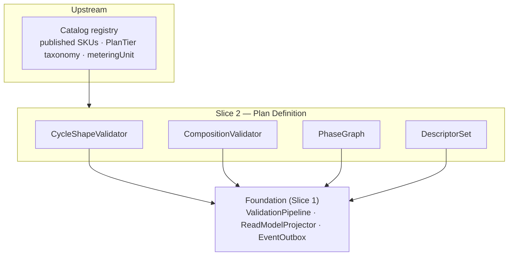

Created:  2026-08-24 by Virtuozzo International GmbH
Updated:  2026-08-24 by Virtuozzo International GmbH

<!-- CONFLUENCE_TITLE: [BSS]: Pricing — Plan Definition, Billing Cycles & Composition (Design, Slice 2) -->
<!-- Related: ../PRD.md, ../DESIGN.md, ./01-foundation.md | Owners: BSS Product Catalog team -->

# DESIGN — Plan Definition, Billing Cycles & Composition (Slice 2)

<!-- toc -->

- [1. Context](#1-context)
  - [1.1 Overview](#11-overview)
  - [1.2 Purpose](#12-purpose)
  - [1.3 Actors](#13-actors)
  - [1.4 References](#14-references)
  - [1.5 Scope](#15-scope)
  - [1.6 Constraints & Assumptions](#16-constraints--assumptions)
  - [1.7 Naming & Design-Introduced Names](#17-naming--design-introduced-names)
  - [1.8 Context & Dependencies](#18-context--dependencies)
- [2. Actor Flows (CDSL)](#2-actor-flows-cdsl)
  - [Author a Plan](#author-a-plan)
  - [Publish a Plan](#publish-a-plan)
- [3. Processes / Business Logic (CDSL)](#3-processes--business-logic-cdsl)
  - [Billing-Cycle Shape Validation](#billing-cycle-shape-validation)
  - [Plan Composition Validation](#plan-composition-validation)
  - [Phase Schedule Validation](#phase-schedule-validation)
  - [Billing Descriptor Completeness](#billing-descriptor-completeness)
  - [Period Floor & Cap Validation](#period-floor--cap-validation)
- [4. States (CDSL)](#4-states-cdsl)
  - [Plan Lifecycle State Machine](#plan-lifecycle-state-machine)
- [5. API Surface](#5-api-surface)
- [6. Data Model](#6-data-model)
- [7. Events & Alarms](#7-events--alarms)
- [8. Definitions of Done](#8-definitions-of-done)
  - [Billing-Cycle Matrix](#billing-cycle-matrix)
  - [Plan Composition & PlanTier](#plan-composition--plantier)
  - [Phases](#phases)
  - [Descriptors](#descriptors)
  - [Period Floor & Cap](#period-floor--cap)
- [9. Acceptance Criteria](#9-acceptance-criteria)
- [10. Non-Functional Considerations](#10-non-functional-considerations)

<!-- /toc -->

## 1. Context

### 1.1 Overview

This slice owns the **shape of a Plan**: the billing-cycle matrix (one-time / recurring /
usage-based / hybrid), custom frequency, per-seat quantity provenance, the optional one-time
setup row, mandatory `PlanTier`, meter injectivity, add-on rules, plan phases with
`convertsToPhaseId`, the billing descriptor set, and — since **D-319** — the plan-level
**period floor and cap** per sold market. It registers its validation rules into
the Foundation's fail-closed pipeline and its fields into the read-model projection; it owns
**no publish mechanics** — everything publishes through the Foundation
([`01-foundation.md`](./01-foundation.md) §4.2).

**Traces to**: `cpt-cf-bss-pricing-fr-billing-cycles`, `cpt-cf-bss-pricing-fr-custom-frequency`,
`cpt-cf-bss-pricing-fr-hybrid-completeness`,
`cpt-cf-bss-pricing-fr-one-time-setup`, `cpt-cf-bss-pricing-fr-plantier-mandatory`,
`cpt-cf-bss-pricing-fr-meter-injective`, `cpt-cf-bss-pricing-fr-addon-rules`,
`cpt-cf-bss-pricing-fr-billing-descriptors`, `cpt-cf-bss-pricing-fr-plan-phases`,
`cpt-cf-bss-pricing-fr-period-floor-cap`
(per-seat `quantitySource` persistence + validation live in Slice 3, matching §1.5 —
`fr-per-seat` is claimed there, one owner per FR; 2026-07-31 P2 fix)

### 1.2 Purpose

Give Finance/Product a self-service way to author every launch commercial shape on one
`planId` — recurring base + usage + optional setup, per-seat with explicit quantity
provenance, phased trial→intro→evergreen — such that an invalid or ambiguous shape **cannot
publish** and a published shape is completely resolvable by Subscriptions/Tariffs/Billing
without defaults.

### 1.3 Actors

| Actor | Role in Slice |
|-------|---------------|
| `cpt-cf-bss-pricing-actor-finance-manager` | Authors plans, cycles, phases; submits for publish |
| `cpt-cf-bss-pricing-actor-product-manager` | Configures add-on rules and composition |
| `cpt-cf-bss-pricing-actor-catalog-registry` | Supplies published SKUs, `PlanTier` taxonomy, `meteringUnit` declarations |
| `cpt-cf-bss-pricing-actor-subscriptions` | Consumes phase map, `displayTrialDays`, sellability inputs |
| `cpt-cf-bss-pricing-actor-rating` | Consumes the meter mapping (injectivity guarantee) |
| `cpt-cf-bss-pricing-actor-billing` | Consumes billing descriptors via `CatalogVersion` |

### 1.4 References

- **PRD**: [PRD.md](../PRD.md) — §6.1, §6.3, §17.1 (billing-cycle matrix), §17.3 (composition rules)
- **Design**: [01-foundation.md](./01-foundation.md) — publish contract (§4.2), scope key (§4.1), schema ownership
- **Dependencies**: Foundation (Slice 1). Co-required with price-structure (Slice 3): a rateable plan needs both a shape and a model kind.

### 1.5 Scope

**In scope**: billing cycles + custom frequency metadata; hybrid completeness; per-seat
quantity provenance concept (persistence + validation of `quantitySource`: Slice 3); one-time
setup row validation; `PlanTier` mandatory + SKU-equality check;
meter injectivity; add-on rules (dependency, bounds, override reference); phases (ordering,
`convertsToPhaseId`, terminal phase, `displayTrialDays`); billing descriptor completeness;
the plan-level period floor/cap per sold `(currency, region)` — **authoring, validation and
freezing only** (D-319).

**Out of scope**: tier bands / model kinds (Slice 3); bundles (Slice 8); windows/sellability
enforcement (Slice 7); trial runtime, entitlement enforcement, proration math (Subscriptions);
`PlanTier` taxonomy and `meteringUnit` declaration (registry); charge computation (Tariffs);
**execution of the period floor/cap** — Rating emits the `PeriodFloorCapObligation` from the
pinned snapshot and Billing applies `max(total, floor)` / `min(total, cap)` after step 9
(rating `fr-period-floor-cap-obligation`), and this slice adds no evaluation machinery.

### 1.6 Constraints & Assumptions

Inherits Foundation C-set (fail-closed, append-only, UTC, ISO 4217, tenant isolation). Slice-2-specific:

| # | Topic | Assumption (default) | Source |
|---|-------|----------------------|--------|
| P1 | Custom interval cap | `customEveryN{Days\|Months}(n)`: `n > 0` and `n ≤` a tenant-configured cap; over-cap config rejected at authoring (no silent clamp). **The cap is a `pricing_policy_object` entry** (**D-152**, 2026-08-03) — the store that already holds this gear's other per-tenant policies; without a named carrier "tenant-configured" was a promise no surface kept, and the built configuration section is per **deployment** | PRD §6.1; D-152 |
| P2 | Custom-frequency anchoring | `customEveryN Days(n)` MUST anchor on `subscription_start` (a `calendar_month`/`fixed_day` anchor fails publish). `customEveryN Months(n)` MAY anchor `subscription_start` or `calendar_month`; a `subscription_start` day beyond the target month clamps to its last day (K2 rule) with the **anchor day preserved** per period (no drift: 31→28→31); UTC; joint anchor fixture with Subscriptions (D-20) | PRD §6.1; D-20 |
| P3 | PlanTier equality | Plan `PlanTier` = parent SKU `PlanTier` unless an explicit, audited override is declared (default equal, no silent divergence) | PRD §17.3 |
| P4 | Localization | Plan-owned display content (names, labels, descriptors) is single-language at launch; per-locale authoring is an open registry-owned item | PRD §15 (F-37) |
| P5 | Descriptor minimum field set | **Pinned (D-48, 2026-07-28; composition revised by D-110, 2026-07-31)**: descriptor-set entity = line template, GL code, itemization rule; **two** elements of the v1 five **ride the price row** — `billingTiming` (2026-07-28) and `taxCategory` = the row's `tax_category_ref` (D-110 — a per-plan column could not mirror a per-row source of truth); v1 content unchanged, additive-only extension — **declared in `pricing_policy_object`, per tenant** (**D-152**, 2026-08-03: the "config-extensible required-set" had no carrier anywhere in the set); the `taxCategory` element is the row's **effective** category, resolved and frozen at publish (**D-154**, 2026-08-03); Billing countersigns at its gear PRD | PRD §15, D-48, D-110, D-152, D-154 |

### 1.7 Naming & Design-Introduced Names

Reuses the PRD glossary and inherits engine mechanics from the Foundation (`ScopeKey`,
`DraftStateMachine`, `ValidationPipeline`, `ReadModelProjector`, `EventOutbox`). Not restated.

Design-introduced names (Slice 2):

| Name | Meaning |
|------|---------|
| `CycleShapeValidator` | Registered rule set validating the billing-cycle matrix (§17.1) per plan |
| `CompositionValidator` | Registered rule set for `PlanTier`, meter injectivity, add-on rules (§17.3) |
| `PhaseGraph` | The ordered phase set with `convertsToPhaseId` edges; validated acyclic with exactly one terminal phase |
| `DescriptorSet` | The per-plan billing descriptor aggregate checked for completeness at publish |

### 1.8 Context & Dependencies

**Consumed:** published `skuId` + SKU `PlanTier` + `meteringUnit` declarations (registry).
**Produced:** the plan-shape portion of the read model (cycle, frequency metadata, phase map +
`displayTrialDays`, add-on rules, descriptor set, `invoiceGroupingKey` (D-96),
`planName` (D-318) —
`quantitySource` is persisted/validated by Slice 3), validated fail-closed at publish.

## 2. Actor Flows (CDSL)

### Author a Plan

- [ ] `p1` - **ID**: `cpt-cf-bss-pricing-flow-plan-author`

**Actor**: `cpt-cf-bss-pricing-actor-finance-manager`, `cpt-cf-bss-pricing-actor-product-manager`

**Success Scenarios**:
- A draft Plan is created against a **published** SKU with a billing cycle from the §17.1 matrix; add-on rules, phases, and descriptors attach incrementally in `draft`
- A recurring plan persists `frequency` (`monthly|quarterly|semiannual|annual|customEveryN{Days|Months}(n)`) as metadata

**Error Scenarios**:
- Draft/unknown parent SKU → `SKU_NOT_PUBLISHED` (422)
- Non-positive or over-cap custom interval `n` → `INVALID_CUSTOM_INTERVAL` (422)
- Stale ETag → conflict (Foundation optimistic concurrency)

**Steps**:
1. [ ] - `p1` - API: POST /bss-pricing/v1/plans (draft; idempotency key honored) - `inst-pa-create`
2. [ ] - `p1` - Validate the parent `skuId` is **published** in the registry read model - `inst-pa-sku`
3. [ ] - `p1` - Persist cycle + frequency metadata (`n` validated > 0 and ≤ cap, P1) - `inst-pa-cycle`
4. [ ] - `p1` - Attach add-on rules / phases / descriptors via PATCH while `draft` - `inst-pa-attach`
5. [ ] - `p1` - **RETURN** 201 (draft plan, ETag); `PlanCreated` emitted by the Foundation outbox - `inst-pa-return`

### Publish a Plan

- [ ] `p1` - **ID**: `cpt-cf-bss-pricing-flow-plan-publish`

**Actor**: `cpt-cf-bss-pricing-actor-finance-manager` (approval per governance slice)

**Success Scenarios**:
- Publish runs the Foundation pipeline with this slice's registered rules; on success the plan shape freezes into the read model and `PlanPublished` carries the pending version ref

**Error Scenarios**:
- Any §17.1/§17.3 violation → 422 with the enumerated validation report (fail-closed; no event, no warm)

**Steps**:
1. [ ] - `p1` - API: POST /bss-pricing/v1/plans/{planId}/publish - `inst-pp-api`
2. [ ] - `p1` - Foundation `ValidationPipeline` executes `CycleShapeValidator` + `CompositionValidator` + `PhaseGraph` + `DescriptorSet` rules (this slice) alongside Slice-3 price rules - `inst-pp-validate`
3. [ ] - `p1` - On success: Foundation freezes the shape into the read model + snapshot, emits the frozen events, requests `CatalogVersion` ([`01-foundation.md`](./01-foundation.md) §4.2 steps 3–5) - `inst-pp-freeze`
4. [ ] - `p1` - **RETURN** 202 (publish accepted / pending approval) or 422 (validation report) - `inst-pp-return`

## 3. Processes / Business Logic (CDSL)

### Billing-Cycle Shape Validation

- [ ] `p1` - **ID**: `cpt-cf-bss-pricing-algo-cycle-shape`

**Input**: a draft plan + its price rows (rows authored via Slice 3)
**Output**: pass, or enumerated fail-closed violations

**Steps**:
0. [ ] - `p1` - **The cycle is declared (cycle-independent, evaluated before every step below; normative, D-149, 2026-08-03, found while building this validator):** a plan MUST carry a `billing_cycle` from the §17.1 matrix at publish; an unset one fails publish `CYCLE_METADATA_MISSING` (422, the field named) — the same code as the absent `frequency` in step 2, because the operator's next action is the same: author the field the plan is missing. Nothing required it. `billing_cycle` is nullable while a plan is authored incrementally in `draft` (Foundation §4.2 step 1), **every** rule of this step is conditioned on the cycle, and a rule that reads no cycle correctly declines to judge rather than reporting a fault the author did not make — so an unfinished draft carrying a `NULL` cycle passed this whole step **vacuously** and reached publish unjudged. A plan that has said nothing about how it charges is exactly the plan a fail-closed validator cannot protect - `inst-cs-declared`
1. [ ] - `p1` - **One-time**: exactly one `one_time` base row **per sold `(currency, region)`** — the **at most one** half is the Foundation's published-plane scope-key partial `UNIQUE` (`chargeKind` is a key axis, §4.1), and the **at least one** half fails publish `BASE_MARKET_INCOMPLETE` (422, cycle, `chargeKind` and market named — **D-149**, 2026-08-03: the rule was stated here from the start and §5 named no code for it, so a one-time plan could publish with a sold market carrying no `one_time` row and be bought for nothing); optional purchase qty min/max (`purchase_min_qty ≤ purchase_max_qty` when both set, `PURCHASE_QTY_RANGE_INVALID` otherwise) + availability dates (past-`availableFrom` rule: `inst-cs-availability`). **Recurring-only add-ons are refused by `inst-cmp-addons` under `ADDON_INCOMPATIBLE`** — cross-referenced here, never re-registered (**D-149**: the refusal needs the add-on SKU's own published plans, which is the registry read the composition step already makes and this one does not) - `inst-cs-onetime`
2. [ ] - `p1` - **Recurring**: ≥ 1 recurring base row per sold `(currency, region)` — `BASE_MARKET_INCOMPLETE` otherwise (**D-149**, the same code and the same rule as the one-time step's, over `chargeKind = recurring`; `HYBRID_INCOMPLETE` keeps its own meaning, a hybrid missing a whole part **anywhere**, and never reports a market); `billingTiming` REQUIRED on every recurring row (the requirement is **Slice 6's registered rule** — cross-referenced here, never re-registered; single owner, 2026-07-28 review fix); frequency metadata present, else `CYCLE_METADATA_MISSING` (422, the field named — **D-149**; a `recurring`/`hybrid` plan with no `frequency` says nothing about when it charges, and nothing rejected it); optional `one_time_setup` row allowed - `inst-cs-recurring`
3. [ ] - `p1` - **Usage-based**: parent SKU `meteringUnit` required; `billingGranularity` on **all** usage rows; `tierAggregationWindow` when tiered **or `package`** (Slice 3 `inst-pk-window`, D-58 — block round-up is non-linear in the window; the "when tiered" wording had excluded the `package` case D-70 propagated everywhere else, 2026-07-31 review fix). **Per-market line completeness (D-84):** every `(meter, dimensionKey)` line the plan prices MUST have a row in every sold `(currency, region)` of the plan (the union of its usage rows' markets) — `USAGE_MARKET_INCOMPLETE` otherwise, same rule and rationale as `inst-cs-hybrid` - **The per-line reading is storable, and was not before (D-196, decided by the product owner 2026-08-06):** the canonical scope key had no `meter` axis, so two usage lines of one plan in one market rendered one key and the second was refused `DUPLICATE_SCOPE_KEY` at authoring — this rule and D-103's example both presumed a storage shape Foundation §3.7 did not admit. The key now carries `(meter, dimensionKey)` on `chargeKind = 'usage'` rows (Foundation §4.1), so a line here is a key there, and this rule's per-market completeness is checkable against rows that can all exist at once. **The implementation is owed** — D-196 carries the clauses — so until it lands the authoring door still refuses the second line - `inst-cs-usage`
4. [ ] - `p1` - **Hybrid**: BOTH ≥ 1 recurring **and** ≥ 1 usage row on the same `planId` (distinct `chargeKind` keys); missing either part fails publish (`HYBRID_INCOMPLETE`, 422, the absent part named — the rule is about a part missing **anywhere** on the plan, never about a market, which is `BASE_MARKET_INCOMPLETE`'s and `USAGE_MARKET_INCOMPLETE`'s ground); optional `one_time_setup` allowed. **Per-market completeness (D-84, 2026-07-30 review fix):** the usage part is required **per sold market**, not merely anywhere — every `(meter, dimensionKey)` line the plan prices (evaluated over its phase-invariant terminal-phase rows; phase-scoped overrides are additive and exempt) MUST have a published usage row in **every** `(currency, region)` where a recurring row exists, else publish fails (`USAGE_MARKET_INCOMPLETE`, 422, meter/dimension/market named). Otherwise a hybrid selling recurring in EUR+USD with usage only in EUR is sellable in USD, and the USD subscriber's usage events fail closed — the "sold but unrateable" state D-15/D-17 declare impossible by construction. A market where usage is genuinely free is an explicit `$0` row (Slice 3 Q5), never an absence - `inst-cs-hybrid`
5. [ ] - `p1` - **Custom frequency**: `customEveryN Days(n)` MUST anchor `subscription_start`; `customEveryN Months(n)` MAY anchor `subscription_start` or `calendar_month` with month-end clamp + preserved anchor day (P2, D-20); non-positive/over-cap `n` fails - `inst-cs-customfreq`
6. [ ] - `p1` - **Setup row**: `chargeKind=one_time_setup` allowed only on recurring/hybrid plans; validated as one-time — no recurrence, no `billingTiming`, no tier fields; first-class row (participates in approval/snapshot/preview), never a synthetic add-on SKU - `inst-cs-setup`
7. [ ] - `p1` - **Setup charge timing (normative):** the setup row charges **once per subscription lifetime** — at activation, or for a plan with a `trial` phase at entry into the **first non-trial phase** (trial conversion; a cancelled trial is never charged setup). A plan change or `PlanLink` migration **never charges the target plan's setup row at all** — whether or not the origin plan carried one: setup is tied to **subscription activation**, not plan entry, so a plan-change entrant who never paid any setup is still not charged (Slice 11 honors this in the migration contract; wording sharpened 2026-07-30 review fix). The timing is published in the read model for Subscriptions/Billing - `inst-cs-setup-timing`
8. [ ] - `p1` - **Availability dates (cycle-independent):** a past `availableFrom` is rejected on **every** billing cycle (`AVAILABLE_FROM_IN_PAST`) — with **no** sanctioned backdating anywhere in this gear since D-330 struck the Slice 5 historical-import path (2026-08-16), so the refusal is now unconditional rather than the default arm of a two-way rule (rule hoisted from the one-time step, 2026-07-28 review fix, confirmed 2026-07-31). The rule binds **newly set or changed** values only (2026-07-31 review fix): a revision re-publishing an **unchanged** `availableFrom` that has legitimately passed since the original publish is not backdating and passes — otherwise every later re-publish (a descriptor fix, a new market) of a once-future-dated plan would be blocked until the operator erased the date - `inst-cs-availability`

### Plan Composition Validation

- [ ] `p1` - **ID**: `cpt-cf-bss-pricing-algo-composition`

**Input**: a draft plan (PlanTier, meter mapping, add-on rules)
**Output**: pass, or enumerated fail-closed violations

**Steps**:
0a. [ ] - `p2` - **Plan name (D-318, 2026-08-15):** a plan MAY carry a human label, `planName`, and until this decision it carried **none** — every surface showing a plan to a person rendered its `PlanTier`, a classification the catalog reasons about, or eight characters of a UUID. The column is **nullable** (an unnamed plan is ordinary and no backfill invents one) and **frozen once published** like every other content column, so a rename is a new revision. `NULL` is the only spelling of unnamed: an empty or whitespace-only name, and one longer than **120 characters** (counted in characters, not bytes), are refused at the **write stage** with `PLAN_NAME_INVALID`. Framed into the approval content pin (`v13`) and shown in the reviewer's pinned document — a name is what a consumer surface calls the plan, so a swap between submit and approve changes what a buyer is told they are buying. **No uniqueness constraint**, deliberately: identity is `planId`, two plans may share a label, and the check would cost a scan per publish to buy a convention an operator can hold - `inst-cmp-planname`
1. [ ] - `p1` - **PlanTier**: declared before publish (optional at draft); MUST equal the parent SKU's `PlanTier` unless an **explicit, audited override** is declared (P3, no silent divergence — a divergence with no override fails publish, `PLANTIER_DIVERGENT`); the effective tier lands in the read model - `inst-cmp-plantier`
1a. [ ] - `p1` - **PlanTier drift after publish:** the equality check at publish is not enough — the registry can change the SKU's tier later. The catalog consumes the registry's SKU-tier-change signal and flags every affected **published** plan `tier_divergent` **in the operator-plane flag store (`pricing_operator_flag`, D-85, 2026-07-30 review fix — never the versioned read model: a drift flag has no publish unit, and a frozen `CatalogVersion` never mutates)** (+ the `pricing.plan.tier_divergent` alarm); remediation is a re-publish (re-validating equality) or an explicit audited override. Downstream consumers keep resolving the frozen published tier — the flag is an operator remediation signal on the authoring surfaces, never a silent retro-change (part of the registry joint contract, PRD §15) - `inst-cmp-tier-drift`
2. [ ] - `p1` - **Meter injectivity (restated, D-103, 2026-07-31 review fix):** the invariant is **one priced line per `(meter, dimensionKey)` per scope-key slice** (`currency`/`region`/`priceOverlay`/`phase`/`priceEligibility`/`cohort` legitimately multiply rows — the `cohort` axis is what lets a second cutover add another grandfathered generation of the same usage line without violating injectivity, ADR-0002); a **duplicate line** within one slice is the ambiguity that fails publish (`METER_AMBIGUOUS`). A usage plan **MAY** price **several** `meteringUnit`s (a PaaS plan pricing cloudlets, storage and egress is one plan, not three) — the earlier "each usage plan revision maps **exactly one** `meteringUnit`" was the stronger claim, and it was contradicted by three rules of this set and enforced by none: D-84's per-market completeness ranges over "every `(meter, dimensionKey)` line the plan prices", this slice's own D-84 integration AC exercises a plan pricing M1 and M2, D-43's grant `applicability` scopes to "a **set** of published `meteringUnit` ids … usage lines of the grant-bearing plan", and the enforcing partial `UNIQUE` (§6) carries both `meter` and `dimension_key` — i.e. it always implemented the per-line reading. A derived (composite) meter (Slice 10) remains the way to price **several units as one billable line** (vCPU + RAM → one output unit), and separate single-meter SKUs composed via bundle/add-ons (Slice 8) remain available — neither is now the *only* multi-meter path - `inst-cmp-injective`
2a. [ ] - `p1` - **Usage-source binding (UC3 seam adoption, 2026-07-28 review fix, confirmed 2026-07-31):** every usage row's `meteringUnit` MUST resolve to a registry metering-unit declaration that carries a **`usageTypeRef`** (the usage-collector `gts_id` supplying the meter — products `fr-metering-unit-declaration`, rating SEAMS UC3(a)); a meter with no binding fails publish (`METER_USAGE_TYPE_UNBOUND`) — an unbound meter is unrateable, since Rating quarantines usage it cannot attribute rather than guessing. The **dimension set** the plan prices over that meter (its authored `dimensionKey` values) MUST be a subset of the UsageType's declared `metadata_fields` keys, which the registry holds equal to the meter's declared dimension set (UC3(c) cross-validation); pricing a dimension the source never emits fails publish (`METER_DIMENSION_UNDECLARED`, offending keys named). The **`dimension_key = ''` empty-tuple sentinel is exempt** from the subset check (2026-07-31c review fix): an undimensioned row prices the whole meter and declares no dimension — `''` is never a `metadata_fields` key, so reading the subset rule literally would fail every undimensioned row on a bound meter. Both checks read the frozen registry declaration through the same joint contract as `inst-cmp-tier-drift`. **Post-publish drift (2026-07-31 review fix — the tier-drift treatment applied symmetrically):** a later registry change to the meter's `usageTypeRef` binding or declared dimension set flags every affected **published** plan `meter_binding_divergent` in the operator-plane flag store (`pricing_operator_flag`, D-85) + raises `pricing.plan.meter_binding_divergent` (Warn); consumers keep resolving the frozen mapping; remediation = re-publish (re-running this check) - `inst-cmp-usagetype`
3. [ ] - `p1` - **Add-on rules**: add-on SKUs published + compatible with the base SKU; the dependency/conflict **edges are plan-authored** (D-16): each rule row MAY declare `depends_on` / `conflicts_with` sets referencing **other add-ons of the same plan's set** (an edge pointing outside the set fails; conflicts are normalized symmetric); dependency **cycles** fail publish (graph walk over `depends_on`), conflicting pairs fail when both marked required; an optional price-override reference persists on the plan snapshot. **The quantity bounds are a rule, not only a column check (normative, D-150, 2026-08-03, found while building the add-on rule table):** a required add-on has `maxQty ≥ 1`, `minQty ≤ maxQty` when both are set, and `stepQty > 0` when set — each an unsatisfiable-selection defect on one row, all three reported as `ADDON_QTY_RANGE_INVALID` (422, the offending bound named; the sibling of `PURCHASE_QTY_RANGE_INVALID` one object over). Only the first was written, and only as a §6 `CHECK` with no code, so an author met it as a driver error rather than a report line and the other two were expressible: an add-on nobody can select publishes on a plan that looks complete. §6 carries all three as checks as well — the rule is the explanatory path and the constraint the guarantee, the arrangement D-148 describes. **A one-time plan takes no recurring-only add-on (normative, D-149, 2026-08-03):** an add-on SKU **none** of whose published plans carries a `one_time` base row cannot be sold under a one-time base plan, and attaching one fails publish `ADDON_INCOMPATIBLE` (422, the add-on named). The requirement was `inst-cs-onetime`'s and unenforceable there — the cycle-shape step reads the plan, while deciding it needs the *add-on SKU's own plans*, which is the registry read this step already makes for the published-and-compatible check. `ADDON_CYCLE` was **not** widened to carry it and no fourth code was minted: that name means a **dependency cycle** in this catalogue, and a second sense of "cycle" on one add-on object is the one collision no consumer could parse. It joins this step's other registry-dependent checks — `SKU_NOT_PUBLISHED`, `PLANTIER_DIVERGENT` and `ADDON_INCOMPATIBLE`'s published-and-compatible half — and is unbuildable until the registry read model this gear consumes is wired, which is where it belongs rather than in a cycle-shape rule that reads only the plan - `inst-cmp-addons`
4. [ ] - `p1` - **Override home (normative):** `price_override_ref` resolves to a **published `priceId` on a plan of the add-on SKU itself** (an alternative row authored there — it is a normal price row with its own scope key, windows, and coverage). **The ref binds that row's canonical scope key — as the key *family* modulo the market axes, not the id (D-97, amended by D-116, 2026-07-31):** the bound object is `(addon planId, priceOverlay = base, phase, priceEligibility = all_subscriptions, chargeKind, cohort = none)` with `(currency, region)` **free** — a single canonical key fixes one market and cannot itself serve a multi-market base plan (the pre-D-116 wording required one key to "cover every market", which is unsatisfiable). The subscriber's bound `(currency, region)` selects the member key; resolution at `t` follows **that member** through windows exactly as any row resolves, so a supersession's successor legitimately serves the override (supersession is transparent to consumers, and the D-82/D-98 unit guard keeps each member key's meaning stable) — the frozen mapping never dangles on a routine price change of the add-on plan. Publish of the base plan validates a published, covering **member** exists for every `(currency, region)` the base plan sells (Slice 4 case i, per pair — D-95); the resolved mapping freezes into the base plan's `pricingSnapshotRef`. No override price is ever authored as a detached number on the base plan - `inst-cmp-override-home`

### Phase Schedule Validation

- [ ] `p1` - **ID**: `cpt-cf-bss-pricing-algo-phases`

**Input**: a phased plan's `PhaseGraph`
**Output**: a published phase→price map, ordering, successors, `displayTrialDays`

**Steps**:
1. [ ] - `p1` - Each phase id maps to its price-row references (rows carry the `phase` scope-key axis); ordering persisted - `inst-ph-map`
2. [ ] - `p1` - `convertsToPhaseId` edges validated: no dangling target, no cycle; **exactly one terminal phase** (`evergreen`, no successor). **The chain is linear (2026-07-31 review fix):** phases are ordered by `ordinal`, the **entry phase is the lowest ordinal** (normative — D-39's "first non-trial phase" and the setup-timing "first non-trial phase" both read this order), and every non-terminal phase's `convertsToPhaseId` MUST target the next phase in ordinal order — a skip, a tree, or an unreachable phase fails publish (`PHASE_CHAIN_NONLINEAR`, 422): acyclicity + single-terminal alone admit dead phases that still demand coverage rows and leave "first" undefined. **The terminal phase's `kind` MUST be `evergreen`** (`TERMINAL_PHASE_KIND_INVALID`, 422; 2026-08-01 review fix, C-4): the constraint was carried only by a parenthetical here while terminality is structural (`converts_to_phase_id IS NULL`) and the column admits `trial | intro | evergreen`, so nothing rejected a `trial`- or `intro`-terminal chain — and a `trial` terminal leaves "the **first non-trial phase**" undefined for both setup timing (`inst-cs-setup-timing`) and migration entry (D-39), while colliding with the `display_trial_days = phase_duration_days` CHECK (duration is forbidden on the terminal phase). "Intro pricing forever" is authored as an `evergreen` terminal phase at the intro price, not as an `intro` terminal. **The edge and terminal-count clauses are judged at the *write* stage on the `phases` facet as well as at publish (normative, D-343, 2026-08-17, found by the wave's own code review):** the facet is a wholesale replace, so a dangling edge, a cycle or a second terminal phase is one successful `PATCH` — and the store's partial `UNIQUE` was answering the two-terminal case with a `500` that advised a retry no retry could satisfy, because the rule that owns the requirement was never asked. The two `kind` clauses stay at publish alone: a lone `trial` phase with no successor is a legal intermediate state of an authoring session, and refusing it at the write would refuse a draft the product accepts - `inst-ph-graph`
3. [ ] - `p1` - **Phase duration (normative):** every **non-terminal** phase MUST author `phaseDurationDays > 0` — `convertsToPhaseId` says *where* a phase converts, the duration says *when*; a non-terminal phase without a duration (or a terminal phase with one) fails publish (`PHASE_DURATION_INVALID`, 422). Subscriptions enforces phase runtime from these published durations (single source) - `inst-ph-duration`
3a. [ ] - `p1` - **Phase coverage (D-15):** on a plan whose billing cycle carries a **recurring part** (`recurring`/`hybrid` — one-time and usage-only plans are outside the rule's scope, whose literal reading would otherwise block them via their implicit terminal phase; 2026-07-28 review fix, confirmed 2026-07-31), every phase id MUST be referenced by ≥ 1 published **recurring** price row for every `(currency, region)` the plan sells — an uncovered phase fails publish (`PHASE_UNCOVERED`): a phase conversion must never resolve to nothing (the row-based Slice 7 coverage check cannot see a phase that has no rows at all) - `inst-ph-coverage`
3b. [ ] - `p1` - **Usage rows are phase-invariant by default (D-15):** one usage row (on the **terminal `phase_id`** — D-19) covers **all** phases; an explicit phase-scoped usage row overrides it **for its phase** (phase-specific wins — a published resolution rule of the same class as most-specific-wins eligibility, adopted verbatim by Tariffs; joint fixture). Free trial usage = an explicit trial-phase usage row at 0 — never a silent default. **An override requires its base (D-117, 2026-07-31 review fix):** a phase-scoped usage row MUST have the phase-invariant terminal-phase row of its `(meter, dimensionKey)` line — an **orphan** override fails publish (`PHASE_OVERRIDE_ORPHANED`, 422, the line and phase named). Without the base, the D-89 unit guard has no comparison target, D-84's per-market completeness exempts the line entirely ("phase-scoped overrides are additive"), and after the phase converts the line resolves to **nothing** — usage that continues fails closed on a published, sellable plan ("sold but unrateable" through the override door). Phase-limited-only metering is a named Future gate (it needs its own completeness rule and defined conversion-to-nothing semantics before it can be authorable — the D-53 posture) - `inst-ph-usage-invariant`
3c. [ ] - `p1` - **Override unit guard (normative, D-89, 2026-07-31 review fix):** the tier counter `Q` is keyed `(subscription, meter, dimensionKey, window)` — **phase-blind** (S3 `inst-tb-window-continuity`) — so a phase conversion **never resets `Q`**, and the row that serves the meter after conversion inherits the continued counter. A phase-scoped usage override therefore MUST carry the **same unit/counter-determining fields** as the phase-invariant terminal-phase row of its `(meter, dimensionKey)` line — `model_kind`, `billingGranularity`, `aggregationFunction`, `aggregationGranularity`, `tierAggregationWindow`, `tierQualificationWindow`, **`package_size`** (the D-82/D-98 list, extended by D-122 — block math is non-linear in the window, so a mid-window size change re-buckets the accumulated `used`) — else publish fails (`PHASE_OVERRIDE_UNIT_MISMATCH`, 422, offending fields named). **The `model_kind` comparison is the *presented* kind as well as the authored one (D-317 clause (2), 2026-08-15):** the seven fields above are one shared list, written once for both this guard and S3 `inst-tb-supersession-units` because both mechanisms hand a subscriber from one row to another without resetting `Q`, and since D-45 an untiered `per_unit` row carrying `includedAllowance {N, none}` publishes as a band ladder with its authored kind untouched (S10 `inst-ac-band`, D-130). An override that introduces or drops that declaration therefore changes the formula pricing the continued counter while every authored field reads identical — D-98's defect through the phase axis — so it is refused, reported as `includedAllowance (presented modelKind)` because that is the operand an author can act on. The allowance's **quantity**, on a row that presents a ladder on both sides, stays a price lever and is not compared. Without it a `per_hour` trial row converting into a `per_day` evergreen row mid-window applies an hours-denominated continued `Q` to day-denominated bands (the D-77/D-82 ×24 class through the phase axis), and differing window values silently reset the counter. Free-trial pricing stays fully expressible — a `$0` rate or band set **at the same denomination**. The supersession-continuity fixture carries the phase-conversion-mid-window scenario - `inst-ph-override-units`
3d. [ ] - `p1` - **Every price row names a phase the revision attaches (normative, D-337, 2026-08-17):** each price row of the revision MUST key its `phase` scope-key axis on a `phase_id` the revision holds — a row naming a phase the revision does not attach fails publish (`PHASE_ROW_ORPHANED`, 422, the row **and** the phase named, every offending row reported rather than the first). **The exact inverse of step 3a**, which asks whether a phase has rows; this asks whether a row has a phase, and both are needed because each is invisible to the other's iteration. Registered immediately **before** `inst-ph-coverage` so the pair reads together in one report (the step numbering here is the algorithm's reading order and not the pipeline's — `inst-ph-trial` is step 4 and registers earlier still). Until this rule existed the only guard was `inst-ph-terminal-stable` arm (b), which ranges over the phases the **published** revision's rows use: a plan that has never published has no baseline, that rule returns immediately, and a draft whose every row keyed on an unattached phase was refused only for *having no terminal phase*. Step 3a cannot see it either — it iterates the phases the revision **holds** and asks which lack coverage, so a row filed outside that set is never a subject it visits — and the `PhaseId` typing of the axis (`inst-ph-default`) carries "this is a phase id" and not "this revision's". Unconditional where step 3a is scoped to plans whose cycle carries a recurring part: coverage cannot be demanded of a plan with no recurring row to give, while attachment is a statement about a row that exists. The refusal must name the phase id the rows already carry, because a scope key **is** the row's identity (Foundation §3.7) and cannot be re-pointed — the only remediations are attaching that id or deleting the rows, and an author who is told merely to add a terminal phase strands every row they authored. **The rule runs at the *write* stage on the `phases` facet as well as at publish (normative, D-342, 2026-08-17):** a `phases` write that drops a phase a **draft** price row names — including the empty set, and including any wholesale replace, the facet replacing the revision's phase rows rather than merging them — is refused **when it is made**, naming the rows. D-337 registered the rule at publish only, which is the write path's default (a violation reported without a stage is a Publish-stage violation, and only the price-row write and the bulk import opt in), and publish is the one moment at which the author's options are strictly fewer: at the write there are two remedies — keep the phase, or drop the rows deliberately — while at publish a published row cannot be re-pointed at all (Foundation §3.7) and a draft row can only be deleted. The client-side blocker in front of it is courtesy rather than guarantee: the surface that produced the observed orphans was a script against this API, which is the same measurement that made D-337 refuse to leave the check to the client. **Both stages, not one**: the phase set and the price rows are authored through different facets, so a rule that ran only at the `phases` write would be defeated by a price row authored after the phase set was, and publish remains the gate every writer passes through. The opt-in is scoped to this facet and this rule — a replace that keeps every named phase (prepending a trial, say) must still succeed, and that positive control is what makes the scoping checkable, since a too-wide opt-in shows up there rather than in the refusals - `inst-ph-row-attached`
4. [ ] - `p1` - A `trial` phase publishes `displayTrialDays` = its `phaseDurationDays` (the PRD-named alias for preview/quoting; one value, two projections). **The projection binds to the phase `kind`, and the drift `CHECK` is not what guarantees it (normative, D-151, 2026-08-03, found while building the phase table):** `displayTrialDays` is authorable **only** on a phase whose `kind` is `trial`, and only on one that carries the `phaseDurationDays` it projects — a value on an `intro` or `evergreen` phase, or on any phase with no duration, fails publish (`DISPLAY_TRIAL_DAYS_INVALID`, 422, the phase named). §6's `CHECK (display_trial_days IS NULL OR display_trial_days = phase_duration_days)` cannot carry either half: it is silent on `kind` altogether, and SQL's NULL propagation makes it **satisfied** whenever `phase_duration_days` is NULL while `display_trial_days` is set, since the comparison is then NULL and both engines count that as passing. So the shape it exists to forbid — a phase publishing a trial length it does not have — passed it, and the `evergreen` **terminal** phase is where nothing else caught it either: `inst-ph-duration` is correct to find no duration there and `inst-ph-graph`'s terminal-`kind` rule is correct to find `evergreen`. `displayTrialDays` is the single source Subscriptions enforces trial runtime from and preview quotes, so a plan with no trial phase could publish a trial length. The `CHECK` is deliberately **not** tightened with a `phase_duration_days IS NOT NULL` conjunct: a phase graph is authored across successive `PATCH`es, and the conjunct would make the half-authored draft unsavable — the schema stands behind this rule rather than in front of it, exactly as it does for `inst-ph-duration` and the terminal `kind`. It is `inst-el-fields`' sibling one slice over (**D-147**): one field conditioned on one axis value, with a rule and a code rather than a column check alone - `inst-ph-trial`
5. [ ] - `p1` - **Axis typing (D-19):** the `phase` axis is always a `phase_id`. Every plan gets a terminal phase row — authored (phased plans) or **auto-created implicit** (kind `evergreen`; non-phased/one-time plans) at plan creation; non-phased/one-time/setup rows carry that terminal `phase_id` (Foundation §4.1 defaults). The literal `evergreen` is a phase *kind*, never an axis value. **A phase id belongs to its plan, and a taken id is refused by name (normative, D-340, 2026-08-17):** §6's key is `(tenant_id, plan_id, plan_revision, phase_id)`, so two plans — of one tenant or of two — may hold the same `phase_id`, while a plan's own revision still holds each id at most once. The `phases` facet takes the id **from the client**, which is what makes the clone remap and D-83's copy-forward expressible at all, so a write naming an id the key already holds is a caller-reachable refusal and not a fault: it fails `PHASE_ID_IN_USE` (409), **naming the id**. It is the store's own constraint answered at the write — the class of `DUPLICATE_SCOPE_KEY` (S3, Foundation) — and **not** a publish-pipeline violation, so the pipeline's code roster does not carry it. Before the widening the key was `(phase_id, plan_revision)`, naming neither the tenant nor the plan: the same collision then meant *another plan's* phase id, another tenant's included, and it answered `500 Internal` advising a retry that could not help — which is how four of five stand drafts came to name an id they could never attach. **The seed is unconditional on every path that creates a plan, and a clone adopts (normative, D-341, 2026-08-17):** `POST /plans` seeds the terminal row, and so does **clone**, whose copy set (S12 `inst-cl-copy`) produces phase rows by copying the source's — so a clone of a plan holding **none** had no terminal phase, which is the state this step exists to abolish, reached through the one creation path that is not `POST /plans`. A phase-less source is not hypothetical: every plan created before this seed existed is one, and `inst-cl-source` makes a plan clonable exactly when it holds a **current revision**, so such a source is published while the clone it produces cannot publish — the copied price rows carry the source's `phase_id` verbatim, the remap having no source phase row to map from, and are refused row by row by `PHASE_ROW_ORPHANED`. Therefore: when the source holds no phase row to copy, the clone seeds a terminal `evergreen` phase exactly as `POST /plans` does, and **adopts** the `phase_id` its copied rows name when they name exactly **one** — legal because D-340 scopes the id to the plan, so the clone may hold an id its source also holds. When the copied rows name **two or more** distinct unattached ids the clone mints a fresh id and leaves the rows as copied: that is a state a human must resolve, and a clone silently picking a winner would strand the loser's rows under an id it had just legitimized - `inst-ph-default`
5a. [ ] - `p1` - **Terminal-phase stability across revisions (normative, D-64, 2026-07-29 review fix):** D-56 pins phase **ids**, but the scope-key default (`inst-ph-default`) and usage phase-invariance (`inst-ph-usage-invariant`) are both defined relative to *which* phase is terminal — so a revision that re-terminalizes silently moves them. Therefore: (a) a revision MUST NOT re-terminalize an existing phase or introduce a **different** terminal phase — the terminal `phase_id` is immutable for the life of the plan (`TERMINAL_PHASE_CHANGED`, 422); (b) a revision MUST re-attach every `phase_id` referenced by a current published `pricing_price` row — dropping such a phase fails publish (`PHASE_IN_USE`, 422). Without (a), a usage-only plan published non-phased (metered row on the implicit terminal `T0`) can be revised to add a trial plus a new evergreen `E`: `T0` becomes non-terminal, the metered row is no longer phase-invariant, a subscription in `E` resolves **no** usage row, and Tariffs fails closed on a published sellable plan. `inst-ph-coverage` cannot catch this — since the 2026-07-28 fix it is scoped to recurring rows on `recurring`/`hybrid` plans, so usage-only plans are entirely unguarded. This is the "sold but unrateable" state D-15 exists to prevent, reintroduced through revisioning - `inst-ph-terminal-stable`

### Billing Descriptor Completeness

- [ ] `p1` - **ID**: `cpt-cf-bss-pricing-algo-descriptors`

**Input**: the plan's `DescriptorSet`
**Output**: pass (set frozen into `CatalogVersion`), or a report listing missing fields

**Steps**:
1. [ ] - `p1` - Required per manifest §4.1 / D-48 v1: invoice line template (`invoiceLineTemplate`), GL code (`glCode`), composition/itemization rules (`itemizationRule`) on the descriptor set — the three spelled as the validation report and the extension keys spell them, following the wire spelling every other rule's detail uses (`planTier`, `billingGranularity`), since §6 names only the columns and the PRD only the concepts — plus the two **row-borne** elements: `billingTiming` on every recurring row (validated by Slice 6's rule, `BILLING_TIMING_MISSING`) and `taxCategory` as each row's `tax_category_ref` (Slice 4 `inst-td-persist`, sole source of truth per D-110); publish blocks on any missing element with the field and, for the row-borne ones, the row named in the report. **What "missing" means for `taxCategory` (normative, D-154, 2026-08-03, found while building the descriptor rule):** the required element is the row's **effective** category — `coalesce(row.tax_category_ref, readiness.taxCategory)`, [`04-currency-tax.md`](./04-currency-tax.md) `inst-td-policy` — never the column alone, so a tenant declaring one category per region satisfies this element without authoring `tax_category_ref` on every row. Publish **resolves** that category and freezes the resolved value with the row, exactly as it resolves and freezes `rounding_policy_ref` (Foundation §3.7). Two things follow and neither held before: a row whose effective category is **absent** fails publish (`TAX_BASIS_INCOMPLETE`, S4 §5) with **no** warn-mode escape, because D-48 v1 pins this element and a tenant display policy may not publish past a pinned contract element; and Billing reads the category from the frozen row instead of re-resolving the coalesce against `pricing_region_taxonomy`, which is mutable per `(tenant, region)` and whose re-query is what step 2 forbids - `inst-ds-required`
2. [ ] - `p1` - The frozen set MUST be sufficient for Billing/ERP to post without re-querying mutable rows; the minimum field list is confirmed with Billing (P5) and the validator's required-set is config-extensible without a schema change — **the extension is declared in `pricing_policy_object` (normative, D-152, 2026-08-03, found while building the descriptor rule)**: a per-tenant entry listing additional required descriptor keys, matched against `pricing_plan_descriptor_set.additional_fields`, additive-only over the pinned v1 three, and enforced by the existing `DESCRIPTOR_INCOMPLETE` — **no new code**, a missing extended key being a missing descriptor element like any other. Until now the promise had no carrier: nothing in §6, §10 or [`../PRD.md`](../PRD.md) §14 named where the extended set is declared, so `DESCRIPTOR_INCOMPLETE` could only ever check the v1 three and "config-extensible without a schema change" described a capability with no configuration to exercise it - `inst-ds-sufficient`

### Period Floor & Cap Validation

- [ ] `p2` - **ID**: `cpt-cf-bss-pricing-algo-period-floor-cap`

**Input**: a draft plan's authored period floor/cap set + its price rows
**Output**: pass, or enumerated fail-closed violations

**Steps**:
1. [ ] - `p2` - **The bound names a market the plan sells (normative, D-319, 2026-08-15):** every authored `(currency, region)` MUST be a member of the plan's sold-market set — the union over its price rows' canonical scope keys, the same derivation `inst-cs-onetime`, `inst-cs-hybrid` and `inst-ph-coverage` range over — else publish fails (`PERIOD_FLOOR_CAP_MARKET_UNSOLD`, 422, the market named). This is the mirror image of `BASE_MARKET_INCOMPLETE` and `USAGE_MARKET_INCOMPLETE`, which ask whether every sold market carries the rows it owes; this asks whether an authored bound has a market to apply in. A floor on `(USD, us)` authored by a plan pricing `(USD, ca)` is not a smaller floor — it is **no floor at all**, frozen for the seven-year horizon into an immutable snapshot on a plan whose author believes it carries a minimum, and nothing else in the pipeline can see it: the completeness rules range over sold markets and this bound is not on one. **The converse is deliberately not a rule** — a sold market with no bound is the ordinary plan, and requiring one would make every plan in the catalogue author a minimum. Every offending bound is reported, never the first - `inst-pfc-market`
2. [ ] - `p2` - **The bound admits a bill (normative, D-319):** each authored entry MUST carry at least one of floor/cap, each present amount MUST be **strictly positive**, and the floor MUST NOT exceed the cap — each an unusable-bound defect on one row, all four reported as `PERIOD_FLOOR_CAP_AMOUNT_INVALID` (422, the offending bound named; the sibling of `ADDON_QTY_RANGE_INVALID` two objects over, and D-150's arrangement for D-150's reason). **`0` is refused rather than admitted as a second spelling of absence**: the per-line non-negative guard already holds every line at or above zero *before* floor/cap is applied (rating PRD §6.11), so `max(total, 0)` is a no-op by construction and an author who wrote it would believe they had set a minimum. That is the opposite call from a **price**, where an explicit `$0` row and an absent row are genuinely different states — a market where usage is free versus one where it is unrateable (S3 Q5) — and the difference is exactly that there the two spellings mean two things and here they mean one. §6 carries all four as `CHECK`s as well: the constraint is the physical guarantee and this rule is the explanatory path, the arrangement D-148 describes, so the rule is unreachable through the authoring door **by design** rather than by oversight - `inst-pfc-amount`
3. [ ] - `p2` - **What is not authored, and why (normative, D-319).** The obligation Rating emits carries an **attachment scope** and a **comparison basis**, and this slice authors neither. The attachment scope follows from where the bound lives: rating PRD §17.2 reads a plan-level bound as `recurring+usage`, and a bound published on the **plan subject** is plan-level by construction, so stamping a constant would be a second spelling of one fact. The comparison basis is **unresolved rating-side** — whether a contractual floor claws back coupon discount is rating §15's open item, default proposal post-coupon — and a value frozen into a seven-year-immutable snapshot under an undecided meaning cannot be corrected when the meaning is decided, while an absence can. The catalog therefore authors an **amount and a market** and nothing else; if §15 resolves in a way that needs a per-plan basis, it arrives as an additive field with its own decision - `inst-pfc-unauthored`
4. [ ] - `p2` - **The bound is not cohort-scoped (normative, D-319).** A grandfathered generation is answerable to its plan revision's bound at the version its subscription is pinned to; the cutover copies **price rows** under a new `cohort` (ADR-0002) and mints no plan revision, so there is no per-cohort plan-level surface for a bound to sit on. The decisive reason is structural rather than economical: `cohort` selects a **key**, and Tariffs resolves it *from the subscription's pinned price id* — a subscription holds one pinned id per line, so a subscription whose lines straddle two generations has no single cohort under which a period-total bound could be read. **The cost is stated rather than hidden**: a floor raised in a later revision reaches a grandfathered cohort at its next re-pin, so grandfathering protects the row and not the minimum. An operator who must hold a cohort to an old floor puts that cohort on a different plan, which is the path §17.8 already names for a group needing an entirely different tier structure - `inst-pfc-cohort`

## 4. States (CDSL)

### Plan Lifecycle State Machine

- [ ] `p1` - **ID**: `cpt-cf-bss-pricing-state-plan-lifecycle`

**States**: draft, abandoned, published, superseded, retired (per **revision row** — D-56/D-90;
`abandoned` added by **D-145**, 2026-08-02 — terminal, and outside every "current revision"
predicate)
**Initial State**: draft (mutable; **never deleted** — a discarded draft revision is *abandoned*,
so its `revision` number stays consumed (`inst-pl-abandon`, D-145); optional `PlanTier`)

**Transitions**:
1. [ ] - `p1` - **FROM** draft **TO** published **WHEN** the Foundation pipeline passes (this slice's rules included) and approval (governance slice) completes; shape freezes into the read model - `inst-pl-publish`
1a. [ ] - `p1` - **FROM** published **TO** superseded **WHEN** the plan's next revision publishes (D-90, 2026-07-31 review fix — the flip happens inside the successor revision's publish commit, mirroring the price rows' flip-at-commit): at most one revision per plan is ever **current** (partial `UNIQUE … WHERE lifecycle_state IN ('published', 'retired')` — widened by D-128 so the predicate keeps holding a row after retirement), so "the current revision" is unique by construction for the projector (D-83), the sellability lifecycle predicate, and every truth-side referential check; superseded revision rows are immutable history - `inst-pl-supersede`
1b. [ ] - `p1` - **FROM** draft **TO** abandoned **WHEN** the plan's open draft revision is discarded — by its author, or by retirement discarding it inside the retirement transaction ([`11-lifecycle.md`](./11-lifecycle.md) `inst-rt-cancel`, D-128). **The number stays consumed (normative, D-145, 2026-08-02, found while building the draft-authoring plane):** the row is **flipped, not deleted**; its revision-scoped child copies (phase, add-on-rule, descriptor-set and grant rows — D-83/D-92/D-106) are dropped, and the flip is audited exactly as the deletion it replaces was. Revision minting is therefore `max(revision) + 1` over the plan's own rows and consults nothing else, so `(plan_id, revision)` — the durable name `pricing_plan_grant` is keyed by (D-52/D-106), that every revision-scoped child copies under, and that the audit trail records — never denotes two rows over a plan's lifetime. Deleting the row was rejected: `max(revision)` returns to its pre-draft value, the next opened draft mints the **same** number, and a client holding the discarded revision's row version then `PATCH`es the *new* row of that name with a precondition that **passes** — the lost update optimistic concurrency exists to refuse, arriving through the key instead of the version, and most reachable at the initial version every freshly minted revision carries. `abandoned` is **terminal** (no edge leaves it) and sits outside both Foundation §3.7 partial `UNIQUE` predicates — outside `WHERE lifecycle_state = 'draft'`, so a new draft opens immediately **on a plan that has published at least once**, and outside `IN ('published', 'retired')`, so "the current revision" (D-90, widened by D-128) is untouched. **The never-published plan is the exception (D-145 as amended 2026-08-02):** the index is not the only gate a new revision passes, because minting has two entry points and only one is `max(revision) + 1` — a plan's first draft is minted at revision `0` outright, while a successor presupposes a current revision to succeed from. A plan created and abandoned before its first publish therefore holds one row, revision `0`, `abandoned`, has neither a current revision nor an open draft, and can acquire neither; the plan id is spent, and an authoring call naming it is refused `PLAN_ABANDONED_NO_SUCCESSOR` (422, Foundation §3.3, referenced not redefined — §5). The rule is kept rather than narrowed: exempting revision `0` would let `plan/0` name two rows over a plan's lifetime, which is the unstable reference this transition exists to remove, on the one number every plan starts at. Consequence stated plainly: a plan's revision numbers may have **gaps** (rev 1 published, rev 2 abandoned, rev 3 published), which the Slice-12 history surface shows an operator. **Scope:** this is the plan-revision rule only — price-row deletability belongs to [`03-price-structure.md`](./03-price-structure.md) `inst-ps-nodelete` and D-145 does not move it - `inst-pl-abandon`
2. [ ] - `p1` - **FROM** published **TO** retired **WHEN** the lifecycle slice retires the plan (Slice 11; blocks new subscriptions, preserves snapshots) — the flip targets the plan's **single current published revision** (D-90) and is itself a **publish unit** (D-128: pending `CatalogVersion` ref + plan-subject re-projection, `lifecycle_state` being a projected field the sellability gate reads at the pin). The retired row stays the plan's **current** revision — the partial `UNIQUE` covers `IN ('published', 'retired')` and the projector sources it (Foundation §3.7/§4.4) — so in-flight subscribers keep resolving a warm delta - `inst-pl-retire`
3. [ ] - `p1` - Published plans never return to draft; a change is a **new revision** through the Foundation's versioning (append-only). **Two refusals on that path answer with codes of their own (normative, D-146, 2026-08-02, found while building the draft-authoring plane):** opening a successor revision on — or re-publishing — a **retired** plan is `PLAN_RETIRED_NO_SUCCESSOR` (422); a second draft on a plan that already holds one is `OPEN_DRAFT_REVISION_EXISTS` (409, naming the open revision). Both are Foundation-owned (§3.3) and **referenced here, never redefined** (R-11). Until this decision both arrived as `LIFECYCLE_FORBIDDEN`, which is the one thing a consumer cannot act on, because the operator's next action differs: the first is a **stop** — a retired plan can never publish again, so any successor is unpublishable by construction ([`11-lifecycle.md`](./11-lifecycle.md) `inst-rt-api`) — while the second names a **different and available** action, go and edit the draft you already have. Discriminating in the detail prose was rejected: a client choosing its next call would have to parse it. The second is not a state-machine transition at all but a uniqueness conflict on the `(plan_id) WHERE lifecycle_state = 'draft'` partial `UNIQUE` (Foundation §3.7), which is why it leaves the 422 bucket for 409 - `inst-pl-norollback`

## 5. API Surface

| Method | Path | Purpose | Idempotency |
|--------|------|---------|-------------|
| `POST` | `/bss-pricing/v1/plans` | Create a draft plan | client idempotency key |
| `PATCH` | `/bss-pricing/v1/plans/{planId}` | Update draft shape — **exactly one** of cycle, phases, add-ons, descriptors, composites, period floor/cap per call (**D-173**; the composites facet is Slice 10's, authorized by `inst-ad-author`; the period floor/cap facet is **D-319**'s) | ETag |
| `POST` | `/bss-pricing/v1/plans/{planId}/publish` | Run fail-closed validation + submit for approval/publish | per plan revision |
| `POST` | `/bss-pricing/v1/plans/{planId}/abandon` | **Discard the plan's open draft revision** — the author-driven arm of `inst-pl-abandon` (**D-145**): the row flips to the terminal `abandoned` state, its child copies drop, the flip is audited, and the `revision` number stays consumed. It is never deleted, so the verb is not `DELETE` | ETag |
| `GET` | `/bss-pricing/v1/plans/{planId}` | Read the plan's **editable revision** — its open draft if it holds one, else its current revision (**D-170**; published content is *consumed* via the read model) | — |

**Problem responses (RFC 9457):** `SKU_NOT_PUBLISHED` (422), `INVALID_CUSTOM_INTERVAL` (422),
`CYCLE_METADATA_MISSING` (422 — the plan carries no `billing_cycle`, or a `recurring`/`hybrid`
plan carries no `frequency`; the field is named; **D-149**),
`BASE_MARKET_INCOMPLETE` (422 — a sold `(currency, region)` with no base row of the
`chargeKind` the plan's cycle mandates: no `one_time` row on a one-time plan, no `recurring` row
on a recurring or hybrid one; cycle, `chargeKind` and market named; **D-149** — the base-side
sibling of `USAGE_MARKET_INCOMPLETE`),
`HYBRID_INCOMPLETE` (422), `USAGE_MARKET_INCOMPLETE` (422 — a priced `(meter, dimensionKey)`
line missing a usage row for a sold `(currency, region)`; D-84), `PLAN_NAME_INVALID` (422, D-318), `PLANTIER_MISSING`/`PLANTIER_DIVERGENT` (422), `METER_AMBIGUOUS`
(422), `ADDON_CYCLE`/`ADDON_INCOMPATIBLE` (422 — the second now also carrying the recurring-only
add-on attached to a one-time plan, **D-149**), `ADDON_QTY_RANGE_INVALID` (422 — a required
add-on with `maxQty < 1`, `minQty > maxQty`, or `stepQty ≤ 0`; the offending bound named;
**D-150**), `ADDON_OVERRIDE_UNRESOLVED` (422 —
`price_override_ref` unpublished or not covering a sold `(currency, region)`),
`PHASE_GRAPH_INVALID` (422; its edge and terminal-count clauses are judged at the **write** stage on the `phases` facet as well as at publish — D-343), `PHASE_CHAIN_NONLINEAR` (422 — a `convertsToPhaseId` chain that
skips the ordinal order, branches, or leaves a phase unreachable from the entry phase;
2026-07-31 review fix), `TERMINAL_PHASE_KIND_INVALID` (422 — a terminal phase whose `kind` is
not `evergreen`; C-4, 2026-08-01 — a `trial` terminal leaves "the first non-trial phase"
undefined for setup timing and D-39), `PHASE_DURATION_INVALID` (422 — non-terminal phase without
`phaseDurationDays`, or a terminal phase with one),
`DISPLAY_TRIAL_DAYS_INVALID` (422 — `displayTrialDays` on a phase whose `kind` is not `trial`,
or on a phase carrying no `phaseDurationDays` to project; the phase named; **D-151** — the §6
drift `CHECK` is silent on `kind` and is satisfied by NULL propagation whenever the duration is
absent, so a plan with no trial phase could publish a trial length),
`PHASE_ROW_ORPHANED` (422 — a price row whose `phase` scope-key axis names a `phase_id` the
revision does not attach; the row and the phase named; **D-337** — the inverse of
`PHASE_UNCOVERED`, which asks the same question from the phase's side, and the draft-plane
counterpart of `PHASE_IN_USE`, which only ever guarded it across revisions; **raised at the
*write* stage on the `phases` facet as well as at publish — D-342**, because at publish a
published row cannot be re-pointed and a draft row can only be deleted),
`PHASE_ID_IN_USE` (409 — a `phases` write naming a `phase_id` that `pricing_plan_phase`'s
primary key already holds; the id named; **D-340**. It is the store's constraint answered at
the write, in the class of `DUPLICATE_SCOPE_KEY`, and **not** a publish-pipeline violation, so
the G4 code roster does not carry it. Before D-340 widened the key to
`(tenant_id, plan_id, plan_revision, phase_id)` the collision meant *another plan's* phase id —
another tenant's included — and answered a bare `500` advising a retry no retry could fix),
`PHASE_UNCOVERED` (422 — a phase with no
covering recurring row for a sold `(currency, region)`, D-15),
`PHASE_OVERRIDE_UNIT_MISMATCH` (422 — a phase-scoped usage override changing the
unit/counter-determining fields (`model_kind`, granularities, aggregation/qualification
windows, `package_size` — D-122 — and the **presented** `modelKind` an `includedAllowance`
moves, reported as `includedAllowance (presented modelKind)` — D-317) of the terminal-phase
row it overrides; D-89 — the continued
`Q` keeps its denomination **and its pricing formula** across phase conversion; offending fields named),
`PHASE_OVERRIDE_ORPHANED` (422 — a phase-scoped usage row with no phase-invariant
terminal-phase row of its `(meter, dimensionKey)` line; D-117 — without the base the D-89
guard has no referent, D-84 completeness never sees the line, and the line resolves to nothing
after conversion),
`TERMINAL_PHASE_CHANGED` (422 — a revision re-terminalizing an existing phase or introducing a
different terminal phase, `inst-ph-terminal-stable`, **D-64**), `PHASE_IN_USE` (422 — a revision dropping
a phase still referenced by a current published price row), `SETUP_ROW_INVALID` (422 — setup row on a
one-time plan, or carrying recurrence/`billingTiming`/tier fields),
`PURCHASE_QTY_RANGE_INVALID` (422 — `purchase_min_qty > purchase_max_qty`),
`AVAILABLE_FROM_IN_PAST` (422 — no exception since D-330),
`METER_USAGE_TYPE_UNBOUND` (422 — the row's meter carries no registry `usageTypeRef`; UC3),
`METER_DIMENSION_UNDECLARED` (422 — a priced `dimensionKey` outside the UsageType's declared
`metadata_fields` keys; UC3),
`DESCRIPTOR_INCOMPLETE` (422),
`PERIOD_FLOOR_CAP_MARKET_UNSOLD` (422 — a period floor/cap authored on a `(currency, region)`
the plan prices nothing in; the market named; **D-319** — the mirror of
`BASE_MARKET_INCOMPLETE`, which asks the same question from the market's side),
`PERIOD_FLOOR_CAP_AMOUNT_INVALID` (422 — a period bound that admits no bill: a `0` floor, a
`0` cap, a floor above its cap, or an entry authoring neither; the offending bound named;
**D-319** — `0` is refused because the per-line non-negative guard already makes
`max(total, 0)` a no-op, so it would be a second spelling of absence). Concrete error taxonomy
is refined at implementation; names follow the fail-closed report contract (every violation
enumerated).

**Revision-lifecycle refusals are Foundation-owned and referenced, never redeclared above**
(R-11; Foundation §3.3). A `PATCH` that would open a successor revision on a plan whose current
revision is `retired`, and a `POST …/publish` against it, both answer
`PLAN_RETIRED_NO_SUCCESSOR` (422); a `PATCH` that would open a **second** draft while the plan
already holds one answers `OPEN_DRAFT_REVISION_EXISTS` (409, naming the open revision) — the
discrimination `inst-pl-norollback` argues for (**D-146**, 2026-08-02). Neither surface, and no
other on this table, ever frees a `revision` number: a discarded draft revision is abandoned
rather than deleted (`inst-pl-abandon`, **D-145**, 2026-08-02), so the ETag a caller holds
against `plan/N` can never be tested against a *different* row that reused the name.

**A third Foundation-owned refusal belongs on this table, and three surfaces owe it**
(**D-145 as amended 2026-08-02**; the arm list corrected by **D-172**, 2026-08-03). One plan
answers none of the authoring surfaces above: the plan whose **only** revision is `abandoned` —
created, discarded before its first publish, and thereafter holding no current revision, no open
draft and no way to obtain either (`inst-pl-abandon`). `PATCH` and `POST …/publish` find no
current revision to open a successor from; `POST …/abandon` finds no open draft. All three are
refused `PLAN_ABANDONED_NO_SUCCESSOR` (422, Foundation §3.3, **referenced here and never
redefined** — R-11) rather than `PLAN_RETIRED_NO_SUCCESSOR`, which would assert a retirement that
never happened, or `LIFECYCLE_FORBIDDEN`, which D-146 leaves holding the refusals that describe no
alternative action; this one describes one, and the operator can act on it — the id is spent, so
mint a new plan and stop retrying this one.

**Two surfaces on this table do *not* owe it, and the first draft of the paragraph above said
otherwise about both** (**D-172**, 2026-08-03, found while building the surface). It opened
"every surface above names a `planId`" and then listed `POST /bss-pricing/v1/plans` first — the
one row here that names **no** `planId`. Its stated mechanism, a retry "with that id" colliding on
the `(plan_id, revision)` primary key, presupposed a **caller-supplied** plan id, and
[`01-foundation.md`](./01-foundation.md) §4.3 says the opposite in as many words: a plan id is
minted server-side. A retried create carries an `Idempotency-Key` and no plan id, and is answered
by the replay path, so the collision is real in storage and reachable by no caller; the arm is
struck. In the other direction the enumeration was silent about `GET
/bss-pricing/v1/plans/{planId}`, which **does** name a `planId`: it answers **404**, this gear's
ordinary absent-or-out-of-scope answer, because the route serves the plan's *editable* revision
(D-170) and there is none — what is absent is the representation this route offers, not the plan,
whose abandoned revision the Slice-12 history surface still shows. Extending a precondition
refusal to a read was rejected: it would make a `GET` answer 422 for a resource that exists, and
tell a caller about a precondition on a call that has none. **The refusal is raised** (2026-08-03):
the authoring REST surface this table described and the gear did not have has landed on
`bss/pricing-impl` as Group **G7**, which discriminates the spent plan on all three arms, in
process and on the wire, without changing the repositories beneath.

**What a plan route addresses, and the tag that names it** (**D-170**, 2026-08-03, found while
building the surface). The `GET` row above serves the plan's **editable revision** — its open
draft revision when it holds one, its current revision otherwise. "Draft for authors; published
via read model" was a statement about where published content is *consumed*, never that this read
hides it: an author opening a plan to revise it must see what is current before a draft exists,
and the read model answers a different question (a frozen per-`CatalogVersion` projection reached
by a pin, Foundation §4.4). Because the route therefore resolves to one of **two** revisions whose
version counters are unrelated, its `ETag` names **both** — the revision and that revision's row
version, rendered `"<revision>-<version>"` — and every mutating verb on this table binds it:
`PATCH` requires the tag to name the revision it will edit (the open draft, or, on the arm that
opens a successor, the **current** revision the caller actually read), and `POST …/abandon`
requires it to name the draft it will tombstone. A mismatch in either component is `STALE_VERSION`
(409, Foundation §3.3, referenced not redefined) — the same refusal in substance, and **nothing is
minted**. Without the revision component a tag read from revision *N* satisfied the compare-and-swap
on *N+1* with no race at all, a freshly opened successor standing at the same initial version as a
first draft: the lost update D-145 removes from storage, arriving through the revision instead of
the number. The tag is **opaque** to the caller — copied back verbatim into `If-Match` (D-171),
never constructed or parsed.

**And the successor arm's comparison happens inside the transaction that opens the revision**
(**D-176**, 2026-08-03, [`01-foundation.md`](./01-foundation.md) §3.3). The arm's tag names a row
the arm does not write — the current revision, which the successor is **copied** from — so there
is no UPDATE for the swap to ride on, and a comparison made before the insert's transaction opens
is a hint: a publish landing between the two makes some other revision current, and the successor
is copied from a revision the caller never read while the call answers `200` as though the
precondition had held. The current revision's identity and version are therefore re-read inside
that transaction, and the facet write this same call performs **shares** it — two transactions
cannot carry one precondition, and the half-way state is not a no-op but an open draft occupying
this plan's single editable slot, which every later `PATCH` from any operator then takes instead
of this arm.

**A `PATCH` carries exactly one facet** (**D-173**, 2026-08-03, found while building the surface;
the arity has since moved to **six** — Slice 10's composites and **D-319**'s period floor/cap).
The Purpose cell named four — cycle, phases, add-ons, descriptors — and this slice's storage
cannot apply them as one: the cycle lives on the plan revision row and the others in the
revision-scoped child tables of §6 (D-83/D-106), and **every one of them** is versioned against
the revision's single row version and each advances it. A request carrying two facets can therefore
match the caller's `If-Match` on the first and cannot match it on the second, and applying them in
sequence leaves a **visibly half-applied revision** between two transactions — the state
[`01-foundation.md`](./01-foundation.md) §4.2's commit refuses on the publish plane for the same
reason. More than one facet is a malformed request under the Foundation validation envelope (400,
**no new code**), and the response names the facets presented; an author changing four facets makes
four calls, each with the tag the previous one returned. **The capability is named, not dropped**:
a coherent multi-facet update is one operation applying every presented facet inside one
transaction against one tag and advancing it once, and this set has designed neither its request
shape nor its partial-failure report. It is owed by whichever wave next changes the draft patch
shape, and it is owed to a **design decision**, not to a test suite. Rejected: versioning the four
facets separately, one tag per child table, which contradicts D-83's copy-on-new-revision model
and hands an author four tags for one revision; and taking the first facet and ignoring the rest,
which produces a plan whose author believes it holds a change it does not.

**The abandon surface is what gives that transition its author-driven caller** (**D-145**,
2026-08-02, consolidation pass). `inst-pl-abandon` admits two discard paths — by the revision's
author, or by the retirement transaction that closes it — and only the second had a call:
[`11-lifecycle.md`](./11-lifecycle.md) `inst-rt-cancel` names the actor, the transaction and the
endpoint, while this table offered `POST`, `PATCH`, publish and read and **no** way for an author
to put down a draft revision they no longer want. The initial-state line had asserted the
capability all along ("draft (mutable, deletable)") without a surface to exercise it, so removing
*deletable* under D-145 left a state change nothing invoked. `POST …/plans/{planId}/abandon`
follows the D-140 route shape — the gear prefix, the action as a sub-resource segment, never a
colon-suffixed custom method — and is the sibling of `…/publish` on the same subject: both act on
the plan's **open draft revision**, one by promoting it and one by tombstoning it. It carries an
`ETag` precondition rather than none, because what an unconditional abandon destroys is a
concurrent editor's uncommitted work — D-141's argument for the price plane's `DELETE`, on the
one plan-plane verb that leaves nothing behind to reconcile. AuthZ is the table's existing
`plan × write` (already covered by [`05-governance.md`](./05-governance.md)'s
`POST/PATCH /bss-pricing/v1/plans*` endpoint-map row — no new `(resource_type, action)` pair).
Abandoning a plan that holds **no** open draft revision is `LIFECYCLE_FORBIDDEN` (Foundation
§3.3, referenced not redefined): there is no alternative action to describe, which is exactly the
line **D-146** leaves that code holding.

## 6. Data Model

This slice extends the Foundation-owned `pricing_plan` with shape tables (tenant-scoped, SecureORM
per Foundation §2.2 authz-gate + S5 `inst-rb-pep`; `pricing_` prefix per Foundation §3.7;
draft rows mutable, published rows append-only per Foundation §4.3):

**`pricing_plan` (Foundation-owned; Slice-2 columns)** — extends the Foundation-owned table
with **slice-declared columns** (capability semantics owned here): `billing_cycle`
(`one_time|recurring|usage|hybrid`; nullable in `draft` — a plan is authored incrementally —
and REQUIRED at publish by `inst-cs-declared`, D-149), `frequency`
(`monthly|quarterly|semiannual|annual|custom_every_n` — the last is the persisted token for the
PRD's `customEveryN{Days|Months}(n)`, whose interval rides `custom_interval_n`/
`custom_interval_unit`; neither document had said what the column holds for the custom case, and
storage has now frozen it into a column `CHECK`) + `custom_interval_n`/`custom_interval_unit`,
`plan_tier`, `plan_tier_override` (bool, audited), `available_from`/`available_to`,
`purchase_min_qty`/`purchase_max_qty` (nullable; one-time plans), `invoice_grouping_key`
(nullable string; NULL/empty = no grouping — the PRD-glossary Plan field, homed here by D-96,
2026-07-31 review fix: a Billing layout hint projected into the read model, shape-checked only,
never overriding the single-currency-per-invoice invariant — Slice 4 `inst-cb-boundary`).

**`pricing_plan_phase`** (PK **`(tenant_id, plan_id, plan_revision, phase_id)`** — **widened by D-340**, 2026-08-17; copy-on-new-revision, D-83; FK `plan_id`). The key was `(phase_id, plan_revision)`, which named neither the tenant nor the plan and so gave one phase id to one plan **per revision number across the whole table**, every tenant's included — five stand drafts keyed price rows on one id and four of them could never attach it, unrecoverably, a scope key being a row's identity (Foundation §3.7). The widened tuple is the one `idx_pricing_plan_phase_revision` already ranges over and no foreign key in this schema names this table's key, so the ripple is the key itself. A `phase_id` is therefore unique **within a plan's revision** and free across plans; the `plan_revision` half stays for D-83's reason and D-56's stability promise is untouched. A write naming an id the key already holds fails `PHASE_ID_IN_USE` (409, §3 `inst-ph-default`) rather than a `500`. Every plan revision holds ≥ 1 row: phased plans author theirs; non-phased/one-time plans get one **implicit terminal row** (kind `evergreen`) auto-created at plan creation — the default `phase` axis value (D-19). The `phase_id` half is **stable across plan revisions**: a new revision **copies** the phase rows under its own `plan_revision`, ids never re-minted — so the `phase` scope-key axis of continuing price rows (which reference the bare `phase_id`) and same-key supersession are unchanged, while phase **attributes** resolve per revision. A published revision's rows are immutable with it; the open draft edits **its own copies** (D-56 + D-83, 2026-07-30 review fix, confirmed 2026-07-31):

| Column | Type | Notes |
|--------|------|-------|
| `phase_id` | `uuid` | PK half; referenced by the `phase` scope-key axis. Unique within a plan's revision and free across plans (**D-340**) |
| `tenant_id` | `uuid` | **PK half since D-340**; the tenant scope every table of this gear carries (the preamble above; Foundation §2.2 + S5 `inst-rb-pep`) — stated in the column list because a reader building the table from it alone would omit it, which is how it came to be missing from the key |
| `plan_id` | `uuid` | **PK half since D-340**; FK |
| `plan_revision` | `int` | PK half — the revision this copy belongs to (copy-on-new-revision, D-83; `phase_id` stable across revisions — D-56, unchanged by **D-340**) |
| `kind` | `enum` | `trial \| intro \| evergreen` |
| `ordinal` | `int` | phase ordering |
| `converts_to_phase_id` | `uuid` | successor; NULL only on the terminal phase |
| `phase_duration_days` | `int` | REQUIRED > 0 on non-terminal phases; forbidden on the terminal phase |
| `display_trial_days` | `int` | trial phases **only** (`inst-ph-trial`, **D-151**): projection of `phase_duration_days` under the PRD name (preview + runtime single source). The equality CHECK below guards drift between the two persisted columns (2026-07-28 review fix) and is **not** the guarantee — it is silent on `kind` and, by NULL propagation, satisfied whenever `phase_duration_days` is NULL; `DISPLAY_TRIAL_DAYS_INVALID` is what closes both |

**`pricing_plan_addon_rule`** (PK **`(plan_id, plan_revision, addon_sku_id)`** — copy-on-new-revision, D-83; the `addon_sku_id` discriminator restored by **D-105**, 2026-07-31 review fix: the earlier "keyed by `(plan_id, plan_revision)`" admitted **one** add-on rule per revision, which makes the `depends_on` cycle walk, the symmetric-conflict normalization and "two required conflicting add-ons fail" all unsatisfiable — `pricing_plan_phase`'s key shows the correct shape, and its discriminator survived the **D-340** widening that made that key `(tenant_id, plan_id, plan_revision, phase_id)`): `tenant_id`, `addon_sku_id`, `required` (bool), `min_qty`/`max_qty`/`step_qty`,
`price_override_ref` (nullable), `depends_on_addon_sku_id[]` / `conflicts_with_addon_sku_id[]`
(D-16 — values MUST be members of the same plan's add-on set; conflicts stored normalized
symmetric; the `[]` denotes a **set-valued** column, physically a JSON array of `uuid`s on both
backends, since `SQLite` has no array type and a mirror that invented an encoding would stop
being a mirror where the cycle walk reads — the same transform `included_allowance` takes).
Cycle/conflict checks run over these plan-authored edges at publish.

**`pricing_plan_descriptor_set`** (keyed by `(plan_id, plan_revision)` — copy-on-new-revision, D-83; genuinely 1:1 per revision, so the key needs no discriminator): `tenant_id`, `invoice_line_template`, `gl_code`,
`itemization_rule`, `additional_fields` (the P5 extension's value carrier; the extended
**required-set** itself is a `pricing_policy_object` entry, **D-152** — `inst-ds-sufficient`). **Two** of the D-48 v1
contract's five elements are deliberately **not** columns here — `billingTiming` (2026-07-28) and
now `taxCategory` (**D-110**, 2026-07-31 review fix: a per-plan column cannot mirror the per-row
`tax_category_ref` Slice 4 makes the source of truth, and the promised publish-time consistency
check was undefined whenever two rows of a plan carried different categories) — both ride
`pricing_price` and are delivered with the row.

**`pricing_plan_period_floor_cap`** (PK **`(plan_id, plan_revision, currency, region)`** — copy-on-new-revision, D-83; FK `(plan_id, plan_revision)`; **D-319**, 2026-08-15). The plan-level period floor and cap in one market. The market pair is **in the key** and not a pair of ordinary columns, because `pricing_plan` has no market axis at all — `currency` and `region` live on the price row's canonical scope key (Foundation §4.1) — so PRD §17.8's "plan-level floor/cap per `(currency, region)`" has no column on the plan row to sit in, and a currency-scalar column could denominate the bound in exactly one currency: a plan selling USD and EUR would carry a floor applying silently to one market and not the other, or an implicit FX conversion this gear refuses (`currencyFallbackPolicy` is fail-closed):

| Column | Type | Notes |
|--------|------|-------|
| `plan_id` | `uuid` | PK half; FK |
| `plan_revision` | `bigint` | PK half — the revision this copy belongs to (copy-on-new-revision, D-83) |
| `currency` | `text` | PK half, ISO 4217 — the market's first axis **and** the denomination of both amounts below. There is deliberately no separate currency column on the money: a second spelling of the denomination is a second thing to disagree, which is `MinorAmount`'s own rule one object over |
| `region` | `text` | PK half — the market's second axis |
| `tenant_id` | `uuid` | the tenant scope every table of this gear carries, copied from the parent revision by the repository and never taken from a request (`pricing_plan_phase`'s note verbatim) |
| `floor_minor` | `bigint` | the period floor in minor units of `currency`; strictly positive when present |
| `cap_minor` | `bigint` | the period cap, same denomination and same rule |

**The cap landed with the floor rather than after it** (**D-319**), and the reason is measured rather than aesthetic: `floor_minor <= cap_minor` is a **table-level** `CHECK`, `SQLite` cannot `ALTER TABLE ... ADD CONSTRAINT`, and `pricing_plan_addon_rule`'s migration records what that costs — four columns added with **no `CHECK` on either engine**, because one added on Postgres alone would leave the two engines' `EXPECTED_CHECKS` censuses describing different schemas. Deferring the cap would therefore have bought a later table rebuild (`pricing_price`'s migration measured 47 columns / 21 constraints / 16 dependent objects for `pricing_price`) or a companion guard trigger, to save one nullable column now. The cap is also not speculative: the obligation Rating emits carries it, Billing already executes `min(total, cap)`, and **D-17** named "the per-period money cap" as the sanctioned capping mechanism when it forbade closed top tier bands — so a floor built alone would leave D-17's own stated alternative still unbuilt.

Key constraints (`pricing_plan_period_floor_cap`, all four in the `CREATE TABLE` and identical on both engines — a new table has no `ALTER` problem, which is the argument for this shape over columns on `pricing_plan`): `chk_..._floor_positive` and `chk_..._cap_positive` (`x IS NULL OR x > 0` — `0` is refused, `inst-pfc-amount`); `chk_..._ordered` (`floor_minor IS NULL OR cap_minor IS NULL OR floor_minor <= cap_minor`, **both NULL arms explicit** so NULL propagation cannot silently satisfy it — the shape `chk_pricing_plan_phase_display_trial_days` fell into, D-151); `chk_..._present` (at least one bound). Each is the physical guarantee behind the `PERIOD_FLOOR_CAP_AMOUNT_INVALID` rule that explains it, the arrangement D-148 describes. Unlike a phase graph, a bound row is authored **whole** — `PlanShapeRepo` replaces the set wholesale — so there is no half-authored state for a constraint to refuse, which is why these are `CHECK`s where `inst-ph-duration`'s are not.

Key constraints: at most one terminal phase per plan revision (partial unique on
`(plan_id, plan_revision) WHERE converts_to_phase_id IS NULL`; **existence** of exactly one
terminal phase is the PhaseGraph pipeline rule — an index cannot enforce the ≥ 1 half);
`custom_interval_n > 0` CHECK; `purchase_min_qty <= purchase_max_qty` CHECK;
`CHECK (display_trial_days IS NULL OR display_trial_days = phase_duration_days)` (the
persisted projection may never drift — 2026-07-28 review fix — kept **as written**, NULL
propagation and all: tightening it to `phase_duration_days IS NOT NULL AND …` would make the
half-authored draft a phase graph is written in unsavable, and what the CHECK cannot express is
carried by `DISPLAY_TRIAL_DAYS_INVALID` instead, **D-151**); the add-on rule's three quantity
bounds (**D-150**) — `max_qty >= 1 WHERE required`, `min_qty <= max_qty` when both are set, and
`step_qty > 0` when set, each the physical guarantee behind the `ADDON_QTY_RANGE_INVALID` rule
that explains it; meter injectivity enforced as a partial unique `(tenant_id, plan_id,
currency, region, price_overlay, phase, price_eligibility, cohort, meter, dimension_key)` over
**current** published usage rows (`WHERE lifecycle_state = 'published' AND meter IS NOT NULL` —
the first conjunct is the Foundation's scope-key partial unique's own, sufficient under
flip-at-commit, 2026-07-30 review fix; the second states the "usage rows" this sentence already
scopes the index to, and is **semantically inert** — `meter` is NULL on every non-usage row and a
NULL never collides in a unique index on either backend — so it buys only that the index carries
no entry for rows it can never constrain; originally 2026-07-28 review fix: the earlier
spelling named a `plan_revision` column `pricing_price` does not have and omitted
`tenant_id`/`plan_id`; the FR's "per plan revision" scoping is realized as
current-rows-per-plan, historical revisions retaining theirs through the supersession chain) —
one priced line per `(meter, dimensionKey)` **per scope-key slice**
(`meter`/`dimension_key` are Slice-3 usage-row columns — `dimension_key` is
`NOT NULL DEFAULT ''`, the empty-tuple sentinel, so undimensioned rows **collide** in this
index instead of passing as distinct NULLs (2026-07-28 review fix, confirmed 2026-07-31);
`cohort` — `none` on non-grandfathered
rows — is the ADR-0002 generation axis: without it a second cutover on the same usage key
would collide with the first generation; the CompositionValidator restates the
same rule in the pipeline).

## 7. Events & Alarms

Alarms: `pricing.plan.tier_divergent` (Warn — a registry SKU-tier change diverged from a published plan's frozen tier; remediation = re-publish or audited override); `pricing.plan.meter_binding_divergent` (Warn — a registry metering-unit `usageTypeRef`/dimension-set change diverged from a published plan's frozen mapping, `inst-cmp-usagetype`; remediation = re-publish; 2026-07-31 review fix). No new event names: this slice rides the Foundation's frozen set — `PlanCreated`,
`PlanUpdated` on authoring; `PlanPublished` on successful publish (shape included in the
warmed read model). Validation failures are synchronous 422 reports, not events. Alarms:
publish-blocked-by-validation is surfaced as an authoring outcome + the validation-catch-rate
metric (§10), not an operational alarm.

## 8. Definitions of Done

### Billing-Cycle Matrix

- [ ] `p1` - **ID**: `cpt-cf-bss-pricing-dod-billing-cycles`

The system **MUST** support authoring and fail-closed publish of the §17.1 cycle matrix —
one-time, recurring (incl. `customEveryN{Days|Months}(n)` with `n > 0` ≤ cap and
`subscription_start` anchoring for custom-days), usage-based, and hybrid (both parts required
— the usage part **per sold market and per priced `(meter, dimensionKey)` line**,
`USAGE_MARKET_INCOMPLETE` otherwise, D-84). Publish **MUST** reject a plan that declares no
`billing_cycle` at all and a recurring/hybrid plan that declares no `frequency`
(`CYCLE_METADATA_MISSING`), and **MUST** reject a sold `(currency, region)` carrying no base row
of the cycle's mandated `chargeKind` (`BASE_MARKET_INCOMPLETE`) — both **D-149**
— with the optional first-class `one_time_setup` row validated as one-time, and its charge
semantics (once per subscription lifetime; at activation, or at trial conversion for trialed
plans; never charged on plan change/`PlanLink` migration, whether or not the origin plan
carried one) projected into the read model.

**Implements**: `cpt-cf-bss-pricing-algo-cycle-shape`, `cpt-cf-bss-pricing-flow-plan-author`

**Touches**:
- API: `POST/PATCH /bss-pricing/v1/plans`, `POST /bss-pricing/v1/plans/{planId}/publish`
- DB: `pricing_plan` (cycle/frequency columns)
- Entities: `CycleShapeValidator`

### Plan Composition & PlanTier

- [ ] `p1` - **ID**: `cpt-cf-bss-pricing-dod-composition`

The system **MUST** enforce at publish: parent SKU published; `PlanTier` present and equal to
the SKU's unless an explicit audited override; **one priced line per `(meter, dimensionKey)` per
scope-key slice** — a usage plan MAY price several `meteringUnit`s (D-103); add-on SKUs published + compatible,
no conflicting pair with **both sides required** (other conflict pairs publish as
selection-time constraints), no dependency cycles, no recurring-only add-on on a one-time plan
(`ADDON_INCOMPATIBLE`, **D-149**), add-on quantity bounds that admit a selection — required
add-ons `maxQty ≥ 1`, `minQty ≤ maxQty`, `stepQty > 0` (`ADDON_QTY_RANGE_INVALID`, **D-150**);
add-on `price_override_ref`s published and covering every sold `(currency, region)`. Injectivity is
**per `(meter, dimensionKey)` line per scope-key slice** — a plan MAY price several meters
(D-103); a duplicate line within one slice fails (`METER_AMBIGUOUS`). A post-publish
registry SKU-tier change **MUST** flag affected published plans `tier_divergent` in the
operator-plane flag store — never the versioned read model (D-85) — (+ the
`pricing.plan.tier_divergent` alarm; remediation = re-publish or audited override).

**Implements**: `cpt-cf-bss-pricing-algo-composition`

**Touches**:
- DB: `pricing_plan`, `pricing_plan_addon_rule`
- Entities: `CompositionValidator`

### Phases

- [ ] `p1` - **ID**: `cpt-cf-bss-pricing-dod-phases`

The system **MUST** publish, for a phased plan, the phase→price map, ordering, and
`convertsToPhaseId` successors — rejecting dangling/cyclic successors, requiring exactly one
terminal phase, `phaseDurationDays > 0` on every non-terminal phase (publish fails on a
non-terminal phase without a duration), and — on plans whose cycle carries a recurring part
(`recurring`/`hybrid`, per `inst-ph-coverage`) — **recurring coverage of every phase per sold
`(currency, region)`** (`PHASE_UNCOVERED` otherwise; usage rows are phase-invariant by
default with phase-specific override — D-15, the override preserving the terminal row's
unit/counter-determining fields incl. `package_size` — `PHASE_OVERRIDE_UNIT_MISMATCH`,
D-89/D-122 — and requiring its terminal-phase base line to exist —
`PHASE_OVERRIDE_ORPHANED`, D-117), and — on every plan, phased or not — **refusing a price row
whose `phase` axis names a phase the revision does not attach** (`PHASE_ROW_ORPHANED`,
**D-337**, `inst-ph-row-attached`; the inverse of `inst-ph-coverage`, which asks the same
question from the phase's side and cannot see a row filed outside the phase set it iterates)
— **refusing that shape at the `phases` write as well as at publish, the empty set included**
(**D-342**: at publish a published row cannot be re-pointed and a draft row can only be
deleted, while a replace that keeps every named phase must still succeed) — and, on the
storage side, holding a `phase_id` **per plan** rather than per revision number
(`(tenant_id, plan_id, plan_revision, phase_id)`, **D-340**: two plans of one tenant may hold
one id, one revision still may not hold it twice, and a write naming a held id answers
`PHASE_ID_IN_USE` (409) with the id rather than a `500`), and performing the terminal-phase
seed on **every** path that creates a plan — **clone included** (**D-341**: a clone of a
phase-less source seeds a terminal `evergreen` phase, adopting the single `phase_id` its
copied rows name and minting a fresh one when they name two or more), and publishing
`displayTrialDays` on `trial` phases — and **only** there, on a phase that carries the
`phaseDurationDays` it projects (`DISPLAY_TRIAL_DAYS_INVALID`, **D-151**) — as the single source
for Subscriptions runtime.

**Implements**: `cpt-cf-bss-pricing-algo-phases`

**Touches**:
- DB: `pricing_plan_phase`
- Entities: `PhaseGraph`

### Descriptors

- [ ] `p1` - **ID**: `cpt-cf-bss-pricing-dod-descriptors`

The system **MUST NOT** publish without the complete billing descriptor set (manifest §4.1 /
D-48 v1: the **three** descriptor-set fields, with `billingTiming` and `taxCategory` riding the
price row — D-110); the validation report **MUST** name each missing field; the frozen set **MUST** be
sufficient for Billing/ERP posting without re-querying mutable rows — which for `taxCategory`
means the **resolved effective** category is frozen with the row and a row with none fails
publish with no warn-mode escape (**D-154**). The required-set's config extension is a
per-tenant `pricing_policy_object` entry checked against `additional_fields` under the existing
`DESCRIPTOR_INCOMPLETE` (**D-152**).

**Implements**: `cpt-cf-bss-pricing-algo-descriptors`

**Touches**:
- DB: `pricing_plan_descriptor_set`
- Entities: `DescriptorSet`

### Period Floor & Cap

- [ ] `p2` - **ID**: `cpt-cf-bss-pricing-dod-period-floor-cap`

The system **MUST** let a plan revision author a period floor and/or cap per sold
`(currency, region)` (**D-319**, which landed the cap with the floor rather than after it), freeze it into `pricingSnapshotRef`, publish it on the read model for
Rating to build its `PeriodFloorCapObligation` from, and **MUST NOT** evaluate it — Billing
applies `max(total, floor)` / `min(total, cap)` after step 9. Publish **MUST** reject a bound
on a market the plan prices nothing in (`PERIOD_FLOOR_CAP_MARKET_UNSOLD`, the market named)
and a bound that admits no bill — a `0` floor, a `0` cap, a floor above its cap, or an entry
authoring neither (`PERIOD_FLOOR_CAP_AMOUNT_INVALID`, the offending bound named). A sold
market carrying **no** bound **MUST NOT** be a violation. The set **MUST** copy forward onto a
new revision (D-83) and drop with an abandoned one (D-145), and **MUST** be covered by the
approval content pin, a reviewer's signature over an unseen minimum being one they did not
give.

**Implements**: `cpt-cf-bss-pricing-algo-period-floor-cap`

**Touches**:
- API: `PATCH /bss-pricing/v1/plans/{planId}` (the `periodFloorCaps` facet)
- DB: `pricing_plan_period_floor_cap`
- Entities: `PeriodFloorCapMarketSold`, `PeriodFloorCapAmounts`

## 9. Acceptance Criteria

Delta over the Foundation testing architecture (levels + mocking inherited).

Unit:

- [ ] Cycle-matrix validation per §17.1 (each cycle's required/forbidden fields); custom-`n` bounds + anchoring; hybrid completeness; setup-row one-time constraints; one-time purchase-qty range (`minQty > maxQty` rejected) + past-`availableFrom` rejection (any cycle — `inst-cs-availability`); PlanTier equality/override; add-on cycle detection over plan-authored `depends_on` edges (an edge outside the plan's add-on set fails; conflict symmetry normalized; two required conflicting add-ons fail); add-on override-home resolution (unpublished ref or uncovered `(currency, region)` fails); phase-graph acyclicity + single terminal + non-terminal duration required + **linear chain** (a skip/branch/unreachable phase fails, `PHASE_CHAIN_NONLINEAR`; the entry phase = lowest ordinal — L-3 fix); a phase-scoped usage override changing `billingGranularity`/`model_kind`/a window/`package_size` vs its terminal-phase row fails (`PHASE_OVERRIDE_UNIT_MISMATCH`, D-89/D-122) while a `$0` same-denomination trial override passes; a phase-scoped usage row whose `(meter, dimensionKey)` line has **no** terminal-phase row fails (`PHASE_OVERRIDE_ORPHANED`, D-117); a draft whose price row keys on a phase the revision does not attach fails publish naming the row **and** the phase (`PHASE_ROW_ORPHANED`, **D-337**) while the same row on an attached phase passes, and a draft carrying **several** such rows names every one of them rather than the first — the remediation is per row, and the shape that motivated the rule had four; a revision re-publishing an **unchanged** now-past `availableFrom` passes while setting a new past value fails (`inst-cs-availability`); descriptor required-set — including an extended key declared in `pricing_policy_object` and absent from `additional_fields` (`DESCRIPTOR_INCOMPLETE`, **D-152**); a plan with no `billing_cycle` and a recurring plan with no `frequency` each fail naming the field (`CYCLE_METADATA_MISSING`, **D-149**); a one-time plan selling two markets with a `one_time` row in one, and a recurring plan likewise, each fail naming cycle, `chargeKind` and market (`BASE_MARKET_INCOMPLETE`, D-149) while a hybrid missing its whole recurring part still reports `HYBRID_INCOMPLETE`; a required add-on with `maxQty = 0`, an inverted `minQty`/`maxQty` pair and a `stepQty` of 0 each fail naming the bound (`ADDON_QTY_RANGE_INVALID`, **D-150**); `displayTrialDays` on an `intro` phase, and on the `evergreen` terminal phase that carries no duration, both fail (`DISPLAY_TRIAL_DAYS_INVALID`, **D-151**) while a `trial` phase projecting its own duration passes; a period floor authored on a `(currency, region)` the plan prices nothing in fails naming the market (`PERIOD_FLOOR_CAP_MARKET_UNSOLD`, **D-319**) while the same amount on a sold market passes, and an unsold **currency** on a sold region fails the same way; a `0` floor, a `0` cap, a floor one minor unit above its cap and an entry authoring neither each fail naming the bound (`PERIOD_FLOOR_CAP_AMOUNT_INVALID`, **D-319**) while an equal floor and cap pass — a fixed-fee plan is not a contradiction — and a plan authoring **no** bound at all passes, absence being how "no minimum" is said

Integration (testcontainers):

- [ ] A hybrid plan (recurring + usage + setup) publishes; removing either mandatory part fails publish with the part named
- [ ] A hybrid selling recurring in two markets with a usage line priced in only one fails publish (`USAGE_MARKET_INCOMPLETE`, meter + market named); adding the missing row — a `$0` amount is legal — unblocks; a usage-only plan pricing meter M1 in two markets and M2 in one fails the same way (D-84) — and **publishes** once M2's second market is added, because a plan pricing several meters is legal (D-103): only a **duplicate** `(meter, dimensionKey)` line within one scope-key slice fails, with `METER_AMBIGUOUS`
- [ ] A plan carrying **three** add-on rules round-trips: all three persist under the revision (D-105 — the key carries `addon_sku_id`), the `depends_on` cycle walk sees all three edges, and a draft revision's edit copies all three under the new `plan_revision`
- [ ] A plan against a draft SKU fails publish (`SKU_NOT_PUBLISHED`)
- [ ] `customEveryN Days(30)` with `calendar_month` anchor fails publish
- [ ] A phased plan trial→intro→evergreen publishes its phase map + `displayTrialDays`; a cyclic `convertsToPhaseId` fails
- [ ] The same plan with **zero intro-phase recurring rows** fails publish (`PHASE_UNCOVERED`, naming the phase + market); a single phase-invariant usage row satisfies all phases, and an explicit trial-phase usage row at 0 wins over it for the trial phase
- [ ] A published plan's shape change opens a new `draft` revision row and publishes it as a new revision — append-only applies to plan-revision rows and price/audit rows (the published revision row never mutates in place; D-56); the publish commit flips the predecessor revision `published → superseded` (D-90): exactly one revision reads `published` afterwards, and retire flips that single current revision
- [ ] A plan authoring a period floor in one of its two sold markets publishes, and the frozen read-model delta carries the bound with its market and its amount; moving the bound to a third, unpriced market fails publish naming it (`PERIOD_FLOOR_CAP_MARKET_UNSOLD`, D-319). The set copies forward onto a new revision and leaves nothing behind on an abandoned one
- [ ] The draft revision's phase/add-on/descriptor edits land on **its own copies** (D-83): after the edit the published revision's child rows are unchanged, and a re-warm re-drive of the published version reflects none of the draft's changes
- [ ] The published read model exposes the setup row's charge-timing semantics (once per lifetime; trial-conversion; never re-charged on migration)
- [ ] A registry SKU-tier change flags the affected published plan `tier_divergent` and raises the alarm; the frozen tier keeps resolving

API:

- [ ] RFC 9457 mapping for the §5 problem codes; the 422 validation report enumerates **all** violations, not the first

## 10. Non-Functional Considerations

- **Performance**: validation is authoring-path (not rating-path); the full pipeline on a worst-case plan (max phases/add-ons/currencies) must fit the publish interaction budget; plan/tier size caps are committed launch defaults (100 bands/row, 500 rows/plan soft — ratified 2026-07-28, [`../PRD.md`](../PRD.md) §14).
- **Observability / metrics**: `pricing_publish_validation_failures_total{rule}`, `pricing_publish_total`, validation-catch-rate (goal: 100% of known-invalid configs blocked — PRD §1.3 success metric).
- **Security & AuthZ**: authoring requires the catalog-authoring scope; PlanTier override and descriptor changes are audited mutations (governance slice owns the trail).
- **Risks & open items**: descriptor field set **pinned** (D-48 v1, P5 — Billing countersigns at its gear PRD); localization owner for plan-owned display fields open (P4/F-37, tracked Future); SKU retirement/unpublish joint contract **closed by cross-reference** (D-47 — the registry's `SkuReferenceCount` fail-closed predicate + this side's deprecation-signal flagging, PRD §15). If the registry later declares **intrinsic SKU compatibility** metadata, it becomes an additional validation input (plan-authored edges checked against it) — additive, no migration (D-16).
