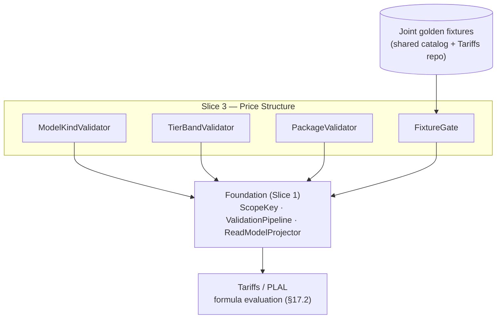

Created:  2026-08-24 by Virtuozzo International GmbH
Updated:  2026-08-24 by Virtuozzo International GmbH

<!-- CONFLUENCE_TITLE: [BSS]: Pricing — Price Structure & Model Kinds (Design, Slice 3) -->
<!-- Related: ../PRD.md, ../DESIGN.md, ./01-foundation.md | Owners: BSS Product Catalog team -->

# DESIGN — Price Structure & Model Kinds (Slice 3)

<!-- toc -->

- [1. Context](#1-context)
  - [1.1 Overview](#11-overview)
  - [1.2 Purpose](#12-purpose)
  - [1.3 Actors](#13-actors)
  - [1.4 References](#14-references)
  - [1.5 Scope](#15-scope)
  - [1.6 Constraints & Assumptions](#16-constraints--assumptions)
  - [1.7 Naming & Design-Introduced Names](#17-naming--design-introduced-names)
  - [1.8 Context & Dependencies](#18-context--dependencies)
- [2. Actor Flows (CDSL)](#2-actor-flows-cdsl)
  - [Author Price Rows](#author-price-rows)
- [3. Processes / Business Logic (CDSL)](#3-processes--business-logic-cdsl)
  - [Model-Kind Validation](#model-kind-validation)
  - [Tier-Band Validation](#tier-band-validation)
  - [Package Pricing Validation](#package-pricing-validation)
  - [Level Aggregation Authoring (D-44)](#level-aggregation-authoring-d-44)
  - [Conformance Fixture Gate](#conformance-fixture-gate)
- [4. States (CDSL)](#4-states-cdsl)
  - [Price Row State Machine](#price-row-state-machine)
- [5. API Surface](#5-api-surface)
- [6. Data Model](#6-data-model)
- [7. Events & Alarms](#7-events--alarms)
- [8. Definitions of Done](#8-definitions-of-done)
  - [Explicit Model Kind](#explicit-model-kind)
  - [Tier Bands](#tier-bands)
  - [Package Pricing](#package-pricing)
  - [Level Aggregation](#level-aggregation)
  - [Conformance Gate](#conformance-gate)
- [9. Acceptance Criteria](#9-acceptance-criteria)
- [10. Non-Functional Considerations](#10-non-functional-considerations)

<!-- /toc -->

## 1. Context

### 1.1 Overview

This slice owns the **structure of a price row**: the explicit `modelKind`
(`flat | per_unit | graduated | volume | package`), tier-band validation under the
`[fromQty, toQty)` convention, package (block) pricing fields, the usage evaluation-policy
placement rules (`tierAggregationWindow`, `billingGranularity`), and the **joint
golden-conformance-fixture gate** that blocks publish of any `modelKind` Tariffs cannot
provably evaluate. Rows live on the Foundation's canonical scope key and publish through the
Foundation pipeline; the **math is never computed here** — Tariffs applies the formula per
the §17.2 conformance mapping.

**Traces to**: `cpt-cf-bss-pricing-fr-model-kind`, `cpt-cf-bss-pricing-fr-tier-validation`,
`cpt-cf-bss-pricing-fr-package-pricing`, `cpt-cf-bss-pricing-fr-model-kind-conformance`,
`cpt-cf-bss-pricing-fr-per-seat`,
`cpt-cf-bss-pricing-fr-level-aggregation`
(the shared amount/currency/precision checks are Foundation-owned —
`fr-price-amount-validation` is claimed there, one owner per FR; 2026-07-31 P2 fix.
`fr-level-aggregation` joined this list by D-68, 2026-07-29 — one of the two FRs no
slice had claimed)

### 1.2 Purpose

Guarantee that every published price row is **unambiguously evaluable**: the model kind is
explicit and frozen (no rating-time default), tier bands cannot overlap, gap, or close the top (any quantity is always rateable — D-17), package fields are structurally exclusive with tier fields, and no kind
publishes without a version-controlled joint fixture proving catalog↔Tariffs agreement —
eliminating the class of silent mispricing bugs at band edges and kind mismatches.

### 1.3 Actors

| Actor | Role in Slice |
|-------|---------------|
| `cpt-cf-bss-pricing-actor-finance-manager` | Authors amounts, model kinds, tier bands |
| `cpt-cf-bss-pricing-actor-rating` | Consumes `modelKind` + bands + evaluation policy; resolves policy fields deterministically; co-owns golden fixtures (consolidated gear — rating ADR-0002) |
| `cpt-cf-bss-pricing-actor-subscriptions` | Supplies `subscription_seat_count` for `per_unit` rows at rating time |

### 1.4 References

- **PRD**: [PRD.md](../PRD.md) — §6.2, §17.1 (structure kinds), §17.2 (conformance mapping), §17.4 (validation rules)
- **Design**: [01-foundation.md](./01-foundation.md) — scope key (§4.1), publish contract (§4.2), money constraint
- **Dependencies**: Foundation (Slice 1); co-required with plan-definition (Slice 2) — the cycle shape decides which `chargeKind` rows a plan needs; reserved-capacity attributes extend the usage row in Slice 10.

### 1.5 Scope

**In scope**: `modelKind` enum + explicitness; `[fromQty, toQty)` band validation (ascending,
non-overlapping, contiguous, always-open top — D-17); `package` fields + structural exclusivity;
`per_unit` `quantitySource` persistence; evaluation-policy placement (usage-only fields);
amount/currency/precision validation (delegating the shared checks to the Foundation);
the conformance-fixture publish gate.

**Out of scope**: formula evaluation, graduated-vs-volume math, round-up math (Tariffs);
tier resets / `Q` derivation semantics (Tariffs; catalog persists the window enum only);
reserved-rate attributes and derived meters (Slice 10); price overlays/overlays (Slice 9);
windows (Slice 7).

### 1.6 Constraints & Assumptions

Inherits Foundation C-set. Slice-3-specific:

| # | Topic | Assumption (default) | Source |
|---|-------|----------------------|--------|
| Q1 | Band convention | Half-open `[fromQty, toQty)`; the top band is **always open** (`toQty = null`) — a closed top fails publish (`TIER_TOP_CLOSED`, D-17): quantity capping is owned by entitlement **quotas** (Subscriptions enforces), per-period fee caps are Tariffs Future | PRD §6.2; D-17 |
| Q2 | Aggregation derivation | `tierAggregationWindow` defines **when** `Q` resets; derivation is the row's authorable `aggregationFunction ∈ {sum (default), peak, time_weighted}` (**D-44**, launch): non-`sum` folds gauge samples per `aggregationGranularity {hour, day}` granule (max / step-integral) and `Q` = Σ granule folds — **additive**, so band math, supersession continuity, and `bandOffsetQ` are untouched; frozen in `pricingSnapshotRef`; `last`/`unique` Future; no composite co-occurrence at launch | PRD §1.4; D-44; rating T-D-17 |
| Q3 | Volume semantics | Catalog `volume` maps to Tariffs **Variant A only** (single rate on total `Q`); Variant B (per-tier block fee) is dropped and not authorable | PRD §17.2 |
| Q4 | Fixture repo | Golden fixtures are version-controlled in a shared catalog+Tariffs repo **before code**; the publish gate reads a per-tenant-independent fixture registry | PRD §13 |
| Q5 | Zero amounts | `0` is a valid amount (free tier, `trial`/`intro`, first graduated band); negatives rejected (typed credit rows are Future) | PRD §17.4 |
| Q6 | Included allowance | Authored `includedAllowance {quantity, rolloverPolicy}` (D-45) **compiles at publish, as a projection** (D-130 — the authored declaration, kind and bands stay the row's truth; the compiled artifacts are materialized into the read model / `pricingSnapshotRef` and never written back): `none` → `$0` first band `[0, N)` + offset authored bands + frozen first-class marker (band math unchanged); `carry` → D-43 per-period promotional grant (Billing executes; no catalog balance). `sum` rows only; never combined with an **authored** `$0` first band (double-free, publish-blocked) | PRD §1.4/§6.10; D-45; D-130 |

### 1.7 Naming & Design-Introduced Names

Reuses the PRD glossary; inherits Foundation mechanics. Not restated.

Design-introduced names (Slice 3):

| Name | Meaning |
|------|---------|
| `ModelKindValidator` | Registered rules: explicit kind, kind-specific required/forbidden fields |
| `TierBandValidator` | Registered rules: ordering, non-overlap, contiguity, top-band policy under Q1 |
| `PackageValidator` | Registered rules: `packageSize`/`packagePrice` presence + structural exclusivity with tier-band fields |
| `FixtureGate` | The publish-time check that the row's `modelKind` (and the reservation / `level-aggregation` (D-44) / `trailing_tier` (D-40, S10 `inst-tt-fixture`) variants) has a green joint golden fixture |

### 1.8 Context & Dependencies

**Consumed:** the fixture registry (Q4). **Produced:** the price-structure portion of the read
model — `modelKind`, ordered bands, `packageSize`/`packagePrice`,
`quantitySource`, evaluation-policy fields — frozen in `pricingSnapshotRef` for Tariffs.

## 2. Actor Flows (CDSL)

### Author Price Rows

- [ ] `p1` - **ID**: `cpt-cf-bss-pricing-flow-price-author`

**Actor**: `cpt-cf-bss-pricing-actor-finance-manager`

**Success Scenarios**:
- A draft price row is authored on the canonical scope key with an explicit `modelKind` and its kind-specific fields; `PriceCreated` emits per row
- Tiered rows carry ordered `[fromQty, toQty)` bands; usage rows carry `billingGranularity` (+ `tierAggregationWindow` when tiered); a tiered row MAY additionally carry the Slice-10 `tierQualificationWindow` primitive (`current` \| `trailing_period`, D-40 / [`design/10-advanced-primitives.md`](./10-advanced-primitives.md)) — a **third, orthogonal** window that qualifies the rate tier from the prior period and locks it, distinct from `tierAggregationWindow` (counter reset) and `billingGranularity` (billing cadence) — **and the three stay distinct even where two of them spell a value the same way**: since D-313 `per_hour` is a member of both the reset set and the cadence set, and it means different things in each (when the counter empties; how large one billable unit is). A row may carry it in one, the other, or both; what it may not do is combine an hourly reset with a `per_day` unit, which is `TIER_AGG_WINDOW_INCOMPATIBLE`

**Error Scenarios**:
- Duplicate active scope key without supersession → `DUPLICATE_SCOPE_KEY` (409, Foundation)
- Tiered row without a `modelKind` → `MODEL_KIND_MISSING` (422)
- Precision above the currency's ISO 4217 minor unit → `PRECISION_EXCEEDED` (422, Foundation)

**Steps**:
1. [ ] - `p1` - API: POST /bss-pricing/v1/plans/{planId}/prices (draft row; idempotency key honored; scope-key axes defaulted by the Foundation `ScopeKey`) - `inst-pr-create`
2. [ ] - `p1` - Persist `modelKind` + kind-specific fields (bands / package / `quantitySource`); shared amount/currency/precision checks run in the Foundation - `inst-pr-fields`
3. [ ] - `p1` - PATCH while `draft`; published rows are append-only (change = supersession, Foundation §4.3) - `inst-pr-mutate`
4. [ ] - `p1` - **RETURN** 201 (draft row, ETag). **Validation split (D-21):** all **row-local** checks run at save *and* re-run at publish — model-kind shape (explicit kind, kind×chargeKind matrix, required/forbidden fields), band-set geometry (ordering, overlap, gap/contiguity, zero-width, open top), precision, evaluation-policy placement, scope-key duplication (PRD AC #12's "save/publish MUST fail" for band geometry is satisfied at save). **Aggregate/cross-entity** checks run at publish only: fixtures, window coverage, phase coverage, hybrid completeness, meter injectivity - `inst-pr-return`

## 3. Processes / Business Logic (CDSL)

### Model-Kind Validation

- [ ] `p1` - **ID**: `cpt-cf-bss-pricing-algo-model-kind`

**Input**: a draft price row at publish; **and, for the key-contradiction subset
only, at the authoring write** (D-312)
**Output**: pass, or enumerated fail-closed violations

**Stage (D-312).** Every step below runs at the publish pre-check, unchanged. The
steps marked **`@write`** *also* run on `POST`/`PATCH` of a price row and refuse the
request there with the same enumerated envelope. A step qualifies for `@write` when
**all of its operands are present in the request and one of them is an immutable
component of the scope key** — `chargeKind` above all — the key being uneditable
after create (`PatchPriceRequest.scope_key`, when present, must equal the stored
one). Such a request is complete and knowably unpublishable when it arrives, and the
only call that resolves it retracts the field just sent rather than adding anything.
A step whose fault is an **absent** operand never qualifies, and neither does one
whose operands are all mutable content: both are resolved by a later call that adds
information, which is the multi-call assembly §4.2 exists to protect. So tier bands
on a `flat` row stay at publish — `model_kind: graduated` resolves that — while
`billingGranularity` on a `recurring` row does not, because `recurring` is fixed.

**Steps**:
1. [ ] - `p1` - `modelKind ∈ {flat, per_unit, graduated, volume, package}` MUST be explicit; a tiered row with no kind MUST NOT publish ("tiered (unspecified)" is not publishable, §17.1); no implicit default exists at rating time - `inst-mk-explicit`
2. [ ] - `p1` - **Kind-specific required fields**: `per_unit` → unit price + (**non-usage rows**) `quantitySource` (`subscription_seat_count | manual`, and the fixed quantity for `manual`; a `per_unit` **usage** row takes its quantity from the meter — `quantitySource` forbidden, 2026-07-28 review fix, confirmed 2026-07-31); `graduated`/`volume` → ≥ 1 tier band; `package` → `packageSize`/`packagePrice`; `flat` → single amount - `inst-mk-required`
3. [ ] - `p1` - **Kind-specific forbidden fields**: tier-band fields absent on `flat`/`per_unit`/`package` (publish-stage: both operands are content); **`@write` (D-312)** — `tierAggregationWindow`/`billingGranularity` are **usage-row only** — presence on `flat` (never a usage row — see 3a) or `per_unit` **non-usage** rows is refused at the authoring write and fails publish with `EVAL_POLICY_MISPLACED` (§17.4 evaluation-policy placement; a `per_unit` usage row carries `billingGranularity` like every usage row — 2026-07-28 review fix) - `inst-mk-forbidden`
3a. [ ] - `p1` - **`@write` (D-312). Kind×chargeKind matrix (D-18; completed 2026-07-28 review fix, confirmed 2026-07-31)** — the full legality matrix: `flat` and `per_unit` are legal on **non-usage** rows; `per_unit`, `graduated`, `volume`, `package` are legal on **`usage`** rows (a `per_unit` usage row is the plain untiered metered rate — unit price × metered `Q`, `billingGranularity` required like every usage row, no `quantitySource`); `flat` on a `usage` row, and `graduated`/`volume`/`package` on a `recurring`/`one_time`/`one_time_setup` row, fail publish (`MODEL_KIND_CHARGEKIND_MISMATCH`): the tier machinery presupposes a metered quantity stream, and no `Q` semantics exist for non-usage rows. Tiered per-seat pricing (bands over seat count on recurring rows) is Future scope (§17.8) - `inst-mk-chargekind`
4. [ ] - `p1` - The catalog computes **no** charge: kinds are flags Tariffs maps to formulas one-to-one per §17.2; catalog `volume` = Variant A only (Q3) - `inst-mk-nocompute`

### Tier-Band Validation

- [ ] `p1` - **ID**: `cpt-cf-bss-pricing-algo-tier-bands`

**Input**: a `graduated`/`volume` row's band set
**Output**: an ordered, gapless, non-overlapping band set in the read model (+ top-band policy)

**Steps**:
1. [ ] - `p1` - Bands sorted ascending by `fromQty`; any overlap fails; any gap fails (contiguity under `[fromQty, toQty)`: next `fromQty` = previous `toQty`); each band MUST satisfy `toQty > fromQty` when `toQty` is non-null (`TIER_BAND_EMPTY`); an advisory (non-blocking) warning is emitted when any band's effective unit price exceeds the previous band's (non-volume-discount pattern) — carried in the Foundation validation report's `warnings[]` channel under the code **`TIER_BAND_PRICE_INCREASE`** (Foundation §3.3; **D-160**, 2026-08-03: the rule and the channel were here from the start and the code was named nowhere, so the implementation had to invent a token to put in the report — an advisory is code-carrying exactly as a violation is). **Geometry is judged over the band set sorted by `fromQty`, never over authoring order** (2026-08-02, found implementing): `pricing_price_tier_band` is keyed `(price_id, from_qty)` and carries no ordinal, so authoring order does not survive persistence — a verdict that depended on it would differ between the save-time pre-check and the identical re-run inside the publish commit (§4.2), which is the one divergence those two runs must never have. **The advisory does not fire on a rise out of a free opening band** (same date, same source): `$0` then priced is how an allowance is hand-authored and is the shape the D-45 compile projects, so warning on it would fire on nearly every allowance row and train authors to ignore the channel; the rule's subject is a ladder that gets dearer as you buy more, which free-then-priced is not **Read-side consumers rely on this and one of them now says so (D-324, 2026-08-16):** the frozen `migrated-origin` payload renders its band set ascending by `fromQty` on this guarantee alone, the storage carrying no ordinal of its own. - `inst-tb-order`
2. [ ] - `p1` - First band starts at the row's quantity origin (`fromQty = 0`); a `$0` first band is valid (Q5) — since D-45 the **preferred** authoring of "N included" is the first-class `includedAllowance` (Slice 10 `AllowanceCompiler` **projects** the same `$0`-band shape + a frozen marker into the read model / snapshot at publish, leaving the authored bands in `pricing_price_tier_band` untouched — D-130); a hand-authored `$0` band stays legal but carries no marker, and combining a hand-authored `$0` first band with a declaration on one row is the double-free publish failure (`ALLOWANCE_DOUBLE_FREE`, Q6). Because the compile never writes back, the check reads **authored** bands on both sides and a re-published, superseded, repriced or cloned allowance row can never trip it against the compiler's own output (D-130) - `inst-tb-first`
3. [ ] - `p1` - **Top band is always open (D-17)**: `toQty = null` REQUIRED on the top band; a closed top fails publish (`TIER_TOP_CLOSED`) — "price undefined above X" is never the commercial intent: quantity capping is an entitlement **quota** (grant set; Subscriptions enforces), per-period fee caps are Tariffs Future (§17.8), and a different price above X is simply another band. Any quantity is therefore always rateable on a tiered row — "sold but unrateable" is impossible by construction - `inst-tb-top`
4. [ ] - `p1` - Tiered usage rows — **and `package` usage rows** (`inst-pk-window`) — MUST carry `tierAggregationWindow` (`calendar_month | invoice_period | subscription_lifetime | per_event | per_hour` — the last by D-313). **"Tiered" here is the row's *presented* shape, not its authored `modelKind` (normative, D-317 clause (1), 2026-08-15; the clause has bound the presented shape since D-45's compile landed and no document said so).** The window is owed by whatever **publishes** a band ladder, and since the included-allowance compile that is no longer the same set of rows as `modelKind ∈ {graduated, volume}`: an untiered `per_unit` usage row carrying `includedAllowance {N, none}` publishes as `[0, N) @ $0`, `[N, null) @ rate` (S10 `inst-ac-band`), which is a tier counter. Read on the authored kind this clause was silent about exactly that row — and the counter it never asked to reset is the one holding the **allowance**, so with no window the `N` free units are granted once for the subscription's whole lifetime instead of once per period. Because D-130 makes the compile a projection, the authored `modelKind` is untouched and there is nothing on the row for an authored reading to see. On every row the compile does not fire for, presented and authored are the same kind and this clause binds exactly what it always did; derivation of the in-window `Q` is the row's `aggregationFunction` per Q2/D-44 — `sum` (default) window-sum, or the non-`sum` granule fold (`peak`/`time_weighted`, authoring rules in this slice's Level Aggregation algorithm) whose sum-of-folds `Q` is additive, so band math is unchanged either way - `inst-tb-window`
5. [ ] - `p1` - **Band units (normative):** `fromQty`/`toQty` are expressed in **billable units after `billingGranularity` quantization** (e.g. `per_hour` → band quantities are hours, never raw seconds); the read model documents the unit so catalog and Tariffs cannot diverge on it - `inst-tb-units`
6. [ ] - `p1` - **Window continuity across supersession (normative):** the tier counter `Q` is derived per **`(subscription, meter, dimensionKey, window)`** (the canonical 4-tuple agreed with Rating — SEAMS M7; `dimensionKey` = the empty tuple until OSS dimensional emission lands, so undimensioned plans read as the single empty-tuple counter) — it belongs to the subscription's usage history, **not** to a price-row version — and the key is **phase-blind** (D-89, 2026-07-31 review fix): a **phase conversion never resets the counter** either, which is why a phase-scoped usage override must preserve the same unit/counter fields (S2 `inst-ph-override-units`). Superseding a row (new bands, new price) does **NOT** reset an in-window counter, and `subscription_lifetime` `Q` in particular survives every supersession/versioning **and every phase conversion**; the new row's bands are simply applied to the continued `Q`. Requires its own joint golden fixture (a supersession mid-window scenario **and a phase-conversion mid-window scenario**, D-89) in the Slice 3 conformance registry - `inst-tb-window-continuity`
7. [ ] - `p1` - **Succession unit guard (normative, D-82, 2026-07-30 review fix; `model_kind` added by D-98, 2026-07-31; scope corrected by D-127 and `included_allowance` added by D-129, 2026-08-01):** because the counter continues, a **usage row landing on an occupied published canonical scope key** MUST NOT change the fields the continued `Q` is denominated in, derived from, **or priced by** — the successor MUST carry the predecessor's `meter`, `dimensionKey`, **`model_kind`**, `billingGranularity`, `aggregationFunction`, `aggregationGranularity`, `tierAggregationWindow`, `tierQualificationWindow`, **`package_size`** (D-122, 2026-07-31: block math is non-linear in the window — D-58's own argument — and rating counts blocks by the T-D-12 **cumulative ceil-diff**, which presupposes one block size per window, so a mid-window `package_size` change re-buckets the already-accumulated `used` exactly like the D-98 kind flip; `package_price_minor` remains the legitimate price lever) **`reservationFlavor`** (D-254), **`maxHoldGranules`** (review M-3, 2026-08-19: past the bound the level reads 0, so a successor that moves it inherits a continued counter under a different rule for what a gap is worth) **and — on a row whose `includedAllowance.rolloverPolicy = carry` — `included_allowance` itself** (D-129: that declaration compiles into a **plan-scoped**, revision-immutable `pricing_plan_grant` row (S10 `inst-ac-carry`), which a supersession cannot rewrite because it opens no plan revision; changing a carry allowance is therefore structural and routes through plan revisioning, exactly like a unit field — a `none`-policy allowance carries no plan-scoped artifact and stays a free row-local lever) unchanged; any difference fails publish (`SUPERSESSION_UNIT_MISMATCH`, 422, offending fields named).

**`model_kind` is compared twice, because since D-45 a row has two of them (normative, D-317 clause (2), 2026-08-15).** `model_kind` is on this list for D-98's reason — the **formula** that prices the continued counter must not move — and since the included-allowance compile that formula is the **presented** kind. The two part company on exactly one shape: an untiered `per_unit` row carrying `includedAllowance {N, none}` publishes as the ladder `[0, N) @ $0`, `[N, null) @ rate` (S10 `inst-ac-band`) with its authored `model_kind` untouched, because D-130 makes the compile a projection and leaves an authored comparison nothing to see. Introducing or dropping that declaration mid-window is therefore D-98's own defect through a field nobody had listed: the predecessor accumulated its counter under **no bands at all** and the successor applies a band set whose first band is the allowance — start `Q` at zero and the subscriber is granted `N` free units mid-period on top of what they already bought, continue it and the allowance is silently consumed by quantity billed at full rate before it existed, and the two differ by `N × rate` on every subscriber on the key. Nothing in this set says which, so neither is a thing to publish. So the **presented** kind is compared as well, and the comparison reports under its own name — `includedAllowance (presented modelKind)` — because the remediable operand is the **declaration**, and a finding naming `model_kind` on two rows that both read `per_unit` is not remediable at all. What stays a free price lever is the **quantity** of an allowance on a row that presents a ladder on both sides: `100 → 250` on an untiered carrier supersedes normally, and a `graduated` row presents `graduated` with or without a declaration. The `carry` clause above is untouched and is a different argument on the same field — it binds a plan-scoped grant row rather than the pricing formula.

**Which successors it binds (D-127, 2026-08-01 review fix):** the guard binds the **key**, not the mechanism — **both** sanctioned producers of `published → superseded` (Foundation §4.3): the interactive **supersession unit** (S7 `inst-su-compose`) **and the grandfathering cutover's `all_subscriptions` successor** (S7 `inst-co-successor`), which lands on the predecessor's own scope key (D-100) and inherits the identical continued counter. Both set `supersedes_price_id` on the successor, which is the guard's comparison referent. Before this correction the rule read "a *usage-row supersession*" and was invoked from `inst-su-compose` alone, so a cutover successor could flip `per_hour → per_day` — the ×24 band-edge class through its fifth door, after supersession (D-82), the kind flip (D-98), the phase axis (D-89) and the plan change (D-113), and on the one path that is *always material* and therefore felt safe. Without it a `per_hour` → `per_day` successor applies an hours-denominated continued `Q` to day-denominated bands — the D-77 ×24 band-edge class reintroduced through supersession — a `meter` change silently reads a different counter stream, and a `graduated → volume`/`package` flip mid-window re-prices the **already-accumulated** window total under new math (Variant A applies the selected band's single rate to the whole window `Q`, including units already rated marginally under the predecessor — D-98). Supersession is a **price** change on one key (new amounts, new bands); changing what or how the key meters — or which formula prices it — is **structural** and routes through plan revisioning + migration (Foundation §4.3 mechanism taxonomy). Binds every usage row (`per_unit`/`graduated`/`volume`/`package`); the supersession-continuity fixture carries the negative unit-change **and kind-flip** scenarios - `inst-tb-supersession-units`

### Package Pricing Validation

- [ ] `p2` - **ID**: `cpt-cf-bss-pricing-algo-package`

**Input**: a `modelKind=package` row
**Output**: `packageSize`/`packagePrice` in the read model; structural exclusivity enforced

**Steps**:
1. [ ] - `p2` - `packageSize > 0` (units per block) and `packagePrice ≥ 0` (per block) MUST be present; tier-band fields MUST be absent; publish rejects otherwise - `inst-pk-fields`
1a. [ ] - `p2` - **Accumulation window REQUIRED (normative, D-58, 2026-07-29 review fix):** a `package` row MUST carry `tierAggregationWindow` — it is the window over which `used` accumulates **before** block round-up, and publish fails without it (`EVAL_POLICY_MISSING`, 422). Block math is **non-linear in the window**, so the field is not tier-specific bookkeeping: 150 units in a month folds to `ceil(150/100) = 2` blocks under `invoice_period` but to 30 blocks if a daily fold is assumed, a 15× spread on the same published row. `billingGranularity` does **not** supply this — it quantizes the quantity, it does not bound a period (the same asymmetry the PRD already resolves explicitly for `volume`, whose single rate is applied "on total `Q` within `tierAggregationWindow`") - `inst-pk-window`
2. [ ] - `p2` - The round-up math (`blocks = ceil(used / packageSize)`, `charge = blocks × packagePrice`) is **Tariffs-owned** and folds over `tierAggregationWindow` per `inst-pk-window`; the read model exposes the three fields only - `inst-pk-math`

### Level Aggregation Authoring (D-44)

- [ ] `p1` - **ID**: `cpt-cf-bss-pricing-algo-level-aggregation`

**Input**: a usage price row's `aggregationFunction` / `aggregationGranularity` / `maxHold` declaration
**Output**: the frozen level-aggregation policy in the read model / `pricingSnapshotRef`; publish blocked on any invalid combination

**Steps**:
1. [ ] - `p1` - **`@write` (D-312) for the non-usage placement half only; the `sum`-row granularity half is content-against-content and stays at publish.** A usage row MAY author **`aggregationFunction ∈ {sum (default), peak, time_weighted}`** and, for non-`sum`, **`aggregationGranularity ∈ {hour (default), day}`** (D-44). Presence of either field on a non-usage row, an unknown value, **or `aggregationGranularity` present on a `sum` row** (no granule fold exists to parameterize — forbidden, not ignored, exactly like `maxHold`; 2026-07-30 review fix) fails publish (`LEVEL_FIELDS_INVALID`); both freeze into `pricingSnapshotRef` — the catalog authors the policy and never computes a fold (Rating owns the granule fold per rating T-D-17) - `inst-la-fields`
2. [ ] - `p1` - **Unit consistency (publish check):** on a non-`sum` row the meter MUST be **level-shaped** (collector `gauge` kind — verified against the registry's metering-unit declaration) and the **sample unit = the level unit** (GB, cloudlet); the row's **billable** unit is `level unit × granule duration` — level·granule-**hours** for `granularity = hour` (GB·h, cloudlet·h), level·granule-**days** for `granularity = day` (GB·day) — declared by the SKU exactly as a composite output unit is. A non-`sum` row whose meter is not gauge-kind, or whose SKU-declared billable unit does not match `level unit × granule` **for the row's declared granularity**, fails publish (`LEVEL_UNIT_MISMATCH`) - `inst-la-units`
   - **Implementation status (2026-08-02):** this rule and `inst-la-composite` are the two Slice-3 checks that read the **registry's** metering-unit declaration, and the Product & SKU registry has no client in this repository yet — so neither is enforced today and both codes are emitted nowhere. The gap is stated rather than stubbed: a rule that always passes reads as enforcement and is worse than a visible absence. Same class as Slice 2's `inst-cmp-usagetype`; all three land together when the registry client does.
2a. [ ] - `p1` - **Granularity pairing (normative, D-77, 2026-07-30 review fix):** on a non-`sum` row `billingGranularity` MUST be the `billingGranularity` counterpart of the row's `aggregationGranularity` — `hour` ⇒ `per_hour`, `day` ⇒ `per_day`; every other pairing (`per_second`, `per_minute`, `whole_unit`, or a crossed `hour`/`per_day`) fails publish (`LEVEL_GRANULARITY_MISMATCH`, 422). Without it two rules of this slice name **different** units for the same band: `inst-tb-units` derives the band unit from `billingGranularity`, `inst-la-units` derives it from `level unit × aggregationGranularity`, and `inst-la-units` resolved the conflict by referring back to `inst-tb-units` — a circle. A `time_weighted`/`hour` row with `billingGranularity = per_day` therefore has bands in GB·h under one reading and GB·day under the other: a **24x error at the band edge** that passes every other stated check (`LEVEL_UNIT_MISMATCH` compares the SKU's declared unit against `level × granule`, never the granule against `billingGranularity`). With the pairing pinned, the two rules name the same unit **by construction**: on a level row the granule fold *is* the quantization, so tier-band quantities are expressed in the billable `level unit × granule` unit and `inst-tb-units` holds unchanged - `inst-la-granularity`
3. [ ] - `p1` - **`maxHold` (design-owned value, D-44):** a non-`sum` row MUST declare `maxHold` — an integer count of granules `≥ 1` (`max_hold_granules`; no default: the sampling-gap bound is a commercial statement and is authored explicitly, fail-closed). Missing or `< 1` fails publish, and so does `maxHold` **present on a `sum` row** (it has no gap-fold to bound — forbidden, not ignored) — both `LEVEL_FIELDS_INVALID`. Semantics are frozen for Rating: `hold_last` carries the last sample level across a gap for at most `maxHold` granules, beyond which the level reads **0** and the operator signal raises (fail-visible, never guessed — rating-side execution) - `inst-la-maxhold`
4. [ ] - `p1` - **No composite co-occurrence (launch):** a non-`sum` `aggregationFunction` on a row whose meter is a **derived (composite) meter** fails publish (`LEVEL_COMPOSITE_FORBIDDEN`) — composite inputs stay window-sum at launch (D-44). Reservation on a non-`sum` row is **capacity flavor only** (consumption fails `LEVEL_RESERVATION_CONSUMPTION_FORBIDDEN` — D-53, owned by Slice 10 `inst-rv-level`) - `inst-la-composite`
5. [ ] - `p1` - **Fixture gate:** the `level-aggregation` variant (granule fold, late-sample re-fold, `maxHold` gap — PRD §13/§17.2) is a registered `FixtureGate` variant: publish of any non-`sum` row without the green joint fixture is blocked (`FIXTURE_MISSING`), exactly like a `modelKind` variant - `inst-la-fixture`
6. [ ] - `p1` - `includedAllowance` never co-occurs with a non-`sum` row (D-45 launch constraint — the Slice 10 `AllowanceCompiler` rejects it, `ALLOWANCE_ON_NON_SUM`) - `inst-la-allowance`

### Conformance Fixture Gate

- [ ] `p1` - **ID**: `cpt-cf-bss-pricing-algo-fixture-gate`

**Input**: a publishing row's `modelKind` (and, from Slice 10, its reservation variant)
**Output**: pass, or a publish block naming the missing fixture

**Steps**:
1. [ ] - `p1` - The `FixtureGate` resolves the row's kind against the **joint golden conformance fixture registry** (Q4); publish of any `modelKind` lacking a green joint fixture is **blocked** - `inst-fx-gate`
2. [ ] - `p1` - `package` (repeating-block) and `per_unit` (external-quantity) each require their own joint fixture before first publish; the reservation variant of a usage row requires its own fixture (Slice 10 registers it into this gate) - `inst-fx-kinds`
3. [ ] - `p1` - The §17.2 table is the **single kind-to-formula source of truth**; catalog and Tariffs MUST NOT diverge from it — the gate is the enforcement point on the catalog side - `inst-fx-sot`

## 4. States (CDSL)

### Price Row State Machine

- [ ] `p1` - **ID**: `cpt-cf-bss-pricing-state-price-row`

**States**: draft, published, superseded
**Initial State**: draft (mutable, deletable)

**Transitions**:
1. [ ] - `p1` - **FROM** draft **TO** published **WHEN** the Foundation pipeline (incl. this slice's validators + the `FixtureGate`) passes and the publish commits; the row becomes append-only. **The commit flips exactly the rows its own re-validation judged, identified by `(price_id, row_version)` (normative, D-155, 2026-08-03, found while building the publish commit):** the transition is not "every `draft` row of the plan at flip time" but the set the rule set was run over, at the versions it was run at. A row whose version moved between the two is refused naming the row (`STALE_VERSION`, Foundation §3.3 — the D-141 token spent on what it was minted for); a row authored after the assembly is simply not in the set, stays `draft` and publishes with the next revision. Re-deriving the set at flip time reads as a conforming implementation of Foundation §4.2 and is not one: the window between assembly and flip holds the registry round-trip (D-156), so a concurrent create publishes a row no validator ever saw and a concurrent edit publishes a mutation of one that had passed — under a contract (`fr-publish-validation-failclosed`) whose whole promise is that neither can happen. The full input enumeration, and the one input held by a premise rather than a mechanism, are in Foundation §4.2 - `inst-ps-publish`
2. [ ] - `p1` - **FROM** published **TO** superseded **WHEN** a supersession within the same canonical scope key closes this row's window and opens the successor's (Foundation §4.3; no in-place mutation, no overlap). The transition executes **only** inside one of the **two** Slice 7 atomic units — never primitive-by-primitive: (a) the **supersession unit** (D-88, [`07-pricewindow-linkage.md`](./07-pricewindow-linkage.md) `algo-supersession`): successor row + window shorten + window schedule as one approval unit and one ACID commit; (b) the **grandfathering cutover** (`inst-co-supersede`, **D-100**, 2026-07-31 review fix), whose `all_subscriptions` successor lands on this row's own scope key — only the grandfathered copy moves to a new `cohort` key — so its commit must flip this row too or violate the Foundation's one-published-row-per-key partial `UNIQUE`. Naming the supersession unit as the *sole* path made a committable cutover impossible to build from the documents; Foundation §3.7's trigger whitelist had always anticipated both ("on supersession/**cutover**"). **The authoring door admits no change set carrying a moved row on an occupied key (D-183, 2026-08-05)** — `find_key_occupant` counts a draft *and* a published row as an occupant, and the draft swap guard is draft-only — which is why S5 §3's per-currency comparison has no authorable subject on a plan revision. **That refusal stays, and the successor is authored through the supersession unit's own door (D-195, 2026-08-05):** occupancy is a property of the door, so the authoring door keeps refusing a published occupant (`inst-pr-return`, D-21) while `inst-su-compose`'s door requires one and refuses a draft — which is also what finally gives the per-currency comparison an authored subject, the publish assembler's candidate set being `draft` + `published` with the published rows as its baseline - `inst-ps-supersede`
3. [ ] - `p1` - There is no deleted state for published rows; only never-published `draft` rows are deletable - `inst-ps-nodelete`
4. [ ] - `p1` - **The two edges above are the whole machine, and the storage layer enforces that on the draft plane too (normative, D-153, 2026-08-03, found while building the price table):** a `draft` row's only transition is to `published`; `draft → superseded` is **not** a transition and is refused physically, not merely unimplemented. The Foundation's append-only trigger is a **column whitelist** and is therefore scoped to published rows by construction — it had nothing to say about a draft row at all — while both scope-key partial `UNIQUE` indexes (Foundation §3.7) are predicated on a single `lifecycle_state`: `published` for one, `draft` for the other (D-148). A draft row flipped straight to `superseded` leaves both, so its canonical scope key reads **free on both planes**, the draft-plane uniqueness D-148 exists for is undone by one UPDATE, `inst-ps-nodelete` makes the row undeletable, and no supersession chain reaches it because it was never current. **No new code**: no endpoint offers the transition, so no caller can provoke it — this is the physical floor under a machine the engine already honours, the posture D-148's index takes - `inst-ps-draft-edges`

## 5. API Surface

| Method | Path | Purpose | Idempotency |
|--------|------|---------|-------------|
| `POST` | `/bss-pricing/v1/plans/{planId}/prices` | Create a draft price row on the scope key | client idempotency key |
| `PATCH` | `/bss-pricing/v1/plans/{planId}/prices/{priceId}` | Update a draft row | ETag |
| `DELETE` | `/bss-pricing/v1/plans/{planId}/prices/{priceId}` | Delete a **draft** row (published rows: 409) | ETag (D-141) |
| `GET` | `/bss-pricing/v1/plans/{planId}/prices` | List the plan's `draft` **and** `published` rows (**D-170**; paginated per Foundation §3.3 / D-125) | — |

**What the authoring plane validates (D-312).** Historically nothing of the row's
shape: the whole rule set sat at the publish pre-check, and this plane refused only
what the store itself decides — a duplicate canonical scope key, a stale entity tag,
a horizon off its eligibility class, an instant finer than the quantum, a value past
its column, an edit of a frozen row. **It now also runs the `@write` subset of §3's
row rules** — the steps whose operands are all present in the request with one of
them an immutable component of the scope key — and refuses a tripping request with
the same enumerated violation envelope the publish pre-check returns, rather than a
single message. Two shapes on one surface is deliberate: a client already parsing the
publish report parses this unchanged, and folding a multi-violation report into one
line would hide the second fault behind the first. The publish pre-check still runs
the **whole** set including this subset — the write-side check is an earlier refusal,
never a replacement, and §4.2's commit-time re-validation is untouched.

**Problem responses (RFC 9457):** `MODEL_KIND_MISSING` (422), `TIER_BANDS_OVERLAP` /
`TIER_BANDS_GAP` (422 — including a tiered row carrying **no bands at all**, and a first band that does not start at the quantity origin: both are the same fault, a quantity the row prices nowhere; 2026-08-02 clarification), `TIER_BAND_EMPTY` (422 — `toQty ≤ fromQty` on a non-open band),
`TIER_TOP_CLOSED` (422 — the top band must be open; capping belongs to quotas / per-period caps, D-17), `PACKAGE_FIELDS_INVALID` (422),
`EVAL_POLICY_MISPLACED` (422 — an evaluation-policy or quantity field on a row whose shape does not admit it; **this is also the code for the two directions the rule statements left unnamed** (2026-08-02, found implementing): tier bands present on `flat`/`per_unit`/`package`, and `quantitySource` present on a `per_unit` **usage** row or `manual_quantity` without `quantitySource = manual`. `QUANTITY_SOURCE_MISSING` covers only the absent direction, and a field that may not be there is a placement fault, not a missing one), `MODEL_KIND_CHARGEKIND_MISMATCH` (422 — `graduated`/`volume`/`package` on a non-usage row, or `flat` on a usage row; D-18 + 2026-07-28 review fix), `TIER_AGG_WINDOW_INCOMPATIBLE` (422 — `tierAggregationWindow = per_hour` beside `billingGranularity = per_day`: one billable unit would span twenty-four of the windows meant to band it independently; D-313. Its own code rather than `EVAL_POLICY_MISPLACED` because both values are authorable and each is correct alone — the fault is the pair, which is the shape the tier-qualification pairing rule already minted `TIER_QUAL_WINDOW_INCOMPATIBLE` for — see `design/10-advanced-primitives.md`. **The refusal is judged on any usage row carrying both values, tiered or not, and since 2026-08-15 it is no longer escapable by omission on one class of row (D-317 clause (1)):** a `per_unit` row compiled into a ladder by an `includedAllowance` now owes a `tierAggregationWindow` per `inst-tb-window`, so clearing the window — which used to leave such a row publishable — answers `EVAL_POLICY_MISSING` instead, and the two remedies D-313's own message names are the ones that remain. D-313 argued the pair over an operator-authored ladder and never over a compiled one; the reading holds unchanged, because what a compiled `[0, N) @ $0` opening band bounds per hour is the **allowance**, which under `per_day` units would be re-granted twenty-four times inside one billable unit), `EVAL_POLICY_MISSING` (422 — `tierAggregationWindow` unset on a
tiered **or `package`** usage row (`inst-pk-window`, D-58 — the `package` case had been omitted
from this description, 2026-07-31 review fix), or `billingGranularity` unset on a usage row; the
error references the allowed values per the PRD Glossary), `QUANTITY_SOURCE_MISSING` (422), `FIXTURE_MISSING` (422),
`AMOUNT_PLACEMENT_INVALID` (422 — a row missing the money column its kind prices from, or
carrying one of the others: `amount_minor` on `flat`, `unit_rate_nano` on `per_unit`, the band
column on `graduated`/`volume`, `package_price_minor` on `package`; §6 per-kind amount matrix,
2026-07-28 review fix, amended by D-311 on 2026-08-11 when `per_unit` moved off `amount_minor`),
`LEVEL_FIELDS_INVALID` (422 — `aggregationFunction`/`aggregationGranularity` on a non-usage
row, an unknown value, a non-`sum` row with `maxHold` missing, `< 1`, **or above the bound the
column can hold** (2026-08-02 wording fix: the gloss named only the lower half, so a reader had
no answer for the upper one — this code owns **both** ends, which is why §6 spells the column
`bigint` and the refusal stays a validation report rather than a storage overflow), or `maxHold`
**or `aggregationGranularity`** present on a `sum` row; D-44),
`SUPERSESSION_UNIT_MISMATCH` (422 — a usage row landing on an occupied published scope key —
the supersession unit **or the cutover successor**, D-127 — whose content changes
`meter`/`dimensionKey`/`model_kind`/`billingGranularity`/`aggregationFunction`/
`aggregationGranularity`/`tierAggregationWindow`/`tierQualificationWindow`/`package_size`, or
`included_allowance` on a `carry` row (D-129), or the **presented** `modelKind` where the compile
moves it (D-317, reported as `includedAllowance (presented modelKind)`);
D-82 + D-98 + D-122 + D-127 + D-129 + D-317 — the continued `Q` keeps its denomination, its pricing math, its
block bucketing, its plan-scoped allowance grant and the formula that prices it; offending fields named),
`LEVEL_UNIT_MISMATCH` (422 — non-`sum` row on a non-gauge meter, or the SKU-declared billable
unit ≠ level unit × granule; D-44),
`LEVEL_GRANULARITY_MISMATCH` (422 — on a non-`sum` row `billingGranularity` is not the
counterpart of `aggregationGranularity` (`hour` ⇒ `per_hour`, `day` ⇒ `per_day`);
`inst-la-granularity`, D-77 — otherwise `inst-tb-units` and `inst-la-units` name different band
units for one row), `LEVEL_COMPOSITE_FORBIDDEN` (422 — non-`sum` on a derived
(composite) meter; launch, D-44),
`DUPLICATE_SCOPE_KEY` (409 — Foundation-owned, referenced here; on the **draft** plane too since
D-148, §6), `STALE_VERSION` (409 — Foundation-owned, referenced here; the ETag precondition of
**both** `PATCH` and `DELETE`, D-141), `PRECISION_EXCEEDED` (422 —
Foundation-owned, referenced here; [`01-foundation.md`](./01-foundation.md) §3.3).
`ALLOWANCE_DOUBLE_FREE` and `ALLOWANCE_ON_NON_SUM` are **Slice-10-owned** (the
`AllowanceCompiler`), referenced here from `inst-tb-first`/`inst-la-allowance` — never
redefined. The publish-time report enumerates all violations.

**Every mutating verb on a draft row presents its ETag (normative, D-141, 2026-08-02, found
while building the draft-authoring plane).** `PATCH` always did; `DELETE`'s idempotency cell was
**empty**, so a draft row could be destroyed under an unknown version — the lost update
`fr-concurrent-edit` closes for `PATCH`, reopened on the one verb that leaves nothing behind to
reconcile. A mismatch is `STALE_VERSION` (409); an absent precondition is a malformed request
under the Foundation validation envelope, so **no new code** is minted. The token is the price
row's **own** version column (Foundation §3.7), never derived from the plan's — a per-row bulk
conflict means nothing if every row of a plan shares one version
([`12-operator-efficiency.md`](./12-operator-efficiency.md) `inst-bk-phase2`), and the
interactive editor and that loop meet exactly here. Leaving `DELETE` unconditional because a
draft row is cheap to recreate was rejected: what a blind delete destroys is a concurrent
editor's uncommitted work, not the row. Scope stated deliberately — this is the **`pricing_price`
draft row** rule; `DELETE /bss-pricing/v1/price-windows/{windowId}`
([`07-pricewindow-linkage.md`](./07-pricewindow-linkage.md) §5) carries an empty cell too and is
**not** moved by it, window cancellation being an always-material publish unit (D-62, D-99)
governed by `inst-co-single-pending`. **That token stays a bare row version** (**D-170**,
2026-08-03): the plan plane's tag gained a revision component because a plan route resolves to one
of two revisions, while a price route addresses **one row by `priceId`** — the tag and the row are
one to one, and there is nothing to disambiguate. The asymmetry between the two planes follows the
addressing, not a preference. Both travel in `If-Match`, which is **required** on every verb whose
Idempotency cell above reads `ETag` (**D-171**, Foundation §3.3, where the column's cells are
mapped onto their request headers once for every slice).

**What the authoring list returns** (**D-170**, 2026-08-03, found while building it). The `GET`
row above serves the plan's `draft` **and** `published` price rows, and nothing else. "Draft for
authors; published via read model" said where published content is *consumed*, never that this
list hides it — an author authoring a successor must see the row it will supersede without leaving
the surface, and the read model answers a different question (a frozen per-`CatalogVersion`
projection reached by a pin). `superseded` is excluded because it is history that is no longer
current on its key, which the Slice-12 history surface owns; `abandoned` is not a price-row state
at all (D-145 scopes it to the plan revision row). A caller needing another state set is asking for
a filter this set has not designed, and asking for it is a design change rather than a query
parameter.

## 6. Data Model

This slice populates the Foundation-owned `pricing_price` and owns `pricing_price_tier_band` (tenant-scoped,
SecureORM per Foundation §2.2 authz-gate + S5 `inst-rb-pep`; `pricing_` prefix per Foundation §3.7;
published rows append-only per Foundation §4.3):

**`pricing_price` (Foundation-owned; Slice-3 columns)** — the table below is **this slice's
share** of the row, never the whole table. The set's convention is that a slice declares a
`pricing_price` column where it owns that column's semantics, so the rest is homed elsewhere and
read from there: the `currency`/`region` axes and `tax_category_ref` in
[`04-currency-tax.md`](./04-currency-tax.md) §6, the recurring/proration columns in
[`06-consumer-contracts.md`](./06-consumer-contracts.md) §6, `price_eligibility` and
`grandfather_until` in [`07-pricewindow-linkage.md`](./07-pricewindow-linkage.md) §6, and
`reserved_*`, `discount_ref`, `min_qty_*`, `included_allowance` and `tier_qualification_window`
in [`10-advanced-primitives.md`](./10-advanced-primitives.md) §6 (2026-08-02: the pointer was
missing, so this list read as the table and `included_allowance` looked absent from the design
set).

**Before adding, removing or re-homing a `pricing_price` column, read the evaluation-policy
roster (D-162, [`01-foundation.md`](./01-foundation.md) §4.4).** Nine of this row's fields are
the roster that the `pricingSnapshotRef` evaluation-policy generation names, and a change to
that **set** — an addition, a removal, or a field crossing the boundary in either direction —
bumps the generation, in the log §4.4 declares, under the id of the decision making it.
Changing a rostered field's requiredness, enum values, default or meaning does **not**: the
generation tracks the shape of the evaluation input, not its semantics. Fields outside the
roster (identity, money, and the Slice-6 contract columns) move under their own contracts and
never touch it. Which nine is **§4.4's statement and is deliberately not copied here** — that
block is what the gear's guard reads, and two hand-maintained copies is how the D-127 class
re-enters (a list that can drift is a guard that differs):

| Column | Type | Notes |
|--------|------|-------|
| `model_kind` | `enum` | `flat \| per_unit \| graduated \| volume \| package`; NOT NULL on publish |
| `amount_minor` | `bigint` | Foundation-declared, **per-kind semantics owned here** (2026-07-28 review fix, confirmed 2026-07-31; **amended D-311, 2026-08-11**): REQUIRED (`≥ 0`, at the currency's ISO 4217 precision) on `flat` — the single amount — and **MUST be NULL on every other kind**, whose money lives in `unit_rate_nano` (`per_unit`), `pricing_price_tier_band.unit_price_nano` (`graduated`/`volume`) or `package_price_minor` (`package`), so no row carries two competing prices. **`per_unit` left this column under D-311**: it held an amount on `flat` and a multiplier on `per_unit`, and one column meaning two things by `model_kind` is the defect that decision names |
| `unit_rate_nano` | `bigint` | **D-311**, 2026-08-11. The `per_unit` **rate**, in 10⁻⁹ minor units. REQUIRED on `per_unit`, MUST be NULL on every other kind. `CHECK (unit_rate_nano >= 0)` on Postgres; on `SQLite` the domain type holds the rule (`pricing_customer_group_taxonomy`'s migration records why). Frozen on a published row by `pricing_price`'s migration, which the split had to carry over from `amount_minor` and did not, for the length of one commit |
| `quantity_source` | `enum` | `subscription_seat_count \| manual`; required for **non-usage** `per_unit`, forbidden on `per_unit` usage rows (the meter supplies `Q` — 2026-07-28 review fix) |
| `manual_quantity` | `bigint` | required when `quantity_source = manual`; frozen in snapshot |
| `package_size` | `bigint` | `> 0`; `package` only |
| `package_price_minor` | `bigint` | `≥ 0`; `package` only |
| `tier_aggregation_window` | `enum` | `calendar_month \| invoice_period \| subscription_lifetime \| per_event \| per_hour` (D-313); tiered **and `package`** usage rows (`inst-pk-window` — block round-up is non-linear in the window) |
| `billing_granularity` | `enum` | `per_second \| per_minute \| per_hour \| per_day \| whole_unit`; all usage rows. On a **non-`sum`** row it MUST pair with `aggregation_granularity` (`hour` ⇒ `per_hour`, `day` ⇒ `per_day`) — `inst-la-granularity`, D-77 |
| `aggregation_function` | `enum` | `sum (default) \| peak \| time_weighted`; usage rows only (D-44); frozen in snapshot |
| `aggregation_granularity` | `enum` | `hour (default) \| day`; non-`sum` rows only (D-44); the granule of the rating-side fold |
| `max_hold_granules` | `bigint` | `≥ 1`; REQUIRED on non-`sum` rows, forbidden otherwise (D-44 `hold_last` bound — beyond it the level reads 0 + operator signal, rating-side); frozen in snapshot. `bigint` like every other count on this row (2026-08-02 type fix — the earlier `int` was the only narrow count here, and the bound that matters is `LEVEL_FIELDS_INVALID`'s, so the width must never be the thing that refuses a value) |
| `meter` | `ref` | the published `meteringUnit` a usage row prices; feeds the Slice-2 injectivity rule |
| `dimension_key` | `text` | dimension discriminator on the `(meter, dimensionKey)` line (Slice-2 injectivity); **`NOT NULL DEFAULT ''`** — the empty string is the "empty tuple" sentinel, so the Slice-2 injectivity partial `UNIQUE` collides undimensioned rows instead of treating them as distinct NULLs (2026-07-28 review fix, confirmed 2026-07-31). Launch posture (SEAMS M6 joint wording, closed 2026-07-28): *declaration + freeze are in scope now (the catalog persists `dimension_key` structurally, Rating freezes the declared set in the snapshot); pricing dimension **values** are OSS-emission-gated* — rating design/03 §4.2 carries the same sentence |

**`pricing_price_tier_band`** (FK `price_id`; `graduated`/`volume` rows only). **Authored bands
only (D-130, 2026-08-01 review fix):** the D-45 allowance compile is a **projection** — it never
inserts, offsets or deletes a row here, so this table always holds exactly what the operator
authored and the compile stays idempotent by construction (the pre-D-130 in-place rewrite
destroyed its own input: the authored bounds were unrecoverable after the first publish, so
re-publish, supersession, repricing and clone of an allowance row had no defined re-entry —
`inst-ac-deterministic`'s "re-publish recompiles identically" had nothing to recompile *from*):

| Column | Type | Notes |
|--------|------|-------|
| `band_id` | `uuid` | PK |
| `price_id` | `uuid` | FK |
| `from_qty` | `bigint` | inclusive; ascending, contiguous |
| `to_qty` | `bigint` | exclusive; NULL = open top |
| `unit_price_nano` | `bigint` | the band **rate**, in 10⁻⁹ minor units (**D-311**, 2026-08-11 — renamed from `unit_price_minor`, which was whole minor units); `≥ 0` (`0` valid — Q5); unit prices only, no per-band flat fee (Q3). A band price is a multiplier, not an amount: what rounds to a minor unit is the product of a rate and a quantity, never the rate, and sub-minor-unit rates are the ordinary case in metered pricing. At whole minor units a `0.0150 / 0.0110` ladder and a `0.0230 / 0.0120` ladder both collapsed to `0.01` at every band |

**`pricing_conformance_fixture_registry`** (read-side of the shared fixture repo, Q4): `model_kind` /
`variant`, `fixture_ref`, `status` (`green | missing | stale`). The `FixtureGate` reads it at
publish. The `variant` axis also keys **cross-cutting scenario fixtures** (e.g.
`variant = supersession_continuity` on the tiered kinds, per `inst-tb-window-continuity`);
the continuity fixture **gates the first publish of any tiered usage kind** (alongside that
kind's own fixture) — ratified, D-22 — and carries the D-82 negative scenario (a
unit-changing successor is rejected at publish, `SUPERSESSION_UNIT_MISMATCH`), the D-98
kind-flip negative scenario, the D-122 `package_size`-change negative scenario, and the D-89
phase-conversion-mid-window continuity scenario. **The D-129 `carry`-allowance negative scenario in
that corpus is correct and currently unreachable, and it is not coverage of anything authorable
(recorded 2026-08-15).** The case supersedes a `carry`-allowance row with a changed quantity and
requires `SUPERSESSION_UNIT_MISMATCH`; it is green, and it is green because the publish validator
that answers the corpus runs the row-shape set and the succession pair guard, neither of which is
where `carry`'s refusal lives — `PRIMITIVE_RULES_UNBUILT` is a plan-level publish rule (Foundation
§3.3), so no row in the case reaches it. `carry` is refused on every authoring path and again at
publish, so no such predecessor and successor can exist in a store today. Both the D-129 clause and
the case **stay**: they are what `carry` will need on the day `pricing_plan_grant` lands, and the
whole point of recording this is that a green case in this family must not be read as evidence that
an authorable shape is covered. This table is **tenant-global** — an explicit,
documented carve-out from the SecureORM tenant-binding rule (Foundation §2.2
`constraint-authz-gate-fnd` + S5 `inst-rb-pep`): the fixture
corpus is a property of the *gear build*, not of any tenant, so the gate must read the same
rows for every tenant (a tenant-scoped copy would let one tenant's missing fixture pass
another's publish). It is therefore **read-only to all API paths** — no tenant-facing write
endpoint exists; rows are populated by **`FixtureRegistrySync`**, a gear background task
(Foundation §3.4) that reconciles the table against the shared fixtures repo at startup and
on refresh, marking a fixture `stale` when its `fixture_ref` no longer matches the corpus
(2026-07-28 review fix, confirmed 2026-07-31).

Key constraints: `CHECK (package_size IS NULL OR package_size > 0)` and
`CHECK (package_price_minor IS NULL OR package_price_minor >= 0)` — both columns are `package`-only
and therefore NULL on every other kind, so the nullable-tolerant spelling is the one that means
what the row means (2026-08-02 wording fix: SQL already passes NULL against a bare `> 0`, but a
reader building the table from the bare form infers `NOT NULL` and gets a schema no other kind can
insert into); `CHECK (unit_price_nano >= 0)`;
`CHECK (to_qty IS NULL OR to_qty > from_qty)` (no zero-width bands); structural exclusivity —
band rows forbidden unless `model_kind IN ('graduated','volume')`, enforced by a trigger or a
composite FK on `(price_id, model_kind)` (cross-table, not expressible as a row CHECK); the
package-fields-forbidden-with-bands half is the row CHECK
`CHECK ((package_size IS NULL AND package_price_minor IS NULL) OR model_kind = 'package')` on
`pricing_price` (2026-08-02: written out — the paragraph had described it in prose only); per-row band
contiguity/non-overlap enforced by the `TierBandValidator` at publish (order-dependent, not
expressible as a row CHECK); unique `(price_id, from_qty)`.

**Scope-key uniqueness is guarded on the draft plane too (normative, D-148, 2026-08-02, found
while building the draft-authoring plane):** a **second** partial `UNIQUE` over the same
canonical scope-key columns, predicated `WHERE lifecycle_state = 'draft'`, sits beside Foundation
§3.7's published-plane index. **All ten axes since D-196**, the usage pair included —
`uq_pricing_price_scope_key_current`'s migration widened both indexes to `COALESCE(meter, '')` and `dimension_key`, and this
clause read "the same eight" until 2026-08-09, when a bulk-import rule built from that count
refused work the store admits (D-283). It is the third place the eight-axis figure lived; the
other two were the migration that created the index and the register entry citing it. The two are independent by construction — their predicates are
disjoint — so a draft successor still coexists with the published row it will supersede, and
§3.7's only-expressible-form argument is untouched: it was an argument about which rows the
*published* index can see, never an argument against a second predicate. A violation renders as
the existing Foundation-owned `DUPLICATE_SCOPE_KEY` (409) — **no new code**. Without the index
D-21's save-time duplicate check is decided by a read: two concurrent creators on one key both
read "absent", both insert, and the operator learns of the collision only when one of them
publishes — told, correctly and uselessly, that a row they authored days ago collides with one
they cannot see, which is exactly the lateness D-21's save-time placement exists to prevent. That
check stays the fast, explanatory path; the index becomes the guarantee, the read-then-index
arrangement the published plane already has. Rejected: (a) leaving the check read-only and relying
on publish, which is D-21 reversed; (b) widening the published index to `IN ('draft', 'published')`,
which would make a draft successor collide with the very row it supersedes.

## 7. Events & Alarms

No new event names: `PriceCreated` on row authoring, `PriceUpdated` on supersession. **This door is the producer, and it has a second (normative, D-203, 2026-08-06):** the event was declared with the gear and emitted by nothing until then, so every consumer counting row creations counted zero. The cutover's copy and successor are born *published* inside its commit and never pass this door, so `inst-gc-commit` emits it too through the same spelling; two producers are what make the name true. The payload carries **no** version ref, because a draft is addressable at no `CatalogVersion`
(Foundation frozen set). A publish blocked by the `FixtureGate` is a synchronous 422; a
**stale** fixture (registry drift after publish) raises the operational alarm
`pricing.conformance.fixture_stale` (Warn) — the mispricing-risk signal that the §17.2
source-of-truth table and the fixture repo have diverged.

## 8. Definitions of Done

### Explicit Model Kind

- [ ] `p1` - **ID**: `cpt-cf-bss-pricing-dod-model-kind`

Every price row **MUST** persist an explicit `modelKind` with its kind-specific
required/forbidden field sets enforced at publish (per-unit `quantitySource`; usage-only
evaluation-policy placement); a tiered row without a kind **MUST NOT** publish; the catalog
computes no charge.

**Implements**: `cpt-cf-bss-pricing-algo-model-kind`, `cpt-cf-bss-pricing-flow-price-author`

**Touches**:
- API: `POST/PATCH /bss-pricing/v1/plans/{planId}/prices`
- DB: `pricing_price` (model-kind columns)
- Entities: `ModelKindValidator`

### Tier Bands

- [ ] `p1` - **ID**: `cpt-cf-bss-pricing-dod-tier-bands`

Tier bands **MUST** validate ascending, non-overlapping, contiguous under `[fromQty, toQty)`
with an **always-open top** (`toQty = null`; a closed top fails publish — `TIER_TOP_CLOSED`,
D-17: capping is owned by entitlement quotas / per-period caps) and no zero-width bands
(`toQty > fromQty`); tiered usage rows — **and `package` usage rows** (`inst-pk-window`, D-58) —
**MUST** carry `tierAggregationWindow`; band quantities are expressed in
billable units after `billingGranularity` quantization (the read model documents the unit).
A usage row landing on an **occupied published scope key** — the supersession unit **or the
grandfathering cutover's successor** (D-127) — **MUST NOT** change the unit/counter-determining
fields (`meter`, `dimensionKey`, `model_kind`, `billingGranularity`, `aggregationFunction`,
`aggregationGranularity`, `tierAggregationWindow`, `tierQualificationWindow`,
`package_size`) or, on a `carry`-allowance row, `included_allowance` (D-129), **or the presented
`modelKind` an `includedAllowance` moves on an untiered `per_unit` row** (D-317) — it fails publish
otherwise (`SUPERSESSION_UNIT_MISMATCH`,
D-82 + D-98 + D-122 + D-127 + D-129 + D-317); structural changes route through plan revisioning + migration.

**Implements**: `cpt-cf-bss-pricing-algo-tier-bands`

**Touches**:
- DB: `pricing_price_tier_band`
- Entities: `TierBandValidator`

### Package Pricing

- [ ] `p2` - **ID**: `cpt-cf-bss-pricing-dod-package`

A `package` row **MUST** persist `packageSize > 0`, `packagePrice ≥ 0`, and
`tierAggregationWindow` — the window `used` accumulates over **before** block round-up
(`inst-pk-window`, D-58, propagated here by D-70; absence fails publish with `EVAL_POLICY_MISSING`, since block math is
non-linear in the window and `billingGranularity` does not bound a period) — with tier-band
fields absent (publish rejects otherwise); the read model exposes the three fields and Tariffs
owns the round-up math, folded over that window.

**Implements**: `cpt-cf-bss-pricing-algo-package`

**Touches**:
- DB: `pricing_price` (package columns)
- Entities: `PackageValidator`

### Level Aggregation

- [ ] `p1` - **ID**: `cpt-cf-bss-pricing-dod-level-aggregation`

A usage row **MAY** author `aggregationFunction ∈ {sum (default), peak, time_weighted}` with
`aggregationGranularity ∈ {hour (default), day}` and a REQUIRED `maxHold` (granules, ≥ 1) on
non-`sum` rows, all frozen in `pricingSnapshotRef`; publish **MUST** fail on: level fields on
a non-usage row or invalid values (`LEVEL_FIELDS_INVALID`), a non-`sum` row whose meter is not
gauge-kind or whose SKU-declared billable unit ≠ level unit × granule
(`LEVEL_UNIT_MISMATCH`), a non-`sum` row whose `billingGranularity` is not the counterpart of
its `aggregationGranularity` (`LEVEL_GRANULARITY_MISMATCH`, D-77 — the pairing is what makes
`inst-tb-units` and `inst-la-units` name one band unit), non-`sum` on a composite meter
(`LEVEL_COMPOSITE_FORBIDDEN`), and a
non-`sum` row without the green `level-aggregation` joint fixture (`FIXTURE_MISSING`). The
catalog never computes a fold — Rating owns the granule fold (T-D-17); the launch product set
(cloudlet peak-per-hour, storage GB-month time-weighted) is authorable from this slice alone.

**Implements**: `cpt-cf-bss-pricing-algo-level-aggregation`

**Touches**:
- DB: `pricing_price` (`aggregation_function`, `aggregation_granularity`, `max_hold_granules`)
- Entities: `FixtureGate`, the registered level-authoring validators

### Conformance Gate

- [ ] `p1` - **ID**: `cpt-cf-bss-pricing-dod-conformance`

Publish of any `modelKind` lacking a green joint golden fixture **MUST** be blocked;
`package` and `per_unit` each carry their own fixture before first publish, and the
**supersession-continuity** scenario fixture (`inst-tb-window-continuity`) is registered on
the tiered kinds; the §17.2 mapping is the single kind-to-formula source of truth.

**Implements**: `cpt-cf-bss-pricing-algo-fixture-gate`

**Touches**:
- DB: `pricing_conformance_fixture_registry`
- Entities: `FixtureGate`

## 9. Acceptance Criteria

Delta over the Foundation testing architecture.

Unit:

- [ ] Band-edge cases: adjacent bands share the boundary exactly once (`[0,100) [100,null)`); overlap and gap both fail; a zero-width band (`toQty = fromQty`) fails (`TIER_BAND_EMPTY`); a closed top band fails (`TIER_TOP_CLOSED`); `$0` first band passes; a band whose effective unit price exceeds the previous band's emits the advisory warning (publish succeeds)
- [ ] Band units follow `billingGranularity` quantization (a `per_hour` row's bands count hours; a raw-seconds band definition is rejected/normalized per the documented unit)
- [ ] Kind field matrices: each kind's required/forbidden set; `per_unit` without `quantitySource` fails; `manual` without quantity fails; eval-policy fields on a `flat` non-usage row fail; `graduated` on a `recurring` row fails (`MODEL_KIND_CHARGEKIND_MISMATCH`)
- [ ] Amount placement: a `flat` row without `amountMinor` and a `graduated` row carrying one both fail (`AMOUNT_PLACEMENT_INVALID`); a `per_unit` row's `amountMinor` is its unit price; a `package` row prices only via `packagePriceMinor`
- [ ] Package exclusivity: bands + package fields together fail; `packageSize = 0` fails
- [ ] Level fields (D-44): `aggregationFunction` on a recurring row fails (`LEVEL_FIELDS_INVALID`); a `peak` row without `maxHold` (or `maxHold = 0`) fails; `maxHold` — or `aggregationGranularity` — on a `sum` row fails; a `time_weighted` row on a counter (non-gauge) meter fails (`LEVEL_UNIT_MISMATCH`); a SKU billable unit of `GB` on a `peak`+`hour` row fails (expected `GB·h`); a `time_weighted`/`hour` row with `billingGranularity = per_day` fails (`LEVEL_GRANULARITY_MISMATCH` — the 24x band-edge case, D-77), as does `per_second`/`per_minute`/`whole_unit` on any non-`sum` row, while `hour`+`per_hour` and `day`+`per_day` pass; `peak` on a composite meter fails (`LEVEL_COMPOSITE_FORBIDDEN`)

Integration (testcontainers):

- [ ] A graduated 3-band row publishes and its ordered bands + window appear in the read model exactly as authored
- [ ] A `volume` row publishes as Variant A (no per-band fee field exists to author)
- [ ] Publish with a `package` row while the registry lacks the package fixture is blocked (`FIXTURE_MISSING`); flipping the registry green unblocks
- [ ] Superseding a published row creates a new row + closes the window; UPDATE/DELETE of the published row is rejected by the DB role/trigger
- [ ] A supersession whose successor changes a unit/counter field — `per_hour` → `per_day`, a different `meter`, a different `tierAggregationWindow`, a `graduated` → `volume` kind flip (D-98), or a `package` row's `package_size` (D-122; a `package_price_minor` change alone publishes) — is rejected (`SUPERSESSION_UNIT_MISMATCH`, the fields named); an identical-unit successor with new bands publishes and the mid-window counter continues (D-82); a phase conversion mid-window continues the same counter against the (same-denomination) phase row (D-89)
- [ ] A **grandfathering cutover** whose `all_subscriptions` successor changes any of those fields is rejected the same way (`SUPERSESSION_UNIT_MISMATCH`, D-127 — the successor lands on the predecessor's own key and inherits its counter, so the guard binds the key, not the mechanism), while an identical-unit cutover successor commits; the successor carries `supersedes_price_id`, which is what the guard compares against
- [ ] A supersession of a `carry`-allowance row that changes `included_allowance` is rejected (`SUPERSESSION_UNIT_MISMATCH`, D-129 — the compiled grant is plan-scoped and revision-immutable, so the change is structural), while a `none`-allowance row's quantity change supersedes normally, and a plain price supersession of a `carry` row publishes with the compiled grant still resolving through the unchanged scope key
- [ ] The supersession-continuity fixture (`variant = supersession_continuity`) is registered green for the tiered kinds before their first publish; a mid-window supersession scenario keeps the tier counter `Q` continuous
- [ ] A `peak`/`hour` row (cloudlet) and a `time_weighted`/`hour` row (storage GB-month) each publish only with the green `level-aggregation` fixture (`FIXTURE_MISSING` otherwise); the frozen `aggregationFunction`/`aggregationGranularity`/`maxHold` triple appears in the read model exactly as authored; a `time_weighted`/**`day`** row validates its billable unit as level·granule-**days** (GB·day — the `day` granule case, not only `hour`)

API:

- [ ] RFC 9457 mapping for the §5 codes; the publish report enumerates all violations

## 10. Non-Functional Considerations

- **Performance**: band validation is O(n log n) per row at publish (authoring path); read-path exposure is a pre-sorted band array in the projected read model (no sort at rating time). Max bands per row is part of the plan/tier size caps — committed launch defaults (100/row — ratified 2026-07-28, [`../PRD.md`](../PRD.md) §14).
- **Observability / metrics**: `pricing_fixture_gate_blocks_total{model_kind}`, `pricing_tier_validation_failures_total{rule}`, fixture-registry staleness gauge.
- **Security & AuthZ**: price-row mutation requires the catalog-authoring scope; amount changes flow through the governance slice's materiality check.
- **Risks & open items**: fixture repo/process is cross-team (catalog + Tariffs) and MUST exist **before code** (Q4; PRD §13 gate); Tariffs sign-off that its non-overlap and formula matrix use the identical §17.2/§2.2 keys (ADR `cpt-cf-bss-pricing-adr-canonical-scope-key` confirmation item).
