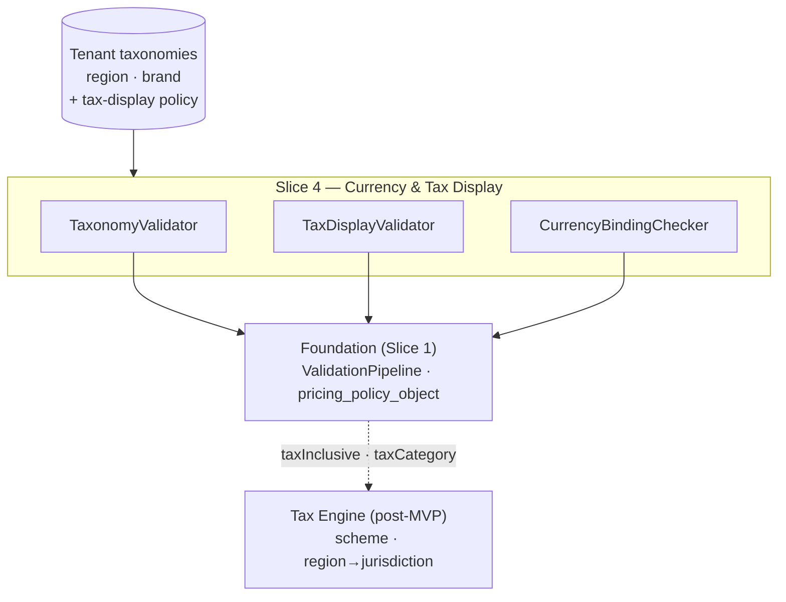

Created:  2026-08-24 by Virtuozzo International GmbH
Updated:  2026-08-24 by Virtuozzo International GmbH

<!-- CONFLUENCE_TITLE: [BSS]: Pricing — Multi-Currency, Regions & Tax Display (Design, Slice 4) -->
<!-- Related: ../PRD.md, ../DESIGN.md, ./01-foundation.md | Owners: BSS Product Catalog team -->

# DESIGN — Multi-Currency, Regions & Tax Display (Slice 4)

<!-- toc -->

- [1. Context](#1-context)
  - [1.1 Overview](#11-overview)
  - [1.2 Purpose](#12-purpose)
  - [1.3 Actors](#13-actors)
  - [1.4 References](#14-references)
  - [1.5 Scope](#15-scope)
  - [1.6 Constraints & Assumptions](#16-constraints--assumptions)
  - [1.7 Naming & Design-Introduced Names](#17-naming--design-introduced-names)
  - [1.8 Context & Dependencies](#18-context--dependencies)
- [2. Actor Flows (CDSL)](#2-actor-flows-cdsl)
  - [Author Multi-Currency Price Rows](#author-multi-currency-price-rows)
  - [Preview a Base Price](#preview-a-base-price)
- [3. Processes / Business Logic (CDSL)](#3-processes--business-logic-cdsl)
  - [Region and Brand Taxonomy Validation](#region-and-brand-taxonomy-validation)
  - [Tax Display Basis and Policy](#tax-display-basis-and-policy)
  - [Single-Currency-per-Invoice Binding](#single-currency-per-invoice-binding)
- [4. States (CDSL)](#4-states-cdsl)
  - [Tax-Inclusive Sellability State Machine](#tax-inclusive-sellability-state-machine)
- [5. API Surface](#5-api-surface)
- [6. Data Model](#6-data-model)
- [7. Events & Alarms](#7-events--alarms)
- [8. Definitions of Done](#8-definitions-of-done)
  - [Multi-Currency Rows](#multi-currency-rows)
  - [Taxonomy Validation](#taxonomy-validation)
  - [Tax Display Basis](#tax-display-basis)
  - [Currency Binding](#currency-binding)
- [9. Acceptance Criteria](#9-acceptance-criteria)
- [10. Non-Functional Considerations](#10-non-functional-considerations)

<!-- /toc -->

## 1. Context

### 1.1 Overview

This slice owns the **market axes of a price row**: independent per-`(currency, region)` rows
(no FX derivation, ever), the tenant-configured **region and brand taxonomies** with
membership validation before publish, the **`taxInclusive` display basis** + `taxCategory`
reference governed by the fail-closed tenant tax-display policy (with the tax-inclusive
**not-sellable-GA** gate while Tax Engine is post-MVP), and the
**single-currency-per-invoice binding** checks that reject configurations forcing
mixed-currency lines onto one invoice. It registers its rules into the Foundation pipeline;
tax **scheme determination and calculation** are explicitly not here (Tax Engine).

**Traces to**: `cpt-cf-bss-pricing-fr-multi-currency-rows`,
`cpt-cf-bss-pricing-fr-region-brand-taxonomy`, `cpt-cf-bss-pricing-fr-tax-display-basis`,
`cpt-cf-bss-pricing-fr-invoice-currency-binding`
(the shared amount/currency/precision checks are Foundation-owned —
`fr-price-amount-validation` is claimed there, one owner per FR; 2026-07-31 P2 fix)

### 1.2 Purpose

Let a tenant sell one plan in many markets — ≥ 20 currencies per plan as a guaranteed floor —
with every market row first-class and independently authored, while making the two classic
failure classes impossible at publish: a price resolved through implicit FX (silently wrong
amount) and an invoice forced to mix currencies (unpostable downstream). Tax display stays a
catalog concern; everything else about tax is delegated.

### 1.3 Actors

| Actor | Role in Slice |
|-------|---------------|
| `cpt-cf-bss-pricing-actor-finance-manager` | Authors per-`(currency, region)` rows and `taxInclusive` flags |
| `cpt-cf-bss-pricing-actor-catalog-admin` | Configures the region/brand taxonomies and the tax-display policy |
| `cpt-cf-bss-pricing-actor-tax-engine` | (Post-MVP) consumes `taxInclusive` + `taxCategory`; maps `region` → tax jurisdiction |
| `cpt-cf-bss-pricing-actor-billing` | Depends on the single-currency-per-invoice invariant |
| `cpt-cf-bss-pricing-actor-partner` | Reads the base-price preview (with the preview grant, Slice 5) |
| `cpt-cf-bss-pricing-actor-subscriptions` | Owns currency selection at activation (consumes covered currencies) |

### 1.4 References

- **PRD**: [PRD.md](../PRD.md) — §6.4, §4.1 (environment: precision, taxonomies), §17.4 (currency-coverage / precision / tax-basis rules), §15 (Tax Engine post-MVP)
- **Design**: [01-foundation.md](./01-foundation.md) — money constraint, scope key (§4.1), policy objects
- **Dependencies**: Foundation (Slice 1), plan-definition (Slice 2). The brand taxonomy authored here is consumed by price-overlays (Slice 9: brand-scoped `PriceOverlay`); currency-coverage checks extend to bundles in Slice 8.

### 1.5 Scope

**In scope**: per-`(currency, region)` price rows + the ≥ 20-currency floor; region taxonomy
(price-row axis) and brand taxonomy (PriceOverlay scope value) validation; `taxInclusive` /
`taxCategory` persistence + the tenant tax-display policy (default fail-closed); the
tax-inclusive not-sellable-GA gate; the three enumerated currency-binding rejections; the
fail-closed base-price preview read on `(currency, region)`.

**Out of scope**: FX math and any currency conversion (Tariffs/PLAL; `currencyFallbackPolicy`
is Future); tax scheme/calc and `region` → jurisdiction mapping (Tax Engine, post-MVP);
currency selection at activation (Subscriptions); brand-scoped `PriceOverlay` authoring
(Slice 9); bundle currency coverage detail (Slice 8, reuses this slice's checker).

### 1.6 Constraints & Assumptions

Inherits Foundation C-set (ISO 4217 minor units, `≥ 0`, no implicit FX, UTC, tenant isolation). Slice-4-specific:

| # | Topic | Assumption (default) | Source |
|---|-------|----------------------|--------|
| C1 | Currency floor | ≥ 20 currencies per plan guaranteed; the read SLO (p95 < 100ms) holds at that floor | PRD §6.4 |
| C2 | Taxonomies are tenant config | `region` and `brand` value sets are tenant-configured taxonomies; membership is validated at save/publish (unknown value fails before publish) | PRD §4.1 |
| C3 | Tax Engine post-MVP | MVP sells **tax-exclusive**; a `taxInclusive=true` row is authorable but flagged **not-sellable-GA** (per row / market) until Tax Engine GA (ETA ~8 months) | PRD §15 |
| C4 | Tax-display policy default | Fail-closed for **all** tenants: `taxInclusive=true` without region tax readiness, and `taxInclusive=false` in a region with no configured `taxCategory`, both block publish unless the tenant policy explicitly selects warn. The check's input is the **`RegionTaxReadiness` lookup** — `(tenant, region) → { taxCategory, ratePresent }`, fail-closed on unknown; MVP provider = tenant-declared columns on `pricing_region_taxonomy` (§6), post-GA provider = Tax Engine-backed (contract lands in the Tax Engine PRD) | PRD §17.6; D-01 |
| C5 | Region ≠ authz region | Pricing `region` is a commercial territory; the IdP authorization-region claim governs *who may mutate*, enforced in Slice 5 | PRD §1.4 |

### 1.7 Naming & Design-Introduced Names

Reuses the PRD glossary; inherits Foundation mechanics. Not restated.

Design-introduced names (Slice 4):

| Name | Meaning |
|------|---------|
| `TaxonomyValidator` | Registered rules: `region` membership on price rows; overlay **scope-value** membership per class — `brand`, `region`, `partner`, `orgTier` against their tenant taxonomies (D-120; rule shared with Slice 9, which owns the `customerGroup` analogue) |
| `TaxDisplayValidator` | Registered rules: `taxInclusive`/`taxCategory` completeness under the tenant tax-display policy (C4) + the GA gate (C3) |
| `CurrencyBindingChecker` | Registered rules: the three enumerated mixed-currency rejection configs (§3); reused by Slice 8 for bundles |
| `not_sellable_ga` | Read-model flag on a tax-inclusive **price row** (⇒ per `(currency, region)` market) while Tax Engine is pre-GA: authorable, previewable, **not sellable** on that market |
| `RegionTaxReadiness` | The C4 input port: `(tenant, region) → { taxCategory, ratePresent }`, fail-closed on unknown. MVP provider: tenant-declared columns on `pricing_region_taxonomy`; post-GA provider: Tax Engine-backed (sync lookup or event-fed mirror — decided in the Tax Engine PRD) |

### 1.8 Context & Dependencies

**Consumed:** tenant region/brand taxonomies + the tax-display policy
(`pricing_policy_object`, Foundation). **Produced:** validated per-market rows, the
`not_sellable_ga` flag, and the currency-coverage guarantee the sellability gate (Slice 7)
and bundles (Slice 8) build on.

## 2. Actor Flows (CDSL)

### Author Multi-Currency Price Rows

- [ ] `p1` - **ID**: `cpt-cf-bss-pricing-flow-multicurrency-author`

**Actor**: `cpt-cf-bss-pricing-actor-finance-manager`

**Success Scenarios**:
- Independent rows per `(currency, region)` attach to one `planId` (distinct scope keys), `PriceCreated` per row; ≥ 20 currencies supported per plan (C1)
- Each row's amount validates at its own currency's ISO 4217 minor unit (Foundation)

**Error Scenarios**:
- Unknown `region` → `REGION_UNKNOWN` (422, before publish)
- Precision above the currency's minor unit → `PRECISION_EXCEEDED` (422, Foundation)

**Steps**:
1. [ ] - `p1` - API: POST /bss-pricing/v1/plans/{planId}/prices per `(currency, region)` (Slice 3 flow; this slice adds the market-axis rules) - `inst-mc-create`
2. [ ] - `p1` - `TaxonomyValidator` checks `region` membership at save **and** publish (C2) - `inst-mc-region`
3. [ ] - `p1` - No FX derivation ever: a missing `(currency, region)` row is simply absent — preview/publish paths fail closed on it, no base-currency fallback (Future `currencyFallbackPolicy` only) - `inst-mc-nofx`
4. [ ] - `p1` - **RETURN** 201 per row - `inst-mc-return`

### Preview a Base Price

- [ ] `p2` - **ID**: `cpt-cf-bss-pricing-flow-price-preview`

**Actor**: `cpt-cf-bss-pricing-actor-partner`, `cpt-cf-bss-pricing-actor-finance-manager` (requires the catalog-preview read grant, Slice 5 — an **extra assignment** beyond the FinanceManager role: the default role matrix does not carry `plan × preview`)

**Success Scenarios**:
- Returns the catalog **base list price** for a `(region, currency)`: amount, `taxInclusive` flag, tier summary, `displayTrialDays`, with an explicit disclaimer that Contract/`PriceOverlays` apply at purchase (Tariffs evaluates). **Which row that is, named (D-244):** the **terminal phase's `all_subscriptions` recurring** row. One `(currency, region)` legitimately holds many — `phase`, `chargeKind`, `meter` and `dimensionKey` are all scope-key axes — so a plan with a trial-phase row beside its steady-state row has two candidates, and this clause used to leave the choice to the implementation's tie-break. The audience is prospective purchasers, so the honest answer is the row they would actually be charged first: the steady state a trial converts *into*, not the trial. Terminality is **structural** — the phase whose `convertsToPhaseId` is null — and never `kind`, for C-4's reason. A market with no such row still previews: a usage-priced market's money lives in its tier bands, so the naming is a **preference, not a filter**

**Error Scenarios**:
- No row for the requested `(currency, region)` → `PRICE_ROW_ABSENT` (404, fail closed — no FX)
- Principal without the preview grant → denied (403, audited; Slice 5)

**Steps**:
1. [ ] - `p2` - API: GET /bss-pricing/v1/plans/{planId}/preview?currency=&region= - `inst-pv-api`
2. [ ] - `p2` - Resolve from the **published read model only** (no draft read); base list price rows only, `PriceOverlay` adjustments disclaimed - `inst-pv-resolve`
3. [ ] - `p2` - **RETURN** 200 (base price + disclaimer) or fail closed - `inst-pv-return`

## 3. Processes / Business Logic (CDSL)

### Region and Brand Taxonomy Validation

- [ ] `p1` - **ID**: `cpt-cf-bss-pricing-algo-taxonomy`

**Input**: a price row's `region`; a brand-scoped `PriceOverlay`'s `brand` (Slice 9 registers into the same rule)
**Output**: pass, or a fail-closed violation naming the unknown value

**Steps**:
1. [ ] - `p1` - `region` MUST be a member of the tenant's configured region taxonomy; an unknown/invalid region fails validation **before** publish - `inst-tx-region`
2. [ ] - `p1` - `brand` is **not** a price-row field (Foundation §4.1): a brand-scoped `PriceOverlay`'s `brand` MUST be a member of the tenant's brand taxonomy, validated at save (rule owned here, exercised by Slice 9). **Generalized to every taxonomy-backed overlay scope (D-120, 2026-07-31 review fix):** a **region**-scoped overlay's value MUST be a member of the tenant's region taxonomy, and **partner**/**orgTier**-scoped values MUST be members of the tenant's `pricing_partner_taxonomy` / `pricing_org_tier_taxonomy` (§6; an unknown value fails save — **`SCOPE_VALUE_UNKNOWN`**, 422, for every taxonomy-backed class, since the remedy is the same one in each: declare the value in the named universe. The per-class trio this clause used to name is struck by **D-239**, which splits the two declared codes by *surface* rather than by class — `REGION_UNKNOWN` on the price-row authoring path, `SCOPE_VALUE_UNKNOWN` on the overlay scope path) — before D-120 those two scope classes had **no declared value universe anywhere** (free-form strings on the axis that selects who receives an adjustment, the §F.2 `rounding_policy_ref` pattern) and region overlay values were never checked at all. The MVP universes are tenant-declared (the D-01 pattern); reconciliation against an external partner SoR (AMS/partner registry), when one exists, is a named Future joint item, and the payer → `(partner, orgTier)` resolution input Tariffs matches against is a registered **needs-decision** on the Tariffs contract ([`../PRD.md`](../PRD.md) §9.2) - `inst-tx-brand`
3. [ ] - `p1` - Taxonomy mutation (add/retire a region/brand/partner/orgTier value) is tenant-admin config, audited; **retiring** a value is rejected while it is referenced by an active published price row (`region`) **or an active `PriceOverlay` scope of any taxonomy-backed class** — `brand`, `region`, `partner`, `orgTier` (D-120, 2026-07-31 review fix: the guard previously enumerated price rows and brand overlays only, so a region value retired cleanly while region-scoped overlays still named it) — referential integrity over every referencing shape. **A region's `taxCategory` marker is guarded on the same principle and as a separate act (D-245)**: it may not be *removed* while a published row states no category of its own and resolves through it. The act is distinct because it is reachable by a `PUT` that retires nothing, and because its remedy is different — nothing is retargeted; the operator re-declares the default or authors `taxCategoryRef` onto the dependent rows. It is guarded rather than left to the publish rule because a dependent row may be an immutable `existing_grandfathered` generation that can be neither superseded nor `PATCH`ed, so dropping the default would fail every subsequent publish of its plan on `TAX_BASIS_INCOMPLETE` with no way back. **The guard's counts are deliberately not serialised against a concurrent publish (D-243)** — they are plain reads inside the mutation's transaction, so a retirement judged against zero references can commit beside a publish creating one. The resolving order is stated rather than emergent: `inst-tx-region` refuses a price row whose region is not `active`, so whichever transaction commits first wins and the loser is refused on its **next** publish (held by `domain::publish::rules_tests::a_row_in_an_undeclared_region_fails_the_registered_set`). Locking the counted set was declined — at C1's twenty-currency floor it is large, and it would make a config write block publishing - `inst-tx-mutation`

### Tax Display Basis and Policy

- [ ] `p1` - **ID**: `cpt-cf-bss-pricing-algo-tax-display`

**Input**: a row's `taxInclusive` + `taxCategory` + the tenant tax-display policy + the `RegionTaxReadiness` lookup (C4)
**Output**: pass / warn / fail per policy; the `not_sellable_ga` flag where applicable

**Steps**:
1. [ ] - `p1` - Persist `taxInclusive` (display basis) and the `taxCategory` reference **only** — no scheme determination, no calculation, no `region` → jurisdiction mapping (Tax Engine). **The published value is the resolved effective category (normative, D-154, 2026-08-03):** publish resolves `coalesce(row.tax_category_ref, readiness.taxCategory)` and freezes the **result** into the read model / snapshot beside the row, exactly as it freezes the resolved `rounding_policy_ref` (Foundation §3.7). The authored column is untouched and stays the row's source of truth (D-110); what changes is that a consumer never re-derives the fallback. `taxCategory` is one of D-48 v1's five descriptor elements (S2 `inst-ds-required`) and the set must be sufficient to post **without re-querying mutable catalog rows** — while the fallback half of the value lives on `pricing_region_taxonomy`, which is tenant-declared, mutable and re-declarable at any time (`inst-td-readiness`), so a row whose category came from the region default published a descriptor element that could change under a frozen `CatalogVersion` - `inst-td-persist`
2. [ ] - `p1` - Policy check (C4): `taxInclusive=true` in a region whose `RegionTaxReadiness` has `ratePresent=false` **and** `taxInclusive=false` in a region with no configured `taxCategory` are both governed by the tenant tax-display policy — default **fail-closed**, explicit warn allowed. The category predicate evaluates the **effective category** = `coalesce(row.tax_category_ref, readiness.taxCategory)` — a row-level `tax_category_ref` satisfies the check in a region whose taxonomy carries no default category (2026-07-28 review fix, confirmed 2026-07-31). Readiness is resolved per `(tenant, region)`; an unknown region fails closed. **The absent-category arm has no warn mode (normative, D-154, 2026-08-03):** a row whose **effective** category resolves to nothing fails publish `TAX_BASIS_INCOMPLETE` whatever the tenant policy says, because `taxCategory` is a **pinned** D-48 v1 descriptor element whose absence S2 `inst-ds-required` and PRD `fr-billing-descriptors` both make a publish-blocking MUST, and a per-tenant display policy may not publish past a pinned contract element. The policy keeps both of its other jobs whole: it still governs the `ratePresent=false` arm, where the missing fact is a **rate** nobody in this gear owns and Tax Engine is pre-GA, and it still governs *nothing else* on this row. The two arms were one sentence and read as one switch; they are not — one is a readiness signal about an external engine, the other is a contract element this catalog promised Billing - `inst-td-policy`
2a. [ ] - `p1` - **Readiness provider (D-01):** at MVP `RegionTaxReadiness` reads the tenant-declared `tax_category`/`tax_rate_present` columns on `pricing_region_taxonomy` (CatalogAdmin, `config × write`, audited) — it catches **configuration** mistakes; rate correctness is unverifiable before Tax Engine. Once Tax Engine GAs, the provider becomes Tax Engine-backed and the tenant-declared markers are **reconciled** against its registry: a divergence (declared ready, engine disagrees) flags affected published rows **in the operator-plane flag store (`pricing_operator_flag`, D-85 — never the versioned read model: the reconciliation signal has no publish unit, and a frozen `CatalogVersion` never mutates)** + raises `pricing.tax.readiness_divergent` (Warn); remediation is a re-publish — never a silent retro-change - `inst-td-readiness`
3. [ ] - `p1` - **GA gate (C3):** while Tax Engine is pre-GA a `taxInclusive=true` **row** MAY be authored and previewed but publishes with the read-model flag `not_sellable_ga` — the flag is **per price row, hence per `(currency, region)` market**, not per plan: a plan selling tax-exclusive in US and tax-inclusive in EU is gated **only** on its EU market(s); the sellability gate (Slice 7) evaluates the flag per scope key; MVP sells tax-exclusive - `inst-td-gagate`
3a. [ ] - `p1` - **One display basis per market (normative, D-110, 2026-07-31 review fix; row set scoped by D-132, 2026-08-01):** every published row of a plan on one `(currency, region)` **whose `priceEligibility ∈ {all_subscriptions, new_subscriptions_only}`** MUST carry the **same** `tax_inclusive` value — a mixed-basis market fails publish (`TAX_BASIS_MIXED_MARKET`, 422, naming the divergent rows). **`existing_grandfathered` generations are excluded (D-132):** they are immutable in content, MUST NOT be superseded, and never leave `published` (expiry is read-derived), so an unscoped rule made one cutover **permanently** freeze the market's display basis — every later publish failing on a divergent row nobody can fix. Their subscribers read the basis from their own frozen snapshot, so the invoice-coherence argument below is unaffected; every sibling row-set rule of the set already carves them out the same way (`inst-bc-coverage`, `inst-sg-conjunction`, `inst-mp-grandfathered`, `inst-cl-resets`). `tax_inclusive` is a **display** basis and an invoice is one document: a tax-inclusive recurring line beside a tax-exclusive usage line is not renderable coherently, and the descriptor set's line template has no per-line basis to switch on. Nothing constrained this before, and the symptom was misdirected: under the D-94 conjunction one tax-inclusive component key flags its market `not_sellable_ga` and the **whole** plan-market silently becomes unsellable (predicate (5) fails on one bound key), with no publish-time explanation to the operator — post-Tax-Engine-GA the same authoring becomes a mixed-basis invoice instead. The rule is per market, not per plan: a plan selling tax-exclusive in US and tax-inclusive in EU stays legal and is gated only on EU (`inst-td-gagate`). The **bundle analogue** — one basis across all *component* rows of a bundle-market — is Slice 8's `inst-bc-taxbasis` (D-119): this rule keeps each plan internally uniform, that one keeps a composed invoice uniform - `inst-td-basis-uniform`
4. [ ] - `p1` - When Tax Engine GAs, clearing `not_sellable_ga` is a re-publish (goes through the pipeline + approval), not a silent flag flip - `inst-td-clear`

### Single-Currency-per-Invoice Binding

- [ ] `p1` - **ID**: `cpt-cf-bss-pricing-algo-currency-binding`

**Input**: a publishing plan + its add-ons / overrides / bundle composition
**Output**: pass, or the enumerated rejection naming the uncovered currency and the offending component

**Steps**:
1. [ ] - `p1` - **(i)** A **required** add-on or price-override target lacking a covering published row for a **`(currency, region)` pair** the base plan sells → reject (the subscription could not resolve all lines on its bound market). **Per pair, not per currency (D-95, 2026-07-31 review fix):** the currency-only reading left the region axis unchecked — a required add-on covering EUR only in `US` while the base sells EUR in `EU` passed publish and died at order assembly (the D-84 asymmetry one level up); the override-target half now states one rule with S2 `inst-cmp-override-home`. An **optional** add-on's coverage gap does NOT block the base plan's publish — it is enforced at attachment time (the add-on is not attachable on a market it does not cover; Subscriptions checks via the sellability read) (2026-07-28 review fix, confirmed 2026-07-31). **Over the dependency closure, not the flat required set (2026-08-01 review fix, C-3):** case (i) evaluates the **`depends_on` closure** of the plan's required add-ons (S2 `inst-cmp-addons`), because a required add-on may declare `depends_on` on an *optional* one — which is then transitively mandatory at order time while, under the flat reading, its coverage was never checked. That is the D-95 asymmetry through the dependency door, ending at the same order-assembly failure on a plan that published clean - `inst-cb-addon`
2. [ ] - `p1` - **(ii)** A `sum_of_parts` bundle whose component rows do not cover **every** currency the bundle sells → reject (Slice 8 invokes this rule with bundle context) - `inst-cb-bundle-sum`
3. [ ] - `p1` - **(iii)** An `own_price` bundle whose components do not **each** have a row in **every** currency the bundle sells → reject - `inst-cb-bundle-own`
4. [ ] - `p1` - Currency **selection** at activation is Subscriptions-owned; this slice guarantees only that every sellable currency is fully covered. `invoiceGroupingKey` is a layout hint and MUST NOT override this invariant (Billing splits currencies regardless) - `inst-cb-boundary`
5. [ ] - `p1` - **Region binding (normative, joint with Subscriptions):** like currency, the pricing `region` binds **once at activation** — Subscriptions resolves it from the payer's commercial profile (never from a client-supplied parameter) and the bound `(currency, region)` pair freezes into `pricingSnapshotRef`; every subsequent resolution (windows, renewals, overlays) uses the frozen pair. A region re-bind is a plan change, not a drift - `inst-cb-region-binding`

## 4. States (CDSL)

### Tax-Inclusive Sellability State Machine

- [ ] `p2` - **ID**: `cpt-cf-bss-pricing-state-tax-sellability`

**States** (per price row / market): sellable (tax-exclusive, or tax-inclusive post-Tax-Engine-GA), not_sellable_ga (tax-inclusive, pre-GA)
**Initial State**: per the row's `taxInclusive` and the Tax Engine GA status at publish

**Transitions**:
1. [ ] - `p1` - **FROM** not_sellable_ga **TO** sellable **WHEN** Tax Engine GAs **and** the row's plan is re-published through the pipeline (with approval); never a silent flip; per row/market - `inst-ts-ga`
2. [ ] - `p2` - The flag lives in the read model; the sellability gate (Slice 7) enforces it jointly with the window/version checks - `inst-ts-enforce`

## 5. API Surface

| Method | Path | Purpose | Idempotency |
|--------|------|---------|-------------|
| `GET` | `/bss-pricing/v1/plans/{planId}/preview` | Base-price preview per `(currency, region)`; fail closed, overlay disclaimer | — |
| `GET/PUT` | `/bss-pricing/v1/config/taxonomies/{region\|brand\|partner\|org_tier}` | Tenant taxonomy read/update (admin, audited; partner/org_tier added by D-120). Each segment is the class's own scope token — the camelCase `orgTier` this row used to spell is refused rather than aliased (**D-241**) | ETag |
| `GET/PUT` | `/bss-pricing/v1/config/tax-display-policy` | Tenant tax-display policy (fail-closed default) | ETag |
| `GET/PUT` | `/bss-pricing/v1/config/rounding-policy` | The tenant **default rounding policy** — not this slice's subject, listed here because it is the surface this one was built from and the two are the only writers of `pricing_policy_object` (D-320) | `ETag` |
| `GET/PUT` | `/bss-pricing/v1/config/rounding-policies` | The **declared rounding vocabulary** — the set a row's `roundingPolicyRef` and the tenant default are membership-checked against; an empty set constrains nothing (D-334) | `ETag` |

**Problem responses (RFC 9457):** `REGION_UNKNOWN` (422 — a **price row** naming a region
outside the tenant taxonomy; the row's `region` is a scope-key axis and the remedy is to fix the
row, which is why this code is the authoring path's and not the overlay path's),
`TAXONOMY_VALUE_IN_USE` (409, on retire — any referencing shape, incl.
region/partner/org_tier-scoped overlays), `TAX_BASIS_INCOMPLETE` (422 — per policy on the
`ratePresent=false` arm; **unconditional** on the absent-effective-category arm, which no warn
mode may pass, since `taxCategory` is a pinned D-48 v1 descriptor element — **D-154**),
`TAX_BASIS_MIXED_MARKET` (422 — rows of one plan on one `(currency, region)` disagreeing on
`tax_inclusive`; D-110, `inst-td-basis-uniform`, divergent rows named),
`CURRENCY_NOT_COVERED` (422, naming component + currency), `PRICE_ROW_ABSENT` (404 preview,
fail closed). Price-row authoring codes are Slice 3's.

## 6. Data Model

Slice-owned tables (tenant-scoped, SecureORM per Foundation §2.2 authz-gate + S5 `inst-rb-pep`; `pricing_` prefix per Foundation §3.7):

**`pricing_region_taxonomy`** / **`pricing_brand_taxonomy`** / **`pricing_partner_taxonomy`** /
**`pricing_org_tier_taxonomy`** (PK `(tenant_id, value)`; the last two added by D-120 as the
MVP value universes for the `partner`/`orgTier` overlay scopes — same shape, same
CatalogAdmin `config × write` + audit + retire-guard discipline; the `tax_*` columns below are
region-only):

| Column | Type | Notes |
|--------|------|-------|
| `tenant_id` | `uuid` | RLS scope |
| `value` | `string` | the region / brand code |
| `display_name` | `string` | operator label |
| `state` | `enum` | `active \| retired`; retire rejected while referenced by an active published price row (`region`) or an active brand-scoped `PriceOverlay` scope (`brand`); `retired → active` re-activation is allowed (audited) — a PUT re-adding an existing retired value re-activates it |
| `tax_category` | `string` | **region taxonomy only** (D-01): the region's default tax category; a price row's `tax_category_ref` may override |
| `tax_rate_present` | `bool` | **region taxonomy only** (D-01): tenant-declared "a tax rate is configured for this region" — the MVP `RegionTaxReadiness` source; reconciled against Tax Engine post-GA |

**Tax-display policy** — a `pricing_policy_object` entry (Foundation-owned table):
`mode ∈ {fail_closed (default), warn}`; per-tenant.

**`pricing_price` (Foundation-owned; Slice-4 columns)** — `currency` (scope key), `region`
(scope key), `tax_inclusive` (bool), `tax_category_ref` (string), and the projected
`not_sellable_ga` flag in `pricing_read_model` (derived at publish, not authored) beside the
projected **resolved effective tax category** (**D-154**, 2026-08-03 — derived at publish from
`coalesce(row.tax_category_ref, readiness.taxCategory)`, not authored, and frozen with the
`CatalogVersion` so Billing never re-resolves the fallback against the mutable region taxonomy).
`tax_category_ref` is the **source of truth** for a row's tax category, and it is the **only**
place a tax category lives (**D-110**, 2026-07-31 review fix): the D-48 descriptor set's
per-plan `tax_category` column is **removed** and the "mirrors it, with a publish-time
consistency check" rule with it. That rule was a cardinality error — `pricing_plan_descriptor_set`
holds one value per `(plan_id, plan_revision)` while `tax_category_ref` is per **row**, so the
check was undefined the moment two rows of a plan differed (subscription vs data transfer, or
region to region) and, read literally, forced one tax category per plan, which no rule states and
which the per-row column exists to avoid. The descriptor **contract** is unchanged in content:
`taxCategory` remains one of D-48's v1 five elements, now **riding the price row** — exactly the
treatment `billingTiming` already received in the same decision (D-48's 2026-07-28 amendment), so
the v1 five stay five: **three** descriptor-set fields plus two row-borne elements. Billing's pending
countersign covers the shape.

Key constraints: FK-like validation (application-level, at save + publish) from
`pricing_price.region` to `pricing_region_taxonomy(active)`; the ≥ 20-currency floor is a
capacity guarantee (load-tested), not a schema constraint.

## 7. Events & Alarms

No new event names (`PriceCreated`/`PriceUpdated` per row; policy/taxonomy changes are
audited mutations). Alarms: `pricing.tax.not_sellable_ga_active` (Info — alarm on the
`pricing_tax_not_sellable_ga` gauge, §10: count of published tax-inclusive rows/markets
awaiting Tax Engine GA; visibility for the GA-gate backlog, PRD risk table);
`pricing.tax.readiness_divergent` (Warn — post-GA reconciliation divergence,
`inst-td-readiness`, D-01).

## 8. Definitions of Done

### Multi-Currency Rows

- [ ] `p1` - **ID**: `cpt-cf-bss-pricing-dod-multicurrency`

A plan **MUST** support independent price rows per `(currency, region)` on one `planId`
(≥ 20 currencies guaranteed, read SLO held at the floor), each validated at its currency's
ISO 4217 minor unit, with **no** FX derivation anywhere — a missing `(currency, region)` row
fails closed on preview and publish.

**Implements**: `cpt-cf-bss-pricing-flow-multicurrency-author`, `cpt-cf-bss-pricing-flow-price-preview`

**Touches**:
- API: `GET /bss-pricing/v1/plans/{planId}/preview`
- DB: `pricing_price` (currency/region axes)
- Entities: `TaxonomyValidator`

### Taxonomy Validation

- [ ] `p1` - **ID**: `cpt-cf-bss-pricing-dod-taxonomy`

`region` on price rows — and every taxonomy-backed `PriceOverlay` scope value: `brand`,
`region`, `partner`, `orgTier` (D-120) — **MUST** validate against the tenant taxonomies
before publish (unknown value fails); retiring a referenced taxonomy value **MUST** be
rejected across every referencing shape (price rows and all scoped overlays); taxonomy
mutation is admin-scoped and audited.

**Implements**: `cpt-cf-bss-pricing-algo-taxonomy`

**Touches**:
- API: `GET/PUT /bss-pricing/v1/config/taxonomies/*`
- DB: `pricing_region_taxonomy`, `pricing_brand_taxonomy`, `pricing_partner_taxonomy`, `pricing_org_tier_taxonomy` (D-120)
- Entities: `TaxonomyValidator`

### Tax Display Basis

- [ ] `p1` - **ID**: `cpt-cf-bss-pricing-dod-tax-display`

The catalog **MUST** persist `taxInclusive` + `taxCategory` **on the price row** (the row is the
sole home of the tax category — D-110 removes the per-plan descriptor-set column that claimed to
mirror it; `taxCategory` rides the row exactly as `billingTiming` does) only (no scheme/calc),
govern the two incomplete-basis cases by the tenant tax-display policy (default fail-closed),
reject a **mixed `taxInclusive` basis among the non-grandfathered rows of one
`(currency, region)`** (`TAX_BASIS_MIXED_MARKET`, D-110 — one invoice, one display basis;
`existing_grandfathered` generations are excluded per D-132, being immutable and otherwise able
to freeze the market's basis forever), and flag
tax-inclusive rows `not_sellable_ga` (per market) until Tax Engine GA — cleared only by re-publish.

**Implements**: `cpt-cf-bss-pricing-algo-tax-display`, `cpt-cf-bss-pricing-state-tax-sellability`

**Touches**:
- API: `GET/PUT /bss-pricing/v1/config/tax-display-policy`
- DB: `pricing_price` (tax columns), `pricing_policy_object`, `pricing_read_model` (`not_sellable_ga`)
- Entities: `TaxDisplayValidator`

### Currency Binding

- [ ] `p1` - **ID**: `cpt-cf-bss-pricing-dod-currency-binding`

Publish/preview **MUST** reject the three enumerated mixed-currency configurations
(required-add-on/override gap — evaluated per `(currency, region)` pair the base plan sells,
D-95; optional add-on gaps enforce at attachment, not publish;
`sum_of_parts` coverage gap; `own_price` coverage gap),
naming the component and market; `invoiceGroupingKey` never overrides the invariant.

**Implements**: `cpt-cf-bss-pricing-algo-currency-binding`

**Touches**:
- DB: `pricing_price`, `pricing_plan_addon_rule`
- Entities: `CurrencyBindingChecker`

## 9. Acceptance Criteria

Delta over the Foundation testing architecture.

Unit:

- [ ] Minor-unit precision matrix (JPY 0 / USD 2 / BHD 3; over-precision rejected); unknown region/brand rejection; the three currency-binding cases each rejected with the component named; tax-basis policy matrix (fail-closed vs warn × the two incomplete cases: `taxInclusive=true` with `tax_rate_present=false`, `taxInclusive=false` with no `tax_category`) — incl. the effective-category override case: `taxInclusive=false` with region `tax_category` unset but row `tax_category_ref` set **passes** (coalesce rule, `inst-td-policy`)

Integration (testcontainers):

- [ ] A plan with 20+ currency rows publishes and the preview reads each `(currency, region)` within the read SLO
- [ ] Preview of an absent `(currency, region)` fails closed (no base-currency fallback)
- [ ] A required add-on missing one of the base plan's currencies blocks publish (`CURRENCY_NOT_COVERED`); a required add-on covering the currency but **not the region** of a sold `(currency, region)` pair blocks the same way (D-95); an **optional** add-on that a required add-on `depends_on` and that misses a sold pair blocks the same way (C-3 — the check runs over the dependency closure), while an unreferenced optional add-on with the same gap still publishes
- [ ] A plan with a live `existing_grandfathered` generation carrying `tax_inclusive = false` publishes a supersession flipping its `all_subscriptions` rows to `true` on that market (D-132 — the immutable generation is not in the uniformity row set), while a mixed basis **among** the non-grandfathered rows of that market still fails (`TAX_BASIS_MIXED_MARKET`)
- [ ] An **optional** add-on missing one of the base plan's currencies does **not** block publish; the gap surfaces at attachment time (2026-07-28 review fix)
- [ ] A mixed plan (EU `taxInclusive=true` with EU `tax_rate_present=true`, US exclusive) publishes with `not_sellable_ga` on the EU rows only — the US market stays sellable; the flag clears only via re-publish
- [ ] The same plan with EU `tax_rate_present=false` blocks publish under the default fail-closed policy (C4 precedes the C3 flag)
- [ ] A hybrid whose EU recurring row is `taxInclusive=true` while its EU usage row is `taxInclusive=false` fails publish (`TAX_BASIS_MIXED_MARKET`, both rows named — D-110), while the same plan tax-inclusive across **all** EU rows and tax-exclusive across all US rows publishes (the rule is per market)
- [ ] Two rows of one plan carrying **different** `tax_category_ref` values publish (D-110 — the category is per row; there is no per-plan descriptor column left to disagree with), and each row's category reaches Billing on the row
- [ ] Retiring a region referenced by an active published row is rejected (409)

API:

- [ ] RFC 9457 mapping for the §5 codes; preview carries the overlay disclaimer

## 10. Non-Functional Considerations

- **Performance**: the read/preview SLO (p95 < 100ms) holds at the 20-currency floor — preview is a single read-model lookup keyed by `(plan, currency, region)`; taxonomy checks are indexed lookups on the authoring path only.
- **Observability / metrics**: `pricing_preview_failclosed_total{reason}`, `pricing_currency_binding_blocks_total{case}`, `pricing_tax_not_sellable_ga` gauge.
- **Security & AuthZ**: taxonomy/policy mutation is CatalogAdmin-scoped and audited; preview requires the explicit preview grant (Slice 5); pricing `region` is decoupled from the authz-region claim (enforcement in Slice 5).
- **Risks & open items**: Tax Engine slip extends the `not_sellable_ga` window (PRD risk #1 — tracked on the program board); the MVP `RegionTaxReadiness` markers are self-declared — their post-GA reconciliation (divergence flag + `pricing.tax.readiness_divergent`) is part of the future Tax Engine contract (D-01); `currencyFallbackPolicy` deliberately deferred (fail-closed is the launch behavior); bundle currency coverage is exercised end-to-end only when Slice 8 lands.
