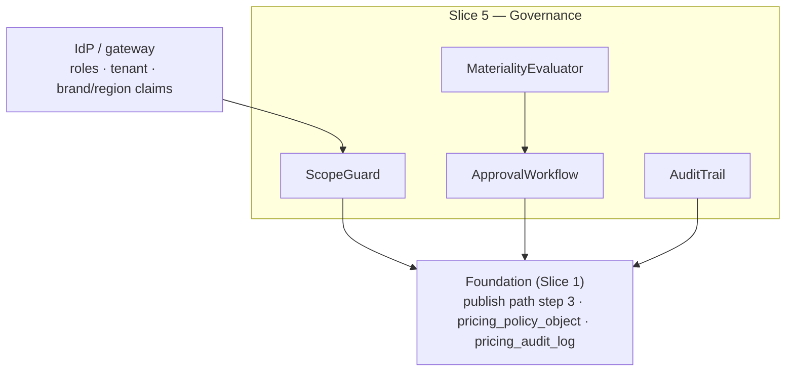

Created:  2026-08-24 by Virtuozzo International GmbH
Updated:  2026-08-24 by Virtuozzo International GmbH

<!-- CONFLUENCE_TITLE: [BSS]: Pricing — Approval, Governance & Access Control (Design, Slice 5) -->
<!-- Related: ../PRD.md, ../DESIGN.md, ./01-foundation.md | Owners: BSS Product Catalog team -->

# DESIGN — Approval, Governance & Access Control (Slice 5)

<!-- toc -->

- [1. Context](#1-context)
  - [1.1 Overview](#11-overview)
  - [1.2 Purpose](#12-purpose)
  - [1.3 Actors](#13-actors)
  - [1.4 References](#14-references)
  - [1.5 Scope](#15-scope)
  - [1.6 Constraints & Assumptions](#16-constraints--assumptions)
  - [1.7 Naming & Design-Introduced Names](#17-naming--design-introduced-names)
  - [1.8 Context & Dependencies](#18-context--dependencies)
- [2. Actor Flows (CDSL)](#2-actor-flows-cdsl)
  - [Approve or Reject a Material Change](#approve-or-reject-a-material-change)
  - [~~Historical Import (Backdating)~~ — struck by D-330](#historical-import-backdating--struck-by-d-330)
- [3. Processes / Business Logic (CDSL)](#3-processes--business-logic-cdsl)
  - [Materiality Evaluation](#materiality-evaluation)
  - [Two-Person Rule Enforcement](#two-person-rule-enforcement)
  - [RBAC and Scope Enforcement](#rbac-and-scope-enforcement)
  - [AuthZ Resource and Action Catalog (normative)](#authz-resource-and-action-catalog-normative)
  - [Audit Trail and Retention](#audit-trail-and-retention)
- [4. States (CDSL)](#4-states-cdsl)
  - [Approval State Machine](#approval-state-machine)
- [5. API Surface](#5-api-surface)
- [6. Data Model](#6-data-model)
- [7. Events & Alarms](#7-events--alarms)
- [8. Definitions of Done](#8-definitions-of-done)
  - [Two-Person Rule](#two-person-rule)
  - [Threshold Policy](#threshold-policy)
  - [RBAC & Isolation](#rbac--isolation)
  - [~~Backdating Governance~~ — struck by D-330](#backdating-governance--struck-by-d-330)
  - [Audit Completeness](#audit-completeness)
- [9. Acceptance Criteria](#9-acceptance-criteria)
- [10. Non-Functional Considerations](#10-non-functional-considerations)

<!-- /toc -->

## 1. Context

### 1.1 Overview

This slice owns the **who-may-do-what layer** that gates every publish: **materiality
evaluation** against the per-currency tenant threshold policy (fail-safe: no threshold ⇒
everything is material; first publish ⇒ always material), the **two-person rule** (submitter
+ ≥ 1 independent approver, self-approval rejected and audited), **RBAC deny-by-default**
over both mutate and read/preview surfaces (with the explicit catalog-preview grant),
**tenant/brand/region isolation** with the pricing
`region` decoupled from the IdP authz-region claim, and the **append-only, tamper-evident
audit trail** with ≥ 7-year jurisdiction-configurable retention. It plugs into the
Foundation's publish path as the approval step ([`01-foundation.md`](./01-foundation.md)
§4.2 step 3).

**Traces to**: `cpt-cf-bss-pricing-fr-approval-two-person`,
`cpt-cf-bss-pricing-fr-approval-threshold-policy`, `cpt-cf-bss-pricing-fr-rbac-deny-by-default`,
`cpt-cf-bss-pricing-fr-tenant-brand-isolation`,
`cpt-cf-bss-pricing-fr-audit-completeness`

### 1.2 Purpose

Make an unauthorized or self-approved price change — the financial-fraud vector this domain
carries — structurally impossible: no principal can both submit and approve a material
change, no change slips under an unset threshold, no preview leaks pricing to an unlisted
role, and every mutation leaves an immutable trail an auditor can rely on for 7+ years.

### 1.3 Actors

| Actor | Role in Slice |
|-------|---------------|
| `cpt-cf-bss-pricing-actor-finance-manager` | Submits publishes |
| `cpt-cf-bss-pricing-actor-finance-reviewer` | The independent approver; rejects with reason; configures the approval-threshold policy (`approval_policy × write` — deliberately not CatalogAdmin's, see the role-matrix note) |
| `cpt-cf-bss-pricing-actor-catalog-admin` | Configures roles/grants and the config plane (taxonomies, tax-display) |
| `cpt-cf-bss-pricing-actor-auditor` | Reads immutable history + approval trails; exports |
| `cpt-cf-bss-pricing-actor-partner` | Holds (only) the catalog-preview read grant |

### 1.4 References

- **PRD**: [PRD.md](../PRD.md) — §6.7 (approval subset), §6.12, §17.6 (tenant policy objects), §7.1 (audit/retention NFRs), §15 (retention-maximum open item)
- **Design**: [01-foundation.md](./01-foundation.md) — publish contract step 3 (§4.2), `pricing_policy_object`, `pricing_audit_log`
- **Dependencies**: Foundation (Slice 1). The approval step gates the publish flows of every capability slice.

### 1.5 Scope

**In scope**: materiality evaluation (per-currency absolute/percent deltas, any-row-trips
rule, first-publish rule); the approval workflow (submit → approve/reject with reason →
publish); self-approval rejection + audit; RBAC deny-by-default on mutate **and**
read/preview (preview grant); tenant/brand/region scope enforcement (authz
region ≠ pricing region); audit-record completeness, tamper-evidence (in-DB hash chain,
D-14) and retention.

**Out of scope**: what *makes* a change (versioning/supersession — Foundation §4.3); IdP/role
administration itself (platform IdP; this slice consumes claims);
customer-group membership changes' materiality semantics (Slice 9 registers its material
triggers — immediate re-resolutions and bulk group moves — into this slice's evaluator;
renewal-aligned single-membership changes are audit-only).

### 1.6 Constraints & Assumptions

Inherits Foundation C-set. Slice-5-specific:

| # | Topic | Assumption (default) | Source |
|---|-------|----------------------|--------|
| G1 | Fail-safe materiality | No configured threshold ⇒ **all** changes material; first publish (no baseline) ⇒ **always** material; auto-publish only below an explicitly configured threshold and not a first publish | PRD §1.4 |
| G2 | Two distinct principals | Submitter ≠ approver as **principals** (not roles): one human with both roles still cannot self-approve | PRD §6.7 |
| G3 | Multi-currency materiality | Each affected row's delta compares in its **own** currency; the rule trips if **any** row exceeds its threshold | PRD §6.7 |
| G4 | Tamper-evidence mechanism | **Hash-chained audit rows in the same database** (D-14; ledger precedent): the audit row commits inside the mutation's ACID transaction — no lost records on crash, and an unavailable audit store cannot exist separately from an unavailable database (fail-closed by construction). **Chains are segmented per `(tenant_id, chain_id)`** with a periodic per-tenant **roll-up** chaining the segment heads (**D-135**, 2026-08-01 review fix — a single per-tenant chain is a strict sequence, so it serialized *every* audited mutation of a tenant behind one head inside the mutation transaction). A periodic verification job walks every segment and the roll-up (`pricing_audit_chain_verified`); the roll-up head MAY be **asynchronously anchored** to external WORM/object-lock storage as hardening — never on the mutation path | PRD §6.12; D-14; D-135 |
| G5 | Retention | ≥ 7 years, tenant/jurisdiction-configurable as the **maximum applicable minimum**; jurisdictions imposing a storage-limitation **maximum** are an open Legal item | PRD §15 |

### 1.7 Naming & Design-Introduced Names

Reuses the PRD glossary; inherits Foundation mechanics. Not restated.

Design-introduced names (Slice 5):

| Name | Meaning |
|------|---------|
| `MaterialityEvaluator` | Computes the per-currency delta vs baseline and applies G1/G3; called by the Foundation publish path |
| `ApprovalWorkflow` | The submitted → approved/rejected state machine with the two-person invariant (G2) |
| `ScopeGuard` | Request-time RBAC + tenant/brand/region scope enforcement (deny-by-default; authz region ≠ pricing region) |
| ~~`BackdateGrant`~~ | **Struck by D-330** (2026-08-16) — historical import is out of scope; the grant, its resource label and its endpoints leave this slice with the flow |
| `AuditTrail` | Writer over `pricing_audit_log` guaranteeing actor / before-after / approval completeness + tamper evidence (G4). **Not only a writer as of D-338 (2026-08-17):** the table has carried a `(tenant_id, subject_kind, subject_ref, recorded_at)` index since it was created, and that index had no reader — the store offered `append` and a tenant-wide keyset page only, so a value written into `before_state` was recorded and unaddressable. A read by subject now exists, which is what makes the before-after guarantee usable by anything that has to reverse an act rather than merely attest to it. One subject can hold several records — an act's submit, approve and commit stand under one `subject_ref` — so a caller selects by action rather than taking the first |

### 1.8 Context & Dependencies

**Consumed:** IdP claims (roles, tenant, brand/region authz scope); the approval-threshold
policy (`pricing_policy_object`). **Produced:** the approve/reject gate on every publish; the
audit trail every other slice's mutations flow through; the preview grant.

## 2. Actor Flows (CDSL)

### Approve or Reject a Material Change

- [ ] `p1` - **ID**: `cpt-cf-bss-pricing-flow-approval`

**Actor**: `cpt-cf-bss-pricing-actor-finance-reviewer`

**Success Scenarios**:
- A submitted material change is approved by an independent principal → the Foundation publish proceeds (events, version request)
- A rejection (with mandatory reason) returns the Plan to `draft` and notifies the submitter

**Error Scenarios**:
- Approver = submitter → `SELF_APPROVAL_FORBIDDEN` (403, audit-logged)
- Approver lacks FinanceReviewer → denied (403, audit-logged)

**Steps**:
1. [ ] - `p1` - Publish submit (any slice) runs `MaterialityEvaluator`; a non-material change (explicit threshold, below it, not first publish) auto-publishes with no approver - `inst-ap-materiality`
2. [ ] - `p1` - Material → an approval record opens (`submitted`) **pinning the exact content**: `subject_ref` + a content hash of the submitted revision; submitter identity + timestamp logged - `inst-ap-open`
2a. [ ] - `p1` - **Post-submit mutation voids the approval (TOCTOU guard):** any mutation of the subject while `submitted` invalidates the pending approval (subject returns to `draft`, the record closes `voided`, a fresh submit opens a new record); approve re-verifies the pinned content hash and rejects on mismatch (`APPROVAL_CONTENT_MISMATCH`, 409) — a reviewer can only ever approve exactly what they saw; a decision on a `voided`/already-decided record is rejected (`APPROVAL_NOT_PENDING`, 409). **The void's subject scope is narrower than this sentence and the gap is open (D-198, 2026-08-06):** three kinds of unit pin the *plan shape* — a plan-revision unit, a D-62/D-99 window unit and D-88's supersession unit, since the content hash is taken over the assembled shape in all three cases — and the void reaches only `subject_kind = 'plan_revision'`. So an authoring edit to any price row of the plan invalidates all three pins and voids one of them. It **fails closed** (the other two are caught at their own commit, where the pin is compared against the shape the mutating transaction assembled, so a stale unit authorizes nothing) and what survives is an **orphan record**: a `submitted` unit whose pin can never match again, asking a reviewer for a decision that cannot lead to an act. D-198 carries the two options — void every plan-shape-pinned unit, or declare the narrow scope normative and give the orphan a reaper as the publish commit already has for its own subject. **Which subject a unit re-derives is normative (D-247, 2026-08-07, added after the same defect appeared a third time):** a unit whose subject is a **published fact** — a window, a supersession, a retirement — re-derives the **current revision**; only a plan-revision *authoring* unit re-derives the **open draft**. The set was silent on this, and the silence produced one defect three times in `infra::approval::re_derive`, each found only when something first tried to *decide* a unit of that kind: every window unit in existence would have answered `NotFound`; the supersession arm repeated it on 2026-08-06; and the retirement arm made every retirement unit openable and never approvable (`APPROVAL_CONTENT_MISMATCH` on the first decision). A fourth arm is how it recurs, so the implementation resolves all published-fact subjects through **one** assembly rather than a per-kind copy - `inst-ap-pin`
3. [ ] - `p1` - API: POST /bss-pricing/v1/approvals/{id}/approve | reject (reason mandatory on reject) - `inst-ap-decide`
4. [ ] - `p1` - `ApprovalWorkflow` enforces G2 (two distinct principals; self-approval rejected + audited) - `inst-ap-twoperson`
4a. [ ] - `p1` - **Approver scope:** the approver's authz claims MUST cover every region/brand touched by the pinned change set (an EU-scoped reviewer cannot approve a US repricing); an out-of-scope approve is denied + audited like any scope violation - `inst-ap-scope`
5. [ ] - `p1` - **RETURN** approve → Foundation continues (§4.2 steps 4–5); reject → Plan back to `draft`, submitter notified - `inst-ap-return`

### ~~Historical Import (Backdating)~~ — struck by D-330

- **Struck 2026-08-16 by [D-330](../DECISIONS.md).** Historical import is **out of scope**: this
  gear serves the prices it authored, and a subscriber whose price predates the catalog is
  re-papered onto a plan the catalog publishes. The flow `cpt-cf-bss-pricing-flow-backdating` and
  its seven steps — inst-bd-api, inst-bd-noeffect, inst-bd-pipeline, inst-bd-store,
  inst-bd-twoperson, inst-bd-audit, inst-bd-return — leave the design set, and everything built
  for them goes with them: the `BackdateGrant` and the `historical_import` resource label with its
  two endpoints (§3), the `POST /bss-pricing/v1/historical-imports` route and its two codes (§5),
  the `pricing_historical_price` store and the `backdate_import` audit verb (§6), the Backdating
  DoD (§8) and its four acceptance criteria (§9). D-13 (the row-shape pipeline and the
  always-material second person), D-76 (the disjoint reference store) and D-81 (the import's
  temporal bound) are struck with the flow they governed. **D-87's consumability argument
  survives** on the surface it was built for — a synthesized payload must carry the complete
  evaluable row content because no `CatalogVersion` backs it
  ([`11-lifecycle.md`](./11-lifecycle.md) `inst-sy-payload`); only its premise that the payload's
  source is an imported historical store goes.
- **Struck, not deferred.** Nothing here is owed work, and the declared-instruction denominator
  falls rather than holding a flow nobody intends to reach. Stated plainly: an acquisition or
  platform migration that means to honour a price signed elsewhere has no path in this gear, and
  those subscribers move onto a plan this catalog publishes — a commercial act, not a data one.
- **A struck instruction id is written here without backticks, and that is deliberate.** In this
  set a backticked `inst-*` id is a *reference*, and a reference to an id no bullet declares is a
  dangling one; the eight ids D-330 removes are therefore named as plain text wherever the record
  has to name them — here, in [`11-lifecycle.md`](./11-lifecycle.md) §3, and in the register
  entries that decided them.
- **What is NOT struck**: legacy snapshot **synthesis** (`11-lifecycle.md` §3). Reconstructing a
  snapshot for a subscription whose price this catalog *did* author is a different capability,
  blocked by a different thing (D-330 cl. 3, D-327), and it stays.

## 3. Processes / Business Logic (CDSL)

### Materiality Evaluation

- [ ] `p1` - **ID**: `cpt-cf-bss-pricing-algo-materiality`

**Input**: the submitted change set + the tenant approval-threshold policy + the prior published baseline (if any)
**Output**: `material` | `auto_publishable`

**Steps**:
1. [ ] - `p1` - No explicitly configured threshold → **material** (G1, fail-safe) - `inst-mat-failsafe`
2. [ ] - `p1` - First publish (no prior baseline — no delta computable) → **material** (G1) - `inst-mat-first`
3. [ ] - `p1` - Otherwise compute per-row deltas **in each row's own currency** (absolute or percent per policy); **any** row over its threshold trips the whole change (G3); a row whose currency has **no threshold entry** in the configured policy is **material** (the G1 fail-safe applies per currency, not per policy object). **The delta domain (normative, D-115, 2026-07-31 review fix — "the row's delta" previously had no defined operand for the rows that carry tiered revenue; **amended D-311, 2026-08-11**):** `flat` → the `amount_minor` delta; `per_unit` → the `unit_rate_nano` delta; `graduated`/`volume` → the band-wise `unit_price_nano` vector, compared per band **iff the band geometry (bounds and count) is unchanged**; `package` → the `package_price_minor` delta **iff `package_size` is unchanged**. **A threshold's `absolute_minor` is authored in minor units and the last three operands are rates, so the bar is raised into the rate scale before comparing, never the move rounded down into the bar's** — flooring a sub-minor rate move to zero would put D-311's own truncation one layer further in, and answering "not comparable" for every rate move would make every band change material regardless of size, which deletes the control rather than failing safe. A band's bar always compared against the per-unit band price; D-311 changed how that number is stored, not what the tenant configured it to mean. A `per_unit` row carrying no `unit_rate_nano` has **no computable delta** (`NotComputable`), never a zero move. Any change to a **quantity-determining/geometry field** — band bounds or count, `package_size`, `manual_quantity`, `includedAllowance.quantity` — is **material** regardless of thresholds: no effective-price delta is computable catalog-side (the no-charge-computation principle forbids computing one), so the G1 fail-safe applies — a `manual_quantity` 10 → 1000 or a `[0,1000)` → `[0,10)` band move multiplies the charge at zero amount delta. A **percent-only** policy against a zero (or NULL) baseline is likewise material — no percentage is computable. Materiality is evaluated **once at submit**; a later threshold-policy change neither re-evaluates nor voids a pending approval. **And it is evaluated against the policy in force at the act's own instant, not at the reader's (normative, D-194, 2026-08-05):** the window mutation read the effective policy on the wall clock while stamping the record with the act's instant, so a verdict and its record could fall on opposite sides of an `effective_from` — which, in the direction that matters, makes an act auto-publishable that the fail-safe would have made material. **This step has no authorable subject on a plan revision — permanently, and not "until D-88 lands" (D-183, amended 2026-08-06):** every revision the authoring door admits answers an earlier arm — no baseline, no moved row, or first publish — because the **authoring** door refuses a draft row on a key a published row occupies (occupancy is a property of the door and not of the table — D-195; the supersession unit's own door requires exactly that occupant). D-183 expected D-88 to make the pair reachable *through a publish*. **The publish's *output* never carries it** — D-195's exclusion rule drops a draft on an occupied key from what the commit flips, because it publishes through the unit that staged it — **but the evaluator's *input* is a different set and does carry it (D-200, 2026-08-06)**: the change set is built from the assembled shape, published plus draft, so a plan holding a staged supersession successor presents exactly the pair this step compares. The verdict can then read `thresholdReached` naming a row the revision will not publish. **That divergence is the decided reading and not a defect awaiting closure (normative, D-200, 2026-08-06): a plan revision's materiality ranges over its whole candidate set — the assembled shape, published plus draft — including rows this publish will not flip.** Two grounds. It fails safe in the only direction that matters: over-material, never under, and the row it names is separately two-person through the supersession unit that staged it. And the alternative — building the change set from what the commit will flip — changes this step's sibling `inst-mat-newrow` on **every** publish, dropping a newly-authored not-yet-publishable row out of the change set, which is a different rule's behaviour and a larger move than the legibility it buys. **The cost is stated rather than hidden:** a reviewer of such a revision can be shown a verdict whose reason names a row that is not in the revision, and the window for it is narrow while the supersession unit is `submitted` (`refuse_held_key` refuses the plan-revision submit outright) and open once that unit is rejected, withdrawn, or orphaned per D-198. `thresholdReached`'s producer is **D-88's own surface**: the supersession unit's change set is one authored row against the key's published baseline, which is the standard per-currency evaluation `inst-su-commit` names. The comparison is *also* reached from the window plane, where the change set is the published rows unchanged and the delta is therefore always zero **Which row set the verdict ranges over (normative, D-326, 2026-08-16):** the candidate set **less rows another publish unit staged** — the set the commit publishes, plus the published plane. Since D-195 a material supersession stages its successor as a `draft` beside the published row; handing that row to this evaluator made `moves_no_row` answer `false` on a revision that publishes no row of its own, and D-115's whole-revision trigger then never fired. The correction is monotone: the staged successor shares its key and currency with the published predecessor that stays in the set, and the no-baseline rule runs before the row walk, so any reason it alone could produce is replaced by the always-material trigger rather than lost. - `inst-mat-percurrency`
3a. [ ] - `p1` - **A row without its own baseline is material:** adding a new row to a published plan (a new currency/region/phase/chargeKind key) has no prior row to delta against — per the G1 fail-safe it is **always material**, regardless of thresholds - `inst-mat-newrow`
4. [ ] - `p1` - Registered material-change sources beyond price deltas — **always-material triggers**: `grandfatherUntil` tightening (Foundation §4.3), grandfathering cutovers (Slice 7), **plan retirement while a cutover unit is pending/approved-not-yet-effective** (Slice 11 — the retirement unwinds the approved unit, D-05), **immediate** membership re-resolutions and bulk group discounts/moves (Slice 9 — renewal-aligned single-membership changes are audit-only, not material), **approval-threshold-policy mutations themselves** (this slice, D-10 — direction-agnostic: any policy diff needs an independent second FinanceReviewer; the two-person rule's foundation must not be single-person-editable. Bootstrap is fail-safe: a single-reviewer tenant simply leaves the policy unset ⇒ everything material), and **GA-gate-clearing re-publishes** (Slice 4 `inst-td-clear`; the Slice 10 prepaid analogue, D-29): the clearing re-publish can be content-identical — zero per-row delta ⇒ auto-publishable under a configured threshold — which would break S4's with-approval promise, so it is a registered always-material trigger (2026-07-28 review fix, confirmed 2026-07-31). Grant-price changes (Slice 10) are **not** always-material: they are evaluated as ordinary price deltas under the per-currency threshold policy. The grant's **non-price** fields (`category`, `applicability`, `drawdownPriority`) carry no numeric delta — per the G1 fail-safe (no delta computable ⇒ material) their changes are **always material** (registered trigger, Slice 10 `inst-pg-material`). **`PriceOverlay` adjustments (D-50, 2026-07-28 review fix — the evaluator previously saw only price rows, so an overlay edit from −10% to −90% reached consumers approver-less):** creating a `PriceOverlay`, adding/removing an adjustment line, and **any line-magnitude or kind change** are **always material** — an overlay line is not a price row (no per-currency baseline delta to threshold; percent lines carry no currency at all), so the G1 no-delta rule applies wholesale; scope/precedence/dating/disclosure edits ride the same rule (they change who receives the adjustment). This closes the authz gap too: `price_overlay × write` still authors, but the commit routes through the material approval workflow before its D-06 publish unit fires. **Window cancellation and `effectiveTo` shortening on a key with in-flight subscribers (Slice 7, D-62, 2026-07-29 review fix):** D-05 and D-51 guarded the *retirement* path into the trailing void, but `DELETE /bss-pricing/v1/price-windows/{id}` and the shortening `PATCH` carry the identical hazard under plain `plan × write` — cancelling an approved scheduled successor silently reverts a two-person-approved price change and leaves the key failing closed once the active window expires. Both are therefore **always-material** triggers, and both are additionally gap-checked by S7 `inst-fg-trailing`; the D-51 exemption — **narrowed by D-80 (2026-07-30): no in-flight subscribers *and* not currently sellable, where "sellable" is evaluated as the plan's sellability on the key's `(currency, region)` market over the full key conjunction (D-94, 2026-07-31 — cancelling any component key's window of a sellable plan-market is never exempt)**, the subscriber predicate resolving through the D-79 Subscriptions lane (fail-closed on outage) — applies to the materiality trigger as well as to the gap check. **One carve-out, and it is the composition's rather than the caller's (normative, D-201, 2026-08-06):** the `effectiveTo` shorten performed as half of a D-88 supersession does **not** trip this trigger — S7 `inst-su-commit` carries the statement and its mechanism. The hazard registered here is coverage *removal*; that unit hands coverage over inside the same transaction, and `compose_windows` refuses the composition outright if any window occupying the key begins at or after the changeover, so it cannot cancel or truncate an approved scheduled successor at all. A shorten reaching this plane by any other route is always material exactly as stated above, and the supersession unit is still two-person whenever its own per-currency delta trips the threshold. **Bundle composition and rev-share (Slice 8, D-104, 2026-07-31 review fix):** bundle creation, component add/remove/replace, any rev-share change (`share_bp`, `platform_cut_bp`, `residual_absorber_party`), a `price_basis` change and an `invoiceItemization` change are **always material** — this evaluator computes per-row deltas over **price rows** and a `sum_of_parts` recomposition touches none, so a component swap or a re-split evaluated `auto_publishable` under any configured threshold and reached consumers approver-free (the D-50 hole one slice over: a rev-share split *is* vendor payout, and a component swap changes what the customer receives at an unchanged price). It also restores D-11's own premise — that decision dropped `bundle × write` from the publish endpoint because "the composition is protected at publish time by the approval content pin", which a non-material publish never creates. **Plan retirement, unconditionally (Slice 11, D-109, 2026-07-31 review fix):** retirement was registered here only for the D-05 case (a live cutover unit to unwind), yet it cancels **every** not-yet-active window of its zero-subscriber keys in one call — the act D-62 made two-person for a *single* window — stops all new sales for the plan, and is **irreversible** (the plan state machine has no `retired → published` edge and the open draft revision is deleted with it). It is therefore an always-material trigger in every case; a dry-run confirm screen is not a second principal. **Mutations with no computable price delta (D-115, 2026-07-31 review fix — the grant-field G1 treatment applied to its siblings):** a change set whose consumer-visible content carries **no computable price delta** is **always material**. Enumerated: the row **contract fields** — `billingTiming` (Billing's sole deferral input), `prorationBasis`, `billing_anchor_policy`, `credit_on_downgrade`, `tax_inclusive`/`tax_category_ref`, `quantity_source` — and **plan-shape revision content**: the descriptor set (GL code, invoice line template, itemization rule), the phase graph/durations (a trial 7 → 90 days is a commercial giveaway with zero price-row delta), the add-on rule set (required flips, `depends_on`/`conflicts_with`, qty bounds, `price_override_ref`), `billing_cycle`/`frequency`, `available_from`/`available_to`, the `PlanTier` override, `invoice_grouping_key`, and the **plan-change contract content** — `usage_counter_on_plan_change` (flipping `reset → carry` on a graduated target plan changes which band the continued `Q` lands in, at zero price-row delta — D-113's lever), `allowed_change_targets` edges and `comparability_rank` (enumeration completed 2026-08-01, billing-domain review C-7: the blanket no-computable-delta clause covers these on a plain reading, but this list is the concrete registered set an implementer codes from), **the derived (composite) meter definitions** (Slice 10, `inst-cm-frozen` — a re-weighting from 1:1 to 1:4 changes every billable quantity the composite derives, at zero price-row delta) and **the plan-level period floor/cap** (**D-319**, 2026-08-15 — a $500/period minimum is money, and it is the first member of this list that is: it changes what a subscriber pays without appearing as a line on the invoice that would explain it). **Two things this enumeration does not fix, named here rather than left to the next reader** (D-319): the trigger it registers fires only on a change set that moves **no** price row at all, so a publish carrying both a shape edit and a sub-threshold row edit reaches consumers with the shape edit unjudged — which is a property of the *detector*, not of this list, and closing it needs a shape-diff operand the change set does not carry; and until 2026-08-15 the list omitted the composites as well, which is how a member of a "concrete registered set" goes missing without any check noticing. A pure-shape revision contains zero price rows, so the per-row evaluation had nothing to trip on — while D-50 (overlays), D-104 (bundle composition), D-62 (windows) and D-109 (retirement) had each already closed this hole on their own surface. Auto-publish therefore remains exactly: a pure amount change on unchanged geometry, below an explicitly configured threshold, not a first publish **D-319's caveat here named a shape that cannot be authored, corrected by D-326 (2026-08-16):** it read "a shape edit **and** a sub-threshold row edit", and a plan revision cannot edit a price row at all — the authoring door refuses an occupied key and a published row. The reachable case was another unit's staged successor, and it published a period bound on one principal until D-326 closed it. - `inst-mat-registered`

### Two-Person Rule Enforcement

- [ ] `p1` - **ID**: `cpt-cf-bss-pricing-algo-two-person`

**Input**: an approval decision request
**Output**: accepted decision, or a rejected + audited violation

**Steps**:
1. [ ] - `p1` - Approver principal MUST differ from the submitter principal (G2 — identity comparison, not role). **Three surfaces read a stored approval and act on it — the publish commit, a window mutation and the threshold policy's effective version — and the rule has one spelling across all three since D-193 (2026-08-05);** the third applied neither half of it until then - `inst-tp-distinct`
2. [ ] - `p1` - A self-approval attempt is rejected **and** written to `pricing_audit_log` (attempted-violation record) - `inst-tp-selfaudit`
3. [ ] - `p1` - Submitter and approver identities + timestamps land on the approval record and in the audit trail; a rejection carries its mandatory reason - `inst-tp-record`

### RBAC and Scope Enforcement

- [ ] `p1` - **ID**: `cpt-cf-bss-pricing-algo-rbac`

**Input**: every request (mutate, read, preview) + IdP claims
**Output**: allow, or deny (audited)

**Steps**:
1. [ ] - `p1` - **PEP/PDP model (platform-standard, ledger precedent):** every ctx-bearing service path calls the shared `access_scope` gate (`authz_resolver_sdk::PolicyEnforcer`) with a `(resource_type, action)` pair from the §AuthZ catalog **before** touching the repository; the PDP-compiled `AccessScope` is the SQL filter SecureORM binds to `tenant_id` (reads) and the write-target membership assertion (writes). Stub type-schemas for every label register at gear init so RBAC role-definitions can target them - `inst-rb-pep`
2. [ ] - `p1` - **Deny-by-default, both directions**: mutate APIs permit exactly the roles the role matrix grants the relevant `(resource, action)` — e.g. `plan × write`: ProductManager/FinanceManager/CatalogAdmin — never a hardcoded role list; read/preview APIs deny an unlisted-role principal unless it holds the explicit **catalog-preview read grant** (`plan × preview`, region/brand-scoped by claims) - `inst-rb-deny`
2a. [ ] - `p1` - **Preview-grant scope evaluation (2026-07-31d review fix, N-1):** the preview grant carries an **explicit pricing-region set**, and a preview request resolves only markets whose pricing `region` is a member of that set — `REGION_SCOPE_DENIED` (403) otherwise. Grant presence + tenant is **not** sufficient: pricing `region` is deliberately decoupled from the authz-region claim (S4 C5) and `inst-rb-region` constrains **mutation** only, so without this clause a compliant implementation could check grant + tenant and stop — a grant issued for one market previewing all of them. `brand` scoping has **no selector on the base-price preview surface** — brand is not a price-row field (S4 `inst-tx-brand`); it applies only where a brand-scoped artifact (a brand-scoped `PriceOverlay`) is the object being previewed - `inst-rb-preview-scope`
3. [ ] - `p1` - Denied attempts are audit-logged (actor, surface, claim set) - `inst-rb-audit`
4. [ ] - `p1` - **Tenant isolation** (SecureORM, Foundation) + brand/region **authz scoping** at the gateway; mutating a price row whose pricing `region` the caller's authz scope does not grant is denied + audited — pricing `region` is a commercial axis, never conflated with the authz-region claim - `inst-rb-region`
5. [ ] - `p1` - ~~The **backdating grant** (`historical_import × write`) is a distinct restricted resource, never included in a default role (`BackdateGrant`).~~ **Inverted by D-330 (2026-08-16), and it stays a rule rather than becoming a deletion:** historical import is out of scope, so this catalog declares **no `historical_import` resource and no backdating grant** — neither is registered, no role targets one, and re-introducing either needs a decision rather than a commit. The step is the RBAC-side record of the strike; D-330's eight departing instructions are the seven of the §2 flow and one in S11, and this is not one of them - `inst-rb-backdate`

### AuthZ Resource and Action Catalog (normative)

- [ ] `p1` - **ID**: `cpt-cf-bss-pricing-algo-authz-catalog`

**Input**: every API surface of every slice (2–12)
**Output**: the single `(resource_type, action)` catalog the PEP enforces and RBAC roles target

**Resource-type labels** — GTS ids `gts.cf.bss.pricing.<noun>.v1~`, all **OUTSIDE**
`gts.cf.resources.*` (pricing data is commercially sensitive: the built-in
Reader/Contributor/Owner roles do NOT auto-cover it; access requires explicit catalog
roles). Each action sits on its **real object** (a noun), never an authz tier:

| Label | Object | Actions |
|-------|--------|---------|
| `gts.cf.bss.pricing.plan.v1~` | Plans + price rows + row-attached primitives (the authoring data plane) | `write` (draft create/update/clone/delete-draft, cutover, `grandfatherUntil` tighten), `publish` (submit for publish), `retire`, `migrate` (schedule/cancel a migration), `read` (authoring read incl. drafts), `preview` (the partner-facing base-price preview grant) |
| `gts.cf.bss.pricing.bundle.v1~` | Bundle composition + rev-share | `write`, `read` |
| `gts.cf.bss.pricing.price_overlay.v1~` | `PriceOverlays` (all scopes) | `write`, `read` |
| `gts.cf.bss.pricing.customer_group.v1~` | Group taxonomy + per-payer membership (payer-level commercial data — its OWN resource, more sensitive than plan authoring) | `write`, `read` |
| `gts.cf.bss.pricing.approval.v1~` | Approval decisions | `approve` (approve/reject; `preparer ≠ approver` enforced server-side), `read` |
| `gts.cf.bss.pricing.approval_policy.v1~` | The tenant approval-threshold policy — deliberately a **SEPARATE** resource from `config` (segregation of duties: a config admin must not weaken its own approval thresholds; ledger `dual_control_policy` precedent), and its mutation is **itself two-person** (always-material approval unit — D-10) | `write`, `read` |
| `gts.cf.bss.pricing.config.v1~` | Tax-display policy + the region/brand/partner/orgTier taxonomies (the tenant config plane; partner/orgTier added by D-120) | `write`, `read` |
| ~~`gts.cf.bss.pricing.historical_import.v1~`~~ | **Struck by D-330** (2026-08-16) — historical import is out of scope, so the label is not registered and no role targets it. D-61's reviewability grant on it goes with the flow; the invariant D-61 states survives below | — |
| `gts.cf.bss.pricing.audit.v1~` | Audit/history read + export — its OWN resource so a forensic/audit role carries no read of live pricing and no write authority | `read`, `export` |

**Endpoint → `(resource, action)` mapping** — every REST surface declared by Slices 2–12.
Paths are the wire paths: the gear service prefix `/bss-pricing/v1/…` with actions as
sub-resource segments (D-140, [`01-foundation.md`](./01-foundation.md) §3.3); the mapping
itself — which `(resource_type, action)` pair each surface enforces — is unaffected by that
shape.

| Surface (slice) | Resource × Action |
|-----------------|-------------------|
| `POST/PATCH /bss-pricing/v1/plans*`, `POST /bss-pricing/v1/plans/{id}/prices*`, `DELETE …/prices/{id}` (S2/S3) | `plan × write` |
| `POST /bss-pricing/v1/plans/{id}/publish` (S2) | `plan × publish` |
| `GET /bss-pricing/v1/plans*`, `GET …/prices`, `GET …/coverage`, `GET …/sellability`, `GET /bss-pricing/v1/migrations/{id}`, `GET /bss-pricing/v1/bulk-imports/{id}`, `GET /bss-pricing/v1/repricing-runs/{id}` (S2/S3/S7/S11/S12) | `plan × read` |
| `GET /bss-pricing/v1/migrated-origin-snapshots/{subscriptionRef}` (S11 — the D-102 `migrated-origin` read surface, `inst-sy-surface`) | `plan × read` — called by the **Rating/Tariffs service identity**; the ref resolves through no `CatalogVersion`, so it cannot be served off the read-model contract, and until D-102 the D-87 payload had no reader-facing surface at all |
| `GET /bss-pricing/v1/plans/{id}/preview` (S4) | `plan × preview` |
| `POST /bss-pricing/v1/plans/{id}/cutovers`, `POST /bss-pricing/v1/plans/{id}/supersessions` (D-88), `PATCH /bss-pricing/v1/prices/{id}/grandfather-until` (S7) | `plan × write` (+ material approval per the standard price-delta evaluation) |
| `POST /bss-pricing/v1/prices/{id}/windows`, `PATCH/DELETE /bss-pricing/v1/price-windows/{id}` (S7 — owned window machinery, D-03) | `plan × write` (a window is an attribute of the row's sellable life) |
| Plan retirement / `POST` migration schedule / cancel (S11) | `plan × retire` / `plan × migrate` — **and both are audit actions as well as authz ones (2026-08-07)**: this table types the *permission*, while `retire` and `migrate` are also tokens of the audit `action` vocabulary, each minted with its writer in the slice that landed it. D-175's closure rule ("no writer without a token", the companion of D-158's "no token without a writer") is what makes the two lists have to agree, and this row had left which one it belonged to unstated |
| `POST /bss-pricing/v1/migrations/{id}/start` / `/complete` (S11 — the Subscriptions execution handshake, D-65, 2026-07-29) | `plan × migrate` — called by the Subscriptions **service identity**, not a human role (the service-to-service row below grants only `plan × read`, so this lane is granted explicitly) |
| `POST/PATCH /bss-pricing/v1/bundles*` (S8 authoring) | `bundle × write` |
| `POST /bss-pricing/v1/bundles/{id}/publish` (S8) | `plan × publish` **only** (D-11) — the composition was authored under `bundle × write` and is protected by the approval content pin at publish time; component checks inside publish are validations, not caller authz |
| `POST/PATCH /bss-pricing/v1/price-overlays*` (S9) | `price_overlay × write`; `GET` → `price_overlay × read` |
| `/bss-pricing/v1/customer-groups/*` (S9: taxonomy + membership) | `customer_group × write` / `read` |
| `GET/POST /bss-pricing/v1/approvals*` (S5) | `approval × read` / `approve` |
| `GET/PUT /bss-pricing/v1/config/approval-threshold-policy` (S5) | `approval_policy × read` / `write` |
| `GET/PUT /bss-pricing/v1/config/taxonomies/{region\|brand\|partner\|orgTier}` (D-120), `GET/PUT /bss-pricing/v1/config/tax-display-policy` (S4), `GET/PUT /bss-pricing/v1/config/rounding-policy` (D-320 — the tenant default the §17.4 disjunction assumes), `GET/PUT /bss-pricing/v1/config/rounding-policies` (D-334 — the declared vocabulary both the default and every row's reference are checked against; `config` rather than `approval_policy` because it supplies a default publish would otherwise demand row by row and decides nothing about who approves what) | `config × read` / `write` — the customer-group taxonomy is **not** here: it lives at `/bss-pricing/v1/customer-groups/taxonomy` under `customer_group` (more sensitive) |
| ~~`POST` / `GET /bss-pricing/v1/historical-imports`~~ (S5/S11) | **Struck by D-330** (2026-08-16) — neither route exists; the resource they enforced is struck above |
| `GET /bss-pricing/v1/audit` (S5) | `audit × read` / `export` — **Auditor-only** (actor trails, before/after, approval decisions; D-12) |
| `GET /bss-pricing/v1/history`, `POST /bss-pricing/v1/history/export` (S12) | `audit × read` / `audit × export` — **amended by D-328 (2026-08-17)**, and the amendment is what makes this table agree with the `audit` resource row above. D-12's original reading (price history is plan/price data, Finance-readable by construction) is withdrawn and kept as provenance: `/history` is the catalog audit trail, so `plan × read` handed the trail to every holder of catalog read while `audit` granted nothing. The export asks `export`, the bulk-disclosure action, not `read` |
| Bulk import / mass repricing / clone / bulk-import **abort** (`POST /bss-pricing/v1/bulk-imports/{id}/abort`) (S12) | the **same** `plan × write` / `publish` — bulk is authoring at scale (and abort is un-authoring at scale), no new authority |
| `GET /bss-pricing/v1/catalog-version/frontier` (S1 §3.3 — the D-136 pin-eligibility watermark a consumer pins before a resolution/rating run) | `plan × read` — service identity, alongside the read model itself; the value is tenant-scoped like every read |
| Published read model (Tariffs/Rating/Subscriptions/Billing) | service-to-service identities with `plan × read` scoped by the platform service trust; never the human preview grant |

**Role → permission matrix** (targeted via the registered label type-schemas):

| Role / grant | Permissions |
|--------------|-------------|
| **ProductManager** | `plan × write/read`, `bundle × write/read` |
| **FinanceManager** | `plan × write/publish/read`, `bundle × read`, `price_overlay × read` |
| **CatalogAdmin** | `plan × write/publish/retire/migrate/read`, `bundle × write/read`, `price_overlay × write/read`, `customer_group × write/read`, `config × write/read`, `approval × read` |
| **FinanceReviewer** | `approval × approve/read`, `approval_policy × write/read`, `plan × read`, `bundle × read`, `price_overlay × read`, `customer_group × read` |
| **Auditor** | `audit × read/export`, `plan × read` |
| **Preview grant** (partner) | `plan × preview` only — evaluated against the grant's explicit pricing-region set (`inst-rb-preview-scope`); brand has no selector on the base-price surface |
| ~~**BackdateGrant**~~ | **Struck by D-330** (2026-08-16) — no such grant is issued; the resource it targeted is struck |

Notes: **no role carries both `plan × publish` and `approval × approve`** in the default
matrix at the *principal* level — the two-person rule additionally enforces
`submitter ≠ approver` server-side even when a custom role grants both. CatalogAdmin
deliberately lacks `approval_policy × write` (it cannot weaken thresholds it operates
under) and `approval × approve` (it publishes, it does not approve itself).

**A window unit's detail renders the act as well as the plan (D-184, 2026-08-05):** the pinned subject of a window mutation's unit is the plan shape as it already stands, which is the same document for a cancel and for a lengthening, so the detail additionally carries the **act** read off the record's own subject ref — the operation, the window or the price row, the interval proposed and the end it would move. The act is authenticated by that subject on an append-only store and is deliberately **not** part of the content digest, which keeps answering whether the plan's content has moved since the reviewer looked.

**Reviewability invariant (normative, D-61, 2026-07-29 review fix)** — for **every** registered
always-material trigger (`inst-mat-registered`), the approving role MUST hold `read` on the
trigger's subject resource. Deny-by-default otherwise turns the two-person rule into a
hash-blind signature: D-50 made `PriceOverlay` edits always-material and D-13 made every
historical import always-material, but the matrix granted `FinanceReviewer` neither
`price_overlay × read` nor any read action on the import's own resource, so the approver could
not see what they were approving. **The second of those two examples is now history and the rule
is not** (D-330, 2026-08-16): the import trigger and its resource are struck, so only the overlay
half is live — the invariant is kept as written because it is the general statement, and it is
readable precisely because two independent cases produced it. Adding a trigger to
`inst-mat-registered` therefore **also** requires
the matching `read` grant here — and `GET /bss-pricing/v1/approvals/{id}` MUST return the **pinned
content** the approval's `content_hash` covers (not the hash alone), so approval is never
hash-blind even where the subject resource is read-restricted. **What the digest covers, the
document shows** — the two move together by construction, which is why `planName` joining the pin
at generation `v13` (D-318, 2026-08-15) also joins the reviewer's document: a name is what a
consumer surface calls the plan, so leaving it out of the digest would let it be swapped between
submit and approve, and leaving it out of the document would ask a reviewer to sign for text they
never read.

### Audit Trail and Retention

- [ ] `p1` - **ID**: `cpt-cf-bss-pricing-algo-audit`

**Input**: every plan/price mutation, approval decision, denied attempt
**Output**: an immutable, tamper-evident audit record

**Steps**:
1. [ ] - `p1` - Record completeness: actor, timestamp, **before/after version refs**, approval trail (submitter/approver/decision/reason), correlation id. **The correlation id has one producer for the whole gear and it is the request's, not the record's (normative, D-178, 2026-08-03):** it is the request-scoped correlation the gear's HTTP edge establishes — the value the platform propagates inbound when there is one, minted at the edge when there is not — so every audit record and every `pricing_outbox` row a single operator call produces carries **one** value, which is what lets an auditor pull a plan revision's record and its price rows' records (different `chain_id`s, by D-135) as one action. An in-process producer supplies its own: that is why the publish commit takes one as a parameter. It is **never** the `Idempotency-Key` (client-minted, per-operation, and the subject of a *different* comparison — Foundation §3.7) and never derived from the payload; and because it is minted when absent, the field is always satisfiable and never NULL. **It is a UUID this gear mints, and an inbound W3C trace id is not adopted as one (normative, D-181, 2026-08-03):** the platform *does* carry an inbound convention the edge could read — `traceparent`, then `x-trace-id`, then `x-request-id` — and a W3C trace id is 128 bits that parse as a UUID, but it names a whole distributed trace rather than one operator call, only the first of the three spellings fits the column at all, and a parsed trace id lands with an arbitrary version and variant in a column minted v7 and read as time-ordered. So the edge mints unconditionally and records the option rather than taking it; what would close the propagation half is a platform-side change, not a gear-side one - `inst-au-complete`
1a. [ ] - `p1` - **PII minimization:** the audit trail stores **pseudonymous principal ids**, never display names/emails — the 7-year retention then holds no directly-identifying operator PII and GDPR erasure of a departed operator stays an IdP concern, not an audit rewrite - `inst-au-pii`
2. [ ] - `p1` - Tamper evidence per G4 (D-14): append-only role + triggers (as the Foundation tables) **plus** in-DB hash-chained rows committed in the mutation transaction; **chains are per tenant** (2026-07-31 review fix — residency-bound tenants live on different cells' databases, so a cross-tenant chain is physically impossible; per-tenant chains also keep verification and WORM anchoring residency-local) **and segmented within a tenant by `chain_id` = the audited subject's aggregate** — plan, overlay, payer, policy, bulk operation (**D-135**, 2026-08-01 review fix). A chain is a strict sequence: writing row *N* needs row *N−1*'s hash, so one chain per tenant meant every audited mutation of that tenant contended on a single head **inside** its mutation transaction — all authoring serialized by construction, against a ≥ 50 rows/s repricing SLO whose per-row cost model did not even list the audit write (S12 §10). Segmented, concurrent mutations of different aggregates proceed independently while a bulk run's rows — one plan, one `chain_id` — extend sequentially inside that plan's own transaction anyway (D-134). Tamper-evidence is preserved by a periodic per-tenant **roll-up** row chaining the current segment heads: deleting a row breaks its segment, deleting a segment breaks the roll-up. The verification job (`pricing_audit_chain_verified`) walks segments and roll-up alike, and the roll-up head MAY be async-anchored to external WORM/object-lock storage — prior versions cannot be mutated or deleted within retention - `inst-au-tamper`
3. [ ] - `p1` - Retention ≥ 7 years, tenant/jurisdiction-configurable as the **maximum applicable minimum** (G5); the storage-limitation-maximum question is an open Legal item — the retention engine takes a per-jurisdiction config, not a hardcoded value - `inst-au-retention`
4. [ ] - `p2` - Auditor read surface: the **audit trail** (actor + before/after + approval decisions) under **Auditor-only** filters (`audit × read`); Finance's chronological **price history** is the separate Slice 12 surface under `plan × read` (D-12); export p95 ≤ 5s / 100 records applies to both — and both surfaces **paginate per the Foundation cursor contract (D-125)**: commit-ordered, cursor-stable over the ≥ 7-year append-only store, the SLO applying per page/chunk - `inst-au-read`

## 4. States (CDSL)

### Approval State Machine

- [ ] `p1` - **ID**: `cpt-cf-bss-pricing-state-approval`

**States**: submitted, approved, rejected, voided, unwound
**Initial State**: submitted (opened by a material **change unit** — a publish, a window mutation (D-62/D-99), a retirement (D-109), a policy diff (D-10), an import batch (D-13); submitter recorded)

**Transitions**:
1. [ ] - `p1` - **FROM** submitted **TO** approved **WHEN** an independent FinanceReviewer approves (G2 holds) → the Foundation publish continues - `inst-as-approve`
2. [ ] - `p1` - **FROM** submitted **TO** rejected **WHEN** the reviewer rejects with a mandatory reason → the Plan returns to `draft`, the submitter is notified. For **non-plan subjects**, reject returns the change set to its slice-defined pre-submit state (cutover unit discarded, membership change not applied, batch not committed) — the owning slice defines the surface; this slice defines the record - `inst-as-reject`
3. [ ] - `p1` - **FROM** submitted **TO** voided **WHEN** the pinned subject mutates post-submit (TOCTOU guard, `inst-ap-pin` — **and the void reaches `plan_revision` units only, so a window or supersession unit is *orphaned* rather than voided; D-198, 2026-08-06**, which also records that the orphan keeps its `pricing_approval_key` rows and therefore holds the canonical scope key until somebody withdraws it), **or when the submitter (or a CatalogAdmin) explicitly withdraws it** (`POST /bss-pricing/v1/approvals/{id}/withdraw`, audited — 2026-07-31 review fix: a `submitted` unit pins its scope key indefinitely via `PENDING_CHANGE_UNIT_EXISTS`, and without a withdraw path the only escape was mutating the subject's content); a fresh submit opens a new record - `inst-as-void`
4. [ ] - `p1` - **FROM** approved **TO** unwound **WHEN** a later governed act undoes the approved change before it ever took effect — today the sole case is D-05's: a plan is retired while a grandfathering cutover unit is approved but not yet effective, and the retirement unwinds it (**D-333**, 2026-08-16). The record closes carrying the identity of the act that unwound it; the two-person decision it already holds is **not** re-opened, re-decided or erased. This is a fifth terminal state and not a re-use of `voided` because the two answer different questions for an auditor: `voided` means *the TOCTOU guard closed this before anyone decided it*, while `unwound` means *two principals did approve this, and a later governed act took it away* — collapsing them would erase the fact that an approval existed, on a record whose whole purpose is that an approval existed. The transition is **only** from `approved`: a merely `submitted` unit meeting the same retirement closes `voided` under the existing guard, which needs no new token - `inst-as-unwind`
5. [ ] - `p1` - Approval records are immutable once decided (append-only; a re-submit opens a **new** record). **Immutability is of the decision, not of the lifecycle (clarified by D-333, 2026-08-16):** `inst-as-unwind` moves an already-`approved` record to a terminal `unwound` without touching decider, decision time or reason — those stay append-only exactly as this step has always said. A reading that forbade the move would also forbid recording that the approved act was undone, which leaves the record asserting a change that never happened - `inst-as-immutable`

## 5. API Surface

| Method | Path | Purpose | Idempotency |
|--------|------|---------|-------------|
| `GET` | `/bss-pricing/v1/approvals` | List pending/decided approvals (reviewer scope) | — |
| `POST` | `/bss-pricing/v1/approvals/{id}/approve` | Approve (independent principal only) | per decision |
| `POST` | `/bss-pricing/v1/approvals/{id}/reject` | Reject with mandatory reason | per decision |
| `POST` | `/bss-pricing/v1/approvals/{id}/withdraw` | Submitter/CatalogAdmin voids a pending record without mutating the subject (audited; frees the pinned scope key — 2026-07-31 review fix) | per decision |
| `GET/PUT` | `/bss-pricing/v1/config/approval-threshold-policy` | Tenant threshold policy (per-currency; unset ⇒ two-person always). The PUT opens an **always-material approval unit** — the diff applies only after an independent FinanceReviewer approves (D-10). **The ETag half is implemented (D-186, 2026-08-05):** `If-Match` is required on the `PUT` per D-171, and the bootstrap needs no exemption because the `GET` answers 200 with `effective: null`, so a tag always exists — the tag digests **both** facts that representation carries, the effective version and the open proposal, and a stale one is `STALE_VERSION` (409, §3.3) rather than the `412` the entry first asked for, this family carrying no such status | ETag + approval unit |
| ~~`POST`~~ | ~~`/bss-pricing/v1/historical-imports`~~ | **Struck by D-330** (2026-08-16) — historical import is out of scope; the route is not mounted and is not owed | — |
| `GET` | `/bss-pricing/v1/audit` | Auditor read (filters; export; cursor-paginated per D-125) | — |

**Problem responses (RFC 9457):** `SELF_APPROVAL_FORBIDDEN` (403), `APPROVAL_ROLE_REQUIRED`
(403), `APPROVAL_CONTENT_MISMATCH` (409 — the pinned content hash no longer matches at
decision time, `inst-ap-pin`), `APPROVAL_NOT_PENDING` (409 — decision on a voided/decided
record), `REASON_REQUIRED` (422), `REGION_SCOPE_DENIED` (403), `THRESHOLD_INVALID` (422).

`BACKDATE_GRANT_REQUIRED` and `BACKDATE_SIDE_EFFECT` are **struck from that block** with the
import flow (D-330, 2026-08-16): both were declared here for refusals only the import path could
raise. They are named outside the block deliberately — a code inside it is a *declaration*, and
re-declaring a struck code would leave this slice announcing a refusal no rule can reach.

## 6. Data Model

Slice-owned tables (tenant-scoped, SecureORM per Foundation §2.2 authz-gate + S5 `inst-rb-pep`; `pricing_` prefix per Foundation §3.7):

**`pricing_approval`** (PK `approval_id`; immutable once decided):

| Column | Type | Notes |
|--------|------|-------|
| `approval_id` | `uuid` | PK |
| `tenant_id` | `uuid` | RLS scope |
| `subject_ref` | `uuid` | the plan revision / change set under approval |
| `subject_kind` | `enum` | typed subject discriminator — `plan_revision \| price_unit \| window \| overlay \| membership \| bundle \| retirement \| policy \| bulk_batch` (extensible — the D-91 read-model pattern applied to the approval store; 2026-07-31d review fix, C-4: the kind previously lived only inside `materiality` jsonb as "trigger source", leaving the store with no queryable subject type while `inst-as-reject` dispatches on it). **Which revision a kind's pinned content is re-derived against is a property of the *subject*, not of the token (D-199, 2026-08-06):** `plan_revision` resolves the plan's **open draft**; `price_unit` and `window` resolve its **current** revision, because both name a fact about a plan as it currently stands — a supersession unit is opened over a published key and a published plan nobody has revised has no open draft, so resolving it as a draft subject made every such unit `APPROVAL_CONTENT_MISMATCH` on the first attempt to decide it. D-88 mints the only `price_unit` writer today; a later one over an open draft (a bulk batch, say) splits the two resolutions again, and would split them on the resolution rather than on the token) |
| `content_hash` | `bytes` | hash of the pinned submitted content; approve re-verifies it (TOCTOU guard). For a **batch** subject (bulk import / mass repricing) the pin is a **per-row hash set** and this column holds its digest — enabling Slice 12's subset-commit + unchanged-row approval reuse |
| `state` | `enum` | `submitted \| approved \| rejected \| voided \| unwound` (the fifth token added by **D-333**, 2026-08-16 — reachable only from `approved`, and the store must carry the unwinding act's identity beside it, because a terminal state that cannot say *what* undid the approval is the same dead end D-331 removed one column over) |
| `submitter_principal` | `string` | identity, not role |
| `approver_principal` | `string` | NULL until decided; `CHECK (approver_principal <> submitter_principal)` |
| `reason` | `text` | mandatory on reject |
| `materiality` | `jsonb` | evaluator output: per-currency deltas, tripped rows, trigger source. **The tripped row rides beside the token (D-187, 2026-08-05)** — the row that reached its bar, in its own currency, and the move that reached it; the token stays the discriminator, and carrying the operands cost the verdict its `Copy` exactly as the entry priced it |
| `submitted_at` / `decided_at` | `timestamptz` | UTC |

**Approval-threshold policy** — a `pricing_policy_object` entry (Foundation-owned):
per-currency `{absolute_minor | percent}` thresholds; **unset ⇒ two-person rule always** (G1). **"Unset" is reachable only as the bootstrap (D-185, 2026-08-05):** the policy is stored as per-currency rows, so a return to unset would need a *tombstone* version positively saying the tenant has no thresholds — an empty entry set is refused, and could not be pinned or seen by the version walk if it were not. **`effective_from` is compared in the walk (D-188, 2026-08-05)** — a version whose instant has not arrived is skipped, exactly as one whose unit is unapproved or whose rows no longer match the pin is skipped, so the tenant falls back to an older approved version or to none. **The version mint is guarded and an unreadable version is skipped rather than raised (D-192, 2026-08-05)**: "one open proposal per tenant" is a partial unique index rather than a read-then-write check, so two proposals can no longer burn one version number, and the walk does not abort on a corrupt version if one is ever reached by another route.
Shape rules (violations → `THRESHOLD_INVALID`, 422): keys MUST be ISO 4217 currency codes;
`absolute_minor` ≥ 0 in minor units at the currency's ISO 4217 precision; `percent` > 0.

~~**`pricing_historical_price`**~~ — **struck by D-330** (2026-08-16). The governed backdated
reference store leaves the design set with the import flow that wrote it and the synthesis tier
that read it: no table, no columns, no constraints, and nothing owed. D-76 chose it over an
`origin` discriminator on `pricing_price` so that every Foundation statement about published rows
would hold without an exception class — that argument was correct and is now moot, because there
are no reference rows. D-81's temporal bounds on the interval and D-87's `tier_bands` /
`package_size` / `package_price_minor` columns go with it. **What D-87 argued and D-330 kept** is
about the *snapshot payload*, not this store: a synthesized payload must carry the complete
evaluable row content because no `CatalogVersion` backs it, which is
[`11-lifecycle.md`](./11-lifecycle.md) `inst-sy-payload`'s rule and is untouched.

**`pricing_audit_log` (Foundation-owned; this slice is the writer contract)** — actor,
timestamp, before/after version refs, approval trail, correlation id (the request's own, one
producer for the gear — **D-178**, `inst-au-complete`; a v7 UUID this gear mints, never an
adopted trace id — **D-181**), denied-attempt records;
append-only + tamper evidence (G4); per-jurisdiction retention config (G5).
Hash-chained and segmented per `(tenant_id, chain_id)`, `chain_id` being the audited subject's
aggregate (D-135, Foundation §3.7).

**The store offers two reads, and the second one is new (normative, D-338, 2026-08-17).** Until
that decision this table was addressable only in bulk: `append`, plus a tenant-wide keyset page.
So a value written into `before_state` was *recorded and unaddressable*, and D-327 had concluded
from that shape that reversing a cutover needed a design of its own. It did not — the table has
carried `idx_pricing_audit_log_subject (tenant_id, subject_kind, subject_ref, recorded_at)` since
it was created, deliberately preserved through the SQLite rebuild that names it among the four
objects which must survive, and the index had **zero readers**. What was missing was a query, not
a store. The read is **by subject** — `(subject_kind, subject_ref)`, returning the subject's
records in the page's own order and taking no cursor — and two of its properties are contractual
rather than incidental:

- **One subject holds several records.** An act's `submit`, `approve` and `commit` all stand under
  one `subject_ref`, so a caller selects **by `action`** and never by taking the first. A probe
  written against this surface asserted a count of one and reddened at three, which is the shape
  a reader gets wrong first.
- **The subject is reconstructible without being stored.** A cutover's ref renders
  `{plan_id}/cutover/{keyset_hash}/{cutover_at_ms}`, so a holder of the plan can rebuild the
  address rather than having to have kept it. Nothing has to be written to make a record findable.

This is what makes the before/after guarantee usable by something that must **reverse** an act
rather than merely attest to it — the difference between an audit trail and an undo source. The
pre-act interval bound is recorded as a **value** (never a digest: a hash lets a reader verify a
guess it has no way to produce), identified by `(scopeKey, effectiveFrom)` rather than by
`window_id`, since `effective_from` is the one column the append-only trigger freezes outright.

**Its two discriminators are declared here (normative, D-158, 2026-08-03, found while writing
this table's first writer).** Both had been free text with no vocabulary in any document, while
`pricing_approval` above carries a typed `subject_kind` — a gap the 2026-07-31d review closed on
the approval store (C-4: "the kind previously lived only inside `materiality` jsonb, leaving the
store with no queryable subject type") and left open on the store that keeps the same facts for
seven years and is the one D-12 confines to the Auditor.

- **`subject_kind`** — **the `pricing_approval` enumeration above, verbatim**: `plan_revision |
  price_unit | window | overlay | membership | bundle | retirement | policy | bulk_batch`
  (extensible; extended in both places together — and **narrowed in both together**:
  `historical_import` left the two enumerations with D-330's strike). Not a parallel
  vocabulary: the two stores discriminate the *same* aggregates for the *same* audience, and
  D-135 already keys the chain on the audited subject's aggregate, so two spellings would let
  the approval record and the audit record of one decision disagree about what the decision was
  about.
- **`action`** — a declared, **additive** `snake_case` verb set: `create` / `update` / `delete`
  (the draft-authoring mutations — **D-175**, below), `publish` (Foundation §4.2), `abandon`
  (the audited discard flip, D-145), `retire` ([`11-lifecycle.md`](./11-lifecycle.md)),
  `submit` (§4's initial state — a material change unit opened over the subject, **D-180**,
  below), `approve` / `reject` (`inst-tp-record`), `withdraw` (`inst-as-void`'s human void —
  **D-180**), `deny` (`inst-rb-audit`, and `inst-tp-selfaudit`'s
  attempted-violation record), **`migrate`** (Slice 11's schedule and cancel — added 2026-08-17;
  see below) and `policy_update` (D-10's
  threshold-policy mutations — **the roster's one knowing exception**, declared with no writer
  because there is no threshold-policy store to write one; kept rather than struck because the
  store is intended, and named here so it is a stated exception instead of a silent violation).
  Two constraints hold the set: an action token is **never a frozen
  event name** — `PlanPublished` is a `CatalogEvent` with one home, and the audit action for the
  same transaction is `publish` — and a token with **no writer is not declared**, because a
  vocabulary entry nobody writes reads as coverage to everyone who greps for it. A slice that
  adds an audited record adds its token here rather than inventing one at the keyboard.

  **`migrate` was written for ten days before it was declared, and the hand-back that would have
  declared it never arrived (2026-08-17).** `AuditAction::Migrate` is written on two production
  paths — inside the migration schedule's and the cancel's own transactions — and renders
  `"migrate"`. This roster did not list it, so the set violated **D-175's** closure rule (*no
  writer without a token*) in the one direction nothing checks. The code saw it and routed it
  correctly: `domain/audit.rs` records that §5 types `migrate` as an **authz** action on `plan`,
  that whether the audit-token list should name it too belongs to the Slice 11 hand-back's
  documentation register, and that extending a `docs/` list is not that module's to do. **The
  register never received the hand-back** — `migrate` returned zero hits in `DECISIONS.md` — so a
  documentation debt was correctly identified, correctly deferred to a named place, and lost. It
  is paid here.

  **And it cannot be caught mechanically today, which is the more useful half of the finding.**
  The one guard that exists runs the other way: `every_declared_action_has_a_production_writer`
  walks the *code's* tokens and demands a writer for each — D-158's direction, *no token without a
  writer*. Nothing walks the *written* tokens and demands a §6 declaration, which is what D-175
  clause (2) actually states. Until such a test exists (a `docs/`-reading test, which this gear
  already has the machinery for in the evaluation-policy roster), this roster's completeness is
  maintained by hand and should be re-derived rather than trusted:
  `grep -rn 'AuditAction::' pricing/src/ | grep -v tests` against the list above.

**The three draft-authoring verbs, and what closes this set (normative, D-175, 2026-08-03, found
while auditing the writers this section's own MUST obliges).** `create`, `update` and `delete`
are the records of **every mutating authoring surface this design set specifies** — which is the
quantifier D-175's closure rule uses, and it is stated as a class here rather than as a count
because an enumeration is the denominator a future audit of that rule would use, and an
under-sized one clears the surfaces it omits by never asking about them (corrected 2026-08-17;
this read "the six" against `AuditAction::{Create, Update, Delete}` written at 25 sites across 9
modules — `grep -rn 'AuditAction::\(Create\|Update\|Delete\)' pricing/src/` re-derives it).
Representatively: `create` for a draft plan revision
minted (a plan's first draft at revision `0`, **and** the successor revision a `PATCH` on a
published plan opens — Foundation §4.3, D-170) and for a draft price row authored; `update` for a
plan facet replaced (one per call, D-173) and for a draft price row's content replaced; `delete`
for a never-published draft price row removed, which `inst-ps-nodelete` keeps off a published
one. `abandon` stays distinct from `delete` by D-145: the plan revision row survives as a
tombstone and its number stays consumed, so a reader who cannot tell the two apart cannot tell a
discarded draft from a row that was never there. **The opening list above stated this set's
provenance, not its closure** — it named the records this design set already required *somebody*
to write, while `inst-au-complete` and §8's `dod-audit` ("**every mutation MUST record**
actor/timestamp/before-after/approval trail") require more than that list enumerated: five of the
six authoring mutations had a normative record and no token. So the set's closure rule is stated with it, as the companion of "no token
without a writer": **no writer without a token** — every mutating surface this design set
specifies carries an `action` here, and the roster is audited against that set rather than
appended to as records happen to land.

**Both halves of that rule measure the design set, not the implementation (clarified 2026-08-03,
D-179's wave, found while reading this section against the code it governs).** As written, this
paragraph closed by exempting the `denied attempt` record — "it has no token because this gear has
no writer for it (no approval record, no approval `chain_id`)" — while the roster above declares
**`deny`** and names that record as one of its two writers. The two statements were not in
disagreement about the record; they were measuring different things. "No writer without a token"
ranges over the surfaces **this design set specifies**, and `inst-rb-audit` and `inst-tp-selfaudit`
specify these writers normatively; "this gear has no writer" is a statement about which code
exists, which is the implementation's business and moves without any decision being taken. Read
consistently, `deny` belongs in the roster and the roster is right. The companion rule — **no token
without a writer** — likewise bars a token no *specified* surface writes, not one whose code is
merely unbuilt; `policy_update` is declared on the same footing (`backdate_import` stood there too,
until D-330 struck the instruction that specified its writer). What the
implementation's state governs is not the vocabulary but the **audit of it**: a token whose writers
are all still unbuilt is owed, and Slice 5 is where `approve`, `reject` and `deny` stop being owed.

**The approval plane's own two verbs, `submit` and `withdraw` (normative, D-180, 2026-08-03,
found while building this slice's approval surfaces).** D-175's closure rule ranges over the
mutating surfaces this design set specifies, and applying it to the *approval* store — rather
than to the authoring plane it was written against — leaves two uncovered.

- **`submit`** — the record of the change unit §4's initial state opens: *"submitted (opened by
  a material change unit … submitter recorded)"*. Its writer is the **non-committing arm** of
  `POST /bss-pricing/v1/plans/{planId}/publish` (§5 of
  [`02-plan-definition.md`](./02-plan-definition.md)), which evaluates materiality, inserts the
  pinned `pricing_approval` row and answers `202` without publishing anything. Its warrant is
  §8's `dod-audit` — *"every mutation MUST record actor/timestamp/before-after/approval trail"* —
  and **nothing wider**: an insert into `pricing_approval` is a mutation, which is exactly
  D-175's ground. It is **not** warranted by `inst-tp-record`: §6 assigns that instruction to
  `approve`/`reject`, and its requirement — submitter and approver identities in the trail — is
  met by the submitter principal standing on those two records whether or not a `submit` token
  exists. Nor is the surface one the endpoint map overlooked: the route is already `plan ×
  publish`, and the roster already names it through `publish`. What the roster lacked was a verb
  for the *other* thing that route does.
- **`withdraw`** — the record of `POST /bss-pricing/v1/approvals/{approvalId}/withdraw`, which
  `inst-as-void` specifies and calls **audited** in as many words, on its own mounted route (§5).
  It is not `reject` (a different edge, a different authority, a mandatory reason) and not
  `abandon` (D-145's plan-draft flip, on the other plane).

**The machine-driven void is the boundary, and it deliberately writes nothing.** `inst-ap-pin`'s
TOCTOU guard also lands a unit in `voided`, from inside the transaction of the mutation that
invalidated it — and that mutation has already written its own record, on the **same** segment
(D-135 keys both on the plan) at the same instant, under the actor who caused it. A second record
there would need an actor the act does not have, and `inst-au-pii` makes the actor a fact rather
than a nicety. So `withdraw` means *a principal withdrew this*, and the absence of a record
against a `voided` unit means *the guard closed it* — which is a distinction an auditor can read
and a synthetic principal would destroy.

**Both closure rules still hold, in both directions.** *No writer without a token*: with these
two the authoring mutations, the publish, the discard, the submit, the two decisions, the
withdraw and the denied attempt are the mutating and attempted-mutating surfaces this set
specifies, and each carries a verb. *No token without a writer*: `retire` and `policy_update`
remain declared because `inst-rt-cancel` and D-10 **specify** those writers — the rule bars a
token no specified surface writes, never one whose code is merely unbuilt (the paragraph above).
**`backdate_import` was the third of them and is now struck** (D-330, 2026-08-16), which is this
rule running in the direction it is rarely read in: the instruction that specified its writer left
the design set with the import flow, so the token had no specified writer left, and a vocabulary
entry nobody writes reads as coverage to everyone who greps for it. What is owed is the audit of them, and Slice 5 is where `submit`
and `withdraw` stop being owed. **The second run of each writes a second record, by design:**
`inst-as-immutable` makes a decided or voided record immutable and a re-submit open a **new**
one, so a withdraw followed by a fresh submit leaves three records — `submit`, `withdraw`,
`submit` — on one plan's segment, which is the sequence an auditor needs and not a duplicate to
be collapsed. Neither verb is consumer-visible: an `action` is a stored discriminator whose only
reading surface is `inst-au-read`'s Auditor-only trail, which no publish unit carries and which
this gear has not built. The sibling surface is Foundation §3.7's `pricing_audit_log` bullet,
where the roster is summarized and both verbs are named.

**Contention on a segment is a retriable refusal (D-159, 2026-08-03).** The segment head is
`MAX(seq)` under the primary key `(tenant_id, chain_id, seq)`, so two mutations of one aggregate
that read the same head cannot both insert after it: the loser takes a unique violation and its
**whole mutation transaction** rolls back — the linearity of the chain is a property of the key,
not of an isolation level, so what is at risk is liveness rather than integrity. That refusal is
`CONCURRENT_MUTATION` (409, Foundation §3.3), not an internal fault: the caller's request was
well-formed, its preconditions held, and a retry is expected to succeed.

**This paragraph and D-135's benefit now hold by execution rather than by argument (recorded
2026-08-03, no D-number — a fact about the evidence, not a change to the rule).** Both claims are
statements about two writers running at once, which the `SQLite` mirror cannot answer in either
direction because it serializes writers; the gear's Postgres suite drives them as **real**
concurrent transactions rather than by writing a colliding row by hand. The race is choreographed
on observable events only: the winner appends and parks uncommitted, the loser appends and blocks
on the key, a **third** connection polls `pg_locks` until the loser is provably in a lock wait —
which is what proves its head read already happened — and only then is the winner released. The
409 and the retriable class are asserted at the caller's boundary, and the **whole-transaction**
rollback is proved by a witness row the loser wrote on a *different* segment before it collided:
that segment holds zero rows afterwards, so a failed mutation left no partial trail. D-135's half
is the same choreography with the assertion inverted — two aggregates of one tenant must both
complete **while the first transaction is still open**, enforced by a timeout, so a mutation that
contended would hang and redden rather than quietly wait its turn, and the same observer then
asserts that **nothing ever waited on a lock**, so finishing quickly is not mistaken for not
contending. The **pre-segmentation** single-chain key shape is what that timeout is guarding
against: under it the second aggregate's append targets the same head and the test expires. The
pairing is what makes either half evidence rather than a tautology — the same choreography on the
same segment demonstrably *does* block. §9's integration criterion for this pair is therefore met
by execution.

**Grants** — the catalog-preview read grant is an IdP/gateway-managed claim; this slice defines
its semantics and enforcement point, not its administration. The `BackdateGrant` stood beside it
until D-330 struck the flow it gated (2026-08-16).

## 7. Events & Alarms

No new frozen event names (approval outcomes gate `PlanPublished` emission; they do not add
events). Alarms: `pricing.governance.self_approval_attempt` (Warn — audited violation
attempts), `pricing.governance.denied_mutation_burst` (Warn — potential probing),
`pricing.audit.chain_gap` (Critical — tamper-evidence verification failure, G4).

## 8. Definitions of Done

### Two-Person Rule

- [ ] `p1` - **ID**: `cpt-cf-bss-pricing-dod-two-person`

A material change **MUST** require one independent approver (two distinct principals) before
`PlanPublished`; self-approval **MUST** be rejected and audit-logged; identities + timestamps
**MUST** be recorded; rejection returns the plan to `draft` with reason + notification. The
submission **MUST** pin the content hash; post-submit mutation voids the approval; approve
verifies the pin and the approver's region/brand scope over the pinned change.

**Implements**: `cpt-cf-bss-pricing-flow-approval`, `cpt-cf-bss-pricing-algo-two-person`, `cpt-cf-bss-pricing-state-approval`

**Touches**:
- API: `POST /bss-pricing/v1/approvals/{id}/approve|reject`
- DB: `pricing_approval`
- Entities: `ApprovalWorkflow`

### Threshold Policy

- [ ] `p1` - **ID**: `cpt-cf-bss-pricing-dod-threshold`

Materiality **MUST** evaluate per-currency (absolute/percent, any-row-trips) over the
**defined delta domain** (D-115: `amount_minor` on `flat`/`per_unit`; the band-wise
`unit_price_nano` vector on `graduated`/`volume` iff geometry unchanged (the bar raised into the rate scale, D-311);
`package_price_minor` iff `package_size` unchanged — geometry/quantity-field changes and
percent-over-zero-baseline are material outright), with the
fail-safe defaults: unset threshold ⇒ all material; first publish ⇒ always material;
auto-publish only below an explicit threshold and never on a first publish; a row whose
currency lacks a threshold entry is material. Registered always-material triggers
(grandfather tightening, cutovers, **plan retirement — unconditionally, D-109**, immediate
membership re-resolutions / bulk group moves, GA-gate-clearing re-publishes,
**threshold-policy mutations themselves — D-10**, window cancel/shorten — D-62,
**bundle composition + rev-share changes — D-104**, and **no-computable-delta mutations —
D-115**: row contract fields (`billingTiming`, `prorationBasis`, anchor policy,
`credit_on_downgrade`, tax fields, `quantity_source`) and plan-shape revision content
(descriptors, phase graph/durations, add-on rules, cycle/frequency, availability dates,
`PlanTier` override, `invoiceGroupingKey`, composite meter definitions, and the
plan-level period floor/cap — **D-319**)) **MUST**
route through the same evaluator; grant-price changes evaluate as ordinary price deltas,
while grant non-price field changes (`category`/`applicability`/`drawdownPriority`) and
**every `PriceOverlay` mutation that changes an adjustment or its audience** (create, line
add/remove, magnitude/kind, scope/precedence/dating/disclosure — D-50) are
always material (G1 — no numeric delta).

**Implements**: `cpt-cf-bss-pricing-algo-materiality`

**Touches**:
- API: `GET/PUT /bss-pricing/v1/config/approval-threshold-policy`
- DB: `pricing_policy_object`, `pricing_approval` (materiality)
- Entities: `MaterialityEvaluator`

### RBAC & Isolation

- [ ] `p1` - **ID**: `cpt-cf-bss-pricing-dod-rbac`

Mutate **and** read/preview surfaces **MUST** be deny-by-default (preview needs the explicit
grant, evaluated against the grant's explicit **pricing-region set** — `inst-rb-preview-scope`;
brand has no selector on the base-price surface); denied attempts audit-logged; tenant isolation enforced; a
mutation scoped to a pricing `region` outside the caller's authz scope **MUST** be denied +
audited (authz region never conflated with pricing region). Every surface **MUST** enforce
through the shared PEP gate with its catalogued `(resource, action)` pair; the label
type-schemas **MUST** register at gear init; the label set and the endpoint mapping are
normative per the AuthZ catalog.

**Implements**: `cpt-cf-bss-pricing-algo-rbac`, `cpt-cf-bss-pricing-algo-authz-catalog`

**Touches**:
- DB: `pricing_audit_log` (denial records)
- Entities: `ScopeGuard` (PEP gate + `resource_types`/`actions` catalog + label type-schema registration)

### ~~Backdating Governance~~ — struck by D-330

- **Struck 2026-08-16 by [D-330](../DECISIONS.md).** The DoD
  `cpt-cf-bss-pricing-dod-backdating` and the flow it implemented
  (`cpt-cf-bss-pricing-flow-backdating`, §2) both leave the design set: historical import is out
  of scope. Nothing it required is owed — no grant, no reason, no row-shape subset, no
  always-material import unit (D-13), no disjoint store (D-76), no temporal bound (D-81) and no
  field-complete tiered reference row (D-87). Its PRD requirement,
  `cpt-cf-bss-pricing-fr-historical-import-governance`, is struck in the same wave and is
  therefore claimed by no slice, which is what a struck requirement looks like here rather than an
  unclaimed one.

### Audit Completeness

- [ ] `p1` - **ID**: `cpt-cf-bss-pricing-dod-audit`

Every mutation **MUST** record actor/timestamp/before-after/approval trail — the actor as a
**pseudonymous principal id** (no display names/emails); history retained
≥ 7 years (jurisdiction-configurable, maximum applicable minimum) in append-only,
tamper-evident storage (in-DB hash chains **segmented per `(tenant_id, chain_id)` with a
periodic per-tenant roll-up over the segment heads** — D-135, so tamper-evidence no longer
costs a tenant-wide write serialization inside every mutation transaction — committed in the
mutation transaction; optional async WORM anchoring of the roll-up head — D-14) — no mutation
or deletion within retention.

**Implements**: `cpt-cf-bss-pricing-algo-audit`

**Touches**:
- API: `GET /bss-pricing/v1/audit`
- DB: `pricing_audit_log`
- Entities: `AuditTrail`

## 9. Acceptance Criteria

Delta over the Foundation testing architecture.

Unit:

- [ ] Materiality matrix: unset policy ⇒ material; first publish ⇒ material; below explicit threshold ⇒ auto; multi-currency any-row-trips (one row over its own-currency threshold trips); registered always-material triggers route through — including, **with a threshold policy configured and no price-row delta**, a bundle component swap and a rev-share re-split (D-104) and a plain plan retirement (D-109), each of which evaluated `auto_publishable` before those decisions
- [ ] Delta domain (D-115): with a threshold configured, a supersession changing only `manual_quantity` (10 → 1000), only a band bound (`[0,1000)` → `[0,10)`, unit prices identical), or only `billingTiming` blocks as material; a plan revision changing only its GL code or a phase duration blocks as material; a band-kind row's band-wise `unit_price_nano` change below threshold on unchanged geometry auto-publishes, and one at or above it trips — both against a bar authored in minor units, so a rate scale that were compared raw would answer the first for every move (D-311); a percent-only policy over a `$0` baseline row evaluates material
- [ ] Two-person: same-principal approve rejected (even with both roles); distinct principal passes
- [ ] RBAC: each surface × role matrix; unlisted role denied on read without the preview grant

Integration (testcontainers):

- [ ] A material publish blocks until an independent approval; self-approval attempt returns 403 **and** lands an audit record
- [ ] Mutating a subject while its approval is `submitted` voids the approval (record closes `voided`; a fresh submit is required)
- [ ] An approve carrying a stale pinned hash is rejected (`APPROVAL_CONTENT_MISMATCH`, 409)
- [ ] An approver whose region/brand scope does not cover the pinned change is rejected (403) and the attempt audited
- [ ] A below-threshold non-first publish auto-publishes with no approver; a row in a currency with no threshold entry is material
- [ ] A threshold-policy PUT opens an always-material approval unit: the diff applies only after an **independent** FinanceReviewer approves (self-approval 403); a policy mutation while the unit pends voids it (pin semantics); in-flight submissions keep their submit-time materiality
- [ ] ~~Four backdating criteria — the grant/reason refusals, the row-shape parity report, D-81's
  temporal bounds, and the still-published-plan scope-key acceptance~~ — **struck by D-330**
  (2026-08-16): they exercised a flow this gear does not have. No coverage is lost, because
  nothing they covered remains to be built.
- [ ] A mutation on a pricing region outside the caller's authz scope → 403 + audit record
- [ ] Audit rows resist UPDATE/DELETE (role + trigger); the tamper-evidence check detects a manually corrupted row (G4 mechanism) — in its **own segment** and, when a whole segment is removed, via the per-tenant roll-up (D-135); two concurrent mutations of **different** aggregates of one tenant both commit without contending on a chain head, while two mutations of the same aggregate serialize

API:

- [ ] RFC 9457 mapping for the §5 codes; audit export p95 ≤ 5s / 100 records

## 10. Non-Functional Considerations

- **Performance**: `ScopeGuard` is a per-request claims check (no DB read); `MaterialityEvaluator` reads the prior baseline from the read model — publish-path only. Audit writes share the mutation transaction (no lost records on crash).
- **Observability / metrics**: `pricing_approvals_pending` gauge, `pricing_approval_decision_seconds`, `pricing_self_approval_attempts_total`, `pricing_denied_requests_total{surface}`, `pricing_audit_chain_verified` (G4 verification job).
- **Security & AuthZ**: this slice **is** the security surface; its own config mutations are audited and role-split per the SoD note in the AuthZ catalog — taxonomy/tax-display (`config × write`, CatalogAdmin); the approval-threshold policy (`approval_policy × write`, FinanceReviewer — never CatalogAdmin); rate-limiting/mutation quotas are a platform/gateway NFR (deferred there, PRD §15).
- **Risks & open items**: retention maximum-vs-minimum conflict (open with Legal, G5 — engine is config-driven to absorb the answer); G4 is **decided** (in-DB hash chain, D-14) — the optional external anchor cadence is an implementation knob.
