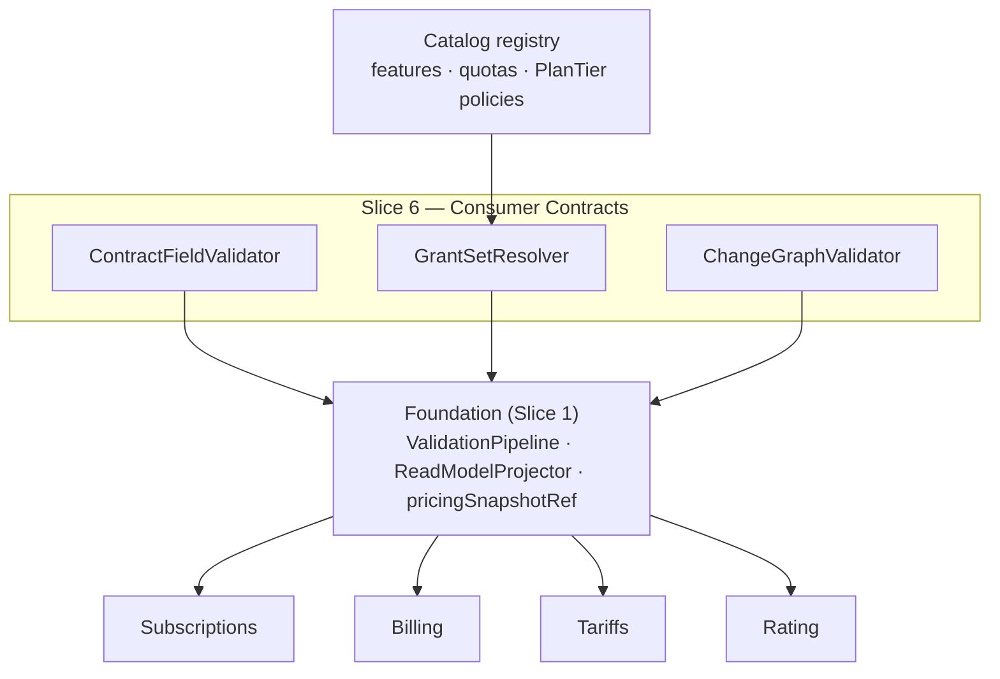

Created:  2026-08-24 by Virtuozzo International GmbH
Updated:  2026-08-24 by Virtuozzo International GmbH

<!-- CONFLUENCE_TITLE: [BSS]: Pricing — Consumer Contracts (Design, Slice 6) -->
<!-- Related: ../PRD.md, ../DESIGN.md, ./01-foundation.md | Owners: BSS Product Catalog team -->

# DESIGN — Consumer Contracts (Slice 6)

<!-- toc -->

- [1. Context](#1-context)
  - [1.1 Overview](#11-overview)
  - [1.2 Purpose](#12-purpose)
  - [1.3 Actors](#13-actors)
  - [1.4 References](#14-references)
  - [1.5 Scope](#15-scope)
  - [1.6 Constraints & Assumptions](#16-constraints--assumptions)
  - [1.7 Naming & Design-Introduced Names](#17-naming--design-introduced-names)
  - [1.8 Context & Dependencies](#18-context--dependencies)
- [2. Actor Flows (CDSL)](#2-actor-flows-cdsl)
  - [Resolve Consumer Contracts from the Read Model](#resolve-consumer-contracts-from-the-read-model)
- [3. Processes / Business Logic (CDSL)](#3-processes--business-logic-cdsl)
  - [Proration Input Contract](#proration-input-contract)
  - [Billing Timing](#billing-timing)
  - [Entitlement Grant Set](#entitlement-grant-set)
  - [Plan-Change Contract](#plan-change-contract)
  - [Rating Compatibility Contract](#rating-compatibility-contract)
- [4. States (CDSL)](#4-states-cdsl)
- [5. API Surface](#5-api-surface)
- [6. Data Model](#6-data-model)
- [7. Events & Alarms](#7-events--alarms)
- [8. Definitions of Done](#8-definitions-of-done)
  - [Proration Inputs](#proration-inputs)
  - [Billing Timing on Recurring Rows](#billing-timing-on-recurring-rows)
  - [Entitlement Grants](#entitlement-grants)
  - [Plan Change](#plan-change)
  - [Rating Compatibility](#rating-compatibility)
- [9. Acceptance Criteria](#9-acceptance-criteria)
- [10. Non-Functional Considerations](#10-non-functional-considerations)

<!-- /toc -->

## 1. Context

### 1.1 Overview

This slice owns the **frozen read-model fields downstream systems compute from** — the
contracts that make Subscriptions' proration, Billing's deferral, and Rating's resolution
deterministic without a single defaulted field: the **proration input contract**
(`billingAnchorPolicy`, the canonical `prorationBasis` enum, `creditOnDowngrade`),
**`billingTiming`** on every recurring row, the **entitlement grant set** (or its
`PlanTier`-resolved reference), the **plan-change contract** (`allowedChangeTargets`,
`comparabilityRank` — absence = no self-service change), and the **rating compatibility
contract** (`{skuId, planId, priceId}` + evaluation-policy completeness). The catalog
publishes inputs; the math and enforcement live downstream.

**Traces to**: `cpt-cf-bss-pricing-fr-proration-input-contract`,
`cpt-cf-bss-pricing-fr-billing-timing`, `cpt-cf-bss-pricing-fr-entitlement-grant-set`,
`cpt-cf-bss-pricing-fr-plan-change-contract`, `cpt-cf-bss-pricing-fr-rating-compatibility`

### 1.2 Purpose

Kill the enum-drift and default-substitution failure class across three consumer seams: the
same frozen `prorationBasis` value drives Subscriptions' and Tariffs' math (one enum, owned
here, adopted verbatim); Billing's deferral derives from an explicit frozen `billingTiming`;
plan changes only happen along Finance-approved edges. Every field is publish-validated —
absence fails publish, so a consumer can rely on presence.

### 1.3 Actors

| Actor | Role in Slice |
|-------|---------------|
| `cpt-cf-bss-pricing-actor-subscriptions` | Computes proration/plan-change/trial/entitlements from the published inputs |
| `cpt-cf-bss-pricing-actor-billing` | Derives deferral policy from `billingTiming` |
| `cpt-cf-bss-pricing-actor-rating` | Adopts `prorationBasis` verbatim; evaluates evaluation-policy fields; resolves `{skuId, planId, priceId}` deterministically (consolidated gear — rating ADR-0002) |
| `cpt-cf-bss-pricing-actor-catalog-registry` | Defines the features/quotas/`PlanTier` policies the grant set references |
| `cpt-cf-bss-pricing-actor-finance-manager` | Authors anchor/proration/change-target values |

### 1.4 References

- **PRD**: [PRD.md](../PRD.md) — §6.9, §17.6 (consumer contracts detail), §1.4 (Glossary: `prorationBasis`, `billingAnchorPolicy`, `billingTiming`, `allowedChangeTargets`, `comparabilityRank`)
- **Design**: [01-foundation.md](./01-foundation.md) — read model + snapshot (§4.4); [02-plan-definition.md](./02-plan-definition.md) — the rows/phases these fields attach to
- **Dependencies**: Foundation, plan-definition, price-structure (Slices 1–3): the contract fields attach to their rows and freeze in their snapshot.

### 1.5 Scope

**In scope**: authoring + publish validation + read-model projection of the five contracts;
the canonical `prorationBasis` enum ownership; the cross-boundary (currency/region/frequency)
mid-cycle rejection marker — the **marker only** (D-169); grant-set referential validation
against the registry.

**Out of scope**: proration **math**, plan-change execution, trial runtime, entitlement
**enforcement** (Subscriptions); deferral execution (Billing); formula evaluation (Tariffs);
the golden proration fixture content (jointly owned, gated in Slice 3's fixture registry
pattern); `PlanLink` migration (Slice 11); **the wording of the cross-boundary warning**
(D-169 — this slice publishes the machine-readable marker; the surface that renders the
warning and takes the operator's confirmation owns its copy, PRD AC #66).

### 1.6 Constraints & Assumptions

Inherits Foundation C-set. Slice-6-specific:

| # | Topic | Assumption (default) | Source |
|---|-------|----------------------|--------|
| K1 | Canonical proration enum | `prorationBasis ∈ {calendar_days_actual, calendar_days_30, by_second, whole_unit, none}` — owned here, adopted **verbatim** by Tariffs; any extension is a versioned contract change | PRD §1.4 |
| K2 | Anchor month-end/UTC | `billingAnchorPolicy ∈ {calendar_month, subscription_start, fixed_day(d)}`; `fixed_day(d)` — and a `subscription_start` anchor under monthly-granular cycles incl. `customEveryN Months(n)` (D-20) — with a day > month length anchors on the **last day of the month**, the **anchor day preserved** across periods (independent per-period clamp: 31→28→31, no drift); all anchor math UTC | PRD §1.4; D-20 |
| K3 | Cross-boundary changes | Mid-cycle changes crossing currency/region/frequency are **not supported at launch** → cancel + new subscription; the contract publishes **no** cross-boundary credit basis; signed off 2026-07-28 (D-49 — the product owner; the GTM customer-facing constraint entry is owed) | PRD §17.6, D-49 |
| K4 | Rank required | `comparabilityRank` is REQUIRED for **every** plan in self-service change — `PlanTier` is never an ordering at launch; the authoritative-published-`PlanTier`-ordering escape hatch had no defined artifact/API and is cut to §17.8 Future (2026-07-28 review fix, confirmed 2026-07-31) | PRD §1.4 |
| K5 | Proration fixture | The joint proration golden fixture (catalog + Subscriptions + Tariffs) exists before code; publish-contract sign-off gates on it | PRD §13 |

### 1.7 Naming & Design-Introduced Names

Reuses the PRD glossary; inherits Foundation mechanics. Not restated.

Design-introduced names (Slice 6):

| Name | Meaning |
|------|---------|
| `ContractFieldValidator` | Registered rules: presence/placement of the five contracts' fields at publish |
| `GrantSetResolver` | Validates the entitlement grant set (or `PlanTier` reference) against registry definitions — plan-level and per-phase entries alike (D-41), incl. per-phase keys against the plan's phase schedule; projects the resolved set and the materialized `phase→grant-set map` |
| `ChangeGraphValidator` | Validates `allowedChangeTargets` (published targets only) + `comparabilityRank` presence per K4 |

### 1.8 Context & Dependencies

**Consumed:** registry feature/quota/`PlanTier` definitions. **Produced:** the five frozen
contracts in the read model + `pricingSnapshotRef` — the fields Subscriptions/Billing/
Tariffs/Rating compute from.

## 2. Actor Flows (CDSL)

### Resolve Consumer Contracts from the Read Model

- [ ] `p1` - **ID**: `cpt-cf-bss-pricing-flow-contract-resolution`

**Actor**: `cpt-cf-bss-pricing-actor-subscriptions`, `cpt-cf-bss-pricing-actor-billing`, `cpt-cf-bss-pricing-actor-rating`

**Success Scenarios**:
- A consumer pins a committed `CatalogVersion` and reads the contract fields exactly as published (Foundation §4.4): proration inputs on recurring rows, `billingTiming`, the grant set, the change contract, `{skuId, planId, priceId}`
- Absence semantics are trustworthy: a missing `allowedChangeTargets` **means** no self-service change (fail-safe), never "unknown"

**Error Scenarios**:
- A consumer requesting a field on a plan published before this contract existed → the field is **absent by version**, and the consumer's own fail-safe applies (no catalog-side default synthesis)

**Steps**:
1. [ ] - `p1` - Consumer resolves via `pricingSnapshotRef` / the read-model API (Foundation `cpt-cf-bss-pricing-interface-catalog-read-model`) - `inst-cr-resolve`
2. [ ] - `p1` - No default substitution: every REQUIRED field was publish-validated present; optional fields carry defined absence semantics (fail-safe). The presence promise extends to historical-import reference rows: recurring imported rows MUST carry the same contract fields (S5 row-shape subset, D-13), so `migrated-origin` snapshots are never field-less (2026-07-28 review fix, confirmed 2026-07-31) - `inst-cr-nodefault`
3. [ ] - `p1` - **RETURN** the frozen contract set, stable for the pinned version - `inst-cr-return`

## 3. Processes / Business Logic (CDSL)

### Proration Input Contract

- [ ] `p1` - **ID**: `cpt-cf-bss-pricing-algo-proration-inputs`

**Input**: every recurring price row at publish
**Output**: `billingAnchorPolicy` + `prorationBasis` + `creditOnDowngrade` frozen in the read model / snapshot

**Steps**:
1. [ ] - `p1` - All three fields REQUIRED on recurring rows; absence fails publish - `inst-pi-required`
1a. [ ] - `p1` - **`creditOnDowngrade` semantics (normative):** on a downgrade the governing value is the **source** row's flag (the row whose prepaid period is surrendered), read from the **subscription's frozen snapshot** — never the target row and never the live catalog **The column reaches the frozen snapshot this step names (D-324, 2026-08-16):** `creditOnDowngrade` was absent from the `migrated-origin` payload while this step read it from the subscriber's frozen snapshot, which for a synthesized subscriber is that record and nothing else. - `inst-pi-credit-source`
1b. [ ] - `p1` - **Cross-field consistency:** `creditOnDowngrade = true` on a row with `prorationBasis = none` is a contradiction (credit granted but no basis to compute a partial period) — publish rejects it - `inst-pi-credit-none`
1c. [ ] - `p1` - **One contract per market (normative, D-123, 2026-07-31d billing-domain review fix — flagged for veto · joint with Subscriptions + Rating):** every published recurring row of a plan on one `(currency, region)` **whose `priceEligibility ∈ {all_subscriptions, new_subscriptions_only}`** MUST carry the **same** `billingAnchorPolicy` (incl. `anchor_day`), the same `prorationBasis` and the same `creditOnDowngrade` — a divergent market fails publish (`PRORATION_CONTRACT_MIXED_MARKET`, 422, divergent rows and fields named). **`existing_grandfathered` generations are excluded (D-132, 2026-08-01 review fix):** an immutable, never-superseded, never-unpublished generation in the row set made one cutover **permanently** freeze the market's cycle clock and credit policy — every later publish failing on a row nobody can fix. A grandfathered subscriber reads these three fields from its own frozen snapshot, so "a subscription is one cycle clock" still holds per subscription; the same scoping lands on D-110's tax-basis sibling. Phase is a scope-key axis, so under D-15 a phased plan carries one recurring row per charging phase per market — each with its own anchor as authored — while the consuming side reads **one** value per subscription: subscriptions' `billingAnchor` is a single field on the Subscription aggregate ("the PRD's cycle-boundary rule") and its PRD reads `prorationBasis` as one value "applied to all mid-period proration of the recurring component". Nothing related the N authored values to the one consumed value: an intro-pricing plan authoring `subscription_start` on the intro row and `fixed_day(1)` on the terminal row published both anchors into one frozen snapshot with no rule saying which sets the cycle boundary — one implementation keeps the boundary at phase conversion, another shifts it to the 1st and prorates a partial period. The rule is per market, not per plan (anchoring EU on the 1st and US on signup day stays legal — the D-110 shape: "an invoice is one document" → a subscription is one cycle clock); the phase axis is thereby cycle-clock-neutral **by construction** — phase conversion never moves the anchor-derived boundary and never changes proration math (usage rows were already deliberately phase-invariant, S2 `inst-ph-usage-invariant`; this closes the same class on the recurring side). `billingTiming` is **exempt** — deliberately per-row: a hybrid mixes `in_advance` base + `in_arrears` usage (`inst-bt-usage`) and Billing consumes it per line, never as a subscription-level clock. `inst-pi-credit-source` is unchanged: it picks **which snapshot's** value governs across a plan change; this rule guarantees that pick is unambiguous within one market - `inst-pi-uniform`
2. [ ] - `p1` - `prorationBasis` values per K1 — the canonical enum is **owned here**; Tariffs adopts verbatim; Subscriptions computes the amount from the same frozen value (one source, no drift) - `inst-pi-enum`
3. [ ] - `p1` - `billingAnchorPolicy` per K2: `fixed_day(d)` beyond month length anchors last-of-month; the same clamp + preserved-anchor-day rule applies to `subscription_start` under `customEveryN Months(n)` (D-20); all anchor math UTC; `customEveryN Days(n)` plans MUST carry `subscription_start` (cross-checked with Slice 2's cycle rule); the anchor math rides the joint proration/anchor fixture - `inst-pi-anchor`
4. [ ] - `p1` - **Cross-boundary marker (K3):** the contract publishes no cross-currency/region/frequency credit basis; such a mid-cycle change is rejected for in-place proration (cancel + new subscription; operator warned that in-place credit is forfeited — enforcement in Subscriptions). The published artifact is a **single contract-level read-model field**, `crossBoundaryChangePolicy = cancel_plus_new`, projected into `pricing_read_model` (§6). **The warning text is not a catalog field** (D-169, 2026-08-03, the product owner's call on the fork D-168 opened): the surface that renders the warning and takes the operator's confirmation owns its wording, and PRD AC #66 is where that obligation lives - `inst-pi-crossboundary`

### Billing Timing

- [ ] `p1` - **ID**: `cpt-cf-bss-pricing-algo-billing-timing`

**Input**: recurring/usage rows at publish
**Output**: explicit frozen `billingTiming` per recurring row

**Steps**:
1. [ ] - `p1` - `billingTiming ∈ {in_advance, in_arrears}` REQUIRED on every recurring row; absence fails publish (`BILLING_TIMING_MISSING`, 422, the row named — the code this slice's catalogue declares for it, and the one Slice 2's descriptor rule cites for the row-borne element it defers here; also enforced in Slice 2's recurring-cycle rule — one rule, registered once, referenced by both) - `inst-bt-required`
2. [ ] - `p1` - Usage rows are implicitly `in_arrears` (not authored, projected constant); one-time/setup rows likewise project a constant — charged at event (`in_advance`), never authored; a hybrid MAY mix `in_advance` base + `in_arrears` usage - `inst-bt-usage`
3. [ ] - `p1` - Frozen in `pricingSnapshotRef`; Billing derives deferral policy from it — never from heuristics - `inst-bt-frozen`

### Entitlement Grant Set

- [ ] `p1` - **ID**: `cpt-cf-bss-pricing-algo-grant-set`

**Input**: the plan's grant set (feature flags, quotas) or its `PlanTier`-resolved reference; on a phased plan, optional **per-phase** grant sets keyed by `phaseId` (D-41)
**Output**: the resolved grant set — plan-level and, when the plan is phased, the complete `phase→grant-set map` — in the read model

**Steps**:
1. [ ] - `p1` - Publish fails if a referenced feature, quota, or `PlanTier` policy is **undefined in the registry** (`GrantSetResolver` referential check) - `inst-gs-referential`
2. [ ] - `p1` - Published shape per §17.6: `featureFlag: bool` entries + `quotaKey: value` entries (Subscriptions consumes them as Entitlements); semantics are not defined here - `inst-gs-shape`
2a. [ ] - `p1` - **Per-phase authoring (D-41):** a phased plan MAY author a grant set (same §17.6 shape) per `phaseId`. Every per-phase key MUST reference a phase of the plan's own phase schedule (Slice 2) — a dangling `phaseId`, or a per-phase entry on a **non-phased** plan — normatively: a plan whose phase schedule is only the D-19 implicit terminal phase; an entry keyed to that sole implicit phase **also fails** (it must be authored as the plan-level set; 2026-07-28 review fix, confirmed 2026-07-31) — fails publish (`GRANT_SET_PHASE_UNKNOWN`); each entry passes the same `inst-gs-referential` check as the plan-level set. The projection **materializes the complete map**: every phase of the schedule maps to its effective resolved grant set — the authored per-phase entry where one exists, else the plan-level (`PlanTier`-resolved) set — so Subscriptions resolves the **active phase at `t`** by a single lookup and never merges fallbacks at runtime (the `phase→grant-set map` mirrors `phase→price`; the catalog publishes, never enforces) - `inst-gs-perphase`
3. [ ] - `p1` - A `PlanTier`-resolved reference publishes the **resolved** set (so Subscriptions provisioning does not re-derive from the taxonomy at runtime) plus the reference for auditability - `inst-gs-resolved`
3a. [ ] - `p1` - **Grant-set drift (D-27):** the registry can change a `PlanTier`'s feature/quota policy after publish — the catalog consumes the registry's tier-policy-change signal and flags every affected **published** plan `grants_divergent` **in the operator-plane flag store (`pricing_operator_flag`, D-85, 2026-07-30 review fix — never the versioned read model: a drift flag has no publish unit, and a frozen `CatalogVersion` never mutates)** (+ the `pricing.contracts.grants_divergent` alarm, Warn); remediation is a re-publish (re-resolving the set); consumers keep the frozen resolved set meanwhile — an operator remediation signal, never a silent retro-change (mirrors S2 `inst-cmp-tier-drift`; the signal scope is part of the registry joint contract, PRD §15) - `inst-gs-drift`

### Plan-Change Contract

- [ ] `p1` - **ID**: `cpt-cf-bss-pricing-algo-plan-change`

**Input**: `allowedChangeTargets` (explicit `planId` list) + `comparabilityRank` on plans participating in self-service change
**Output**: the change contract in the read model; fail-safe absence semantics

**Steps**:
1. [ ] - `p1` - `allowedChangeTargets` entries MUST be **explicit published `planId`s** — rule-based targets are **not authorable at launch** (D-23: a rule resolves only at read time, defeating every publish-time guarantee below; the designed extension — read-time fail-safe resolution with a `partially_resolvable` marker — is §17.8 Future); a dangling target fails publish. An edge whose target is **later retired** is **inert**: Subscriptions MUST re-check the target's lifecycle state at change time (D-24) - `inst-pc-targets`
1a. [ ] - `p1` - **Mutual comparability:** for every listed target, publish validates the target carries a `comparabilityRank` (K4 — the `PlanTier`-ordering alternative is §17.8 Future) — otherwise the runtime classification A→B is uncomputable; ranks are a single **tenant-wide scale** (authoring discipline: documented on the read model), not per-plan-local numbers. **Reverse guard (D-54, 2026-07-28):** the check also runs on the **target's own re-publish** — a plan referenced by any published `allowedChangeTargets` edge MUST NOT re-publish with its `comparability_rank` dropped to NULL (`COMPARABILITY_RANK_REVOKED`, 422, the referencing plans enumerated): without it a rank-less re-publish leaves already-published edges unclassifiable at read time, the same read-time drift D-23 cut rule-based targets to avoid (D-24 covers only the retirement case; dropping the rank legitimately requires first removing the inbound edges) - `inst-pc-mutual`
2. [ ] - `p1` - **Absence = no self-service change** (fail-safe), never any-to-any - `inst-pc-failsafe`
3. [ ] - `p1` - `comparabilityRank` REQUIRED for any plan in self-service change (K4 — no `PlanTier`-ordering alternative at launch; 2026-07-28 review fix, confirmed 2026-07-31); rank semantics: higher = upgrade, lower = downgrade, equal = switch (drives proration sign/credit in Subscriptions) - `inst-pc-rank`
4. [ ] - `p1` - **Edge boundary classification (D-25, revised by D-93, 2026-07-31 — flagged for veto · joint with Subscriptions):** the `in_place` vs `cancel_plus_new` classification is computed **at change time by Subscriptions** from both plans' published facts at its pinned version — the target covers the subscription's frozen `(currency, region)` with matching frequency ⇒ `in_place`, else `cancel_plus_new` (a K3 boundary) — exactly the read-time discipline `comparabilityRank` already uses (both ranks resolve at read; D-54 guards their presence). The pre-D-93 publish-time stamp is **removed**: it promised re-computation "on either side's re-publish", but a target's publish unit warms only the target's own delta (D-86/D-91) and the source's published revision is immutable, so a mechanism never existed and a stale `in_place` would run an in-place change across a boundary (wrong proration). The catalog publishes the **inputs** — each plan's market/frequency facts and the edge list — and the disclosure obligation stands: Subscriptions/storefront disclose credit forfeiture on `cancel_plus_new` before execution - `inst-pc-boundary`
5. [ ] - `p1` - Change-target edits are plan mutations → versioned, approvable (Slice 5 materiality applies) - `inst-pc-governed`
6. [ ] - `p1` - **Plan-change usage-counter continuity (normative, D-113, 2026-07-31 review fix — flagged for veto · joint with Rating + Subscriptions):** the plan authors **`usageCounterOnPlanChange ∈ {reset (default) | carry}`** — the snapshot-frozen flag Rating's plan-change boundary consults for tier-`Q` continuity (rating T-D-12 / `design/09`, which named pricing as this flag's home while **no pricing document defined it**: the D-01 class between gears — every mid-window plan change evaluated against an absent flag, and rating's own two absence readings disagreed). Semantics: at an **in-place** plan change Rating routes the **target** plan's frozen flag (the plan whose bands consume the continued `Q` accepts the continuity liability); **absence = `reset`** (an old snapshot without the field is a reset, never a rating failure). **`carry` is honoured per shared `(meter, dimensionKey)` line and only where the D-82/D-98/D-122 unit field set (`model_kind`, `billingGranularity`, `aggregationFunction`, `aggregationGranularity`, `tierAggregationWindow`, `tierQualificationWindow`, `package_size`) matches between the source and target rows across both frozen snapshots** — a mismatched line **resets** (+ a rating-side operator signal), never carries a counter across denominations: the counter key `(subscription, meter, dimensionKey, window)` is plan-blind, publish-time guarding is impossible across independent plans, and an unguarded carry is the ×24 class through its fourth door (supersession — D-82, kind flip — D-98, phase axis — D-89, plan change — here). Commitment-**pool** carry stays Rating/Contracts-side pending the deferred committed-usage authoring: pricing publishes **no** pool flag, and rating's pool default stays reset — stated so that gap is not recreated silently. **The routing covers `PlanLink` migration too (2026-08-01 review fix, C-8):** a scheduled migration ([`11-lifecycle.md`](./11-lifecycle.md) `inst-mg-boundary`) is the other **in-place** plan move — it creates a `PlanLink`, not a cancel + new — so the same rule applies with the same guard: the **target** plan's frozen flag governs, `carry` only per unit-matched shared `(meter, dimensionKey)` line, otherwise reset. The migration contract already pins the other two entry facts (no target setup charge; entry at the first non-trial phase) and simply had not named this one; the `reset` default plus the unit-match gate mean nothing unsafe was reachable, so this is completeness of the routing statement. Owed adoptions: Rating (target-snapshot routing, per-line unit check, absence default, a SEAMS row); Subscriptions (informational — the WHEN/MATH split is unchanged) - `inst-pc-counter-carry`

### Rating Compatibility Contract

- [ ] `p1` - **ID**: `cpt-cf-bss-pricing-algo-rating-compat`

**Input**: the publishing plan's full row set
**Output**: the §17.6 rating-compatibility guarantees, checked as one registered rule bundle

**Steps**:
1. [ ] - `p1` - Stable `{skuId, planId, priceId}` exposed on all downstream artifacts; ids never re-used across revisions (append-only rows guarantee this structurally, Foundation §4.3) - `inst-rc-ids`
2. [ ] - `p1` - Completeness cross-check (delegating to the owning slices' rules; this bundle asserts the **union**): `modelKind` + `quantitySource` + `packageSize`/`packagePrice` (Slice 3), `tierAggregationWindow`/`billingGranularity` on usage rows (Slice 3), `tierQualificationWindow` (Slice 10, D-40), `aggregationFunction`/`aggregationGranularity`/`max_hold_granules` on non-`sum` rows (Slice 3, D-44), meter injectivity (Slice 2), descriptors (Slice 2) — the enumeration is illustrative; exhaustiveness delegates to the owning slices' registered rules - `inst-rc-union`
3. [ ] - `p1` - No monetary charge computed here — the contract is inputs-only (Foundation principle) - `inst-rc-nocompute`

## 4. States (CDSL)

No slice-owned state machine: contract fields ride the plan/price lifecycle (draft →
published → superseded/retired) owned by the Foundation and Slices 2/3. Absence semantics
(`allowedChangeTargets` missing = no self-service change) are **values**, not states.

## 5. API Surface

No new endpoints: the contracts are fields of the Foundation read-model API
(`cpt-cf-bss-pricing-interface-catalog-read-model`) and are authored through the Slice 2/3
plan/price authoring surfaces. This slice contributes:

| Concern | Where it lands |
|---------|----------------|
| Proration inputs, `billingTiming` | recurring-row fields on `POST/PATCH /bss-pricing/v1/plans/{planId}/prices` |
| Grant set / grant reference | plan fields on `POST/PATCH /bss-pricing/v1/plans/{planId}` |
| Change contract | plan fields on `POST/PATCH /bss-pricing/v1/plans/{planId}` |

**Problem responses (RFC 9457):** `PRORATION_INPUTS_MISSING` (422),
`PRORATION_INPUTS_CONTRADICTORY` (422 — `creditOnDowngrade = true` with
`prorationBasis = none`, `inst-pi-credit-none`),
`PRORATION_CONTRACT_MIXED_MARKET` (422 — recurring rows of one plan on one
`(currency, region)` disagreeing on `billingAnchorPolicy`/`anchor_day`, `prorationBasis` or
`creditOnDowngrade`; D-123, `inst-pi-uniform`, divergent rows and fields named),
`BILLING_TIMING_MISSING`
(422), `GRANT_REF_UNDEFINED` (422), `GRANT_SET_PHASE_UNKNOWN` (422 — a per-phase grant-set
key naming no phase of the plan's schedule, or per-phase entries on a non-phased plan —
non-phased = implicit-terminal-phase-only, incl. an entry on that sole phase; D-41, D-19),
`CHANGE_TARGET_UNPUBLISHED` (422), `COMPARABILITY_RANK_REQUIRED` (422),
`COMPARABILITY_RANK_REVOKED` (422 — a re-publish dropping the rank while published inbound
change edges reference the plan; D-54).

## 6. Data Model

This slice adds columns to Foundation-owned tables (no new tables; `pricing_` prefix per
Foundation §3.7):

**`pricing_price` (Slice-6 columns, recurring rows)**:

| Column | Type | Notes |
|--------|------|-------|
| `billing_anchor_policy` | `enum` | `calendar_month \| subscription_start \| fixed_day`; + `anchor_day` (`int`, for `fixed_day`) |
| `proration_basis` | `enum` | `calendar_days_actual \| calendar_days_30 \| by_second \| whole_unit \| none` (K1) |
| `credit_on_downgrade` | `bool` | catalog-sanctioned downgrade credit eligibility |
| `billing_timing` | `enum` | `in_advance \| in_arrears`; NOT NULL on published recurring rows |

**`pricing_plan` (Slice-6 columns)**:

| Column | Type | Notes |
|--------|------|-------|
| `entitlement_grants` | `jsonb` | `featureFlag`/`quotaKey` entries, or the `PlanTier` reference + the resolved set; optional `perPhase` map keyed by `phase_id` (D-41) — keys referential-validated against the plan's phase schedule, the projection materializes the complete `phase→grant-set map` |
| `allowed_change_targets` | `jsonb` | explicit `planId` list only — rule-based targets are not authorable at launch (D-23; §17.8 Future); entries `[{planId}]` — the `in_place \| cancel_plus_new` classification is **not stamped** here: it is computed at change time by Subscriptions from both plans' published market/frequency facts at its pinned version (D-93 — a stamped value cannot be re-computed under the frozen per-subject read model); NULL = no self-service change (fail-safe) |
| `comparability_rank` | `int` | required when participating in self-service change (K4) |
| `usage_counter_on_plan_change` | `enum` | `reset (default) \| carry` — the snapshot-frozen plan-change tier-`Q` continuity flag Rating consumes from the **target** plan's snapshot (D-113); `carry` honoured per shared `(meter, dimensionKey)` line only under the D-82/D-98/D-122 unit-field match, else that line resets; absence = `reset`. Revision-scoped like every plan column |

Key constraints: `CHECK (billing_timing IS NOT NULL)` enforced at the publish transition (not
on drafts); `anchor_day BETWEEN 1 AND 31` with last-of-month semantics per K2 documented on
the read model; grant/target referential checks are application-level at publish (registry /
published-plan lookups). The three proration-contract columns (`billing_anchor_policy` +
`anchor_day`, `proration_basis`, `credit_on_downgrade`) are additionally **market-uniform per
plan across the non-grandfathered eligibility classes** (D-123 as scoped by D-132,
`inst-pi-uniform`) — a publish-time validation, not a DB constraint (the check
spans the market's row set).

**`pricing_read_model` (contract-level field)**: `crossBoundaryChangePolicy`
(`cancel_plus_new` — the K3 marker), projected **on every `plan` subject row** (2026-07-31
review fix: "projected once per contract version" named no subject, and since D-91 the store is
keyed `(tenant_id, catalog_version, subject_kind, subject_ref)` with no tenant- or
contract-level subject to hold a free-floating value. It is a launch-constant, tenant-wide
value, so riding the plan subject costs nothing and keeps the resolution rule uniform — a
consumer reading a plan already has it; no new `subject_kind` is introduced for one constant).
**The warning text is not a catalog field (normative, D-169, 2026-08-03).** This slice also
required a `crossBoundaryWarningText` beside the policy, and its value was named in no document
of the set, so a projector held one half of a two-field contract with nothing to put in the
other; **D-168** made the pair stamp as a pair or not at all, so a version answered this
contract with nothing rather than with half of it, and forked where the text comes from. The
product owner closed that fork by **removing the text from the contract**: what is published is
the machine-readable marker, and the surface that renders the warning owns its wording — PRD
**AC #66**, the preview/migration UI that warns in-place credit is forfeited and takes an
explicit confirmation, which is where this set had already put that sentence. The reason is the
store rather than the sentence: a delta row is INSERT-only on the ≥ 7-year horizon and a
completed version never changes, so a customer-visible string frozen here is frozen in one
language for every version already stamped with it, and this set has no localization story to
put beside one. D-168 clause (1) is thereby **discharged, not overridden** — with a single field
there is no half to publish — and its ban on freezing a value no document declares is the
argument that decided the fork. The full option set and what (a) and (b) cost is in
[`../DECISIONS.md`](../DECISIONS.md) D-169.

## 7. Events & Alarms

No new event names — contract fields ride `PlanPublished`/`PriceCreated`/`PriceUpdated` into
the warmed read model. Alarms: `pricing.contracts.grants_divergent` (Warn — a registry
tier-policy change diverged from a published plan's frozen grant set; remediation =
re-publish, D-27); `pricing.contracts.enum_drift` (Critical) — the CI-level
conformance check (K1/K5 fixtures) that Tariffs'/Subscriptions' adopted enums match the
canonical set; drift is a build-time block, the alarm covers runtime registry divergence.

## 8. Definitions of Done

### Proration Inputs

- [ ] `p1` - **ID**: `cpt-cf-bss-pricing-dod-proration-inputs`

Every recurring row **MUST** publish `billingAnchorPolicy` (month-end/UTC semantics per K2),
`prorationBasis` (the canonical K1 enum, adopted verbatim downstream), and
`creditOnDowngrade`, frozen in `pricingSnapshotRef`; `creditOnDowngrade = true` with
`prorationBasis = none` is a publish-rejected contradiction; the three fields **MUST** be
uniform across the **non-grandfathered** recurring rows of one plan-`(currency, region)` (D-123
scoped by D-132, `PRORATION_CONTRACT_MIXED_MARKET` — phase conversion never moves the cycle
clock, and an immutable generation never freezes the market);
cross-boundary mid-cycle changes
carry no credit basis and are rejected for in-place proration (cancel + new — the
`crossBoundaryChangePolicy` read-model field carries the marker; the warning's **wording** is
the rendering surface's, never a published field, D-169 / PRD AC #66).

**Implements**: `cpt-cf-bss-pricing-algo-proration-inputs`, `cpt-cf-bss-pricing-flow-contract-resolution`

**Touches**:
- DB: `pricing_price` (proration columns)
- Entities: `ContractFieldValidator`

### Billing Timing on Recurring Rows

- [ ] `p1` - **ID**: `cpt-cf-bss-pricing-dod-billing-timing`

`billingTiming` **MUST** be present on every published recurring row (absence fails publish),
usage rows are implicitly `in_arrears`, hybrids may mix, and the frozen value is Billing's
sole deferral input.

**Implements**: `cpt-cf-bss-pricing-algo-billing-timing`

**Touches**:
- DB: `pricing_price.billing_timing`
- Entities: `ContractFieldValidator`

### Entitlement Grants

- [ ] `p1` - **ID**: `cpt-cf-bss-pricing-dod-grants`

The read model **MUST** carry the plan's grant set (or its `PlanTier`-resolved reference +
resolved set) and, for a phased plan, the **complete materialized `phase→grant-set map`**
(authored per-phase entries, plan-level fallback resolved at publish — D-41); publish
**MUST** fail on a feature/quota/`PlanTier` policy undefined in the registry and on a
per-phase key naming no phase of the plan's schedule.

**Implements**: `cpt-cf-bss-pricing-algo-grant-set`

**Touches**:
- DB: `pricing_plan.entitlement_grants`
- Entities: `GrantSetResolver`

### Plan Change

- [ ] `p1` - **ID**: `cpt-cf-bss-pricing-dod-plan-change`

`allowedChangeTargets` **MUST** reference published plans only; absence **MUST** mean no
self-service change; `comparabilityRank` **MUST** be present for participating plans (no
`PlanTier`-ordering alternative at launch — K4); target edits are governed mutations. The plan
**MUST** publish `usageCounterOnPlanChange` (`reset` default; D-113) — the snapshot-frozen
flag Rating's plan-change boundary consults, with `carry` honoured only per unit-matched
shared `(meter, dimensionKey)` line (mismatch ⇒ reset, never a cross-denomination carry).

**Implements**: `cpt-cf-bss-pricing-algo-plan-change`

**Touches**:
- DB: `pricing_plan` (change-contract columns)
- Entities: `ChangeGraphValidator`

### Rating Compatibility

- [ ] `p1` - **ID**: `cpt-cf-bss-pricing-dod-rating-compat`

The publish **MUST** assert the §17.6 union — stable ids, model-kind completeness,
evaluation-policy presence on usage rows, meter mapping, descriptors — as one registered rule
bundle over the owning slices' rules; no charge computation.

**Implements**: `cpt-cf-bss-pricing-algo-rating-compat`

**Touches**:
- DB: `pricing_read_model`
- Entities: `ContractFieldValidator`

## 9. Acceptance Criteria

Delta over the Foundation testing architecture.

Unit:

- [ ] Recurring row missing any of the three proration fields / `billingTiming` fails publish; `creditOnDowngrade=true` with `prorationBasis=none` fails publish (`PRORATION_INPUTS_CONTRADICTORY`); a phased plan whose intro-phase recurring row anchors `subscription_start` while its terminal row anchors `fixed_day(1)` **on the same market** fails publish (`PRORATION_CONTRACT_MIXED_MARKET`, D-123 — divergent rows and fields named), while the same split across **two** markets publishes, and a divergence between an `existing_grandfathered` generation and the current rows of one market **also** publishes (D-132 — the generation is not in the uniformity row set); usage row projects `in_arrears`; `fixed_day(31)` in a 30-day month resolves last-of-month (UTC); dangling change target fails; rank-required matrix (K4); grant referential failure per undefined feature/quota/PlanTier; a per-phase grant-set key naming no phase fails publish (`GRANT_SET_PHASE_UNKNOWN`); a phased plan with one authored phase entry publishes a complete map (other phases resolve the plan-level set) and Subscriptions reads the trial phase's tighter quotas by lookup

Integration (testcontainers):

- [ ] A hybrid plan publishes `in_advance` base + implicit `in_arrears` usage; both visible in the read model exactly as authored
- [ ] The published `prorationBasis` value round-trips byte-identical through snapshot → read model → consumer read (no normalization drift)
- [ ] A plan without `allowedChangeTargets` reads as no-self-service-change (field absent, not defaulted)
- [ ] `usageCounterOnPlanChange` round-trips frozen (D-113): unset publishes as `reset`; a `carry` target plan sharing a `(meter, dimensionKey)` line with matching unit fields reads `carry` for that line, while the same pair with a `per_hour` vs `per_day` mismatch resolves `reset` for it (the check runs Rating-side over both frozen snapshots — this AC pins the published inputs)
- [ ] Grant set resolved from `PlanTier` publishes both the reference and the resolved set
- [ ] The read model exposes `crossBoundaryChangePolicy = cancel_plus_new` on every resolved `plan` subject row (not as a subject-less contract-level record — the D-91 keying has no such subject), and exposes **no** warning-text field (D-169, §6 — the copy belongs to the surface that renders it, PRD AC #66). D-168's both-or-neither went out with the second half of the pair: this AC was unsatisfiable while the contract named a field no document declared a value for, and it is satisfiable as one field

Conformance (joint, K5):

- [ ] The shared proration golden fixture passes against the published fields (catalog side); publish-contract sign-off gates on it

## 10. Non-Functional Considerations

- **Performance**: all validation is publish-path; the contracts add columns to existing read-model rows — no extra read-path lookups.
- **Observability / metrics**: `pricing_contract_validation_failures_total{contract}`; the conformance-fixture status gauge (shared with Slice 3's registry).
- **Security & AuthZ**: contract fields are plan/price mutations — Slice 5 RBAC + materiality apply (a change-target edit can widen who may move where; it is governed).
- **Risks & open items**: enum drift across Subscriptions/Tariffs (PRD risk — mitigated by K1 ownership + K5 fixtures before code); cross-boundary cancel+new signed off (K3 / D-49, 2026-07-28 — the GTM constraint entry remains owed); the proration fixture is jointly owned and MUST exist before implementation (PRD §13 gate).
