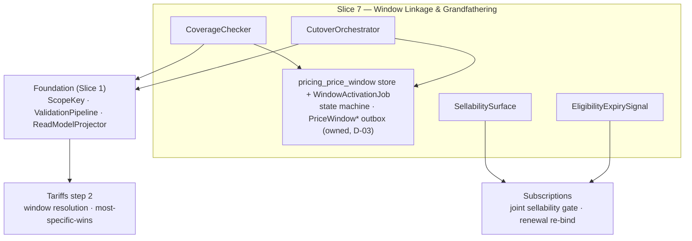

Created:  2026-08-24 by Virtuozzo International GmbH
Updated:  2026-08-24 by Virtuozzo International GmbH

<!-- CONFLUENCE_TITLE: [BSS]: Pricing — PriceWindow Linkage, Coverage & Grandfathering (Design, Slice 7) -->
<!-- Related: ../PRD.md, ../DESIGN.md, ./01-foundation.md | Owners: BSS Product Catalog team -->

# DESIGN — PriceWindow Linkage, Coverage & Grandfathering (Slice 7)

<!-- toc -->

- [1. Context](#1-context)
  - [1.1 Overview](#11-overview)
  - [1.2 Purpose](#12-purpose)
  - [1.3 Actors](#13-actors)
  - [1.4 References](#14-references)
  - [1.5 Scope](#15-scope)
  - [1.6 Constraints & Assumptions](#16-constraints--assumptions)
  - [1.7 Naming & Design-Introduced Names](#17-naming--design-introduced-names)
  - [1.8 Context & Dependencies](#18-context--dependencies)
- [2. Actor Flows (CDSL)](#2-actor-flows-cdsl)
  - [Execute a Grandfathering Cutover](#execute-a-grandfathering-cutover)
- [3. Processes / Business Logic (CDSL)](#3-processes--business-logic-cdsl)
  - [Publish-Time Window Coverage](#publish-time-window-coverage)
  - [Future-Gap Detection](#future-gap-detection)
  - [Sellability Gate](#sellability-gate)
  - [Grandfathering Eligibility Resolution](#grandfathering-eligibility-resolution)
  - [Grandfathering Cutover (atomic unit)](#grandfathering-cutover-atomic-unit)
  - [Supersession (atomic unit)](#supersession-atomic-unit)
- [4. States (CDSL)](#4-states-cdsl)
  - [Price Window State Machine](#price-window-state-machine)
  - [Grandfathered Row Eligibility State Machine](#grandfathered-row-eligibility-state-machine)
- [5. API Surface](#5-api-surface)
- [6. Data Model](#6-data-model)
- [7. Events & Alarms](#7-events--alarms)
- [8. Definitions of Done](#8-definitions-of-done)
  - [Window Coverage](#window-coverage)
  - [Window Lifecycle](#window-lifecycle)
  - [Future Gaps](#future-gaps)
  - [Sellability](#sellability)
  - [Grandfathering](#grandfathering)
  - [Supersession Unit](#supersession-unit)
- [9. Acceptance Criteria](#9-acceptance-criteria)
- [10. Non-Functional Considerations](#10-non-functional-considerations)

<!-- /toc -->

## 1. Context

### 1.1 Overview

This slice owns the **time axis of published prices** — including the `PriceWindow`
machinery itself (D-03): the window tables and state machine, **scheduling**, the UTC
**activation/expiration job** (a coordination-lease singleton), and the `PriceWindow*`
**event emission** from the gear outbox; plus the publish-time **window-coverage check**
(every billable row linkable to an active/scheduled `PriceWindow` on its canonical scope key,
base `priceOverlay`), **future-gap detection** across scheduled windows, the **sellability
gate** inputs (active window + committed `CatalogVersion` + `availableFrom`/`availableTo` +
plan lifecycle state + the GA-gate flags), the **grandfathering eligibility** read-model
surface (`priceEligibility`, `cohort`, `grandfatherUntil`, most-specific-wins), and the
**grandfathering cutover** as one atomic approval unit. The legacy **effective-dating
price-windows use case is consolidated here** (PRD §15 — decided 2026-07-10): windows live
in this gear's database, so the cutover's multi-window unit is a **local ACID transaction**,
not a cross-component protocol; the UC document remains scenario source material.

**Traces to**: `cpt-cf-bss-pricing-fr-pricewindow-coverage`,
`cpt-cf-bss-pricing-fr-future-gap-coverage`, `cpt-cf-bss-pricing-fr-sellability-gate`,
`cpt-cf-bss-pricing-fr-grandfathering-eligibility`

### 1.2 Purpose

Guarantee Tariffs step 2 always resolves: no billable row publishes without window coverage,
no gap between scheduled windows silently fails rating for everyone inside it, nothing sells
before it is both windowed and version-addressable, and a legacy price survives a cutover as
an immutable, concurrently-active, deterministically-selected row — with a bounded or
indefinite lifetime the operator controls via `grandfatherUntil`.

### 1.3 Actors

| Actor | Role in Slice |
|-------|---------------|
| `cpt-cf-bss-pricing-actor-finance-manager` | Schedules/cancels windows (owned here), runs cutovers |
| `cpt-cf-bss-pricing-actor-rating` | Resolves the active window per scope key at `t` (step 2); applies most-specific-wins |
| `cpt-cf-bss-pricing-actor-subscriptions` | Enforces the sellability gate jointly; re-binds at `grandfatherUntil` expiry |
| `cpt-cf-bss-pricing-actor-finance-reviewer` | Approves the cutover (one approval unit; Slice 5) |

### 1.4 References

- **PRD**: [PRD.md](../PRD.md) — §6.5, §17.5 (grandfathering-cutover mechanism), §1.4 (Glossary: `priceEligibility`, `grandfatherUntil`), §17.3 (window-coverage + sellability composition rules)
- **Design**: [01-foundation.md](./01-foundation.md) — scope key (§4.1), immutability + cutover mechanics (§4.3); [04-currency-tax.md](./04-currency-tax.md) — `not_sellable_ga` input to the gate
- **Dependencies**: Foundation + Slices 2/3 (rows to cover); Slice 5 (the cutover approval unit); Slice 11's retirement invokes **this slice's** window-cancellation flow. The legacy effective-dating UC (`UC-effective-dating-price-windows-202601121200`) is **consolidated into this slice** (D-03) and retained as scenario source only.

### 1.5 Scope

**In scope**: the `PriceWindow` entity, state machine, scheduling/cancellation API, the UTC
activation/expiration singleton job, and `PriceWindow*` event emission (consolidated, D-03);
publish-time coverage on the base-`priceOverlay` scope key; future-gap rejection; the
sellability gate **inputs** (joint rule with Subscriptions); `priceEligibility` + `cohort` +
`grandfatherUntil` read-model exposure with most-specific-wins documentation; the cutover
transaction (shorten + two schedules as one **local ACID** approval unit); the
`grandfatherUntil` expiry signal.

**Out of scope**: the scheduler/timeline **UI** (Frontend DESIGN); FX rate-lock from the
legacy UC (**rejected here** — the catalog performs no FX; Tariffs/PLAL owns rates, Future
scope); subscription/revenue impact preview from the legacy UC (needs Subscriptions data —
out of catalog scope, joint item if revived); the purchase-time enforcement itself
(Subscriptions, joint rule); Tariffs' step-2 resolution algorithm (consumes what we publish).

### 1.6 Constraints & Assumptions

Inherits Foundation C-set (UTC everywhere). Slice-7-specific:

| # | Topic | Assumption (default) | Source |
|---|-------|----------------------|--------|
| W1 | Window SoR | `PriceWindow` rows + their state machine are **owned by this slice** (consolidated per D-03 / ADR `cpt-cf-bss-pricing-adr-pricewindow-consolidation`; PRD §15 answered) — same gear, same database as the price rows: coverage checks read the owned tables directly (no mirror), and multi-window units commit in one local transaction | PRD §2.1; D-03 |
| W2 | Non-overlap key | Window non-overlap is per **canonical scope key** (ADRs `cpt-cf-bss-pricing-adr-canonical-scope-key`, `…-grandfathering-cohort-axis`); a grandfathered generation + successor — and any number of prior generations (distinct `cohort`s) — at the same `t` are distinct keys, never an overlap violation | PRD §2.2 |
| W3 | Most-specific-wins | When several eligibility classes hold active windows on the same remaining axes: `existing_grandfathered` > `new_subscriptions_only` > `all_subscriptions` (applied by Tariffs step 2 **after** eligibility matching). Class ordering only — **within** `existing_grandfathered` the generation is selected by the subscription's bound `cohort` (the cohort of its pinned price id) → unique row | PRD §1.4 |
| W4 | Cutover atomicity | Shorten current `all_subscriptions` window `effectiveTo` + schedule the grandfathered copy + schedule the successor = **one approval unit**; active windows are shortened, not cancelled; `PriceWindowCancelled` only for not-yet-active windows of the old key | PRD §17.5 |
| W5 | Deferred publish | "Publish at T" is out of launch scope; `availableFrom`/`availableTo` are purchasability dates validated against coverage, not a publish scheduler | PRD §6.5 |
| W6 | **"The longest billing cycle sold on the key"** (normative, 2026-08-01 review fix, C-2) | The phrase carries three margins — the D-80 coverage horizon (`inst-sg-surface`), the D-04 copy-window bound (`inst-co-bounds`) and the trailing-void floor (`inst-fg-trailing`) — but `usage`, `one_time` and `one_time_setup` keys carry no `frequency` at all, so read literally it was undefined on most keys of a hybrid. It is therefore defined **per plan, not per key**: the longest `frequency` among the plan's **recurring** rows on the key's `(currency, region)`, matching D-121's `H` ("2 × the longest cycle sold on the plan"). On a plan with **no** recurring part (pure one-time or pure usage-with-no-subscription-cycle) the margin is **zero** — a one-time purchase needs no forward coverage — and the horizon predicate reduces to "an active window covers `t`" | D-04, D-80, D-121 |

### 1.7 Naming & Design-Introduced Names

Reuses the PRD glossary; inherits Foundation mechanics. Not restated.

Design-introduced names (Slice 7):

| Name | Meaning |
|------|---------|
| `CoverageChecker` | Publish-time rule: every billable row's scope key has an active/scheduled window; gap detection across scheduled windows |
| `SellabilitySurface` | The read-model composite the joint gate evaluates: active-window flag + committed-version flag + `availableFrom/To` + plan lifecycle state + the GA-gate flags (`not_sellable_ga`, prepaid-execution) + the registry `sellable` flag per offered SKU (D-46; mirrored from the pinned `CatalogVersion` — the flag is frozen per version registry-side, so the surface reads it off the same version-pinned projection as predicate (2), no live registry query) |
| `CutoverOrchestrator` | Builds the W4 atomic unit (shorten + grandfathered copy + successor) as one approval + one **local ACID** transaction |
| `SupersessionOrchestrator` | Builds the **supersession unit** (D-88): successor row + predecessor-window shorten + successor-window schedule as one approval + one local ACID transaction — the only path to `published → superseded` |
| `EligibilityExpirySignal` | The published signal that a row's `grandfatherUntil` passed — Subscriptions re-binds at next renewal |
| `WindowScheduler` | The owned scheduling/cancellation surface: creates `scheduled` windows (overlap-validated per scope key), cancels not-yet-active ones, adjusts a future `effectiveTo` (D-03) |
| `WindowActivationJob` | Coordination-lease singleton: flips `scheduled → active` at `effectiveFrom` and `active → expired` at `effectiveTo` (UTC, idempotent, ordered per `(tenant, plan)`), emitting `PriceWindowActivated`/`Expired` from the outbox |

### 1.8 Context & Dependencies

**Owned:** the `pricing_price_window` store + state machine, the `WindowActivationJob`, and
`PriceWindowScheduled/Activated/Cancelled/Expired` emission (D-03; previously consumed from the effective-dating UC).
**Produced:** the coverage guarantee, the sellability surface, eligibility fields +
most-specific-wins semantics, the cutover unit, the expiry signal.

## 2. Actor Flows (CDSL)

### Execute a Grandfathering Cutover

- [ ] `p1` - **ID**: `cpt-cf-bss-pricing-flow-grandfathering-cutover`

**Actor**: `cpt-cf-bss-pricing-actor-finance-manager` (approval via Slice 5 — a cutover is always material)

**Success Scenarios**:
- One approval unit atomically: shortens the current `all_subscriptions` window to the cutover instant, schedules the immutable `existing_grandfathered` copy as a **new `cohort` generation** (`cohort` = the cutover instant; prior generations' rows and windows are untouched), schedules the `all_subscriptions` successor — **no coverage gap opens** at any instant; cutovers are **repeatable** per key (ADR-0002)
- Optionally sets `grandfatherUntil` (UTC) on the copy; null = indefinite

**Error Scenarios**:
- A composed unit whose parts no longer form a gap-free set at compose/commit (copy-window bound violation per `inst-co-bounds`, or the owned window state changed between compose and commit) → rejected (`CUTOVER_GAP`)
- A cutover instant in the past at submit, or an instant that passes — or comes closer than the max batching-delay SLO (D-47) — while the approval pends → rejected (`CUTOVER_INSTANT_PASSED`, 422); the unit is recomposed
- Attempt to supersede or reprice an `existing_grandfathered` row → rejected (Foundation §4.3; only tightening `grandfatherUntil` is allowed, as a material change)

**Steps**:
1. [ ] - `p1` - API: POST /bss-pricing/v1/plans/{planId}/cutovers — payload: the cutover instant + **per-selected-key entries** (scope-key selector → successor row ref, per key), with an optional **per-key `grandfatherUntil`** overriding an optional unit-wide default (D-28; 2026-07-28 review fix, confirmed 2026-07-31) - `inst-gc-api`
2. [ ] - `p1` - `CutoverOrchestrator` composes the W4 unit and validates gap-freeness across the three window operations **before** submission; the cutover instant MUST be in the future at submit **and**, at approval commit, at least the **max batching-delay SLO** (D-47: 5 min) in the future (`CUTOVER_INSTANT_PASSED` otherwise; 2026-07-30 review fix) — an instant inside the batching/warm lag would activate the successor's window while its row is not yet addressable at any completed `CatalogVersion`, transiently failing renewals/arrears on the key closed - `inst-gc-compose`
3. [ ] - `p1` - Approval (Slice 5, material) → **one local ACID transaction** over the slice-owned window tables (D-03): shorten `effectiveTo` + two window schedules + the two new rows + **the predecessor's `published → superseded` flip** (D-100 — see `inst-co-supersede`) commit or roll back together — no cross-component protocol, no partial state. The grandfathered copy and the successor **pass the Foundation validation pipeline and the commit requests `CatalogVersion` addressability exactly as a supersession publish does** (PRD §17.5) — the successor is sellable only after `CatalogVersionPublished` + warm-completion. Events: `PriceWindowScheduled` ×2 — **and `PriceCreated` ×2 reaches these two rows from the authoring door rather than from here (D-203 as corrected, 2026-08-06)**. This clause said the opposite, on the premise that the copy and the successor *"are born published and pass no authoring door"*; they are not. Both are staged as **drafts** at compose, because `inst-gc-compose` clause (a) makes them the reviewer's subject and the approval content pin covers a plan shape that must contain them — a pin over a world without the rows under review is a unit no approve can satisfy. So both pass the authoring door, both announce there, and a second emission here would be a duplicate the event's own dedup key refuses. **`PriceCreated` has one producer.** **`PriceUpdated` ×1 for the successor, naming the predecessor as `supersedesPriceId` (D-218, decided and built 2026-08-07):** the transition being announced is the **same** one `inst-su-commit` announces — a row landing on an occupied published canonical scope key and flipping its predecessor `published → superseded` — and D-127 already binds both producers of it to one guard, on the ground that the guard follows the **key** rather than the mechanism. Leaving it unannounced made a consumer's correctness depend on which act moved the row, which is the coupling D-100 removed on the truth side. It is emitted **before** the two `PriceWindowScheduled`, matching the order a supersession emits the same pair in; `PriceWindowExpired` fires at cutover; `PriceWindowCancelled` only for not-yet-active windows of the old key. **The commit also records the `effectiveTo` it overwrites (D-338, 2026-08-17):** the shorten reaches the store directly and its audit pair named no window and no instant, so the value it destroyed was unrecoverable — it is now carried in `before_state` as a value, keyed `(scopeKey, effectiveFrom)` because this act's subject names the act and not a window. The shorten still emits no event of its own, which is owed - `inst-gc-commit`
4. [ ] - `p1` - **RETURN** 202 (cutover scheduled); the grandfathered copy is immutable in price from birth - `inst-gc-return`

## 3. Processes / Business Logic (CDSL)

**A cutover owes all three tiers (D-344).** It replaces a predecessor on a key, so Tier A
binds it; `priceEligibility` is a scope-key axis, so opening a generation changes which
keys are current and Tier B binds it too; and its successor's content is client-authored,
which is what the joint fixture gate guards. Until 2026-08-17 it ran none of them.

### Publish-Time Window Coverage

- [ ] `p1` - **ID**: `cpt-cf-bss-pricing-algo-window-coverage`

**Input**: a publishing plan's billable rows + their window linkage refs
**Output**: pass, or a fail-closed violation directing the operator to schedule a window

**Steps**:
1. [ ] - `p1` - Every billable row's **canonical scope key** (resolved on the base `priceOverlay`) MUST have an active or scheduled `PriceWindow`; absence fails publish — no silent fallback (Tariffs step 2 would resolve nothing). **Exempt: a key this same publish opens (D-332, 2026-08-17)** — the publish writes each priced row's initial window at the commit instant, so the coverage exists by the end of the act that judged it; the exemption is scoped to the publishing run and never to the rule set, because the identical set runs in the repricing apply where no window is opened - `inst-wc-required`
2. [ ] - `p1` - Distinct keys hold windows independently: a hybrid's `recurring`/`usage`/`one_time_setup` components and a grandfathered row + successor each carry their own coverage (W2) - `inst-wc-perkey`
3. [ ] - `p1` - `availableFrom`/`availableTo` (when set) validate **against** window coverage: a purchasability interval reaching outside all coverage fails publish (W5 — dates gate purchase, they do not schedule publish) - `inst-wc-availability`

### Future-Gap Detection

- [ ] `p1` - **ID**: `cpt-cf-bss-pricing-algo-future-gap`

**Input**: ≥ 2 active/scheduled windows on one scope key
**Output**: pass, or the uncovered interval named

**Steps**:
1. [ ] - `p1` - Sort windows by `effectiveFrom`; any uncovered interval between one window's end and the next's start over billable periods → reject, naming `[gapStart, gapEnd)` and the scope key - `inst-fg-detect`
1a. [ ] - `p1` - **Trailing void (normative, D-62, 2026-07-29 review fix):** `inst-fg-detect` is an *interior* check — it compares each window against its successor and by construction cannot see a void with **no** successor. A cancellation or an `effectiveTo` shortening that removes the last coverage on a key is therefore invisible to it. Any cancel/shorten MUST additionally leave the key covered through `max(current coverage end, now + the longest billing cycle sold on that key)` — otherwise reject (`WINDOW_TRAILING_VOID`, 422), naming the key and the first uncovered instant. The **only** exemption is D-51's, **narrowed by D-80 (2026-07-30 review fix)**: a key with no in-flight subscribers **whose plan is also not currently sellable on the key's `(currency, region)` market** — "sellable" evaluated over the full key conjunction (`inst-sg-conjunction`, D-94, 2026-07-31: a usage or phase component key of a sellable plan-market is never exempt, zero subscribers or not — otherwise the exempt cancel reopened the void for that component line while the plan kept selling) — on a sellable plan-market the check always applies (the exemption raced the gate: with zero subscribers *today*, cancelling the sole successor left the key sellable until its active window's end, and anyone subscribing in that interval landed in the void), so cancelling the sole successor of a sellable key is rejected outright. The in-flight-subscriber predicate resolves through the **D-79 Subscriptions inbound lane** (PRD §9.2 lane 3), is **re-resolved inside the mutating commit**, and **fails closed on lane outage or timeout** (treated as subscribers-present: check + materiality apply). **The lane answers per price id (normative, D-131, 2026-08-01 review fix):** the response is a **presence map over the submitted price-id set**, not one aggregate count over it — every consumer of the lane (this exemption, D-51's per-key window decision, the D-80/D-94 gate reasoning) decides **per canonical scope key**, and a single count over the union answers only "does this plan have any subscriber at all", under which retirement would cancel nothing whenever one key is occupied. A mutating unit makes **one** call over the union of its touched keys' price-id sets and derives per-key presence from the map — never one call per key, which would put N synchronous cross-gear round trips inside an ACID transaction holding the row locks and the audit chain segment; the call carries a stated timeout, whose expiry is the fail-closed case above. This closes the same hazard D-05 closed on the retirement path: without it one `plan × write` holder can `DELETE` the two-person-approved scheduled successor, let the active window expire at its natural end, and leave every arrears charge and renewal on the key failing closed. **The exemption is unreachable in the implementation, and the refusal therefore stands unexempted (normative, D-182, 2026-08-04, found while building the window routes):** the D-79 lane has no client, no contract type and no counterpart gear in the built system, and D-131's fail-closed case is about the predicate's **evaluability** rather than the mechanism of its silence, so an **absent** lane is that case too — every cancel and every `effectiveTo` shortening that would leave the key uncovered through the floor above is refused, *including the exempt ones*, under this rule's own `WINDOW_TRAILING_VOID` and with **no second code and no unreachable exemption branch**. The refusal is removed by the change that lands the lane client, which is gated on Subscriptions building the read **and** on SUB-P8 moving from its authored union count to D-131's per-price-id map; at that point the exemption becomes reachable for the first time. Slice 11's `inst-rt-cancel` consumes the same lane for the same predicate at the opposite polarity and inherits the same refusal with the opposite sign - `inst-fg-trailing`
2. [ ] - `p1` - The check runs at publish **and** inside every window-mutating operation (schedule, cancel, `effectiveTo` adjustment, cutover, retirement-triggered cancellation) — windows are slice-owned (D-03), every mutation goes through `WindowScheduler`/`CutoverOrchestrator`, and there is **no side door**: the window tables carry the same REVOKE + column-whitelist trigger discipline as `pricing_price`, so a gap can never be introduced past validation - `inst-fg-when`

### Sellability Gate

- [ ] `p1` - **ID**: `cpt-cf-bss-pricing-algo-sellability`

**Input**: a purchase-time check for `(planId, scope key, t)` — executed by Subscriptions against our surface
**Output**: sellable / not-sellable with the failing predicate

**Steps**:
1. [ ] - `p1` - The read model exposes per key the window **intervals + states** and the derived **coverage end**, never a point-in-time boolean (D-99, Foundation §4.4) — so **active-at-`t`** is derived at read time from frozen intervals and the time-driven activation/expiry transitions require no re-projection. Predicate (1) is therefore: an **active** window covers `t` **with the coverage horizon (D-80, 2026-07-30 review fix)** — scheduled-only is NOT sellable, and the key's active-plus-scheduled coverage MUST additionally extend through `now + the longest billing cycle sold on the key` (W6 defines that term — plan-scoped, zero on a plan with no recurring part; an open-ended window satisfies it trivially; the surface exposes the per-key **coverage end** so the predicate stays point-in-time evaluable). The horizon is the D-04 margin applied to ordinary keys: a finite-covered key stops selling one full cycle before its coverage ends, so nobody can buy into a trailing void (the D-62 exemption race) — committed-`CatalogVersion` addressability (pending fan-out is NOT sellable), `availableFrom`/`availableTo`, plan **lifecycle state** (`retired` is NOT sellable — Slice 11 retirement blocks through this gate; the state is a **projected plan-subject field** and retirement is itself a **publish unit** so the pinned read model actually learns of it — **D-128**, 2026-08-01 review fix: before it, retirement requested no `CatalogVersion` and re-projected nothing, and since a retired plan can never publish again no later unit could ever correct the delta, so this predicate read `published` from the pin forever), the **GA-gate flags** (`not_sellable_ga` — Slice 4, evaluated **per scope key / market**, not per plan; the prepaid-execution gate — Slice 10 — is published as the same flag mechanism), and the **registry `sellable` flag** per offered SKU (D-46 — predicate (6), **standalone lines only**; `sellable = false` = composition/metering-only, NOT offerable standalone; mirrored from the pinned `CatalogVersion`, where the registry freezes it per version) - `inst-sg-surface`
1a. [ ] - `p1` - **Key conjunction (normative, D-94, 2026-07-31 review fix — flagged for veto · joint with Subscriptions):** a purchase binds **every** scope key of the plan on the bound `(currency, region)` — the recurring/usage/`one_time_setup` components and every phase of the chain — so the gate evaluates the **conjunction over all of them**: each `(phase, chargeKind, meter-line)` key the plan publishes there, eligibility-resolved (`new_subscriptions_only` wins over `all_subscriptions` where both exist; grandfathered generations are never gate inputs), passes predicates (1)–(5) **including the D-80 coverage horizon per key**; predicate (6) applies to the offered SKU. One failing component key makes the plan-market **not sellable** — never partially sellable. The pre-D-94 "the bound canonical scope key" (singular) left undefined which key a storefront evaluates, and made the D-80 exemption undecidable for component keys: an exempt cancel of a usage-key window on a zero-subscriber hybrid whose recurring key stayed sellable reopened the trailing void for the usage line (`inst-sg-bundle` is the bundle-specific statement of this same rule) - `inst-sg-conjunction`
2. [ ] - `p1` - The gate is a **joint rule with Subscriptions**: purchase MUST NOT create while any predicate fails on any bound key (`inst-sg-conjunction`); catalog publishes the surface, Subscriptions enforces at order time - `inst-sg-joint`
2a. [ ] - `p1` - **Renewal is not a purchase:** the gate governs the creation of **new** subscriptions only — a renewal of an existing subscription is never blocked by it (a retired plan or a passed `availableTo` does not kill in-flight renewals; their lifecycle is owned by the grandfathering/migration mechanics) - `inst-sg-renewal`
2b. [ ] - `p1` - **Bundle conjunction:** for a `bundle`-type plan the gate is the **conjunction** — every referenced component key passes predicates (1)–(5) at `t` (components are **exempt from (6)**; predicate (6) applies to the **bundle SKU itself** as the standalone offered line) (and, for `own_price` bundles, the bundle's own rows too), plus the bundle's own `availableFrom`/`availableTo`; the `SellabilitySurface` exposes the frozen component key set for this walk — the set spans `priceEligibility = all_subscriptions` (`cohort = none`) keys **only**, grandfathered generations are never gate inputs (2026-07-28 review fix, confirmed 2026-07-31) — (composition rules normative in Slice 8, `inst-bc-sellability`) - `inst-sg-bundle`
3. [ ] - `p1` - All six predicates are point-in-time evaluable from the pinned read model (no live catalog or registry query at order time beyond the version-pinned read — the `sellable` flag rides the pinned `CatalogVersion`). **This is a claim about the finished gear, and which predicates a version can answer follows the slices that land their facts (D-167, 2026-08-03, found while building the read side):** predicate (1) needs the `PriceWindow` intervals, states and derived coverage end this slice owns (D-99/D-121); predicate (5) needs Slice 4's GA-gate flags and Slice 10's prepaid-execution gate; predicate (6) needs the registry `sellable` flag (D-46) and therefore the registry gear. A version projected before those exist answers (2) committed-`CatalogVersion` addressability, (3) `availableFrom`/`availableTo` and (4) the plan lifecycle state, and answers **three of six** — which is stated here rather than discovered by the first consumer, because the difference between "this predicate is false" and "this version cannot evaluate this predicate" is the difference between a plan that is not sellable and a gate that is not yet a gate. Foundation §4.4 carries the same statement against the delta payload - `inst-sg-pinned`
4. [ ] - `p1` - **Launch boundary — segment plans are not self-service.** All six predicates are **payer-independent**: the gate does not check group membership, so a plan whose pricing targets a specific customer group as a **separate `planId`** (different tier structure — the F-88 Future path) MUST NOT be sold through a self-service checkout at launch; its sales channel is operator-only (RBAC is the gate). Segment **discounts** need no plan of their own — they are `customerGroup` overlays resolved server-side from the authenticated payer (Slice 9), so there is no discounted `planId` to leak - `inst-sg-segment-boundary`
5. [ ] - `p2` - **Group-scoped plan eligibility (designed, implementation-gated — F-88).** The designed extension that lifts the launch boundary: a plan-level `eligibleCustomerGroups` set (taxonomy-validated, snapshot-frozen; authored via Slice 9) and a **seventh predicate** (D-46's registry `sellable` flag took the sixth slot) — `payer's resolved group ∈ eligibleCustomerGroups(plan) at t`. This is the first **payer-dependent** predicate: `sellability(plan, t)` becomes `sellability(plan, payer, t)`, the payer identity derives from the authenticated caller's claims (never a request parameter), and sellability responses MUST NOT be cached payer-agnostically once it lands — implementations of the six-predicate gate MUST keep the surface extensible for this (no global sellability cache keyed by plan alone). Industry precedent: catalog/price-book assignment per buyer (Shopify B2B catalogs, Salesforce Price Books, Kill Bill PriceOverlays). Activation requires reopening F-88 (Product) + the Slice 9 policy decisions - `inst-sg-eligibility-gated`

### Grandfathering Eligibility Resolution

- [ ] `p1` - **ID**: `cpt-cf-bss-pricing-algo-eligibility`

**Input**: the eligibility axes on published rows
**Output**: the read-model fields + semantics Tariffs step 2 resolves deterministically

**Steps**:
1. [ ] - `p1` - The read model exposes `priceEligibility` (`all_subscriptions | new_subscriptions_only | existing_grandfathered`), the row's `cohort` (generation; `none` unless grandfathered), and `grandfatherUntil` (UTC, null = indefinite) per row. **`grandfatherUntil` is a grandfathered-row field (normative, D-147, 2026-08-02, found while building the draft-authoring plane):** it is non-null **only** on a row whose `priceEligibility = existing_grandfathered`; a value anywhere else fails publish with `GRANDFATHER_UNTIL_FORBIDDEN` (422, §5). The pairing was enforced by a column check and stated in no rule, so its violation reached the caller as an internal fault — a 500 for a request the operator could have reshaped — while this step's earlier unqualified "per row" admitted the opposite reading, a **general per-row availability bound**. That reading is rejected: the set already carries two mechanisms for "this row stops being sellable at `T`" — the window's `effectiveTo` and the plan's `available_to` — and only the eligibility machinery derives a signal from this one (`inst-gs-expire`, whose entire meaning is "re-bind at the next renewal"), so a third would give one fact three unreconciled homes. It is the `cohort` rule's sibling: Foundation §4.1 already enforces `cohort ≠ none ⇔ existing_grandfathered`, and this takes the same shape — one axis-conditioned field, one code. The converse is deliberately **not** stated: a grandfathered row with a null `grandfatherUntil` is indefinite - `inst-el-fields`
2. [ ] - `p1` - **Most-specific-wins (W3)** documented on the read model: after eligibility matching, `existing_grandfathered` > `new_subscriptions_only` > `all_subscriptions` — class ordering only; new subscriptions never bind to a grandfathered row - `inst-el-msw`
2a. [ ] - `p1` - **Generation selection (ADR-0002):** within `existing_grandfathered`, Tariffs resolves the row whose `cohort` equals the cohort of the subscription's **pinned price id** (`pricingSnapshotRef` already pins it — no separate binding store); generations coexist, each with its own window and `grandfatherUntil`; the resolved row is always unique - `inst-el-generation`
2b. [ ] - `p1` - **Bootstrap: the pin carries `cohort = none` (normative, D-126, 2026-08-01 review fix — joint with Rating):** a subscription that predates the key's **first** cutover is pinned to a non-grandfathered row, whose `cohort` is `none` by construction (publish enforces `cohort ≠ none ⇔ existing_grandfathered`), so `inst-el-generation` matched **no** generation for exactly the population grandfathering exists to protect — the class filter had already excluded the `all_subscriptions` successor, and rating's "no eligible price ⇒ evaluation MUST fail" applied. The rule was self-consistent only from the *second* cutover onward. Therefore: **when the pinned price id's `cohort` is `none`, the bound generation is the one whose `cohort` equals the pinned row's window `effectiveTo`** — which is, by construction of `inst-co-shorten`, the instant of the cutover that closed that row, i.e. the cutover that grandfathered the subscriber. The input is already projected (window intervals per key, D-99) and needs no new store, exactly like the pin itself. **If no generation carries that instant**, the pinned row was closed by a supersession rather than a cutover: the `existing_grandfathered` class contributes **no** candidate and resolution continues down the class order (`inst-el-msw`) to the `all_subscriptions` row — the correct "you were superseded, not grandfathered" outcome, and the clause that keeps an empty class from failing closed. From the first renewal after the cutover the subscription is re-pinned to its generation's row and `inst-el-generation` applies unchanged. Owed adoption: Rating (`CohortGenerationSelector` — its `CohortPin` contemplated *absence* as a torn-pin failure but never the value `none`) - `inst-el-bootstrap`
3. [ ] - `p1` - The successor row in a cutover carries `all_subscriptions`, so a grandfathered subscription re-bound at expiry resolves to it naturally — regardless of which generation expired - `inst-el-successor`
4. [ ] - `p1` - `EligibilityExpirySignal`: a bound subscription renewing on/after **its generation's** `grandfatherUntil` MUST be signalled no-longer-eligible; the expiry flag is **derived at read time** (`now ≥ grandfatherUntil` against the published bound) — never stored, no job, no new event (§7 holds); Subscriptions executes the re-bind at next renewal — the catalog never rebinds - `inst-el-expiry`

### Grandfathering Cutover (atomic unit)

- [ ] `p1` - **ID**: `cpt-cf-bss-pricing-algo-cutover`

**Input**: current `all_subscriptions` row/window + successor definition + cutover instant
**Output**: the W4 three-operation unit, gap-free, as one approval + one transaction

**Steps**:
1. [ ] - `p1` - **Shorten** the current window's `effectiveTo` to the cutover (active windows are shortened, never cancelled). A key with **no** active/open window covering the cutover instant (a dormant key — its coverage already ended) fails compose (`CUTOVER_GAP`): the unit presupposes current coverage to shorten; reviving a dormant key is a plain publish + window schedule, never a cutover (2026-07-31c review fix, L-5) - `inst-co-shorten`
2. [ ] - `p1` - **Schedule** the `existing_grandfathered` **copy** (immutable in price; carries the pre-cutover amount) effective at cutover for pre-cutover subscribers — on `cohort` = the cutover instant, i.e. a **new generation key**; prior generations are untouched, and an instant equal to an existing generation's `cohort` is rejected at compose (`DUPLICATE_SCOPE_KEY`). **The copy carries every other axis of the predecessor's key, the usage line included (D-204, 2026-08-06)** — since D-196 `meter` and `dimensionKey` are axes, and a copy that dropped them would land on the meterless line of the same market, a key the predecessor's subscribers never resolve to - `inst-co-copy`
3. [ ] - `p1` - **Schedule** the `all_subscriptions` successor effective at cutover. The successor lands on the **predecessor's own canonical scope key** (only the copy moves — `inst-co-supersede`), so it carries `supersedes_price_id` = the predecessor and **passes the S3 succession unit guard** exactly like an interactive supersession (`inst-tb-supersession-units`, **D-127**, 2026-08-01 review fix): same `meter`/`dimensionKey`/`model_kind`/granularities/aggregation + qualification windows/`package_size` on usage rows, else `SUPERSESSION_UNIT_MISMATCH`. The guard binds the **key**, not the mechanism — the counter `Q` is keyed `(subscription, meter, dimensionKey, window)` and continues across the changeover whichever unit produced it, so without this a cutover successor could flip `per_hour → per_day` and apply an hours-denominated counter to day-denominated bands: the ×24 class through its fifth door, on the one path that is always material and therefore felt safe - `inst-co-successor`
4. [ ] - `p1` - Validate gap-freeness across all three (every instant covered for the `all_subscriptions` key and the **new generation's** key; prior generations' coverage is untouched by construction); commit as one transaction under one approval; the only later mutation permitted on a copy is **tightening** its `grandfatherUntil` (material change, Slice 5) - `inst-co-atomic`
4a. [ ] - `p1` - **Predecessor flip (normative, D-100, 2026-07-31 review fix):** the successor is a new `all_subscriptions` row on the **same** canonical scope key as the predecessor — only the grandfathered copy moves to a new key (`priceEligibility` + `cohort`) — and the Foundation admits at most **one** published row per key (§3.7 partial `UNIQUE … WHERE lifecycle_state = 'published'`). The cutover commit therefore flips the predecessor **`published → superseded`** inside the same ACID transaction, exactly as a supersession commit does, before inserting the successor. Without the flip the commit inserts a second published row on an occupied key and the whole atomic unit dies on the unique index at commit — while [`03-price-structure.md`](./03-price-structure.md) `inst-ps-supersede` and §1.7's `SupersessionOrchestrator` both called the D-88 supersession unit the *only* path to this transition, so an implementer following the state machine could not produce a committable cutover at all. The cutover is the **second** sanctioned producer of the flip (Foundation §4.3 taxonomy; its trigger column whitelist already anticipated "supersession/**cutover**"); the superseded predecessor stays live-resolvable until the changeover through its shortened window, per the standard flip-at-commit semantics - `inst-co-supersede`
5. [ ] - `p1` - **Bound consistency (normative, D-04):** the grandfathered copy carries two clocks — its window and `grandfatherUntil` — and the window MUST cover through **`grandfatherUntil` + the longest billing cycle sold on that key** (open-ended when null). The margin exists because re-bind happens only at the **next renewal** after expiry: a bound period that started before `grandfatherUntil` keeps rating (usage/arrears) against the generation's key until that renewal — with the margin, no legitimate bound interval is ever uncovered; without it, a window ending at `grandfatherUntil` strands subscribers for up to one full cycle. The row sells nothing new past expiry (new subscriptions never bind grandfathered rows), so the margin leaks nothing. Cutover validation rejects a violating unit, and a later `effectiveTo` adjustment below the bound is likewise rejected (`WINDOW_HISTORICAL_IMMUTABLE`/`CUTOVER_GAP` semantics). **"Cover through" is a span and this step never said where it starts (normative, D-316, 2026-08-15, found on the rule's first enforcement):** the covered interval is `[max(cohort, now), grandfatherUntil + the margin)` and it MUST be **unbroken** across it — the bound is evaluated as one walk answering the first instant nothing covers, so an interval that opens **late**, a hole **between** two, and a run that **stops short** are one refusal rather than three rules, and the far-end comparison is kept beside the walk for the key whose whole bound is already past. **The lower anchor is the generation's `cohort`, raised by `now`**: `cohort` *is* the cutover instant (ADR `…-grandfathering-cohort-axis`) and step 2 schedules the copy's window **at** it, so a generation cannot strand anybody before it exists and a `now`-anchored rule would refuse the very cutover that creates a compliant generation; `now` raises it because a void strictly in the past is repairable by no window mutation, and a cohort-only anchor would freeze such a key against the changes that repair its future. The refusal renders as `WINDOW_TRAILING_VOID` — §5 declares no code of this rule's own, and D-316 clause (4) refuses to mint a fifth window code for it - `inst-co-bounds`
6. [ ] - `p1` - **One pending unit per key:** at most one pending approval unit **of any kind** may hold a canonical scope key — supersession and cutover, and equally any other approval unit whose change set touches the key: a D-62/D-99 window mutation, a D-109 retirement's window cancellations, a D-35 bulk batch (the §5 response gloss was already subject-agnostic: *"a pending unit already holds one of the touched keys"*; 2026-07-31d billing-domain review fix, C-3 — the enumeration here lagged it, so two always-material units touching one key could both be approved, leaving the final state commit-order-dependent; no sellable exposure followed — `inst-su-commit` is one ACID transaction and sellability predicate (4) blocks a retired plan — but the invariant is the register's stated intent). A second submit touching a held key while one is `submitted` returns 409 (`PENDING_CHANGE_UNIT_EXISTS`); a cutover unit pends **both** keys it touches (the `all_subscriptions` key and the **new generation's** key — prior generations are not pended). ETag protects rows — the price row's **own** version column, named in Foundation §3.7 by **D-141** (2026-08-02); until then §3.7 listed the token on `pricing_plan` alone, so the distinction this rule rests its whole statement on had nothing on the price plane to point at — and this rule protects **change units** from approving contradictory operations - `inst-co-single-pending`
7. [ ] - `p1` - **Retirement unwind (D-05):** plan retirement with a live cutover unit **unwinds** it inside the retirement transaction (one ACID scope, D-03): the predecessor window's `effectiveTo` is restored to its recorded pre-cutover value (a legal future-`effectiveTo` adjustment), the scheduled copy/successor windows are cancelled (`PriceWindowCancelled` each), and the unit closes as `unwound` (audit keeps both the approval and the unwind); a merely `submitted` unit is voided per the standard Slice 5 pin semantics. Without the unwind, the shortened predecessor + cancelled schedules would strand in-flight subscribers uncovered at the cutover instant — the trailing void no gap check can see. The same trailing-void reasoning now governs **ordinary retirement** too (D-51, 2026-07-28): retirement cancels scheduled windows only for keys with **no** in-flight subscribers; a scheduled window that is a key's continuing coverage (e.g. a supersession successor extending past the active window's `effectiveTo`) is **kept** — retirement blocks selling via the gate's lifecycle predicate, never rating coverage (Slice 11 `inst-rt-cancel`). Retirement with a live cutover is **always material** (registered into the Slice 5 evaluator); prior generations are untouched (active windows run out per retirement semantics). **The operand exists as of D-338 (2026-08-17), and the unwind's order is forced rather than chosen:** the pre-cutover bound is recorded on the commit, and restoring it must come **after** the successor's window is cancelled — the successor occupies the predecessor's own key, so lengthening the bound back past the cutover is refused as an overlap while that window stands. This is the reverse of the order this instruction lists its clauses in. The restore must also re-check that the cutover instant is still in the future **using the instant it will write with**, because the application-level guard judges by the caller's stamp while the table's trigger judges by the database clock - `inst-co-retirement-unwind`

### Supersession (atomic unit)

- [ ] `p1` - **ID**: `cpt-cf-bss-pricing-algo-supersession`

**Input**: the current published row of one canonical scope key + the successor definition + the changeover instant
**Output**: the D-88 three-operation unit — successor row + predecessor-window shorten + successor-window schedule — gap-free, as one approval + one transaction

The set named the "supersession unit" everywhere (one-pending-unit-per-key, the D-35 key pins, the S5 approval hash) without ever defining what composes one; assembled from the standalone primitives it is unbuildable — the successor's window collides with the predecessor's open-ended window (`WINDOW_OVERLAP`), and shortening the predecessor first is its own always-material D-62 operation that drops the key below the D-80 coverage horizon (a sales outage) until the successor schedules. This algorithm is that definition (D-88, 2026-07-31 review fix); the cutover (`algo-cutover`) is its multi-row sibling.

**Steps**:
1. [ ] - `p1` - API: POST /bss-pricing/v1/plans/{planId}/supersessions — payload: the target scope key (or the current `priceId`), the successor row definition, the **changeover instant**; idempotent per `(planId, scope key, changeover instant)` - `inst-su-api`
2. [ ] - `p1` - `SupersessionOrchestrator` composes the unit: (a) the successor **draft** row on the **same canonical scope key** (S3 rules apply — incl. the D-82/D-98 unit guard: same `meter`/`dimensionKey`/`model_kind`/granularities/aggregation+qualification windows on usage rows); (b) the predecessor window's `effectiveTo` shorten to the changeover instant — a key with no active/open window covering that instant (dormant; coverage already ended) fails compose, the unit presupposing current coverage; revival is a plain publish + window schedule (2026-07-31c review fix, L-5); (c) the successor window scheduled `[changeover, …)`. Gap-freeness across (b)+(c) is validated at compose **and** re-validated at commit — no instant of the key is left uncovered, so neither `WINDOW_OVERLAP` nor `WINDOW_TRAILING_VOID` can arise from a committed unit. **The successor draft is authored through this unit's own door, not the authoring door (D-195, 2026-08-05):** the draft-beside-published shape Foundation §3.7's two disjoint partial `UNIQUE`s permit is exactly the shape the save-time duplicate check refuses (`03-price-structure.md` `inst-pr-return`, D-21 — a hand-authored draft on a key holding a published row is a duplicate active scope key, and the bulk plane refuses it per row as `IMPORT_TARGETS_PUBLISHED`), so occupancy is a property of the **door** and this door's precondition is the mirror image: it **requires** a `published` occupant — the same presupposition of current coverage that fails compose on a dormant key, read off the row plane instead of the window plane — and **refuses** a `draft` one, a draft on the key being a concurrent author or a second unit (`inst-co-single-pending`). One draft per key therefore remains the most the two doors admit between them, which is the guarantee §3.7's D-148 argument states. **Three clauses this step left open, settled while building it (D-195, 2026-08-05):** (i) the successor's window is **open-ended even where its predecessor's was not** — a predecessor's `effectiveTo` is a fact about the *old price's* planned end, and inheriting it would plant a trailing void at an instant this act never chose; a key whose coverage should end takes a `PATCH` on the successor's window, its own act with its own materiality. (ii) The **order** the three compose-time refusals answer in is the **instant, then the plane, then the content**: the instant is the only one wrong about the *request* rather than about what the request would do and its recomposition remedy is what produces a request the others can be asked of; the plane decides whether a supersession is the right *operation* at all (a dormant key's remedy is a publish plus a window schedule, a different act); the content guard presupposes there is a supersession to do. Validating the content of an act that must not be attempted would tell an operator to correct a payload they should not send. (iii) A `scheduled` window covering the changeover **is** coverage — repricing a key whose window has not opened yet moves only its end, so nothing `inst-ws-immutable` freezes is disturbed — while a `cancelled` one is not, in **both** directions: it is not coverage to shorten, and a cancelled window *after* the changeover is not a collision, since refusing over an act somebody already took back would make the key unsupersedable. **§5 declares no error code for the dormant-key refusal** and it currently renders as `LIFECYCLE_FORBIDDEN`; the declaration is owed - `inst-su-compose`
3. [ ] - `p1` - **Changeover instant floor:** the instant MUST be strictly future at submit **and at least the max batching-delay SLO (D-47: 5 min) in the future at approval commit** (`SUPERSESSION_INSTANT_PASSED`, 422; the unit is recomposed) — an instant inside the batching/warm lag would activate the successor's window while its row is not yet addressable at any completed `CatalogVersion`, transiently failing renewals/arrears closed (the same rule `inst-gc-compose` applies to cutovers; D-88 extends it to the mechanism that runs daily). **Bulk (Slice 12):** a mass-repricing run names **one** changeover instant for all its rows, bounded the same way against the run's approval commit - `inst-su-instant`
4. [ ] - `p1` - The unit is **one approval unit** (materiality = the standard per-currency price-delta evaluation; it pends the key per `inst-co-single-pending`. **D-62's always-material window triggers do not reach the shorten this unit performs — normative, D-201, 2026-08-06:** one of the unit's four writes is the predecessor window's `effectiveTo` shorten, which §3 step 4 makes *always* material **on the window route**, so without this sentence a literal reading makes every supersession always-material and the per-currency evaluation above dead. The carve-out is stated here rather than left for a reader to derive, because two normative statements pointing opposite ways is not something the more specific one may win silently. **The reason is that D-62's hazard does not arise**: that trigger is about *removing* coverage — cancelling or truncating an approved scheduled successor silently reverts a two-person-approved change and leaves the key failing closed once the active window expires — and this act hands coverage over inside the same transaction, so no interim state exists in which the key is shortened without its scheduled successor. **The mechanism that keeps it true is `compose_windows`' collision refusal**: the composition is refused outright if any window occupying the key begins at or after the changeover, so an approved scheduled successor cannot be truncated by this route at all. The exemption is therefore the composition's and not the caller's — it holds only for a shorten composed by this unit as half of a changeover, and a shorten reaching the window plane by any other route stays always-material under §3 step 4. The unit remains two-person whenever its own per-currency delta trips the configured threshold, and it pends the key either way) and commits as **one local ACID transaction** (D-03): the pipeline re-runs, the predecessor flips `published → superseded` (S3 `inst-ps-supersede`), the successor publishes, and both window operations apply — or everything rolls back. No interim state exists in which the key is shortened without its scheduled successor. **The flip precedes the successor's publish, and the order is not free (D-195, 2026-08-05):** Foundation §3.7 admits at most one published row per key, so a successor flipped `draft → published` while its predecessor still reads `published` violates `uq_pricing_price_scope_key_current` — and it violates it as a **raw driver error**, i.e. a 500 carrying nothing an operator can act on, not as a refusal. `inst-co-supersede` states this ordering for the cutover and attributes it to this unit ("exactly as a supersession commit does"); this step used to enumerate the two moves the other way round and state no ordering rule at all, so an implementer reading S7 alone had the failing order or no order. With the flip first, the publish-time row flip (`price_repo::publish_rows`) needs no change: the draft-plane partial index releases the key as the row leaves `draft` and the published-plane index claims it against a predecessor that has already left. **The window plane carries a second ordering constraint of the same shape, and it is enforced by a different mechanism (D-195's implementation, 2026-08-05):** window creation refuses an interval intersecting one already on the key, so the successor's open-ended `[changeover, …)` is inside the predecessor's still-open-ended interval until that interval is shortened — the predecessor's **shorten therefore precedes the successor's schedule**, or the commit produces the very `WINDOW_OVERLAP` this algorithm promises a committed unit cannot. Both constraints hold inside one composition so no caller can satisfy one and miss the other; the order *between* the two pairs is free (a window's key resolves through `pricing_price` without regard to the row's lifecycle state), and **the rows are written first on a diagnosis ground rather than a correctness one**: a replayed commit then blocks on the predecessor *row* and is refused by name — recompose against the key's new current row — instead of blocking on the predecessor *window* and being told an entity tag is stale, which is not what changed. Measured on Postgres rather than argued (D-195's implementation, 2026-08-05). **The predecessor's window is shortened and never cancelled**, per `inst-ws-immutable`: a composition that cancelled it and scheduled two fresh windows would produce the same coverage while destroying the key's history, and D-121 keeps cancelled windows out of the read model entirely, so a pinned consumer would lose the interval it resolves against. **This commit records the `effectiveTo` it overwrites too (D-338, 2026-08-17)**, through the same renderer as the cutover's: the defect here was identical and had no symptom, because no decision asks a reprice to be undone - `inst-su-commit`
5. [ ] - `p1` - **RETURN** 202 (unit scheduled); events per §17.5: `PriceUpdated` + `PriceWindowScheduled` (successor), the predecessor's `PriceWindowExpired` firing at the changeover - `inst-su-return`

## 4. States (CDSL)

### Price Window State Machine

- [ ] `p1` - **ID**: `cpt-cf-bss-pricing-state-price-window`

**States**: scheduled, active, expired, cancelled
**Initial State**: scheduled (created by `WindowScheduler`/`CutoverOrchestrator`; overlap-validated per canonical scope key at creation)

**Transitions**:
1. [ ] - `p1` - **FROM** scheduled **TO** active **WHEN** `now ≥ effectiveFrom` (the `WindowActivationJob` flips it and emits `PriceWindowActivated`; idempotent, ordered per `(tenant, plan)`) - `inst-ws-activate`
2. [ ] - `p1` - **FROM** active **TO** expired **WHEN** `now ≥ effectiveTo` (job flips it and emits `PriceWindowExpired`; an open-ended window — `effectiveTo = null` — never expires; **no fallback pricing exists**: a key without a successor window fails closed downstream, per the coverage doctrine) - `inst-ws-expire`
3. [ ] - `p1` - **FROM** scheduled **TO** cancelled **WHEN** cancelled before activation (retirement flow, cutover unwind, or operator cancellation; emits `PriceWindowCancelled`); an **active or historical window is never cancelled or deleted** — active windows are only shortened via `effectiveTo` - `inst-ws-cancel`
4. [ ] - `p1` - **Historical immutability:** once `effectiveFrom` has passed, `effectiveFrom` and the window↔price binding are immutable; the only permitted mutation of an `active` window is moving its **future** `effectiveTo` (shorten/extend, overlap- and coverage-validated — cutover's shorten uses this path); `expired`/`cancelled` windows are immutable history (7y retention with the audit store) - `inst-ws-immutable`
5a. [ ] - `p1` - **Every window mutation is a publish unit (normative, D-99, 2026-07-31 review fix):** a committed schedule, future-`effectiveTo` adjustment or cancellation runs the Foundation engine path — validation → pending `CatalogVersion` ref → warm — and **re-projects the affected rows' plan subject** (Foundation §4.2/§4.4); the mutation is consumer-visible only at `CatalogVersionPublished` + warm-completion, exactly like plan content and the D-06 overlay/membership units. Windows are plan facts, so no `subject_kind` of their own is introduced. Before this rule the standalone `WindowScheduler` surface (§5) requested nothing and warmed nothing while emitting only `PriceWindow*` events, yet predicate (1) of the gate and the D-80 coverage horizon are required to be evaluable from the **pinned** read model (`inst-sg-pinned`) and PRD §17.5's increment table already required a window edit to become addressable in a `CatalogVersion`: a cancellation left the last-warmed delta advertising coverage the truth side had removed — selling into precisely the trailing void D-62 → D-80 → D-94 closed, with `inst-fg-when`'s "no side door" true of this table and false of what consumers read — and a coverage extension could not lift a horizon block until an unrelated publish happened to re-project the plan. **Activation and expiry are not publish units and need none:** the read model carries window **intervals**, so the time-driven transitions change nothing projected (Foundation §4.4). The cutover and supersession units already carried this (`inst-gc-commit`, `inst-su-commit`) - `inst-ws-publishunit`
5b. [ ] - `p1` - **Changeover vs pin-eligibility (normative, D-101):** the D-47-derived instant floors (`inst-gc-compose`, `inst-su-instant`) bound the *batching* delay only — they cannot bound a **degraded** warm, whose re-drive continues past the SLO without limit (Foundation §3.6/§4.4). If a changeover instant arrives while the `CatalogVersion` carrying its successor row is not yet **pin-eligible**, consumers pinning the previous pin-eligible version resolve the predecessor row **with its pre-shorten interval** — coherently the old price, never a mixed or half-switched set (that coherence is what version-level pin-eligibility buys). This state is a money exposure with an operator remedy, not a silent one: it raises Critical `pricing.window.changeover_unwarmed` (§7) for the duration - `inst-ws-changeover-warm`
5. [ ] - `p1` - **Future-only start (normative, D-63, 2026-07-29 review fix):** `effectiveFrom` MUST be **strictly in the future** at creation (`WINDOW_START_IN_PAST`, 422). `inst-ws-immutable` guards only *mutation* of a past start, so without this rule a `plan × write` holder could POST a window starting 60 days ago, have the `WindowActivationJob` activate it on its next pass, and reprice open (unposted) arrears periods — bypassing the `BackdateGrant` (reason-mandatory, two-person) that S2 `inst-cs-availability` calls "the **only** sanctioned backdating", and never tripping S5's `BACKDATE_SIDE_EFFECT` predicate. Retroactive effectiveness exists **only** as reference rows on the Slice 5 historical-import path, which schedules no windows - `inst-ws-future-start`

### Grandfathered Row Eligibility State Machine

- [ ] `p1` - **ID**: `cpt-cf-bss-pricing-state-grandfathered`

**States**: active_indefinite (`grandfatherUntil = null`), active_bounded, expired
**Initial State**: per the cutover's `grandfatherUntil` (null → active_indefinite). One machine
per generation row — generations expire independently (ADR-0002). **Entry condition (D-147,
2026-08-02):** a row enters this machine **only** where `priceEligibility =
existing_grandfathered` — everywhere else `grandfatherUntil` is non-null nowhere
(`inst-el-fields`), so there is no state for the row to be in. That is why `inst-gs-bound`'s
"set" and `inst-gs-tighten`'s "tighten" carry no eligibility test of their own: the class is what
admits the row here, and stating it twice would put one rule under two owners

**Transitions**:
1. [ ] - `p1` - **FROM** active_indefinite **TO** active_bounded **WHEN** `grandfatherUntil` is set (tightening only; material change) **The door exists as of D-329 (2026-08-16), and it asks `inst-co-bounds` of the horizon it PROPOSES rather than the one the store holds** — it is the only writer of that span's right-hand end, so the stored value would judge the state the act discards. Setting a horizon can break the bound where tightening one cannot: a null horizon is judged by an arm that never consults the margin, and every finite horizon by an arm that requires it. - `inst-gs-bound`
2. [ ] - `p1` - **FROM** active_bounded **TO** active_bounded **WHEN** `grandfatherUntil` is tightened further (never loosened, never the price) **The monotonic guard has a caller as of D-329 (2026-08-16).** It had existed on both engines as a trigger nothing reached: the draft swap never enters its arm, and the loosen refusal lived only in comments. The compare-and-swap is the horizon itself, because the row tag is frozen on the published plane — a monotone field is its own version. - `inst-gs-tighten`
3. [ ] - `p1` - **FROM** active_bounded **TO** expired **WHEN** `now ≥ grandfatherUntil`: the `EligibilityExpirySignal` raises (a read-time-derived condition — no stored state flips, no job); bound subscriptions re-bind at their next renewal (Subscriptions); the row itself stays immutable history - `inst-gs-expire`

## 5. API Surface

| Method | Path | Purpose | Idempotency |
|--------|------|---------|-------------|
| `POST` | `/bss-pricing/v1/prices/{priceId}/windows` | Schedule a window (overlap-validated; D-03 owned surface). **A publish unit** (D-99): pending `CatalogVersion` ref + plan-subject re-projection, 202 | client idempotency key |
| `PATCH` | `/bss-pricing/v1/price-windows/{windowId}` | Adjust a future `effectiveTo` (shorten/extend; coverage-validated). **A publish unit** (D-99); a shorten is additionally always-material (D-62) | ETag |
| `DELETE` | `/bss-pricing/v1/price-windows/{windowId}` | Cancel a not-yet-active window (emits `PriceWindowCancelled`). **A publish unit** (D-99); always-material (D-62) | — |

**The approval unit a controlled window mutation opens is subject to the ACT, not the window (normative, D-184, 2026-08-05):** its subject is `<plan>/<window>/<operation>/<prior end>/<new end>`, so an approval names the transition it authorizes and cannot answer for another act on the same window. A **schedule**'s subject carries no window id at all — it is `<plan>/schedule/<priceId>/<effectiveFrom>/<effectiveTo>`, the id of the window being an **outcome minted at the commit**, so the call made after the approve reproduces the subject and completes. The same subject is **rendered to the reviewer** on the approval detail, which is what lets a reviewer of a cancel tell their unit from a reviewer of a lengthening (D-61). The act is authenticated by the record's own subject rather than by the content pin. **Each act is named by its operation, the act sequence it was read at, and its transition (D-190, 2026-08-05)** — the window row carries a `mutation_seq` counting **operator acts only**, which the activation and expiry sweeps deliberately leave unmoved, because a counter the clock could move would make an approved retry name a subject no unit was opened under. **Both Idempotency cells are now honoured (D-191, 2026-08-05):** the `POST` replays through the gate — the same key and body return the first answer and mint no second window — and the `PATCH`'s `If-Match` names that same act sequence, compared in the `UPDATE`'s own predicate, with a consumed sequence refused as `STALE_VERSION` (409). A window has no `GET`, so the tag is served by the mutating verbs themselves; and a key identifies an **attempt** rather than an act, so completing an act a reviewer has approved is a new attempt under a new key. The `DELETE`'s empty cell stays empty. **Every act reads the threshold policy at its own instant (D-194, 2026-08-05)**, not at the wall clock the reading happens on.
| `POST` | `/bss-pricing/v1/plans/{planId}/supersessions` | Compose + submit the atomic **supersession unit** (D-88): successor row + predecessor-window shorten + successor-window schedule, one approval unit / one local ACID transaction; changeover instant ≥ approval commit + the max batching-delay SLO | per `(planId, scope key, changeover instant)` |
| `POST` | `/bss-pricing/v1/plans/{planId}/cutovers` | Compose + submit the atomic grandfathering cutover — **single- or multi-key** (D-28): the payload carries a scope-key selector; all selected keys cut over at **one instant** as **one approval unit** / one local ACID transaction (per-key generations created; the unit pends every touched key; the S5 per-row hash pin covers the whole set) | per `(planId, key-set hash, cutover instant)` |
| `PATCH` | `/bss-pricing/v1/prices/{priceId}/grandfather-until` | Tighten `grandfatherUntil` (material change). **Preconditions in D-329's order, below** | ETag (see D-329 cl. 3 — it cannot refuse a lost update here) |
| `GET` | `/bss-pricing/v1/plans/{planId}/sellability?at=&currency=&region=` | The sellability surface for the joint gate | — |
| `GET` | `/bss-pricing/v1/plans/{planId}/coverage` | Coverage/gap report per scope key (operator remediation) | — |

**Problem responses (RFC 9457):** `WINDOW_COVERAGE_MISSING` (422, names the scope key),
`WINDOW_GAP` (422, names `[gapStart, gapEnd)`), `WINDOW_OVERLAP` (409 — the scheduled/adjusted
window overlaps an existing one on the same canonical scope key), `WINDOW_HISTORICAL_IMMUTABLE`
(409 — mutation of a past `effectiveFrom`, an expired/cancelled window, or the window↔price
binding), `WINDOW_NOT_CANCELLABLE` (409 — DELETE on an active/historical window),
`WINDOW_TRAILING_VOID` (422 — a cancel/shorten that would leave the key uncovered with no
successor, `inst-fg-trailing`; names the key and the first uncovered instant),
`WINDOW_START_IN_PAST` (422 — `effectiveFrom` not strictly in the future at creation,
`inst-ws-future-start`), `CUTOVER_GAP` (422 — composed over a key with no coverage to shorten; **the supersession's identical refusal is declared nowhere and therefore travels as `LIFECYCLE_FORBIDDEN`** — D-204, 2026-08-06, recorded rather than repaired, since a wire code is this section's to declare),
`CUTOVER_INSTANT_PASSED` (422 — instant in the past at submit, or closer than the max
batching-delay SLO at approval commit),
`SUPERSESSION_INSTANT_PASSED` (422 — the supersession unit's changeover instant in the past at
submit, or closer than the max batching-delay SLO at approval commit; D-88 — the same floor
`inst-gc-compose` gives cutovers, applied to the everyday mechanism),
`PENDING_CHANGE_UNIT_EXISTS` (409 — a pending unit already holds one of the touched keys),
`GRANDFATHER_LOOSEN_FORBIDDEN` (422), `GRANDFATHERED_ROW_IMMUTABLE` (409),
`AVAILABILITY_OUTSIDE_COVERAGE` (422),
`GRANDFATHER_UNTIL_FORBIDDEN` (422 — `grandfatherUntil` non-null on a row whose
`priceEligibility` is not `existing_grandfathered`; D-147, 2026-08-02. Declared here rather than
in the Foundation catalogue because this slice owns the eligibility machinery the rule is part of,
exactly as it owns the slice's other grandfathering refusals).

**The horizon door's preconditions, in the order it applies them (normative, D-329, 2026-08-16).**
`PATCH …/prices/{priceId}/grandfather-until` is the only writer of a live row's
`grandfatherUntil`, and §4's two transitions (`inst-gs-bound`, `inst-gs-tighten`) say what it may
move. What it *checks* before moving anything belongs here, because a caller reads this section to
learn what will refuse it:

1. **Class.** A key whose `priceEligibility` is not `existing_grandfathered` carries no horizon at
   all (D-147) — `GRANDFATHER_UNTIL_FORBIDDEN` (422). This route refuses such a key; a window
   mutation asking the same span question passes it, which is the one place the two callers of the
   shared walk answer differently.
2. **Tag.** The presented `If-Match` is compared and a mismatch is `STALE_VERSION` (409). **It
   cannot refuse a lost update on this route**, and the section says so rather than implying
   otherwise: D-141 freezes `row_version` on the published plane, so the tag is constant across
   every tightening and two operators holding the same permanently-valid tag both pass it.
3. **Edge.** Monotonicity — never loosened, never null-ward — `GRANDFATHER_LOOSEN_FORBIDDEN` (422).
4. **`inst-co-single-pending`** over the one key this act moves, before anything is touched:
   `PENDING_CHANGE_UNIT_EXISTS` (409).
5. **D-04's span, asked of the horizon the act PROPOSES rather than the one the store holds** —
   `WINDOW_TRAILING_VOID` (422). This is the clause that distinguishes the route from every other
   caller of the coverage bound, and it is not a refinement: the stored value would judge the state
   the act is about to discard. The asymmetry is measured — *tightening* a finite horizon can never
   break D-04, while **setting** one can, because a null horizon is judged by an arm that never
   consults the margin and every finite horizon by an arm that requires it. The interval set is
   unmoved (this act schedules, shortens and cancels nothing), so the far end alone changes between
   the stored question and this one.
6. **Two-person control**, after every check above and before anything is written. The act is
   always material and is declared on `inst-mat-registered`'s **ACT** half, not its content half:
   `evaluate` reaches the content half only after the policy step, so a tenant with no configured
   threshold would otherwise be told `noConfiguredThreshold` about an act no threshold governs.
7. **The compare-and-swap is the horizon itself**, in the `UPDATE`'s own predicate — a monotone
   field is its own version — and the loser gets `CONCURRENT_MUTATION` (409). This is what actually
   serialises two concurrent tightenings, given (2).

Refusals are ordered **state-then-class**, so a mis-doored caller is told which door rather than
told to clear a field it may not carry. **No event and no code are minted** for either edge (D-329
cl. 4): §7 declares no event for them, `PriceUpdated` is the supersession's and its dedup key would
collapse repeated tightenings, and D-204 cl. (2) forbids the code. Visibility is D-06's route.

**All three window mutations address a revision the catalog has already frozen (normative, D-314,
2026-08-15, found by an operator taking a plan that already carried rows to `published`).** The
subject is the plan's **current** revision — `published` or `retired`, Foundation §4.4/§3.7's sense —
so on a plan whose only revision is a `draft` all three answer **404**, naming the current plan
revision as the thing that is absent. This is a rule and not an artifact of how the revision
happens to be looked up, on two independent grounds: the pending ref a mutation records carries
the pinned `(revision, lifecycle_state)` pair and the store admits **no** `draft` value for the
second (Foundation §3.7 — a mutation that got past the domain check would abort at the write,
which was measured); and the projector reads a pinned revision's **content** live off the truth
row up to the max batching-delay SLO later, a licence that holds only because a frozen revision
and its revision-scoped children are physically immutable, which a draft's are not. The
consequence used to be an **ordering constraint on a plan's first publish**: `inst-wc-required`
refuses a *billable* row whose key holds no live window, so a plan whose shape was otherwise sound
had to publish an **empty** row set first, after which the row and its window became authorable and
rode the next publish. **That order is abolished (normative, D-332, 2026-08-17).** The publish
itself opens each priced row's **initial** window at the commit instant, so the key it freezes is
covered by the same act that freezes it, and `inst-wc-required` is exempted for exactly the keys
that publish opens — the exemption is a property of *that* run and not of the rule set, because the
same rules run in the repricing apply, which opens nothing. Scheduling therefore means moving a
price **later**, which is what `inst-ws-future-start` (D-63) already required of it. What the old
order cost is stated in D-314, which is now a record of a cost that was paid rather than one that
is owed.

**Instants on these surfaces are UTC at millisecond resolution (normative, D-144, 2026-08-02,
found while building the draft-authoring plane).** `effectiveFrom`/`effectiveTo`, the cutover
instant (`inst-co-shorten`/`inst-co-copy`), the D-88 changeover instant (`inst-su-instant`) and
the `grandfatherUntil` this slice tightens all carry the quantum; an authored instant of finer
precision **fails validation** — `TIMESTAMP_PRECISION_EXCEEDED` (422), Foundation-owned §3.3,
referenced here and never redefined — rather than being truncated. The gear's treatment of time
fixed the zone and left the resolution open, which bites here first: `cohort` **is** a cutover
instant (`inst-co-copy`), and `inst-el-bootstrap` matches it for equality against a window
`effectiveTo` produced by a different code path in a different gear (D-126, joint with Rating).
Two instants denoting the same moment at different resolutions are not equal, so an unquantized
axis makes a generation unfindable by exactly the subscribers grandfathering exists to protect.
**Truncating at the boundary** was rejected — that is what an unstated quantum degenerates into,
and it silently moves the instant a scope-key axis, a window bound and an approval-time floor are
all derived from: a truncating producer and a non-truncating consumer agree until the day they do
not, with no failure in between.

## 6. Data Model

Slice-owned window store (windows are owned here per D-03/W1; tenant-scoped, SecureORM per Foundation §2.2 authz-gate + S5 `inst-rb-pep`; `pricing_` prefix per Foundation §3.7):

**`pricing_price_window`** (PK `window_id`; tenant-scoped, SecureORM):

| Column | Type | Notes |
|--------|------|-------|
| `window_id` | `uuid` | PK |
| `tenant_id` | `uuid` | RLS scope |
| `price_id` | `uuid` | FK `pricing_price` — binds the window to its row (and thereby its canonical scope key); immutable after creation |
| `effective_from` / `effective_to` | `timestamptz` | UTC, half-open `[from, to)`; `effective_to = null` = open-ended |
| `state` | `enum` | `scheduled \| active \| expired \| cancelled` (state machine §4) |
| `reason_code` | `string` | operator-supplied change reason (audit; from the legacy UC scenarios) |
| `created_by` / `created_at`, `activated_at` / `expired_at` / `cancelled_at` | — | audit timestamps |

**`pricing_price` (Slice-7 columns)** — `price_eligibility` (scope-key axis, Foundation) and
`grandfather_until` (`timestamptz`, tighten-only) are already Foundation-declared; this slice
owns their **semantics + validation** and the projected eligibility/expiry flags in
`pricing_read_model`.

**Cutover** — not a table: an approval-unit composition over existing rows/windows,
recorded in `pricing_approval` (Slice 5) with the three-operation payload, and auditable via
`pricing_audit_log`.

Key constraints: `grandfather_until` may only decrease (application-enforced tighten-only,
audited); a grandfathered generation's window `effective_to` MUST stay ≥ `grandfather_until`
+ the longest billing cycle sold on the key (D-04 — enforced at cutover and on every
`effectiveTo` adjustment). **That `≥` fixes the far end only, and the bound is a span
(normative, D-316, 2026-08-15):** the constraint an implementer codes is that the generation's
coverage runs **unbroken across `[max(cohort, now), grandfather_until + the margin)`**, not that
some interval on the key ends late enough — a single `effective_to ≥` comparison accepts a window
opening two months after the cutover, which strands the generation's subscribers for those two
months exactly as a short window strands them afterwards. `inst-co-bounds` carries the clause and
the anchor's argument; half-open intervals `[from, to)` — adjacent windows share a boundary legally;
**non-overlap per canonical scope key** enforced inside every mutation (`WINDOW_OVERLAP`);
historical immutability via the same `REVOKE` + column-whitelist trigger discipline as
`pricing_price` (permitted UPDATEs: state-machine transitions, future `effective_to`
adjustment; DELETE always rejected — cancel is a state, not a deletion); coverage/gap checks
read the owned table directly (no mirror — D-03).

## 7. Events & Alarms

No new frozen event names — the manifest §4.1 `PriceWindow*` set is now **produced by this
gear's outbox** (D-03; previously consumed from the effective-dating UC): `PriceWindowScheduled`
on schedule **and on an `effectiveTo` adjustment, no fifth name being minted (D-189, 2026-08-05) — the outbox deduplication key therefore names the act and not merely the window**, `PriceWindowActivated`/`PriceWindowExpired` from the `WindowActivationJob`
(ordered per `(tenant, plan)`, idempotency-keyed, at-least-once), `PriceWindowCancelled` on
cancellation. The cutover emits `PriceCreated` ×2 (copy + successor) + `PriceWindowScheduled`
×2 / `PriceWindowExpired` / `PriceWindowCancelled` per W4.
Alarms: `pricing.window.activation_overdue` (Warn — a `scheduled` window past `effectiveFrom`
(or an `active` one past `effectiveTo`) not yet transitioned beyond the job SLO; the lease
singleton is stalled), `pricing.window.coverage_ending_with_subscribers` (Warn — the D-79
lane reports in-flight subscribers on a key whose remaining coverage ends within
`now + the longest billing cycle sold on the key`; the operational backstop for the bounded
check-to-commit race of the D-80 exemption and for finite coverage with subscribers aboard —
renewals are not gate-checked, so this alarm is what makes an approaching coverage end
visible before it fails closed), `pricing.window.changeover_unwarmed` (**Critical** — a cutover/supersession changeover instant has
arrived while the `CatalogVersion` carrying its successor row is not yet **pin-eligible**
(D-101, `inst-ws-changeover-warm`): consumers coherently resolve the predecessor's pre-shorten
interval, i.e. the **old price**, until the warm completes — the instant floors bound only the
batching delay, never a degraded warm),
`pricing.grandfather.expiry_signal_backlog` (Warn —
expired-but-still-bound rows reported back by Subscriptions past one renewal cycle; the
re-bind feedback rides the **Subscriptions publish contract**, PRD §9.2 — the eligibility
surface Subscriptions consumes is two-way: at re-bind it reports the released generation;
2026-07-28 review fix — the earlier "§10 joint contract" pointer resolved to nothing).

## 8. Definitions of Done

### Window Coverage

- [ ] `p1` - **ID**: `cpt-cf-bss-pricing-dod-window-coverage`

Publish **MUST** fail for any billable row whose canonical scope key (base `priceOverlay`) lacks
an active/scheduled window, directing the operator to schedule one; distinct keys carry
independent coverage; `availableFrom`/`availableTo` validate against coverage.

**Implements**: `cpt-cf-bss-pricing-algo-window-coverage`

**Touches**:
- API: `GET /bss-pricing/v1/plans/{planId}/coverage`
- DB: `pricing_price_window`
- Entities: `CoverageChecker`

### Window Lifecycle

- [ ] `p1` - **ID**: `cpt-cf-bss-pricing-dod-window-lifecycle`

The slice **MUST** own the full `PriceWindow` lifecycle (D-03): schedule (overlap-validated
per canonical scope key), activate/expire via the coordination-lease singleton at the UTC
boundaries (idempotent; events ordered per `(tenant, plan)`; within the activation SLO),
cancel only not-yet-active windows, adjust only a future `effectiveTo`; historical windows
are immutable (7y retention); `PriceWindow*` events emit from the gear outbox under the
frozen manifest names. **No fallback pricing exists** — expiry without a successor fails
closed downstream. Every window **mutation** (schedule / adjust / cancel) **MUST** be a publish
unit through the Foundation engine — pending `CatalogVersion` ref + plan-subject re-projection +
warm (D-99, `inst-ws-publishunit`) — so no window change is consumer-visible outside a committed
version; activation and expiry are **not** publish units, because the read model carries window
**intervals** and "active at `t`" is derived at read time.

**Implements**: `cpt-cf-bss-pricing-state-price-window`

**Touches**:
- API: `POST /bss-pricing/v1/prices/{priceId}/windows`, `PATCH/DELETE /bss-pricing/v1/price-windows/{windowId}`
- DB: `pricing_price_window`, `pricing_outbox`
- Entities: `WindowScheduler`, `WindowActivationJob`

### Future Gaps

- [ ] `p1` - **ID**: `cpt-cf-bss-pricing-dod-future-gap`

With ≥ 2 scheduled windows on one scope key, publish **MUST** reject any uncovered billable
interval, naming the gap and the key.

**Implements**: `cpt-cf-bss-pricing-algo-future-gap`

**Touches**:
- DB: `pricing_price_window`
- Entities: `CoverageChecker`

### Sellability

- [ ] `p1` - **ID**: `cpt-cf-bss-pricing-dod-sellability`

The read model **MUST** expose the six sellability predicates (active window — not merely
scheduled — **with coverage through `now + the longest billing cycle sold on the key`, D-80**;
committed version; availability dates; plan lifecycle state — `retired` blocks;
the GA-gate flags: `not_sellable_ga` / prepaid-execution; the registry `sellable` flag —
standalone lines only, D-46) point-in-time evaluable
from a pinned version (the surface exposes the per-key coverage end); the purchase-time gate
is a joint rule enforced by Subscriptions, evaluated as the **conjunction over every scope key
the purchase binds on the bound market** — chargeKind components and the phase chain alike,
eligibility-resolved, grandfathered generations excluded (D-94, `inst-sg-conjunction`) — one
failing component key blocks the plan-market. For a
`bundle`-type plan the surface additionally exposes the frozen component key set and the gate
evaluates the **conjunction** over it on predicates (1)–(5) — components are exempt from (6)
(own rows too for `own_price`; Slice 8).

**Implements**: `cpt-cf-bss-pricing-algo-sellability`

**Touches**:
- API: `GET /bss-pricing/v1/plans/{planId}/sellability`
- DB: `pricing_read_model`
- Entities: `SellabilitySurface`

### Grandfathering

- [ ] `p1` - **ID**: `cpt-cf-bss-pricing-dod-grandfathering`

The read model **MUST** expose `priceEligibility` + `cohort` + `grandfatherUntil` with
most-specific-wins class semantics and generation selection by the pinned price id's cohort
(unique resolved row; new subscriptions never bind grandfathered) — **including the bootstrap
case**: a pin carrying `cohort = none` binds the generation whose `cohort` equals the pinned
row's window `effectiveTo`, and no generation at that instant means the class contributes no
candidate rather than failing closed (**D-126**, `inst-el-bootstrap` — without it the *first*
cutover on any key left every pre-cutover subscriber matching nothing); the cutover **MUST** be one
gap-free atomic approval unit (shorten + copy-as-new-generation + successor **+ the
predecessor's `published → superseded` flip**, D-100 — the successor shares the predecessor's
canonical scope key, so without the flip the commit violates the scope-key partial `UNIQUE`),
with the successor carrying `supersedes_price_id` and passing the **S3 succession unit guard**
like any supersession (**D-127** — the guard binds the key, not the mechanism),
**repeatable** per key — prior generations untouched; each copy is immutable in price with tighten-only
`grandfatherUntil`; a generation's expiry raises the re-bind signal executed by Subscriptions
at renewal.

**Implements**: `cpt-cf-bss-pricing-flow-grandfathering-cutover`, `cpt-cf-bss-pricing-algo-eligibility`, `cpt-cf-bss-pricing-algo-cutover`, `cpt-cf-bss-pricing-state-grandfathered`

**Touches**:
- API: `POST /bss-pricing/v1/plans/{planId}/cutovers`, `PATCH /bss-pricing/v1/prices/{priceId}/grandfather-until`
- DB: `pricing_price` (eligibility axes), `pricing_price_window`, `pricing_approval`
- Entities: `CutoverOrchestrator`, `EligibilityExpirySignal`

### Supersession Unit

- [ ] `p1` - **ID**: `cpt-cf-bss-pricing-dod-supersession-unit`

Superseding a row **MUST** be possible only through the atomic supersession unit (D-88):
successor row + predecessor-window shorten + successor-window schedule composed gap-free,
one approval unit pending the key, one local ACID commit that re-runs the pipeline, flips the
predecessor `published → superseded`, and applies both window operations — no interim state in
which the key is shortened without its scheduled successor. The changeover instant **MUST** be
strictly future at submit and ≥ the max batching-delay SLO in the future at approval commit
(`SUPERSESSION_INSTANT_PASSED`); a mass-repricing run names one changeover instant bounded the
same way (Slice 12).

**Implements**: `cpt-cf-bss-pricing-algo-supersession`

**Touches**:
- API: `POST /bss-pricing/v1/plans/{planId}/supersessions`
- DB: `pricing_price`, `pricing_price_window`, `pricing_approval`
- Entities: `SupersessionOrchestrator`

## 9. Acceptance Criteria

Delta over the Foundation testing architecture.

Unit:

- [ ] Coverage matrix per key (hybrid components covered independently); gap detection across 2/3 scheduled windows incl. touching-boundary (no false positive at `effectiveTo = next.effectiveFrom`); availability-outside-coverage rejection; most-specific-wins ordering; tighten-only `grandfatherUntil` (loosen and price change rejected); copy-window bound (`effectiveTo ≥ grandfatherUntil + longest sold cycle`) rejected at cutover and on `effectiveTo` adjustment (D-04)

Integration (testcontainers):

- [ ] Publishing a billable row without a window fails (`WINDOW_COVERAGE_MISSING`); scheduling a window via the owned API then re-publishing passes
- [ ] A scheduled window activates at `effectiveFrom` within the job SLO and `PriceWindowActivated` emits ordered per `(tenant, plan)`; a killed-and-restarted job (lease takeover) activates exactly once (idempotent)
- [ ] Overlap on the same canonical scope key is rejected at scheduling (`WINDOW_OVERLAP`); adjacent windows (`effectiveTo = next.effectiveFrom`) pass
- [ ] Mutating a historical window (past `effectiveFrom`, or expired/cancelled) is rejected (`WINDOW_HISTORICAL_IMMUTABLE`); DELETE of an active window is rejected (`WINDOW_NOT_CANCELLABLE`); cancelling a scheduled window emits `PriceWindowCancelled`
- [ ] A cutover produces: shortened current window, scheduled grandfathered copy (new `cohort` generation) + successor, no instant uncovered for either touched key; the copy rejects supersession/reprice
- [ ] **First-cutover bootstrap (D-126):** a subscription activated before the key's first cutover — pinned to the predecessor, `cohort = none` — resolves the **grandfathered copy** at and after the cutover instant (its generation's `cohort` = the pinned row's window `effectiveTo`), not the `all_subscriptions` successor and not a fail-closed empty class; after its next renewal re-pins it to that copy, `inst-el-generation` resolves it unchanged. A subscription whose pinned row's window was closed by a **supersession** (no generation at that instant) resolves the `all_subscriptions` row through the class order — no failure
- [ ] A **second** cutover on the same remaining axes produces a second coexisting generation: three concurrently-active rows (two generations + successor), each cohort's subscription resolving its own generation's price; a subscriber activated between the two cutovers and still pinned to the (now closed) successor of the first resolves generation **2** by the same bootstrap rule; a cutover instant equal to an existing generation's `cohort` is rejected at compose
- [ ] **Cutover successor unit guard (D-127):** a cutover whose `all_subscriptions` successor changes a unit/counter field of a usage key — `per_hour` → `per_day`, a `graduated` → `volume` flip, a different `tierAggregationWindow` — is rejected at compose (`SUPERSESSION_UNIT_MISMATCH`, fields named), while an identical-unit successor commits; the committed successor carries `supersedes_price_id` pointing at the flipped predecessor
- [ ] At a generation's `grandfatherUntil` passing, the expiry signal appears in the read model for that generation only (siblings unaffected); the row remains readable immutable history
- [ ] Sellability: scheduled-but-not-active window → not sellable; a key whose active-plus-scheduled coverage ends within `now + the longest billing cycle sold on the key` → not sellable (the D-80 coverage horizon; an open-ended window passes); pending (uncommitted) version → not sellable; retired plan / out-of-dates / GA-flagged market → not sellable; standalone line on a registry `sellable = false` SKU → not sellable (D-46); all six predicates satisfied → sellable
- [ ] D-80 exemption narrowing: on a **sellable** key with zero in-flight subscribers, cancelling the sole scheduled successor is rejected (`WINDOW_TRAILING_VOID`); the same cancel on an unsellable zero-subscriber key passes exempt, and the key then fails the coverage horizon the moment it would otherwise become sellable again; a lane outage during the check fails the cancel closed (subscribers presumed present — D-79)
- [ ] Bundle conjunction: one unsellable component key (any predicate of (1)–(5) failing) → the bundle is not sellable; a `sellable = false` **component** does NOT block (exempt from (6)), while `sellable = false` on the **bundle SKU itself** does; an `own_price` bundle additionally requires its own rows sellable
- [ ] The cutover transaction is atomic: a simulated failure on the successor-schedule step rolls back the shorten and both schedules (no partial window state at any instant)
- [ ] The supersession unit is atomic (D-88): a simulated failure on the successor-window step rolls back the row publish, the flip, and the shorten; a changeover instant closer than the batching-delay SLO at approval commit is rejected (`SUPERSESSION_INSTANT_PASSED`); at the changeover the predecessor expires and the successor activates with no uncovered instant, and the mid-window counter continues (S3 fixture)
- [ ] Gate conjunction (D-94): a hybrid whose usage key fails any of predicates (1)–(5) — e.g. its coverage horizon — is not sellable on that market even with the recurring key fully covered; an exempt cancel attempt on that usage key while the plan-market is sellable is rejected (`WINDOW_TRAILING_VOID`); a phased plan with an uncovered future-phase key is likewise not sellable
- [ ] Window mutations propagate (D-99): scheduling a window on a published plan returns 202 with a **pending** version ref and the plan-subject delta re-projects — the sellability surface reports the new coverage end only at the next pin-eligible version, never before; cancelling a scheduled window likewise re-projects, and a consumer pinned to the pre-cancel version still reports the old coverage (frozen versions never mutate) while the newest pin-eligible version reports it gone. A window **activation** re-projects nothing: the same frozen delta reports the key active once `t` passes `effectiveFrom` (intervals, not booleans)
- [ ] Cutover predecessor flip (D-100): after a cutover commit exactly **one** published row remains on the `all_subscriptions` key (the successor), the predecessor reads `superseded` and still resolves through its shortened window until the changeover, and the grandfathered copy is published on its own `cohort` key; a simulated implementation that omits the flip fails the commit on the scope-key partial `UNIQUE`
- [ ] Pin-eligibility (D-101): a batched version with one subject's warm outstanding is **not** pin-eligible — consumers keep pinning the previous version and resolve every plan from it coherently; when the last warm lands the version becomes pin-eligible and the same run re-pinned resolves the new content. A degraded publish holding the version un-eligible past the batching SLO raises `pricing.readmodel.pin_eligibility_overdue`, and a changeover reached in that state raises `pricing.window.changeover_unwarmed` while consumers coherently charge the predecessor's price
- [ ] Prefix closure (D-114): with `V5` degraded (its subject's warm outstanding) and a later `V6` fully warm, `V6` is **not** pin-eligible — consumers stay on the pre-`V5` frontier edge; once `V5`'s re-drive completes, `V5` then `V6` become pin-eligible in order, and a run pinned to `V6` **after** that resolves identically on replay (the stuck-older-version divergence — one pin resolving a subject at `V4` before the late warm and at `V5` after — is not constructible)

API:

- [ ] RFC 9457 mapping for the §5 codes; the coverage report names every uncovered key/interval

## 10. Non-Functional Considerations

- **Performance**: coverage/gap checks are publish-path over the indexed owned `pricing_price_window` table; the activation job scans by `(state, effective_from)` index in batches; the sellability surface is a pinned read-model lookup (order-time hot path — inside the read p95 < 100ms budget). **Cost of D-99**: each window mutation now adds one `CatalogVersion` request + one plan-subject re-projection — 3 per cutover, 2 per supersession, 2N across a repricing run; the D-47 batching (interactive ≤ 5s coalescing, bulk ≤ 5 min hard max) is what keeps that affordable, and the bulk path already coalesces per O5, so the added load is one delta row per affected plan per batch, not per window op. Activation/expiry stay free of projection cost by construction (intervals, not booleans).
- **Observability / metrics**: `pricing_window_coverage_blocks_total`, `pricing_window_gap_blocks_total`, `pricing_window_activation_lag_seconds` (job SLO), `pricing_windows{state}` gauge, `pricing_grandfathered_rows{state}` gauge.
- **Security & AuthZ**: cutovers and `grandfatherUntil` changes are material (Slice 5 two-person rule); window scheduling/cancellation/adjustment is `plan × write` through the shared PEP gate (Slice 5 catalog — same authority as price authoring; the window is an attribute of the row's sellable life).
- **Risks & open items**: the consolidation decision (D-03; PRD §15 answered) needs the formal Architecture ack — the legacy UC doc is banner-marked as absorbed; its FX rate-lock and subscription-impact-preview scenarios are dispositioned out (§1.5); the activation job's SLO value rides the ratified NFR set (2026-07-28, PRD §14).
