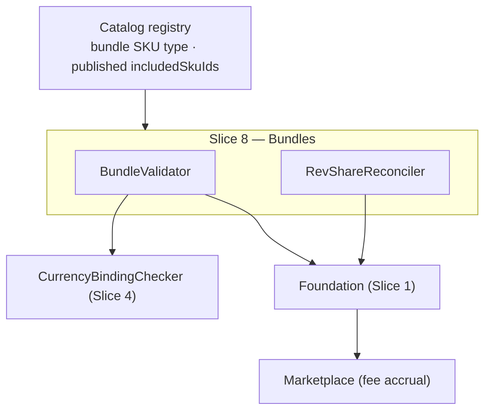

Created:  2026-08-24 by Virtuozzo International GmbH
Updated:  2026-08-24 by Virtuozzo International GmbH

<!-- CONFLUENCE_TITLE: [BSS]: Pricing — Bundles & Marketplace Composition (Design, Slice 8) -->
<!-- Related: ../PRD.md, ../DESIGN.md, ./01-foundation.md | Owners: BSS Product Catalog team -->

# DESIGN — Bundles & Marketplace Composition (Slice 8)

<!-- toc -->

- [1. Context](#1-context)
  - [1.1 Overview](#11-overview)
  - [1.2 Purpose](#12-purpose)
  - [1.3 Actors](#13-actors)
  - [1.4 References](#14-references)
  - [1.5 Scope](#15-scope)
  - [1.6 Constraints & Assumptions](#16-constraints--assumptions)
  - [1.7 Naming & Design-Introduced Names](#17-naming--design-introduced-names)
  - [1.8 Context & Dependencies](#18-context--dependencies)
- [2. Actor Flows (CDSL)](#2-actor-flows-cdsl)
  - [Author and Publish a Bundle](#author-and-publish-a-bundle)
- [3. Processes / Business Logic (CDSL)](#3-processes--business-logic-cdsl)
  - [Price-Basis Validation](#price-basis-validation)
  - [Component Coverage Validation](#component-coverage-validation)
  - [Rev-Share Reconciliation](#rev-share-reconciliation)
- [4. States (CDSL)](#4-states-cdsl)
- [5. API Surface](#5-api-surface)
- [6. Data Model](#6-data-model)
- [7. Events & Alarms](#7-events--alarms)
- [8. Definitions of Done](#8-definitions-of-done)
  - [Bundle Composition](#bundle-composition)
  - [Rev-Share](#rev-share)
- [9. Acceptance Criteria](#9-acceptance-criteria)
- [10. Non-Functional Considerations](#10-non-functional-considerations)

<!-- /toc -->

## 1. Context

### 1.1 Overview

This slice owns **bundle composition**: the price basis (`sum_of_parts` referencing component
**`planId`s** vs `own_price`), component publication + per-`(currency, region)` coverage
validation (reusing Slice 4's `CurrencyBindingChecker`), **rev-share reconciliation**
(sum-to-100% per included vendor SKU, explicit platform cut, per-`(bundle, vendor SKU)`-group
`residual_absorber_party` — default the platform sentinel — with ±1 bp authoring tolerance
normalized to an exact split at publish, D-07), and `invoiceItemization` (`aggregate | itemize`) preserving per-SKU
rev-share for Marketplace accrual. The `bundle` SKU **type** is registry-owned; this slice
authors what the bundle *contains and how it prices*.

**Traces to**: `cpt-cf-bss-pricing-fr-bundle-composition` (bundle currency/region coverage
delegates to Slice 4's `CurrencyBindingChecker` — `fr-invoice-currency-binding` is claimed
there, one owner per FR; 2026-07-31 P2 fix)

### 1.2 Purpose

Make marketplace bundles unambiguous and reconcilable: a `sum_of_parts` bundle can never sum
rows that don't exist or mix frequencies; a rev-share split always reconciles to 100% with a
deterministic owner of the rounding residual; itemization choice never loses the per-SKU
split Marketplace accrues fees from.

### 1.3 Actors

| Actor | Role in Slice |
|-------|---------------|
| `cpt-cf-bss-pricing-actor-product-manager` | Authors bundles, constraints, rev-share |
| `cpt-cf-bss-pricing-actor-marketplace` | Consumes rev-share rules for fee accrual |
| `cpt-cf-bss-pricing-actor-catalog-registry` | Owns the `bundle` SKU type + published `includedSkuIds` |
| `cpt-cf-bss-pricing-actor-billing` | Consumes `invoiceItemization`; single-currency invariant |

### 1.4 References

- **PRD**: [PRD.md](../PRD.md) — §6.3 (bundle composition), §17.3 (bundle rules), §5.1
- **Design**: [01-foundation.md](./01-foundation.md); [04-currency-tax.md](./04-currency-tax.md) — `CurrencyBindingChecker` (cases ii/iii)
- **Dependencies**: Slices 1–4 (published component plans/rows to reference).

### 1.5 Scope

**In scope**: bundle price basis + persistence; component `planId` referencing (not bare
SKUs) for `sum_of_parts`; coverage validation per sold `(currency, region)` + matching
`frequency`; rev-share model + residual tolerance; `invoiceItemization` persistence.

**Out of scope**: the `bundle` SKU type/flag (registry); marketplace fee **accrual**
(Marketplace); the summed **amount** at quote time (Tariffs — the catalog persists the
basis, not the sum); listing eligibility rules (Future, §17.8).

### 1.6 Constraints & Assumptions

Inherits Foundation C-set. Slice-8-specific:

| # | Topic | Assumption (default) | Source |
|---|-------|----------------------|--------|
| B1 | Component identity | `sum_of_parts` references component **`planId`s** — bare `skuId`s are ambiguous per `(currency, region)` | PRD §1.4 |
| B2 | Rev-share residual | Sum = 100% per included vendor SKU; authoring tolerance **±1 bp** (= 0.01%); publish **normalizes** the nominated absorber's effective share to an exact 10000 bp split (typed values audited); absorber default = the **platform** (D-07) | PRD §6.3; D-07 |
| B3 | Itemization | `aggregate \| itemize` persisted; either preserves per-SKU rev-share for accrual | PRD §6.3 |

### 1.7 Naming & Design-Introduced Names

| Name | Meaning |
|------|---------|
| `BundleValidator` | Registered rules: basis, component publication, coverage (via `CurrencyBindingChecker`), frequency match |
| `RevShareReconciler` | The 100%-per-vendor-SKU check + residual **normalization** onto the group's `residual_absorber_party` (D-07) |

### 1.8 Context & Dependencies

## 2. Actor Flows (CDSL)

### Author and Publish a Bundle

- [ ] `p2` - **ID**: `cpt-cf-bss-pricing-flow-bundle-author`

**Actor**: `cpt-cf-bss-pricing-actor-product-manager` (authoring — `bundle × write`); the publish step requires **`plan × publish` only** (D-11) — held by `cpt-cf-bss-pricing-actor-finance-manager` / `cpt-cf-bss-pricing-actor-catalog-admin` (Slice 5 role matrix); the composition is protected by the approval content pin, and component checks at publish are validations, not caller authz

**Success Scenarios**:
- A bundle (on a registry `bundle`-type SKU) declares its basis, published `includedSkuIds`, component `planId`s (`sum_of_parts`), rev-share, and `invoiceItemization`; publish validates coverage + reconciliation; `BundleUpdated` emits

**Error Scenarios**:
- Unpublished included SKU / component plan → 422; component row missing for a sold `(currency, region)` or mismatched `frequency` → `CURRENCY_NOT_COVERED` / `FREQUENCY_MISMATCH` (422); rev-share off by more than 1 bp per vendor SKU → `RESIDUAL_OVER_TOLERANCE` (422); structurally missing platform cut / malformed shares → `REVSHARE_UNBALANCED` (422); rev-share authored on an `own_price` bundle → `REVSHARE_BASIS_UNSUPPORTED` (422, D-55)

**Steps**:
1. [ ] - `p2` - API: POST/PATCH /bss-pricing/v1/bundles (draft; idempotency key) - `inst-ba-author`
2. [ ] - `p2` - Publish: `BundleValidator` + `RevShareReconciler` run in the Foundation pipeline - `inst-ba-validate`
2a. [ ] - `p1` - **Composition changes are always material (normative, D-104, 2026-07-31 review fix):** creating a bundle, adding/removing/replacing a **component**, any **rev-share** change (`share_bp`, `platform_cut_bp`, the group's `residual_absorber_party`), a `price_basis` change and an `invoiceItemization` change are **registered always-material triggers** (Slice 5 `inst-mat-registered`; **the last two are on an un-revisioned table and D-206 is the entry that owns the consequence**) — the commit routes through the two-person workflow before it publishes. The `MaterialityEvaluator` computes per-row deltas over **price rows**, and a `sum_of_parts` recomposition touches none: a component swap or a re-split evaluated `auto_publishable` under any configured threshold and reached consumers with **no approver**, while a $1 price-row change above threshold took two people — the D-50 hole one slice over, and with comparable money (a rev-share split *is* vendor payout; a component swap changes what the customer receives at an unchanged price). It also restores D-11's own premise: that decision dropped `bundle × write` from the publish endpoint because "the composition is protected at publish time by the approval content pin", which a non-material publish never creates. `FinanceReviewer` already holds `bundle × read`, so the D-61 reviewability invariant needs no new grant. **The rule IS enforced on the publish route, and D-232's diagnosis of what was missing was right (D-331, 2026-08-16):** a registered trigger of this kind is an **act**, read back off a change set some surface declared, and for a time the two functions that build this slice's change sets had **no caller anywhere in the crate**, so the trigger could not fire. The route now asks exactly one question: `BundleService::declared_publish_act` resolves the candidate composition against the composition on the last revision that has ever been live, and `infra::bundle::declared_act` names which of D-104's two acts moved — `RevenueShareChange` only when the components are equal *and* the groups differ, `BundleComposition` otherwise. The verdict carries that identity, so a component swap and a rev-share re-split no longer reach the reviewer as the same undifferentiated *material*. Before that, the gap was only partly masked: a recomposition moving **no price row** was caught as D-115's pure-shape revision through the *plan* publish path, while one that moved rows fell through to the threshold rules, which is this instruction's own scenario. D-232 also corrects D-209's premise without disturbing its decision — a `pub fn` that builds a change set is not a surface declaring an act - `inst-ba-material`
3. [ ] - `p2` - **RETURN** 202; `BundleUpdated` emitted; composition frozen into the read model / snapshot - `inst-ba-return`

## 3. Processes / Business Logic (CDSL)

### Price-Basis Validation

- [ ] `p2` - **ID**: `cpt-cf-bss-pricing-algo-bundle-basis`

**Steps**:
1. [ ] - `p2` - Basis MUST be declared: `sum_of_parts` or `own_price`; the basis and any explicit price persist and freeze - `inst-bb-declared`
2. [ ] - `p2` - `sum_of_parts`: component **`planId`s** referenced (B1), each published; a component `planId` MUST NOT itself be a `bundle`-type plan — flat composition at launch, nesting is Future scope (`COMPONENT_IS_BUNDLE`; re-composition is re-validated, so a cycle can never form); the summing itself is Tariffs' — the catalog persists the reference set only. **Usage and usage-carrying components are legal (2026-07-30 review fix, L-8):** a usage-only component plan (e.g. a metered API plan beside a seat plan) composes normally — the "sum" covers the components' **recurring** amounts onto the bundle's recurring line set, while each component's usage charges rate per its own rows and itemize per `invoiceItemization`; the frequency-match rule (`inst-bc-frequency`) binds **recurring components only**, by construction. **Component `one_time_setup`/`one_time` rows never charge under a bundle purchase (2026-07-31c review fix, L-3):** setup is tied to standalone **activation** of the component plan (S2 `inst-cs-setup-timing`), which a bundle purchase is not — the bundle's **own** setup row, if authored, is the only activation charge. **Phased component plans are not composable at launch (2026-07-31c review fix, L-4):** a component whose phase schedule is more than the D-19 implicit terminal phase fails publish (`COMPONENT_PHASED`, 422) — which phase's rows sum, and whether a bundle subscription runs the component's phase schedule, are undecided semantics; a named Future gate, the D-53 posture - `inst-bb-sum`
3. [ ] - `p2` - `own_price`: the bundle's own price rows live on the canonical scope key like any plan's (Slices 3/4 rules apply); a matching-currency component set is still required (Slice 4 case iii) - `inst-bb-own`
4. [ ] - `p2` - **Which plan rules a row-less bundle answers to (normative, 2026-08-01 review fix, C-1):** a `sum_of_parts` bundle plan carries **no price rows of its own**, so the Slice-2/3/7 rules that quantify over a plan's rows have nothing to bind and are **not** applicable to it: the §17.1 cycle matrix (`inst-cs-onetime`/`inst-cs-recurring`/`inst-cs-usage`/`inst-cs-hybrid` — its `billing_cycle` is recorded as the **components'** matched `frequency` per `inst-bc-frequency`, and is a projection, not an authored shape to satisfy), D-15 phase coverage (`inst-ph-coverage`; the plan carries only the D-19 implicit terminal phase — `COMPONENT_PHASED` already keeps phases out of composition entirely), the row-borne descriptor elements (`billingTiming`/`taxCategory` ride the **component** rows, D-48/D-110), and `inst-wc-required` window coverage (sellability is the component conjunction, `inst-bc-sellability`). What **does** bind: the mandatory `PlanTier`, the descriptor-set fields, `availableFrom`/`availableTo`, and this slice's own composition rules. `own_price` bundles are the opposite case and answer to all of them (`inst-bb-own`). Stating this is not a widening: read literally, the row-based rules made a `sum_of_parts` bundle unpublishable under **every** `billing_cycle` value - `inst-bb-rowless`

### Component Coverage Validation

- [ ] `p2` - **ID**: `cpt-cf-bss-pricing-algo-bundle-coverage`

**Steps**:
1. [ ] - `p2` - Every referenced component MUST have a covering **published** row in each `(currency, region)` the bundle sells in — **the set the publish request carries (D-216)**, since a `sum_of_parts` bundle has no rows of its own to read it off. The currency axis delegates to `CurrencyBindingChecker` case ii; the `region` axis is the BundleValidator's own extension of the same rule. **Ordering (D-211, 2026-08-06):** `CurrencyBindingChecker` is Slice 4's and **has existed since 2026-08-07** (`domain/currency_binding.rs`; corrected 2026-08-17 — this said it did not exist). **The delegation is made**: the currency arm delegates to it and the region arm stays S8's, which is the end state this clause described as pending — stated because a delegation with no target is one an implementer either calls into thin air or silently duplicates. Coverage/ambiguity evaluates over `priceEligibility = all_subscriptions` (`cohort = none`) rows **only** — grandfathered generations (ADR-0002) are never coverage candidates, so a cutover-touched component's coexisting generation rows neither cover nor count as ambiguous (2026-07-28 review fix, confirmed 2026-07-31). **The narrowing is deliberate for `new_subscriptions_only` too** (2026-07-31 review fix): a component priced solely via `new_subscriptions_only` rows is not coverage-eligible — bundle composition demands the durable `all_subscriptions` base (a new-only promo row expires with its intent); remediation = author an `all_subscriptions` row on the component - `inst-bc-coverage`
2. [ ] - `p2` - **Recurring** components MUST match `frequency` (a monthly + annual mix cannot sum onto one invoice line set); usage-only components carry no `frequency` and are outside this rule (their charges rate per their own rows — `inst-bb-sum`) - `inst-bc-frequency`
3. [ ] - `p2` - A missing or ambiguous component row fails publish naming the component + `(currency, region)` - `inst-bc-fail`
3a. [ ] - `p1` - **One tax display basis per bundle-market (normative, D-119, 2026-07-31 review fix — flagged for veto):** on every `(currency, region)` the bundle sells, **all** component rows — and the bundle's own rows for `own_price` — MUST carry the **same** `tax_inclusive` value; a mixed market fails publish (`BUNDLE_TAX_BASIS_MIXED`, 422, the divergent components named). The row set is the coverage set of `inst-bc-coverage` — `priceEligibility = all_subscriptions` (`cohort = none`) rows only, so `existing_grandfathered` generations of a component never enter the check (D-132's scoping of the D-110 sibling, applied here by the coverage narrowing this rule already inherits). D-110 pinned one display basis per market per **plan** ("an invoice is one document"); a bundle composes several plans onto exactly one invoice, and the coverage walk above checks currency/region/frequency only — pre-Tax-Engine the mix is masked incidentally (an inclusive component's flagged market blocks the bundle via the D-94 conjunction), and the moment the Tax Engine GAs the same composition sells a mixed-basis invoice. **Reverse guard (the D-54 pattern):** a component re-publish whose basis change would mix a referencing bundle's market fails the same way, the referencing bundle enumerated — otherwise the bundle-side check is a point-in-time promise a later component publish silently breaks. **It is a rule of the *component's* publish pipeline, not of the bundle's validator (D-212, 2026-08-06)**: the forward half is a property of a handed-in composition, while the reverse half needs the set of bundles referencing that component — a read the pure walk does not have and must not have — so it registers in the plan publish pipeline beside the other Foundation-owned rules and reads `pricing_bundle_component` by `component_plan_id`. Its absence from a bundle-side validator is therefore not a gap. D-212 settles the two derivations it needs: the markets are the **publishing plan's own candidate rows'** (a basis conflict cannot arise in a market that plan contributes no row to), and the referencing bundle's **current published** revision is the one that counts - `inst-bc-taxbasis`
4. [ ] - `p1` - **Bundle sellability (normative):** the Slice 7 gate evaluates a bundle as the **conjunction** over its components — sellable at `t` iff **every** referenced component key passes gate predicates (1)–(5) at `t` (plus the bundle's own `availableFrom`/`availableTo`). Components are **exempt from predicate (6)** — the registry `sellable` flag (D-46) applies to the **bundle SKU itself**, not to component references (`sellable = false` components are exactly the composition-only SKUs bundles exist to package). For `sum_of_parts` there are no own rows, so components are the only inputs; for `own_price` the bundle's **own** rows must pass **and** the component keys too (the matching-currency component set is part of the offer). The frozen component key set spans `priceEligibility = all_subscriptions` (`cohort = none`) keys **only** — grandfathered generations are never gate inputs (2026-07-28 review fix, confirmed 2026-07-31). One unsellable component makes the bundle unsellable, never partially-sellable - `inst-bc-sellability`

### Rev-Share Reconciliation

- [ ] `p2` - **ID**: `cpt-cf-bss-pricing-algo-revshare`

**Steps**:
1. [ ] - `p2` - When set, rev-share MUST sum to **100% per included vendor SKU**, with an explicit per-group platform cut; rev-share is authorable on **`sum_of_parts`** bundles only (D-55 — an `own_price` bundle has no per-vendor-SKU allocation base; `REVSHARE_BASIS_UNSUPPORTED`). The percentages apply to the vendor SKU's **entire rated revenue under the bundle — recurring and usage alike** (2026-07-30 review fix, L-8): a usage component's metered charges share on the same per-SKU split, so Marketplace accrual needs no second model - `inst-rs-sum`
2. [ ] - `p2` - **Residual normalization (B2, D-07):** authoring accepts `|Σ(share_bp) + platform_cut_bp − 10000| ≤ 1 bp`; at publish the **group's `residual_absorber_party`** (a party row within that `(bundle, vendor SKU)` group, or the **platform** sentinel — default platform, so an "unnominated" state cannot exist; 2026-07-28 review fix — a bundle-level vendor-SKU absorber named a group, not a party) has its **effective** share adjusted by the residual, and the read model publishes effective shares summing to **exactly 10000 bp** (typed values retained for audit, the adjustment recorded). A residual over 1 bp fails publish (`RESIDUAL_OVER_TOLERANCE`) — e.g. a six-way even split (6 × 1666 bp = 9996) must be reconciled by the operator. **An absorber resolving to neither a party row of its own group nor the platform sentinel renders under `REVSHARE_UNBALANCED` (D-210, 2026-08-06)**: it is a reachable authored state the schema cannot check — the referent is a row in a table pointing back at this one, and the sentinel has no party row by construction — and D-07's narrowing of that code to *structural malformation* fits, because no member takes the residual and the group cannot be made to sum to 10000 bp. Monetary (cent-level) rounding at settlement is a separate downstream rule and also lands on the absorber - `inst-rs-residual`
3. [ ] - `p2` - `invoiceItemization` (`aggregate | itemize`) persists and MUST preserve per-SKU rev-share either way (Marketplace accrues per SKU regardless of invoice layout) - `inst-rs-itemization`

## 4. States (CDSL)

No slice-owned state machine: bundles ride the plan lifecycle (draft → published → retired)
of Slices 2/11 on their `bundle`-type SKU.

## 5. API Surface

| Method | Path | Purpose | Idempotency |
|--------|------|---------|-------------|
| `GET` | `/bss-pricing/v1/bundles/{bundleId}` | Read the bundle and its composition at a revision (**D-310**) | — |
| `POST` | `/bss-pricing/v1/bundles` | Create the bundle on its plan | idempotency key |
| `PATCH` | `/bss-pricing/v1/bundles/{bundleId}` | Replace the open draft revision's composition, wholesale (**D-215**) | ETag (`If-Match`) |
| `POST` | `/bss-pricing/v1/bundles/{bundleId}/publish` | Validate + publish; the request carries the **sold-market set** (**D-216**) | per revision |

**The composition an author writes must be readable (D-310, 2026-08-11).** This map had three
rows and none of them a `GET`, so a bundle's composition was reachable through **no surface in
the gear**: not by the author who wrote it, not by an operator diagnosing it, and — once D-104's
always-material unit was built — not by the **approver deciding it**. `GET
/bss-pricing/v1/approvals/{id}` renders the plan the composition rides, and a plan shape carries
no component set and no revenue split; D-104 exists precisely because a `sum_of_parts`
recomposition moves no price row, so the reviewer of the one act in this gear whose subject is
third-party money was shown a document the act is invisible in. D-61's reviewability invariant is
explicit that the approval `GET` returns the pinned **content** and not the hash. The approval
surface was corrected first because that is where the money decision is made; this row closes the
authoring side, so the composition has a reader that does not require an open approval unit.
Gated `bundle × read`, which `FinanceReviewer` already holds (D-104 relies on that grant).

**The composition route addresses the bundle, not the collection (D-215, 2026-08-06).** It was
spelled `PATCH /bss-pricing/v1/bundles` here, which puts the subject in the body while the route
carries an `If-Match` precondition — and a precondition addresses a *resource*, so two concurrent
composition edits on different bundles would present entity tags against one URL.

**The publish request carries the markets the bundle sells in (D-216, 2026-08-06).** Both
`inst-bc-coverage` and `inst-bc-taxbasis` quantify over that set, and a `sum_of_parts` bundle has
**no rows of its own** (`inst-bb-rowless`) to read it off; the components' rows are what the set is
checked *against*, so deriving it from them would make coverage vacuous and `CURRENCY_NOT_COVERED`
unreachable. A sold-market child table is the named destination once the set must freeze into the
read model rather than be restated per publish.

**Problem responses (RFC 9457):** `BASIS_MISSING` (422 — **an authoring-edge code, not a
publish-pipeline one: D-213, 2026-08-06.** `price_basis` is `NOT NULL` under a two-value `CHECK`,
so a *stored* bundle always has a basis and only a request that omits the field can raise this;
the publish validator carries no such arm), `COMPONENT_UNPUBLISHED` (422),
`COMPONENT_IS_BUNDLE` (422 — flat composition at launch; nesting is Future),
`CURRENCY_NOT_COVERED` (422), `FREQUENCY_MISMATCH` (422), `REVSHARE_UNBALANCED` (422 —
structurally malformed shares / missing explicit platform cut; **also the code for a
`residual_absorber_party` that resolves to neither a party row of its group nor the platform
sentinel — D-210, 2026-08-06**, because an unresolvable absorber means no member takes the
residual and the group cannot be made to sum to 10000 bp), `RESIDUAL_OVER_TOLERANCE`
(422 — `|Σ − 10000| > 1 bp`; D-07), `REVSHARE_BASIS_UNSUPPORTED` (422 — rev-share on an
`own_price` bundle; D-55), `BUNDLE_EXISTS_ON_PLAN` (409 — **D-214, 2026-08-06**: a plan carries at
most one bundle, enforced by `uq_pricing_bundle_plan`; it is this gear's own refusal rather than
`DUPLICATE_SCOPE_KEY`, which names a *price row's* canonical key and would send the operator to the
wrong object), `BUNDLE_TAX_BASIS_MIXED` (422 — component rows (or own rows) of one
sold `(currency, region)` disagreeing on `tax_inclusive`; D-119 — also raised on a component
re-publish that would mix a referencing bundle's market, the bundle enumerated; **that reverse half
is the component publish pipeline's rule, D-212**),
`COMPONENT_PHASED` (422 — a component plan with an authored phase schedule; composition
semantics for phased components are a named Future gate — L-4, 2026-07-31c).

## 6. Data Model

Slice-owned tables (tenant-scoped, SecureORM per Foundation §2.2 authz-gate + S5 `inst-rb-pep`; `pricing_` prefix per Foundation §3.7):

**`pricing_bundle`** (PK `bundle_id`; **`plan_id`** — the bundle's own `bundle`-type plan,
whose revisions the composition tables below ride, added by **D-105**, 2026-07-31 review fix:
without it D-92's "a bundle rides its plan's revisions" had no join path and `plan_revision`
below referenced an unnamed plan; FK to the registry `bundle`-type SKU via that plan):
`price_basis` (`sum_of_parts | own_price`), `invoice_itemization` (`aggregate | itemize`),
lifecycle refs. `UNIQUE (tenant_id, plan_id)` — one bundle per plan, whose refusal is
`BUNDLE_EXISTS_ON_PLAN` (D-214).

**`plan_id` is a reference this table cannot declare as a foreign key (D-207, 2026-08-06,
measured on Postgres).** `pricing_plan` is keyed `(plan_id, revision)` and its only uniqueness on
`plan_id` alone lives in two **partial** indexes (`uq_pricing_plan_current`,
`uq_pricing_plan_open_draft`), which Postgres refuses as a referent; and `pricing_bundle` cannot
carry a `revision` because it is the bundle's *identity* and belongs to no single one. The
reference is therefore enforced **one level down**: the three composition tables carry a real
foreign key onto `pricing_bundle`, and their append-only triggers resolve `plan_id` through it to
read the owning revision's `lifecycle_state`. An orphan *bundle* row is possible; an orphan
*composition* is not. Do not try to add the constraint — a non-partial `UNIQUE (plan_id)` on
`pricing_plan` would contradict D-56's revision-row model outright.

**Revision discipline (D-92, 2026-07-31 review fix — the D-83 model applied here):** a bundle
rides its plan's revisions, and the three composition tables below therefore carry
**`plan_revision`** (copy-on-new-revision): a published revision's composition rows are
immutable with it, the open draft revision edits **its own copies**, and the projector — warm
and re-drive alike — reads the published revision's rows, so a draft recomposition can neither
mutate published truth nor leak into a frozen version through a re-drive.

**`price_basis` and `invoice_itemization` are outside that discipline, and both are
always-material (D-206, 2026-08-06 — [H], latent).** They live on `pricing_bundle`, which is not
one of the three tables above, so the column a D-104 trigger governs is mutated **in place**: a
published revision would read the new value from the instant it is authored, before any approver
saw it — D-92's own defect one table up, and D-11's premise re-opened from the other side, the
approval pin protecting a composition whose content moved before the pin existed. It is **latent
today**: `BundleRepo::create` is the only writer and no mounted route edits either field. The
decided repair is to **split identity from content** — `pricing_bundle` keeps `PK bundle_id`, and
the two content columns move onto a revision-scoped carrier taking the same copy-on-new-revision
treatment and append-only trigger as the three children. It is sequenced with the route that would
make the hazard live rather than ahead of it, so **the first person to add such a route owns this
entry**.

**Row discriminators (D-105, 2026-07-31 review fix).** All three tables below are 1:N per
`(bundle, revision)`, and D-92's "keyed `(bundle_id, plan_revision)`" phrasing dropped their
discriminators — under those keys a bundle holds **one** component, **one** rev-share party and
**one** group per revision, which makes "every referenced component", the per-market coverage
walk and "sum to 100% **per** included vendor SKU" unsatisfiable. The PKs below restore them
(`pricing_plan_phase`'s key is the pattern: a **discriminator beside `plan_revision`**, so a
revision holds as many children as it has of them). That key now reads
`(tenant_id, plan_id, plan_revision, phase_id)` — widened by **D-340**, 2026-08-17, and the
discriminator half it lends this section is exactly what the widening left alone. The part of
D-340 that does **not** transfer is its problem: the phase key named neither the tenant nor the
owning plan, so a phase id belonged to one plan across the whole table, whereas each key below
opens with `bundle_id` — its parent's own identity — and is therefore already scoped to the
composition it belongs to.

**`pricing_bundle_component`** (PK **`(bundle_id, plan_revision, component_plan_id)`** —
copy-on-new-revision, D-92 + D-105): `included_sku_id`,
`component_plan_id` (**always required — D-208, 2026-08-06**: it is a primary-key column and
therefore `NOT NULL`, so the earlier qualifier "required for `sum_of_parts`" could not hold, and
`inst-bb-own` requires an `own_price` bundle to carry a matching-currency component set anyway;
B1's rejection of bare `skuId`s is what keeps it in the key), constraints (min/max qty).
Indexed `(tenant_id, component_plan_id)` — the mirror question *"which bundles reference this
plan as a component"*, which D-212's reverse tax-basis guard and S11's `inst-re-references` both
ask.

**`pricing_bundle_revshare`** (PK **`(bundle_id, plan_revision, vendor_sku_id, party)`** — D-92 +
D-105): `vendor_sku_id`,
`party`, `share_bp` (typed, basis points), `effective_share_bp` (published;
absorber-adjusted at publish).

**`pricing_bundle_revshare_group`** (PK **`(bundle_id, plan_revision, vendor_sku_id)`** per
D-92 + D-105 — one row per
`vendor_sku_id` within a revision, which the prose already said and the stated key contradicted; 2026-07-28
review fix: the tolerance/exact-sum rule is per group, so the group-scoped values live on a
group row, not smeared per party or per bundle): `vendor_sku_id`, **`platform_cut_bp`** (the
group's platform cut — previously a per-party column used once per group), and
**`residual_absorber_party`** — the **party row within this group** that absorbs the residual,
or the `platform` sentinel (default). The former bundle-level `residual_absorber` typed as "a
`vendor_sku_id`" named a *group*, not a resolvable party, and matched the PRD's "nominated
primary **party**" only for the platform case; absorption is per group now, party-typed.

Key constraints: authoring accepts `|SUM(share_bp) + platform_cut_bp − 10000| ≤ 1 bp` per
`(bundle_id, vendor_sku_id)` (both terms from that group's rows); publish normalizes onto the
group's `residual_absorber_party` so
`SUM(effective_share_bp) + platform_cut_bp = 10000` **exactly per group** (D-07); a residual
over 1 bp fails (`RESIDUAL_OVER_TOLERANCE`, naming the group). Downstream consumers read only
the effective shares. **Rev-share basis (D-55, 2026-07-28): rev-share is authorable only on
`sum_of_parts` bundles at launch** — an `own_price` bundle has one bundle amount and no
per-vendor-SKU revenue to allocate (no declared allocation base), so `own_price` + `revShare`
fails publish (`REVSHARE_BASIS_UNSUPPORTED`, 422); lifting this requires deciding an
allocation base (e.g. component list prices) — a named Future gate.

## 7. Events & Alarms

`BundleUpdated` (frozen set) on composition change. No slice alarms — validation failures are
synchronous; accrual mismatches are Marketplace-side reconciliation.

## 8. Definitions of Done

### Bundle Composition

- [ ] `p2` - **ID**: `cpt-cf-bss-pricing-dod-bundle-composition`

A bundle **MUST** declare its basis, reference published SKUs and (for `sum_of_parts`)
component `planId`s covering every sold `(currency, region)` with matching `frequency`; a
**row-less `sum_of_parts` bundle plan** is out of scope of the row-quantified plan rules (cycle
matrix, phase coverage, row-borne descriptor elements, window coverage — `inst-bb-rowless`,
C-1) while `own_price` bundles answer to all of them;
a missing/ambiguous component fails publish naming it; component rows (and own rows) of one
sold market **MUST** share one `tax_inclusive` basis (`BUNDLE_TAX_BASIS_MIXED`, D-119 — with
the D-54-pattern reverse guard on component re-publishes); a **phased** component fails
publish (`COMPONENT_PHASED` — Future gate), and component setup/one-time rows never charge
under a bundle purchase. Creation, component add/remove/replace,
any rev-share change, a `price_basis` change and an `invoiceItemization` change are
**always-material** (D-104, `inst-ba-material`) — they carry no price-row delta, so the G1
no-delta fail-safe applies wholesale and the commit routes through the two-person workflow
before publishing.

**Implements**: `cpt-cf-bss-pricing-flow-bundle-author`, `cpt-cf-bss-pricing-algo-bundle-basis`, `cpt-cf-bss-pricing-algo-bundle-coverage`

**Touches**:
- API: `POST/PATCH /bss-pricing/v1/bundles`
- DB: `pricing_bundle`, `pricing_bundle_component`
- Entities: `BundleValidator`

### Rev-Share

- [ ] `p2` - **ID**: `cpt-cf-bss-pricing-dod-revshare`

Rev-share **MUST** sum to 100% per vendor SKU with an explicit platform cut; authoring
accepts a residual of ≤ 1 bp, which publish **normalizes** onto the group's
`residual_absorber_party` (default the platform sentinel) so published **effective shares sum
to exactly 10000 bp** — typed values audited, over-tolerance rejected (D-07); rev-share is
authorable on **`sum_of_parts`** bundles only (`own_price` + revShare fails publish,
`REVSHARE_BASIS_UNSUPPORTED` — D-55); `invoiceItemization` **MUST** preserve
per-SKU rev-share for Marketplace accrual under either layout.

**Implements**: `cpt-cf-bss-pricing-algo-revshare`

**Touches**:
- DB: `pricing_bundle_revshare`, `pricing_bundle_revshare_group`
- Entities: `RevShareReconciler`

## 9. Acceptance Criteria

Unit:

- [ ] Basis matrix (`sum_of_parts` without component planIds fails; `own_price` without matching-currency components fails); a component `planId` that is itself a `bundle`-type plan fails (`COMPONENT_IS_BUNDLE`); a 33.33%×3 split (9999 bp) publishes with the platform absorber's effective share normalized to an exact 10000 (adjustment recorded); a residual over 1 bp fails (`RESIDUAL_OVER_TOLERANCE`); rev-share on an `own_price` bundle fails (`REVSHARE_BASIS_UNSUPPORTED`, D-55); frequency mismatch fails

Integration (testcontainers):

- [ ] A two-vendor `sum_of_parts` bundle over two currencies publishes only when every component covers both; dropping one component row blocks with the component + currency named
- [ ] `itemize` and `aggregate` both project per-SKU rev-share into the read model
- [ ] A draft recomposition of a published bundle lands on the draft revision's **own copies** (D-92): the published revision's component/rev-share rows are unchanged, and a re-warm re-drive of the published version reflects none of the draft's edits
- [ ] A three-component, two-vendor bundle round-trips **all** its rows under one revision (D-105: three `pricing_bundle_component` rows, one `pricing_bundle_revshare_group` row per vendor SKU, one `pricing_bundle_revshare` row per party) and the per-group 100% reconciliation runs over each group independently
- [ ] Materiality (D-104): swapping one component of a published `sum_of_parts` bundle, and separately re-splitting its rev-share, each open an approval unit and block until an independent approval — **even with a threshold policy configured**, since neither produces a price-row delta; a self-approval attempt returns 403 + audit; the approver reads the pinned composition (D-61)
- [ ] Tax-basis uniformity (D-119): a bundle whose EU components mix `tax_inclusive = true` and `false` fails publish (`BUNDLE_TAX_BASIS_MIXED`, components named) while all-inclusive EU + all-exclusive US publishes; a component re-publish flipping its EU basis while a published bundle references it fails with the bundle enumerated; a phased component fails (`COMPONENT_PHASED`)

## 10. Non-Functional Considerations

- **Performance**: coverage validation is O(components × currencies) at publish; read model exposes the frozen composition flat.
- **Observability**: `pricing_bundle_validation_failures_total{rule}`.
- **Risks & open items**: upstream SKU retirement while a bundle references it — **closed by D-47 (2026-07-28)**: the registry never retires under the referenced (or conservatively-referenced) `SkuReferenceCount` predicate, and pricing flags + blocks new adoption (AC #82); marketplace listing-eligibility rules deferred (§17.8). **Component-retirement guard**: retiring a plan referenced as a bundle component is blocked/reported by Slice 11 (`inst-re-references`) until the bundle is remediated.
