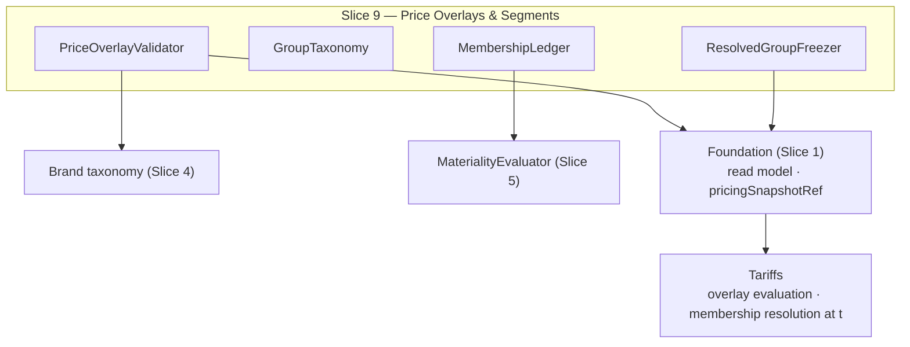

Created:  2026-08-24 by Virtuozzo International GmbH
Updated:  2026-08-24 by Virtuozzo International GmbH

<!-- CONFLUENCE_TITLE: [BSS]: Pricing — Price Overlays & Customer-Group Segment Pricing (Design, Slice 9) -->
<!-- Related: ../PRD.md, ../DESIGN.md, ./01-foundation.md | Owners: BSS Product Catalog team -->

# DESIGN — Price Overlays & Customer-Group Segment Pricing (Slice 9)

<!-- toc -->

- [1. Context](#1-context)
  - [1.1 Overview](#11-overview)
  - [1.2 Purpose](#12-purpose)
  - [1.3 Actors](#13-actors)
  - [1.4 References](#14-references)
  - [1.5 Scope](#15-scope)
  - [1.6 Constraints & Assumptions](#16-constraints--assumptions)
  - [1.7 Naming & Design-Introduced Names](#17-naming--design-introduced-names)
  - [1.8 Context & Dependencies](#18-context--dependencies)
- [2. Actor Flows (CDSL)](#2-actor-flows-cdsl)
  - [Author a PriceOverlay](#author-a-priceoverlay)
  - [Manage Customer-Group Membership](#manage-customer-group-membership)
- [3. Processes / Business Logic (CDSL)](#3-processes--business-logic-cdsl)
  - [PriceOverlay Authoring Validation](#priceoverlay-authoring-validation)
  - [Customer-Group Taxonomy and Membership](#customer-group-taxonomy-and-membership)
  - [Membership-Change Materiality](#membership-change-materiality)
- [4. States (CDSL)](#4-states-cdsl)
  - [Membership Record State Machine](#membership-record-state-machine)
- [5. API Surface](#5-api-surface)
- [6. Data Model](#6-data-model)
- [7. Events & Alarms](#7-events--alarms)
- [8. Definitions of Done](#8-definitions-of-done)
  - [PriceOverlay Authoring](#priceoverlay-authoring)
  - [Customer-Group Pricing](#customer-group-pricing)
- [9. Acceptance Criteria](#9-acceptance-criteria)
- [10. Non-Functional Considerations](#10-non-functional-considerations)

<!-- /toc -->

## 1. Context

### 1.1 Overview

This slice owns **`PriceOverlay` authoring and validation** — scope
(partner/orgTier/brand/region/customerGroup/global), adjustment (`markup | discount |
fixed`), **explicit precedence** (duplicate precedence within one scope class rejected), own
`[effectiveFrom, effectiveTo)` dating, declared tax basis — and the **customer-group segment
pricing** capability: the BSS-owned **group taxonomy**, the **effective-dated, audited
membership** record on the payer's commercial profile (resolved via `payerTenantId`), and the
freezing of the **resolved group** into `pricingSnapshotRef`. Precedence/stacking
**evaluation** is Tariffs'; base price rows always stay `priceOverlay = base` (Foundation §4.1).

**Traces to**: `cpt-cf-bss-pricing-fr-priceoverlay-authoring`,
`cpt-cf-bss-pricing-fr-priceoverlay-referential-integrity`,
`cpt-cf-bss-pricing-fr-customer-group-pricing`

### 1.2 Purpose

Give commercial teams governed overlays — partner, brand, and segment pricing — without
cloning SKUs or adding price-row axes: one base row set plus validated, precedence-ordered
adjustment overlays. Customer groups are a **BSS commercial projection** (trial/beta/VIP/…)
that never touches tenant topology, with membership as an auditable, effective-dated,
snapshot-frozen record so a payer's segment price is always reproducible.

### 1.3 Actors

| Actor | Role in Slice |
|-------|---------------|
| `cpt-cf-bss-pricing-actor-catalog-admin` | Authors PriceOverlays, the group taxonomy, memberships |
| `cpt-cf-bss-pricing-actor-rating` | Evaluates overlays (precedence/stacking); resolves membership at `t` |
| `cpt-cf-bss-pricing-actor-finance-reviewer` | Approves membership changes / group moves (material) |
| `cpt-cf-bss-pricing-actor-auditor` | Reads membership audit history — through `GET /bss-pricing/v1/customer-groups/{group}/members` (§5), which returns ended intervals as well as live ones for exactly this reader (D-322) |

### 1.4 References

- **PRD**: [PRD.md](../PRD.md) — §6.6, §17.7 (customer-group detail), §1.4 (Glossary: `brand`, `customerGroup`)
- **Design**: [01-foundation.md](./01-foundation.md) — scope key (`priceOverlay = base` on rows); [04-currency-tax.md](./04-currency-tax.md) — brand taxonomy rule; [05-governance.md](./05-governance.md) — materiality registration
- **Dependencies**: Slices 1, 4, 5. Consumed by Tariffs (evaluation) and frozen by the Foundation snapshot.

### 1.5 Scope

**In scope**: `PriceOverlay` CRUD + validation (scope, adjustment, precedence uniqueness per
scope class, effective dating, tax-basis declaration, referential integrity to published
targets); the customer-group taxonomy (BSS-governed); effective-dated audited membership on
`payerTenantId`; resolved-group snapshot freezing; membership-change governance
(renewal-aligned default; immediate = explicit material change).

**Out of scope**: precedence/stacking **evaluation** and overlay math (Tariffs); contract
overrides (Contracts); per-group **different tier structures** (Future — separate plans);
AMS/tenant topology (membership is a BSS projection, never a tenant attribute).

### 1.6 Constraints & Assumptions

Inherits Foundation C-set. Slice-9-specific:

| # | Topic | Assumption (default) | Source |
|---|-------|----------------------|--------|
| L1 | Overlay, not axis | `PriceOverlay` rows are overlays evaluated by Tariffs; price rows authored in this gear always carry `priceOverlay = base`; publish-time coverage resolves on base | PRD §2.2 |
| L2 | Precedence explicit | Integer `precedence`, unique within one scope class; ties are authoring errors, not runtime resolution | PRD §6.6 |
| L3 | Membership dating | Membership is effective-dated `[from, to)`; the group resolved at `t` via `payerTenantId`; renewal-aligned re-resolution by default | PRD §17.7 |
| L4 | Materiality | A group discount/move affecting many payers and any **immediate** re-resolution are material changes (registered into Slice 5's evaluator) | PRD §17.7 |
| L5 | Tax basis | A `PriceOverlay` MUST declare its tax basis or explicitly delegate to Tariffs — silence fails publish | PRD §6.6 |
| L6 | Overlay disclosure | Every `PriceOverlay` carries `disclosure ∈ {restricted (default), public}`. `restricted` = the overlay (including its **existence**) is never exposed on any consumer-facing enumeration or preview and resolves only inside the member payer's own evaluation context; `public` = Presentation/Tariffs preview MAY disclose the adjusted price to anyone. Fail-closed default. *(Backfilled into PRD §6.6 / fr-priceoverlay-authoring.)* | Design (this slice) |
| L7 | Membership scope | At launch, membership resolves for the **direct** `payerTenantId` only. **Needs-decision:** subtree inheritance — a membership on a parent payer covering its payer-subtenants (proposal: resolve by walking the payer hierarchy upward, most-specific/nearest membership wins; record + freeze the `inherited_via` chain in the snapshot for auditability; a parent-membership change then cascades materiality over the subtree). Without it, "the whole client's structure gets the discount" requires enrolling every payer-subtenant individually. Owner: Product + Architecture. | Design (this slice) |

### 1.7 Naming & Design-Introduced Names

| Name | Meaning |
|------|---------|
| `PriceOverlayValidator` | Registered rules: scope validity (incl. brand via Slice 4's taxonomy rule), adjustment-**line** shape + line-key uniqueness + within-scope line targets (D-42), precedence uniqueness, effective-interval sanity, tax-basis declaration, referential integrity per line |
| `GroupTaxonomy` | The BSS-governed customer-group value set (like region/brand) |
| `MembershipLedger` | The effective-dated, audited membership records per payer commercial profile |
| `ResolvedGroupFreezer` | The **joint contract name** (D-30), not a catalog runtime component: the catalog publishes membership into the read model; **Tariffs** performs the interval resolution at activation/renewal and freezes the resolved group into the `pricingSnapshotRef` **it composes** (composition SoR) |

### 1.8 Context & Dependencies

## 2. Actor Flows (CDSL)

### Author a PriceOverlay

- [ ] `p1` - **ID**: `cpt-cf-bss-pricing-flow-priceoverlay-author`

**Actor**: `cpt-cf-bss-pricing-actor-catalog-admin`

**Success Scenarios**:
- A `PriceOverlay` with scope, adjustment, unique precedence, optional effective interval, and declared tax basis validates and lands in the read model for Tariffs evaluation

**Error Scenarios**:
- Duplicate `precedence` within the scope class → `PRECEDENCE_DUPLICATE` (409)
- Scope referencing an unpublished plan/SKU → `TARGET_UNPUBLISHED` (422, not exposed in the read model)
- Unknown `brand`/`customerGroup` value → taxonomy failure (422)
- Missing tax basis (no declaration, no explicit delegation) → `TAX_BASIS_UNDECLARED` (422)

**Steps**:
1. [ ] - `p1` - API: POST/PATCH /bss-pricing/v1/price-overlays (idempotency key / ETag) - `inst-pl-author`
2. [ ] - `p1` - `PriceOverlayValidator` runs the L2/L5 + referential + taxonomy rules - `inst-pl-validate`
3. [ ] - `p1` - **RETURN** 201/200 — the save lands a **draft** only; nothing publishes from a save (2026-07-28 review fix, confirmed 2026-07-31) - `inst-pl-return`
4. [ ] - `p1` - Submit/commit → **202**: the commit is **always material** (D-50 — overlay creation, line add/remove, magnitude/kind or audience changes all route through the Slice 5 approval workflow before publishing; an overlay line has no per-currency baseline to threshold, so the G1 no-delta rule applies) and opens a Slice 5 approval unit under the standard R-13 pin semantics (subject stays draft; mutation voids the unit); the approved overlay is then a **publish unit through the Foundation engine** (D-06): validation → pending `CatalogVersion` ref → read-model warm — consumer-visible only at `CatalogVersionPublished` + warm-completion, the same monotonic pinning as plan content (evaluation downstream) (2026-07-28 review fix, confirmed 2026-07-31). **The 202's materiality is evaluated, not asserted (D-233, 2026-08-06):** the route runs the materiality evaluator over the declared act rather than writing the token as a literal, which is also what makes `priceOverlayMutation` answerable at all — a registered trigger of this kind is an **act**, read back off a change set some surface declared, so a trigger nothing constructs can never be answered however many tables its subject has. **The approval unit is open; the publish unit is not (D-225, 2026-08-06):** the route now opens the Slice 5 unit and **names it in the response**, `re_derive` resolves the pinned revision so it can be decided, and a rejection costs this plane nothing because the submit writes to `pricing_approval` and to nothing else — the pre-submit state *is* the current state. The unit holds **no canonical scope key**, which is `inst-co-single-pending` read literally (an overlay's change set touches none), so its one-pending guard is the subject ref and the subject is the **revision**. What is still owed is the second half: **an overlay publish unit is not a plan publish unit and cannot be one (D-234, 2026-08-06)** — the engine's unit type is plan-shaped in every field, so this is a new pipeline rather than a third constructor, and it has landed (`infra/overlay_publish.rs`, D-234's option (b); corrected 2026-08-17 — this said an approved overlay stays approved and unpublished until then, which stopped being true when the pipeline was built) **Events (D-248, 2026-08-07):** the commit enqueues one **`PriceOverlayPublished`** — the act moves two projected subjects (the overlay and its `overlay_index` shard, D-112) and announced neither until then, so a consumer polling the outbox learned that plans, prices, bundles and windows had moved and never that the overlay layer applied on top of them had. Aggregated on the **overlay id**, dedup `PriceOverlayPublished:<overlay_id>:<revision>`, payload `priceOverlayId`, `revision`, `scopeClass`, `scopeValue`, `precedence`, `pendingVersionRef`, `correlationId` — the scope pair being the `overlay_index` shard key, so a consumer knows which index document to re-read without a lookup. - `inst-pl-commit`

### Manage Customer-Group Membership

- [ ] `p1` - **ID**: `cpt-cf-bss-pricing-flow-group-membership`

**Actor**: `cpt-cf-bss-pricing-actor-catalog-admin` (approval per L4 where material)

**Success Scenarios**:
- A payer's membership record (`payerTenantId`, group, `[from, to)`) is created/ended; audited; renewal-aligned by default — the subscription's pinned snapshot keeps the old group until renewal
- An **immediate** re-resolution is executed as an explicit material change (Slice 5 approval)

**Error Scenarios**:
- Unknown group value → taxonomy failure (422); overlapping membership intervals for one payer in one group → `MEMBERSHIP_OVERLAP` (409)

**Steps**:
1. [ ] - `p1` - API: POST /bss-pricing/v1/customer-groups/{group}/members (payer, effective interval) - `inst-gm-api`
2. [ ] - `p1` - `MembershipLedger` validates interval non-overlap per `(payer, group)`; every change audited (actor, before/after, reason) - `inst-gm-ledger`
3. [ ] - `p1` - Material paths (L4) route through Slice 5 approval before commit - `inst-gm-material`
4. [ ] - `p1` - **RETURN** 201; the committed membership mutation is a **publish unit through the Foundation engine** (D-06 — pending ref → warm; registry batching coalesces bulk enrollments), so a renewal after the commit always sees it; **Tariffs** resolves the group at `t` and freezes it into the snapshot it composes (`ResolvedGroupFreezer` = the joint contract, D-30 — the catalog has no per-subscription snapshot participation and no resolve-for-payer endpoint) - `inst-gm-return`

## 3. Processes / Business Logic (CDSL)

### PriceOverlay Authoring Validation

- [ ] `p1` - **ID**: `cpt-cf-bss-pricing-algo-priceoverlay-validate`

**Steps**:
1. [ ] - `p1` - Scope ∈ {partner, orgTier, brand, region, customerGroup, global}; **every non-`global` scope value validates against its declared universe (D-120, 2026-07-31 review fix)**: `brand` → the Slice 4 brand taxonomy, `region` → the Slice 4 **region** taxonomy, `partner`/`orgTier` → the Slice 4 tenant taxonomies D-120 adds (`pricing_partner_taxonomy` / `pricing_org_tier_taxonomy` — before this the two classes had no value universe anywhere: free-form strings on the axis that selects who receives an adjustment), `customerGroup` → `GroupTaxonomy`. Every one of these joins the Slice 4 retire guard (a referenced value cannot retire, `TAXONOMY_VALUE_IN_USE`); the payer → `(partner, orgTier)` resolution input Tariffs matches against is a registered needs-decision on the Tariffs contract. **The taxonomy failure gets a wire code (D-222, 2026-08-06):** §2 states the 422 and names no discriminator, so `SCOPE_VALUE_UNKNOWN` is declared for it. **`customerGroup` fails closed while its taxonomy does not exist (D-223, 2026-08-06):** the group taxonomy belongs to the membership half, which sits on §F.1's open owner fork, so that class has no value universe — the class is **refused** and the refusal names the missing universe, rather than answering "declared" for a universe that is not there, which is the shape D-211 was written against - `inst-plv-scope`
2. [ ] - `p1` - **Adjustment lines (D-42, CONFIRMED 2026-07-28):** a `PriceOverlay` is a **container of one or more adjustment lines**, each keyed `(planId?, targetSku?)` with its **own** kind ∈ {markup, discount, fixed} + magnitude. The **list-default line** (no `planId`, no `targetSku`) applies to every target of the overlay's `target_ref` — the pre-D-42 single-adjustment overlay is exactly this degenerate one-line case, so nothing existing is lost. **What each kind does to the running amount (normative, D-138, 2026-08-01 review fix — joint with Rating):** `markup` **adds** its magnitude to the layer's input (a percent magnitude scales it up, an amount magnitude adds money), `discount` **subtracts** it, and **`fixed` replaces** the running line amount with the line's per-currency value — an absolute price at that stack layer. `fixed` must be a replacement: `markup`/`discount` already cover additive absolute money via `magnitude_kind = amount` (D-08), so an additive reading would make `fixed` a duplicate of `markup` with no distinct meaning. **The stack is applied ascending — lowest `precedence` first, most specific last (normative, D-249, 2026-08-07)**, so a `fixed` line at a high precedence is the operator's way of saying *this price, regardless of what is underneath*, and `precedence` reads as *how late I speak*. The set had stated the total order without an end, which was a question about arithmetic until this clause made `fixed` a replacement: the same three layers resolve to two different prices under the two readings, differing by the whole of the discarded set. Evaluation is Tariffs-owned, so this settles the catalog's side and **Tariffs' adoption is owed**. Because a replacement discards every layer beneath it, the deterministic total order (`precedence → class order → overlay id`, `inst-plv-class-tiebreak`) is what makes the result reproducible, and authoring **warns** when a `fixed` line is not the lowest-precedence layer that can match its target (`FIXED_LINE_DISCARDS_STACK` — it silently voids the layers below). **That warning has no computable condition until §F.1 decides the stack's sort direction (D-220, 2026-08-06):** it presumes the stack is applied from the low end, and under the other reading its condition is exactly **inverted** — a warning firing on the wrong half of the cases is worse than none, because an operator who sees none concludes the stack is safe. D-138 observes the direction is *strictly load-bearing* for `fixed` lines; it did not observe that its own warning inherits that dependency. Built to D-138's literal words and flagged; the direction is the owner's. D-220 also records two imprecisions in the predicate that survive whichever way the fork closes — it cannot see the class-order half of the total order, and it fires on layers that provably cannot match the same row. A replacement also has no cumulative interpretation, so it **resets** the cumulative-markup accumulator rating's `maxCumulativeMarkup` guard tracks, which then measures compounding from that layer onward. Nothing stated this anywhere before: pricing deferred to "evaluation is Tariffs'", and rating's step-4 design enumerates only percentage and absolute-amount lines and never names the kind — the D-01/D-113 class between gears, on a field the catalog publishes and the consumer must evaluate. Per line the magnitude type is **declared** via `magnitude_kind ∈ {percent_bp, amount}` (NOT NULL — never inferred; `fixed` is always `amount`): a **percent** magnitude is a single basis-points value (currency-neutral); an **amount-based** magnitude (absolute `fixed`/markup/discount) is money and exists only **per currency** (D-08, no-implicit-FX) — the line carries a `pricing_price_overlay_line_amount` value set that MUST cover **every currency the line's resolved target scope sells** (each value at its currency's ISO 4217 minor unit; a missing currency fails save/publish, `ADJUSTMENT_CURRENCY_NOT_COVERED`, naming the line). A base row in a **new** currency published later flags affected amount-based lines `coverage_incomplete` (+ alarm; the uncovered market resolves without that line — normal precedence semantics — until the operator adds the value) - `inst-plv-adjustment`
2a. [ ] - `p1` - **Line-set rules (D-42):** ≥ 1 line per overlay; a duplicate line key `(planId, targetSku)` within one overlay fails (`OVERLAY_LINE_DUPLICATE`, 422); a `targetSku` line MUST also name its `planId`; every non-default line MUST reference a **published** plan/SKU inside the overlay's `target_ref` scope (`OVERLAY_LINE_TARGET_UNKNOWN`, 422); D-31 dangling-on-retire applies **per line** (a retired target flags the line, remediation = end or retarget it). **Resolution (normative, adopted by Rating step 4):** within one overlay the **most-specific line wins** for the priced row — `(planId, targetSku)` > `(planId)` > list-default — and exactly one line of a list applies per row; **across** overlays nothing changes: class rank + precedence stack as before (`inst-plv-class-tiebreak`). **Amount-incomplete fallback (normative, adopted by Tariffs verbatim):** a line flagged `coverage_incomplete` for the priced currency removes **that overlay entirely** from the stack for that currency — no fallback to a less-specific line of the same overlay; the market resolves from the remaining overlays / base (2026-07-28 review fix, confirmed 2026-07-31). The resolved line set freezes into `pricingSnapshotRef` with the overlay - `inst-plv-lines`
2b. [ ] - `p1` - **Eligibility filter — grandfathered rows are exempt by default (normative, D-78, 2026-07-30; adopted verbatim by Rating):** the line key carries no eligibility axis, so before D-78 **every** overlay line applied to **every** resolved base row, including `priceEligibility = existing_grandfathered` ones. A single `+2000 bp` markup line therefore repriced a cohort whose price the whole ADR-0002 machinery exists to guarantee — the row immutable, its window live, its generation selected by the pinned price id, and the effective charge moved anyway, without touching a single row. Therefore: a line whose `cohort` is **NULL applies only to rows with `priceEligibility ∈ {all_subscriptions, new_subscriptions_only}`**; a line with `cohort = X` applies **only** to `existing_grandfathered` rows of generation `X`. The axis is a **filter, not a specificity level**: it selects which rows a line is eligible for, and the `inst-plv-lines` most-specific rule (`(planId, targetSku)` > `(planId)` > list-default) then runs unchanged **within** the eligible set, so nothing about existing resolution moves. A `cohort` value that no published `existing_grandfathered` row of the line's target plan carries fails publish (`OVERLAY_LINE_COHORT_UNKNOWN`, 422, naming the line) — the same fail-closed posture as an out-of-scope line target; a `cohort` on the **list-default line** (no `plan_id`) is structurally rejected for the same reason — the check has no target plan to run against (§6 CHECK; 2026-07-31 review fix). Adjusting a grandfathered generation is thus possible but never accidental: it takes an explicit line naming that cutover instant, and it routes through the D-50 always-material approval like any other overlay mutation - `inst-plv-eligibility`
3. [ ] - `p1` - `precedence` unique within one scope class (L2); duplicate rejected at save - `inst-plv-precedence`
3a. [ ] - `p1` - **Cross-class tie-break (joint contract):** `precedence` is unique only within a class, so overlays from **different** classes can tie. The read model publishes the normative **class-specificity order** — `customerGroup > partner > orgTier > brand > region > global` — as the tie-break Tariffs MUST adopt verbatim; authoring additionally **warns** on an equal-precedence cross-class pair with overlapping targets so the operator sees the tie before relying on the break. **Both halves are built (D-230, warning landed 2026-08-07):** the class order is carried by the read model — the scope classes are declared least-specific-first so their derived ordering *is* this order, pinned against a re-ordering — and the equal-precedence warning is `EQUAL_PRECEDENCE_CROSS_CLASS_TIE`, built together with D-220's first clause as this required, once D-249 settled the direction both were waiting on. It warns once per tying overlay, names it and the plans both reach, and refuses nothing. **Application cardinality (normative — SEAMS O3 wording confirmed 2026-07-28):** overlay application is **stack-all, never single-winner** — **every** scope-matching overlay contributes exactly one line (its most-specific per `inst-plv-lines`) to a **sequential stack** applied in the total order `precedence → class order → overlay id`, **ascending — lowest `precedence` first, most specific last (D-249, 2026-08-07; Tariffs' adoption owed)**; the class order breaks *ties inside the stack*, it never filters an overlay out (partner + brand + region adjustments legitimately compound). Grandfathering eligibility is the opposite semantics (one row selected) and is **not** an analogue of this rule - `inst-plv-class-tiebreak`
4. [ ] - `p1` - Optional `[effectiveFrom, effectiveTo)` validated per scope + adjustment target (its own interval — **not** on the canonical price-row key; overlays are not price rows); overlapping intervals collide per **line key** `(scope_class, scope_value, planId, targetSku, cohort)` **evaluated over `lifecycle_state = 'published'` revisions only, and never against another revision of the same `price_overlay_id`** (D-107, 2026-07-31 review fix — since D-92 gave overlays draft-revision rows, the unscoped check matched the overlay's **own** published revision and rejected every edit of a live overlay; the collision domain is *other* overlays' published revisions) (null-safe defaults — the collision key is per line since D-42, and carries `cohort` since D-78 extended the line key: a cohort-targeted line and a cohort-less line on the same `(plan, sku)` are disjoint by eligibility, so they never collide — matching the within-overlay UNIQUE; 2026-07-30 review fix) and are rejected at authoring (`OVERLAY_INTERVAL_OVERLAP`, 409) — the overlay analogue of window non-overlap (2026-07-28 review fix, confirmed 2026-07-31) - `inst-plv-dating`
5. [ ] - `p1` - Tax basis declared or explicitly delegated to Tariffs (L5); silence fails - `inst-plv-taxbasis`
6. [ ] - `p1` - Referential integrity: a scope referencing an unpublished plan/SKU is rejected and never exposed in the read model. **Retirement of a targeted plan does not block on overlays** (D-31): the overlay goes **dangling-and-flagged** — read-model flag + `pricing.priceoverlay.target_retired` (Warn); in-flight subscribers legitimately keep resolving retired plans' rows, so the overlay stays evaluable for them; remediation = end or retarget the overlay - `inst-plv-referential`
7. [ ] - `p1` - **Disclosure (L6):** `disclosure` defaults to `restricted` — the overlay is excluded from every consumer-facing enumeration and from the base-price preview (Slice 4 returns base + disclaimer only, regardless), and materializes only in the member payer's own Tariffs evaluation/quote/invoice; `public` overlays MAY be disclosed by Presentation / the Tariffs effective-price preview (F-34). Operator/service reads (`price_overlay × read`) are unaffected — the flag governs **consumer-facing** exposure only. **The exclusion half has no subject in this gear (D-228, 2026-08-06):** the catalog mounts no consumer-facing enumeration — the overlay list is the admin/Tariffs read this step explicitly exempts — so the catalog's whole share of the rule is to carry the flag, default it `restricted` and publish it, and the exclusion belongs to Presentation and the Tariffs member-scoped preview (F-34). Recorded so a reader who finds one flag and no filter reads it as **placement** rather than omission; what makes it reachable is the first consumer-facing surface here - `inst-plv-disclosure`
8. [ ] - `p1` - **Member-scoped storefront rendering (joint contract):** "each payer sees their own price" is delivered by the **Tariffs effective-price evaluation in the caller's payer context**, where the payer identity **MUST derive from the authenticated caller's claims (gateway), never from a client-supplied `payerTenantId` parameter** — otherwise a non-member could query another payer's restricted price. The catalog contributes base rows + overlay definitions + membership; checkout submits `planId` only (no client-supplied price), and the resolved group frozen in the snapshot is what rating charges. The Tariffs member-scoped preview (F-34) is required **before restricted segment pricing sells self-service** — a tracked **GA gate** on F-34 (owner: Tariffs + GTM; program board per PRD §13, D-33) — the slice itself does not hold on it - `inst-plv-member-preview`

### Customer-Group Taxonomy and Membership

- [ ] `p1` - **ID**: `cpt-cf-bss-pricing-algo-group-membership`

**Steps**:
1. [ ] - `p1` - `GroupTaxonomy` is BSS-owned and governed like region/brand (values validated at authoring; retire guarded by referential checks) - `inst-cg-taxonomy`
2. [ ] - `p1` - Membership is an **effective-dated, audited BSS record** on the payer's commercial profile keyed by `payerTenantId` — AMS supplies identity only; tenant topology is never modified - `inst-cg-record`
3. [ ] - `p1` - Resolution: the group at `t` = the membership interval covering `t` — membership intervals are **non-overlapping per payer across all groups at any instant** (D-09; scheduled sequential future-dated memberships are legal — 2026-07-28 review fix, confirmed 2026-07-31): an enrollment whose interval overlaps an existing one in any group is rejected (`MEMBERSHIP_CONFLICT`, names the conflicting membership), so the resolved group is unique **by construction**; a transfer is the atomic **move** operation (end current + start new in one audited mutation; renewal-aligned by default, immediate = material per `inst-mm-*`); each scope-matching `customerGroup` overlay contributes its **most-specific line** for the priced `(plan, sku)` (D-42 `inst-plv-lines`, stack-all per `inst-plv-class-tiebreak`) and Tariffs applies them to the resolved (region-scoped) base rows - `inst-cg-resolve`
4. [ ] - `p1` - **Determinism:** the resolved group freezes into `pricingSnapshotRef`; a pinned subscription keeps its frozen group until renewal re-resolution (L3) - `inst-cg-freeze`
5. [ ] - `p2` - **Membership scope (L7):** resolution matches the **direct** `payerTenantId` at launch; subtree inheritance (parent membership covering payer-subtenants via a payer-hierarchy walk, nearest-wins, `inherited_via` frozen in the snapshot) is a recorded **needs-decision** — until decided, per-subtenant enrollment is the supported path (automatable off AMS subtenant-creation events as an ops concern) - `inst-cg-subtree`
6. [ ] - `p1` - **Segment-pricing routing rule (normative):** a segment needing a **price adjustment** (±%, fixed) on the base structure → `customerGroup` overlay (this slice; server-side resolution, no leakable id); a segment needing a **different structure** (other tiers/counts/mechanics) → a **separate plan**, operator-channel only until group-scoped plan eligibility lands (Slice 7 `inst-sg-eligibility-gated`); **negotiated per-account terms** → Contracts (out of catalog). Free-for-internal groups → a separate `$0`-row plan (Slice 3 Q5) - `inst-cg-routing`
7. [ ] - `p2` - **Eligibility-gate policy set (needs-decision, gates F-88 activation):** (a) membership ends while a subscription lives — default proposal: the subscription continues to renewal, then re-binds/migrates (mirrors `grandfatherUntil` semantics); (b) operator sale outside the group — explicit audited override vs enroll-first (proposal: enroll-first, no override); (c) interaction with `allowedChangeTargets` — a self-service change INTO an eligibility-gated plan requires **both** the change edge and membership. Owner: Product + Finance; MUST be decided before `eligibleCustomerGroups` activates - `inst-cg-eligibility-policy`

### Membership-Change Materiality

- [ ] `p1` - **ID**: `cpt-cf-bss-pricing-algo-membership-materiality`

**Steps**:
1. [ ] - `p1` - Default: a membership change is **renewal-aligned** — no approval needed beyond audit; the price effect lands at each subscription's next renewal re-resolution - `inst-mm-renewal`
2. [ ] - `p1` - **Immediate** re-resolution is an explicit **material change** → Slice 5 two-person rule - `inst-mm-immediate`
3. [ ] - `p1` - A group discount change or group move affecting many payers is **material** (registered as an always-material trigger in Slice 5's evaluator) - `inst-mm-bulk`
3a. [ ] - `p1` - **Where a pending material change set lives (normative, 2026-07-31 review fix):** memberships have no `draft` state (a renewal-aligned change is audit-only and commits directly), so a **material** membership mutation — a bulk group move, `inst-mm-bulk` — has nothing to hold while its approval pends. Slice 5's `inst-as-reject` promises a rejected non-plan subject returns to "its slice-defined pre-submit state (… membership change not applied …)", and Slice 7 parks the cutover's three-operation payload in `pricing_approval`; this slice does the same: the proposed member set (per payer: the ended membership + the new `(group, interval)`) is carried as the approval record's **payload**, `content_hash` pins it, no `pricing_group_membership` row is written before approval, and the commit applies the whole set atomically. Without it the approval pinned a hash over content stored nowhere - `inst-mm-pending`
4. [ ] - `p1` - All membership changes audited (Slice 5 `AuditTrail`) - `inst-mm-audit`

## 4. States (CDSL)

### Membership Record State Machine

- [ ] `p2` - **ID**: `cpt-cf-bss-pricing-state-membership`

**States**: scheduled (`from > now`), active (`from ≤ now < to`), ended (`to ≤ now`)
**Initial State**: scheduled or active per the authored interval

**Transitions**:
1. [ ] - `p1` - Time-driven (`from`/`to` passing); records are never mutated in place — ending early = setting `to` (audited); history retained - `inst-ms-time`
1a. [ ] - `p1` - **Move (D-09):** transferring a payer between groups is one atomic audited mutation — end the active membership + create the new one at the same instant (no gap, no overlap); it follows the standard materiality rules (renewal-aligned default; immediate = material) - `inst-ms-move`
2. [ ] - `p2` - A pinned subscription's **frozen** group is unaffected by transitions until renewal (L3) - `inst-ms-pinned`

## 5. API Surface

| Method | Path | Purpose | Idempotency |
|--------|------|---------|-------------|
| `POST` | `/bss-pricing/v1/price-overlays` | Author an overlay (draft; a save never publishes) | idempotency key |
| `PATCH` | `/bss-pricing/v1/price-overlays/{overlayId}` | Edit the open draft revision (**D-227**) | ETag (`If-Match`) |
| `POST` | `/bss-pricing/v1/price-overlays/{overlayId}/submit` | Submit the draft — always-material Slice 5 approval unit (D-50), then the D-06 publish unit. **Two acts on one call (D-234, 2026-08-07):** with no approved unit over this revision *and this content* it opens the unit → **202**; with one it commits and answers **200** carrying the registry's pending handle | per revision |
| `GET` | `/bss-pricing/v1/price-overlays` | List overlays (admin/Tariffs read) | — |
| `GET/PUT` | `/bss-pricing/v1/customer-groups/taxonomy` | The BSS group taxonomy | ETag |
| `GET` | `/bss-pricing/v1/customer-groups/{group}/members` | The group's memberships, **ended ones included** — the read this table specified nowhere until **D-322** (2026-08-16), leaving the auditor named in §2 with no surface | — |
| `POST` | `/bss-pricing/v1/customer-groups/{group}/members` | Create an effective-dated membership | idempotency key |
| `PATCH` | `/bss-pricing/v1/customer-groups/{group}/members/{id}` | End/adjust an interval (audited) | ETag |
| `POST` | `/bss-pricing/v1/customer-groups/{group}/members/{payerId}/move` | Atomic transfer of the payer into `{group}` (the **target** group): ends the active membership + starts the new one (one audited mutation; D-09) | idempotency key |

**Problem responses (RFC 9457):** `PRECEDENCE_DUPLICATE` (409), `OVERLAY_INTERVAL_OVERLAP`
(409 — overlapping effective intervals for one line key `(scope_class, scope_value, planId,
targetSku, cohort)`, null-safe — D-42; `cohort` in the key since D-78, 2026-07-30 review fix), `TARGET_UNPUBLISHED`
(422), `TAX_BASIS_UNDECLARED` (422), `ADJUSTMENT_CURRENCY_NOT_COVERED` (422 — an
amount-based **line** missing a value for a currency its target scope sells, D-08),
`OVERLAY_LINE_DUPLICATE` (422 — a second line on one `(planId, targetSku)` key, D-42),
`ADJUSTMENT_MAGNITUDE_OUT_OF_RANGE` (422 — `discount` bp outside `(0, 10000]`, non-positive
`markup` bp, or a negative amount magnitude; names the line; **D-67**, which set the bounds),
`OVERLAY_LINE_TARGET_UNKNOWN` (422 — a line naming a plan/SKU outside the overlay's
`target_ref` scope or unpublished, D-42),
`OVERLAY_LINE_COHORT_UNKNOWN` (422 — a line naming a `cohort` no published
`existing_grandfathered` row of its target plan carries; names the line — D-78),
`GROUP_UNKNOWN` (422), `MEMBERSHIP_OVERLAP` (409 — overlapping intervals within one group),
`MEMBERSHIP_CONFLICT` (409 — the enrollment's interval overlaps the payer's membership in
another group; use the move operation — D-09). Warnings: `FIXED_LINE_DISCARDS_STACK` (a
`fixed` line that is not the lowest-precedence layer able to match its target — `fixed`
replaces the running amount and therefore voids the layers below it; D-138),
`EQUAL_PRECEDENCE_CROSS_CLASS_TIE` (an overlay in another class holding the **same**
`precedence` and reaching plans this one also reaches — step 3a's cross-class tie; one warning per
tying overlay, naming it, its class, the plans both reach and which side the class order puts
beneath. Nothing is refused: `precedence` is unique only within a class, so the tie is legal and
the break deterministic — D-220 clause 1 / D-230, built 2026-08-07).

**Three refusals this slice makes had no code here (D-222, 2026-08-06):** `SCOPE_VALUE_UNKNOWN`
(422 — an `inst-plv-scope` value outside its declared universe), `OVERLAY_HAS_NO_LINE` (422 — D-42
requires ≥ 1 line and §9 asserts a zero-line overlay fails, while none of the codes above covers an
empty line set; reporting it under the nearest candidate would send the operator to check a target
that does not exist) and `TARGET_RETIRED` (422 — D-31 names a read-model flag and an alarm and no
code, because the design set never expected the condition to reach a caller; it does, the moment an
author retargets an overlay onto a retired plan).

**The overlay authoring `PATCH` addresses a resource (D-227, 2026-08-06)**, not the collection: a
precondition addresses a resource, and a collection answering `If-Match` is a collection pretending
to be one. Same spelling error and same remedy as D-215 one slice over, decided once.

## 6. Data Model

Slice-owned tables (tenant-scoped, SecureORM per Foundation §2.2 authz-gate + S5 `inst-rb-pep`; `pricing_` prefix per Foundation §3.7):

**`pricing_price_overlay`** (PK **`(price_overlay_id, revision)`** — draft-revision rows, D-92,
2026-07-31 review fix: the D-56/D-83/D-90 discipline applied to overlays. A published revision
row is immutable in content; editing a published overlay opens a **new revision row in `draft`**
(partial `UNIQUE (price_overlay_id) WHERE lifecycle_state = 'draft'`); the submit/commit
publishes that revision and flips its predecessor `published → superseded` in the same commit;
the projector — warm and re-drive alike — reads the **published revision's** rows, so a draft
edit can neither mutate published truth nor leak into a frozen version):

| Column | Type | Notes |
|--------|------|-------|
| `revision` | `int` | PK half; monotonic per overlay (D-92) |
| `lifecycle_state` | `enum` | `draft \| published \| superseded \| abandoned`; flip-at-commit per D-90 semantics. **The fourth state is the discard tombstone (D-231, decided 2026-08-07), and it is the plan plane's discipline mirrored** — a discarded draft revision takes a terminal `draft → abandoned` flip and **MUST NOT** leave by `DELETE`, exactly as `pricing_plan`'s does (D-145, whose reason is stated in the words this row needs: *"the number a discarded draft consumed is never attached to a different shape"*). Two consequences are normative rather than incidental. **The number stays consumed**, so `open_revision`'s high-water `max(revision) + 1` is a *true* read — under `DELETE` it was not, because `max` cannot see a deleted row either, and the test written to prove the high-water fix failed for that reason. **A stale `If-Match` refuses instead of matching**: without the tombstone a client holding the discarded revision's entity tag found a *different* revision under the same overlay identity, and its compare-and-swap succeeded against content that no longer existed. An `abandoned` revision is terminal — it never publishes, never supersedes, and is not a candidate for any read |
| `row_version` | `int` | **D-224, 2026-08-06** — the column list declared no concurrency token, so the authoring `PATCH` had no entity tag to answer `If-Match` with and two authors editing one draft revision both satisfied their precondition, which is the lost update `fr-concurrent-edit` refuses. A bundle's composition borrows the plan revision's tag because a bundle rides a plan; an overlay has no plan and can borrow nothing. D-170's `"<revision>-<version>"` tag shape |
| `scope_class` | `enum` | `partner \| org_tier \| brand \| region \| customer_group \| global` |
| `scope_value` | `string` | taxonomy-validated per class |
| `precedence` | `int` | **`UNIQUE (tenant_id, scope_class, precedence) WHERE lifecycle_state = 'published'`** (L2 — per **overlay/list**, unchanged by D-42: within-list ordering is the most-specific line rule, never precedence). **The partial predicate is required by D-107** (2026-07-31 review fix): D-92 introduced coexisting `draft`/`published`/`superseded` revision rows per overlay, and an unqualified index makes a draft revision of a published overlay collide with **itself** — every edit of a live overlay would fail `PRECEDENCE_DUPLICATE`. This is the same partial-index treatment the price rows and plan revisions already carry (§3.7, D-90) |
| `effective_from` / `effective_to` | `timestamptz` | optional overlay dating (own interval) |
| `tax_basis` | `enum` | `inclusive \| exclusive \| delegated_tariffs`; NOT NULL (L5) |
| `disclosure` | `enum` | `restricted (default) \| public` — consumer-facing exposure of the overlay (L6); NOT NULL |
| `target_ref` | `jsonb` | plan/SKU targets; referential-validated |

**`pricing_price_overlay_line`** (PK **`(line_id, overlay_revision)`** — **D-219, 2026-08-06**;
FK `(price_overlay_id, overlay_revision)` — D-42, ≥ 1 per overlay revision;
**copy-on-new-revision** with stable line identity where unchanged, D-92 — the amount table below
rides the same revision through its line, and its key widens to `(line_id, overlay_revision,
currency)` with the pair as its foreign key):

> **D-219** — this heading read `PK line_id` beside D-92's stable-identity clause, and the two
> cannot both hold: a copy-on-new-revision writes a second row for one logical line, which under a
> `line_id` primary key needs a **new** id, at which point the identity is not stable — the half a
> consumer diffing two revisions actually uses. The same defect propagated to the amount table,
> whose `UNIQUE (line_id, currency)` made a value set **shared** by every revision of its line, so
> editing a draft's money mutated the published revision's. The decision (D-92) is preserved and the
> spelling amended, which is the right way round: a primary key is a spelling of a decision.

> **The overlay plane's audit records (D-221, 2026-08-06).** Every mutation of these tables appends
> to `pricing_audit_log` inside its own transaction (D-14), on a chain of the **overlay's own** —
> S5 §6's aggregate list names an overlay as one in its own right, and it has to: an overlay is not
> a plan and has no plan, so borrowing the plan's chain would interleave two aggregates on one hash
> chain, which verifies perfectly while telling an auditor something false. The plane wrote nothing
> at all until D-221, because the audit vocabulary had no token for an overlay.

| Column | Type | Notes |
|--------|------|-------|
| `plan_id` | `uuid?` | NULL = list-default line; non-null MUST be a published plan inside `target_ref` |
| `target_sku` | `string?` | optional narrowing; requires `plan_id` |
| `cohort` | `timestamptz?` | **eligibility filter, not a specificity level** (D-78). NULL (default) ⇒ the line applies only to `priceEligibility ∈ {all_subscriptions, new_subscriptions_only}` rows; a value ⇒ the line applies **only** to `existing_grandfathered` rows of that generation. MUST match the `cohort` of a published grandfathered row of the line's target plan, else `OVERLAY_LINE_COHORT_UNKNOWN`. **This column and the price row's cohort axis are two renderings of one instant (D-229, 2026-08-06):** the price row stores epoch **milliseconds in text** (with the literal `none` for the two non-grandfathered classes) and this column is a `timestamptz`, so the eligibility match is a cross-rendering comparison — and the naive implementation, comparing as text, silently matches **nothing** rather than failing. Converted once, at the read; the two renderings are each right for their own column and D-229 records the cost for whoever adds the second comparison site. Grandfathered pricing is therefore adjustable only by an explicit, approved line naming the cutover instant |
| `adjustment_kind` | `enum` | `markup \| discount \| fixed`; per line. **Semantics (D-138):** `markup` adds, `discount` subtracts, **`fixed` replaces** the running line amount (an absolute price at that layer — additive would duplicate `markup`); a `fixed` layer resets rating's cumulative-markup accumulator and warns at authoring when it is not the lowest-precedence matching layer (`FIXED_LINE_DISCARDS_STACK`) |
| `magnitude_kind` | `enum` | `percent_bp \| amount`; NOT NULL (2026-07-28 review fix — the line's value type is **declared**, never inferred from the presence of amount rows: implicit-absence semantics are forbidden by the Foundation, and a bp value read as minor units mis-prices by orders of magnitude). `fixed` requires `amount`; `markup`/`discount` may be either |
| `adjustment_value` | `int` | **basis points; `magnitude_kind = percent_bp` lines only** (NULL otherwise) — amount-based magnitudes live in `pricing_price_overlay_line_amount` (D-08). **Range-bounded (D-67, 2026-07-29 review fix):** on a `discount` line `0 < v ≤ 10000` (a discount above 100% is not authorable); on a `markup` line `v > 0`; amount-based `discount`/`fixed`/`markup` values MUST be `≥ 0` at the currency's ISO 4217 minor unit. Out of range fails save/publish (`ADJUSTMENT_MAGNITUDE_OUT_OF_RANGE`, 422, naming the line). Before this rule the only checks were duplicate line keys, out-of-scope targets, per-currency coverage and tax-basis declaration — so `discount / percent_bp = 15000` (the common "150% of list" data-entry inversion) passed every stated validation, and the `≥ 0` money constraint (DESIGN §2) binds authored **price rows**, not overlay lines |

Key constraints: `UNIQUE (price_overlay_id, overlay_revision, plan_id, target_sku, cohort)`
(null-safe — one default line,
one line per plan, one per `(plan, sku)`, and independently one of each per grandfathered
generation the overlay explicitly targets — D-78; per revision since D-92);
**`CHECK (cohort IS NULL OR plan_id IS NOT NULL)`** (2026-07-31 review fix — a `cohort` filter
is validated against "the line's target plan" (`inst-plv-eligibility`), which the list-default
line does not have: targeting a generation across every plan of the scope is authored as
per-plan lines, never a cohort-carrying default line); `CHECK ((magnitude_kind = 'percent_bp') =
(adjustment_value IS NOT NULL))` and `CHECK (adjustment_kind <> 'fixed' OR magnitude_kind =
'amount')`; resolution order `(plan, sku)` > `(plan)` > default
is the pipeline rule (`inst-plv-lines`), not an index.

**`pricing_price_overlay_line_amount`** (FK `line_id`; amount-based lines only, D-08):
`currency` (ISO 4217), `value_minor` (`bigint`, validated at the currency's minor unit);
`UNIQUE (line_id, currency)`. The value set MUST cover every currency the line's resolved
target scope sells (`ADJUSTMENT_CURRENCY_NOT_COVERED` otherwise); rows exist only when the
line's `adjustment_kind` is amount-based.

**`pricing_customer_group_taxonomy`** — like region/brand (Slice 4 pattern): `(tenant_id,
value)`, `state`, retire guarded.

**`pricing_group_membership`** (PK `membership_id`):

| Column | Type | Notes |
|--------|------|-------|
| `payer_tenant_id` | `uuid` | the payer's commercial profile key |
| `group_value` | `string` | FK-like to the taxonomy |
| `effective_from` / `effective_to` | `timestamptz` | `[from, to)`; non-overlap per `(payer, group)` **and interval non-overlap per `payer_tenant_id` across all groups at any instant** (D-09; scheduled sequential memberships legal — 2026-07-28 review fix, confirmed 2026-07-31) enforced at write |
| `reason` / `actor` | — | audit surface (full trail in `pricing_audit_log`) |

## 7. Events & Alarms

No new frozen event names — every committed overlay/membership mutation is its **own publish
unit through the Foundation engine** (D-06): it requests `CatalogVersion` addressability and
warms the read model without a dedicated event (consumers observe `CatalogVersionPublished`
+ the warmed content; the registry's batching coalesces chatty membership traffic; the
increment-trigger taxonomy line rides the open §15 Registry item). **What the warm projects
(D-91, 2026-07-31 review fix):** an overlay publish unit projects **one overlay-subject row**
into the subject-typed `pricing_read_model` (`subject_kind = price_overlay` — the overlay
document: lines, amounts, dating, disclosure, lifecycle) and **never re-projects targeted
plans** (Tariffs joins overlays to base rows at evaluation, so a `global` overlay commit
writes one row, not a tenant's worth); a membership publish unit projects one
membership-subject row per payer record (`subject_kind = group_membership`) — the surface
Tariffs resolves the interval from at its pinned version. Both resolve per subject by the
greatest-completed-≤-pin rule (Foundation §4.4).

**How Tariffs finds the overlays (normative, D-112, 2026-07-31 review fix).** Per-subject
resolution answers "give me overlay X at pin V"; evaluation needs the **set** — every
scope-matching overlay live at V — and the delta store is keyed/indexed by subject, so there was
no path from a plan / brand / region / customer group to that set. The only route the documents
left was a `DISTINCT subject_ref` scan across the retained overlay deltas (retention = the
truth-history horizon, ≥ 7y) plus a greatest-≤-pin probe per subject — on the order-time path
with a p95 < 100ms budget, i.e. the D-86 explosion avoided on the write side and reintroduced on
the read side. Therefore each overlay publish unit **also** re-projects an
**`subject_kind = overlay_index`** row carrying the live overlay id set with each overlay's
`(effective interval, precedence)`. **The index is sharded and horizon-bounded (D-133, 2026-08-01
review fix):** `subject_ref = (scope_class, scope_value)` — a `global` sentinel for the classless
one — and a shard carries only overlays whose own interval intersects `[projection_time − H, ∞)`
(the D-121 horizon). As the single tenant-wide document D-112 first specified it, the index was
**O(live overlay count) per row**, rewritten **whole on every commit** and retained on the
≥ 7-year truth horizon — i.e. O(commits × overlays) of storage and O(overlays) of write
amplification per commit, on the one object the order-time path reads; D-112's own accounting
("two delta rows per commit — still O(publish units)") counted **rows and not bytes**, and the
D-121 horizon that bounds the plan subject had no analogue here. Sharded, a commit rewrites
exactly **one** shard (two when a revision moves the overlay's scope value), and enumeration is
≤ 6 point reads — the classes the payer context can match — followed by one per-subject document
read per matching overlay. D-91's "one row per publish unit" property holds; it becomes two. Membership needs no analogue: it
resolves by `subject_ref = payer` directly.

**Where the shard's content comes from (normative, D-235, 2026-08-07).** The paragraph above
states the requirement — the set live **at V** — and never the mechanism, and the obvious
implementation gets it wrong: read from the overlay table, which answers *what is published
now*, a second overlay publishing inside D-47's five-minute batching window lands in the
**earlier** version's frozen shard, and a consumer pinned at V then enumerates an overlay whose
document has no delta at or below V — so the per-subject document read this same paragraph
prescribes finds nothing. The shard is therefore derived from the **publish-ref linkage**
(`pricing_catalog_version_ref`, S1 §3.7): every overlay holding a `price_overlay` ref at
`catalog_version ≤ V`, taken at its **greatest** such ref, carrying the scope, precedence and
interval of the revision that ref pinned. That is the greatest-completed-≤-pin rule (S1 §4.4)
applied to choose which revision the *index* speaks of, and it yields the "two shards when a
revision moves the scope value" case above with no special rule. The refs of the version being
projected count even before they are finalized, because one publish unit's two subjects are
projected in two transactions in an order nothing fixes — a shard derived from committed refs
alone would omit the very overlay its own act published.

Membership changes are audited mutations. Alarms:
`pricing.segment.membership_renewal_backlog` (Info — memberships ended/changed whose
subscriptions have not yet re-resolved at renewal; expected steady-state visibility),
`pricing.priceoverlay.amount_coverage_incomplete` (Warn — a base row in a new currency
published after an amount-based overlay left it without a value for that market; the market
resolves without the overlay until remediated, D-08),
`pricing.priceoverlay.target_retired` (Warn — a published overlay targets a retired plan;
dangling-and-flagged, remediation = end/retarget the overlay, D-31 — mirrors the
`discountRef` pattern).

## 8. Definitions of Done

### PriceOverlay Authoring

- [ ] `p1` - **ID**: `cpt-cf-bss-pricing-dod-priceoverlay`

The catalog **MUST** author/validate `PriceOverlays` as **adjustment-line containers** (D-42):
scope + taxonomy-validated values, ≥ 1 line keyed `(planId?, targetSku?)` with per-line kind +
magnitude (duplicate keys and out-of-scope targets fail; most-specific-wins within a list is
the published resolution rule; the **kinds' effect on the running amount is normative** —
`markup` adds, `discount` subtracts, **`fixed` replaces** and resets the cumulative-markup
accumulator, warning when it is not the lowest matching layer, D-138), **grandfathered rows exempt from every line whose `cohort` is
unset** — adjusting a generation takes an explicit line naming its cutover instant, and an
unknown `cohort` fails publish (D-78) — unique precedence per scope class (per list), optional
own-interval dating, declared tax basis (or explicit delegation), referential integrity to
published targets per line — with evaluation staying in Tariffs and base rows staying
`priceOverlay = base`. Every overlay mutation is **always material** (D-50): it routes
through the Slice 5 approval workflow before its publish unit fires. Every committed
overlay mutation **MUST** be its own publish unit through the Foundation engine
(version-pinned visibility, D-06). Amount-based lines carry **per-currency** values
covering every currency of the line's target scope (no implicit FX; fail-closed at authoring,
flag-and-remediate on later currency additions — D-08).

**Implements**: `cpt-cf-bss-pricing-flow-priceoverlay-author`, `cpt-cf-bss-pricing-algo-priceoverlay-validate`

**Touches**:
- API: `POST/PATCH /bss-pricing/v1/price-overlays`
- DB: `pricing_price_overlay`, `pricing_price_overlay_line`, `pricing_price_overlay_line_amount`
- Entities: `PriceOverlayValidator`

### Customer-Group Pricing

- [ ] `p1` - **ID**: `cpt-cf-bss-pricing-dod-customer-group`

The catalog **MUST** own the BSS customer-group taxonomy and the effective-dated, audited,
non-overlapping membership record on `payerTenantId`, publish membership into the read model
from which **Tariffs** resolves the interval at activation/renewal and freezes the resolved
group into the `pricingSnapshotRef` **it composes** (D-30 — the catalog never stamps
snapshots, per the Foundation composition rule), default membership changes to renewal-aligned, and route immediate
re-resolution and bulk group moves through the material-change policy; a payer holds **at
most one active membership across all groups** (conflicting enrollment rejected; transfer =
the atomic move — D-09). Every committed
membership mutation **MUST** be its own publish unit through the Foundation engine
(version-pinned visibility; registry batching coalesces bulk enrollments, D-06).

**Implements**: `cpt-cf-bss-pricing-flow-group-membership`, `cpt-cf-bss-pricing-algo-group-membership`, `cpt-cf-bss-pricing-algo-membership-materiality`, `cpt-cf-bss-pricing-state-membership`

**Touches**:
- API: `/bss-pricing/v1/customer-groups/*`
- DB: `pricing_customer_group_taxonomy`, `pricing_group_membership`
- Entities: `GroupTaxonomy`, `MembershipLedger`, `ResolvedGroupFreezer`

## 9. Acceptance Criteria

Unit:

- [ ] Precedence uniqueness per scope class (duplicate across classes allowed); overlapping effective intervals for one `(scope, target)` pair rejected (`OVERLAY_INTERVAL_OVERLAP`); tax-basis silence fails; an amount-based **line** missing a currency of its target scope rejected (`ADJUSTMENT_CURRENCY_NOT_COVERED`, naming the line) while a percent line needs no currency values; per-currency amount precision follows the ISO 4217 minor unit; unpublished target rejected + hidden from the read model; membership interval overlap rejected; a cross-group concurrent enrollment rejected (`MEMBERSHIP_CONFLICT`) while the atomic move transfers with no gap/overlap instant; group-taxonomy retire guarded while referenced
- [ ] Line-set rules (D-42): a duplicate `(planId, targetSku)` line fails (`OVERLAY_LINE_DUPLICATE`); a line naming a plan outside `target_ref` fails (`OVERLAY_LINE_TARGET_UNKNOWN`); a `targetSku` line without `planId` fails; a −20%/−15%/−10% three-plan deal publishes as **one** overlay with three lines; resolution picks `(plan, sku)` over `(plan)` over the default line for the priced row; a zero-line overlay fails
- [ ] Eligibility filter (D-78): a `cohort`-less line does **not** apply to an `existing_grandfathered` row (the generation resolves at its own immutable price, stack empty); a line carrying that generation's `cohort` **does** apply and only to it (sibling generations and the `all_subscriptions` successor unaffected); a line naming a `cohort` no published grandfathered row of the target plan carries fails (`OVERLAY_LINE_COHORT_UNKNOWN`); within the eligible set the most-specific rule is unchanged

Integration (testcontainers):

- [ ] A `customerGroup` PriceOverlay (a D-42 line set) publishes; a payer's membership resolves the group at `t`; the resolved group appears frozen in a new snapshot
- [ ] A membership change mid-subscription does **not** alter the pinned snapshot's group; renewal re-resolution picks the new group
- [ ] An immediate re-resolution requires approval (material); a bulk group discount routes material
- [ ] An overlay/membership committed while **no plan publishes** becomes rateable via its own publish unit at the next `CatalogVersionPublished` batch (within the propagation SLO); a renewal after that commit resolves the new membership — never "waits for an unrelated plan publish"
- [ ] Publishing a base row in a **new** currency flags targeting amount-based overlays `coverage_incomplete` (+ alarm); the new market resolves at base price until the operator adds the per-currency value
- [ ] Editing a **published** overlay opens a draft revision row whose line/amount edits land on **its own copies** (D-92): the published revision keeps serving unchanged, a re-warm re-drive of its version reflects none of the draft, and the commit publishes the new revision + flips the predecessor `superseded`
- [ ] Revision-scoped constraints (D-107): opening that draft revision does **not** trip `PRECEDENCE_DUPLICATE` against the overlay's own published revision (the index is partial on `lifecycle_state = 'published'`) nor `OVERLAY_INTERVAL_OVERLAP` against its own predecessor — while a **different** overlay reusing the same `(scope_class, precedence)` still fails, and a different overlay's overlapping line interval still fails
- [ ] Overlay enumeration (D-112 + D-133): a `global` overlay commit writes exactly **two** delta rows (its document + the `(global, ·)` index shard) and re-projects no targeted plan; a `partner`-scoped commit rewrites only the `(partner, <value>)` shard and leaves every other shard byte-identical, while a revision that moves the scope value rewrites the old and new shards only; resolving the applicable overlay set for a payer at a pin is ≤ 6 shard point reads plus one document read per scope match, and an overlay published after the pin does not appear
- [ ] `fixed` line semantics (D-138): a stack of `markup +10%` (precedence 10) then `fixed 5000` (precedence 20) resolves to 5000 — the `fixed` layer **replaces**, not adds — and authoring the same pair warns `FIXED_LINE_DISCARDS_STACK`; a `fixed` layer at the lowest matching precedence warns not at all and a later `discount −10%` applies to its value

## 10. Non-Functional Considerations

- **Performance**: membership resolution is an indexed interval lookup per `(payer, group)` at snapshot/renewal time (not per rating call — the frozen group rides the snapshot). **Overlay enumeration** is ≤ 6 point reads of the pinned `overlay_index` **shards** the payer context can match — `subject_ref = (scope_class, scope_value)`, D-133 — plus one document read per scope-matching overlay (D-112); before that index the only path was a `DISTINCT subject_ref` scan over ≥ 7y of deltas on the order-time p95 < 100ms path. Each overlay commit writes two delta rows (its document + **one** shard), and each shard is bounded by the live overlays of a single `(scope_class, scope_value)` within the D-121 horizon — the unsharded tenant-wide document was O(live overlays) in **size**, rewritten whole per commit and retained ≥ 7y, i.e. O(commits × overlays) of storage on the hot read object.
- **Observability**: `pricing_priceoverlay_validation_failures_total{rule}`, `pricing_group_membership_changes_total{material}`.
- **Security & AuthZ**: taxonomy/membership mutation is admin-scoped, audited; material paths two-person (Slice 5).
- **Risks & open items**: per-group different tier structures deliberately Future (separate plans + group-scoped eligibility) — that half of F-88 (2026-07-04) stands. **D-42 (CONFIRMED 2026-07-28)** superseded the *single-magnitude* half: an overlay is a per-plan adjustment **line set** (one adjustment per `(planId, targetSku?)`, most-specific-wins within a list; class rank still stacks across lists) — still strictly adjustment-only (different *structures* stay Future). The Pricing Studio prototype is now the reference UX for the line grid. **Needs-decision (L7)**: membership subtree inheritance over the payer hierarchy (nearest-wins walk, `inherited_via` frozen; cascade materiality on parent-membership changes) vs per-subtenant enrollment — Owner: Product + Architecture. **L6 backfilled into the PRD** (§6.6); the Tariffs member-scoped effective-price preview (F-34) — where `restricted` overlays become visible to their own members — is REQUIRED for storefront UX (inst-plv-member-preview).
