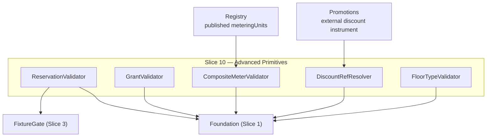

Created:  2026-08-24 by Virtuozzo International GmbH
Updated:  2026-08-24 by Virtuozzo International GmbH

<!-- CONFLUENCE_TITLE: [BSS]: Pricing — Advanced Pricing Primitives (Design, Slice 10) -->
<!-- Related: ../PRD.md, ../DESIGN.md, ./01-foundation.md | Owners: BSS Product Catalog team -->

# DESIGN — Advanced Pricing Primitives (Slice 10)

<!-- toc -->

- [1. Context](#1-context)
  - [1.1 Overview](#11-overview)
  - [1.2 Purpose](#12-purpose)
  - [1.3 Actors](#13-actors)
  - [1.4 References](#14-references)
  - [1.5 Scope](#15-scope)
  - [1.6 Constraints & Assumptions](#16-constraints--assumptions)
  - [1.7 Naming & Design-Introduced Names](#17-naming--design-introduced-names)
  - [1.8 Context & Dependencies](#18-context--dependencies)
- [2. Actor Flows (CDSL)](#2-actor-flows-cdsl)
  - [Author Advanced Primitives](#author-advanced-primitives)
- [3. Processes / Business Logic (CDSL)](#3-processes--business-logic-cdsl)
  - [Reserved-Capacity Attributes](#reserved-capacity-attributes)
  - [Prepaid Credit Grant](#prepaid-credit-grant)
  - [Included-Allowance Compile (D-45)](#included-allowance-compile-d-45)
  - [Derived (Composite) Meter](#derived-composite-meter)
  - [Discount Reference Hook](#discount-reference-hook)
  - [Minimum-Quantity Floor Typing](#minimum-quantity-floor-typing)
  - [Trailing-Tier Qualification (Tier Rate-Lock)](#trailing-tier-qualification-tier-rate-lock)
- [4. States (CDSL)](#4-states-cdsl)
- [5. API Surface](#5-api-surface)
- [6. Data Model](#6-data-model)
- [7. Events & Alarms](#7-events--alarms)
- [8. Definitions of Done](#8-definitions-of-done)
  - [Reserved Capacity](#reserved-capacity)
  - [Prepaid Grant](#prepaid-grant)
  - [Included Allowance](#included-allowance)
  - [Derived Meter](#derived-meter)
  - [Discount Hook & Floor Typing](#discount-hook--floor-typing)
  - [Trailing-Tier Qualification](#trailing-tier-qualification)
- [9. Acceptance Criteria](#9-acceptance-criteria)
- [10. Non-Functional Considerations](#10-non-functional-considerations)

<!-- /toc -->

## 1. Context

### 1.1 Overview

This slice owns **six** advanced authoring primitives and one typing rule — one per id in the
`Traces to` block below, which is the roster this sentence must match and the only place the
membership is maintained:
**reserved-capacity pricing** as attributes on the single usage row (`reservedRate` +
`reservationFlavor`, p1 — launch scope), the **prepaid credit grant** (definition only —
`category`, materialized usage-line `applicability`, drawdown-rank default (D-43); balance
execution GA-gated on Billing/Rating), the **included allowance** (publish-**compiled**,
D-45 — `none` → $0 band + frozen marker, `carry` → a D-43 promotional grant; zero new
evaluation machinery), the **derived (composite) meter**
(formula-as-**data** over ≥ 2 published units, one output unit), the **`discountRef`
day-1 hook** (referential integrity only), **trailing-tier qualification** (the tier rate-lock:
`tierQualificationWindow`, its pairing with `tierAggregationWindow` and the zero-band rule —
D-40, D-60, D-68, D-69), and the **typed `minQtyThreshold`** floor
(`purchase` vs `usage`). Every primitive freezes into `pricingSnapshotRef`; every piece of
math it implies is evaluated downstream.

**Trailing-tier qualification was missing from this enumeration, from §1.5 and from §2 until
2026-08-17**, having joined the slice by D-68 (2026-07-29) without the front matter following.
It is the one place a reader establishes what the slice covers, so four decisions' worth of
scope was invisible there while §3, §1.7 and the `Traces to` block all carried it. The counts in
this section are derivable and should be re-derived rather than trusted:
`grep -c 'cpt-cf-bss-pricing-fr-' <the Traces to block>` is the primitive roster, `grep -n '^### '`
over §3 is the process list, and §8 is **six** DoDs rather than seven only because the discount
hook and floor typing share one.

**Traces to**: `cpt-cf-bss-pricing-fr-reserved-capacity`,
`cpt-cf-bss-pricing-fr-prepaid-credit-grant`, `cpt-cf-bss-pricing-fr-included-allowance`,
`cpt-cf-bss-pricing-fr-derived-composite-meter`,
`cpt-cf-bss-pricing-fr-discount-ref-hook`, `cpt-cf-bss-pricing-fr-min-qty-floor`,
`cpt-cf-bss-pricing-fr-trailing-tier-qualification`
(the last id joined this list by D-68, 2026-07-29 — one of the two FRs no slice had claimed)

### 1.2 Purpose

Cover the launch commercial shapes beyond plain rows — committed-rate IaaS selling, wallet
prepay, multi-unit composite pricing (VM = vCPU + RAM as one line), day-1 discounts —
without breaking the two structural rules that keep rating unambiguous: one priced line per
`(meter, dimensionKey)` (reservation = attributes, composite = one output unit) and zero
computation in the catalog.

### 1.3 Actors

| Actor | Role in Slice |
|-------|---------------|
| `cpt-cf-bss-pricing-actor-finance-manager` | Authors reserved rates, grants, floors |
| `cpt-cf-bss-pricing-actor-rating` | Evaluates reservation (step 6), composite formulas; sources from the snapshot |
| `cpt-cf-bss-pricing-actor-billing` | Owns prepaid balance/drawdown/auto-recharge execution (GA gate) |
| `cpt-cf-bss-pricing-actor-promotions` | Owns the external discount instrument `discountRef` resolves to |
| `cpt-cf-bss-pricing-actor-catalog-registry` | Declares the constituent `meteringUnit`s composites build on |
| `cpt-cf-bss-pricing-actor-contracts` | Owns negotiated RI-style rates (boundary) |
| `cpt-cf-bss-pricing-actor-subscriptions` | Enforces the `purchase`-type floor at order time |

### 1.4 References

- **PRD**: [PRD.md](../PRD.md) — §6.10, §17.7 (primitives detail), §17.2 (reservation fixture row), §17.4 (prepaid/floor validation rules)
- **Design**: [01-foundation.md](./01-foundation.md); [03-price-structure.md](./03-price-structure.md) — the usage row + `FixtureGate` these primitives extend
- **Dependencies**: Slices 1–3 (rows), Slice 5 (grant-price materiality), registry (`meteringUnit` declarations).

### 1.5 Scope

**In scope**: authoring + publish validation + snapshot freezing of **every primitive in the
`Traces to` roster** (six, plus the floor typing rule);
the reservation-variant registration into Slice 3's `FixtureGate`; grant-price scoping per
`(currency, region)`; composite formula-as-data schema + referential/self-reference checks;
`discountRef` resolution check; floor typing + placement warning.

**Out of scope**: reservation evaluation/matching (Tariffs step 6); balance ledger,
drawdown, zero cut-off, auto-recharge execution (Billing/Rating — **GA gate** for the
sellable path); composite formula evaluation (Tariffs); discount authoring/evaluation/
stacking (Promotions/Tariffs); negotiated RI rates (Contracts); floor enforcement
(Subscriptions for `purchase`; Tariffs/Rating for `usage`).

### 1.6 Constraints & Assumptions

Inherits Foundation C-set. Slice-10-specific:

| # | Topic | Assumption (default) | Source |
|---|-------|----------------------|--------|
| A1 | Reservation = attributes | `reservedRate`/`reservationFlavor` live **on** the usage row (never a second row) so `(meter, dimensionKey)` stays injective; aligned field-for-field with Tariffs `reservationMatch` | PRD §17.7 |
| A2 | Reserved row is a usage row | `billingGranularity` REQUIRED; `tierAggregationWindow` REQUIRED only when tiered (the usage-only placement rule applies normally) | PRD §17.7 |
| A3 | Grant is not a Price row | The prepaid grant is a **plan-attached primitive** with its own per-`(currency, region)` price — no `chargeKind`, not on the canonical scope key | PRD §17.7 |
| A4 | Formula as data | Composite formula = operands + operator/weights as data (never executable code); versioned with the plan revision | PRD §17.7 |
| A5 | Prepaid GA gate | Grants are definable/publishable but **not sellable** until Billing/Rating balance execution exists (tracked GA gate) | PRD §13 |

### 1.7 Naming & Design-Introduced Names

| Name | Meaning |
|------|---------|
| `ReservationValidator` | Registered rules: A1/A2 shapes; fixture registration for the reservation variant |
| `GrantValidator` | Registered rules: grant fields, expiry set, published `creditUnit`, per-`(currency, region)` price scoping (`category = prepaid`), promotional shape (no price rows, no auto-recharge), `applicability` (published usage meters of the plan, `creditUnit` consistency, materialized default) |
| `AllowanceCompiler` | The D-45 publish-time compile: fail-condition gate, $0-band synthesis + allowance marker (`none`), promotional-grant materialization (`carry`); pure/deterministic, output frozen with the authored declaration |
| `CompositeMeterValidator` | Registered rules: ≥ 2 published constituents, formula-as-data well-formedness, no self-reference, one output unit |
| `DiscountRefResolver` | Referential-integrity check against the registered external instrument |
| `FloorTypeValidator` | `purchase` vs `usage` typing + in-band placement warning |
| `TierQualificationValidator` | Registered rules for `tierQualificationWindow` (D-40/D-60): tiered-usage-only placement, the `tierAggregationWindow` pairing, the `$0`-lowest-band ban, and the `trailing_tier` fixture gate (named in `dod-trailing-tier` since D-69; added to this table by the 2026-07-31 review fix) |

### 1.8 Context & Dependencies

## 2. Actor Flows (CDSL)

### Author Advanced Primitives

- [ ] `p1` - **ID**: `cpt-cf-bss-pricing-flow-primitives-author`

**Actor**: `cpt-cf-bss-pricing-actor-finance-manager`

**Success Scenarios**:
- A usage row gains `reservedRate`/`reservationFlavor`; a plan gains a prepaid grant or a composite-meter definition; a row gains `discountRef` or a typed `minQtyThreshold` — each validated at publish, frozen in the snapshot

**Error Scenarios**:
- Reservation on a non-usage row → 422; grant without `expiryPolicy` / with unpublished `creditUnit` / unscoped price on a multi-market plan / promotional carrying a price or auto-recharge / `applicability` naming an unpublished or non-usage meter → 422; composite with < 2 or unpublished constituents / self-reference → 422; unresolvable `discountRef` → 422; untyped floor → 422

**Steps**:
1. [ ] - `p1` - Primitives author through the Slice 2/3 plan/price PATCH surfaces (plan-attached: grant, composite; row-attached: reservation, discountRef, floor) - `inst-ad-author`
2. [ ] - `p1` - Publish: **this slice's registered validators, the allowance compile and the
`discountRef` resolve** all run in the Foundation pipeline — §1.7 is the roster and it has seven
members, of which exactly five are spelled `…Validator`, which is how this step came to say
"the five validators" and thereby exclude the `AllowanceCompiler` D-45 makes a publish-time
compile and the `DiscountRefResolver` this slice runs a referential check through; the reservation variant additionally passes Slice 3's `FixtureGate` - `inst-ad-validate`
3. [ ] - `p1` - **RETURN** definitions frozen in `pricingSnapshotRef`; evaluation/execution downstream - `inst-ad-return`

## 3. Processes / Business Logic (CDSL)

### Reserved-Capacity Attributes

- [ ] `p1` - **ID**: `cpt-cf-bss-pricing-algo-reserved`

**Steps**:
1. [ ] - `p1` - **`@write` (D-312) for the non-usage half only** — a reservation on a row whose `chargeKind` is not `usage` (`RESERVATION_ON_NON_USAGE`) has both operands present with the key frozen, so the authoring plane refuses it; the **both-or-neither** pairing below is content-against-content and stays at publish. `reservedRate` (≥ 0, row currency) + `reservationFlavor` (`consumption | capacity`) are attributes **on the single usage row**, alongside the on-demand price/tiers (A1 — never a second row, never a second `(meter, dimensionKey)` line). **Both or neither: a row carrying one and not the other fails publish with `RESERVATION_PAIR_INCOMPLETE`** (422, 2026-08-08) — §9's first AC requires it and §5 had named no code. Judged row-locally at publish rather than as a column `CHECK`, for §6's portability reason **The reserved pair reaches the frozen payload too (D-324, 2026-08-16):** `reservedRateNanoMinor` and `reservationFlavor` were absent from the `migrated-origin` record, so a synthesized reserved line had Rating source a rate that was not there. - `inst-rv-attrs`
2. [ ] - `p1` - The row remains a usage row (A2): `billingGranularity` REQUIRED; `tierAggregationWindow` REQUIRED only when tiered - `inst-rv-usage`
3. [ ] - `p1` - The reserved/allocated **quantity** is runtime input (OSS/Contracts entitlement); the catalog neither meters nor allocates nor computes the charge; Tariffs step 6 sources the self-service rate from the snapshot - `inst-rv-runtime`
3a. [ ] - `p1` - **Reservation × tiers (normative, money-affecting):** the matched/allocated reserved quantity is **excluded** from the on-demand tier counter `Q` — only the on-demand **remainder** enters the row's bands (150K used with a 100K reservation: 100K at `reservedRate`, the remainder's `Q` starts at 0, not 100K). Frozen semantics; the reservation joint fixture MUST include a tiered-remainder scenario - `inst-rv-tier-q`
3b. [ ] - `p1` - **Reservation × level aggregation (D-53, 2026-07-28):** on a non-`sum` row (`aggregationFunction ∈ {peak, time_weighted}`, D-44) the `inst-rv-tier-q` exclusion has no single meaning — `Q` is a sum of per-granule folds of a level, and "subtract the reserved quantity" could net per granule or per window. At launch, therefore: **`reservationFlavor = capacity` is the only flavor authorable on a non-`sum` row** — its `capacityCharge` never touches `Q` at all, which is exactly the reserved-cloudlets-with-peak-metering launch product — and that charge accrues **per covered granule**, `Σ reservedRate × reservedQuantity_i × duration_i` over the reservation's covered sub-intervals within the `AnchorPeriod` (**D-139**, adopting rating **T-D-25**): `reservedRate` is denominated in the row's billable unit — level unit × granule duration — so it is money per granule, not a period charge, and without the duration factor an allocation made or resized mid-period would bill as if held all period, with no proration path to correct it (recurring proration does not cover usage rows and usage is never prorated). `coveredGranules` is runtime coverage computed by Rating; the catalog authors and freezes only `reservedRate`, `reservedQuantity` and `reservationFlavor`; **`consumption` flavor on a non-`sum` row fails publish** (`LEVEL_RESERVATION_CONSUMPTION_FORBIDDEN`, 422) until per-granule netting semantics are decided (a named Future gate). The reservation fixture gains a capacity-on-level scenario before any such row publishes - `inst-rv-level`
4. [ ] - `p1` - The reservation variant requires its own joint golden fixture before publish (registered into Slice 3's `FixtureGate`); negotiated RI-style rates stay in Contracts (boundary) - `inst-rv-fixture`

### Prepaid Credit Grant

- [ ] `p2` - **ID**: `cpt-cf-bss-pricing-algo-prepaid-grant`

**Steps**:
1. [ ] - `p2` - Grant fields: `grantAmount > 0`; `creditUnit` = ISO 4217 currency **or** a **published** `meteringUnit` (unpublished fails); `expiryPolicy` explicitly `never` or `days(N>0)` (no implicit never; **`days(N)` anchors at grant issuance** — the purchase or recharge instant, UTC); `autoRechargeAllowed` bool. **Same blocked registry read as `inst-cm-constituents` (2026-08-08)**: the `published` qualifier on a `meteringUnit` needs a registry client this gear does not have, so that clause is owed and the rest of the rule is not. - `inst-pg-fields`
1a. [ ] - `p2` - **`category` (D-43)**: `prepaid` (default — purchased; the `inst-pg-price` rules apply) or `promotional` (issued **free** — grant-price rows MUST be absent, `GRANT_PROMO_PRICE_FORBIDDEN`; `autoRechargeAllowed` MUST be false, `GRANT_PROMO_AUTORECHARGE` — a recharge is a purchase); publish **warns** on `promotional` + `expiryPolicy = never` (`GRANT_PROMO_NO_EXPIRY` — likely authoring error); frozen in the snapshot - `inst-pg-category`
1b. [ ] - `p2` - **`applicability` (D-43)**: which of the plan's charge lines the credit may offset at drawdown — `all_usage` (default) or an explicit set of **published** `meteringUnit` ids; every target MUST be a usage line of the grant-bearing plan (credit never offsets `one_time_setup` or recurring rows — launch rule); when `creditUnit` is a `meteringUnit`, the set MUST stay within that unit's meters (absent ⇒ that unit's meters). Publish **materializes** the resolved set into the snapshot — the executor never infers scope. **Same blocked registry read as `inst-cm-constituents` (2026-08-08)**: the `published` qualifier on a `meteringUnit` needs a registry client this gear does not have, so that clause is owed and the rest of the rule is not. - `inst-pg-applicability`
1c. [ ] - `p2` - **`drawdownPriority` (D-43)**: optional int ≥ 0 (lower draws first) — an authored **default rank**, frozen in the snapshot. The **effective** cross-grant order at drawdown is **Billing-owned**, resolved over frozen inputs by the normative tie-break chain: `drawdownPriority` → category (`promotional` before `prepaid`) → earlier expiry → earlier issuance → `grantId` (a deterministic total order; the catalog never orders live balances) - `inst-pg-priority`
2. [ ] - `p2` - (`category = prepaid` only) Grant **price** is authored per `(currency, region)` like a price row scope — but the grant is a plan-attached primitive with **no** `chargeKind`, not on the canonical scope key (A3); a single unscoped price on a multi-`(currency, region)` plan fails publish, and the grant-price set MUST cover **every** `(currency, region)` the plan publishes sellable rows for — a missing market fails publish (`GRANT_PRICE_NOT_COVERED`) - `inst-pg-price`
3. [ ] - `p2` - Grant changes route through **Slice 5's evaluator** with a split delta semantics: grant-**price** changes are **ordinary per-currency price deltas** (threshold-evaluated, never always-material — Slice 5 `inst-mat-registered`); `category` / `applicability` / `drawdownPriority` changes have **no numeric delta**, so per the G1 fail-safe (no delta computable ⇒ material) they are **always material** - `inst-pg-material`
3a. [ ] - `p2` - **Billing-side drawdown placement (D-48, joint-contract line — G-4 closed 2026-07-28):** drawdown applies to the **post-discount, pre-tax** amount — a credit **reduces the charge**, it never pays the invoice (one doctrine with metered-`creditUnit` grants, which net quantity pre-tax by construction). Dormant at MVP (tax-exclusive selling); explicit **revisit checkpoint at Tax Engine GA** — Finance re-confirms before inclusive tax activates. Carried here until a Billing gear PRD exists to countersign; mirrored in rating `design/11` - `inst-pg-drawdown-placement`
4. [ ] - `p2` - The catalog **never** persists balance or computes drawdown; the definition freezes into the snapshot; the sellable path is **GA-gated** on Billing/Rating balance execution (A5) — publishable now, with a **prepaid-execution GA-gate flag** on the read model consumed by the Slice 7 sellability gate. **Mechanics (D-29):** the flag derives at publish from the named platform/tenant GA signal **"prepaid balance execution GA"** (owner: Billing/Rating; tracked on the program board per PRD §13); it applies to **every scope key of the grant-bearing plan** (plan-level — matching PRD AC #87); clearing follows the Slice 4 pattern (`inst-td-clear`): a **re-publish through the pipeline + approval** once the signal is GA — never a silent flag flip - `inst-pg-gagate`

### Included-Allowance Compile (D-45)

- [ ] `p1` - **ID**: `cpt-cf-bss-pricing-algo-allowance-compile`

**Input**: a `usage` row's authored `includedAllowance = { quantity N, rolloverPolicy ∈ {none (default), carry(maxPeriods ≥ 1)} }`
**Output**: the compiled artifacts ($0 band + marker, or promotional grant) plus the authored declaration, both frozen in `pricingSnapshotRef`; publish blocked on any fail condition

**Steps**:
1. [ ] - `p1` - **Gate (PRD fail set):** publish fails on `includedAllowance` on a non-`usage` row (`ALLOWANCE_ON_NON_USAGE`); a row combining an **authored** `$0` first band with a declaration (double-free, `ALLOWANCE_DOUBLE_FREE`); a non-`sum` row (`aggregationFunction ≠ sum` — level-meter allowance is Future, `ALLOWANCE_ON_NON_SUM`); and an unusable `quantity` (`ALLOWANCE_QUANTITY_INVALID`) — **`quantity ≤ 0`, and, since 2026-08-15, a quantity whose offset overflows the authored ladder** (`inst-ac-band`'s saturation clause; D-317 records why this widens the existing code rather than minting a seventh). Additionally a `package` row fails (`ALLOWANCE_KIND_UNSUPPORTED`) — the structural consequence of package/band exclusivity (Slice 3): there is no band set to compile into. **A `modelKind = volume` row fails the same way (`ALLOWANCE_KIND_UNSUPPORTED`, D-59, 2026-07-29 review fix):** catalog `volume` is Tariffs **Variant A** only (Q3 — the selected band's single rate applies to the **total** `Q`), so a `$0` first band does not express "N included" — it expresses a **cliff**. With `N = 100` and a `$1` band, `Q = 99` bills `$0` and `Q = 101` bills `$101` (not `$1`), while `inst-ac-marker` simultaneously displays "includes 100 units". An allowance under Variant A would have to bill `(Q − N) × rate`, which the band model cannot express at all — so it is refused at publish rather than approximated. `includedAllowance` is therefore authorable on `graduated` rows and on untiered `per_unit` usage rows only (the latter compiled per `inst-ac-band`). **`flat` falls under the same code, and it was named by neither of the two reasons above (2026-08-15, found building the gate):** the sentence just given is a *positive* statement of the authorable set, so every kind outside `{graduated, per_unit}` is refused — but `package` is refused for having no band set and `volume` for the Variant A cliff, and `flat` is neither. Its own reason is that it prices **no quantity**, so it counts none and there is nothing for `N` to be a quantity of. It is reachable only on a `usage` charge kind (on any other, `ALLOWANCE_ON_NON_USAGE` is the fault), and that pairing is itself refused by `MODEL_KIND_CHARGEKIND_MISMATCH` (D-312) — so an author who reaches it is told both things at once, which is the correct report and not a duplicate. **The `ALLOWANCE_*` roster is exactly six codes**, the six named in this step; the glob `ALLOWANCE_*` written in prose (§7 `dod-included-allowance`) is a reference to the six and not a seventh member. **An allowance never co-occurs with reservation attributes on one row (`ALLOWANCE_WITH_RESERVATION`, 2026-07-30 review fix, L-6):** `inst-rv-tier-q` starts the reserved remainder's `Q` at 0 and the compiled `[0, N)` band would then grant that remainder another `N` free units — allowance-on-top-of-reservation semantics (net the reservation first? stack the free quantities?) are undecided, so the combination fails publish rather than compiling an unreviewed double benefit (a named Future gate, same posture as D-53) - `inst-ac-gate`
2. [ ] - `p1` - **`rolloverPolicy = none` — band compile:** `N` is expressed in the row's **billable units** (post-`billingGranularity` quantization, `inst-tb-units`). For a tiered row the compiler **prepends** the `$0` band `[0, N)` and offsets every authored band bound by `+N` (the authored `[0, X)` becomes `[N, N+X)`); for an untiered usage row (`modelKind = per_unit`, the only untiered usage kind that reaches the compiler once `flat`/`package`/`volume` are excluded) it synthesizes the two-band graduated set `[0, N) @ $0`, `[N, null) @ rate`, moving the authored **`unit_rate`** into the `[N, null)` band and presenting the kind as `graduated`. **The folded field is `unit_rate`, not `amount_minor` (corrected 2026-08-15):** this step said `amount_minor` from D-59 onwards and has been stale since **D-311** (2026-08-11) moved a `per_unit` row's money into its own `unit_rate_nano` column — a rate is not an amount, and a `per_unit` row has carried `amount_minor = NULL` ever since, so a compile that followed this text literally would fold a `NULL` into the top band. **The compile is a projection, never a write-back (normative, D-130, 2026-08-01 review fix — supersedes D-59's "kind rewrite in the same publish transaction"):** the row's **truth** stays exactly as authored — the declaration, the authored `model_kind`, the authored rate or amount, and the authored `pricing_price_tier_band` rows are untouched — and the compiled artifacts (the `$0` band, the offset band set, the presented `graduated` kind with the authored rate folded into the top band, and the `inst-ac-marker` marker) are materialized **into the read model / `pricingSnapshotRef`** at publish. This dissolves D-59's own problem — no band row is ever inserted against a `per_unit` `price_id`, so the Slice-3 structural-exclusivity trigger is never approached — and it is what makes the compile re-entrant: the pre-D-130 in-place rewrite **destroyed its own input** (the authored bounds were unrecoverable after the first publish), so `inst-ac-deterministic` had nothing to recompile from and every re-entry path was undefined — a supersession, repricing successor or clone built from the published row carried already-offset bands *plus* the declaration and tripped `ALLOWANCE_DOUBLE_FREE`, blocking the reprice of every allowance-carrying row, while dropping the declaration instead silently lost the D-45 marker. Publish still validates the **compiled** set against the standard Slice 3 band rules (ordering/contiguity/open top) and fixture-gates the row on the compiled kind — **compile-equivalence** (AC #90a): the projected output is byte-identical in evaluation terms to the hand-authored equivalent, so rating changes nothing. **Those band rules are not sufficient on their own, and this step said they were (normative, 2026-08-15, found building the compile):** the offset `bound + N` saturates at `u64::MAX` rather than wrapping or panicking, and the sentence just above was written as if a saturated bound always *shows up* as a malformed compiled set. It does not. `N = u64::MAX` on the ladder `[0, 1000)`, `[1000, null)` collapses both bounds onto `u64::MAX` and the zero-width band between them is caught by `TIER_BAND_EMPTY` — the loud half. Five units lower, at `N = u64::MAX - 5`, the compiled set is `[0, N) @ $0`, `[N, u64::MAX)`, `[u64::MAX, null)`: ascending, non-overlapping, contiguous, origin-anchored, open at the top and **silent under all three rules**, while the authored 1000-unit band has been materialized **five** units wide. So the saturation is judged as **itself**, read against the **authored** bounds (which is where the addition happens), and the row fails publish under `ALLOWANCE_QUANTITY_INVALID`; the untiered branch synthesizes `[0, N)` and `[N, null)` rather than offsetting anything, so it cannot saturate at any `N` and is never refused on this ground. **The existing code is widened rather than a seventh minted (D-317 clause (3)):** the remediable operand is the same declared quantity an author lowers, and the authored ladder is well-formed and stays so at every smaller `N`, so the refusal names the declaration rather than the ladder — and it does **not** wait on the authored set being clean, so an author whose ladder also has a hole is told about both (two operands, two edits), while the *geometry* half of this rule does wait, so one edit is reported once. **Compile-equivalence is therefore a property of the rows that publish rather than of the compile (AC #90a, qualified 2026-08-15):** a saturated offset is exactly the case where the projection is *not* evaluation-equivalent to the hand-authored ladder, and the answer is that no such row ever reaches a consumer — the refusal above is what keeps AC #90a true of everything a `pricingSnapshotRef` can carry - `inst-ac-band`
3. [ ] - `p1` - **Allowance marker:** the compile freezes a first-class marker `{ quantity, rolloverPolicy, source: compiled }` next to the band set — the read model serves display ("includes N units") and the reporting split (included vs billed) from the marker, never by inferring from a `$0` band; a hand-authored `$0` band carries no marker (that is the observable difference D-45 exists for). **The wire spelling is declared here because the read model is a frozen contract (normative, 2026-08-15):** this step described the marker's *members* and named no serialized form, so an implementation had to mint one — into `pricing_read_model` and `pricingSnapshotRef`, which freeze for ≥ 7 years, and that is not a shape to leave undeclared. The member is **`allowanceMarker`**, an object flat beside the row's other authored facts (per §6's rule that a nesting level no document declares is a wire structure invented at the keyboard), `null` on every row that declares no allowance, with **four** members: **`quantity`** (the included `N`, in billable units), **`rolloverPolicy`** (the authored policy verbatim), **`source`** (`compiled` — the only value, and that is the point: a marker exists only where the compile made one, so a consumer reads which of the two shapes it has instead of inferring an allowance from a `$0` band), and **`authoredModelKind`** (D-59 asks for *"the authored kind retained beside the marker"* and names no member; `per_unit` here is what tells a reader the top band's rate is the folded `unitRateNanoMinor` rather than an authored band). **Three sibling members of the same projected row carry the compiled value rather than the stored column** on an allowance-carrying row, stated here because their names do not say so: `modelKind` is the presented `graduated`, `bands` is the `$0` band plus the offset ladder, and **`unitRateNanoMinor` is `null`** — the authored rate is the top band's rate there, and a payload carrying both would hand a consumer two competing prices. `includedAllowance` keeps carrying the **authored** declaration beside them, which is what makes the compile re-entrant (D-130) - `inst-ac-marker`
4. [ ] - `p1` - **`rolloverPolicy = carry(maxPeriods)` — grant compile:** materializes a **promotional** grant under the D-43 machinery: `category = promotional` (free — no price rows, no auto-recharge), `grantAmount = N`, `creditUnit` = the row's `meteringUnit`, `applicability` = exactly this row's meter (materialized set), issued **per billing period** (Billing executes issuance + drawdown; the catalog holds no balance). **Issuance scope is the source *key*, not the source row (normative, 2026-07-31c review fix L-6, re-keyed by D-129, 2026-08-01):** the compiled grant carries `source_scope_key` — the allowance-carrying row's **canonical scope key** — and Billing issues, per subscription and period, **only** the compiled grant whose source key is the key the subscription resolves on its bound `(currency, region)`; a multi-market plan compiles one carry grant per allowance-carrying market key, and a subscription never receives a sibling market's grant. `source_price_id` is retained as **lineage only**. Binding by `price_id` did not survive its own change mechanism: `pricing_price` is attached to `plan_id`, **not** to a revision (S2 §6), so a supersession mints a new `price_id` without opening a plan revision, while `pricing_plan_grant` is revision-keyed and physically immutable once its revision publishes (D-106, Foundation §3.7) — the successor's commit could therefore neither re-point nor replace the grant, and after any routine reprice the "source row = the bound row" test stopped matching and the allowance **silently stopped being issued**, at zero price delta and with no alarm. The scope key is stable across supersession by construction — that is what supersession *is* — so the grant survives it; changing the allowance itself is structural and is blocked on the row side by the D-129 clause of the succession unit guard (S3 `inst-tb-supersession-units`). Expiry encodes the carry horizon as **`periods(maxPeriods)`** — anchor-derived billing periods, a compiled-grant-only expiry form (not authorable on hand-authored grants, which keep `never | days(N)`); an unused issued amount expires `maxPeriods` period boundaries after issuance - `inst-ac-carry`
5. [ ] - `p1` - **Determinism / replay:** the compile is a pure function of the authored declaration + **the authored row content**, which D-130 keeps in truth precisely so that input still exists on the second run (no tenant state); re-publish, supersession, repricing and clone all recompile identically from it; both the authored form and the compiled artifacts freeze into `pricingSnapshotRef`, so a snapshot consumer never needs the compiler - `inst-ac-deterministic`

### Derived (Composite) Meter

- [ ] `p2` - **ID**: `cpt-cf-bss-pricing-algo-composite-meter`

**Steps**:
1. [ ] - `p2` - Persist ≥ 2 **published** constituent `meteringUnit` ids (registry-declared); any unpublished constituent fails publish. **The `published` half is blocked on a registry read this gear does not have (2026-08-08)** — `grep` for `metering_unit` / `MeteringUnit` across `src/` returns nothing, so there is no way to ask whether a unit is published, let alone declared. The **arity** and **self-reference** halves need no counterparty and **are built (D-256, 2026-08-08)** — `COMPOSITE_TOO_FEW_CONSTITUENTS` and `COMPOSITE_SELF_REFERENCE`, both **`PlanShape` rules rather than row-local ones** because §9 asks for *transitive* self-reference and a cycle across two definitions is invisible to any single row. The publication check is owed with the registry client. Named on all three instructions that share this one hole rather than on whichever is read first - `inst-cm-constituents`
2. [ ] - `p2` - Persist the formula **as data** (A4): operands + operator/weights — a declarative schema, not executable code; self-reference (output unit among constituents, direct or transitive) fails. **Built 2026-08-08 (D-256)** on `pricing_composite_meter`'s migration, revision-scoped with a stable `composite_id` (D-106) and copied forward by `open_revision` / dropped by `abandon_draft`. The formula is opaque to this gear by construction — it is persisted and frozen, never read — and it enters the approval content pin (**v10 → v11**), which is what closes the hole of a reviewer approving `1:1` weights and a commit publishing `1:4` with an equal digest - `inst-cm-formula`
2a. [ ] - `p2` - **Output-unit ownership (D-32):** the derived output unit is **declared to the registry like any `meteringUnit`** (one meter namespace — Rating recognizes it through the same registry lookup as base units); the catalog persists the registry-declared unit id + the formula binding, never a catalog-private unit name. Part of the registry joint contract (PRD §15) - `inst-cm-output-unit`
3. [ ] - `p2` - One declared **output unit**: the price row rates the composite as **one line**, satisfying Slice 2's meter injectivity as one output unit - `inst-cm-output`
4. [ ] - `p2` - The definition freezes into `pricingSnapshotRef`; Tariffs evaluates — the catalog never computes the formula result - `inst-cm-frozen`

### Discount Reference Hook

- [ ] `p2` - **ID**: `cpt-cf-bss-pricing-algo-discount-ref`

**Steps**:
1. [ ] - `p2` - Optional `discountRef` validates **referential integrity only**: it must resolve to a registered external instrument (Promotions/Tariffs-owned); absence never blocks publish. **Future / blocked (2026-08-08), and the counterparty is named rather than left to inference**: "resolve to a registered external instrument" requires a Promotions or Tariffs registry read, and **no such client, port or contract exists anywhere in this gear** — there is no lane to ask. So `DISCOUNT_REF_UNRESOLVED` is declared and unraisable, and what is built is the column, its framing into the content pin, and nothing that pretends to check it. Read today as launch scope this instruction promises a referential guarantee the deployment cannot make; it becomes buildable the day the instrument registry has a client here, and not before - `inst-dr-referential`
2. [ ] - `p2` - The catalog does not author, evaluate, or stack the discount; the ref persists on the snapshot; a clone copies it only if it still resolves (else dropped with an operator notice — Slice 12 clone rule) - `inst-dr-boundary`

### Minimum-Quantity Floor Typing

- [ ] `p2` - **ID**: `cpt-cf-bss-pricing-algo-floor-typing`

**Steps**:
1. [ ] - `p2` - A `minQtyThreshold` MUST declare its floor type: `purchase` (Subscriptions rejects orders below — not silently zero) or `usage` (Tariffs/Rating treats below-floor usage as ineligible, failing closed — never silent zero-rating); untyped fails publish. **`FLOOR_TYPE_MISSING` is unrepresentable in the shape this was built as, and that is a fact about the shape rather than a missing rule (2026-08-08)**: `inst-ft-both` types the floor by **which of the two fields carries it** (`minQtyPurchase` / `minQtyUsage`), so "a floor without a type" is a row with no floor and there is nothing for the refusal to fire on. The code stays declared in §5 because it is owed the day a floor is authored as a `{ value, type }` pair, where a `type` genuinely can be absent — that is the shape to raise it in - `inst-ft-typed`
1a. [ ] - `p2` - **The fallback is authored, not implied:** a `usage` floor MUST declare its fallback on the row; at launch the only supported value is **`exception`** — the below-floor usage line fails closed into the rating exception path (visible, resolvable), never silently zero-rated and never silently charged. Richer fallbacks (e.g. an alternative row) are Future; the declared fallback freezes in the snapshot. **A fallback declared on a row carrying no `minQtyUsage` warns `FLOOR_FALLBACK_WITHOUT_FLOOR`** rather than refusing (2026-08-08): it is inert and mis-bills nothing, but publish freezes it into an immutable version, so the operator is told before the freeze rather than after - `inst-ft-fallback`
2. [ ] - `p2` - Both MAY be set on one row (distinct fields); type + value freeze in the snapshot - `inst-ft-both`
3. [ ] - `p2` - Publish **warns** when a floor falls inside a non-zero-priced band (likely authoring error: the floor hides paid quantity), **and equally when a `usage` floor falls inside the `[0, N)` allowance band** — compiled (D-45) or hand-authored `$0` first band — where the floor silently voids part of the granted allowance (2026-07-31 review fix: the non-zero-priced wording alone never fired on a `$0` band). **The allowance half is built (2026-08-15)** and it reads the row's **presented** band set (`inst-ac-band`), which is the operand it needed: an untiered `per_unit` row has no authored bands at all, so a rule reading the authored set would have missed the compiled `[0, N)` band entirely on exactly the rows the compile exists for. **Both floor types are warned on, on both halves** — the wording above says *"a `usage` floor"* for the allowance half and the rule does not restrict it, deliberately: a `minQtyPurchase` inside the `[0, N)` band hides exactly as much granted quantity as a `minQtyUsage` does, the hazard this step names is generic (*"the floor hides paid quantity"*), and neither the priced-band half nor the reason for the `$0` extension is specific to one of the two fields. A floor sitting exactly **on** a band's lower bound hides nothing and does not warn - `inst-ft-warn`

### Trailing-Tier Qualification (Tier Rate-Lock)

- [ ] `p2` - **ID**: `cpt-cf-bss-pricing-algo-trailing-tier`

**Steps**:
1. [ ] - `p2` - A tiered usage row MAY set **`tierQualificationWindow`** (`current` | `trailing_period`) — a **third, distinct window** from `tierAggregationWindow` (when the in-window `Q` counter resets) and `billingGranularity` (billing cadence). `current` (default) preserves Slice 3 behaviour exactly (tier from this window's own `Q`) - `inst-tt-window`
2. [ ] - `p2` - `trailing_period`: the **rate tier is qualified by the prior billing period's total** `Q` — the subscription's **anchor-derived period**, not a calendar month (for non-calendar-anchored subscriptions the two differ, and the anchor-derived reading is the normative one; the PRD glossary agrees) — the band the trailing total falls into (single-band **volume**-style selection) sets **one rate for the whole current period**; billing then applies that locked rate to actual usage at `billingGranularity`. Canonical case: PaaS egress where the prior period's volume sets `$/GiB` and the current period is billed hourly on actual traffic - `inst-tt-qualify`
3. [ ] - `p2` - **Where the lock lives (normative, D-60, 2026-07-29 review fix — supersedes the earlier "frozen into `pricingSnapshotRef`" wording):** the qualified rate is a **per-subscription, per-billing-period** value, so it **cannot** live in `pricingSnapshotRef` — that reference is plan-scoped, stamped once at publish and immutable thereafter (Foundation §4.4), while one published `trailing_period` row is bound by N subscriptions with N different anchors and N different trailing totals. The catalog freezes **only** the authored `tierQualificationWindow` and the ordered band set into the snapshot. **Rating** resolves the qualified band at each period boundary and pins `{priceId, periodStart, qualifiedBandId, lockedUnitPriceMinor}` on that period's rated charges **alongside** `pricingSnapshotRef`; that pin — not the snapshot — is the replay source for invoice reproduction, and it is what rating SEAMS M12 calls the "locked-rate pin read by step 2". Tariffs applies the pinned rate; the catalog never computes the qualification or the trailing aggregate - `inst-tt-lock`
4. [ ] - `p2` - `tierQualificationWindow` is **usage-tiered only** (`graduated`/`volume`): an **explicit** window of **any** value — `trailing_period` or `current` — on `flat`/`per_unit`/`package` or any non-usage row fails publish (`TIER_QUAL_ON_NON_TIERED`, 422; fail-closed — the field is meaningless there, and an accepted-but-ignored value would mask authoring errors; 2026-07-28 review fix, confirmed 2026-07-31) - `inst-tt-forbidden`
5. [ ] - `p2` - **Bootstrap** (first period, no trailing history) resolves to the **lowest tier — unconditionally at launch** (2026-07-28 review fix, confirmed 2026-07-31): the earlier "unless the plan authors an explicit bootstrap tier" escape hatch named no field, no validation rule, and no `pricingSnapshotRef` representation, so it was not implementable; an **authored** bootstrap tier is a named Future gate (§17.8-style — it needs a column, a publish check that the value is one of the row's bands, and a snapshot segment before it can be honoured). The resolved bootstrap choice is pinned on the first period's charges exactly like any other qualified rate (`inst-tt-lock`), so replay is deterministic - `inst-tt-bootstrap`
5a. [ ] - `p2` - **Window pairing (normative, D-60, 2026-07-29 review fix):** the trailing total is a **separate aggregate over the prior anchor-derived billing period**, computed with the row's `aggregationFunction`. It is **independent of `tierAggregationWindow`**, which continues to govern only the in-period counter `Q` — the two must not be conflated (reading the in-period counter's end-of-period value would give the calendar-month remainder, not the anchor period's total, and the two routinely land in different bands). A row combining `tierQualificationWindow = trailing_period` with `tierAggregationWindow ∈ {subscription_lifetime, per_event}` fails publish (`TIER_QUAL_WINDOW_INCOMPATIBLE`, 422): no prior-period total is derivable from either - `inst-tt-window-pair`
5b. [ ] - `p2` - **Zero-band lock forbidden (normative, D-60, 2026-07-29 review fix):** a row whose lowest band has `unitPriceNanoMinor = 0` — hand-authored or allowance-compiled (D-45) — MUST NOT set `tierQualificationWindow = trailing_period` (`TIER_QUAL_ZERO_BAND_LOCK`, 422). `trailing_period` is single-band selection applied to the **whole** period, so a `$0` lowest band means bootstrap makes the entire first period free at any volume, and thereafter any period under the first band's ceiling locks `$0` for the next one — an alternating light/heavy usage pattern bills nothing forever - `inst-tt-zero-band`
5c. [ ] - `p2` - **Fixture gate (normative, D-60, 2026-07-29 cross-gear review fix):** `trailing_tier` is a registered `FixtureGate` variant (Slice 3 conformance registry) covering qualification from the prior anchor period, the period-boundary re-qualification, the locked-rate pin, and bootstrap. Publish of **any** row with `tierQualificationWindow = trailing_period` without the green joint fixture is blocked (`FIXTURE_MISSING`, 422), exactly like a `modelKind` variant or the D-44 `level-aggregation` variant. This is the publish block rating SEAMS M12 already relies on ("blocks any `trailing_period` row publish until adopted") — it was asserted on the rating side but had no gate, no code and no DoD clause in pricing, so the primitive could be sold and then failed closed at first rating - `inst-tt-fixture`
6. [ ] - `p2` - The qualification window and the resolved locked rate are part of the **joint Rating contract** (PRD §consumer-contracts): Rating computes the trailing aggregate and re-qualifies at each period boundary; Tariffs reads the locked rate from the pin - `inst-tt-joint`

**The refusal below has narrowed rather than moved (2026-08-15).** D-177 clause (3) and D-179
clause (3) both required the ten rules **and** the compile to land in one change before either
refusal could be removed. That change has landed for the allowance's `none` half: **six of the ten
refusals are built** — `ALLOWANCE_ON_NON_USAGE`, `ALLOWANCE_DOUBLE_FREE`, `ALLOWANCE_ON_NON_SUM`,
`ALLOWANCE_QUANTITY_INVALID`, `ALLOWANCE_KIND_UNSUPPORTED` and `ALLOWANCE_WITH_RESERVATION`, the
whole `inst-ac-gate` set — together with the compile (`inst-ac-band`, `inst-ac-marker`,
`inst-ac-deterministic`), so **`includedAllowance {N, none}` is authorable on every path** and the
value has both a rule and a meaning. What the paragraph below still binds is the residue, and the
two halves of it fail for different reasons:

- **`rolloverPolicy = carry`** — not a missing rule but a missing **store**. `inst-ac-carry`
  materializes a `promotional` grant into `pricing_plan_grant` (D-52), a table this gear does not
  have: no migration, no entity, no repository, no revision copy-forward. An accepted `carry`
  declaration would be frozen into an immutable version and the carried allowance would simply
  never arrive, at zero price delta and with no alarm. `PRIMITIVE_RULES_UNBUILT` names the
  **reason** and not the field, which is exactly why this half needs no seventh `ALLOWANCE_*` code.
- **`tierQualificationWindow`** — unchanged in every respect. Its four refusals
  (`TIER_QUAL_ON_NON_TIERED`, `TIER_QUAL_WINDOW_INCOMPATIBLE`, `TIER_QUAL_ZERO_BAND_LOCK`,
  `FIXTURE_MISSING`) are the four of the ten still unbuilt, the last of them by clause (4) below,
  and the rate lock `inst-tt-lock` that would give the value meaning does not exist.

Read the four clauses below with that narrowing applied: every occurrence of *"either field"* now
means `tierQualificationWindow` at any value, or `includedAllowance` **with a `carry` policy**.

**`includedAllowance` and `tierQualificationWindow` are refused on every authoring path until the
rules above are built (normative, D-177, 2026-08-03, found while closing the implementation's debt
against this set).** Their two columns are declared in
[`03-price-structure.md`](./03-price-structure.md) §6 and were reachable by the authoring surface
before any of this section existed, so a value could be stored, echoed back and projected while
**none** of the ten refusals above — `ALLOWANCE_ON_NON_USAGE`, `ALLOWANCE_DOUBLE_FREE`,
`ALLOWANCE_ON_NON_SUM`, `ALLOWANCE_QUANTITY_INVALID`, `ALLOWANCE_KIND_UNSUPPORTED`,
`ALLOWANCE_WITH_RESERVATION`, `TIER_QUAL_ON_NON_TIERED`, `TIER_QUAL_WINDOW_INCOMPATIBLE`,
`TIER_QUAL_ZERO_BAND_LOCK`, `FIXTURE_MISSING` — could judge it, and while neither the allowance
compile (`inst-ac-band`, `inst-ac-marker`, `inst-ac-carry`) nor the lock (`inst-tt-lock`) exists to
give the value meaning. Four clauses.

1. **Refused, not ignored.** A non-null value in either field is a **malformed request** under the
   Foundation validation envelope (400, **no code minted** — the class D-141 settled and D-171
   applies to an absent precondition), on **every** authoring path: the price create and the price
   `PATCH` today, and Slice 12's **bulk import** when it lands, which is a second authoring path
   onto the same draft plane (D-118) and is bound by this clause rather than exempt from it. The
   refusal names the field and says the primitive has not landed; it does not pretend to have
   judged anything.
2. **The two members stay modelled.** Deleting them from the request types is **worse** than
   refusing them: D-174 clause (1) puts a member this gear does not model *outside* the idempotency
   digest and therefore replays it, so an authored allowance would become a **silently ignored**
   field rather than a refused one. For the same reason the two fields stay in `ep-1`'s
   evaluation-policy roster ([`01-foundation.md`](./01-foundation.md) §4.4) and in the projected
   delta: the roster is an append-only log and removing a field would bump a generation for a field
   nobody can author, which is the fabrication D-162 refuses.
3. **This refusal is the only thing holding the publish freeze, and it is therefore load-bearing.**
   A stored value is frozen by publish into an immutable ≥ 7-year version
   ([`01-foundation.md`](./01-foundation.md) §4.4) with no gate that would notice, so the refusal
   may be removed **only** in the
   change that lands the rules and the compile together — not before, and not by a group tidying an
   unreachable branch. The group that mounts `POST /bss-pricing/v1/plans/{planId}/publish` (Slice 5)
   inherits this as a precondition to check rather than a detail: at that point publish becomes the
   freezing act, and it is safe only while every authoring path still refuses. **The bulk-import arm
   clause 1 binds now exists** (corrected 2026-08-17 — this said it did not): it refuses such a row
   per-row in Phase 1. What clause 5 still covers is the residue the arm cannot reach — a row
   authored **before** the refusal landed was never offered to any of these doors, and a write that
   did not come through a handler is not offered to them either. **And the three doors do not share
   one list**: two read `unjudged_primitives`, the authoring `POST`/`PATCH` re-states the same
   conditions by hand, so "every authoring path still refuses" is true today and is not held true by
   anything — see [`12-operator-efficiency.md`](./12-operator-efficiency.md) §2's bulk-import error
   list, which states the same correction at the site that used to claim the opposite.
4. **One of the ten cannot be built even with this slice, and by design.** `FIXTURE_MISSING` on the
   `trailing_tier` variant (`inst-tt-fixture`) needs that variant **registered in the joint
   conformance registry**, which is a counterparty act with Rating (D-60) and not pricing's to mint
   alone — rating SEAMS M12 carries it as open on their side. Until it is registered the block
   cannot fire, which is why it is named here rather than left to read as coverage.
5. **Publish refuses a stored value on its own authority (normative, D-179, 2026-08-03).** Clause 3
   made the authoring refusal load-bearing and left the freezing act itself ungated, which is safe
   only under a condition clause 3 cannot assert. Publish therefore carries its own fail-closed
   rule, `PRIMITIVE_RULES_UNBUILT` ([`01-foundation.md`](./01-foundation.md) §3.3), registered into
   the Foundation publish set: a row carrying either field is refused at publish, whatever put the
   value there. It is a **separate code** rather than clause 1's codeless malformed request because
   the two acts differ — a stored row's publish request is well-formed, and the operator's remedy is
   to clear the field rather than reshape a payload — and because a publish refusal travels as a
   `Violation` in the validation report, which carries a code by construction. The code names the
   **reason**, not the field, so a third rostered-but-unauthorable field needs no second code. Its
   removal takes clause 3's order unchanged: deleted in the change that lands the ten rules and the
   compile.

Rejected: **building the ten gates now, without the compile.** A `graduated` row with
`includedAllowance {100, none}` would pass all six `inst-ac-gate` rules and publish with no `$0`
band prepended, no authored band offset, no marker materialized and no `pricing_plan_grant` row for
a `carry` policy — so Rating bills the first hundred units at the authored rate and the operator is
charged for an allowance that was accepted, **validated**, and silently ignored. That is worse than
refusing, and it is the posture four decisions of this set already take for an unlanded fact
(D-149 clause 3, D-161 clause 1, D-167 clause 3, D-168 clause 1): state what cannot be answered
rather than synthesise an answer.

## 4. States (CDSL)

No slice-owned state machine. The prepaid grant's sellability rides the GA-gate flag
(Slice 4 pattern, `inst-pg-gagate`); primitives otherwise ride the row/plan lifecycle.

## 5. API Surface

No new endpoints: primitives author through the Slice 2/3 surfaces (plan PATCH: grant,
composite; price-row PATCH: reservation, `discountRef`, floors).

**Problem responses (RFC 9457):** `RESERVATION_ON_NON_USAGE` (422),
`GRANT_EXPIRY_MISSING` (422), `CREDIT_UNIT_UNPUBLISHED` (422), `GRANT_PRICE_UNSCOPED` (422),
`GRANT_PRICE_NOT_COVERED` (422 — a sold `(currency, region)` without a grant price),
`GRANT_PROMO_PRICE_FORBIDDEN` (422 — a `promotional` grant carrying price rows),
`GRANT_PROMO_AUTORECHARGE` (422 — a `promotional` grant with `autoRechargeAllowed`),
`GRANT_APPLICABILITY_UNPUBLISHED` (422 — an applicability meter unknown or unpublished),
`GRANT_APPLICABILITY_INELIGIBLE` (422 — a target that is not a usage line of the plan, or an
empty resolved set), `GRANT_APPLICABILITY_UNIT_MISMATCH` (422 — a metered-`creditUnit` grant
scoped outside that unit's meters),
`ALLOWANCE_ON_NON_USAGE` (422), `ALLOWANCE_DOUBLE_FREE` (422 — authored `$0` first band +
`includedAllowance` on one row), `ALLOWANCE_ON_NON_SUM` (422 — `aggregationFunction ≠ sum`,
D-44/D-45 launch boundary), `ALLOWANCE_QUANTITY_INVALID` (422 — `quantity ≤ 0`, **or a quantity whose offset overflows the
authored ladder**, 2026-08-15: `bound + N` saturates at `u64::MAX` and the resulting compiled set
is not reliably malformed, so the saturation is judged as itself rather than left to the Slice-3
band rules — `inst-ac-band`. Widened rather than given a seventh code, per D-317 clause (3): the
operand an author acts on is the same declared quantity),
`ALLOWANCE_KIND_UNSUPPORTED` (422 — a `package` row: no band set to compile into; a
`volume` row: under Variant A a `$0` first band is a cliff, not an allowance; or a `flat` row:
it prices no quantity, so it counts none — the third case is reachable only on a `usage` charge
kind, which `MODEL_KIND_CHARGEKIND_MISMATCH` refuses in the same report),
`ALLOWANCE_WITH_RESERVATION` (422 — `includedAllowance` on a row carrying `reservedRate`;
the reserved remainder already restarts `Q` at 0, so the compiled `[0, N)` band would stack a
second free quantity — semantics undecided, a named Future gate),
`COMPOSITE_CONSTITUENT_UNPUBLISHED` (422),
`COMPOSITE_TOO_FEW_CONSTITUENTS` (422 — fewer than 2 constituent `meteringUnit`s; 2026-07-28
review fix), `COMPOSITE_SELF_REFERENCE` (422),
`DISCOUNT_REF_UNRESOLVED` (422), `FLOOR_TYPE_MISSING` (422), `FLOOR_FALLBACK_MISSING` (422),
`TIER_QUAL_ON_NON_TIERED` (422 — an **explicit** `tierQualificationWindow` — any value,
including `current` — on a non-tiered or non-usage row; fail-closed publish, 2026-07-28
review fix, confirmed 2026-07-31; **D-40** authored the window, **D-59**/**D-60** typed the
trailing-period lock this refusal guards),
`TIER_QUAL_WINDOW_INCOMPATIBLE` (422 — `trailing_period` with
`tierAggregationWindow ∈ {subscription_lifetime, per_event}`: no prior-period total is
derivable, `inst-tt-window-pair`),
`TIER_QUAL_ZERO_BAND_LOCK` (422 — `trailing_period` on a row whose lowest band is `$0`,
authored or allowance-compiled: single-band selection would lock the free rate for a whole
period, `inst-tt-zero-band`),
`LEVEL_RESERVATION_CONSUMPTION_FORBIDDEN` (422 — `reservationFlavor = consumption` on a
non-`sum` row; capacity flavor only at launch, D-53),
`RESERVATION_PAIR_INCOMPLETE` (422 — **minted 2026-08-08 while building `inst-rv-attrs`**: a row
carrying one of `reservedRate` / `reservationFlavor` and not the other. §9's first AC requires a
flavor without a rate to be rejected and this section named no code for it, so the refusal existed
as an acceptance criterion with nothing to raise. The pair is judged **row-locally** — the rule sees
one row against itself — and the guard is a **publish rule rather than a column `CHECK`**, for §6's
reason below),
`FLOOR_TYPE_MISSING` above is **unrepresentable in the built shape and is not an omission**: with
`inst-ft-both`'s two-field form (`minQtyPurchase`, `minQtyUsage`) a floor's *type* is carried by
**which field is populated**, so a floor with no type is a row with no floor and there is nothing to
reject. It stays declared here because the code is owed the day a floor is authored as a
`{ value, type }` pair — where a `type` can be absent — and that is the shape to raise it in;
warnings: `FLOOR_INSIDE_PRICED_BAND`,
`FLOOR_FALLBACK_WITHOUT_FLOOR` (**minted 2026-08-08 with `inst-ft-fallback`**: a
`minQtyUsageFallback` on a row with no `minQtyUsage`. It mis-bills nothing — an inert fallback is
never consulted — so it warns rather than refuses; it is worth saying because publish **freezes** it
into an immutable version, and a half-finished edit that reaches a consumer is the thing the
operator wants to hear about before the freeze, not after),
`GRANT_PROMO_NO_EXPIRY` (a `promotional` grant with `expiryPolicy = never`).

## 6. Data Model

Columns on Foundation-owned tables + one slice table (tenant-scoped, SecureORM per Foundation §2.2 authz-gate + S5 `inst-rb-pep`; `pricing_` prefix per Foundation §3.7):

**`pricing_price` (Slice-10 columns)** — Slice-10-owned columns **on the Foundation-owned
`pricing_price`**, not a second table: the set homes a column with the slice that owns its
semantics, so this list and [`03-price-structure.md`](./03-price-structure.md) §6's are two
disjoint parts of one physical row. `included_allowance` in particular is declared here rather
than there because the D-45 compile is this slice's (2026-08-02: the reciprocal pointer was
missing at both ends, so the column read as absent from the design set when looked for beside the
other price-shape columns). **One of these columns is not yet authorable, and the other is
half-authorable (narrowed 2026-08-15; was "two of these columns" under D-177, §3).** Every
authoring path refuses a non-null `tier_qualification_window`, and refuses an `included_allowance`
whose `rolloverPolicy` is `carry`; **`included_allowance {N, none}` is authorable** since the
`inst-ac-gate` refusals and the compile landed together. That is a statement about the *surface*
and not about the schema — the columns exist, round-trip and are frozen in the snapshot in every
case, because what holds the line is one refusal rather than any property of the column, the type
or the roster:

| Column | Type | Notes |
|--------|------|-------|
| `reserved_rate_nano` | `bigint` | ≥ 0; usage rows only |
| `reservation_flavor` | `enum` | `consumption \| capacity`; present iff `reserved_rate_nano` is |
| `discount_ref` | `string` | optional; referential-validated |
| `min_qty_purchase` | `bigint` | purchase floor (order-time, Subscriptions) |
| `min_qty_usage` | `bigint` | usage floor (eligibility, Tariffs/Rating) |
| `min_qty_usage_fallback` | `enum` | REQUIRED when `min_qty_usage` set; launch: `exception` only (rating exception path); frozen in snapshot |
| `included_allowance` | `jsonb` | authored D-45 declaration `{quantity, rolloverPolicy}`; usage rows only. **The compiled artifacts are a projection, not a write-back (D-130):** the `$0`/offset band set, the presented `graduated` kind and the allowance marker are materialized into `pricing_read_model` / `pricingSnapshotRef` at publish — **no** row of `pricing_price_tier_band` and **no** column of `pricing_price` is rewritten, so the authored form survives as the compile's input on every re-run. The `carry` branch's artifact is the `pricing_plan_grant` row below. On a `carry` row this column is **supersession-preserved** (D-129, S3 `inst-tb-supersession-units`) — its compiled grant is plan-scoped and revision-immutable, so changing it is structural |
| `tier_qualification_window` | `enum` | `current (default) \| trailing_period` (D-40; the lock itself is Rating-owned — D-60, `inst-tt-lock`). **Tiered usage rows only** — an explicit value of any kind on a non-tiered or non-usage row fails publish (`TIER_QUAL_ON_NON_TIERED`, `inst-tt-forbidden`); `trailing_period` additionally requires `tierAggregationWindow ∉ {subscription_lifetime, per_event}` (`inst-tt-window-pair`), a non-`$0` lowest band (`inst-tt-zero-band`) and the green `trailing_tier` fixture (`inst-tt-fixture`). Frozen in the snapshot. *Declared here by the 2026-07-31 review fix: the column was referenced only by `dod-trailing-tier`'s Touches list and appeared in no data-model table of the set* |

**`pricing_plan_grant`** (PK **`(grant_id, plan_revision)`**; FK `plan_id` — D-52, 2026-07-28:
grants are a **table, not a singleton column** — one plan legitimately holds several: an authored
prepaid grant plus one compiled `carry` allowance grant **per allowance-carrying usage row**
(`inst-ac-carry`), so a single-jsonb model had nowhere to put the second grant).
**Revision discipline (D-106, 2026-07-31 review fix — the D-83/D-92 model applied here):** a grant
is plan-shape configuration frozen in the snapshot, so it **versions with the plan revision,
copy-on-new-revision**, with the `grant_id` half **stable across revisions** (exactly the
`pricing_plan_phase` shape — the snapshot's grant reference and Billing's drawdown identity must
not churn on an unrelated revision). A published revision's grant rows are immutable with it and
are the projection source for warm and re-drive alike; the open draft revision edits **its own
copies**. Without this, a draft revision changing a grant's `applicability` or `drawdownPriority`
mutated **published** truth and a degraded-warm re-drive could leak the draft into a frozen
version — the exact defect D-83 closed for phases/add-ons/descriptors and D-92 for
bundles/overlays, with the two remaining plan children never swept:

| Column | Type | Notes |
|--------|------|-------|
| `grant_id` | `uuid` | PK half; **stable across plan revisions** (never re-minted) — the identity `pricing_grant_price`, the snapshot and the compiled-allowance marker reference |
| `plan_revision` | `int` | PK half — the revision this copy belongs to (copy-on-new-revision, D-106) |
| `source` | `enum` | `authored \| compiled_allowance` |
| `source_scope_key` | — | **D-129:** on `source = compiled_allowance`, the allowance-carrying row's **canonical scope key** (the 8 axes) — the issuance binding Billing matches the subscription's resolved key against (`inst-ac-carry`). Stable across supersession by construction; `UNIQUE (plan_id, plan_revision, source_scope_key)` |
| `source_price_id` | `uuid` | **lineage only** since D-129 (the compiling row at the time of the compile; recompiled, never hand-edited) — it is *not* the issuance binding, because a supersession replaces it while this revision-scoped row is immutable |
| `expiry_policy` | `enum` | `never \| days(N)` on `authored` rows (D-43); **`periods(N)`** is the **compiled-only** third form (the `inst-ac-carry` carry horizon — anchor-derived billing periods): REQUIRED on `source = compiled_allowance`, forbidden on `authored` (publish-enforced per source) |
| `grant_amount` / `credit_unit` / `auto_recharge_allowed` / `category` / `drawdown_priority` | — | as before (D-43 field rules unchanged, applied per grant row) |
| `applicability` | `jsonb` | the **materialized** usage-meter id set or `all_usage`, per grant |

**`pricing_grant_price`** (FK **`(grant_id, plan_revision)`** — re-keyed on the grant by D-52,
revision-scoped with it by D-106; `UNIQUE (grant_id, plan_revision, currency, region)`):
`currency`, `region`, `price_minor` (≥ 0) — the grant's purchase price per market (A3: not on the
canonical scope key, no `chargeKind`); rows REQUIRED iff that grant's `category = prepaid` (price
rows on a `promotional` grant fail publish; compiled allowance grants are always `promotional` —
never priced).

**`pricing_composite_meter`** (PK **`(composite_id, plan_revision)`**; FK `plan_id`):
`output_unit`, `constituent_units` (`jsonb`, ≥ 2 published ids), `formula` (`jsonb` — operands +
operator/weights, A4). **Revision discipline (D-106):** the formula is plan-shape configuration
that A4 already said is *"versioned with the plan revision"* — it now is, structurally:
copy-on-new-revision with a **stable `composite_id`**, published rows immutable with their
revision. The former bare `revision` column, whose referent was never stated, is replaced by
`plan_revision`.

Key constraints: `CHECK (reservation_flavor IS NULL) = (reserved_rate_nano IS NULL)` — **enforced
as a publish rule, not as a column constraint (**D-256**, 2026-08-08)**, and the reason is a portability one
worth stating so nobody "fixes" it into the table: `SQLite` has no incremental table-`CHECK` form,
so a pairing constraint added to `pricing_price` after creation is either a full table rebuild or a
Postgres-only `ALTER`. The Postgres-only form is the worse of the two — it splits the two
`EXPECTED_CHECKS` censuses, which exist precisely to keep the engines' constraint sets legible
against each other. The pair is therefore judged by `RESERVATION_PAIR_INCOMPLETE` at publish, where
it also gets an operator-readable refusal instead of a driver error;
`CHECK (grant fields complete)` per `pricing_plan_grant` row at publish; composite self-reference
check application-level (graph walk over `constituent_units` vs `output_unit`).

## 7. Events & Alarms

No new frozen event names (primitives ride `PlanUpdated`/`PriceUpdated`). Alarms:
`pricing.prepaid.ga_gate_active` (Info gauge — published grants awaiting balance execution,
mirrors Slice 4's GA-gate visibility), `pricing.discount.ref_dangling` (Warn — a published
`discountRef` whose instrument was retired upstream; surfaced for remediation, rating is
unaffected since evaluation is downstream), `pricing.composite.constituent_retired` (Info — a
published composite meter references a constituent `meteringUnit` retired upstream; the next
publish is blocked per the composite AC, this alarm surfaces the already-published case for
remediation via re-publish with a corrected formula).

## 8. Definitions of Done

### Reserved Capacity

- [ ] `p1` - **ID**: `cpt-cf-bss-pricing-dod-reserved`

A usage row **MUST** support `reservedRate`/`reservationFlavor` as same-row attributes
(usage-row rules intact; quantity runtime-supplied; charge computed by Tariffs step 6 from
the snapshot), with the reservation variant fixture-gated before publish and negotiated RI
rates left to Contracts.

**Implements**: `cpt-cf-bss-pricing-algo-reserved`, `cpt-cf-bss-pricing-flow-primitives-author`

**Touches**:
- DB: `pricing_price` (reservation columns)
- Entities: `ReservationValidator`

### Prepaid Grant

- [ ] `p2` - **ID**: `cpt-cf-bss-pricing-dod-prepaid`

A plan **MAY** declare a prepaid grant with complete fields (explicit expiry, published
`creditUnit`, per-`(currency, region)` price for `category = prepaid`; a `promotional` grant
is free — no price rows, no auto-recharge), a **materialized** usage-line `applicability`
scope, and an optional `drawdownPriority` default rank; all frozen in the snapshot,
grant-price changes threshold-evaluated as ordinary per-currency deltas and
`category`/`applicability`/rank changes always material (G1 — no numeric delta; Slice 5),
**no** balance/drawdown or
cross-grant ordering here (the effective order is Billing's per the D-43 tie-break chain),
and the sellable path GA-gated on Billing/Rating execution.

**Implements**: `cpt-cf-bss-pricing-algo-prepaid-grant`

> **D-45 consumer**: an `includedAllowance.rolloverPolicy = carry(maxPeriods)` on a usage row
> publish-materializes into this grant machinery (a free per-period grant, `applicability` = the
> row's meter, expiry = the carry horizon) — the allowance never introduces a second drawdown path.
> The compile itself is normative in this slice's Included-Allowance Compile algorithm
> (`cpt-cf-bss-pricing-algo-allowance-compile`).

**Touches**:
- DB: `pricing_plan_grant`, `pricing_grant_price`
- Entities: `GrantValidator`

### Included Allowance

- [ ] `p1` - **ID**: `cpt-cf-bss-pricing-dod-included-allowance`

A `usage` row **MAY** declare `includedAllowance {quantity N > 0, rolloverPolicy {none
(default), carry(maxPeriods ≥ 1)}}`; publish **MUST** compile it — `none` → the `$0` first
band `[0, N)` (prepend + offset for tiered rows, two-band synthesis for untiered) **plus**
the frozen first-class allowance marker, with compile-equivalence to the hand-authored
$0-band row (AC #90a); `carry` → a per-period **promotional** grant (`applicability` = the
row's meter, expiry `periods(maxPeriods)`) under the D-43 machinery, Billing-executed —
and **MUST** fail on non-`usage`, double-free, non-`sum`, an unusable `quantity` (`≤ 0`, or one
whose offset saturates the authored ladder — 2026-08-15, `inst-ac-band`), `package`, `volume`,
`flat` and a row carrying reservation attributes — the **six** `ALLOWANCE_*` codes §5 declares,
and there is no seventh. The compile is a **projection**: the authored declaration, kind, **rate
or amount** (a `per_unit` row's money is `unit_rate`, not `amount_minor` — D-311, corrected here
2026-08-15) and bands stay the row's truth and are never rewritten, and the compiled artifacts are
materialized into the read model / `pricingSnapshotRef` (**D-130** — this is what makes
re-publish, supersession, repricing and clone re-entrant; the in-place rewrite destroyed the
compile's own input). A **`carry`** row's `included_allowance` is **supersession-preserved**
(**D-129**): its grant is plan-scoped and revision-immutable, and the grant's issuance binding
is the row's **canonical scope key**, not its `price_id`, so a routine reprice no longer strands
it. The compile is deterministic and introduces zero new evaluation machinery.

**Implements**: `cpt-cf-bss-pricing-algo-allowance-compile`

**Touches**:
- DB: `pricing_price.included_allowance`, `pricing_price_tier_band` (compiled `$0` band), `pricing_plan_grant` (compiled `carry` grant row, `source = compiled_allowance`)
- Entities: `AllowanceCompiler`

### Derived Meter

- [ ] `p2` - **ID**: `cpt-cf-bss-pricing-dod-composite`

A composite meter **MUST** persist ≥ 2 published constituents, the formula as data, and one
output unit (injectivity preserved); self-reference and unpublished constituents fail; the
frozen definition is evaluated by Tariffs only.

**Implements**: `cpt-cf-bss-pricing-algo-composite-meter`

**Touches**:
- DB: `pricing_composite_meter`
- Entities: `CompositeMeterValidator`

### Discount Hook & Floor Typing

- [ ] `p2` - **ID**: `cpt-cf-bss-pricing-dod-discount-floor`

`discountRef` **MUST** validate referential integrity only (absence never blocks);
`minQtyThreshold` **MUST** declare `purchase`/`usage` typing (untyped fails; in-band
placement warns) and a `usage` floor **MUST** declare its fallback (launch: `exception`);
all freeze in the snapshot with enforcement downstream.

**Implements**: `cpt-cf-bss-pricing-algo-discount-ref`, `cpt-cf-bss-pricing-algo-floor-typing`

**Touches**:
- DB: `pricing_price` (discount/floor columns)
- Entities: `DiscountRefResolver`, `FloorTypeValidator`

### Trailing-Tier Qualification

- [ ] `p2` - **ID**: `cpt-cf-bss-pricing-dod-trailing-tier`

A tiered usage row **MAY** set `tierQualificationWindow` (`current` | `trailing_period`),
distinct from `tierAggregationWindow` and `billingGranularity`. `trailing_period` qualifies the
rate tier from the **prior billing period's total** (anchor-derived, not calendar-month;
single-band selection) and bills actual usage at `billingGranularity`. **The catalog freezes
only the authored window and the ordered band set into `pricingSnapshotRef`** — the locked rate
is per-subscription per-period and **MUST NOT** be written into that plan-scoped reference
(D-60, propagated here by D-69, `inst-tt-lock`); **Rating** pins `{priceId, periodStart, qualifiedBandId,
lockedUnitPriceMinor}` on the period's rated charges beside the snapshot, and that pin is the
replay source. Publish **MUST** fail on: an explicit window of any value on a non-tiered or
non-usage row (`TIER_QUAL_ON_NON_TIERED`, 2026-07-28 review fix, confirmed 2026-07-31);
`trailing_period` with `tierAggregationWindow ∈ {subscription_lifetime, per_event}`
(`TIER_QUAL_WINDOW_INCOMPATIBLE`, `inst-tt-window-pair`); `trailing_period` on a row whose
lowest band is `$0`, authored or allowance-compiled (`TIER_QUAL_ZERO_BAND_LOCK`,
`inst-tt-zero-band`); and **any** `trailing_period` row without the green `trailing_tier` joint
fixture (`FIXTURE_MISSING`, `inst-tt-fixture` — the publish block rating SEAMS M12 relies on).
First-period bootstrap resolves to the lowest tier (unconditionally at launch — an authored
bootstrap tier is a named Future gate, 2026-07-28 review fix) and is pinned like any other
qualified rate. Tariffs applies the locked rate; Rating supplies the trailing aggregate and
re-qualifies at each period boundary.

**Implements**: `cpt-cf-bss-pricing-algo-trailing-tier`

**Touches**:
- DB: `pricing_price` (`tier_qualification_window` column)
- Entities: `TierQualificationValidator`

## 9. Acceptance Criteria

Unit:

- [ ] Reservation shape matrix (non-usage row rejected; flavor without rate rejected; granularity still required); grant field matrix (implicit-never rejected; unpublished creditUnit rejected; unscoped price on 2-market plan rejected; a 3-market plan with grant prices for only 2 rejected — `GRANT_PRICE_NOT_COVERED`; a `promotional` grant with a price row or auto-recharge rejected; an applicability naming an unpublished meter or a non-usage line rejected; metered-`creditUnit` applicability outside the unit rejected; `promotional` + `never` expiry warns); composite self-reference (direct + transitive) rejected; untyped floor rejected; `usage` floor without a declared fallback rejected; in-band floor warns

Integration (testcontainers):

- [ ] A reserved usage row publishes only with the reservation fixture green (FixtureGate); the snapshot carries rate + flavor
- [ ] A prepaid grant publishes with per-market prices; a grant-price change routes material (Slice 5); a `promotional` grant publishes with **no** price rows; the snapshot carries `category`, `drawdownPriority`, and the **materialized** `applicability` (authored `all_usage` resolved to the plan's usage meters)
- [ ] A composite (vCPU + RAM → one output unit) publishes as one priced line (injectivity holds); retiring a constituent upstream blocks the next publish
- [ ] A `discountRef` to a nonexistent instrument fails; removing the ref publishes fine
- [ ] Allowance compile (D-45): a tiered usage row with `includedAllowance {N, none}` publishes with the `$0` band `[0, N)` prepended, authored bands offset by `+N`, and the marker in the read model; an untiered usage row synthesizes the two-band set; the compiled row resolves amounts identically to the equivalent hand-authored $0-band row (compile-equivalence, AC #90a); a `{N, carry(2)}` declaration materializes a promotional grant (`applicability` = the row's meter, expiry `periods(2)`, no price rows)
- [ ] Allowance gate: declaration on a recurring row fails (`ALLOWANCE_ON_NON_USAGE`); on a `peak` row fails (`ALLOWANCE_ON_NON_SUM`); with an authored `$0` first band fails (`ALLOWANCE_DOUBLE_FREE`); `quantity = 0` fails; on a `package` row fails (`ALLOWANCE_KIND_UNSUPPORTED`); on a `volume` row fails (`ALLOWANCE_KIND_UNSUPPORTED` — Variant A cliff)
- [ ] Allowance compile on an untiered `per_unit` usage row **projects** `graduated` with the authored amount in the `[N, null)` band while the truth row still reads `model_kind = per_unit` with its `amount_minor` intact and **zero** rows in `pricing_price_tier_band` (D-130); the read model and snapshot freeze the compiled `graduated` form (`inst-ac-band`)
- [ ] Compile re-entry (D-130): superseding a published tiered allowance row with new band prices publishes — the successor is authored from the **authored** bands, the compile re-runs identically, and `ALLOWANCE_DOUBLE_FREE` does **not** fire (pre-D-130 the published row's offset bands + the declaration tripped it and blocked the reprice); a mass-repricing run over allowance-carrying rows completes for the same reason; a clone copies the authored declaration + authored bands and recompiles on its own publish
- [ ] Carry-grant survival (D-129): after a plain price supersession of a `carry`-allowance row, the compiled grant still resolves for a subscription bound to that market — it matches on `source_scope_key`, which supersession preserves, not on `source_price_id`, which changed; an attempt to change `included_allowance` in the same supersession is rejected (`SUPERSESSION_UNIT_MISMATCH`, D-129) and succeeds as a new plan revision
- [ ] Revision discipline (D-106): opening a draft revision of a published plan copies its grant rows and composite-meter rows under the new `plan_revision` with **stable** `grant_id`/`composite_id`; editing the draft's grant `applicability` or composite `formula` leaves the published revision's rows byte-identical, a re-warm re-drive of the published version reflects none of the draft's edits, and the snapshot's grant reference is unchanged by the unrelated revision

## 10. Non-Functional Considerations

- **Performance**: all validation publish-path; composite formula size is bounded by the plan/tier size caps (ratified launch defaults, 2026-07-28).
- **Observability**: `pricing_primitive_validation_failures_total{primitive}`, the two §7 gauges.
- **Security & AuthZ**: grant-price and reserved-rate changes are price mutations — Slice 5 materiality; composite definitions are structural (versioned + approvable). **This line had no enforcement behind it for one wave (D-254, corrected 2026-08-08):** none of this slice's six columns reached `domain::materiality`, so a successor moving only `reserved_rate_nano` produced a **zero** amount delta and published on one principal. The four charge-affecting fields — the reserved rate, the reservation flavour, the usage floor and its fallback — now fail closed as non-computable deltas (D-115 clause (2)'s G1 fail-safe: the effective delta needs the covered-granule count, which is Rating's). `minQtyPurchase` is deliberately **not** among them (an order-time permission Subscriptions enforces, not what a subscriber pays) and neither is `discountRef` (`inst-dr-boundary` — the catalog does not evaluate it).
- **Risks & open items** (the reservation-level risk below is **D-139**'s, which typed `reservationFlavor` and superseded D-53's gloss): prepaid balance execution absent (A5 — grants definable, not sellable; tracked GA gate with named owner per PRD §13) — when it lands, Billing MUST mirror the D-43 drawdown tie-break chain and the materialized `applicability` scope as a joint-contract line (drawdown placement vs discounts/tax is pinned — D-48 / `inst-pg-drawdown-placement`, post-discount pre-tax with the Tax-Engine-GA revisit; Billing countersigns at its PRD); Tariffs must land the sourcing change for self-service reserved rates (snapshot, not Contracts) + the joint fixture (PRD §17.2); the Promotions PRD still does not exist — `discountRef` is the committed day-1 hook, the durable owner remains Future.
