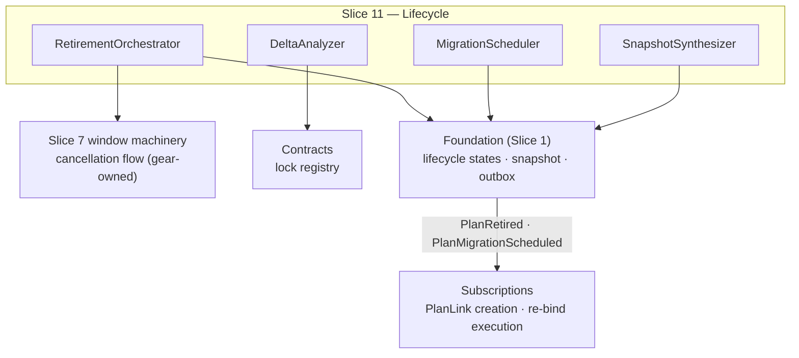

Created:  2026-08-24 by Virtuozzo International GmbH
Updated:  2026-08-24 by Virtuozzo International GmbH

<!-- CONFLUENCE_TITLE: [BSS]: Pricing — Lifecycle: Retirement & Migration (Design, Slice 11) -->
<!-- Related: ../PRD.md, ../DESIGN.md, ./01-foundation.md | Owners: BSS Product Catalog team -->

# DESIGN — Lifecycle: Retirement & Migration (Slice 11)

<!-- toc -->

- [1. Context](#1-context)
  - [1.1 Overview](#11-overview)
  - [1.2 Purpose](#12-purpose)
  - [1.3 Actors](#13-actors)
  - [1.4 References](#14-references)
  - [1.5 Scope](#15-scope)
  - [1.6 Constraints & Assumptions](#16-constraints--assumptions)
  - [1.7 Naming & Design-Introduced Names](#17-naming--design-introduced-names)
  - [1.8 Context & Dependencies](#18-context--dependencies)
- [2. Actor Flows (CDSL)](#2-actor-flows-cdsl)
  - [Retire a Plan](#retire-a-plan)
  - [Schedule a Migration](#schedule-a-migration)
- [3. Processes / Business Logic (CDSL)](#3-processes--business-logic-cdsl)
  - [Retirement](#retirement)
  - [Scheduled Migration](#scheduled-migration)
  - [Migration Safety Deltas](#migration-safety-deltas)
  - [Legacy Snapshot Synthesis](#legacy-snapshot-synthesis)
  - [Contract-Lock Protection](#contract-lock-protection)
- [4. States (CDSL)](#4-states-cdsl)
  - [Migration Schedule State Machine](#migration-schedule-state-machine)
- [5. API Surface](#5-api-surface)
- [6. Data Model](#6-data-model)
- [7. Events & Alarms](#7-events--alarms)
- [8. Definitions of Done](#8-definitions-of-done)
  - [Retirement DoD](#retirement-dod)
  - [Migration DoD](#migration-dod)
  - [Snapshot Synthesis DoD](#snapshot-synthesis-dod)
  - [Contract Lock DoD](#contract-lock-dod)
- [9. Acceptance Criteria](#9-acceptance-criteria)
- [10. Non-Functional Considerations](#10-non-functional-considerations)

<!-- /toc -->

## 1. Context

### 1.1 Overview

This slice owns the **end of a plan's life**: **retirement** (block new subscriptions,
preserve in-flight snapshots, trigger the Slice 7-owned window-cancellation flow for
not-yet-active windows **of scope keys with no in-flight subscribers — continuing-coverage
windows are kept, D-51** — never merely marking them invalid), **scheduled migration** to a
published target (`PlanMigrationScheduled` → Subscriptions creates effective-dated
`PlanLink`s; idempotent retry; cancellable before the effective date), **migration safety
deltas** (contract-locked exclusion, entitlement/add-on blocking deltas), and **legacy
snapshot synthesis** (`migrated-origin` — freezing a `pricingSnapshotRef` for subscriptions
that never had one). Posted invoices are never mutated; every path is snapshot/`PlanLink`
only.

**Traces to**: `cpt-cf-bss-pricing-fr-plan-retirement`,
`cpt-cf-bss-pricing-fr-scheduled-migration`, `cpt-cf-bss-pricing-fr-migration-safety`,
`cpt-cf-bss-pricing-fr-contract-locked-protection`

### 1.2 Purpose

Let operators sunset and consolidate plans — the PRD's lifecycle-safety goal — with three
hard guarantees: an in-flight subscriber's economics never silently change (frozen snapshot
or explicit migration), a posted invoice is never touched, and a contract lock is never
broken. Industry-standard grandfathering/notice policies compose from this slice + Slice 7's
cutover, without SKU cloning.

### 1.3 Actors

| Actor | Role in Slice |
|-------|---------------|
| `cpt-cf-bss-pricing-actor-catalog-admin` | Orchestrates retirement + migration (`plan × retire` / `plan × migrate`) |
| `cpt-cf-bss-pricing-actor-finance-manager` | Confirms cancelled-window warnings; picks targets |
| `cpt-cf-bss-pricing-actor-subscriptions` | Consumes `PlanMigrationScheduled`; creates `PlanLink`s; executes re-binds |
| `cpt-cf-bss-pricing-actor-contracts` | Supplies contract locks (excluded set) |
| `cpt-cf-bss-pricing-actor-billing` | Never re-queried for posted periods (immutability boundary) |

### 1.4 References

- **PRD**: [PRD.md](../PRD.md) — §6.8, §17.5 (change mechanisms), §15 (migration notice — decided, D-49)
- **Design**: [01-foundation.md](./01-foundation.md) — versioning/immutability (§4.3); [07-pricewindow-linkage.md](./07-pricewindow-linkage.md) — grandfathering, window mechanics; [05-governance.md](./05-governance.md) — `plan × retire/migrate` authz
- **Dependencies**: Slices 1–7 (published plans, windows, grandfathering, governance). Retirement invokes Slice 7's window-cancellation flow (windows are gear-owned per D-03).

### 1.5 Scope

**In scope**: retirement (state transition + window-cancellation trigger + operator warning);
migration scheduling/cancellation + idempotent retry semantics; blocking-delta computation
(contract locks, entitlement overflow, add-on validity); `migrated-origin` snapshot synthesis
with provenance.

**Out of scope**: `PlanLink` **execution** and subscription state (Subscriptions); the window
cancellation **mechanics** (Slice 7 owns the window machinery — we invoke); posted-invoice anything
(Billing); the grandfathering cutover itself (Slice 7 — a migration alternative). The
customer-notice lead-time **value** is tenant policy (D-49: 60-day default floor in
`pricing_policy_object`); this slice enforces it at scheduling (M5, `inst-mg-target`).

### 1.6 Constraints & Assumptions

Inherits Foundation C-set. Slice-11-specific:

| # | Topic | Assumption (default) | Source |
|---|-------|----------------------|--------|
| M1 | No invoice mutation | 100% of migrations use snapshot/`PlanLink` paths; nothing re-opens a posted period | PRD §1.3 |
| M2 | Idempotent schedule | Re-triggering a migration produces no duplicate `PlanLink` requests for already-processed subscriptions (dedup key = `(migration_id, subscription)`) | PRD §6.8 |
| M3 | Cancellation boundary | Cancel-before-effective invalidates the scheduled event without touching already-migrated subscriptions | PRD §6.8 |
| M4 | Synthesis instant | Legacy synthesis freezes the published state **as of the per-trigger instant `t` (UTC), frozen at execution** — `migration`: the **migration effective timestamp**; `first-rating`: the subscription's **earliest unrated usage timestamp** (the PRD AC's definition, restated design-side by D-81); provenance recorded (`migrated-origin`) | PRD §6.8; D-81 |
| M5 | Notice period | **Decided (D-49, 2026-07-28)**: configurable per tenant with a **60-day default floor**, validated at scheduling (`effectiveAt >= announcement + configured notice`; tenants may raise, never silently lower); the notice value lives in `pricing_policy_object` | PRD §15, D-49 |

### 1.7 Naming & Design-Introduced Names

| Name | Meaning |
|------|---------|
| `RetirementOrchestrator` | The retire transition + Slice 7 window-cancellation trigger + operator warning surface |
| `MigrationScheduler` | Creates/cancels migration schedules; emits `PlanMigrationScheduled`; owns M2 idempotency |
| `DeltaAnalyzer` | Computes blocking deltas: contract-locked set, entitlement overflow, add-on validity |
| `SnapshotSynthesizer` | Builds + freezes a `migrated-origin` `pricingSnapshotRef` with provenance, and serves it on the D-102 read surface — the **only** per-subscription snapshot the catalog composes (the named exception to D-30's Tariffs-composes rule; `inst-sy-surface`) **Tier 2 is struck, and tier 1 is not (D-330, 2026-08-16).** D-76/D-81's reference-set lookup read the governed backdated store, and historical import is out of scope, so there is no second tier: the lookup is live history or fail closed. The 2026-08-07 strand recorded tier 2 as unbuilt and the seam as worth writing; it is now decided instead, and no store is owed. **Tier 1 — reconstructing a snapshot for a subscription whose price this catalog *did* author — is untouched by that, and is blocked by something else entirely**: `SynthesisService::synthesize` has no production caller, because `SynthesisRequest` needs a subscription reference and frozen market keys this gear cannot enumerate (D-327). That stays open on the D-79 lane; the strike neither closes nor worsens it. |

### 1.8 Context & Dependencies

## 2. Actor Flows (CDSL)

### Retire a Plan

- [ ] `p1` - **ID**: `cpt-cf-bss-pricing-flow-plan-retire`

**Actor**: `cpt-cf-bss-pricing-actor-catalog-admin` (`plan × retire`)

**Success Scenarios**:
- The plan transitions `published → retired`: new subscriptions blocked (sellability gate reads the state), existing snapshots preserved, `PlanRetired` emitted, Slice 7's cancellation flow invoked per not-yet-active window (each emitting `PriceWindowCancelled` + driving cache eviction)
- The operator is warned with the list of windows to be cancelled **before** confirm

**Error Scenarios**:
- Retire with an in-flight migration targeting this plan → `RETIRE_TARGET_OF_MIGRATION` (409)
- Retire while the plan is referenced as a bundle component or as an add-on price-override target → `RETIRE_PLAN_REFERENCED` (409, references enumerated)

**Steps**:
1. [ ] - `p1` - API: POST /bss-pricing/v1/plans/{planId}/retire (dry-run first: returns the cancelled-window preview **and any cutover unit to be unwound**, D-05). **Retirement is terminal for revisioning (normative, D-146, 2026-08-02):** afterwards every attempt to open a successor revision on the plan, or to re-publish it, answers `PLAN_RETIRED_NO_SUCCESSOR` (422 — Foundation-owned §3.3, referenced here and never redefined; the plan-side statement is [`02-plan-definition.md`](./02-plan-definition.md) `inst-pl-norollback`). The refusal used to arrive as `LIFECYCLE_FORBIDDEN`, shared with three other refusals — one of which names a **different and available** action, go and edit the draft you already hold. This one names none: a retired plan can never publish again, so any successor is unpublishable by construction, and an operator who cannot tell the two apart cannot know whether there is something else to do instead - `inst-rt-api`
2. [ ] - `p1` - Confirm: transition the plan state — the flip targets the plan's **single current published revision row** (`published → retired`; D-90 makes it unique by construction); **invoke** Slice 7's window-cancellation flow for not-yet-active windows (never merely mark invalid) — one local transaction with the state flip (D-03) — **but only for scope keys with no in-flight subscribers (D-51, 2026-07-28 review fix; the predicate resolves through the D-79 Subscriptions inbound lane, re-resolved inside this transaction, fail-closed on lane outage or timeout: windows kept). One call, a presence map (D-131, 2026-08-01 review fix):** retirement submits the union of its keys' price-id sets in a **single** lane call and reads a **per-price-id presence map** back — the lane's pre-D-131 "count over the submitted set" answered only "does this plan have any subscriber at all", under which retirement would cancel nothing whenever one key is occupied, while the per-key alternative would put N synchronous cross-gear round trips inside this ACID transaction (N = keys × markets), holding the price/window row locks and the audit chain segment across the fan-out: a scheduled window that is the **continuing coverage** of a key with in-flight subscribers (e.g. the supersession successor extending past the active window's `effectiveTo`) is **kept**, because cancelling it opens the trailing void no gap-check can see — the active window expires at its natural end and every arrears charge/renewal after it would fail closed (`inst-ws-expire`). Retirement stops **selling**, never **rating**: not-sellable comes from the lifecycle predicate of the sellability gate (Slice 7 predicate (4)), so preserving coverage windows gives away nothing. Active windows run to their natural end for in-flight subscribers. A **live cutover unit is unwound** in the same transaction (Slice 7 `inst-co-retirement-unwind`, D-05): predecessor window restored to its pre-cutover `effectiveTo`, scheduled copy/successor cancelled — the unwind restores the predecessor's coverage, so D-05 and D-51 compose (the unwind never leaves a trailing void either); retirement with a live cutover is **always material** (Slice 5). An open **draft revision row** of the plan (D-56) is **abandoned in the same transaction** — flipped to the terminal `abandoned` state ([`02-plan-definition.md`](./02-plan-definition.md) `inst-pl-abandon`, **D-145**, 2026-08-02), its revision-scoped child copies dropped and the flip audited exactly as the deletion it replaces was. The row is not deleted, because deletion frees the revision number for re-minting and a stale ETag then passes against a *different* row of the same name; the tombstone keeps `(plan_id, revision)` a durable identity at the cost of a gap in the plan's numbering. A retired plan can never publish a pending revision, and no new revision can open on it (the plan state machine has no `retired → draft` edge; 2026-07-30 review fix, L-9). **The lane is absent in the implementation, so this step cancels nothing (normative, D-182, 2026-08-04, found while building Slice 7's window routes):** the D-79 lane has no client, no contract type and no counterpart gear in the built system, and D-182 makes an absent lane D-131's fail-closed case — under which every key reads as **occupied**, so retirement keeps every window rather than cancelling on the keys the design set would have let it cancel on. That is the same absent lane Slice 7's `inst-fg-trailing` fails closed on, inherited here with the **opposite sign**: there it refuses a cancel, here it declines to perform one, and both directions preserve coverage. The behaviour becomes what this step describes when the lane client lands. **And one guard this step will then need does not exist (D-316, 2026-08-15):** Slice 7's `inst-co-bounds` bound — a grandfathered generation's coverage unbroken across `[max(cohort, now), grandfatherUntil + the margin)` — is evaluated on the three window-surface acts and **not** on the cancellations this step performs, which reach the window store directly. Cancelling a grandfathered generation's sole scheduled window is therefore refused by nothing, and strands exactly the in-flight population D-04 exists to protect; it is inert today only because the absent lane keeps the condemned list empty, so the defect arrives **with** the lane rather than being closed by it. The guard needs the plan shape and the act's key set and is owed to the group that lands the lane. **The first clause has a source to read as of D-338 (2026-08-17):** the pre-cutover bound this cancellation has to restore is recorded on the cutover's own commit and addressable through the audit store's query-by-subject read - `inst-rt-cancel`
3. [ ] - `p1` - Emit `PlanRetired`. **Retirement is a publish unit (normative, D-128, 2026-08-01 review fix):** the commit runs the Foundation engine path — validation → pending `CatalogVersion` ref → **plan-subject re-projection** → warm (Foundation §4.2) — because the plan's `lifecycle_state` **is** sellability predicate (4) and `inst-sg-pinned` requires that predicate to be evaluable from the *pinned* read model. The pre-D-128 wording ("the read model flags the plan not-sellable") described an in-place mutation of a frozen version, which D-85/D-99 forbid, and PRD §17.5's increment table carried no retirement class at all — so nothing made the fact addressable. It is the one lagging fact that cannot self-heal: a retired plan can never publish again (`inst-pl-norollback`, and `inst-rt-cancel` abandons its draft revision — D-145), so no later unit would ever re-project it and the read model would advertise it as sellable **permanently**; and under D-51 a plan with in-flight subscribers on every key cancels no window either, so the D-99 window path does not cover it. The projector correspondingly sources the plan's **current** revision, `published` **or `retired`** (Foundation §4.4/§3.7), so the retired plan keeps a resolvable delta for the in-flight subscribers this slice preserves coverage for - `inst-rt-event`
4. [ ] - `p1` - **RETURN** 202; existing subscription snapshots untouched (M1) - `inst-rt-return`

### Schedule a Migration

- [ ] `p1` - **ID**: `cpt-cf-bss-pricing-flow-migration-schedule`

**Actor**: `cpt-cf-bss-pricing-actor-catalog-admin` (`plan × migrate`)

**Success Scenarios**:
- A migration from a (typically retiring) plan to a **published** target is scheduled with an effective date; `DeltaAnalyzer` reports blocking deltas; `PlanMigrationScheduled` emits for Subscriptions to create effective-dated `PlanLink`s
- Retry is idempotent (M2); cancel-before-effective invalidates cleanly (M3)

**Error Scenarios**:
- Unpublished/retired target → `MIGRATION_TARGET_INVALID` (422)
- Unresolved blocking deltas (entitlement overflow, invalid add-ons) → `MIGRATION_BLOCKED` (422, deltas enumerated)

**Steps**:
1. [ ] - `p1` - API: POST /bss-pricing/v1/migrations (**client-supplied `migration_id`**, source plan/revision, target `planId`, effective date, scope) — the create is idempotent on `migration_id` (mirroring Slice 12's `run_id` pattern): a timed-out client retry returns the original schedule, never a second one - `inst-ms-api`
2. [ ] - `p1` - `DeltaAnalyzer` computes: contract-locked subscriptions (reported, **excluded**, lock never broken), entitlement deltas, add-on deltas (invalid / missing-required) — blocking deltas must be resolved or explicitly scoped out - `inst-ms-deltas`
3. [ ] - `p1` - Emit `PlanMigrationScheduled` (idempotency key = `migration_id`; consumer dedup per `(migration_id, subscription)`, M2) - `inst-ms-emit`
4. [ ] - `p1` - Legacy subscriptions without a `pricingSnapshotRef` route through `SnapshotSynthesizer` (below) before their `PlanLink` is requested - `inst-ms-synth`
5. [ ] - `p1` - **RETURN** 202 (schedule ref); DELETE /bss-pricing/v1/migrations/{id} before the effective date cancels (M3) - `inst-ms-return`

## 3. Processes / Business Logic (CDSL)

### Retirement

- [ ] `p1` - **ID**: `cpt-cf-bss-pricing-algo-retirement`

**Steps**:
1. [ ] - `p1` - `published → retired` blocks **new** subscriptions only; in-flight subscribers keep resolving their frozen snapshots and active windows until renewal/migration - `inst-re-block`
2. [ ] - `p1` - Not-yet-active windows **of keys with no in-flight subscribers**: Slice 7's cancellation flow is **invoked** (each cancellation emits `PriceWindowCancelled` and drives its cache-eviction path) — marking-invalid without the event is forbidden (consumers would keep warm caches). A scheduled window that continues coverage for a key **with** in-flight subscribers is kept, not cancelled (D-51 — `inst-rt-cancel`); the confirm screen labels kept windows distinctly from cancelled ones - `inst-re-cancelflow`
3. [ ] - `p1` - The operator confirm screen lists every window to be cancelled (dry-run) - `inst-re-warn`
4. [ ] - `p1` - Retirement is a governed mutation (Slice 5): `plan × retire`, audited; retirement of a plan with active subscribers SHOULD pair with a migration schedule or an explicit grandfathering decision. **Always material (normative, D-109, 2026-07-31 review fix):** retirement is a **registered always-material trigger** — unconditionally, not only when a live cutover unit must be unwound (D-05, which was the only registered case). It cancels every not-yet-active window on its zero-subscriber keys in one call, which is exactly the act D-62 made two-person for a *single* window ("one operator could delete the two-person-approved scheduled successor"), it stops all new sales for the plan, and it is **irreversible** — the plan state machine has no `retired → published` edge (S2 `inst-pl-norollback`) and the draft revision is abandoned with it (`inst-rt-cancel`, D-145). A dry-run confirm screen is not a second principal. The approving `FinanceReviewer` already holds `plan × read`, so the D-61 reviewability invariant is satisfied without a new grant - `inst-re-governed`
5. [ ] - `p1` - **Referential guard:** retirement is rejected while the plan is referenced as a **bundle component** (`sum_of_parts`/`own_price` composition, Slice 8) or as an **add-on price-override target** (Slice 2) — the dry-run enumerates the referencing bundles/plans; remediation (re-compose or retire the referrer first) precedes the retire. Plans listing the retiree in `allowedChangeTargets` are enumerated as a **warning** (not a block, D-24): the edge goes inert — Subscriptions re-checks the target's lifecycle state at change time. `PriceOverlays` targeting the retiree are likewise enumerated as a **warning** (D-31): they go dangling-and-flagged (`pricing.priceoverlay.target_retired`), staying evaluable for in-flight subscribers - `inst-re-references`

### Scheduled Migration

- [ ] `p1` - **ID**: `cpt-cf-bss-pricing-algo-migration`

**Steps**:
1. [ ] - `p1` - Target MUST be a **published** plan; the schedule carries source revision, target, effective date, and scope (all / filtered subscriptions). **Notice validation (D-49):** scheduling validates `effectiveAt` >= the `PlanMigrationScheduled` announcement instant (the scheduling commit) + the tenant's configured notice period (default floor **60 days**, from `pricing_policy_object`); a shorter lead time fails (`MIGRATION_NOTICE_TOO_SHORT`, 422) — there is no silent override; an emergency shorter migration requires an explicit audited policy change first (itself material, D-10 pattern) - `inst-mg-target`
2. [ ] - `p1` - The catalog emits the schedule; **Subscriptions** creates effective-dated `PlanLink`s and executes — the catalog never mutates a subscription and never touches a posted invoice (M1). A migration **never charges** the target plan's `one_time_setup` row — whether or not the origin plan carried one (setup is tied to subscription **activation**, once per subscription lifetime — Slice 2 `inst-cs-setup-timing`), and a migrated subscription enters the target's **first non-trial phase** (D-39 — a migration never grants a new `trial`; entering an `intro` phase is allowed; the entry-phase rule rides the `PlanMigrationScheduled` contract) - `inst-mg-boundary`
3. [ ] - `p1` - **Idempotency (M2):** re-triggering the same `migration_id` re-emits without duplicating `PlanLink` requests for already-processed subscriptions (the event carries the dedup contract; Subscriptions honors `(migration_id, subscription)`) - `inst-mg-idem`
4. [ ] - `p1` - **Cancellation (M3, D-38):** the schedule invalidates via read-model state + audit (no new event name, per §7); already-migrated subscriptions are unaffected. **Propagation is a state handshake, not a wall clock**: Subscriptions MUST re-read the schedule state immediately **before beginning execution** and per processing batch thereafter — it never starts (or continues) against a cancelled record, closing the T-ε race; the catalog accepts a cancel in `scheduled`/`in_progress` and rejects only `completed` (`MIGRATION_COMPLETED`) - `inst-mg-cancel`

### Migration Safety Deltas

- [ ] `p2` - **ID**: `cpt-cf-bss-pricing-algo-migration-deltas`

**Steps**:
1. [ ] - `p2` - **Contract-locked** subscriptions: reported and **excluded** — the lock is never broken (Contracts supplies the lock set) - `inst-md-locks`
2. [ ] - `p2` - **Entitlement deltas**: target grants < source grants (overflow risk) surface as **blocking** deltas; the operator resolves (change target / scope out / accept via explicit override where policy allows) - **The judgement is built and reads an empty target set, and the reason is a wiring gap rather than an absent store (D-252 as corrected 2026-08-08):** the target's grants are **here** — `pricing_plan.entitlement_grants` (`pricing_plan`'s migration, D-41/`inst-gs-shape`), typed `EntitlementGrants`, and already loaded by `target_shape`'s own `plan_repo::load_current` call — and the function nonetheless reports `Vec::new()`. Two halves of the fix are not symmetrical: the set's **`quotas`** map onto the analyzer's `(grantKey, total)` vocabulary exactly, while its **`feature_flags`** do not — a flag the target drops is an entitlement loss that neither `false` nor "absent is zero" can state as a total — and the **`per_phase`** axis has no operand, the subject side carrying no phase to select a set by. Those two are settled by **[D-253](../DECISIONS.md#d-253-m-the-entitlement-overflow-class-needed-a-vocabulary-and-two-halves-of-it-were-not-plumbing)** (2026-08-08, built): every key is **namespaced** — `quota:` or `flag:` — because `GrantSet` permits a quota and a flag of the same name and a flat merge would silently make them one entry; a granted flag is `1` and a withheld or absent one `0`, so "absent is zero" and `target < source` together state a dropped capability as `0 < 1`; and a phased plan is measured at the **minimum across its phases**, because a migrated subscriber occupies every phase in turn and the plan-level set alone would hide the trial that grants less. An unphased plan is measured at its plan-level set. **Subscriptions owes the same vocabulary on the source side** — the comparison is between two key sets, and two spellings would make every subscriber read as no-overflow. **What keeps the class silent end to end is the *subject* side**, not the target: source-side totals come from Subscriptions, which has no crate here and enumerates nothing, so this class rests on the same unresolved subject set `inst-cl-source` marks. The judgement stays built rather than deleted — it is correct, it costs nothing, and deleting it would put the same reasoning back in a later slice's way. *(D-252 originally recorded the store as absent and classified it under [D-251](../DECISIONS.md#d-251-h-what-an-absent-cross-gear-dependency-means-stated-once-instead-of-a-fourth-time) clause (2); both are withdrawn — the store landed in a concurrent strand the same day, and nothing cross-gear is missing on the target side at all.)* - `inst-md-entitlements`
3. [ ] - `p2` - **Add-on deltas**: subscribers whose add-ons become invalid on the target, or who lack a target-required add-on — blocking - `inst-md-addons`
3a. [ ] - `p1` - **Boundary deltas (K3 enforcement):** for every in-scope subscription, the target MUST cover the subscription's **frozen `(currency, region)` pair** with a published row of **matching frequency** — a mismatch is a **blocking** delta (cross-currency/region/frequency moves are cancel + new, never an in-place `PlanLink`). Additionally, subscribers bound to an `existing_grandfathered` row are surfaced **informationally** (migration takes them off legacy pricing — the operator sees the price impact before confirm) - `inst-md-boundary`
4. [ ] - `p2` - Deltas compute against the **published read model** of both plans (no draft reads) - `inst-md-published`

### Legacy Snapshot Synthesis

- [ ] `p2` - **ID**: `cpt-cf-bss-pricing-algo-snapshot-synthesis`

**Steps**:
1. [ ] - `p2` - For a subscription with **no** `pricingSnapshotRef`: synthesize one from the published plan state **as of the per-trigger instant `t`** (M4/D-81 — `migration`: the migration effective timestamp; `first-rating`: the earliest unrated usage timestamp; UTC, frozen at execution) - `inst-sy-freeze`
1a. [ ] - `p2` - **Row selection (normative, D-76, 2026-07-30 review fix; narrowed to one tier by D-330, 2026-08-16):** "published plan state as of `t`" is resolved by an explicit lookup per scope key of the subscription's frozen `(currency, region)`, never through window resolution alone. **(1) Live history first** — the `pricing_price` row (current **or** superseded, the supersession chain is retained in-table) whose `PriceWindow` covered `t` on that key; this reproduces exactly what rating would have resolved at `t`. **(2) ~~Reference set only if (1) is empty~~ — struck by D-330** (2026-08-16): the second tier read the governed backdated store, historical import is out of scope, and there is therefore no reference row to reach and no open-ended legacy interval (D-81) to reach it by. A subscription whose price this catalog never authored has no path here — it is re-papered onto a plan the catalog publishes. **(3) No live-history row ⇒ fail closed** into the migration exception list (or, for `first-rating`, the rating exception path per `inst-sy-firstrating`) — synthesis never guesses a price and never falls back to the current row. The provenance of the rule is kept because it explains the shape: D-76 wrote it as two tiers because "published plan state" resolved through windows that reference rows deliberately lacked, so the reference tier had to be named explicitly. With that tier struck, what survives is the half that was always about rows this catalog published — and the fail-closed clause, which is the whole safety property, is unchanged - `inst-sy-select`
1b. [ ] - `p1` - **Self-contained payload (normative, D-87, 2026-07-31 review fix; plan-level half added 2026-08-01, C-5):** the synthesized snapshot **materializes the complete evaluable row content** per resolved row — `model_kind`, the ordered band set / package fields, the evaluation-policy and S6 consumer-contract fields, `tax_inclusive`, the resolved rounding policy — **plus the plan-level content a line cannot be posted without**: the billing **descriptor set** (invoice line template, `glCode`, itemization rule — D-48's three descriptor-set fields; the other two v1 elements ride the rows above per D-110) and the resolved **entitlement grant set**. Without the plan-level half the payload was row-complete and invoice-incomplete: Billing has no `CatalogVersion` to fall back to on a `migrated-origin` ref by construction. (C-5 rested on a second leg too — a fully-legacy tier-2 key with no plan revision at all — and **that leg is struck with tier 2** by D-330, 2026-08-16. The first leg carries the rule on its own, which is why the rule does not move.) Materialized into the frozen payload beside the resolved ids. **The rule is untouched by D-330's strike of tier 2 (2026-08-16)** and this is the distinction that matters: what obliges a self-contained payload is that **no `CatalogVersion` backs a `migrated-origin` ref**, never where the row came from — so D-87's consumability argument survives verbatim while its premise that the payload's source may be an imported historical store does not. Rating/Tariffs evaluate a `migrated-origin` subscription **from this payload** and never resolve its ids through the read model: a resolved row's historical instant predates any useful pin and the ref is composed against no version at all, so **no `CatalogVersion` is recorded or required** on a `migrated-origin` ref (Foundation §4.4 names this the one deliberately non-version-pinned reference). Without this the frozen result was a set of ids rating could read nowhere — the rule existed, the consumption mechanism did not. **The payload carries the row's authored `includedAllowance` and no compiled artifact whatever (recorded 2026-08-15, not decided).** It renders the declaration as stored. **The AUTHORED band set is carried, and no compiled artifact is (normative, D-324, 2026-08-16 — this takes the decision the note below deliberately left open, on its second horn):** `bands`, with `fromQty`/`toQty`/`unitPriceNanoMinor` verbatim from the read model, `toQty: null` for D-17's open top, ascending by `fromQty` because `inst-tb-order` is the single read-side ordering guarantee and the table carries no ordinal. Rendered on **every** row, so an untiered row carries an empty array rather than no member: an absent member and an empty one must not differ by model kind, or a consumer has to know `inst-mk-required`'s placement matrix to read the document it was handed. Stated because the builder read `pricing_price` and never touched `pricing_price_tier_band`, so every synthesized `graduated`/`volume` line was frozen with **no price at all** — the placement matrix forbids both scalar money columns on those kinds, so no publishable row of them could ever have rendered a number. That is D-323's defect one class wider, two model kinds against one. The as-authored rule is grounded rather than chosen: `pricing_price_tier_band` holds the **authored** bands and D-130 makes the compile a projection that never writes back, so "as stored" and "as authored" are one read, and rendering the presented form would mean synthesis running the compile itself — freezing a compiled shape into a record that resolves through no `CatalogVersion` and therefore carries no compile version anyone could date it by. **No `allowanceMarker` and no third `*Unavailable` marker**: the marker is the compile's artifact, and a band set read on every row makes an empty array a fact rather than an unread set, which discharges the caveat the rate note below records. What this obliges of a consumer is named rather than buried: **Rating must apply the allowance compile itself** to a `migrated-origin` line declaring one, or the live path and the synthesized path answer differently for the same row — the read model publishes the presented form and this payload the authored one. **A `per_unit` row's money is the rate member, and it is named here (normative, D-323, 2026-08-15):** `unitRateNanoMinor`, carrying `pricing_price.unit_rate_nano` — D-311's wire spelling verbatim, and the read model's, so one number has one name whichever door a consumer read the row through. Stated because *"the complete evaluable row content"* above was written before D-311 split a rate out of `amount_minor`, and the builder went on rendering `amountMinor` alone: since `inst-mk-required`'s placement matrix does not merely permit but **forbids** `amount_minor` on a `per_unit` row, every synthesized `per_unit` line carried `"amountMinor": null` and no price anywhere — frozen INSERT-only into a record that resolves through no `CatalogVersion` and can never be corrected. It is rendered **as authored**, which is where this payload and the read model legitimately differ: the read model nulls its member of this name on an allowance-carrying row, the rate having been folded into the compiled top band, and this payload carries no compiled ladder at all — the preceding note — so the same nulling would take the row's only price away a second time. **No `*Unavailable` marker rides beside it**, unlike the grant set and the period bounds: those two report a set the payload could not *read*, whereas this column is read on every row and which money member carries the price follows from `model_kind`, which is in the payload - `inst-sy-payload`
1c. [ ] - `p1` - **Where consumers read it (normative, D-102, 2026-07-31 review fix):** because a `migrated-origin` ref resolves through **no** `CatalogVersion` by construction (`inst-sy-payload`, Foundation §4.4), the read-model contract cannot deliver it — and until this rule the payload had **no** read surface at all: it sat in `pricing_snapshot_provenance`, no slice exposed an endpoint, S5's endpoint map (which covers "every REST surface of Slices 2–12") had none, and none of the five §9.2 contracts carried it, while the PRD required *"Rating/Tariffs evaluate **from that payload**"* and `inst-sy-firstrating` has rating "retry against the frozen result". The surface is **`GET /bss-pricing/v1/migrated-origin-snapshots/{subscriptionRef}`** (§5, `plan × read`, service identity — the same authority as the read model; **tenant-bound like every read**: the `subscriptionRef` resolves only within the caller's `tenant_id` via the Foundation §2.2 SecureORM filter — stated explicitly because this is the one read surface whose authz object (`plan`) differs from its path object (a subscription), so row ownership is otherwise only inherited; 2026-07-31d review fix, N-3), returning the frozen payload + provenance; it is registered as an inbound lane of the Tariffs contract ([`../PRD.md`](../PRD.md) §9.2). **Ownership (the D-30 boundary, restated):** D-30 put snapshot **composition** in Tariffs and denied the catalog "per-subscription snapshot participation" — that statement is about the *customer-group resolution* case it was decided on. `migrated-origin` is the single, named exception and is exceptional for a reason: there is no live plan state and no `CatalogVersion` for Tariffs to compose from, only the catalog's own append-only history to resolve `t` against (D-76; its reference tier is struck by D-330, and the exception this instruction states rests on the absent `CatalogVersion`, which is unchanged). The catalog therefore composes **only** this ref, exposes it read-only, and composes no other per-subscription snapshot - `inst-sy-surface`
2. [ ] - `p2` - Provenance record: source `planId`/revision, resolved price ids, snapshot instant, trigger (`migration` | `first-rating`), acting principal — marked **`migrated-origin`** — **plus the selection tier each resolved id came from** (`source`, D-76 — now `live_history` alone, `historical_import` having been struck with the import flow by D-330, 2026-08-16; the field is kept rather than dropped, because a stored discriminator with one value still tells a reader which rule resolved the row and is the seam any later tier would land on) **and the materialized row-content payload (`inst-sy-payload`, D-87)**: an auditor reconstructing a disputed legacy charge must be able to see which published row was resolved without re-running the lookup, and rating must be able to charge without one - `inst-sy-provenance`
3. ~~[ ] - `p2` - Synthesis is the sanctioned **consumer** of the Slice 5 backdating path where historical reference rows are needed (D-13).~~ **Struck 2026-08-16 by [D-330](../DECISIONS.md)** — the instruction inst-sy-backdate leaves the design set with the Slice 5 flow it consumed ([`05-governance.md`](./05-governance.md) §2), and D-13's two controls go with it. The id is written without backticks here for the reason that record states: a backticked `inst-*` is a reference, and a reference to an id no bullet declares is a dangling one. **This strikes the consumer, not synthesis**: tier 1 above is untouched (D-330 cl. 3).
4. [ ] - `p1` - **`first-rating` trigger is never inline:** when Rating meets a subscription with no snapshot, the rating line **fails closed into the rating exception path**; synthesis then runs as a separate audited step (automated remediation job or operator), and rating **retries** against the frozen result. Synthesis never executes inline on the rating hot path (it is heavyweight, audited, and grant-gated). **Two thirds of this step are Rating's and only one is buildable here (2026-08-07):** the catalog states and enforces that synthesis is not inline; the **exception path** a snapshot-less rating line falls into and the **retry** against the frozen result are Rating's surfaces, and this gear has no rating plane at all. Recorded because the step reads as one owed behaviour and is two, split across gears - `inst-sy-firstrating`

### Contract-Lock Protection

- [ ] `p1` - **ID**: `cpt-cf-bss-pricing-algo-contract-lock`

**Steps**:
1. [ ] - `p1` - While an active contract references a plan revision, **structural mutation is rejected** (`CONTRACT_LOCKED`, 409) directing the operator to a new revision or contract expiry - `inst-cl-reject`
1a. [ ] - `p1` - **What the lock actually binds (normative, D-108, 2026-07-31 review fix):** the pre-D-108 wording was unenforceable in both directions. A published revision row is **immutable in content** by construction (Foundation §4.3), so "structural mutation of the referenced revision" named an operation that cannot occur — and `pricing_price` is deliberately attached to **`plan_id`, not to a revision** (D-56), so locking a revision protected no price at all. Therefore, explicitly: **(a) the lock is structural.** While an active contract references revision `R`, a **new** revision of that plan MUST NOT drop or re-shape anything `R` exposes that the contract's subscriptions resolve — the priced `(meter, dimensionKey)` line set, the phase chain, the required add-on set, the descriptor set — and the plan MUST NOT be **retired** (`CONTRACT_LOCKED`, 409, the referencing contracts enumerated); this is the guard the FR's rationale ("commercial terms must not be mutated out from under an active agreement") can actually enforce, and it composes with `inst-ph-terminal-stable`/`PHASE_IN_USE` rather than duplicating them. **(b) Price movement on the plan's keys is explicitly NOT blocked** — a supersession, a repricing run or a cutover on a key a locked subscription resolves proceeds normally, because the negotiated **rate** is Contracts-owned (PRD §13: *"Contracts — contract locks and negotiated RI-style reservation rates"*; S10 `inst-rv-fixture`) and resolves ahead of the catalog rate; the frozen snapshot covers the in-flight period, and Contracts' rate covers the renewal. Blocking repricing instead would let one contracted account freeze an entire market's annual reprice. State (b) as normative so nobody builds the block, and so the asymmetry with D-78 (where the catalog *did* have to act, because an overlay moves the **catalog's own** effective charge) is deliberate rather than accidental - `inst-cl-scope`
2. [ ] - `p1` - Contract-locked subscriptions are excluded from every scheduled migration (per `inst-md-locks`) - `inst-cl-exclude`
3. [ ] - `p1` - The lock set resolves from Contracts at validation time **and is re-resolved at execution start** (D-36 — schedule-time state can be months stale; `inst-mst-start`); an integration boundary — a lock-registry outage fails the mutation closed. **D-65's frozen exclusion set is a store invariant, not a caller convention (2026-08-07):** `pricing_migration.exclusion_snapshot` is co-nullable with `started_at` and a trigger arm refuses a second, *different* set, so a run whose exclusion set changed under it cannot exist — the shape the rest of this gear's guards take. **What the registry's absence means, normatively (D-251, 2026-08-07 — this instruction is what forced the rule):** the letter above ("an outage fails the mutation closed") is [D-251](../DECISIONS.md#d-251-h-what-an-absent-cross-gear-dependency-means-stated-once-instead-of-a-fourth-time) clause **(1)**, and it stands unchanged the day Contracts exists — a lane with no client is no more informative than one that timed out, and making the safe direction depend on the *reason* for silence is how a fail-safe becomes a coin flip. Today the registry is absent altogether, and the **scheduling** surface nonetheless stands under clause **(2)**, whose two conditions both bind and are both met: every subscription reads locked and is excluded, `MigrationSchedule::subjects_unresolved` **marks** the result rather than returning a bare empty set, and `POST /migrations/{id}/start` — the only surface that hands an exclusion set to Subscriptions — is **not mounted** (§5). Nothing about the surface changes when the registry arrives; the letter simply governs again - `inst-cl-source`

## 4. States (CDSL)

**Which rules an act placing a row in `published` owes is decided by the act, not by the
door (D-344).** Tier A — the per-row rules, and the supersession rules where the act
replaces a predecessor on a key — binds every such act without exception. Tier B — the
plan-shape set — binds an act that changes **which keys are current**; a same-key
replacement does not, which is why supersession runs Tier A alone. The joint fixture
gate guards acts whose content is authored rather than derived.

### Migration Schedule State Machine

- [ ] `p1` - **ID**: `cpt-cf-bss-pricing-state-migration`

**States**: scheduled, in_progress, completed, cancelled
**Initial State**: scheduled (deltas resolved, event emitted)

**Transitions**:
1. [ ] - `p1` - **FROM** scheduled **TO** in_progress **WHEN** the effective date has passed **and** Subscriptions calls `POST /bss-pricing/v1/migrations/{id}/start` (§5) — the transition is driven by that call, never by the wall clock alone, and the call's response body is how the exclusion set below reaches the executor. **Execution-time re-validation (D-36):** on this transition the catalog **re-resolves** the contract-lock set and the boundary deltas against fresh state — newly-locked subscriptions are **excluded** (appended to the completion record; a lock is never broken however stale the schedule), and a newly-broken boundary (the target lost its frozen `(currency, region)`/frequency coverage) fails that subscription's `PlanLink` **closed** into the migration exception list - `inst-mst-start`
2. [ ] - `p1` - **FROM** scheduled **TO** cancelled **WHEN** cancelled before the effective date (M3; nothing executed yet) - `inst-mst-cancel`
2a. [ ] - `p1` - **FROM** in_progress **TO** cancelled **WHEN** the operator stops a partially-executed run (D-34 — the stop-the-bleeding control): **further** `PlanLink` processing halts; already-migrated subscriptions are unaffected; the partial (migrated / not-attempted) sets are listed on the record. Only a **completed** run is uncancellable - `inst-mst-cancel-inflight`
3. [ ] - `p1` - **FROM** in_progress **TO** completed **WHEN** Subscriptions reports the scope processed via `POST /bss-pricing/v1/migrations/{id}/complete` (§5) — excluded contract-locked set listed on the completion record - `inst-mst-complete`

## 5. API Surface

| Method | Path | Purpose | Idempotency | AuthZ |
|--------|------|---------|-------------|-------|
| `POST` | `/bss-pricing/v1/plans/{planId}/retire` | Dry-run + confirm retirement (always-material, D-109 — the confirm **opens the approval unit**; an independent FinanceReviewer decides) | per revision | `plan × retire` |
| `POST` | `/bss-pricing/v1/migrations` | Schedule a migration (deltas computed) | `migration_id` (M2) | `plan × migrate` |
| `DELETE` | `/bss-pricing/v1/migrations/{id}` | Cancel a `scheduled` or `in_progress` migration (D-34; a `completed` one is uncancellable) | — | `plan × migrate` |
| `GET` | `/bss-pricing/v1/migrations/{id}` | Schedule + delta report + progress | — | `plan × read` |
| `POST` | `/bss-pricing/v1/migrations/{id}/start` | **Subscriptions declares execution start** — flips `scheduled → in_progress`, runs the D-36 execution-time re-validation, and **returns the exclusion set** (freshly contract-locked subscriptions + newly-broken-boundary subscriptions) that Subscriptions MUST honour. Calling it before the first `PlanLink` batch is a **normative obligation**, not an option | `migration_id` — **persist-and-replay** (D-65, sharpened 2026-07-31): the exclusion set is computed once at the first call, persisted per `migration_id`, and repeat calls return **that stored snapshot verbatim** without re-transitioning and without re-running the D-36 re-validation (a recompute could differ from the set the executor already honoured). **Built but deliberately NOT mounted (D-251, 2026-08-07)** — its storage half is built and probed (`migration_repo::start`, persist-and-replay included) and only the route is absent: `/start` must run D-36's execution-time re-resolution of the lock set and the boundary deltas, and that re-resolution has **no input** in this system (the Contracts registry is absent, no subscription is enumerable). A `/start` that returned an exclusion set computed from nothing would hand Subscriptions a set it would honour as authoritative — D-251 clause (1)'s case wearing clause (2)'s clothes. Unmounted rather than mounted-and-lying, and it is the unmounted-ness that satisfies clause (2) for `inst-cl-source`'s scheduling surface; `/complete` below is unmounted with it, as the other half of the same handshake | `plan × migrate` |
| `POST` | `/bss-pricing/v1/migrations/{id}/complete` | **Subscriptions reports the scope processed** — carries the processed / excluded / failed sets; flips `in_progress → completed` and closes the completion record | `migration_id` | `plan × migrate` |
| `GET` | `/bss-pricing/v1/migrated-origin-snapshots/{subscriptionRef}` | **The `migrated-origin` read surface** (D-102, `inst-sy-surface`): returns the frozen self-contained payload (D-87) + its provenance for a synthesized subscription; 404 before synthesis (rating's fail-closed exception path, `inst-sy-firstrating`). Called by the Rating/Tariffs **service identity** — the ref resolves through no `CatalogVersion`, so it cannot come off the read model | — | `plan × read` |

**Why these two exist (D-65, 2026-07-29 review fix).** Both non-terminal transitions were specified
with Subscriptions as the actor (`inst-mst-start`: "*and Subscriptions begins `PlanLink`
execution*"; `inst-mst-complete`: "*when Subscriptions reports the scope processed*") while the
surface offered only operator-facing `POST`/`DELETE`/`GET` — the handshake had no call. Without
it the catalog would flip on wall-clock alone, D-36's execution-time re-resolution would never
run, and the freshly re-resolved exclusion set would have no delivery path to the party that
executes: a subscription contract-locked between scheduling and `effective_at` would be
migrated, breaking `dod-contract-lock`'s "reported, never broken". The record would also stay
`scheduled` forever, so `pricing.migration.stalled` could not distinguish stalled from finished.

**Problem responses (RFC 9457):** `RETIRE_TARGET_OF_MIGRATION` (409),
`RETIRE_PLAN_REFERENCED` (409, references enumerated — bundle component / add-on
price-override target), `MIGRATION_NOTICE_TOO_SHORT` (422 — `effectiveAt` closer than the
configured notice period, D-49), `MIGRATION_TARGET_INVALID` (422), `MIGRATION_BLOCKED` (422, deltas
enumerated), `MIGRATION_COMPLETED` (409 — cancel of a completed run; replaces the pre-D-34 `MIGRATION_ALREADY_EFFECTIVE`), `CONTRACT_LOCKED` (409).

## 6. Data Model

Slice-owned tables (tenant-scoped, SecureORM per Foundation §2.2 authz-gate + S5 `inst-rb-pep`; `pricing_` prefix per Foundation §3.7):

**`pricing_migration`** (PK `migration_id`):

| Column | Type | Notes |
|--------|------|-------|
| `source_plan_id` / `source_revision` | `uuid`/`int` | the retiring side |
| `target_plan_id` | `uuid` | MUST be published |
| `effective_at` | `timestamptz` | UTC; M5 policy feeds it |
| `scope` | `jsonb` | all / filter; excluded contract-locked set recorded |
| `state` | `enum` | `scheduled \| in_progress \| completed \| cancelled` |
| `delta_report` | `jsonb` | contract-locked / entitlement / add-on deltas at schedule time |
| `announced_at` | `timestamptz` | **D-49's measurement point** — the notice floor is `effective_at - announced_at`, so the instant the announcement was made is stored rather than re-derived from the audit log |
| `exclusion_snapshot` | `jsonb` | **D-65's set, frozen at execution start.** Co-nullable with `started_at` and refused a second, *different* value by a trigger arm: D-36 re-resolves the lock set at start, and a run whose exclusion set could change under it is a run nobody can reconcile afterwards |
| `completion_record` | `jsonb` | `inst-mst-complete`'s outcome, and **D-34's partial set** — a cancel of an `in_progress` run lists what was already migrated, which is the whole of what makes the state recoverable |
| `created_at` / `created_by` / `started_at` / `completed_at` / `cancelled_at` | `timestamptz`/`text` | the audit and flip columns every guarded table of this gear carries |

Additions the table carries and this section had not listed, recorded rather than
presented as transcription (the treatment `pricing_bundle`'s migration `uq_pricing_bundle_plan`
received): **`chk_pricing_migration_distinct_plans`** — a migration whose source and
target are the same plan is refused physically, not only by the algorithm, because a
self-migration is the one shape that would pass every other check and move every
subscriber onto the plan they are already on.

**`pricing_snapshot_provenance`** (PK `provenance_id`) — the `migrated-origin` record.
**There is no `origin` column and there is deliberately not one**: nothing else is ever
stored in this table, so membership *is* the mark and a column with one permitted value
would be a tautology carrying a maintenance cost. **The table permits no `UPDATE` at
all** — not a frozen-column whitelist, which is what every other guarded table of this
gear carries — because a `migrated-origin` ref resolves through no `CatalogVersion`, so
this row is the only thing making that snapshot immutable. Columns:
`subscription_ref`, `source_plan_id`/`revision`, resolved price ids, `snapshot_instant`
(UTC), `trigger` (`migration | first-rating`), `acting_principal`, per resolved id its
**selection tier** `source` (`live_history` — D-76's second value `historical_import` struck with
the import flow, D-330), and the
**materialized `payload`** (`jsonb`: per resolved row — model kind, bands/package
fields, evaluation-policy + consumer-contract fields, tax basis, resolved rounding policy —
**plus the plan-level descriptor set and resolved grant set** (C-5, 2026-08-01: a
`migrated-origin` line has no `CatalogVersion` to fetch them from — C-5's second leg, a
fully-legacy tier-2 key with no plan revision, is struck with tier 2 by D-330);
D-87 — the self-contained artifact rating evaluates from and Billing posts from, never
re-resolving the ids).
~~Reference rows are read from the Slice-5-owned `pricing_historical_price` store.~~ **Struck by
D-330** (2026-08-16): that store leaves the design set with the import flow, so this slice reads
nothing outside its own and Slice 1's tables.

Retirement itself is the Foundation `pricing_plan.lifecycle_state` transition + audit;
window cancellations run in Slice 7's gear-owned window store (`pricing_price_window`).

## 7. Events & Alarms

Frozen names: **`PlanRetired`**, **`PlanMigrationScheduled`** (both in the Foundation event
set; the migration-cancelled signal rides the schedule's read-model state + audit, not a new
event name). Alarms: `pricing.migration.stalled` (Warn — `in_progress` past an expected
completion horizon), `pricing.migration.blocked_total` (Info counter — schedule attempts
rejected with `MIGRATION_BLOCKED`; unresolved blocking deltas never persist a schedule, so
this counts rejections, not waiting schedules).

## 8. Definitions of Done

### Retirement DoD

- [ ] `p1` - **ID**: `cpt-cf-bss-pricing-dod-retirement`

Retirement **MUST** be an **always-material** change (D-109 — an irreversible, sales-stopping,
window-cancelling operation carries the same two-person requirement D-62 put on a single window
cancel) **and a publish unit through the Foundation engine** (D-128, `inst-rt-event`: pending
`CatalogVersion` ref + plan-subject re-projection + warm, with `lifecycle_state` a projected
plan-subject field — otherwise sellability predicate (4) never learns of it from the pin, and a
retired plan can never publish again to correct that), block new subscriptions, preserve
existing snapshots, emit `PlanRetired`,
and trigger Slice 7's gear-owned window-cancellation flow per not-yet-active window **of a
scope key with no in-flight subscribers — a continuing-coverage window of a key with
in-flight subscribers is kept, never cancelled (D-51)** (one local transaction, D-03; with
`PriceWindowCancelled` + cache eviction; never mark-invalid), warning the operator with the
cancellation list — kept windows labelled distinctly from cancelled ones — before confirm.

**Implements**: `cpt-cf-bss-pricing-flow-plan-retire`, `cpt-cf-bss-pricing-algo-retirement`

**Touches**:
- API: `POST /bss-pricing/v1/plans/{planId}/retire`
- DB: `pricing_plan.lifecycle_state`, `pricing_price_window`
- Entities: `RetirementOrchestrator`

### Migration DoD

- [ ] `p1` - **ID**: `cpt-cf-bss-pricing-dod-migration`

Scheduled migration **MUST** target a published plan, emit `PlanMigrationScheduled` for
`PlanLink` creation without posted-invoice mutation, retry idempotently (no duplicate
`PlanLink` requests), and cancel-before-effective without affecting already-migrated
subscriptions.

**Implements**: `cpt-cf-bss-pricing-flow-migration-schedule`, `cpt-cf-bss-pricing-algo-migration`, `cpt-cf-bss-pricing-state-migration`

**Touches**:
- API: `POST/DELETE /bss-pricing/v1/migrations*`
- DB: `pricing_migration`
- Entities: `MigrationScheduler`

### Snapshot Synthesis DoD

- [ ] `p2` - **ID**: `cpt-cf-bss-pricing-dod-snapshot-synthesis`

For a legacy subscription without a snapshot, the system **MUST** synthesize and freeze a
`migrated-origin` `pricingSnapshotRef` from published state as of the per-trigger instant
(D-81: the migration effective timestamp for `migration`, the earliest unrated usage
timestamp for `first-rating`; UTC, frozen at execution), selecting each row by the live-history rule — the
live/superseded `pricing_price` row whose window covered `t`, else **fail closed**
(`inst-sy-select`, D-76 as narrowed by D-330: the reference tier is struck) — with the full provenance record, including the selection tier per resolved id **and
the materialized self-contained payload rating evaluates from and Billing posts from without
resolving the ids through the read model or any `CatalogVersion` — row content **plus** the
plan-level descriptor set and resolved grant set (`inst-sy-payload`, D-87 + C-5)**, served on the
**named read surface** `GET /bss-pricing/v1/migrated-origin-snapshots/{subscriptionRef}` under
`plan × read` and registered as a §9.2 Tariffs-contract lane (D-102, `inst-sy-surface` — the
payload previously had no reader-facing surface at all, and `migrated-origin` is the one
per-subscription snapshot the catalog composes, the named exception to D-30); rating a legacy
subscription **before**
synthesis completes fails closed into the exception path and retries against the frozen
result (the first-rating trigger, `inst-sy-firstrating`).

**Implements**: `cpt-cf-bss-pricing-algo-snapshot-synthesis`

**Touches**:
- DB: `pricing_snapshot_provenance`
- Entities: `SnapshotSynthesizer`

### Contract Lock DoD

- [ ] `p1` - **ID**: `cpt-cf-bss-pricing-dod-contract-lock`

While an active contract references a plan revision, a new revision **MUST NOT** drop or re-shape
what that revision exposes to the contract's subscriptions (priced `(meter, dimensionKey)` lines,
phase chain, required add-ons, descriptor set) and the plan **MUST NOT** be retired
(`CONTRACT_LOCKED`, 409, referencing contracts enumerated) — while **price movement on the
plan's keys is explicitly permitted**, the negotiated rate being Contracts-owned (D-108,
`inst-cl-scope`: the pre-D-108 "structural mutation of the referenced revision" named something
the append-only revision model makes impossible, and a revision owns no price row);
contract-locked subscriptions **MUST** be excluded from every
scheduled migration (reported, never broken); a lock-registry outage fails closed. The delta
report **MUST** classify locked, entitlement, add-on, **and boundary** deltas (a target
missing the frozen `(currency, region)` or frequency row is a **blocking** delta,
`inst-md-boundary`).

**Implements**: `cpt-cf-bss-pricing-algo-contract-lock`, `cpt-cf-bss-pricing-algo-migration-deltas`

**Touches**:
- DB: `pricing_migration.delta_report`
- Entities: `DeltaAnalyzer`

## 9. Acceptance Criteria

Unit:

- [ ] Retire blocks new-subscription sellability but leaves existing snapshot resolution; migration target matrix (draft/retired target rejected); delta classification (locked/entitlement/add-on/boundary — a target missing the frozen `(currency, region)`/frequency row is blocking); cancel of a `completed` run rejected (`MIGRATION_COMPLETED`, D-34); synthesis provenance completeness

Integration (testcontainers):

- [ ] Retirement cancels scheduled windows only for scope keys with no in-flight subscribers (active ones run out), emits `PlanRetired`, and the operator dry-run labels kept vs cancelled windows (D-51); the presence decision comes from **one** lane call returning a per-price-id map, and a plan whose keys are mixed (some occupied, some not) cancels exactly the unoccupied ones (D-131 — a single union count could not distinguish them)
- [ ] Retirement is a publish unit (D-128): the retire commit returns a **pending** `CatalogVersion` ref and re-projects the plan subject; the sellability surface reports the plan not-sellable only at the next pin-eligible version, and a consumer pinned to the pre-retire version still reports it sellable (frozen versions never mutate). A retired plan with in-flight subscribers on **every** key — so no window is cancelled and no other unit fires — still becomes not-sellable at the pin, and a re-warm re-drive of that version still projects its rows (the projector sources the `retired` current revision), so an arrears charge after the retirement still resolves
- [ ] Retiring a plan whose key has in-flight subscribers keeps the continuing-coverage scheduled window (D-51): the active window expires at its natural end and an arrears charge after it still resolves — no trailing void opens
- [ ] Retiring a plan with an approved-not-yet-effective cutover unwinds it atomically: the predecessor window's `effectiveTo` is restored, copy/successor windows cancelled, the unit closed as unwound — no instant is left uncovered for in-flight subscribers; the retirement required two-person approval (always material) **(Unreachable as of 2026-08-07 and it is an owed *dependency*, not an owed test: Slice 7's `inst-co-retirement-unwind` has no implementation — `src/infra/cutover.rs` carries no unwind path at all — so D-05's callee does not exist. Slice 7's to build.)**
- [ ] A migration re-trigger with the same `migration_id` produces no duplicate `PlanLink` requests (consumer-side dedup contract honored)
- [ ] Cancel before effective invalidates; cancelling an `in_progress` run halts further processing with the partial sets listed (already-migrated unaffected); cancel of a `completed` run → 409 (D-34)
- [ ] At execution start the lock set + boundary deltas re-resolve: a subscription locked after scheduling is excluded (appended to the record); a target that lost coverage fails that subscription's `PlanLink` closed into the exception list (D-36)
- [ ] A migrated subscription enters the target's first non-trial phase — a target with a `trial` phase never grants a new trial (D-39)
- [ ] A legacy subscription gets a `migrated-origin` snapshot with provenance; a second synthesis attempt is idempotent (same frozen ref). **Keyed `(tenant_id, subscription_ref)` and deliberately excluding the trigger (2026-08-07):** D-81 gives `migration` and `first-rating` different instants, so a per-trigger key would let one subscription hold two different frozen prices with no rule saying which rating reads. "Same frozen ref" without saying *same as what* admits both readings, and only one of them is a snapshot
- [ ] Live-history selection (D-76 as narrowed by D-330): where the live supersession chain holds a window covering `t`, synthesis resolves **that** row (`source = live_history`); where it does not, it fails closed into the exception list — never onto the current row, and no longer onto a reference row, there being none
- [ ] ~~Tier 2 end-to-end (D-81 + D-87)~~ and ~~the still-published-plan import~~ — **struck by D-330** (2026-08-16): both exercised the governed backdated store. **D-87's half is not lost, it moved**: that the frozen payload carries the complete evaluable row content — bands, package fields, plan-level descriptor set and grant set — so rating charges and Billing posts without resolving an id through any `CatalogVersion`, is asserted on a **live-history** row by the criterion above and by `inst-sy-payload`'s own coverage, which is where it always belonged: the obligation follows from the absent version, not from the row's provenance
- [ ] Rating a snapshot-less legacy subscription fails closed into the exception path; after synthesis the retry succeeds against the frozen ref — **fetched from `GET /bss-pricing/v1/migrated-origin-snapshots/{subscriptionRef}`** under the Rating service identity (D-102): the response carries the complete evaluable payload, the call resolves no `CatalogVersion`, and the same GET before synthesis returns 404 (never a partial or guessed payload); a human principal without `plan × read` is denied + audited
- [ ] Contract lock scope (D-108): a **new revision** of a contract-locked plan that drops a priced `(meter, dimensionKey)` line, re-shapes the phase chain, removes a required add-on or strips the descriptor set → 409 `CONTRACT_LOCKED` with the contracts enumerated, and retiring the plan → 409; a **supersession / repricing run / cutover** on the same plan's keys **succeeds** (the negotiated rate is Contracts-owned) and the locked subscription's in-flight period still resolves its frozen snapshot; after lock expiry the structural change publishes
- [ ] Retirement is always material (D-109): a retire submitted by the plan's author blocks until an independent `FinanceReviewer` approves; a self-approval attempt returns 403 + an audit record; the dry-run preview is readable by the approver before the decision (D-61)

## 10. Non-Functional Considerations

- **Performance**: delta analysis is a batch computation at schedule time (not order-time); migration fan-out throughput is bounded by the event pipeline, with progress visible via the schedule state.
- **Observability**: `pricing_migrations{state}` gauge, `pricing_migration_excluded_locked_total`, `pricing_retirements_total`, stalled-migration alarm.
- **Security & AuthZ**: `plan × retire` / `plan × migrate` (Slice 5 catalog); retirement and migration are audited governed mutations; synthesis exercises no grant beyond those (the backdating grant it once invoked is struck with the import flow — D-330).
- **Risks & open items**: the enforced-migration notice period is **decided** (D-49 — configurable, 60-day default floor, validated at scheduling, M5); Subscriptions' `PlanLink` dedup contract must land jointly (the event carries the key; enforcement is theirs); the **D-79 in-flight-subscription lane** (PRD §9.2 lane 3) must land jointly too — until it does, the D-51 predicate has no input and retirement behaves as if every key had subscribers (the fail-closed posture); the SKU-retirement joint contract with the registry is **closed** (D-47, 2026-07-28 — registry vendored, no external counterparty: the registry never retires a referenced SKU per its `SkuReferenceCount` predicate; pricing flags + blocks new adoption per AC #82).
