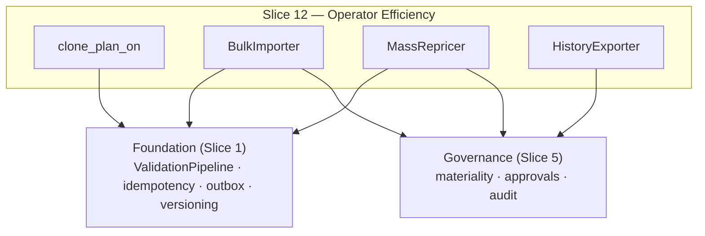

Created:  2026-08-24 by Virtuozzo International GmbH
Updated:  2026-08-24 by Virtuozzo International GmbH

<!-- CONFLUENCE_TITLE: [BSS]: Pricing — Operator Efficiency (Design, Slice 12) -->
<!-- Related: ../PRD.md, ../DESIGN.md, ./01-foundation.md | Owners: BSS Product Catalog team -->

# DESIGN — Operator Efficiency (Slice 12)

<!-- toc -->

- [1. Context](#1-context)
  - [1.1 Overview](#11-overview)
  - [1.2 Purpose](#12-purpose)
  - [1.3 Actors](#13-actors)
  - [1.4 References](#14-references)
  - [1.5 Scope](#15-scope)
  - [1.6 Constraints & Assumptions](#16-constraints--assumptions)
  - [1.7 Naming & Design-Introduced Names](#17-naming--design-introduced-names)
  - [1.8 Context & Dependencies](#18-context--dependencies)
- [2. Actor Flows (CDSL)](#2-actor-flows-cdsl)
  - [Bulk Price Import](#bulk-price-import)
  - [Mass Repricing Run](#mass-repricing-run)
- [3. Processes / Business Logic (CDSL)](#3-processes--business-logic-cdsl)
  - [Plan Clone](#plan-clone)
  - [Bulk Import (validate-all, commit-per-row)](#bulk-import-validate-all-commit-per-row)
  - [Mass Repricing](#mass-repricing)
  - [Price History and Export](#price-history-and-export)
- [4. States (CDSL)](#4-states-cdsl)
  - [Bulk Operation State Machine](#bulk-operation-state-machine)
- [5. API Surface](#5-api-surface)
- [6. Data Model](#6-data-model)
- [7. Events & Alarms](#7-events--alarms)
- [8. Definitions of Done](#8-definitions-of-done)
  - [Clone DoD](#clone-dod)
  - [Bulk Import DoD](#bulk-import-dod)
  - [Mass Repricing DoD](#mass-repricing-dod)
  - [History & Export DoD](#history--export-dod)
- [9. Acceptance Criteria](#9-acceptance-criteria)
- [10. Non-Functional Considerations](#10-non-functional-considerations)

<!-- /toc -->

## 1. Context

### 1.1 Overview

This slice owns the **operator-scale surfaces** over everything Slices 1–11 authored:
**plan clone** (new ids, eligibility/lock state deliberately not copied), **bulk price
import** (all-or-nothing **validation**, optimistic **per-row commit** with a conflict
report), **mass repricing** (idempotent, re-run-safe, deduplicated events, coalesced
`CatalogVersion`s, throughput SLO), and **price history + export** for Auditor/Finance.
No new authority: every bulk path enforces the same `plan × write/publish` authz, the same
validation pipeline, and the same materiality/approval policy as single-row authoring —
bulk is authoring at scale, not a bypass.

**Traces to**: `cpt-cf-bss-pricing-fr-plan-clone`, `cpt-cf-bss-pricing-fr-bulk-price-import`,
`cpt-cf-bss-pricing-fr-mass-repricing`, `cpt-cf-bss-pricing-fr-price-history-export`
(bulk `run_id` / import idempotency reuses the Foundation's dedup machinery —
`fr-mutation-idempotency` is claimed there, one owner per FR; 2026-07-31 P2 fix)

### 1.2 Purpose

Hit the PRD's ≥ 90% self-service goal for standard plan operations: annual repricing over
thousands of rows must be one safe, retryable operation that cannot silently overwrite a
concurrent manual edit, cannot flood consumers with duplicate events, and leaves the same
immutable per-row history a single edit would.

### 1.3 Actors

| Actor | Role in Slice |
|-------|---------------|
| `cpt-cf-bss-pricing-actor-finance-manager` | Runs clones, imports, repricing (`plan × write/publish`) |
| `cpt-cf-bss-pricing-actor-auditor` | Reads/exports price history (`audit × read` / `audit × export` since D-328 — **no longer shared with Finance under `plan × read`**, which is D-12's withdrawn reading; §5 states the amendment) and the audit trail (`audit × read/export`, Auditor-only) |
| `cpt-cf-bss-pricing-actor-finance-reviewer` | Approves material bulk changes (one approval per batch where policy allows) |
| `cpt-cf-bss-pricing-actor-catalog-registry` | Coalesces batched publishes into few `CatalogVersion`s |

### 1.4 References

- **PRD**: [PRD.md](../PRD.md) — §6.11, §7.1 (throughput/idempotency NFRs), §14 (provisional values)
- **Design**: [01-foundation.md](./01-foundation.md) — idempotency/ETag, outbox; [05-governance.md](./05-governance.md) — materiality on bulk, authz catalog; [10-advanced-primitives.md](./10-advanced-primitives.md) — clone's `discountRef` rule
- **Dependencies**: all prior slices (bulk operates over the full authored surface).

### 1.5 Scope

**In scope**: clone semantics (what copies, what resets); the two-phase bulk import
(validate-all → per-row optimistic commit + conflict report); mass-repricing idempotency +
event dedup + version coalescing + throughput SLO; history read/export SLO; the bulk
optimistic lock that interactive edits collide with (Foundation `fr-concurrent-edit`
counterpart).

**Out of scope**: the operator UI (wizard/tier editor/migration UI — frontend DESIGN);
approval mechanics (Slice 5 — bulk routes through the same policy); export **format**
details beyond the SLO (implementation).

### 1.6 Constraints & Assumptions

Inherits Foundation C-set. Slice-12-specific:

| # | Topic | Assumption (default) | Source |
|---|-------|----------------------|--------|
| O1 | Clone resets | `priceEligibility`/`grandfatherUntil` reset to defaults; contract locks never copy; `discountRef` copies only if it still resolves (else dropped + operator notice); `clonedFrom` recorded | PRD §6.11 |
| O2 | Import phases | Pre-commit validation is **all-or-nothing** (any invalid row blocks the batch with a per-row report); commit is **per-row** optimistic — an ETag conflict fails only that row (committed rows stand; conflicted rows listed for retry); never silent overwrite | PRD §6.11 |
| O3 | Repricing SLO | Idempotent re-run after partial failure; deduplicated events; ≥ 50 rows/sec — **ratified 2026-07-28** as the launch default, perf-test-verified against the tenant worst case vs the maintenance window | PRD §6.11/§14 |
| O4 | Idempotency TTL | Client-key replay returns the original result within the **24h TTL (ratified 2026-07-28)**; replay during an active bulk lock returns the original completed result regardless of lock state | PRD §6.11 |
| O5 | Version coalescing | A mass run MAY coalesce into one or few `CatalogVersion`s (registry batching, Foundation §4.2 step 5) | PRD §6.11 |

### 1.7 Naming & Design-Introduced Names

| Name | Meaning |
|------|---------|
| `clone_plan_on` | Deep-copies a plan into `draft` with new ids under the O1 reset rules, on the caller's transaction. A free function and not a type: it was `PlanCloner`, and a type holding a connection provider opens its own transaction, which nests silently inside the caller's and commits what the caller rolls back (D-276) |
| `BulkImporter` | The two-phase import: batch validation → per-row optimistic commit + conflict report; holds the bulk optimistic lock |
| `MassRepricer` | The idempotent bulk adjustment run (row-level progress journal; event dedup; version coalescing) |
| `HistoryExporter` | Chronological immutable history read + export under Auditor/Finance filters |

### 1.8 Context & Dependencies

## 2. Actor Flows (CDSL)

### Bulk Price Import

- [ ] `p2` - **ID**: `cpt-cf-bss-pricing-flow-bulk-import`

**Actor**: `cpt-cf-bss-pricing-actor-finance-manager` (`plan × write`)

**Success Scenarios**:
- Phase 1 validates every row against the full pipeline; any invalid row blocks the batch with a per-row report; Phase 2 takes optimistic per-row locks and commits row-by-row; conflicted rows (stale ETag / concurrent manual edit) fail individually and are listed for retry — committed rows stand

**Error Scenarios**:
- Any Phase-1 failure → `BULK_VALIDATION_FAILED` (422, per-row report; nothing committed)
- A row addressing a **published** row's scope key → fails Phase 1 per-row (`IMPORT_TARGETS_PUBLISHED` — the import is draft-plane authoring, D-118; published-price changes are a repricing run). **Whatever its content (D-287, 2026-08-09 — flagged for veto):** the clause below said "with changed content", and `PriceRepo::create_draft` refuses an occupied key either way, so the qualifier let Phase 1 pass a row the store then refuses
- An interactive edit hitting a row under the bulk lock → conflict naming the bulk operation (Foundation `fr-concurrent-edit`)
- A row carrying `tierQualificationWindow`, or an `includedAllowance` whose `rolloverPolicy` is **`carry`**, → fails Phase 1 per-row while Slice 10's remaining rules are unbuilt (**D-177**, [`10-advanced-primitives.md`](./10-advanced-primitives.md) §3: the refusal binds **every** authoring path, and this is the second one onto the same draft plane — a rule that lives on one surface is not a rule). **Narrowed 2026-08-15:** `includedAllowance {N, none}` is **imported like any other content** — the six `inst-ac-gate` refusals judge it row-locally in the same per-row pipeline this phase already runs, and the compile gives the value meaning, which is the pair D-177 clause (3) required. `carry` stays refused because its artifact has no store (`pricing_plan_grant`, D-52), not because a rule is missing. **This arm is built** (corrected 2026-08-17; the sentence that stood here said it was not, in the same breath as describing what it reads): Phase 1 refuses such a row per-row, so the operator sees it in the batch report where the batch can still be fixed, and it **inherits** `PRIMITIVE_RULES_UNBUILT` ([`01-foundation.md`](./01-foundation.md) §3.3) rather than minting a second code. Publish keeps the same refusal on its own authority (**D-179**, S10 §3 clause 5) for whatever put the value there by another route. **What is shared, and what is not — stated as the code has it rather than as an assurance (corrected 2026-08-17).** Two of the three doors read one `unjudged_primitives` list: this arm and publish. The authoring `POST`/`PATCH` does **not** — it re-states the same two conditions by hand in `refuse_unlanded_primitives`, with its own two wire-visible messages. The three agree today and **nothing keeps them in step**, so adding a member to the shared list leaves the authoring door accepting it; the sentence that stood here claimed the opposite ("the three doors cannot drift"), which is the more dangerous shape because it is the reasoning the next primitive's author would inherit. Derive the current state rather than trusting this paragraph: `grep -rn "unjudged_primitives(" pricing/src` returns the definition and its callers, and any door not in that list is hand-rolling the rule. Closing the gap means routing the authoring door through the shared list, instead of adding a rule

**Steps**:
1. [ ] - `p2` - API: POST /bss-pricing/v1/bulk-imports (rows + client idempotency key) - `inst-bi-api`
2. [ ] - `p2` - Phase 1: all-or-nothing validation (O2); the report enumerates every violation per row - `inst-bi-validate`
3. [ ] - `p2` - **A bulk import is never material (normative, D-137, 2026-08-01 review fix).** D-118 pinned the import to the **draft plane**, and materiality is evaluated at the submit of a *publish*, against a published baseline (S5 `inst-ap-materiality`, `inst-mat-*`) — a draft edit produces no consumer-visible delta, so there is nothing to threshold and no approval unit to open. The imported drafts reach consumers only through the ordinary per-plan publish, which carries the full materiality + approval policy as always. The pre-D-137 wording ("a material batch routes through the Slice 5 policy before any commit"), the `awaiting_approval` state on this path, and the per-row hash pin were residue from before D-118; they are retained for **mass repricing**, which does touch published rows - `inst-bi-governed`
4. [ ] - `p2` - Phase 2 (post-approval): per-row optimistic commit under the bulk lock; ETag conflict fails only that row; result = `{committed[], conflicted[]}`; events emit per committed row (outbox) - `inst-bi-commit`
5. [ ] - `p2` - **RETURN** 202 (operation ref); the full per-row report is served by `GET /bss-pricing/v1/bulk-imports/{id}`, and an idempotent replay (O4) returns the same operation ref/report; retry of the conflicted subset is a new import referencing fresh ETags - `inst-bi-return`

### Mass Repricing Run

- [ ] `p2` - **ID**: `cpt-cf-bss-pricing-flow-mass-repricing`

**Actor**: `cpt-cf-bss-pricing-actor-finance-manager` (`plan × write` at POST; `plan × publish` enforced at the run's publish step)

**Success Scenarios**:
- An adjustment over N rows (e.g. +5% on a currency segment) runs idempotently: a re-trigger after partial failure resumes from the progress journal without re-applying, events deduplicate, versions coalesce (O5), throughput meets the O3 SLO

**Error Scenarios**:
- Re-trigger with the same `run_id` while completed → returns the original result (no double apply)

**Steps**:
1. [ ] - `p2` - API: POST /bss-pricing/v1/repricing-runs (`run_id`, selector, adjustment, **changeover instant** — one instant for every row of the run, strictly future at submit and ≥ the max batching-delay SLO (D-47: bulk 5 min) in the future at the run's approval commit, `SUPERSESSION_INSTANT_PASSED` otherwise; D-88 — a commit-time changeover would activate successor windows while their rows are not yet addressable in any completed `CatalogVersion`, transiently failing renewals/arrears closed across every repriced key) - `inst-mr-api`
2. [ ] - `p2` - Expand the selector to a frozen row set; journal per-row progress (`pending → applied | failed`) keyed `(run_id, price_id)` - `inst-mr-journal`
3. [ ] - `p2` - Apply through the standard versioning path (new immutable rows) — each applied row is a **supersession unit** (D-88, S7 `algo-supersession`: successor row + window shorten/schedule at the run's single changeover instant); the new rows, their outbox records, and the journal transitions `pending → applied` commit in one transaction (a crash re-run sees a consistent journal — no double-apply, no compounding); re-runs skip `applied` rows (idempotent, O3); events carry `(run_id, price_id)` dedup keys. **The transaction unit is the plan, not the row (normative, D-134, 2026-08-01 review fix):** a run commits **all of one plan's selected rows together**, and a per-row validation failure fails **every** row of that plan with the shared reason — never a partial plan. D-124 put the plan-level aggregate pass on "the plan's full row set **as it will stand post-commit**", which is only a true premise if the whole set actually lands: with per-row commits a row could fail *after* a passing pass and leave the plan in a state the pass would have rejected (per-market completeness, phase coverage, injectivity), with nothing re-checking — the stale-verdict shape D-124 removed from the approval window, displaced into the commit window. Per-row isolation is not lost where it matters: it exists for **bulk import**, whose domain is the draft plane and whose rows are independent (D-118), whereas a repricing run holds the bulk lock over its rows (`inst-bs-commit`) so there is no concurrent editor for a per-row ETag to protect against. The aggregate pass consequently runs **inside** each plan's transaction over its actual post-commit state - `inst-mr-apply`
3a. [ ] - `p1` - **What the per-row commit re-validates (normative, D-111, 2026-07-31 review fix):** the supersession unit's commit "re-runs the pipeline" (S7 `inst-su-commit`), and the pipeline is the **aggregate** rule set — D-21 puts window/phase coverage, hybrid completeness, meter injectivity and the fixture gate at publish only. Taken literally inside a per-row transaction that is N whole-plan validations for N rows of one plan, i.e. **O(rows × plan-validation cost)** against a throughput SLO (O3) ratified before D-88 existed and sized only for the window writes (§10). Therefore, in a bulk run: the **per-row** commit re-runs the **row-local** rule set (D-21's save-time set: kind shape and the kind×chargeKind matrix, band geometry, precision, evaluation-policy placement, the D-82/D-98 unit guard) **plus the touched key's** window overlap/gap/trailing-void check — the checks whose inputs the row itself changes — while the **plan-level aggregate** pass runs **once per plan per run, inside that plan's own commit transaction** (**D-134**, 2026-08-01, amending D-124's "at the run's entry to `committing`": the pass's premise is the plan's post-commit row set, and only a transaction that also *lands* that set can guarantee it — under per-row commits a later per-row failure silently invalidated the verdict) — inside the bulk lock (`inst-bs-commit`), after approval — **over the plan's full row set as it will stand post-commit** (the plan's published rows with the run's successor rows substituted at the changeover instant), never over the run's frozen row subset alone (**D-124, 2026-08-01, amending D-111**: the aggregate rules — phase coverage, hybrid/per-market completeness, meter injectivity — are properties of the plan's *whole* row set, which a selector matching e.g. only the plan's USD rows cannot evaluate; and D-111's original safety argument cited protections that do not hold in the approval-to-commit window it named — `inst-mp-pending` rejects rows **at selector time** only, blocking nothing submitted later, and the bulk lock provably did not exist yet, since `inst-bs-commit` starts it on entry to `committing` and `inst-bs-approval` states rows are "not locked while awaiting"). This is sound because the aggregate checks evaluate identical content for every row of a plan; it is safe because the pass now runs under the same lock that serializes it against interactive edits on the run's rows, and an interactive plan mutation committing later re-runs its **own** aggregate pass inside its commit transaction (Foundation §3.6 — the symmetric protection). A plan whose aggregate pass fails marks **all** of that plan's rows `failed` with the shared reason, never a partial plan - `inst-mr-validate-scope`
4. [ ] - `p2` - Publishes coalesce into one/few `CatalogVersion` batches (O5); materiality evaluates once per run against the policy (any row over its own-currency threshold trips the run) - `inst-mr-coalesce`
5. [ ] - `p2` - **RETURN** 202 (run ref + progress endpoint) - `inst-mr-return`

## 3. Processes / Business Logic (CDSL)

### Plan Clone

- [ ] `p2` - **ID**: `cpt-cf-bss-pricing-algo-clone`

**Steps**:
1. [ ] - `p2` - Clone creates a new `planId` in `draft` with copied configuration and **new** price ids; phase rows are copied with **new `phase_id`s** and **every `phase_id` reference is remapped** — the copied rows' `phase` scope-key axis *and* the D-41 `entitlement_grants.perPhase` map's keys (2026-08-01 review fix, C-7: the map was keyed by `phase_id` and went unremapped, so the clone's first publish failed `GRANT_SET_PHASE_UNKNOWN` on dangling keys) (D-19); `clonedFrom` recorded; source subscriptions unaffected. **The copy set (C-7):** plan config + child shape tables (phases, add-on rules, descriptor set), price rows and their authored bands, and the plan's `pricing_plan_grant` / `pricing_composite_meter` rows (new `grant_id`/`composite_id`; a `source = compiled_allowance` grant is **not** copied — it is recompiled from the cloned row's declaration at the clone's own publish, D-130). **The bundle tables are in the copy set — a clone of a bundle is a bundle (D-269, 2026-08-09):** `pricing_bundle` under a **new `bundle_id`** (the row is the bundle's identity and `plan_id` is unique per plan), and `pricing_bundle_component` / `pricing_bundle_revshare_group` / `pricing_bundle_revshare` under it. This copy set predates Slice 8 and named none of the four, while `plan_repo::open_revision` copies the composition as one of the plan's child tables — a bundle rides its plan's revisions — so **the two paths that reproduce a plan disagreed**, and the clone produced a plan holding a bundle's price rows and none of its composition. `bundle_component.component_plan_id` is the one id that is **not** re-minted and **not** remapped: it names *other* plans, which the clone did not copy and must not repoint. `effective_share_bp` does not travel, for D-07's reason — it is the publish-time normalization and the clone has not published. **`planName` does not travel either (D-318, 2026-08-15):** a name is an identity label rather than configuration, and a clone carrying its source's name puts two identically-named plans in every list — which is the state the column was added to remove. The clone starts unnamed and displays by tier, exactly as every plan did before the column existed; naming it is the clone operator's first ordinary draft `PATCH`. **A source holding no phase row at all is outside the copy above, and the clone seeds instead (normative, D-341, 2026-08-17):** copying under new ids says nothing about the case where there is nothing to copy, and a clone creates a plan — so `inst-ph-default`'s creation-time terminal phase is performed here as it is on `POST /plans`, through the same seeding call, because the drift between two creation paths is what this clause is written against. Every plan authored before that seed existed is such a source, and `inst-cl-src-revision` makes a plan clonable exactly when it holds a **current** revision, so such a source is *published* while the clone it used to produce could not publish at all: the copied price rows carry the source's `phase_id` verbatim, the remap having no source phase row to map from, and each is refused by `PHASE_ROW_ORPHANED` with no remedy but deletion. The seeded terminal phase **adopts** the `phase_id` the copied rows name when they name exactly **one** — legal because D-340 scopes the id to the plan, so the clone may hold an id its source also holds — and mints a fresh id when they name **two or more**, leaving the rows as copied: that is a state a human must resolve, and a clone silently picking a winner would strand the loser's rows under an id it had just legitimized. The condition is on the **distinct** set of ids the rows that actually travel name, which is why the `inst-cl-resets` exclusions below are applied before it and not after: a row left behind must not vote on the id the clone adopts - `inst-cl-copy`
2. [ ] - `p2` - **Resets (O1):** `priceEligibility` → `all_subscriptions`, `grandfatherUntil` → null (eligibility must be re-decided); contract locks never copy. **`existing_grandfathered` rows are lifecycle state, not configuration** (the same O1 reasoning as windows/locks) — they are **not cloned**: the `all_subscriptions` successor row carries the going-forward price, and copying both with reset eligibility would collapse two rows onto one canonical scope key (guaranteed duplicate-scope publish failure). **`new_subscriptions_only` rows are lifecycle state on the same reading and are likewise not cloned (D-268, 2026-08-09):** the collapse this clause gives as its reason for excluding grandfathered rows is *identical* for that class and the clause named only the first — a source holding an `all_subscriptions` row and a `new_subscriptions_only` row on one `(currency, region, phase, chargeKind)` holds two distinct keys the published plane admits, and the reset sends both onto one. The class is made by a **cutover** rather than authored, exactly as a retained generation is; and on a clone it is meaningless twice over, every subscription on a new plan being new. Both exclusions are reported on the clone response, **counted per class**, so an operator can tell a retained generation from a cutover's going-forward row. The consequence, stated rather than left to be rediscovered: with both classes excluded the `priceEligibility` reset above has **no operand** — every row that reaches it already reads `all_subscriptions` — and it stands as a structural fence rather than as behaviour. Superseded/closed historical rows are likewise not copied - `inst-cl-resets`
3. [ ] - `p2` - `discountRef` copies only if it still resolves to a registered instrument — else dropped with an operator notice (Slice 10 resolver reused) - `inst-cl-discount`
4. [ ] - `p2` - The clone is an ordinary draft: full pipeline + approval on its first publish (always material — first publish, G1) - `inst-cl-draft`
5. [ ] - `p2` - **Windows are not configuration:** `PriceWindow` schedules are Slice 7-owned (gear-owned, D-03) runtime state and are **never cloned** — the clone's billable rows have no coverage until the operator schedules fresh windows, and the Slice 7 coverage check blocks its publish until then (expected, surfaced in the clone response) - `inst-cl-windows`
6. [ ] - `p2` - **The source is the plan's *current* revision, and a plan that has none cannot be cloned:** the clone answers `CLONE_SOURCE_NOT_FOUND` (404) — not a bare not-found, because the plan named in the path may exist and be perfectly editable while holding only a draft, and an operator told only "not found" goes looking for a missing id. A **retired** plan does hold a current revision and is therefore clonable, deliberately: retirement closes the plan to further revisions and the clone is the route forward an operator has instead (D-145 as amended, D-278, 2026-08-09 — the code was declared in §5 from the start and named by no rule until the route that raises it existed) - `inst-cl-src-revision`

### Bulk Import (validate-all, commit-per-row)

- [ ] `p2` - **ID**: `cpt-cf-bss-pricing-algo-bulk-import`

**Steps**:
1. [ ] - `p2` - **Phase 1 — validate all-or-nothing:** every row runs the registered pipeline rules; one invalid row blocks the whole batch pre-commit with a per-row violation report (nothing partially validated sneaks through). A row whose canonical scope key holds a **pending interactive approval unit** (supersession/cutover — PRD one-pending-unit rule) fails Phase 1 **per-row**, naming the pending unit (D-35). **The import's domain is the draft plane (normative, D-118, 2026-07-31 review fix — flagged for veto):** import rows land as **draft** rows — new scope keys, or edits of existing draft rows under their ETags. A row addressing a **published** row's scope key fails Phase 1 **per-row** (`IMPORT_TARGETS_PUBLISHED`, remediation named: a **repricing run**). **The "with changed content" qualifier this clause carried is removed (D-287, 2026-08-09 — flagged for veto):** the only door that authors a draft, `PriceRepo::create_draft`, already refuses a key held by a published *or* draft row, so the qualifier let Phase 1 pass a row nothing could write — which is what "nothing partially validated sneaks through" exists to prevent. The re-imported-file case it protected barely exists: an import authors drafts, so a second run meets a published row only if the first run's drafts were published in between. Published rows are append-only and change only through the D-88 supersession units with a bounded changeover instant — machinery the import has neither of (no instant in its API, no window operations), while its sibling, mass repricing, was explicitly rebuilt on them (`inst-mr-api`/`inst-mr-apply`); leaving the domain unstated invited an import-as-bulk-supersession build that reopens the transient fail-closed window D-88 closed. One bulk mechanism for published prices; the ETag/bulk-lock story binds draft rows here and published rows in repricing runs. **Two rows on one canonical scope key (D-148, 2026-08-02):** a duplicate **inside** the batch fails Phase 1 per-row, and one racing a concurrent author fails at commit on the **draft-plane** partial `UNIQUE` that [`03-price-structure.md`](./03-price-structure.md) §6 now specifies (`DUPLICATE_SCOPE_KEY`), reported per-row like every other row outcome. The report gains that case because nothing else could carry it: Phase 1's duplicate check is a read (D-21) and Phase 2 commits per row, not as one transaction, so before the index two authors on one key both read "absent", both committed, and the collision surfaced only when one of them published - `inst-bk-phase1`
2. [ ] - `p2` - **Phase 2 — commit per-row optimistic:** each row commits under its own ETag; a conflict (concurrent manual edit) fails **only that row** and is reported as `BULK_ROW_CONFLICT` in the operation report; committed rows stand; the report lists conflicted rows for retry — silent overwrite never happens in either direction. **The code covers three facts, which are one fact for the operator (D-291, 2026-08-09):** a stale ETag, a row a *neighbouring run* holds, and a row whose assertion and the draft plane disagree — no version over an existing draft (which would overwrite an edit), or a version over nothing (which would resurrect an abandoned draft). All three answer the same remedy: re-read and resubmit the conflicted subset as a new import. **The token is the price row's own version column** (Foundation §3.7, named there by **D-141**, 2026-08-02): until that decision §3.7 carried an ETag on `pricing_plan` alone, which leaves this rule unimplementable as written — under one version per plan a batch either conflicts entirely or not at all, and "fails **only that row**" has no referent. The interactive editor's precondition ([`03-price-structure.md`](./03-price-structure.md) §5, where `DELETE` gained the same requirement) and this loop are the two ends of one token, which is why D-141 states it once for both - `inst-bk-phase2`
3. [ ] - `p2` - The **bulk lock**: rows in an in-flight import are marked; an interactive edit targeting one fails with a conflict **naming the bulk operation** (Foundation `fr-concurrent-edit`) - `inst-bk-lock`
4. [ ] - `p2` - Idempotency (O4): the import's client key replays to the original report, including during/after the lock window - `inst-bk-idem`
5. [ ] - `p2` - **Approval covers the set, commit may shrink it — for repricing runs (D-137, 2026-08-01: scoped).** A **bulk import** is draft-plane authoring and opens no approval unit at all (`inst-bi-governed`), so it pins no key: the pre-D-137 reading had a draft-plane batch hold **published** scope keys it could not change and bounce interactive supersessions on them with 409. For a **mass-repricing run**, whose rows are published, the batch approval (Slice 5) pins **per-row content hashes**; the committed subset may shrink — legal, because committed ⊆ approved and nothing outside the pin ever publishes (under D-134 it shrinks by whole plans, never by stray rows). A retry whose row content hash is **unchanged** reuses the original approval; any changed row starts a fresh cycle. While that approval is `submitted` it **counts as the pending approval unit for every contained scope key** (D-35): an interactive supersession/cutover submit on one of those keys returns 409 (`PENDING_CHANGE_UNIT_EXISTS`, naming the run). Phase 1's **per-row** rejection of a row whose key already holds a pending interactive unit is unchanged and applies to imports too — a held key is a poor target even for a draft - `inst-bk-approval-subset`

### Mass Repricing

- [ ] `p2` - **ID**: `cpt-cf-bss-pricing-algo-mass-repricing`

**Steps**:
1. [ ] - `p2` - The run journal `(run_id, price_id, state)` is the idempotency spine: re-runs after partial failure resume, never re-apply (O3) - `inst-mp-journal`
1a. [ ] - `p1` - **Grandfathered rows are excluded:** repricing selectors structurally exclude `existing_grandfathered` rows — they are immutable in price (Foundation §4.3); an explicit attempt to include one fails that row with a per-row validation error, never a silent skip and never a reprice - `inst-mp-grandfathered`
1b. [ ] - `p1` - **Pending-unit conflicts (D-35):** a selector row whose scope key holds a pending interactive unit fails **per-row** (journal `failed`, names the unit); the run's batch approval pins its keys exactly like bulk import **Refused at selector time, not at the apply (normative, D-328, 2026-08-16):** the run had pinned every selected key, so one key held by another pending unit collided on the pending-key index and refused the whole call — the per-row behaviour this step describes had no referent. The held row is marked failed naming the unit, its key is withheld from the run's pin, and materiality still evaluates the whole selected set. - `inst-mp-pending`
2. [ ] - `p2` - Every applied row is a **standard** versioned change (new immutable row via the Foundation path — bulk never mutates in place); events carry dedup keys so consumers de-duplicate on redelivery + re-run - `inst-mp-standard`
3. [ ] - `p2` - Version coalescing (O5): the run requests batched addressability; `pricingSnapshotRef` pins whatever committed batch the registry emits - `inst-mp-coalesce`
4. [ ] - `p2` - Throughput: **≥ 50 rows/sec — the ratified launch default (O3, 2026-07-28)**, perf-test-verified against the tenant worst-case row count vs the agreed maintenance window - `inst-mp-slo`

### Price History and Export

- [ ] `p2` - **ID**: `cpt-cf-bss-pricing-algo-history-export`

**Steps**:
1. [ ] - `p2` - Chronological immutable price-history records (the append-only `pricing_price` rows) with actor and effective dates — the actor read **from the row's own `created_by` column** (pseudonymous principal, Foundation §3.7; 2026-07-28 review fix: never from `pricing_audit_log`, which D-12 confines to `audit × read` Auditor-only) — under `audit × read` (D-12 **as amended by D-328**, 2026-08-17 — `/history` is the catalog audit trail itself, so it carries the Auditor-only pair rather than sitting beside it; D-12's original Finance-by-construction reading is kept as provenance in §5 and is withdrawn for this pair); the read **paginates per the Foundation cursor contract (D-125)** — commit-ordered and cursor-stable over the full ≥ 7-year append-only history - `inst-he-read`
2. [ ] - `p2` - Export (`audit × export`, D-328) within **p95 ≤ 5s per 100-record chunk**, the SLO scaling linearly with the requested page size up to the D-125 hard cap — a 1,000-row page is budgeted at 50s and is therefore an **export/stream** shape, never an interactive read (2026-08-01 review fix, C-6: D-125 set the cap at 1,000 while the SLO's unit stayed 100, so read literally an interactive full page sat outside any gateway timeout). Interactive collection reads accordingly keep the **server default of 100**; export streams the same commit order in bounded chunks - `inst-he-export`
3. [ ] - `p2` - History is a **read** over existing append-only structures — this slice adds no new history store (the Foundation's immutability IS the history) - `inst-he-nostore`

## 4. States (CDSL)

### Bulk Operation State Machine

- [ ] `p2` - **ID**: `cpt-cf-bss-pricing-state-bulk-operation`

**States**: validating, validation_failed, awaiting_approval (R-09 — a material **repricing run** parks here until its batch approval lands; **unreachable for `kind = import`** since D-137, a draft-plane import being never material), committing, completed, completed_with_conflicts, rejected (D-267 — the batch approval was **refused**; terminal, reachable **only** from awaiting_approval, and therefore unreachable for `kind = import` by D-137's existing rule rather than by a second one)
**Initial State**: validating (Phase 1)

**Transitions**:
1. [ ] - `p2` - **FROM** validating **TO** validation_failed **WHEN** any row fails Phase 1 (nothing committed; per-row report) - `inst-bs-fail`
2. [ ] - `p2` - **FROM** validating **TO** awaiting_approval **WHEN** all rows pass and the operation is a **repricing run** that evaluates material (the Slice 5 batch approval pins per-row hashes; rows are **not** locked while awaiting — interactive edits surface later as per-row ETag conflicts, legal since committed ⊆ approved). A **bulk import** never takes this edge (D-137: draft-plane authoring is never material) - `inst-bs-approval`
3. [ ] - `p2` - **FROM** validating **TO** committing **WHEN** all rows pass and no approval is required (every import; a non-material run); **FROM** awaiting_approval **TO** committing **WHEN** approved — the bulk lock takes effect on entry to `committing`, and a repricing run's per-plan transactions (D-134) run inside it - `inst-bs-commit`
4. [ ] - `p2` - **FROM** committing **TO** completed / completed_with_conflicts **WHEN** every row committed / some rows ETag-conflicted (listed for retry; lock released either way) - `inst-bs-done`
5. [ ] - `p2` - **FROM** committing **TO** completed_with_conflicts **WHEN** the operator **aborts** a stalled run (D-37): uncommitted rows reported `not-attempted`, lock cleared; crash recovery is lease takeover + journal re-drive, not abort - `inst-bs-abort`
6. [ ] - `p2` - **FROM** awaiting_approval **TO** rejected **WHEN** the batch approval is **refused** (D-267): nothing is committed and no bulk lock was ever taken (transition 3 is what takes it), the run carries a `completed_at` because it is over, and the state is terminal — a refused run is never re-driven, since re-entering `committing` would apply precisely the rows the approver declined. The operator's remedy is a **fresh** run under a new client key: O4's per-tenant uniqueness holds the old key against the rejected record, which is what makes the refusal auditable rather than erasable **The writer exists as of D-328 (2026-08-16), and what blocked it was one layer deeper:** `re_derive`'s bulk arm returned an internal error, so the unit could be neither approved nor rejected nor read — 500 on both doors with the run's client key already spent. The refusal now moves the run `awaiting_approval → rejected`. - `inst-bs-reject`

## 5. API Surface

| Method | Path | Purpose | Idempotency | AuthZ |
|--------|------|---------|-------------|-------|
| `POST` | `/bss-pricing/v1/plans/{planId}/clone` | Clone into a new draft plan | client key | `plan × write` |
| `POST` | `/bss-pricing/v1/bulk-imports` | Two-phase bulk price import | client key (O4) | `plan × write` |
| `GET` | `/bss-pricing/v1/bulk-imports/{id}` | Batch report (per-row outcomes) | — | `plan × read` |
| `POST` | `/bss-pricing/v1/bulk-imports/{id}/abort` | Abort a stalled mid-commit run (D-37; boundary rules in §6) | client key | `plan × write` |
| `POST` | `/bss-pricing/v1/repricing-runs` | Idempotent mass adjustment | `run_id` | `plan × write` |
| `GET` | `/bss-pricing/v1/repricing-runs/{id}` | Run progress / result | — | `plan × read` |
| `GET` | `/bss-pricing/v1/history` | Immutable price history (filters; cursor-paginated per D-125) | — | `audit × read` (D-12 as amended by D-328) |
| `POST` | `/bss-pricing/v1/history/export` | History export (SLO-bound per D-125 page/chunk) | client key | `audit × export` (D-328) |

**Problem responses (RFC 9457):** `BULK_VALIDATION_FAILED` (422, per-row),
`IMPORT_TARGETS_PUBLISHED` (per-row in the Phase-1 report — an import row addressing a
published row's scope key, **whatever its content** since D-287, 2026-08-09: the only door
that authors a draft already refuses an occupied key either way, so the "with changed
content" qualifier let Phase 1 pass a row nothing could write; D-118, remediation = a
repricing run),
`BULK_ROW_CONFLICT` (reported per row in the operation report), `RUN_SELECTOR_EMPTY` (422),
`CLONE_SOURCE_NOT_FOUND` (404). Interactive-vs-bulk conflicts surface as the Foundation's
concurrent-edit conflict naming the bulk operation.

**The two history rows moved off `plan × read` (D-328's amendment, 2026-08-17).** D-12's
original reading — price history is plan and price data, so Finance reads it by construction —
is withdrawn for the pair above and kept as provenance: `/history` is the catalog audit trail,
so filing it under catalog read handed "who changed what, when" to every holder of `plan × read`
while the declared `audit` resource ([`05-governance.md`](./05-governance.md) §3, actions
`read` and `export`) granted nothing. The export asks the **`export`** action rather than
`read` because it is the bulk disclosure, and it was the one catalogued pair no route asked
for. What survives of D-12 unchanged is the **source** rule: the actor on a history row is
`pricing_price.created_by`, never `pricing_audit_log` — the two surfaces share a permission
and not a store.

## 6. Data Model

Slice-owned tables (tenant-scoped, SecureORM per Foundation §2.2 authz-gate + S5 `inst-rb-pep`; `pricing_` prefix per Foundation §3.7):

**`pricing_bulk_operation`** (PK `operation_id`): `kind` (`import | repricing`), `state`,
`client_key` (idempotency, O4), `report` (`jsonb` — per-row outcomes), `submitted_by`,
timestamps.

**`pricing_repricing_journal`** (PK `(run_id, price_id)`): `state`
(`pending | applied | failed`), `failure_reason` (nullable), `applied_price_id` (the new row
created), `applied_at` — the idempotency spine (O3). A run is **complete** when no `pending`
rows remain; `failed` rows are listed on the run report and are retryable only via a
corrected **new** run.

**Bulk lock** — **`pricing_bulk_row_lock`** (PK `(tenant_id, price_id)`, columns
`bulk_operation_id`, `locked_at`), a **side table**, which the Foundation's concurrent-edit check
reads to name the conflicting operation. It is deliberately not a column on `pricing_price`
(2026-07-31 review fix — the earlier "nullable column **or** a lock side-table, implementation
choice" offered an illegal option): the rows a run locks are **published** rows, and the
append-only trigger's column whitelist permits exactly two UPDATEs on those — the state-machine
`lifecycle_state` flip and monotonic `grandfather_until` tightening (Foundation §3.7) — so writing
a lock marker onto the row is rejected by the trigger. The side table also releases without
touching truth data. **Release path (D-37):** the bulk runner holds a
**coordination lease** (the library named in DESIGN §3.4); on crash, lease takeover
**re-drives** Phase 2 from the journal/report (idempotent); additionally an operator
**abort** (`POST /bss-pricing/v1/bulk-imports/{id}/abort`, `plan × write`) transitions
`committing → completed_with_conflicts` — uncommitted rows reported as `not-attempted`, the
lock cleared. A crashed import can never freeze interactive authoring indefinitely.

Clone writes ordinary `pricing_plan`/`pricing_price` draft rows (+ `cloned_from` on the
plan). History/export reads existing append-only structures — no new store.

## 7. Events & Alarms

No new frozen event names: bulk paths emit the standard `PriceCreated`/`PriceUpdated` per
committed row (dedup keys `(run_id | operation_id, price_id)`) and `PlanPublished` **per
affected plan publish** (coalesced per O5 — never per row).
Alarms: `pricing.bulk.run_stalled` (Warn — a run without progress past a horizon),
`pricing.bulk.conflict_rate_high` (Info — a batch with an unusually high conflicted-row
share, signalling concurrent-editing contention),
`pricing.bulk.run_failed` (Warn — a run reaching a terminal state with **all** rows `failed`, **excluding `rejected`** (D-267): a refused run holds no journal rows at all, and "all rows failed" is *vacuously* true over an empty set, so without the exclusion every refusal raises a Warn for a decision a human took deliberately,
or a failed-row share above a tenant-configurable threshold; reads
`pricing_bulk_rows_total{outcome}`. 2026-07-31d review fix, C-6: the D-111/D-124
aggregate-fail shape — a plan's whole row set failing promptly with one shared reason — is
invisible to both existing alarms, since `run_stalled` requires *absence of progress* and
`conflict_rate_high` keys on ETag conflicts only).

## 8. Definitions of Done

### Clone DoD

- [ ] `p2` - **ID**: `cpt-cf-bss-pricing-dod-clone`

Clone **MUST** produce a new draft `planId` with new price ids and `clonedFrom`, remapping
**every** `phase_id` reference — the copied rows' `phase` axis *and* the D-41
`entitlement_grants.perPhase` keys (C-7) — copying the plan's grant and composite-meter rows
under new ids while **recompiling** rather than copying `source = compiled_allowance` grants
(D-130), copying the **plan-change contract** (D-266: `NewPlanDraft` has no field for it, so a
create-then-patch path drops it silently and no rule downstream refuses the result), copying the
**bundle composition** under a new `bundleId` where the source is a bundle (D-269 — a clone of a
bundle is a bundle, and `component_plan_id` names *other* plans and is never remapped), resetting
eligibility state (`priceEligibility`/`grandfatherUntil`), never copying contract locks,
`existing_grandfathered` **or `new_subscriptions_only`** rows (D-268 — both are cutover
lifecycle state rather than configuration, and both would collapse onto the surviving row's
canonical scope key under a reset eligibility), superseded/closed historical rows, or
`PriceWindow` schedules (the clone's publish stays coverage-blocked until fresh windows are
scheduled), copying `discountRef` only when it still resolves (else dropped + notice), and
leaving source subscriptions untouched.

**Three of those clauses have no operand in the gear as built, and are named rather than
implemented** (D-265, D-268): `pricing_plan_grant` is Slice 10's *credit* table (D-52) and is unbuilt,
so D-130's recompile rule has nothing to range over; and `discountRef`'s conditional copy rests
on `inst-dr-referential`, which `pricing_plan_addon_rule`'s migration records as **not buildable** for want of an
instrument registry — so the ref copies unconditionally. **And the eligibility reset itself now
has no operand** (D-268): `priceEligibility` has three values and two are excluded, so every
copied row already carries the third.

**Implements**: `cpt-cf-bss-pricing-algo-clone`

**Touches**:
- API: `POST /bss-pricing/v1/plans/{planId}/clone`
- DB: `pricing_plan.cloned_from`
- Entities: `clone_plan_on` (a free function; see §1.7)

### Bulk Import DoD

- [ ] `p2` - **ID**: `cpt-cf-bss-pricing-dod-bulk-import`

Bulk import **MUST** operate on the **draft plane only** (D-118: new scope keys or draft-row
edits; a row addressing a published row's key fails Phase 1 per-row (whatever its content
since D-287),
`IMPORT_TARGETS_PUBLISHED` — published-price changes are repricing runs, which carry the D-88
units and instant floor), validate all-or-nothing pre-commit (per-row report), open **no
approval unit and pin no scope key** — a draft-plane batch is never material and its rows reach
consumers through the ordinary plan publish, which carries the full policy (**D-137**; the
per-row hash pin and the D-35 key pin belong to mass repricing, whose rows are published),
commit per-row under optimistic locks (a conflict fails only that row; committed
rows stand; conflicted rows listed), never silently overwrite in either direction, and replay
idempotently to the original report.

**Implements**: `cpt-cf-bss-pricing-flow-bulk-import`, `cpt-cf-bss-pricing-algo-bulk-import`, `cpt-cf-bss-pricing-state-bulk-operation`

**Touches**:
- API: `POST/GET /bss-pricing/v1/bulk-imports*`
- DB: `pricing_bulk_operation`
- Entities: `BulkImporter`

### Mass Repricing DoD

- [ ] `p2` - **ID**: `cpt-cf-bss-pricing-dod-mass-repricing`

A mass adjustment **MUST** be re-run-safe via the per-row journal (no re-apply; rows + outbox
+ journal flips commit in one transaction **per plan** — a per-row failure fails that plan's
whole selected set with the shared reason, never a partial plan, so the row set the aggregate
pass evaluated is the row set that lands, **D-134**), structurally exclude `existing_grandfathered` rows
(an explicit inclusion fails that row per-row, never a silent skip), emit deduplicated
events, coalesce versions per the registry batching, route materiality once per run, and meet
the ratified throughput SLO (≥ 50 rows/sec, O3, 2026-07-28) — with per-row validation scoped to
the **row-local** rule set plus the touched key's window checks and the **plan-level aggregate
pass run once per plan per run, inside that plan's own commit transaction (within the bulk
lock) over the plan's full post-run row set** (D-111 + D-124 + D-134,
`inst-mr-validate-scope`: a literal per-row pipeline
re-run makes the run O(rows × plan-validation cost), which the ratified figure never covered;
the run's frozen row subset alone cannot decide plan-level rules; and a pass whose set may
still shrink after it runs decides nothing).

**Implements**: `cpt-cf-bss-pricing-flow-mass-repricing`, `cpt-cf-bss-pricing-algo-mass-repricing`

**Touches**:
- API: `POST/GET /bss-pricing/v1/repricing-runs*`
- DB: `pricing_repricing_journal`
- Entities: `MassRepricer`

### History & Export DoD

- [ ] `p2` - **ID**: `cpt-cf-bss-pricing-dod-history-export`

The system **MUST** return chronological immutable price history **with actor and effective
dates** (`fr-price-history-export`; the actor on the record is the authoring identity —
distinct from the Auditor-only Slice-5 audit *trail*, whose access D-12 left `audit × read`)
under `plan × read` — serving Finance and Auditor alike (D-12) — and export within
p95 ≤ 5s **per 100-record chunk**, scaling linearly with page size to the D-125 hard cap — so a
full 1,000-row page is an export/stream shape, not an interactive read, and interactive
collection reads keep the 100 default (C-6) — reading existing append-only structures only,
**paginated per the D-125 cursor contract** (commit-ordered).

**Implements**: `cpt-cf-bss-pricing-algo-history-export`

**Touches**:
- API: `GET /bss-pricing/v1/history`, `POST /bss-pricing/v1/history/export`
- DB: (reads `pricing_price`/`pricing_plan` history incl. their `created_by` actor columns — never `pricing_audit_log`, which stays `audit × read` per D-12)
- Entities: `HistoryExporter`

## 9. Acceptance Criteria

Unit:

- [ ] Clone reset matrix (eligibility/grandfather/locks/discountRef-dangling; `existing_grandfathered` and superseded rows not copied); Phase-1 single-bad-row blocks the batch; Phase-2 conflict isolation (row N conflicts, N±1 commit); journal resume skips `applied`; an explicit grandfathered inclusion fails that row per-row; idempotency replay during an active lock returns the original result (O4)

Integration (testcontainers):

- [ ] A 1k-row import with one invalid row commits nothing and reports the row; fixed, it commits with 3 concurrent-edit conflicts isolated and listed
- [ ] An import row changing a **published** row's content fails Phase 1 per-row (`IMPORT_TARGETS_PUBLISHED`, D-118) while its sibling rows (new keys / draft edits) validate; the same change lands via a repricing run
- [ ] An interactive PATCH on a bulk-locked row fails naming the bulk operation
- [ ] A repricing run killed mid-way re-runs to completion without double-applying any row (journal-verified); events deduplicate on the consumer side by `(run_id, price_id)`
- [ ] A repricing run with a changeover instant closer than the bulk batching-delay SLO at approval commit is rejected (`SUPERSESSION_INSTANT_PASSED`, D-88); an accepted run switches every key at the single named instant with no uncovered interval per key
- [ ] A material **repricing run** blocks in `awaiting_approval` until the batch approval lands; a retry of unchanged conflicted rows publishes without a new approval, a changed row requires one. A **bulk import** never enters `awaiting_approval` and never pins a scope key (D-137): an interactive supersession submitted on a key the import's draft rows address is **accepted**, and the imported drafts become consumer-visible only through the ordinary plan publish, which routes materiality as usual
- [ ] A repricing run in which one row of a multi-row plan fails validation fails **that whole plan's** rows with the shared reason and commits none of them, while another plan in the same run commits fully (D-134); the aggregate pass that admitted the plan therefore always describes the state that actually landed
- [ ] A repricing run whose selector matches only one market of a multi-market plan still evaluates the aggregate pass over the plan's **full post-run row set** at entry to `committing` (D-124): a run that would break another market's phase coverage or per-market completeness fails **all** of that plan's rows with the shared reason — never a partial plan, and never a pass that saw only the selected market
- [ ] A clone's publish is blocked by window coverage until fresh windows are scheduled
- [ ] History export of 100 records within the SLO; entries carry actor + effective dates

NFR verification:

- [ ] Throughput load test against the ratified O3 value over the tenant worst-case row count — exercising the D-88 per-row window operations **and** the D-111 validation split (row-local per row; plan-level aggregate once per plan per run, at commit entry over the plan's full post-run row set — D-124); a control run with a literal per-row pipeline re-run is expected to miss the SLO, which is what the split exists to avoid
- [ ] An interactive PATCH on a bulk-locked row fails naming the bulk operation, and the lock lives in `pricing_bulk_row_lock` — no UPDATE is attempted against the published `pricing_price` row (which the append-only trigger would reject)

## 10. Non-Functional Considerations

- **Performance**: Phase-1 validation parallelizes per row (shared-nothing rules); a bulk import's Phase-2 commit is row-transactional, a repricing run's is **plan-transactional** (D-134); the repricing journal adds one indexed write per row. **Per-row commit cost (D-111)**: row-local rules + the touched key's window overlap/gap/trailing-void check + 2 window writes + row + outbox + journal + **the audit row** (D-135 — previously omitted from this list and the only write in it that cannot proceed concurrently, which is why its chain is segmented per `(tenant, chain_id)`: within a plan's transaction the extensions are sequential by nature, and different plans of the run no longer contend), all inside the plan's transaction — the plan-level aggregate pass is amortized **once per plan per run** (inside that transaction, over the plan's full post-run row set — D-124 + D-134), which is what keeps the run O(rows) rather than O(rows × plan size); the D-99 window publish units coalesce per O5 into the run's batched `CatalogVersion`s, so read-model propagation adds one delta row per affected plan per batch, not 2N. The O3 throughput value and the plan/tier caps are committed launch defaults (ratified 2026-07-28; O3 perf-test-verified — [`../PRD.md`](../PRD.md) §14); the perf test **MUST** exercise the D-88 window operations and this validation split (the ratified figure predates both).
- **Observability**: `pricing_bulk_rows_total{outcome}`, `pricing_repricing_rows_per_second`, `pricing_bulk_conflicts_total`, run-progress gauges; `pricing.bulk.run_failed` (§7) alarms on a completed-but-all-failed run — the shape a stall/conflict alarm cannot see.
- **Security & AuthZ**: bulk carries **no new authority** — `plan × write/publish` + the same materiality/approval policy; price history/export is `audit × read/export` (D-12 as amended by D-328) — the same Auditor-only pair as the rest of the audit trail, which is what the amendment settled.
- **Risks & open items**: a mass run's coalesced `CatalogVersion` rides the registry's batching-delay SLO (D-47: bulk ≤ 5 min hard max) — the bound caps how long a batch can delay snapshot pinning for the run. **Bulk window operations**: an N-row repricing implies N supersession window open/close operations — since the window consolidation (D-03) these are local writes to the gear-owned `pricing_price_window` store inside the per-row transactions, so their throughput is part of this slice's own O3 sizing (no cross-component contract).
