Created:  2026-03-06 by Constructor Tech
Updated:  2026-06-23 by Constructor Tech
# Technical Design: Chat Engine


<!-- toc -->

- [1. Architecture Overview](#1-architecture-overview)
  - [1.1 Architectural Vision](#11-architectural-vision)
  - [1.2 Architecture Drivers](#12-architecture-drivers)
  - [1.3 Architecture Layers](#13-architecture-layers)
- [2. Principles & Constraints](#2-principles--constraints)
  - [2.1 Design Principles](#21-design-principles)
  - [2.2 Constraints](#22-constraints)
- [3. Technical Architecture](#3-technical-architecture)
  - [3.1 Domain Model](#31-domain-model)
  - [3.2 Architecture Overview](#32-architecture-overview)
  - [3.2.1 Component Model](#321-component-model)
  - [3.3 API Contracts](#33-api-contracts)
  - [3.4 Interactions & Sequences](#34-interactions--sequences)
  - [3.4.1 Database schemas & tables](#341-database-schemas--tables)
  - [3.5 Authorization Model](#35-authorization-model)
  - [3.5.1 Ownership boundaries](#351-ownership-boundaries)
  - [3.5.2 PEP wiring](#352-pep-wiring)
  - [3.5.3 Public PEP call surface (per resource)](#353-public-pep-call-surface-per-resource)
  - [3.5.4 Per-operation flow](#354-per-operation-flow)
  - [3.5.5 Fail-closed error surface](#355-fail-closed-error-surface)
  - [3.5.6 Session-type permission model](#356-session-type-permission-model)
  - [3.5.7 Trusted-internal writes and the bypass registry](#357-trusted-internal-writes-and-the-bypass-registry)
  - [3.5.8 Shared-read (capability-URL) security boundary](#358-shared-read-capability-url-security-boundary)
  - [3.5.9 Migration impact](#359-migration-impact)
  - [3.5.10 Observability & testability](#3510-observability--testability)
  - [3.6 Data Protection](#36-data-protection)
  - [3.7 Data Consistency](#37-data-consistency)
  - [3.8 Observability](#38-observability)
  - [3.9 Testing Architecture](#39-testing-architecture)
- [4. Additional Context](#4-additional-context)
- [5. Intentional Exclusions](#5-intentional-exclusions)

<!-- /toc -->

## 1. Architecture Overview

### 1.1 Architectural Vision

Chat Engine is designed as a service that decouples conversational infrastructure from message processing logic. The system follows a **hub-and-spoke architecture** where Chat Engine acts as the central hub managing session state, message history, and routing, while Backend Plugin gears serve as spokes implementing custom message processing logic.

The architecture emphasizes **separation of concerns**: Chat Engine handles persistence, routing, and message tree management, while backend plugins focus solely on message processing. This enables flexible experimentation with different backend implementations, processing strategies, and conversation patterns without requiring changes to client applications or infrastructure.

**Key architectural decisions:**
- **Message Tree Structure**: Messages form an immutable tree structure enabling conversation branching and variant preservation
- **Streaming-First**: All plugin responses stream through Chat Engine to clients with minimal latency overhead
- **Plugin-Driven Capabilities**: Session capabilities are provided by backend plugins via `on_session_created()`, not hardcoded in Chat Engine
- **Stateless Routing**: Chat Engine instances can scale horizontally as all session state is persisted in the database
- **Plugin System**: Backend plugins are internal code gears implementing `ChatEngineBackendPlugin` trait; each plugin is referenced by `plugin_instance_id` in session type config (`cpt-cf-chat-engine-adr-plugin-backend-integration`)

The system supports both **linear conversations** (traditional chat) and **non-linear conversations** (branching, variants, regeneration), enabling advanced use cases like conversation exploration, A/B testing of different backends, and human-in-the-loop workflows.

### 1.2 Architecture Drivers

#### Functional Drivers

| FDD ID | Solution Description |
|--------|----------------------|
| `cpt-cf-chat-engine-fr-create-session` | RESTful API endpoint creates session record, invokes backend plugin with `session.created` event, stores returned `enabled_capabilities` (typed `Capability[]`) |
| `cpt-cf-chat-engine-fr-send-message` | HTTP streaming endpoint forwards message to backend plugin, pipes streamed response back to client, persists complete exchange after streaming |
| `cpt-cf-chat-engine-fr-delta-streaming` | SSE delta protocol (`start`/`delta`/`complete`/`error`) projects plugin output into `(op, path, value)` mutations; per-message `seq` + `Last-Event-ID` resume against a short-TTL event buffer (`cpt-cf-chat-engine-design-stream-resume`) |
| `cpt-cf-chat-engine-fr-attach-files` | Messages support file URL array field; client uploads to external storage first, includes URLs in message payload |
| `cpt-cf-chat-engine-fr-switch-session-type` | Session stores current session_type_id; switching updates this field and routes next message to new backend plugin |
| `cpt-cf-chat-engine-fr-recreate-response` | Creates new message with same parent_message_id as original, sends `message.recreate` event to backend plugin |
| `cpt-cf-chat-engine-fr-branch-message` | Client specifies parent_message_id; Chat Engine loads context up to parent, creates new branch in message tree |
| `cpt-cf-chat-engine-fr-navigate-variants` | Query API returns all messages with same parent_message_id; includes variant position metadata (e.g., "2 of 3") |
| `cpt-cf-chat-engine-fr-stop-streaming` | An **explicit** stop cancels the plugin request and saves the partial response with an incomplete flag. Closing the HTTP connection does NOT cancel — generation continues and is resumable via `Last-Event-ID` (`cpt-cf-chat-engine-design-stream-resume`) |
| `cpt-cf-chat-engine-fr-export-session` | Background job traverses message tree (active path or all variants), formats to JSON/Markdown/TXT, uploads to storage |
| `cpt-cf-chat-engine-fr-share-session` | Generates unique share token stored in database, maps to session_id; recipients create branches from last message |
| `cpt-cf-chat-engine-fr-session-summary` | Routes `session.summary` event to dedicated summarization service URL or backend plugin based on session type config |
| `cpt-cf-chat-engine-fr-search-session` | Full-text search over `message_parts` (text parts) joined to messages, filtered by session_id; returns matches with context window |
| `cpt-cf-chat-engine-fr-search-sessions` | Full-text search over `message_parts` (text parts) joined with messages + sessions; ranks by relevance, returns session metadata |
| `cpt-cf-chat-engine-fr-message-parts` | Messages persist an ordered list of typed `message_parts` rows (text/code/images/videos/links/statuses); the send/get APIs and plugin responses exchange `parts` arrays |
| `cpt-cf-chat-engine-fr-citations` | Plugin-supplied file/link citations and URL references attach to a `text` part (child tables, CASCADE); engine forwards `text_positions`/anchors verbatim and surfaces them on read |
| `cpt-cf-chat-engine-fr-delete-session` | Sends `session.deleted` event to backend plugin, then soft-deletes session and messages in database |
| `cpt-cf-chat-engine-fr-conversation-memory` | Message history forwarded to backend plugin with configurable depth; visibility flags (`is_hidden_from_backend`) enable context management strategies |
| `cpt-cf-chat-engine-fr-delete-message` | Hard delete individual messages with cascade reaction cleanup; ownership validation before deletion |
| `cpt-cf-chat-engine-fr-message-feedback` | UPSERT reaction per user per message; fire-and-forget plugin notification via `message.reaction` event |
| `cpt-cf-chat-engine-fr-context-overflow` | Session metadata exposes processing metrics; visibility flags and summary primitives enable overflow strategy implementation |
| `cpt-cf-chat-engine-fr-message-retention` | Background cleanup job enforces per-session-type retention policies; tree-aware deletion preserves active path integrity |
| `cpt-cf-chat-engine-fr-archive-session` | Session archival sets lifecycle_state=archived; session is retrievable but not active for messaging |
| `cpt-cf-chat-engine-fr-hard-delete-session` | Permanently removes session, all messages, and all reactions from database; irreversible |
| `cpt-cf-chat-engine-fr-restore-session` | Restores archived or soft-deleted sessions to active state via lifecycle state machine |
| `cpt-cf-chat-engine-fr-soft-delete-session` | Marks session lifecycle_state=soft_deleted; preserves data for configurable recovery window |
| `cpt-cf-chat-engine-fr-retention-policy` | Configurable per-session-type retention policies (age-based or count-based) with scheduled background cleanup |
| `cpt-cf-chat-engine-fr-schema-extensibility` | Plugin vendors extend domain model schemas (message types, content types, event types) via GTS without modifying Chat Engine core |

#### Non-functional Requirements

| FDD ID | Solution Description |
|--------|----------------------|
| `cpt-cf-chat-engine-nfr-response-time` | Async I/O event-driven architecture; database connection pooling; minimal business logic in routing layer |
| `cpt-cf-chat-engine-nfr-availability` | Stateless instances behind load balancer; health check endpoints; database read replicas for failover |
| `cpt-cf-chat-engine-nfr-scalability` | Horizontal scaling; database sharding by tenant_id; connection pool per instance |
| `cpt-cf-chat-engine-nfr-data-persistence` | Database transactions wrap message writes; acknowledge client only after commit confirmation |
| `cpt-cf-chat-engine-nfr-streaming` | SSE delta stream; buffering disabled; per-message `seq` for ordering/resume; plugin events projected to the client with minimal latency |
| `cpt-cf-chat-engine-nfr-authentication` | JWT-based authentication; client_id, user_id, tenant_id claim extraction → `SecurityContext`; authorization via `PolicyEnforcer` (PDP) compiling `AccessScope` enforced by `SecureConn` at the SQL layer; owner pair `(owner_tenant_id, owner_id)` on every scoped row; fail-closed (see `cpt-cf-chat-engine-design-auth-model`) |
| `cpt-cf-chat-engine-nfr-data-integrity` | Database foreign key constraints on parent_message_id; unique constraint on (session_id, parent_message_id, variant_index) |
| `cpt-cf-chat-engine-nfr-backend-isolation` | Error isolation per backend plugin; plugins own their own resilience (retry, circuit breaker, timeout); Chat Engine isolates plugin failures from other sessions |
| `cpt-cf-chat-engine-nfr-file-size` | File size validation delegated to storage service; Chat Engine validates URL format and accessibility |
| `cpt-cf-chat-engine-nfr-search` | Full-text search indexes on message content; pagination with cursor-based queries |
| `cpt-cf-chat-engine-nfr-developer-experience` | Clear error messages with RFC 9457 Problem Details; consistent API patterns; comprehensive OpenAPI spec |
| `cpt-cf-chat-engine-nfr-lifecycle-performance` | Session lifecycle operations (create, delete, archive, restore) target < 50ms p95 |
| `cpt-cf-chat-engine-nfr-message-history` | Message history preserved across variants and branches; no data loss on path switching |
| `cpt-cf-chat-engine-nfr-recovery` | Soft-deleted sessions recoverable within retention window; hard-delete is irreversible |
| `cpt-cf-chat-engine-nfr-retention-sla` | Retention policy enforcement completes within configured schedule; no stale messages beyond policy window |

#### Architecture Decision Records

| ADR ID | Decision |
|--------|----------|
| `cpt-cf-chat-engine-adr-message-tree-structure` | Immutable tree with parent_message_id for conversation branching |
| `cpt-cf-chat-engine-adr-capability-model` | Plugin-driven capability model for session type configuration |
| `cpt-cf-chat-engine-adr-streaming-architecture` | Streaming responses (SSE delta protocol) for time-to-first-byte |
| `cpt-cf-chat-engine-adr-sse-delta-streaming` | Server-Sent Events carrying `(op, path, value)` deltas (supersedes NDJSON); client maintains the message document |
| `cpt-cf-chat-engine-adr-stream-resumability` | `seq` + `Last-Event-ID` resume backed by a short-TTL event buffer (DB table default, optional Redis) |
| `cpt-cf-chat-engine-adr-routing-layer` | Zero business logic routing layer |
| `cpt-cf-chat-engine-adr-file-handling` | URL-based file references with external storage |
| `cpt-cf-chat-engine-adr-http-client-protocol` | HTTP streaming for client communication, WebSocket rejected (NDJSON superseded by SSE — see `cpt-cf-chat-engine-adr-sse-delta-streaming`) |
| `cpt-cf-chat-engine-adr-webhook-event-types` | Typed event categories for plugin notifications |
| `cpt-cf-chat-engine-adr-streaming-cancellation` | Client-initiated streaming cancellation with partial save |
| `cpt-cf-chat-engine-adr-stateless-scaling` | Stateless instances for horizontal scaling |
| `cpt-cf-chat-engine-adr-backpressure-handling` | Backpressure handling for streaming pipelines |
| `cpt-cf-chat-engine-adr-message-variants` | Message variants with index and active flag |
| `cpt-cf-chat-engine-adr-variant-indexing` | Variant indexing for navigation |
| `cpt-cf-chat-engine-adr-message-recreation` | Recreation creates variants, branching creates children |
| `cpt-cf-chat-engine-adr-branching-strategy` | Conversation branching from any historical message |
| `cpt-cf-chat-engine-adr-session-switching` | Session type switching with capability reset |
| `cpt-cf-chat-engine-adr-session-sharing` | Token-based session sharing |
| `cpt-cf-chat-engine-adr-session-metadata` | Session metadata for extensible attributes |
| `cpt-cf-chat-engine-adr-capability-filtering` | Capability filtering for session type matching |
| `cpt-cf-chat-engine-adr-search-strategy` | Full-text search strategy for sessions and messages |
| `cpt-cf-chat-engine-adr-message-reactions` | Per-message reactions for user feedback |
| `cpt-cf-chat-engine-adr-message-parts` | Messages composed of ordered typed parts in a dedicated `message_parts` table |
| `cpt-cf-chat-engine-adr-citations` | Citations/references as child tables of `message_parts`; positions forwarded verbatim from the plugin |
| `cpt-cf-chat-engine-adr-session-deletion-strategy` | Soft delete as default with automatic hard delete after retention period |
| `cpt-cf-chat-engine-adr-plugin-backend-integration` | Internal plugin trait for backend integration |
| `cpt-cf-chat-engine-adr-llm-gateway-plugin` | LLM gateway plugin with schema extensions |
| `cpt-cf-chat-engine-adr-authz-pep-secureorm` | Full PEP (PDP/PEP) + SecureORM with denormalized owner columns; String→UUID owner-column migration (`ADR/0028-authz-pep-secureorm-uuid-migration.md`) |

#### NFR Allocation

| NFR ID | Design Element | How Addressed |
|--------|---------------|---------------|
| `cpt-cf-chat-engine-nfr-response-time` | Stateless routing, async I/O | Direct plugin invocation without intermediate queuing; streaming starts immediately |
| `cpt-cf-chat-engine-nfr-availability` | Stateless scaling | Horizontal scaling with no shared in-memory state; database is single point of persistence |
| `cpt-cf-chat-engine-nfr-scalability` | Stateless architecture | Any instance can handle any session; load balancer distributes evenly |
| `cpt-cf-chat-engine-nfr-streaming` | SSE delta protocol | `start`/`delta`/`complete`/`error` events over `text/event-stream` with backpressure; resume via `Last-Event-ID` |
| `cpt-cf-chat-engine-nfr-data-integrity` | ACID transactions | All state mutations wrapped in database transactions; message tree immutability enforced |
| `cpt-cf-chat-engine-nfr-data-persistence` | PostgreSQL with WAL | Write-ahead logging ensures durability; client acknowledged only after commit confirmation |
| `cpt-cf-chat-engine-nfr-authentication` | JWT validation middleware + PDP/PEP authorization | Bearer token validation on every request produces a `SecurityContext`; a `PolicyEnforcer` (PEP) then obtains PDP decisions compiled into `AccessScope` and enforced by `SecureConn` at the SQL layer (owner-pair scoping, fail-closed) — see `cpt-cf-chat-engine-design-auth-model` |
| `cpt-cf-chat-engine-nfr-backend-isolation` | Plugin trait abstraction | Each plugin owns its resilience (retry, circuit breaker, timeout); failures isolated per session type |
| `cpt-cf-chat-engine-nfr-file-size` | File Storage Service delegation | File size validation delegated to external File Storage Service; Chat Engine validates URL format only |
| `cpt-cf-chat-engine-nfr-search` | PostgreSQL tsvector/GIN indexes | Full-text search with inverted indexes on `message_parts` text content (`idx_message_parts_text_fts`); cursor-based pagination |
| `cpt-cf-chat-engine-nfr-developer-experience` | OpenAPI spec + structured errors | RFC 9457 Problem Details; consistent API patterns; comprehensive OpenAPI 3.0.3 specification |
| `cpt-cf-chat-engine-nfr-lifecycle-performance` | Session state machine + soft delete | Lifecycle operations (create, delete, archive, restore) via state machine; < 50ms p95 target |
| `cpt-cf-chat-engine-nfr-message-history` | Tree traversal queries | Recursive CTE queries preserve full message history across variants and branches |
| `cpt-cf-chat-engine-nfr-recovery` | Idempotent operations + retry headers | Soft-deleted sessions recoverable within retention window; retry_after_seconds in rate limit responses |
| `cpt-cf-chat-engine-nfr-retention-sla` | Background retention enforcement task | Scheduled cleanup job enforces per-session-type retention policies; tree-aware deletion |

### 1.3 Architecture Layers

| Layer | Responsibility | Technology |
|-------|---------------|------------|
| **API Layer** | HTTP request handling, SSE delta-stream coordination, authentication | HTTP server with async I/O |
| **Application Layer** | Use case orchestration, plugin invocation, streaming coordination | Service classes with dependency injection |
| **Domain Layer** | Business logic, message tree operations, validation rules | Domain entities and value objects |
| **Infrastructure Layer** | Database access, plugin trait dispatch, file storage client | PostgreSQL, HTTP client library (used by plugins), S3 SDK |

#### Technology Risks

| Risk | Impact | Mitigation |
|------|--------|------------|
| PostgreSQL full-text search scalability degrades beyond ~10M rows | Search latency increases; may require dedicated search engine (e.g., Elasticsearch) | Monitor query latency on `idx_message_parts_text_fts`; plan migration path to external search service |
| SSE streaming through reverse proxies and CDNs may be buffered | Clients experience delayed deltas instead of real-time streaming | Ensure proxy configuration disables response buffering (`X-Accel-Buffering: no`, `proxy_buffering off`); SSE keep-alive comments hold the connection open |
| JSONB query performance degrades with deeply nested structures | Slow queries on `message_parts.content`, `metadata`, and `enabled_capabilities` columns | Limit JSONB nesting depth in GTS schemas; prefer top-level keys for indexed access |
| Single-database architecture limits horizontal write scaling | Write throughput capped by single PostgreSQL instance | Bounded by `cpt-cf-chat-engine-constraint-single-database`; vertical scaling and read replicas as interim measures; sharding by `tenant_id` as future option |

## 2. Principles & Constraints

### 2.1 Design Principles

#### Principle: Immutable Message Tree

- [x] `p1` - **ID**: `cpt-cf-chat-engine-principle-immutable-tree`

<!-- fdd-id-content -->
**ADRs**: `cpt-cf-chat-engine-adr-message-tree-structure`

Once a message is created with a parent_message_id, that relationship is immutable. Messages are never moved or re-parented. This ensures referential integrity and enables safe concurrent message creation. Variants are created as siblings (same parent), not by modifying existing messages.
<!-- fdd-id-content -->

#### Principle: Backend Plugin Authority

- [x] `p1` - **ID**: `cpt-cf-chat-engine-principle-backend-authority`

<!-- fdd-id-content -->
**ADRs**: `cpt-cf-chat-engine-adr-capability-model`, `cpt-cf-chat-engine-adr-plugin-backend-integration`, `cpt-cf-chat-engine-adr-llm-gateway-plugin`

Backend plugins are code modules inside Chat Engine implementing the `ChatEngineBackendPlugin` trait. A session type references its plugin via `plugin_instance_id`. Plugin configuration is stored separately in `plugin_configs` (keyed by `plugin_instance_id` + `session_type_id`) and forwarded to the plugin in every call context. On `on_session_created`, the plugin resolves capabilities (e.g., by querying external services) and returns a `SessionPluginResponse { capabilities, metadata }`: `capabilities` is stored as `Session.enabled_capabilities` and the optional `metadata` is merged into `Session.metadata` (engine-reserved keys stripped). On each message operation, Chat Engine calls the corresponding trait method and receives a `ResponseStream`. Plugins own all outbound communication — for example, the LLM gateway plugin makes HTTP requests to the Model Registry and LLM gateway service. Chat Engine does not interpret capability semantics, transport details, or external service protocols. Plugins may extend `PluginConfig.config` and `Message.metadata` with typed fields by registering GTS derived schemas — see `cpt-cf-chat-engine-adr-llm-gateway-plugin`.
<!-- fdd-id-content -->

#### Principle: Stream Everything

- [ ] `p1` - **ID**: `cpt-cf-chat-engine-principle-streaming`

<!-- fdd-id-content -->
**ADRs**: `cpt-cf-chat-engine-adr-streaming-architecture`

All plugin responses are streamed by default to minimize time-to-first-byte. Plugins write chunks/parts to a `ResponseStream` handle; Chat Engine projects them into a Server-Sent Events **delta** stream (`start` → `delta*` → `complete`/`error`) and emits them to the client with minimal buffering. Each event carries a per-message `seq` so a dropped connection resumes via `Last-Event-ID` (`cpt-cf-chat-engine-design-stream-resume`).
<!-- fdd-id-content -->

#### Principle: Zero Business Logic in Routing

- [x] `p1` - **ID**: `cpt-cf-chat-engine-principle-zero-business-logic`

<!-- fdd-id-content -->
**ADRs**: `cpt-cf-chat-engine-adr-routing-layer`

Chat Engine does not process, analyze, or transform message content. All business logic (content moderation, language detection, sentiment analysis) belongs in backend plugins. Chat Engine only routes, persists, and manages message trees.
<!-- fdd-id-content -->

#### Principle: Immutable Owner-Pair Denormalization

- [ ] `p1` - **ID**: `cpt-cf-chat-engine-principle-owner-denorm-invariant`

<!-- fdd-id-content -->
**ADRs**: `cpt-cf-chat-engine-adr-authz-pep-secureorm`

Every scoped resource carries its own authorization owner pair `(owner_tenant_id, owner_id)` — the session owner tenant and session owner user — on its own row, so `SecureConn` compiles authorization predicates against columns local to the row (no joins, no service-side gating). The invariant: the session's owner pair is set at session create and is **immutable** thereafter; children (messages, parts, citations, references, reactions) copy the owner pair from their parent session at insert. There is no cascade update and no re-parenting, consistent with `cpt-cf-chat-engine-principle-immutable-tree`. This immutability is what makes the point-op prefetch TOCTOU-safe (the row cannot leave scope between prefetch and write) and is covered by a dedicated test (`cpt-cf-chat-engine-design-testing-arch`).
<!-- fdd-id-content -->

When principles conflict, the following priority applies (highest first): (1) Immutable Message Tree (data integrity), (2) Immutable Owner-Pair Denormalization (authorization integrity), (3) Backend Plugin Authority (extensibility), (4) Stream Everything (responsiveness), (5) Zero Business Logic in Routing (scalability).

### 2.2 Constraints

#### Constraint: External File Storage

- [x] `p1` - **ID**: `cpt-cf-chat-engine-constraint-external-storage`

<!-- fdd-id-content -->
**ADRs**: `cpt-cf-chat-engine-adr-file-handling`

Chat Engine does not store file content. Clients must upload files to File Storage Service and include file UUIDs (stable identifiers) in messages. File Storage Service provides separate API for accessing files by UUID. This constraint reduces infrastructure complexity and storage costs while enabling centralized access control.
<!-- fdd-id-content -->

#### Constraint: Single Database Instance

- [x] `p1` - **ID**: `cpt-cf-chat-engine-constraint-single-database`

<!-- fdd-id-content -->
**ADRs**: `cpt-cf-chat-engine-adr-stateless-scaling`

All Chat Engine instances share a single database cluster. No local caching of session state or messages. This ensures consistency but limits scalability to database write throughput.
<!-- fdd-id-content -->

#### Constraint: Fail-Closed Authorization

- [ ] `p1` - **ID**: `cpt-cf-chat-engine-constraint-fail-closed-authz`

<!-- fdd-id-content -->
**ADRs**: `cpt-cf-chat-engine-adr-authz-pep-secureorm`

Every sensitive database access MUST be covered by a PDP decision via `PolicyEnforcer`, and the absence of a positive decision is a denial. A denied decision, missing/unknown/empty constraints (`CompileFailed`), and an unreachable/invalid PDP (`EvaluationFailed`) all fail closed. Chat Engine maps all of these — including PDP unavailability — to **403 Forbidden**, never 503/500, so PDP availability cannot leak to clients; point ops out of scope return **404** to hide resource existence (see `cpt-cf-chat-engine-design-auth-model`). The only PDP-free sensitive path is the subject-less `.public()` share-token read (§3.5.8).
<!-- fdd-id-content -->

#### Constraint: No `allow_all` Outside the Bypass Registry

- [ ] `p1` - **ID**: `cpt-cf-chat-engine-constraint-no-allow-all-outside-registry`

<!-- fdd-id-content -->
**ADRs**: `cpt-cf-chat-engine-adr-authz-pep-secureorm`

Production code MUST NOT call `AccessScope::allow_all()` directly (bare) anywhere outside `domain/authz/bypass.rs`. Every non-PDP database access instead goes through one of a small family of **named scope wrappers** defined in that one module, each carrying a `// AUTHZ-BYPASS: <reason>` marker and a `@cpt` traceability comment: `internal_write_scope()` (pipeline writes; owner pair derived from the authorized parent in the same transaction), `capability_read_scope()` (share-token resolution on the `.public()` route), `system_read_scope()` (scheduled cross-tenant ops/reads — retention, tenant enumeration, parent-session lookup — none HTTP-exposed), and `unrestricted_table_scope()` (repositories of globally non-tenant tables `session_types`, `plugin_configs`, `stream_events`, which §3.5.1 excludes from PDP scoping). The wrapper family means the "no bare `allow_all()`" rule is checkable across **every** repository access, not only the tenant-scoped ones. The bypass registry (`cpt-cf-chat-engine-design-authz-bypass-registry`) enumerates the tenant-sensitive wrapper sites; unrestricted-table repositories are covered categorically by `unrestricted_table_scope()`. An optional lint may enforce the no-bare-`allow_all()` rule (OQ4 in §4).
<!-- fdd-id-content -->

## 3. Technical Architecture

### 3.1 Domain Model

**Technology**: GTS (JSON Schema)

**Location**: `schemas/`

**Core Schemas**:

#### Session Operations (session/)

- **SessionCreateRequest** - Create session (session_type_id, client_id)
- **SessionCreateResponse** - Session created (session_id, enabled_capabilities)
- **SessionGetRequest** - Get session (session_id)
- **SessionGetResponse** - Session details (session_id, client_id, user_id, tenant_id, session_type_id, enabled_capabilities, metadata, created_at)
- **SessionDeleteRequest** - Delete session (session_id)
- **SessionDeleteResponse** - Deletion confirmed (deleted)
- **SessionSwitchTypeRequest** - Switch type (session_id, new_session_type_id)
- **SessionSwitchTypeResponse** - Type switched (session_id, session_type_id)
- **SessionExportRequest** - Export session (session_id, format, scope)
- **SessionExportResponse** - Export ready (download_url, expires_at)
- **SessionShareRequest** - Generate share link (session_id)
- **SessionShareResponse** - Share link (share_token, share_url)
- **SessionAccessSharedRequest** - Access shared (share_token)
- **SessionAccessSharedResponse** - Shared session (session_id, messages, read_only)
- **SessionSearchRequest** - Search in session (session_id, query, limit, offset)
- **SessionSearchResponse** - Search results (results)
- **SessionsSearchRequest** - Search across sessions (query, limit, offset)
- **SessionsSearchResponse** - Sessions found (results)
- **SessionSummarizeRequest** - Generate summary (session_id, enabled_capabilities)

#### Message Operations (message/)

- **MessageSendRequest** - Send message (session_id, parts, file_ids, parent_message_id, enabled_capabilities) — `parts` is an ordered list of `MessagePartInput` (`{type, content}`); the legacy scalar `content` field is removed (see `cpt-cf-chat-engine-design-entity-message-part`)
- **MessageListRequest** - List messages (session_id, parent_message_id)
- **MessageListResponse** - Messages list (messages, each with its ordered `parts`)
- **MessageGetRequest** - Get message (message_id)
- **MessageGetResponse** - Message details (message_id, role, parts, file_ids, user_id, metadata, variant_info) — `parts` is the ordered list of `MessagePart` rows; each `text` part also carries its `file_citations`, `link_citations`, and `references` (see `cpt-cf-chat-engine-design-entity-citations`); `user_id` is the message author (null for assistant/system); `tenant_id` is internal-only and not exposed to clients
- **MessageRecreateRequest** - Recreate response (message_id, enabled_capabilities)
- **MessageGetVariantsRequest** - Get variants (message_id)
- **MessageGetVariantsResponse** - Variants list (variants, current_index)

#### Streaming Events (streaming/)

- [ ] `p1` - **ID**: `cpt-cf-chat-engine-design-streaming-protocol`

**Transport**: Server-Sent Events (`text/event-stream`). Each SSE frame carries `id: <seq>`, `event: <type>`, `data: <JSON of the event>` (`cpt-cf-chat-engine-adr-sse-delta-streaming`, supersedes the NDJSON shape of `cpt-cf-chat-engine-adr-http-client-protocol`).

The stream is a **typed delta protocol**: each event has a specific `type` (mirrored in the SSE `event:` line) naming the mutation, and the delta-family events carry terse `(o, p, v)` patch fields — operation / path / value — so the client applies each to the message document by `p`. `message.start` opens the (empty) document; `message.complete` (carrying `o: stop`) / `message.error` terminate it. There is no separate `chunk` event — text arrives as `message.text.delta` (`o: append`) events on a `text` part. Every event carries a per-message monotonically-increasing `seq`, mirrored in the SSE `id:` line for ordering, de-duplication, and resume (`cpt-cf-chat-engine-design-stream-resume`).

| event `type` | fields | meaning |
|--------------|--------|---------|
| `message.start` | `message_id`, `seq` | Opens the assistant message document (no parts yet). |
| `message.part.add` | + `o`, `p`, `v` | Opens a new part (`o: add`, `p: parts/{n}`). |
| `message.text.delta` | + `o`, `p`, `v` | Appends a text fragment (`o: append`, `p: parts/{n}/content/text`). |
| `message.file_citation.add` | + `o`, `p`, `v` | Appends file citations (`p: parts/{n}/file_citations`). |
| `message.link_citation.add` | + `o`, `p`, `v` | Appends link citations (`p: parts/{n}/link_citations`). |
| `message.reference.add` | + `o`, `p`, `v` | Appends URL references (`p: parts/{n}/references`). |
| `message.status.changed` | `message_id`, `seq`, `code`, `detail?` | Transient progress (e.g. `thinking`); **not** a document mutation and **not** persisted. |
| `message.state.changed` | `message_id`, `seq`, `state` | Opaque assistant-message state; persisted into message `metadata.state`. |
| `session.meta.updated` | `message_id`, `seq`, `patch` | Session-scoped metadata patch; shallow-merged into the owning session's `metadata`. |
| `message.tool` | `message_id`, `seq`, `tool`, `payload` | Tool-invocation trace; appended to message `metadata.tools`. |
| `message.complete` | `message_id`, `seq`, `o: stop`, `metadata?` | Successful end; terminal. |
| `message.error` | `message_id`, `seq`, `error` | Terminal error (human-readable description). |

The doc-mutating events (`part.add` / `text.delta` / `*_citation.add` / `reference.add`) carry the terse `(o, p, v)` patch fields; the out-of-band events (`status.changed` / `state.changed` / `session.meta.updated` / `tool`) carry bespoke fields since they do not patch the document by path. The engine projects these from the plugin's `StreamingEvent` vocabulary (`Start` / `Chunk` / `Status` / `Part` / `Citation` / `State` / `SessionMeta` / `Tool` / `Complete` / `Error`); part indices are gap-free in arrival order. Persistence: `Part` → message parts, mid-stream `Citation` → the text part's citations, `State`/`Tool` → message metadata, `SessionMeta` → session metadata, `Status` is transient.

**Operations** (`o`) carried by the delta-family events:

| `o` | meaning |
|-----|---------|
| `add` | Set the value at `p` (create a part, set a field). |
| `append` | Append `v` to the existing value at `p` (text fragment onto `parts/N/content/text`; element onto an array like `parts/N/file_citations`). |
| `patch` | Replace a scalar/field at `p` (e.g. a part `title`, message `metadata`). |
| `remove` | Remove the value at `p` (rarely used; e.g. retract a speculative part). |
| `stop` | Terminal completion marker carried by `message.complete`. |

`p` addresses the message document, mirroring `MessageGetResponse`: `parts/{n}` (a whole `MessagePart`, with `add`), `parts/{n}/content/text` (text body, with `append`), `parts/{n}/content` (typed content of a non-text part), `parts/{n}/file_citations` · `parts/{n}/link_citations` · `parts/{n}/references` (arrays, with `append`), `metadata` (message metadata, with `patch`).

Example stream (text part with a streamed token, then a citation):

```
id: 0\nevent: message.start\ndata: {"type":"message.start","message_id":"…","seq":0}
id: 1\nevent: message.part.add\ndata: {"type":"message.part.add","message_id":"…","seq":1,"o":"add","p":"parts/0","v":{"type":"text","content":{"text":""},"number":0}}
id: 2\nevent: message.text.delta\ndata: {"type":"message.text.delta","message_id":"…","seq":2,"o":"append","p":"parts/0/content/text","v":"Hel"}
id: 3\nevent: message.text.delta\ndata: {"type":"message.text.delta","message_id":"…","seq":3,"o":"append","p":"parts/0/content/text","v":"lo"}
id: 4\nevent: message.file_citation.add\ndata: {"type":"message.file_citation.add","message_id":"…","seq":4,"o":"append","p":"parts/0/file_citations","v":[{"document_id":"doc-1","index":1}]}
id: 5\nevent: message.complete\ndata: {"type":"message.complete","message_id":"…","seq":5,"o":"stop","metadata":{"finish_reason":"stop"}}
```

This typed-delta model makes **all parts and citations stream incrementally** (superseding the earlier per-part-streaming exclusion). Server-side, the engine still accumulates the parts to persist the final message on completion (the events are the wire projection of that build).

##### Stream resume

- [ ] `p2` - **ID**: `cpt-cf-chat-engine-design-stream-resume`

A dropped connection (network blip, client reload) MUST be resumable without re-running the plugin. This rests on a **detached driver**: generation is independent of the client connection, so a disconnect never truncates the response — the driver runs to completion and keeps appending events to the resume buffer. Resume rides the standard SSE mechanism (`cpt-cf-chat-engine-adr-stream-resumability`):

- The client reconnects with `GET /chat-engine/v1/messages/{id}/stream` carrying `Last-Event-ID: <seq>` (the SSE `id:` of the last applied event). The server **replays buffered events with `seq > last`** then live-tails the buffer until a terminal event; the client applies them on top of its existing document, so the result is identical to an uninterrupted stream. A missing/malformed `Last-Event-ID` replays the whole buffered stream from the start.
- If the buffer for that message is gone (TTL expired) or the stream already terminated, the server closes with no replay and the client falls back to a one-shot `GET /messages/{id}` to fetch the final document.
- `seq` is a per-message monotonic counter assigned by the engine as it emits events (it is **not** the part `number`). Clients de-duplicate on `seq`.

**Event buffer (`StreamEventBuffer` port).** Events are appended to a per-message append-only buffer keyed by `message_id`, each `(seq, event)`, with a short TTL (live-stream window, minutes — not durable history). The buffer is a port with two backends:

- **DB-table** (`cpt-cf-chat-engine-dbtable-stream-events`) — default; keeps the gear within `cpt-cf-chat-engine-constraint-single-database` (no new infra). A periodic sweep deletes rows past TTL.
- **Redis Streams** — optional; lower-latency fan-out and native `XADD`/`XREAD` cursors, but **relaxes** `cpt-cf-chat-engine-constraint-single-database` (adds a Redis dependency). Selected by config; off by default.

> The buffer is **not** durable conversation history — it only bridges reconnects within the live window. The durable record is the persisted message (parts + citations), read via `GET /messages/{id}`.

#### Webhook Protocol (webhook/)

- **SessionCreatedEvent** - Session created notification (event, session_id, session_type_id, client_id, user_id, tenant_id, timestamp)
- **SessionCreatedResponse** - Capabilities list (enabled_capabilities)
- **MessageNewEvent** - New message for processing (event, session_id, message_id, session_metadata, enabled_capabilities, message, history, timestamp)
- **MessageNewResponse** - Assistant response (message_id, role, parts, metadata) — `parts` is the ordered list of `MessagePartInput` the plugin emits
- **MessageRecreateEvent** - Recreate request (event, session_id, message_id, enabled_capabilities, history, timestamp)
- **MessageRecreateResponse** - Recreated response (same as MessageNewResponse)
- **MessageAbortedEvent** - Streaming cancelled (event, session_id, message_id, partial_content, timestamp)
- **SessionDeletedEvent** - Session deleted (event, session_id, timestamp)
- **SessionSummaryEvent** - Summary request (event, session_id, enabled_capabilities, history, summarization_settings, timestamp)
- **SessionSummaryResponse** - Summary text (summary, metadata)
- **SessionTypeHealthCheckEvent** - Health check (event, session_type_id, timestamp)
- **SessionTypeHealthCheckResponse** - Health status (status, version, available_capabilities)

#### Common Types (common/)

##### Session

- [x] `p1` - **ID**: `cpt-cf-chat-engine-design-entity-session`

Session entity (session_id, tenant_id, user_id, client_id?, session_type_id?, enabled_capabilities, metadata, lifecycle_state, share_token?, created_at, updated_at).

- `session_type_id` is `Optional`: `None` for sessions whose session type has not yet been configured (e.g. created during admin bootstrap).
- `share_token` is `Optional`: present only while sharing is active. Bearer secret — redacted from `Debug`/log output (`<redacted>`); never write it to logs, tracing spans, or test fixtures.
- `tenant_id` and `user_id` are SDK newtypes (`TenantId`, `UserId`) that reject the empty string at construction time — an empty value would silently scope queries to no/all rows and is treated as a latent authorization bug.
- For authorization, `tenant_id`/`user_id` are the session's **owner pair** (`owner_tenant_id` = `tenant_id`, `owner_id` = `user_id`). They are stored as `UUID` columns (post-migration `cpt-cf-chat-engine-dbtable-authz-owner-columns`) and drive `SecureORM` scoping. The pair is **immutable** after create (`cpt-cf-chat-engine-principle-owner-denorm-invariant`).
- `metadata` is opaque client-defined JSON, but Chat Engine reserves the keys `memory_strategy`, `retention_policy`, and `share_expires_at` for its own use — clients **MUST NOT** write them. The SDK persists per-session `MemoryStrategy`, `RetentionPolicy`, and share-link expiry under these reserved keys.

##### Message

- [x] `p1` - **ID**: `cpt-cf-chat-engine-design-entity-message`

Message entity (message_id, session_id, tenant_id?, user_id?, parent_message_id?, role, parts, file_ids, variant_index, is_active, is_complete, is_hidden_from_user, is_hidden_from_backend, metadata, created_at, updated_at).

The message body is no longer a single `content` blob. A message **owns an ordered list of `MessagePart` rows** (`parts`), each a typed fragment (`text`, `code`, `images`, `videos`, `links`, `statuses`) — see `cpt-cf-chat-engine-design-entity-message-part`. The former `content` field/column is removed; on read the SDK `Message` carries `parts: Vec<MessagePart>` ordered by `number`. This follows a parts-based message model and enables per-part typing, text-only full-text search, and (future) per-part citations.

Serde deserialization defaults (defined in the SDK on `chat-engine-sdk::models::Message`): `variant_index = 0`, `is_active = false`, `is_complete = true` (note: defaults to **true**, not false, so payloads that omit it represent fully-persisted messages), `is_hidden_from_user = false`, `is_hidden_from_backend = false`, `file_ids = []`, `parts = []`, `tenant_id = None`, `user_id = None`. `parent_message_id` is `None` only for the root message of a session.

- `tenant_id` is `Optional` (`Option<TenantId>`): the owning tenant, denormalized from the parent session so message-scoped queries (cross-session search, message-level retention, reactions) and sharding by `tenant_id` do not require a join to `sessions`. When set, it always equals the parent session's `tenant_id`. `None` only for legacy rows persisted before the column existed (not yet backfilled) — see `cpt-cf-chat-engine-nfr-authentication` for the tenant-isolation invariant.
- `user_id` is `Optional` (`Option<UserId>`): the **author** of this specific message, not the session owner. For `user`-role messages this is the authenticated user (from the JWT `user_id` claim) who sent it; for `assistant`- and `system`-role messages it is `None` (machine-generated, no human author). This enables author attribution in multi-user and shared sessions (`cpt-cf-chat-engine-fr-share-session`), where messages on a branch may originate from a different user than the session owner.
- Both reuse the SDK newtypes (`TenantId`, `UserId`) which reject the empty string at construction time; an empty value would silently scope queries to no/all rows and is treated as a latent authorization bug. Like `parent_message_id`, both are immutable once set (`cpt-cf-chat-engine-principle-immutable-tree`).
- Authorization scoping is **separate** from these attribution fields. A message carries the session **owner pair** `(owner_tenant_id, owner_id)` copied from its parent session at insert (post-migration `cpt-cf-chat-engine-dbtable-authz-owner-columns`); those columns — not `user_id` (author) — are the `SecureORM` scoping keys. `owner_tenant_id` always equals the session `tenant_id`; the message-level `tenant_id` denormalization above coincides with it. See `cpt-cf-chat-engine-principle-owner-denorm-invariant` and `cpt-cf-chat-engine-design-auth-model`.

##### SessionType

- [x] `p1` - **ID**: `cpt-cf-chat-engine-design-entity-session-type`

Binding of a plugin reference and session type identity (session_type_id, name, plugin_instance_id?, available_capabilities, retention_policy, created_at, updated_at). `plugin_instance_id` is `Optional`: `None` means the session type is registered but not yet wired to a backend; sessions of this type cannot accept messages until a plugin instance is bound. Plugin-specific configuration is stored separately in `PluginConfig` entity (see `cpt-cf-chat-engine-dbtable-plugin-configs`)

##### Capability

- [ ] `p1` - **ID**: `cpt-cf-chat-engine-design-entity-capability`

Schema declaration of a capability supported by a backend plugin (`chat-engine-sdk::models::Capability`). Returned (inside `SessionPluginResponse.capabilities`) from `on_session_type_configured` / `on_session_created` / `on_session_updated` to tell Chat Engine what is tunable for the session. Fields: `name` (capability identifier, e.g. `"model"`, `"temperature"`, `"stream"`) and `value` (a plugin-defined JSON descriptor of allowed values). Chat Engine stores the returned `Vec<Capability>` in `Session.enabled_capabilities` and exposes the menu to clients; it does **not** interpret capability semantics.

Typical `value` shapes (plugin-defined; not enforced by Chat Engine):

- Enum: `{ "type": "enum", "enum_values": ["gpt-4", "gpt-4-mini"], "default_value": "gpt-4" }`
- Float range: `{ "type": "float", "min": 0.0, "max": 2.0, "default_value": 0.7 }`
- Bool: `{ "type": "bool", "default_value": false }`
- Integer range: `{ "type": "int", "min": 1, "max": 4096, "default_value": 512 }`

##### CapabilityValue

- [ ] `p2` - **ID**: `cpt-cf-chat-engine-design-entity-capability-value`

A concrete capability value chosen by the client for a specific call (`chat-engine-sdk::models::CapabilityValue`). Fields: `name` (must match a capability previously declared by the plugin via `Capability`) and `value` (the chosen JSON value; type and range must validate against the schema in the corresponding `Capability.value`, e.g. `"gpt-4"`, `0.9`, `false`). Passed in `PluginCallContext.enabled_capabilities` so plugins know which options were selected.

##### MessagePart

- [ ] `p1` - **ID**: `cpt-cf-chat-engine-design-entity-message-part`

A typed, ordered fragment of a message. A message owns one or more parts; the parts in `number` order are the message body. Persisted in its own table (`cpt-cf-chat-engine-dbtable-message-parts`) with a CASCADE foreign key to `messages`.

Fields: `id` (UUID PK), `message_id` (UUID FK → messages, CASCADE), `type` (`MessagePartType`), `content` (typed JSON, shape determined by `type`), `number` (ordinal within the message, 0-based).

- **Ordering**: `number` is unique per message (`UNIQUE(message_id, number)`) and assigned as `MAX(number)+1` within the part-insert transaction — the same SERIALIZABLE-retry pattern used for `variant_index` (`cpt-cf-chat-engine-adr-variant-indexing`). An alternative design uses a dedicated per-message counter table; we reuse the existing variant-index machinery instead of adding one.
- **Immutability**: like the message tree, persisted parts are append-mostly; the streaming text part is filled in as chunks arrive, then frozen on completion.
- **Input vs persisted**: `MessagePartInput {type, content}` is the wire/plugin shape (no `id`/`number`); Chat Engine assigns `id` and `number` on persist and returns the full `MessagePart`.

**MessagePartType** — Enum: `text`, `code`, `images`, `videos`, `links`, `statuses`. The set is extensible by plugin vendors via GTS (`cpt-cf-chat-engine-fr-schema-extensibility`); `audio` / `document` / `table` are out of initial scope (§5).

**Per-type `content` shapes** (validated structurally by Chat Engine, semantics owned by plugins):
- **text** — `{ text: string, title?: string }`
- **code** — `{ language: string, code: string }`
- **images** — `{ images: [{ image_id: uuid, mime_type?: string, width?: int, height?: int, title?: string }] }` (file UUIDs reference File Storage per `cpt-cf-chat-engine-constraint-external-storage`)
- **videos** — `{ videos: [{ video_id: uuid, mime_type?: string, format?: string, thumbnail_url?: string, width?: int, height?: int }] }`
- **links** — `{ links: [{ url: string, title?: string, description?: string, icon?: string, source?: string }] }`
- **statuses** — `{ statuses: [{ code: string, detail?: string }] }`

A `text` part may additionally own **citations and references** (`cpt-cf-chat-engine-design-entity-file-citation`, `-link-citation`, `-link-reference`) anchoring spans of its text to sources. They are carried on the part's wire shape as optional `file_citations`, `link_citations`, `references` arrays and persisted into their own child tables.

##### Citations & References

- [ ] `p2` - **ID**: `cpt-cf-chat-engine-design-entity-citations`
- [ ] `p2` - **ID**: `cpt-cf-chat-engine-design-entity-file-citation`
- [ ] `p2` - **ID**: `cpt-cf-chat-engine-design-entity-link-citation`
- [ ] `p2` - **ID**: `cpt-cf-chat-engine-design-entity-link-reference`

Citations and references attach to a single `text` [`MessagePart`](#messagepart), not to the message — so a multi-part answer cites per text block. Three sibling kinds, each a row with a CASCADE foreign key to `message_parts(id)`:

- **FileCitation** (`cpt-cf-chat-engine-design-entity-file-citation`, table `cpt-cf-chat-engine-dbtable-file-citations`) — a citation into a retrieved document. Fields: `id`, `message_part_id`, `citation_id?`, `index?`, `document_id`, `document_name`, `document_title?`, `source?`, `quote`, `char_start?`, `char_end?`, `chunk_id?`, `chunk_preview?`, `chunk_content?`, `chunk_type` (`text`/`image`), `page?`, `timestamp?`, `highlights` (JSON), `reference_type?` (`direct_quote`/`paraphrase`/`data_reference`/`methodology_reference`), `text_positions` (int array), `text_position_anchors` (JSON array of `TextPositionAnchor`), `meta` (JSON), `number` (0-based ordinal within the part).
- **LinkCitation** (`cpt-cf-chat-engine-design-entity-link-citation`, table `cpt-cf-chat-engine-dbtable-link-citations`) — a citation into a web page. Fields: `id`, `message_part_id`, `citation_id?`, `index?`, `url`, `title`, `preview_text?`, `favicon_url?`, `quote?`, `char_start?`, `char_end?`, `reference_type?`, `text_positions` (int array), `number`.
- **LinkReference** (`cpt-cf-chat-engine-design-entity-link-reference`, table `cpt-cf-chat-engine-dbtable-link-references`) — a lightweight URL badge (no quote/anchor). Fields: `id`, `message_part_id`, `title`, `url`, `preview_text`, `position` (int array), `preview_highlights` (JSON), `ref_type` (`url`/`document`/`internal`), `ref_meta` (JSON), `idx` (per-part ordinal so positional `[N]` → `refs[N-1]` is stable). UNIQUE `(message_part_id, url)`.

**TextPositionAnchor** (supporting type, stored verbatim inside `file_citations.text_position_anchors`): `{ char_start?, char_end?, quote, chunk_id?, chunk_preview? }` — per-marker source-location anchor parallel to one entry in `text_positions`.

**Anchoring model**:
- `index` matches the `[N]` token in the part's `text` content (1-indexed). **FileCitation and LinkCitation share one `[N]` namespace** within a part.
- `text_positions[i]` is the character offset in the part text where the `[index]` marker appears; `text_position_anchors[i]` is the *source* location for that occurrence (parallel arrays).
- **Chat Engine forwards `text_positions` / anchors verbatim from the plugin — it does NOT scan the text or compute offsets** (`cpt-cf-chat-engine-principle-zero-business-logic`). The plugin is the sole authority for citation positions.

**Lifecycle**:
- Citations/references are **provided by the backend plugin** on its terminal response (the `text` part it emits) and persisted by Chat Engine **when the assistant's text part is finalized** — not streamed incrementally (see §5).
- They CASCADE-delete with their `message_part` (and therefore with the message). Like parts, they are immutable once written.
- On read, each `MessagePart` of type `text` surfaces its `file_citations`, `link_citations`, and `references` arrays in `MessageGetResponse.parts[]`.

##### Supporting Types

- **Usage** - Backend processing metrics (input_units, output_units)
- **VariantInfo** - Variant metadata (variant_index, total_variants, is_active)
- **SearchResult** - Search match (message_id, content, context)
- **SessionSearchResult** - Session match (session_id, metadata, matched_messages)
- **Role** - Enum: user, assistant, system
- **ErrorCode** - Enum: AUTH_REQUIRED, SESSION_NOT_FOUND, MESSAGE_NOT_FOUND, INVALID_REQUEST, BACKEND_TIMEOUT, BACKEND_ERROR, RATE_LIMIT_EXCEEDED, INTERNAL_ERROR
- **ErrorDetails** - Safe error details (trace_id, validation_errors, retry_after_seconds, limit_type, quota_reset_at, timeout_ms, resource_id)
- **ExportFormat** - Enum: json, markdown, txt
- **ExportScope** - Enum: active, all
- **SummarizationSettings** - Summary config (enabled, service_url, config)

##### MessageReaction

- [x] `p2` - **ID**: `cpt-cf-chat-engine-design-entity-message-reaction`

Reaction record (message_id, user_id, owner_tenant_id, owner_id, reaction_type, created_at, updated_at). `user_id` is the **reactor** (attribution); the session **owner pair** `(owner_tenant_id, owner_id)` is backfilled from reaction→message→session and is the `SecureORM` scoping key (post-migration `cpt-cf-chat-engine-dbtable-authz-owner-columns`, `cpt-cf-chat-engine-principle-owner-denorm-invariant`).
- **ReactionType** - Enum: like, dislike, none
- **MessageReactionRequest** - HTTP request (reaction_type: ReactionType)
- **MessageReactionResponse** - HTTP response (message_id, reaction_type, applied: boolean)
- **MessageReactionEvent** - Webhook event (event, session_id, message_id, user_id, reaction_type, previous_reaction_type, timestamp)

##### ShareToken

- [x] `p2` - **ID**: `cpt-cf-chat-engine-design-entity-share-token`

Cryptographic share token (share_token, session_id, created_at, expires_at)

**Relationships**:

HTTP Protocol:
- StreamingStartEvent, StreamingDeltaEvent, StreamingCompleteEvent, StreamingErrorEvent → message_id + seq: ordered, resumable sequence
- StreamingDeltaEvent → MessagePart / citations: mutates the message document by `(op, path, value)`
- SessionCreateRequest → SessionType: references via session_type_id
- MessageSendRequest → Session: references via session_id
- MessageSendRequest → Message: optional parent via parent_message_id
- MessageSendRequest → MessagePartInput: ordered body fragments via parts
- MessageGetResponse, MessageListResponse → MessagePart: contains ordered parts
- MessageSendRequest → CapabilityValue: per-message capability settings via enabled_capabilities
- MessageGetResponse → VariantInfo: includes variant metadata
- SessionSearchResponse, SessionsSearchResponse → SearchResult/SessionSearchResult: contains results

Webhook Protocol:
- SessionCreatedEvent → Session: creates
- SessionCreatedResponse → Capability: returns enabled_capabilities list (typed Capability definitions)
- MessageNewEvent, MessageRecreateEvent → Message: references
- MessageNewEvent, MessageRecreateEvent → Session: context
- MessageNewEvent, MessageRecreateEvent, SessionSummaryEvent → CapabilityValue: per-message capability settings via enabled_capabilities
- MessageNewResponse, MessageRecreateResponse → MessagePartInput: contains ordered array
- MessageNewResponse, MessageRecreateResponse → Usage: includes metadata
- SessionSummaryEvent → SummarizationSettings: includes config

Common Types:
- Session → SessionType: references via session_type_id
- Session → Capability: contains enabled_capabilities (typed Capability definitions confirmed for this session)
- SessionType → Capability: contains available_capabilities (maximum set the plugin can provide)
- Message → Session: belongs to via session_id
- Message → Message: tree structure via parent_message_id
- Message → Role: has role enum
- Message → MessagePart: owns an ordered list of parts (via message_id, CASCADE delete)
- Message → Usage: optional in metadata
- SessionType → SummarizationSettings: optional config
- MessagePart → MessagePartType: has type enum
- MessagePart content ← text, code, images, videos, links, statuses: polymorphic by `type`
- MessagePart → FileCitation / LinkCitation / LinkReference: a `text` part owns zero or more of each (via message_part_id, CASCADE delete)
- FileCitation → TextPositionAnchor: contains a parallel array of anchors
- MessageReaction → Message: references via message_id
- MessageReaction → ReactionType: uses type enum
- MessageReactionEvent → MessageReaction: notifies on change

### 3.2 Architecture Overview

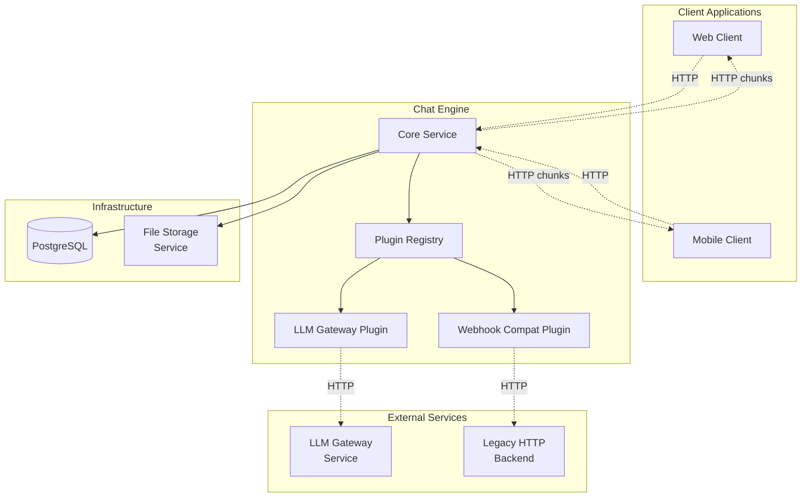
```mermaid
flowchart TB
    subgraph Client Applications
        WebClient[Web Client]
        MobileClient[Mobile Client]
    end

    subgraph Chat Engine
        Core[Core Service]
        PluginRegistry[Plugin Registry]
        LLMPlugin[LLM Gateway Plugin]
        WebhookCompat[Webhook Compat Plugin]
    end

    subgraph Infrastructure
        DB[(PostgreSQL)]
        Storage[File Storage<br/>Service]
    end

    subgraph External Services
        LLMGateway[LLM Gateway<br/>Service]
        LegacyBackend[Legacy HTTP<br/>Backend]
    end

    WebClient -.HTTP.-> Core
    MobileClient -.HTTP.-> Core

    Core --> PluginRegistry
    PluginRegistry --> LLMPlugin
    PluginRegistry --> WebhookCompat

    LLMPlugin -.HTTP.-> LLMGateway
    WebhookCompat -.HTTP.-> LegacyBackend

    Core --> DB
    Core --> Storage

    Core -.HTTP chunks.-> WebClient
    Core -.HTTP chunks.-> MobileClient
```

**System Architecture**:

Chat Engine handles all chat-related operations. It is deployed as a unified monolithic service, not as separate microservices. Each instance includes an HTTP server with Server-Sent Events delta streaming for client connections and provides the following core functionality through internal gears.

**Core Functionality**:

#### Session Management

<!-- fdd-id-content -->
Chat Engine manages session lifecycle operations including create, delete, and retrieve. It invokes the backend plugin with `session.created` event and stores returned capabilities. This functionality handles session type switching and share token generation.
<!-- fdd-id-content -->

#### Message Processing

<!-- fdd-id-content -->
**ADRs**: `cpt-cf-chat-engine-adr-message-tree-structure` (tree management), `cpt-cf-chat-engine-adr-message-variants` (variant assignment), `cpt-cf-chat-engine-adr-message-recreation` (recreation logic)

Chat Engine orchestrates message creation, persistence, and tree management. It validates parent references, assigns variant_index, and enforces tree constraints. Message processing integrates with plugin invocation functionality for backend communication.
<!-- fdd-id-content -->

#### Plugin Integration

<!-- fdd-id-content -->
**ADRs**: `cpt-cf-chat-engine-adr-routing-layer` (zero business logic), `cpt-cf-chat-engine-adr-plugin-backend-integration` (plugin system)

Chat Engine's plugin invocation layer. Resolves `dyn ChatEngineBackendPlugin` by `plugin_instance_id`, constructs call context, and invokes plugin methods (`on_session_type_configured`, `on_session_created`, `on_session_updated`, `on_message`, `on_message_recreate`, `on_session_summary`). On `on_session_created` and `on_session_updated`, the plugin returns a `SessionPluginResponse` whose `capabilities` are stored as `Session.enabled_capabilities` and whose optional `metadata` is merged into `Session.metadata`. Auth, retry, circuit breaker, and timeouts are the plugin's responsibility.

**N:1 session type → plugin relationship**: Multiple differently-configured session types can share the same `plugin_instance_id`. Plugin configuration is stored separately in the `plugin_configs` table (keyed by `plugin_instance_id` + `session_type_id`). The call context always includes `session_type_id` and `plugin_config` (the `config` JSONB from the `plugin_configs` table), allowing a single plugin instance to serve multiple session types with different behaviour (e.g., different configuration, different capability set, different processing strategy).
<!-- fdd-id-content -->

#### Response Streaming

<!-- fdd-id-content -->
**ADRs**: `cpt-cf-chat-engine-adr-streaming-architecture` (streaming architecture), `cpt-cf-chat-engine-adr-streaming-cancellation` (cancellation), `cpt-cf-chat-engine-adr-backpressure-handling` (backpressure)

Chat Engine manages the SSE delta-stream functionality. It projects backend-plugin output into `start`/`delta`/`complete`/`error` events and emits them to the client over `text/event-stream`. The streaming driver is **detached from the client connection** (true live-tail): it runs to completion regardless of whether the client is still connected, buffering every event so a reconnect can resume. This handles request processing, backpressure, per-message `seq` assignment, partial response saving on **explicit** cancellation (or plugin error/deadline), and resume via `Last-Event-ID` against the short-TTL event buffer (`cpt-cf-chat-engine-design-stream-resume`). Each stream is identified by a unique message_id.
<!-- fdd-id-content -->

#### Conversation Export

<!-- fdd-id-content -->
Chat Engine provides conversation export functionality that traverses the message tree, formats content to JSON/Markdown/TXT, and uploads to file storage. Supports active path filtering and full tree export.
<!-- fdd-id-content -->

#### Message Search

<!-- fdd-id-content -->
**ADRs**: `cpt-cf-chat-engine-adr-search-strategy` (search strategy)

Chat Engine provides full-text search capabilities across messages. It implements session-scoped and cross-session search with ranking, pagination, and context window retrieval.
<!-- fdd-id-content -->

#### Message Reactions

<!-- fdd-id-content -->
**ADRs**: `cpt-cf-chat-engine-adr-message-reactions` (message reactions design)

Chat Engine allows users to react to messages with simple like/dislike feedback. Reactions are stored per-user per-message with UPSERT semantics, and backend plugins are notified via fire-and-forget `message.reaction` events.

**Key Features**:
- One reaction per user per message (can be changed or removed)
- UPSERT semantics: changing reaction overwrites previous
- HTTP API: `POST /messages/{id}/reaction` with `{reaction_type: "like"|"dislike"|"none"}`
- Plugin notification: `message.reaction` event sent to backend plugin after storage
- Fire-and-forget pattern: plugin notification failures don't affect client response
- Database: Composite primary key (message_id, user_id) ensures uniqueness
- Cascade delete: reactions removed when message is deleted
<!-- fdd-id-content -->

**Key Interactions**:
- Client → Chat Engine: Session and message operations via HTTP REST API
- Chat Engine → Backend Plugin: internal trait call with context (in-process)
- Chat Engine → Client: Server-Sent Events delta stream (`start`/`delta`/`complete`/`error`)
- Chat Engine → File Storage: File upload with signed URL generation for exports
- Chat Engine → Database: All persistence operations for sessions, messages, and metadata
- Chat Engine → Summarization Service: Context summarization requests

### 3.2.1 Component Model

Chat Engine is deployed as a unified monolithic service. All functionality is implemented as internal gears within the same deployment unit. See Section 3.2 Architecture Overview for detailed gear descriptions.

#### Chat Engine Service

- [x] `p1` - **ID**: `cpt-cf-chat-engine-component-service`

##### Why this component exists

Chat Engine Service is the top-level orchestrator that owns the session lifecycle and message routing pipeline, decoupling client applications from backend plugin implementations.

##### Responsibility scope

Persistence, routing, and message tree management. Chat Engine does not interpret message content.

##### Responsibility boundaries

Content moderation, AI processing, and summarization logic belong to backend plugins. File content storage belongs to File Storage Service. See `cpt-cf-chat-engine-principle-zero-business-logic`.

##### Related components (by ID)

- `cpt-cf-chat-engine-actor-backend-plugin` — processes messages; called by Plugin Integration gear
- `cpt-cf-chat-engine-actor-file-storage` — stores file content; called by Conversation Export gear
- `cpt-cf-chat-engine-actor-database` — persists all session and message state

#### Session Management Gear

- [x] `p1` - **ID**: `cpt-cf-chat-engine-component-session-management`

Session lifecycle operations: create, delete, retrieve, type switching, share token generation. Invokes backend plugin with `on_session_created` trait method.

#### Message Processing Gear

- [x] `p1` - **ID**: `cpt-cf-chat-engine-component-message-processing`

Message tree management: creation, persistence, parent validation, variant_index assignment, tree constraints. **ADRs**: `cpt-cf-chat-engine-adr-message-tree-structure`, `cpt-cf-chat-engine-adr-message-variants`, `cpt-cf-chat-engine-adr-message-recreation`.

#### Plugin Integration Gear

- [ ] `p1` - **ID**: `cpt-cf-chat-engine-component-webhook-integration`

Plugin registry and trait dispatch: resolves `dyn ChatEngineBackendPlugin` by `plugin_instance_id`, invokes trait methods (`on_session_created`, `on_session_updated`, `on_message`, etc.), delegates all transport/auth/retry to the plugin implementation. The first-party `webhook-compat` plugin wraps legacy HTTP webhook backends. **ADRs**: `cpt-cf-chat-engine-adr-plugin-backend-integration`, `cpt-cf-chat-engine-adr-routing-layer`.

#### Response Streaming Gear

- [ ] `p1` - **ID**: `cpt-cf-chat-engine-component-response-streaming`

SSE delta streaming: plugin-to-client projection (`start`/`delta`/`complete`/`error`), `seq` assignment, resume buffer, backpressure control, connection cancellation, partial response saving. **ADRs**: `cpt-cf-chat-engine-adr-streaming-architecture`, `cpt-cf-chat-engine-adr-sse-delta-streaming`, `cpt-cf-chat-engine-adr-stream-resumability`, `cpt-cf-chat-engine-adr-streaming-cancellation`, `cpt-cf-chat-engine-adr-backpressure-handling`.

#### Conversation Export Gear

- [x] `p3` - **ID**: `cpt-cf-chat-engine-component-conversation-export`

Message tree traversal, format rendering (JSON/Markdown/TXT), file storage upload. Supports active path and full tree export.

#### Message Search Gear

- [ ] `p3` - **ID**: `cpt-cf-chat-engine-component-message-search`

Full-text search across messages: session-scoped and cross-session search, ranking, pagination, context window retrieval. **ADRs**: `cpt-cf-chat-engine-adr-search-strategy`.

#### Message Reactions Gear

- [x] `p2` - **ID**: `cpt-cf-chat-engine-component-message-reactions`

Per-user per-message reactions with UPSERT semantics. Fire-and-forget plugin notification. Cascade delete on message removal. **ADRs**: `cpt-cf-chat-engine-adr-message-reactions`.

#### Policy Enforcer (PEP)

- [ ] `p1` - **ID**: `cpt-cf-chat-engine-component-policy-enforcer`

##### Why this component exists

Turns the authenticated `SecurityContext` into query-level authorization. It is the single PEP through which every sensitive database access is gated, so the scoping logic lives in one place rather than being re-implemented per service.

##### Responsibility scope

Owns construction of the `PolicyEnforcer` (built once in module init from `ctx.client_hub().get::<dyn AuthZResolverApi>()`, Arc-cloned into each domain service), the per-resource `ResourceType` descriptors and action constants (§3.5.3), the PDP call surface (`access_scope` / `access_scope_with`), constraint→`AccessScope` compilation, and `EnforcerError`→`ChatEngineError` fail-closed mapping (§3.5.5). Also owns the `internal_write_scope()` wrapper and the bypass registry (§3.5.7).

##### Responsibility boundaries

Does not decide policy (that is the AuthZ Resolver PDP), does not authenticate (that is the gateway AuthN middleware), and does not itself execute SQL (that is `SecureConn`). It never exposes PDP internals to clients.

##### Related components (by ID)

- `cpt-cf-chat-engine-component-session-management` — consumes the enforcer for session CRUD
- `cpt-cf-chat-engine-component-message-processing` — consumes the enforcer for message ops
- `cpt-cf-chat-engine-component-message-reactions` — consumes the enforcer for reaction ops
- `cpt-cf-chat-engine-actor-database` — enforcement is applied at the SQL layer via `SecureConn`

### 3.3 API Contracts

See [`WEBHOOK-PROTOCOL.md`](WEBHOOK-PROTOCOL.md) for the webhook protocol documentation.

#### 3.3.1 HTTP REST API (Client ↔ Chat Engine)

**Specification**: [`docs/openapi.json`](openapi.json) (OpenAPI 3.1, generated from the live routes by `make openapi-chat-engine`)

**Base URL**: `{host}{prefix}/chat-engine/v1` (`{prefix}` = the gateway's `prefix_path`)

**Authentication**: JWT Bearer token in Authorization header

**15 REST endpoints** across 3 categories:
- **Session Management (10)**: Create, get, delete, switch type, export, share, access shared, search, summarize (streaming)
- **Message Operations (5)**: Send (streaming), recreate (streaming), list, get, variants, reaction

**HTTP Streaming** (`cpt-cf-chat-engine-design-streaming-protocol`):
- Content-Type: `text/event-stream` (Server-Sent Events)
- Frame: `id: <seq>` · `event: <type>` · `data: <JSON>`
- Events: `start`, `delta` (`{op, path, value}`), `complete`, `error`
- Cancellation: close the HTTP connection
- Resume: reconnect with `Last-Event-ID: <seq>` (`cpt-cf-chat-engine-design-stream-resume`)

For complete endpoint definitions, request/response schemas, and examples, see the OpenAPI specification file.

#### 3.3.2 Plugin API (Chat Engine ↔ Backend Plugin)

**Interface**: `dyn ChatEngineBackendPlugin` (Rust trait, `chat-engine-sdk` crate)

**Discovery**: Plugin implementations are internal code gears registered in Chat Engine's plugin registry at startup by `plugin_instance_id`.

**Plugin methods** (the three session hooks return `SessionPluginResponse { capabilities: Vec<Capability>, metadata: Option<JSON> }`):
- `on_session_type_configured(ctx)` → `SessionPluginResponse` — optional static capabilities stored as `SessionType.available_capabilities`; plugins may return empty and defer resolution to session creation. `metadata` is ignored (there is no session yet).
- `on_session_created(ctx)` → `SessionPluginResponse` — capabilities resolved at session creation time, stored as `Session.enabled_capabilities`; `metadata` is merged into `Session.metadata` (object merge, engine-reserved keys stripped).
- `on_session_updated(ctx)` → `SessionPluginResponse` — called when user updates session capabilities; plugin re-resolves capabilities (e.g., model change triggers capability refresh from Model Registry), result overwrites `Session.enabled_capabilities` and `metadata` is merged into `Session.metadata`. The session-type-switch path also calls this hook (for the capability-superset check) and likewise merges any returned `metadata` into the session.
- `on_message(ctx, stream)` → streams response chunks
- `on_message_recreate(ctx, stream)` → streams regenerated response
- `on_session_summary(ctx, stream)` → streams session summary
- `health_check()` → HealthStatus (optional)

**Streaming**: Plugin writes chunks/parts to `ResponseStream`; Chat Engine projects them into `start`/`delta`/`complete`/`error` events and emits them to the client over SSE (`cpt-cf-chat-engine-design-streaming-protocol`)

#### 3.3.3 Authorization PEP Interface (Chat Engine → AuthZ Resolver)

- [ ] `p1` - **ID**: `cpt-cf-chat-engine-interface-pep`

**Interface**: `PolicyEnforcer` over `dyn AuthZResolverApi` (`authz-resolver-sdk`, `toolkit-security`). Consumed in-process; the `SecurityContext` is propagated on every call.

**Call surface** (contract-level, not code):
- `access_scope(ctx, resource_type, action, resource_id) -> Result<AccessScope, EnforcerError>` — constraints required (LIST and similar).
- `access_scope_with(ctx, resource_type, action, resource_id, access_request) -> Result<AccessScope, EnforcerError>` — per-call overrides: prefetched resource properties (`owner_tenant_id`, `owner_id`), `require_constraints(false)` for point-op fast path, tenant-context overrides.

**Resource types & actions**: per §3.5.3 (`session`, `message`, `reaction`, `session_type`); actions `list`/`create`/`read`/`update`/`delete`.

**Result usage**: `AccessScope` is passed to `SecureConn` (`find`/`find_by_id`/`insert`/`update_with_ctx`/`update_many`/`delete_many`), which compiles it to a SQL `WHERE` clause against the entity's `Scopable` columns; `AccessScope::is_unconstrained()` enables the point-op fast path.

**Error contract**: `EnforcerError::{Denied, CompileFailed, EvaluationFailed}` → `ChatEngineError::{Forbidden(403) | NotFound(404 for 0-row point ops)}`, fail-closed (§3.5.5). PDP internals are never returned to the client.


#### 3.3.4 Internal Dependencies

Chat Engine depends on the following internal gears at runtime.

| Dependency Gear    | Interface Used | Purpose |
|-------------------|----------------|---------|
| Plugin Registry | Internal registry | Resolve `ChatEngineBackendPlugin` implementations by `plugin_instance_id` at startup and on session type configuration |
| Backend Plugin gears | `dyn ChatEngineBackendPlugin` (chat-engine-sdk) | Internal trait implementations that process messages, provide capabilities, and generate summaries |
| AuthZ Resolver (`authz-resolver`) | `dyn AuthZResolverApi` via `PolicyEnforcer` (authz-resolver-sdk) | PDP for authorization decisions + query constraints; resolved from `ClientHub` at init, declared as `deps = ["authz-resolver"]` (`cpt-cf-chat-engine-component-policy-enforcer`) |

#### 3.3.5 External Dependencies

| Dependency | Interface | Purpose |
|------------|-----------|---------|
| PostgreSQL | SQL over TLS | Primary persistence for sessions, messages, session types, reactions |
| File Storage Service | HTTP REST | File upload for exports; file access via UUID |

### 3.4 Interactions & Sequences

#### S1: Configure Session Type

- [ ] `p1` - **ID**: `cpt-cf-chat-engine-seq-configure-session-type`
**Use Case**: Admin configures new session type
**Actors**: `cpt-cf-chat-engine-actor-developer`
**PRD Reference**: Backend configuration (implicit in `cpt-cf-chat-engine-fr-create-session`)

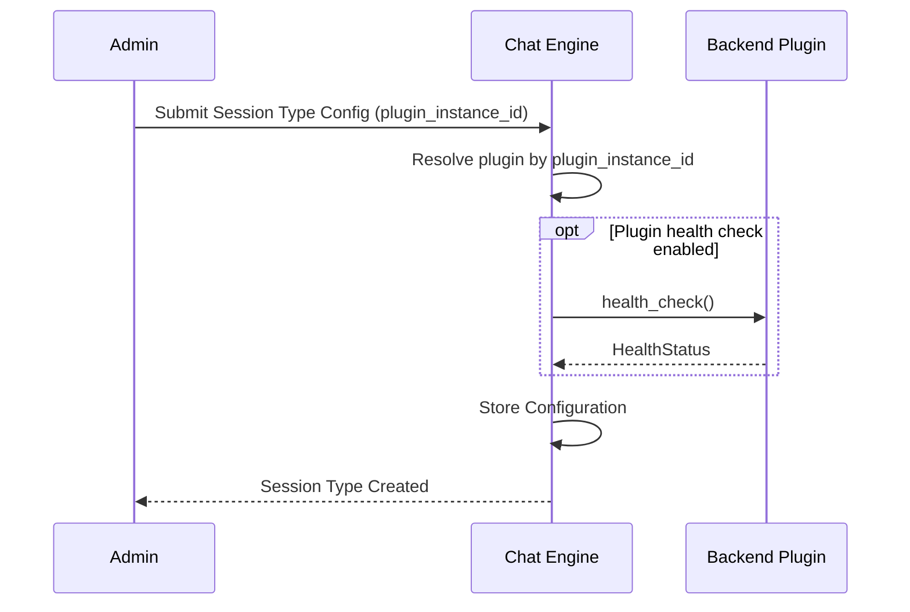
```mermaid
sequenceDiagram
    participant Admin
    participant Chat Engine
    participant Backend Plugin

    Admin->>Chat Engine: Submit Session Type Config (plugin_instance_id)
    Chat Engine->>Chat Engine: Resolve plugin by plugin_instance_id

    opt Plugin health check enabled
        Chat Engine->>Backend Plugin: health_check()
        Backend Plugin-->>Chat Engine: HealthStatus
    end

    Chat Engine->>Chat Engine: Store Configuration

    Chat Engine-->>Admin: Session Type Created
```

#### S2: Create Session and Send First Message

- [ ] `p1` - **ID**: `cpt-cf-chat-engine-seq-create-session`
**Use Case**: `cpt-cf-chat-engine-usecase-create-session`
**Actors**: `cpt-cf-chat-engine-actor-client`, `cpt-cf-chat-engine-actor-backend-plugin`

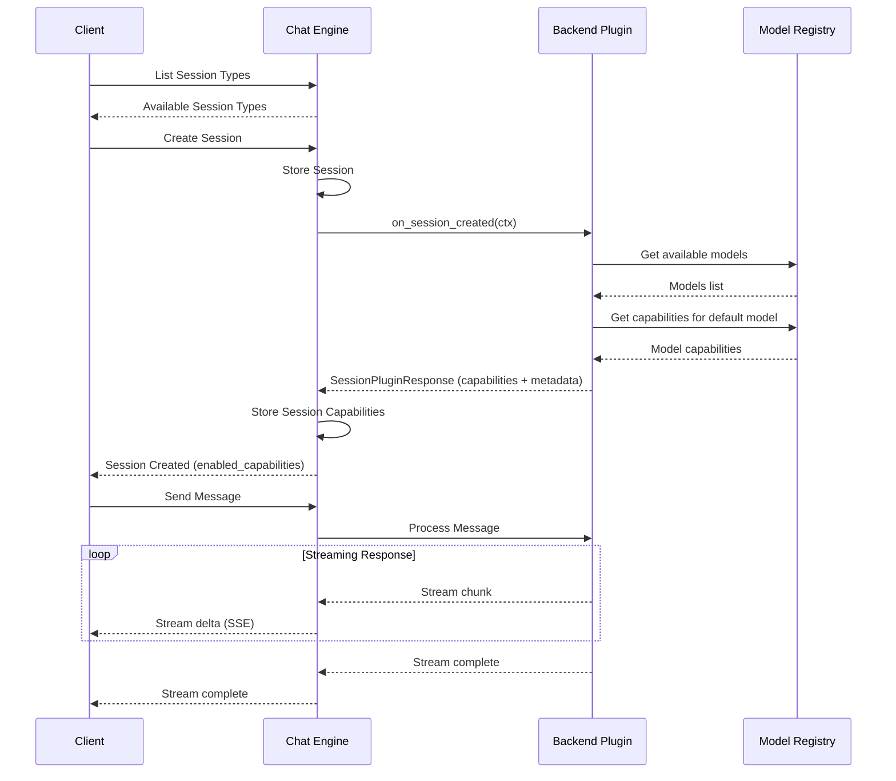
```mermaid
sequenceDiagram
    participant Client
    participant Chat Engine
    participant Backend Plugin
    participant Model Registry

    Client->>Chat Engine: List Session Types
    Chat Engine-->>Client: Available Session Types

    Client->>Chat Engine: Create Session

    Chat Engine->>Chat Engine: Store Session
    Chat Engine->>Backend Plugin: on_session_created(ctx)
    Backend Plugin->>Model Registry: Get available models
    Model Registry-->>Backend Plugin: Models list
    Backend Plugin->>Model Registry: Get capabilities for default model
    Model Registry-->>Backend Plugin: Model capabilities
    Backend Plugin-->>Chat Engine: SessionPluginResponse (capabilities + metadata)

    Chat Engine->>Chat Engine: Store Session Capabilities
    Chat Engine-->>Client: Session Created (enabled_capabilities)

    Client->>Chat Engine: Send Message

    Chat Engine->>Backend Plugin: Process Message

    loop Streaming Response
        Backend Plugin-->>Chat Engine: Stream chunk
        Chat Engine-->>Client: Stream delta (SSE)
    end

    Backend Plugin-->>Chat Engine: Stream complete
    Chat Engine-->>Client: Stream complete
```

#### S3: Send Message with File Attachments

- [ ] `p1` - **ID**: `cpt-cf-chat-engine-seq-send-message-with-files`
**Use Case**: `cpt-cf-chat-engine-fr-attach-files`
**Actors**: `cpt-cf-chat-engine-actor-client`, `cpt-cf-chat-engine-actor-file-storage`

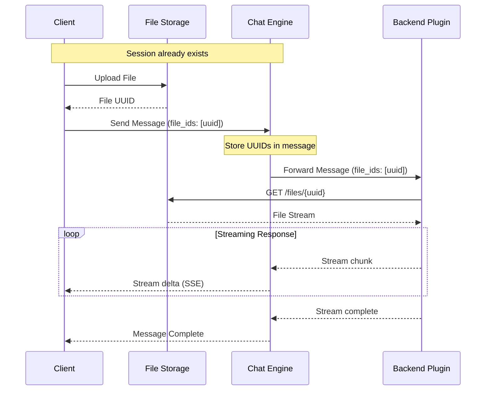
```mermaid
sequenceDiagram
    participant Client
    participant File Storage
    participant Chat Engine
    participant Backend Plugin

    Note over Client,Chat Engine: Session already exists

    Client->>File Storage: Upload File
    File Storage-->>Client: File UUID

    Client->>Chat Engine: Send Message (file_ids: [uuid])
    Note over Chat Engine: Store UUIDs in message
    Chat Engine->>Backend Plugin: Forward Message (file_ids: [uuid])

    Backend Plugin->>File Storage: GET /files/{uuid}
    File Storage-->>Backend Plugin: File Stream

    loop Streaming Response
        Backend Plugin-->>Chat Engine: Stream chunk
        Chat Engine-->>Client: Stream delta (SSE)
    end

    Backend Plugin-->>Chat Engine: Stream complete
    Chat Engine-->>Client: Message Complete
```

#### S4: Switch Session Type Mid-Conversation

- [ ] `p2` - **ID**: `cpt-cf-chat-engine-seq-switch-session-type`
**Use Case**: `cpt-cf-chat-engine-fr-switch-session-type`
**Actors**: `cpt-cf-chat-engine-actor-client`, `cpt-cf-chat-engine-actor-backend-plugin`

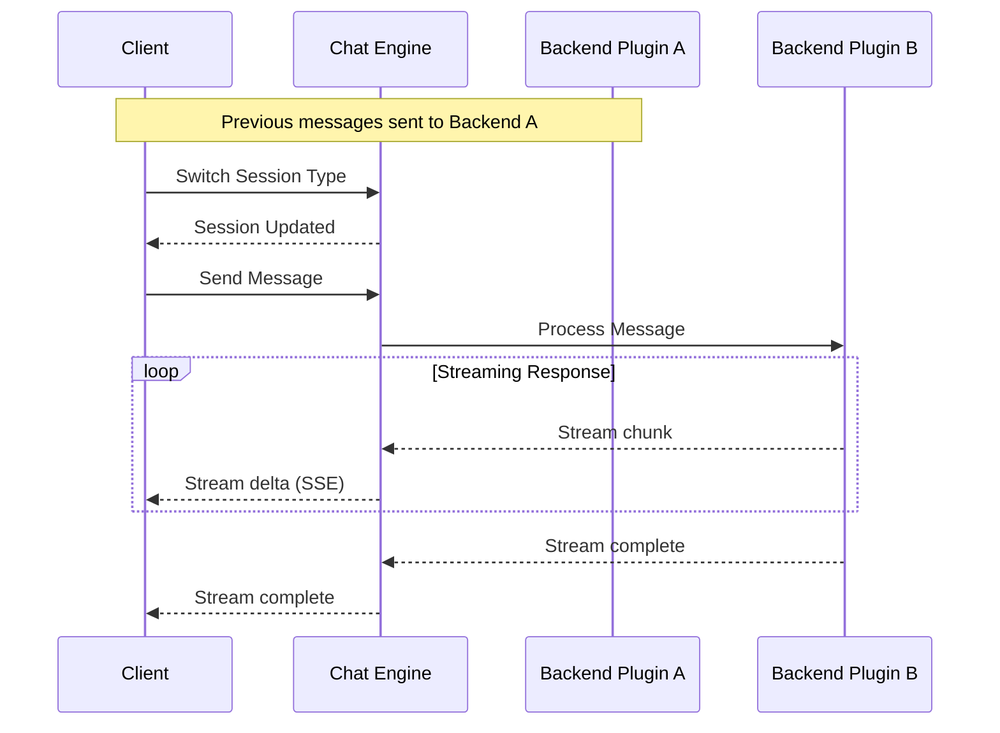
```mermaid
sequenceDiagram
    participant Client
    participant Chat Engine
    participant Backend Plugin A
    participant Backend Plugin B

    Note over Client,Backend Plugin A: Previous messages sent to Backend A

    Client->>Chat Engine: Switch Session Type
    Chat Engine-->>Client: Session Updated

    Client->>Chat Engine: Send Message
    Chat Engine->>Backend Plugin B: Process Message

    loop Streaming Response
        Backend Plugin B-->>Chat Engine: Stream chunk
        Chat Engine-->>Client: Stream delta (SSE)
    end

    Backend Plugin B-->>Chat Engine: Stream complete
    Chat Engine-->>Client: Stream complete
```

#### S5: Recreate Assistant Response (Variant Creation)

- [ ] `p1` - **ID**: `cpt-cf-chat-engine-seq-recreate-response`
**Use Case**: `cpt-cf-chat-engine-usecase-recreate-response`
**Actors**: `cpt-cf-chat-engine-actor-client`, `cpt-cf-chat-engine-actor-backend-plugin`

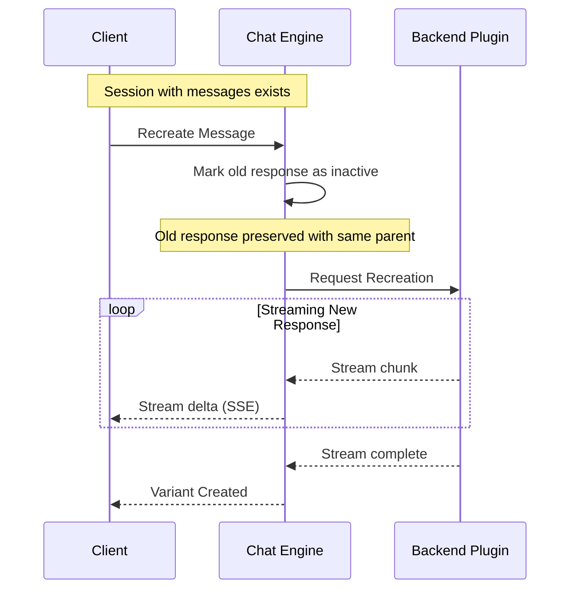
```mermaid
sequenceDiagram
    participant Client
    participant Chat Engine
    participant Backend Plugin

    Note over Client,Chat Engine: Session with messages exists

    Client->>Chat Engine: Recreate Message
    Chat Engine->>Chat Engine: Mark old response as inactive
    Note over Chat Engine: Old response preserved with same parent
    Chat Engine->>Backend Plugin: Request Recreation

    loop Streaming New Response
        Backend Plugin-->>Chat Engine: Stream chunk
        Chat Engine-->>Client: Stream delta (SSE)
    end

    Backend Plugin-->>Chat Engine: Stream complete
    Chat Engine-->>Client: Variant Created
```

#### S6: Branch from Historical Message

- [ ] `p2` - **ID**: `cpt-cf-chat-engine-seq-branch-message`
**Use Case**: `cpt-cf-chat-engine-usecase-branch-message`
**Actors**: `cpt-cf-chat-engine-actor-client`, `cpt-cf-chat-engine-actor-backend-plugin`

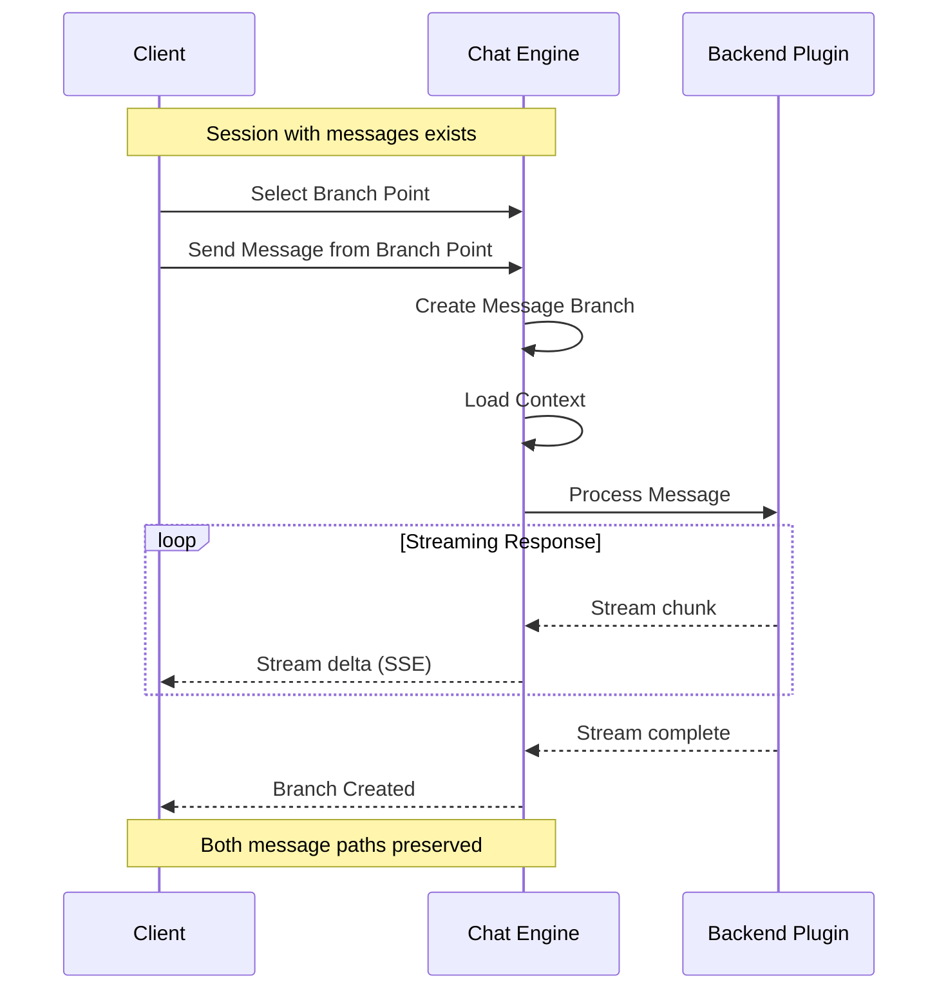
```mermaid
sequenceDiagram
    participant Client
    participant Chat Engine
    participant Backend Plugin

    Note over Client,Chat Engine: Session with messages exists

    Client->>Chat Engine: Select Branch Point
    Client->>Chat Engine: Send Message from Branch Point

    Chat Engine->>Chat Engine: Create Message Branch
    Chat Engine->>Chat Engine: Load Context
    Chat Engine->>Backend Plugin: Process Message

    loop Streaming Response
        Backend Plugin-->>Chat Engine: Stream chunk
        Chat Engine-->>Client: Stream delta (SSE)
    end

    Backend Plugin-->>Chat Engine: Stream complete
    Chat Engine-->>Client: Branch Created

    Note over Client,Chat Engine: Both message paths preserved
```

#### S7: Navigate Message Variants

- [ ] `p2` - **ID**: `cpt-cf-chat-engine-seq-navigate-variants`
**Use Case**: `cpt-cf-chat-engine-fr-navigate-variants`
**Actors**: `cpt-cf-chat-engine-actor-client`

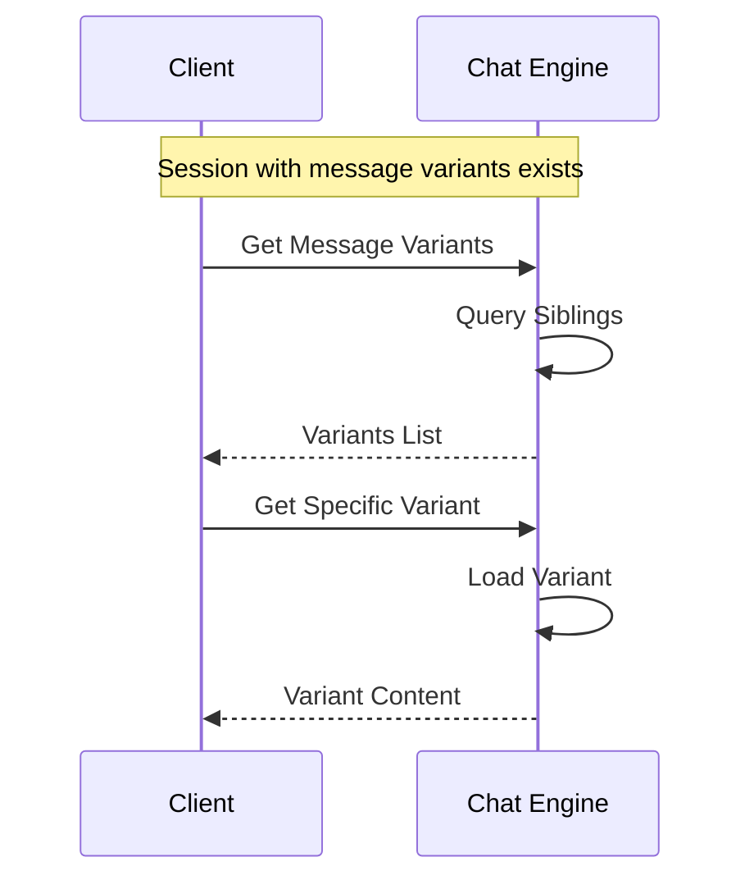
```mermaid
sequenceDiagram
    participant Client
    participant Chat Engine

    Note over Client,Chat Engine: Session with message variants exists

    Client->>Chat Engine: Get Message Variants
    Chat Engine->>Chat Engine: Query Siblings
    Chat Engine-->>Client: Variants List

    Client->>Chat Engine: Get Specific Variant
    Chat Engine->>Chat Engine: Load Variant
    Chat Engine-->>Client: Variant Content
```

#### S8: Export Session

- [ ] `p3` - **ID**: `cpt-cf-chat-engine-seq-export-session`
**Use Case**: `cpt-cf-chat-engine-usecase-export-session`
**Actors**: `cpt-cf-chat-engine-actor-client`

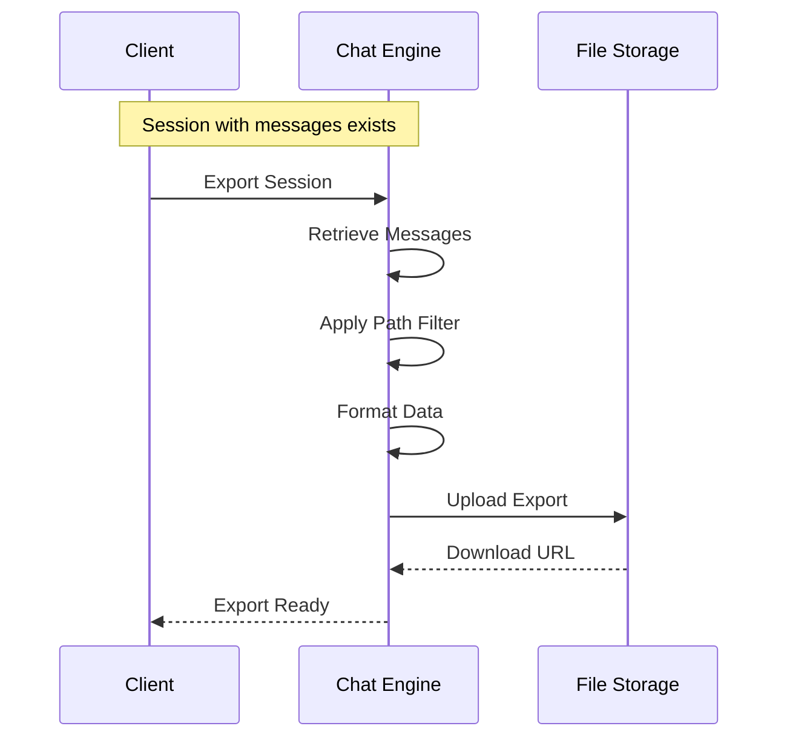
```mermaid
sequenceDiagram
    participant Client
    participant Chat Engine
    participant File Storage

    Note over Client,Chat Engine: Session with messages exists

    Client->>Chat Engine: Export Session
    Chat Engine->>Chat Engine: Retrieve Messages
    Chat Engine->>Chat Engine: Apply Path Filter
    Chat Engine->>Chat Engine: Format Data
    Chat Engine->>File Storage: Upload Export
    File Storage-->>Chat Engine: Download URL
    Chat Engine-->>Client: Export Ready
```

#### S9: Share Session

- [ ] `p3` - **ID**: `cpt-cf-chat-engine-seq-share-session`
**Use Case**: `cpt-cf-chat-engine-usecase-share-session`
**Actors**: `cpt-cf-chat-engine-actor-end-user`, `cpt-cf-chat-engine-actor-backend-plugin`

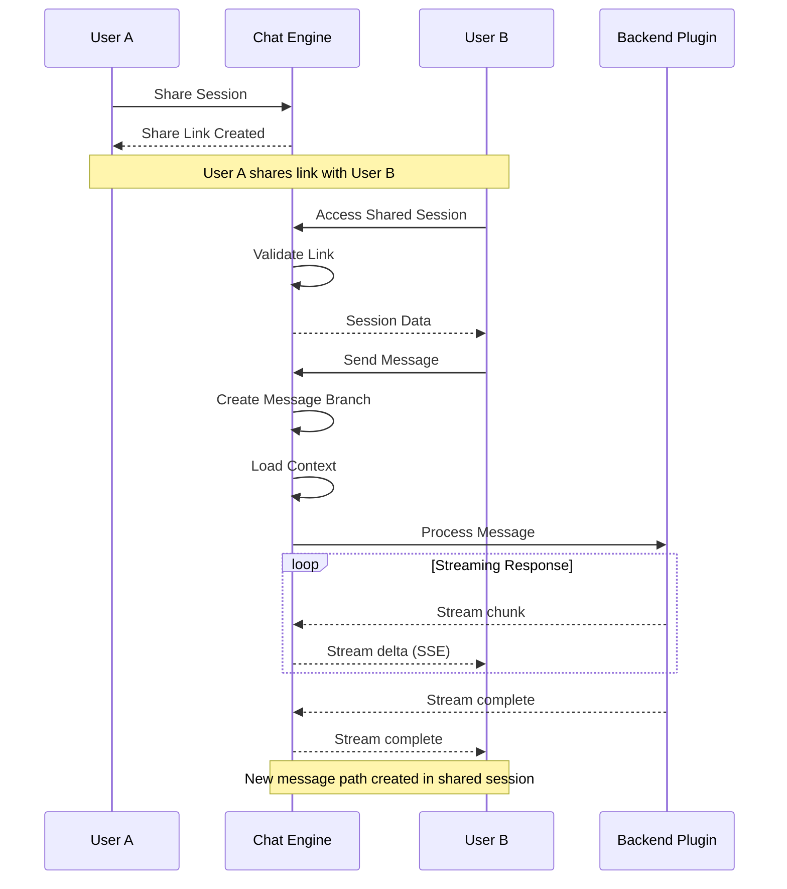
```mermaid
sequenceDiagram
    participant User A
    participant Chat Engine
    participant User B
    participant Backend Plugin

    User A->>Chat Engine: Share Session
    Chat Engine-->>User A: Share Link Created

    Note over User A,User B: User A shares link with User B

    User B->>Chat Engine: Access Shared Session
    Chat Engine->>Chat Engine: Validate Link
    Chat Engine-->>User B: Session Data

    User B->>Chat Engine: Send Message
    Chat Engine->>Chat Engine: Create Message Branch
    Chat Engine->>Chat Engine: Load Context
    Chat Engine->>Backend Plugin: Process Message

    loop Streaming Response
        Backend Plugin-->>Chat Engine: Stream chunk
        Chat Engine-->>User B: Stream delta (SSE)
    end

    Backend Plugin-->>Chat Engine: Stream complete
    Chat Engine-->>User B: Stream complete

    Note over User B,Chat Engine: New message path created in shared session
```

#### S10: Stop Streaming Response (Connection Close)

- [ ] `p1` - **ID**: `cpt-cf-chat-engine-seq-stop-streaming`
**Use Case**: `cpt-cf-chat-engine-fr-stop-streaming`
**Actors**: `cpt-cf-chat-engine-actor-client`

**Note**: Closing the HTTP connection does **not** cancel generation — under true live-tail the driver detaches from the connection, runs to completion, and buffers events for resume. Cancellation is an **explicit** action (a future stop endpoint) that aborts the backend request and saves the partial response.

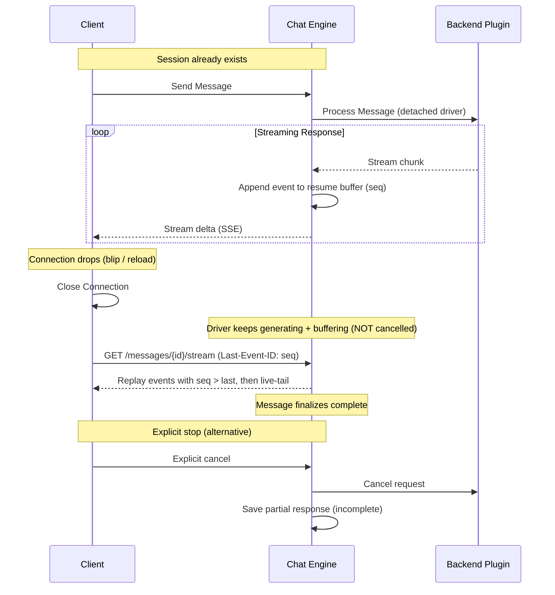
```mermaid
sequenceDiagram
    participant Client
    participant Chat Engine
    participant Backend Plugin

    Note over Client,Chat Engine: Session already exists

    Client->>Chat Engine: Send Message
    Chat Engine->>Backend Plugin: Process Message (detached driver)

    loop Streaming Response
        Backend Plugin-->>Chat Engine: Stream chunk
        Chat Engine->>Chat Engine: Append event to resume buffer (seq)
        Chat Engine-->>Client: Stream delta (SSE)
    end

    Note over Client: Connection drops (blip / reload)
    Client->>Client: Close Connection
    Note over Chat Engine: Driver keeps generating + buffering (NOT cancelled)

    Client->>Chat Engine: GET /messages/{id}/stream (Last-Event-ID: seq)
    Chat Engine-->>Client: Replay events with seq > last, then live-tail
    Note over Chat Engine: Message finalizes complete

    Note over Client,Chat Engine: Explicit stop (alternative)
    Client->>Chat Engine: Explicit cancel
    Chat Engine->>Backend Plugin: Cancel request
    Chat Engine->>Chat Engine: Save partial response (incomplete)
```

#### S11: Search Session History

- [ ] `p3` - **ID**: `cpt-cf-chat-engine-seq-search-session`
**Use Case**: `cpt-cf-chat-engine-fr-search-session`
**Actors**: `cpt-cf-chat-engine-actor-client`

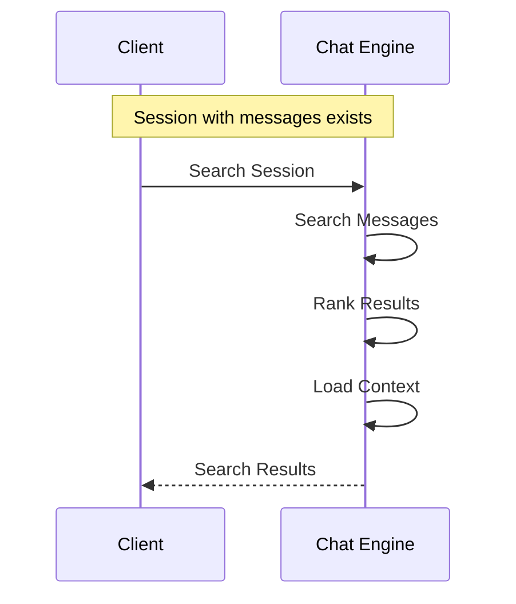
```mermaid
sequenceDiagram
    participant Client
    participant Chat Engine

    Note over Client,Chat Engine: Session with messages exists

    Client->>Chat Engine: Search Session
    Chat Engine->>Chat Engine: Search Messages
    Chat Engine->>Chat Engine: Rank Results
    Chat Engine->>Chat Engine: Load Context
    Chat Engine-->>Client: Search Results
```

#### S12: Search Across Sessions

- [ ] `p3` - **ID**: `cpt-cf-chat-engine-seq-search-sessions`
**Use Case**: `cpt-cf-chat-engine-fr-search-sessions`
**Actors**: `cpt-cf-chat-engine-actor-client`

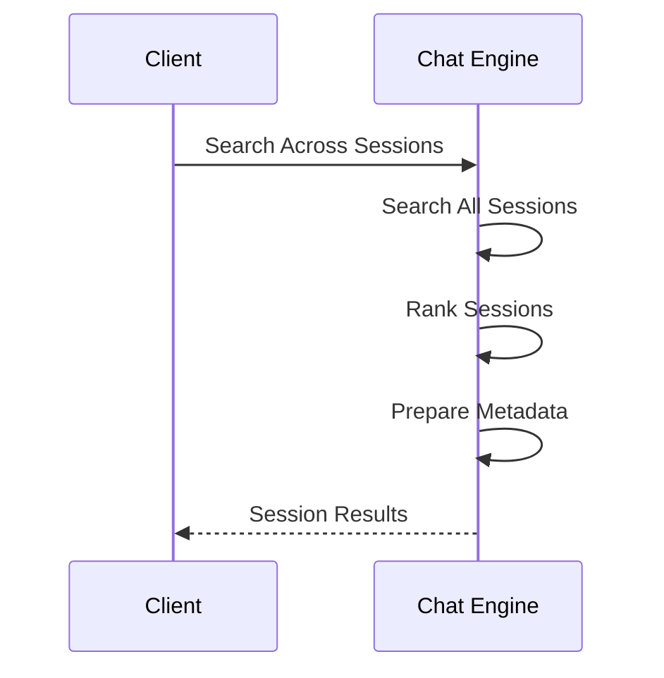
```mermaid
sequenceDiagram
    participant Client
    participant Chat Engine

    Client->>Chat Engine: Search Across Sessions
    Chat Engine->>Chat Engine: Search All Sessions
    Chat Engine->>Chat Engine: Rank Sessions
    Chat Engine->>Chat Engine: Prepare Metadata
    Chat Engine-->>Client: Session Results
```

#### S13: Generate Session Summary

- [ ] `p2` - **ID**: `cpt-cf-chat-engine-seq-generate-summary`
**Use Case**: `cpt-cf-chat-engine-fr-session-summary`
**Actors**: `cpt-cf-chat-engine-actor-client`, `cpt-cf-chat-engine-actor-backend-plugin`

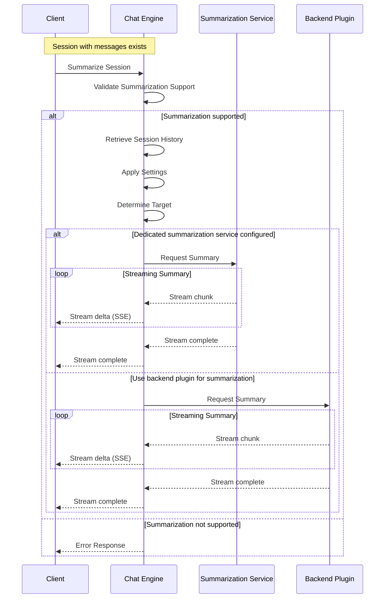
```mermaid
sequenceDiagram
    participant Client
    participant Chat Engine
    participant Summarization Service
    participant Backend Plugin

    Note over Client,Chat Engine: Session with messages exists

    Client->>Chat Engine: Summarize Session
    Chat Engine->>Chat Engine: Validate Summarization Support

    alt Summarization supported
        Chat Engine->>Chat Engine: Retrieve Session History
        Chat Engine->>Chat Engine: Apply Settings
        Chat Engine->>Chat Engine: Determine Target

        alt Dedicated summarization service configured
            Chat Engine->>Summarization Service: Request Summary

            loop Streaming Summary
                Summarization Service-->>Chat Engine: Stream chunk
                Chat Engine-->>Client: Stream delta (SSE)
            end

            Summarization Service-->>Chat Engine: Stream complete
            Chat Engine-->>Client: Stream complete
        else Use backend plugin for summarization
            Chat Engine->>Backend Plugin: Request Summary

            loop Streaming Summary
                Backend Plugin-->>Chat Engine: Stream chunk
                Chat Engine-->>Client: Stream delta (SSE)
            end

            Backend Plugin-->>Chat Engine: Stream complete
            Chat Engine-->>Client: Stream complete
        end
    else Summarization not supported
        Chat Engine-->>Client: Error Response
    end
```

#### S14: Add Message Reaction (HTTP)

- [x] `p2` - **ID**: `cpt-cf-chat-engine-seq-add-reaction`
**Use Case**: `cpt-cf-chat-engine-fr-message-feedback`
**Actors**: `cpt-cf-chat-engine-actor-client`, `cpt-cf-chat-engine-actor-backend-plugin`

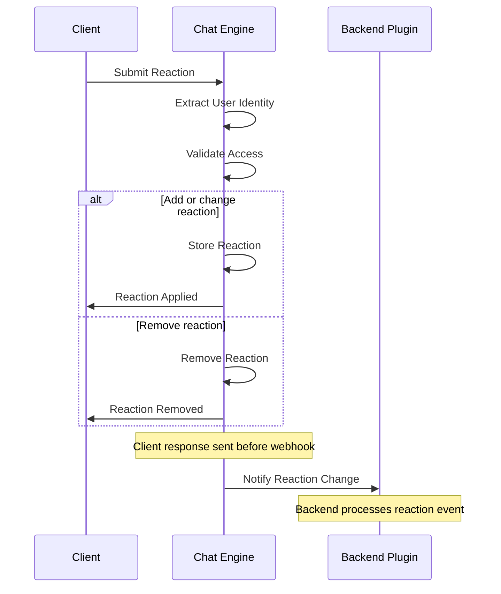
```mermaid
sequenceDiagram
    participant C as Client
    participant CE as Chat Engine
    participant WH as Backend Plugin

    C->>CE: Submit Reaction
    CE->>CE: Extract User Identity
    CE->>CE: Validate Access

    alt Add or change reaction
        CE->>CE: Store Reaction
        CE->>C: Reaction Applied
    else Remove reaction
        CE->>CE: Remove Reaction
        CE->>C: Reaction Removed
    end

    Note over CE: Client response sent before webhook

    CE->>WH: Notify Reaction Change
    Note over WH: Backend processes reaction event
```

**Flow**:
1. Client submits reaction with reaction_type
2. Chat Engine validates JWT and message access
3. Database stores or removes reaction based on type
4. Client receives immediate confirmation
5. Plugin notification sent asynchronously (fire-and-forget)

#### S15: Remove Message with Reactions (Cascade Delete)

- [x] `p1` - **ID**: `cpt-cf-chat-engine-seq-delete-message-cascade`
**Use Case**: Message deletion with reaction cleanup
**Actors**: `cpt-cf-chat-engine-actor-client`

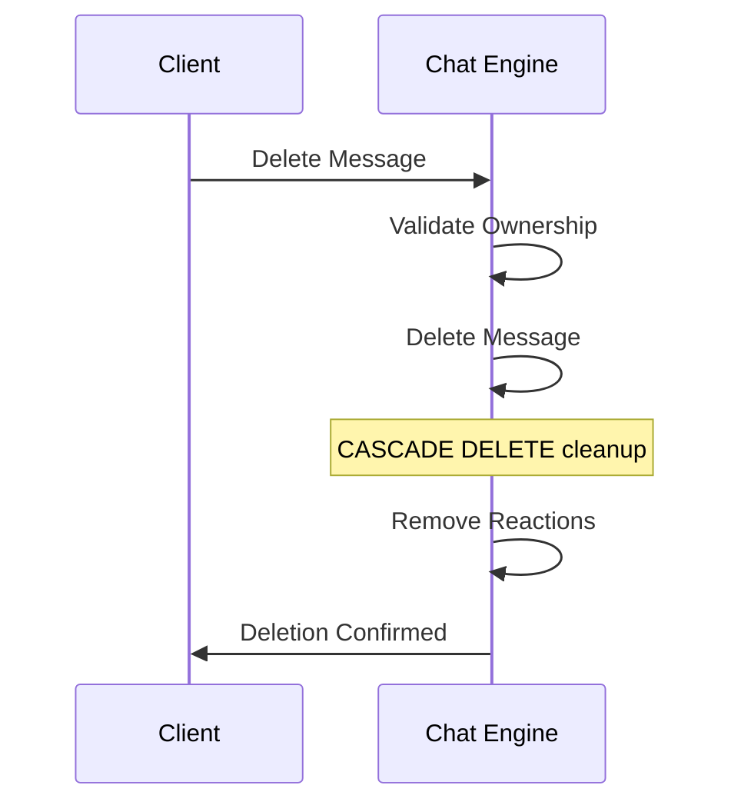
```mermaid
sequenceDiagram
    participant C as Client
    participant CE as Chat Engine

    C->>CE: Delete Message
    CE->>CE: Validate Ownership
    CE->>CE: Delete Message

    Note over CE: CASCADE DELETE cleanup

    CE->>CE: Remove Reactions
    CE->>C: Deletion Confirmed
```

**Flow**:
1. Client requests message deletion
2. Database CASCADE DELETE automatically removes all reactions
3. No orphaned reactions remain in database

#### S16: Authorized LIST (PEP scope → SQL)

- [ ] `p1` - **ID**: `cpt-cf-chat-engine-seq-authz-list`
**Use Case**: Tenant-scoped listing of sessions/messages/reactions
**Actors**: `cpt-cf-chat-engine-actor-client`
**Realizes**: `cpt-cf-chat-engine-design-auth-model` (§3.5.4), `cpt-cf-chat-engine-nfr-authentication`

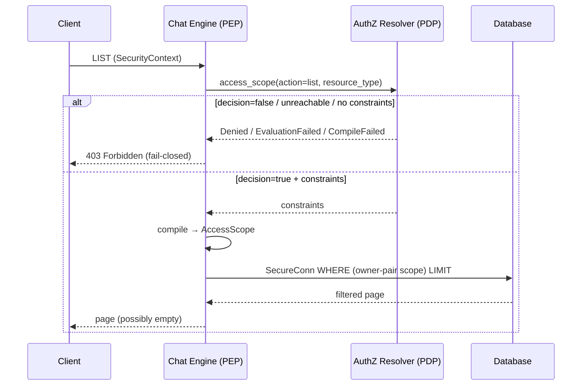
```mermaid
sequenceDiagram
    participant C as Client
    participant CE as Chat Engine (PEP)
    participant AZ as AuthZ Resolver (PDP)
    participant DB as Database

    C->>CE: LIST (SecurityContext)
    CE->>AZ: access_scope(action=list, resource_type)
    alt decision=false / unreachable / no constraints
        AZ-->>CE: Denied / EvaluationFailed / CompileFailed
        CE-->>C: 403 Forbidden (fail-closed)
    else decision=true + constraints
        AZ-->>CE: constraints
        CE->>CE: compile → AccessScope
        CE->>DB: SecureConn WHERE (owner-pair scope) LIMIT
        DB-->>CE: filtered page
        CE-->>C: page (possibly empty)
    end
```

**Description**: LIST requires constraints; the compiled owner-pair scope is applied as a SQL `WHERE` before `LIMIT`, so pagination and counts stay correct. Any deny/failure fails closed to 403.

#### S17: Authorized point op (two-step prefetch)

- [ ] `p1` - **ID**: `cpt-cf-chat-engine-seq-authz-point-op`
**Use Case**: GET/DELETE a single session/message
**Actors**: `cpt-cf-chat-engine-actor-client`
**Realizes**: `cpt-cf-chat-engine-design-auth-model` (§3.5.4)

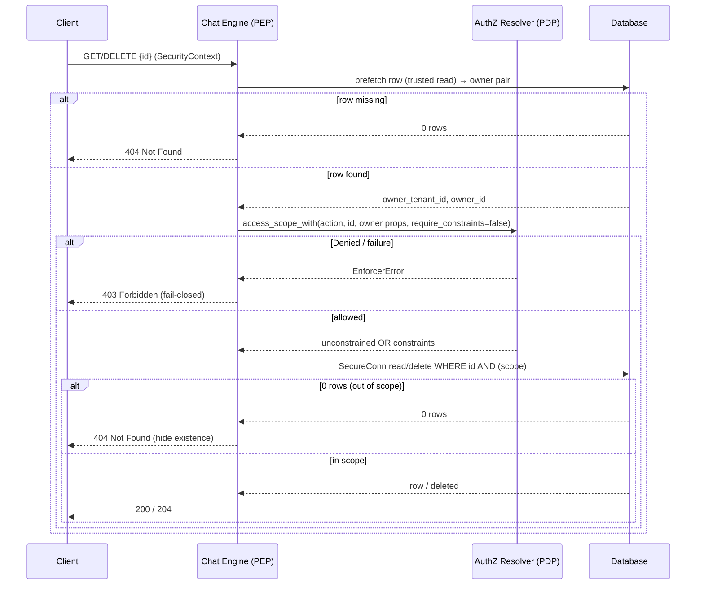
```mermaid
sequenceDiagram
    participant C as Client
    participant CE as Chat Engine (PEP)
    participant AZ as AuthZ Resolver (PDP)
    participant DB as Database

    C->>CE: GET/DELETE {id} (SecurityContext)
    CE->>DB: prefetch row (trusted read) → owner pair
    alt row missing
        DB-->>CE: 0 rows
        CE-->>C: 404 Not Found
    else row found
        DB-->>CE: owner_tenant_id, owner_id
        CE->>AZ: access_scope_with(action, id, owner props, require_constraints=false)
        alt Denied / failure
            AZ-->>CE: EnforcerError
            CE-->>C: 403 Forbidden (fail-closed)
        else allowed
            AZ-->>CE: unconstrained OR constraints
            CE->>DB: SecureConn read/delete WHERE id AND (scope)
            alt 0 rows (out of scope)
                DB-->>CE: 0 rows
                CE-->>C: 404 Not Found (hide existence)
            else in scope
                DB-->>CE: row / deleted
                CE-->>C: 200 / 204
            end
        end
    end
```

**Description**: The prefetch only supplies the owner pair for a narrow PDP call; the decision is always the PDP call. Owner-pair immutability makes this TOCTOU-safe. Out-of-scope point ops return 404 to hide existence.

#### S18: Shared read (capability URL, no PDP)

- [ ] `p2` - **ID**: `cpt-cf-chat-engine-seq-authz-shared-read`
**Use Case**: `cpt-cf-chat-engine-fr-share-session`
**Actors**: `cpt-cf-chat-engine-actor-end-user`
**Realizes**: `cpt-cf-chat-engine-design-auth-model` (§3.5.8)

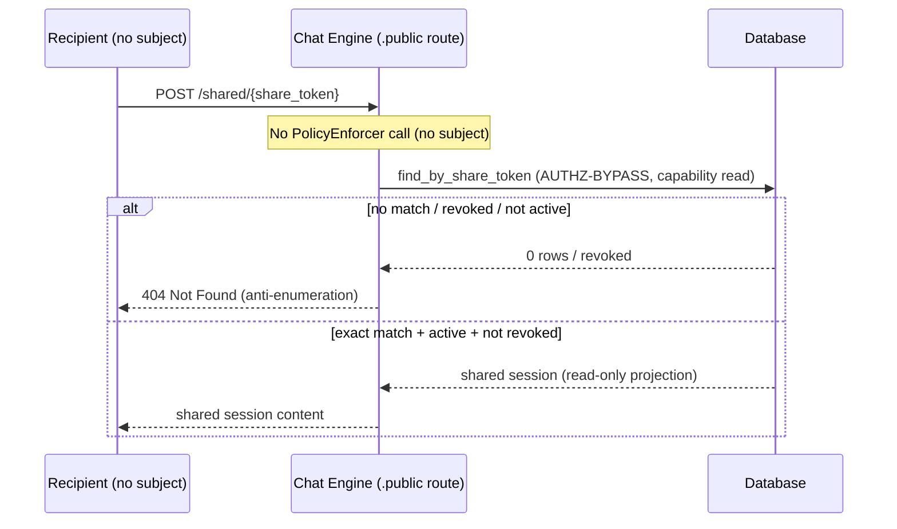
```mermaid
sequenceDiagram
    participant U as Recipient (no subject)
    participant CE as Chat Engine (.public route)
    participant DB as Database

    U->>CE: POST /shared/{share_token}
    Note over CE: No PolicyEnforcer call (no subject)
    CE->>DB: find_by_share_token (AUTHZ-BYPASS, capability read)
    alt no match / revoked / not active
        DB-->>CE: 0 rows / revoked
        CE-->>U: 404 Not Found (anti-enumeration)
    else exact match + active + not revoked
        DB-->>CE: shared session (read-only projection)
        CE-->>U: shared session content
    end
```

**Description**: Capability-URL model — the subject-less public route resolves by high-entropy revocable token via a registered bypass; any failure returns 404 and the projection excludes other-tenant owner data.

#### S19: Trusted-internal pipeline write (bypass)

- [ ] `p1` - **ID**: `cpt-cf-chat-engine-seq-authz-internal-write`
**Use Case**: Persisting assistant/summary/variant rows during an already-authorized user op
**Actors**: `cpt-cf-chat-engine-actor-backend-plugin`
**Realizes**: `cpt-cf-chat-engine-design-authz-bypass-registry` (§3.5.7)

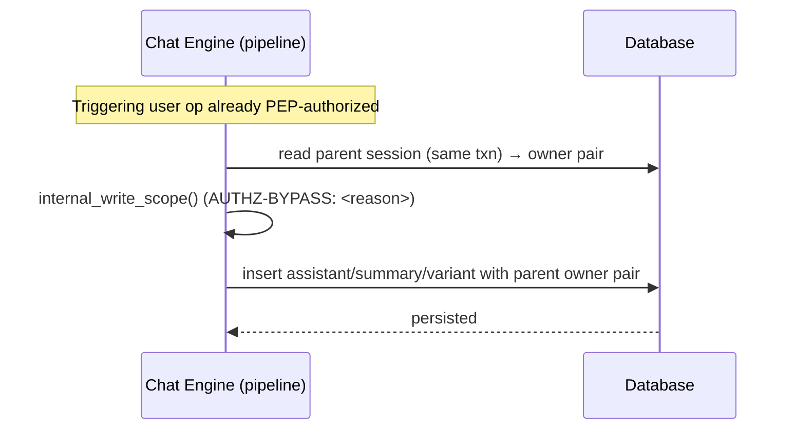
```mermaid
sequenceDiagram
    participant CE as Chat Engine (pipeline)
    participant DB as Database

    Note over CE: Triggering user op already PEP-authorized
    CE->>DB: read parent session (same txn) → owner pair
    CE->>CE: internal_write_scope() (AUTHZ-BYPASS: <reason>)
    CE->>DB: insert assistant/summary/variant with parent owner pair
    DB-->>CE: persisted
```

**Description**: Internal writes bypass the PEP via the named `internal_write_scope()` at a registered site, deriving the owner pair from the parent session in the same transaction (never from an ambient identity), preserving the denormalization invariant.

### 3.4.1 Database schemas & tables

**Schema location**: `migrations/` (versioned migration files)

#### Table: sessions

- [x] `p1` - **ID**: `cpt-cf-chat-engine-dbtable-sessions`

| Column | Type | Description |
|--------|------|-------------|
| session_id | UUID PK | Unique session identifier |
| tenant_id | UUID NOT NULL | Owning tenant (`owner_tenant_id`); cast text→UUID by `cpt-cf-chat-engine-dbtable-authz-owner-columns`. Immutable. `SecureORM` tenant scoping key |
| user_id | UUID NOT NULL | Session owner user (`owner_id`); cast text→UUID by the same migration. Immutable. `SecureORM` owner scoping key |
| client_id | VARCHAR | Calling application identifier (from JWT `client_id` claim) |
| session_type_id | UUID FK | References session_types |
| enabled_capabilities | JSONB | Capabilities returned by backend plugin at session creation |
| metadata | JSONB | Client-defined session metadata |
| lifecycle_state | VARCHAR | `active` / `archived` / `soft_deleted` / `hard_deleted` |
| share_token | VARCHAR UNIQUE NULL | Generated share token for session sharing |
| created_at | TIMESTAMPTZ | Creation timestamp |
| updated_at | TIMESTAMPTZ | Last modification timestamp |

#### Table: messages

- [x] `p1` - **ID**: `cpt-cf-chat-engine-dbtable-messages`

| Column | Type | Description |
|--------|------|-------------|
| message_id | UUID PK | Unique message identifier |
| session_id | UUID FK | References sessions |
| tenant_id | VARCHAR NULL | Author-side tenant denormalization (legacy); coincides with `owner_tenant_id`. NULL only for un-backfilled legacy rows |
| user_id | VARCHAR NULL | Author of this message (from JWT `user_id` claim for `user`-role messages); NULL for `assistant`/`system` messages. **Attribution only — not an authz key** |
| owner_tenant_id | UUID NOT NULL | Session owner tenant, copied from the parent session at insert; `SecureORM` tenant scoping key. Added + backfilled by `cpt-cf-chat-engine-dbtable-authz-owner-columns`. Immutable |
| owner_id | UUID NOT NULL | Session owner user, copied from the parent session at insert; `SecureORM` owner scoping key. Added + backfilled by the same migration. Immutable |
| parent_message_id | UUID FK NULL | Parent in message tree (NULL for root) |
| role | VARCHAR | `user` / `assistant` / `system` |
| file_ids | UUID[] | File UUID references |
| variant_index | INT | Variant position among siblings |
| is_active | BOOL | Whether this is the active variant in the tree |
| is_complete | BOOL | Whether streaming completed (false = partial/aborted) |
| is_hidden_from_user | BOOL | Excluded from client-facing APIs |
| is_hidden_from_backend | BOOL | Excluded from plugin context |
| metadata | JSONB | Backend-supplied message metadata |
| created_at | TIMESTAMPTZ | Creation timestamp |

**Constraints**: UNIQUE (session_id, parent_message_id, variant_index)

> **Migration note**: the prior `content JSONB` column is **dropped** — the message body moves wholesale to `message_parts`. The migration that created `messages` (`m20260417_000002_create_messages_table`) is amended in place rather than adding a new migration, per the project's pre-GA migration policy.

#### Table: message_parts

- [ ] `p1` - **ID**: `cpt-cf-chat-engine-dbtable-message-parts`

| Column | Type | Description |
|--------|------|-------------|
| id | UUID PK | Unique part identifier |
| message_id | UUID FK | References messages (CASCADE DELETE) |
| owner_tenant_id | UUID NOT NULL | Session owner tenant, copied from parent at insert (defense-in-depth tenant scoping); added by `cpt-cf-chat-engine-dbtable-authz-owner-columns`. No per-part PDP call |
| owner_id | UUID NOT NULL | Session owner user, copied from parent at insert; added by the same migration |
| type | VARCHAR | `text` / `code` / `images` / `videos` / `links` / `statuses` |
| content | JSONB | Typed payload; shape determined by `type` (see `cpt-cf-chat-engine-design-entity-message-part`) |
| number | INT | 0-based ordinal of the part within the message |

**Constraints**: UNIQUE (message_id, number)

> **Storage model**: consistent with `message_parts.content`, `message.metadata`, and the "forward verbatim, don't interpret" principle (`cpt-cf-chat-engine-principle-zero-business-logic`), each citation/reference row stores its full plugin-supplied payload as a single `content` JSONB column rather than exploding every field into typed columns. The field set inside `content` is exactly the entity shape documented in §3.1 (`cpt-cf-chat-engine-design-entity-file-citation` etc.). Only the structural columns the engine itself uses — `id`, `message_part_id`, and the ordering ordinal — are promoted.

#### Table: file_citations

- [ ] `p2` - **ID**: `cpt-cf-chat-engine-dbtable-file-citations`

Document citations attached to a `text` `message_part` (see `cpt-cf-chat-engine-design-entity-file-citation`).

| Column | Type | Description |
|--------|------|-------------|
| id | UUID PK | Unique citation identifier |
| message_part_id | UUID FK | References message_parts (CASCADE DELETE) |
| owner_tenant_id | UUID NOT NULL | Session owner tenant, copied from parent at insert (defense-in-depth tenant scoping); added by `cpt-cf-chat-engine-dbtable-authz-owner-columns` |
| owner_id | UUID NOT NULL | Session owner user, copied from parent at insert; added by the same migration |
| content | JSONB | Full `FileCitation` payload (document_id/name, quote, char offsets, chunk_*, page, timestamp, highlights, reference_type, text_positions, text_position_anchors, meta, citation_id, index) |
| number | INT | 0-based ordinal within the part (insertion order) |

#### Table: link_citations

- [ ] `p2` - **ID**: `cpt-cf-chat-engine-dbtable-link-citations`

Web-page citations attached to a `text` `message_part` (see `cpt-cf-chat-engine-design-entity-link-citation`). Shares the `[index]` namespace with `file_citations`.

| Column | Type | Description |
|--------|------|-------------|
| id | UUID PK | Unique citation identifier |
| message_part_id | UUID FK | References message_parts (CASCADE DELETE) |
| owner_tenant_id | UUID NOT NULL | Session owner tenant, copied from parent at insert (defense-in-depth tenant scoping); added by `cpt-cf-chat-engine-dbtable-authz-owner-columns` |
| owner_id | UUID NOT NULL | Session owner user, copied from parent at insert; added by the same migration |
| content | JSONB | Full `LinkCitation` payload (url, title, preview_text, favicon_url, quote, char offsets, reference_type, text_positions, citation_id, index) |
| number | INT | 0-based ordinal within the part (insertion order) |

#### Table: link_references

- [ ] `p2` - **ID**: `cpt-cf-chat-engine-dbtable-link-references`

Lightweight URL badges attached to a `text` `message_part` (see `cpt-cf-chat-engine-design-entity-link-reference`).

| Column | Type | Description |
|--------|------|-------------|
| id | UUID PK | Unique reference identifier |
| message_part_id | UUID FK | References message_parts (CASCADE DELETE) |
| owner_tenant_id | UUID NOT NULL | Session owner tenant, copied from parent at insert (defense-in-depth tenant scoping); added by `cpt-cf-chat-engine-dbtable-authz-owner-columns` |
| owner_id | UUID NOT NULL | Session owner user, copied from parent at insert; added by the same migration |
| content | JSONB | Full `LinkReference` payload (title, url, preview_text, position, preview_highlights, ref_type, ref_meta, idx) |
| number | INT | 0-based ordinal within the part (insertion order; the `idx` inside `content` carries the positional `[N]` mapping) |

> De-duplication of references by URL (a strict `UNIQUE(message_part_id, url)` constraint) is not enforced at the DB layer because `url` lives inside the JSONB payload; the plugin owns reference uniqueness.

#### Table: message_reactions

- [x] `p2` - **ID**: `cpt-cf-chat-engine-dbtable-reactions`

| Column | Type | Description |
|--------|------|-------------|
| message_id | UUID FK | References messages (CASCADE DELETE) |
| user_id | VARCHAR | Reacting user identifier — **attribution only, not an authz key** |
| owner_tenant_id | UUID NOT NULL | Session owner tenant, backfilled reaction→message→session; `SecureORM` tenant scoping key. Added by `cpt-cf-chat-engine-dbtable-authz-owner-columns` |
| owner_id | UUID NOT NULL | Session owner user, backfilled reaction→message→session; `SecureORM` owner scoping key. Added by the same migration |
| reaction_type | VARCHAR | `like` / `dislike` / `none` |
| created_at | TIMESTAMPTZ | First reaction timestamp |
| updated_at | TIMESTAMPTZ | Last update timestamp |

**PK**: (message_id, user_id)

#### Table: session_types

- [x] `p1` - **ID**: `cpt-cf-chat-engine-dbtable-session-types`

| Column | Type | Description |
|--------|------|-------------|
| session_type_id | UUID PK | Unique session type identifier |
| name | VARCHAR | Human-readable name |
| plugin_instance_id | VARCHAR | GTS plugin instance ID — references an internal ChatEngineBackendPlugin implementation (see `cpt-cf-chat-engine-adr-plugin-backend-integration`) |
| created_at | TIMESTAMPTZ | Creation timestamp |
| updated_at | TIMESTAMPTZ | Last modification timestamp |

##### plugin_configs

- [x] `p1` - **ID**: `cpt-cf-chat-engine-dbtable-plugin-configs`

| Column | Type | Description |
|--------|------|-------------|
| plugin_instance_id | VARCHAR | Plugin instance identifier (composite PK) |
| session_type_id | UUID FK | References session_types (composite PK) |
| config | JSONB | Plugin-specific configuration — opaque to Chat Engine, validated by the plugin against its registered GTS schema |
| created_at | TIMESTAMPTZ | Creation timestamp |
| updated_at | TIMESTAMPTZ | Last modification timestamp |

#### Table: stream_events

- [ ] `p2` - **ID**: `cpt-cf-chat-engine-dbtable-stream-events`

Short-TTL resume buffer for the SSE delta stream (default backend of the `StreamEventBuffer` port — see `cpt-cf-chat-engine-design-stream-resume`). Append-only; swept after `expires_at`. **Not** durable history.

| Column | Type | Description |
|--------|------|-------------|
| message_id | UUID | Assistant message whose stream this event belongs to (composite PK) |
| seq | BIGINT | Per-message monotonic event ordinal mirrored in the SSE `id:` line (composite PK) |
| event | JSONB | Serialized streaming event (`start` / `delta` / `complete` / `error`) replayed verbatim on resume |
| created_at | TIMESTAMPTZ | Emission timestamp |
| expires_at | TIMESTAMPTZ | TTL deadline; a periodic sweep deletes rows past this |

**PK**: (message_id, seq). When the Redis backend is configured instead, this table is unused.

#### Migration: authz owner columns

- [ ] `p1` - **ID**: `cpt-cf-chat-engine-dbtable-authz-owner-columns`

Single engine-aware **forward** migration `m20260417_000006_authz_owner_columns`, run at gear startup (single breaking migration, no dual-write). Enables `SecureORM` owner-pair scoping (§3.5.9). Ordered steps:

1. **Cast** `sessions.tenant_id` / `sessions.user_id` from text → `UUID` (safe — values were persisted from `SecurityContext` UUIDs via `.to_string()`), guarded by a pre-check that **aborts** if any non-castable rows exist. The pre-check **also aborts** if any `sessions.tenant_id IS NULL` or `sessions.user_id IS NULL` rows exist — NULLs cast to NULL (not caught by the non-castable guard) and would violate the `NOT NULL` owner-pair invariant.
2. **Add** `owner_tenant_id` / `owner_id` `UUID` columns to `messages`, `message_parts`, `message_reactions`, `file_citations`, `link_citations`, `link_references`.
3. **Backfill** the owner pair from the parent-session chain (message→session; part/citation/reference→message→session; reaction→message→session). **Aborts** on orphan messages or any nullable-tenant backfill failure.
4. **Set NOT NULL** on all owner columns and **add indexes** on `owner_tenant_id` and the composite `(owner_tenant_id, owner_id)` (list scoping).

Zero-downtime / expand-contract is out of scope here (deferred to a separate ADR — OQ2 in §4).

#### Indexes

| Table | Index | Columns | Type |
|-------|-------|---------|------|
| sessions | idx_sessions_tenant_user | (tenant_id, user_id) | btree |
| sessions | idx_sessions_owner | (tenant_id, user_id) | btree (list scoping; these are the owner pair — the PEP property names `owner_tenant_id`/`owner_id` resolve onto these physical columns) |
| messages | idx_messages_session_parent | (session_id, parent_message_id) | btree |
| messages | idx_messages_session_created | (session_id, created_at) | btree |
| messages | idx_messages_tenant | (tenant_id) | btree (partial: `WHERE tenant_id IS NOT NULL`) |
| messages | idx_messages_owner | (owner_tenant_id, owner_id) | btree (list scoping) |
| message_reactions | idx_reactions_owner | (owner_tenant_id, owner_id) | btree (list scoping) |
| message_parts | idx_message_parts_message | (message_id, number) | btree (covered by UNIQUE) |
| message_parts | idx_message_parts_text_fts | `lower(content->>'text')` | GIN (tsvector / trigram), partial: `WHERE type = 'text'` |
| file_citations | idx_file_citations_part | (message_part_id) | btree |
| link_citations | idx_link_citations_part | (message_part_id) | btree |
| link_references | idx_link_references_part | (message_part_id) | btree |
| message_reactions | idx_reactions_message | (message_id) | btree |
| stream_events | idx_stream_events_expiry | (expires_at) | btree (TTL sweep) |

### 3.5 Authorization Model

- [ ] `p1` - **ID**: `cpt-cf-chat-engine-design-auth-model`

**ADRs**: `cpt-cf-chat-engine-adr-authz-pep-secureorm` (PDP/PEP + SecureORM adoption, owner-column denormalization, UUID migration — accepted; recorded in `ADR/0028-authz-pep-secureorm-uuid-migration.md`)

Chat Engine authorization is a **full PEP (Policy Enforcement Point)** built on the platform PDP/PEP + SecureORM model (`docs/arch/authorization/DESIGN.md`, `docs/toolkit_unified_system/06_authn_authz_secure_orm.md`). Authentication (AuthN) is unchanged and already wired: the API Gateway middleware validates the bearer token and injects a `SecurityContext` (`subject_id`, `subject_tenant_id`, `token_scopes`, optional `bearer_token`) into every `.authenticated()` request. This section defines how Chat Engine turns that authenticated identity into **query-level authorization** — every sensitive database access is gated by a PDP decision compiled into an `AccessScope` and enforced by `SecureConn` as a SQL `WHERE` clause.

### 3.5.1 Ownership boundaries

Authorization scopes along the two orthogonal platform dimensions:

- **`owner_tenant_id`** (mandatory isolation key) — the tenant that owns a resource. The PEP MUST always enforce a tenant predicate; it is the hard cross-tenant isolation boundary and is never optional.
- **`owner_id`** (optional per-subject scoping) — the **session owner user** (the subject who created the session). Enables "my sessions" scoping when the PDP policy chooses to apply it. `owner_id` refers to a subject within `owner_tenant_id`.

Chat Engine scoped resources are `session`, `message`, and `reaction`; each carries the **owner pair** `(owner_tenant_id, owner_id)` on its own row so `SecureConn` compiles predicates against columns local to the row (no joins, no service-side gating).

**Owner pair vs. author.** The owner pair identifies the *session owner*, not the message author. `messages.user_id` (the authoring subject) and `message_reactions.user_id` (the reacting subject) remain **separate** columns and are not authorization keys — they support attribution, not access control. In multi-user and shared sessions the author/reactor may differ from the session owner (`cpt-cf-chat-engine-fr-share-session`).

**Denormalization invariant.** See `cpt-cf-chat-engine-principle-owner-denorm-invariant`: the session owner pair is set at session create and is **immutable**; children (messages, parts, citations, references, reactions) copy the owner pair from their parent session at insert. There is no cascade update and no re-parenting (consistent with `cpt-cf-chat-engine-principle-immutable-tree`).

**Children scoping (defense-in-depth).** `message_parts`, `file_citations`, `link_citations`, and `link_references` also carry the owner columns and are tenant-scoped in SecureConn, but PDP **evaluation** happens only at session/message granularity — there are no per-part PDP calls. These child tables have their own physical `owner_tenant_id`/`owner_id` columns (added by `cpt-cf-chat-engine-dbtable-authz-owner-columns`).

**Scopable column mapping for `sessions`.** `sessions` **keeps** its physical columns `tenant_id`/`user_id` (cast text→UUID by the migration, **not** renamed). The `Scopable` derive advertises the PEP property **names** `owner_tenant_id`/`owner_id` in `supported_properties` while `resolve_property()` maps those names onto the physical `tenant_id`/`user_id` columns — mirroring the `users-info` reference gear's `#[secure(tenant_col="tenant_id", owner_col="user_id")]` mapping. The child tables (messages, message_parts, reactions, citations, references) instead carry physical `owner_tenant_id`/`owner_id` columns directly, so no name mapping is needed for them.

**Owner-id non-null narrowing.** Chat Engine enforces `owner_id NOT NULL` for every session-owned resource: every session is created by an authenticated user, so the owner pair is always fully populated. This is a deliberate narrowing of the root authz model's nullable `owner_id`; it is safe because unauthenticated session creation is out of scope for Chat Engine.

**Global (non-resource) tables.** `session_types`, `plugin_configs`, and `stream_events` have no owner columns and are **not** PDP resources (entities stay `#[secure(unrestricted)]`). Access to `session_type` mutations is gated by a permission decision (§3.5.6), not by SQL constraints.

### 3.5.2 PEP wiring

`deps = ["authz-resolver"]` is declared on the `#[toolkit::gear]` attribute. During module initialization Chat Engine resolves `dyn AuthZResolverApi` from `ctx.client_hub()` and constructs a **single** `PolicyEnforcer`; it is Arc-cloned into every domain service as an `enforcer` field (mirrors the `users-info` reference gear — `cpt-cf-chat-engine-component-policy-enforcer`). No service constructs `AccessScope` manually in production; every scoped operation obtains its scope from the enforcer.

### 3.5.3 Public PEP call surface (per resource)

Each resource type declares the properties the PEP can compile from PDP constraints into SQL (`ResourceType.supported_properties`). The `ResourceType.name` is the canonical GTS type id `gts.cf.core.chat_engine.<resource>.v1~` (exact namespace verified against the gear's GTS registration during implementation — see OQ1 in §4).

| Resource type | GTS type id | `supported_properties` | Actions |
|---------------|-------------|------------------------|---------|
| session | `gts.cf.core.chat_engine.session.v1~` | `owner_tenant_id`, `owner_id`, `id` | `list`, `create`, `read`, `update`, `delete` |
| message | `gts.cf.core.chat_engine.message.v1~` | `owner_tenant_id`, `owner_id` (+ `id` for point ops) | `list`, `create`, `read`, `delete` |
| reaction | `gts.cf.core.chat_engine.reaction.v1~` | `owner_tenant_id`, `owner_id` (+ `id` for point ops) | `create`, `update`, `delete` |
| session_type | `gts.cf.core.chat_engine.session_type.v1~` | *(none — decision-gate only)* | `create`, `update`, `delete` |

The enforcer is called via the two SDK entry points (`cpt-cf-chat-engine-interface-pep`):
- `access_scope(ctx, resource_type, action, resource_id)` — LIST and other constraint-required calls.
- `access_scope_with(ctx, resource_type, action, resource_id, access_request)` — point ops and CREATE, passing prefetched `owner_tenant_id`/`owner_id` as resource properties and, for point ops, `require_constraints(false)` to allow the `is_unconstrained()` fast path.

**These four are the complete set of PEP resource types.** Services that operate on already-scoped data — variant, search, export, and intelligence — do **not** introduce new resource types. They enforce over the `session`/`message`/`reaction` types of the rows they touch: variant recreation authorizes `message` `create`/`read` on the parent session; search authorizes `message`/`session` `list`; export authorizes `session` `read`; summary/intelligence authorizes `session`/`message` `read`/`create`. The `ResourceType` constants are therefore `SESSION`, `MESSAGE`, `REACTION`, and `SESSION_TYPE` only; secondary services reuse them.

Predicates the PEP compiles map onto the platform `ScopeFilter` variants (`Eq`, `In`, `InGroup`, `InGroupSubtree`, `InTenantSubtree`) against the entity's `owner_tenant_id` / `owner_id` / `id` columns via the `Scopable` derive. `supported_properties` above always advertises the PEP property names `owner_tenant_id`/`owner_id`; for `sessions` the derive resolves those names onto the physical `tenant_id`/`user_id` columns (see §3.5.1 "Scopable column mapping for `sessions`"), while the child tables resolve them onto identically-named physical columns.

### 3.5.4 Per-operation flow

| Operation | Flow | 0-rows result |
|-----------|------|---------------|
| LIST (sessions / messages / reactions) | `access_scope(action=list)` → `SecureConn` applies scope as `WHERE` before `LIMIT` | empty page |
| CREATE (session) | `access_scope_with(action=create, owner_tenant_id=ctx.subject_tenant_id, owner_id=ctx.subject_id)`; SecureConn `INSERT` validated against scope; owner pair stamped on the new row | n/a |
| CREATE (message / reaction) | authorized at the **parent** granularity (send/react on the parent session/message); child rows inherit the parent's owner pair | n/a |
| GET (point op: session / message) | **two-step prefetch**: read row with a trusted prefetch scope to extract its `owner_tenant_id`/`owner_id`, then `access_scope_with(action=read, require_constraints=false)`; if unconstrained return the prefetched row, else scoped re-read | **404** (hide existence) |
| UPDATE session (PATCH metadata, session-type switch) | **two-step prefetch** for the owner pair, then `access_scope_with(action=update, require_constraints=false)`; the mutation runs as a scoped `update_with_ctx` under the resulting scope | **404** (hide existence) |
| DELETE (point op: session / message) | **two-step prefetch** for the owner pair, then `access_scope_with(action=delete, require_constraints=false)`; the delete runs as a scoped `delete_many` with `WHERE (scope)` — TOCTOU-safe because the owner pair is immutable, so the row cannot leave scope between prefetch and delete | **404** (hide existence) |

The two-step prefetch uses the same trusted-internal read path as internal writes (§3.5.7) purely to obtain the owner pair; the authorization decision is always the subsequent PDP call. Because the owner pair is immutable, the prefetch value is stable and there is no TOCTOU window.

### 3.5.5 Fail-closed error surface

Chat Engine maps `EnforcerError` (and 0-row point-op outcomes) onto `ChatEngineError`:

| Condition | Mapping | Client status |
|-----------|---------|---------------|
| `EnforcerError::Denied` — type-level deny (LIST/CREATE/UPDATE/DELETE, or READ where the type is not permitted) | `ChatEngineError::Forbidden` | **403** |
| Point op where the resource exists but is out of the caller's scope (scoped query returns 0 rows) | `ChatEngineError::NotFound` | **404** (hide existence) |
| `EnforcerError::CompileFailed` — missing/unknown/empty constraints | `ChatEngineError::Forbidden` | **403** (fail-closed) |
| `EnforcerError::EvaluationFailed` — PDP unreachable, timeout, or invalid response | `ChatEngineError::Forbidden` | **403** (fail-closed) |

Chat Engine deliberately maps **`EvaluationFailed` to 403, not 503/500**: PDP availability MUST NOT leak to the client, and the absence of a decision is treated as deny. The underlying infrastructure cause is logged/traced internally (never in the client response). This is the gear-local hardening of the platform fail-closed rule (`cpt-cf-chat-engine-constraint-fail-closed-authz`).

### 3.5.6 Session-type permission model

`session_type` create/update/delete are authorized by a **PDP permission decision** (a non-resource `access_scope_with(require_constraints=false)` call), not a hardcoded token-scope. `EnforcerError::Denied` → 403. The `session_types` entity stays `#[secure(unrestricted)]`; authorization is a decision gate, not a SQL constraint. Session-type **reads** (`list`/`get`) remain `.authenticated()`-only with no PDP call (public catalog within the tenant).

### 3.5.7 Trusted-internal writes and the bypass registry

Every database access that is not gated by a PDP decision goes through a **named scope wrapper** in `domain/authz/bypass.rs` — never a bare `AccessScope::allow_all()`. The wrapper family is: `internal_write_scope()`, `capability_read_scope()`, `system_read_scope()`, and `unrestricted_table_scope()`. Each call site carries a `// AUTHZ-BYPASS: <reason>` marker plus a `@cpt` traceability comment. Bare `allow_all()` outside this module is forbidden (`cpt-cf-chat-engine-constraint-no-allow-all-outside-registry`; optional lint — OQ4 in §4). Internal writes MUST derive the owner pair by reading the parent session/message **in the same transaction** — never from an ambient/system identity — preserving the denormalization invariant.

The **tenant-sensitive** wrapper sites (internal writes, capability reads, and system cross-tenant ops/reads) are enumerated individually in the registry below. Repositories of the globally non-tenant tables `session_types`, `plugin_configs`, and `stream_events` — which §3.5.1 and §3.5.3 exclude from PDP scoping — are **not** individually enumerated; they use `unrestricted_table_scope()` categorically (a named, greppable stand-in for the previous bare `allow_all()` on those repos). This reconciles the small tenant-sensitive registry with the many benign unrestricted-table accesses so the no-bare-`allow_all()` rule is satisfiable repo-wide.

**Bypass registry**

- [ ] `p1` - **ID**: `cpt-cf-chat-engine-design-authz-bypass-registry`

| Bypass site | Class | Justification | HTTP-exposed? |
|-------------|-------|---------------|---------------|
| `finalize_assistant` | internal pipeline write | Triggering user op (`send_message`) is already PEP-authorized; stamps owner pair from the authorized parent session | No (write within an authorized send) |
| `insert_summary_message` | internal pipeline write | Triggered by an authorized summary op; owner pair from parent session | No |
| `insert_assistant_variant_stub` | internal pipeline write | Triggered by authorized `recreate`; owner pair from parent session | No |
| `run_retention_cleanup_all_tenants` | system cross-tenant op | Scheduled retention across tenants; no subject | **No** (not on any route; test-verified) |
| `list_tenants_with_active_sessions` | system cross-tenant read | Retention/enumeration support | **No** (test-verified) |
| `find_by_session_id_unscoped` | system read | Internal pipeline: reads parent session by session_id without tenant filter within an authorized transaction; NOT for share-token resolution; forbidden from tenant-scoped user handlers | No (internal pipeline only) |
| `find_by_share_token` | capability read | Share-token (capability-URL) resolution; miss/revoked → 404 | Only via the `.public()` share route |

### 3.5.8 Shared-read (capability-URL) security boundary

Shared read is a **capability-URL** model. The `.public()` `POST /shared/{share_token}` route has **no subject** and therefore does **not** call `PolicyEnforcer`. It resolves the session by `share_token` via `find_by_share_token` (a registered bypass), enforcing: exact token match **AND** active lifecycle **AND** not revoked. Any failure → **404** (anti-enumeration; never distinguishes "wrong token" from "revoked"). The share is **read-only**; the token is a high-entropy, revocable secret (revoked via `update_share_token`). The response projection excludes other-tenant owner data beyond the shared session content. This is the only sensitive read path without a PDP call, and it is justified precisely because there is no authenticated subject to evaluate against.

### 3.5.9 Migration impact

Adopting SecureORM requires UUID owner columns. A single engine-aware forward migration `m20260417_000006_authz_owner_columns` (`cpt-cf-chat-engine-dbtable-authz-owner-columns`) runs at gear startup (single forward breaking migration; no dual-write). It: (1) casts `sessions.tenant_id`/`user_id` from text → UUID (safe: values were written from `SecurityContext` UUIDs via `.to_string()`), guarded by a pre-check that aborts if any non-castable rows exist **or if any `sessions.tenant_id IS NULL` / `sessions.user_id IS NULL` rows exist** (NULLs cast to NULL and would violate the `NOT NULL` owner-pair invariant); (2) adds `owner_tenant_id`/`owner_id` UUID columns to `messages`, `message_parts`, `message_reactions`, `file_citations`, `link_citations`, `link_references`; (3) backfills the owner pair from the parent-session chain (aborting on orphan messages / nullable-tenant backfill failure); (4) sets `NOT NULL` and adds indexes on `owner_tenant_id` and `(owner_tenant_id, owner_id)` for list scoping. Zero-downtime / expand-contract is explicitly deferred to a separate ADR (OQ2 in §4).

### 3.5.10 Observability & testability

- **Observability**: EnforcerError causes are logged/traced with `trace_id` but never surfaced to clients (§3.8); bypass sites are traceable via their `@cpt` markers.
- **Testability**: PDP-deny paths are covered with mock resolvers (`DenyAllAuthZResolver`) and scoped-allow fixtures (`ctx_allow_tenants`) mirroring the reference gear; the denormalization invariant and each bypass site (especially the non-HTTP system ops) are covered by dedicated tests (`cpt-cf-chat-engine-design-testing-arch`).

#### Inter-Service Authentication

Chat Engine does not manage authentication for plugin-to-external-service communication. Each backend plugin owns its outbound auth, retry, and transport configuration. For the `webhook-compat` plugin, webhook endpoint security (API keys, mTLS) is configured via plugin config and enforced by the plugin itself.

### 3.6 Data Protection

**ID**: `cpt-cf-chat-engine-design-data-protection`

#### Personal Data Classification

| Data Type | Classification | Storage Location | Retention |
|-----------|---------------|-----------------|-----------|
| `client_id` | Pseudonymous identifier | Sessions, Messages | Session lifecycle |
| Message `user_id` | Pseudonymous identifier | Messages table | Message lifecycle |
| Message `tenant_id` | Tenant identifier | Sessions, Messages | Session lifecycle |
| Message content | Potentially personal | Message_parts table (CASCADE-deleted with the message) | FR-020 retention policy |
| Citation quotes / chunk content | Potentially personal | file_citations / link_citations / link_references (CASCADE-deleted with the part) | FR-020 retention policy |
| Session metadata | Potentially personal | Sessions table | Session lifecycle |
| File UUIDs | Reference only (not content) | Messages table | Session lifecycle |
| Reaction `user_id` | Pseudonymous identifier | Reactions table | Message lifecycle |
| Share tokens | Non-personal | Sessions table | Session lifecycle |

#### Data Erasure

- **Soft delete**: Marks session as `soft_deleted`; data preserved for recovery window
- **Hard delete**: Permanently removes session, messages, reactions, and metadata
- **Individual message deletion**: `cpt-cf-chat-engine-fr-delete-message` enables targeted erasure
- **Automated cleanup**: `cpt-cf-chat-engine-fr-message-retention` for age-based or count-based cleanup

#### Data in Transit

All external communication requires TLS: Client ↔ Chat Engine (HTTPS), Plugin ↔ External Service (HTTPS, managed by plugin), Chat Engine ↔ Database (encrypted connection).

#### Data at Rest

Database-level encryption is an infrastructure concern configured at the database cluster level. Application-level field encryption is excluded (see Section 5: Intentional Exclusions).

### 3.7 Data Consistency

**ID**: `cpt-cf-chat-engine-design-data-consistency`

#### Transaction Boundaries

| Operation | Scope | Isolation |
|-----------|-------|-----------|
| Message creation (send/recreate) | Single message INSERT + variant_index assignment | SERIALIZABLE on (session_id, parent_message_id) |
| Message subtree delete | Recursive CTE + DELETE reactions + DELETE messages | Single transaction, READ COMMITTED |
| Session soft/hard delete | Session UPDATE/DELETE + cascade messages + reactions | Single transaction |
| Reaction UPSERT | Single row INSERT ON CONFLICT UPDATE | Row-level lock on (message_id, user_id) |

#### Variant Index Concurrency

The UNIQUE constraint `(session_id, parent_message_id, variant_index)` requires safe concurrent variant_index assignment when multiple recreate or branch operations target the same parent message simultaneously.

**Strategy**: SELECT MAX(variant_index) + 1 within a serializable sub-transaction scoped to (session_id, parent_message_id). On constraint violation (concurrent race), retry with fresh MAX. Maximum 3 retries before returning 409 Conflict.

#### Idempotency

Message creation is not idempotent — each POST creates a new message node with a new UUID. Reaction UPSERT is idempotent by design (INSERT ON CONFLICT UPDATE).

All mutating endpoints accept an optional `Idempotency-Key` header. The server logs the key for deduplication auditing. Client SDKs SHOULD generate a UUID v4 per request.

### 3.8 Observability

**ID**: `cpt-cf-chat-engine-design-observability`

#### Structured Logging

All request handling emits structured log events with the following fields: `trace_id`, `user_id`, `tenant_id`, `session_id`, `operation`, `duration_ms`, `status`. Message content and personal data are never logged. Authorization denials and PDP-evaluation failures (`EnforcerError`) are logged/traced internally with their infrastructure cause; the client only ever sees the fail-closed status (403/404) and never PDP internals or availability (`cpt-cf-chat-engine-constraint-fail-closed-authz`). The `bearer_token` is never logged.

#### Metrics

| Metric | Type | Description |
|--------|------|-------------|
| `request_duration_seconds` | Histogram | HTTP latency by endpoint and status code |
| `plugin_duration_seconds` | Histogram | Plugin trait call latency by session_type_id |
| `active_streams` | Gauge | Concurrent streaming connections |
| `session_operations_total` | Counter | Session operations by type and result |

#### Health Endpoints

- `GET /health/live` — liveness probe (returns 200 if process is running)
- `GET /health/ready` — readiness probe (includes database connectivity check)

#### Distributed Tracing

`trace_id` is generated per request and propagated in all outbound calls (plugin invocation, database). Included in error responses for support correlation without exposing internal details.

### 3.9 Testing Architecture

**ID**: `cpt-cf-chat-engine-design-testing-arch`

| Layer | Scope | Approach |
|-------|-------|----------|
| Unit | Domain logic, message tree operations, validation rules | Pure function tests, no I/O |
| Integration | Database operations, plugin integration | Real test database, mock plugin implementations |
| API | HTTP endpoints, streaming, auth | Test HTTP server, mock plugins, test database |
| Contract | Plugin API trait conformance | Schema-based tests against `ChatEngineBackendPlugin` trait contract |

Test isolation: each test case uses independent database state (transaction rollback or dedicated schema). Backend plugins are replaced by configurable mock implementations of `ChatEngineBackendPlugin`. Coverage targets: 90%+ for domain layer, 100% endpoint coverage including error paths and all authorization boundaries.

## 4. Additional Context

#### Context: Authorization Open Questions

**ID**: `cpt-cf-chat-engine-design-context-authz-open-questions`

<!-- fdd-id-content -->
**ADRs**: `cpt-cf-chat-engine-adr-authz-pep-secureorm`

Non-blocking open questions recorded for the authorization design (§3.5):

- **OQ1 — GTS namespace**: The exact GTS namespace for the `ResourceType` ids (`gts.cf.core.chat_engine.<resource>.v1~`) is verified against the gear's GTS registration during implementation.
- **OQ2 — Zero-downtime migration**: The `m20260417_000006_authz_owner_columns` migration is a single forward breaking migration; a zero-downtime / expand-contract variant (if production requires it) is deferred to a separate ADR.
- **OQ3 — Cross-tenant session transfer**: Moving a session between tenants is out of scope (the owner pair is immutable); if ever required it is a separate ADR.
- **OQ4 — Bypass lint**: An optional lint to forbid `AccessScope::allow_all()` outside the bypass registry (`cpt-cf-chat-engine-constraint-no-allow-all-outside-registry`) is a possible future hardening.
<!-- fdd-id-content -->

#### Context: Authorization Traceability

**ID**: `cpt-cf-chat-engine-design-context-authz-traceability`

<!-- fdd-id-content -->
Traceability for the authorization design elements added in §3.5 (anchor decision: `cpt-cf-chat-engine-adr-authz-pep-secureorm`, recorded as `ADR/0028-authz-pep-secureorm-uuid-migration.md`). PRD anchors: `cpt-cf-chat-engine-nfr-authentication` (tenant-isolation / ownership invariant) and `cpt-cf-chat-engine-fr-share-session` (share-token read boundary, traced by `cpt-cf-chat-engine-seq-authz-shared-read`).

| Design element (new ID) | Traces to (PRD / ADR) | Code `@cpt` markers |
|-------------------------|-----------------------|---------------------|
| `cpt-cf-chat-engine-design-auth-model` (reworked) | `cpt-cf-chat-engine-nfr-authentication`, `cpt-cf-chat-engine-adr-authz-pep-secureorm` | `@cpt` module-registration, api-rest-routes, api-rest-handlers, sessions-handler, domain-error |
| `cpt-cf-chat-engine-principle-owner-denorm-invariant` | `cpt-cf-chat-engine-adr-authz-pep-secureorm` | `@cpt` dbtable-sessions, dbtable-messages, dbtable-reactions, dbtable-message-parts, dbtable-file-citations, dbtable-link-citations, dbtable-link-references |
| `cpt-cf-chat-engine-constraint-fail-closed-authz` | `cpt-cf-chat-engine-nfr-authentication`, `cpt-cf-chat-engine-adr-authz-pep-secureorm` | `@cpt` domain-error |
| `cpt-cf-chat-engine-constraint-no-allow-all-outside-registry` | `cpt-cf-chat-engine-adr-authz-pep-secureorm` | `@cpt` session-repo, message-repo, reaction-repo (`// AUTHZ-BYPASS` sites) |
| `cpt-cf-chat-engine-component-policy-enforcer` | `cpt-cf-chat-engine-adr-authz-pep-secureorm` | `@cpt` module-registration, module-lifecycle |
| `cpt-cf-chat-engine-interface-pep` | `cpt-cf-chat-engine-adr-authz-pep-secureorm` | `@cpt` session-service, message-service, reaction-service |
| `cpt-cf-chat-engine-design-authz-bypass-registry` | `cpt-cf-chat-engine-adr-authz-pep-secureorm` | `@cpt` session-repo, message-repo (`find_by_session_id_unscoped`, `find_by_share_token`, retention/list-tenants ops) |
| `cpt-cf-chat-engine-seq-authz-list` | `cpt-cf-chat-engine-nfr-authentication` | `@cpt` session-service, session-repo |
| `cpt-cf-chat-engine-seq-authz-point-op` | `cpt-cf-chat-engine-nfr-authentication` | `@cpt` session-service, message-repo |
| `cpt-cf-chat-engine-seq-authz-shared-read` | `cpt-cf-chat-engine-fr-share-session` | `@cpt` api-rest-routes, session-repo |
| `cpt-cf-chat-engine-seq-authz-internal-write` | `cpt-cf-chat-engine-adr-authz-pep-secureorm` | `@cpt` message-repo (`finalize_assistant`, `insert_summary_message`, `insert_assistant_variant_stub`) |
| `cpt-cf-chat-engine-dbtable-authz-owner-columns` | `cpt-cf-chat-engine-adr-authz-pep-secureorm` | `@cpt` dbtable-sessions, dbtable-messages, dbtable-reactions, dbtable-message-parts, dbtable-file-citations, dbtable-link-citations, dbtable-link-references |

> `PolicyEnforcer` (PEP) enforcement lives at the **service layer** (`session-service`, `message-service`, `reaction-service`): services obtain the `AccessScope` from the enforcer and pass it to the repositories, which consume the compiled scope via `SecureConn`. Repositories do not call the enforcer themselves — there is no session-repo enforcer call.
<!-- fdd-id-content -->

#### Context: Message Tree Traversal

**ID**: `cpt-cf-chat-engine-design-context-tree-traversal`

<!-- fdd-id-content -->
**ADRs**: `cpt-cf-chat-engine-adr-message-tree-structure` (tree structure)

Message tree traversal follows parent_message_id references. Active path is computed by following is_active = true flags from root. Full tree export requires recursive CTE queries to traverse all branches. Database indexes on parent_message_id are critical for performance.
<!-- fdd-id-content -->

#### Context: Plugin Resilience

**ID**: `cpt-cf-chat-engine-design-context-circuit-breaker`

<!-- fdd-id-content -->
**ADRs**: `cpt-cf-chat-engine-adr-plugin-backend-integration`

Per ADR-0022, resilience patterns (circuit breaker, retry, timeout) are the responsibility of each backend plugin, not Chat Engine core. Chat Engine isolates plugin failures at the session level: a failing plugin does not affect other session types or other plugins. Plugins that communicate with external services (e.g., `webhook-compat`, LLM gateway) implement their own circuit breaker and retry logic internally.
<!-- fdd-id-content -->

#### Context: Streaming Backpressure

**ID**: `cpt-cf-chat-engine-design-context-backpressure`

<!-- fdd-id-content -->
**ADRs**: `cpt-cf-chat-engine-adr-backpressure-handling`

Streaming implementation uses bidirectional data streams with backpressure handling. If the client is slow, Chat Engine buffers chunks up to a configured limit and applies flow control to the bounded driver→client channel. A client disconnect does **not** cancel the backend request: under true live-tail the driver detaches from the connection and runs to completion, teeing every event into the short-TTL resume buffer so a reconnect via `Last-Event-ID` continues seamlessly (`cpt-cf-chat-engine-design-stream-resume`). The backend request is cancelled only on an explicit stop or the plugin deadline.
<!-- fdd-id-content -->

#### Context: Search Performance

**ID**: `cpt-cf-chat-engine-design-context-search`

<!-- fdd-id-content -->
**ADRs**: `cpt-cf-chat-engine-adr-search-strategy`

Full-text search is implemented using database full-text search capabilities with inverted indexes on message content. Search is case-insensitive with language stemming. Results are ranked by relevance with document length normalization. Cross-session search is partitioned by tenant_id and user_id to prevent noisy neighbors. Pagination uses cursor-based queries for consistency.
<!-- fdd-id-content -->

#### Context: File Storage Integration

**ID**: `cpt-cf-chat-engine-design-context-file-storage`

<!-- fdd-id-content -->
**ADRs**: `cpt-cf-chat-engine-adr-file-handling`

Chat Engine never stores file content. Clients upload directly to File Storage Service and receive stable UUID identifiers. Chat Engine stores file UUIDs (not URLs) in messages and forwards them to backend plugins. Webhook backends fetch files from File Storage Service using UUIDs. This approach provides stable identifiers, centralized access control, and enables transparent storage migration. File access is controlled through File Storage Service authentication, and clients request temporary signed URLs when displaying files.
<!-- fdd-id-content -->

#### Context: Session Type Configuration Security

**ID**: `cpt-cf-chat-engine-design-context-security`

<!-- fdd-id-content -->
Plugin configuration (`plugin_configs.config` JSONB) may contain sensitive data (API keys, service URLs). Chat Engine treats plugin config as opaque and does not interpret its contents. Each plugin validates its own config against its registered GTS schema. Malicious backend plugins can return arbitrary content. Session type creation and plugin configuration should be restricted to admin users only.
<!-- fdd-id-content -->

#### Context: Error Response Security Pattern

**ID**: `cpt-cf-chat-engine-design-context-error-security`

<!-- fdd-id-content -->
Error responses use the `ErrorDetails` schema to prevent leaking internal implementation details to clients. The schema enforces `additionalProperties: false` and defines explicit fields for each error scenario:

**Error Code to Details Mapping**:
- `INVALID_REQUEST` → validation_errors (field-level validation failures)
- `RATE_LIMIT_EXCEEDED` → retry_after_seconds, limit_type, quota_reset_at
- `BACKEND_TIMEOUT` → timeout_ms
- `SESSION_NOT_FOUND` / `MESSAGE_NOT_FOUND` → resource_id (UUID format only)
- `AUTH_REQUIRED` / `BACKEND_ERROR` / `INTERNAL_ERROR` → trace_id only (for support correlation)

**Security Constraints**:
- No arbitrary data allowed in error details (prevents stack trace leaks)
- trace_id limited to alphanumeric characters (no file paths or SQL fragments)
- resource_id validated as UUID format only
- Sensitive debugging information (stack traces, database errors, internal paths) must only appear in secure internal logs

This pattern follows RFC 9457 (Problem Details) and ensures compliance with security requirements for user-facing errors while maintaining full debugging capability through internal logging.
<!-- fdd-id-content -->

#### Context: Capacity Planning

**ID**: `cpt-cf-chat-engine-design-context-capacity-planning`

<!-- fdd-id-content -->
Translating PRD targets into infrastructure estimates: 10,000 concurrent sessions requires approximately 10K persistent database connections (mitigated with connection pooling, e.g., PgBouncer) and approximately 2GB of active memory for stream buffers (assuming ~200KB per active stream). A throughput target of 1,000 messages per second translates to approximately 100 write IOPS (batched inserts) and approximately 1TB per year of storage growth at an average of 1KB per message (content + metadata). These estimates assume the single-database constraint (`cpt-cf-chat-engine-constraint-single-database`) and should be revisited if sharding is introduced.
<!-- fdd-id-content -->

## 5. Intentional Exclusions

Aspects acknowledged and intentionally excluded from this DESIGN.

| Category | Exclusion | Reason |
|----------|-----------|--------|
| **Content Safety** | Content moderation, toxicity filtering | Delegated to backend plugins (Principle: Zero Business Logic in Routing — `cpt-cf-chat-engine-principle-zero-business-logic`) |
| **Redis stream buffer** | Redis-backed resume buffer (`XADD`/`XREAD`) | The default resume buffer is the DB table (`cpt-cf-chat-engine-dbtable-stream-events`), keeping the gear within `cpt-cf-chat-engine-constraint-single-database`. Redis Streams is an optional, config-gated backend that relaxes that constraint; not enabled by default |
| **Durable stream replay** | Long-term replay of historical streams | The event buffer is short-TTL (live-reconnect window only); historical reads use the persisted message (`GET /messages/{id}`), not the stream |
| **Citation position computation** | Engine-side scanning of part text to compute `[N]` marker offsets | `text_positions` / anchors are forwarded verbatim from the plugin (`cpt-cf-chat-engine-principle-zero-business-logic`); the engine never parses message text to derive citation positions |
| **Extra part types** | `audio`, `document`, `table` part types | Out of initial scope; the `MessagePartType` set starts at text/code/images/videos/links/statuses and is extensible via GTS (`cpt-cf-chat-engine-fr-schema-extensibility`) |
| **Accessibility** | UI/UX accessibility requirements | Backend service; client application responsibility |
| **Internationalization** | Multi-language UI, locale handling | Not applicable; message content is opaque to Chat Engine |
| **Rate Limiting** | Throttling algorithms, quota management | Handled at API gateway layer upstream of Chat Engine |
| **Application Caching** | In-process or distributed cache | Excluded per `cpt-cf-chat-engine-constraint-single-database` |
| **Message Encryption** | Application-level field encryption | Infrastructure-level database encryption handles data-at-rest |
| **Async Queue** | Message queue / event bus integration | Plugins respond synchronously via `ChatEngineBackendPlugin` trait methods; no async queue needed |
| **Deployment** | Container orchestration, cloud-specific config | Infrastructure concern; out of DESIGN scope |
| **Client SDKs** | SDK implementation details | Covered by developer experience NFR; not a design deliverable |
| **Compliance Architecture** | GDPR/CCPA compliance framework | Chat Engine acts as data processor; regulatory compliance is the responsibility of data controllers (client applications). Technical mechanisms (hard delete, retention policies) are documented in §3.6 Data Protection |
| **Usability / UX** | User interface design, accessibility | Backend API service; UX is a client application responsibility |
| **Business Alignment** | Business capability mapping, cost analysis | Addressed via PRD traceability in §1.2; detailed business mapping maintained in PRD |
| **Threat Modeling** | STRIDE analysis, attack surface mapping | Conducted separately as part of security review process; not embedded in DESIGN artifact |
