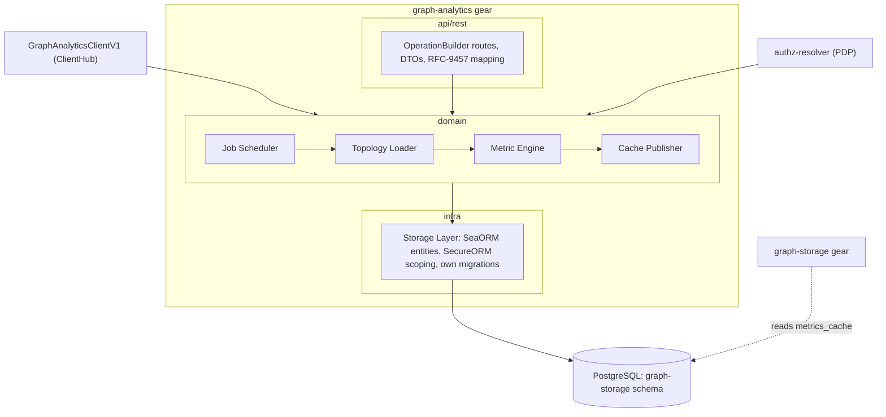
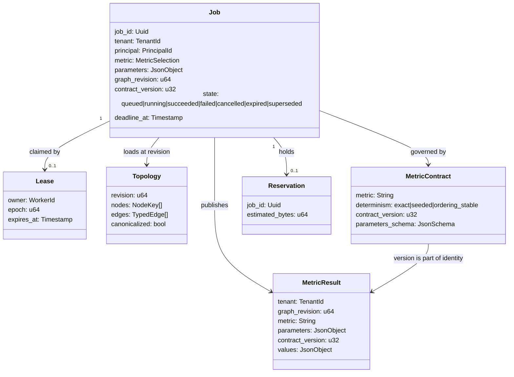

# Technical Design — Graph Analytics

<!-- toc -->

- [1. Architecture Overview](#1-architecture-overview)
  - [1.1 Architectural Vision](#11-architectural-vision)
  - [1.2 Architecture Drivers](#12-architecture-drivers)
  - [1.3 Architecture Layers](#13-architecture-layers)
- [2. Principles & Constraints](#2-principles--constraints)
  - [2.1 Design Principles](#21-design-principles)
  - [2.2 Constraints](#22-constraints)
- [3. Technical Architecture](#3-technical-architecture)
  - [3.1 Domain Model](#31-domain-model)
  - [3.2 Component Model](#32-component-model)
  - [3.3 API Contracts](#33-api-contracts)
  - [3.4 Internal Dependencies](#34-internal-dependencies)
  - [3.5 External Dependencies](#35-external-dependencies)
  - [3.6 Interactions & Sequences](#36-interactions--sequences)
  - [3.7 Database schemas & tables](#37-database-schemas--tables)
- [4. Additional context](#4-additional-context)
  - [Execution and Concurrency Contract](#execution-and-concurrency-contract)
  - [Capacity and Admission Contract](#capacity-and-admission-contract)
  - [Publication Atomicity and Retention](#publication-atomicity-and-retention)
  - [Determinism Contract](#determinism-contract)
  - [Authorization Model](#authorization-model)
  - [Error Model](#error-model)
  - [Readiness Matrix](#readiness-matrix)
  - [Telemetry Contract](#telemetry-contract)
- [5. Traceability](#5-traceability)

<!-- /toc -->

## 1. Architecture Overview

### 1.1 Architectural Vision

Graph Analytics is a stateless-above-PostgreSQL gear that computes whole-graph
structural metrics over the graph owned by graph-storage and publishes them into
a revision-keyed cache. It reads topology through a role that can see nothing
else and write nothing at all, and it owns exactly two tables: its job state and
its metrics cache.

The gear exists because whole-graph computation and interactive graph queries
have opposite resource profiles, and one deployment cannot bound both
independently. Everything else in this design follows from that: a durable job
machine because computations outlive requests, estimate-and-reserve admission
because memory arrives in large long-lived blocks, and revision-keyed conditional
publication because a graph can change while a job is thinking about it.

### 1.2 Architecture Drivers

| Priority | Requirement | Architectural response |
|---|---|---|
| `p1` | `cpt-cf-graph-analytics-fr-topology-load` | Topology Loader reads keys and typed edge pairs through the read-only role in one snapshot with the revision; ceilings checked before allocation |
| `p1` | `cpt-cf-graph-analytics-fr-schema-guard` | Declared schema version compared at startup and reconnect; mismatch is unhealthy readiness, submissions rejected |
| `p1` | `cpt-cf-graph-analytics-fr-core-metrics` | Metric Engine over the canonicalized topology; degree, PageRank, components with edge-type exclusion |
| `p2` | `cpt-cf-graph-analytics-fr-extended-metrics` | Seeded sampled Brandes betweenness and seeded community detection with stable ordering (ADR-0001) |
| `p1` | `cpt-cf-graph-analytics-fr-determinism` | Canonical input ordering before any seeded run; per-metric contract and immutable `algorithm_contract_version` in cache identity (ADR-0001) |
| `p1` | `cpt-cf-graph-analytics-fr-async-jobs` | Durable job table, leases with fencing epoch, atomic terminal transitions, cooperative cancellation (ADR-0002) |
| `p1` | `cpt-cf-graph-analytics-fr-scheduling` | Bounded queue, per-tenant fairness, estimate-and-reserve against a process-wide pool, deduplication on full job identity (ADR-0002) |
| `p1` | `cpt-cf-graph-analytics-fr-metrics-cache` | Conditional single-flight publication keyed by revision, parameters and contract version; bounded retention with race-safe cleanup |
| `p1` | `cpt-cf-graph-analytics-fr-tenant-isolation` | Every query scoped through SecureORM; one in-memory topology never spans tenants |
| `p1` | `cpt-cf-graph-analytics-fr-access-control` | Shared PolicyEnforcer for REST and ClientHub; whole-tenant permission, constrained scopes rejected; ownership tuple re-authorized per call |
| `p1` | `cpt-cf-graph-analytics-fr-rest-api` | OperationBuilder routes under `/api/graph-analytics/v1`, RFC-9457 problems, metric metadata endpoint |
| `p1` | `cpt-cf-graph-analytics-fr-sdk-client` | `GraphAnalyticsClientV1` in ClientHub over the same domain services; parity asserted in the contract suite |
| `p2` | `cpt-cf-graph-analytics-fr-observability` | Structural spans and per-limit saturation counters; content deny-by-default |
| `p1` | `cpt-cf-graph-analytics-fr-readiness` | Per-capability readiness; lease recovery completes before workers report ready |

#### NFR Allocation

| Priority | NFR | Target | Owning component | Mechanism | Verification |
|---|---|---|---|---|---|
| `p1` | `cpt-cf-graph-analytics-nfr-analytics-memory` | Topology-only, ceilings enforced | Topology Loader + Job Scheduler | Load keys and typed edge pairs only; refuse above node, edge or estimated-byte ceiling before allocation; reserve estimated peak from the pool; track allocation during the run | Profiling tests and refusal tests at each ceiling |
| `p1` | `cpt-cf-graph-analytics-nfr-interactive-isolation` | Cannot exhaust graph-storage resources | Deployment + Storage Layer | Own process, own connection pool, own memory budget; database role cannot write graph tables or read non-topology columns | Integration test: attempted write and payload/embedding `SELECT` both fail |
| `p1` | `cpt-cf-graph-analytics-nfr-tenant-zero-leak` | No cross-tenant data on any path | Storage Layer | SecureORM scoping on topology, cache and job queries; topology projection built per tenant | Adversarial multi-tenant tests, including publication after lease reclaim |
| `p1` | `cpt-cf-graph-analytics-nfr-code-coverage` | >= 85% line coverage | All crates | CI gate | Coverage report in CI |

#### Architecture Decisions

| ADR | Decision | Realized by |
|---|---|---|
| [`cpt-cf-graph-analytics-adr-inherited-determinism`](./ADR/0001-cpt-cf-graph-analytics-adr-inherited-determinism.md) | Algorithm set, canonical ordering, determinism classes and `algorithm_contract_version` adopted from graph-storage ADR-0004 unchanged; ownership transfers here | `cpt-cf-graph-analytics-component-metric-engine` |
| [`cpt-cf-graph-analytics-adr-execution-model`](./ADR/0002-cpt-cf-graph-analytics-adr-execution-model.md) | Durable job table, leases with fencing epoch, estimate-and-reserve admission, bounded queue, deduplication, conditional publication | `cpt-cf-graph-analytics-component-job-scheduler` |

### 1.3 Architecture Layers



- **API layer**: REST adapter and the ClientHub local client. Neither owns a permission check or a limit.
- **Domain layer**: scheduling, loading, computation and publication over storage ports; no infra types in domain signatures.
- **Infra layer**: SeaORM entities with `Scopable` tenancy, the read-only topology queries, and migrations for the two tables this gear owns — never for graph tables.

## 2. Principles & Constraints

### 2.1 Design Principles

#### Read Nothing But Topology

- [ ] `p1` - **ID**: `cpt-cf-graph-analytics-principle-topology-only`

The gear reads node keys with their interned type and typed edge pairs, and
nothing else. This is not a convention the code follows but a grant the database
enforces: payload, composed search text, embeddings and chunk contents are not
selectable by the analytics role. A future change that wanted them would have to
change a grant, in a review, rather than a query.

#### Isolation Is Structural

- [ ] `p1` - **ID**: `cpt-cf-graph-analytics-principle-structural-isolation`

The interactive path is protected by not sharing a process, a connection pool or
a memory budget with it — never by this gear's code being well behaved. The
previous in-process design could only state the obligation; this one makes it a
property of the deployment.

#### Admission Before Allocation

- [ ] `p1` - **ID**: `cpt-cf-graph-analytics-principle-admission-before-allocation`

Every bound is checked before memory is taken, not discovered while taking it. A
job whose topology exceeds a ceiling is refused naming the ceiling and the
observed value; a job that cannot reserve its estimated peak queues. Being killed
by the kernel is not an admission policy.

#### A Result Belongs To A Graph State

- [ ] `p1` - **ID**: `cpt-cf-graph-analytics-principle-result-belongs-to-state`

Every published result names the revision, parameters and contract version it was
computed under, and is served only under exactly that identity. A result for a
graph that has since changed is discarded rather than published, and a semantics
change bumps the contract version rather than reinterpreting old rows.

#### Determinism Comes From Ordered Inputs

- [ ] `p1` - **ID**: `cpt-cf-graph-analytics-principle-canonical-ordering`

A seed does not make an algorithm repeatable when row order, hash-map iteration
or adjacency layout vary. Inputs are canonicalized before any seeded algorithm
runs, and every tie-break is defined on node keys. ADR:
[`cpt-cf-graph-analytics-adr-inherited-determinism`](./ADR/0001-cpt-cf-graph-analytics-adr-inherited-determinism.md).

### 2.2 Constraints

#### Schema Is Not Ours

- [ ] `p1` - **ID**: `cpt-cf-graph-analytics-constraint-foreign-schema`

The graph tables belong to graph-storage, which owns all their DDL. This gear
migrates only `analytics_job` and `metrics_cache`, declares the graph schema
version it supports, and fails readiness on a mismatch rather than reading a
schema it does not understand.

#### PostgreSQL-Backed Graph Only

- [ ] `p1` - **ID**: `cpt-cf-graph-analytics-constraint-postgres-store`

The gear is unavailable when graph-storage runs on an external store plugin,
because there is no PostgreSQL schema to read. This is reported as an unavailable
capability, never approximated from a partial or stale source.

#### Single Instance In v1

- [ ] `p1` - **ID**: `cpt-cf-graph-analytics-constraint-single-instance`

The memory pool is process-wide, so two instances would each admit against their
own pool and jointly overcommit the host. v1 runs one instance per deployment;
multi-instance coordination is an open question, not a designed-around case.

#### No Raw SQL

- [ ] `p1` - **ID**: `cpt-cf-graph-analytics-constraint-no-raw-sql`

Every query goes through the platform's secure ORM with tenant scoping applied at
the query layer. The gear never holds a raw executor and never assembles SQL from
strings, including on the topology read path.

## 3. Technical Architecture

### 3.1 Domain Model



`Topology` is transient and never persisted: it is loaded, canonicalized,
consumed and dropped within one job. `MetricResult` is the only durable output,
and its identity is the tuple (tenant, revision, metric, parameters, contract
version) — the same tuple that keys deduplication, so a cache hit and a duplicate
submission are the same question asked at different times.

### 3.2 Component Model

#### Job Scheduler

- [ ] `p1` - **ID**: `cpt-cf-graph-analytics-component-job-scheduler`

##### Why this component exists

Admission, fairness, durability and recovery are one concern: each of them is a
decision about whether and when a job holds resources, and splitting them would
spread the memory pool across components that cannot see each other's decisions.

##### Responsibility scope

Job admission in order (permission, ceilings, per-tenant running and queued
limits, memory reservation from the process-wide pool); the bounded queue with
per-tenant fairness; deduplication on the full job identity so a duplicate joins
the in-flight job; the durable state machine with atomic terminal transitions;
lease acquisition, heartbeat, expiry and reclaim with a fencing epoch; release of
reservations on success, failure, cancellation and lease expiry alike;
cooperative cancellation including cancellation of jobs superseded by a newer
revision; and lease recovery before workers report ready (ADR-0002).

##### Responsibility boundaries

Does not load topology, does not compute, does not publish. Does not decide
whether a caller may submit — it consumes the decision from the shared enforcer.

##### Related components (by ID)

- `cpt-cf-graph-analytics-component-topology-loader` — invoked per admitted job
- `cpt-cf-graph-analytics-component-storage-layer` — job rows and lease updates

#### Topology Loader

- [ ] `p1` - **ID**: `cpt-cf-graph-analytics-component-topology-loader`

##### Why this component exists

The one place that touches graph tables. Concentrating it makes both the
read-only surface and the tenant predicate auditable in a single file rather than
wherever a metric happened to need an edge.

##### Responsibility scope

Reading node keys with their interned type and typed edge pairs with
discriminator through the read-only role, excluding tombstoned rows; observing
the graph revision in the same snapshot as the rows; enforcing the node, edge and
estimated-byte ceilings before allocating; applying edge-type exclusion at load
rather than after; and canonicalizing the projection — nodes by key, edges by
(type, source key, target key, discriminator), adjacency sorted by neighbour key
— before handing it to any algorithm.

##### Responsibility boundaries

Reads no payload, no composed search text, no embedding and no chunk; the grant
makes this true rather than the code. Never writes any graph table. Does not
persist a topology.

##### Related components (by ID)

- `cpt-cf-graph-analytics-component-metric-engine` — consumes the canonicalized projection
- `cpt-cf-graph-analytics-component-storage-layer` — scoped topology queries

#### Metric Engine

- [ ] `p1` - **ID**: `cpt-cf-graph-analytics-component-metric-engine`

##### Why this component exists

Each metric's output-affecting semantics are a versioned contract, and keeping
them behind one interface is what lets a crate be replaced without the API
contract naming a library.

##### Responsibility scope

Degree (total, in, out), connected components and PageRank; seeded sampled
Brandes betweenness above the exact threshold and exact below it; seeded
community detection with communities ordered by size then smallest member key;
the per-metric normative contract and determinism class; the immutable
`algorithm_contract_version`; allocation tracking against the job's reservation;
and cooperative cancellation at iteration boundaries (ADR-0001).

##### Responsibility boundaries

Does not read the database, does not decide admission, does not publish. Assumes
its input is already canonicalized — it does not re-sort, so a loader that
skipped canonicalization would produce quietly non-deterministic output, which is
why canonicalization is asserted at the boundary in tests rather than trusted.

##### Related components (by ID)

- `cpt-cf-graph-analytics-component-topology-loader` — canonicalized input
- `cpt-cf-graph-analytics-component-cache-publisher` — computed values

#### Cache Publisher

- [ ] `p1` - **ID**: `cpt-cf-graph-analytics-component-cache-publisher`

##### Why this component exists

Publication is where a long computation meets a graph that may have moved, and
where two workers may arrive at once. Both are correctness problems rather than
storage details.

##### Responsibility scope

Conditional publication — the result is written only if the graph revision is
unchanged since the job was admitted, otherwise the job terminates as superseded
and writes nothing; single-flight collapse of concurrent identical computations;
writing the entry keyed by (tenant, revision, metric, canonicalized parameters,
contract version); enforcing the retention bounds at publication (entry size,
parameter variants); and the race-safe background cleanup that never removes an
in-flight publication.

##### Responsibility boundaries

The only writer of `metrics_cache`. Does not compute, does not decide job state
beyond the terminal transition tied to its own outcome.

##### Related components (by ID)

- `cpt-cf-graph-analytics-component-job-scheduler` — terminal transition
- `cpt-cf-graph-analytics-component-storage-layer` — cache writes and cleanup

#### Storage Layer

- [ ] `p1` - **ID**: `cpt-cf-graph-analytics-component-storage-layer`

##### Why this component exists

One infra component owns entities, tenancy scoping and the migrations for the two
tables this gear owns, so that the boundary with graph-storage's schema is
enforceable in one place.

##### Responsibility scope

SeaORM entities with `Scopable` tenancy for `analytics_job` and `metrics_cache`;
read-only entity queries over the graph topology columns; migrations for this
gear's two tables only; the graph schema version probe; readiness probes;
connection pool sized independently of graph-storage's.

##### Responsibility boundaries

Contains no business rules. Never migrates a graph table and never writes one —
the role would refuse, and the code does not try. Covered by adversarial tenancy
tests and by a grant test that asserts what the role cannot do.

##### Related components (by ID)

- `cpt-cf-graph-analytics-component-job-scheduler`, `cpt-cf-graph-analytics-component-topology-loader`, `cpt-cf-graph-analytics-component-cache-publisher` — all data access

#### REST API

- [ ] `p1` - **ID**: `cpt-cf-graph-analytics-component-rest-api`

##### Why this component exists

The HTTP boundary: DTOs, OpenAPI, authentication, permission enforcement
delegation, limit validation and RFC-9457 mapping.

##### Responsibility scope

OperationBuilder route registration under `/api/graph-analytics/v1`; DTO
validation of bounds as a fast-fail projection of the admission contract;
permission declaration per operation with decisions delegated to the shared
PolicyEnforcer-backed service; the asynchronous job surface (`202 Accepted`,
status, result, cancel); the metric metadata endpoint exposing determinism class
and contract version; problem-details mapping; readiness endpoint.

##### Responsibility boundaries

Owns no permission check and no authoritative limit — both live in the domain
layer so the in-process path cannot bypass them.

##### Related components (by ID)

- `cpt-cf-graph-analytics-component-job-scheduler` — all operations
- `cpt-cf-graph-analytics-component-local-client` — parity requirement

#### ClientHub Local Client

- [ ] `p1` - **ID**: `cpt-cf-graph-analytics-component-local-client`

##### Why this component exists

In-process consumers need a typed path with exactly the REST semantics.

##### Responsibility scope

Implements `GraphAnalyticsClientV1` from the SDK crate over the same domain
services and the same security context path as REST; registered in ClientHub at
gear init.

##### Responsibility boundaries

No behavioural difference from REST beyond transport: identical permission
checks, identical admission limits, identical job contract. Parity tests are part
of the contract suite.

##### Related components (by ID)

- `cpt-cf-graph-analytics-component-rest-api` — behavioural parity requirement

### 3.3 API Contracts

The public surfaces are defined in the PRD as
`cpt-cf-graph-analytics-interface-rest-api` and
`cpt-cf-graph-analytics-interface-sdk-client`, with external contracts
`cpt-cf-graph-analytics-contract-topology-read` (required from graph-storage) and
`cpt-cf-graph-analytics-contract-metrics-cache` (provided to it).

**REST surface** (`/api/graph-analytics/v1`, all operations authenticated and permission-checked):

| Method | Path | Description | Priority |
|---|---|---|---|
| `POST` | `/api/graph-analytics/v1/jobs` | Submit a computation; `202` with a job id, or `200` with the recorded outcome when it deduplicates onto a completed job | p1 |
| `GET` | `/api/graph-analytics/v1/jobs/{job_id}` | Job status: state, admitted revision, contract version, deadline, terminal error when failed | p1 |
| `GET` | `/api/graph-analytics/v1/jobs/{job_id}/result` | Result, or `failed_precondition` while incomplete | p1 |
| `DELETE` | `/api/graph-analytics/v1/jobs/{job_id}` | Request cooperative cancellation | p1 |
| `GET` | `/api/graph-analytics/v1/metrics` | Metric catalog: determinism class, contract version, parameter schema, exact-vs-sampled threshold | p1 |
| `GET` | `/api/graph-analytics/v1/cache` | Read a cached result by metric, parameters and revision, without submitting a job | p2 |
| `GET` | `/api/graph-analytics/v1/health/ready` | Readiness with named problems | p1 |

**Shape decisions.**

- **Submission is one endpoint carrying a metric selection**, not one endpoint per
  metric. Several metrics over one topology share the load, which is the
  expensive part, so batching them is the difference between one topology read
  and four.
- **`202` versus `200` on submit** distinguishes admitted-and-running from
  answered-from-cache. A client that receives `200` never polls, which removes
  the most common source of duplicate submissions.
- **Cancellation is `DELETE` on the job**, not a `POST` to an action path: it is a
  request to stop, and it is idempotent — cancelling a terminal job succeeds
  without changing it.
- **The metric catalog is an endpoint, not documentation.** The determinism class
  and contract version are what a consumer needs to interpret a number and to
  decide whether two results are comparable, so they have to be machine-readable.
- **The cache read exists separately from job submission** so that a consumer with
  a revision in hand can ask "is this already computed" without creating a job
  whose only outcome would be a cache hit.

**Error contract**: RFC-9457 problem details. Submission errors are returned
immediately with no job created. Execution errors after `202` persist their
terminal category, stable reason, payload-free context and trace identifier with
the job, and are replayed by the result endpoint while status returns a
failed-job envelope. Unknown and unauthorized job identifiers are
indistinguishable.

**Versioning policy**: `/v1/` is additive-only — new metrics, optional fields and
endpoints ship without a major bump. A change to a metric's semantics is not an
API version change; it is an `algorithm_contract_version` increment, visible on
every result and in the metric catalog.

### 3.4 Internal Dependencies

`toolkit` (gear macro, lifecycle, OperationBuilder, ClientHub), `toolkit-db`/SecureORM (Scopable entities, DBRunner), `toolkit-gts` (permission instances), `toolkit-canonical-errors` (SDK error surface).

### 3.5 External Dependencies

- PostgreSQL, the graph-storage schema, through a role with `SELECT` on topology columns and write access to this gear's two tables only.
- Rust graph and algorithm crates (petgraph-family) behind the metric contracts, per ADR-0001.

### 3.6 Interactions & Sequences

#### Submit and Compute

**ID**: `cpt-cf-graph-analytics-seq-submit-compute`

**Actors**: `cpt-cf-graph-analytics-actor-data-analyst`

```
1. POST /jobs (metrics, params, edge-type exclusions)  [REST or SDK client]
2. AuthZ: whole-tenant analytics permission;           [Shared PolicyEnforcer]
   a constrained scope is rejected, not widened
3. Read current graph revision R                       [Topology Loader]
4. Dedup key = (tenant, R, metric, params,
   scope identity, contract version)                   [Job Scheduler]
   - matches a completed cache entry -> 200 + result
   - matches an in-flight job        -> 202 + that job id
5. Admission: ceilings, per-tenant limits, then        [Job Scheduler]
   reserve estimated peak from the process pool
   - cannot reserve -> queue; queue full -> 429
6. 202 Accepted + job id
7. Worker claims the job (lease + epoch)               [Job Scheduler]
8. Load topology at R in one snapshot; canonicalize    [Topology Loader]
9. Compute under the contract; track allocation;       [Metric Engine]
   check cancellation at iteration boundaries
10. Publish only if the revision is still R            [Cache Publisher]
    - moved -> terminal state superseded, no write
11. Terminal transition + reservation released         [Job Scheduler]
```

#### Lease Expiry and Reclaim

**ID**: `cpt-cf-graph-analytics-seq-lease-reclaim`

**Actors**: `cpt-cf-graph-analytics-actor-platform-admin`

```
1. Worker A holds the lease on job J at epoch N,
   then stalls or its process dies
2. Lease expires; reservation for J returns to the pool [Job Scheduler]
3. Recovery claims J at epoch N+1                       [Job Scheduler]
   (recovery completes before workers report ready)
4. Worker B recomputes and publishes at epoch N+1
5. Worker A wakes and attempts to publish at epoch N
   -> rejected on the epoch; A's result is discarded
6. J has exactly one terminal state and one result
```

#### Annotation Read by graph-storage

**ID**: `cpt-cf-graph-analytics-seq-annotation-read`

**Actors**: `cpt-cf-graph-analytics-actor-graph-storage`

```
1. graph-storage serves a projection, observing revision R
2. It reads metrics_cache for (tenant, R, metric, params,
   contract version)
3. Hit  -> per-node annotations attached
   Miss -> projection returned unannotated, flagged as such
4. Never an error, and never an annotation from a
   revision other than R
```

### 3.7 Database schemas & tables

- [ ] `p1` - **ID**: `cpt-cf-graph-analytics-db-schema`

This gear owns two tables inside the graph-storage database and migrates only
those. Graph tables are read through the topology role and never written; their
DDL belongs to graph-storage, whose schema version this gear declares support for
and verifies at readiness.

#### Table: analytics_job

**ID**: `cpt-cf-graph-analytics-dbtable-analytics-job`

| Column | Type | Description |
|--------|------|-------------|
| tenant_id | UUID | Tenant scope; part of every key |
| job_id | UUID | Opaque identifier; **PK (tenant_id, job_id)** |
| principal | TEXT | Submitting principal; with tenant, the ownership tuple |
| dedup_key | TEXT | (source epoch, revision, metric, params, scope identity, contract version); **UNIQUE (tenant_id, dedup_key)** while non-terminal |
| state | TEXT | queued / running / succeeded / failed / cancelled / expired / superseded |
| lease_owner / lease_epoch / lease_expires_at | TEXT / BIGINT / TIMESTAMPTZ | Worker lease with fencing epoch and heartbeat expiry |
| source_epoch | BIGINT | Source timeline the job was admitted on (graph-storage § Read Consistency Contract) |
| graph_revision | BIGINT | Revision the job was admitted at |
| contract_version | INTEGER | Algorithm contract version the job runs under |
| reserved_bytes | BIGINT | Memory reserved from the process pool; released on every terminal path |
| error_category / error_reason / trace_id | TEXT / TEXT / TEXT | Persisted terminal error, payload-free |
| result_ref | TEXT | Reference to the published cache entry |
| deadline_at / created_at / terminal_at | TIMESTAMPTZ | Job deadline and lifecycle timestamps |

The uniqueness of `dedup_key` is scoped to non-terminal rows so a completed job
does not block a later recomputation at the same revision — which is needed after
a contract-version bump, and after a cache entry is evicted by retention.

#### Table: metrics_cache

**ID**: `cpt-cf-graph-analytics-dbtable-metrics-cache`

| Column | Type | Description |
|--------|------|-------------|
| tenant_id | UUID | Tenant scope; part of every key |
| source_epoch | BIGINT | Source timeline the result was computed on |
| graph_revision | BIGINT | Revision the result was computed at |
| metric | TEXT | Metric name plus canonicalized parameters |
| contract_version | INTEGER | Immutable algorithm contract version; **PK (tenant_id, source_epoch, graph_revision, metric, contract_version)** |
| payload | JSONB | Per-node metric values |
| computed_at | TIMESTAMPTZ | Computation time |

graph-storage reads this table to annotate projections and never writes it, so
single-writer holds per table across the two gears.

`source_epoch` is in the key because `graph_revision` alone can be rewound by a
point-in-time restore of the graph store: after a restore the same revision
number describes a different graph, and an entry keyed on the revision alone
would be served against topology it never saw. Entries whose epoch is not the
current one are never served and are eligible for immediate cleanup; jobs
carrying a stale epoch are quarantined rather than resumed.

## 4. Additional context

### Execution and Concurrency Contract

The four failures worth naming, and what answers each (ADR-0002):

**1. A computation outliving its request.** The HTTP response cannot be the
result, so job state exists whether or not it is designed. Therefore: a durable
job row with an ownership tuple, a deadline, and terminal transitions that are
single atomic updates — including the cancellation-versus-publication race, which
is exactly the pair most likely to interleave.

**2. A worker dying mid-computation.** A job left `running` with nothing behind it
is unrecoverable, and a naive reclaim creates a second problem: the original
worker may still be alive. Therefore: leases with a fencing epoch. Reclaim
increments the epoch; the superseded worker's write is rejected on it rather than
racing. Recovery completes before workers report ready, so the gear never adds
new work while abandoned jobs are unresolved.

**3. Memory arriving in large, long-lived blocks.** Per-tenant concurrency cannot
bound the sum across tenants, and by the time an allocation fails the process is
already the wrong size. Therefore: estimate from node and edge counts plus key
sizes, reserve from a process-wide pool before starting, track allocation during
the run and terminate the job — not the process — if it exceeds its reservation.
Release on success, failure, cancellation and lease expiry alike; the last is the
path that leaks if it is forgotten.

**4. The client retry loop.** Poll, time out, resubmit is the natural client
behaviour and it multiplies the most expensive operation the platform has.
Therefore: deduplication on the full job identity, so a duplicate joins the
in-flight job and a submission matching a live cache entry never becomes a job at
all.

Cancellation is cooperative and checked at iteration boundaries, so a cancelled
job releases its reservation promptly rather than at the end of a computation
nobody wants. A job superseded by a newer graph revision is cancelled the same
way.

### Capacity and Admission Contract

Every bound is a named configuration key with a safe default and a hard range;
values outside the range are rejected at startup.

| Bound | Config key (`graph-analytics.limits.`) | Default | Hard range | Enforced at |
|---|---|---|---|---|
| Topology node ceiling | `max_nodes` | 1,000,000 | 1,000 – 10,000,000 | Job admission |
| Topology edge ceiling | `max_edges` | 10,000,000 | 10,000 – 100,000,000 | Job admission |
| Per-job memory budget | `max_bytes` | 2 GiB | 128 MiB – 32 GiB | Job admission (estimate) + allocation tracking |
| Process-wide memory pool | `global_max_bytes` | 4 GiB | 512 MiB – 128 GiB | Global admission (reservation) |
| Queue depth | `queue_depth` | 16 | 1 – 256 | Global admission |
| Worker count | `workers` | 2 | 1 – 64 | Startup |
| Per-tenant concurrent jobs | `tenant_max_jobs` | 1 | 1 – 8 | Job admission |
| Per-tenant queued jobs | `tenant_max_queued` | 4 | 1 – 64 | Job admission |
| Job deadline | `deadline_job` | 300 s | 10 s – 3,600 s | Cancellation token |
| Topology load deadline | `deadline_topology_load` | 60 s | 5 s – 600 s | DB `statement_timeout` |
| Lease duration | `lease_duration` | 60 s | 10 s – 600 s | Lease heartbeat |
| Exact betweenness threshold | `betweenness_exact_max_nodes` | 5,000 | 100 – 100,000 | Metric Engine |
| Metric cache entry size | `metrics_max_entry_bytes` | 4 MiB | 64 KiB – 64 MiB | Publication |
| Metric cache entries per tenant | `metrics_max_entries_per_tenant` | 200 | 10 – 10,000 | Background cleanup |
| Metric cache retained revisions | `metrics_retained_revisions` | 3 | 1 – 50 | Background cleanup |
| Metric parameter variants per metric | `metrics_max_param_variants` | 20 | 1 – 200 | Publication |
| Job record retention | `job_retention` | 7 days | 1 – 90 days | Background cleanup |

`lease_duration` deserves a note: it bounds how long an abandoned job stays
unreclaimed, so shortening it speeds recovery but raises the chance of reclaiming
a worker that is merely slow. The fencing epoch is what makes that safe to tune —
a premature reclaim costs duplicated work, never a wrong result.

Enforcement is layered, and the authoritative layer is shared:

1. **REST edge** — DTO validation as a fast-fail projection of the contract; never the only guard.
2. **Domain admission layer** — the authoritative check, executed identically for REST and the ClientHub local client. Reservations and per-tenant gates live here.
3. **Execution backstops** — `statement_timeout` on the topology load, cancellation tokens on computation, and allocation tracking against the reservation.

Rejections are classified by cause: a value outside a documented hard range is
`out_of_range` (backoff can never make it valid), an internally inconsistent
request is `invalid_argument`, and only transient queue, concurrency or memory
pressure is `resource_exhausted` (retryable, with a retry-after hint).
Termination by time or cancellation is `deadline_exceeded` or `cancelled`. Every
rejection carries the limit name, the configured bound and the requested value;
every limit exposes a saturation counter and a high-watermark gauge.

### Publication Atomicity and Retention

**One transaction publishes a result.** A succeeding job produces three durable
effects — the `metrics_cache` row, `analytics_job.result_ref` pointing at it, and
the `queued|running -> succeeded` terminal transition — and they commit together
or not at all. Any split leaves an observable lie: a cache row nothing references
(invisible, uncleanable, and counted against retention), a `succeeded` job whose
`result_ref` resolves to nothing, or a result served under a job the scheduler
still believes is running and may reclaim. The conditional revision re-check and
the single-flight uniqueness guard are evaluated inside that same transaction, so
a job superseded between computation and publication commits neither the row nor
the terminal state — it transitions to `superseded` instead, in one update.

Cancellation competes with publication through that single transition, so exactly
one of `succeeded` and `cancelled` wins and the loser writes nothing.

**Retention is ordered, not merely bounded.** Two independent windows govern the
same job, and the order between them is part of the contract:

| What | Key | Window | On expiry |
|---|---|---|---|
| Metric result | `metrics_cache` row | `metrics_retained_revisions`, `metrics_max_entries_per_tenant`, `metrics_max_param_variants` | Row deleted; the referencing job stays `succeeded` with `result_ref` marked evicted |
| Job record | `analytics_job` row | `job_retention` (7 days default) | Row deleted; the job id becomes unknown |

`job_retention` is required to be at least as long as the result windows can
keep an entry alive, so a live result never outlives the job row that describes
it — an entry whose provenance cannot be recovered is exactly what the
determinism contract exists to prevent. Configuration violating that ordering is
rejected at startup, alongside the other hard-range checks.

The two resulting client outcomes are distinct and both defined: a known job
whose result was evicted answers `not_found` / `JOB_RESULT_EXPIRED` (resubmit —
`dedup_key` uniqueness is scoped to non-terminal rows precisely so this
resubmission is admissible); an unknown or unauthorized job id answers
`not_found` / `NOT_FOUND`, indistinguishable by contract.

**Cleanup never races publication.** The background cleaner deletes only entries
that no non-terminal job references and whose epoch/revision is outside the
retained window, and it takes the same single-flight guard the publisher takes,
so an in-flight publication is never removed between its conditional check and
its commit.

### Determinism Contract

Adopted unchanged from graph-storage ADR-0004 (see
[`cpt-cf-graph-analytics-adr-inherited-determinism`](./ADR/0001-cpt-cf-graph-analytics-adr-inherited-determinism.md)).

| Metric | Determinism class | Contract covers |
|---|---|---|
| Degree (total, in, out) | exact | Edge multiplicity, self-loop treatment, direction handling |
| Connected components | exact | Direction handling (weak components), component ordering and labelling |
| PageRank | exact within tolerance | Damping, dangling-node redistribution, convergence tolerance, iteration cap |
| Betweenness centrality | exact below threshold, seeded above | Brandes normalization, endpoint inclusion, the sampling rule and seed |
| Community detection | ordering-stable | Graph construction, weighting, resolution, seed; communities ordered by size then smallest member key |

Canonical ordering is applied to every input before any seeded algorithm runs:
nodes by key, edges by (type, source key, target key, discriminator), adjacency
sorted by neighbour key, and all tie-breaks defined on node keys. Determinism
comes from ordered inputs plus the seed — never from incidental iteration order,
which is why the golden tests deliberately shuffle input row order and require
identical output.

`algorithm_contract_version` participates in cache identity, deduplication,
single-flight coordination, persisted rows, result provenance and the annotations
graph-storage reads. It is bumped whenever an output-affecting semantic, default,
sampling rule or implementation contract changes, so a cached result can never be
served under semantics it was not computed under.

### Authorization Model

Tenant scoping is the outer wall; the analytics permission and the job ownership
tuple are the inner ones.

**Shared PEP.** Decisions are made once, in a PolicyEnforcer-backed application
service invoked by both adapters. Neither the REST handler nor the ClientHub
local client owns a permission check, and parity is asserted in the contract
suite.

| Operation | ResourceType | Action | Composition |
|---|---|---|---|
| Submit | graph analytics | execute (whole-tenant) | Dedicated permission; a constrained resource scope is rejected, never widened |
| Status / result / cancel | analytics job | read / cancel | Ownership tuple (tenant, principal), re-authorized on every call; unknown and unauthorized identifiers indistinguishable |
| Metric catalog | graph analytics | read | Tenant-level; exposes contracts, never values |
| Cache read | graph analytics | execute (whole-tenant) | Same permission as submit — a cached whole-graph metric is the same disclosure as a freshly computed one |

**Why whole-tenant only.** A whole-graph metric aggregates every node in the
tenant, so a caller scoped to part of the graph would learn structure they cannot
read — a PageRank value over the full graph is not a projection of the same
computation over an authorized subgraph. v1 therefore rejects constrained scopes
rather than serving them a number that looks scoped and is not. Resource-scoped
analytics over an induced authorized subgraph, with a normalized scope
fingerprint in the cache identity, is the documented evolution path and is
already reserved in the dedup and cache keys.

**Decisions are not cached across requests.** One decision per request per
(ResourceType, action), reused across that request's own stages, so a revoked
grant stops applying on the next call. The same reasoning as graph-storage's:
without a revocation signal from the PDP, a TTL cache buys throughput at the cost
of a window in which a revoked permission still works.

### Error Model

| Condition | Canonical category | Reason | Client disposition |
|---|---|---|---|
| Bound outside its hard range | `out_of_range` | `LIMIT_OUT_OF_RANGE` | Fix the request; retry never helps |
| Topology exceeds a ceiling | `out_of_range` | `TOPOLOGY_TOO_LARGE` | Reduce scope or raise the ceiling; names bound and observed |
| Queue full, pool exhausted, tenant at limit | `resource_exhausted` | `ANALYTICS_BUSY` | Retry after the hint |
| Graph schema version mismatch | `failed_precondition` | `SCHEMA_VERSION_MISMATCH` | Operator action; no job is accepted |
| graph-storage on a non-PostgreSQL store | `unimplemented` | `CAPABILITY_UNSUPPORTED` | Analytics is unavailable in this deployment |
| Result requested before completion | `failed_precondition` | `JOB_NOT_COMPLETE` | Poll status |
| Unknown or unauthorized job | `not_found` | `JOB_NOT_FOUND` | Indistinguishable by design |
| Result evicted by retention | `not_found` | `JOB_RESULT_EXPIRED` | Resubmit |
| Deadline reached | `deadline_exceeded` | `JOB_DEADLINE` | Resubmit with fewer metrics, or raise the deadline |
| Cancelled, or superseded by a newer revision | `cancelled` | `JOB_CANCELLED` / `JOB_SUPERSEDED` | Resubmit at the current revision |

### Readiness Matrix

| Component | Degraded | Unhealthy | Aggregate effect |
|---|---|---|---|
| Database, own migrations | — | Unreachable, migrations unapplied | Gear not ready |
| Graph schema version | — | Declared version does not match | Gear not ready; submissions rejected naming both versions |
| Graph store backend | graph-storage on a store plugin | — | Analytics reported unavailable as a capability; the gear itself stays ready and answers with `CAPABILITY_UNSUPPORTED` |
| AuthZ resolver / types-registry | Elevated latency | Unreachable | Unhealthy: gear not ready; authenticated paths fail closed |
| Worker pool | Lease recovery in progress | No workers configured or all panicked | Submissions rejected with `unavailable`; recovery of expired leases completes before workers report ready |
| Memory pool | Above high-watermark threshold | — | New submissions queue or are rejected with a retry hint; running jobs unaffected |

Readiness is per capability; the aggregate is ready only when no component is
unhealthy. A degraded capability rejects exactly its own operations and never
silently widens behaviour.

### Telemetry Contract

Spans cover topology load (node and edge counts, duration, revision),
computation (metric, iteration count, duration, peak allocation against
reservation) and publication (cache hit or miss, whether the revision moved).
Metrics expose a saturation counter per enforced limit plus high-watermark gauges
for the memory pool and queue depth, and job-state counters by terminal category
so superseded and cancelled are distinguishable from failed.

Content is deny-by-default: node keys, GTS type identifiers and metric values
never appear in logs, spans, metrics or error attributes. Only counts, sizes,
durations, bounded enums, graph revision, contract version and opaque correlation
identifiers are permitted. Node keys are tenant data even when the aggregate
computed over them is not.

## 5. Traceability

- **PRD**: [PRD.md](./PRD.md)
- **ADRs**: [ADR/](./ADR/)
- **Upstream decision**: [`cpt-cf-graph-storage-adr-analytics-own-gear`](../../graph-storage/docs/ADR/0007-cpt-cf-graph-storage-adr-analytics-own-gear.md)
