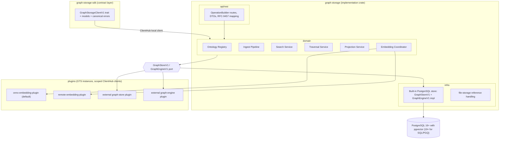
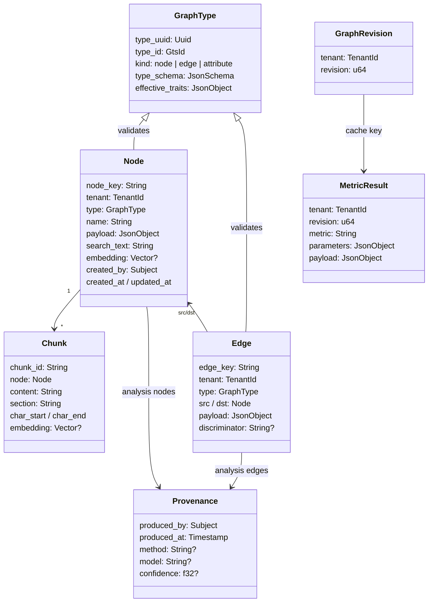

# Technical Design — Graph Storage

<!-- toc -->

- [1. Architecture Overview](#1-architecture-overview)
  - [1.1 Architectural Vision](#11-architectural-vision)
  - [1.2 Architecture Drivers](#12-architecture-drivers)
  - [1.3 Architecture Layers](#13-architecture-layers)
- [2. Principles & Constraints](#2-principles--constraints)
  - [2.1 Design Principles](#21-design-principles)
  - [2.2 Constraints](#22-constraints)
- [3. Technical Architecture](#3-technical-architecture)
  - [3.1 Domain Model](#31-domain-model)
  - [3.2 Component Model](#32-component-model)
  - [3.3 API Contracts](#33-api-contracts)
  - [3.4 Internal Dependencies](#34-internal-dependencies)
  - [3.5 External Dependencies](#35-external-dependencies)
  - [3.6 Interactions & Sequences](#36-interactions--sequences)
  - [3.7 Database schemas & tables](#37-database-schemas--tables)
- [4. Additional context](#4-additional-context)
  - [Prototype Lineage](#prototype-lineage)
  - [Phantom Materialization Contract](#phantom-materialization-contract)
  - [Concurrent Ingest Protocol](#concurrent-ingest-protocol)
  - [Soft Delete Contract](#soft-delete-contract)
  - [Label Contract](#label-contract)
  - [Authorization Model](#authorization-model)
  - [Read Consistency Contract](#read-consistency-contract)
  - [Tenant Offboarding and Deletion Monotonicity](#tenant-offboarding-and-deletion-monotonicity)
  - [Error Model](#error-model)
  - [Deadlines and Cancellation](#deadlines-and-cancellation)
  - [Readiness Matrix](#readiness-matrix)
  - [Telemetry and Audit Contract](#telemetry-and-audit-contract)
  - [Traversal Backend Sketch](#traversal-backend-sketch)
  - [Plugin Selection and Lifecycle](#plugin-selection-and-lifecycle)
  - [Capacity and Admission Contract](#capacity-and-admission-contract)
  - [Base Ontology Publication](#base-ontology-publication)
- [5. Traceability](#5-traceability)

<!-- /toc -->

## 1. Architecture Overview

### 1.1 Architectural Vision

Graph Storage is a **stateless gateway** over a pluggable store: it holds no graph state of its own, and every byte it serves comes from a `GraphStoreV1` implementation behind the port. It stores one typed, multi-tenant knowledge graph and serves three query shapes over it: lexical/vector/hybrid search, depth-limited traversal, and bounded projections. One store is the source of truth for everything — nodes, edges, chunks, types, vectors, labels, and the graph revision — so consistency, tenancy, and authorization are enforced in exactly one place. The built-in implementation is a single PostgreSQL schema, registered through the same plugin path an external store would use; nothing in the API surface, the authorization model or the error contract depends on it being PostgreSQL. Whole-graph analytics reads that store through a topology-only role from its own gear (graph-analytics ADR-0002).

The design generalizes the `studio-graph-storage` prototype: its data model (typed nodes and edges with GTS contracts, deterministic keys, phantom nodes, static/analysis edge split), its retrieval stack (tsvector + pgvector + RRF fusion, chunk folding), and its analytics surface are carried forward (the last into a separate gear, graph-analytics ADR-0002); its Python-only dependencies (Apache AGE, NetworkX, sentence-transformers) are replaced by decisions recorded in ADR-0001, graph-analytics ADR-0001, and ADR-0004; and platform obligations the prototype deliberately skipped — tenancy, access control, pagination, batched writes, observability — are designed in from the start.

The gear follows the standard ToolKit gear anatomy: an SDK crate exposing a typed client trait and transport-agnostic models, an implementation crate with API/domain/infra layers, and **three** plugin surfaces — graph stores behind `GraphStoreV1` (ADR-0001), graph engines behind `GraphEngineV1` for traversal (ADR-0001), and embedding providers (ADR-0004). The built-in PostgreSQL store and engine are the defaults for the first two and are registered exactly as an external plugin is.

### 1.2 Architecture Drivers

#### Functional Drivers

| Priority | Requirement | Design Response |
|----------|-------------|-----------------|
| `p1` | `cpt-cf-graph-storage-fr-type-registration` | Ontology Registry component validates draft-07 schemas, derives UUIDv5 identifiers via platform GTS, applies batches atomically, rejects conflicting re-registration |
| `p1` | `cpt-cf-graph-storage-fr-type-constraints` | Registry enforces abstractness and edge endpoint patterns; Ingest Pipeline validates payloads across the full GTS derivation chain with JSON-pointer error reporting |
| `p2` | `cpt-cf-graph-storage-fr-type-catalog` | Registry read endpoints list and fetch registered types with schemas, constraints, and derived UUIDs |
| `p1` | `cpt-cf-graph-storage-fr-index-admission` | Type registration reserves estimated index footprint and passes per-tenant/global path caps before intent commits; accepted intents run through a bounded tenant-fair DDL queue at background priority (§ Capacity and Admission Contract, ADR-0003) |
| `p1` | `cpt-cf-graph-storage-fr-bulk-ingest` | Ingest Pipeline validates whole batches, writes nodes/edges/chunks with batched statements in one transaction, bumps the tenant graph revision; durable idempotency keys with recorded outcomes make retries after unknown commit results safe (Concurrent Ingest Protocol) |
| `p1` | `cpt-cf-graph-storage-fr-stable-identity` | Producer-supplied node keys unique per tenant; edge keys derived as a hash of type, endpoints, and discriminator; concrete node types immutable under upsert with optional expected-version CAS, endpoint validation under row locks (Concurrent Ingest Protocol) |
| `p1` | `cpt-cf-graph-storage-fr-reference-nodes` | Unified node table; owned/reference semantics carried by GTS base types per ADR-0002; all query components type-agnostic |
| `p2` | `cpt-cf-graph-storage-fr-phantom-nodes` | Ingest Pipeline materializes phantom-typed nodes for dangling edge endpoints; real ingest replaces phantoms in place |
| `p1` | `cpt-cf-graph-storage-fr-edge-provenance` | Provenance attribute type in the base ontology; scope replacement predicate excludes analysis-originated rows |
| `p1` | `cpt-cf-graph-storage-fr-scope-replace` | Declarative replace-scope executed in the ingest transaction: delete static rows of the scope absent from the batch; replacements serialize on the canonical scope identity and carry monotonic source generations (Concurrent Ingest Protocol) |
| `p1` | `cpt-cf-graph-storage-fr-node-read` | Node read path joins node, chunk inventory, and adjacent edges with limits |
| `p2` | `cpt-cf-graph-storage-fr-content-chunking` | Chunker produces deterministic, offset-preserving chunks with location-encoded identifiers; chunks indexed and embedded individually |
| `p2` | `cpt-cf-graph-storage-fr-heavy-content-offload` | Payload size ceiling enforced at ingest; payloads reference file-storage identifiers that the gear never dereferences |
| `p1` | `cpt-cf-graph-storage-fr-embedding-pipeline` | Embedding Coordinator composes search text from vectorized attributes, batches provider calls, preserves vectors on non-embedding upserts |
| `p1` | `cpt-cf-graph-storage-fr-embedding-dim-guard` | Readiness compares the provider-declared embedding-space identity (model, tokenizer, preprocessing/pooling) and dimension against the identity recorded for stored vectors; mismatch fails readiness and blocks vector search; ingest rejects mismatched vector widths |
| `p1` | `cpt-cf-graph-storage-fr-lexical-search` | Lexical arm: web-style tsquery over node and chunk tsvectors with ranked results, snippets, and chunk-to-node folding |
| `p1` | `cpt-cf-graph-storage-fr-vector-search` | Vector arm: provider-embedded query against HNSW cosine indexes over node and chunk vectors, folded to nodes |
| `p1` | `cpt-cf-graph-storage-fr-hybrid-search` | Search Service runs both arms independently and fuses with RRF, reporting per-arm ranks |
| `p1` | `cpt-cf-graph-storage-fr-type-filtering` | GTS family patterns resolved to a set of interned type ids through `GtsIdPattern` and applied as set membership in every search arm; never compiled to SQL text |
| `p1` | `cpt-cf-graph-storage-fr-read-consistency` | Compound reads (hybrid search, traversal + hydration, projections) execute on one repeatable-read snapshot; responses report the observed graph revision; continuation tokens are revision-bound (Read Consistency Contract) |
| `p1` | `cpt-cf-graph-storage-fr-graph-traversal` | Traversal Service expands breadth-first through the GraphQueryPort: SQL/PGQ `GRAPH_TABLE` hop patterns from v1 for fixed-depth shapes (direction-explicit, per-hop dedup), iterative scoped hops for variable depth until PG20-class quantifiers, per ADR-0001 |
| `p1` | `cpt-cf-graph-storage-fr-neighborhood-projection` | Projection Service returns degree-ordered, budget-truncated neighborhoods with phantom toggle and metric annotations |
| `p1` | `cpt-cf-graph-storage-fr-tabular-projection` | Projection Service serves OData-filtered, paginated node tables over the payload paths a type declares in its `index` trait, plus labels; paged with the platform `CursorV1` |
| `p1` | `cpt-cf-graph-storage-fr-soft-delete` | Tombstone on node and edge; incident edges follow the node in one transaction; every read path and every read-path index filters on it (Soft Delete Contract) |
| `p2` | `cpt-cf-graph-storage-fr-labels` | Per-tenant label registry and assignment table; attach/detach as its own action; label filtering in search, projection and per-hop traversal (Label Contract) |
| `p2` | `cpt-cf-graph-storage-fr-change-events` | `emit_events` trait per type, overridable per GTS pattern by configuration; published through the transactional outbox with the committing revision |
| `p2` | `cpt-cf-graph-storage-fr-analytics-topology` | Read-only role over node keys, typed edge pairs and `gts_type`; payload, vectors and chunks not readable through it (graph-analytics ADR-0002) |
| `p2` | `cpt-cf-graph-storage-fr-metric-annotation` | Projection Service annotates from the analytics gear's revision-keyed cache, or returns unannotated and says so |
| `p1` | `cpt-cf-graph-storage-fr-revision-signal` | Graph revision incremented in the same transaction as any state change, and only then; exposed on both the topology surface and the API |
| `p1` | `cpt-cf-graph-storage-fr-tenant-isolation` | Every entity is tenant-scoped through SecureORM; traversal recursion, search arms, and the analytics topology surface carry the tenant predicate |
| `p1` | `cpt-cf-graph-storage-fr-access-control` | Shared PolicyEnforcer-backed application service for REST and ClientHub; PDP-checked permissions (ontology admin, ingest, query, delete, label attach/detach) declared as GTS instances; resource-level enforcement per the Authorization Model (induced authorized subgraph, arm-level scoping, anti-enumeration) |
| `p1` | `cpt-cf-graph-storage-fr-source-ownership` | Source namespaces bound to producer principals in a tenant-scoped registry; `node.source_namespace` / `node.owner_principal` written once and compared on every upsert; transfer is an audited administrative flow (§ Authorization Model) |
| `p2` | `cpt-cf-graph-storage-fr-tenant-offboarding` | Deletion generation from the control-plane ledger; fence, cancel, delete tenant-keyed state, acknowledge; unreconciled tenants quarantined and readiness withheld (§ Tenant Offboarding and Deletion Monotonicity) |
| `p1` | `cpt-cf-graph-storage-fr-snapshot-identity` | `(source_epoch, graph_revision)` is the snapshot identity in continuation tokens, cache keys, job identity and plugin cursors; epoch rotated before readiness after restore (§ Read Consistency Contract) |
| `p1` | `cpt-cf-graph-storage-fr-audit-envelope` | Gear-assigned envelope (tenant, key, timestamps, tombstone, acting subject per verb) on every element read, read-only on write and described by the OpenAPI schema rather than by the registered GTS type (§ API element envelope) |
| `p1` | `cpt-cf-graph-storage-fr-rest-api` | Versioned REST under `/api/graph-storage/v1` with OpenAPI schemas, RFC-9457 problems, documented limits |
| `p1` | `cpt-cf-graph-storage-fr-sdk-client` | SDK crate with `GraphStorageClientV1` trait registered in ClientHub; local client delegates to domain services |
| `p2` | `cpt-cf-graph-storage-fr-observability` | Structural tracing spans (batch sizes, arm timings, frontier sizes, cache hits) and OTel metrics, including per-limit saturation counters from the Capacity and Admission Contract; payload content never logged |
| `p1` | `cpt-cf-graph-storage-fr-readiness` | Per-capability readiness (DB and migrations, server major version and SQL/PGQ availability on it, pgvector, property graph, registries, embedding provider and identity, engine plugins, dynamic indexes) reported as healthy/degraded/unhealthy with named problems; degraded capabilities reject only their own operations (Readiness Matrix) |

#### NFR Allocation

| Priority | NFR ID | NFR Summary | Allocated To | Design Response | Verification Approach |
|----------|--------|-------------|--------------|-----------------|----------------------|
| `p1` | `cpt-cf-graph-storage-nfr-ingest-throughput` | 10k nodes + 20k edges <= 60 s | Ingest Pipeline, Storage Layer | Batched multi-row statements, single transaction, validation before writes, bounded per-batch memory | Ingest benchmark suite on reference profile |
| `p1` | `cpt-cf-graph-storage-nfr-search-latency` | Hybrid p95 <= 500 ms at 100k nodes | Search Service, Storage Layer | Independent arm queries each using its index (GIN, HNSW), bounded arm limits, fusion in memory | Search benchmarks on seeded reference graph |
| `p1` | `cpt-cf-graph-storage-nfr-traversal-latency` | Depth-3 p95 <= 1 s at 500k edges | Traversal Service, Storage Layer | Composite edge indexes (tenant, src), (tenant, dst); per-hop frontier bounding; node budgets | Traversal benchmarks on seeded reference graph |
| `p2` | `cpt-cf-graph-storage-nfr-analytics-memory` | Topology-only read surface | Storage Layer (grant) | Expose node keys with interned type and typed edge pairs and nothing wider; the read-only role makes payload, `search_text`, embedding and chunk columns unreadable rather than merely unused. Computation ceilings move with the analytics gear (its ADR-0002) | Grant tests: an attempted write and a payload/embedding `SELECT` both fail |
| `p1` | `cpt-cf-graph-storage-nfr-response-bound` | Aggregate response ceilings | Domain admission, all read components | Cumulative payload bytes, edge count, annotation bytes and total serialized bytes bounded before hydration; deterministic truncation at the established ordering, reported in the response | Benchmark at maximum admissible cardinality asserts the ceilings hold |
| `p1` | `cpt-cf-graph-storage-nfr-tenant-fairness` | One tenant cannot starve another | Domain admission, Storage Layer | Global caps alongside per-tenant caps, bounded per-tenant queues with round-robin dispatch, reserved interactive connection share above background work | Saturation test with one heavy and one light tenant asserts the light tenant's p95 stays within a documented factor |
| `p1` | `cpt-cf-graph-storage-nfr-tenant-zero-leak` | Zero cross-tenant results | Storage Layer, all query components | Tenant predicate injected by SecureORM scoping in every query, including every CTE body; no raw unscoped SQL | Adversarial multi-tenant integration tests |
| `p1` | `cpt-cf-graph-storage-nfr-code-coverage` | >= 85% line coverage | All crates | Trait-based ports enable mock-driven unit tests; integration tests against real PostgreSQL | `cargo llvm-cov` in CI |

#### Key ADRs

| ADR ID | Decision | Materialized By |
|--------|----------|-----------------|
| [`cpt-cf-graph-storage-adr-single-postgres-store`](./ADR/0001-cpt-cf-graph-storage-adr-single-postgres-store.md) | Single PostgreSQL 16+ store (pgvector only; SQL/PGQ a probed capability on 19+); graph queries behind the GraphQueryPort with SQL/PGQ active from v1 (fixed-depth shapes) and iterative scoped hops for variable depth; pinned beta image until PG19 GA; Apache AGE not carried into the gear; dedicated traversal mirror as a measured-bottleneck contingency | `cpt-cf-graph-storage-principle-single-source-of-truth`, `cpt-cf-graph-storage-component-traversal-service`, `cpt-cf-graph-storage-component-storage-layer` |
| [`cpt-cf-graph-storage-adr-unified-node-model`](./ADR/0002-cpt-cf-graph-storage-adr-unified-node-model.md) | One typed node model; owned vs. reference semantics via GTS base types; provenance-gated scope replacement | `cpt-cf-graph-storage-principle-reference-not-replica`, `cpt-cf-graph-storage-principle-provenance-survives-resync`, `cpt-cf-graph-storage-component-ontology-registry`, `cpt-cf-graph-storage-component-ingest-pipeline` |
| [`cpt-cf-graph-storage-adr-metadata-partitioning`](./ADR/0003-cpt-cf-graph-storage-adr-metadata-partitioning.md) | Common columns + schema-declared indexed/vectorized attributes + payload ceiling with file-storage offload | `cpt-cf-graph-storage-principle-metadata-only-graph`, `cpt-cf-graph-storage-component-ontology-registry`, `cpt-cf-graph-storage-component-projection-service` |
| [`cpt-cf-graph-storage-adr-embedding-provider`](./ADR/0004-cpt-cf-graph-storage-adr-embedding-provider.md) | Pluggable embedding provider; in-process ONNX default, remote plugin, deterministic fake for CI | `cpt-cf-graph-storage-component-embedding-coordinator`, `cpt-cf-graph-storage-constraint-single-embedding-space` |
| [`cpt-cf-graph-storage-adr-sqlpgq-access`](./ADR/0005-cpt-cf-graph-storage-adr-sqlpgq-access.md) | SQL/PGQ is emitted from typed input through a function-call table reference (no `sea_query` fork, no hand-written SQL); every identifier comes from a closed vocabulary and every value is bound; a pattern carries the tenant bound and proposes candidates while an ordinary scoped query authorizes them; a scope whose tenants cannot be enumerated falls back to the two-query hop | `cpt-cf-graph-storage-component-traversal-service`, `cpt-cf-graph-storage-component-storage-layer` |

Two decisions this gear depends on are owned by the `graph-analytics` gear and
recorded in its ADR set: [how metrics are computed and what determinism they
promise](../../graph-analytics/docs/ADR/0001-cpt-cf-graph-analytics-adr-rust-determinism.md),
and [the boundary that makes analytics a separate deployment unit reading this
schema over a read-only role](../../graph-analytics/docs/ADR/0002-cpt-cf-graph-analytics-adr-own-gear-boundary.md).
What this gear owes them is `cpt-cf-graph-storage-fr-analytics-topology`,
`cpt-cf-graph-storage-fr-metric-annotation` and
`cpt-cf-graph-storage-fr-revision-signal`; the DDL, the revision and the grant
stay here.

### 1.3 Architecture Layers

Standard ToolKit gear layering:



The arrow that matters is `DOMAIN --> PORT`. No domain service reaches an entity,
a statement or a connection; the built-in PostgreSQL store sits behind the same
port an external store does, and lives in `infra` only because co-locating the
default avoids a crate boundary — not because it is privileged.

- **SDK crate** (`graph-storage-sdk`): client trait, transport-agnostic models, GTS identifier constants for the base ontology. No serde/HTTP/DB dependencies.
- **API layer**: REST DTOs and handlers only; every route registered through OperationBuilder with authentication and permissions.
- **Domain layer**: the seven services above, expressed over storage ports; no infra types in domain signatures.
- **Infra layer**: the built-in `GraphStoreV1` / `GraphEngineV1` implementation — SeaORM entities with `Scopable` tenancy, repositories generic over `DBRunner`, migrations, traversal SQL — plus the file-storage reference adapter.
- **Plugins**: graph stores, graph engines and embedding providers, each behind its versioned trait and discovered via GTS plugin instances. The built-in store and engine are registered through that same path, so an external implementation replaces them by registration rather than by a code change.

## 2. Principles & Constraints

### 2.1 Design Principles

#### Single Source of Truth

- [ ] `p1` - **ID**: `cpt-cf-graph-storage-principle-single-source-of-truth`

All graph state — nodes, edges, chunks, types, vectors, labels, revisions — lives in one store, reached through one port (`GraphStoreV1`). No mirrors, no dual writes, no derived stores that can drift; a graph engine or an analytics projection is always a rebuildable view of that one source of truth, never a second one. The built-in store is a single PostgreSQL schema and is what every deployment gets by default; the principle is the singularity, not the vendor. ADR: [`cpt-cf-graph-storage-adr-single-postgres-store`](./ADR/0001-cpt-cf-graph-storage-adr-single-postgres-store.md).

#### Everything Is Typed

- [ ] `p1` - **ID**: `cpt-cf-graph-storage-principle-everything-typed`

No node or edge enters the graph without a registered GTS type, and no payload is stored without passing its full derivation-chain validation. The type registry is the contract boundary between independent producers.

#### Reference, Not Replica

- [ ] `p1` - **ID**: `cpt-cf-graph-storage-principle-reference-not-replica`

The graph never becomes a system of record for managed objects owned elsewhere. Reference nodes carry canonical identifiers plus bounded queryable projections; full records are fetched from the owning gear. ADR: [`cpt-cf-graph-storage-adr-unified-node-model`](./ADR/0002-cpt-cf-graph-storage-adr-unified-node-model.md).

#### Metadata-Only Graph

- [ ] `p1` - **ID**: `cpt-cf-graph-storage-principle-metadata-only-graph`

The graph stores what queries need: names, indexed attributes, vectorizable text, bounded content. Heavy content is rejected at the payload ceiling and lives in file storage, referenced by identifier. ADR: [`cpt-cf-graph-storage-adr-metadata-partitioning`](./ADR/0003-cpt-cf-graph-storage-adr-metadata-partitioning.md).

#### Provenance Survives Re-Sync

- [ ] `p1` - **ID**: `cpt-cf-graph-storage-principle-provenance-survives-resync`

Re-importing source data is always safe: scope replacement removes only static content, and analysis-originated nodes and edges — identified by provenance — persist across it.

#### Tenant-Scoped by Construction

- [ ] `p1` - **ID**: `cpt-cf-graph-storage-principle-tenant-scoped`

Every table carries tenancy and every query path — including traversal SQL and analytics topology loading — goes through SecureORM scoping. There is no unscoped query API in the codebase.

#### Every Query Is Bounded

- [ ] `p1` - **ID**: `cpt-cf-graph-storage-principle-bounded-queries`

Every operation has explicit bounds — batch sizes, result limits, traversal depth, node/edge/byte budgets, deadlines, and per-tenant concurrency — defined by the [Capacity and Admission Contract](#capacity-and-admission-contract). Authoritative enforcement lives in the domain admission layer shared by REST and the ClientHub local client (API-edge validation is a fast-fail projection, never the only guard). Unbounded work is rejected with a canonical resource-exhausted error, never attempted.

### 2.2 Constraints

#### PostgreSQL with pgvector

- [ ] `p1` - **ID**: `cpt-cf-graph-storage-constraint-postgres-pgvector`

The storage backend is PostgreSQL 16 or later with the pgvector extension. SQL/PGQ is a *probed capability*, not a baseline requirement: on PostgreSQL 19+ with the property graph present the SQL/PGQ traversal backend is selected, and on earlier majors traversal is served by the iterative-CTE and entity-query backends with no functional difference to the caller. Readiness reports the server major and property-graph presence, and takes the gear out of service only when an operator explicitly configured a backend the server cannot provide (§ Readiness Matrix).

**Found while building the prototype: the gear probes by attempting, not by asking.** A running gear cannot ask the server what version it is. The secure ORM's runner is sealed — deliberately, since an escape hatch for `SELECT current_setting('server_version_num')` is an escape hatch for anything — so there is no statement API a gear can reach `pg_catalog` through. It does not need one: the capability that decides the hop is not "what major is this" but "will a pattern over the declared graph execute here", and that is answered by running one. At startup the gear issues the same pattern every hop uses, under a scope that matches no rows, and reads the outcome — one empty result set on a server that has SQL/PGQ, an error on one that does not. Per request, a pattern that fails for any reason other than a scope refusal falls back to the two-query hop with the reason logged.

What the attempt cannot give is the *reason*: it reports that the pattern did not run, not that the server is a PostgreSQL 16. Readiness is specified to report the server major (§ Readiness Matrix), and that needs a narrow read-only capability surface from the platform (`server_version()`, `has_extension(..)`) which does not exist yet — a reporting gap, not a correctness one. Until it does, readiness reports the capability and the log carries the server's own error text. Deployments wanting SQL/PGQ before PostgreSQL 19 GA run a pinned PG19 beta image with pgvector built from a pinned source revision (validated by the PG19 spike and the prototype) and return to stock PostgreSQL plus released pgvector at GA. No other extensions and no other database engines are supported; the gear does not target multi-engine portability because tsvector, JSONB indexing, and pgvector are load-bearing.

#### GTS Draft-07 Contracts

- [ ] `p1` - **ID**: `cpt-cf-graph-storage-constraint-gts-draft07`

Type schemas are JSON Schema draft-07 with the platform GTS identifier grammar and UUIDv5 derivation (interoperable with the platform Rust GTS implementation). Abstractness and finality use the platform keywords `x-gts-abstract` and `x-gts-final`; family semantics, endpoint constraints, index/full-text/vector declarations and event emission are trait values under the gear's trait schemas (Base Ontology GTS Schemas). The gear registers no extension keyword of its own, and a schema carrying an unknown one is rejected.

#### Gears Platform Integration

- [ ] `p1` - **ID**: `cpt-cf-graph-storage-constraint-gears-platform`

The gear integrates with the CF/Gears runtime: ToolKit gear lifecycle, OperationBuilder routes, SecurityContext, ClientHub registration, SecureORM tenancy, RFC-9457 errors, and platform observability.

#### One Embedding Space per Deployment

- [ ] `p1` - **ID**: `cpt-cf-graph-storage-constraint-single-embedding-space`

Exactly one embedding provider configuration is active per deployment at a time, identified by its full embedding-space identity (model artifact, tokenizer, preprocessing and pooling configuration) — not only its dimension. The identity under which stored vectors were produced is recorded durably; readiness verifies the active provider against it and blocks vector search on mismatch. The vector column dimension is fixed at migration time. Changing the model requires re-embedding. ADR: [`cpt-cf-graph-storage-adr-embedding-provider`](./ADR/0004-cpt-cf-graph-storage-adr-embedding-provider.md).

#### Payload Size Ceiling

- [ ] `p1` - **ID**: `cpt-cf-graph-storage-constraint-payload-ceiling`

Node payloads above the configured ceiling are rejected at ingest. The ceiling is a hard deployment constraint that keeps index maintenance and query latency predictable.

## 3. Technical Architecture

### 3.1 Domain Model



Domain vocabulary follows the PRD glossary. The base ontology published by the gear (owned-node base, reference-node base, phantom type, provenance attribute type, static and analysis edge bases) is part of the domain model: producers derive from it, and the ingest pipeline reads family semantics (owned/reference, static/analysis) from the type hierarchy rather than from per-request flags.

#### Base Ontology GTS Schemas

- [ ] `p1` - **ID**: `cpt-cf-graph-storage-entity-base-ontology`

The gear publishes three abstract bases (node, edge, attribute) and six family
types derived from them. A node or edge producer derives its own types from a
family type, never from a base directly.

Four of the six families are themselves abstract (owned, reference, static,
analysis); the other two are not, and deliberately so — `phantom_node` is final
because the *gear* instantiates it for an unresolved endpoint and nothing
derives from it, and `provenance` is a concrete attribute embedded in analysis
edge payloads. The per-family table below is authoritative on which is which.

**Found while building the prototype.** Attributes have no families: the
attribute base fixes no `family` trait, and `provenance` derives straight from
it. The "derive from a family, never from a base" rule and the required-`family`
rule below are therefore node and edge rules. An implementation that applies
them to attributes rejects the gear's own provenance type.

**What the schema describes — and what it deliberately does not.** A GTS type
here describes the **producer-authored** part of an element: what a producer may
send, what a derived type may extend, and what the gear validates a submission
against. It is not the API schema of the element. The gear-assigned envelope —
tenant, timestamps, acting subjects, soft-delete tombstone, graph revision — is
described by the OpenAPI schema instead, and § API element envelope states it in
one place.

The separation is not stylistic. A GTS type can also be instantiated *statically*
in the types-registry, as a well-known instance that is configuration rather than
runtime state; `created_at` and `updated_by` have no value to carry there, and a
type that declares them forces every such instance to answer a question that does
not apply to it. And the two contracts evolve on different clocks: the envelope
changes when the platform's audit conventions change, the type changes when a
domain does. Binding them into one document couples them.

What remains in the type maps to columns, with `payload` mapping to the JSONB
column — the platform's hybrid storage pattern (`guidelines/GTS.md` §5).

**Chain shape.** `base → family → producer type` is two derivations, which is the
maximum `guidelines/GTS.md` §9 recommends. A vendor extending another vendor's
producer type would be a third level; that is the reason the family layer carries
no fields of its own beyond what the family genuinely requires.

##### Node base

```jsonc
{
  "$id": "gts://gts.cf.core.graph.node.v1~",
  "$schema": "http://json-schema.org/draft-07/schema#",
  "x-gts-abstract": true,
  "x-gts-traits-schema": {
    "type": "object",
    "additionalProperties": false,
    "properties": {
      "family":           { "type": "string", "enum": ["owned", "reference", "phantom"] },
      "scope_managed":    { "type": "boolean", "default": true },
      "emit_events":      { "type": "boolean", "default": false },
      "index":            { "type": "array", "items": { "type": "string", "format": "json-pointer" }, "default": [] },
      "full_text_search": { "type": "array", "items": { "type": "string", "format": "json-pointer" }, "default": [] },
      "vector_search":    { "type": "array", "items": { "type": "string", "format": "json-pointer" }, "default": [] }
    },
    "required": ["family"]
  },
  "type": "object",
  "additionalProperties": false,
  "properties": {
    "node_key":   { "type": "string", "minLength": 1, "maxLength": 512 },
    "type":       { "type": "string", "format": "gts-type-id", "x-gts-ref": "gts.cf.core.graph.node.v1~" },
    "name":       { "type": "string", "maxLength": 1024 },
    "payload":    { "type": "object", "additionalProperties": true },
    "content":    { "type": "string" }
  },
  "required": ["node_key", "type"]
}
```

`content` is the long-form text that chunking consumes, bounded by
`content_max_bytes`.

**`node_key` is producer-authored, and that is why it is in the type.** An
earlier draft of this base called it `id`, which invited the reading that it is
an identifier the gear mints. It is not: it is a domain key, the same value the
`node.node_key` column stores, and neither a GTS instance identifier
(`guidelines/GTS.md` §2.4 — those are `gts.`-prefixed and built from the type)
nor the gear's internal row id, which never leaves the database.

The gear cannot generate it, for two independent reasons:

- **Re-sync needs a name the producer already has.** A mirror re-ingesting a
  repository names the same commit a month later by the same key and the gear
  upserts one row. Were the key gear-minted, every producer would have to keep a
  `natural key → our id` table for its whole corpus, which is the mapping the
  natural key already is.
- **An edge names an endpoint that may not exist yet.** An analyzer asserts
  `finding → introduced_by → commit:…` before the mirror has ingested that
  commit; the gear materializes a phantom under the key and the real ingest
  replaces it in place (§ Phantom Materialization Contract). A gear-minted id
  cannot name a node that has never been written, so this would become a
  two-phase protocol and `cpt-cf-graph-storage-fr-bulk-ingest` would lose batch
  atomicity.

Request idempotency is a different problem and is solved separately by the
`Idempotency-Key` header: the header makes one call safe to retry, while the key
makes two unrelated calls converge on one node.

That a producer supplies the key does not mean a producer may write any key —
but the lever for that is authorization, not identifier provenance. Keys appear
in every read response, so a gear-minted key would be equally guessable and
equally writable; what refuses the write is the § Authorization Model's source
namespace, where ownership is recorded immutably on first creation and re-checked
on every upsert. Nor would minting keys be neutral: two producers referring to
one upstream object converge on one node precisely because they derive the same
key, which is the behaviour reference nodes exist for.

| Node trait | Default | Meaning |
|---|---|---|
| `family` | required, no default | `owned` / `reference` / `phantom`. Drives which node model applies (ADR-0002). |
| `scope_managed` | `true` | Whether rows of this type are deleted by producer-scoped replacement when absent from the submitted batch. |
| `emit_events` | `false` | Whether CREATE/UPDATE/DELETE events are published for this type. |
| `index` | `[]` | Payload paths backed by a B-tree over the path's extraction expression, and therefore admissible in `$filter` and `$orderby`. Each pointer must resolve to a scalar in the type's own schema; one that does not is rejected at registration (ADR-0003). |
| `full_text_search` | `[]` | Paths composed into the node tsvector. |
| `vector_search` | `[]` | Paths composed into the embedding input. |

`full_text_search` and `vector_search` are separate lists on purpose: they are
different indexes with different costs, and a field worth putting in the tsvector
is frequently the wrong field to embed.

##### Edge base

```jsonc
{
  "$id": "gts://gts.cf.core.graph.edge.v1~",
  "$schema": "http://json-schema.org/draft-07/schema#",
  "x-gts-abstract": true,
  "x-gts-traits-schema": {
    "type": "object",
    "additionalProperties": false,
    "properties": {
      "family":      { "type": "string", "enum": ["static", "analysis"] },
      "src_types":   { "type": "array", "minItems": 1,
                       "items": { "type": "string", "x-gts-ref": "gts.cf.core.graph.node.v1~" },
                       "default": ["gts.cf.core.graph.node.v1~"] },
      "dst_types":   { "type": "array", "minItems": 1,
                       "items": { "type": "string", "x-gts-ref": "gts.cf.core.graph.node.v1~" },
                       "default": ["gts.cf.core.graph.node.v1~"] },
      "emit_events": { "type": "boolean", "default": false }
    },
    "required": ["family", "src_types", "dst_types"]
  },
  "type": "object",
  "additionalProperties": false,
  "properties": {
    "type":          { "type": "string", "format": "gts-type-id", "x-gts-ref": "gts.cf.core.graph.edge.v1~" },
    "src_node_key":  { "type": "string", "minLength": 1, "maxLength": 512 },
    "dst_node_key":  { "type": "string", "minLength": 1, "maxLength": 512 },
    "discriminator": { "type": "string", "maxLength": 256 },
    "payload":       { "type": "object", "additionalProperties": true }
  },
  "required": ["type", "src_node_key", "dst_node_key"]
}
```

**The edge base declares no key, and the node base declares `node_key`.** The
asymmetry is the rule applied, not an inconsistency: `edge_key` is a hash of
type, endpoints and discriminator, so the gear derives it from fields already in
the submission and a producer has nothing to author. It appears on the API
envelope like any other gear-assigned field. `node_key`, by contrast, is the
producer's own name for the thing, and the next section says why the gear cannot
mint it.

**Endpoint constraints are traits, not JSON Schema.** `src_types` and `dst_types`
hold GTS patterns, and JSON Schema cannot express "this string must name a type
derived from that one". The gear resolves each pattern through `GtsIdPattern` and
checks the endpoint's registered type inside the ingest transaction, under the
endpoint locks the Concurrent Ingest Protocol already takes. The default value is
the node base identifier itself: a zero-wildcard GTS pattern already covers
everything derived from it (spec §3.6 implicit derived-type coverage), so
`["gts.cf.core.graph.node.v1~"]` reads as "any node type" without a
wildcard token.

##### Attribute base

```jsonc
{
  "$id": "gts://gts.cf.core.graph.attribute.v1~",
  "$schema": "http://json-schema.org/draft-07/schema#",
  "x-gts-abstract": true,
  "type": "object",
  "additionalProperties": true,
  "properties": {
    "type": { "type": "string", "format": "gts-type-id",
              "x-gts-ref": "gts.cf.core.graph.attribute.v1~" }
  }
}
```

An attribute is **not a graph element**. It is a reusable schema fragment
embedded *inside* a node's or edge's `payload`, at a pointer the embedding type
declares. It has no row, no identity and no lifetime of its own.

The distinction is easy to lose, so the gear's own analysis scenario spells it
out — an analyzer reports a finding and attributes it to the commit that
introduced it:

```jsonc
{
  "node_key": "finding:acme:SEC-014:a1b2c3",              // ← a Finding: an owned NODE.
  "type": "…owned_node.v1~acme.sec._.finding.v1~",        //   its own row, searchable,
  "payload": { "severity": "high", "rule_id": "SEC-014" } //   traversable, addressable
}
{
  "type": "…analysis_edge.v1~acme.sec._.introduced_by.v1~",  // ← the assertion: an EDGE.
  "src_node_key": "finding:acme:SEC-014:a1b2c3",             //   its own row
  "dst_node_key": "commit:github:acme/infra:a1b2c3",
  "payload": {
    "provenance": {                                          // ← an ATTRIBUTE: a fragment.
      "produced_by": {                                       //   no row, no key; lives and
        "subject_id": "svc:acme-blame-analyzer",             //   dies with the edge above --
        "subject_type": "gts.cf.core.security.subject_service.v1~"
      },
      "method": "git-blame",
      "produced_at": "2026-08-24T09:14:02Z",
      "confidence": 0.82
    }
  }
}
```

The Finding is *what* was found; the edge is the assertion connecting it to a
cause; the provenance is *who says so*. Only the first two are objects a
consumer searches, traverses or addresses by key — which is exactly why the
third is a fragment and not a third element kind.

Provenance is also load-bearing rather than descriptive. Scope replacement reads
`payload.provenance.origin` to decide whether a producer's re-sync may delete a
row, which is how analyzer conclusions survive re-importing the source they were
computed from (§ 5.2, `cpt-cf-graph-storage-fr-edge-provenance`). An analysis
edge without provenance would be indistinguishable from static content and would
be deleted on the next re-sync — which is why `analysis_edge` requires it in the
schema rather than by convention.

**What the fragment carries, and what it does not.** No envelope: a fragment is
created, updated and deleted with the element embedding it and is only ever read
through that element, so its tenant, its row timestamps and the subject that
wrote it are the element's, reported once on the element's API envelope
(§ API element envelope). Copying them into the fragment would create a second
place they could disagree.

Provenance's `produced_at` and `produced_by` are a different thing and stay.
They record when the *assertion* was made and by whom, which is not when the row
was written or by whom — a person creates a node and an analyzer adds a finding
inside it, and the envelope's `updated_by` names the writer while
`produced_by` names the analyzer. That is domain data a producer authors, so it
belongs in the type; the envelope is gear-assigned, so it does not.

It does carry its own `type`. Today `analysis_edge` pins `payload.provenance` by
`$ref`, so the fragment's type is derivable from the embedding schema — but that
holds only while one attribute type exists. The base exists to be *reusable*,
and reuse means several types embedding fragments at pointers of their own
choosing, at which point a raw payload cannot be interpreted without resolving
the embedding type's schema first. It is producer-authored, like `type` on a node
or an edge, and optional: the pointer the embedding type declares is what selects
the schema to validate against, and it stays authoritative if the two disagree.

It declares **no** traits schema: `index`, `full_text_search` and `vector_search`
are JSON pointers rooted at the instance, so only the embedding node or edge type
knows where the fragment sits and can therefore declare paths into it.

##### Family types

```jsonc
// Owned node — the graph is the system of record. Adds no fields; fixes the family.
{ "$id": "gts://gts.cf.core.graph.node.v1~cf.core.graph.owned_node.v1~",
  "x-gts-abstract": true,
  "x-gts-traits": { "family": "owned", "scope_managed": true },
  "type": "object",
  "allOf": [{ "$ref": "gts://gts.cf.core.graph.node.v1~" }] }

// Reference node — projection of an object owned elsewhere. Requires canonical identity.
{ "$id": "gts://gts.cf.core.graph.node.v1~cf.core.graph.reference_node.v1~",
  "x-gts-abstract": true,
  "x-gts-traits": { "family": "reference", "scope_managed": true },
  "type": "object",
  "allOf": [
    { "$ref": "gts://gts.cf.core.graph.node.v1~" },
    { "type": "object", "required": ["payload"], "properties": { "payload": {
        "type": "object", "required": ["source"], "properties": { "source": {
          "type": "object", "required": ["system", "kind", "native_id"],
          "properties": {
            "system":    { "type": "string", "minLength": 1 },
            "kind":      { "type": "string", "minLength": 1 },
            "native_id": { "type": "string", "minLength": 1 } } } } } } }
  ] }

// Phantom — created by the gear for an unresolved endpoint. Final: never derived from.
{ "$id": "gts://gts.cf.core.graph.node.v1~cf.core.graph.phantom_node.v1~",
  "x-gts-final": true,
  "x-gts-traits": { "family": "phantom", "scope_managed": false, "emit_events": false },
  "type": "object",
  "allOf": [
    { "$ref": "gts://gts.cf.core.graph.node.v1~" },
    { "type": "object", "properties": { "payload": { "type": "object", "maxProperties": 0 } } }
  ] }

// Static edge — producer-asserted, replaced by scope re-sync.
{ "$id": "gts://gts.cf.core.graph.edge.v1~cf.core.graph.static_edge.v1~",
  "x-gts-abstract": true,
  "x-gts-traits": { "family": "static" },
  "type": "object",
  "allOf": [{ "$ref": "gts://gts.cf.core.graph.edge.v1~" }] }

// Analysis edge — survives scope re-sync, and therefore must say what produced it.
{ "$id": "gts://gts.cf.core.graph.edge.v1~cf.core.graph.analysis_edge.v1~",
  "x-gts-abstract": true,
  "x-gts-traits": { "family": "analysis" },
  "type": "object",
  "allOf": [
    { "$ref": "gts://gts.cf.core.graph.edge.v1~" },
    { "type": "object", "required": ["payload"], "properties": { "payload": {
        "type": "object", "required": ["provenance"], "properties": { "provenance": {
          "$ref": "gts://gts.cf.core.graph.attribute.v1~cf.core.graph.provenance.v1~" } } } } }
  ] }

// Provenance attribute — embedded by every analysis edge, retained across re-sync.
{ "$id": "gts://gts.cf.core.graph.attribute.v1~cf.core.graph.provenance.v1~",
  "type": "object",
  "allOf": [
    { "$ref": "gts://gts.cf.core.graph.attribute.v1~" },
    { "type": "object", "required": ["produced_by", "produced_at"], "properties": {
        "produced_by": { "type": "object", "additionalProperties": false,
                         "required": ["subject_id"],
                         "properties": {
                           "subject_id":   { "type": "string", "minLength": 1 },
                           "subject_type": { "type": "string", "format": "gts-type-id" } } },
        "method":      { "type": "string" },
        "model":       { "type": "string" },
        "produced_at": { "type": "string", "format": "date-time" },
        "confidence":  { "type": "number", "minimum": 0, "maximum": 1 } } }
  ] }
```

| Family | Identifier (chain after `gts.`) | Abstract / final | Traits it fixes |
|---|---|---|---|
| Owned node | `cf.core.graph.node.v1~cf.core.graph.owned_node.v1~` | abstract | `family: owned` |
| Reference node | `…node.v1~cf.core.graph.reference_node.v1~` | abstract | `family: reference` |
| Phantom | `…node.v1~cf.core.graph.phantom_node.v1~` | **final** | `family: phantom`, `scope_managed: false` |
| Static edge | `cf.core.graph.edge.v1~cf.core.graph.static_edge.v1~` | abstract | `family: static` |
| Analysis edge | `…edge.v1~cf.core.graph.analysis_edge.v1~` | abstract | `family: analysis` |
| Provenance attribute | `cf.core.graph.attribute.v1~cf.core.graph.provenance.v1~` | concrete | — |

##### Worked producer example

A Finding owned by the graph, a commit referenced from an SCM, and the analysis
edge attributing one to the other:

```jsonc
// Finding: closes its payload, declares what is indexed, searchable and embedded.
{ "$id": "gts://gts.cf.core.graph.node.v1~cf.core.graph.owned_node.v1~acme.sec._.finding.v1~",
  "x-gts-traits": {
    "emit_events": true,
    "index":            ["/payload/severity", "/payload/repository", "/payload/rule_id"],
    "full_text_search": ["/name", "/payload/title", "/payload/description"],
    "vector_search":    ["/payload/title", "/payload/description"]
  },
  "type": "object",
  "allOf": [
    { "$ref": "gts://gts.cf.core.graph.node.v1~cf.core.graph.owned_node.v1~" },
    { "type": "object", "required": ["payload"], "properties": { "payload": {
        "type": "object", "additionalProperties": false,
        "required": ["severity", "rule_id", "title"],
        "properties": {
          "severity":    { "type": "string", "enum": ["low", "medium", "high", "critical"] },
          "repository":  { "type": "string" },
          "rule_id":     { "type": "string" },
          "title":       { "type": "string" },
          "description": { "type": "string" } } } } }
  ] }

// Commit: payload stays open -- see the additionalProperties rule below.
{ "$id": "gts://gts.cf.core.graph.node.v1~cf.core.graph.reference_node.v1~acme.scm._.commit.v1~",
  "x-gts-traits": {
    "index":            ["/payload/repository", "/payload/authored_at"],
    "full_text_search": ["/payload/message"]
  },
  "type": "object",
  "allOf": [
    { "$ref": "gts://gts.cf.core.graph.node.v1~cf.core.graph.reference_node.v1~" },
    { "type": "object", "properties": { "payload": {
        "type": "object", "required": ["repository"], "properties": {
          "repository":  { "type": "string" },
          "message":     { "type": "string" },
          "authored_at": { "type": "string", "format": "date-time" } } } } }
  ] }

// introduced_by: narrows the inherited any-node endpoint default to one pair.
{ "$id": "gts://gts.cf.core.graph.edge.v1~cf.core.graph.analysis_edge.v1~acme.sec._.introduced_by.v1~",
  "x-gts-traits": {
    "src_types": ["gts.cf.core.graph.node.v1~cf.core.graph.owned_node.v1~acme.sec._.finding.v1~"],
    "dst_types": ["gts.cf.core.graph.node.v1~cf.core.graph.reference_node.v1~acme.scm._.commit.v1~"]
  },
  "type": "object",
  "allOf": [{ "$ref": "gts://gts.cf.core.graph.edge.v1~cf.core.graph.analysis_edge.v1~" }] }
```

Effective traits the registry resolves for `…acme.sec._.finding.v1~`, merged
right-to-left along the chain: `family: owned` and `scope_managed: true` from the
owned-node layer, `emit_events: true` and the three path lists from the leaf, and
nothing from the abstract base, which declares the trait schema but no values.

##### Authoring rules

These are constraints of the type system rather than gear policy; each one was
reproduced against the reference implementation.

1. **Whatever the type is closed around, the base must declare.**
   `additionalProperties: false` at the top level applies to the whole instance,
   so a base that closes itself and omits a field rejects every instance carrying
   it. That is the mechanical reason the split between this type and the API
   schema has to be decided once, at the base: the node base declares `node_key`
   and `type`, the edge base declares `type`, and a validated submission carries
   nothing else at the top level. An element as the *API* returns it is that
   document plus the gear-assigned envelope, and it is validated against the
   OpenAPI schema rather than against this type.
2. **Derived types extend `payload`, nothing else.** The top level is closed by
   the base, so a family or producer type that needs a new field puts it under
   `payload`. This is why reference identity is `payload.source` and not a
   sibling of `name`.
3. **`allOf` branches evaluate independently, so `additionalProperties: false`
   on `payload` is only safe when no ancestor contributes payload members.**
   Finding may close its payload; a type derived from `reference_node` or
   `analysis_edge` may not, because that branch does not see the inherited
   `source` or `provenance` and rejects them. Such a type either leaves `payload`
   open or restates the inherited members alongside its own.
4. **`family` is required and has no default, and that is the enforcement.** A
   node or edge producer deriving straight from its abstract base resolves no
   `family` and the registration fails; deriving from a family type is the only
   way through. The attribute base declares no `family` at all, so this rule
   does not reach attribute types (see the note above § Family types).
5. **Endpoint constraints, index declarations and event emission are trait
   values, not extension keywords.** Their merge semantics along the chain are
   the registry's, already specified and already implemented, so the gear
   registers no extension keyword of its own — `x-gts-abstract` and `x-gts-final`
   are platform keywords (`guidelines/GTS.md` §11).
6. **A registered type stores its resolved traits.** The gear persists the
   chain-resolved trait object next to the schema (`gts_type.effective_traits`)
   so ingest validation, `$filter` admissibility and index provisioning read one
   object per type instead of re-walking the chain per item.

**Found while building the prototype: what this costs an existing producer.**
The `studio-graph-storage` prototype accepted free-form types and interned them
by name, so a producer moving to this ontology changes three things at once, and
none of them fails until registration is attempted:

- **The identifier gains its chain.** `gts.cf.studio.kg.file.v1~` becomes
  `gts.cf.core.graph.node.v1~cf.core.graph.owned_node.v1~cf.studio.kg.file.v1~`.
  Every stored reference to the old identifier — in a producer's own tables, in
  fixtures, in dashboards — is stale.
- **The schema gains an `allOf`.** A document with no `$ref` to a family has no
  chain to validate an instance against, which is the point of the base
  ontology; it is refused rather than accepted as a root type.
- **Searchable text stops being producer-supplied.** The prototype took a
  `search_text` string per node. Here a type declares which payload paths are
  searchable (`full_text_search`) and the gear composes the text from them, so
  the producer moves that logic into the type and drops the field.

Two derivations is the ceiling (`guidelines/GTS.md` §9), and the family already
spends one — so a producer type is always the third segment and can never
introduce a hierarchy of its own beneath it.

##### What the gear enforces beyond JSON Schema

| Rule | Why not JSON Schema |
|---|---|
| Endpoint types admissible for an edge | Pattern-over-registered-type is not expressible; resolved via `GtsIdPattern` under the ingest endpoint locks |
| Payload and item size ceilings | Byte budgets, not shape (Capacity and Admission Contract) |
| A concrete node's type is immutable under upsert | A property of the transition, not of one document |
| Phantom materialization | A state transition with incident-edge revalidation |
| `$filter` restricted to `index` paths | Cross-checks a query against a type's traits |

##### Files and verification

The schemas above are kept as registrable files under
[`schemas/`](./schemas/), with the worked producer types in
[`schemas/examples/`](./schemas/examples/) under the fictional `acme` vendor.
This section is the normative narrative; those files are the same content in the
form the types-registry accepts, so the chain can be validated mechanically
rather than read for correctness:

```bash
gts --path gears/graph-storage/docs/schemas \
    validate-type-schema --type-id 'gts.cf.core.graph.node.v1~cf.core.graph.owned_node.v1~'
```

All nine derived schemas pass OP#12 chain validation and the positive and
negative instances behave as specified, checked against `gts-rust` 0.12.0 / GTS
spec v0.13.1. The negative cases exercised, each rejected: a missing required
payload member, an out-of-enum value, an undeclared top-level field, a reference
node without `payload.source`, an analysis edge without `payload.provenance`, a
phantom with a non-empty payload, a type resolving no `family`, a type declaring
a `family` outside the enum, and an attempt to derive from the final phantom
type. The last three are rejected by trait and finality validation rather than
by shape, which is what makes rules 4 and 5 above enforcement rather than
convention.

### 3.2 Component Model

#### Ontology Registry

- [ ] `p1` - **ID**: `cpt-cf-graph-storage-component-ontology-registry`

##### Why this component exists

Independent producers can only share one graph if a single component owns type registration, schema validation, and the derived-identifier mapping.

##### Responsibility scope

GTS identifier parsing and UUIDv5 derivation; draft-07 schema validation across the full derivation chain; resolution and persistence of the chain-effective trait object per registered type (family, scope management, endpoint constraints, index/full-text/vector paths, event emission — ADR-0003); rejection of a type that resolves no `family` or an out-of-enum trait value; idempotent, conflict-rejecting, batch-atomic registration; type catalog reads exposing effective traits; an in-memory validator cache per registered type chain.

##### Responsibility boundaries

Does not validate instance payloads at query time (ingest does), does not own permission checks (routes do), does not publish the gear's own base types to the platform types-registry (the gear lifecycle does, once, at startup).

##### Related components (by ID)

- `cpt-cf-graph-storage-component-ingest-pipeline` — consumes compiled validator chains
- `cpt-cf-graph-storage-component-projection-service` — reads indexing annotations to admit filters

#### Ingest Pipeline

- [ ] `p1` - **ID**: `cpt-cf-graph-storage-component-ingest-pipeline`

##### Why this component exists

All writes go through one validated, transactional, idempotent path; ingest correctness is the gear's central invariant.

##### Responsibility scope

Batch validation (payloads against GTS chains, endpoint constraints, payload ceiling, vector dimensions); deterministic edge-key derivation; phantom materialization under the [Phantom Materialization Contract](#phantom-materialization-contract); scope replacement with the analysis-provenance exclusion predicate; batched multi-row writes in one transaction; graph-revision bump; per-item structured errors.

##### Responsibility boundaries

Does not compute embeddings (delegates to the Embedding Coordinator), does not chunk content (delegates to the Chunker), never dereferences file-storage identifiers.

##### Related components (by ID)

- `cpt-cf-graph-storage-component-ontology-registry` — validator chains
- `cpt-cf-graph-storage-component-chunker` — content splitting
- `cpt-cf-graph-storage-component-embedding-coordinator` — vector production
- `cpt-cf-graph-storage-component-storage-layer` — transactional writes

#### Chunker

- [ ] `p2` - **ID**: `cpt-cf-graph-storage-component-chunker`

##### Why this component exists

Passage-level retrieval requires deterministic, offset-faithful splitting of long content; chunk identity must encode location so re-ingest is idempotent.

##### Responsibility scope

Deterministic Markdown-aware chunking with size targets and tolerances; location-encoded chunk identifiers; exact raw-text offset preservation (asserted); table and oversized-block handling; content-hash computation for change detection.

##### Responsibility boundaries

Does not embed, index, or persist — it is a pure function from content to chunk sets.

##### Related components (by ID)

- `cpt-cf-graph-storage-component-ingest-pipeline` — sole caller

#### Embedding Coordinator

- [ ] `p1` - **ID**: `cpt-cf-graph-storage-component-embedding-coordinator`

##### Why this component exists

One component owns the embedding lifecycle so model identity, batching, and dimension guarantees hold across ingest and query paths (ADR-0004).

##### Responsibility scope

Search-text composition from name, vectorized attributes, and bounded content prefix; batched provider calls for node texts and chunks; per-request skip semantics with vector preservation; query-text embedding for the vector arm; exposure of the provider's embedding-space identity and dimension for readiness, and durable recording of the identity under which stored vectors were produced.

##### Responsibility boundaries

Does not implement any model — providers are plugins behind the embedding contract; does not decide which attributes are vectorizable (the schema annotations do).

##### Related components (by ID)

- `cpt-cf-graph-storage-component-ingest-pipeline` — ingest-time embedding
- `cpt-cf-graph-storage-component-search-service` — query-time embedding

#### Search Service

- [ ] `p1` - **ID**: `cpt-cf-graph-storage-component-search-service`

##### Why this component exists

Hybrid retrieval quality depends on running arms independently and fusing by rank; this component owns arms, fusion, and result provenance.

##### Responsibility scope

Lexical arm (web-style tsquery, rank, snippets over nodes and chunks); vector arm (cosine ANN over node and chunk vectors, excluding vectors marked stale); chunk-to-node folding keeping best-chunk provenance; RRF fusion with per-arm rank reporting; GTS family-pattern filters resolved to interned type ids. The caller's resource scope is applied inside every arm before UNION, ranking, and LIMIT — chunks authorize through their parent node — and re-applied to folding, counts, snippets, fusion inputs, pagination, and hydration (Authorization Model); all arms of one request read the same snapshot (Read Consistency Contract).

##### Responsibility boundaries

Does not traverse edges and does not paginate tables (Traversal and Projection do); does not embed text itself.

##### Related components (by ID)

- `cpt-cf-graph-storage-component-embedding-coordinator` — query embedding
- `cpt-cf-graph-storage-component-traversal-service` — consumes search hits as seeds
- `cpt-cf-graph-storage-component-storage-layer` — arm queries

#### Traversal Service

- [ ] `p1` - **ID**: `cpt-cf-graph-storage-component-traversal-service`

##### Why this component exists

Depth-limited expansion is the graph-native query shape; it needs dedicated, benchmarked, tenant-scoped graph querying with an engine strategy that can evolve (ADR-0001).

##### Responsibility scope

Owns the `GraphQueryPort` — the gear's graph-engine plugin surface (`cpt-cf-graph-storage-contract-graph-engine-plugin`). Engines behind the port declare capabilities (neighborhood, bounded traversal, shortest path, pattern queries, in-engine analytics) and answer undeclared operations with a typed not-implemented error. The default plugin is the built-in PostgreSQL engine with its three execution paths, all shipped in v1 and selected by configuration: SQL/PGQ (`CREATE PROPERTY GRAPH` over node/edge tables, direction-explicit `GRAPH_TABLE` hop patterns; serves fixed-depth shapes from the first release), iterative CTE (depth-bounded expansion over the indexed edge table, one scoped statement per hop with the frontier deduplicated between hops; serves bounded variable-depth shapes until PG20-class quantifiers), and the two-query scoped hop that needs no platform capability beyond entity queries. The three return identical results for the same seeds and scope, which is what makes the selection a configuration detail; when the configured path cannot serve a request — a `GRAPH_TABLE` pattern must be bounded to an enumerable set of tenants, and `allow_all` and tenant-subtree scopes are not — the port serves it on the two-query hop and logs the reason rather than substituting quietly. Seed resolution (explicit keys and/or hybrid hits); breadth-first expansion treating edges as undirected; per-hop edge-type restriction; output node-type filtering; node/edge budgets with seeds-survive-truncation semantics; hydrated subgraph responses with truncation status. The port accepts the caller's compiled `AccessScope` as a mandatory input and expands only the caller-authorized induced subgraph — seeds authorized before expansion, unauthorized nodes never entering frontiers or visited sets, budgets and truncation computed on authorized rows, hydration under the same scope and snapshot (Authorization Model, Read Consistency Contract); unsupported scope properties fail closed rather than degrading to tenant-only filtering.

##### Responsibility boundaries

Does not rank results (search does), does not order by degree for UI budgets (projection does), never exceeds the system depth maximum. Backend selection is invisible to callers of the port. An external graph engine (ADR-0001 contingency; ArcadeDB is the candidate PoC) joins as another plugin implementing the same contract: it maintains a rebuildable projection of the edge table (PostgreSQL stays the system of record), serves capabilities the built-in engine lacks, and carries explicit tenant-isolation and consistency-lag obligations.

##### Related components (by ID)

- `cpt-cf-graph-storage-component-search-service` — seed source
- `cpt-cf-graph-storage-component-projection-service` — reuses expansion for neighborhoods
- `cpt-cf-graph-storage-component-storage-layer` — edge-table SQL

#### Projection Service

- [ ] `p1` - **ID**: `cpt-cf-graph-storage-component-projection-service`

##### Why this component exists

Consumers need bounded, renderable views — neighborhood subgraphs for UIs and paginated tables for lists — with predictable truncation.

##### Responsibility scope

Neighborhood projection (depth-bounded expansion, degree-ordered retention within node budgets, phantom toggle, optional metric annotations); tabular projection (type-family selection, identifier lists, OData filters restricted to the payload paths the type declares in its `index` trait, ordering, pagination, label filtering); rejection of filters on undeclared attributes with the documented error.

##### Responsibility boundaries

Does not define which paths are indexed (the type's `index` trait does), does not compute metrics (annotates from the analytics gear's revision-keyed cache, or returns unannotated and says so).

##### Related components (by ID)

- `cpt-cf-graph-storage-component-traversal-service` — expansion primitive
- `graph-analytics` gear (its ADR-0002) — metric annotations
- `cpt-cf-graph-storage-component-ontology-registry` — filter admissibility

#### Graph Analytics — moved out of this gear

**Moved**: the former Graph Analytics Service component → the `graph-analytics` gear (its ADR-0002), where it is redefined under that gear's own identifiers.

Whole-graph metric computation is no longer a component of this gear. It has its
own deployment unit, its own worker, memory and connection budget, and its own
DESIGN; the algorithm set, canonical input ordering, determinism contracts and
`algorithm_contract_version` defined by graph-analytics ADR-0001 move with it unchanged.

What stays here is the boundary:

- **Topology read surface** — a database role granted `SELECT` on node keys with
  their interned type, typed edge pairs with discriminator, and `gts_type`, all
  excluding tombstoned rows. Payload, `search_text`, embeddings and chunks are
  not readable through it, and it cannot write any graph table. The grant is what
  enforces graph-analytics ADR-0001's topology-only rule; the reading code is not trusted with it.
- **Schema version declaration** — the gear publishes the version its topology
  surface conforms to, so a mismatch is an analytics-side readiness failure
  rather than a runtime error on the first job.
- **Graph revision** — owned here, incremented in the same transaction as any
  change to stored state, read by analytics as its cache key.
- **Metric annotation** — the Projection Service reads the analytics gear's
  cache to annotate projections, only from an entry matching the revision the
  read observed, and returns the projection unannotated (saying so) when the
  gear is absent or holds nothing for that revision.
- **Capability, not degradation** — analytics is unavailable when the graph is
  served by an external graph-engine plugin, because there is no PostgreSQL
  schema to read. That is reported, never approximated.

#### Storage Layer

- [ ] `p1` - **ID**: `cpt-cf-graph-storage-component-storage-layer`

##### Why this component exists

One infra component owns entities, tenancy scoping, migrations, and the hand-written traversal SQL so that tenant isolation is enforceable and auditable in one place. Since ADR-0001 it is also the built-in implementation of `GraphStoreV1` (`cpt-cf-graph-storage-contract-graph-store-plugin`) rather than the only way to reach data.

##### Responsibility scope

SeaORM entities with `Scopable` tenancy; repositories generic over `DBRunner`; batched insert/upsert statements; the traversal queries with injected tenant predicates; index definitions (composite edge indexes, tsvector GIN, trait-declared payload indexes, HNSW vector indexes, all partial on `deleted_at IS NULL`); migrations including vector dimension; the read-only topology role (graph-analytics ADR-0002); readiness probes.

It implements `GraphStoreV1` and is registered as the default store plugin exactly like an external one. The trait spans ingest, node and edge reads, tombstoning, the four search arms with their fusion inputs, tabular projection, label assignment and the topology surface — search is inside it because a store that could not answer the search API would not be a store for this gear. The obligations the trait states are behavioural, not mechanical: batch atomicity across nodes, edges and the idempotency record; single-writer serialization per scope identity held until durable; generation fencing under that serialization; refusal to remove a node a live edge references; one snapshot across every arm of a read. This implementation satisfies them with transactions, an exclusive scope-registry row lock, a compare-and-set under it, `ON DELETE RESTRICT`, and a repeatable-read snapshot; another implementation may satisfy them differently, and one that cannot satisfy an obligation declares the capability unsupported rather than approximating it.

##### Responsibility boundaries

Contains no business rules; exposes typed ports consumed by domain services. Traversal statements are built exclusively through the secure ORM — entity queries today, and the safe-CTE builder (`with_ctes` / `cte` / `join_cte`, scope embedded in every CTE body) once it lands. The gear never holds a raw executor and never assembles SQL from strings, so the platform's no-raw-SQL policy is preserved by construction rather than by review.

No domain service reaches an entity or a statement except through `GraphStoreV1`: anything that bypasses the port is behaviour no other store can reproduce, so the architecture lint that forbids raw SQL in gear code extends to entity access outside this component. Conformance is demonstrated rather than reviewed — the shared suite runs against this implementation and against an in-memory fake, covering every obligation above plus the resource-scoped adversarial authorization cases, the anti-enumeration cases and the tombstone visibility rules. A change to the trait that only this implementation can satisfy fails on the fake, which is why the fake exists.

##### Related components (by ID)

- `cpt-cf-graph-storage-component-ingest-pipeline`, `cpt-cf-graph-storage-component-search-service`, `cpt-cf-graph-storage-component-traversal-service`, `cpt-cf-graph-storage-component-projection-service` — all data access

#### REST API

- [ ] `p1` - **ID**: `cpt-cf-graph-storage-component-rest-api`

##### Why this component exists

The HTTP boundary: DTOs, OpenAPI documentation, authentication, permission enforcement, limit validation, and RFC-9457 mapping.

##### Responsibility scope

OperationBuilder route registration under `/api/graph-storage/v1`; DTO validation of all bounds (batch sizes, limits, depths) as the fast-fail projection of the admission contract; permission declaration per operation group (ontology admin, ingest, query, delete, label attach/detach) with decisions delegated to the shared PolicyEnforcer-backed application service (Authorization Model); problem-details mapping from domain errors; readiness endpoint.

##### Responsibility boundaries

No business logic; handlers delegate to domain services and map results.

##### Related components (by ID)

- All domain components — delegation targets
- `cpt-cf-graph-storage-component-local-client` — shares domain service access

#### Local Client

- [ ] `p1` - **ID**: `cpt-cf-graph-storage-component-local-client`

##### Why this component exists

In-process consumers (producer and consumer gears) integrate through the ClientHub trait, not HTTP.

##### Responsibility scope

Implements `GraphStorageClientV1` from the SDK crate over the same domain services and the same security context path as REST; registered in ClientHub at gear init.

##### Responsibility boundaries

No behavior differences from REST beyond transport; identical permission checks and identical admission limits apply — the Capacity and Admission Contract is enforced in the shared domain layer, so the in-process path can never bypass a bound that REST enforces.

##### Related components (by ID)

- `cpt-cf-graph-storage-component-rest-api` — behavioral parity requirement

### 3.3 API Contracts

The public surfaces are defined in the PRD as `cpt-cf-graph-storage-interface-rest-api` and `cpt-cf-graph-storage-interface-sdk-client`, with external contracts `cpt-cf-graph-storage-contract-gts-ontology`, `cpt-cf-graph-storage-contract-embedding-provider`, `cpt-cf-graph-storage-contract-graph-engine-plugin`, and `cpt-cf-graph-storage-contract-graph-store-plugin` (the three plugin contracts follow the platform pattern: plugin trait + GTS-registered plugin instances discovered via types-registry and resolved through ClientHub scoped clients). Because the store is pluggable, no PostgreSQL concept appears anywhere in the REST or SDK surface below.

**REST surface** (`/api/graph-storage/v1`, all operations authenticated and permission-checked):

| Method | Path | Description | Priority |
|---|---|---|---|
| `POST` | `/api/graph-storage/v1/types` | Register a type batch, atomically | p1 |
| `GET` | `/api/graph-storage/v1/types` | List types; `$filter` on kind and GTS pattern | p1 |
| `GET` | `/api/graph-storage/v1/types/{gts_type_id}` | One type with its schema and effective traits | p1 |
| `POST` | `/api/graph-storage/v1/ingest` | Nodes and edges in one transaction; options: skip-embedding, phantom control, replace scope | p1 |
| `GET` | `/api/graph-storage/v1/nodes/{node_key}` | Node with payload, chunk inventory and bounded adjacency | p1 |
| `GET` | `/api/graph-storage/v1/nodes` | Tabular projection (OData) | p1 |
| `DELETE` | `/api/graph-storage/v1/nodes/{node_key}` | Soft-delete a node and its incident edges | p1 |
| `DELETE` | `/api/graph-storage/v1/edges/{edge_key}` | Soft-delete one edge | p1 |
| `POST` | `/api/graph-storage/v1/search` | Lexical, vector or hybrid search | p1 |
| `POST` | `/api/graph-storage/v1/graph/traverse` | Seeded, depth-bounded traversal | p1 |
| `POST` | `/api/graph-storage/v1/graph/neighborhood` | Bounded neighborhood projection | p1 |
| `GET`/`POST` | `/api/graph-storage/v1/labels` | List / create tenant labels | p2 |
| `PATCH`/`DELETE` | `/api/graph-storage/v1/labels/{label_id}` | Update / delete a label | p2 |
| `POST`/`DELETE` | `/api/graph-storage/v1/nodes/{node_key}/labels` | Attach / detach labels on a node | p2 |
| `POST`/`DELETE` | `/api/graph-storage/v1/edges/{edge_key}/labels` | Attach / detach labels on an edge | p2 |
| `GET` | `/api/graph-storage/v1/health/ready` | Readiness with named problems | p1 |

Metric computation and job status move to the analytics gear (its ADR-0002); this
surface exposes only the cached metric annotations that projections already
carry.

**Shape decisions.** These are the questions the table above settles, recorded
because each was answerable more than one way:

- **Ingest is one endpoint.** Batch atomicity and endpoint-constraint validation
  under endpoint locks both require nodes and edges in one transaction, so
  splitting them would turn a cross-reference into a two-phase problem.
- **Idempotency travels in the `Idempotency-Key` header**, the platform constant
  `toolkit_http::IDEMPOTENCY_KEY_HEADER`, which the platform retry layer also
  reads to decide whether a request may be retried at all. The canonical request
  hash is computed over the body; the SDK carries the same value as a field.
- **Search and traversal are `POST` with a body; tabular projection is `GET`
  with OData options.** Search is not an OData collection query — it carries
  query text, per-arm limits, seed lists and type patterns — and seed lists
  exceed practical URL length.
- **Per-item outcomes on success are opt-in.** Errors always come back per item
  (index, GTS type, JSON pointer, message); success returns aggregate counts
  unless `options.report_per_item` is set, so a 10,000-item batch does not pay
  for a response nobody reads while convergence stays observable when a producer
  needs it.
- **Adjacency on node read is bounded by a named parameter**, `adjacency_limit`,
  defaulting to `limits.node_read_max_adjacency`, with a truncation flag in the
  response.

**OData binding.** Tabular projection binds all five system query options the
platform accepts (`$filter`, `$orderby`, `$select`, `$top`, `$skiptoken`, with
`cursor` as the alias for `$skiptoken`). Anything else is rejected rather than
ignored. Payload attributes are addressed by the same path the type declares in
its `index` trait, in OData path syntax (`payload/severity`, not `severity`), so
one declaration governs the index and the filter surface together. Orderable:
`name`, `created_at`, `updated_at`, and any path in the `index` trait.
Deliberately not filterable in v1: `search_text`, embeddings, chunk contents,
and metric annotations. Continuation tokens are the platform `CursorV1`, which
already carries the filter hash the Read Consistency Contract needs to bind, and
the platform already rejects `cursor` together with `$orderby`.

**Found while building the prototype: the type catalog is not an OData
collection.** An earlier draft had type listing bind `$filter` and `$top`, with
`$filter` carrying the GTS identifier pattern. It cannot: `$filter` denotes a
filter expression over declared columns, the platform extractor parses it as
one, and the architecture lints (`DE0802`, `DE0803`) refuse a hand-rolled
`$`-prefixed parameter precisely to keep that meaning stable. A GTS pattern is
resolved to a set of registered types, not evaluated as an expression, so the
type catalog takes `pattern` and `limit` as ordinary query parameters. Only the
node projection is an OData collection.

**Found while building the prototype: `CursorV1` cannot be extended with the
revision.** An earlier draft said continuation tokens were "the platform
`CursorV1` extended with the observed graph revision". A gear cannot do that —
`CursorV1` has no revision member and `toolkit_odata::Page` carries only
`items` and `page_info { next_cursor, prev_cursor, limit }`. Using the platform
binding is itself mandatory here, so a gear-local page envelope is not an
alternative. The consequence is recorded under § Read Consistency Contract:
tabular projection is the one read surface that does not report the revision,
until the platform offers a slot for it.

**Versioning policy.** `/v1/` is additive-only: new optional fields, new
endpoints and new enum variants ship without a major bump. Renames, removals,
narrowed enum sets and semantic changes ship as `/v2/`, with `/v1/` retained for
one platform release as the deprecation window.

**SDK client** (`GraphStorageClientV1`): async trait mirroring the same operations with transport-agnostic models and canonical platform errors; registered in ClientHub.

**Error contract**: RFC-9457 problem details; validation failures carry per-item error lists (item index, GTS type, JSON pointer, message).

#### API element envelope

An element on the API is two documents joined: a **gear-assigned envelope**,
identical for every node and every edge and described by the OpenAPI schema, and
the **producer-authored body**, described by the element's GTS type (§ Base
Ontology GTS Schemas). The envelope is read-only on every write surface — a
producer that sends an envelope field has it ignored, not honoured, and never
rejected, so that a document read from the API can be sent back unchanged.

| Envelope field | Node | Edge | Assigned from |
|---|---|---|---|
| `tenant_id` | yes | yes | security context |
| `key` | echoes the producer's `id` | derived hash of type, endpoints, discriminator | ingest |
| `created_at` / `created_by` | yes | yes | first write |
| `updated_at` / `updated_by` | yes | yes | most recent write |
| `deleted_at` / `deleted_by` | yes | yes | soft delete; absent on live elements |
| `graph_revision` | yes | yes | the revision the read observed |

`created_by`, `updated_by` and `deleted_by` are **subjects**, not users:
`{ subject_id, subject_type }` in the platform's own vocabulary
(`SecurityContext.subject_id` / `subject_type`, the latter a GTS type identifier
such as `gts.cf.core.security.subject_user.v1~`). Most writes into this gear come
from an automation or a service integration rather than from a person, so a
`user_id` field would be null on the majority of rows and would need a second
convention beside it for the rest.

**An attribute has no envelope of its own.** It is a fragment inside an element's
payload, so its tenant, its timestamps and the subject that wrote it are the
embedding element's, reported once on that element. What is *not* inherited is
who asserted the fragment's content: the subject that wrote a node is regularly
not the subject that produced an analysis attribute inside it — a person creates
the node, an analyzer adds the finding. That actor is domain data, carried by the
`provenance` attribute's `produced_by`, and it is in the GTS type because a
producer authors it.

**Current state here, history in the audit trail.** An element carries the *last*
writer of each verb, not a chain of them. Change history is not stored per row:
mutations emit events through the transactional outbox (`emit_events`, per type)
and are recorded in `ingest_audit`, and reconstructing a timeline is a query over
those rather than a column here. Designing per-element versioning into this gear
would duplicate a platform concern and is out of scope for v1 (PRD § 4.2,
bitemporal versioning).

#### Plugin trait surfaces

The three plugin contracts live in `graph-storage-sdk/src/plugin_api.rs` and are
what an external team implements against, so they are given here as signatures
rather than only as responsibilities. Models are transport-agnostic and errors
are canonical; each trait is `#[async_trait]` and `Send + Sync + 'static`,
following the platform plugin pattern.

One shared type carries what every store and engine call needs, and its shape is
the load-bearing part of these contracts:

```rust
/// Per-call context. The compiled scope is mandatory, not optional:
/// authorization has to reach inside the statements (a search arm applies it
/// before ranking and LIMIT), so it cannot be a filter the gear applies to
/// whatever the plugin returns.
pub struct StoreCtx<'a> {
    pub tenant: TenantId,
    pub scope: &'a AccessScope,
    /// Present when the call participates in a compound read that must observe
    /// one graph state (Read Consistency Contract).
    pub snapshot: Option<&'a ReadSnapshot>,
    /// What is left of the operation's absolute deadline — never a fresh
    /// timeout, so a slow earlier step shortens this one rather than extending
    /// the total.
    pub budget: RemainingBudget,
    pub cancel: CancellationToken,
}
```

`scope` being in *this* struct rather than in a per-method argument is what makes
the request-level decline possible: an implementation inspects the compiled scope
it is about to serve and may answer `ScopeUnservable` instead of a result, which
the gateway resolves by falling back (§ Plugin Selection and Lifecycle). Every
method below may return it; it is a routing signal, not a failure, and it never
reaches the caller — the caller sees the fallback's answer, or a fail-closed
error if no implementation can serve the scope.

##### `GraphStoreV1`

```rust
#[async_trait]
pub trait GraphStoreV1: Send + Sync + 'static {
    /// What this store provides. Anything absent here is answered
    /// `Unsupported` by the methods below, never approximated.
    fn capabilities(&self) -> StoreCapabilities;

    // --- ontology -------------------------------------------------------
    async fn register_types(&self, ctx: &StoreCtx<'_>, batch: Vec<TypeRegistration>)
        -> Result<Vec<TypeRecord>, GraphStoreError>;
    async fn get_type(&self, ctx: &StoreCtx<'_>, id: &GtsTypeId)
        -> Result<TypeRecord, GraphStoreError>;
    async fn list_types(&self, ctx: &StoreCtx<'_>, query: TypeQuery)
        -> Result<Page<TypeRecord>, GraphStoreError>;
    /// Resolve GTS patterns to the set of registered types they cover, so a
    /// caller's type filter and an authorizing permission's pattern can be
    /// intersected on one representation.
    async fn resolve_type_set(&self, ctx: &StoreCtx<'_>, patterns: &[GtsIdPattern])
        -> Result<TypeIdSet, GraphStoreError>;

    // --- write ----------------------------------------------------------
    /// Nodes, edges, chunks and the idempotency record commit together or not
    /// at all. A replay of a recorded key returns `IngestOutcome::replayed`
    /// without touching state.
    async fn ingest(&self, ctx: &StoreCtx<'_>, req: IngestRequest)
        -> Result<IngestOutcome, GraphStoreError>;
    /// Tombstone a node with its incident edges, or a single edge.
    async fn soft_delete(&self, ctx: &StoreCtx<'_>, req: DeleteRequest)
        -> Result<DeleteOutcome, GraphStoreError>;

    // --- labels ---------------------------------------------------------
    async fn upsert_label(&self, ctx: &StoreCtx<'_>, label: LabelSpec)
        -> Result<LabelRecord, GraphStoreError>;
    async fn delete_label(&self, ctx: &StoreCtx<'_>, id: LabelId)
        -> Result<RevisionOutcome, GraphStoreError>;
    async fn list_labels(&self, ctx: &StoreCtx<'_>)
        -> Result<Vec<LabelRecord>, GraphStoreError>;
    async fn assign_labels(&self, ctx: &StoreCtx<'_>, req: LabelAssignment)
        -> Result<RevisionOutcome, GraphStoreError>;

    // --- read -----------------------------------------------------------
    /// Open a snapshot for a compound read. Every subsequent call carrying it
    /// in `StoreCtx` observes one graph state.
    async fn begin_read(&self, ctx: &StoreCtx<'_>)
        -> Result<ReadSnapshot, GraphStoreError>;
    /// Release a snapshot. Whatever holds it — a transaction, a copy — is held
    /// until this is called, so the gateway calls it on every path out of a
    /// compound read, including the failing ones.
    async fn end_read(&self, snapshot: ReadSnapshot) -> Result<(), GraphStoreError>;
    async fn revision(&self, ctx: &StoreCtx<'_>)
        -> Result<GraphRevision, GraphStoreError>;
    async fn get_node(&self, ctx: &StoreCtx<'_>, key: &NodeKey, adjacency_limit: u32)
        -> Result<NodeView, GraphStoreError>;
    async fn hydrate_nodes(&self, ctx: &StoreCtx<'_>, ids: &[NodeId])
        -> Result<Vec<NodeView>, GraphStoreError>;
    /// One call, not one per arm: the scope must apply inside each arm before
    /// UNION, ranking and LIMIT, and RRF needs each arm's ranks. Exposing the
    /// arms separately would let a caller assemble them in an order that
    /// authorizes correctly and ranks wrongly, or the reverse.
    async fn search(&self, ctx: &StoreCtx<'_>, req: SearchRequest)
        -> Result<SearchResponse, GraphStoreError>;
    async fn project_table(&self, ctx: &StoreCtx<'_>, req: ProjectionRequest)
        -> Result<Page<NodeRow>, GraphStoreError>;
    /// Node keys with their type and typed edge pairs, tombstoned rows
    /// excluded, paged. This is the *capability*; how it is exposed depends on
    /// the store. The built-in PostgreSQL store materializes it as the
    /// read-only role the analytics gear queries directly, because serializing
    /// a million-node topology across an API on every recomputation is the cost
    /// graph-analytics ADR-0001 rejected. A store that cannot expose it declares the capability
    /// absent, and analytics is then unavailable in that deployment (graph-analytics ADR-0002)
    /// rather than served over this method at that cost.
    async fn load_topology(&self, ctx: &StoreCtx<'_>, req: TopologyRequest)
        -> Result<TopologyPage, GraphStoreError>;
}
```

The five obligations of `cpt-cf-graph-storage-contract-graph-store-plugin` are
carried by specific methods, and each is asserted by the conformance suite
against both the built-in store and the fake:

| Obligation | Carried by | What the suite asserts |
|---|---|---|
| Batch atomicity across nodes, edges and the idempotency record | `ingest` | A batch failing partway leaves no node, edge or idempotency record |
| Single-writer serialization per scope identity, held until durable | `ingest` with `req.replace_scope` | Two concurrent replacements of one scope serialize rather than union |
| Monotonic generation fencing under that serialization | `ingest` with `req.replace_scope.generation` | An older generation is rejected; an equal one with different content conflicts |
| A node with a live incident edge cannot be removed | `soft_delete` | A node delete tombstones its incident edges, or the call fails; never a node without them |
| One snapshot across every arm of one read | `begin_read` + `StoreCtx::snapshot` | Two arms of one search, and a hydration after it, observe one revision |

An implementation that cannot provide an obligation declares the corresponding
capability absent in `StoreCapabilities` and returns
`GraphStoreError::Unsupported` from the affected method. It does not implement a
weaker version — a silently weakened guarantee is worse than an absent
capability, because the gear can route around the second and not the first.

**Found while building the prototype: the built-in store declines the snapshot
obligation.** A true repeatable-read snapshot needs one transaction held across
the several calls that share it. The secure ORM's transaction API owns its
transaction for the duration of a single closure and the runner is sealed, so a
gear has no way to keep one alive between trait calls — the prototype's
PostgreSQL store therefore declares `snapshots` absent and `begin_read` returns
the revision observed when the read began, with the arms not isolated from a
concurrent commit. This is the mechanism above working as intended rather than
an exception to it: the capability is declared absent instead of approximated,
and the in-memory fake does honour the obligation, so the conformance case still
has a passing implementation and the asymmetry is visible rather than assumed.
Closing it needs a platform API for a caller-held snapshot handle; until then a
deployment that requires cross-arm isolation cannot get it from the built-in
store.

##### `GraphEngineV1`

```rust
#[async_trait]
pub trait GraphEngineV1: Send + Sync + 'static {
    fn capabilities(&self) -> EngineCapabilities;

    /// The (source epoch, graph revision) this engine has applied. The epoch is
    /// a non-reusable timeline identifier, so a projection that survived a
    /// point-in-time restore of the source database is detected rather than
    /// served.
    async fn cursor(&self, ctx: &StoreCtx<'_>) -> Result<EngineCursor, GraphEngineError>;

    /// Directed one-hop expansion of an authorized frontier. Chained by the
    /// caller with per-hop dedup; the engine never expands beyond one hop, so
    /// budgets and authorization are re-evaluated between hops rather than
    /// inside an opaque traversal.
    async fn expand(&self, ctx: &StoreCtx<'_>, req: ExpandRequest)
        -> Result<ExpandResponse, GraphEngineError>;

    /// Declared capabilities only; otherwise `GraphEngineError::Unsupported`.
    async fn shortest_path(&self, ctx: &StoreCtx<'_>, req: ShortestPathRequest)
        -> Result<PathResponse, GraphEngineError>;
    async fn match_pattern(&self, ctx: &StoreCtx<'_>, req: PatternRequest)
        -> Result<PatternResponse, GraphEngineError>;
}

pub struct ExpandRequest {
    pub frontier: Vec<NodeId>,
    pub direction: Direction,          // explicit; there is no "undirected" shorthand
    pub edge_types: Option<TypeIdSet>, // per-hop restriction
    pub labels: Option<LabelFilter>,   // per-hop restriction
    pub budget: HopBudget,             // frontier cap and cumulative edges scanned
}

pub struct ExpandResponse {
    pub reached: Vec<NodeId>,
    pub edges: Vec<EdgeRef>,
    pub truncated: Option<TruncationReason>, // never silent
}
```

Two shapes here are consequences of the PG19 spike rather than preference: the
direction is explicit because the undirected shorthand plans as an all-vertex
probe, and expansion is a one-hop primitive because multi-hop chain patterns
enumerate paths and explode on hubs.

**Found while building the prototype: the caller deduplicates edges, not just
nodes.** `expand` reports the edges it traversed for one frontier, and an edge
is incident to both of its endpoints — so a walk that visits both meets it
twice, once expanding the source and once expanding the destination. Per-hop
node dedup does not remove it, because the two sightings happen on different
hops. The chaining caller therefore keys seen edges as well as seen nodes;
without that, a two-hop walk of `a → b → c` reports `a → b` twice and anything
drawing or counting the result is wrong.

When an engine cannot enforce a scope property it returns
`GraphEngineError::ScopeNotEnforceable` rather than executing with a weaker
predicate. The port then serves the request on the two-query hop and logs the
reason — which is the whole point of making it a typed error instead of a
best-effort filter.

##### `EmbeddingProviderV1`

```rust
#[async_trait]
pub trait EmbeddingProviderV1: Send + Sync + 'static {
    /// Model artifact and version or hash, tokenizer artifact, preprocessing
    /// and pooling configuration — not just a dimension. Two providers with the
    /// same dimension and different identities produce incomparable vectors,
    /// which is invisible at write time and wrong at query time.
    fn embedding_space(&self) -> &EmbeddingSpaceId;
    fn dimension(&self) -> u32;

    /// Batched, not per item: the batch is where a remote provider's round trip
    /// is amortized, and per-item calls would multiply the deadline problem by
    /// the batch size.
    async fn embed(&self, req: EmbedRequest) -> Result<EmbedResponse, EmbeddingProviderError>;

    async fn health(&self) -> Result<(), EmbeddingProviderError>;
}

pub struct EmbedRequest {
    pub inputs: Vec<String>,
    pub budget: RemainingBudget,
    pub cancel: CancellationToken,
}

pub struct EmbedResponse {
    /// Aligned with `inputs` by index; a provider that cannot return one vector
    /// per input fails the call rather than returning a short vector.
    pub vectors: Vec<Vec<f32>>,
    /// Echoed so a mismatch is caught at use, not only at configuration.
    pub space: EmbeddingSpaceId,
}
```

A provider failure maps to `unavailable` and fails the ingest batch. It is never
downgraded to an unembedded write, because a node that exists without its vector
is invisible to vector search while looking present on every other path.


### 3.4 Internal Dependencies

- `toolkit` (gear macro, lifecycle, OperationBuilder, ClientHub), `toolkit-db`/SecureORM (Scopable entities, DBRunner, SecureTx), `toolkit-gts` (identifier grammar, UUIDv5, schema/instance registration), `toolkit-odata` (tabular projection filtering), `toolkit-canonical-errors` (SDK error surface).
- **Platform enabler, not a blocker**: safe CTE support in the secure ORM, so a gear can scope a CTE body and compose a multi-table statement without raw SQL. Raised with the ToolKit owners as a scoped custom-query primitive and delivered in two halves — `toolkit-db` PR #4584 (merged, secure-orm ADR-0001) for CTEs and PR #4639 (in review, secure-orm ADR-0002) for SQL/PGQ. The CTE half implements Level A of the platform CTE policy: a scoped query gains `with_ctes()` / `cte()` / `join_cte()`, with the scope embedded in every CTE body and seeded from the outer query's own `AccessScope`, so a differently-scoped CTE is unrepresentable. The stand established that bounded traversal ships without it (two scoped queries per hop); what it unlocks is the single-statement path and, with it, composing vector KNN, graph expansion and full-text in one statement. The gear's hop was rebuilt against that branch and renders as one scoped statement, so the dependency is confirmed satisfiable rather than assumed (see PRD Dependencies/Risks).
- Platform gears: authz-resolver (PDP), types-registry (base ontology and permission instances), file-storage (heavy-content references only — the gear stores identifiers, consumers resolve them).

### 3.5 External Dependencies

- PostgreSQL 16+ with pgvector (storage; HNSW cosine indexes). PostgreSQL 19+ additionally enables the SQL/PGQ backend (SQL:2023 property-graph queries in core); before PG19 GA that means a pinned beta image with pgvector built from a pinned source revision (upstream PG19 support landed July 2026), which is now a per-deployment choice rather than a gear requirement (ADR-0001).
- ONNX Runtime and a MiniLM-class sentence-embedding model (default embedding plugin), or a remote inference endpoint (alternative plugin), per ADR-0004.

### 3.6 Interactions & Sequences

#### Batch Ingest with Scope Replacement

**ID**: `cpt-cf-graph-storage-seq-ingest-batch`

**Actors**: `cpt-cf-graph-storage-actor-producer-gear`

```
1. Producer calls ingest (nodes, edges, options)        [REST or SDK client]
2. AuthN/AuthZ: ingest permission, tenant scope         [REST API / Local Client]
3. Validate batch: GTS chains, endpoint constraints,    [Ingest Pipeline +
   payload ceiling, key derivation                       Ontology Registry]
4. Chunk long content deterministically; the new set    [Chunker]
   is exact — previous chunks absent from it are
   deleted in the same transaction
5. Compose search texts; batch-embed nodes + chunks     [Embedding Coordinator]
   (skipped when embed=false; existing vectors kept)
6. One transaction:                                     [Storage Layer]
   idempotency-key check (replay recorded outcome if hit)
   + scope lock and generation compare-and-update
   + batched upserts (nodes, edges, chunks; endpoint
     locks per Concurrent Ingest Protocol)
   + phantom materialization
   + scope replacement (static rows only; explicit
     ordered deletes - edges first, then nodes with
     no remaining analysis-originated edge - never
     relying on cascade)
   + graph revision bump only when stored state
     actually changed (a converging no-op replay
     leaves the revision, and metric caches, intact)
   + idempotency record write
7. Return per-item results, phantom list, revision
```


#### Worked Example: One Ingest, End to End

**ID**: `cpt-cf-graph-storage-seq-ingest-worked-example`

The table above says which operations exist; this traces one of them all the way
through, because the questions that decide an implementation — where the
idempotency key lives, which permission is checked, where the scope reaches the
data, what a partial failure looks like — are not answerable from an endpoint
list. Ingest is the richest operation, so it is the one worked out here. Types
are from § 3.1's worked producer example.

**1. The request.** The idempotency key is a header, the platform's
`Idempotency-Key`, so the platform retry layer can see it and decide whether the
request is safely retryable at all; the canonical request hash is computed over
the body. Everything else is body, including scope replacement and its
generation:

```http
POST /api/graph-storage/v1/ingest
Authorization: Bearer <token>
Idempotency-Key: 2f8a1c04-6d13-4a5b-9e77-c0a1b2d3e4f5
Content-Type: application/json
```
```jsonc
{
  "options": {
    "embed": true,               // false skips embedding; existing vectors are kept, not cleared
    "materialize_phantoms": true,
    "report_per_item": false     // aggregate counts on success; errors are always per item
  },
  "replace_scope": {             // omit entirely for an additive ingest
    "attribute": "repository",
    "value": "acme/infra",
    "generation": 4711           // monotonic per scope; an older one is rejected as stale
  },
  "nodes": [
    {
      "node_key": "finding:acme:SEC-014:a1b2c3",
      "type": "gts.cf.core.graph.node.v1~cf.core.graph.owned_node.v1~acme.sec._.finding.v1~",
      "name": "Hardcoded credential in deploy script",
      "expected_version": 3,     // optional compare-and-set; a mismatch rejects the batch
      "payload": {
        "severity": "high",
        "rule_id": "SEC-014",
        "repository": "acme/infra",
        "title": "Hardcoded credential",
        "description": "A long-lived token is written into deploy.sh ..."
      }
    }
  ],
  "edges": [
    {
      "type": "gts.cf.core.graph.edge.v1~cf.core.graph.analysis_edge.v1~acme.sec._.introduced_by.v1~",
      "src_node_key": "finding:acme:SEC-014:a1b2c3",
      "dst_node_key": "commit:github:acme/infra:a1b2c3",
      "payload": {
        "provenance": {
          "produced_by": { "subject_id": "svc:acme-blame-analyzer" },
          "method": "git-blame",
          "produced_at": "2026-08-24T09:14:02Z",
          "confidence": 0.82
        }
      }
    }
  ]
}
```

The edge carries no `id`: it is derived by the gear from type, endpoints and
discriminator. The commit node is not in this batch — if it has not been
ingested yet it materializes as a phantom, which is why endpoint constraints are
checked against the *materialized* type and not against the request.

**2. Security.** The permission is `ingest` on ResourceType *graph node*, and
edges authorize through both endpoints (Authorization Model). The decision is
resolved once, from the PDP, for this request — never reused from a previous one
and never skipped because the `(tenant, type)` pair already exists locally.

The PolicyEnforcer-backed application service sits **below** both adapters, not
inside either: the REST handler and the ClientHub local client each build a
SecurityContext and call the same service, so neither owns a permission check.
Nothing differs on the in-process path — same decision, same admission limits,
same error mapping — and REST/ClientHub parity is asserted in the contract
suite rather than assumed. A caller whose PDP decision is, say, *write on
findings in repositories the caller owns* gets a compiled `AccessScope`
expressing that constraint; a constraint that cannot be represented in SQL for
the target entity fails closed rather than degrading to tenant-only filtering.

**3. Where the scope reaches the data.** Not at the edge and not as a
post-filter. The compiled scope is a mandatory input to `GraphStoreV1`, so it is
present in the statements themselves: the endpoint-existence and
endpoint-constraint checks run under it, so an unauthorized endpoint is
indistinguishable from a missing one; the upsert is scoped, so writing outside
the scope is not a rejected statement but an impossible one; and scope
replacement can only delete rows the caller could have written.

**4. Plugins.** Three are involved, and their failure modes differ:

- The **embedding provider** is called once per batch, not per node, with the
  *remaining* deadline budget rather than a fresh timeout — the absolute
  deadline created at admission is what every subsequent step spends from. A
  provider failure maps to `unavailable` (`DEPENDENCY_UNAVAILABLE`) and fails the
  batch; it is never silently downgraded to an unembedded write, because a node
  that exists without its vector is invisible to vector search while looking
  present everywhere else.
- The **store** is `GraphStoreV1`, resolved at gear init through the plugin
  selector; the built-in PostgreSQL store is the default instance and is
  registered exactly like an external one.
- The **graph engine** is not involved in ingest at all. It is selected the same
  way and used by traversal.

**5. Traversal path.** Not exercised by ingest — recorded here because the
question was asked against this example. A read that does traverse picks its
path by configuration, and when the configured path cannot serve the request the
port serves it on the two-query hop and logs the reason rather than substituting
quietly: a `GRAPH_TABLE` pattern has to be bounded to an enumerable set of
tenants, which `allow_all` and tenant-subtree scopes are not. All three paths
return identical results for the same seeds and scope, which is what makes the
choice a configuration detail rather than a semantic one.

**6. The response.** Success, with `report_per_item` unset:

```jsonc
{
  "graph_revision": 90412,        // unchanged if the batch converged without writing
  "nodes":  { "created": 0, "updated": 1, "unchanged": 0 },
  "edges":  { "created": 1, "updated": 0, "unchanged": 0 },
  "chunks": { "created": 0, "deleted": 0 },
  "phantoms_materialized": ["commit:github:acme/infra:a1b2c3"],
  "scope_replacement": { "deleted_nodes": 2, "deleted_edges": 5, "generation": 4711 },
  "idempotency": "committed"      // "replayed" when a recorded outcome was returned
}
```

And a validation failure, RFC 9457 with the per-item list:

```jsonc
{
  "type": "gts.cf.core.graph.err.v1~cf.core.graph.validation_failed.v1~",
  "title": "Ingest batch rejected",
  "status": 422,
  "detail": "2 of 1 nodes and 1 edges failed validation; no part of the batch was applied",
  "instance": "/api/graph-storage/v1/ingest",
  "trace_id": "0af7651916cd43dd8448eb211c80319c",
  "errors": [
    {
      "kind": "node",
      "index": 0,
      "key": "finding:acme:SEC-014:a1b2c3",
      "gts_type": "gts.cf.core.graph.node.v1~cf.core.graph.owned_node.v1~acme.sec._.finding.v1~",
      "pointer": "/payload/severity",
      "message": "\"critical-ish\" is not one of \"low\", \"medium\", \"high\", \"critical\""
    },
    {
      "kind": "edge",
      "index": 0,
      "gts_type": "gts.cf.core.graph.edge.v1~cf.core.graph.analysis_edge.v1~acme.sec._.introduced_by.v1~",
      "pointer": "/payload/provenance/produced_at",
      "message": "required property missing"
    }
  ]
}
```

The batch is atomic, so a per-item error list describes what was rejected, never
what was partially applied. Conflicts are a different problem type from
validation — a node upserted with a different type, an expected version that no
longer matches, an idempotency key reused with a different body, a stale scope
generation — so a producer can react mechanically (rebase, drop the stale run,
back off) instead of parsing prose.

#### Hybrid Search

**ID**: `cpt-cf-graph-storage-seq-hybrid-search`

**Actors**: `cpt-cf-graph-storage-actor-data-analyst`, `cpt-cf-graph-storage-actor-consumer-gear`

```
1. Query arrives with type filters and limits
2. Query text embedded via active provider              [Embedding Coordinator]
3. Lexical arm and vector arm run independently         [Search Service]
   (each over nodes UNION chunks, tenant-scoped,
    type-family filters applied in SQL)
4. Chunk hits fold to parent nodes (best chunk kept)
5. RRF fusion; hits report arms and per-arm ranks
6. Ranked nodes returned with snippets and payloads
```

#### UI Neighborhood Exploration

**ID**: `cpt-cf-graph-storage-seq-ui-neighborhood`

**Actors**: `cpt-cf-graph-storage-actor-graph-explorer`

```
1. UI requests neighborhood(node_key, depth<=3, budget)
2. Depth-bounded breadth-first expansion                [Traversal Service]
   (iterative scoped hops, tenant predicate, edge-type filters)
3. Degree-ordered retention within node budget;         [Projection Service]
   phantoms excluded if requested; seeds always kept
4. Optional metric annotations, only from a cache entry   [Projection Service]
   at the revision this read observed; unannotated and
   flagged if the analytics gear is absent (graph-analytics ADR-0002)
5. Subgraph + truncation status returned for rendering
```

#### Soft Delete of a Node

**ID**: `cpt-cf-graph-storage-seq-soft-delete`

**Actors**: `cpt-cf-graph-storage-actor-producer-gear`, `cpt-cf-graph-storage-actor-platform-admin`

```
1. DELETE node(node_key)
2. Authorize delete on the node's scope               [PolicyEnforcer]
3. In one transaction:                                [Ingest Pipeline]
   a. tombstone the node
   b. tombstone every incident edge, analysis included
      (endpoint FKs are ON DELETE RESTRICT; provenance
       rows stay with their edge)
   c. increment the graph revision if anything changed
4. Already-tombstoned -> no-op, revision untouched
5. Vector and full-text entries are left in place;
   the tombstone filter removes the row from every
   result before ranking, reconciliation happens at purge
```

### 3.7 Database schemas & tables

- [ ] `p1` - **ID**: `cpt-cf-graph-storage-db-schema`

Single PostgreSQL schema; all tables tenant-scoped; vector dimension fixed by migration and verified at readiness. Index plan: composite edge indexes (tenant, src) / (tenant, dst) / (tenant, gts_edge_type_id); GIN over generated tsvectors; expression/GIN indexes over the payload paths a type declares in its `index` trait; HNSW cosine indexes over embeddings. Every read-path index is partial on `deleted_at IS NULL` (Soft Delete).

The SQL/PGQ property graph is created by a gear migration alongside the tables, so every fresh database can serve `GRAPH_TABLE` queries without manual setup; the platform migration runner executes that DDL without special handling.

`tenant_id` is the designated partition key and participates in every primary, unique, and foreign-key contract from day one (e.g., nodes are unique on `(tenant_id, node_key)` and edges reference `(tenant_id, node_id)`), so adopting PostgreSQL partitioning at scale is a physical reorganization, not an identity migration (ADR-0001 § scale envelope). `metrics_cache` is written by the analytics gear and its growth is bounded by that gear's retention limits (graph-analytics ADR-0002); this gear reads it for annotation only.

**Found while building the prototype: two PostgreSQL details this schema
depends on.**

- **A RESTRICT refusal reports two different SQLSTATEs by major.** PostgreSQL 18
  gave `ON DELETE RESTRICT` its own code: a refusal arrives as `23001`
  (`restrict_violation`) on 18 and later, and as `23503`
  (`foreign_key_violation`) on 17 and earlier — `NO ACTION` still reports
  `23503` everywhere. The endpoint FKs above are RESTRICT, so a classifier that
  knows only `23503` reports "internal error" on exactly the deployments this
  gear targets. Both codes must classify as a foreign-key violation. This is
  pure PostgreSQL, unrelated to the graph features, and any gear on 18+ with
  RESTRICT keys meets it.
- **The text-search configuration cannot be a bound parameter.**
  `websearch_to_tsquery` takes a `regconfig`, not text, so binding the
  configuration name fails at runtime with "function
  websearch_to_tsquery(text, text) does not exist". The name is a compile-time
  constant shared with the index migration rather than caller data, so it is
  written into the statement while the caller's query text stays bound — which
  is also what keeps the predicate and the GIN index on one expression.

#### Table: gts_type

**ID**: `cpt-cf-graph-storage-dbtable-gts-type`

Per-tenant projection of the platform types-registry. It exists for two reasons,
both measurable: interning, so every node and edge row carries a 4-byte reference
instead of a 16-byte UUID or a GTS identifier of up to 1024 characters; and the
chain-resolved schema and traits, so a 10,000-item batch validates without a
types-registry round trip per item. The registry stays authoritative — this table
is a cache with a foreign identity, never a second source of truth.

| Column | Type | Description |
|--------|------|-------------|
| tenant_id | UUID | Tenant scope; part of every key |
| id | INTEGER | Interned surrogate; **PK (tenant_id, id)** |
| gts_type_uuid | UUID | Deterministic UUIDv5 of the GTS identifier; **UNIQUE (tenant_id, gts_type_uuid)** |
| gts_type_id | TEXT | GTS identifier, for logs and API responses; **UNIQUE (tenant_id, gts_type_id)** |
| kind | TEXT | node / edge / attribute |
| type_schema | JSONB | The type's draft-07 JSON Schema |
| effective_traits | JSONB | Trait values resolved across the derivation chain (Base Ontology GTS Schemas) |
| created_at | TIMESTAMPTZ | Registration time |

**Naming rule.** The interned surrogate is referenced as `gts_<entity>_type_id`
(`node.gts_node_type_id`, `edge.gts_edge_type_id`); the GTS identifier and its
UUID live only in this table and are always prefixed `gts_type_`. A value in a
SQL log is then unambiguous on sight: `gts_node_type_id = 7` is an interned
node-type reference, `gts_type_id = 'gts.cf.…'` is an identifier. `INTEGER`
rather than `SMALLINT` because each registered minor version is its own row, and
32,767 types per tenant is not a ceiling worth discovering in production; at
PostgreSQL row alignment the two are the same size in these tables anyway.

#### Table: node

**ID**: `cpt-cf-graph-storage-dbtable-node`

| Column | Type | Description |
|--------|------|-------------|
| tenant_id | UUID | Tenant scope; part of every key |
| id | BIGINT | Internal id; **PK (tenant_id, id)** |
| node_key | TEXT | Producer-supplied stable key; **UNIQUE (tenant_id, node_key)** |
| gts_node_type_id | INTEGER | **FK (tenant_id, gts_node_type_id) -> gts_type (tenant_id, id)** |
| name | TEXT | Display name |
| payload | JSONB | GTS-validated attributes (ceiling-bounded) |
| search_text | TEXT | Composed vectorizable text |
| search | TSVECTOR generated | Lexical index source |
| embedding | VECTOR(dim) | Node embedding (nullable) |
| embedding_epoch / embedding_input_hash | BIGINT / TEXT | Embedding-space epoch the vector belongs to and the canonical hash of its input (staleness detection) |
| source_namespace | TEXT | Source namespace for reference nodes; `NULL` for owned nodes |
| owner_principal | TEXT | Producer principal that created the row; immutable after insert (§ Authorization Model) |
| created_at / updated_at | TIMESTAMPTZ | Timestamps |
| created_by_subject_id / created_by_subject_type | TEXT | Subject that first wrote the row (§ API element envelope) |
| updated_by_subject_id / updated_by_subject_type | TEXT | Subject of the most recent write |
| deleted_at | TIMESTAMPTZ | Soft-delete tombstone; `NULL` for live rows (Soft Delete Contract) |
| deleted_by_subject_id / deleted_by_subject_type | TEXT | Subject that tombstoned the row; `NULL` while live |

`source_namespace` and `owner_principal` are written once, on insert, and never
by an upsert; the ingest path compares them instead. A companion
`source_namespace_owner` registry table binds namespaces to producer principals
per tenant and is the authority the comparison consults.

#### Table: edge

**ID**: `cpt-cf-graph-storage-dbtable-edge`

| Column | Type | Description |
|--------|------|-------------|
| tenant_id | UUID | Tenant scope; part of every key |
| id | BIGINT | Internal id; **PK (tenant_id, id)** |
| edge_key | TEXT | Deterministic hash of type, src, dst, discriminator; **UNIQUE (tenant_id, edge_key)** |
| gts_edge_type_id | INTEGER | **FK (tenant_id, gts_edge_type_id) -> gts_type (tenant_id, id)** |
| src_node_id / dst_node_id | BIGINT | Endpoints; **FK (tenant_id, src/dst_node_id) -> node (tenant_id, id) ON DELETE RESTRICT** — deletion never cascades into edges, so an analysis edge can never be destroyed as a side effect of removing a static node |
| payload | JSONB | GTS-validated attributes incl. provenance |
| created_at / updated_at | TIMESTAMPTZ | Timestamps |
| created_by_subject_id / created_by_subject_type | TEXT | Subject that first wrote the row (§ API element envelope) |
| updated_by_subject_id / updated_by_subject_type | TEXT | Subject of the most recent write |
| deleted_at | TIMESTAMPTZ | Soft-delete tombstone; `NULL` for live rows (Soft Delete Contract) |
| deleted_by_subject_id / deleted_by_subject_type | TEXT | Subject that tombstoned the row; `NULL` while live |

An edge carries the same audit columns as a node. A re-synced static edge is
rewritten rather than versioned, so `updated_by` records the last producer to
assert it — which is the question asked when two producers claim the same
relationship.

#### Table: chunk

**ID**: `cpt-cf-graph-storage-dbtable-chunk`

| Column | Type | Description |
|--------|------|-------------|
| tenant_id | UUID | Tenant scope; part of every key |
| id | BIGINT | Internal id; **PK (tenant_id, id)** |
| node_id | BIGINT | Parent node; **FK (tenant_id, node_id) -> node (tenant_id, id)** |
| chunk_id | TEXT | Location-encoded identifier, unique within its parent node; **UNIQUE (tenant_id, node_id, chunk_id)** — identical section and offsets recur across nodes, so chunk identity is scoped to the parent |
| content | TEXT | Chunk text |
| content_hash | TEXT | Change detection |
| section / char_start / char_end | TEXT / INT / INT | Location |
| search | TSVECTOR generated | Lexical index source |
| embedding | VECTOR(dim) | Chunk embedding (nullable) |
| embedding_epoch / embedding_input_hash | BIGINT / TEXT | Embedding-space epoch and canonical input hash (staleness detection) |

#### Table: label

**ID**: `cpt-cf-graph-storage-dbtable-label`

| Column | Type | Description |
|--------|------|-------------|
| tenant_id | UUID | Tenant scope; part of every key |
| id | INTEGER | Interned surrogate; **PK (tenant_id, id)** |
| name | TEXT | Label name; **UNIQUE (tenant_id, name)** |
| description | TEXT | Free-form |
| style | JSONB | Display hints (colour, icon) — rendered by clients, never interpreted by the gear |
| applies_to | TEXT | node / edge / both |
| created_at | TIMESTAMPTZ | Registration time |

#### Table: label_assignment

**ID**: `cpt-cf-graph-storage-dbtable-label-assignment`

| Column | Type | Description |
|--------|------|-------------|
| tenant_id | UUID | Tenant scope; part of every key |
| label_id | INTEGER | **FK (tenant_id, label_id) -> label (tenant_id, id)** |
| object_kind | TEXT | node / edge |
| object_id | BIGINT | Internal id of the node or edge |
| attached_at | TIMESTAMPTZ | Attachment time |
| attached_by | TEXT | Attaching actor |

**PK (tenant_id, object_kind, object_id, label_id)**, with a secondary index on
`(tenant_id, label_id, object_kind, object_id)` so filtering by label is a range
scan rather than a scan of assignments. The assignment table is deliberately
relational rather than an array column on `node`: attach and detach must not
rewrite the node row, which would churn its tsvector and embedding columns and
make every label change look like a content change to the staleness detector.

#### Table: graph_meta

**ID**: `cpt-cf-graph-storage-dbtable-graph-meta`

| Column | Type | Description |
|--------|------|-------------|
| tenant_id | UUID | Tenant scope |
| key | TEXT | Meta key; **PK (tenant_id, key)** |
| value | JSONB | Meta value |

Two keys are normative. `graph_revision` is the per-tenant monotonic counter
advanced by every committed mutation. `source_epoch` is the deployment-wide,
non-reusable timeline identifier described in § Read Consistency Contract; it is
rotated by operator action before readiness after a restore or store replacement,
and it pairs with `graph_revision` in every revision-bound identity.

#### Table: ingest_idempotency

**ID**: `cpt-cf-graph-storage-dbtable-ingest-idempotency`

| Column | Type | Description |
|--------|------|-------------|
| tenant_id | UUID | Tenant scope |
| producer | TEXT | Producer identity (from the security context) |
| idempotency_key | TEXT | Producer-chosen key; **PK (tenant_id, producer, idempotency_key)** |
| request_hash | TEXT | Canonical hash of the ingest request |
| source_epoch | BIGINT | Epoch in force when the original request committed |
| graph_revision | BIGINT | Revision committed by the original request |
| response | JSONB | Recorded outcome returned to identical retries |
| created_at | TIMESTAMPTZ | Retention window anchor |

A receipt whose `source_epoch` is not the current one is treated exactly as an
expired receipt: the retry is `IDEMPOTENCY_KEY_EXPIRED` and requires
reconciliation, never automatic re-execution.

#### Table: scope_registry

**ID**: `cpt-cf-graph-storage-dbtable-scope-registry`

| Column | Type | Description |
|--------|------|-------------|
| tenant_id | UUID | Tenant scope |
| scope_attribute / scope_value | TEXT / TEXT | Canonical scope identity; **PK (tenant_id, scope_attribute, scope_value)** |
| owner_producer | TEXT | Producer owning this scope |
| generation | BIGINT | Highest accepted source generation (fencing) |
| request_hash | TEXT | Hash of the last accepted replacement snapshot |
| updated_at | TIMESTAMPTZ | Last accepted replacement |

Replacement transactions lock this row exclusively; ordinary ingests into an owned scope lock it in shared mode (Concurrent Ingest Protocol).

#### Table: ingest_audit

**ID**: `cpt-cf-graph-storage-dbtable-ingest-audit`

| Column | Type | Description |
|--------|------|-------------|
| tenant_id | UUID | Tenant scope |
| producer | TEXT | Producer identity |
| operation | TEXT | Operation kind (ingest, replace, replay, ...) |
| correlation | TEXT | Opaque request/trace correlation id |
| idempotency_digest / request_hash | TEXT / TEXT | Digest of the idempotency key; canonical request hash |
| scope_digest / generation | TEXT / BIGINT | Scope identity digest and source generation (when applicable) |
| revision_before / revision_after | BIGINT / BIGINT | Graph revision around the mutation |
| counts | JSONB | Per-entity-family inserted/updated/deleted/unchanged/materialized |
| outcome | TEXT | commit / replay / conflict / stale / rollback / problem type |
| created_at | TIMESTAMPTZ | Record time |

Payload-free by construction (Telemetry and Audit Contract); written in the ingest transaction for committed mutations.

#### Table: embedding_space

**ID**: `cpt-cf-graph-storage-dbtable-embedding-space`

| Column | Type | Description |
|--------|------|-------------|
| epoch | BIGINT | Embedding-space epoch; **PK**; a new epoch is opened by a model migration |
| identity_hash | TEXT | Canonical hash of the full identity below; what readiness compares against |
| model_artifact / tokenizer_artifact | TEXT / TEXT | Exact model and tokenizer artifact (name plus version or content hash) |
| preprocessing / pooling / normalization | JSONB | Declared preprocessing, pooling, and normalization configuration |
| dimension | INTEGER | Vector width, cross-checked against the column type |
| state | TEXT | active / migrating / retired |
| created_at / activated_at | TIMESTAMPTZ | Lifecycle timestamps |

This is the canonical durable location of the embedding-space identity. `node` and `chunk` carry an `embedding_epoch` column alongside `embedding` and the embedding-input hash: readiness compares the active provider's identity against the epoch its stored vectors reference, similarity search reads only vectors of the active epoch (never absent, stale, or previous-epoch ones), and the re-embedding lifecycle (ADR-0004) writes new-epoch vectors during backfill before an atomic cutover of `state`.

#### Table: analytics_job — moved

Owned by the `graph-analytics` gear (its ADR-0002) along with the metrics cache
table, the job state machine, lease recovery and the ownership tuple. This gear
neither writes nor reads the job table; it reads only the metrics cache, and only
for annotation.

#### Table: metrics_cache — owned by the analytics gear

**ID**: `cpt-cf-graph-storage-dbtable-metrics-cache`

Written only by the `graph-analytics` gear (its ADR-0002) and read here for
projection annotation. Its shape is recorded because this gear reads it and
because the schema lives in one database; its retention, publication rules and
`algorithm_contract_version` semantics belong to that gear.

| Column | Type | Description |
|--------|------|-------------|
| tenant_id | UUID | Tenant scope; part of every key |
| graph_revision | BIGINT | Revision the result was computed at |
| metric | TEXT | Metric name + canonicalized parameters |
| contract_version | INTEGER | Immutable algorithm contract version; **PK (tenant_id, graph_revision, metric, contract_version)** |
| payload | JSONB | Per-node metric values |
| computed_at | TIMESTAMPTZ | Computation time |

## 4. Additional context

### Prototype Lineage

The `studio-graph-storage` prototype validates this design's data model and retrieval stack. Deliberate departures: Apache AGE removed (ADR-0001), NetworkX replaced (graph-analytics ADR-0001), sentence-transformers replaced by the provider contract (ADR-0004), whole-payload GIN indexing replaced by trait-declared indexes (ADR-0003), and row-at-a-time writes replaced by batched statements (`cpt-cf-graph-storage-nfr-ingest-throughput`). Tenancy, access control, and pagination are new platform obligations the prototype did not carry.

### Phantom Materialization Contract

The transition `phantom -> concrete` (a real ingest arriving under a node key currently held by a phantom, `cpt-cf-graph-storage-fr-phantom-nodes`, ADR-0002) is governed by an atomic transition contract:

1. **Identity is preserved.** The phantom and the materialized node are the same row: same node key, same internal identifier. Incident edges are never rewritten, re-keyed, or re-created by the transition.
2. **Eligibility.** A phantom may materialize into any registered, non-abstract node type — the phantom is a typeless placeholder, and materialization is type assignment. The reverse transition (concrete to phantom) never happens; a later ingest that would only create a phantom for an existing concrete key is a no-op against that node.
3. **Incident-edge revalidation.** In the same transaction, every edge incident to the node is revalidated against the concrete type's endpoint constraints (edges attached while the node was a phantom could not be endpoint-checked). Any violation rejects the entire ingest batch with per-item errors naming the offending edges; nothing is mutated. Producers resolve the conflict by fixing the ontology or the batch, never by partial application.
4. **Atomicity.** Type assignment, payload validation, edge revalidation, and the write commit or roll back as one transaction. No intermediate state (typed node with unrevalidated edges, half-assigned payload) is ever observable by concurrent readers.
5. **Concurrency and idempotency.** Materialization serializes on the node row via the per-tenant node-key uniqueness constraint: concurrent phantom creation and materialization (or two concurrent materializations) resolve deterministically — one transaction wins, the other observes the winner's committed state and proceeds as an upsert (or retries on serialization failure). Re-ingesting the same concrete node is a converging no-op.

Consequences for shapes outside the happy path: a second edge referencing the same missing key reuses the existing phantom (no duplicate placeholders); scope replacement treats phantoms as static content (a phantom whose last referencing edge is deleted is subject to the retention policy tracked in PRD § Open Questions).

### Concurrent Ingest Protocol

A single database transaction serializes rows, not intentions: batch-level validation runs against a snapshot, commit outcomes can be lost on the network, and lock acquisition order says nothing about source freshness. The protocol below is what makes the PRD's convergence promises (`cpt-cf-graph-storage-fr-bulk-ingest`, `cpt-cf-graph-storage-fr-stable-identity`, `cpt-cf-graph-storage-fr-scope-replace`) hold under concurrent producers.

**1. Node type conflicts (validate-then-write).** Two concurrently validated batches can declare the same new node key under different concrete types; each validates its own edges against its own assumed type, the node-row upserts serialize, one type wins — and the loser's edges would remain, violating endpoint constraints despite both batches having "passed validation". Therefore: a concrete node's type is immutable under ordinary upsert — a same-key ingest with a different type is a conflict error; the only type transition is phantom materialization under the [Phantom Materialization Contract](#phantom-materialization-contract) (exclusive node lock, atomic incident-edge revalidation). Producers may pass an expected version for compare-and-set updates; endpoint-constraint validation executes inside the ingest transaction holding shared locks on the referenced endpoint nodes, so an endpoint's type cannot change between validation and commit.

**2. Durable idempotency (unknown commit outcomes).** A producer whose connection drops after commit cannot distinguish "failed before commit" from "committed, response lost"; a blind retry can overwrite newer state written in between, and stable keys alone cannot tell a retry of a completed logical request from a new request. Therefore: every ingest carries a tenant- and producer-scoped idempotency key; the gear persists `(key, canonical request hash, committed revision, response)` in the same transaction as the batch. A retry with the same key and hash returns the recorded response without touching graph state; the same key with a different hash is a conflict. Idempotency records are retained for a configurable window (`limits.idempotency_retention`, default 7 days).

**3. Scope replacement serialization (write skew on sets).** Two concurrent replacements of one scope each read the same snapshot, each deletes rows absent from its own batch, and both commit — producing a union state neither producer submitted. Therefore: a scope has a canonical identity `(tenant, owning producer, scope attribute, scope value)` registered in the scope registry; every replacement takes an exclusive transaction-scoped lock on that identity (locked registry row) held through commit, and ordinary ingests writing static content into an owned scope take the same lock in shared mode.

**4. Source ordering (fencing).** Lock order is arrival order, not source order: a stalled generation 10 can acquire the lock after generation 11 committed and overwrite fresh state with stale state, legally. Therefore: every replacement snapshot carries a monotonic source generation; the scope registry stores the highest accepted generation, compared-and-updated atomically under the scope lock. Older generations are rejected with a stale-generation error; an equal generation with an identical request hash replays the recorded outcome; an equal generation with different content is a conflict.

Conflict and stale-generation rejections are canonical problem types distinct from validation errors and from resource exhaustion, so producers can implement the correct reaction (re-read and rebase, drop the stale run, or back off) mechanically.

### Soft Delete Contract

Deletion is a tombstone, not a row removal. `DELETE` sets `deleted_at`; the row,
its chunks, its labels and its provenance stay in place.

1. **Every read path filters on the tombstone.** Node read, all four search arms,
   chunk folding, traversal frontiers, projections and the analytics topology
   load exclude rows where `deleted_at` is set. This is a predicate on each path
   rather than one place — the reason every read-path index is partial on
   `deleted_at IS NULL`, so the filter costs nothing at scan time.
2. **Deleting a node marks its incident edges deleted in the same transaction**,
   analysis edges included. The endpoint foreign keys are `ON DELETE RESTRICT`,
   so a node cannot leave while edges reference it; a node tombstoned without its
   edges would be unreachable yet still referenced, which is worse than either
   outcome. Provenance rows survive with the edge that carries them.
3. **The revision moves if and only if state changed.** A delete increments the
   tenant's graph revision; deleting an already-deleted row is a no-op that
   leaves it untouched, exactly as a converging ingest replay does.
4. **A tombstoned `node_key` is not reusable before purge.** Re-ingesting it is a
   conflict, not a resurrection: consumers still hold that key, and letting it
   come back with different content and a different type would break the
   stable-identity contract silently.
5. **Vector and full-text indexes are not reconciled at delete time.** The
   tombstone filter removes the row from every result before ranking, so a stale
   index entry can never surface; index maintenance happens at purge.

Undelete and a retention job that hard-deletes past a configurable window are
p2. They are separated deliberately: the tombstone is reversible and cheap,
while purge has to decide cascade ordering, key reuse and index reconciliation,
and none of those need to block v1.

### Label Contract

Labels are per-tenant, N:N, and independent of the type system: attaching one
neither re-ingests the object nor changes its GTS type.

- **Two operations, two authorizations.** Registry CRUD is tenant-level
  administration and binds the ontology-administration permission. Attach and
  detach are per-object mutations that are explicitly not ingest, so they bind
  their own action on the object's ResourceType rather than borrowing the ingest
  row of the authorization matrix.
- **Labels are not payload attributes, and cannot be.** `$filter` is admissible
  only over paths a type declares in its `index` trait; traits are type-declared
  while a label is per-object runtime state, so a label modelled inside `payload`
  would be unfilterable by construction. Hence its own table, its own index and
  its own filter surface.
- **Attach and detach bump the graph revision.** Otherwise two reads at the same
  revision could observe different labels, and the Read Consistency Contract's
  promise that a continued read never silently mixes revisions would not hold
  for label-filtered pages.
- **Scope replacement never drops labels.** A label attached out of band survives
  re-sync the same way analysis edges and their provenance do; replacement
  deletes rows absent from the batch, and an assignment is not one of them.
- **Per-hop label restriction is expressible.** Traversal applies its edge-type
  restriction inside hop expansion, so a label restriction joins in the same
  statement — which the single-store rule of ADR-0001 guarantees. Labels
  therefore cannot live in a side store.

Grouping is deliberately not a first-class concept: it is 1:N, and the same node
is routinely interesting in several cuts at once. Community detection stays an
analytics output that clients may group by; anything user-driven is labels.

### Authorization Model

Tenant scoping is the outer wall; the PDP-derived `AccessScope` is the inner, resource-level one, and it confines every path identically for REST and the in-process client.

**Shared PEP.** Authorization decisions are made once, in a PolicyEnforcer-backed application service invoked by both adapters. REST handlers and the ClientHub local client both pass the caller's SecurityContext into that service; neither adapter owns permission checks. REST/ClientHub authorization-parity tests are part of the contract suite.

**Authorization matrix.** Each operation group binds a ResourceType, an action, and the PDP properties it supports; composition rules define how a node-level constraint reaches dependent entities:

| Operation group | ResourceType | Action | Composition |
|---|---|---|---|
| Types (admin) | graph ontology | administer | none (tenant-level) |
| Ingest | graph node | write | edges authorize via both endpoints; chunks via parent node; scope replacement via owned scope; reference nodes additionally authorize against the source-namespace owner |
| Node read | graph node | read | chunks, labels and adjacency via the node's scope; unauthorized key follows the anti-enumeration contract |
| Delete | graph node (+ edge via endpoints) | delete | incident edges follow the node; a caller authorized for the node is authorized for the cascade |
| Labels (registry) | graph ontology | administer | none (tenant-level) |
| Labels (attach / detach) | graph node, graph edge | label | authorized on the target object, not on the label; distinct from ingest write |
| Search | graph node | read | resource predicate inside all four arms before UNION/ranking/LIMIT; chunk rows authorize through their parent node; folding, counts, snippets, fusion inputs, pagination, and hydration re-apply the same scope |
| Traversal / projections | graph node (+ edge via endpoints) | read | the caller-authorized induced subgraph, below |

A constraint that cannot be represented in SQL for the target entity fails closed — never degrades to tenant-only filtering. One entity type's compiled scope is never reused for another ResourceType.

**GTS pattern resolution is shared, and never text matching.** Two pattern filters meet over the same type column on one request: the caller's type-family filter and the `resource_type` of the permission that authorized them, which may itself be a GTS wildcard pattern. Both resolve through `GtsIdPattern` — the platform's single definition of the semantics, including the implicit derived-type coverage a bare base identifier already carries — to a set of interned type ids, and the request's effective type set is the intersection of the two sets. No pattern is compiled into SQL text, so there is no `LIKE` escaping surface to get wrong and no second wildcard dialect to drift from the first (`guidelines/GTS.md` §5.1). Admission is the one deliberate exception and is enforced as such: a permission over a pattern must authorize registering a type that does not exist yet, so type registration and ingest match the pattern against the requested identifier directly rather than against the resolved set.

**No path is exempt, and nothing is short-circuited by local state.** The decision for `(caller, ResourceType, action)` is resolved from the PDP on every request — `GET` as well as `POST`, the in-process ClientHub path as well as REST, and again when search or traversal rows are hydrated rather than only when the candidate set is produced. The caches the gear keeps hold schemas, effective traits and interned type ids; none of them holds an authorization decision, and a `(tenant, GTS type)` row already existing locally confers nothing on the caller who asks for it next.

**Decision caching.** The gear caches no PDP decision across requests in v1. One decision is resolved per request per `(ResourceType, action)` and reused across that request's own stages — search arms, folding, hydration — so the staleness window is a single request and a revoked grant stops applying on the caller's next call. Cross-request caching is postponed on a dependency, not on effort: a TTL alone buys throughput at the price of a window in which a revoked permission still works, and the platform PEP publishes no invalidation signal to close it. When it is introduced it requires a revocation epoch or decision version from the authorization side, keyed per principal, and its window becomes part of this contract rather than an implementation detail.

**Induced authorized subgraph.** For read paths the authorized graph is: nodes admitted by the caller's scope, and edges whose *both* endpoints are admitted. Traversal expands only within it — seeds (explicit or search-derived) are authorized before expansion, unauthorized nodes never enter frontiers or visited sets, degree ordering, budgets, and truncation are computed on authorized rows only, and hydration runs under the same scope and snapshot. Filtering only the returned nodes would be too late: a path through a hidden node already leaks connectivity.

**Anti-enumeration.** A denied resource is indistinguishable from a nonexistent one: not present in results, counts, truncation flags, or budget consumption; an unauthorized seed behaves exactly like an unknown key.

**Source namespaces are an ownership boundary, not a payload field.** A reference
node's identity is the triple `(source, object kind, native identifier)`
(ADR-0002), and that triple is what makes two producers' references to the same
upstream object converge. Convergence is the point — but it also means that a
generic `write` permission would otherwise let any producer submit *another*
source's triple and overwrite the searchable projection its owner maintains.
`source` appearing inside a validly typed payload proves nothing about who is
entitled to speak for it.

The contract:

- a **source namespace is bound to authenticated producer principals** in a
  tenant-scoped registry; a producer may write reference nodes only under the
  namespaces bound to it;
- the **owner is recorded immutably on first creation** of a node in that
  namespace (`node.source_namespace`, `node.owner_principal`) and is not
  rewritten by later upserts;
- **every update and every phantom materialization re-authorizes against that
  owner**, not merely against the tenant — a mismatch is `permission_denied`,
  reported the same way whatever the caller's other grants;
- **ownership transfer and reconciliation are an explicit administrative flow**
  under the ontology-administration permission, audited in `ingest_audit` like
  any other mutation; there is no implicit transfer by writing.

An unclaimed namespace is claimed by the first producer that writes it, which
keeps single-producer deployments free of setup while still making the second
writer an authorization decision rather than a silent merge.

**Plugins.** The gear remains the PEP for every engine. The selected graph-engine plugin receives a non-forgeable normalized authorization envelope; capability negotiation declares which authorization predicates the engine can enforce. An engine that cannot enforce the complete scope, holds stale authorization state, or cannot prove the requested revision is failed closed or bypassed for the built-in backend — never widened to tenant scope. The same resource-scoped adversarial suite runs against every backend.

**Analytics.** Whole-tenant analytics and its permission live in the `graph-analytics` gear (its ADR-0002). What this gear owes it is the topology grant and the revision; metric annotation on a projection is authorized as part of the projection read, since an annotation reveals nothing the projection does not already show.

### Read Consistency Contract

**Snapshot identity is `(source_epoch, graph_revision)`, never the revision alone.**
`graph_revision` is a per-tenant counter and a counter can be rewound: a
point-in-time restore of PostgreSQL returns the store to an earlier revision, and
subsequent writes then re-issue revision numbers that already described a
different graph. A check that compares revisions only would accept a token, a
cache entry, or a plugin cursor minted on the abandoned timeline.

`source_epoch` is the timeline identifier that makes the pair unambiguous. It is
owned by this gear, stored in `graph_meta`, never reused, and rotated by operator
action before the gear reports ready after any restore or store replacement.
Every revision-bound identity carries both halves:

| Identity | Carries the pair | Behavior on epoch mismatch |
|---|---|---|
| Pagination / continuation tokens | Yes, inside the opaque token | Typed stale-token error; the caller restarts the query |
| Metric-cache keys and result provenance | Yes, in the key and in the annotation | Entry is not served and is eligible for cleanup |
| Analytics job identity and single-flight | Yes, in the dedup tuple | Old-epoch jobs are quarantined, not resumed; a resubmission is a new job |
| Graph-engine plugin cursors | Yes (§ Plugin Selection and Lifecycle) | Fail closed or route to the built-in engine until rebuild |
| Idempotency receipts | Yes, alongside the committed revision | See below |

After a restore, old-epoch caches and jobs are invalidated or quarantined rather
than served; the gear does not attempt to reconcile them with the new timeline.

**A restore that removes an idempotency receipt makes its key outcome-unknown.**
The producer may hold a key whose original commit is no longer in the store, so a
retry cannot be treated as a fresh request — the graph may or may not contain its
effects depending on where the restore point fell. Such a retry is answered with
`IDEMPOTENCY_KEY_EXPIRED` (`failed_precondition`) exactly as an expired receipt
is: reconcile, then issue a new logical request. Absence of a receipt never
authorizes automatic re-execution, whatever removed it.

A compound read — hybrid search (arms + folding + hydration), traversal plus
hydration, a projection page — executes every statement against one read-only
repeatable-read snapshot. The observed `(source_epoch, graph_revision)` is
captured inside that snapshot and returned in the response; continuation tokens
embed it, and a continuation against a newer revision is answered with the
recorded revision's data when still retained, or a typed stale-token error
otherwise — never a silent mix of revisions.

**Found while building the prototype: two of these are not yet reachable.**

- **Tabular projection does not report the revision.** Its response envelope is
  the platform's `Page`, and its continuation token the platform's `CursorV1`;
  neither has a member a gear can put the revision in, and using the platform
  binding is mandatory for this surface (`fr-tabular-projection`). Node read,
  search, traversal and ingest all report the pair. Until the platform offers a
  slot, a caller that needs a projection page bound to a revision reads the
  revision surface alongside it and compares — which is weaker, because the two
  calls are not one snapshot.
- **The snapshot is per-statement, not per-read, on the built-in store.** See
  § 3.3, where the store declines the snapshot obligation: holding one
  transaction across the calls that make up a compound read is not expressible
  through the secure ORM today. Each statement is individually consistent; the
  arms are not isolated from a commit landing between them.

Both are recorded as platform asks rather than as design changes: the contract
above is what the gear should provide, and both gaps close without changing it.

Metric computation follows the same rule (epoch, revision and topology read from
one snapshot) and publishes conditionally: after computing, the writer re-checks
that the tenant's current `(epoch, revision)` still equals the captured pair and
inserts under a single-flight uniqueness guard; on mismatch the result is
discarded (or recomputed), so a cache entry never claims a graph state whose
topology it did not see. The cache identity additionally carries the immutable
`algorithm_contract_version` (graph-analytics ADR-0001), so a deployment that changes
output-affecting semantics can never serve an old result under new semantics.

### Tenant Offboarding and Deletion Monotonicity

Every byte this gear owns lives inside its PostgreSQL database, which makes
deletion the one operation a restore can undo. Offboard a tenant at epoch `E2`,
restore a backup taken before it, and the tenant's nodes, payloads, vectors,
labels, cached metrics, jobs and idempotency receipts are all back — searchable,
traversable, and indistinguishable from live data. Deletion must therefore be
*monotonic*: once a tenant is deleted it stays deleted across any subsequent
restore, and the gear must be able to tell that it was.

The authority is a **tenant deletion generation** issued by the platform
control-plane lifecycle owner. It is a monotonic per-tenant counter held in a
ledger that is **not** rewound by this gear's PostgreSQL restore — that
independence is the whole mechanism; a generation stored only in the graph
database would be restored along with the data it is meant to invalidate.

This gear's part of the protocol:

1. **Accept the deletion generation.** Offboarding delivers `(tenant, deletion_generation)`.
2. **Fence new work first.** The tenant is marked fenced before anything is
   removed: ingest, reads, traversals, projections and job submissions are
   rejected with `failed_precondition` / `TENANT_FENCED`. Fencing precedes
   deletion so that no in-flight request re-creates rows behind the deleter.
3. **Cancel in-flight work.** Running ingest transactions, index builds,
   backfills, re-embedding, and analytics jobs for that tenant are cancelled
   through the normal cancellation contract.
4. **Delete all tenant-keyed state.** Every table in § 3.7 is keyed by
   `tenant_id`, so deletion is enumerable rather than a search: nodes, edges,
   chunks, labels and assignments, types, scope registry, idempotency records and
   tombstones, audit records, embedding-space rows, and the tenant's entries in
   the analytics gear's caches and job table via that gear's own offboarding
   endpoint.
5. **Acknowledge completion** to the lifecycle owner with the generation that was
   satisfied.
6. **Reconcile before readiness.** At startup — and unconditionally after an
   epoch rotation — the gear reads the ledger and compares each tenant's local
   applied generation with the authoritative one. Any tenant whose local
   generation is behind is **quarantined**: its data is present but fenced and
   unreadable, and deletion is re-executed. The gear reports ready only when no
   tenant remains unreconciled.

Restored data is quarantined by default rather than served pending
reconciliation, because the failure being prevented is exactly the one where the
gear cannot yet tell live data from resurrected data.

The ledger itself is a platform dependency (PRD § 10), not something this gear
defines; what the gear owns is accepting a generation, fencing, deleting,
acknowledging, and refusing to become ready while a generation is unsatisfied.

### Error Model

One authoritative chain classifies every failure: `DomainError -> CanonicalError -> REST Problem` and the same `CanonicalError` on the SDK path. REST and ClientHub never classify the same failure differently; the mapping lives in the domain layer, and adapters only render it.

| Failure | Canonical category | Stable reason | Client disposition |
|---|---|---|---|
| Malformed payload, schema violation, inconsistent limits | `invalid_argument` | `SCHEMA_VIOLATION`, `LIMIT_COMBINATION` | Fix the request |
| Value outside a documented hard range (depth, batch size, seed count) | `out_of_range` | `LIMIT_EXCEEDED` | Reduce the value; never retry unchanged |
| Same-key different-type ingest, expected-version mismatch | `aborted` | `CAS_CONFLICT` | Re-read and retry |
| Serialization failure under concurrent ingest | `aborted` | `SERIALIZATION` | Retry unchanged |
| Older source generation for a scope | `failed_precondition` | `STALE_GENERATION` | Drop the stale run; never retry |
| Idempotency key reused with a different request | `aborted` | `IDEMPOTENCY_MISMATCH` | New logical request |
| Idempotency receipt expired for an uncertain key | `failed_precondition` | `IDEMPOTENCY_KEY_EXPIRED` | Reconcile, then issue a new logical request |
| Transient quota, concurrency, queue, or memory pressure | `resource_exhausted` | `QUEUE_FULL`, `MEMORY_POOL_BUSY`, `TENANT_CONCURRENCY` | Wait for the retry-after hint, then retry |
| Operation exceeded its absolute deadline | `deadline_exceeded` | `DEADLINE` | Retry with a smaller request or later |
| Caller or shutdown cancellation | `cancelled` | `CANCELLED` | Resubmit if still needed |
| Capability not supported by the selected engine | `unimplemented` | `CAPABILITY_UNSUPPORTED` | Do not retry; use another capability |
| No registered implementation can serve the caller's scope shape | `failed_precondition` | `SCOPE_UNSERVABLE` | Never retry unchanged; narrow the scope or query per alternative. Reached only when the fallback chain is exhausted — an ordinary decline is invisible to the caller |
| Dependency unavailable (PDP, types-registry, provider, engine) | `unavailable` | `DEPENDENCY_UNAVAILABLE` | Wait and retry |
| Vector search blocked by embedding-identity mismatch | `failed_precondition` | `EMBEDDING_SPACE_MISMATCH` | Operator action; other operations unaffected |
| Filter on an attribute whose index is not `active` | `failed_precondition` | `INDEX_NOT_ACTIVE` | Drop the filter or wait for the build; never retry unchanged in a loop |
| Write under a source namespace owned by another producer | `permission_denied` | `SOURCE_NAMESPACE_FORBIDDEN` | Never retry; request ownership transfer |
| Tenant fenced by offboarding or pending deletion reconciliation | `failed_precondition` | `TENANT_FENCED` | Never retry; the tenant is being removed |
| Unauthorized or unknown resource | `not_found` | `NOT_FOUND` | Indistinguishable by contract (anti-enumeration) |
| Durable corruption detected | `data_loss` | `PROJECTION_CORRUPT`, `STORE_CORRUPT` | Operator action; never retry |
| Unexpected internal failure | `unknown` | `INTERNAL` | Retry once, then escalate |

Reasons are a stable, published vocabulary; clients never parse human-readable `detail` strings. Transient categories carry a retry-after hint; non-retryable ones explicitly carry none.

The category names above are exactly those the platform's `#[resource_error]` macro generates — `aborted`, `already_exists`, `cancelled`, `data_loss`, `deadline_exceeded`, `failed_precondition`, `invalid_argument`, `not_found`, `out_of_range`, `permission_denied`, `resource_exhausted`, `unimplemented`, `unknown`. There is no `internal` category; unexpected failures map to `unknown`.

**Operation applicability.** The table above is the vocabulary; this one says
which of it each public operation may emit, so REST/OpenAPI registration, the
SDK signature and client handling are generated from one source rather than
guessed per route. `✓` means the operation can produce that category; a blank
means it never does, and a client that receives it should treat the response as
a contract violation.

| Operation | `invalid_argument` | `out_of_range` | `permission_denied` / `not_found` | `aborted` | `failed_precondition` | `resource_exhausted` | `deadline_exceeded` / `cancelled` | `unimplemented` | `unavailable` | `data_loss` |
|---|:--:|:--:|:--:|:--:|:--:|:--:|:--:|:--:|:--:|:--:|
| Register types | ✓ | ✓ | ✓ | ✓ | ✓ | ✓ | ✓ | | ✓ | |
| List / get type | ✓ | | ✓ | | | ✓ | ✓ | | ✓ | |
| Ingest | ✓ | ✓ | ✓ | ✓ | ✓ | ✓ | ✓ | | ✓ | ✓ |
| Node read | ✓ | | ✓ | | ✓ | ✓ | ✓ | | ✓ | ✓ |
| Tabular projection | ✓ | ✓ | ✓ | | ✓ | ✓ | ✓ | | ✓ | ✓ |
| Soft delete (node / edge) | ✓ | | ✓ | ✓ | ✓ | ✓ | ✓ | | ✓ | |
| Search | ✓ | ✓ | ✓ | | ✓ | ✓ | ✓ | | ✓ | ✓ |
| Traversal / neighborhood | ✓ | ✓ | ✓ | | ✓ | ✓ | ✓ | ✓ | ✓ | ✓ |
| Labels (registry) | ✓ | ✓ | ✓ | ✓ | ✓ | ✓ | ✓ | | ✓ | |
| Labels (attach / detach) | ✓ | ✓ | ✓ | ✓ | ✓ | ✓ | ✓ | | ✓ | |
| Readiness | | | | | | | | | | |

Notes that the grid cannot carry:

- `failed_precondition` reaches read paths through `EMBEDDING_SPACE_MISMATCH`,
  `INDEX_NOT_ACTIVE` and `TENANT_FENCED`, and write paths additionally through
  `STALE_GENERATION` and `IDEMPOTENCY_KEY_EXPIRED`.
- `unimplemented` is reachable only where a graph-engine plugin is selected and
  a requested capability is not negotiated — traversal today.
- `data_loss` is reachable wherever a read touches a projection or store that
  the gear has detected as corrupt; it is never a client-fixable outcome.
- Readiness reports state in its body and does not fail with a canonical error;
  a not-ready gear answers `503` from the platform health surface, not from this
  matrix.

The same grid drives the analytics gear's own surfaces, which own the `202`
job categories (`graph-analytics` DESIGN § Error Model).

**Atomic batches.** A failed batch always has exactly one outer `CanonicalError`: `invalid_argument` when item validation failed (per-item violations attached), `aborted` for CAS or serialization conflicts, `unavailable` for a dependency outage, `deadline_exceeded`, or `unknown`. Any non-success batch outcome means zero newly committed items and carries neither success counts nor a new graph revision — the sole exception is an idempotency replay, which returns the previously committed outcome.

**Plugins.** Provider and engine failures are normalized by the gear before crossing the public boundary: unsupported capability → `unimplemented`; incompatible version or configuration → `failed_precondition`; timeout → `deadline_exceeded`; cancellation → `cancelled`; throttling or temporary outage → `unavailable` (with retry-after); stale or rebuilding projection → `failed_precondition` (`PROJECTION_STALE`); malformed plugin response or detected projection corruption → `unknown` / `data_loss`. Vendor messages, URLs, status codes, and response bodies are protected diagnostics kept in access-controlled logs with a trace identifier; public `detail`, reason, and context use only Graph Storage vocabulary.

**Asynchronous jobs** (owned by the `graph-analytics` gear, its ADR-0002; the contract is recorded here because the two gears share the error model) have three error surfaces: (1) submission errors before `202` — validation, authorization, admission, dependency — returned immediately as a Problem, no job created; (2) execution errors after `202` — the terminal category, stable reason, safe structured context, and trace identifier are persisted with the job and replayed by the result endpoint, while status returns a failed-job envelope; (3) job-request errors — unknown or unauthorized job (`not_found`, indistinguishable), result requested before completion (`failed_precondition`, `JOB_NOT_COMPLETE`), invalid cancellation (`failed_precondition`), expired result (`not_found`, `JOB_RESULT_EXPIRED`). The SDK exposes the same terminal category and context.

**Route registration.** Each route registers every Problem status its runtime can produce through OperationBuilder — `standard_errors` plus explicit additional responses for the canonical outcomes it can reach (for example `499` cancelled, `501` unsupported capability, `503` dependency unavailable, `504` deadline exceeded). Every route registers its own set, so OpenAPI describes every failure a generated client or gateway can observe.

### Deadlines and Cancellation

**One absolute deadline per logical operation.** A deadline is created at admission (from the request or the applicable configured default) and the *remaining* budget is passed to every subsequent step: queue residence, provider and plugin calls, transaction attempts, backoff waits, and publication. A retry never starts when the remaining budget cannot accommodate it, and each per-attempt timeout is bounded by the remaining total. Local backstops (`statement_timeout`, cancellation tokens) remain, but they are floors under the absolute budget, not independent allowances. The same rule governs an accepted `202` job in the analytics gear: it gets its own job deadline, distinct from the submit request's, and the completed HTTP deadline is never reused or extended.

**Cancellation is resolved per phase**, so a cancellation never hides durable work:

- before the transaction begins — cancel and roll back; the client sees `cancelled`;
- once `COMMIT` has been issued and its outcome is unknown — the operation is resolved through the idempotency receipt, and a definite cancellation is never reported while the outcome is unknown;
- after a durable commit or a published job result — success wins even if response delivery was cancelled; the recorded outcome remains retrievable by idempotency key or job identifier;
- for `202` jobs — cancellation and result publication compete through a single persisted terminal-state transition, so exactly one of them wins.

The same rules apply during shutdown.

**Expired idempotency receipts.** Retention deletes the recorded response, not the guarantee: a compact tombstone (tenant, producer, key, request hash, committed revision) outlives the full record. A retry whose key matches only a tombstone is answered with `IDEMPOTENCY_KEY_EXPIRED` (`failed_precondition`) — the caller must reconcile and issue a new logical request. Absence of a full response record never by itself grants permission to re-execute an uncertain key.

### Readiness Matrix

Readiness is per capability, not one global boolean: a component is `Healthy`,
`Degraded`, or `Unhealthy`, and only some states take the whole gear out of
service. For every non-healthy state the matrix names three things — what stays
available, the exact canonical rejection for what does not, and how the component
returns to `Healthy`. A degraded component never silently widens behavior.

| Component | State | Blocked operations (canonical rejection) | Operations that remain available | Recovery transition |
|---|---|---|---|---|
| Database, migrations | `Unhealthy` — unreachable or migrations unapplied | Everything; gear not ready, no traffic admitted | None | Connectivity restored and migrations applied; probe re-runs on an interval and flips to `Healthy` without restart |
| Server major / SQL/PGQ | `Degraded` — the declared property graph does not answer | SQL/PGQ backend reported unavailable; nothing rejected | All traversal via the iterative-CTE and entity-query backends; everything else | The capability is probed at startup by attempting a pattern (§ 2.2), so an in-place server upgrade is picked up on the next start once the migration has created the property graph. The *major* is not reported: the attempt says the pattern did not run, not why |
| Server major / SQL/PGQ | `Unhealthy` — SQL/PGQ explicitly configured, server cannot provide it | Everything; gear not ready, naming the required major | None | Operator upgrades the server or removes the explicit selector; deliberate, because silently substituting backend semantics would hide a deployment error |
| AuthZ resolver | `Degraded` — elevated latency | Nothing; requests consume more of their deadline | All | Automatic when latency returns below threshold |
| AuthZ resolver | `Unhealthy` — unreachable | Every authenticated data path fails closed, `unavailable` / `DEPENDENCY_UNAVAILABLE`; gear not ready | Unauthenticated health/readiness endpoints only | Automatic on reconnect; no local state to rebuild |
| Types registry | `Unhealthy` — unreachable | Type registration and any request needing an unresolved type, `unavailable` / `DEPENDENCY_UNAVAILABLE`; gear not ready | — | Automatic on reconnect; the local type cache is re-validated before flipping to `Healthy` |
| Embedding provider | `Degraded` — provider unavailable | Requests with `embed=true`, `unavailable` / `DEPENDENCY_UNAVAILABLE`; vector arms of search omitted with the response saying so | Ingest with `embed=false`, lexical search, traversal, projections, reads | Automatic on provider recovery; vectors missed while degraded are stale by input hash and re-embedded by the normal path |
| Embedding-space identity | `Unhealthy` — active identity ≠ stored identity | Vector and hybrid search, `failed_precondition` / `EMBEDDING_SPACE_MISMATCH` | Lexical search, ingest, traversal, projections, reads — the gear stays ready | Operator runs the re-embedding lifecycle (ADR-0004) to `cutover`; identity match restores the capability automatically at cutover |
| Graph-engine plugin | `Degraded` — stale projection or unprovable cursor | Capabilities unique to the plugin, `unimplemented` / `CAPABILITY_UNSUPPORTED` | Everything routable to the built-in PostgreSQL engine | Plugin acknowledges a rebuild from the current `(source_epoch, graph_revision)`; the gear re-activates it through the activation gate |
| Graph-engine plugin | `Unhealthy` — incompatible version or configured selector matches nothing | Plugin-only capabilities; the gear stays ready and routes to the built-in engine, except when an explicit selector matched nothing, which is a readiness failure | Built-in engine paths | Operator registers a compatible instance or corrects the selector; re-selection follows the deterministic rules |
| Dynamic indexes | `Degraded` — building or backfilling | Filters on the affected attributes, `failed_precondition` / `INDEX_NOT_ACTIVE` | Every other filter, and all non-filter operations | Automatic when the build reaches `active`; queued builds are visible with position and estimate |
| Dynamic indexes | `Unhealthy` — build failed | Filters on the affected attributes, same rejection with a `failed` sub-state | As above; the gear stays ready | Invalid index is dropped and the intent retried under the DDL queue; repeated failure requires operator action and is surfaced as such |
| Tenant reconciliation | `Unhealthy` — a tenant's deletion generation is unsatisfied | All operations for the affected tenant, `failed_precondition` / `TENANT_FENCED`; gear not ready until reconciliation completes | Other tenants are unaffected once reconciliation has finished for them | Deletion re-executed and acknowledged to the lifecycle owner (§ Tenant Offboarding) |
| Metric annotation source | `Degraded` — analytics gear reachable, no entry at this revision | Nothing | Projections served without annotations, saying so | Automatic when the analytics gear publishes an entry at the current pair. Never `Unhealthy`: an optional gear's absence must not take the graph out of service |

The readiness endpoint reports per-component state with named problems and, for
degraded components, the recovery condition being waited on. The aggregate is
ready only when no component is `Unhealthy`. Every blocked operation above is
rejected with the canonical category and stable reason from § Error Model — a
degraded capability never returns a partial or best-effort result in place of
the rejection.

### Telemetry and Audit Contract

Telemetry is deny-by-default for content. Prohibited in logs, spans, metrics, and error attributes — raw or truncated: search/query text, node and edge payloads, chunk and snippet text, composed embedding input, embedding vectors, schema instances, provider request/response bodies, credentials and authorization headers. Permitted: counts, byte sizes, durations, bounded backend/stage/outcome enums, graph revision, and opaque correlation identifiers. Tenant, node, type, scope, and idempotency identifiers never appear in metric labels; they may appear in access-controlled logs and traces only as digests.

Every attempted logical mutation writes a payload-free audit record, linked durably to the ingest transaction for committed mutations (table `ingest_audit`): tenant and producer, operation kind, opaque request/trace correlation, idempotency-key digest and request hash, scope-identity digest and generation where applicable, revision before/after, per-entity-family counts (inserted/updated/deleted/unchanged/materialized), and the terminal outcome (commit, replay, conflict, stale, rollback, or problem type). Sampled traces cannot reconstruct a lost-response replay or a wrong scope replacement after the fact; the audit record can.

### Traversal Backend Sketch

The `GraphQueryPort` is the graph-engine plugin surface (`cpt-cf-graph-storage-contract-graph-engine-plugin`): engines declare capabilities and answer undeclared operations with a typed not-implemented error. The built-in PostgreSQL engine is the default plugin; its execution paths implement the same port contract (seeds, bounded expansion, per-hop filters, budgets, truncation semantics).

**The path that needs nothing from the platform.** A development stand built against PostgreSQL 19 established that as the secure ORM stood, neither single-statement path was reachable from gear code: the scope-condition builder is not exported, so a gear can scope a whole entity query but cannot obtain the scope predicate for a subquery, a join, or a CTE body. The **two-query scoped hop** — one scoped query over the edge table for incident edges, then one scoped query over the endpoints, whose authorised result becomes the next frontier — requires no new platform capability, keeps the walk inside the caller-authorised subgraph by construction, and measured p95 0.37 ms per hop on 200k nodes / 600k edges. It remains the fallback whenever a request's scope defeats the others.

**What the platform has added.** Both single-statement paths now have a secure
execution route inside `toolkit-db`, and neither requires raw SQL or a raw
executor in the gear:

- **CTE** — `toolkit-db` PR #4584 (merged), Level A of the platform CTE policy:
  a scoped query gains `with_ctes()` / `cte()` / `join_cte()` with the scope
  embedded in every CTE body and seeded from the outer query's own
  `AccessScope`, so a differently-scoped body is unrepresentable. `RecursiveCte`
  additionally requires an explicit `max_depth`, emitted as a predicate on the
  recursive member — the depth bound this gear's traversal contract needs is
  enforced by the primitive rather than by convention.
- **SQL/PGQ** — `toolkit-db` PR #4639 (in review), secure-orm ADR-0002:
  `SecureGraphSelect`, reachable only from `SecureSelect<E, Scoped>`, injecting
  the scope into every element pattern, vertices and edges alike. Elements are
  addressed by entity type rather than by label, and the `PROPERTIES` list is
  derived from the entity's own scope columns, so an element that resolves no
  scope column is a build error rather than a silent deny-all.

Two constraints of the SQL/PGQ shape are load-bearing for this gear's traversal
and are designed around rather than discovered later. A pattern accepts no
subquery in any form, so `InGroup`, `InGroupSubtree` and `InTenantSubtree`
compile to a correlated sibling `FROM` item placed once and referenced by every
element; a caller with nowhere to put that item declares `SiblingSupport::Rejected`
and gets an error rather than a dropped filter. And two OR-ed constraints that
each need such an item are refused, because comma-joined siblings from different
alternatives would either zero or multiply the result — a scope of that shape
falls back to the two-query hop, which the port already owns.

The gear's hop was rebuilt against both and renders as one scoped statement, so
the single-statement path is confirmed reachable rather than assumed; the port
hides the choice from callers. Two query-shape rules bind that implementation, both measured on the stand and both invisible in the SQL's logical meaning:

- Membership in "either endpoint of an incident edge" must be **one semi-join over the union of the endpoint columns**. The equivalent `id IN (src) OR id IN (dst)` cannot drive an index off two hashed subplans and degrades to a sequential scan of the node table — 15.2 ms against 0.30 ms for the same rows.
- Both the CTE body and the outer query must be **projected to the columns actually read**. A CTE referenced twice is materialized, so an unprojected body drags the edge payload through memory; an unprojected outer query loses the index-only scan and visits the heap for every row — 0.371 ms against 0.079 ms.

Both rules are enforced by tests asserting on the emitted SQL, not left to review. End to end on the same fixture and seed set, in a debug build, the two-query hop served depth 1 / 2 / 3 at p95 4.7 / 8.0 / 50.5 ms and the single scoped CTE at p95 4.2 / 6.8 / 30.0 ms, with identical results across all 120 requests and the adversarial cross-tenant fixture held by both. The single statement is therefore worth taking for tail latency on wide frontiers, not for per-hop overhead — and not for correctness, which never depended on it.

**SQL/PGQ backend** (target for fixed-depth shapes): a `CREATE PROPERTY GRAPH` definition over the node and edge tables (vertex label from `gts_type`, edge label with source/destination keys); fixed-depth neighborhood queries compile to `GRAPH_TABLE` pattern matches that join freely with pgvector KNN and tsvector predicates in the same statement and inherit indexes, `EXPLAIN`, RLS, and secure-ORM scoping.

Four properties of the implementation are load-bearing rather than incidental, each established by measurement on the stand and each guarded by a test:

- **The pattern is built from typed input, never from strings.** Every identifier that reaches the pattern text — graph, labels, variables, properties, output columns — comes from a closed enumeration, and every value is bound. A frontier of any size binds as one array parameter, so the statement text does not vary with the number of seeds. The tenant is a constructor argument rather than a predicate a caller may omit, which makes an unbounded pattern unrepresentable.
- **A pattern cannot contain a subquery.** PostgreSQL 19 rejects `IN (SELECT ...)`, `= ANY(ARRAY(SELECT ...))` and `LATERAL` before `GRAPH_TABLE`, so a set computed elsewhere in the statement reaches the pattern only through a comma join with a correlated reference. That is what hybrid composition depends on.
- **Direction is always explicit.** The undirected shorthand plans as a parallel sequential scan of the edge table — 734.9 ms against 0.312 ms for the two directed patterns unioned, on the same ten rows — so an undirected hop is two patterns and the builder offers no shorthand.
- **Both directions arrive as one unioned subquery.** Combining them as `id IN (out) OR id IN (inc)` is the same set and a sequential scan of the node table, because PostgreSQL cannot drive an index from two hashed subplans under a disjunction.

**Single-statement hybrid retrieval.** The composition SQL/PGQ was chosen for runs on the stand: nearest neighbours by cosine distance seed a one-hop expansion in both directions, the reached nodes are filtered by full text and ranked by distance, in one statement whose plan is index-driven at every stage including the HNSW probe. The vector and lexical indexes are created by migration on the same expression the query uses — a mismatch in the text-search configuration name would still return correct rows and silently stop using the index.

Element keys are composite — `(tenant_id, id)` — which SQL/PGQ accepts. The consequence is stronger than compatibility: because an edge's source and destination keys carry `tenant_id`, an edge cannot join a node of another tenant, so **no pattern crosses a tenant boundary even before a scope predicate is applied**. That removes the class of error where a walk silently follows a foreign edge; it does not remove the need for the caller's scope, since a query without a tenant predicate still returns rows from every tenant. Measured cost on the stand: p95 0.65 ms per hop, roughly 1.7x the plain-SQL shape — acceptable, and not the reason to prefer one backend over the other.

**Iterative-CTE backend**: frontier expansion driven from the gear, one scoped statement per hop: frontier(depth 0) = seeds; each hop joins the edge table on both directions with the tenant predicate and the optional edge-type set, taking the endpoint **opposite** the frontier one, the visited set is applied between hops on the caller side, and expansion stops at the depth bound or node budget. Selecting both endpoint columns unconditionally returns the frontier alongside its neighbours, which is a defect the API cannot expose — the traversal service filters already-visited ids — and which a cross-backend parity suite found by comparing the hop implementations directly. Serves bounded variable-depth requests until SQL/PGQ gains variable-length paths (expected PG20+) and remains the configuration-selected fallback; the port hides the split.

This backend is deliberately **not** a single `WITH RECURSIVE` statement, even though recursive CTEs are now legal for gear code and the platform primitive has shipped (secure-orm ADR-0001). The reason is authorization, not performance.

The primitive's recursive member is a two-table join — `FROM J JOIN <cte> ON J.link_col = <cte>.anchor_col` — so both ends of a hop must be columns of the same entity. A walk over `graph_edge` alone fits that and works. What it cannot do is join `graph_node` as well, which is exactly what the Authorization Model above requires: unauthorized nodes must never enter a frontier, so every hop authorizes the endpoints it reaches. A recursive walk over the edge table would pass *through* nodes the caller may not see and discover it only at the end. The three-way join that would fix it — node to edge to node inside the recursive member — is named as out of reach by the primitive's own documentation, which recommends one scoped query per hop.

Two secondary properties matter for anyone re-opening this. The primitive's dedup mode defaults to `UNION`, which bounds re-expansion by rows times depth rather than by path count, so a recursive walk does not explode the way multi-hop `GRAPH_TABLE` chains do; it is still not a visited set, because the row carries its depth and a node reached at two depths is expanded twice. And `link_col`/`anchor_col` are a fixed pair, so one walk follows one direction — an undirected hop needs two, which cannot deduplicate against each other inside the recursion.

Pruning between hops on the caller side is what keeps expansion proportional to the authorized reachable set.

The PG19 validation spike gating the traversal implementation freeze (ADR-0001 Confirmation) has run against PG19 beta2 + pgvector built from source — see [SPIKE-pg19-sqlpgq.md](./SPIKE-pg19-sqlpgq.md). Two binding implementation rules follow from it: the PGQ backend must emit direction-explicit patterns (the undirected shorthand plans as an all-vertex probe on the initial PG19 implementation), and neighborhood expansion must chain `GRAPH_TABLE` as a directed 1-hop primitive with per-hop dedup (multi-hop chain patterns enumerate paths and explode on hubs). Measured at reference shape (200k nodes / 660k edges, depth <= 3, random seeds): CTE p95 4.1 ms, PGQ hop-chain p95 8.8 ms — both far inside the NFR budget; single-statement KNN + graph + FTS composition confirmed at ~20-40 ms.

The full graph-engine evaluation behind this strategy (12-engine scoreboard, FalkorDB/ArcadeDB smoke tests, AGE growth map, mirror-swap contingency triggers) is preserved in [graph-engine-alternatives.md](./graph-engine-alternatives.md).

### Plugin Selection and Lifecycle

The platform baseline (PluginV1, types-registry registration, scoped ClientHub clients) supplies the mechanics; this section owns the Graph Storage-specific contracts, defined separately for graph stores, graph engines and embedding providers:

- **GTS plugin schemas**: three siblings off the platform plugin base — `gts.cf.toolkit.plugins.plugin.v1~cf.core.graph.embedding_provider.v1~`, `gts.cf.toolkit.plugins.plugin.v1~cf.core.graph.graph_engine.v1~` and `gts.cf.toolkit.plugins.plugin.v1~cf.core.graph.graph_store.v1~`. A derived type carries its ancestry in the identifier, as every other gear's plugin does (`…~cf.core.credstore.plugin.v1~`, `…~cf.llmgw.provider.plugin.v1~`). Validated properties — provider/engine identity, declared capabilities and authorization predicates, embedding-space identity or projection characteristics, priority.
- **Versioned SDK traits** (`GraphStoreV1`, `GraphEngineV1`, `EmbeddingProviderV1`) with typed request/result/error models; the schema major maps one-to-one to the trait version, and a registered instance resolves to a scoped ClientHub client of the matching trait version — an incompatible version is a deterministic selection error, never a silent downgrade.
- **Selection**: with no selector configured, the built-in default is used (built-in PostgreSQL store, built-in PostgreSQL engine, in-process ONNX provider); ties break deterministically on (priority, instance id). An **explicitly configured selector that matches nothing compatible never falls back** — it is a deterministic selection error and a readiness failure, because silently substituting a different embedding space or engine semantics would hide a deployment error.
- **Readiness and churn**: a selected plugin participates in readiness; cached selections are invalidated on instance disappearance or re-registration, and re-selection follows the same deterministic rules.
- **Source epoch fencing (graph engines)**: the gear owns a non-reusable source epoch (timeline identifier) paired with the graph revision; a point-in-time restore of PostgreSQL starts a new epoch. Every engine reports its applied (epoch, revision) cursor; on epoch mismatch, revision rewind, or an unprovable cursor the gear fails closed or routes to the built-in backend until the plugin acknowledges a rebuild from the current epoch. The plugin owns projection reset/rebuild mechanics; the gear owns the epoch, the rebuild handoff, the activation gate, and the routing decision.
- **Built-in PostgreSQL engine routing**: the Traversal Service always calls `GraphEngineV1` through the port — never a backend directly — and the gear registers its own PostgreSQL adapter as the built-in `GraphEngineV1` implementation with a GTS instance and a scoped ClientHub client, exactly like an external plugin. The adapter itself stays in `graph-storage/src/infra` (no separate crate); what the plugin path adds is uniform registration, selection, capability negotiation, and fallback routing.
- **Built-in PostgreSQL store routing**: identical to the engine rule and stated separately because it is the one most easily assumed away. Domain services call `GraphStoreV1` through the port only; the gear registers its own PostgreSQL implementation as the built-in store with a GTS instance and a scoped ClientHub client, exactly as an external store would be registered. It lives in `graph-storage/src/infra` for packaging convenience, not as a privilege — replacing it is a registration change, not a code change.
- **Conformance**: every implementation — real and fake — runs the same contract suite, including the resource-scoped adversarial authorization tests. The suite plus the in-memory fake ship in v1 (ADR-0001 § Decision Outcome point 5), so a trait change only PostgreSQL can satisfy fails on the fake rather than on the first external vendor.

**Two kinds of "cannot serve this", and they resolve differently.** Conflating
them is what makes a pluggable data plane fail confusingly, so they are named
apart:

| | Deployment-level | Request-level |
|---|---|---|
| Question | Can this implementation do X at all? | Can it do X *for this caller's scope*? |
| Declared by | `StoreCapabilities` / `EngineCapabilities` at registration | The implementation, per call |
| Answer | `Unsupported` from the affected method, capability absent from readiness | The request is **declined**, not failed |
| Gateway behavior | An explicitly configured selector that matches nothing **never** silently substitutes — deterministic selection error and a readiness failure | Route to another implementation that can serve it, or to the built-in store; log the declining implementation and the reason |

The request-level case is not hypothetical, and it is why capability could not be
a startup-only property. A `GRAPH_TABLE` pattern accepts no subquery, so a scope
carrying `InGroupSubtree` compiles to a correlated sibling `FROM` item — and two
OR-ed constraints that each need one cannot be comma-joined without zeroing or
multiplying the result, so that shape is refused. A CTE body cannot express a
scope whose filters reach beyond tenant at all. Both are properties of *the
caller's `AccessScope`*, unknowable at startup: the same deployment, the same
configuration, serves one caller through `GRAPH_TABLE` and the next through the
two-query hop.

A decline is therefore a first-class outcome, distinct from an error:
`GraphStoreError::ScopeUnservable` / `GraphEngineError::ScopeUnservable`, carrying
the reason and nothing about the caller. The gateway owns what happens next — it
falls back along a documented order ending at the built-in store, records which
implementation declined and why, and exposes a counter per (implementation,
reason) so a deployment silently running on its fallback is visible rather than
merely slow. A decline never changes the answer: the fallback serves the same
rows under the same scope, or the request fails closed.

What a decline may **not** do is weaken a guarantee. An implementation that
cannot meet an ordering obligation declares the capability unsupported at
registration; it does not decline per request and hope the caller does not
notice, and it never approximates.

### Capacity and Admission Contract

Every bound the gear enforces is a named configuration key with a safe default and a hard range (operators can tune within the range; values outside it are rejected at startup). Defaults are initial spec-level values — benchmarks may adjust them before v1 freeze, within the stated ranges.

| Bound | Config key (`graph-storage.limits.`) | Default | Hard range | Enforced at |
|---|---|---|---|---|
| Ingest batch: nodes | `ingest_max_nodes` | 10,000 | 1 – 50,000 | Admission |
| Ingest batch: edges | `ingest_max_edges` | 20,000 | 1 – 100,000 | Admission |
| REST request body | `rest_max_body_bytes` | 32 MiB | 1 – 128 MiB | REST edge |
| Node payload size | `payload_max_bytes` | 64 KiB | 1 KiB – 1 MiB | Admission (ADR-0003 ceiling) |
| Node content size | `content_max_bytes` | 2 MiB | 64 KiB – 16 MiB | Admission |
| Total size of one node or edge (envelope + name + payload + content) | `item_max_bytes` | 256 KiB | 4 KiB – 4 MiB | Admission, per item |
| Adjacency returned on node read | `node_read_max_adjacency` | 100 | 1 – 1,000 | Admission |
| Labels attached to one node or edge | `labels_max_per_object` | 32 | 1 – 256 | Admission |
| Labels in a tenant's registry | `labels_max_per_tenant` | 1,000 | 10 – 100,000 | Admission |
| Traversal depth | `traversal_max_depth` | 5 | 1 – 8 | Admission |
| Traversal node budget | `traversal_max_nodes` | 1,000 per request, 10,000 hard | 1 – 10,000 | Admission + per hop |
| Traversal frontier per hop | `traversal_max_frontier` | 10,000 | 100 – 100,000 | Engine, per hop |
| Traversal edges scanned | `traversal_max_edges_scanned` | 100,000 | 1,000 – 1,000,000 | Engine, cumulative |
| Search arm limit | `search_max_arm_limit` | 50 | 1 – 500 | Admission |
| Projection page size | `projection_max_page` | 200 | 1 – 1,000 | Admission |
| Interactive statement deadline | `deadline_interactive` | 10 s | 1 – 60 s | DB `statement_timeout` + cancellation token |
| Per-tenant concurrent ingest batches | `tenant_max_ingest` | 4 | 1 – 64 | Admission |
| Per-tenant concurrent queries | `tenant_max_queries` | 32 | 1 – 1,024 | Admission |
| Cumulative hydrated payload bytes in one response | `response_max_payload_bytes` | 16 MiB | 256 KiB – 128 MiB | Domain, before hydration |
| Total serialized response bytes | `response_max_bytes` | 32 MiB | 1 – 256 MiB | Domain, before serialization |
| Edges returned in one response | `response_max_edges` | 20,000 | 100 – 200,000 | Domain, before hydration |
| Snippet, chunk-provenance and annotation bytes | `response_max_annotation_bytes` | 2 MiB | 64 KiB – 32 MiB | Domain, before hydration |
| Global concurrent ingest batches | `global_max_ingest` | 32 | 1 – 512 | Global admission |
| Global concurrent queries | `global_max_queries` | 256 | 1 – 8,192 | Global admission |
| DB connections reserved for interactive reads | `interactive_reserved_connections` | 25 % of the pool | 0 – 75 % | Global admission |
| Registered types per tenant | `types_max_per_tenant` | 500 | 10 – 20,000 | Type registration |
| Indexed payload paths per tenant | `indexed_paths_max_per_tenant` | 50 | 0 – 1,000 | Type registration |
| Indexed payload paths deployment-wide | `indexed_paths_max_global` | 5,000 | 0 – 100,000 | Type registration |
| Retained old-version indexes per path | `index_retained_versions` | 1 | 0 – 5 | Retirement |
| Pending index/backfill jobs per tenant | `ddl_max_pending_per_tenant` | 4 | 1 – 64 | DDL queue admission |
| Concurrently running index builds (deployment) | `ddl_max_running` | 1 | 1 – 8 | DDL queue dispatch |
| Estimated index build disk footprint | `ddl_max_estimated_bytes` | 32 GiB | 1 – 1,024 GiB | DDL queue admission |
| Idempotency record retention | `idempotency_retention` | 7 days | 1 – 90 days | Background cleanup |

The analytics ceilings, job deadline, global memory pool, queue depth and metric-cache retention bounds move to the `graph-analytics` gear with the computation (graph-analytics ADR-0002); they are configuration of a different deployment unit, which is the point of the split.

`item_max_bytes` exists because the per-field ceilings do not compose: a producer can stay inside `payload_max_bytes` and `content_max_bytes` on every field and still push a multi-megabyte object by filling all of them at once, and `rest_max_body_bytes` only bounds the batch. It is part of the public API contract, not an internal guard, and is documented on the ingest endpoint alongside the batch bounds.

Enforcement is layered, and the authoritative layer is shared:

1. **REST edge** — DTO validation and body-size caps as a fast-fail projection of the contract; never the only guard.
2. **Domain admission layer** — the authoritative check, executed identically for REST handlers and the ClientHub local client; nothing reaches storage or an engine backend without passing it. Per-tenant concurrency gates live here.
3. **Execution backstops** — database `statement_timeout`, cooperative cancellation tokens on long computations, and per-hop/cumulative budget checks inside the traversal engines.

Rejections are classified by cause, not by the fact that a limit was involved: a value outside a documented hard range is `out_of_range` (backoff can never make it valid), a malformed or internally inconsistent combination of limits is `invalid_argument`, and only transient quota, concurrency, queue, or memory pressure is `resource_exhausted` (retryable, with a retry-after hint); termination by time or cancellation is `deadline_exceeded` or `cancelled`. The Error Model section defines the client disposition for each class.

Every rejection carries the limit name, the configured bound, and the requested value in structured context. Every limit exposes a saturation counter (rejections) and a high-watermark gauge, so capacity pressure is visible in telemetry before it becomes an incident (`cpt-cf-graph-storage-fr-observability`), including idempotency-record retention and cleanup-lag gauges.

**Seed admission.** Because every seed survives truncation, the seed set is bounded before expansion begins: after authorization and deduplication, a request whose distinct authorized seeds exceed the effective node budget is rejected with `out_of_range` (naming the seed count and the budget) rather than silently exceeding the budget. Seeds are ordered deterministically by node key, and the response reports the admitted seed count alongside truncation metadata.

**Aggregate response bounds.** Per-item ceilings do not compose into a bounded
response: 10,000 nodes each within `payload_max_bytes` is roughly 625 MiB before
adjacency, returned edges, chunk provenance, snippets and metric annotations are
counted. The four `response_max_*` bounds above are therefore enforced on the
aggregate, in the domain layer, **before hydration** — the result set is
deterministically truncated or paginated at the ordering the query already
established, and the response reports the truncation rather than discovering the
limit while serializing. REST and the ClientHub local client are bound by the
same numbers, because the bound protects the process, not the transport.

**Fairness across shared pools.** Per-tenant limits bound what one tenant may
*start*; they do not bound what one tenant may *hold*. A tenant staying inside
`tenant_max_queries` can still occupy every database connection, and admitted
work from many tenants meets again in the same pools. The contract therefore has
three parts:

1. **Global caps alongside per-tenant caps** (`global_max_ingest`,
   `global_max_queries`) — the admission layer holds both, so the sum of
   per-tenant allowances can exceed capacity without over-committing it.
2. **Bounded per-tenant queues with tenant-fair dispatch.** Each tenant has its
   own bounded queue; the dispatcher serves queues round-robin over tenants with
   at least one waiting request, so service is proportional to the number of
   active tenants rather than to the number of requests one tenant submits.
   A full tenant queue is `resource_exhausted` / `TENANT_CONCURRENCY` with a
   retry-after hint; a full global pool is `QUEUE_FULL`.
3. **Reserved interactive capacity.** `interactive_reserved_connections` keeps a
   share of the connection pool unavailable to background work — index builds,
   backfills, re-embedding, cleanup — so an operator-triggered migration cannot
   starve user-facing reads. Background work runs at the lowest dispatch priority
   and yields its slot at chunk boundaries.

Dequeue is FIFO within a tenant queue. A cancelled or deadline-expired request is
removed from its queue without occupying a dispatch slot, and the caller sees
`cancelled` or `deadline_exceeded` rather than a late execution. Analytics has
its own pools in the `graph-analytics` gear (its ADR-0002) under the same three
rules; this section governs ingest, queries, provider calls, index builds and
re-embedding inside this gear.

**Index and DDL admission.** Authorization to register a type is not a resource
bound: an ontology administrator acting entirely within permission can publish
type versions whose accepted `index`, `full_text_search` and `vector_search`
traits each commit durable index intent, launch `CREATE INDEX CONCURRENTLY` and
scan the whole table. Left unbounded that starves the shared PostgreSQL instance
for every tenant. Registration therefore passes capacity admission before index
intent is committed:

- the per-tenant and deployment-wide caps on registered types and indexed paths
  above are checked at registration; exceeding one is `resource_exhausted` naming
  the bound, not a silently queued build;
- the estimated build footprint (row count × indexed path cardinality × index
  kind) is compared against `ddl_max_estimated_bytes` and against free space,
  and capacity is **reserved before the intent row commits** — an intent that
  cannot be built is never accepted;
- accepted intents enter a durable, tenant-fair DDL queue bounded by
  `ddl_max_pending_per_tenant`, dispatched at most `ddl_max_running` at a time
  deployment-wide, at background priority under the interactive reservation;
- old-version indexes are retained per `index_retained_versions` during
  migration and retired afterwards, so a stream of type versions cannot
  accumulate indexes indefinitely;
- when the shared budget is exhausted the queue applies backpressure —
  registrations are rejected with a retry-after hint rather than accepted into
  an unbounded backlog.

Filters remain admissible only against `active` annotations (ADR-0003), so
queued or building intent never admits a filter that would become a sequential
scan.

### Base Ontology Publication

At startup the gear registers the base ontology defined in § 3.1 (Base Ontology
GTS Schemas) — the three abstract bases and the six family types — and its
permission instances with the platform types-registry through the standard
inventory mechanism, so producers can derive types and administrators can grant
permissions before any runtime registration happens. Registration is idempotent
for byte-identical schemas; a schema change to a base type is a new GTS version,
never an in-place edit, because producer types are already derived from the
existing one.

**Found while building the prototype: publication happens twice, in two
registries, at two moments.** The paragraph above describes the platform
types-registry, which is what producers browse. The gear also keeps its own
per-tenant projection of the types it validates against (`gts_type`, § 3.7), and
that copy cannot be written at startup: it is per tenant, and the tenants are
not known then. It is published on a tenant's **first type registration**, with
whichever base schemas that tenant is missing prepended to the caller's own
batch, so ancestors and descendants commit together.

Without that, the first registration a producer ever attempts fails on an
ancestor nobody registered — and it fails for the producer, not for the gear,
which is the wrong place for the error to appear. Deferring to first use rather
than seeding at startup also means a tenant that never touches the graph carries
no rows, and a tenant created later still finds its ancestors.

## 5. Traceability

- **PRD**: [PRD.md](./PRD.md)
- **ADRs**: [ADR/](./ADR/)
