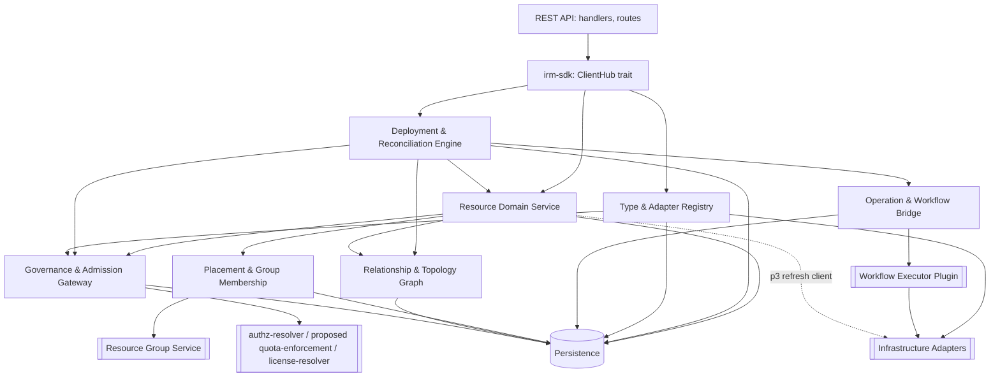
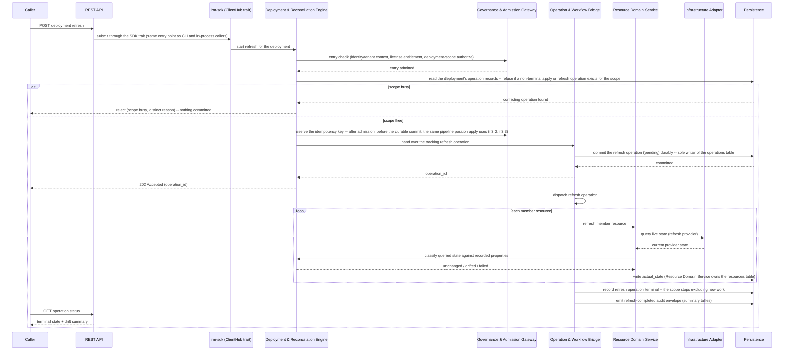

# Technical Design — Infrastructure Resource Manager (IRM)

<!-- toc -->

- [1. Architecture Overview](#1-architecture-overview)
  - [1.1 Architectural Vision](#11-architectural-vision)
  - [1.2 Architecture Drivers](#12-architecture-drivers)
  - [1.3 Architecture Layers](#13-architecture-layers)
- [2. Principles & Constraints](#2-principles--constraints)
  - [2.1 Design Principles](#21-design-principles)
  - [2.2 Constraints](#22-constraints)
- [3. Technical Architecture](#3-technical-architecture)
  - [3.1 Domain Model](#31-domain-model)
  - [3.2 Component Model](#32-component-model)
  - [3.3 API Contracts](#33-api-contracts)
  - [3.4 Internal Dependencies](#34-internal-dependencies)
  - [3.5 External Dependencies](#35-external-dependencies)
  - [3.6 Interactions & Sequences](#36-interactions--sequences)
  - [3.7 Database schemas & tables](#37-database-schemas--tables)
  - [3.8 Deployment Topology](#38-deployment-topology)
- [4. Additional context](#4-additional-context)
- [5. Traceability](#5-traceability)
  - [5.1 Design Elements to PRD Requirements (Forward Traceability)](#51-design-elements-to-prd-requirements-forward-traceability)
  - [5.2 PRD Requirements to Design Coverage (Reverse Traceability)](#52-prd-requirements-to-design-coverage-reverse-traceability)
  - [5.3 Actors, Interfaces, Contracts, and Use Cases Traceability](#53-actors-interfaces-contracts-and-use-cases-traceability)
  - [5.4 Coverage Summary](#54-coverage-summary)

<!-- /toc -->

- [ ] `p1` - **ID**: `cpt-cf-infrastructure-resource-manager-design-overview`
## 1. Architecture Overview

This design defines the first public baseline. It is not a green-field proposal. `p1` describes behavior required in that baseline. `p2` describes agreed follow-up work. `p3` and `p4` are later work. These phases can retain an explicit gap when the baseline has no applicable mechanism. For mixed-phase requirements, this document states the baseline subset and names the later subset separately. Public implementation evidence is linked when the corresponding modules enter this repository.

### 1.1 Architectural Vision

IRM is built as a single SDK-first gear that gives every registered resource type one governed lifecycle, expressed through a declarative deployment model. The gear follows the platform's DDD-light layout: a transport-agnostic SDK crate defines the public contract (`IrmClientV1`, models, errors); a REST crate exposes that contract over HTTP through the platform's OperationBuilder and API gateway; a domain layer owns the type registry, resource lifecycle, declarative-definition compilation, and the five-operation diff engine; and an infrastructure layer owns persistence, the workflow-executor bridge that carries outbound adapter traffic (the executor plugin owns the adapter HTTP client in p1; IRM gains its own refresh client at p3), and event emission. No caller — including IRM's own REST handlers — reaches the domain layer except through the SDK trait, and no domain type ever depends on a database or HTTP type.

The central design decision is that every mutation uses the same compile, diff, and apply engine. A dry-run returns the canonical plan hash; a conditional `PUT` executes only when its recomputed hash matches. A single-resource `PUT` or `DELETE` is wrapped in an anonymous one-resource deployment, so it uses the same history and workflow path. Partial desired-state PATCH is not part of the contract.

Extensibility is delegated, not built in. IRM owns the resource-type registry, the adapter lifecycle, and the manifest-onboarding pipeline; it does not own provider logic. Adapters are semi-trusted HTTP peers reached through a versioned contract, and the durable execution substrate is reached through a plugin contract with a no-op default, so IRM core has no compile-time dependency on a concrete workflow engine. Both extension points let third parties and platform teams add resource classes and swap the execution substrate without a core change, which is the architectural expression of the PRD's ecosystem and revenue goal.

### 1.2 Architecture Drivers

#### Functional Drivers

| Requirement | Design Response |
|-------------|------------------|
| `cpt-cf-infrastructure-resource-manager-fr-type-registry` | GTS-backed type registry in the domain layer; registration validated and versioned before any resource of that type can exist. |
| `cpt-cf-infrastructure-resource-manager-fr-resource-crud` | One domain resource service behind the SDK trait; every resource path (direct and deployment-member) shares it. |
| `cpt-cf-infrastructure-resource-manager-fr-deployment-scoped` | Anonymous single-resource deployments are a domain-layer invariant of resource creation, not a REST-layer convenience. |
| `cpt-cf-infrastructure-resource-manager-fr-declarative-definitions` | A dedicated compile stage validates and normalizes definitions (parameters, variables, dependencies, conditions) before diffing. |
| `cpt-cf-infrastructure-resource-manager-fr-change-classification` | A deterministic diff engine classifies every resource into one of five operations from type metadata (immutable/computed/secret). |
| `cpt-cf-infrastructure-resource-manager-fr-preview` | Preview runs the compile-diff pipeline with zero persistence and zero adapter calls; the plan is the preview payload. |
| `cpt-cf-infrastructure-resource-manager-fr-plan-binding` | The plan fingerprint binds apply to its exact canonical plan; apply re-validates the fingerprint under a per-deployment consistency guard. |
| `cpt-cf-infrastructure-resource-manager-fr-ordered-execution` | The apply engine topologically orders the plan and dispatches it through the workflow-executor contract for crash-resumable execution. |
| `cpt-cf-infrastructure-resource-manager-fr-guardrails` | Management policy is evaluated as a single admission gate ahead of the apply engine, before any resource in the plan is touched. Until this requirement ships no resource carries a protective policy, so the composed effective policy is always `full` and the gate has nothing to refuse (§3.2). |
| `cpt-cf-infrastructure-resource-manager-fr-idempotent-writes` | A dedicated idempotency store enforces the reservation/replay window model for every mutating call, taking the reservation after the admission gates have admitted the request and before the durable commit. |
| `cpt-cf-infrastructure-resource-manager-fr-cascade-delete` / `-cascade-admission` | Cascade is admitted against the current relationship graph and re-validated under the change lock — the deployment-row lock defined in §3.2 (Deployment & Reconciliation Engine, The change lock) — immediately before the parent delete commits, then converges asynchronously in bounded, restart-safe batches. |
| `cpt-cf-infrastructure-resource-manager-fr-relationship-model` / `-graph-query` | Relationships are derived from resource data at write time — and at refresh time (`p3` refresh, §3.6) — and persisted as typed graph edges, independent of the diff engine. |
| `cpt-cf-infrastructure-resource-manager-fr-resource-groups` / `-group-addressing` | Deployment address is (tenant, group, name); group existence and default-group resolution are validated against the Resource Group Service before compile. |
| `cpt-cf-infrastructure-resource-manager-fr-membership-convergence` | Placement commits locally and propagates asynchronously through an outbox with a periodic drift-repair sweep. |
| `cpt-cf-infrastructure-resource-manager-fr-manifest-onboarding` | The baseline pipeline validates and commits local adapter/type/catalog records, then publishes and activates. A new adapter remains pending on publication failure; cross-service atomic upgrade is `p3`. |
| `cpt-cf-infrastructure-resource-manager-fr-per-type-authz` / `-authz-payload-masking` | Every read and write is authorized per resource type through the platform authorization-resolution path inside the domain layer, ahead of any provisioning dispatch; unreadable payloads are masked, not omitted. Until `-fr-per-type-authz` ships, that same path resolves at the resource-collection level and the per-type identities are grant targets only (§3.2). |
| `cpt-cf-infrastructure-resource-manager-fr-operation-cancel` | Operation tracking exposes one idempotent cancel surface that authorizes before it reaches the workflow executor. |
| `cpt-cf-infrastructure-resource-manager-fr-adapter-credential` / `-adapter-egress` | P1 routes outbound adapter calls through the central outbound egress path and validates bounded responses. P2 adds per-call capability tokens after the Token Issuer is available. |

#### NFR Allocation

| NFR ID | NFR Summary | Allocated To | Design Response | Verification Approach |
|--------|-------------|--------------|------------------|----------------------|
| `cpt-cf-infrastructure-resource-manager-nfr-latency` | 500 ms p95 read/mutation-acknowledgment; 200 ms p95 single-resource topology lookup | REST layer + domain resource service + persistence | The synchronous path covers admission, compile, diff/classification, plan-fingerprint recomputation, policy evaluation, and the durable-commit write; provisioning work is dispatched asynchronously to the workflow executor (§3.2). The 500 ms p95's scope carve-out and the separate target a multi-resource declarative apply carries instead are stated at §3.6, Declarative Apply (Acknowledgment budget). | Load test against the PRD's provisional interim load profile, superseded by the reference profile once §16 settles it; non-regression benchmarks per build. |
| `cpt-cf-infrastructure-resource-manager-nfr-preview-latency` | 200 ms / 2 s / 10 s p95 preview by definition-size band | Compile + diff engine | Preview never persists or calls an adapter; cost is bounded by definition size, itself bounded by the request-body limit once `cpt-cf-infrastructure-resource-manager-fr-request-limits` (`p2`) enforces it — the first release measures rather than bounds it. | Benchmark suite at the three measurement bands, on that same provisional interim load profile. |
| `cpt-cf-infrastructure-resource-manager-nfr-availability` | 99.9% availability, 99.999% durability, RPO ≤ 1h, RTO ≤ 4h | Replicated serving path + persistence layer + the platform database and backup operations that own the recovery mechanics | Durable commit precedes any provisioning dispatch; the persistence layer is the platform-managed database substrate, not a component IRM operates itself. The availability half is answered on the serving path: the gear runs as N stateless replicas behind the platform edge, the background loops are multi-instance-safe by per-row fenced claim, and every remaining request-path component is named as redundant, degraded-with-a-stated-posture, or an accepted platform-owned single point of failure (§3.8, Availability of the serving path). The recovery half names its parameters: point-in-time recovery on the database substrate is what bounds RPO ≤ 1 h, a single-store restore-then-verify is what bounds RTO ≤ 4 h, and the retention, drill schedule, and runbook belong to the platform's database and backup operations, with the restore runbook obliged to set the post-restore marker (§4, Recovery). | Platform backup/restore drills, including the marker-setting step; a replica-loss drill against the serving path; availability measured monthly per the NFR threshold. |
| `cpt-cf-infrastructure-resource-manager-nfr-restore-gate` | After a restore from backup, affected scopes are refresh-required; apply admission is refused until a completed refresh clears the marker | Persistence layer (restore marker) + deployment-engine admission + refresh path | A persisted marker is checked at apply admission and cleared by a completed refresh; its mechanics, and the `p3` dependency that clearing path carries, are at §3.6, On-Demand Refresh (Restore gate). | Restore drill: a marked scope refuses apply and accepts it again after refresh; runs alongside the platform backup/restore drills. |
| `cpt-cf-infrastructure-resource-manager-nfr-scale` | 100k+ resources, 1000+ groups per tenant; 1M+ topology nodes, 5M+ edges platform-wide | Persistence layer + relationship graph component | Cursor-paginated, indexed queries throughout; graph storage strategy is validated by scale tests before GA; the ceiling-approach signal this NFR requires is counted off the §3.7 tables and alerted on (§4, Observability). | Scale test suite before GA, gating the storage-strategy decision; a threshold-crossing alert test for the ceiling-approach signal. |
| `cpt-cf-infrastructure-resource-manager-nfr-staleness` | Topology converges ≤10s p95 | Relationship graph | Relationship edges and the `parent_of` closure are persisted and refreshed from resource data. A unified apply/rollback/refresh history projection and its 60s p99 objective are `p3`; the p1 revision endpoints query persisted deployment revisions directly. | Measure topology convergence from the resource commit. |
| `cpt-cf-infrastructure-resource-manager-nfr-idempotency` | Duplicate submissions reuse the stored synchronous result | Idempotency store + operation identity | The store reserves `(tenant, caller, key)`, rejects a body mismatch, and replays the stored successful submission response. The operation id is also the workflow id, so redispatch of one accepted operation is deduplicated by the workflow substrate. Atomic recovery of the submission-key record across every crash boundary is `p3`. | Concurrent duplicate and workflow-redispatch tests; crash-window closure is deferred with the p3 guarantee. |
| `cpt-cf-infrastructure-resource-manager-nfr-placement-convergence` | Membership reflects commit ≤5s p95; parked rows zero in steady state and observable at any nonzero count | Placement & group membership component | Local commit plus outbox-based asynchronous propagation to the Resource Group Service; a periodic sweep reconciles parked rows and drift (§3.6). `cpt-cf-infrastructure-resource-manager-fr-membership-convergence` takes its staleness bound from here and `cpt-cf-infrastructure-resource-manager-fr-membership-failure-handling` takes the parked-row observability from here, both `p1`. The synchronous Resource Group Service budgets are the row below. | Convergence-latency test; parked-row count is an always-on alertable metric. |
| `cpt-cf-infrastructure-resource-manager-nfr-placement-convergence-extended` | The synchronous group-service budgets: 50ms p95 group-reference validation, 100ms p95 default-group provisioning | Placement & group membership component | Each budget is one remote call to the Resource Group Service on every write path, and that service's published objectives (250 ms hierarchy read, 30 ms membership read) do not fit the 50 ms budget. The shortfall is carried as the open PRD §16 dependency on the group-service objectives, with a named candidate mitigation — an IRM-side cache of resolved group existence and default-group identity, keyed by (tenant, group reference) and invalidated by the tenant's own placement writes — weighed against renegotiating the budget or excluding the remote hop from it; Key ADRs below tracks the choice. The PRD split these sub-targets out of the `p1` requirement above because a first-release requirement cannot take its enforceable value from a budget the dependency has not agreed to. | The validation and default-group provisioning budgets are measured from the first release but not gated until that dependency resolves. |
| `cpt-cf-infrastructure-resource-manager-nfr-background-resilience` | Background passes survive failure, start on boot, run safely on multiple instances | P1 placement and cascade workers; later workers as they ship | Baseline loops tick immediately at start, isolate a failed pass, claim persisted work with fencing, and observe cancellation for shutdown. Configuration is validated before workers are constructed. A bad claimed row is signalled and isolated from later rows. The same contract applies to each later loop when it is introduced. | Start-up tick, cancellation, corrupt-row isolation, restart, and multi-instance tests per loop. |
| `cpt-cf-infrastructure-resource-manager-nfr-limits` | The published limits p1 behavior depends on: cascade blast radius, running-operation maximum lifetime, the idempotency in-flight and replay windows, and the two adapter trust-boundary bounds — the adapter response body (16 MiB) and the truncated provider error text (4 KiB) | Cascade admission (blast radius) + Operation & Workflow Bridge (maximum lifetime) + the idempotency store (both windows) + the selected workflow-executor plugin's adapter-call path, and IRM's own refresh client at `p3` (§3.2, Adapter response handling; both bounds are obligations of the executor contract, §3.5) | Each is checked at the layer that first sees the value, with the limit and the observed value named in the rejection. Every value here is one a `p1` requirement binds to directly, `cpt-cf-infrastructure-resource-manager-fr-adapter-response-validation` among them; the split from `nfr-limits-extended` follows the `-extended` convention (§5.4). | Boundary tests at each published limit, including the adapter-response and error-text bounds at the adapter boundary. |
| `cpt-cf-infrastructure-resource-manager-nfr-limits-extended` | The remaining published limits: the general and large-payload request-body caps, per-resource property and label sizes, name and display-name lengths, the adapter-supplied type-identifier and adapter backend-instance identifier lengths, relationship traversal depth and page size, owned parent-child chain depth, and the retention windows | REST layer (the two request-body caps) + the layer that first sees the value, per limit | Same rule — checked at the layer that first sees the value and named in the rejection. The split from the row above follows that same convention (§5.4), and the name and display-name lengths, the per-resource property and label sizes, and the two identifier caps are already enforced on first-release paths regardless. The request-body caps are the one set here whose enforcement is deferred as well — `cpt-cf-infrastructure-resource-manager-fr-request-limits`, which enforces them at the transport boundary, is `p2`. | Boundary tests at each published limit. |

#### Key ADRs

No ADRs are recorded for IRM yet. Eight decisions warrant one and are rows below with their opening trigger and closing validation. Four are open questions someone else owns — three dated §16 rows in the PRD, the fourth gated on a test rather than a date — and four are this design's own, each moving a privilege or a secret boundary. A design-owned decision stays with this design's author until its ADR is opened.

| Decision | Kind | Recorded at | Owner | Opens when | Validation that closes it |
|---|---|---|---|---|---|
| Which engine evaluates adapter-registered policy bundles (the Policy Decision Service binding) | Open question (PRD §16) | §3.5, Policy-Bundle Execution Engine | Head of Platform Architecture (PRD §16, target 2026-10-31) | The question's owner settles it on the date §16 carries | The Policy-Bundle Execution Engine conformance suite (§4, Testability) |
| Workflow Executor evolution: whether and how a second conforming implementation is added beside the durable executor `p1` requires | Open question (PRD §16) | §3.5, Workflow Executor | Head of Platform Architecture (PRD §16, target 2026-10-31) | The question's owner settles it on the date §16 carries | The Workflow Executor conformance suite (§4, Testability), including the adapter trust-boundary obligations of §3.2 |
| How the group-reference validation budget is reconciled with the Resource Group Service's published objectives — an IRM-side cache, a renegotiated target, or a budget that excludes the remote hop | Open question (PRD §16) | §1.2, `cpt-cf-infrastructure-resource-manager-nfr-placement-convergence-extended`; §3.4, `system/resource-group` | Head of Platform Architecture (PRD §16, target 2026-10-31) | The question's owner settles it on the date §16 carries | The 50 ms validation and 100 ms default-group provisioning budgets, measured from the first release and gated once that dependency resolves (§1.2, same row) |
| Storage strategy for the relationship graph at declared scale | Open question with no §16 row, tracked by the PRD §15 risk "Performance at 1 M+ topology nodes unvalidated" | §1.2, `cpt-cf-infrastructure-resource-manager-nfr-scale`; §3.7, `resource_relationships` | Head of Platform Architecture, as owner of that §15 risk | The pre-GA scale test settles it, rather than a dated decision | The pre-GA scale test suite of §1.2, which gates the storage-strategy decision |
| Operator-plane anchoring of data-plane operation rows, together with the provisionality of the two `plane` label ids | Design-owned | §3.7, `data_plane_operations` (Columns of note); §3.2, Data-plane operation authorization | This design's author | Before the first install registers the two label ids and lets a role target one — past that point a change is a migration of granted authority rather than an edit | An authorization test ahead of that first install: a built-in tenant resource-role wildcard over the `gts.cf.resources.*` family reaches a tenant-plane operation and does not reach an operator-plane one, which resolves only through a role naming `gts.cf.irm.infra.data_plane.v1~`; the operator plane's platform-root anchoring at issuance is asserted in the same test |
| Resolution of an unrecognized stored `plane` value to `operator` rather than to `tenant` | Design-owned | §3.7, same table; §3.2, Data-plane operation authorization | This design's author | A different reading of an unclassifiable plane value is proposed, or a further plane value is introduced | A test: a stored value the enum does not recognize resolves to `operator` and is issuable to no tenant (`cpt-cf-infrastructure-resource-manager-principle-fail-closed-governance`) |
| Placement of the ungrouped-write guard at the SDK-trait boundary inside the Governance & Admission Gateway rather than at the REST layer | Design-owned | §3.2, Ungrouped-write authorization guard | This design's author | A caller path that reaches a resource without transiting the SDK trait is proposed | The SDK-boundary traversal test: a REST, a CLI, and an in-process caller all transit the same guard |
| Location of the per-tenant secret salt in the platform credential store rather than in the SecureConn-scoped tables | Design-owned | §2.2, `cpt-cf-infrastructure-resource-manager-constraint-secret-digest`; §3.4, `credstore`; §4, Data protection | This design's author | `cpt-cf-infrastructure-resource-manager-fr-secret-hygiene` (`p2`) ships, which is when the first salt is provisioned | Two checks — not the PRD §15 pre-GA security review, which gates the Trusted System Actor clamp instead: an inspection that no table in §3.7 holds the salt, and a test that a secret-field write fails closed when the credential store is unreachable, with no unsalted or cleartext fallback (§3.4, `credstore`) |

### 1.3 Architecture Layers

```
Caller (API/CLI/service client)
        │
        ▼
┌───────────────────────────────┐
│ Contract layer  (irm-sdk)     │  ClientHub trait, transport-agnostic models/errors
└───────────────────────────────┘
        │
        ▼
┌───────────────────────────────┐
│ API layer  (irm/api/rest)     │  Axum handlers, OperationBuilder routes, error mapping
└───────────────────────────────┘
        │
        ▼
┌───────────────────────────────┐
│ Domain layer  (irm/domain)    │  Type registry, resource/deployment lifecycle, compile,
│                                │  diff engine, relationship derivation, placement, policy
└───────────────────────────────┘
        │
        ▼
┌───────────────────────────────┐
│ Infra layer  (irm/infra)      │  SecureConn persistence, workflow-executor plugin
│                                │  bridge (adapter calls; plugin owns the HTTP client), event emission
└───────────────────────────────┘
```

- [ ] `p1` - **ID**: `cpt-cf-infrastructure-resource-manager-tech-stack`

| Layer | Responsibility | Technology |
|-------|---------------|------------|
| Contract | Public API surface for every consumer; no transport or storage detail | Rust trait (`IrmClientV1`) resolved through `ClientHub`; transport-agnostic models and errors |
| API | HTTP surface, request validation, RFC 9457 error mapping | Axum handlers, `OperationBuilder` route/OpenAPI registration, OData query parsing |
| Domain | Type registry, resource and deployment lifecycle, compile, diff engine, relationship derivation, placement, policy evaluation dispatch | Rust domain services under `#[domain_model]`, GTS client for type identifiers, CEL for declarative expressions |
| Infrastructure | Durable storage, workflow-executor plugin bridge (the selected executor plugin owns the outbound adapter HTTP client in p1; IRM's own refresh client arrives at p3), event emission | SeaORM over `SecureConn`, adapter calls through central egress in p1, capability-token attachment in p2, platform plugin interface, CloudEvents emitter |

## 2. Principles & Constraints

### 2.1 Design Principles

#### SDK-First Contract Boundary

- [ ] `p1` - **ID**: `cpt-cf-infrastructure-resource-manager-principle-sdk-first`

Every consumer of IRM — the gear's own REST handlers, other gears, and any future transport — calls the domain layer exclusively through the `irm-sdk` trait obtained via `ClientHub`. No internal type crosses that boundary. This keeps the REST surface, the CLI, and any future in-process caller behaviorally identical, and it is what makes the platform's dependency rule ("always use SDK modules for inter-gear communication") enforceable for IRM.

#### Deterministic, Previewable Change

- [ ] `p1` - **ID**: `cpt-cf-infrastructure-resource-manager-principle-deterministic-change`

Every mutation is compiled and classified before it is executed, and the classification is a pure function of the definition, current state, and type metadata. A caller who previews a change and then applies it unmodified gets exactly what was shown. This principle is what makes preview a contract rather than a best-effort approximation, and it is the basis for plan binding, guardrails, and safe rollback.

#### Fail-Closed Governance

- [ ] `p1` - **ID**: `cpt-cf-infrastructure-resource-manager-principle-fail-closed-governance`

Every entry-admission decision — authorization, quota, policy, license entitlement, and group-reference validity — refuses the operation when the deciding dependency is unavailable or the answer is uncertain. Mid-flight re-authorization is the exception: transport or service unavailability is retried by the durable workflow and is not converted into a negative authorization verdict. Only a definitive negative decision cancels the running operation as `authorization_revoked`.

#### Durable, Crash-Safe Execution

- [ ] `p1` - **ID**: `cpt-cf-infrastructure-resource-manager-principle-durable-execution`

A mutation is committed durably before any provisioning work starts, and every long-running operation resumes from persisted state after a process crash with no double application. Background reconciliation (placement sweep, cascade convergence, discovery, stuck-operation redispatch) follows the same rule: progress lives in storage, not in a process's memory.

#### Secret-Safe by Construction

- [ ] `p2` - **ID**: `cpt-cf-infrastructure-resource-manager-principle-secret-safety`

The subject of this principle is the *secret field*: a property a resource type declares secret in its type metadata. No value of such a field ever exists in cleartext in live resource state, and none is written in cleartext into any artifact IRM persists or emits from the moment the field is declared secret — revisions, previews, history, logs, metrics, or events. The one bounded exception is an artifact recorded *before* a field was reclassified as secret: there Revision immutability (§3.1) takes precedence over re-protection, and the residual is the open question this section records at its end and the PRD carries as a §15 risk. Change detection on a secret field is a property of a derived comparison artifact, never of the value itself, and that artifact is constructed so it cannot be used for cross-tenant correlation or offline recovery.

One neighbouring marker is deliberately outside that scope. The sensitivity flag a definition may set on a parameter (`cpt-cf-infrastructure-resource-manager-fr-parameters`) is not a type-declared secret field: the PRD keeps it declared-but-unenforced metadata until `cpt-cf-infrastructure-resource-manager-fr-secret-hygiene` ships, placing no redaction or exclusion obligation on previews, revisions, history, logs, metrics, or events, and records the resulting cleartext-capture residual in its §15 risk table. This design carries that boundary rather than widening it, so the principle above and the preview-redaction contract of `cpt-cf-infrastructure-resource-manager-fr-preview` say the same thing about the same set of values.

This principle also covers the type-evolution edge. A field can become secret only through the Type & Adapter Registry's type re-registration path (`cpt-cf-infrastructure-resource-manager-component-type-adapter-registry`), because a resource type's field metadata changes only when the owning adapter re-registers the type; that path is the trigger the rest of this mechanism keys off. The Resource Domain Service, which owns secret hygiene enforcement at the field level (§3.2), re-protects every current persisted value of the newly-secret field — the live resource state — under the same salted per-tenant digest model applied to fields that were already secret (`cpt-cf-infrastructure-resource-manager-constraint-secret-digest`). Re-protection runs as a background pass rather than inside the registration transaction: rewriting every live value of one field across a tenant is unbounded work at `cpt-cf-infrastructure-resource-manager-nfr-scale`, and holding a transaction open across it would break the all-or-nothing onboarding guarantee (§3.2, §3.6). The re-registration therefore commits on its own: the Type & Adapter Registry, sole writer of the affected type-definition row (§3.7, `resource_type_definitions`), sets a persisted re-protection marker on that row inside the registration transaction and concludes without waiting for the rewrite. The Resource Domain Service owns the batched, restart-safe pass that satisfies the marker (§3.2, Secret re-protection pass) and reads the same marker on the write path, refusing a mutating call against an affected type — fail-closed, with a distinct reason — until no current persisted value of the newly-secret field remains unprotected. It never writes the row: it reports the type complete to the Registry, which clears the marker, so the row keeps one writer and the ownership boundary between the two components holds. Further changes on the affected types are held by that marker, not by an open transaction. The completion criterion is deliberately scoped to live resource state, not to every artifact that ever recorded the field: a Revision's `applied_snapshot` (§3.1) captured before the field became secret may still hold the value in the clear, and re-writing an immutable Revision to re-protect it would conflict with the Revision immutability invariant (§3.1). That tension — between the immutability a Revision guarantees for history and rollback, and secret hygiene on a field that changed classification after the Revision was written — is resolved in favor of immutability: the PRD requires such a Revision to stay unchanged (PRD §12 criterion 51), and the residual cleartext that leaves is what PRD §15 records for Phase-2 disposition.

#### Extensibility Without Core Change

- [ ] `p1` - **ID**: `cpt-cf-infrastructure-resource-manager-principle-adapter-extensibility`

New resource classes, providers, and policy bundles enter the system through the adapter and manifest-onboarding contracts, never through a change to IRM core. The type registry and the adapter contract are the platform's designed extension seam; a third party that conforms to them changes nothing in IRM itself.

### 2.2 Constraints

#### CloudEvents Envelope

- [ ] `p1` - **ID**: `cpt-cf-infrastructure-resource-manager-constraint-cloudevents-envelope`

Every domain and audit event IRM emits uses the CloudEvents envelope defined by the platform event-broker ADR. This is a recorded platform convention (PRD §2), not an IRM-specific choice; the event emitter component is the single place that constructs the envelope.

#### RFC 9457 Problem Details

- [ ] `p1` - **ID**: `cpt-cf-infrastructure-resource-manager-constraint-rfc9457-errors`

Every error response on the REST surface follows RFC 9457 (ToolKit `05_errors_rfc9457.md`). Domain errors carry enough structure (offending field, violated limit, refusal reason) that the REST layer maps them to a Problem Details body without inventing detail at the edge.

#### Idempotency-Key Header

- [ ] `p1` - **ID**: `cpt-cf-infrastructure-resource-manager-constraint-idempotency-key`

Duplicate-safe mutation follows the platform's Idempotency-Key header convention (toolkit-http). The idempotency store is keyed by (caller, key), never by request content alone, matching `cpt-cf-infrastructure-resource-manager-fr-idempotent-writes`.

#### CEL for Declarative Expressions

- [ ] `p1` - **ID**: `cpt-cf-infrastructure-resource-manager-constraint-cel-expressions`

Dynamic expressions and conditional-inclusion predicates in declarative definitions are evaluated as CEL, the expression language already used by quota-enforcement and serverless-runtime. IRM does not introduce a second expression language for the same purpose.

#### AuthZEN-Based Authorization Resolution

- [ ] `p1` - **ID**: `cpt-cf-infrastructure-resource-manager-constraint-authzen-resolution`

Every authorization decision (per-type access, admission, list-union filtering, payload masking, topology narrowing) is resolved through the platform's AuthZEN-based authorization-resolution path (`authz-resolver`), not through a bespoke IRM authorization model. IRM supplies Subject/Action/Resource inputs; it does not implement decision logic itself.

#### UUID v7 Identifiers

- [ ] `p1` - **ID**: `cpt-cf-infrastructure-resource-manager-constraint-uuidv7-identifiers`

Every new entity IRM creates (resources, deployments, revisions, operations, adapters, relationship edges) is identified by a UUID v7 (RFC 9562), the design-level choice that delivers the time-sortable identifiers PRD §2 records as an IRM-level property and keeps them compatible with cursor pagination.

#### Salted Per-Tenant Secret Digests

- [ ] `p2` - **ID**: `cpt-cf-infrastructure-resource-manager-constraint-secret-digest`

Secret-field change detection uses a salted, per-tenant digest, never the cleartext value or an unsalted hash. IRM provisions and stores the per-tenant salt itself — the comparison key of `cpt-cf-infrastructure-resource-manager-fr-secret-hygiene` — lazily, on the first use of a secret field for that tenant, so provisioning depends on no external trigger and no tenant-creation ordering, and a tenant that existed before IRM shipped is covered on its first secret-field write. The digest is derived from that key, so equal values across tenants are not correlatable and offline recovery of the source value is infeasible. That claim depends on where the key lives: the salt is held in the platform credential store, not in the SecureConn-scoped tables that hold the digests derived from it (§3.4, `credstore`; §4, Data protection) — a design-level choice of location, which the PRD leaves open. Two properties of that key are fixed here. It is fetched once per tenant on the first secret-field use and cached in-process for the life of the process, with no time-based expiry, which keeps the `credstore` call off the repeated write path and is why §3.4 states its expectation as a first-use latency rather than a per-write one. And it is not rotatable in `p2`: rotation would invalidate every digest derived from it, and the only two ways out — a re-derivation pass, which requires the cleartext this design deliberately does not hold, or an accepted one-time loss of change detection on every secret field of that tenant — are both Phase-2 decisions, alongside the envelope encryption PRD §15 already schedules there. The residual is therefore stated rather than left implicit: a compromise of the credential store yields the comparison keys, and the response available today is to treat the affected tenants' digests as no longer meaningful for change detection, not to rotate them in place.

#### Canonical Plan Fingerprint

- [ ] `p1` - **ID**: `cpt-cf-infrastructure-resource-manager-constraint-plan-fingerprint`

A plan is bound to a canonical fingerprint computed over its definition, current state, tenant, options, and operations derived from current type metadata. Apply recomputes and compares this fingerprint before execution. A type-metadata change that changes classification or computed-field exclusion changes the fingerprint. A metadata change that leaves the computed plan unchanged does not block apply. A divergence produces a distinct, actionable rejection, never a silent re-diff. The revision's `frozen_traits_hash` is a rollback compatibility anchor, not a direct plan-fingerprint input.

#### Multi-Region Non-Preclusion

- [ ] `p2` - **ID**: `cpt-cf-infrastructure-resource-manager-constraint-multi-region-non-preclusion`

Multi-region management is out of scope for this release, but deployment addressing, entity identifiers, and group semantics must not preclude a later placement dimension (such as a region) from being added. The deployment address, group hierarchy, and identifier scheme are designed so a region qualifier can be introduced additively; §16 in the PRD carries the open question of exactly how.

#### Safety Non-Applicability

- [ ] `p1` - **ID**: `cpt-cf-infrastructure-resource-manager-constraint-safety-not-applicable`

ISO/IEC 25010 §4.2.9 Safety does not apply: IRM is a control plane for IT resources reached through API and CLI, and it does not actuate physical equipment. The destructive-operation risk that exists (accidental or malicious infrastructure loss) is governed by management policy, cascade admission and disclosure, and operation cancellation, not by a safety quality attribute.

## 3. Technical Architecture

### 3.1 Domain Model

**Technology**: GTS-typed Rust structs under `#[domain_model]`, versioned resource-type schemas resolved through the platform Type Identifier Service.

**Location**: planned public modules for domain, resource, deployment, adapter, operation, REST, storage, and workflow execution. Their public paths become authoritative when the modules enter this repository.

**Core Entities**:

- [ ] `p1` - **ID**: `cpt-cf-infrastructure-resource-manager-entity-core-domain`

| Entity | Description | Schema |
|--------|-------------|--------|
| ResourceType | Schema for a GTS-identified resource class: input/output shape, actions, capabilities, and field traits used by validation and diff | Owner-checked upsert in `resource_type_definitions`; multi-version live history is p2 |
| Adapter | Registered provider integration; lifecycle `pending` → `active`, with removal as the terminal path; endpoint and trust configuration, OBO callback scopes, contributed types, package trust level (platform-verified vs. third-party) | `infrastructure_adapters` |
| Resource | A managed instance of a resource type: desired `properties`, provider-observed `actual_state`, adapter outputs and provider identifier, lifecycle status and reason, replacement lineage, deployment membership, and resource-group placement | `resources` |
| Deployment | Declarative unit of apply/history/rollback, addressed by (tenant, resource group, name); may be anonymous (single-resource wrapper) or named (operator-authored, multi-resource); carries the bound plan fingerprint | `deployments` |
| Revision | Append-only record of an admitted apply. It stores the definition/parameter hashes, the exact `applied_snapshot`, the applying operation, and optional frozen trait hash | `deployment_revisions` |
| Operation | Tracked unit of asynchronous work (apply, action, discovery, cascade step) with a published state model and a terminal-state guarantee | `operations` |
| RelationshipEdge | Typed graph edge (dependency, ownership, attachment) derived from resource instance data, carrying a provenance marker for the producer that derived it; realizes the PRD's Virtual Resource Graph | `resource_relationships` |
| ResourceGroup | Lifecycle and authorization container in the tenant → group → resource scope hierarchy | Owned by the Resource Group Service; IRM holds a validated reference (group identifier, default-group marker), not the row |
| Tag | Key-value label on a group or resource, with downward inheritance | Persisted by the Resource Domain Service; table shape deferred to implementation phase, alongside the inheritance mechanics §5.2 defers |
| DiscoveryJob | Manual, scheduled, or event-driven inventory sync run against an adapter | Persisted by the Operation & Workflow Bridge; table shape deferred to implementation phase, alongside the sync mechanics §5.2 defers |

**Identity and invariants**:

- **ResourceType** — `gts_id` is the persisted type identity. Re-registration is an owner-checked upsert of that identity. The p1 baseline does not keep a second row per semantic schema version; revisions preserve the applied snapshot and optional frozen trait hash needed to interpret historical applies. A multi-version live-type catalog is `p2`, not a p1 storage claim.
- **Adapter** — identity is the GTS adapter identifier. Only an `active` adapter serves new resource traffic, and activation requires at least one contributed, validated resource type. Per-type authorization schemas are published before the status changes to `active`; publication failure leaves the prior status unchanged. The source has no separate `deactivated` state, so this design does not add one. Removal is the terminal path and is refused while any resource row references the adapter's types, retained tombstones included, because the repository checks references regardless of resource status. An unused adapter is removable in p2; a previously used one only after the `p3` purge removes its tombstones (§3.7, `infrastructure_adapters`).
- **Resource** — identity is a tenant-scoped UUID plus its GTS instance identifier. `lineage_id` continues identity across replace, and `previous_provider_resource_ids` retains replaced provider identities. Desired state remains in `properties`; refresh stores provider truth in `actual_state` at `p3` (§3.6, On-Demand Refresh). `status_reason` is written with a failed/refused transition and cleared with a later successful status. A delete workflow carries `pre_delete_status`; a permanent provider refusal restores that status and records the reason. `create_rejected_at` proves a synchronous create refusal and permits a provider-free delete. If neither a provider identifier nor that marker exists, delete is refused and the row is restored. Generic detached/degraded condition flags and first-class orphan state are `p3`.
- **Deployment** — identity is the deployment address (tenant, resource group, name), backed by a UUID v7 row identifier. Invariant: status is exactly one of `pending`, `running`, `completed`, `failed`, `cancelled`. That status is a reported state, not an admission gate: it is projected by the Deployment & Reconciliation Engine from the tracking operation of the most recent admitted apply — set in the durable commit that admits the apply and advanced again when the Operation & Workflow Bridge reports that operation terminal (§3.2, §3.6) — and it is what `cpt-cf-infrastructure-resource-manager-fr-deployment-status` exposes. What admits or refuses an apply — and, at `p3`, a refresh — is the scan over the deployment's own operation records (§3.2, Deployment & Reconciliation Engine), so no gate reads this column and no state outside the `operations` table carries the exclusion. Per-member execution state is not this column either: each member's state is its own Resource lifecycle status (Resource invariant above), and a member that fails carries the machine-readable failure reason the Resource Domain Service records with it when it reports the per-resource result (§3.6), which makes a failed apply attributable to the members that failed rather than only to the deployment. The deployment record also carries the declared outputs the same requirement mandates: computed from provisioned state by the engine as each apply resolves, persisted on the deployment row (§3.7, `deployments`), and served from there without recomputation — empty until the first apply resolves them, refreshed on every successful resolution, left at the previously recorded values after a failed apply, with an entry that cannot be resolved omitted rather than raised as an error. It carries the stored definition and the canonical fingerprint of the most recently bound plan, so a later apply recomputes the plan from that definition and the live resource state and refuses on fingerprint divergence — the plan-binding invariant made concrete. The `kind` discriminator (`auto` for an anonymous single-resource wrapper, `named` for an operator-authored deployment) records how the deployment came to exist and therefore how its address behaves; it gates no deletion. A direct delete of any member, of either kind, executes as a classified change to the enclosing deployment: the engine compiles the deployment's definition minus that resource, the plan classifies the target `delete` and every sibling `no-change`, the deployment's recorded definition is updated to the compiled one, and a later re-submission of the previous definition re-creates the resource (`cpt-cf-infrastructure-resource-manager-fr-resource-crud`, §3.2, §3.6).
- **Revision** — identity is a UUID scoped to its deployment. The apply transaction appends it before dispatch and stores `applied_snapshot`, hashes, `applied_by_op_id`, and the optional frozen trait hash. Rollback reads this persisted snapshot; it does not re-diff an unknown historical input. The p1 history surfaces list deployment and resource revision records. A single chronological projection that also unions refresh and rollback operations is `p3`.
- **Operation** — identity is a UUID v7. Invariant: status is exactly one of `pending`, `accepted`, `running`, `succeeded`, `failed`, `cancelled`, with an explicit allowed-transition rule per current state (for example, `pending` advances only to `accepted`, `running`, `failed`, or `cancelled`) and a terminal-state guarantee: every operation reaches one of `succeeded`, `failed`, or `cancelled`, after which it never leaves it — carried, for an operation no caller returns to, by the maximum-lifetime backstop in §3.2 (Operation & Workflow Bridge). One operation kind covers apply, lifecycle action, discovery, and cascade-step work uniformly, each identified by `kind` and pointed at its `target_id`. Uniformity covers tracking, not cancellability: `cancelled` is unreachable for a `cascade-step` operation once the parent's deletion has committed (§3.2, Operation & Workflow Bridge).
- **RelationshipEdge** — identity is the tenant-scoped (source, destination, kind) tuple. `kind` is `depends_on`, `parent_of`, or `attached_to`. Foreign keys bind both endpoints, tenant-scoped derivation rejects cross-tenant endpoints, and a partial unique index permits only one live `parent_of` edge per child. Parent closure maintenance rejects ownership cycles. `parent_of` traversal reads the closure; `depends_on` and `attached_to` use bounded recursive traversal with a visited set. Edges are soft-deleted during re-derivation and cleanup, then recreated from the current declaration on revival.
- **ResourceGroup** — identity and membership truth are owned entirely by the Resource Group Service; IRM never persists group rows, only a validated reference plus the resolved default-group marker for the tenant.
- **Tag** — a key-value label attached to a group or a resource; a tag set on a group is inherited downward by every resource placed in it, never upward.
- **DiscoveryJob** — identity is a UUID v7; runs against exactly one adapter and one resource-type/resource scope, and is triggered manually, on a schedule, or by an adapter-side event.

| Resource lifecycle point | Relationship behavior |
|---|---|
| Tombstone/cascade drain | Owning edges remain available long enough for the committed drain, then live edges are soft-deleted as endpoints are removed. |
| Revival/rollback | Relationships are re-derived from the restored deployment and current instance data; closure rows are rebuilt from live `parent_of` edges. |
| Permanent purge (`p3`) | Tombstoned edge and closure history is removed with the expired aggregate. |

**P1 transition/admission matrices**:

| Resource current state | Accepted command | Runtime transition/outcome |
|---|---|---|
| `pending`, `active`, `failed` | full update | `updating` → `active` or `failed` |
| `pending`, `active`, `failed` | delete | `deleting` → tombstone; permanent refusal restores the carried pre-delete state and sets `status_reason` |
| any non-busy state | declared action | `action_in_progress` → `active` or `failed` |
| `provisioning`, `updating`, `action_in_progress`, `deleting` | update, delete, or action | rejected as busy |

| Operation current state | Allowed next states |
|---|---|
| `pending` | `pending`, `accepted`, `running`, `failed`, `cancelled` |
| `accepted` | `accepted`, `running`, `failed`, `cancelled` |
| `running` | `running`, `succeeded`, `failed`, `cancelled` |
| `succeeded`, `failed`, `cancelled` | same terminal state only |

The `running` state does not transition back to `pending`. Pending redispatch applies only before the workflow executor accepts the operation. After the operation reaches `running`, the durable executor owns recovery. The maximum-lifetime backstop transitions the operation to `failed` if it does not complete.

**Relationships**:
- Adapter → ResourceType: an adapter contributes one or more resource types; a type belongs to exactly one adapter.
- ResourceType → Resource: a resource references exactly one persisted `resource_type_definition_id`. P1 owner-checked re-registration updates that identity; a multi-version live binding is p2.
- Deployment → Resource: a resource belongs to exactly one deployment (explicit or anonymous).
- Deployment → Revision: each admitted apply of a deployment produces one immutable revision, and the deployment's `current_revision_id` advances to it in the same durable commit — the commit that precedes dispatch, so the advance does not wait on an outcome that is not yet known. That column records which revision is current — what history resolves against, and the baseline the next submission admits against — and is null until the first admitted apply commits. Two distinct mechanisms guard two distinct hazards (`cpt-cf-infrastructure-resource-manager-fr-plan-binding`). What binds an apply to the state it was computed against is the recomputed plan fingerprint (`cpt-cf-infrastructure-resource-manager-constraint-plan-fingerprint`, §3.6), defined from the first apply onward, when no revision exists yet. What serializes concurrent submissions against the same deployment is a consistency guard on this column: the durable commit advances `current_revision_id` conditionally on the value the submission admitted against, so the submission that loses the race is refused as a conflict rather than committed on a superseded view.
- Resource → RelationshipEdge: dependency, ownership, and attachment edges are derived from resource instance data at write time — and at refresh time (`p3` refresh, §3.6) — never hand-authored independently of a resource.
- RelationshipEdge (`parent_of`) → cascade: only the owning edge kind participates in cascade teardown; `depends_on` and `attached_to` edges are consulted for impact analysis and ordering but never cascade-delete their endpoint.
- Operation → Resource | Deployment: an operation targets exactly one resource, deployment, or action context via `target_id`, resolved by its `kind`.
- ResourceGroup → Deployment: a deployment's address is (tenant, group, name); every deployment resolves to exactly one group, defaulting to the tenant's default group when the caller supplies none.
- DiscoveryJob → Adapter: a discovery job runs against exactly one adapter and reconciles the resources/resource types that adapter's inventory reports.

**Plan and execution state**: preview builds a `CanonicalPlan` and `OperationDag` without persistence or adapter calls. Apply stores the canonical plan and compiled workflow payload on the deployment, stores the exact `applied_snapshot` on the new revision, and dispatches the admitted plan, DAG, adapter routing, pre-delete status, and stable `operation_id` to the workflow executor. The baseline Temporal binding persists workflow progress and uses `operation_id` as `workflow_id`; redispatch resumes that workflow instead of recomputing a plan from changed resources. Compensation is asymmetric: successful creates from the failed apply are deleted, updates are not reverted, and an already-absent create is success. Cancellation stops scheduling later waves while in-flight activities finish.

### 3.2 Component Model



#### Type & Adapter Registry

- [ ] `p1` - **ID**: `cpt-cf-infrastructure-resource-manager-component-type-adapter-registry`

##### Why this component exists

IRM's single-pane promise requires one place that knows every resource class and every provider that serves it. This component is that place.

##### Responsibility scope

Registers, versions, queries, and retires resource types under supplied GTS identifiers. Runs the adapter lifecycle (pending → active) and the manifest-onboarding pipeline: package validation, adapter upsert, type contribution, catalog materialization, delegation-scope recording, policy publication, and activation. Package validation includes verifying the package's integrity and origin against the deployment-configured package trust anchor — the signing keys an operator provisions for this gear, a configuration input rather than an outbound dependency, and distinct from the identity and tenant-context trust anchor §4 names — and recording the resulting adapter trust level, platform-verified or third-party, on the adapter row (§3.7, `infrastructure_adapters`) for the listings of §3.3 to return. A package whose integrity or origin cannot be verified is rejected with nothing registered, like any other failed package; the reference implementation performs neither check and records no trust level (gap G-01, §4). Activation publishes the contributed per-type authorization schemas before the status flips to `active`, and a registry rejection or unavailability leaves the previous adapter status unchanged (§3.6, Adapter Onboarding). Re-publication from the durable adapter store after a registry restart is `p3`.

One validation rule is normative here, because several reachability arguments in this document rest on it: until `cpt-cf-infrastructure-resource-manager-fr-secret-hygiene` ships, this component refuses any type registration and any manifest onboarding that declares a secret field on a resource type. The refusal names the offending field and rejects the enclosing adapter package as a whole — nothing is registered, neither that type nor its siblings — so no partially-onboarded package can leave a secret-declaring type behind for a later write path to trip over. This gate is what makes "no field can become secret in the first release" true (§2.1; §3.2, Secret re-protection pass); it is the first-release form of the PRD's zero-cleartext show-stopper, at the cost the PRD records as deliberate — a resource class that genuinely needs a secret field cannot onboard until that requirement ships. The refusal is specified and not yet implemented: the reference type model parses only the per-field `immutable` trait, so a declared secret trait is dropped in silence and no package is rejected (gap G-02, §4).

IRM creates entity IDs locally as UUID v7 values. It also constructs runtime GTS instance IDs locally from a registered type identity and an entity UUID. The Type Identifier Service registers and resolves supplied type schemas and well-known instances; it does not allocate runtime entity or instance IDs.

##### Owned entities

Adapter, ResourceType (including its immutable/computed/secret field metadata and default management policy), and the data-plane operation catalog — both the resource-anchored half derived from a type's contributed capabilities and the adapter-level half declared by the adapter itself, which names no resource and carries its own authorization plane (below, Data-plane operation declaration positions). Owns the adapter's OBO callback-scope allowlist as a subset of the package's declared scopes.

##### Responsibility boundaries

Does not execute provisioning, reads, or deletes against a provider — that is the adapter's own responsibility, invoked by the workflow-executor plugin the deployment selects (§3.5), on the classified operation the Resource Domain Service hands it. Does not evaluate policy bundles it publishes; it hands them to the Governance & Admission Gateway. Does not decide capability-grant issuance; it only publishes the catalog. That catalog has one consumer today, the Grant Issuance Service, over the data-plane read methods of the in-process `irm-sdk` client contract (`IrmClientV1`, named `rms_sdk::ResourceManagementClientV1` in the reference implementation) — the whole boundary, since IRM publishes no HTTP data-plane route (§3.4, Grant Issuance Service; §3.7, `data_plane_operations` Consumer).

##### Data-plane operation declaration positions

A manifest declares data-plane operations in two positions, and their validation rules differ because the two select an authorization anchor differently.

`adapter.resource_type_definitions[].data_plane_operations[]` declares a **resource-anchored** operation. It takes its anchor from the resource it is invoked on, so it has no anchor left to choose, and a `caller_class` (plane) field in this position is rejected rather than ignored: unknown manifest keys are dropped in silence, so an author who writes a plane here would otherwise get a resource-anchored operation with nothing reading the field they set. Operation ids must be unique within the resource type, because the id is itself the RBAC action and a distinct effect needs a distinct id. Two resource types that derive the same short catalog key at the same declared api version — `gts.acme.compute._.disk.v1~` and `gts.acme.storage._.disk.v1~` both derive `disk` — are rejected at manifest validation, because their catalog rows would collide on `(resource_type, operation, api_version)` (§3.7, `data_plane_operations`). The version term is part of the rule: two types deriving the same key at different declared api versions key distinct rows and are both accepted, and the refusal names distinct type names or distinct versions as the two ways to resolve a collision.

`adapter.data_plane_operations[]` declares an **adapter-level** operation, which names no resource. `caller_class` is therefore required here, and an absent or unparseable value is a rejection rather than a default: the most privileged anchor (`operator`, the platform root tenant) is exactly the one a lenient default would reach for. `required_state` is refused in this position for the mirror-image reason — it gates on a resource's live state and there is no resource. Operation ids must be unique across the whole adapter with both planes counted, and redeclaring one id on the other plane is refused with that reason stated: a grant request names operation ids and carries no plane, so a second use of an id could resolve to no anchor.

##### Catalog materialization and outstanding grants

Materializing a declaration set is a delete-then-insert on the catalog key (§3.7, `data_plane_operations`), so a re-registration that no longer declares an operation would, left as-is, remove the row a capability grant was issued against and invalidate that grant silently. It does not. Before a materialization removes an operation or changes it incompatibly, this component resolves whether any outstanding grant references it. IRM does not own grants, so the answer cannot come from this table: it comes from the Grant Issuance Service — the same consumer that reads this catalog over the in-process `irm-sdk` client contract — through a narrow grant-existence port on this component's side.

An operation with no outstanding grant is removed as before. An operation that outstanding grants still reference is not removed: it is marked deprecated and retained until its sunset date, and the registration either refuses, naming the offending operation, or is flagged for operator resolution, per the deployment's configured disposition (`cpt-cf-infrastructure-resource-manager-fr-data-plane-catalog`). The port is fail-closed on its own account: when it cannot be reached or cannot answer, the materialization refuses the re-registration and names the operations whose grant status it could not clear rather than proceeding with the unconditional delete-then-insert. That is the one outbound leg of an integration whose other leg is this gear reading IRM's catalog, which is why §3.4 classifies the dependency `bidirectional` rather than `inbound`. The reference implementation materializes unconditionally (gap G-03, §4).

##### Data-plane operation authorization

Four built-in permission entries cover this surface, each a well-known instance of the platform permission type `gts.cf.toolkit.authz.permission.v1~`: `gts.cf.toolkit.authz.permission.v1~cf.irm.data_plane_tenant.read.v1`, `gts.cf.toolkit.authz.permission.v1~cf.irm.data_plane_tenant.write.v1`, `gts.cf.toolkit.authz.permission.v1~cf.irm.data_plane_operator.read.v1`, and `gts.cf.toolkit.authz.permission.v1~cf.irm.data_plane_operator.write.v1` — read for catalog discovery, write for invocation. The trailing segment of each is the entry's own instance name; the left-hand type segment is what makes it a permission rather than a bare label, and no identifier in this design is published without one. They are the registered stubs for the two plane labels; the entry an adapter-level operation actually authorizes against is published per operation at registration, against its plane's label chained with the adapter's leaf segment. Neither stub carries a wildcard action: a wildcard would make a catalog existence check accept any label-and-action pair and disable the validation the entries exist for.

The plane picks the label, and where the label sits is the point. The tenant plane anchors at `gts.cf.resources.irm.data_plane.v1~`, inside the `gts.cf.resources.*` family a tenant's own resources live in, so the built-in Reader, Contributor, and Owner roles reach it through their wildcard over that family. The operator plane anchors at `gts.cf.irm.infra.data_plane.v1~`, deliberately **outside** that family, so a wildcard resource role cannot grant it and an operator-plane operation needs a role that names it. That placement is a boundary rather than the tenant control itself: the control is the platform-root anchoring the operator plane takes at issuance. Both label ids are provisional until the first install registers them and lets a role target one — roles persist, the types registry does not.

A stored plane value the enum does not recognize resolves to `operator`, the root-anchored and harder-to-obtain plane, never to `tenant`. Taking a row nobody can classify and making it issuable by any tenant is the wrong direction for an unclassifiable authorization input, and refusing the permissive reading is the posture every other admission decision in this design takes (`cpt-cf-infrastructure-resource-manager-principle-fail-closed-governance`).

**Identifier family note**: every GTS identifier this design publishes belongs to this gear's `cf.irm.*` family, matching the gear's product name — including the adapter type prefix `cf.irm._.adapter.v1~` (§3.5, Infrastructure Adapters). The rest chain onto the platform's own base types (`cf.toolkit.plugins.plugin.v1~`, `cf.toolkit.authz.permission.v1~`, `cf.resources.*`) as their left-hand segments. The reference implementation still registers these identifiers under its pre-fork naming — a migration this design owns, recorded as gap G-13 (§4). The deadline is the one the labels above give: these identifiers become role targets, and roles persist while the types registry does not, so the rename must land before the first install lets a role target one — past that point it is a migration of granted authority rather than an edit.

##### Boot-time authorization rehydrate

The types registry keeps no durable state, so a restart drops every chained per-type authorization schema and every data-plane permission entry the registration paths had published. Two passes at gear init rebuild both from what the database survived with, off a single read of the materialized catalog: the chained per-type schema of every resource type definition whose owning adapter has `active` status, the chained adapter-level type schema per `(adapter GTS id, plane)` — deduplicated on that pair, because one adapter declares many operations against one identity — and one permission entry per materialized operation, derived by joining `data_plane_operations` against `resource_type_definitions` and `infrastructure_adapters`, restricted to adapters whose status is `active` (§3.7). The entries are built by the same constructor the registration path uses, so the rebuilt catalog and the registered one cannot drift on the advertised identity, and the same `active` restriction keeps the operations of a type whose adapter has not reached `active` out of the rebuild. That predicate is the only one the schema supports: `resource_type_definitions` carries no status column and this design introduces no deactivated state, so the owning adapter's `pending` → `active` lifecycle is the whole of it (§3.1, Adapter invariant; §3.7).

The schema pass runs first: each permission entry advertises a chained per-type id as its own `resource_type`, and a schema has to be in place before anything derived from it. The two passes then take deliberately different postures on a bad row. A missing chained schema turns enforcement into a silent deny until the next restart, so that pass skips and logs an unchainable or registry-rejected row, only to keep one bad row from holding boot hostage. A missing permission entry costs an operation its place in a discovery listing and no authorization decision reads it, so skipping there is free. A transport failure — the catalog query, the type query, the registry call — is not one bad row and propagates, aborting boot. This covers a gear restart only; re-publication triggered by a *registry* restart, with no gear restart to drive it, remains `p3` (above, Responsibility scope).

That deferral is half of the mitigation the PRD's risk table states for the in-memory types-registry store — re-publication at start-up, and again on a detected registry epoch or version change — and only the first half is in the p1 baseline. Until the second ships, a registry restart with no accompanying gear restart leaves per-type and adapter-scoped authorization resolving against schemas that are no longer there: fail-closed, so denials rather than permits, but invisible, because the only thing that changes is that grants stop resolving. The residual is made observable rather than left to a tenant report, through the alertable conditions §4 states for exactly these two cases — attributable to the dependency that failed, as `cpt-cf-infrastructure-resource-manager-fr-dependency-unavailability` requires (§4, Observability).

##### Related components (by ID)

- `cpt-cf-infrastructure-resource-manager-component-resource-domain` — supplies type metadata that drives resource validation and diff classification; a type re-registration that adds secret metadata to an existing field is the trigger that gates secret re-protection there (§2.1).
- `cpt-cf-infrastructure-resource-manager-component-governance-gateway` — receives manifest-declared policy bundles and delegation scopes for publication.

##### Module allocation

The p1 baseline assigns this responsibility to the adapter onboarding and lifecycle module. The module uses shared ResourceType and Adapter domain primitives.

#### Resource Domain Service

- [ ] `p1` - **ID**: `cpt-cf-infrastructure-resource-manager-component-resource-domain`

##### Why this component exists

Every resource path — direct CRUD and deployment-member — must behave identically. This component is the single implementation both paths share.

##### Responsibility scope

Owns resource lifecycle state, anonymous-deployment wrapping, management-policy evaluation, secret hygiene at the field level, delete-under-uncertainty handling, and the domain-side half of adapter response validation — the checks it makes on the outcome reported back to it, not on the wire response, which the component that issued the southbound call validates (below, Adapter response handling; §3.5, Workflow Executor). Records each member's per-resource result on the resource row it owns — the member's lifecycle status and, for a member that failed, the machine-readable failure reason the deployment surface attributes the failure to (`cpt-cf-infrastructure-resource-manager-fr-deployment-status`, §3.1). Derives relationship edges from instance data at write time, and at refresh time (`p3` refresh, §3.6). Field-level secret hygiene includes the re-protection marker a type re-registration leaves behind (§2.1): a mutating call against a type whose marker is still set is refused fail-closed, with a distinct reason, until the background re-protection pass below clears it.

##### Owned entities

Resource (identity, status transitions, create-rejection proof), the anonymous-deployment wrapping rule for direct resource creation, and the adapter-routing metadata it hands down with a classified operation. Capability-token attachment is not owned here: it is an obligation of the executor contract on the leg that issues the call (`p2`, §3.5). This component does not own the Adapter registration record. The Type & Adapter Registry owns that record.

##### Responsibility boundaries

Does not compile multi-resource definitions or classify changes — that is the Deployment & Reconciliation Engine's responsibility; this component executes the classified operation it is handed. Does not make the authorization decision itself; it calls the Governance & Admission Gateway and enforces the verdict.

##### Related components (by ID)

- `cpt-cf-infrastructure-resource-manager-component-deployment-engine` — dispatches classified per-resource operations to this service.
- `cpt-cf-infrastructure-resource-manager-component-relationship-graph` — receives derived edges from this service on write, and on refresh once that surface returns at `p3`.
- `cpt-cf-infrastructure-resource-manager-component-placement-groups` — validated at resource/deployment creation for group placement.
- `cpt-cf-infrastructure-resource-manager-component-type-adapter-registry` — a type re-registration that adds secret metadata to an existing field triggers and gates the secret re-protection this service performs (§2.1).

##### Adapter response handling (trust boundary)

An adapter is a semi-trusted peer, so its answer is untrusted input until it has been checked (`cpt-cf-infrastructure-resource-manager-fr-adapter-response-validation`). The checking point is the component that issues the southbound call: for provisioning, day-2 action, and discovery calls that is the workflow-executor plugin a deployment selects (§3.5, Workflow Executor), which owns the adapter HTTP client on that leg; at `p3` it is IRM's own refresh client for the calls it then issues itself (§3.6, On-Demand Refresh). The obligations that follow are therefore normative on the executor contract rather than properties of one client this gear owns: §3.5 states them in the conforming-plugin list and §4 exercises them in the Workflow Executor conformance suite, and conformance is a precondition of deployment-time selection. The size bound applies to the byte stream before parsing, so an oversized body is refused without ever being deserialized; a body that does not parse, or that does not validate against the output shape the resource type declares (§3.1, ResourceType), is a failed call rather than a partially-accepted one. A create response carrying no provider identity for the new resource is rejected on the same rule, which is what leaves the resource in the unlearned-outcome state the delete path refuses-and-restores rather than reporting deleted (§3.1, Resource invariant, `cpt-cf-infrastructure-resource-manager-fr-delete-uncertainty`). Two of these the Resource Domain Service enforces itself, on the outcome the executor reports rather than on the wire response: that create-without-provider-identity rejection, and the not-yet-ready treatment of an ambiguous provider state (below). That is the domain-side half of this boundary, rather than a claim that no response reaches domain code unchecked.

Internal protocol markers are unspoofable because the client never accepts one from the response body. The operation identity and the operation's terminal state are IRM's own records, and the poll location an accepted answer carries is validated against the answering adapter's registered endpoint before use, so a value the adapter chose to name reaches no protocol decision (§3.2, Asynchronous adapter protocol; §3.5). Provider error text is truncated to a limit this design publishes alongside the response size bound before it is attached to a refusal or an operation record, so an adapter cannot use it as an unbounded channel into IRM's own surfaces. Where the response leaves provider state ambiguous — accepted but unconfirmed, or reported complete without the identity that would prove it — the state is treated as not-yet-ready, so the operation stays non-terminal and is carried by the polling and maximum-lifetime rules of §3.2. The boundary with `fr-delete-uncertainty` is that this rule decides when a provider answer is *usable*, while the refusal record decides what a provider answer *said*, and only an explicit provider refusal produces one.

##### Secret re-protection pass (background)

This pass is unreachable in the first release and is described here as designed-for-later rather than as a live path: the Type & Adapter Registry refuses any type registration or manifest onboarding that declares a secret field until `cpt-cf-infrastructure-resource-manager-fr-secret-hygiene` ships (§3.2, Type & Adapter Registry), so no re-registration can turn a field secret and the marker the pass keys off is never set until that gate is lifted.

When a type re-registration turns an existing field secret, the registration transaction commits with a re-protection marker set on the affected type-definition row (§2.1, §3.7) and does not wait for the rewrite. The Type & Adapter Registry writes that marker on the row it owns; this component only reads it. What this component owns is the background pass that satisfies the marker: on a deployment-configurable tick it claims marked types under a fenced lease of its own — held in the pass's claim state, not on the registry-owned row, and safe to run on several instances at once — and re-protects the live resource state for the newly-secret field in bounded batches, under the same salted per-tenant digest model as a field that was already secret (`cpt-cf-infrastructure-resource-manager-constraint-secret-digest`). Progress lives in that claim state and in the per-resource state itself, never in process memory, so the pass resumes after a crash and re-running a batch is harmless (`cpt-cf-infrastructure-resource-manager-nfr-background-resilience`). The completion criterion is that no current persisted value of the field remains unprotected for that type; on reaching it the pass reports the type complete to the Type & Adapter Registry, which clears the marker. This component's write path reads that same marker to refuse mutating calls against the type until it is cleared — one marker on both sides, one writer and one reader, so the refusal and the completion criterion can never disagree.

##### Module allocation

The p1 baseline assigns this responsibility to the resource lifecycle and hook module. It uses shared ResourceType metadata; the southbound adapter call itself is issued by the workflow-executor plugin (§3.5), whose reported outcome this module validates on the domain side.

#### Deployment & Reconciliation Engine

- [ ] `p1` - **ID**: `cpt-cf-infrastructure-resource-manager-component-deployment-engine`

##### Why this component exists

Zero-surprise change is the product's core promise. This component is the deterministic pipeline — compile, diff, preview, bind, apply — that makes the promise operationally true.

##### Responsibility scope

Compiles declarative definitions, classifies create/update/delete/no-change/replace operations, produces the preview and canonical hash, and builds a wave-layered DAG. Validation has two explicit layers. Definition validation accumulates structured `ValidationErrorItem` values with definition paths, including duplicate resource names, schema `additionalProperties`, parameter type/required/range/length/enum faults, references, and topology faults. Admission gates run after successful compilation and fail fast in their published order. The current adapter schema convention treats a missing or bare object property schema as permissive; changing absent-schema behavior to reject all properties is `p3` because it would be a compatibility change.

The engine stores the canonical plan and compiled workflow payload, appends an `applied_snapshot` revision, inserts the tracking operation, and advances `current_revision_id` in the same apply transaction before dispatch. An all-no-change apply commits the successful operation and revision but dispatches nothing. Refresh — `p3`, retired from the reference implementation (§3.6, On-Demand Refresh) — stores provider state in `actual_state`, reports drift against desired `properties`, and re-derives provider-observed relationships once it returns. The planner classifies against desired `properties`; using `actual_state` as a normalized plan baseline belongs to that same `p3` scope, so no shipped behavior depends on refresh changing the next preview classification.

The implemented fan-out gate is caller-visible and therefore part of the p1 contract: a single-resource apply with dependents is rejected unless `allow_widen` is authorized, in which case the engine widens to the enclosing deployment and records the decision. It is anchored in the PRD by `cpt-cf-infrastructure-resource-manager-fr-fan-out-admission`.

##### Owned entities

Deployment (definition, status, canonical plan and compiled workflow payload), Revision (applied snapshot and rollback selection), and the tracking Operation inserted with an admitted apply. Reads, but does not own, Resource state.

##### Responsibility boundaries

Does not execute provisioning itself — execution is dispatched to and tracked by the Operation & Workflow Bridge. Does not own resource-level state transitions; those belong to the Resource Domain Service, which this engine calls per classified change.

##### Related components (by ID)

- `cpt-cf-infrastructure-resource-manager-component-resource-domain` — the engine dispatches classified per-resource work to it.
- `cpt-cf-infrastructure-resource-manager-component-operation-workflow-bridge` — the engine hands the ordered plan to it for durable execution.
- `cpt-cf-infrastructure-resource-manager-component-governance-gateway` — guardrail and cascade-admission evaluation ahead of any change.
- `cpt-cf-infrastructure-resource-manager-component-relationship-graph` — consulted for cascade admission and dependent-count fan-out detection before a plan is bound.

##### The change lock

"The change lock" is a row-level exclusive lock on the deployment, taken by the apply commit transaction. Under it, the engine rechecks `current_revision_id`, revalidates the cascade subtree, writes resource/revision/operation state, and advances the revision with compare-and-swap semantics. The operation row and durable workflow, not an open database transaction, represent the later asynchronous execution.

Everything called "under the change lock" happens inside that transaction against one snapshot. The lock is released at commit or rollback. It does not claim to exclude a later group move for the full workflow lifetime.

The reference group-move transaction also locks and compare-and-swaps the deployment while it restamps live members and marks the placement outbox. Refusing a move while an apply workflow remains non-terminal is part of `cpt-cf-infrastructure-resource-manager-fr-group-move`'s own `p2` scope rather than a separate hardening layer: the transaction must check the operation record for a non-terminal apply under the same lock before it commits the move. The reference implementation does not yet perform that check (gap G-04, §4). Apply scope admission likewise uses operation records — as refresh admission will (`p3` refresh) — and combining the non-terminal scan with tracking-operation insertion under the deployment lock is remaining work within that same `p2` scope. The fenced background leases are independent work claims.

##### Module allocation

The p1 baseline assigns this responsibility to the deployment compile, diff, and service modules. These modules own classification, rollback planning, fan-out admission, and policy integration.

#### Operation & Workflow Bridge

- [ ] `p1` - **ID**: `cpt-cf-infrastructure-resource-manager-component-operation-workflow-bridge`

##### Why this component exists

Long-running work must be trackable, cancellable, and crash-resumable without IRM core depending on a specific durable-execution product.

##### Responsibility scope

Tracks every operation through its published state model to a terminal state. Dispatches ordered work to the workflow-executor plugin contract and resolves status callbacks. Implements the single idempotent cancellation surface, authorizing before it reaches the executor. Cancellation takes effect at a change boundary: work already in flight completes, the remaining work is skipped, and the operation settles in the distinct `cancelled` terminal state (`cpt-cf-infrastructure-resource-manager-fr-operation-cancel`). Cancellability is not uniform across operation kinds: a `cascade-step` operation is cancellable only in the window before the parent's deletion commits, and cancel is refused for it once that commit has landed (`cpt-cf-infrastructure-resource-manager-fr-cascade-delete`). Enforces the maximum operation lifetime. An operation's terminal-state transition also carries the quota settlement signal. Settlement records the allocation that survives the operation and returns only unused capacity. It releases the full hold only when no created allocation survives. Resources that remain during cleanup stay recorded as usage until removal reverses or credits that usage (`cpt-cf-infrastructure-resource-manager-fr-quota-gating`).

##### Owned entities

Operation (state, transition rules, terminal-state guarantee) for every asynchronous unit of work — apply, lifecycle action, discovery, cascade step — addressed uniformly by `kind` and `target_id`.

##### Responsibility boundaries

Does not decide execution order — that is produced by the Deployment & Reconciliation Engine. Does not implement durable execution itself. A no-op default plugin permits development startup but does not satisfy p1. A deployment selects a conforming durable executor without a core change.

##### Related components (by ID)

- `cpt-cf-infrastructure-resource-manager-component-deployment-engine` — the source of the ordered plans this component dispatches.

##### Asynchronous adapter protocol

An adapter answers a dispatched unit of work either synchronously or by accepting it and returning a location to poll; this component owns the operation-level protocol for the second case (`cpt-cf-infrastructure-resource-manager-fr-adapter-async-protocol`). An accepted answer that carries no pollable location fails the operation immediately and non-retryably — there is nothing to resume — and a location that does not belong to the answering adapter is treated the same way, checked against the adapter's registered endpoint (§3.5). A location that does resolve is polled with exponential backoff up to a stated maximum duration, one hour by default and overridable per operation; when that duration expires the operation is recorded `failed` rather than left pending, the same terminal-state discipline the maximum-lifetime backstop below enforces from the other direction. Error classification decides whether polling continues: a transient provider error is a reason to keep polling, while an authorization error and an absence error are terminal and end the operation on the spot. Every retried outbound call — a re-poll, a re-issued dispatch after a process restart — carries the same duplicate-safety key as the original, so a provider resumes the operation it already has instead of starting a second one (`cpt-cf-infrastructure-resource-manager-nfr-idempotency`). When the operation is cancelled, this component attempts to cancel the provider-side work through the adapter and records whether that attempt succeeded, so a `cancelled` operation is honest about what remains on the provider.

Transport-level budgets are not owned here. The per-attempt call timeout, the redirect refusal, the destination revalidation, and the per-adapter outbound concurrency bound belong to the central outbound egress path that every adapter call routes through (§3.4, `system/oagw`; §3.5, Egress confinement). What this component owns is the operation-level budget on top of them: how long polling may continue, when a failure is transient rather than terminal, and which terminal state the operation lands in.

**Per-adapter failure isolation**: the core provisioning path — and the refresh path with it (`p3` refresh) — has no circuit breaker in the p1 baseline. The p1 containment is one mechanism: the running-operation maximum-lifetime backstop (§1.2, `cpt-cf-infrastructure-resource-manager-nfr-limits`; below, Stuck-operation redispatch), which returns every unit of work to a terminal state instead of letting stuck operations accumulate. The other two bounds this section describes are not in force at `p1`. The operation-level polling maximum belongs to the asynchronous adapter protocol above, and the per-adapter outbound concurrency bound is what the central egress path enforces on that same protocol's terms; `cpt-cf-infrastructure-resource-manager-fr-adapter-async-protocol` is `p2`, and §5.2 carries that row as planned with the concurrency bound deferred to implementation phase, so neither counts as first-release containment. The consequence is accepted rather than softened: a per-operation lifetime bound caps what one operation costs and caps nothing in aggregate, so a provider failing every call can hold as much in-flight work as callers submit, and nothing stops IRM from dispatching new work to it — a tenant's operations against that provider keep being accepted and keep failing on their own budgets. A fail-fast breaker that suspends dispatch to one adapter after a sustained failure rate — and the maintenance-mode and disable controls that belong with it — is `p2`, carried alongside `cpt-cf-infrastructure-resource-manager-fr-discovery-jobs` in §5.2, where the same deferral is already recorded for discovery. The p1 posture is therefore an accepted residual carried on a single per-operation backstop: `p2` closes the aggregate half with the concurrency bound and the polling maximum, and the dispatch half with the breaker.

##### Stuck-operation redispatch (background backstop)

A committed `pending` operation can be redispatched after a crash. Redispatch reuses the persisted operation ID, canonical plan, and compiled workflow payload. The executor uses the operation ID as the workflow ID and deduplicates a repeated start. The maximum operation lifetime is the single backstop for an operation that cannot reach a terminal state.

##### Maximum-lifetime enforcement (background backstop)

The redispatch tick keeps a stuck operation moving. A separate background check makes sure every operation reaches a terminal state (`cpt-cf-infrastructure-resource-manager-fr-lifecycle-states`). On the same deployment-configurable tick, and under the same fenced lease, this component claims each non-terminal operation that exceeds the maximum lifetime in `cpt-cf-infrastructure-resource-manager-nfr-limits` and transitions it to terminal `failed` with the `max_lifetime_exceeded` reason. The check applies to every kind and non-terminal state, including `pending` and discovery operations, and refresh operations (`p3` refresh). That terminal transition follows the standard quota settlement rules: surviving allocation is recorded as usage and only unused capacity returned, with later cleanup reversing or crediting the recorded usage as each surviving allocation is removed (`cpt-cf-infrastructure-resource-manager-fr-quota-gating`).

##### Capacity-hold maintenance

The following mapping is provisional and non-binding. It uses names from the current `system/quota-enforcement` design proposal. That gear has no shipped software development kit (SDK) or stable application programming interface (API) in this repository. IRM prefers the proposed in-process SDK boundary to the proposed REST routes.

At admission, the future `QuotaEnforcementClientV1::acquire_lease` call can represent peak capacity and return a token and expiry. IRM would store the token, expiry, metric, held amount, and idempotency data durably with the operation. At settlement, the future `commit_lease` call can record the actual surviving amount and return unused capacity atomically. The future `release_lease` call is suitable only when the surviving amount is zero. After cleanup removes a complete committed allocation, the future `rollback` call can reverse that committed debit through its original idempotency reference.

The proposal does not yet satisfy the complete IRM accounting invariant. Its default maximum lease term is one hour, but IRM publishes a two-hour operation maximum and enforces it on a periodic tick; the proposal defines no lease renewal. Consumer rollback reverses a complete committed debit, but incremental cleanup needs a partial decrement, and the proposal assigns `credit` to the Quota Manager, so IRM cannot use it as a consumer workaround. It also does not define one atomic acquisition across multiple metrics. IRM integration therefore remains a design seam until the provider resolves lease lifetime or renewal, partial decrement, and atomic multi-metric admission. Until then, IRM fails closed when a configured provider cannot keep all admitted capacity represented by a live hold or recorded usage.

##### Module allocation

The p1 baseline assigns this responsibility to the operation-tracking and workflow-executor modules. The platform plugin contract selects the executor. The deployment dispatch service owns stuck-operation redispatch.

#### Placement & Group Membership

- [ ] `p1` - **ID**: `cpt-cf-infrastructure-resource-manager-component-placement-groups`

##### Why this component exists

Group-scoped access is only as current as group membership. This component makes placement commit durably and converge to the platform's group-membership authority predictably.

##### Responsibility scope

Validates group references before compile and maps failures to stable non-disclosing reasons. The default group id is deterministically derived from the tenant; ensure is idempotent and concurrency-safe, recreates that same identity when absent, and rejects an incompatible existing object instead of choosing another group. Placement commits locally and propagates through `rg_sync_outbox`. The bounded drift sweeper scans IRM placements and Resource Group memberships in both directions, reports truncation, adds missing desired memberships, and removes only stale memberships owned by IRM; it never uses a caller-supplied `resource_type` partition to touch another component's rows. The explicit group move is synchronous and optimistic; refusal while an apply remains non-terminal is part of the group move's own `p2` scope (§3.2, The change lock).

##### Owned entities

The deployment-to-ResourceGroup placement reference (the `resource_group_id` column on Deployment and its mirrored copy on Resource) and the durable outbox rows that carry pending membership propagation. Does not own the ResourceGroup entity itself.

##### Responsibility boundaries

Does not own group existence, membership storage, or the authorization truth read from membership — the Resource Group Service owns those. Does not run as part of apply; group moves are a separate operation, and apply never relocates a deployment.

##### Related components (by ID)

- `cpt-cf-infrastructure-resource-manager-component-resource-domain` — group placement is validated when resources and deployments are created.

##### Module allocation

The p1 baseline assigns this responsibility to the placement resolver, outbox, drift-repair, group-move, and membership-convergence modules. They use a narrow Resource Group Service adapter port.

#### Relationship & Topology Graph

- [ ] `p1` - **ID**: `cpt-cf-infrastructure-resource-manager-component-relationship-graph`

##### Why this component exists

Impact analysis, cascade admission, and the visualization surface all need one consistent, typed view of how resources relate.

##### Responsibility scope

Persists and serves typed relationship edges (dependency, ownership, attachment) derived from resource instance data. Answers traversal and impact queries within the published depth and page-size bounds. Maintains consistency on cascade (edge cleanup) and on lineage-preserving replacement.

##### Owned entities

RelationshipEdge, including its `kind` (`depends_on` / `parent_of` / `attached_to`) and origin (deployment-spec vs. field-extraction) markers. Owns the traversal read model (direction, depth, page bounds) that both impact analysis and cascade admission query.

##### Responsibility boundaries

Does not derive relationships from anything other than resource instance data — it does not infer relationships from provider-side introspection outside what the Resource Domain Service or discovery already captured. Does not perform graph analytics or visualization rendering; it exposes the machine-readable topology surface that the frontend design consumes.

##### Related components (by ID)

- `cpt-cf-infrastructure-resource-manager-component-resource-domain` — the source of edge derivation on write, and on refresh once that surface returns at `p3`.
- `cpt-cf-infrastructure-resource-manager-component-deployment-engine` — cascade admission and fan-out detection read the graph before admitting a cascade or widening an apply.

##### Module allocation

The p1 baseline assigns this responsibility to shared relationship primitives and the edge storage repository. Resource and deployment write paths invoke edge derivation during writes, and during refreshes (`p3` refresh).

#### Governance & Admission Gateway

- [ ] `p1` - **ID**: `cpt-cf-infrastructure-resource-manager-component-governance-gateway`

##### Why this component exists

Every operation must be tenant-scoped, authorized, policy-gated, and audited the same way regardless of which domain component initiates it.

##### Responsibility scope

Resolves per-type authorization (read, write, list-union, payload masking, topology narrowing) through the platform's AuthZEN-based resolution path. This gate lives in the domain layer, inside the SDK-trait boundary (§1.1), so REST, CLI, and in-process callers all transit it and none of them can reach a resource path around it; the API layer never decides authorization itself. Resolution granularity is a parameter of the AuthZEN Resource input — resource-collection level until `cpt-cf-infrastructure-resource-manager-fr-per-type-authz` ships, type level after — so the switch changes the decision input, not the per-type identities the platform holds grants against throughout (§5.2). Evaluates admission (policy, quota, license entitlement) fail-closed ahead of every mutating and cascade operation. Write admission and quota peak validation evaluate against the compiled plan as one decision, taken after compile-and-classify, so the denial can name every type the plan touches and the quota answer covers the peak resource set a create-before-destroy replace reaches rather than the steady-state delta. Being post-compile, the gate is reached identically on the preview path, so a change that previews cleanly is one the caller can apply (`cpt-cf-infrastructure-resource-manager-fr-write-admission`; §3.6, Declarative Apply with Plan Binding and Fan-Out Admission). The verdict also scopes persistence: it compiles into the access scope the SecureConn-backed layer applies as an automatic row filter, so a caller's tenant boundary is enforced by construction rather than by each query remembering its own predicate (§3.7, `db-core`; `cpt-cf-infrastructure-resource-manager-fr-tenant-isolation`). Emits the audit event for every operation with correlation, against the record contract defined below (Audit record). Enforces mid-flight re-authorization before each side-effecting apply stage. Clamps the Trusted System Actor's elevation to the tenant being served (below, Trusted System Actor execution model). Owns the idempotency store (§3.7, `idempotency_keys`) at that same admission point, so a duplicate mutation is caught identically for a REST, CLI, or in-process caller. The reservation's position is fixed (§3.6, both sequences; §3.7, `idempotency_keys`): *after* the admission gates above have admitted the request and *before* the durable commit. It is therefore the first durable write of an accepted mutation; a reservation exists only for a request that will execute, so a caller refused by authorization, quota, or policy holds no key and waits out no window before retrying a corrected request. The price is that a duplicate submitted while the first is still in flight is refused at that same line — after the compile and the admission round trip — rather than at the edge. This component is the only writer of that table. It does four things there:

- inserts the reservation that blocks a concurrent duplicate, before the commit that admits the change;
- records the outcome against the key when the synchronous submission resolves (§3.7, `idempotency_keys`, Retention);
- replays a recorded *successful* outcome verbatim within the replay window;
- releases the key when a submission that had already reserved then fails before its durable commit succeeds.

The release rule covers exactly the failures reachable at or after the reservation that leave nothing durably committed — a failed durable commit and a revision conflict detected under the change lock — and not the entry-admission, write-admission, or policy refusals that precede it and never reserved. A post-commit dispatch failure is outside that set, because the operation and revision are already durable and `pending` and the redispatch loop carries them; the reservation stays live for the remainder of its 5-minute TTL and a same-key retry inside that window is refused as in-flight (`cpt-cf-infrastructure-resource-manager-nfr-limits`; §3.6, Durable dispatch; §3.7, `idempotency_keys`). Once the TTL lapses, a same-key retry can commit a second operation while the first is still `pending` redispatch, because the operation's own lifetime bounds are longer than the window; `cpt-cf-infrastructure-resource-manager-nfr-idempotency-crash-atomicity` (`p3`) is scoped to close that residual (`cpt-cf-infrastructure-resource-manager-fr-idempotent-writes`, §3.3, §3.6).

##### Owned entities

The effective-policy composition (type-level default management policy tightened by any override) that the Deployment & Reconciliation Engine consults per classified operation, and the audit-event correlation context attached to every operation it gates. Until `cpt-cf-infrastructure-resource-manager-fr-guardrails` ships no resource carries a protective management policy, so the composed effective policy is always `full` and both management-policy conditions of cascade admission — on the parent and on any descendant (§3.6, Cascade Teardown) — are inert in the first release. Also owns the idempotency reservation and replay records (§3.7, `idempotency_keys`), admission state rather than domain state. Beyond those it owns no persistent entity; for every domain decision it is a decision and audit pass-through.

##### Responsibility boundaries

Does not implement authorization or policy decision logic itself. It is a client of `authz-resolver` and `license-resolver`; its quota-provider seam maps provisionally to the `system/quota-enforcement` design proposal (§3.4). It degrades fail-closed when a required provider is unavailable or cannot preserve the PRD accounting invariant. Admission is one ordered, pluggable, fail-closed pipeline (below, Admission plugin chain); each configured plugin returns allow, optionally with obligations or warnings, or deny. Quota (`p2`) and license entitlement (`p3`) are separate gates rather than members of that chain — provider seams this gateway evaluates ahead of it — so the PRD's ordering guarantee holds across the gates: when both are active the quota gate runs first and the `AdmissionPort` chain carrying policy admission after it (`cpt-cf-infrastructure-resource-manager-fr-quota-gating`). "Active" is per scope: the quota gate is evaluated only for a scope with configured quota constraints, so a deployment with no quota configuration reaches the plugin chain directly. Until a conforming provider ships, this gateway refuses acceptance or activation of a quota constraint and fails closed on any already present, which keeps the accounting invariant true in a release where no provider can hold capacity. Obligations and warnings are recorded on the Operation and returned in its status representation (`cpt-cf-infrastructure-resource-manager-fr-policy-gating`). Policy-bundle evaluation uses the plugin seam in §3.5, and deployment configuration selects the conforming implementation.

##### Admission plugin chain

Admission has a single extension point: one ordered `AdmissionPort` plugin chain, evaluated fail-closed ahead of every mutating and cascade operation and identically on the preview path (above, Responsibility scope). What the chain realizes today (p1) is policy gating (`cpt-cf-infrastructure-resource-manager-fr-policy-gating`). Write admission (`cpt-cf-infrastructure-resource-manager-fr-write-admission`) is not a member of it: it is the earlier AuthZEN decision this gateway makes directly against the compiled plan, evaluated ahead of the `AdmissionPort` chain the same way the quota and license gates are (above), and it carries its own denial reason `per_type_write_denied` rather than the chain's `policy_denied` or `admission_denied` (§3.3) — which is why the declarative-apply sequence issues the two as separate decisions rather than as one chain pass (§3.6). The Pre-Create Admission Pipeline (`cpt-cf-infrastructure-resource-manager-fr-admission-pipeline`, `p2`) is to be realized in this same chain rather than beside it, and remains Planned (§6.8). The reference implementation is the `AdmissionChain`, resolved by a `DeferredAdmissionChain`. This is the plugin binding lifecycle every plugin seam in this design uses: binding to concrete plugin clients is deferred to first use, because a configured plugin gear can finish starting after its consumer does; each configured plugin id resolves through one exact-GTS-id lookup; and the bound result is cached once all of them resolve. The process refuses to start when the configured chain is empty; there is no skip-admission default, so a deployment that wants no admission-time check must still configure a plugin that allows unconditionally. Every configured plugin runs sequentially, in configuration order, under a per-plugin call timeout and a whole-chain timeout, and every call's duration and outcome (allowed, denied, error, timeout, invalid response) is recorded as a per-plugin metric. A Deny finding refuses the change before anything is persisted. A plugin call that errors, times out, or returns a response outside its published contract is classified `Unavailable` — a technical failure, fail-closed the same as a deny, but never folded into or mistaken for a policy verdict. A Deny or `Unavailable` outcome stops the chain immediately — a rule of the `p1` chain itself (`cpt-cf-infrastructure-resource-manager-fr-policy-gating`): the remaining configured plugins are not invoked, and per-plugin metrics are recorded only for the plugins that ran. `cpt-cf-infrastructure-resource-manager-fr-admission-pipeline` (`p2`) states the same first-rejecting-check-aborts rule forward, for the pipeline this chain is to carry. The reference implementation evaluates the whole configured chain and aggregates the outcome before refusing (gap G-05, §4).

The p1 baseline configures one plugin in the chain: the policy-engine admission plugin, GTS instance id `gts.cf.toolkit.plugins.plugin.v1~cf.irm.admission.plugin.v1~cf.irm._.policy_engine_admission.v1`. It forwards each admission-relevant plan operation to the Policy Engine's enforcement client; a Policy Engine deny surfaces as a denied finding, and a Policy Engine error or unavailability surfaces as `Unavailable`. Three sibling extension points bind the same way, but each is its own contract with its own single reference instance rather than a member of this chain, and each identifier is published by the section that owns it: the logging audit plugin (§3.5, Event delivery evolution), the platform token issuer plugin (`p2`, §3.4, `system/token-issuer`), and the vendor-namespaced Temporal workflow executor plugin (§3.5, Workflow Executor evolution).

Each of the four is a derived plugin type of the platform's plugin base type — `cf.irm.admission.plugin.v1~`, `cf.irm.audit.plugin.v1~`, `cf.irm.token_issuer.plugin.v1~`, `cf.irm.workflow_executor.plugin.v1~` — and each published identifier is that chain plus one trailing instance segment: the configured instance selector a deployment changes to select a different conforming implementation, and the only part that varies between two implementations of one contract. That chain is what makes one exact-GTS-id lookup resolvable, because configuration carries the whole identifier and the base-type chain distinguishes an admission plugin from an audit plugin in the same registry.

##### Ungrouped-write authorization guard

A grant scoped only to a resource group MUST NOT authorize an operation whose target is not itself a member of that resource group. It holds the scope and deny semantics of the platform authorization path for targets that are not resource-group members (`cpt-cf-infrastructure-resource-manager-fr-rbac`) and keeps a caller's reach inside the scope resolved for it (`cpt-cf-infrastructure-resource-manager-fr-tenant-isolation`). It covers resource creation, deployment creation, refresh (`p3` refresh, §3.6), and adapter / resource-type-definition administrative writes — none of these targets is a resource-group member the grant could be scoped to, so a purely resource-group-scoped grant is never sufficient; a subject holding a tenant-wide or broader grant is authorized through that grant. A denial carries the reason that a resource-group-scoped grant cannot authorize the operation; an unreachable decision point fails closed with `503` (`cpt-cf-infrastructure-resource-manager-principle-fail-closed-governance`).

This guard MUST hold at the SDK-trait boundary, inside this gateway (§1.1), so REST, CLI, and in-process callers all transit the identical check and none can reach the escalation it exists to close. The reference implementation enforces it only at the REST layer (gap G-06, §4), so a caller reaching the domain layer by another path is not yet covered. Point mutations of an existing resource (`PUT` / `DELETE` / action) do not need this guard: they resolve their target under the caller's read scope first, which already confines a resource-group-scoped grant to its own member resources.

##### Audit record

Every mutation and every rejection this gateway gates emits one structured audit record through the event seam of §3.5 (Event Delivery). The record's content is fixed here rather than left to whichever emitter a deployment binds, because `cpt-cf-infrastructure-resource-manager-fr-audit-events` states a content contract. Each record carries the tenant the operation was executed for; the acting subject and its type, so a Trusted System Actor elevation is distinguishable from a human or an integration caller (below); the affected entity by identity and kind; the operation; the outcome, carrying the machine reason of §3.3 on a refusal; the canonical plan hash for the operations that have one (apply, preview, rollback); and the correlation context this component attaches to every gated operation, the same identifier the operation record carries, so a record joins to its operation and to the request that produced it.

Two exclusions are part of the record's definition rather than emitter policy. No value of a type-declared secret field ever appears in a record: the audit envelope is one of the artifacts `cpt-cf-infrastructure-resource-manager-principle-secret-safety` enumerates, and where a secret field's change has to be recorded at all, the record carries the derived comparison artifact of `cpt-cf-infrastructure-resource-manager-constraint-secret-digest`, never the value. The sensitivity flag a definition may set on a parameter is deliberately not covered by that rule in this release, for the reason §2.1 gives. Provider error text is truncated to the published bound before it is attached (§3.2, Adapter response handling), so an adapter cannot use an audit record as an unbounded channel into IRM's surfaces.

An idempotent replay is marked in the record itself, not only in the response. A replayed submission emits a record flagged as a replay and carrying the identifier of the operation the original submission created, so the trail reads as one mutation and one replay of it rather than as two — which is what makes it usable for the billing and cross-system reconciliation the PRD keeps it for. The `Idempotency-Replayed` response header (§3.3) is the caller-facing counterpart; the requirement is satisfied by the record. The reference implementation emits no audit record on that short-circuit (gap G-07, §4).

Retention, rotation, and tamper-evidence of the emitted trail are the sink's properties, not this gateway's: in p1 the sink is the structured log, so platform log retention governs how long a record survives, IRM claims no durable audit store of its own, and this design adds no second integrity mechanism beside the platform audit sink. That the p1 sink is a log rather than a durable broker is the limitation `cpt-cf-infrastructure-resource-manager-fr-durable-events` carries as `p3` (§3.5, §5.2).

##### Trusted System Actor execution model

Work IRM performs on its own initiative rather than for a caller has no caller whose identity it could inherit, so it executes as a Trusted System Actor. The rule `cpt-cf-infrastructure-resource-manager-fr-system-actor-clamp` states is closed over all work IRM initiates without a caller; this design carries that requirement's own illustrative set rather than a different one, and the set illustrates the closed rule rather than bounding it. The concrete loops that realize it here are the placement-convergence outbox and the drift sweep, the redispatch tick, default-group provisioning, compensation after a failed apply, the cascade drain (§3.6, Cascade Teardown), which a caller's committed parent delete starts but which then runs with no caller, and the secret re-protection pass (§3.2), which a type re-registration triggers but which is its own pass rather than the re-registration itself. Each follows the identical selection-then-tenant-clamped-mutation pattern (§3.7, `db-core`, background access scope), governed by the closed rule of `cpt-cf-infrastructure-resource-manager-fr-system-actor-clamp` rather than by a name on its illustrative list; a discovery run joins them at `p2` (`cpt-cf-infrastructure-resource-manager-fr-discovery-jobs`) and the retention purge at `p3` (`cpt-cf-infrastructure-resource-manager-fr-retention-purge-orphans`), both under the same clamp. The elevation is clamped rather than open-ended (`cpt-cf-infrastructure-resource-manager-fr-system-actor-clamp`): it is pinned to the single tenant being served — read off the row the loop claimed or the deployment the work belongs to — never to a tenant a request happened to name. Three steps sit outside the tenant clamp by necessity, and in the first release only these three. The first is the platform-scoped selection query by which a loop finds the rows it will work on, which spans tenants by definition and is read-only and payload-free on the terms §3.7 states (`db-core`, background access scope). The second is the drift sweep's discovery scan of the Resource Group Service's own group listings: a read-only remote listing of another gear's group metadata — the identifiers, names, and default-group marker the sweep's conflict checks are defined over — which writes nothing, and every per-group read and write that follows re-clamps to that group's own tenant. The third is re-registration of platform-global type records, which has no tenant to clamp to; it is confined to a fixed, enumerated set of call sites that write only platform-global type records and touch no tenant's resource, deployment, or policy data. A fourth arrives with discovery at `p2` and is named here so it is not met later as an exception: a discovery run's writes into the unassigned pool precede tenant assignment, so they too have no tenant to clamp to, and they are bounded on the same terms — confined to the pool's own records, reaching no tenant's resource, deployment, or policy data, and tenant-clamped from the moment a record is assigned (`cpt-cf-infrastructure-resource-manager-fr-system-actor-clamp`, `cpt-cf-infrastructure-resource-manager-fr-tenant-assignment`). Every elevation is individually attributable in the audit record above: the subject type marks it as a system actor and the elevation site names the loop that produced it, so elevations reconcile against an enumerated list of legitimate ones instead of appearing as one anonymous privileged identity.

The reference implementation realizes this as named per-site context factories rather than a general-purpose elevation primitive — one factory per legitimate site, each pinned to the tenant it is given, each emitting its own trace record — and the caller-initiated paths that legitimately act in another tenant's scope (apply, dry-run, and rollback against a target deployment) rebuild the security context in that deployment's tenant instead of carrying the caller's. Two of its factories are platform-scoped because they have no tenant to clamp to: gear-init registration of IRM's own platform-level types, and registration of a manifest-declared type against a platform-global catalog. Both are the type re-registration carve-out named above rather than a selection step, so the read-only rule governing selection does not apply: what bounds them is the fixed set of call sites and the platform-global rather than tenant-owned nature of what they write — neither reaches a tenant's resource, deployment, or policy data. One further call site is platform-scoped without a factory of its own: the drift sweep's discovery scan passes the tenant-clamped sweep factory a nil tenant so the RG listing spans tenants, then re-clamps to each group's own tenant before any work on it — the discovery-scan carve-out named above.

##### Related components (by ID)

- `cpt-cf-infrastructure-resource-manager-component-resource-domain` — every resource operation is gated through it.
- `cpt-cf-infrastructure-resource-manager-component-deployment-engine` — cascade admission and guardrail evaluation are gated through it.
- `cpt-cf-infrastructure-resource-manager-component-type-adapter-registry` — receives manifest-declared policy bundles for publication.

##### Module allocation

The p1 baseline assigns this responsibility to the authorization and policy-integration modules. Policy integration composes the effective management policy and reports violations to the engine. Quota and license decisions use the same Policy Decision Service capability.

### 3.3 API Contracts

- [ ] `p1` - **ID**: `cpt-cf-infrastructure-resource-manager-interface-rest-management-surface`

- **Contracts**: `cpt-cf-infrastructure-resource-manager-contract-adapter`, `cpt-cf-infrastructure-resource-manager-contract-workflow-executor`, `cpt-cf-infrastructure-resource-manager-contract-events`
- **Technology**: REST/OpenAPI, registered through the platform `OperationBuilder`
- **Location**: the REST handler module and public SDK contracts.

- [ ] `p1` - **ID**: `cpt-cf-infrastructure-resource-manager-interface-policy-evaluation-plugin`

**Policy-evaluation plugin interface**: an in-process plugin contract, not a REST-exposed endpoint, described here alongside the other interface/protocol contracts of this design. It is the seam through which admission-time evaluation of adapter-registered policy bundles is performed (§3.5, Policy-Bundle Execution Engine); the REST management surface never calls it directly, but every mutating and cascade operation the surface accepts is gated through it via the Governance & Admission Gateway (§3.2).

**Registration and cross-cutting conventions**: every route is registered through the platform `OperationBuilder` (ToolKit `04_rest_operation_builder.md`), which binds the OpenAPI schema, the authentication requirement, and the standard error responses at the same call site a handler is wired — a route cannot ship without all three. Every operation is `.authenticated()`; there is no public, unauthenticated route. What that requires of a caller is a platform-issued bearer credential validated by `system/account-management` and `system/authn-resolver` before the request reaches IRM, arriving as resolved subject identity and tenant context (§3.4, inbound row); a request without it never reaches domain dispatch. Session lifetime, credential renewal, multi-factor authentication, and SSO or federation are properties of those two gears, not decided here — the PRD puts authentication mechanics out of scope, and IRM performs no authentication of its own. The two callback-shaped paths inherit the same rule rather than carving an exception: an inbound adapter on-behalf-of callback arrives over this same authenticated surface under the delegation scopes the operator granted the adapter (§3.2, Type & Adapter Registry), and a workflow-executor status callback is an in-process plugin call, not a route, so it presents no credential and exposes no endpoint. That carve-out holds for an executor plugin bound in the gear process, the shape of both the reference Temporal plugin and the no-op default (§3.5, Workflow Executor; §3.8); an out-of-process executor would reach IRM over this same authenticated surface like any other caller. `operation_id` follows the `irm.<resource>.<action>` convention. Every 4xx/5xx response is an RFC 9457 Problem Details body (ToolKit `05_errors_rfc9457.md`): the domain layer's errors carry the offending field, the violated published limit, or the refusal reason, and the REST layer's `From<DomainError> for Problem` mapping surfaces that structure without inventing detail at the edge. List-shaped resources (resource listing, deployment listing, revision and adapter-catalog listings) are cursor-paginated and, where the resource supports it, filterable/selectable/orderable via OData over a published field set.

Every mutating operation in the Resources and Deployments families carries the platform `Idempotency-Key` header (`cpt-cf-infrastructure-resource-manager-constraint-idempotency-key`), and a request without one is refused before any work begins. Three route groups are exempt because they are safe to repeat by construction: operation cancellation, the explicit group move (which offers a conditional-update precondition instead), and administrative writes to the adapter and resource-type registries (`cpt-cf-infrastructure-resource-manager-fr-idempotent-writes`). A key presented with a request body that differs from the one it was reserved against is refused as a conflict distinct from the in-flight duplicate refusal, and a response served out of the replay window carries an `Idempotency-Replayed: true` response header so a replayed response is distinguishable from a freshly-executed one with the same status and body; the reservation and replay windows themselves, and the rule that only a successful outcome replays, belong to the store the Governance & Admission Gateway owns (§3.2, §3.7 `idempotency_keys`). The replay window is a published 24-hour TTL (§1.2, `cpt-cf-infrastructure-resource-manager-nfr-limits`; §3.7, `idempotency_keys`).

**Versioning and breaking change**: the surface carries its major version in the route path prefix — `/irm/v1/` for the current major — which every route MUST carry, so no operation is published outside a version; the route-group registration is where that obligation is discharged in one place, and a prefix-pinning test bounds drift from it. The path was chosen over a media type or a custom header because it is visible in a log line, a proxy rule, and a generated client's base URL without content negotiation, and because the surface is already fully authenticated and cursor-paginated at the same registration point. The prefix segment matches the gear's product name and its `cf.irm.*` identifier family (§3.2, Identifier family note); the reference implementation still serves its pre-rename route prefix (gap G-13, §4). Evolution within a major is additive: new routes, new optional request fields, new response fields, and new machine reasons appended to the vocabulary above. Removing or renaming a field, narrowing a type or an accepted value set, making an optional request field required, changing a default, changing the status code an existing condition maps to, or changing the meaning of an existing machine reason are breaking changes and require the next major prefix. That is the mechanism behind the breaking-change policy the PRD attaches to `cpt-cf-infrastructure-resource-manager-interface-management-api`; the generated OpenAPI document is published per major and is what a consumer pins against.

The REST surface's own obligation stops at the major bump the PRD's breaking-change policy states for `cpt-cf-infrastructure-resource-manager-interface-management-api`. The deprecation window is inherited rather than owned: the SDK contract tracks the REST boundary instead of versioning independently — `IrmClientV1` is the Rust surface of REST major 1, and a REST major bump produces the next client trait alongside it, realizing the PRD's in-process-client policy ("new majors ship alongside old ones until consumers migrate") — and the CLI, a thin caller of that same contract (below), inherits its own policy's window: a command or flag is marked deprecated and keeps working with a warning until the window closes, then goes. Serving the superseded major alongside the new one for that window, with a deprecation signal on it, is what makes both satisfiable. The window's length is deployment-published; what this design fixes is the carrier, the additive rule, the enumerated breaking-change set, and where the side-by-side obligation comes from.

**Resource families and representative operations** (contract-level; the OpenAPI specification is assembled from the `OperationBuilder` route registrations at gear initialization and served at `/openapi.json`, with a per-major snapshot published as a release artifact; that specification, not this table, is the authoritative endpoint-by-endpoint reference):

| Resource family | Representative operations | Semantics |
|-----------------|---------------------------|-----------|
| Resource Types & Adapters | Register/update a resource type; register/read/list/update/activate an adapter; ingest its manifest; list type definitions; health probe | Activation publishes per-type schemas before the status flip. The type-definition listing is gated on type-definition read authority and returns, per entry, the type's authorization identity, its display name, its owning adapter, and that adapter's recorded trust level — how a role author discovers what is grantable and what backs it (`cpt-cf-infrastructure-resource-manager-fr-grantable-types`, `cpt-cf-infrastructure-resource-manager-fr-manifest-onboarding`). An adapter read or listing carries the same trust level. The p1 source has no deactivate state. Atomic cross-service manifest upgrade and start-up registry re-publication are `p3`. |
| Resources | Create (wraps an anonymous deployment); read; scoped/filtered/paginated list; full desired-state `PUT`; delete; dry-run; rollback; revision history; graph traversal | Direct and deployment-member paths share the compile-diff-plan-apply engine. There is no partial desired-state PATCH. Refresh is not part of this family today: its routes were retired from the reference implementation and return with `cpt-cf-infrastructure-resource-manager-fr-refresh` at `p3` (§3.6, On-Demand Refresh). Tags, capability management, action discovery, discovery control, and first-class orphan cleanup are later API families in their requirement phases. |
| Deployments | Validate a definition without persisting; create-or-update the declarative definition at a deployment address (fused compile-diff-apply, conditional on the plan fingerprint); read/list/delete; explicit group move; dry-run/preview (request-body and stored-definition variants); outputs; member-resource listing; rollback to a retained revision; revision history | Deployment address is (tenant, resource group, name); apply is never a code path separate from create/update — the same PUT that carries the desired state re-validates the bound plan and refuses on fingerprint drift. Deployment refresh is `p3` on the same terms as the Resources row above |
| Operations | Read operation status; idempotent cancel | Uniform tracking surface for apply, lifecycle-action, discovery, and cascade-step work — uniform in tracking, not in cancellability; cancel authorizes before it reaches the workflow executor, and it is refused for a cascade step whose parent delete has already committed (§3.2) |

**Create is unconditional**: a single-resource `POST` to Resources creates a brand-new resource that has no prior state and therefore no prior ETag, so `If-Match` is not accepted on that operation. The plan-binding `If-Match` contract (`cpt-cf-infrastructure-resource-manager-fr-plan-binding`) governs the declarative apply path instead — deployment `PUT`, and preview followed by apply — where a prior state and a prior plan hash already exist to bind against. The collection-level dry-run for resources returns an informational `plan_hash` with no TOCTOU (time-of-check-to-time-of-use) gate against a later `POST`: because the previewed resource does not exist yet, the subsequent create re-plans and re-admits from scratch rather than checking the previewed hash.

For p1 resource lists, the published OData filter set is `id`, `resource_type_definition_id`, `status`, `updated_at`, and `group_id`. The stable order/cursor set excludes nullable `group_id` and is `id`, `resource_type_definition_id`, `status`, and `updated_at`. Toolkit cursor decoding rejects malformed cursors as `invalid_cursor`. Tag filters are p2 with the tag model.

**Problem reason vocabulary**: the REST mapping preserves the machine reason emitted by the domain error. The p1 stable reasons include `plan_hash_mismatch`, `revision_conflict`, `idempotency_key_in_progress`, `idempotency_key_reused`, `invalid_cursor`, `group_not_found`, `ambiguous_group_name`, `invalid_group_type`, `group_tenant_mismatch`, `deployment_name_taken`, `resource_version_mismatch`, and the cascade gate's specific subtree-change/limit reasons. An absent or invisible group maps to `group_not_found`. The response never reveals whether an invisible group exists. Later requirement phases add their own reasons when those families ship.

The vocabulary also carries the following reasons, reconciled here against the reference implementation. An admission denial surfaced through the default policy-engine admission plugin (§3.2, Admission plugin chain) keeps the wire reason `policy_denied`, preserved for backward compatibility with callers written against the single-plugin baseline; a denial surfaced by any other admission plugin uses `admission_denied`. A per-resource-type write-authorization denial uses `per_type_write_denied`. The two idempotency refusals keep the canonical reasons already published above: a duplicate against a live reservation is `idempotency_key_in_progress`, and a key replayed with a request body that differs from the one it was reserved against is `idempotency_key_reused`. The reference implementation currently emits `idempotency_conflict` for the first and `idempotency_key_reused_with_different_body` for the second (gap G-08, §4); those two strings are to be aligned to the canonical reasons and are not additional entries in the vocabulary. A durable-dispatch deadline that elapses after commit and before the operation reaches the workflow executor uses `dispatch_deadline_exceeded` and maps to `504` (§3.6, Durable dispatch); it is a reference-implementation configuration bound rather than one of the PRD-anchored `p1` stable reasons above.

The CLI (`cpt-cf-infrastructure-resource-manager-interface-cli`) and the in-process service client (`cpt-cf-infrastructure-resource-manager-interface-service-client`) are both thin callers of this same REST surface's underlying SDK contract (`irm-sdk`); neither introduces a second implementation of any domain behavior, and both inherit the same authentication, RFC 9457 error mapping, and OData semantics.

### 3.4 Internal Dependencies

| Dependency Gear | Interface Used | Purpose | Direction | Failure Posture |
|-------------------|----------------|----------|-----------|------------------|
| `system/authz-resolver` | AuthZEN-based authorization-resolution contract, consumed through the `PolicyEnforcer` client at the Governance & Admission Gateway | Per-type access decisions, list-union filtering, payload masking, topology narrowing | outbound | Entry admission fails closed. During a durable workflow, resolver unavailability is transient and retried; only a definitive negative verdict cancels the operation as authority revoked. |
| `system/quota-enforcement` (design proposal; no shipped SDK or stable API) | Proposed `QuotaEnforcementClientV1` SDK lease and rollback methods | Quota admission and settlement; provisional mapping only, pending resolution of lease lifetime or renewal, partial decrement, and atomic multi-metric admission | outbound | Fail-closed: IRM refuses admission if the configured provider is unavailable or cannot preserve the PRD accounting invariant |
| `system/license-resolver` | Policy Decision Service capability (license entitlement) | License gating of the management API | outbound | Fail-closed |
| `system/resource-group` | Resource Group Service contract, reached through a narrow domain port (the `rg_adapter` projection: group/type/membership read and create, not the full RG SDK surface) | Group existence/membership validation and default-group resolution before compile; durable-outbox membership propagation after commit | outbound | Validation before compile is fail-closed (unresolvable group refuses the write); post-commit propagation degrades to a parked outbox row plus periodic drift-repair sweep, never a silent drop |
| `system/token-issuer` (`p2`; PRD §15 readiness risk) | Capability-minting contract (`TokenIssuerClientV1`, resolved through `ClientHub`), reached through the platform token issuer plugin, GTS instance id `gts.cf.toolkit.plugins.plugin.v1~cf.irm.token_issuer.plugin.v1~cf.irm._.platform_token_issuer.v1`, bound per the plugin binding lifecycle (§3.2, Admission plugin chain) | Starting in p2, mints the short-lived, single-purpose capability token attached to every outbound adapter call (provisioning, read, delete, discovery, and refresh at `p3`) | outbound | P2 fail-closed: no minted token means no adapter call is made. This dependency is not on the p1 call path |
| `system/oagw` | Central outbound egress path (the PRD §13 role; OAGW — the platform outbound API gateway — implements it today) | Carries every outbound adapter call and enforces the transport guarantees of `cpt-cf-infrastructure-resource-manager-fr-adapter-egress`: per-attempt destination revalidation, redirect refusal, and fail-closed validation (§3.5, Egress confinement) | outbound | Fail-closed: a destination the egress path cannot validate is not called |
| `system/types-registry` | Type Identifier Service (GTS) contract | Registration and resolution of supplied type schemas and well-known instances | outbound | Fail-closed: onboarding is refused when a required type schema cannot be registered or resolved |
| `system/event-broker` | Future CloudEvents publish contract | Durable domain and audit event delivery to downstream consumers | outbound | `p3`. The p1 default is the logging audit plugin (`gts.cf.toolkit.plugins.plugin.v1~cf.irm.audit.plugin.v1~cf.irm._.logging_audit.v1`, §3.5), an operational development/audit log sink only; it is not an at-least-once broker implementation and does not claim outage replay. |
| `system/api-gateway` | REST hosting / edge rate limiting | Hosts the IRM REST surface behind the platform edge, terminates caller transport, and applies the edge request-rate limiting | inbound | Direction is `inbound` in the same three-value sense both documents use — the edge initiates the call into IRM and IRM never calls the edge — so this row matches the PRD's `Platform API edge` dependency (PRD §13) rather than restating the hosting relationship as a fourth direction value. Not on IRM's request path for admission decisions; edge unavailability is a platform-wide condition, not an IRM-specific fail-closed case |
| Grant Issuance Service (the platform grants gear) | Two legs on one integration. Inbound: the data-plane read methods of the in-process `irm-sdk` client contract (`IrmClientV1`), which this gear calls into (§3.2, Type & Adapter Registry; §3.7, `data_plane_operations`). Outbound: the narrow grant-existence port IRM calls out on before a materialization removes an operation or changes it incompatibly (§3.2, Catalog materialization and outstanding grants), scoped by `cpt-cf-infrastructure-resource-manager-fr-data-plane-catalog` (`p2`) and not yet built (gap G-03, §4) | Reads the published data-plane operation catalog and resource resolution to issue resource-scoped and adapter-scoped capability grants; answers, on the other leg, whether outstanding grants still reference an operation | bidirectional | Split by leg, because the two are not symmetric. Catalog read: not on IRM's admission path — unavailability of this consumer triggers no refusal, the treatment `cpt-cf-infrastructure-resource-manager-fr-dependency-unavailability` states for inbound consumers. Grant-existence port (`p2`): fail-closed — a materialization that cannot resolve whether an operation still carries grants refuses the re-registration, naming the operations it could not clear, and never falls back to the unconditional delete-then-insert |
| `system/account-management`, `system/authn-resolver` | Inbound identity and tenant context | Subject identity and tenant context on every request (AM and IdP roles) | inbound | Fail-closed: a request without resolved identity and tenant context never reaches domain dispatch |
| `credstore` (platform credential store, a top-level gear) | Credential-store contract: store and read the per-tenant secret salt IRM provisions for itself | Holds the per-tenant salt of `cpt-cf-infrastructure-resource-manager-constraint-secret-digest` outside the SecureConn-scoped tables that carry the digests derived from it, keeping the digest's non-recoverability claim off the trust boundary it is meant to survive (§4, Data protection). A design-level selection of a storage location, not a requirement: the PRD has IRM provision and store this key itself and leaves the location open, so the choice can change here without a PRD change | outbound | Fail-closed: without the tenant's salt no secret-field digest is computed and the write is refused; there is no unsalted or cleartext fallback |
| toolkit-db (persistence substrate) | SecureConn-scoped SeaORM persistence and the multi-stage transactional outbox pipeline, per NFR-availability platform backup policy | Durable commit of resources, deployments, revisions, operations, and relationship edges ahead of any provisioning dispatch; atomic reservation and consistency-guard rows for idempotency and plan binding; asynchronous, ordered delivery of placement changes to the Resource Group Service (below) | outbound | Fail-closed: a mutation that cannot be durably committed is not dispatched for provisioning, and is surfaced as a failure rather than assumed to have succeeded |

**Platform mechanisms for outbox and coordinated background work**: `docs/ARCHITECTURE_MANIFEST.md` records two platform capabilities this design would otherwise re-specify. The first is `toolkit-db`'s multi-stage transactional outbox pipeline (enqueue → sequence → process, with a transactional exactly-once strategy and a leased at-least-once one, partition-based parallelism, and a dead-letter lifecycle); `rg_sync_outbox` (§3.7) is that pipeline rather than a second one — the enqueue happens inside the placement transaction, delivery runs under the leased strategy because propagation to the Resource Group Service is an external call that must be safe to repeat, `change_seq` is the ordering key within one deployment's partition, and the parked `failed_terminal` state is this design's name for its dead-letter state. What stays IRM's own is the placement-specific behavior of §3.6 that no delivery pipeline owns: at most one live-or-parked row per deployment, revive-in-place onto that same row, and the bidirectional drift sweep, a reconciliation pass rather than a delivery concern. The second capability is the cluster gear's coordination primitives (distributed cache, distributed locks, leader election, service discovery), which ship today in `gears/system/cluster` — gear, SDK, conformance crate, standalone plugin, with distributed-lock and leader-election backend traits — while the unified coordination capability across gears is the manifest's next major addition and no gear consumes the SDK yet. The fenced lease each background loop claims its work under (§3.2, §3.8) is therefore a table-level lease held in the loop's own persisted claim state, chosen on its merits: the claim is per row rather than per loop, so several instances make progress on disjoint work instead of queueing behind one leader; progress survives a crash because the claim is persisted state the loop resumes from (`cpt-cf-infrastructure-resource-manager-nfr-background-resilience`); and it adds no coordination backend an operator must select at deploy time. Being a lease over rows rather than an ad-hoc process lock is what keeps the move additive: a loop can later take a distributed lock or leader election in front of the same claim query without changing which rows it reads, what it writes, or how it resumes after a crash (`cpt-cf-infrastructure-resource-manager-nfr-background-resilience`).

**Dependency Rules** (per project conventions):
- No circular dependencies
- Always use sdk modules for inter-gear communication
- No cross-category sideways deps except through contracts
- Only integration/adapter gears talk to external systems
- `SecurityContext` must be propagated across all in-process calls

### 3.5 External Dependencies

Three plugin seams have an external gear or service behind them and are stated here: workflow execution, event delivery, and policy-bundle evaluation. Each uses one lifecycle — a plugin contract, a baseline binding, and deployment-time selection. The admission chain and token issuer seams are stated at §3.2 and §3.4. IRM core depends on each interface, not on a concrete implementation. A deployment can select any conforming implementation.

The Direction column below carries the same three-value vocabulary the §3.4 table and PRD §13 use — outbound, inbound, bidirectional, by which side initiates the call — so both dependency tables in this document classify their edges the same way; the Event Delivery seam carries no table of its own because its edge is classified in §3.4 (outbound, `p3`).

#### Infrastructure Adapters

- **Contract**: `cpt-cf-infrastructure-resource-manager-contract-adapter`

| Dependency Gear | Interface Used | Purpose | Direction |
|-------------------|---------------|---------|-----------|
| Adapter deployments (external to IRM; each provider adapter is a separate deliverable) | Adapter Contract (HTTP/REST, provider-agnostic) | Provisioning, read, update, delete, day-2 action execution, discovery inventory, and health signals against a concrete provider | outbound |

**Reference adapter (informative)**: a generic S3-compatible storage adapter exercises the full contract surface: control-plane bucket lifecycle, a day-2 bucket action, published data-plane operations, per-call grants scoped to one resource and one operation, and a discovery sweep. It is the validation target named by the PRD §16 adapter-contract question and used by the PRD Appendix A walkthrough.

**Adapter backend-instance model (`cpt-cf-infrastructure-resource-manager-fr-adapter-onboarding`, PRD §16)**: the p1 model registers one adapter row per provider integration, and the schema has no `parent_id` or instance-grouping column. The adapter-identity contract reserves an extension seam through the `{instance}` placeholder in `gts.cf.irm._.adapter.v1~{vendor}.irm._.{instance}.v{version}` (§3.2, Identifier family note; the reference identity contract still enforces its pre-fork prefix — gap G-13, §4): the adapter base type chained with one instance-shaped segment the vendor package chooses, whose prefix registration validates and refuses when it differs. The segment is the vendor's to compose — the design narrows only the prefix — and the identifier is capped at the published adapter backend-instance identifier length (§1.2, `cpt-cf-infrastructure-resource-manager-nfr-limits-extended`), a bound derived so the chained authorization form stays targetable by a role (§3.2, Data-plane operation authorization). A vendor package is therefore scoped to one configured instance at the identifier level.

IRM's design treats "one adapter row ↔ one backend integration, one governance scope, one instance identifier" as the extension point; the governance scope includes delegation scopes, the OBO callback allowlist, and policy bundles. A future manifest can register several instances of the same adapter package, each with its own row, GTS identifier, and governance. The PRD §16 question leaves the ingestion call shape open, and the identifier and governance model keeps either answer additive.

**Egress confinement (`cpt-cf-infrastructure-resource-manager-fr-adapter-egress`)**: every outbound adapter call — the adapter calls the workflow executor dispatches, and the refresh calls IRM will issue itself (`p3` refresh, §3.6) — routes through the central outbound egress path that PRD §13 records; the platform outbound API gateway (`system/oagw`, §3.4) implements that role today. The egress path owns the transport enforcement the PRD requires of it: the destination of every outbound adapter call is revalidated on every attempt, so a destination that resolves differently after admission cannot bypass validation; a redirect is never followed — a 3xx response is a call failure, not a new destination to validate; and a destination that cannot be validated fails closed, so no call is made. No adapter call bypasses this path. Registration-time URL screening at manifest onboarding (Type & Adapter Registry, §3.2) stays necessary but not sufficient, because a registered hostname can resolve to a different, dangerous address later (DNS rebinding); the per-attempt revalidation is what defeats that. One further guarantee on this leg is a deployment property rather than a code path, which is why the PRD states it normatively: an adapter's management endpoint is placed so the central outbound egress path is the only route that reaches it, and an adapter accepts management-plane calls arriving from that path alone. An adapter's published data-plane origin is a separate, caller-facing endpoint that capability-grant holders reach directly; it is outside this confinement, and the grant is what authenticates a call on that leg (§3.2, Data-plane operation declaration positions). That placement carries the p1 baseline in the absence of a per-call credential — `cpt-cf-infrastructure-resource-manager-fr-adapter-credential` is `p2` (§3.4, `system/token-issuer`), so until it ships IRM and an adapter do not mutually authenticate and the registered adapter is told apart from a substituted one by destination validation alone. This design adds no second mechanism beside that placement; the residual exposure is the one the PRD's §15 Token Issuer row records.

As defense-in-depth, every outbound client that reaches an adapter applies the same posture locally: an unconditional no-redirect policy, plus a connect-time screen of the resolved IP address the connection is about to be made to — deliberately narrow in scope (cloud-metadata and link-local destinations), because adapters legitimately front in-cluster service endpoints inside the private address space. Confinement of adapter traffic away from platform-internal endpoints, in the PRD's stronger sense ("The component MUST NOT be usable as a path to platform-internal endpoints"), is owed by the central egress path's policy together with the deployment's network policy; the local guard is a second layer, not the enforcement point. Starting in p2 it also mirrors the fail-closed posture of the token-issuer outbound dependency (§3.4).

#### Workflow Executor

- **Contract**: `cpt-cf-infrastructure-resource-manager-contract-workflow-executor`

| Dependency Gear | Interface Used | Purpose | Direction |
|-------------------|---------------|---------|-----------|
| Workflow-executor plugin | Platform plugin interface with instance discovery and a no-op development default | Durable execution substrate for apply, actions, and discovery operations | bidirectional — IRM dispatches work; status callbacks arrive back |

**Workflow Executor evolution (`cpt-cf-infrastructure-resource-manager-fr-ordered-execution`, `cpt-cf-infrastructure-resource-manager-contract-workflow-executor`, PRD §16)**: the contract is a plugin interface resolved through the platform plugin mechanism. The no-op default permits development process startup but does not satisfy the p1 durability requirements. A conforming p1 plugin must dispatch canonical-plan operations, track long-running provider work, resume after a crash, and compensate after workflow failure. It must hold the adapter trust boundary of §3.2 (Adapter response handling) on the calls it issues, because it — not the IRM gear process — is what issues them. Other implementations can be added and selected at deployment time; IRM core has no compile-time dependency on a specific executor. The reference conforming plugin is the vendor-namespaced Temporal workflow executor, GTS instance id `gts.cf.toolkit.plugins.plugin.v1~cf.irm.workflow_executor.plugin.v1~cf.irm.temporal.plugin.v1`, bound per the plugin binding lifecycle (§3.2, Admission plugin chain).

#### Policy-Bundle Execution Engine

**Contract**: `cpt-cf-infrastructure-resource-manager-interface-policy-evaluation-plugin` (trace: `cpt-cf-infrastructure-resource-manager-fr-policy-gating`, `cpt-cf-infrastructure-resource-manager-fr-manifest-policy`, `cpt-cf-infrastructure-resource-manager-actor-policy-engine`)

| Dependency Gear | Interface Used | Purpose | Direction |
|-------------------|---------------|---------|-----------|
| `system/policy-engine` (default implementation) / another compatible engine or a deployment-supplied implementation | Policy-evaluation plugin interface (`cpt-cf-infrastructure-resource-manager-interface-policy-evaluation-plugin`), resolved through the platform plugin mechanism; the default binds the enforcement client through `ClientHub` and uses the policy-management client for bundle publication during onboarding | Evaluates adapter-registered policy bundles at admission time; the selected implementation stores and versions registered bundles | outbound |

**Policy-evaluation plugin contract (`cpt-cf-infrastructure-resource-manager-interface-policy-evaluation-plugin`, PRD §16)**: admission-time evaluation of adapter-registered policy bundles is a plugin seam, mirroring the Workflow Executor pattern (§3.5, Workflow Executor) rather than a settled single binding. The contract realizes the PRD's Policy Decision Service role — a capability every deployment must satisfy, not a fixed component — and is normative for any implementation regardless of which one a deployment selects: it fails closed on evaluation or transport failure (an unavailable or erroring evaluator is mapped to a policy denial, never a permissive default), and it introduces no per-request cold start on the admission hot path.

Adapter-registered bundles are published at manifest-onboarding time, the same atomic pipeline that registers the adapter and its types (`cpt-cf-infrastructure-resource-manager-fr-manifest-onboarding`), so a bundle never exists without the adapter and type registration it belongs to. IRM's own in-process `ManagementPolicy` trait check (`full`/`no-delete`/`no-touch`, evaluated synchronously in the diff engine with zero external call) stays layered alongside the seam regardless of which implementation is selected: the trait check gates the type-level default policy every op always carries, and the plugin-evaluated bundle gates whatever finer-grained, adapter-authored rule the provider chose to publish.

**Baseline binding**: the platform Policy Engine can satisfy this seam. Manifest onboarding publishes bundles through the policy-management contract. Admission uses the in-process enforcement contract and fails closed on an evaluation error.

**Alternatives**: a deployment MAY select another compatible engine or supply a conforming plugin. IRM core has no compile-time dependency on a specific engine. Quota and license decisions reuse the Policy Decision Service capability shape (§3.4). A dedicated ADR is opened per §1.2 after this design merges.

#### Event Delivery

**Contract**: `cpt-cf-infrastructure-resource-manager-contract-events`

The `system/event-broker` dependency edge is stated once, in the §3.4 internal-dependencies table (outbound, `p3`, with its failure posture); this subsection describes the seam in front of it rather than restating that row, the same way the egress-confinement narrative below cross-references `system/oagw`'s §3.4 row. The `p1` baseline behind the same seam is an in-process logging emitter and is not a gear dependency at all.

**Event catalog**: the seam's envelope is fixed (`cpt-cf-infrastructure-resource-manager-constraint-cloudevents-envelope`) and so is the set of events IRM constructs. Type names follow the gear's identifier family in the shape `cf.irm.<aggregate>.<verb>` — `cf.irm.apply.started`, `cf.irm.apply.rejected`, `cf.irm.rollback.completed`, `cf.irm.placement.moved` (the reference implementation emits its pre-rename forms — gap G-13, §4) — and carry no version segment of their own; the envelope carries one schema version for the whole catalog, and that version is what moves when an envelope field is added, removed, or renamed. A per-event major, on the same versioning rule §3.3 applies to the REST surface, is a target for this seam rather than its current shape. The table below is category-level: each row names a class of event rather than a single wire type, and the audit row alone covers the apply-started, apply-rejected, compensation-completed, rollback-requested, and rollback-completed types the reference implementation emits.

| Event | Triggering component | Key payload fields |
|---|---|---|
| Audit record for a gated mutation or refusal | Governance & Admission Gateway | tenant; acting subject and subject type; affected entity by identity and kind; operation; outcome with the machine reason of §3.3 on a refusal; canonical plan hash where one applies; correlation context; replay marker |
| Resource lifecycle state changed | Resource Domain Service | resource id, resource type, owning deployment id, previous and new status, the operation that caused it |
| Deployment apply concluded | Deployment & Reconciliation Engine | deployment id, revision id, operation id, outcome, per-member outcome summary |
| Operation state changed | Operation & Workflow Bridge | operation id, operation kind, previous and new state, terminal reason where terminal |
| Adapter or resource type registered, activated, or retired | Type & Adapter Registry | adapter id and GTS id, the types contributed, resulting status |
| Placement changed | Placement & Group Membership | resource or deployment id, previous and new group, `change_seq` |

Emission in `p1` is a development and operational log sink rather than durable delivery, and the catalog is not emitted uniformly today. The audit row and the deployment-apply-concluded and placement-changed rows ride the default logging emitter below as CloudEvents envelopes. The resource-lifecycle and adapter-or-type-registration rows are emitted off that seam as bare pre-rename tracing records (gap G-10, §4, below). The operation-state-changed row has no producer at all, neither an operation-event emitter port nor a corresponding audit event type (gap G-09, §4). The same envelopes reach downstream consumers as at-least-once broker deliveries only with `cpt-cf-infrastructure-resource-manager-fr-durable-events` (`p3`, §3.4).

**Event delivery evolution (PRD §15, "Event delivery substrate integration is pending"; `cpt-cf-infrastructure-resource-manager-fr-durable-events` `p3`; `cpt-cf-infrastructure-resource-manager-constraint-cloudevents-envelope`)**: event emission is a plugin seam, mirroring the Workflow Executor pattern. The default logging emitter constructs the CloudEvents envelope and writes it to the structured log; every audit event IRM emits uses this seam, and every domain event is specified to. The two off-seam rows above are emitted by a second, in-process emitter that writes bare pre-rename tracing records with no envelope; the two emitters are to converge on this one seam. The deployment-apply-concluded and placement-changed rows already ride it, as enveloped audit events under the reference's pre-rename type names (gap G-13, §4). A broker-backed implementation publishes the same envelope through `system/event-broker`, selected at deployment time; it changes only the delivery target, and IRM depends on no concrete broker client. That default emitter is the logging audit plugin, GTS instance id `gts.cf.toolkit.plugins.plugin.v1~cf.irm.audit.plugin.v1~cf.irm._.logging_audit.v1`, bound per the plugin binding lifecycle (§3.2, Admission plugin chain).

**Dependency Rules** (per project conventions):
- No circular dependencies
- Always use SDK modules for inter-gear communication
- No cross-category sideways deps except through contracts
- Only integration/adapter gears talk to external systems
- `SecurityContext` must be propagated across all in-process calls

### 3.6 Interactions & Sequences

Every sequence below uses the same `CanonicalPlan`. Dry-run computes it without persistence. Apply recomputes it, requires `If-Match`, and either compares one or more supplied plan hashes or accepts the explicit `If-Match: *` unconditional form supported by the current API. The unconditional form waives only hash comparison; authorization, validation, admission, idempotency, revision conflict detection, and audit still run, so conditional execution is never skipped by omission. Canonical bytes contain tenant id, deployment id, normalized definition, current `properties` state slice, and operations sorted by operation type and node id. The diff engine derives these operations from current type metadata, so metadata drift that changes classification or computed-field exclusion changes the canonical bytes. Raw type metadata and `frozen_traits_hash` are not direct plan-fingerprint inputs. JSON object keys are canonicalized, resource declaration order is normalized, and trait-declared computed fields are stripped from desired operation slices. Default materialization and secret-digest substitution are not p1 canonicalization claims. Apply persists the canonical plan and compiled workflow payload on the deployment and the exact applied snapshot on the revision before dispatch.

#### Declarative Apply with Plan Binding and Fan-Out Admission

**ID**: `cpt-cf-infrastructure-resource-manager-seq-declarative-apply`

**Use cases**: `cpt-cf-infrastructure-resource-manager-usecase-provision-stack`, `cpt-cf-infrastructure-resource-manager-usecase-preview-change` (IDs from PRD)

**Actors**: `cpt-cf-infrastructure-resource-manager-actor-platform-engineer`, `cpt-cf-infrastructure-resource-manager-actor-automation-engineer`, `cpt-cf-infrastructure-resource-manager-actor-workflow-executor`, `cpt-cf-infrastructure-resource-manager-actor-policy-engine`

```mermaid
sequenceDiagram
    participant Caller
    participant REST as REST API
    participant SDK as irm-sdk (ClientHub trait)
    participant DRE as Deployment & Reconciliation Engine
    participant GAG as Governance & Admission Gateway
    participant RTG as Relationship & Topology Graph
    participant RDS as Resource Domain Service
    participant OWB as Operation & Workflow Bridge
    participant STORE as Persistence

    Caller ->> REST: PUT full definition with If-Match plan hash (or *), or POST the dry-run route (§3.3)
    REST ->> SDK: submit through the SDK trait (same entry point as CLI and in-process callers)
    SDK ->> DRE: load stored definition/plan_fingerprint
    DRE ->> GAG: entry check (identity/tenant context, license entitlement, deployment-scope authorize)
    GAG -->> DRE: entry admitted
    DRE ->> DRE: compile + classify; compute CanonicalPlan + fingerprint
    alt preview request (dry-run route, §3.3)
        DRE ->> GAG: the identical write admission over the plan's type set + quota at peak (one decision, fail-closed)
        GAG -->> DRE: admitted, or the same atomic denial the apply path would return
        DRE -->> Caller: preview (plan + fingerprint), zero persistence
    else write request (apply)
        DRE ->> DRE: recompute fingerprint; compare supplied hash set, or honor explicit If-Match: *
        alt presented conditional does not match
            DRE -->> Caller: reject (fingerprint drift, distinct error)
        else conditional matches, or was explicitly waived
            DRE ->> RTG: single-resource scope? query dependents count
            alt dependents exist and the caller does not permit widening
                RTG -->> DRE: dependents_count > 0, allow_widen=false
                DRE -->> Caller: reject (fan-out scope required, 409 + audit)
            else proceed unchanged or escalate to deployment scope
                RTG -->> DRE: dependents_count = 0, or dependents_count > 0 with allow_widen=true
                Note over RTG,DRE: no dependents -- proceed unchanged. Dependents plus caller opt-in -- escalate to deployment scope, never silently widened
                DRE ->> GAG: write admission over the plan's type set + quota at peak (one decision, fail-closed)
                GAG -->> DRE: admitted, or one atomic denial naming every refused resource collection (every refused type once fr-per-type-authz ships)
                DRE ->> GAG: evaluate management policy + adapter policy bundle per op (fail-closed)
                GAG -->> DRE: policy verdict
                DRE ->> GAG: reserve the idempotency key -- after the admission gates, before the durable commit, so a reservation exists only for a request that will execute
                GAG ->> STORE: reservation row -- mutating requests only, a concurrent duplicate is refused as in-flight
                DRE ->> STORE: durable commit (revision, updated plan_fingerprint) with OWB committing the tracking operation in the same transaction
                alt every member classified no-change (empty apply)
                    DRE -->> Caller: 200 OK (revision recorded, operation already terminal) -- no dispatch, no provider call
                else at least one member changes
                    DRE -->> Caller: 202 Accepted (operation_id)
                    DRE ->> OWB: dispatch ordered operations (topological)
                    OWB ->> RDS: execute classified change per resource
                    RDS -->> OWB: per-resource result
                    OWB -->> DRE: operation terminal state
                    Caller ->> REST: GET operation status
                    REST -->> Caller: deployment status, outputs
                end
            end
        end
    end
```

**Description**: Preview and apply share compilation, definition validation, policy admission, classification, and canonicalization; preview persists nothing. Apply recomputes the canonical hash and enforces the supplied `If-Match` hash set, or the explicit `*` form. For a single-resource request, the baseline fan-out gate either proceeds, rejects, or widens under `allow_widen` (`cpt-cf-infrastructure-resource-manager-fr-fan-out-admission`). The apply transaction locks the deployment, rechecks the expected revision, appends the exact `applied_snapshot`, writes the operation and resource changes, stores canonical workflow input, and advances `current_revision_id` before dispatch. The workflow executor receives that admitted plan and DAG, so a restart never re-diffs partially changed resources. The idempotency reservation is a separate p1 replay mechanism; fully atomic recovery of its crash window is `p3`.

**Acknowledgment budget**: the 500 ms p95 acknowledgment of `cpt-cf-infrastructure-resource-manager-nfr-latency` (§1.2) is scoped, in the PRD and here identically, to reads, single-resource mutations, and declarative definitions of a single resource. A declarative apply that submits more than one resource is not measured against it and carries its own p95 target instead: the definition-size band `cpt-cf-infrastructure-resource-manager-nfr-preview-latency` states for the submitted definition plus the same flat 500 ms the PRD budgets for entry admission, write admission, policy evaluation, and the durable commit — a goal rather than a hard bound, because compile-and-diff cost scales with definition size and an acknowledgment cannot be faster than the plan it contains. Which definitions fall in which band at declared scale is settled by the reference load profile the PRD's §16 question defines.

**Empty apply**: one branch never reaches that boundary. When compile-and-classify finds every member of the plan `no-change` there is no work to order and no provider to call, so the engine answers synchronously: the same durable commit records the revision and advances `current_revision_id`, while the Operation & Workflow Bridge — sole writer of the `operations` table — commits the tracking operation in that same transaction already in its `succeeded` terminal state, and the caller receives a 200 with the recorded revision instead of a 202 and an operation to poll (`cpt-cf-infrastructure-resource-manager-fr-revisions-history`). The apply is still admitted through the identical gates that precede the commit, so an empty apply a caller is no longer authorized to make is refused rather than quietly recorded. These no-change revisions are what the previous-meaningful rollback selector skips (`cpt-cf-infrastructure-resource-manager-fr-rollback`).

**Crash recovery**: a crash between the durable commit and dispatch leaves an operation in `pending`. A retry with the same key replays the recorded acceptance (`cpt-cf-infrastructure-resource-manager-nfr-idempotency`). The redispatch loop (§3.2) claims the pending row under a fenced lease and repeats dispatch. The loop uses the persisted operation ID, plan, and workflow payload. The maximum-lifetime check moves an operation that remains non-terminal to `failed` with `max_lifetime_exceeded`. The terminal-state guarantee does not depend on another caller request.

**Durable dispatch**: every admitted operation also carries a `dispatch_deadline` set in the same durable commit — 3600 seconds from commit in the reference implementation. That value is a reference-implementation constant rather than a bound `cpt-cf-infrastructure-resource-manager-nfr-limits` publishes: no PRD requirement binds to it, so it carries no row in that table. Immediately after the commit and before dispatch to the workflow executor, the engine checks that deadline. When it has already elapsed, the API answers `504` with the `dispatch_deadline_exceeded` reason rather than attempting a handoff it can no longer make in time — a distinct condition from the later `max_lifetime_exceeded` backstop above. The committed operation and revision are not rolled back, so the operation is left `pending` and the redispatch loop's async dispatcher picks it up on its usual fenced-lease tick, the same recovery path a crash before dispatch uses.

#### On-Demand Refresh

**ID**: `cpt-cf-infrastructure-resource-manager-seq-refresh`

**Use cases**: `cpt-cf-infrastructure-resource-manager-usecase-discover-estate` (ID from PRD)

**Actors**: `cpt-cf-infrastructure-resource-manager-actor-platform-engineer`, `cpt-cf-infrastructure-resource-manager-actor-sre-operator`, `cpt-cf-infrastructure-resource-manager-actor-system-administrator`, `cpt-cf-infrastructure-resource-manager-actor-infrastructure-adapter`, `cpt-cf-infrastructure-resource-manager-actor-workflow-executor`

**Status**: this flow is the `p3` target design for a surface that no longer exists — the public refresh routes and the adapter-backed refresh provider were removed from the reference implementation on 2026-08-18 and the remaining internal refresh engine on 2026-08-24, so every step below specifies what refresh must do when `cpt-cf-infrastructure-resource-manager-fr-refresh` re-enters scope at `p3`, not behavior a caller can reach today.



**Description**: Refresh is on demand. It creates a tracking operation, queries each provider resource, stores the returned body in `resources.actual_state`, compares it with desired `properties`, reports unchanged/drifted/failed totals, and re-derives instance-data relationships. Refresh does not overwrite desired properties or remediate drift. The planner builds its state slice from `properties`; normalized actual-state planning belongs to the same `p3` scope as refresh itself. Admission for apply and refresh reads non-terminal operation records — the apply half exists today, the refresh half arrives with the refresh surface. That check is best-effort while the scan and the operation insertion are separate steps, so concurrent requests can both pass; combining scan and insertion under the deployment lock is what guarantees mutual exclusion.

**Restore gate**: the marker of `cpt-cf-infrastructure-resource-manager-nfr-restore-gate` (§1.2) is a persisted consistency-guard row set by the restore procedure rather than by IRM (§4, Recovery); apply admission checks it before plan binding and refuses a marked scope with a distinct reason. A completed refresh of that scope clears it, and the clearing refresh is this `p3` surface (`cpt-cf-infrastructure-resource-manager-fr-refresh`), so until it returns a marked scope stays refused. The residual idempotency-record exposure inside the recovery point is the PRD §15 risk, bounded by the RPO.

#### Adapter Onboarding (Manifest Registration)

**ID**: `cpt-cf-infrastructure-resource-manager-seq-adapter-onboarding`

**Use cases**: `cpt-cf-infrastructure-resource-manager-usecase-onboard-adapter` (ID from PRD)

**Actors**: `cpt-cf-infrastructure-resource-manager-actor-adapter-developer`, `cpt-cf-infrastructure-resource-manager-actor-type-identifier-service`, `cpt-cf-infrastructure-resource-manager-actor-policy-engine`

```mermaid
sequenceDiagram
    participant Operator as Adapter Developer / Operator
    participant REST as REST API
    participant TAR as Type & Adapter Registry
    participant GTS as Type Identifier Service (system/types-registry)
    participant GAG as Governance & Admission Gateway
    participant PE as Policy Engine (policy-management client)
    participant STORE as Persistence

    Operator ->> REST: ingest adapter manifest package
    REST ->> TAR: parse, validate (integrity/authenticity against package trust anchor; record trust level), map manifest
    TAR ->> GTS: register supplied type schemas and well-known instances
    GTS -->> TAR: schemas and well-known instances accepted
    TAR ->> STORE: commit the local registration -- adapter row, types, data-plane catalog, delegation scopes (a first onboarding lands `pending`, serving nothing)
    TAR ->> GAG: hand over adapter-declared policy documents, targets, bundle for publication
    GAG ->> PE: publish through the policy-evaluation seam
    PE -->> GAG: bundle registered
    GAG -->> TAR: publication confirmed
    TAR ->> GTS: publish chained per-type authorization schemas
    GTS -->> TAR: schemas accepted
    alt any step fails
        TAR -->> Operator: reject -- new adapter stays pending; active upgrade keeps prior status and can be resumed
    else all steps succeed
        TAR ->> STORE: activate adapter (requires >=1 validated contributed type) -- the only step that lets it serve traffic
        TAR -->> Operator: adapter registered and active, serving resource traffic
    end
```

**Description**: One external registry appears in this flow, not two. The Type Identifier Service and "the types registry" are the same system — the single `system/types-registry` dependency of §3.4 and the single `cpt-cf-infrastructure-resource-manager-actor-type-identifier-service` of the PRD — reached twice for two different registrations: the supplied type schemas and well-known instances first, the chained per-type authorization schemas at activation. The diagram labels it once so the two calls cannot read as two dependencies. The baseline onboarding flow validates and commits local adapter, type, catalog, and delegation records, and publishes the policy bundle. A new adapter becomes active only after publication succeeds. Activation publishes each contributed authorization schema before the status changes to `active`. A registry failure leaves the previous status unchanged. An active adapter continues to serve during an upgrade. A publication failure can leave resumable local partial state. Cross-service atomic upgrade and startup registry republication are `p3`. Re-ingestion resumes the owner-checked upsert.

#### Cascade Teardown

**ID**: `cpt-cf-infrastructure-resource-manager-seq-cascade-teardown`

**Use cases**: `cpt-cf-infrastructure-resource-manager-usecase-cascade-delete` (ID from PRD)

**Actors**: `cpt-cf-infrastructure-resource-manager-actor-sre-operator`, `cpt-cf-infrastructure-resource-manager-actor-tenant-administrator`, `cpt-cf-infrastructure-resource-manager-actor-system-trusted`

```mermaid
sequenceDiagram
    participant Caller
    participant DRE as Deployment & Reconciliation Engine
    participant GAG as Governance & Admission Gateway
    participant RTG as Relationship & Topology Graph
    participant RDS as Resource Domain Service
    participant Drain as Cascade Drain (async, trusted)
    participant STORE as Persistence

    Caller ->> DRE: delete parent resource
    DRE ->> RTG: read owned subtree (parent_of edges)
    RTG -->> DRE: subtree membership and size
    DRE ->> GAG: admit cascade against that subtree -- blast radius against the published cap, descendant visibility, delete authority over every descendant type, and management policy on the parent and on every descendant (fail-closed)
    alt any refusal condition holds (cap exceeded, a descendant outside the caller's read scope, delete authority missing over a descendant type, or a protected parent or descendant)
        GAG -->> Caller: reject (403/409 -- admission refused; no partial teardown)
    else admitted
        GAG -->> DRE: cascade admitted (whole subtree pre-authorized)
        DRE -->> Caller: disclose the extent -- descendant count against the effective cap, and the identity of every descendant in the caller's visibility
        Caller ->> DRE: confirm that exact disclosed extent -- an unconfirmed or mismatched request is refused here and changes nothing
        DRE ->> RTG: re-read owned subtree under the change lock (§3.2, The change lock)
        RTG -->> DRE: fresh subtree
        DRE ->> GAG: re-validate verdict against the fresh subtree (immediately before commit)
        alt subtree gained a descendant or a protection since admission
            GAG -->> Caller: reject (stale verdict -- refused, not deleted) -- nothing committed
        else verdict still holds
            GAG -->> DRE: verdict confirmed under lock
            DRE ->> RDS: delete parent (tombstone; retains outgoing parent_of edges)
            RDS ->> STORE: commit parent delete
            RDS -->> DRE: post-commit cascade trigger fired
            DRE ->> Drain: drain owned subtree iteratively
            loop each live cascade child (queue, not recursion)
                Drain ->> RDS: trusted delete (admission suite skipped -- pre-authorized at parent)
                RDS ->> STORE: commit child delete; child's own parent_of edges enqueued
            end
            Drain -->> STORE: subtree torn down; edges cleaned up as each delete commits
        end
    end
```

**Description**: Cascade admission is evaluated at admission and re-validated under the change lock (§3.2, Deployment & Reconciliation Engine, The change lock) immediately before commit; it is never re-run per descendant during the drain. Both evaluations are made against the relationship graph's current owned subtree (`parent_of` edges only — `depends_on` and `attached_to` never cascade-delete their endpoint), read by the Deployment & Reconciliation Engine and handed to the gateway as its decision input, so the gateway keeps no graph access of its own. Both happen before any resource is touched, and both evaluate the whole refusal set of `cpt-cf-infrastructure-resource-manager-fr-cascade-admission` over the parent and the entire owned subtree: a subtree whose descendant count exceeds the published cap, a descendant outside the caller's read scope, a descendant whose resource type the caller holds no delete authority over, and a protected (`no-delete`/`no-touch`) parent or descendant. Any one of them refuses the cascade outright rather than applying it partially (PRD §16: detach-instead-of-delete applies only to a parent that owns nothing), and the refusal names the condition that fired, reporting the observed subtree size against the limit for the blast-radius condition. Which of them are live in the first release follows the PRD's own interim statement: blast radius, descendant visibility, and delete authority are first-release protections — delete authority resolving at the resource-collection level until `cpt-cf-infrastructure-resource-manager-fr-per-type-authz` ships — while both management-policy conditions are inert until `cpt-cf-infrastructure-resource-manager-fr-guardrails` ships, because until then no resource carries a protective policy (§3.2, Governance & Admission Gateway). The re-validation closes the window between admission and commit: a subtree that gained a descendant or a protection in that window is refused on the fresh verdict, never deleted on the stale one (`cpt-cf-infrastructure-resource-manager-fr-cascade-admission`). Between the two evaluations sits the disclosure-and-confirmation gate: once admission has returned its verdict, the engine discloses the admitted extent — the descendant count against the effective cap, and the identity of the descendants the admission decision resolved as readable by the caller — and refuses any request that does not confirm that exact extent, before anything changes, so an unconfirmed cascade changes nothing (`cpt-cf-infrastructure-resource-manager-fr-cascade-disclosure`). A subtree that changed between the disclosure and the commit is caught by the same re-validation, so a confirmation can never authorize an extent the caller was not shown. The wire form of the disclosed payload and of the confirmation field is endpoint-level detail that §3.3 defers to the OpenAPI specification generated from the route registrations. Once the verdict is confirmed under the lock the whole subtree is pre-authorized, so the async drain issues trusted per-child deletes with the admission suite skipped; a condition this gate does not evaluate is therefore never evaluated at all. The drain is iterative (a work queue, not recursion): tearing down a child that is itself a cascade-parent re-enqueues its own children in the same pass, bounded by subtree size. A transient per-child failure is left in place for a periodic safety-tick worker to rediscover and retry, so the mechanism is restart-safe by construction rather than by a special-cased retry path. The commit of the parent's deletion also closes the cancellable window: cancel is available while the delete is still being admitted and committed, and is refused for the cascade-step operations of the drain afterward, so a committed teardown cannot be halted mid-drain and strand a half-removed subtree (`cpt-cf-infrastructure-resource-manager-fr-cascade-delete`, §3.2 Operation & Workflow Bridge).

#### Group Relocation and Membership Convergence

**ID**: `cpt-cf-infrastructure-resource-manager-seq-group-relocation-convergence`

**Use cases**: `cpt-cf-infrastructure-resource-manager-usecase-placement` (ID from PRD)

**Actors**: `cpt-cf-infrastructure-resource-manager-actor-platform-engineer`, `cpt-cf-infrastructure-resource-manager-actor-resource-group-service`

```mermaid
sequenceDiagram
    participant Caller
    participant PGM as Placement & Group Membership
    participant STORE as Persistence
    participant Worker as Membership Sync Worker
    participant RG as Resource Group Service
    participant Sweeper as Drift Sweeper

    Caller ->> PGM: move deployment to group (explicit, synchronous, optimistic-concurrency)
    PGM ->> STORE: commit new placement + enqueue outbox row (pending)
    PGM -->> Caller: move accepted (local commit)
    PGM ->> Worker: post-commit convergence kick (non-blocking)
    Worker ->> STORE: claim pending/failed_terminal outbox row (fenced lease)
    Worker ->> RG: list current memberships
    Worker ->> RG: add target membership if missing (idempotent)
    Worker ->> RG: remove each stale IRM membership (idempotent)
    alt RG confirms
        RG -->> Worker: membership updated
        Worker ->> STORE: mark row done
    else RG unresolvable (group vanished / tenant mismatch)
        RG -->> Worker: not found / rejected
        Worker ->> STORE: park row (failed_terminal); alertable metric latches
        Note over Worker,STORE: parked row is NOT retried on the tick loop
    end
    loop periodic sweep
        Sweeper ->> RG: bidirectional drift check (RG <-> IRM)
        Sweeper ->> STORE: reconcile drifted rows; re-enqueue as needed
    end
    Note over Caller,PGM: A later triggering op (another move, or a re-ensure) revives a parked row onto the SAME outbox row
```

**Description**: Placement, live-member stamps, and the outbox mark commit in one transaction. The worker claims a row with a fencing token, verifies each target group belongs to the tenant, and reconciles each member from observed Resource Group state. It always adds the desired membership before it removes stale IRM-owned memberships. `AlreadyExists` on add and `NotFound` on remove are success. A crash after add and before remove leaves temporary double membership; the still-live outbox row is re-driven from observed state and completes the removal. A fence is checked before every external write, so a worker that lost its lease stops. The outbox does not need per-step columns because the external membership set is the resumable step state and both writes are idempotent. Unresolvable user groups park the row with a metric; the derived default group is re-ensured and retried. The slower bounded sweeper repairs missing, extra, or foreign drift in both directions.

### 3.7 Database schemas & tables

#### Configuration

P1 process configuration is owned by the component configuration layer. The implemented placement worker validates non-zero tick, lease, per-call timeout, and batch values before start; its defaults include a 64-row batch and 24-hour retention for completed placement-outbox rows. The drift sweeper likewise validates its interval, paging, and per-pass bounds. Invalid values prevent worker construction. Tenant-scoped revision retention, orphan capacity, per-deployment cascade overrides, discovery controls, and general purge windows are p3 and have no p1 table or configuration claim.

- [ ] `p1` - **ID**: `cpt-cf-infrastructure-resource-manager-db-core`

Persistence uses the platform's SecureConn-scoped SeaORM layer, which applies the caller's access scope as an automatic row filter; every table below is reached only through it. `deployments`, `deployment_revisions`, `resources`, `resource_type_definitions`, `infrastructure_adapters`, `resource_relationships`, `resource_closure`, `idempotency_keys`, `operations`, and `rg_sync_outbox` carry `tenant_id` and are filtered directly — `operations` because callers address it by operation ID, `rg_sync_outbox` because a background claim query selects it. `deployment_revision_resources` uses transitive scope through its owning revision. Two tables step outside caller scoping. `data_plane_operations` steps outside it altogether: a platform-wide lookup table read and written under an unrestricted scope rather than a tenant row filter, because a resource type's operation metadata is the same for every tenant; the reasoning and the residual tenant-isolation gap it carries are recorded on the table itself below. `resource_type_definitions` is filtered directly on every path but one — the all-tenant active-RTD catalog read, which runs under an unrestricted scope on caller-initiated paths as well and has two distinct shapes. On the resource-LIST per-type narrow leg and the relationship-graph neighbour-type leg the list is never returned: it only enumerates candidate type ids for per-RTD policy decisions, so nothing cross-tenant reaches the caller. On the grantable-resource-types route it is returned: that route answers with every active definition's `gts_id`, display name, and owning adapter, platform-wide and deduplicated on `gts_id`, behind a single non-per-type resource-type-definition read check and with no per-RTD narrowing after it. Per-RTD policy enforcement is therefore not the justification for that second shape. Disclosing the existence and naming of another tenant's registered types to any holder of that read permission runs against a row model this document states as `gts_id` unique per tenant (below, `resource_type_definitions`) — gap G-11, §4. Closing it means either narrowing that route per RTD under the caller's scope, or deciding that the grantable-type identity namespace is platform-global by intent and changing the row model and the uniqueness key to match — a decision this design does not presume. Column-level schemas are settled in Phase 2; `deployments` and `deployment_revisions` are exceptions because they anchor the plan-binding invariant (§3.1).

Background work is the one path that carries no caller, so the scope it runs under is stated here. Every loop in §3.8 — the placement sweep with its membership-sync worker and drift sweeper, the cascade safety tick, discovery, stuck-operation redispatch, maximum-lifetime enforcement, and the secret re-protection pass — runs under a runtime-owned system access scope. That scope is never derived from a caller's, and it is distinct from the Trusted System Actor elevation of §3.2, which is clamped to the tenant being served and therefore cannot express a sweep whose whole job is to find work across tenants. It authorizes exactly one class of read: the claim or sweep query by which a loop selects the rows it will work on — the non-terminal `operations` rows past a grace or lifetime threshold, the `resource_type_definitions` rows carrying a re-protection marker, the claimable `rg_sync_outbox` rows, and the placement rows the drift sweep compares against the Resource Group Service. Those queries are restricted to identifiers, claim state, and the discriminator being selected on; they read no tenant payload. The remote half of that last selection — the drift sweep's read-only cross-tenant listing of the Resource Group Service's own groups, re-clamped per group before any work on it — is not a `db-core` read and is bounded by §3.2 (Trusted System Actor execution model) instead. `deployment_revision_resources` is not read on this path: it is reached solely through its owning revision, on caller-initiated paths. Three tables are read without a caller outside these loops, all by the boot-time authorization rehydrate (§3.2, Type & Adapter Registry), an init-time pass rather than one of them, which reads only what it re-registers: `data_plane_operations`, `infrastructure_adapters` (platform-wide, for the owning-adapter `active` predicate), and — through the same all-tenant active-RTD catalog read above — `resource_type_definitions`. The claim queries run over `operations`, `resource_type_definitions`, `rg_sync_outbox`, and the placement rows, each carrying `tenant_id` directly. Once a row is claimed, the loop reads the owning tenant off the claimed row and performs every subsequent read and write under that tenant's scope, exactly as a caller-initiated path does — so a cross-tenant background pass is a cross-tenant selection of work, never a cross-tenant read of tenant data (`cpt-cf-infrastructure-resource-manager-fr-tenant-isolation`).

#### Table: deployments

**ID**: `cpt-cf-infrastructure-resource-manager-dbtable-deployments`

**Schema**:

| Column | Type | Description |
|--------|------|-------------|
| id | UUID (v7) | Deployment identifier |
| tenant_id | UUID | Owning tenant |
| group_id | UUID | Resolved resource-group placement |
| name | String | Deployment name, unique within (tenant, group) |
| kind | String | `auto` for a single-resource wrapper deployment, `named` for an operator-authored one (§3.1 Deployment invariant). It records provenance and address behavior only and gates no delete (`cpt-cf-infrastructure-resource-manager-fr-resource-crud`) |
| status | String | Reported execution state, exactly one of `pending`, `running`, `completed`, `failed`, `cancelled`. Written only by the Deployment & Reconciliation Engine, which owns the Deployment entity; projected and gating nothing on the terms of the §3.1 Deployment invariant, and exposed by `cpt-cf-infrastructure-resource-manager-fr-deployment-status` |
| outputs | JSON | Declared outputs computed from provisioned state and served from this column without recomputation, on the lifecycle the §3.1 Deployment invariant states (`cpt-cf-infrastructure-resource-manager-fr-deployment-status`) |
| definition | JSON | Current recorded declarative definition |
| plan_hash | String | Fingerprint of the most recently admitted canonical plan |
| canonical_plan | JSON | Persisted canonical plan used for redispatch and diagnostics |
| compiled_workflow_payload | JSON | Durable executor input derived from the admitted plan |
| current_revision_id | UUID (v7) | Revision produced by the most recent admitted apply, advanced in that same durable commit conditionally on the value the submission admitted against, which is the consistency guard that serializes concurrent submissions; also what history resolves against (§3.1) |

**PK**: `id`

**Constraints**: `(tenant_id, group_id, name)` unique; `tenant_id` and `group_id` not null; `current_revision_id` null until the first admitted apply commits, and a foreign key into `deployment_revisions` afterward.

**Additional info**: Indexed on `(tenant_id, group_id)` for deployment-address resolution and cursor pagination.

#### Table: deployment_revisions

**ID**: `cpt-cf-infrastructure-resource-manager-dbtable-revisions`

**Schema**:

| Column | Type | Description |
|--------|------|-------------|
| id | UUID (v7) | Revision identifier |
| tenant_id | UUID | Owning tenant — the SecureConn scoping term for this table, carried directly rather than resolved through `deployments`, because `applied_snapshot` is tenant data (`cpt-cf-infrastructure-resource-manager-fr-tenant-isolation`) |
| deployment_id | UUID | Owning deployment |
| deployment_revision_seq | Integer | Monotonic sequence within the deployment |
| definition_hash | String | Hash of the admitted definition/canonical plan |
| parameters_hash | String | Hash of resolved parameters |
| applied_snapshot | JSON | Exact admitted plan snapshot used by rollback and history |
| applied_by_op_id | UUID | Tracking operation committed with this revision |
| frozen_traits_hash | String? | Optional trait-chain digest frozen at apply time |
| applied_at | Timestamp | Admission time of the apply |

**PK**: `id`

**Constraints**: `tenant_id`, `deployment_id`, and `applied_by_op_id` are not null; rows are append-only.

**Additional info**: Indexed on `(tenant_id, deployment_id, applied_at)` for history and rollback-selector resolution.

**Example**:

| id | tenant_id | deployment_id | applied_at |
|--------|--------|--------|--------|
| 018f2c1a-... | 018f2a04-... | 018f2b90-... | 2026-08-01T10:00:00Z |

**Remaining tables** (WHAT-level: owner, key/uniqueness semantics, retention — column-by-column schemas are an implementation-phase detail, not a design-level one):

#### Table: resources

**ID**: `cpt-cf-infrastructure-resource-manager-dbtable-resources`

**Owner**: Resource Domain Service (§3.2), column-scoped: it is the sole writer of every column except the mirrored `resource_group_id`, which Placement & Group Membership owns and writes only inside the placement transaction that writes the deployment's own placement (§3.2, §3.6, Group Relocation and Membership Convergence)

**Key / uniqueness**: `id` PK; live-name uniqueness excludes tombstones and permits the temporary old/new pair required by create-before-destroy. `lineage_id` is copied to replacement rows; `previous_provider_resource_ids` retains provider identity history.

**Retention**: p1 soft-deletes with `deleted_at` and `deletion_reason`. General configurable purge, orphan capacity, and orphan-cleanup APIs are `p3`; no p1 background purge is claimed. The `p3` purge removes each revision that can restore a resource before it removes that resource's tombstone.

#### Table: resource_type_definitions

**ID**: `cpt-cf-infrastructure-resource-manager-dbtable-resource-type-definitions`

**Owner**: Type & Adapter Registry (§3.2)

**Key / uniqueness**: `id` PK; `gts_id` unique per tenant.

**Retention**: The owning adapter may upsert its `gts_id` row. Ownership is checked on update. Existing resources keep their `resource_type_definition_id`; applied revisions retain the plan snapshot and optional frozen trait hash. A catalog that keeps several simultaneously active schema versions is `p2` and is not implied by the p1 row model.

#### Table: infrastructure_adapters

**ID**: `cpt-cf-infrastructure-resource-manager-dbtable-infrastructure-adapters`

**Owner**: Type & Adapter Registry (§3.2)

**Key / uniqueness**: `id` PK; `gts_id` unique per tenant.

**Columns of note**: `trust_level` (`platform-verified` | `third-party`) records what backed the package at onboarding and is returned wherever this adapter and the types it contributed are listed (§3.3). The reference implementation carries no such column (gap G-01, §4).

**Retention**: The p1 lifecycle is `pending` → `active`. Removal is the terminal path and is refused while any resource row references the adapter's types, including a retained tombstone. An unused adapter is removable in p2. A previously used adapter becomes removable after the `p3` purge removes its tombstones (§3.1). OBO scope columns remain governance state for the adapter row's lifetime.

#### Table: operations

**ID**: `cpt-cf-infrastructure-resource-manager-dbtable-operations`

**Owner**: Operation & Workflow Bridge (§3.2)

**Key / uniqueness**: `id` PK; `(kind, target_id)` addresses the unit of work uniformly (apply, lifecycle action, discovery, cascade step).

**Retention**: Terminal rows retained for the published operation-history window; not purged on the hot path.

#### Table: data_plane_operations

**ID**: `cpt-cf-infrastructure-resource-manager-dbtable-data-plane-operations`

**Owner**: Type & Adapter Registry (§3.2)

**Key / uniqueness**: `id` PK, plus two partial unique keys — one per row kind, neither of them the same key.

The resource-anchored key is `(resource_type, operation, api_version)` where `resource_type <> '~adapter'`. It carries no `adapter_id` and no tenant column, deliberately: a resource type's operation metadata is the same for every tenant, so the table holds one platform-wide row per triple, and discovery and grant validation can look an operation up with the triple alone and no adapter in hand. Registration materializes a declaration set by delete-then-insert on that triple, authoritatively and platform-wide.

That platform-wide write is also a known hazard. The same adapter GTS id may be registered by more than one tenant — `infrastructure_adapters` is unique per `(tenant_id, gts_id)`, not per `gts_id` alone (`cpt-cf-infrastructure-resource-manager-dbtable-infrastructure-adapters`) — so a second tenant registering that id replaces the first tenant's rows for every resource type and api version the two both declare, `max_ttl_secs` and `credential_class` included: whichever registration materialized the triple last decides what every tenant then reads. That is a write reaching outside the caller's tenant hierarchy, against `cpt-cf-infrastructure-resource-manager-fr-tenant-isolation` (gap G-12, §4). Closing it means keying the resource-anchored write by the owning adapter row rather than by the bare GTS id string — giving up the one-shared-row-per-triple property the lookup path depends on, and needing a migration decision — or refusing a materialization whose GTS id already carries another tenant's rows.

The adapter-level key is `(adapter_id, owner_tenant_id, operation, api_version)` where `resource_type = '~adapter'`. This one *is* scoped to the registering tenant, so two tenants registering the same adapter package each keep their own declaration set and neither can move the other's authorization anchor. `plane` is deliberately not part of it, for the uniqueness reason §3.2 states (Data-plane operation declaration positions). Both keys are the shape migrations `m20260701_000001` (the original triple, already without `adapter_id`) and `m20260816_000002` (that triple narrowed to resource-anchored rows, adapter-level key added alongside it) leave the table in.

**Columns of note**: `plane` (`tenant` | `operator`, NOT NULL, defaulted to `tenant` so pre-existing rows and a rolling-deploy write land tenant-plane rather than rejected) records which authorization anchor an operation uses; a stored value the enum does not recognize — database corruption, or a row written by a future binary — is read as `operator` on the fail-closed rule of §3.2 (Data-plane operation authorization; `cpt-cf-infrastructure-resource-manager-principle-fail-closed-governance`). The enum is closed at two values though it gates authorization: each plane's anchor is a code-level mapping, not data, so a third value is a schema migration — which the Key ADRs row for these labels anticipates (§1.2). `owner_tenant_id` is NULL on a resource-anchored row and the registering tenant on an adapter-level one; that asymmetry is the two keys above, not an unfinished backfill.

**Row kinds**: a resource-anchored row is materialized from a resource type's nested declaration and carries that type's derived catalog key and its own api version. An adapter-level row has no resource type to derive a key from, so it carries the sentinel `resource_type` `~adapter` — the leading `~` is the GTS type-id terminator and cannot appear inside a name token, so no derived type can ever collide with it — and the fixed `api_version` `1.0.0`. That version is deliberately not the adapter's release version: pinning it makes every re-registration replace exactly one generation, so an operator operation dropped in a new release stops being grantable instead of surviving under the previous version.

**Consumer**: the catalog is read through the in-process `irm-sdk` client contract (`IrmClientV1`), which the Grant Issuance Service consumes for both resource-scoped and adapter-scoped issuance. IRM publishes no HTTP data-plane route of its own, so this table has no public read surface and that contract is the boundary (§3.2, Type & Adapter Registry). IRM's own reads and writes go through an internal persistence port (`DataPlaneCatalogRepository` in the reference implementation), not a cross-gear surface and crossing no SDK-trait boundary (§1.1).

**Retention**: Resource-anchored rows are versioned per resource type and api version; adapter-level rows are pinned to the single generation above. A re-registration purges whatever its declaration set no longer contains, so removal sticks — with one constraint the purge does not get to override. An operation that outstanding capability grants still reference is not deleted by a materialization: it is marked deprecated and retained until its sunset date, and the registration is either refused with that operation named or flagged for operator resolution, decided by the grant-existence check §3.2 (Catalog materialization and outstanding grants) places ahead of the delete-then-insert. Removal still sticks in the sense the requirement asks for, because a deprecated operation stops being newly grantable the moment it is marked; what it stops doing is invalidating a grant its holder did not ask to lose. An unreachable grant-existence port is not a licence to purge either: the materialization refuses and names the operations whose grant status it could not clear (§3.2; §3.4, Grant Issuance Service). The reference implementation materializes unconditionally (gap G-03, §4).

#### Table: resource_relationships

**ID**: `cpt-cf-infrastructure-resource-manager-dbtable-resource-relationships`

**Owner**: Relationship & Topology Graph (§3.2)

**Key / uniqueness**: `id` PK; `(tenant_id, src_resource_id, dst_resource_id, kind)` unique, matching the RelationshipEdge entity's identity triple (§3.1).

**Retention**: Edges are removed on cascade cleanup and on lineage-preserving replacement; the `origin` column distinguishes deployment-spec from field-extraction provenance so re-derivation never conflates the two.

#### Table: resource_closure

**ID**: `cpt-cf-infrastructure-resource-manager-dbtable-resource-closure`

**Owner**: Relationship & Topology Graph (§3.2)

**Key / uniqueness**: `(tenant_id, ancestor_id, descendant_id)` composite key; `depth` is the transitive-closure distance.

**Retention**: Derived, rebuildable index over `parent_of` edges for bounded-depth traversal queries; not an independent source of truth and never diverges from the edges it is computed from.

#### Table: deployment_revision_resources

**ID**: `cpt-cf-infrastructure-resource-manager-dbtable-deployment-revision-resources`

**Owner**: Deployment & Reconciliation Engine (§3.2)

**Key / uniqueness**: `(revision_id, resource_id)` composite key; `name_at_time` preserves the resource's name as of that revision, independent of a later rename.

**Retention**: Immutable once the owning revision is inserted; retained for the same history window as `deployment_revisions`.

#### Table: idempotency_keys

**ID**: `cpt-cf-infrastructure-resource-manager-dbtable-idempotency-keys`

**Owner**: Governance & Admission Gateway (§3.2) — the domain-layer admission point every mutating call already transits, so CLI and in-process callers get the same duplicate safety as REST. The reservation is written at the one fixed point §3.2 states, after admission and before the durable commit (`cpt-cf-infrastructure-resource-manager-fr-idempotent-writes`)

**Key / uniqueness**: `id` PK; `(tenant_id, caller_subject_id, key_fingerprint)` unique, matching `cpt-cf-infrastructure-resource-manager-constraint-idempotency-key`.

**Retention**: Reservation rows expire on a published TTL; a terminal row is retained through the replay window, then purged. The outcome recorded against a key is the outcome of the synchronous submission — the accepted response, not the terminal state the operation reaches later (§3.6) — written by this table's owner and by nobody else. Only a successful outcome is retained as replayable: a submission refused before the durable commit releases the key at once, so the request is immediately re-executable rather than replaying its failure; a post-commit dispatch failure or deadline (`504` `dispatch_deadline_exceeded`, §3.6, Durable dispatch) is not a refusal in this sense and leaves the reservation live until its TTL (`cpt-cf-infrastructure-resource-manager-fr-idempotent-writes`). Each row also records the fingerprint of the request body it was reserved against, which lets the same key presented with a different body be refused as a conflict distinct from the in-flight duplicate refusal.

#### Table: rg_sync_outbox

**ID**: `cpt-cf-infrastructure-resource-manager-dbtable-rg-sync-outbox`

**Owner**: Placement & Group Membership (§3.2)

**Key / uniqueness**: `id` PK; at most one live-or-parked (`pending`/`in_progress`/`failed_terminal`) row per `deployment_id` (partial unique index); `change_seq` orders successive placement changes on the same deployment.

**Retention**: `done` rows are purged by the worker's housekeeping pass; `failed_terminal` rows persist until a triggering placement operation revives them (§3.6, Group Relocation and Membership Convergence).

### 3.8 Deployment Topology

- [ ] `p1` - **ID**: `cpt-cf-infrastructure-resource-manager-topology-single-gear`

IRM ships as one gear process with SDK, REST, domain, and storage crates linked into the gears server. The p1 background inventory is the implemented membership-convergence worker, placement drift sweeper, cascade completion/safety work, and operation redispatch/lifetime work where wired. Discovery, secret re-protection, unified-history projection, event delivery, and general retention purge are later-phase loops and are not presented as already running. Implemented workers tick at start, use persisted claims or idempotent observed-state reconciliation, isolate pass failures, and stop through cancellation tokens.

#### Packaging, Orchestration, and Environment Promotion

The IRM gear carries no gear-specific deployment shape of its own: it is packaged, rolled out, and promoted exactly as every other gear on this platform is — one container image around the `gears server` binary it links into, deployed through the platform's standard chart, and promoted through the platform's own dev → staging → production pipeline. The same inheritance settles three infrastructure concerns rather than leaving them silent. Infrastructure as code is the platform chart and its values: this gear contributes its own configuration keys and no separate provisioning artifact. Auto-scaling is horizontal and platform-driven on the replica count, which is safe because the serving path holds no per-replica state and the background loops claim work per row under a fenced lease rather than behind a leader (below, Availability of the serving path); IRM publishes no scaling signal of its own beyond the standard request and latency metrics. Deployment-resource tagging — labels on the workload objects the chart creates — follows the platform's own convention; the tags IRM defines as a domain concept are a tenant-facing feature on managed resources (`cpt-cf-infrastructure-resource-manager-fr-tags`, `p2`) and are unrelated to it. The asymmetry with the subsection below, which specifies container, chart, and network-identity boundaries for adapters and for the execution substrate, is not an omission: those are separately deliverable peers whose boundaries IRM must define because it calls across them, while IRM's own packaging is the platform's to define.

#### Availability of the Serving Path

`cpt-cf-infrastructure-resource-manager-nfr-availability` allocates durability to the persistence layer; the availability half is answered here, because a control-plane outage blocks every resource operation. Three components carry the request path, on it or beside it, and each is named rather than assumed.

- **The gear process.** IRM runs as N replicas behind the platform edge (§3.4, `system/api-gateway`). No request state lives in a replica, so any replica serves any request and losing one costs only its in-flight requests. The background loops are already built for multi-replica operation: each claims work per row under a fenced lease rather than behind a leader, so replicas make progress on disjoint work and a lost replica's claims expire and are re-claimed (§3.4, Platform mechanisms; §1.2, `cpt-cf-infrastructure-resource-manager-nfr-background-resilience`).
- **The database substrate.** Shared, platform-managed, and an accepted single point of failure with a named owner that IRM does not mitigate itself. Its availability is the substrate's own objective, and IRM's contribution is that an unavailable commit is a refusal rather than a half-state (§3.4, toolkit-db).
- **The configured workflow-executor substrate.** Off the synchronous path by construction: the durable commit precedes dispatch, so a caller's acknowledgment never waits on the executor. An executor outage stops provisioning from progressing while accepted operations stay `pending` and are redispatched when it returns (§3.2, Stuck-operation redispatch), with the maximum-lifetime backstop terminating whatever it cannot. The error budget such an outage consumes belongs to the provisioning path, not to the management surface.

The admission dependencies — `authz-resolver` in p1, quota and license later — are on the synchronous path and are not redundant from IRM's side: their unavailability refuses the operation fail-closed (§3.4), which the availability measurement counts against IRM even though the component that failed is not IRM. It is the largest external term in this NFR.

#### Health, Readiness, and Rollout

The gear exposes the platform's standard liveness and readiness probes, and the distinction between them is load-bearing. Readiness is gated on the boot-time authorization rehydrate of §3.2 by position rather than by a rehydrate-specific probe check: both passes run inside the gear's initialization phase, and gear routes are attached only after initialization and start return — until then those routes answer `503 starting` and the readiness probe reports not-ready — so the lifecycle's own not-ready window is a coarser gate that already subsumes the rehydrate. That position is what makes the property hold: until both passes conclude a custom per-type or adapter-scoped role does not resolve its target type, and a replica serving in that window would answer with authorization denials no caller could act on and no operator could explain. A transport failure in either pass propagates out of initialization and aborts start-up rather than reaching a ready state. Liveness is deliberately narrower — it reports the process, not the background inventory. A background loop that is stalled or falling behind surfaces as the staleness conditions §4 enumerates — parked outbox rows, stuck-pending operations, the cascade safety-tick backlog — rather than as a failed liveness probe, because restarting a replica does not release another replica's fenced claim and would only move the problem. What the gear's own health check adds is the post-boot case: it reports the deferred plugin bindings and the audit dispatcher, so a binding that regresses after start-up is what its readiness dimension covers, not the boot rehydrate.

Rollout strategy — rolling, canary, or blue/green — is the platform deployment substrate's choice, not IRM's to fix. What IRM owes it is the property that makes any of the three safe: two versions of the gear can run at once, because the background loops are multi-instance-safe by per-row claim (above), the boot rehydrate is idempotent and rebuilt from the database rather than from the previous process, and `plane` carries a default on the one table a rolling deploy can have both versions writing (§3.7, `data_plane_operations`). A bad release is rolled back the way it was rolled out, by redeploying the previous image; how far back that can go is bounded by schema evolution, and since this design leaves schema-change delivery to the implementation repository (§4, Migration mechanics), the rollback window is a property of a given release's migrations rather than of this document. Deployment-revision rollback (§5.2, `fr-rollback`) is an unrelated mechanism that rolls back tenant infrastructure, not the gear. IRM ships no runtime feature-flag mechanism: a capability that is not ready is gated by requirement phase and by configuration — an unconfigured plugin, a route family that has not shipped — rather than by a flag, so there is no flag lifecycle to operate or clean up.

#### Adapter and Execution-Substrate Process Topology

- [ ] `p3` - **ID**: `cpt-cf-infrastructure-resource-manager-topology-adapter-processes`

Adapters are separate deployable units from the IRM gear process itself, and so is the durable-execution substrate an executor plugin drives — though the plugin that drives it binds in-process. This matches the "adapters are semi-trusted HTTP peers" and "plugin contract with a no-op default" principles in §1:

- **Adapter processes**: each infrastructure adapter is its own deployment (its own container image, Helm chart, service account, and network identity), reached by IRM only over the versioned Adapter Contract (§3.5). An adapter registers itself against the running IRM gear through a one-shot registration step at install/upgrade time (a post-install hook pattern in the reference deployment) rather than through a compiled-in reference from IRM — the mechanical expression of `cpt-cf-infrastructure-resource-manager-principle-adapter-extensibility`: shipping a new adapter never touches the IRM gear's own deployment artifact.
- **Workflow-executor substrate**: the no-op default runs in-process with no additional topology footprint; the reference Temporal-backed plugin is a gear crate linked into the same server binary as IRM and runs its Temporal workers on a dedicated thread inside the gear process. What is separately deployed is the durable-execution service those workers poll, a platform dependency IRM does not operate. Running the workers as their own processes is a `p3` target for this topology, not today's shape. Swapping the concrete executor is a configuration and deployment change, never a change to the IRM gear's own process boundary (§3.5, Workflow Executor evolution).
- **Policy Engine substrate**: the two call surfaces IRM uses — the enforcement client for runtime admission decisions and the policy-management client for bundle publication at onboarding (§3.5) — are reached in-process through `ClientHub` against platform gears, not a topology IRM operates or deploys. Those two client names are the terms this design uses throughout, including in the onboarding sequence's participant label.

This keeps the IRM gear's own deployment footprint constant regardless of how many adapters, which workflow-executor implementation, or which event-delivery implementation a given installation runs — every one of those is an independently deployed and independently scaled peer, addressed through a contract.

#### Region as a Placement Dimension (Non-Preclusion, PRD §16)

This design does not add a region or any other new placement dimension in this scope, and no region-aware topology exists today. What it does keep true, so that a later region dimension is additive rather than a breaking migration:

- The deployment address is a tuple (tenant, resource group, name), not a flat name. A future region qualifier can be a fourth element or part of the resource-group reference. This design does not select a shape.
- Every entity identifier is an opaque UUID v7 (`cpt-cf-infrastructure-resource-manager-constraint-uuidv7-identifiers`) — time-sortable, not semantically encoded — so no identifier scheme has to be reinterpreted to carry a region; a region, if added, is carried as data (a column, a group attribute) alongside the identifier, never inside it.
- Placement resolution (§3.2, Placement & Group Membership) already separates "resolve a validated reference" from "commit locally, converge asynchronously"; a region-scoped placement dimension is an additional axis for that same resolve-then-converge shape, not a new mechanism.

Exactly how a region enters the address, the group hierarchy, or a future placement-affinity rule remains the open PRD §16 question; this design's contribution is only that none of the choices above forecloses it.

## 4. Additional context

The p1 baseline separates these concerns into domain, resource, deployment, adapter, operation, storage, REST, and public-contract modules. It also uses a separate workflow-executor plugin. This design preserves that structure in the DDD-light gear layout. Public module links will be added as each module becomes available.

Two structural conditions carry from the PRD into every component above. First, the deployment-scoped resource model (every resource lives in a deployment, even an anonymous one) is the day-one model: IRM starts with an empty store, and pre-existing provider resources enter through discovery and adoption; the Deployment & Reconciliation Engine and Resource Domain Service are both designed against it. Second, this design records proposed answers to four of the PRD's §16 open questions — proposals pending that section's owner, the first two of which close through their Key ADRs rows (§1.2): the policy-execution engine binding (§3.5, Policy-Bundle Execution Engine), the Workflow Executor evolution path (§3.5, Workflow Executor), the adapter backend-instance model, recorded as a designed-but-not-yet-implemented extension seam (§3.5, Infrastructure Adapters), and the region placement dimension, recorded as a non-preclusion analysis (§3.8). The PRD's own §16 table is unchanged by this document; only this design's sections carry the answer. The event-delivery evolution path (§3.5, Event Delivery) is a fifth design-side answer, but it answers the PRD §15 risk "Event delivery substrate integration is pending" and the `p3` `cpt-cf-infrastructure-resource-manager-fr-durable-events` requirement rather than a §16 row, because §16 carries no event-delivery question.

#### Capacity and cost budgets

The cost half is not applicable — IRM is a control-plane service that owns none of the infrastructure it provisions and carries no direct provisioned-infrastructure cost. Its own capacity is answered by the NFR Allocation budgets (§1.2: `nfr-scale`, `nfr-latency`, `nfr-preview-latency`) plus the following. The growth drivers are all rows in §3.7 — resources, relationship edges and the `parent_of` closure rows derived from them, deployment revisions and their per-revision member rows, and operation records — the closure being the superlinear one, since a deep ownership chain contributes a row per ancestor-descendant pair. The pre-GA scale test measures those tables at the declared ceilings of `nfr-scale` and checks the list and traversal paths against the §1.2 latency budgets at that population; it is the same test the graph storage-strategy decision is gated on. Growth is bounded on the other side by retention rather than by a resource cap: idempotency records fall out on their published window (`nfr-limits`), while completed-operation retention (`nfr-limits-extended`) and revision retention both phase in with `cpt-cf-infrastructure-resource-manager-fr-retention-purge-orphans` (`p3`) — until then the revision and operation tables grow monotonically within a deployment's life, a stated consequence of the phasing rather than an unbounded design.

#### Data catalog integration, master data management, and data quality monitoring

Not applicable. IRM's persisted data is control-plane lifecycle metadata scoped to its own domain entities (§3.1), not a shared analytical or master-data asset a second system is the system of record for; the entity table of §3.1 and the owner and column notes of §3.7 are this gear's data dictionary, and the analytics platform owns anything downstream of it (PRD §5.2). Correctness is maintained by mechanisms already specified rather than by a monitoring layer beside them — the durable commit ahead of dispatch, the drift-repair sweep, and, at `p3`, on-demand refresh against provider state.

#### Migration mechanics

Deliberately out of scope for this design. Database schema evolution — how schema changes are delivered and applied — is an implementation-repository concern, not a design-level one, consistent with this document's rule that column-by-column schemas are settled alongside implementation (§3.7).

#### Threats and security assumptions

The mitigations live at the sections that own them; this is the reachable list, one row per threat.

| Threat | Mitigation | Where specified | Gap |
|---|---|---|---|
| An adapter behaving as a hostile peer | The adapter trust boundary, enforced at the component that issues the southbound call and therefore an obligation of the executor contract and its conformance suite | §3.2, Adapter response handling; §3.5; §4, Testability | — |
| Adapter registration used as an egress attack surface, including DNS rebinding | The central egress path's per-attempt destination revalidation, redirect refusal, and fail-closed validation, with registration-time URL screening as the necessary-but-insufficient first layer and a connect-time resolved-IP screen as defense in depth | §3.5, Egress confinement | — |
| A malicious or careless adapter package widening authorization | Manifest onboarding's all-or-nothing pipeline, tenant-wide administrative authority, and attribution of every policy change to the adapter | §3.2, Type & Adapter Registry; §3.6, Adapter Onboarding | — |
| A type declaring a secret field onboarding before secret hygiene exists | The fail-closed registration gate | §3.2, Type & Adapter Registry | G-02, below |
| Grant-scope escalation across a resource-group boundary | The ungrouped-write authorization guard | §3.2, Ungrouped-write authorization guard | G-06, below |
| Cross-tenant overwrite of the platform-wide catalog | Recorded rather than answered | §3.7, `data_plane_operations` | G-12, below |

Three assumptions those mitigations rest on, each with its owner. Adapters are semi-trusted: the platform operator who registers one owns that decision, and this design's contribution is that no adapter response is believed without validation. Confinement of adapter traffic away from platform-internal endpoints in the PRD's stronger sense is owed by the egress path together with the deployment's network policy — owners are the `system/oagw` team and the deployment's network administrator, not IRM (§3.5). The platform trust anchor — identity and tenant context resolved before a request reaches IRM, and the decisions `authz-resolver` returns — is sound; `system/account-management`, `system/authn-resolver`, and `system/authz-resolver` own it, and IRM's posture if any is unavailable is refusal rather than a guess (§3.4).

#### Data protection

IRM owns none of the cryptography and one of the keys. In transit, the REST management surface is terminated by the platform API gateway (§3.4, `system/api-gateway`), and every outbound adapter call routes through the central outbound egress path (§3.4, `system/oagw`; §3.5, Egress confinement), which owns transport security for that leg together with per-attempt destination revalidation and redirect refusal; IRM adds no second transport stack and opens no adapter connection around that path. At rest, persistence is the platform-managed database substrate reached through `SecureConn` (§3.4, toolkit-db); at-rest encryption and key rotation are properties of that substrate and of the platform backup policy the availability NFR names (§1.2, `nfr-availability`). The one key material IRM owns is the per-tenant secret salt of `cpt-cf-infrastructure-resource-manager-constraint-secret-digest`, held in the platform credential store (`credstore`, §3.4) rather than in the SecureConn-scoped tables that hold the digests derived from it, so a compromise of the state store alone does not yield the comparison key. Envelope encryption of secret payloads is not in this scope: PRD §15 schedules it for Phase 2, and until `cpt-cf-infrastructure-resource-manager-fr-secret-hygiene` ships the registration gate in §3.2 keeps type-declared secret fields out of persisted state altogether, by specification. Gap G-02 is what stands between that statement and the running system: a declared secret trait is dropped silently instead of refusing the package, so the invariant holds today only because no shipped adapter declares one.

#### Compliance and privacy

This design inherits the PRD's answered §16 regulatory-applicability question — IRM encodes no regime-specific behavior, the deployment operator determines which regimes apply, and IRM persists operator identity and tenant context but no end-user personal data. The primitives that answer carries are realized here by named components: attributable operator identity by the audit record and its correlation context (§3.2, Audit record); secret handling by `cpt-cf-infrastructure-resource-manager-principle-secret-safety` and `-constraint-secret-digest`, enforced at field level by the Resource Domain Service; and erasure and retention by soft-delete tombstones today and by `cpt-cf-infrastructure-resource-manager-fr-retention-purge-orphans` (`p3`) for configurable purge. Data residency is a deployment property: every artifact IRM owns lives in the one platform-managed database of §3.7, so residency follows that substrate's placement, and the adapter contract puts provider-side data in the provider account the operator configured (PRD §9.2). A later region dimension is kept additive rather than designed here (`cpt-cf-infrastructure-resource-manager-constraint-multi-region-non-preclusion`, §3.8). Compliance monitoring and control mapping are not applicable: IRM enforces no regime-specific control set, so there is no control catalog to monitor against; regime-imposed obligations are layered on those primitives per deployment.

#### User-facing architecture

Not applicable. IRM ships no end-user UI (PRD §5.2). The only UI-adjacent artifact it produces is the machine-readable topology surface (§3.2, Relationship & Topology Graph), which a separately designed frontend consumes; state management, responsiveness, and accessibility for any console built on it belong to that frontend's scope. The interfaces this design does own — REST, CLI, and the in-process service client — are consumed through terminals and automation, and their usability properties are the error contract (§3.3) and the latency budgets (§1.2).

#### Vendor, licensing, and resource constraints

Not applicable. Every dependency in §3.4 and §3.5 is a platform gear or a plugin contract with at least one in-repository implementation, so no third-party component brings its own licensing or vendor-lock consideration; the one product-licensing concern, entitlement gating of the management surface, is a `p3` requirement resolved through the platform license path rather than a constraint on this architecture (`cpt-cf-infrastructure-resource-manager-fr-license-gating`, §3.4). A fixed memory, storage, or hardware envelope does not apply either: the gear is N stateless replicas on the platform's own substrate (§3.8) and its storage is the platform-managed database, so its resource envelope is the platform's to size against the capacity note above.

#### Observability

Metrics, tracing, and log aggregation ride the platform-owned observability substrate; IRM operates no telemetry stack of its own. IRM's alertable conditions are the parked membership-outbox rows (§3.6, Group Relocation and Membership Convergence), stuck-pending operations awaiting redispatch (§3.2, Operation & Workflow Bridge), the cascade safety-tick backlog (§3.6, Cascade Teardown), the set of restore-required scope markers (§1.2, `cpt-cf-infrastructure-resource-manager-nfr-restore-gate`), the scale-ceiling approach signal `cpt-cf-infrastructure-resource-manager-nfr-scale` requires — a tenant's resource or group count, or the platform's topology node or edge count, reaching a configured fraction of its declared ceiling, counted off the same §3.7 tables the capacity note above names — and the two classes below, which exist because a fail-closed refusal is safe but silent and a silent refusal is indistinguishable from a working system until a tenant reports it.

The first is dependency unavailability. Every dependency in the §3.4 table raises its own condition when it is unavailable: the condition names the failing dependency rather than reporting a generic admission-failure rate, it latches for the duration of the outage rather than firing once per refused request, and it clears when a call to that dependency next succeeds. That attribution is what `cpt-cf-infrastructure-resource-manager-fr-dependency-unavailability` asks for beyond the refusal itself; the failure-posture column of §3.4 says what an outage does to a request, and this says how anyone finds out.

The second is degraded authorization resolution. Two paths can leave enforcement resolving against schemas that no longer exist, both fail-closed and both otherwise invisible: a row the boot-time authorization rehydrate skipped because its chained schema was unregisterable (§3.2, Boot-time authorization rehydrate), and a types-registry restart with no gear restart to drive re-publication (`p3`). Each is alertable — the count of rows the rehydrate skipped at start-up, and any authorization resolution whose target type the registry reports unknown — so the residual the `p3` deferral leaves is monitored rather than merely documented.

Dashboards are composed on that same substrate from the conditions above plus the per-plugin admission metrics of §3.2; this design fixes what must be observable and attributable, not the panels an installation arranges. The SLO measurements of the §1.2 verification column — monthly availability, staleness, convergence latency — are taken through the same stack, with request correlation carried by the audit correlation context (§3.2), not by an IRM-specific tracing pipeline.

#### Runbooks and knowledge base

Each alertable condition above has a named first operator action, and that is what this design fixes; the runbook document lives with the platform's operations tooling (PRD §5.2), owned by the SRE on-call process, not written here. Parked membership-outbox rows resume through the documented resume trigger on the outbox row (§3.6, Group Relocation and Membership Convergence). Stuck-pending operations are left to the redispatch tick and, failing that, terminated by the maximum-lifetime backstop (§3.2). A cascade safety-tick backlog is a throughput condition on the drain, not a correctness one, read against the blast-radius bound (§3.6, Cascade Teardown). A restore-required marker is cleared by a completed refresh of the marked scope, so it has no clearing action until refresh returns at `p3`; the obligation to set it is under Recovery below. A dependency-outage condition names the failing dependency, so its action is that owner's, not IRM's (§3.4). A skipped-rehydrate count is resolved by re-registering the affected type. The scale-ceiling signal has no in-IRM action and is an input to capacity planning. No IRM-specific knowledge base is introduced.

#### Recovery

The recovery point and recovery time of `cpt-cf-infrastructure-resource-manager-nfr-availability` are met by the platform-managed database substrate's backup capability rather than by anything IRM operates, and this design names the parameters it depends on. RPO ≤ 1 h is bounded by continuous write-ahead archiving with point-in-time recovery on that substrate: a periodic full backup alone would not bound it at any cadence a control plane can afford, so point-in-time recovery is required of the substrate rather than optional. RTO ≤ 4 h is bounded by a restore-then-verify of one logical database — IRM holds no second durable store to reconcile against, because every artifact it owns lives in that database (§3.7) and the types-registry content it depends on is rebuilt from the same database at boot (§3.2, Boot-time authorization rehydrate). That single-store property keeps recovery a single restore rather than a cross-system reconciliation. Backup retention, the drill schedule that verifies both numbers, and the operator runbook are owned by the platform's database and backup operations, whose policy document this design defers to. One coupling runs the other way and is recorded so it is not discovered during a drill: the restore procedure, not IRM, sets the persisted restore marker of `cpt-cf-infrastructure-resource-manager-nfr-restore-gate` on every scope the restore rewound. IRM cannot infer which scopes those are, and the `p2` phase settles the setter's exact form; what the marker then refuses and what clears it are §3.6, On-Demand Refresh (Restore gate).

#### Recorded implementation gaps

The complete register of places where the reference implementation does not yet do what this design specifies. A gap is distinct from the `p1`/`p2`/`p3` priority markers, which say when a *requirement* ships: a gap is any place the implementation diverges from behavior this design specifies, whether or not the requirement it belongs to has shipped. Every in-line note in §3 states only what is missing at its own site and carries its row identifier here, and §5.2 cites the identifier, wherever the requirement has a §5.2 row, rather than re-narrating the gap. Each gap is filed as an issue in the implementation repository at the point it is recorded, referenced by that issue id in its row once one exists, and targeted at a `p1.x` corrective release when it weakens a `p1` guarantee, or at the phase of its requirement otherwise. No gap is closed by a tier change; each is closed by the implementation matching the specification, on terms stated at the site the gap is recorded — this table carries only the target release.

| Gap | Site | What the implementation does not yet do | Requirement (tier) | Remediation target | Issue |
|---|---|---|---|---|---|
| G-01 | §3.2, Type & Adapter Registry (Responsibility scope) | verify adapter-package integrity and origin against the package trust anchor, or record and expose the resulting trust level | `cpt-cf-infrastructure-resource-manager-fr-manifest-onboarding` (`p1`) | `p1.x` | — |
| G-02 | §3.2, Type & Adapter Registry (Responsibility scope) | refuse registration of a type that declares secret fields until `cpt-cf-infrastructure-resource-manager-fr-secret-hygiene` ships; a declared secret trait is dropped silently | `cpt-cf-infrastructure-resource-manager-fr-type-registry` (`p1`) | `p1.x` | — |
| G-03 | §3.2, Catalog materialization and outstanding grants; §3.7, `data_plane_operations` (Retention) | check for outstanding grants before the materialization's delete-then-insert purge; it materializes unconditionally | `cpt-cf-infrastructure-resource-manager-fr-data-plane-catalog` (`p2`) | that requirement's phase | — |
| G-04 | §3.2, The change lock | refuse a group move while an apply on the deployment remains non-terminal | `cpt-cf-infrastructure-resource-manager-fr-group-move` (`p2`) | that requirement's phase | — |
| G-05 | §3.2, Admission plugin chain | abort on the first rejecting check; it evaluates the whole configured chain and aggregates the outcome | `cpt-cf-infrastructure-resource-manager-fr-admission-pipeline` (`p2`) | that requirement's phase | — |
| G-06 | §3.2, Ungrouped-write authorization guard | enforce the guard at the SDK-trait boundary; it is enforced only at the REST layer | `cpt-cf-infrastructure-resource-manager-fr-rbac` (`p1`) | `p1.x` | — |
| G-07 | §3.2, Audit record | emit an audit record on the idempotent-replay short-circuit; only the response header marks the replay | `cpt-cf-infrastructure-resource-manager-fr-audit-events` (`p1`) | `p1.x` | — |
| G-08 | §3.3, Problem reason vocabulary | emit the canonical idempotency reasons; two wire strings diverge from them | `cpt-cf-infrastructure-resource-manager-fr-idempotent-writes` (`p1`) | `p1.x` | — |
| G-09 | §3.5, Event Delivery (Event catalog) | produce the operation-state-changed event at all — there is neither an operation-event emitter port nor a corresponding audit event type | `cpt-cf-infrastructure-resource-manager-contract-events` (`p2`) | that contract's phase | — |
| G-10 | §3.5, Event delivery evolution | put two domain-event rows through the CloudEvents envelope; a second in-process emitter writes bare pre-rename records instead | `cpt-cf-infrastructure-resource-manager-constraint-cloudevents-envelope` (`p1`) | `p1.x` | — |
| G-11 | §3.7, `db-core` | scope the grantable-resource-types read to the caller's tenant; it returns every active definition platform-wide | `cpt-cf-infrastructure-resource-manager-fr-grantable-types` (`p2`), weakening `cpt-cf-infrastructure-resource-manager-fr-tenant-isolation` (`p1`) | `p1.x` | — |
| G-12 | §3.7, `data_plane_operations` | keep one tenant's resource-anchored rows out of another's reach; a shared GTS id lets a second tenant's registration overwrite the first's | `cpt-cf-infrastructure-resource-manager-fr-tenant-isolation` (`p1`) | `p1.x` | — |
| G-13 | §3.2, Identifier family note; §3.3, Versioning and breaking change; §3.5, Infrastructure Adapters | register the published `cf.irm.*` identifier family, the `cf.irm._.adapter.v1~` adapter prefix, the `/irm/v1/` route prefix, and the `cf.irm.*` event-type names; it still registers, enforces, serves, and emits their pre-fork forms, and the operation-id convention changes shape as well as prefix — verb-object ids become `resource.action` ones | `cpt-cf-infrastructure-resource-manager-interface-management-api` (`p1`), `cpt-cf-infrastructure-resource-manager-fr-manifest-onboarding` (`p1`) | before the first install lets a role target a published identifier (§3.2, Identifier family note) | — |

#### Testability

The boundaries this design draws for architectural reasons are also the seams the system is tested through, so no test-only structure is introduced. There are three. The SDK-trait boundary (§2.1) is the outermost: every consumer, including IRM's own REST handlers, reaches the domain through `IrmClientV1`, so the domain is exercisable in-process with no transport and a REST-layer test substitutes one trait rather than a stack. `ClientHub` resolution is the second: every outbound gear dependency of §3.4 is resolved rather than constructed, so doubles are installed at that resolution point instead of behind an HTTP client. Deferred plugin binding is the third: the admission chain, the workflow executor, the audit emitter, and the token issuer all bind per the plugin binding lifecycle (§3.2), which makes the plugin the unit of substitution, and the no-op workflow executor and the logging audit emitter are already conforming implementations of two of those contracts — the development default and the test double are the same artifact.

Four contracts in this design owe a conformance suite, on the model `gears/system/cluster` already sets with its conformance crate (§3.4): a published test suite any implementation must pass before a deployment may select it, owned by the contract rather than by one implementation. The Workflow Executor suite exercises dispatch of a canonical plan, resumption after a crash mid-plan, compensation after workflow failure, and reuse of `operation_id` as the workflow identity on redispatch (§3.5) — the four properties the no-op default does not satisfy — plus, because the executor issues the southbound adapter call, the adapter trust-boundary obligations of §3.2. The Event Delivery suite exercises envelope construction against `cpt-cf-infrastructure-resource-manager-constraint-cloudevents-envelope` and the event catalog above, and, for a broker-backed implementation, at-least-once delivery and outage replay. The Policy-Bundle Execution Engine suite exercises fail-closed mapping of an evaluation or transport failure to a denial, absence of a per-request cold start on the admission path, and bundle publication at onboarding. The Adapter Contract suite is the generic S3-compatible reference adapter of §3.5, exercising package, registered schema, preview, a day-2 action, and a discovery run end to end. Conformance is a precondition of deployment-time selection, not a property assumed of whatever binds.

Two properties of the data model shape the fixtures rather than the seams. Persistence is `SecureConn`-scoped, so a tenant's rows are filtered by the access scope a test's security context carries (§3.7): multi-tenant fixtures are distinct contexts over one database rather than separate schemas, and an isolation test is a read from the wrong context expecting nothing — a positive assertion rather than an absence. The exception is `data_plane_operations`, platform-wide and unscoped by design (§3.7): fixtures there are shared state and must be keyed uniquely per test. Beyond that, the §1.2 verification column names what each NFR is measured by, and the gear test-kit patterns already used in this repository — in-process client construction, a scoped database handle per test, and plugin registration through the same inventory the runtime uses — are how these seams are exercised. This design adds no test infrastructure of its own.

## 5. Traceability

- **PRD**: [PRD.md](./PRD.md)
- **ADRs**: `ADR/` (none recorded yet; will live in `ADR/` once opened — see §1.2 Key ADRs)
- **Features**: `features/` (none recorded yet; will live in `features/` once authored)

This section is the authoritative cross-reference between the design IDs and PRD IDs. The tables remove the common IRM prefix from PRD row labels. For example, `fr-quota-gating` maps to `cpt-cf-infrastructure-resource-manager-fr-quota-gating`. §5.1 traces design elements forward to PRD requirements. §5.2 traces each functional and non-functional requirement back to its design elements. §5.3 traces actors, interfaces, contracts, and use cases. §5.4 summarizes coverage.

A **Covered** entry means a named design element (component, entity, sequence, constraint, contract, or table) implements the requirement's behavior. A **Covered (seam)** entry means the design commits to the extension point or entity the requirement needs, but leaves a stated sub-mechanism to implementation phase — this is a deliberate design-level stopping point, not an omission, and is called out explicitly rather than left implicit. A **Deferred** entry names the PRD priority that licenses the deferral (§5.1 of the PRD: `p3` is blocked on a platform dependency not yet available). A **Planned (p3)** entry is the narrower case of a `p3` requirement whose design element is complete and retained but whose implementation was withdrawn — `fr-refresh` is the only such row.

### 5.1 Design Elements to PRD Requirements (Forward Traceability)

#### Architecture Overview, Principles, and Constraints (§1–§2)

| Design ID | PRD Requirements Covered |
|-----------|---------------------------|
| `cpt-cf-infrastructure-resource-manager-design-overview` | The PRD's §1.3 goals as a whole (single pane of glass, zero-surprise change, governance built in, ecosystem and revenue, less manual work); no single PRD cpt ID, by design — it is the vision statement the rest of §5 decomposes. |
| `cpt-cf-infrastructure-resource-manager-tech-stack` | `cpt-cf-infrastructure-resource-manager-nfr-latency`, `cpt-cf-infrastructure-resource-manager-nfr-scale` (layer/technology choices that keep the synchronous path thin) |
| `cpt-cf-infrastructure-resource-manager-principle-sdk-first` | Cross-cutting: the SDK-trait boundary is what makes every other row in this table true uniformly across REST, CLI, and in-process callers (`cpt-cf-infrastructure-resource-manager-interface-management-api`, `-interface-cli`, `-interface-service-client`) |
| `cpt-cf-infrastructure-resource-manager-principle-deterministic-change` | `cpt-cf-infrastructure-resource-manager-fr-change-classification`, `-fr-preview`, `-fr-plan-binding`, `-fr-rollback` |
| `cpt-cf-infrastructure-resource-manager-principle-fail-closed-governance` | `cpt-cf-infrastructure-resource-manager-fr-policy-gating`, `-fr-rbac`, `-fr-tenant-isolation`, `-fr-group-validation`, `-fr-dependency-unavailability` |
| `cpt-cf-infrastructure-resource-manager-principle-durable-execution` | `cpt-cf-infrastructure-resource-manager-fr-lifecycle-states`, `-fr-ordered-execution`, `-nfr-background-resilience`, `-nfr-idempotency` |
| `cpt-cf-infrastructure-resource-manager-principle-secret-safety` | `cpt-cf-infrastructure-resource-manager-fr-secret-hygiene`, `-constraint-secret-digest` (PRD constraint, restated as an IRM-level recorded choice in PRD §2) |
| `cpt-cf-infrastructure-resource-manager-principle-adapter-extensibility` | `cpt-cf-infrastructure-resource-manager-fr-adapter-onboarding`, `-fr-manifest-onboarding`, `-fr-type-evolution` |
| `cpt-cf-infrastructure-resource-manager-constraint-cloudevents-envelope` | `cpt-cf-infrastructure-resource-manager-fr-audit-events`, `-contract-events` (recorded platform convention, PRD §2) |
| `cpt-cf-infrastructure-resource-manager-constraint-rfc9457-errors` | Cross-cutting error contract for `cpt-cf-infrastructure-resource-manager-interface-management-api` (recorded platform convention, PRD §2) |
| `cpt-cf-infrastructure-resource-manager-constraint-idempotency-key` | `cpt-cf-infrastructure-resource-manager-fr-idempotent-writes` |
| `cpt-cf-infrastructure-resource-manager-constraint-cel-expressions` | `cpt-cf-infrastructure-resource-manager-fr-declarative-definitions`, `-fr-conditional-resources`, `-fr-parameters` |
| `cpt-cf-infrastructure-resource-manager-constraint-authzen-resolution` | `cpt-cf-infrastructure-resource-manager-fr-rbac`, `-fr-per-type-authz`, `-fr-authz-list-union`, `-fr-authz-payload-masking`, `-fr-authz-topology-narrowing`, `-fr-midflight-reauth` |
| `cpt-cf-infrastructure-resource-manager-constraint-uuidv7-identifiers` | `cpt-cf-infrastructure-resource-manager-nfr-scale` (cursor pagination), `-constraint-multi-region-non-preclusion` (opaque, non-semantic identifiers) |
| `cpt-cf-infrastructure-resource-manager-constraint-secret-digest` | `cpt-cf-infrastructure-resource-manager-fr-secret-hygiene` |
| `cpt-cf-infrastructure-resource-manager-constraint-plan-fingerprint` | `cpt-cf-infrastructure-resource-manager-fr-plan-binding` |
| `cpt-cf-infrastructure-resource-manager-constraint-multi-region-non-preclusion` | PRD §2 "Deliberate scope decision (multi-region)"; PRD §16 open question (no fr/nfr ID — an architecture-alignment constraint) |
| `cpt-cf-infrastructure-resource-manager-constraint-safety-not-applicable` | PRD §2 "Safety applicability" (ISO/IEC 25010 §4.2.9; no fr/nfr ID) |

#### Domain Model and Component Model (§3.1–§3.2)

| Design ID | PRD Requirements Covered |
|-----------|---------------------------|
| `cpt-cf-infrastructure-resource-manager-entity-core-domain` | `cpt-cf-infrastructure-resource-manager-fr-type-registry`, `-fr-resource-crud`, `-fr-deployment-scoped`, `-fr-lifecycle-states`, `-fr-revisions-history`, `-fr-relationship-model`, `-fr-resource-groups`, `-fr-tags`, `-fr-discovery-jobs`, `-fr-guardrails`, `-fr-secret-hygiene` |
| `cpt-cf-infrastructure-resource-manager-component-type-adapter-registry` | `cpt-cf-infrastructure-resource-manager-fr-type-registry`, `-fr-adapter-onboarding`, `-fr-adapter-retirement`, `-fr-manifest-onboarding`, `-fr-manifest-policy`, `-fr-adapter-delegation`, `-fr-type-evolution`, `-fr-data-plane-catalog`, `-fr-grantable-types` |
| `cpt-cf-infrastructure-resource-manager-component-resource-domain` | `cpt-cf-infrastructure-resource-manager-fr-resource-crud`, `-fr-deployment-scoped`, `-fr-delete-uncertainty`, `-fr-guardrails`, `-fr-secret-hygiene`, `-fr-capabilities`, `-fr-relationship-model` (edge derivation), `-fr-adapter-credential`, `-fr-adapter-egress`, `-fr-adapter-response-validation`, `-fr-deployment-status` (per-member state and per-member failure reason recorded with the member resource) |
| `cpt-cf-infrastructure-resource-manager-component-deployment-engine` | `cpt-cf-infrastructure-resource-manager-fr-declarative-definitions`, `-fr-conditional-resources`, `-fr-parameters`, `-fr-change-classification`, `-fr-preview`, `-fr-plan-binding`, `-fr-replace-strategies`, `-fr-revisions-history`, `-fr-rollback`, `-fr-refresh` (`p3`), `-fr-cascade-admission`, `-fr-deployment-status` |
| `cpt-cf-infrastructure-resource-manager-component-operation-workflow-bridge` | `cpt-cf-infrastructure-resource-manager-fr-ordered-execution`, `-fr-deployment-status`, `-fr-lifecycle-states` (terminal-state guarantee, carried for an operation no caller returns to by the maximum-lifetime backstop, §3.2), `-fr-operation-cancel`, `-fr-action-framework`, `-fr-action-execution`, `-fr-adapter-async-protocol`, `-fr-discovery-jobs` (dispatch), `-nfr-limits` (running-operation lifetime) |
| `cpt-cf-infrastructure-resource-manager-component-placement-groups` | `cpt-cf-infrastructure-resource-manager-fr-resource-groups`, `-fr-group-addressing`, `-fr-group-move`, `-fr-group-move-concurrency`, `-fr-default-group`, `-fr-group-validation`, `-fr-membership-convergence`, `-fr-membership-ordering`, `-fr-membership-durability`, `-fr-membership-failure-handling`, `-fr-placement-drift`, `-nfr-placement-convergence`, `-nfr-placement-convergence-extended` (group-reference validation and default-group provisioning budgets) |
| `cpt-cf-infrastructure-resource-manager-component-relationship-graph` | `cpt-cf-infrastructure-resource-manager-fr-relationship-model`, `-fr-graph-query`, `-fr-visualization`, `-fr-cascade-delete` (edge cleanup) |
| `cpt-cf-infrastructure-resource-manager-component-governance-gateway` | `cpt-cf-infrastructure-resource-manager-fr-tenant-isolation`, `-fr-rbac`, `-fr-per-type-authz`, `-fr-write-admission`, `-fr-authz-list-union`, `-fr-authz-payload-masking`, `-fr-authz-topology-narrowing`, `-fr-midflight-reauth`, `-fr-admission-pipeline`, `-fr-policy-gating`, `-fr-quota-gating`, `-fr-audit-events`, `-fr-guardrails`, `-fr-cascade-admission`, `-fr-cascade-disclosure`, `-fr-manifest-policy`, `-fr-license-gating`, `-fr-data-classification`, `-fr-data-classification-extended`, `-fr-idempotent-writes` (the idempotency store owned at the same admission point, §3.2), `-fr-system-actor-clamp` (the Trusted System Actor execution model, §3.2) |

#### API Contracts, Sequences, Database, and Topology (§3.3, §3.6–§3.8)

| Design ID | PRD Requirements Covered |
|-----------|---------------------------|
| `cpt-cf-infrastructure-resource-manager-interface-rest-management-surface` | `cpt-cf-infrastructure-resource-manager-interface-management-api`; carries `-fr-resource-crud`, `-fr-declarative-definitions`, `-fr-operation-cancel`, `-fr-adapter-health`, `-fr-cascade-disclosure` (delete-with-confirmation, endpoint-level), `-fr-idempotent-writes` (§3.3: the mandatory `Idempotency-Key` header, the exempt route groups, the body-mismatch conflict, and the replay marker); references `-contract-adapter`, `-contract-workflow-executor`, `-contract-events` |
| `cpt-cf-infrastructure-resource-manager-interface-policy-evaluation-plugin` | `cpt-cf-infrastructure-resource-manager-fr-policy-gating`, `-fr-manifest-policy`, `-actor-policy-engine` |
| `cpt-cf-infrastructure-resource-manager-seq-declarative-apply` | `cpt-cf-infrastructure-resource-manager-usecase-provision-stack`, `-usecase-preview-change`; `-fr-plan-binding`, `-fr-preview`, `-fr-ordered-execution`, `-fr-guardrails`, `-fr-write-admission` (post-compile admission arrow ahead of the durable commit), `-fr-revisions-history` (the revision recorded in that commit, and the synchronous empty-apply branch) |
| `cpt-cf-infrastructure-resource-manager-seq-refresh` | `cpt-cf-infrastructure-resource-manager-fr-refresh` (`p3`; this sequence is the retained `p3` target design, §3.6), `-fr-lifecycle-states` (durable commit of the tracking operation before the 202, and the maximum-lifetime backstop that terminates a refresh which never converges); contributes to `-usecase-discover-estate` |
| `cpt-cf-infrastructure-resource-manager-seq-adapter-onboarding` | `cpt-cf-infrastructure-resource-manager-usecase-onboard-adapter`; `-fr-manifest-onboarding` |
| `cpt-cf-infrastructure-resource-manager-seq-cascade-teardown` | `cpt-cf-infrastructure-resource-manager-usecase-cascade-delete`; `-fr-cascade-delete`, `-fr-cascade-admission` |
| `cpt-cf-infrastructure-resource-manager-seq-group-relocation-convergence` | `cpt-cf-infrastructure-resource-manager-usecase-placement`; `-fr-group-move`, `-fr-membership-convergence`, `-fr-membership-durability`, `-fr-membership-failure-handling`, `-fr-placement-drift` |
| `cpt-cf-infrastructure-resource-manager-db-core` | `cpt-cf-infrastructure-resource-manager-nfr-availability`, `-nfr-scale` (platform persistence substrate) |
| `cpt-cf-infrastructure-resource-manager-dbtable-deployments` | `cpt-cf-infrastructure-resource-manager-fr-deployment-scoped`, `-fr-group-addressing`, `-fr-plan-binding`, `-fr-deployment-status` (`status` and `outputs` columns) |
| `cpt-cf-infrastructure-resource-manager-dbtable-revisions` | `cpt-cf-infrastructure-resource-manager-fr-revisions-history`, `-fr-rollback` |
| `cpt-cf-infrastructure-resource-manager-dbtable-resources` | `cpt-cf-infrastructure-resource-manager-fr-resource-crud`, `-fr-soft-delete-retention` |
| `cpt-cf-infrastructure-resource-manager-dbtable-resource-type-definitions` | `cpt-cf-infrastructure-resource-manager-fr-type-registry`, `-fr-type-evolution` |
| `cpt-cf-infrastructure-resource-manager-dbtable-infrastructure-adapters` | `cpt-cf-infrastructure-resource-manager-fr-adapter-onboarding`, `-fr-adapter-retirement`, `-fr-adapter-delegation` |
| `cpt-cf-infrastructure-resource-manager-dbtable-operations` | `cpt-cf-infrastructure-resource-manager-fr-deployment-status`, `-fr-operation-cancel`, `-fr-action-execution`, `-fr-discovery-jobs` |
| `cpt-cf-infrastructure-resource-manager-dbtable-data-plane-operations` | `cpt-cf-infrastructure-resource-manager-fr-data-plane-catalog`, `-fr-grantable-types` |
| `cpt-cf-infrastructure-resource-manager-dbtable-resource-relationships` | `cpt-cf-infrastructure-resource-manager-fr-relationship-model` |
| `cpt-cf-infrastructure-resource-manager-dbtable-resource-closure` | `cpt-cf-infrastructure-resource-manager-fr-graph-query`, `-nfr-scale` |
| `cpt-cf-infrastructure-resource-manager-dbtable-deployment-revision-resources` | `cpt-cf-infrastructure-resource-manager-fr-revisions-history` |
| `cpt-cf-infrastructure-resource-manager-dbtable-idempotency-keys` | `cpt-cf-infrastructure-resource-manager-fr-idempotent-writes`, `-nfr-idempotency` |
| `cpt-cf-infrastructure-resource-manager-dbtable-rg-sync-outbox` | `cpt-cf-infrastructure-resource-manager-fr-membership-convergence`, `-fr-membership-durability`, `-fr-membership-failure-handling`, `-nfr-placement-convergence` |
| `cpt-cf-infrastructure-resource-manager-topology-single-gear` | `cpt-cf-infrastructure-resource-manager-nfr-background-resilience`, `-nfr-availability` |
| `cpt-cf-infrastructure-resource-manager-topology-adapter-processes` | `cpt-cf-infrastructure-resource-manager-principle-adapter-extensibility` seam (`-fr-adapter-onboarding`); `-constraint-multi-region-non-preclusion` |

### 5.2 PRD Requirements to Design Coverage (Reverse Traceability)

Every row names the PRD priority (§5.1 of the PRD) alongside the requirement, so a `Covered (seam)` or `Deferred` entry is legible without cross-checking the PRD.

#### 6.1 Type System and Adapters

| PRD Requirement | Design Realization | Status | Notes |
|------------------|---------------------|--------|--------|
| `fr-type-registry` `p1` | `component-type-adapter-registry` (§3.2, Responsibility scope); `entity-core-domain` (ResourceType); `dbtable-resource-type-definitions` | Covered | gap G-02 (§4) |
| `fr-adapter-onboarding` `p1` | `component-type-adapter-registry`; `seq-adapter-onboarding`; `dbtable-infrastructure-adapters` | Covered | — |
| `fr-adapter-retirement` `p2` | `component-type-adapter-registry`; `dbtable-infrastructure-adapters` (pending/active plus terminal removal; no deactivated state) | Planned | — |
| `fr-manifest-onboarding` `p1` | `component-type-adapter-registry` (§3.2, Responsibility scope); `seq-adapter-onboarding`; `dbtable-infrastructure-adapters` (`trust_level`) | Covered | local upsert, external publication, and new-adapter activation are baseline; package integrity and origin verification is gap G-01 (§4) |
| `fr-atomic-adapter-upgrade` `p3` | `seq-adapter-onboarding` (explicit gap) | Deferred | — |
| `fr-manifest-policy` `p2` | `component-governance-gateway` (receives manifest-declared policy bundles); `interface-policy-evaluation-plugin` | Planned | — |
| `fr-adapter-delegation` `p2` | `component-type-adapter-registry` (OBO callback-scope allowlist, §3.1 Adapter invariant) | Planned | — |
| `fr-type-evolution` `p2` | `entity-core-domain` (ResourceType versioning); `dbtable-resource-type-definitions` (updated in place on re-registration; per-apply type-metadata snapshots on `entity-core-domain` (Revision) keep history interpretable) | Planned | — |

#### 6.2 Resource Lifecycle

| PRD Requirement | Design Realization | Status | Notes |
|------------------|---------------------|--------|--------|
| `fr-resource-crud` `p1` | `component-resource-domain`; `entity-core-domain` (Deployment invariant, §3.1); `interface-rest-management-surface` (Resources family) | Covered | — |
| `fr-deployment-scoped` `p1` | `entity-core-domain` (Deployment); `component-resource-domain` (anonymous-deployment wrapping rule); `dbtable-deployments` | Covered | — |
| `fr-lifecycle-states` `p1` | `entity-core-domain` (Resource/Operation status invariants and allowed-transition rules); `component-operation-workflow-bridge` (§3.2, Maximum-lifetime enforcement); `seq-refresh` (§3.6, `p3`) | Covered | — |
| `fr-resource-conditions` `p3` | generic resource condition model is absent from the p1 row | Deferred | — |
| `fr-delete-uncertainty` `p1` | `component-resource-domain` (delete-under-uncertainty handling); `entity-core-domain` (refusal record distinguishes a refused create — deleted with no provider call — from an unknown outcome, which is refused-and-restored) | Covered | — |
| `fr-capabilities` `p2` | `entity-core-domain` (ResourceType capabilities); `component-type-adapter-registry` (data-plane catalog) | Planned (seam) | per-instance enable/configure/disable flow is not further decomposed in this revision |
| `fr-data-plane-catalog` `p2` | `component-type-adapter-registry` (§3.2, Data-plane operation declaration positions; Catalog materialization and outstanding grants); `dbtable-data-plane-operations` (§3.7, the two key tuples and the removal rule) | Covered | both halves are materialized and rebuilt at boot; gaps G-12 and G-03 (§4) |
| `fr-grantable-types` `p2` | `component-type-adapter-registry` (§3.2, Responsibility boundaries); `interface-rest-management-surface` (Resource Types & Adapters family, §3.3); `dbtable-data-plane-operations` | Covered | both halves are consumed over the SDK rather than an HTTP catalog route; the type-definition listing is the caller-facing half, and its platform-wide disclosure is gap G-11 (§4) |

#### 6.3 Declarative Deployments and Reconciliation

| PRD Requirement | Design Realization | Status | Notes |
|------------------|---------------------|--------|--------|
| `fr-declarative-definitions` `p1` | `component-deployment-engine` (compile stage); `constraint-cel-expressions` | Covered | — |
| `fr-strict-missing-schema` `p3` | explicit compatibility change from the permissive p1 schema convention | Deferred | — |
| `fr-conditional-resources` `p2` | `component-deployment-engine` (compile: conditions); `constraint-cel-expressions` | Planned | — |
| `fr-parameters` `p1` | `component-deployment-engine` (§3.2, Responsibility scope: compile-time parameter and variable validation); `principle-secret-safety` (§2.1, the sensitivity flag) | Covered | the sensitivity flag stays declared-but-unenforced until `cpt-cf-infrastructure-resource-manager-fr-secret-hygiene` ships |
| `fr-change-classification` `p1` | `component-deployment-engine` (diff classifier); `entity-core-domain` (type metadata) | Covered | — |
| `fr-preview` `p1` | `component-deployment-engine`; dry-run `CanonicalPlan`; `seq-declarative-apply` | Covered | — |
| `fr-plan-binding` `p1` | `constraint-plan-fingerprint`; `component-deployment-engine`; `dbtable-deployments`; `seq-declarative-apply` | Covered | — |
| `fr-fan-out-admission` `p1` | `component-deployment-engine`; `seq-declarative-apply` (`allow_widen`) | Covered | — |
| `fr-ordered-execution` `p1` | `component-operation-workflow-bridge`; `contract-workflow-executor` | Covered | — |
| `fr-deployment-status` `p1` | `entity-core-domain` (Deployment invariant, §3.1); `component-deployment-engine` (§3.2, the only writer of both reported surfaces); `component-resource-domain` (per-member result and failure reason); `component-operation-workflow-bridge` (the terminal-state signal); `dbtable-deployments` (`status`, `outputs`) | Covered | — |
| `fr-replace-strategies` `p2` | `component-deployment-engine` (replacement-strategy selection and dependent re-wiring) | Planned | — |
| `fr-guardrails` `p2` | `component-governance-gateway` (§3.2, effective-policy composition and its inertness until this requirement ships); `entity-core-domain` (type-level default management policy); `interface-policy-evaluation-plugin` (§3.5, in-process `ManagementPolicy` trait check) | Planned | — |
| `fr-idempotent-writes` `p1` | `constraint-idempotency-key`; `component-governance-gateway` (§3.2, sole owner and sole writer of the store, and the reservation position); `dbtable-idempotency-keys` (§3.7, reservation TTL, replay window, success-only retention, body fingerprint); `interface-rest-management-surface` (§3.3, the mandatory key, its exemptions, the body-mismatch conflict, and the replay marker) | Covered | stated residual: the in-flight refusal holds only for the reservation's 5-minute TTL, so a same-key retry after it lapses can commit a second operation for a mutation still `pending` redispatch — closed by `nfr-idempotency-crash-atomicity` (`p3`, §3.2); gap G-08 (§4) |
| `fr-cascade-delete` `p1` | `seq-cascade-teardown`; `component-relationship-graph` (`parent_of` edge cleanup) | Covered | — |
| `fr-cascade-admission` `p1` | `seq-cascade-teardown` (§3.6, the pre-commit gate's four refusal conditions and their re-validation under the change lock); `component-governance-gateway` (§3.2, collection-level delete authority until `fr-per-type-authz` ships; both management-policy conditions inert until `fr-guardrails` ships) | Covered | — |
| `fr-cascade-disclosure` `p1` | `seq-cascade-teardown` (§3.6, the disclose-and-confirm gate); `component-governance-gateway` (admission before any resource is changed); `interface-rest-management-surface` (Resources family) | Covered (seam) | deferred: the wire form of the disclosed-extent payload and the confirmation field, which §3.3 defers to the generated OpenAPI specification |
| `fr-operation-cancel` `p1` | `component-operation-workflow-bridge` (single idempotent cancel surface); `interface-rest-management-surface` (Operations family) | Covered | — |
| `fr-revisions-history` `p1` | `entity-core-domain` (Revision, §3.1); `seq-declarative-apply` (§3.6, Empty apply); `dbtable-revisions`; `dbtable-deployment-revision-resources` | Covered | — |
| `fr-rollback` `p1` | `component-deployment-engine` (rollback re-reconciliation, revision selection) | Covered | — |
| `fr-refresh` `p3` | `seq-refresh`; `component-deployment-engine` (`actual_state`, drift counts, relationship re-derivation) | Planned (p3) | retired from the reference implementation (routes and provider removed 2026-08-18/24); `seq-refresh` retained as the p3 target design |
| `fr-soft-delete-retention` `p1` | `entity-core-domain`; `dbtable-resources` (`deleted_at`, `deletion_reason`, lineage/provider identity) | Covered | — |
| `fr-unified-activity-history` `p3` | p1 revision and operation sources; unified projection not yet designed | Deferred | — |
| `fr-retention-purge-orphans` `p3` | `dbtable-resources` (future purge/orphan model, including restorable-revision removal before resource tombstones) | Deferred | — |
| `fr-secret-hygiene` `p2` | `principle-secret-safety` (§2.1); `constraint-secret-digest`; `entity-core-domain` (secret field metadata); `component-type-adapter-registry` (§3.2, the registration gate) | Planned | the historical-Revision-snapshot tension is resolved in §2.1 in favor of Revision immutability, with the residual cleartext carried in PRD §15 |

#### 6.4 Lifecycle Actions

| PRD Requirement | Design Realization | Status | Notes |
|------------------|---------------------|--------|--------|
| `fr-action-framework` `p2` | `entity-core-domain` (Operation "action" kind; Resource `action_in_progress` status) | Planned (seam) | per-type action declaration and discovery mechanics deferred, per PRD `p2` |
| `fr-action-execution` `p2` | `component-operation-workflow-bridge` (operation tracking for lifecycle action); `contract-adapter` | Planned (seam) | state-validation-before-dispatch detail deferred, per PRD `p2` |

#### 6.5 Relationships and Topology

| PRD Requirement | Design Realization | Status | Notes |
|------------------|---------------------|--------|--------|
| `fr-relationship-model` `p1` | `entity-core-domain` (RelationshipEdge); `component-relationship-graph`; `dbtable-resource-relationships` | Covered | — |
| `fr-graph-query` `p2` | `component-relationship-graph` (traversal read model); `dbtable-resource-closure` | Planned | — |
| `fr-visualization` `p2` | `component-relationship-graph` (machine-readable topology surface) | Planned (seam) | the interactive rendering itself is frontend scope (PRD §5.2); the surface this component exposes is what the frontend consumes |

#### 6.6 Discovery and Inventory

| PRD Requirement | Design Realization | Status | Notes |
|------------------|---------------------|--------|--------|
| `fr-discovery-jobs` `p2` | `entity-core-domain` (DiscoveryJob); `component-operation-workflow-bridge` (discovery operation kind) | Planned (seam) | maintenance-mode/disable controls and the circuit breaker are deferred, per PRD `p2` |
| `fr-discovery-sync` `p2` | `entity-core-domain` (DiscoveryJob) | Planned (seam) | full/incremental sync semantics and missing-resource policy deferred, per PRD `p2` |
| `fr-tenant-assignment` `p2` | `entity-core-domain` (DiscoveryJob) | Planned (seam) | pool and bulk-assignment mechanics deferred, per PRD `p2` |
| `fr-discovery-compliance` `p2` | `entity-core-domain` (DiscoveryJob) | Planned (seam) | violation-flagging and notification mechanics deferred, per PRD `p2` |

#### 6.7 Resource Groups and Organization

| PRD Requirement | Design Realization | Status | Notes |
|------------------|---------------------|--------|--------|
| `fr-resource-groups` `p1` | `component-placement-groups`; `entity-core-domain` (ResourceGroup reference) | Covered | — |
| `fr-nonempty-group-delete-guard` `p3` | future Resource Group Service deletion integration | Deferred | — |
| `fr-group-addressing` `p1` | `component-placement-groups`; `dbtable-deployments` (`(tenant_id, group_id, name)` unique) | Covered | — |
| `fr-group-move` `p2` | `component-placement-groups` (explicit, synchronous group-move); `seq-group-relocation-convergence` | Planned | refusing a relocation while an apply remains non-terminal is gap G-04 (§4) |
| `fr-group-move-concurrency` `p2` | `component-placement-groups` (optimistically-concurrent move); `seq-group-relocation-convergence` | Planned | — |
| `fr-default-group` `p1` | `component-placement-groups` (§3.2, default-group identity, ensure, and resolution before compile) | Covered | — |
| `fr-group-validation` `p1` | `component-placement-groups` (validates group references before compile, fail-closed) | Covered | — |
| `fr-membership-convergence` `p1` | `component-placement-groups`; `seq-group-relocation-convergence`; `dbtable-rg-sync-outbox` | Covered | — |
| `fr-membership-ordering` `p1` | `seq-group-relocation-convergence` (§3.6, the worker's ordered steps, full-row re-drive after crash, and the fence before every external write) | Covered | — |
| `fr-membership-durability` `p1` | `seq-group-relocation-convergence` (fenced-lease worker); `nfr-background-resilience` | Covered | — |
| `fr-membership-failure-handling` `p1` | `seq-group-relocation-convergence` (parked row, alertable metric); `dbtable-rg-sync-outbox` | Covered | — |
| `fr-placement-drift` `p2` | `seq-group-relocation-convergence` (Drift Sweeper); `component-placement-groups` | Planned | — |
| `fr-tags` `p2` | `entity-core-domain` (Tag) | Planned (seam) | inheritance and policy-targeting mechanics deferred, per PRD `p2` |

#### 6.8 Governance and Security

| PRD Requirement | Design Realization | Status | Notes |
|------------------|---------------------|--------|--------|
| `fr-tenant-isolation` `p1` | `component-governance-gateway` (§3.2, the resolved access scope compiled into the SecureConn row filter); `db-core` (§3.7, per-table scoping and the background access scope); `principle-fail-closed-governance`; internal dependencies table (§3.4) | Covered | gaps G-11 and G-12 (§4) both bear on this requirement |
| `fr-rbac` `p1` | `constraint-authzen-resolution`; `component-governance-gateway` (including the ungrouped-write authorization guard, §3.2) | Covered | the ungrouped-write guard's enforcement layer is gap G-06 (§4) |
| `fr-per-type-authz` `p2` | `component-governance-gateway` (§3.2, resolution granularity as a parameter of the AuthZEN Resource input); `constraint-authzen-resolution` | Planned | — |
| `fr-write-admission` `p1` | `component-governance-gateway` (§3.2, write admission as one atomic per-plan decision and its denial content); `seq-declarative-apply` (§3.6, the post-compile admission arrow on the apply and preview branches alike) | Covered | — |
| `fr-authz-list-union` `p1` | `component-governance-gateway` (§3.2, list-union filtering) | Covered | — |
| `fr-authz-payload-masking` `p2` | `component-governance-gateway` (payload masking) | Planned | — |
| `fr-authz-topology-narrowing` `p2` | `component-governance-gateway` (topology narrowing) | Planned | — |
| `fr-midflight-reauth` `p2` | `component-governance-gateway` (mid-flight re-authorization) | Planned | — |
| `fr-admission-pipeline` `p2` | `component-governance-gateway` (admission evaluated ahead of every mutating operation) | Planned (seam) | ordered-extension and enrichment mechanics deferred, per PRD `p2`; gap G-05 (§4) |
| `fr-policy-gating` `p1` | `component-governance-gateway`; `interface-policy-evaluation-plugin` | Covered | — |
| `fr-quota-gating` `p2` | `component-governance-gateway` (§3.2, Responsibility scope and Admission plugin chain: a separate gate ahead of the `AdmissionPort` chain, quota before policy, and its fail-closed posture); `component-operation-workflow-bridge` (§3.2, Capacity-hold maintenance); internal dependency (`system/quota-enforcement`) | Planned (seam) | not fully covered: admission order, accounting invariant, settlement signal, and fail-closed posture are designed; the provider is specification-only, and full integration waits for a shipped SDK and resolution of lease lifetime or renewal, partial decrement, and atomic multi-metric admission |
| `fr-audit-events` `p1` | `component-governance-gateway` (§3.2, Audit record); the logging audit plugin of §3.5 | Covered | gap G-07 (§4); emission is to the structured log rather than durable delivery |
| `fr-system-actor-clamp` `p1` | `component-governance-gateway` (§3.2, Trusted System Actor execution model: the closed rule, the tenant clamp, and the three first-release platform-scoped carve-outs with a fourth at `p2`); `db-core` (§3.7, background access scope) | Covered | in the reference implementation apply, dry-run, and rollback rebuild the `SecurityContext` in the deployment's tenant, and each background elevation is pinned to the tenant of the row or group it acts on |
| `fr-durable-events` `p3` | `contract-events` (future durable outbox/broker binding) | Deferred | — |
| `fr-data-classification` `p1` | `component-governance-gateway` (§3.2, Audit record); `constraint-secret-digest`; `principle-secret-safety`; §4 (Compliance and privacy) | Covered | — |
| `fr-data-classification-extended` `p2` | `component-governance-gateway` (§3.2, Audit record); §4 (Compliance and privacy) — the field-level classification of audit records and of persisted state | Planned (seam) | — |

#### 6.9 API Contract and Platform Hardening

| PRD Requirement | Design Realization | Status | Notes |
|------------------|---------------------|--------|--------|
| `fr-adapter-credential` `p2` | Functional Drivers row (§1.2: `fr-adapter-credential` / `-adapter-egress`); internal dependency `system/token-issuer`; `contract-adapter` | Planned | — |
| `fr-adapter-egress` `p1` | §3.5, Egress confinement (the central outbound egress path and its enforcement, the local defense-in-depth screen, and the deployment placement baseline that stands in for mutual authentication while `fr-adapter-credential` is `p2`); Functional Drivers row (§1.2); `contract-adapter` | Covered | — |
| `fr-adapter-response-validation` `p1` | `contract-workflow-executor` (§3.2, Adapter response handling; §3.5, Workflow Executor evolution; conformance suite in §4); `component-resource-domain` (§3.2, the domain-side half of that boundary); Functional Drivers row (§1.2); `contract-adapter` | Covered | — |
| `fr-adapter-async-protocol` `p2` | `contract-adapter` (trackable to completion); `component-operation-workflow-bridge` (§3.2, Asynchronous adapter protocol) | Planned (seam) | the concrete backoff curve and the per-adapter outbound concurrency bound the central egress path enforces are deferred to implementation phase, per PRD `p2` |
| `fr-adapter-health` `p2` | `interface-rest-management-surface` (Resource Types & Adapters family: adapter health); `component-type-adapter-registry` | Planned | — |
| `fr-conditional-reads` `p2` | `interface-rest-management-surface` | Planned (seam) | ETag/validator and precondition mechanics are endpoint-level detail deferred to Phase-2 OpenAPI, per PRD `p2` |
| `fr-request-limits` `p2` | NFR Allocation row (§1.2: `nfr-limits-extended`, which carries the request/definition size caps alongside the structural limits, on the same `p2` tier as this requirement) — REST-layer size limits distinct from compile/diff structural limits | Planned | — |
| `fr-license-gating` `p3` | `component-governance-gateway` (license entitlement in admission); internal dependency `system/license-resolver` | Covered (seam) | the PRD marks this requirement `p3`, blocked on the platform license-resolution dependency; the admission hook this design provides is the seam it plugs into, so the design side is complete and the deferral is the PRD's |
| `fr-dependency-unavailability` `p1` | `principle-fail-closed-governance`; internal dependencies table (§3.4, Failure Posture column); §4, Observability (the per-dependency outage condition) | Covered | the refusal leg by the failure postures, the observability leg by that condition |

#### 7.1 Non-Functional Requirements

| PRD Requirement | Design Realization | Status | Notes |
|------------------|---------------------|--------|--------|
| `nfr-latency` `p1` | NFR Allocation row (§1.2); §3.6, Declarative Apply (Acknowledgment budget) | Covered | that subsection carries the scope carve-out and the multi-resource-definition target |
| `nfr-preview-latency` `p2` | NFR Allocation row (§1.2) | Planned | — |
| `nfr-availability` `p1` | NFR Allocation row (§1.2); `db-core`; `topology-single-gear` (§3.8, Availability of the serving path); §4, Recovery | Covered | — |
| `nfr-restore-gate` `p2` | NFR Allocation row (§1.2); §3.6, On-Demand Refresh (Restore gate) — restore marker checked at apply admission, cleared by refresh | Planned (seam) | restore-marker mechanics deferred to implementation phase, per PRD `p2`; the clearing refresh is itself `p3`, so the gate has no clearing path until the refresh surface returns |
| `nfr-scale` `p1` | NFR Allocation row (§1.2); `component-relationship-graph`; `dbtable-resource-closure` | Covered | the ceiling-approach signal is §4 (Observability) |
| `nfr-staleness` `p2` | NFR Allocation row (§1.2), topology only | Planned | — |
| `nfr-discovery-throughput` `p2` | `entity-core-domain` (DiscoveryJob) | Planned (seam) | throughput mechanics deferred alongside `fr-discovery-sync`, per PRD `p2` |
| `nfr-idempotency` `p1` | NFR Allocation row (§1.2); `dbtable-idempotency-keys`; operation id as workflow id | Covered | scope is submission replay and workflow redispatch |
| `nfr-idempotency-crash-atomicity` `p3` | explicit idempotency/commit crash-window gap | Deferred | — |
| `nfr-placement-convergence` `p1` | NFR Allocation row (§1.2); `seq-group-relocation-convergence`; `dbtable-rg-sync-outbox` | Covered | local commit, outbox propagation, and the drift sweep carry the 5 s p95 convergence bound, and the parked-row count is an always-on alertable metric |
| `nfr-placement-convergence-extended` `p2` | NFR Allocation row (§1.2); `component-placement-groups` (group-reference validation and default-group provisioning ahead of compile) | Planned | the 50 ms validation and 100 ms default-group provisioning budgets are carried as the open PRD §16 dependency on the Resource Group Service's objectives, with a named candidate mitigation rather than silence (§1.2) |
| `nfr-background-resilience` `p2` | NFR Allocation row (§1.2); `topology-single-gear`; `component-operation-workflow-bridge` (stuck-operation redispatch, §3.2) | Planned | — |
| `nfr-limits` `p1` | NFR Allocation row (§1.2); §5.4 (the `-extended` split convention) | Covered | each bound is enforced at the layer that first sees the value |
| `nfr-limits-extended` `p2` | NFR Allocation row (§1.2); §5.4 (the `-extended` split convention) | Planned | same enforcement rule |

### 5.3 Actors, Interfaces, Contracts, and Use Cases Traceability

#### Actors

| PRD Actor | Design Touchpoints |
|-----------|---------------------|
| `actor-platform-engineer` | `component-deployment-engine`, `component-resource-domain`, `seq-declarative-apply` |
| `actor-automation-engineer` | `interface-cli`, `interface-service-client` (both thin callers of `interface-rest-management-surface`), `component-deployment-engine`, `seq-declarative-apply` |
| `actor-sre-operator` | `component-operation-workflow-bridge` (cancel), `component-placement-groups` (relocation), `seq-cascade-teardown`, `seq-refresh` (`p3`) |
| `actor-system-administrator` | `component-relationship-graph`, `entity-core-domain` (DiscoveryJob), `seq-refresh` (`p3`) |
| `actor-tenant-administrator` | `component-placement-groups`, `component-governance-gateway` |
| `actor-adapter-developer` | `component-type-adapter-registry`, `seq-adapter-onboarding` |
| `actor-infrastructure-adapter` | `contract-adapter`, `component-resource-domain` (outbound calls), `seq-refresh` (`p3`) |
| `actor-policy-engine` | `component-governance-gateway`, `interface-policy-evaluation-plugin`, `seq-adapter-onboarding`, `seq-declarative-apply` |
| `actor-identity-provider` | Internal dependencies (§3.4: `system/account-management`, `system/authn-resolver`) |
| `actor-workflow-executor` | `component-operation-workflow-bridge`, `contract-workflow-executor`, `seq-declarative-apply` |
| `actor-event-consumer` | `contract-events`, `constraint-cloudevents-envelope` |
| `actor-resource-group-service` | `component-placement-groups`, internal dependency `system/resource-group`, `seq-group-relocation-convergence` |
| `actor-system-trusted` | `seq-cascade-teardown` (Cascade Drain); `component-placement-groups` (Membership Sync Worker); `component-governance-gateway` (Trusted System Actor execution model) |
| `actor-grant-service` | `component-type-adapter-registry` (data-plane catalog boundary) |
| `actor-rbac-engine` | `constraint-authzen-resolution`, `component-governance-gateway` |
| `actor-type-identifier-service` | `component-type-adapter-registry`, internal dependency `system/types-registry`, `seq-adapter-onboarding` |
| `actor-token-issuer` | Internal dependency `system/token-issuer`; Functional Drivers row (`fr-adapter-credential`) |
| `actor-egress-path` | Internal dependency `system/oagw` (§3.4, the implementation of the role today); §3.5 (Egress confinement); Functional Drivers row (`fr-adapter-egress`) |
| `actor-api-edge` | Internal dependency `system/api-gateway` (§3.4, inbound); `interface-rest-management-surface` (§3.3, the surface it hosts) |
| `actor-persistence` | `db-core`; internal dependency toolkit-db (SecureConn/SeaORM) |

#### Interfaces and Contracts

| PRD ID | Design Realization |
|--------|---------------------|
| `interface-management-api` | `interface-rest-management-surface`; §3.3 (Versioning and breaking change) — the `/irm/v1/` path prefix is the major-version carrier, and the additive-within-major rule the PRD attaches to this interface is defined there against a named list of breaking changes |
| `interface-cli` | Thin caller of `interface-rest-management-surface`'s underlying `irm-sdk` contract (§3.3); the deprecation window of §3.3 (Versioning and breaking change) is the mechanism behind this interface's own removal policy — a command or flag warns for that window before it goes |
| `interface-service-client` | Thin caller of `interface-rest-management-surface`'s underlying `irm-sdk` contract (§3.3); the SDK contract's major tracks the REST major (`IrmClientV1` is the Rust surface of REST major 1), so "new majors ship alongside old ones" is the same side-by-side obligation §3.3 places on the path prefix |
| `contract-adapter` | Referenced directly by design (§3.3, §3.5, Functional Drivers); no separate design ID minted |
| `contract-workflow-executor` | Referenced directly by design (§3.3, §3.5); `component-operation-workflow-bridge` |
| `contract-events` | Referenced directly by design (§3.3, §3.5); `constraint-cloudevents-envelope` |

#### Use Cases

| PRD Use Case | Design Realization |
|---------------|---------------------|
| `usecase-provision-stack` | `seq-declarative-apply` |
| `usecase-preview-change` | `seq-declarative-apply` |
| `usecase-rollback` | `component-deployment-engine` (rollback re-reconciliation, revision selection) — no dedicated sequence diagram in this revision |
| `usecase-onboard-adapter` | `seq-adapter-onboarding` |
| `usecase-day2-action` | `component-operation-workflow-bridge`, `entity-core-domain` (Operation "action" kind) — no dedicated sequence diagram in this revision |
| `usecase-impact-analysis` | `component-relationship-graph` (traversal and impact queries) — no dedicated sequence diagram in this revision |
| `usecase-placement` | `seq-group-relocation-convergence` |
| `usecase-cascade-delete` | `seq-cascade-teardown` |
| `usecase-discover-estate` | `entity-core-domain` (DiscoveryJob), `component-operation-workflow-bridge`, `seq-refresh` (partial, and itself `p3` — the estate-adoption flow proper is `fr-discovery-jobs`/`fr-discovery-sync` seam coverage, §5.2) |

### 5.4 Coverage Summary

Traceability uses three statuses, and §5.2's Status column carries one of them and nothing else, optionally qualified `(seam)` or `(p3)` — the six combinations in use are Covered, Covered (seam), Planned, Planned (seam), Planned (p3), and Deferred; every caveat, gap, and pointer lives in the adjacent Notes column, so the vocabulary stays closed. **Covered** identifies behavior in the p1 baseline, and also a later-priority requirement that has since shipped and is realized by a named design element — the `p2` data-plane catalog rows of §6.2 are that case. **Planned** identifies p2 work with an agreed design that has not shipped, and — in the single **Planned (p3)** case of `fr-refresh` — a `p3` requirement whose design is complete and retained after its implementation was withdrawn. **Deferred** identifies p3 and p4 work. A placeholder entity or interface name does not provide coverage. Deferred rows include unified activity history, durable events, retention purge, orphan management, strict schema validation, resource conditions, group deletion protection, atomic adapter upgrades, registry republication, and full idempotency crash atomicity.

One further convention governs the PRD's paired `-extended` NFR rows (§1.2). The split is by what rests on the value rather than by mechanism or by enforcement date: the base row carries the values a `p1` requirement binds to directly, and the `-extended` row carries the values no `p1` guarantee is stated in terms of, so those stay tunable and each follows the phase of the surface that publishes it.
