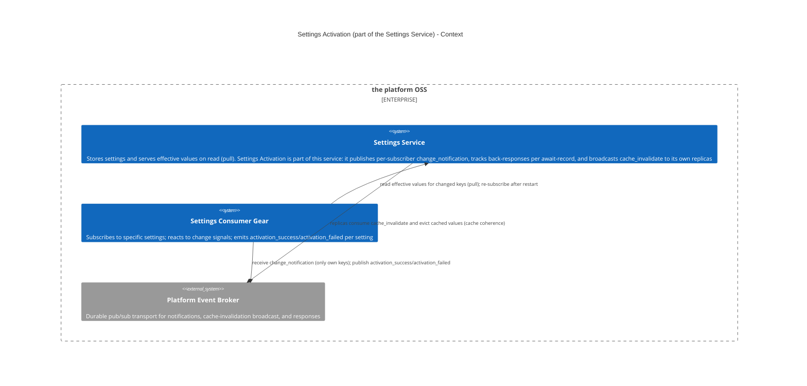
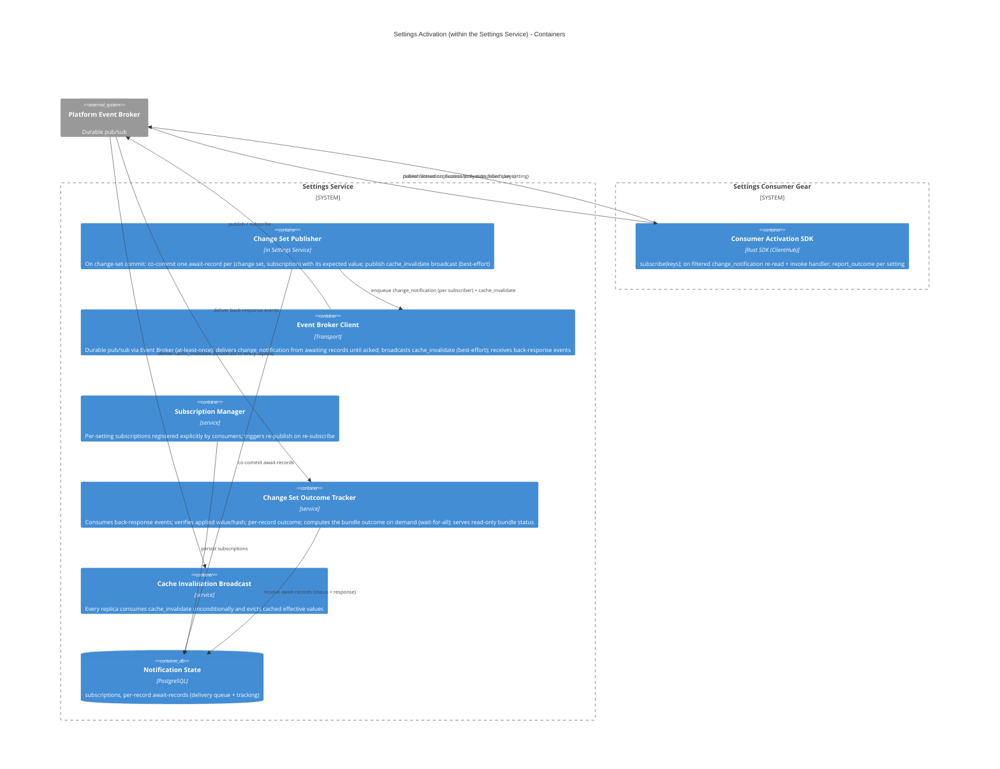
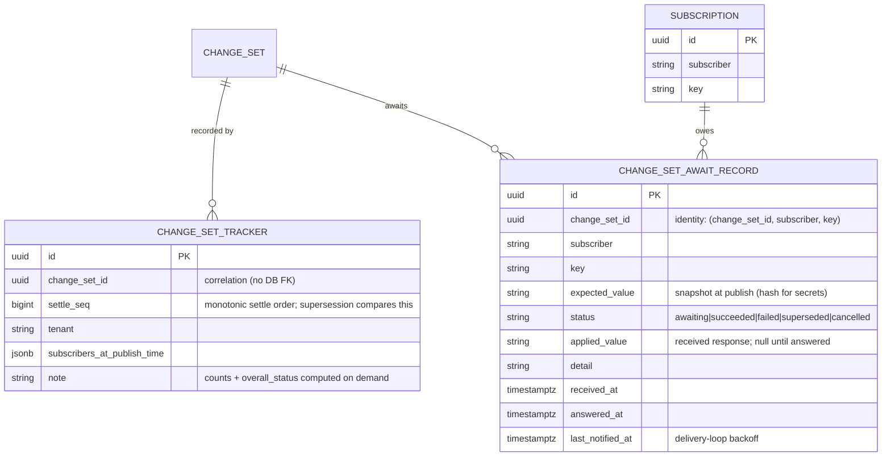

# Technical Design — Settings Activation

<!-- toc -->

- [1. Architecture Overview](#1-architecture-overview)
  - [1.1 Architectural Vision](#11-architectural-vision)
  - [1.2 Architecture Drivers](#12-architecture-drivers)
  - [1.3 Architecture Layers](#13-architecture-layers)
- [2. Goals / Non-Goals](#2-goals--non-goals)
  - [2.1 Goals](#21-goals)
  - [2.2 Non-Goals](#22-non-goals)
- [3. Principles & Constraints](#3-principles--constraints)
  - [3.1 Design Principles](#31-design-principles)
  - [3.2 Constraints](#32-constraints)
- [4. Technical Architecture](#4-technical-architecture)
  - [4.1 Domain Model](#41-domain-model)
  - [4.2 Component Model](#42-component-model)
  - [4.3 API Contracts](#43-api-contracts)
  - [4.4 External Interfaces & Protocols](#44-external-interfaces--protocols)
  - [4.5 Service-to-Service Pattern](#45-service-to-service-pattern)
  - [4.6 Interactions & Sequences](#46-interactions--sequences)
  - [4.7 Database schemas & tables](#47-database-schemas--tables)
  - [4.8 Security & Authorization](#48-security--authorization)
  - [4.9 Technology Stack](#49-technology-stack)
- [5. Risks / Trade-offs](#5-risks--trade-offs)
  - [5.1 Architectural Trade-offs](#51-architectural-trade-offs)
  - [5.2 Security and Performance Risks](#52-security-and-performance-risks)
- [6. Open Questions](#6-open-questions)
  - [6.1 From PRD (Cross-Reference)](#61-from-prd-cross-reference)
  - [6.2 Design-Specific Questions](#62-design-specific-questions)
- [7. Additional context](#7-additional-context)
  - [Feature Metrics](#feature-metrics)
  - [NFR Mapping](#nfr-mapping)
  - [Testing Architecture](#testing-architecture)
- [8. Traceability](#8-traceability)

<!-- /toc -->

<!--
=============================================================================
TECHNICAL DESIGN DOCUMENT
=============================================================================
PURPOSE: Define HOW the system is built — architecture, components, APIs,
data models, and technical decisions that realize the requirements.

DESIGN IS PRIMARY: DESIGN defines the "what" (architecture and behavior).
ADRs record the "why" (rationale and trade-offs) for selected design
decisions; ADRs are not a parallel spec, it's a traceability artifact.

SCOPE:
  ✓ Architecture overview and vision
  ✓ Design principles and constraints
  ✓ Component model and interactions
  ✓ API contracts and interfaces
  ✓ Data models and database schemas
  ✓ Technology stack choices

NOT IN THIS DOCUMENT (see other templates):
  ✗ Requirements → PRD.md
  ✗ Storage, resolution and the value commit → DESIGN.md
  ✗ Detailed rationale for decisions → ADR/

STANDARDS ALIGNMENT:
  - IEEE 1016-2009 (Software Design Description)
  - IEEE 42010 (Architecture Description — viewpoints, views, concerns)
  - ISO/IEC 15288 / 12207 (Architecture & Design Definition processes)

DESIGN LANGUAGE:
  - Be specific and clear; no fluff, bloat, or emoji
  - Reference PRD requirements using `cpt-cf-settings-service-fr-{slug}`,
    `cpt-cf-settings-service-nfr-{slug}` IDs
  - Cross-document references name the target file, e.g. "DESIGN.md §4.2"
=============================================================================
-->

- [ ] `p1` - **ID**: `cpt-cf-settings-service-design-settings-activation`

## 1. Architecture Overview

### 1.1 Architectural Vision

Design **Settings Activation** — the part of the **Settings Service** that provides **guaranteed, acknowledged delivery** of settings-change notifications. It tells a settings consumer **which settings changed** in a change set, so the consumer can re-read the new values and apply them its own way, and it **tracks each consumer's acknowledgement per await-record (one per change set × subscription)** until the change is confirmed activated. It builds on the [Settings Service](./DESIGN.md) value store, which serves values **on read** (pull): that path assumes a consumer reads a value **when it needs it**. This design adds the **push** signal with **back-response tracking**, so a consumer that has already materialized values at startup (connection pools, listener sockets, rendered config files) learns exactly which changed and can confirm successful activation back to the service. Settings Activation is **not a separate component** — the Settings Service owns it.

The service also keeps its own **cache coherence** from the same change set: replicas evict cached effective values. This is a **separate, internal broadcast** (§4.2 *Cache Invalidation Broadcast*) — not the consumer signal — so the two concerns (consumer activation vs. replica invalidation) do not leak into each other.

#### Two distinct distributions

A change set drives **two independent kinds of distribution**, with deliberately different delivery and trust models:

| | **Consumer activation** (§4.2 *Change Set Publisher*, §4.2 *Consumer Activation SDK*) | **Replica cache invalidation** (§4.2 *Cache Invalidation Broadcast*) |
|---|---|---|
| **Who receives** | Services that **subscribed** to the specific settings — only they know which settings need active re-application beyond a plain pull | **Every** Settings Service replica (the service's own instances) |
| **Subscription** | Per-setting, opt-in (§4.2 *Subscription Manager*) | **None** — always sent, always processed |
| **Payload** | Filtered to **only the subscriber's own subscribed keys** | The full changed-key set (trusted, internal) |
| **Acknowledged** | Yes — per await-record (change set × subscription), wait-for-all (§4.2 *Change Set Outcome Tracker*) | No — fire-and-forget eviction |
| **Event** | `settings.change_notification` (per subscriber) | `settings.cache_invalidate` (broadcast) |

Splitting them is **least-privilege / blast-radius reduction** (§4.8): a consumer receives only the keys it subscribed to, not the full "everything that changed, in every tenant" set — which stays inside the trusted replica set. Under the **trusted-caller** model (DESIGN.md §6) the subscriber identity is taken on trust, so this is a best-effort default, **not** an identity-enforced access control; revisit if consumers are ever untrusted.

#### Why a distinct design

Reading a value and being told a value changed are different concerns with different owners, so they are documented separately — even though both live inside the Settings Service:

- The **Settings Service** owns the value and answers reads (pull) — [DESIGN-settings-service](./DESIGN.md).
- The **owning consumer** owns *how* to react to a change — re-read a variable, rebuild a pool, drain and rebind, restart itself. That knowledge lives in the consumer, not in a central orchestrator, and a static per-setting effect enum cannot express it.

This design owns the **signal** and the **reaction contract**. It does not own value storage, resolution, or validation.

### 1.2 Architecture Drivers

#### Functional Drivers

| Requirement | Design Response |
|-------------|-----------------|
| `cpt-cf-settings-service-fr-consumer-activation` | **The requirement this document exists to serve.** A consumer registers per-`key` interest (§4.1 `Subscription`); the Change Set Publisher emits a **per-subscriber filtered** `change_notification` carrying only the keys that subscriber watches, and only ones it is entitled to read; the payload carries **identifiers only, never a value**, so the signal stream cannot disclose `secret`- or PII-classified content — the consumer re-reads through its ordinary authorization. Confirmation and accounting are the back-response and the per-(change set, subscription) await-record (§4.1 `AwaitRecord`, §4.2 *Change Set Outcome Tracker*). |
| `cpt-cf-settings-service-fr-replica-coherence` | The `cache_invalidate` broadcast (§4.2 *Cache Invalidation Broadcast*) converges the **other** replicas — the writing replica evicts inside the write itself. Published inline and best-effort; a missed broadcast is bounded by the reader's `cache_ttl_seconds` backstop, which is what makes the staleness window bounded rather than open-ended. For a `cascading` setting the eviction covers the descendant scopes the change altered. |
| `cpt-cf-settings-service-fr-live-read-activation` | Two-signal split: a per-subscriber filtered `change_notification` for consumer activation and an unfiltered `cache_invalidate` broadcast for replica cache coherence; consumers re-read and self-react |
| `cpt-cf-settings-service-nfr-efficiency-live-read` | Activation never reloads or restarts a consumer; a heavier reaction is the consumer's own, performed in its handler on the signal |
| `cpt-cf-settings-service-nfr-reliability-validated-set` | Durable `change_set_await_records` are the delivery queue — deliver-until-ack, with wait-for-all outcome resolution and no deadline |
| `cpt-cf-settings-service-nfr-performance-read-cache` | `cache_invalidate` is published inline and best-effort; a missed broadcast self-heals inside `cache_ttl_seconds`, so coherence never depends on durable delivery |
| `cpt-cf-settings-service-nfr-ops-set-monitoring` | Per-administrator failure surfaces through the back-response and `event_value_change_failed`; the aggregate operator signal stays with DESIGN.md |

#### NFR Allocation

| NFR ID | NFR Summary | Allocated To | Design Response | Verification Approach |
|--------|-------------|--------------|-----------------|----------------------|
| `cpt-cf-settings-service-nfr-reliability-validated-set` | No consumer activation is lost | Change Set Publisher + await-records | Deliver-until-ack from durable records; idempotent per `(change_set_id, subscriber, key)`; terminal states immutable | Integration redelivery and restart tests |
| `cpt-cf-settings-service-nfr-performance-read-cache` | Replica staleness is bounded | Cache Invalidation Broadcast | Inline best-effort broadcast plus the `cache_ttl_seconds` backstop owned by the cache components in DESIGN.md | Timed multi-replica convergence test |
| `cpt-cf-settings-service-nfr-security-baseline` | No secret leaves in the signal stream | Event payloads | Notification events carry identifiers only; back-responses carry a hash for secret-valued settings | Subscribed-observer test asserting no plaintext |

### 1.3 Architecture Layers

```
┌─────────────────────────────────────────────────────────────┐
│   Consumers (gears subscribing to the settings they read)   │
├─────────────────────────────────────────────────────────────┤
│  Consumer Activation SDK │ subscribe · handler · ack        │
├─────────────────────────────────────────────────────────────┤
│  Settings Activation (inside the settings-service gear)     │
│  ┌──────────────────────────────────────────────────────┐   │
│  │ Change Set Publisher · Subscription Manager ·             │   │
│  │ Change Set Outcome Tracker · Cache Invalidation Broadcast │   │
│  └──────────────────────────────────────────────────────┘   │
├─────────────────────────────────────────────────────────────┤
│  Transport │ Event Broker (at-least-once, repeat-safe)      │
├─────────────────────────────────────────────────────────────┤
│  Storage   │ PostgreSQL (await-records, subscriptions)      │
└─────────────────────────────────────────────────────────────┘
```

| Layer | Responsibility | Technology |
|-------|---------------|------------|
| Consumer SDK | Subscribe to exact setting keys, receive the change signal, report the applied outcome | Rust trait in `settings-service-sdk` |
| Activation | Publish the two signals, track one await-record per `(change set, subscriber, key)`, resolve bundle outcome | In-process Rust modules in the `settings-service` gear |
| Transport | At-least-once event delivery; a repeated notification is re-applied and re-acknowledged | Event Broker |
| Storage | Durable await-records and the subscription registry | PostgreSQL via `toolkit-db` |

#### Context View



#### Container View



## 2. Goals / Non-Goals

### 2.1 Goals

- **Consumer notification per change set (filtered)** — `change_notification { change_set_id, tenant, changed_keys: [key] }`, delivered **per subscriber**, carrying **only the changed keys that subscriber is subscribed to** (never the full change set). One message per change set per subscriber, so a consumer batch-reacts without re-subscribing or polling. `tenant` is always present — the root tenant's id at platform scope (DESIGN.md §4.7). Keys are the settings' GTS **type** ids — referenceable by construction, each registered when its declaration was created (DESIGN.md §4.7). No `change_kind` — consumers re-read anyway.
- **Replica cache invalidation (broadcast)** — `cache_invalidate { change_set_id, tenant, changed_keys: [key] }`, published once per change set to **all** Settings Service replicas (no subscription, no ack), carrying the full changed-key set so every replica evicts its cached `(key, tenant)` entries (§4.2 *Cache Invalidation Broadcast*).
- **Immutable change set** — the settings changed by a single `set` are stored immediately (effective on read) and then reconciled as one unit. The bundle's expected values are **fixed at write time**; to change a value the administrator sets it again, producing a **new** change set.
- **Per-setting subscription** — a consumer subscribes, in its own name, to the **specific setting keys** it must actively activate (not merely pull). Subscription implies **acknowledged delivery** for those keys (§4.2 *Subscription Manager*).
- **Back-response contract** — consumers emit `activation_success` (or `activation_failed { detail }`) **per changed setting** after reacting, echoing the `tenant` and **the value they applied (a hash for secret-valued settings)**, so the Settings Service tracks activation **per await-record** and verifies the applied value against the expected value **snapshotted at write time** (§4.2 *Change Set Publisher*). A `success` back-response carrying a value that does **not** match is treated as a **failure**.
- **Settings Service activation-outcome visibility** — the Settings Service tracks and exposes via API the state of each change set: a **wait-for-all** overall status `awaiting` → `success` / `failed` / `superseded` / `cancelled`, plus **succeeded / failed / superseded / cancelled / awaiting counts** over the await-records.
- **Consumer re-read-and-react** obligation: on an `change_notification` the consumer re-reads the affected keys and change sets them. A restart-only consumer is handled by **re-publish on re-subscribe** (§4.2 *Change Set Outcome Tracker*) — no missed activation is stranded.
- **Event Broker transport only** — durable pub/sub via the platform event broker. At-least-once delivery; the consumer's reaction is idempotent, so a repeated notification is re-applied and re-acknowledged.

### 2.2 Non-Goals

- **Setting storage, effective-value resolution, validation, and the value commit** — owned by the [Settings Service](./DESIGN.md) write path. Settings Activation is triggered *by* that change set, and does not duplicate it.
- **Carrying the value in a notification** — neither **notification** event (`change_notification` / `cache_invalidate`) contains the value or a secret (§4.1); consumers re-read. (Back-responses **do** echo the applied value — a hash for secrets — §4.1/§4.4.)
- **Exactly-once delivery** — the model tolerates at-least-once (Event Broker durability): on every notification the consumer re-reads the effective value and converges to it, so a repeat is **re-applied and re-acknowledged**, never suppressed (§4.2 *Consumer Activation SDK*). No global ordering guarantee across change sets.
- **Central execution of heavier reactions — not in the model.** Activation never centrally reloads/restarts a consumer, nor classifies a per-setting "effect." Heavier reactions (rebuild a pool, re-render a config file, restart) are the consumer's **own**, done in its handler on the signal — a consumer that cannot apply in place restarts itself (exit → supervisor restarts it → reads the current value on boot, §4.6). See §4.2 *Heavier consumer reactions*. (Coordinated **rolling** restart across replicas is a deployment/rollout concern — RMS — not activation.)
- **A response deadline / time-boxed wait** — the Settings Service does **not** impose a deadline on a bundle; it waits **unboundedly** for every await-record to resolve (how long to keep waiting is an administrator decision, §6). A restart-only consumer leaves its await-records **unanswered**; on **re-subscribe after boot** the service **re-publishes** the notification and the consumer acknowledges then (§4.2 *Change Set Outcome Tracker*).
- **Namespace/prefix subscriptions** — not supported. Subscription (and the consumer-facing `watch`, DESIGN.md §4.5) is per **exact** setting key (§4.2 *Subscription Manager*), never a namespace prefix or category.

## 3. Principles & Constraints

### 3.1 Design Principles

#### Notify and React, Never Centrally Execute

- [ ] `p1` - **ID**: `cpt-cf-settings-service-principle-notify-not-execute`

Activation signals *which* keys changed; it never performs a consumer's reaction. A consumer that must rebuild a pool, re-render a config file, or restart does so itself in its own handler. There is no central per-setting effect and no orchestrator.

#### Two Signals, Two Audiences

- [ ] `p1` - **ID**: `cpt-cf-settings-service-principle-two-signal-split`

Consumer activation and replica cache coherence are separate concerns with different delivery requirements, so they are separate events: `change_notification` is per-subscriber, filtered, and acknowledged; `cache_invalidate` is an unfiltered broadcast to the service's own trusted replicas with no subscription and no ack.

#### Identifiers in Notifications, Values Only in Back-Responses

- [ ] `p1` - **ID**: `cpt-cf-settings-service-principle-identifiers-only`

Neither notification event carries a settings value or a secret — consumers re-read under their own identity. The back-responses are the deliberate exception: they echo the value the consumer applied, hashed when the setting is secret-valued, so the service can verify what was activated.

#### Verify Against the Snapshot, Not a Recomputation

- [ ] `p1` - **ID**: `cpt-cf-settings-service-principle-snapshot-verification`

An acknowledgement is compared against the effective value snapshotted for that await-record at write time, never against a value recomputed at receive. A later change set must not make an earlier acknowledgement look correct.

#### The Wait Is Unbounded and Admin-Driven

- [ ] `p1` - **ID**: `cpt-cf-settings-service-principle-unbounded-wait`

A bundle stays open until every await-record is terminal. There is no automatic timeout: the service cannot distinguish a slow consumer from a gone one, so it does not guess. A clean retire resolves its records as `cancelled`; anything else is an operator decision.

### 3.2 Constraints

#### Delivered as part of the Settings Service Gear

- [ ] `p1` - **ID**: `cpt-cf-settings-service-constraint-activation-in-settings-gear`

Settings Activation is a mechanism **inside** the Settings Service; the publisher and state tables ship in the Settings Service Constructor Fabric Gear (ToolKit runtime); consumers reach the subscription contract through the settings SDK registered in `ClientHub`.

#### Event Broker transport only

- [ ] `p1` - **ID**: `cpt-cf-settings-service-constraint-activation-broker-only`

Durable pub/sub via the platform event broker. No broker-less fallback — the broker is a platform dependency.

#### Two events per change set

- [ ] `p1` - **ID**: `cpt-cf-settings-service-constraint-activation-two-events-per-change-set`

Each change set emits (1) a `cache_invalidate` broadcast to all replicas (published inline at the write, best-effort, cache-TTL backstop) and (2) one filtered `change_notification` per subscriber (delivered from the durable await-records until acked). Both come from the same settled change set (§4.2 *Change Set Publisher*).

#### Consumer notification is filtered

- [ ] `p1` - **ID**: `cpt-cf-settings-service-constraint-activation-filtered-notification`

An `change_notification` carries **only the subscriber's own subscribed changed keys** — never the full change set. This is **key-scoped, best-effort least-privilege** (§4.8), **not** a cross-tenant isolation guarantee: filtering has no tenant dimension, so a subscriber to key K is notified of K's change in **any** tenant (the notification carries which).

#### Tenant in payload

- [ ] `p1` - **ID**: `cpt-cf-settings-service-constraint-activation-tenant-in-payload`

Both events include the `tenant` the change applies to, so consumers can correctly resolve tenant lineage if they care about cascading, and replicas evict the right scope. It is **always present**: platform scope is the **root tenant's id**, an ordinary tenant id, not an absent one (DESIGN.md §4.7).

#### No settings value in a notification payload

- [ ] `p1` - **ID**: `cpt-cf-settings-service-constraint-activation-identifiers-only-payload`

The two **notification** events (`change_notification`, `cache_invalidate`) carry **identifiers only** (`changed_keys`, `tenant`) — no settings value, no secret; the tenant-scoped effective value resolves correctly on re-read. The **back-responses** (`activation_success` / `activation_failed`) are the deliberate exception: they carry the **applied value** — plaintext for a non-secret setting, a **hash** for a secret value (the secret plaintext never enters the stream); see §4.8, §4.1/§4.4.

#### Consumers read effective values on demand, respond with outcomes

- [ ] `p1` - **ID**: `cpt-cf-settings-service-constraint-activation-pull-plus-back-response`

The pull path (`SettingsReaderClient`, DESIGN.md §4.5) is the source of truth; this system signals *which* of a subscriber's keys changed and tracks *what* happened via back-response (`activation_success` / `activation_failed`, per setting, carrying the applied value or a secret hash).

#### Wait-for-all, unbounded (restart scenario)

- [ ] `p1` - **ID**: `cpt-cf-settings-service-constraint-activation-wait-for-all-unbounded`

Reconciliation waits until **every** await-record resolves; there is **no TTL**. A restart-only consumer does not acknowledge before rebooting; its await-records stay **awaiting**. On **re-subscribe after boot**, the Settings Service **re-publishes** the notification for the unanswered await-records and the consumer acknowledges then (§4.2 *Change Set Outcome Tracker*, §6).

## 4. Technical Architecture

### 4.1 Domain Model

#### Entity: `ChangeNotification` (per-subscriber consumer event body)

| Field | Type | Required | Description |
|-------|------|----------|-------------|
| `change_set_id` | UUID | Yes | The `set` request (DESIGN.md §4.2 *Value Writer*) whose changes these are — correlates the signal to its cause and to response reports. |
| `tenant` | string | Yes | The tenant the change applies to (`/tenants/{id}`); the **root tenant's id** for a platform-wide change (DESIGN.md §4.7). The consumer re-reads for this tenant and is responsible for resolving affected descendant tenants if it cares about cascading. |
| `changed_keys` | `[key]` | Yes | **Only the changed setting keys that the receiving subscriber is subscribed to** (GTS type ids; no operation type) — never the full change set. Delivered per subscriber, so each consumer sees a bundle scoped to its own subscriptions. Consumer already re-reads; operation type is not needed. |

**Invariant:** the payload never contains values or secrets, and never keys the subscriber did not subscribe to. A consumer that needs values re-reads them via `SettingsReaderClient` (DESIGN.md §4.5), which resolves effective values for the given `tenant`.

#### Entity: `CacheInvalidation` (internal broadcast event body)

| Field | Type | Required | Description |
|-------|------|----------|-------------|
| `change_set_id` | UUID | Yes | The change set that changed the values. |
| `tenant` | string | Yes | The tenant of the change; the **root tenant's id** for a platform-wide change (DESIGN.md §4.7). Replicas evict this scope and, for `cascading` keys, affected descendant tenants. |
| `changed_keys` | `[key]` | Yes | The **full** set of changed keys for the change set. Sent only to the trusted Settings Service replica set (§4.2 *Cache Invalidation Broadcast*) — never to external consumers. |

**Invariant:** carries identifiers only (no values/secrets). Consumed unconditionally by every replica; there is no subscription and no acknowledgement.

#### Entity: `BackResponse` (consumer-emitted responses)

| Field | Type | Required | Description |
|-------|------|----------|-------------|
| `change_set_id` | UUID | Yes | The change set this response answers. |
| `subscriber` | string | Yes | Consumer identity (gear/module namespace) that reacted. |
| `key` | string | Yes | The changed setting (GTS type id) this response answers. Together with `subscriber` and `change_set_id` it identifies the **await-record**; a consumer emits one response per changed setting it is subscribed to. |
| `tenant` | string | Yes | The tenant the consumer applied the change for, echoed from the notification. Lets the system verify against the tenant-scoped effective value. |
| `status` | `ResponseStatus` | Yes | `success` / `failed`. |
| `applied_value` | string | Conditional | **Required when `status = success`**; absent when `status = failed`. The value the consumer applied for `key` at `tenant` — the **plaintext value** for non-secret settings, or a **hash** for secret-valued settings (plaintext never leaves the consumer). The Settings Service verifies it against the expected value **snapshotted at write time** for the await-record (§4.2 *Change Set Publisher*; comparing hashes for secrets); a value that does **not** match makes the record **failed** even when `status = success`, and a `success` that omits it cannot be verified at all, so it resolves the record **failed** too (§4.2 *Change Set Outcome Tracker*). |
| `detail` | string | No | Failure detail when `status = failed` (e.g., which specific reason the setting failed to apply). |
| `received_at` | `timestamptz` | Yes | UTC timestamp when response was received (allows delayed responses post-restart; the wait is unbounded). |

**Verification is tenant-scoped:** the system verifies an acknowledgement against the expected value **snapshotted for that await-record at write time** (§4.2 *Change Set Publisher*) — the tenant-scoped effective value captured for the acknowledged `tenant`, not a single global value, and **not** a value recomputed at receive. For secret-valued settings the consumer returns a **hash** of the applied value rather than the plaintext, and the system compares hashes. A mismatch (or a `failed` status) resolves the record as **failed**.

**Canonical value encoding (normative).** A settings value is typed JSON — scalar or structured (DESIGN.md §4.1: `value` is `JSONB`, validated against JSON Schema 2020-12) — so comparing two independently produced serializations as raw text is **not** sound: member order, whitespace, number formatting and Unicode escaping all differ without the value differing, and the two sides are serialized by different code (the service writes the snapshot at publish, the SDK builds `applied_value` at the consumer). `expected_value` and `applied_value` therefore carry the value canonicalized per **RFC 8785 (JSON Canonicalization Scheme)**, and are compared byte-for-byte in that form. For secret-valued settings the value is hashed rather than carried, over that same canonical form (**Secret-value hash** below). A payload that is not valid canonical JSON resolves the record **failed**. Because both sides must produce identical bytes for the same value, agreement between the service-side and SDK-side canonicalizers is a **conformance requirement**, not an implementation detail (§7 *Testing Architecture*).

**The encoding has a narrower number domain than the value store, and the store must respect it.** RFC 8785 serializes a number by parsing it into an IEEE-754 binary64 and printing the shortest decimal that reads back as the same double, whereas `JSONB` keeps numbers as exact arbitrary-precision `numeric` and JSON Schema 2020-12 bounds neither magnitude nor precision. Numbers the double cannot distinguish — an integer beyond ±2⁵³, or a decimal carrying more precision than binary64 resolves — therefore lose information **at the parse, before any byte is written**, with two consequences: two implementations that handle the excess differently produce different bytes and fail every acknowledgement for that setting, and two distinct stored values that collapse to one double compare equal, so the verification stops verifying. Values are consequently **constrained to the domain the encoding carries losslessly**, enforced on write by the Type Validator (DESIGN.md §4.2) — a number MUST survive a round trip through binary64 unchanged in value. Canonicalization here **never silently normalizes** an out-of-domain number; such a value is rejected before it is ever stored. A setting that genuinely needs more range or precision — a 128-bit identifier, a nanosecond timestamp — models it as a **string** in its GTS type, which the encoding carries verbatim.

**Secret-value hash (normative).** For a `secret`-trait setting the consumer returns a hash in place of the plaintext, and the service snapshots the same hash as `expected_value`. The hash is **SHA-256** over the canonical encoding above of the array `["cf.settings.activation.secret.v1", key, tenant, value]` — `tenant` is the root tenant's id for a platform-wide change set, platform scope being an ordinary tenant id (DESIGN.md §4.7) — rendered as **lowercase hex**. Framing the input as a canonical JSON array rather than a concatenation avoids inventing separator and escaping rules for `key`. The salt is `(key, tenant)` and **nothing else**: both are constant across a `(subscriber, key, tenant)` supersession group, so equal values still hash equal and the cross-record value matching in §4.2 *Change Set Outcome Tracker* keeps working — salting with `change_set_id` would break it. What this hash does and does not protect against is §6.2 *Keyed secret hash*.

**File-reference values (normative).** A `file-reference`-trait value (DESIGN.md §3 *Files*) is an ordinary structured value here: it carries the reference, never the file, so it canonicalizes and compares exactly like any other object — no hash, no new field, no protocol change. It needs none, because the reference is **always pinned to a version** and `file-storage` guarantees a version's content is immutable: two identical references therefore stand for identical bytes, and the `expected_value` snapshot stays true for the life of the record. There is no unpinned form to weaken this — a reference naming only the file would resolve through a pointer that an ordinary `bind` swaps, and acknowledgements on it would compare equal while subscribers held different bytes. Because the shape is uniform, activation needs no file-specific registration rule: any file-valued setting is trackable exactly like a scalar one.

The per-version content hash `file-storage` publishes is deliberately **not** carried in the value. It would require every subscriber to download and digest the content merely to answer — stronger than this protocol asks of any other value, where an acknowledgement attests to the value received, not to what the consumer did with it. It is also a weaker identity than the version id it would replace: `hash_mode` is `whole-sha256` **or** `multipart-composite-sha256`, so the published hash is not always a digest of the object's bytes.

If the referenced file is deleted while a change set is in flight, the subscriber cannot self-react and its await-record follows the ordinary un-acknowledged path — it stays `awaiting` and the `change_notification` is re-delivered on the usual interval, because the tracker never moves a record to a terminal state on a timer (§4.2 *Change Set Outcome Tracker*). This is the same behaviour as for any consumer that cannot apply. Nothing else happens: the reference is stored unvalidated and no deletion signal is consumed (DESIGN.md §3 *Files*), so the value stays valid, stays applicable, and the only party that learns the file is gone is the subscriber that tried to fetch it.

#### Entity: `AwaitRecord` (per-(change set, subscription) tracking state — the load-bearing state)

One row per **(change set, subscriber, key)** the change set must hear back on. Its tenant is **not stored here** — it is an attribute of the change set, read via `change_set_id` from the per-change-set row (`change_set_tracker.tenant`). Created at publish (§4.2 *Change Set Publisher*), the record holds the value **snapshot** the back-response is verified against and the per-record terminal outcome. Verification and supersession are scoped to `(subscriber, key, tenant)` — the same key in a different tenant (a different change set's scope) is an independent record. Persisted as `change_set_await_records` (§4.7); the `ChangeSetOutcomeTracker` counts are **computed on demand** from these rows (count by status), never stored, incremented, or decremented.

| Field | Type | Required | Description |
|-------|------|----------|-------------|
| `change_set_id` | UUID | Yes | The change set this record belongs to. `(change_set_id, subscriber, key)` is the record's **unique identity** — `tenant` is **not** in the key (it is determined by the change set). It is **not** an ordering key: `change_set_id` is a UUIDv7 minted when the `set` request is **accepted** (DESIGN.md §4.2 *Value Writer*), and because a change set commits **per change**, a long change set accepted earlier can settle later — so `change_set_id` order is creation order, not settle order. "Older / newer" within a `(subscriber, key, tenant)` supersession group is therefore a comparison of **`change_set_tracker.settle_seq`** (§4.7), the monotonic sequence assigned when the change set settles. |
| `subscriber` | string | Yes | Consumer identity that owes an acknowledgement. |
| `key` | string | Yes | The changed setting (GTS type id). |
| `expected_value` | string | Yes | The **snapshot fixed at write time** (§4.2 *Change Set Publisher*) — the tenant-scoped effective value in the canonical encoding (§4.1 *Canonical value encoding*), or a **hash** over those canonical bytes for secret-valued settings. The back-response's applied value is compared against this snapshot, never a recomputed value. |
| `status` | `RecordStatus` | Yes | `awaiting` → `succeeded` / `failed` / `superseded` / `cancelled` (§4.2 *Change Set Outcome Tracker*; `cancelled` = the owing consumer retired, §4.2 *Subscription Manager*). Terminal states are **immutable**, so redelivered acks are idempotent no-ops. |
| `answered_at` | `timestamptz` | No | When the record reached a terminal state; `NULL` while `awaiting`. |

#### Entity: `ChangeSetOutcomeTracker` (Settings Service tracking change-set activation state)

**Computed view, not a stored aggregate.** The counts below are **computed on demand** from the `AwaitRecord` rows (count by status) whenever bundle status is read — never stored, incremented, or decremented. This is what keeps them correct under at-least-once redelivery: a duplicate ack cannot double-count, because the numbers are a function of the (idempotent, terminal) record statuses, not a running total of events.

| Field | Type | Required | Description |
|-------|------|----------|-------------|
| `id` | UUID | Yes | Tracker id (UUIDv7). |
| `change_set_id` | UUID | Yes | The change set being tracked. |
| `tenant` | string | Yes | The tenant of the change set; the **root tenant's id** for a platform-wide change set (DESIGN.md §4.7). |
| `subscribers_at_publish_time` | `[subscriber]` | Yes | List of subscribers to the changed keys (resolved at publish time; captured for auditability). |
| `expected_records` | integer | Yes | Count of **await-records** the change set must hear back on (changed keys × subscribers subscribed to those keys). Computed on demand. |
| `resolved_records` | integer | Yes | Count of await-records in a **terminal** state (`succeeded` / `failed` / `superseded` / `cancelled`) — a `superseded` record (like a `cancelled` one) is resolved without its own response. Computed on demand (see the note above), not stored. |
| `succeeded_records` | integer | Yes | Await-records answered `success` with a value matching their **snapshot** (§4.2 *Change Set Publisher*). |
| `failed_records` | integer | Yes | Await-records answered `fail` status **or** `success` with a mismatching value. |
| `superseded_records` | integer | Yes | Await-records whose `(key, tenant)` was overtaken by a **later, confirmed** change set before this one was acknowledged (§4.2 *Change Set Outcome Tracker*) — a terminal **non-failure** outcome. |
| `cancelled_records` | integer | Yes | Await-records resolved `cancelled` because the owing consumer **retired** before answering (§4.2 *Subscription Manager*) — a terminal **non-failure** outcome. |
| `overall_status` | `ChangeSetOutcomeStatus` | Yes | `awaiting` → `success` / `failed` / `superseded` / `cancelled` — **wait-for-all** (see transitions in §4.2 *Change Set Outcome Tracker*). |

#### Entity: `Subscription`

| Field | Type | Required | Description |
|-------|------|----------|-------------|
| `id` | UUID | Yes | Subscription id (UUIDv7). |
| `subscriber` | string | Yes | The consumer identity that registered this subscription — **any trusted in-platform consumer**, not necessarily the setting's owner/contributor. |
| `key` | string | Yes | The **exact setting key** (GTS type id) the subscriber watches — one row per setting the consumer must actively activate. Not a namespace/prefix pattern. Registered by the consumer (trusted-caller, §4.2 *Subscription Manager*) for any key it can read — **not** tied to contribution, and stored by this system, **not** on the settings declaration (which stays activation-agnostic). |
| `created_at` | `timestamptz` | Yes | UTC timestamp. |

> A subscription **implies acknowledged delivery** for its key — there is no non-acking subscription. Replica cache invalidation is *not* modelled as a subscription (§4.2 *Cache Invalidation Broadcast*): it is an unconditional broadcast with no registry row.

#### Enums

| Enum | Values |
|------|--------|
| `ResponseStatus` | `success`, `failed` |
| `RecordStatus` | `awaiting`, `succeeded`, `failed`, `superseded`, `cancelled` |
| `ChangeSetOutcomeStatus` | `awaiting`, `success`, `failed`, `superseded`, `cancelled` |

> **`ChangeSetOutcomeStatus`** tracks the aggregate activation outcome of a change set as a **wait-for-all** result: it stays `awaiting` until **every** await-record is terminal, then resolves to `failed` (any record failed), else `superseded` (no failure, but ≥1 key overtaken by a later confirmed change set), else `cancelled` (no failure/supersession, but ≥1 record `cancelled` because its consumer retired — §4.2 *Subscription Manager*), else `success` (every record confirmed with a matching value). Partial progress is visible through the per-record **succeeded / failed / superseded / cancelled / awaiting counts**, not as a distinct status. There is **no deadline** — the wait is unbounded (§4.2 *Change Set Outcome Tracker*, §6). The Settings Service exposes this state via API (§4.3).

#### Entity Relationships



### 4.2 Component Model

#### Component: Change Set Publisher

- [ ] `p1` - **ID**: `cpt-cf-settings-service-component-change-set-publisher`

Runs inside the Settings Service; invoked by the change set commit (DESIGN.md §4.2 *Value Writer*) after all values are written.

**Dependencies:** Event Broker Client, Notification State (PostgreSQL), Settings Service write path, Subscription Manager.

**Operations:**

| Operation | Input | Output | Key Behavior |
|-----------|-------|--------|--------------|
| `publish_change_set` | `change_set_id`, `tenant`, `changed_keys` | — | In a **final bookkeeping transaction once the change set has settled** (the settings change set commits **per change**, so there is no single whole-change-set transaction to ride — DESIGN.md §4.2 *Value Writer*), **co-commit one await-record per (change set, subscription)** (changed keys × their subscribers, resolved via `resolve_subscribers`), each holding the **expected tenant-scoped effective value** — a **snapshot fixed at write time** that each back-response is later compared against (read back verbatim at receive, §4.2 *Change Set Outcome Tracker*, **never recomputed**); `expected_records` is then just the count of those rows (computed on demand). These durable await-records **are** the delivery queue: the delivery loop (§4.2 *Event Broker Client*) publishes a **filtered** `change_notification` per subscriber from its `awaiting` records and keeps re-publishing until each is acked — **no separate outbox**. Separately, publish a `cache_invalidate` **broadcast** with the full committed changed-key set (§4.2 *Cache Invalidation Broadcast*) **inline, best-effort** — replicas evict; a missed broadcast self-heals within `cache_ttl_seconds` (§7 *NFR Mapping*). Idempotent per `change_set_id`. |

**Publish-after-settle & guarantee.** The await-records are the durable record of what must be delivered; they are written in one bookkeeping transaction after the change set settles. A crash **before** that commit leaves nothing recorded — the committed values are still pull-readable and any stale replica cache self-heals within `cache_ttl_seconds`, never silent drift. **After** the commit, delivery is guaranteed: the delivery loop (§4.2 *Event Broker Client*) publishes `change_notification` for every `awaiting` record and retries **until it is acked** (not merely until the broker accepts a publish), so a notification that is accepted-but-never-handled is re-delivered without a separate re-publish path. `cache_invalidate` is the one best-effort element — published inline, not persisted — and its correctness is bounded by `cache_ttl_seconds` (§7 *NFR Mapping*), so it needs no durable queue. No values are read or transported here.

#### Component: Event Broker Client

- [ ] `p1` - **ID**: `cpt-cf-settings-service-component-event-broker-client`

Transport abstraction for sending and receiving notifications.

**Configuration:**

| Parameter | Type | Default | Description |
|-----------|------|---------|-------------|
| `redeliver_interval_seconds` | integer | `30` | Minimum interval before the delivery loop re-publishes an `change_notification` for a still-`awaiting` record (backoff via `last_notified_at`), so a slow-to-ack consumer is not re-notified on every scan. **Not** a deadline — the wait is unbounded (§4.2 *Change Set Outcome Tracker*). |

> **`cache_ttl_seconds` is not configured here.** The cache TTL backstop is **owned by the cache components** — the replica effective-value cache (DESIGN.md §4.2 *Cache & Invalidation*) and the reader-SDK consumer cache (DESIGN.md §4.5). Activation only **references** it: it is the sole correctness backstop for the best-effort `cache_invalidate` broadcast (§4.2 *Cache Invalidation Broadcast*), so a missed broadcast self-heals within that TTL (§7 *NFR Mapping*).

**Operations:**

| Operation | Input | Output | Key Behavior |
|-----------|-------|--------|--------------|
| `publish_notification` | `subscriber`, `ChangeNotification` | — | Deliver a subscriber's **filtered** notification (only its subscribed changed keys), built from its `awaiting` records. At-least-once; invoked by the delivery loop (below). |
| `publish_cache_invalidation` | `CacheInvalidation` | — | **Broadcast** the full changed-key set to every Settings Service replica (§4.2 *Cache Invalidation Broadcast*). At-least-once; no acknowledgement. |
| `subscribe_notifications` | `keys`, handler | subscription handle | Ensure the subscriber's **durable per-subscriber consumer queue** on the broker and **update the registry** (§4.2 *Subscription Manager*) with its `(subscriber, key)` interests. It does **not** create per-key broker subscriptions — broker addressing is **per-subscriber identity**; the delivery loop filters by the registry and publishes each subscriber's bundle to its queue. |
| `deliver_awaiting` | — | — | The **delivery loop**: publishes a filtered `change_notification` per subscriber from its `awaiting` records — immediately after the co-commit (prompt) and on a periodic reconcile scan (retry, broker-outage recovery, and post-restart re-delivery). Honours `redeliver_interval_seconds` via `last_notified_at`. Stops for a record once it is terminal (§4.2 *Change Set Outcome Tracker*). **Every replica runs this loop, and the periodic scan is serialised across them by an advisory lock** — see *Why only one replica scans at a time*. |
| `publish_response` | `BackResponse` | — | Consumer emits per-setting success/failed response via Event Broker. Settings Service receives and tracks. |

**Broker topology — per-subscriber addressing.** The broker is addressed by **subscriber identity**: each subscriber has **one durable consumer queue**, and the delivery loop publishes its filtered bundle there. There is **no per-key broker subscription** — `subscribe`/`subscribe_notifications` only update the **registry** (§4.2 *Subscription Manager*) recording which keys a subscriber wants; per-key filtering is done by the service from that registry, not by broker routing. (Assumes the platform Event Broker's durable pub/sub supports a durable per-consumer queue, so a notification published while a subscriber is down is delivered on reconnect.)

#### Component: Subscription Manager

- [ ] `p1` - **ID**: `cpt-cf-settings-service-component-subscription-manager`

**Dependencies:** Notification State (PostgreSQL). Subscription is **self-contained**: a consumer registers explicitly (`register_subscription` / SDK `subscribe`). There is **no dependency on the Settings Service Contribution path** and **no auto-subscribe** — contribution and subscription are fully independent.

**Operations:**

| Operation | Input | Output | Key Behavior |
|-----------|-------|--------|--------------|
| `register_subscription` | `subscriber`, `key`, `Context` | `Subscription` | **Any trusted in-platform consumer** registers a per-`key` subscription for **any key it can read** — trusted-caller, the same posture as the reader SDK (DESIGN.md §6); subscription is **decoupled from owning/contributing** the setting, so shared and admin-authored keys are subscribable. Subscription is **always explicit** — there is **no auto-subscribe from contribution**; a subscription's ack obligation (§4.2 *Change Set Outcome Tracker*) is only ever created by a deliberate subscribe, never as a side effect of declaring a setting. Idempotent per `(subscriber, key)`. **On re-subscribe** (e.g. after a consumer restart) the subscriber's still-`awaiting` records are re-delivered automatically by the delivery loop (§4.2 *Event Broker Client*) — no explicit re-publish call — so the consumer receives the change again and can acknowledge (§4.2 *Change Set Outcome Tracker*). |
| `resolve_subscribers` | `key` | `Subscription[]` | Return subscriptions for the exact changed `key` (exact match, no prefix); used to build each subscriber's filtered `change_notification` and to know which subscribers owe an ack. |
| `retire_subscription` | `subscriber`, `key` | — | Remove the subscription (Settings Service register/retire lifecycle). **MUST also resolve the subscriber's still-`awaiting` await-records for this `key` to `cancelled`** (a terminal non-failure, §4.1) — retire is a deterministic lifecycle event, so the service knows the consumer will never answer and closes the records instead of leaving bundles `awaiting` forever. Affected bundle outcomes recompute on demand (§4.2 *Change Set Outcome Tracker*); the delivery loop stops re-delivering `cancelled` records. |

**Why only one replica scans at a time.** This service runs as **N replicas** — that is the premise of `cache_invalidate` — and every one of them runs the delivery loop. A plain periodic scan would therefore have every replica read the same `awaiting` records and publish the same notification, and `last_notified_at` would not prevent it: read-then-write is a race, so two replicas both see an interval that has elapsed, both publish, and both write the timestamp. The consumer receives duplicates and the back-response arrives more than once.

The scan therefore runs **under an advisory lock**. Before each pass a replica makes one non-blocking attempt on a named lock through `toolkit-db`'s `LockManager` — `pg_try_advisory_lock` on PostgreSQL, `GET_LOCK` on MySQL, a file marker on SQLite — and a replica that does not get it skips this tick rather than waiting. Exactly one replica scans per tick, so a record is published once per interval and `last_notified_at` is written by the only writer there is. The lock is session-level on a pinned connection, so a replica that dies releases it when its session ends; nothing has to detect the failure.

Row-level claiming with `FOR UPDATE SKIP LOCKED` would parallelise this across replicas, and is deliberately not used: it is not reachable from a gear. `SecureConn`'s query surface exposes filtering and projection but no lock behaviour, and raw SQL outside migrations is rejected by the architecture lints (DESIGN.md §4.8 *The Data Path*) — `SKIP LOCKED` appears in this platform only inside infrastructure that owns its own SQL, the outbox's dialect layer and the `cluster` plugin. Serialising the scan is the honest cost, and a small one: the prompt publish immediately after co-commit is unaffected, and the scan exists only for records nobody has answered yet, which is by construction the quiet path. Leader election in the `cluster` gear would serve equally well and is not taken, because an advisory lock in `toolkit-db` costs no gear dependency at all.

> **Why ToolKit's transactional outbox is not used here.** The platform ships a four-stage outbox in `toolkit-db` with per-partition ordering, dead-letter handling and both transactional and leased delivery, and this design deliberately does not adopt it — not for the delivery loop, though it *is* used for shipping audit records (DESIGN.md §4.2 *Audit Emitter*), where the difference below does not arise.
>
> An outbox acknowledges a message when it has been **sent**. This loop must keep re-publishing until the consumer has **replied** — the await-record's whole reason to exist — which is a strictly stronger condition and one an outbox does not model. Delivery to the broker is therefore already covered: if a publish fails, the record simply stays `awaiting` and the next claim republishes it, so an outbox would add a second retry mechanism in front of one that already subsumes it.
>
> Forcing the fit would also misbehave. An outbox's retry budget and dead-letter policy are calibrated to *sending*: a consumer that is merely slow to answer would exhaust retries and be dead-lettered while nothing is actually broken. The split that matters is whether a reply is awaited — audit shipping is fire-and-forget and belongs in the outbox; consumer activation is request-and-response and belongs here.

#### Component: Consumer Activation SDK

- [ ] `p1` - **ID**: `cpt-cf-settings-service-component-consumer-activation-sdk`

The consumer-facing contract. Subscribes to specific setting keys, receives filtered `change_notification` bundles, re-reads the changed settings, and emits back-responses.

**Operations:**

| Operation | Input | Output | Key Behavior |
|-----------|-------|--------|--------------|
| `subscribe` | `keys`, handler | subscription handle | Subscribe to the **specific setting keys** the consumer must actively activate — **any keys it can read**, not tied to ownership (§4.2 *Subscription Manager*). On each change set, the SDK **receives a bundle of only those keys that changed** (+ the `tenant`) and **re-reads** their effective values (`SettingsReaderClient.get_effective`) for that `tenant`. Invokes the handler with the bundle + fresh values. Handler decides *how* to apply. |
| `report_outcome` | `change_set_id`, `tenant`, `key`, `status`, `applied_value`, `detail?` | — | After reacting to a change, emit `BackResponse` (success/failed) **for the given `key`** (and `tenant`), carrying the **value applied** (a **hash** for secret-valued settings), so the Settings Service resolves the await-record and verifies against the expected value **snapshotted at write time** (§4.2 *Change Set Publisher*). Idempotent per `(change_set_id, subscriber, key)`. |

**Consumer obligation (normative):** a consumer that materializes settings at startup (connection pool, listener socket, rendered file) and needs *active* re-application MUST `subscribe` to those setting keys, re-read on signal, and emit a per-setting back-response — **on every delivery, including a repeat of one already handled**. Re-reading is what makes the reaction idempotent: a consumer already at the current value reports `success` with that value and does no further work. A repeat MUST NOT be suppressed — suppressing it withholds its acknowledgement and leaves the await-record `awaiting` (§4.2 *Change Set Outcome Tracker*). A consumer that reads settings fresh on every use needs no subscription — the pull path already gives it the current value. On boot a consumer reads current values via the pull path, and any activation left pending across a restart is re-published on re-subscribe (§4.2 *Change Set Outcome Tracker*).

#### Component: Change Set Outcome Tracker

- [ ] `p1` - **ID**: `cpt-cf-settings-service-component-change-set-outcome-tracker`

Tracks and exposes bundle state based on consumer responses. Runs in the Settings Service.

**Dependencies:** Notification State (PostgreSQL), Event Broker Client (receives `BackResponse` events). *(No dependency on the Settings Service write path for the expected value: it is read from the await-record snapshotted at publish (§4.2 *Change Set Publisher*), not recomputed here.)*

**Operations:**

| Operation | Input | Output | Key Behavior |
|-----------|-------|--------|--------------|
| `receive_response` | `BackResponse` | — | Consume back-response event from Event Broker. Let `R` = the named await-record `(change_set_id, subscriber, key)`, within its `(subscriber, key, tenant)` supersession group. **If `R` is already terminal** (`succeeded` / `failed` / `superseded` / `cancelled`) the response is **ignored** — it resolves nothing and supersedes nothing, so a redelivered or stale message cannot become fresh evidence about the rest of the group (§3.1 *Verify Against the Snapshot, Not a Recomputation*). Otherwise `R` is `awaiting`: **`status = failed`** → resolve `R` **failed** (a failure supersedes nothing). **`status = success`** → resolve **by value**: find the still-`awaiting` record `M` in that group whose **snapshot** (§4.2 *Change Set Publisher*; hash compare for secrets) equals `applied_value` — and when **several** awaiting records hold that same snapshot (a re-write of an identical value), `M` is the **newest** of them (highest `settle_seq`, §4.1/§4.7). If `M` exists → `M` **succeeded**, every still-`awaiting` record **older than `M`** (lower `settle_seq`) → **superseded** (equal-snapshot ones included — a later confirmed change set exists, so they are overtaken, not independently confirmed), records **newer than `M`** stay `awaiting`. If no awaiting record matches, let `S` be the **newest already-`succeeded`** record in the group whose snapshot equals `applied_value`. If `S` exists and is **newer** than `R` (higher `settle_seq`), the supersession above was not applied when `S` resolved — its older records were not yet visible — so apply it now: every still-`awaiting` record **older than `S`** → **superseded**, `R` among them. If `S` exists but is **not** newer than `R`, the consumer read a value the store has since replaced; that is transient, so → **no-op** and `R` stays `awaiting` for the next redelivery. Otherwise (a `success` carrying a value the service never committed) → resolve `R` **failed**. Only the record's `status` transitions here; the bundle counts and `overall_status` are **computed on demand** on read (§`bundle_status`; transitions below), never stored. Terminal states are immutable; idempotent per `(change_set_id, subscriber, key)`. Late responses are **always** accepted while `R` is still `awaiting` — the wait is unbounded, no deadline. |
| `bundle_status` | `change_set_id` | `ChangeSetOutcomeTracker` | Return the current state of the change set: `overall_status` (`awaiting`/`success`/`failed`/`superseded`/`cancelled`), `expected_records` and `succeeded_records`/`failed_records`/`superseded_records`/`cancelled_records`/awaiting counts, per-subscriber responses, per-setting confirmation. Surfaced through Settings Service API (§4.3). |

**Status transitions (wait-for-all):** let `terminal = succeeded_records + failed_records + superseded_records + cancelled_records`.
- **awaiting** → *while `terminal < expected_records`* — even if some records have already `failed`, been `superseded`, or been `cancelled`, the bundle stays `awaiting` until **every** record is terminal. A single failure does **not** finalize the bundle.
- **failed** → *`terminal == expected_records` AND `failed_records > 0`* — failure dominates the terminal outcome.
- **superseded** → *`terminal == expected_records` AND `failed_records == 0` AND `superseded_records > 0`* — no failure; at least one key was overtaken by a later, confirmed change set.
- **cancelled** → *`terminal == expected_records` AND `failed_records == 0` AND `superseded_records == 0` AND `cancelled_records > 0`* — no failure or supersession; at least one record's consumer retired before answering (§4.2 *Subscription Manager*).
- **success** → *`succeeded_records == expected_records`* — every record confirmed with a matching value.

There is **no deadline-driven transition**: the tracker never moves to a terminal state on a timer. How long to keep waiting for still-`awaiting` records is an administrator decision (§6).

**Supersession requires a confirmed, successful successor (later in settle order, `settle_seq` §4.7 — never a higher `change_set_id`); it is decided at receive, not at publish.** A new change set touching an already-awaited `(key, tenant)` does **not** touch existing records at publish (§4.2 *Change Set Publisher*) — it only adds its own. An older record is resolved `superseded` **only when a later-in-time change set for the same `(key, tenant)` has actually `succeeded`** (a value-matched ack), never on the mere existence of a later change set. So if the later value fails to activate, no `succeeded` successor exists, nothing is superseded, the older record stays `awaiting` (the newer state was never confirmed) and the failing record is `failed` — supersession can never mask a failed newer change set.

**Concurrency — guards, not locks.** Each response is processed in one transaction at the default isolation, and every status transition carries a **row guard**: `… WHERE status = 'awaiting'`. Zero rows affected means the record went terminal concurrently and the transition is skipped — which is what makes "terminal states are immutable" true rather than merely asserted, and it is the same guard style the value write uses for its `If-Match` commit (DESIGN.md §7 *Concurrency Testing*). A decision taken on a slightly stale scan is therefore harmless: a guarded write can only **fail to apply**, never overwrite a terminal state. Two responses in one group may still interleave, and the per-record split between `succeeded` and `superseded` can depend on which arrives first — both orders leave every record terminal with no failure masked, so the difference is real but benign. What a guard cannot cover is an await-record whose bookkeeping transaction commits **after** a supersession scan has run: there is no row to guard, and no lock helps because there is nothing yet to lock. Such a record is not prevented from being stranded, it is **repaired** — its own next response resolves it against the newer succeeded record by `settle_seq` (above), which is why that branch exists. Concurrent `change_set_tracker` inserts for one `change_set_id` are arbitrated by `uq_tracker_change_set` (§4.7): the loser treats the violation as *already published* and stops, which is what `publish_change_set`'s idempotence per `change_set_id` means in practice.

**Back-response lateness (restart scenario):** a restart-only consumer leaves its await-records **awaiting** (no ack before reboot). The delivery loop (§4.2 *Event Broker Client*) keeps re-publishing those records; after the consumer re-subscribes on boot it receives them and acknowledges; value-matching then resolves the latest record `succeeded` and older awaiting records for that key `superseded`. Records stay `awaiting` until then — there is no TTL (§4.1, §6).

#### Heavier consumer reactions (self-react)

Activation is **self-react**: the signal (§4.2 *Change Set Publisher*/§4.2 *Consumer Activation SDK*) tells a consumer *what* changed; the consumer decides *how*. A consumer that must do more than re-read a variable — rebuild a connection pool, drain and rebind, **re-render a config file**, or **restart** — performs that reaction **itself in its handler**. A consumer that cannot apply in place simply **restarts**: it exits, its supervisor (k8s / systemd) brings it back at the same replica count, and it reads the current value on boot via pull — this is exactly the restart path in §4.6.

Consequently the Settings Service needs **no central orchestrator and no per-setting "effect" enum** to drive reloads/restarts — consistent with §1 (reaction knowledge lives in the consumer, not a central orchestrator). The only thing self-react does **not** cover is **coordinated rolling restart** across a service's replicas (so they don't all drop at once); that is a **deployment/rollout concern** (RMS / the orchestrator), out of scope for activation. A consumer that cares can also stagger its own restart.

#### Component: Cache Invalidation Broadcast

- [ ] `p1` - **ID**: `cpt-cf-settings-service-component-cache-invalidation-broadcast`

**Dependencies:** Event Broker Client, Settings Service effective-value cache (DESIGN.md §4.2 *Cache & Invalidation* of that design).

Replica cache coherence is **not** a subscription. Every Settings Service replica **unconditionally** consumes the `cache_invalidate` broadcast for every change set and evicts — there is no registry row, no filtering, and no acknowledgement. Because the recipients are the service's own trusted replicas, the broadcast may carry the full changed-key set (unlike the consumer `change_notification`, which is filtered, §4.8). It is published **inline at write time, best-effort** (§4.2 *Change Set Publisher*) — **not** persisted in a queue; a missed broadcast self-heals within `cache_ttl_seconds` (§7 *NFR Mapping*), so replica coherence never depends on durable delivery.

**Operations:**

| Operation | Input | Output | Key Behavior |
|-----------|-------|--------|--------------|
| `on_cache_invalidate` | `CacheInvalidation` | — | Each replica evicts its cached `(key, tenant)` entries — and, for `cascading` keys, affected descendant tenants — so peers re-resolve on next read. Always sent, always processed; idempotent eviction. |

**Write-driven invalidation is not the only trigger.** This broadcast covers a **value** change. A cached `cascading` effective value also depends on the tenant's **ancestor chain**, so a hierarchy change — a re-parent, or a tenant inserted mid-chain — invalidates it with **no value change and therefore no broadcast**. That trigger is owned by the settings-service cache (DESIGN.md §4.2 *Cache & Invalidation* of that design), which evicts on a Tenant Resolver hierarchy-change signal; the Tenant Resolver does not publish one today, so `cache_ttl_seconds` bounds the window. Stated here so the broadcast is not mistaken for the complete invalidation story.

**Ordering — the broadcast follows the commit, never precedes it.** The publish is inline at the write but strictly **after** the value is durably committed (DESIGN.md §4.2 *Value Writer*: commit → local evict → publish), so no replica or consumer can receive an invalidation, or an `change_notification`, for a value that is not yet stored. Best-effort delivery relaxes *whether* the signal arrives, never *when* it may be sent.

### 4.3 API Contracts

Most of this system is an in-process SDK contract. The **only** REST surface is the **read-only change-set activation facet** (§4.3). Subscription and acknowledgement are SDK + Event Broker (§4.5); replica cache invalidation is the `cache_invalidate` broadcast (§4.2 *Cache Invalidation Broadcast*) — neither is REST. `{key}` is the setting's GTS type id (URL-encoded).

#### REST — Change-Set Activation Facet (read-only)

| Method | Endpoint | Description | Idempotency |
|--------|----------|-------------|-------------|
| `GET` | `/settings-service/v1/change-sets/{change_set_id}/activation` | Activation-facet state: `overall_status` (`awaiting`/`success`/`failed`/`superseded`/`cancelled`), `expected_records`, `succeeded_records`/`failed_records`/`superseded_records`/`cancelled_records`/awaiting counts, per-subscriber responses, per-setting confirmation | Yes |
| `GET` | `/settings-service/v1/change-sets/{change_set_id}/activation/responses` | List all `BackResponse` entries for this change set (who responded, for which key, when, what status) | Yes |

Both are `OperationBuilder` declarations like every other route in the gear — method, versioned `/settings-service/v1/…` path, `operation_id`, `.authenticated()`, licence posture, response schema and registered errors, collected by `OpenApiRegistry` (DESIGN.md §4.3). Neither is anonymous.

**Why activation is a resource of its own.** "Did the values commit" is answered by the `set` response itself, synchronously, per change (DESIGN.md §4.2 *Value Writer*). "Did the consumers activate" cannot be: the wait is unbounded (§3.1), so it needs a resource that outlives the request. This one is keyed by `change_set_id` — a **correlation id**, §4.7 — and the Settings Service stores nothing else under that id, so this facet owns its whole lifecycle. One gear serves both sides (Settings Activation is part of the Settings Service, §1).

**Pagination.** `GET /settings-service/v1/change-sets/{change_set_id}/activation/responses` uses **cursor pagination** (`cursor`/`limit` → `{ items, page_info }`, no `total_count`) per the shared REST DNA (DESIGN.md §4.3 / guideline §5) — its row count is **changed-keys × subscribers**, unbounded for a platform-wide change set, so it MUST paginate. The `activation` bundle read itself (`/activation`) is a single resource, not a list.

**These two reads are the entire REST surface.** Everything else is deliberately not REST:
- **Subscribe / acknowledge** — SDK `subscribe` / `report_outcome` (§4.5), carried as Event Broker events (`activation_success` / `activation_failed`). There is **no REST back-response ingest**.
- **Replica cache invalidation** — the `cache_invalidate` broadcast event (§4.2 *Cache Invalidation Broadcast*); no endpoint.
- **Publishing** — the Change Set Publisher publishes `cache_invalidate` inline and the delivery loop publishes `change_notification` from the await-records, both in-process to the broker (§4.2 *Change Set Publisher*/§4.2 *Event Broker Client*); no endpoint, hence **no platform service-token surface**.

### 4.4 External Interfaces & Protocols

Canonical definitions; the [Settings Service](./DESIGN.md) publishes and consumes these. CloudEvents envelope.

**Payload schemas resolve through GTS, like everything else here.** Every event below carries a **registered `dataschema`** in its CloudEvents envelope, naming the GTS type of its payload — the same type system that types setting values and subjects, not a second, event-local convention. Evolution follows GTS compatibility, which for events is **coarser than for control-plane types**: an event type identifier carries a **major only** ([DESIGN.md](./DESIGN.md) §4.4, `…v<MAJOR>~`), where a control-plane type may carry `[.<MINOR>]`. So there is no minor to bump: an additive, optional attribute leaves the type id untouched and a consumer that does not know the attribute ignores it, while any change that removes an attribute or alters what one means is a **new major type id** — a different event. Which versions are published during a transition is not settled here: subscriptions are registered per setting **key**, not per event type version, so this service cannot tell when the last consumer of an older type is gone — the same reason [DESIGN.md](./DESIGN.md) §6 gives for refusing a deprecation window on keys.

| Event | Attributes | Notes |
|-------|-----------|-------|
| `settings.change_notification` | `change_set_id`, `tenant`, `subject_type?`, `subject_id?`, `changed_keys: [key]` | Published **per subscriber** with **only that subscriber's subscribed changed keys** — never the full change set. `tenant` is always present (the root tenant's id at platform scope). **No values, no secrets.** (Re-)delivered from a subscriber's `awaiting` await-records until acked by the delivery loop (§4.2 *Event Broker Client*), which subsumes restart re-publish. Drives consumer re-read + per-setting ack. |
| `settings.cache_invalidate` | `change_set_id`, `tenant`, `subject_type?`, `subject_id?`, `changed_keys: [key]` | Published **inline at the write, best-effort**, as a broadcast to every Settings Service replica, carrying the **full** changed-key set. **No values, no secrets.** No subscription, no acknowledgement, **no durable queue** — every replica evicts; a miss self-heals within `cache_ttl_seconds` (§4.2 *Cache Invalidation Broadcast*, §7 *NFR Mapping*). Internal/trusted recipients only. |
| `settings.activation_success` / `settings.activation_failed` | `change_set_id`, `tenant`, `subject_type?`, `subject_id?`, `subscriber`, `key`, `applied_value`, `detail?` | Emitted by consumers **per changed setting** after reacting, carrying the **applied value (hash for secrets)**. Resolves the await-record and drives the `success`/`failed`/`superseded` bundle outcome (wait-for-all); verified against the expected value **snapshotted at write time** (§4.2 *Change Set Publisher*) (a mismatch is a failure even on `activation_success`). |

**The subject rides with `tenant`, and is absent until something writes it.** A setting value may be scoped to a subject inside a tenant ([DESIGN.md](./DESIGN.md) §4.7), so every signal that names a tenant carries the optional subject beside it: a consumer re-reading a changed value needs the same scope the change was applied at, a replica evicts a cache key that includes it, and a back-response has to say which subject's value it applied.

**A pair, not one attribute**, because a subject is identified by `(subject_type, subject_id)` and by neither half alone. `subject_id` is the subject's **runtime** identity — minted when the subject is created, unique only within its type — so two types may legitimately mint the same id. This is the one place the subject differs in shape from `changed_keys` beside it: a setting key is an **authored** GTS type id in chain form and carries its own type, which is why no value-type attribute travels next to it. A subject has no authored id to carry a type inside, so the type travels as its own attribute. Both attributes are **optional and absent in v1**, which writes no subject-scoped values; they are in the shape now because `cpt-cf-settings-service-fr-subject-scoped-values` forbids shipping anything that would need a migration — and for a signal the migration is worse than a column, since it is a **published contract** other gears have already compiled against. Adding them now is free under the rule above — optional attributes leave the type id alone; adding them after consumers exist would still be free for the *publisher* and useless for the *consumer*, which is compiled against a payload that had no place to put a subject.

**Two events, two trust domains:** consumer activation (`change_notification`) is per-subscriber and filtered; cache coherence (`cache_invalidate`) is a full-set broadcast confined to the service's own replicas. The full change set never reaches an external consumer (§4.8).

### 4.5 Service-to-Service Pattern

#### In-Process SDK — Consumer Activation

| Operation | Signature | Description |
|-----------|-----------|-------------|
| `subscribe` | `subscribe(keys, handler)` | Subscribe to specific setting keys; on each change set, receive a filtered bundle of the changed subscribed keys, re-read, and invoke the handler. |
| `report_outcome` | `report_outcome(change_set_id, tenant, key, status, applied_value, detail?)` | Emit a per-setting `BackResponse` after reacting (for the given `key`/tenant), carrying the applied value (hash for secrets). |

### 4.6 Interactions & Sequences

The two sequences below are the authoritative activation protocol, expressed in this design's terms (per-subscriber filtered `change_notification`, broadcast `cache_invalidate`, per-await-record tracking, wait-for-all outcome). All service-side actions originate from the **Settings Service** — Settings Activation is part of it, not a separate component.

#### Main interaction protocol

- [ ] `p1` - **ID**: `cpt-cf-settings-service-seq-activation-change-set-notify`

A change set settles, await-records are co-committed, the `cache_invalidate` broadcast goes to every replica, and one filtered `change_notification` per subscriber is delivered from the durable await-records until acknowledged.

```mermaid
sequenceDiagram
 autonumber
 actor Admin
 participant SS as Settings Service
 participant DB as Settings DB
 participant Broker as Event Broker
 participant R as Service Replicas
 participant C as Subscribed Consumer

 Note over C,SS: (prerequisite) consumer subscribed to specific setting keys

 Admin->>SS: set(change set)
 SS->>DB: commit changes per-change (effective on next read), then co-commit await-records (bookkeeping tx after settle)
 DB-->>SS: committed
 Note over SS: enter reconciliation(change_set_id, tenant?)
 loop per await-record (change set × subscription)
 SS->>SS: create await-record (expected tenant-scoped value snapshot)
 end
 SS->>Broker: publish cache_invalidate (inline, best-effort) — change_set_id, tenant, ALL changed_keys
 Broker->>R: deliver cache_invalidate (every replica, unconditional)
 R->>R: evict cached (key, tenant) entries
 SS->>Broker: delivery loop publishes change_notification per subscriber from awaiting records (retries until acked)
 Broker->>C: deliver change_notification (filtered bundle)

 C->>SS: re-read effective value(s) for changed keys @ tenant
 SS-->>C: current value(s)
 Note over C: apply locally

 C->>SS: report_outcome per setting — activation_success/activation_failed(change_set_id, tenant, key, applied value/hash)
 SS->>SS: match applied value to a still-awaiting record's snapshot @ (subscriber, key, tenant)
 SS->>SS: matched record → SUCCEEDED; older awaiting records → SUPERSEDED<br/>failed status → that record FAILED (supersedes nothing)

 Admin->>SS: GET /settings-service/v1/change-sets/{change_set_id}/activation
 SS-->>Admin: overall_status + succeeded / failed / superseded / cancelled / awaiting record counts

 Note over SS: AWAITING until every record is terminal (late acks waited for, unbounded).<br/>Then FAILED if any failed; else SUPERSEDED if any superseded; else CANCELLED if any cancelled; else SUCCESS.
```

#### Activation via consumer restart

- [ ] `p1` - **ID**: `cpt-cf-settings-service-seq-activation-restart-resubscribe`

A restart-only consumer never acknowledges before rebooting, so its await-records stay awaiting; on re-subscribe after boot the notification is re-published for the unanswered records and acknowledged then.

```mermaid
sequenceDiagram
 autonumber
 participant SS as Settings Service
 participant Broker as Event Broker
 participant C as Restart-Only Consumer

 Broker->>C: deliver change_notification (its subscribed changed_keys + tenant)
 Note over C: cannot apply in place — needs a restart
 Note over C,SS: consumer sends NO back-response → await-record stays UNANSWERED
 Note over C: consumer restarts (reads current values via pull on boot)

 C->>SS: re-subscribe for those setting keys (after boot)
 SS->>SS: delivery loop: this consumer's still-awaiting records remain queued
 SS->>Broker: (re-)publish change_notification from awaiting records (latest change set per key)
 Broker->>C: deliver change_notification
 C->>SS: activation_success(change_set_id, tenant, key, applied value/hash)
 SS->>SS: value-match → latest record SUCCEEDED; older awaiting records SUPERSEDED
```

### 4.7 Database schemas & tables

**Change-set linkage is a correlation id, not a DB foreign key.** Every `change_set_id` below references a `set` request **by value only** — there is **no enforced FK**. The Settings Service keeps no row for the request beyond the values and audit records it committed, while activation tracking outlives both (the reconciliation wait is unbounded, §4.2 *Change Set Outcome Tracker*); activation therefore owns its own row lifecycle and treats `change_set_id` as a bare correlation key.

#### Table: `subscriptions`

| Column | Type | Nullable | Default | Constraints |
|--------|------|----------|---------|-------------|
| `id` | UUID | No | auto | **PK** |
| `subscriber` | text | No | — | |
| `key` | text | No | — | Exact setting key (GTS type id); one row per subscribed setting |
| `created_at` | `timestamptz` | No | `now()` | Matches `Subscription.created_at` (§4.1), which the entity declares required |

**Indexes:** unique `uq_sub_subscriber_key` on `(subscriber, key)`; `idx_sub_key` on `key` (fan-out lookup by changed key).

#### Table: `change_set_tracker`

Per-change-set metadata only. **No stored counters and no stored `overall_status`**: the counts (`expected_records` / `resolved_records` / `succeeded_records` / `failed_records` / `superseded_records` / `cancelled_records`) and `overall_status` are **computed on demand** from `change_set_await_records` (§4.1, §4.2 *Change Set Outcome Tracker*), so there is no per-event increment to corrupt.

| Column | Type | Nullable | Default | Constraints |
|--------|------|----------|---------|-------------|
| `id` | UUID | No | auto | **PK** |
| `change_set_id` | UUID | No | — | Correlation id → the `set` request (no DB FK) |
| `settle_seq` | BIGSERIAL | No | auto | **Monotonic settle order** — the ordering key for supersession (§4.1, §4.2 *Change Set Outcome Tracker*). Assigned in the bookkeeping transaction, i.e. after the change set has settled |
| `tenant` | text | No | — | The change set's tenant; the **root tenant's id** for a platform-wide change set (DESIGN.md §4.7), never `NULL` |
| `subscribers_at_publish_time` | JSONB | No | — | Snapshot of the subscribers resolved at publish (audit) |
| `created_at` | timestamptz | No | now | |

**Indexes:** unique `uq_tracker_change_set` on `change_set_id`; unique `uq_tracker_settle_seq` on `settle_seq`.

**Why a sequence and not `change_set_id`.** `change_set_id` is minted when the `set` request is **accepted** (DESIGN.md §4.2 *Value Writer*), so its order is acceptance order. A change set commits **per change** (§4.2 *Change Set Publisher*), so a long change set created earlier can settle after a short one created later — comparing `change_set_id` would then call the last-settled change set the older one and resolve it `superseded`, a terminal non-failure, while its value is the one actually stored. UUIDv7 is also only k-sortable to the millisecond and not strictly monotonic within a millisecond or across processes, so neither its value nor its embedded timestamp can carry this. `settle_seq` is assigned in the bookkeeping transaction that runs once **every** value of the change set has committed; because that change set commits per change there is no single "the change set committed" instant, so this is the closest available proxy for completion order — and unlike `change_set_id` it is derived from completion rather than from start.

#### Table: `change_set_await_records`

The load-bearing per-`(change_set_id, subscriber, key)` state. Created at publish for every await-record the change set must hear back on; it holds the value **snapshot** and the terminal outcome, and absorbs the received back-response. It is **also the delivery queue**: rows with `status = 'awaiting'` are exactly what the delivery loop (§4.2 *Event Broker Client*) publishes and re-publishes until acked — there is no separate outbox. `GET /settings-service/v1/change-sets/{change_set_id}/activation/responses` reads the rows with `received_at IS NOT NULL`.

| Column | Type | Nullable | Default | Constraints |
|--------|------|----------|---------|-------------|
| `id` | UUID | No | auto | **PK** |
| `change_set_id` | UUID | No | — | Correlation id → the `set` request (no DB FK) |
| `subscriber` | text | No | — | Owing consumer identity |
| `key` | text | No | — | Changed setting (GTS type id) |
| `expected_value` | text | No | — | Snapshot of the tenant-scoped effective value at publish, canonically encoded (§4.1 *Canonical value encoding*; a **hash** over those bytes for secret-valued settings); the applied value is compared against this (§4.2 *Change Set Publisher*/§4.2 *Change Set Outcome Tracker*) |
| `status` | text | No | `'awaiting'` | Check: `awaiting`, `succeeded`, `failed`, `superseded`, `cancelled` |
| `applied_value` | text | Yes | — | The received back-response value in the same canonical encoding as `expected_value` (§4.1 *Canonical value encoding*; plaintext for non-secret, hash for secret); `NULL` until a response arrives (and for `superseded`, which resolves without one) |
| `detail` | text | Yes | — | Failure detail when the response is `failed` |
| `received_at` | timestamptz | Yes | — | When the back-response was received; `NULL` while `awaiting` or when `superseded` without a response |
| `answered_at` | timestamptz | Yes | — | When the record reached a terminal state; `NULL` while `awaiting` |
| `last_notified_at` | timestamptz | Yes | — | When the delivery loop last published `change_notification` for this record; drives the `redeliver_interval_seconds` backoff (§4.2 *Event Broker Client*). `NULL` until first delivery. Written by the replica holding the scan's advisory lock, so no second replica is reading it concurrently and the read-then-write is not a race (*Why only one replica scans at a time*) |
| `created_at` | timestamptz | No | now | |

**Indexes:** unique `uq_await_record` on **`(change_set_id, subscriber, key)`** — `tenant` is **not a column here** — it lives on the per-change-set row, so it is stored once per change set rather than repeated on every await-record; `idx_await_change_set` on `change_set_id`; partial `idx_await_awaiting` on `(subscriber, key)` `WHERE status = 'awaiting'` (supersession / value-match lookup **and the delivery-loop scan**; `tenant` is applied by joining `change_set_tracker` on `change_set_id`).

### 4.8 Security & Authorization

#### Authorization model

Mirrors the Settings Service model (design DESIGN.md §4.8); enforced server-side via `PolicyEnforcer` over the AuthZ Resolver (fail-closed). Activation is part of the Settings Service, so its control-plane resources sit under `gts.cf.toolkit.settings.*`.

| Operation | Required permission | Scope | Unauthorized |
|-----------|---------------------|-------|--------------|
| Read activation facet / responses (`GET /settings-service/v1/change-sets/{change_set_id}/activation`, `…/responses`) | `read` on `gts.cf.toolkit.settings.change_set.v1~` | The change set's tenant subtree | `404` if not visible |
| Emit back-response (SDK `report_outcome` → `activation_success`/`activation_failed` broker event — **not REST**) | **Trusted subscriber** — attributed to the subscriber identity, **not** independently verified (DESIGN.md §6); valid within the deployment trust boundary | — | — |

- **AuthN:** the two read endpoints (§4.3) take an ordinary user/session bearer, gated by RBAC as above. There are **no internal REST endpoints** and **no effects/ack REST** — the publisher publishes in-process (`cache_invalidate` inline; `change_notification` from await-records, §4.2 *Change Set Publisher*/§4.2 *Event Broker Client*), and delivery + acknowledgement are Event-Broker events (§4.2 *Change Set Publisher*/§4.2 *Cache Invalidation Broadcast*), so this design introduces **no platform service-token surface**.
- **Least-privilege consumer notifications (best-effort):** a consumer's `change_notification` is filtered to **only the keys it subscribed to** — it is not sent the full "everything that changed" set, which stays inside the trusted replica set (the two-event split, §4.4). This reduces over-sharing / blast radius. It is **not** an identity-enforced isolation guarantee: subscriber identity is **caller-supplied and trusted, not verified** (DESIGN.md §6), so filtering rests on the trusted-caller assumption. **Revisit if consumers are ever exposed as untrusted** — verified subscriber identity + per-tenant read-entitlement would then be required (in settings too).
- **Subscription is trusted-caller, not ownership-bound:** any trusted in-platform consumer may subscribe to any setting key it can read — subscription is **decoupled from contribution/ownership** (§4.2 *Subscription Manager*), so shared and admin-authored keys (owned by no module) are subscribable. Subscriber identity is **caller-supplied and trusted, not verified** (DESIGN.md §6); there is **no ownership/namespace reject**. **Revisit if consumers are ever exposed as untrusted** — verified subscriber identity + per-key read-entitlement would then be required.
- **No sensitive data in the notification stream:** the two **notification** events (`change_notification`, `cache_invalidate`) carry **identifiers only** — no value, no secret. Back-responses (`activation_success` / `activation_failed`) deliberately echo the **applied value** — plaintext for non-secret settings, a **hash** for secret-valued ones (plaintext never leaves the consumer); tenant scope resolves on re-read under the consumer's own identity.
- **Reaction acks** are attributed to the subscriber identity (`Context`) and are not privileged operations on the value.
- **At-least-once delivery:** Event Broker guarantees at-least-once, so the consumer's reaction must be idempotent — a repeat is re-applied and re-acknowledged. Cache TTL bounds staleness. No security decision depends on delivery.
- **Audit & correlation:** `change_set_id` propagates from the `set` request through both events and the reaction report for end-to-end correlation.

### 4.9 Technology Stack

| Concern | Choice | Notes |
|---------|--------|-------|
| Runtime | Part of the `settings-service` ToolKit gear | Not a separate gear; it shares the gear's process, database, and lifecycle |
| Transport | Event Broker | At-least-once; consumers re-apply and re-acknowledge a repeat; no broker-less fallback |
| Durability | PostgreSQL via `toolkit-db` | Await-records carry both the tracking state and the re-delivery cursor; ToolKit's transactional outbox is deliberately not used — see *Why only one replica scans at a time* |
| Consumer contract | Rust trait in `settings-service-sdk` | `subscribe(keys)` plus `report_outcome(...)`; exact keys only, no prefix subscriptions |
| Observability | Prometheus scrape targets | Metrics enumerated in §7 *Feature Metrics* |

## 5. Risks / Trade-offs

### 5.1 Architectural Trade-offs

Decisions taken during design, with the alternative rejected and the residual cost.

- **Delivery is await-record-driven; `cache_invalidate` is best-effort.** Guaranteed `change_notification` delivery comes from the durable `change_set_await_records` (deliver-until-ack, §4.2 *Event Broker Client*) — no separate outbox. `cache_invalidate` is published inline and **not** persisted; a miss is bounded by `cache_ttl_seconds` (§4.2 *Cache Invalidation Broadcast*, §7 *NFR Mapping*), so replica coherence never depends on its delivery. *Residual:* first-delivery promptness relies on the immediate post-commit publish; the periodic reconcile scan is the backstop.
- **"Applied" is multi-terminal (wait-for-all):** `awaiting` → `success` / `failed` / `superseded` / `cancelled` (§4.2 *Change Set Outcome Tracker*). The bundle stays `awaiting` until **every** await-record is terminal; an early failure does not end the wait. *Mitigation:* per-record succeeded/failed/superseded/cancelled/awaiting counts give partial visibility during the wait. A subscription implies an ack; settings nobody subscribed to need no activation (pure pull) and are not part of any bundle's outcome.
- **Heavier reactions are self-react — no central orchestrator (§4.2 *Heavier consumer reactions*).** A consumer that must re-render config or restart does it itself on the signal (re-render in its handler; or restart = exit → supervisor → read current value on boot, §4.6). Nothing is centrally orchestrated and there is no per-setting effect enum. *Residual:* coordinated **rolling** restart across a service's replicas (to avoid simultaneous downtime) is a deployment/rollout concern (RMS), out of scope for activation.
- **Ordering.** No global ordering across change sets; a consumer that needs a consistent multi-key snapshot re-reads all its subscribed keys on any signal (resync semantics), not per-key deltas. *Assumption:* most consumers care about eventual consistency, not strict ordering.
- **Subscriber discovery — DECIDED: option (a), the Subscription Manager registry.** The per-subscriber `change_notification` fan-out resolves subscribers from the registry (§4.2 *Subscription Manager*), populated by explicit subscription — simple, explicit state. Alternatives not taken: (b) query the broker's subscriber API (adds latency per change set); (c) broker broadcasts a subscriber-list feed (eventual consistency). (The `cache_invalidate` broadcast has no such question — it goes to all replicas.)

### 5.2 Security and Performance Risks

- **Consumer discipline.** Reaction depends on the consumer subscribing and reacting. *Mitigation:* consumers **explicitly** subscribe to every setting they must actively activate (§4.2 *Subscription Manager*); authoring guidance; a **seam test** asserting a subscription exists for every setting declared as requiring active activation.
- **Event Broker required.** No broker-less fallback. *Mitigation:* Event Broker is a platform dependency; at-least-once durability with an idempotent consumer reaction is the contract. `cache_ttl_seconds` backstop handles a missed `cache_invalidate`.
- **Repeated delivery.** At-least-once means a consumer may receive the same `(change_set_id, key)` more than once (the delivery loop re-publishes an `awaiting` record until acked). It MUST re-apply and re-acknowledge the repeat rather than suppress it — a suppressed repeat withholds its acknowledgement and strands the await-record. *Mitigation:* the reaction is idempotent by construction (re-read → converge → ack, §4.2 *Consumer Activation SDK*); the delivery loop rebuilds each bundle from still-`awaiting` records, so a repeat carries only unacked keys; `redeliver_interval_seconds` backoff bounds re-notify volume; testing covers redelivery.
- **Restart handling.** A restart-only consumer leaves its await-records `awaiting`; on re-subscribe the service re-publishes the notification and the consumer acks after boot (§4.2 *Subscription Manager*, §4.2 *Change Set Outcome Tracker*).
- **Hierarchy-change invalidation is not covered by the broadcast** — a tenant re-parent or mid-chain insert changes a `cascading` effective value with no value change to broadcast about (§4.2 *Cache Invalidation Broadcast*). The eviction trigger belongs to the settings-service cache, but the Tenant Resolver publishes no hierarchy-change signal today, so after a re-parent a replica may serve the pre-move value for up to `cache_ttl_seconds`. *Mitigation:* the TTL backstop; the durable fix is a Tenant Resolver hierarchy-change event (§4.2 *Cache & Invalidation* / §4.4/DESIGN.md §6).

## 6. Open Questions

### 6.1 From PRD (Cross-Reference)

No PRD open question is owned by this design. The activation-relevant items are tracked in [PRD.md](./PRD.md) and in [DESIGN.md](./DESIGN.md) DESIGN.md §6.1.

### 6.2 Design-Specific Questions

- **Unbounded wait / stuck bundle (OPEN).** With wait-for-all and no deadline, a bundle with a permanently unresponsive await-record never reaches a terminal outcome — it stays `awaiting` until an administrator stops waiting. There is **no automatic timeout** (by design). A clean **gear retire** is already handled deterministically — its await-records resolve to `cancelled` (§4.2 *Subscription Manager*) — so this open question covers **only** a consumer that vanishes **without** retiring. **Open:** should there be an **admin-initiated** "give up / close as failed" action for such a consumer (and how is one that is gone-for-good distinguished from a slow/restarting one)?
- **Activation of an inherited value (OPEN).** A subscription is `(subscriber, key)` with no tenant (§4.7 `subscriptions`), a `change_notification` carries the tenant the change was made in, and the SDK re-reads the effective value **for that tenant** (§4.2 *Consumer Activation SDK*). That fits a consumer serving the tenant where the change happened. It does not fit a `cascading` change made at an ancestor, which is the ordinary case in a hierarchy, and four things follow. A consumer serving one tenant is woken by a change in **any** tenant, since nothing filters by scope. Nothing in the notification says the changed tenant is an ancestor of the consumer's — ancestry is `tenant-resolver`'s to answer, and the contract does not ask it. Even knowing the ancestry does not answer whether anything changed for the consumer's tenant, because an own override there shadows the ancestor's value — only a re-read at that tenant answers it, and the SDK re-reads the other one. And the back-response then compares the value the consumer applied against the value snapshotted at the writing scope, so a descendant reporting its own (legitimately different) effective value verifies as a failure. **Open:** should a subscription carry the tenants (or subtree) it is made for — which lets the publisher select subscribers under the changed scope and gives the tracker the right expected value per subscription — or should the notification stay a bare "this key moved somewhere" signal with the consumer re-reading the tenants it declared? Until this is settled, acknowledged activation is specified only where the consumer serves the scope that was written; inherited values reach consumers by pull and cache TTL like any other read.
- **Replica registration (OPEN).** A consumer with a unique identity is straightforward; a consumer running as **several replicas** is unclear — how are replicas registered and accounted for so acknowledgement is tracked correctly per await-record? (Note: this concerns *acking consumers* running as replicas — Settings Service cache-invalidation replicas need no registration, §4.2 *Cache Invalidation Broadcast*.)
- **Keyed secret hash (OPEN).** The secret-value hash (§4.1 *Secret-value hash*) is salted by `(key, tenant)`, which defeats precomputed tables and hides reuse of one secret across keys and tenants. But the salt is stored beside the hash, so against a **leaked settings database** it only multiplies the cost of a dictionary attack per `(key, tenant)` — it does not stop a targeted one on a low-entropy secret, and SHA-256 is fast. The trusted-caller model (DESIGN.md §6) does not cover this: it governs who may call, not what a stolen dump yields. The fix is an **HMAC keyed from the Credential Store**, which a settings-DB dump does not contain. **Open:** the consumer SDK has no Credential-Store access today — plaintext flows *through* the service (DESIGN.md §4.2 *Secret Manager*) — so keying the hash needs a key-distribution path to consumers that does not exist yet. Decide before secrets with guessable values are in scope.
- **Activation-model rationale is recorded in this design.** The decisions behind the model — notify-and-react vs central execution, the two-event split for isolation, Event Broker durability, wait-for-all with an unbounded wait, restart handling, and subscriber discovery — are stated in §3.1 *Design Principles*, §3.2 *Constraints*, and §5.1 *Architectural Trade-offs*.

## 7. Additional context

### Feature Metrics

All metrics exposed as Prometheus scrape targets.

| Vector | Metric | Description | Target Threshold |
|--------|--------|-------------|------------------|
| **Performance** | `settings_notify_publish_to_deliver_seconds{event}` | Publish→deliver latency by event (`change_notification`, `cache_invalidate`) | p95 ≤ 2s |
| **Performance** | `settings_notify_response_latency_seconds` | change_notification → activation_success back-response latency (observation only; the wait itself is unbounded) | p95 ≤ 30s |
| **Reliability** | `settings_notify_redeliveries_total` | `change_notification` re-publications by the delivery loop (retries beyond first send) — rising = consumers slow/failing to ack | — |
| **Reliability** | `settings_notify_awaiting_records` | Await-records still `awaiting` across open bundles — surfaces stuck/long-running reconciliations | — |
| **Reliability** | `settings_notify_cache_invalidations_total` | `cache_invalidate` broadcasts published (one per change set) | — |
| **Reliability** | `settings_notify_reactions_total{outcome}` | Reaction outcomes (`succeeded`/`failed`) | — |
| **Versatility** | `settings_notify_subscriptions` | Active per-setting subscriptions | — |

### NFR Mapping

- **Delivery:** publish→deliver p95 ≤ 2s (Event Broker backend); no consumer activation lost — the delivery loop re-publishes an `awaiting` await-record until it is acked (§4.2 *Event Broker Client*).
- **Consumer activation latency:** reaction p95 ≤ 30s for subscribed settings (a latency *target* for observation; the reconciliation wait itself is unbounded and admin-driven, §6).
- **Availability:** notification availability follows the Settings Service SLO; a transport outage degrades to pull + cache-TTL convergence, not to stale-forever.
- **Cache staleness bound:** ≤ `cache_ttl_seconds` (owned by the cache components — DESIGN.md §4.2 *Cache & Invalidation* / DESIGN.md §4.5 — not by this design; default 30s) even if a `cache_invalidate` broadcast is missed.
- **Multi-replica coherence:** no replica serves a value staler than TTL after a change set.
- **Signal ordering:** every signal is published **after** the value's durable commit (§4.2 *Cache Invalidation Broadcast*; DESIGN.md §4.2 *Value Writer* commit → evict → publish), so no recipient ever observes a signal for an unstored value.
- **Write-failure visibility:** per-administrator failure notification is this design's back-response/`event_value_change_failed` path (DESIGN.md §4.4); the **aggregate** operator-facing signal — write-failure-rate on the shared platform dashboards plus an alert-routing rule for platform-wide conditions — is owned by the settings-service design (§7 *Feature Metrics* / DESIGN.md §7 *NFR Mapping & Scale Model* there), since it derives from write outcomes rather than activation outcomes.

#### Fan-out bounds

A change set's signal volume is bounded by **subscribers, not by tenants**. One filtered `change_notification` reaches each subscriber watching at least one changed key, and one `cache_invalidate` broadcast covers the whole change set however many tenants inherit it — descendants are expanded inside each replica's eviction, never as messages (§4.2 *Cache Invalidation Broadcast*). A cascading change therefore costs the **read** path rather than the transport: descendants re-resolve on their next read, inside the effective-value targets in DESIGN.md §7 (cache hit p95 ≤ 2 ms, miss ≤ 15 ms, ancestry depth ≤ 10).

| Dimension | Bound | Anchor |
|-----------|-------|--------|
| `change_notification` messages per change set | ≤ 200 — one per distinct subscriber, **never one per affected tenant** | the subscriber-instance bound below |
| `cache_invalidate` broadcasts per change set | exactly **1**, independent of how many tenants inherit the change | §4.2 *Cache Invalidation Broadcast* |
| Subscribers per setting key | ≤ 20; typically 1–2, the owning gear's replicas | per-setting subscription (§4.2 *Subscription Manager*) |
| Subscriber instances per platform | ≤ 200 | consumers are gear replicas, not tenants |
| Active subscriptions (subscriber × key) | ≤ 20,000 | ≤ 5,000 declarations (DESIGN.md §7) with a few consumers each |
| Change sets per second | ≤ 50 | matches the mutating-REST anchor (DESIGN.md §7) |
| Sustained notification publish rate | ≤ 500/s | 50 change sets × ~10 subscribers |
| Await-records per change set | ≤ 10,000 | ≤ 500 changes per bulk set × ≤ 20 subscribers per key |

They are design anchors rather than SLAs: they size the delivery queue (`change_set_await_records`, §4.7) and the publish loop, as DESIGN.md §7 sizes the cache and the search index.

### Testing Architecture

#### Testing Levels

| Level | Database | Network | What is real | What is mocked |
|---|---|---|---|---|
| **Unit** | No DB — in-memory trait mocks | No network | Publisher await-record co-commit + delivery-loop logic, per-subscriber notification filtering, per-record outcome aggregation, wait-for-all status computation, subscription matching | `InMemoryNotificationRepo`, `MockEventBrokerApi` |
| **Integration** | Real PostgreSQL (testcontainers, per-test tx) | No network — direct calls; Event Broker client mocked | Await-record co-commit, delivery from awaiting records, subscriptions, tracking | — |
| **API** | Real PostgreSQL | In-process HTTP (`Router::oneshot`) | Activation-facet REST, domain services, DB | `PolicyEnforcer` (Allow/Deny), Event Broker |
| **E2E** | Real PostgreSQL + running broker | Real HTTP + real pub/sub | Full publish→deliver→react→outcome loop across two processes, incl. filtered delivery, cache_invalidate broadcast, restart re-publish | Nothing (broker + a sample consumer gear are real) |

#### Level 1: Unit Tests (Domain Layer)

**Mock boundaries:**

| Mock | Purpose | Pattern |
|------|---------|---------|
| `InMemoryNotificationRepo` | HashMap-backed subscriptions/await-records/responses | `with_subscriptions(vec![...])` |
| `MockEventBrokerApi` | Capture published notifications + broadcasts; inject delivery + back-responses | `.published`, `.broadcast`, `.deliver(event)` |

| What to test | What is mocked | Verification target |
|---|---|---|
| Publish builds identifier-only payloads | `MockEventBrokerApi` | No value/secret in `change_notification` or `cache_invalidate`; idempotent per `change_set_id` |
| Per-subscriber filtering | `InMemoryNotificationRepo` | A subscriber's `change_notification` contains **only** its subscribed changed keys; no other keys/tenants leak |
| cache_invalidate carries full set | `MockEventBrokerApi` | Broadcast contains all changed keys; one broadcast per change set |
| Publish creates one await-record per (change set, subscription) | `InMemoryNotificationRepo` | `expected_records` == record count (changed keys × their subscribers), each with its expected value |
| Outcome status — wait-for-all | `InMemoryNotificationRepo` | `awaiting` until every record terminal (even if some already failed/superseded); then `failed`/`superseded`/`success` |
| Outcome status — value-mismatch success ack | repo | `success`-status ack with non-matching value → record `failed` → bundle `failed` |
| Outcome status — supersession | repo | a later confirmed change set for a key → older `awaiting` records for `(subscriber, key, tenant)` `superseded`; a **failed** later change set supersedes nothing |
| Stranded record — newer succeeded predecessor | repo | Group holds `R` `awaiting` (`settle_seq` 5, snapshot `10`) and `S` `succeeded` (`settle_seq` 6, snapshot `20`); a response naming `R` with value `20` resolves `R` **`superseded`**, not a no-op, and repeating it changes nothing. With `S` **older** than `R` instead, the same response is a no-op and `R` stays `awaiting` |
| Supersession ordering — settle, not creation | repo | A change set **created earlier but settled later** is the newer one: seed a long change set A (lower `change_set_id`, higher `settle_seq`) and a short change set B, confirm B, and assert A is **not** superseded — ordering follows `settle_seq`, never `change_set_id` |
| Outcome status — response for a terminal record | repo | A redelivered or late response whose named record is already terminal is ignored: no record transitions and nothing is superseded — **including** when a still-`awaiting` record in the group holds the same snapshot (a re-write of an identical value) |
| Outcome status — secret hash compare | repo | Hash built per §4.1 *Secret-value hash* (SHA-256 over the canonical array, lowercase hex); applied vs expected → match `succeeded`, mismatch `failed`; the **same** value under a different `key` or `tenant` hashes differently, while the same value under the same `(key, tenant)` hashes equal across change sets |
| Canonical encoding — number domain | repo | `9007199254740993` and `0.10000000000000001` are rejected on write (`422 ValueNotCanonical`, DESIGN.md §4.2) rather than canonicalized to `9007199254740992` and `0.1`; `9007199254740992`, `0.1` and `1.10` are accepted — `1.10` because it denotes the same number as `1.1` |
| Canonical encoding — serialization-independent match | repo | A structured value re-serialized with different member order, whitespace, number formatting or Unicode escaping canonicalizes to the same bytes and matches its snapshot (§4.1 *Canonical value encoding*); service-side and SDK-side canonicalizers agree on the same corpus |
| Delivery loop re-publish | `MockEventBrokerApi` | The delivery loop re-publishes `awaiting` records (respecting `last_notified_at` / `redeliver_interval_seconds` backoff); terminal records are not re-sent |
| Subscription exact-key matching | repo | Correct subscribers resolved for a key; non-subscribed keys excluded |
| Error mapping — all domain → API variants | none | 100% variant coverage |

#### Level 2: Integration Tests (Persistence + Transport)

**Infrastructure:** PostgreSQL via testcontainers (Event Broker is the transport; no Postgres `LISTEN/NOTIFY`).

| What to test | Setup | Verification target |
|---|---|---|
| Delivery for a committed change set | Seed change set + await-records | `cache_invalidate` published inline; delivery loop publishes a filtered `change_notification` per subscriber from awaiting records; none lost |
| Publish-after-commit boundary | Abort the write tx | No await-records, no delivery, no `cache_invalidate` |
| Delivery backoff | Re-scan before `redeliver_interval_seconds` | Record not re-published until the interval elapses (`last_notified_at`) |
| Concurrent replicas do not duplicate | Two loops attempt the same tick at once | One acquires the advisory lock and scans; the other's attempt returns contention and it skips the tick without waiting. Each record is published **exactly once** per interval |
| Bundle tracker creation | Change set published | One await-record per (change set, subscription); `expected_records` = record count |
| Per-record response tracking | Seed change set + responses | `succeeded_records` / `failed_records` / `superseded_records` reflect the record statuses; `overall_status` computed on demand (wait-for-all) |
| Response idempotency | Duplicate back-response (including one at platform scope) | `uq_await_record` on `(change_set_id, subscriber, key)` — at-most-once |
| Subscription idempotency | Re-register same `(subscriber, key)` | `uq_sub_subscriber_key` — no duplicate |

#### Level 3: API Tests (REST Layer)

**Mock boundaries:** `PolicyEnforcer` (Allow/Deny), Event Broker mocked; DB + domain real.

| What to test | Method | Verification target |
|---|---|---|
| Activation status | `GET /settings-service/v1/change-sets/{change_set_id}/activation` | Correct `overall_status` + succeeded/failed/superseded/cancelled/awaiting record counts |
| List responses | `GET /settings-service/v1/change-sets/{change_set_id}/activation/responses` | All back-responses for the change set (per subscriber/key) |
| AuthZ deny | `GET …/activation` + `DenyingAuthZClient` | 403 |
| RFC 9457 errors | trigger each category | `type`/`title`/`status`/`detail` present |

#### Level 4: E2E Tests (Python / pytest)

**Infrastructure:** running Settings Service + broker + a sample consumer gear.

| What to test | Marker | Verification target |
|---|---|---|
| Full loop: set → change_notification → consumer re-read → activation_success → bundle `success` | `@pytest.mark.smoke` | End-to-end across two processes; bundle tracks outcome; `success` only after every record terminal |
| Consumer isolation (filtered delivery) | — | A consumer subscribed to key A, on a change set changing A and B, receives **only** A — never B or another tenant |
| Replica cache coherence (broadcast) | — | Every replica evicts on `cache_invalidate`; a second replica serves fresh value within TTL after a write |
| Value mismatch → failed | — | A consumer that change sets a wrong value → its record `failed` → bundle `failed` |
| Restart re-publish | — | Restart-only consumer leaves await-record awaiting; on re-subscribe the service re-publishes; consumer acks; record resolves (no TTL) |
| No secret in stream | — | Subscribed observer never sees a secret value in any event or back-response (hash only) |

#### What Must NOT Be Mocked

| Component | Why |
|---|---|
| Await-record co-commit + delivery (integration + E2E) | Correctness depends on the real transactional co-commit of await-records and deliver-until-ack from them |
| Event Broker at-least-once behavior | At-least-once redelivery semantics must be tested; a repeated notification must be re-applied and re-acknowledged |
| Per-subscriber filtering on real broker (E2E) | Key-scoped least-privilege (best-effort, §4.8): a subscriber receives only its own keys — must be proven against real delivery |
| Unique indexes (await-record, subscription, tracker) | DB-level at-most-once for await-records (`uq_await_record` on `(change_set_id, subscriber, key)`) |
| Replica cache eviction on real Event Broker (E2E) | Multi-replica coherence is the headline guarantee |

#### Concurrency Testing

Concurrent change sets and concurrent back-responses exist; the policy is **guards rather than locks** (§4.2 *Change Set Outcome Tracker*).

1. **Operations needing protection:** concurrent back-responses within one `(subscriber, key, tenant)` group; a bookkeeping transaction publishing a new change set for that group while a supersession scan is running; duplicate delivery of a single response.
2. **Policy:** every status transition is guarded by `WHERE status = 'awaiting'`, so a concurrently-terminal record is skipped rather than overwritten; `uq_await_record` enforces at-most-one row per `(change_set_id, subscriber, key)`; `uq_tracker_change_set` arbitrates competing tracker inserts, the loser treating the conflict as already-published. A record stranded by a late-committing bookkeeping transaction is repaired by its own next response, not prevented.
3. **Test pattern:** seed N change sets, spawn back-responses with a barrier-synchronized start, and assert the **invariants** rather than one fixed outcome — every record ends terminal, no record leaves a terminal state once it reaches one, the on-demand counts equal the record statuses, and no `failed` record is ever masked by a `superseded` one. The split between `succeeded` and `superseded` may legitimately differ with arrival order, so pinning one exact `overall_status` would encode a race rather than a requirement.
4. **Publication:** under concurrent change sets each change set's `cache_invalidate` is published once and its `change_notification`s are delivered at-least-once (each delivery re-applied and re-acked by the consumer).

#### NFR Verification Mapping

| NFR | Test level | How verified |
|---|---|---|
| Publish→deliver p95 ≤ 2s | Integration + load | Timed publish/deliver via Event Broker (both events) |
| Response p95 ≤ 30s (target) | E2E | Timed change_notification → activation_success |
| Cache staleness ≤ TTL | E2E | Replica read after a write within TTL |
| No activation lost | Integration + E2E | Unanswered await-record re-published on re-subscribe (no TTL) |
| Multi-replica coherence | E2E | Two-replica fresh-read after cache_invalidate broadcast |

## 8. Traceability

- **PRD**: [PRD.md](./PRD.md)
- **Settings Service design**: [DESIGN.md](./DESIGN.md) — storage, resolution, the pull reader, and the change set commit this design publishes from
- **Features**: [features/](./features/) — TBD, not yet authored for this gear
