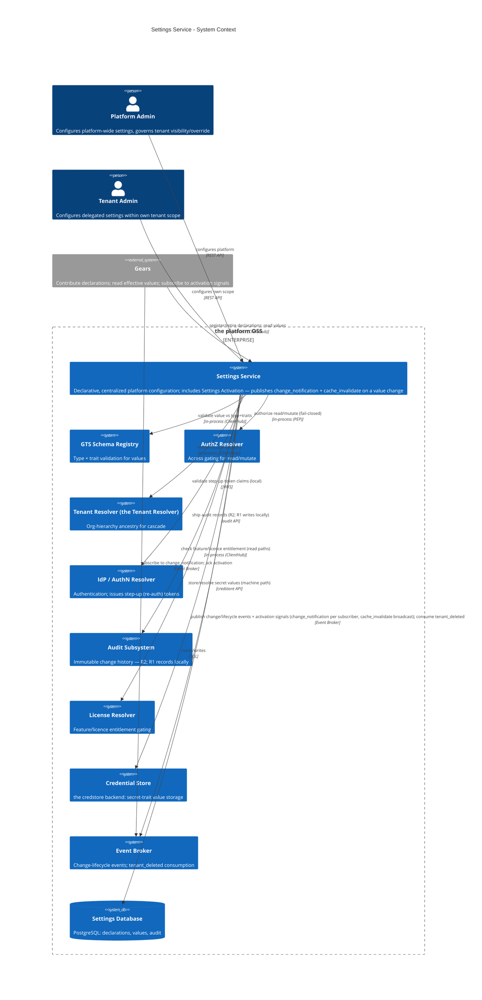
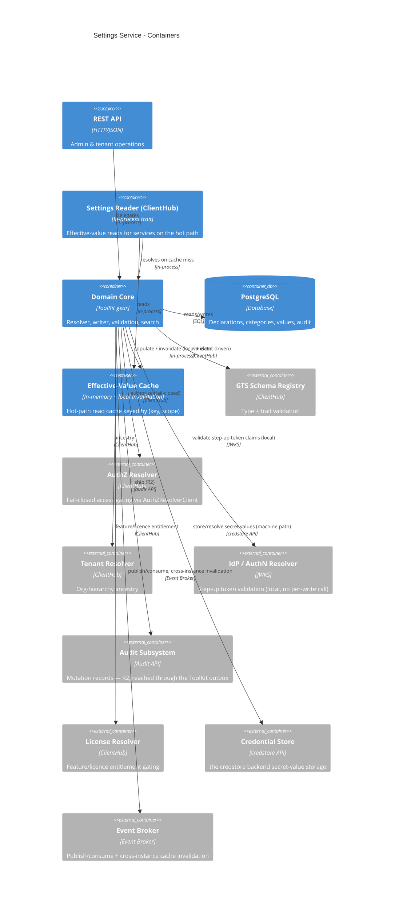
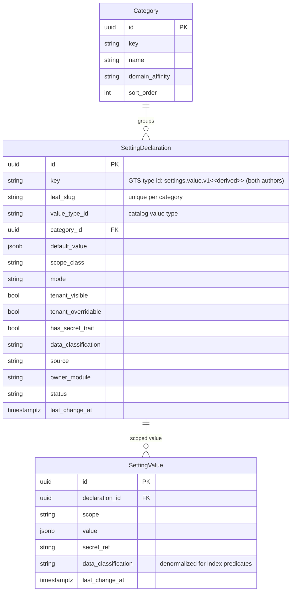
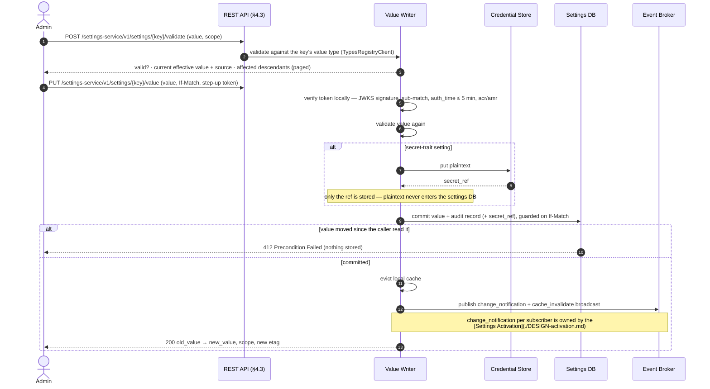
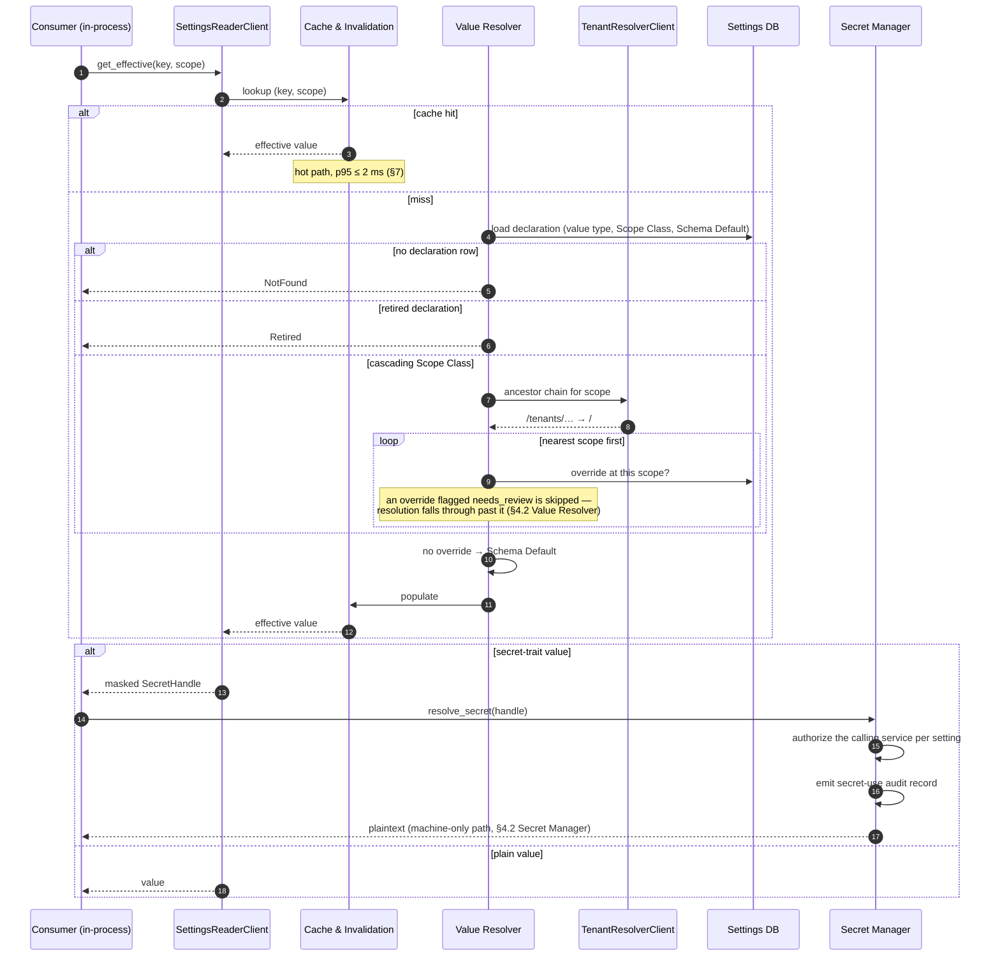

# Technical Design — Settings Service

<!-- toc -->

- [1. Architecture Overview](#1-architecture-overview)
  - [1.1 Architectural Vision](#11-architectural-vision)
  - [1.2 Architecture Drivers](#12-architecture-drivers)
  - [1.3 Architecture Layers](#13-architecture-layers)
- [2. Goals / Non-Goals](#2-goals--non-goals)
  - [2.1 Goals](#21-goals)
  - [2.2 Non-Goals](#22-non-goals)
  - [2.3 Release Phasing](#23-release-phasing)
- [3. Principles & Constraints](#3-principles--constraints)
  - [3.1 Design Principles](#31-design-principles)
  - [3.2 Constraints](#32-constraints)
- [4. Technical Architecture](#4-technical-architecture)
  - [4.1 Domain Model](#41-domain-model)
  - [4.2 Component Model](#42-component-model)
  - [4.3 API Contracts](#43-api-contracts)
  - [4.4 External Interfaces & Protocols](#44-external-interfaces--protocols)
  - [4.5 Service-to-Service Pattern](#45-service-to-service-pattern)
  - [4.6 Interactions & Sequences](#46-interactions--sequences)
  - [4.7 Database schemas & tables](#47-database-schemas--tables)
  - [4.8 Security & Authorization](#48-security--authorization)
  - [4.9 Deployment Topology](#49-deployment-topology)
  - [4.10 Technology Stack](#410-technology-stack)
- [5. Risks / Trade-offs](#5-risks--trade-offs)
  - [5.1 Architectural Trade-offs](#51-architectural-trade-offs)
  - [5.2 Security and Performance Risks](#52-security-and-performance-risks)
- [6. Open Questions](#6-open-questions)
  - [6.1 From PRD (Cross-Reference)](#61-from-prd-cross-reference)
  - [6.2 Design-Specific Questions](#62-design-specific-questions)
- [7. Additional context](#7-additional-context)
  - [Feature Metrics](#feature-metrics)
  - [NFR Mapping & Scale Model](#nfr-mapping--scale-model)
  - [Testing Architecture](#testing-architecture)
- [8. Traceability](#8-traceability)

<!-- /toc -->

<!--
=============================================================================
TECHNICAL DESIGN DOCUMENT
=============================================================================
PURPOSE: Define HOW the system is built — architecture, components, APIs,
data models, and technical decisions that realize the requirements.

DESIGN IS PRIMARY: DESIGN defines the "what" (architecture and behavior).
ADRs record the "why" (rationale and trade-offs) for selected design
decisions; ADRs are not a parallel spec, it's a traceability artifact.

SCOPE:
  ✓ Architecture overview and vision
  ✓ Design principles and constraints
  ✓ Component model and interactions
  ✓ API contracts and interfaces
  ✓ Data models and database schemas
  ✓ Technology stack choices

NOT IN THIS DOCUMENT (see other templates):
  ✗ Requirements → PRD.md
  ✗ Step-by-step implementation flows → features/

STANDARDS ALIGNMENT:
  - IEEE 1016-2009 (Software Design Description)
  - IEEE 42010 (Architecture Description — viewpoints, views, concerns)
  - ISO/IEC 15288 / 12207 (Architecture & Design Definition processes)

ARCHITECTURE VIEWS (per IEEE 42010):
  - Context view: system boundaries and external actors
  - Functional view: components and their responsibilities
  - Information view: data models and flows
  - Deployment view: infrastructure topology

DESIGN LANGUAGE:
  - Be specific and clear; no fluff, bloat, or emoji
  - Reference PRD requirements using `cpt-cf-settings-service-fr-{slug}`,
    `cpt-cf-settings-service-nfr-{slug}` IDs
  - Reference ADR documents using `cpt-cf-settings-service-adr-{slug}` IDs
=============================================================================
-->

- [ ] `p1` - **ID**: `cpt-cf-settings-service-design-settings-service`

## 1. Architecture Overview

### 1.1 Architectural Vision

Design the **Settings Service** — the platform's single, centralized, declarative configuration capability. It manages platform-wide system settings: it organizes settings into categories, exposes typed keys with independent defaults, resolves effective values through the tenant hierarchy, validates and commits changes and makes them effective for running services, and governs visibility and audit per setting. It realizes the WHAT/WHY of [PRD-settings-service-202606160811](./PRD.md).

This document defines the complete Settings Service — its scope is the whole capability described below.

The service is delivered as a **Constructor Fabric Gear** — the platform's unit of composable, infrastructure-agnostic capability (reference example: the [`credstore` gear](../../credstore)). Like every gear it owns its API surface and database and is consumed through a **Rust-native SDK that facades local (in-process) vs. remote calls**; concretely it is bootstrapped by the Constructor Fabric **ToolKit** runtime (`cf-gears-toolkit`) and registers its typed clients in `ClientHub`, following the same SDK/implementation split, REST surface, and PostgreSQL persistence model used by the `authz-resolver` gear. It is shipped both as that **SDK** (for in-process access) and as the **gear implementation** (§4.9). It consumes the GTS Schema Registry for value typing, the Multi-Tenancy Model for the scope hierarchy, the RBAC Engine for access gating, the IdP for authentication and write step-up, the Credential Store for secret values, the platform Event Broker for change-lifecycle events and cross-instance cache invalidation, and the platform audit subsystem for change history.

### 1.2 Architecture Drivers

#### Functional Drivers

| Requirement | Design Response |
|-------------|-----------------|
| `cpt-cf-settings-service-fr-settings-category-model` | Category Management + Declaration Management components; flat categories with no-orphan delete enforced by the `ON DELETE RESTRICT` FK; declaration mutation classes (immediate / immutable / step-up gated) |
| `cpt-cf-settings-service-fr-module-contributed-declarations` | Contribution Reconciler: idempotent `register_declarations` from gear init, gear-namespaced keys, `source=module_contributed` immutable to admins |
| `cpt-cf-settings-service-fr-contributed-lifecycle` | Reconciler match by version-stripped path; new/compatible/upgrade cases; retire → `status=retired` with values retained; re-declare-to-revive |
| `cpt-cf-settings-service-fr-setting-scope-class` | `ScopeClass` enum on the declaration drives resolution; per-class algorithm in the Value Resolver; `global ⇒ tenant_overridable=false` enforced by a DB check |
| `cpt-cf-settings-service-fr-typed-value-validation` | Type Validator against the setting's `value_type_id` + traits; `secret` routed to the Secret Manager; `public`/`pii`/`secret` classification drives masking |
| `cpt-cf-settings-service-fr-set-value` | Value Writer validates then commits per change; a `set` may carry several settings with per-item results and no atomicity across them |
| `cpt-cf-settings-service-fr-validate-before-set` | Value Writer `validate` is read-only and repeatable; a write to a declaration that requires elevated confirmation additionally needs a fresh step-up assertion verified by a `StepUpVerifier` |
| `cpt-cf-settings-service-fr-live-read-activation` | Commit-per-change, then local eviction, then signal publish; per-change result in the response; consumers self-react on `change_notification` |
| `cpt-cf-settings-service-fr-tenant-overrides` | `set` / `clone` at any tenant inside the caller's subtree; the override row is created at the target tenant |
| `cpt-cf-settings-service-fr-cascading-inheritance` | Ancestor-id walk via the Tenant Resolver, nearest-match wins; `inheritance_trail` on the read; bounded `cascading_impact` report |
| `cpt-cf-settings-service-fr-tenant-scope-enforcement` | Enforced by the platform data path, not by hand-written predicates: `PolicyEnforcer` compiles the decision into an `AccessScope` and `SecureConn` applies it as automatic `WHERE` clauses (§4.8 *The Data Path*). Reads are further gated by `tenant_visible`, writes by `tenant_overridable` |
| `cpt-cf-settings-service-fr-authn-role-gating` | Bearer token via the AuthN Resolver, then a fail-closed `PolicyEnforcer` decision; step-up on a write to a declaration that requires it and on behavior-affecting declaration actions |
| `cpt-cf-settings-service-fr-per-setting-access` | §4.8 *Authorization Model*: a value operation names the setting's own key as the resource, so a grant covers one setting, a wildcarded subtree, or — on the base type — all of them; lists resolve it in two steps (*Listing under a narrowed grant*) |
| `cpt-cf-settings-service-fr-file-valued-settings` | §3 *Files*: a `file-reference`-trait value is an inline reference (`value`, §4.1) to a file in the `file-storage` gear, never the bytes. **Validated for shape only** — the two-field object `{ file_id, version_id }`, both required — with existence, content type, size and caller entitlement deliberately unchecked, so this service takes no dependency on `file-storage`. The reference is always pinned to a version, so a `bind` under it changes nothing until the setting is repointed; content is never indexed (§4.2 *Search*); `secret` + `file-reference` is rejected (`422`) while `pii` is carried. |
| `cpt-cf-settings-service-fr-audit-mutations` | Audit Emitter writes synchronously inside the mutation transaction, fail-closed; canonical `resource` id makes history an exact-match query |
| `cpt-cf-settings-service-fr-feature-license-gating` | `licence_feature` checked through the License Resolver on administrative read paths only; the in-process reader is not gated |
| `cpt-cf-settings-service-fr-standard-advanced-mode` | `mode` on the declaration; mode-filtered lists expose `hidden_advanced_count`; per-user preference persisted |
| `cpt-cf-settings-service-fr-search-discoverability` | Trigram GIN indexes over key/description/category/value with classification split into the index predicates |
| `cpt-cf-settings-service-fr-defaults-revert` | `default_value` column is authoritative and immutable; `revert` returns the resolved fallback, and `validate` reports it beforehand |
| `cpt-cf-settings-service-fr-domain-affinity-filtering` | Optional `domain_affinity` on category and declaration; hub filters by the admin's current domain |
| `cpt-cf-settings-service-fr-dependency-group-declaration` | **Deferred, not dropped** — the PRD carries this at `p3`, in scope. Not designed for v1 because no setting pair with a cross-setting invariant has been identified; the design agenda is the open question in §6.2 |
| `cpt-cf-settings-service-fr-bulk-effective-read` | `resolve_bulk` (key set) sharing one ancestry walk per scope, with independent per-key outcomes; surfaced on the SDK as `get_effective_bulk` and on REST as `GET /settings-service/v1/settings` filtered by key set — same visibility, scope and masking rules as the single read (§4.2 *Value Resolver*, §4.3, §4.5) |
| `cpt-cf-settings-service-fr-subject-scoped-values` | Value identity carries `(subject_type, subject_id)` beside `tenant_id`, giving four scope shapes — platform, tenant, and either of those with a subject — each with its own partial unique index, plus a `CHECK` requiring a subject to be named by both of its columns or by neither; subject-naming and subject-less requests resolve on independent tracks that meet only at the Schema Default, each walking the scope chain by Scope Class, never walking subjects as ancestors; scope shape and signal attributes are subject-aware from v1 while v1 writes only `NULL`s, so no migration is needed to switch it on (§4.2 *Value Resolver*, §4.7, [Settings Activation](./DESIGN-activation.md) §4.4) |
| `cpt-cf-settings-service-fr-barrier-default-seam` | `get_ancestors` marks a tenant **standalone**; inheritance into it is unchanged (the ancestor walk is not truncated), while the tenant is removed from every ancestor's subtree for reads and writes — excluded from single and bulk reads, from the search corpus, and from `cascading_impact`'s `changed[]` **and** `total_changed`. Isolation is per tenant, so no per-declaration flag exists (§4.2 *Value Resolver*, §4.2 *Value Writer*, §4.2 *Search*) |

#### NFR Allocation

| NFR ID | NFR Summary | Allocated To | Design Response | Verification Approach |
|--------|-------------|--------------|-----------------|----------------------|
| `cpt-cf-settings-service-nfr-performance-read-cache` | Cache-served effective reads stay on the hot path | Effective-Value Cache + Settings Reader | In-process cache keyed by `(key, scope)`; invalidate on change; `cache_ttl_seconds` backstop; resolve cost is O(depth), not O(tenant count) | Integration benchmark on a warm cache and on a seeded hierarchy |
| `cpt-cf-settings-service-nfr-reliability-validated-set` | An invalid or stale write stores nothing | Value Writer | Validation runs before persistence; the commit is guarded on `If-Match` and refuses a moved value `412` | API + E2E rejection and stale-write paths |
| `cpt-cf-settings-service-nfr-scope-isolation` | No cross-scope leakage on any read path | Value Resolver + Search + REST layer | Server-side subtree enforcement; `404` for non-visible settings; classification split in index predicates | Integration + E2E isolation tests per read path |
| `cpt-cf-settings-service-nfr-security-baseline` | AuthN, secret confidentiality, step-up, audit | Secret Manager + Audit Emitter + AuthZ | Secrets held by reference and masked on every administrative path; plaintext only via the audited machine path; fail-closed audit | API/E2E secret and audit tests |
| `cpt-cf-settings-service-nfr-efficiency-live-read` | No platform-initiated reload or restart | Value Writer | The writer commits and publishes signals only; consumers self-react | Assert zero reload/restart calls in write tests |
| `cpt-cf-settings-service-nfr-availability` | Read path stays available | Cache + Settings Reader | Warm reads served from cache; distinguishable `Unavailable` error so consumers own their degradation posture | Operational SLO from liveness aggregation |
| `cpt-cf-settings-service-nfr-scale-growth` | Tenant, setting, and audit volume | Data model + Audit Subsystem | Bounds in §7 *NFR Mapping & Scale Model*; audit volume and retention are requirements on the platform Audit Subsystem | Load test against the declared bounds |
| `cpt-cf-settings-service-nfr-ops-set-monitoring` | Aggregate change-failure visibility | Metrics | `settings_value_write_failure_ratio` on shared dashboards plus an alert-routing rule | Dashboard and alert-rule review |
| `cpt-cf-settings-service-nfr-versatility-gts-scope-class` | New types and gear declarations need no core change | Type Validator + Reconciler | Values validated against a curated catalog value type; declarations arrive at runtime | Add a value type and a gear declaration without touching the gear |

### 1.3 Architecture Layers

```
┌─────────────────────────────────────────────────────────────┐
│         Consumers (gears, admin UI, tenant portal)          │
├─────────────────────────────────────────────────────────────┤
│  settings-service-sdk │ Reader + Contribution traits, DTOs  │
├─────────────────────────────────────────────────────────────┤
│  settings-service     │ REST, authz, validate, set, search  │
│  ┌──────────────────────────────────────────────────────┐   │
│  │ Domain: resolver · writer · validator ·              │   │
│  │         scope-class engine · secret manager          │   │
│  ├──────────────────────────────────────────────────────┤   │
│  │ Infrastructure: effective-value cache · audit emitter│   │
│  └──────────────────────────────────────────────────────┘   │
├─────────────────────────────────────────────────────────────┤
│  External │ types-registry · tenant-resolver · authz/authn  │
│           │ credstore · event-broker · audit · license      │
├─────────────────────────────────────────────────────────────┤
│  Storage  │ PostgreSQL (declarations, values, audit)        │
└─────────────────────────────────────────────────────────────┘
```

| Layer | Responsibility | Technology |
|-------|---------------|------------|
| SDK | Public trait definitions, transport-agnostic models, errors, shared GTS type ids | Rust crate (`settings-service-sdk`) |
| Gear | REST surface, authorization, declaration lifecycle, value writes, resolution, search | Rust crate (`settings-service`), ToolKit gear, Axum |
| Domain | Effective-value resolution, Scope Class behaviour, the value write path, type validation, secret handling | In-process Rust modules |
| Infrastructure | Hot-path effective-value cache with signal-driven invalidation; fail-closed audit emission | In-memory cache, Event Broker client |
| External | Type and trait resolution, tenant ancestry, authentication and authorization decisions, secret storage, event transport, entitlement | `types-registry`, `tenant-resolver`, `authn-resolver`, `authz-resolver`, `credstore`, `event-broker`, `license-resolver`. Audit is **not** external in R1 — the store is gear-local (§4.2 *Audit Emitter*) |
| Storage | Declarations, categories, values, audit records | PostgreSQL via `toolkit-db`, reached through `SecureConn` (§4.8 *The Data Path*) |

#### Context View



#### Container View



## 2. Goals / Non-Goals

### 2.1 Goals

- Category CRUD with no-orphan deletion. Categories are flat (single-level, no nesting) per PRD.
- Setting **Declaration** lifecycle — admin-authored and **module-contributed** (register/retire). The setting's **key** is a **GTS type identifier** for **both** authors — `gts.cf.toolkit.settings.value.v1~<vendor>.<package>.<category>.<name>.v1~`, a type derived from the gear's own `value` entity type and registered when the declaration is created (§4.7). The shape its value must take is separate: a curated **value type** (`gts.cf.toolkit.settings.type_*~`) named by `value_type_id`. The declaration is kept separate from the value.
- First-class **Scope Class** (`global` / `cascading` / `local`) deriving cascade/override behaviour deterministically.
- **Typed values** validated against GTS schema + traits (scalar and structured), with rendering metadata exposure.
- **Secret values** — `secret`-trait settings backed by the Credential Store: plaintext never enters the settings DB, cache, search index, or audit trail; masked on every **administrative** read/search/list, with **no human reveal path**. Plaintext resolves only through the **machine-only runtime path** — the `SettingsReaderClient` SDK trait (§4.5), which `ClientHub` may bind locally or to a remote client (§4.9) — and only for a consuming service authorized to that specific setting; every resolution is audited as a secret-use event (§4.2 *Secret Manager*).
- **Effective-value resolution** with inheritance walk and source trace; hot-path **cache** with invalidation on change — local in-process. Cross-instance cache coherence is driven by the [Settings Activation](./DESIGN-activation.md) (separate design).
- **Validate, then set**: a read-only check before writing, a step-up-verified write that validates inline and refuses a stale value, and per-change result reporting. On a write the service **commits the value** and publishes the signals — a filtered **`change_notification`** per subscriber (consumer activation) and a **`cache_invalidate`** broadcast (replica cache); consumers read the new value **on demand** (pull) and activate it themselves. Proactive notification is owned by the [Settings Activation](./DESIGN-activation.md) (separate design).
- **Multi-tenant overrides**: set/clone/remove tenant overrides; server-side scope enforcement; visibility-gated reads; non-blocking cascading-impact warning.
- **Standard / Advanced mode** — a per-user complexity split with mode-filtered browsing and search (§4.1, §4.3).
- **Optimistic-concurrency conflict handling** — `If-Match`/ETag on every mutating call, so a concurrent edit fails loudly (`412`) instead of overwriting.
- **Events** — value-change, declaration, and secret-use events published through the platform Event Broker; the **`change_notification`** consumer signal and the **`cache_invalidate`** cross-instance cache broadcast are owned by the Settings Activation (separate design); `tenant_deleted` consumed for cleanup (§4.4).
- **Search** (cross-field), **Defaults & Revert**, **Domain Affinity filtering**.
- **Audit** of all mutations; **feature/licence gating**.
- **Gear SDK for in-process access** (`settings-service-sdk`: Settings Reader + Contribution clients) for services on the hot path.

### 2.2 Non-Goals

- **GTS type authoring / the schema registry itself** — owned by the `types-registry` gear. This service *consumes* types.
- **Managed-resource desired-state reconciliation** — owned by RMS. This service governs platform configuration, not managed resources.
- **Org-hierarchy CRUD and closure-table maintenance** — owned by the Tenant Resolver gear.
- **Role/permission CRUD and authorization decisions** — owned by RBAC Engine and the AuthZ Resolver Plugin.
- **Hot-reload / restart / template-regeneration execution** — this service commits values and publishes the signals (consumer `change_notification` + replica `cache_invalidate`); it never reloads or restarts a consumer in-process. Heavier activation (reload/restart/regenerate) for components that cannot self-react is owned by the [Settings Activation](./DESIGN-activation.md) and **deferred** (out of scope for v1).
- **Cross-region settings replication; ancestor-level batch writes across descendants; settings export/import** — deferred (PRD Out of Scope).
- **Bootstrap / boot-critical infrastructure config** (DB and broker endpoints, service identity, platform TLS, ports, domain) — deployment-owned, delivered via ToolKit config at gear init (§4.9, §4.8); never a managed setting.
- **Frontend visual design / mockups** — owned by a future frontend DESIGN document.

### 2.3 Release Phasing

This document describes the whole gear. It does not all ship at once, and the sections that carry the first release are not otherwise distinguishable from the ones that look ahead. Releases below are grouped by **what they depend on**, not by requirement priority: priority is the PRD's and stays there, reachable through each requirement id named here. The two axes genuinely differ. `cpt-cf-settings-service-fr-subject-scoped-values` is one requirement spanning two releases, because the PRD asks for its identity model from v1 and lets the implementation phase. And three requirements the PRD ranks below the first tier — `cpt-cf-settings-service-fr-defaults-revert`, `cpt-cf-settings-service-fr-per-setting-access` and `cpt-cf-settings-service-fr-barrier-default-seam` — ship in R1 regardless, because they need nothing that does not already exist and leaving them out would mean shipping a service whose absent behaviour someone could come to rely on.

#### R1 — configuration that resolves and changes safely, in-process

**The defining property: R1 depends on no gear that does not exist.**

Categories and declarations with their lifecycle (`cpt-cf-settings-service-fr-settings-category-model`, `cpt-cf-settings-service-fr-module-contributed-declarations`, `cpt-cf-settings-service-fr-contributed-lifecycle`); GTS typing, validation and secret protection (`cpt-cf-settings-service-fr-typed-value-validation`); Scope Class with cascade, override and source trace (`cpt-cf-settings-service-fr-setting-scope-class`, `cpt-cf-settings-service-fr-tenant-overrides`, `cpt-cf-settings-service-fr-cascading-inheritance`); tenant permission and subtree isolation including the standalone-tenant seam (`cpt-cf-settings-service-fr-tenant-scope-enforcement`, `cpt-cf-settings-service-fr-barrier-default-seam`); authentication and access-level gating, per setting (`cpt-cf-settings-service-fr-authn-role-gating`, `cpt-cf-settings-service-fr-per-setting-access`); a validated, step-up-verified write, effective on next read (`cpt-cf-settings-service-fr-set-value`, `cpt-cf-settings-service-fr-validate-before-set`, `cpt-cf-settings-service-fr-live-read-activation`); revert to ancestor or Schema Default (`cpt-cf-settings-service-fr-defaults-revert`); audited mutations and secret reveals (`cpt-cf-settings-service-fr-audit-mutations`); single and bulk effective reads (`cpt-cf-settings-service-fr-bulk-effective-read`).

Subject-scoped values (`cpt-cf-settings-service-fr-subject-scoped-values`) enter here as **identity model only** — the columns, the partial unique indexes and the subject-aware API shape (§4.1, §4.7) — with resolution over subjects deferred to R2, which is the split the PRD asks for.

Three things R1 supplies itself rather than waiting on the platform:

| Need | R1 answer |
|------|-----------|
| Audit, which every mutation fails closed on (§4.2 *Audit Emitter*) | A **gear-local sink** writing the record in the mutation's own transaction, and the store of record for the online window. R2 enqueues the same record into ToolKit's transactional outbox, whose handler posts it onward to the platform subsystem — an addition behind the same port, not a replacement |
| Step-up verification, without which every write refuses (§4.2 *Value Writer*) | The **default OIDC/JWKS binding**, built here: the bearer token is already carried in `SecurityContext` and the JWKS machinery already exists in the platform's auth library |
| A verified identity for the caller of the reader and contribution traits (§5) | **Not needed here, and enforced rather than assumed.** R1 is **Embedded-only**: the traits are bound in-process, where the host process *is* the boundary. R1 publishes no REST contract for them and **fails at startup** if configuration asks for a remote binding, so "in-process only" is a check rather than a deployment promise (§4.8 *Trusted-Caller Boundary*) |

Not in R1, and what that costs: no consumer notification, so a consumer learns of a change by re-reading (which is what `cpt-cf-settings-service-fr-live-read-activation` requires anyway); no cross-replica invalidation — R1 is a single instance, and a second host serving the same database would be stale for at most `cache_ttl_seconds` until the R2 broadcast lands; no cleanup on tenant deletion, so a deleted tenant's rows persist until R2 consumes the event.

#### R2 — out of process, and the rest of the administrative surface

Waits on five things this design does not own: **verified machine caller identity** (which unlocks the non-embedded profiles), the **platform-wide elevated session** ("sudo") that step-up moves onto, the **platform Audit Subsystem**, a **tenant-deleted signal** from Account Management, and **per-feature licence entitlement**, which the platform currently implements at base-licence level only.

Contents: the out-of-process deployment profiles; subject-scope resolution on top of R1's identity model; file-valued settings (`cpt-cf-settings-service-fr-file-valued-settings`); cross-field search (`cpt-cf-settings-service-fr-search-discoverability`); mode-filtered reads (`cpt-cf-settings-service-fr-standard-advanced-mode`); the anonymous read surface and its declaration flag (`cpt-cf-settings-service-fr-anonymous-exposable`); the elevated-confirmation flag and writes by authorized service principals (`cpt-cf-settings-service-fr-service-writes`); feature and licence gating (`cpt-cf-settings-service-fr-feature-license-gating`); tenant-deleted cleanup; and **step-up on the platform-wide elevated session**, bound behind the existing `StepUpVerifier` port (§4.2 *Value Writer*). R1's own binding carries step-up until then, so this is a substitution rather than a gap being filled. Both bindings satisfy `cpt-cf-settings-service-fr-validate-before-set` the same way — a re-verification bounded by a freshness window — and what the platform session adds is ownership of that window: it can be revoked, extended or observed, which a claim in an already-issued token cannot be.

R2 is the first release in which several replicas are the normal case, and **convergence between them ships with it**. `cpt-cf-settings-service-fr-replica-coherence` is served by the `cache_invalidate` broadcast, and that broadcast needs none of the activation machinery it was previously bundled with — no await-records, no supersession, no back-responses, just one event per write on a broker this release already publishes to. `cache_ttl_seconds` stays the backstop for a dropped signal, as the requirement demands.

#### R3 — consumers acknowledge

Consumer activation in full (`cpt-cf-settings-service-fr-consumer-activation`) — per-key subscription, filtered notification, back-response, supersession and the delivery queue — the subject of [Settings Activation](./DESIGN-activation.md). Replica convergence is **not** here: its `cache_invalidate` broadcast is designed in the same document but carries none of this machinery, so it lands in R2 (§2.3 R2) and this release carries only the consumer-facing half. With it, dependency groups (`cpt-cf-settings-service-fr-dependency-group-declaration`) and domain-affinity filtering (`cpt-cf-settings-service-fr-domain-affinity-filtering`).

## 3. Principles & Constraints

### 3.1 Design Principles

#### Declaration and Value Are Separate Planes

- [ ] `p1` - **ID**: `cpt-cf-settings-service-principle-declaration-value-split`

A setting's **declaration** (key, value type, Schema Default, Scope Class, metadata) is distinct from its **values** at each scope. Declarations are authored — by an administrator or contributed by a gear — and are addressed by immutable UUID on the management plane. Values are written and read by `key`. Keeping the planes separate is what allows a gear to own a setting's shape while an administrator owns its runtime value.

#### Values Are Written; Declarations Are Gated by Immutability

- [ ] `p1` - **ID**: `cpt-cf-settings-service-principle-write-scope`

The value write path covers value operations only. A declaration edit has no in-effect value to gate, so descriptive metadata applies immediately — but the fields that *would* change live resolution (Schema Default, value type, Scope Class) are immutable, and the two actions that change whether a setting resolves at all (retire, reactivate) require credential step-up. No ungated path can alter a live setting's resolution.

#### Behaviour Derives From One Declared Attribute

- [ ] `p1` - **ID**: `cpt-cf-settings-service-principle-scope-class-derivation`

Cascade and override behaviour is derived from the mandatory `ScopeClass`, never from independently-toggleable booleans. A setting must declare its class, so infrastructure settings are `global` by declaration rather than by remembering to disable a flag.

#### Single Source of Ancestry

- [ ] `p1` - **ID**: `cpt-cf-settings-service-principle-single-ancestry-source`

Tenant ancestry is owned by the Tenant Resolver. This gear stores a flat `tenant_id`, never a path, and never reconstructs the hierarchy from a string. A tenant re-parent therefore requires no stored-scope rewrite.

#### One Type System, Consumed Not Rebuilt

- [ ] `p1` - **ID**: `cpt-cf-settings-service-principle-consume-gts`

Values are validated against a curated catalog value type resolved from `types-registry`. This gear builds no parallel type system. A setting is registered as a GTS type (§4.7), but nothing on the read path asks the registry: declarations and values live in this gear's own tables.

#### Secrets Never Take a Human Path

- [ ] `p1` - **ID**: `cpt-cf-settings-service-principle-machine-only-secrets`

A `secret`-classified value is held by reference and masked on every administrative surface. Plaintext resolves only through the machine-only reader path, authorized per setting against the calling service and audited on every resolution. There is no administrative reveal operation.

#### Inform, Do Not Block

- [ ] `p1` - **ID**: `cpt-cf-settings-service-principle-inform-not-block`

Consequences are surfaced rather than prevented: cascading impact is a non-blocking warning, a flagged override falls through to a valid value instead of failing the read, and hard blocks are reserved for the irreversible or the invalid.

#### Fail Closed on Every Gate

- [ ] `p1` - **ID**: `cpt-cf-settings-service-principle-fail-closed`

Authorization, entitlement, type validation, and audit all fail closed. A mutation that cannot be authorized, validated, or recorded does not take effect.

### 3.2 Constraints

#### PostgreSQL primary storage

- [ ] `p1` - **ID**: `cpt-cf-settings-service-constraint-postgres-primary-storage`

Declarations, categories and values are stored in PostgreSQL via `toolkit-db`, reached through `SecureConn` so that every query carries an `AccessScope` (§4.8 *The Data Path*).

**This is a recorded deviation.** The platform's persistence story is DB-agnostic SeaORM through `toolkit-db`, and the **single-node** deployment shape — edge devices, on-prem appliances, development — is a supported topology (`docs/ARCHITECTURE_MANIFEST.md`). This gear requires PostgreSQL for its production shape. What forces that is narrower than the DDL suggests, so it is worth separating:

| Feature used | On SQLite |
|---|---|
| `pg_trgm` **GIN trigram indexes** (§4.7, §4.2 *Search*) | **No equivalent.** This is the only hard requirement. SQLite's FTS5 is token-based, not substring, so cross-field value search (`cpt-cf-settings-service-fr-search-discoverability`, `p2`) cannot be served the same way |
| **Partial indexes and their predicates** — `uq_value_scope`, `idx_values_needs_review`, the split search corpus | **Not Postgres-only.** SQLite has supported `WHERE`-qualified indexes since 3.8.0 with identical syntax, and `file-storage` already relies on that. The denormalization of `data_classification` onto `setting_values` (§4.7) is needed on both, for the same reason |
| `JSONB` | `TEXT` plus the JSON1 functions; weaker typing, and `jsonb_typeof` becomes `json_type` |
| `num_nonnulls(...)` (§4.7) | An equality of predicates, which §4.7's subject-columns `CHECK` already uses for exactly this reason. The two `CHECK`s should be written the same way |
| `BIGSERIAL` (`commit_seq`, activation §4.7) | An autoincrement integer column |

**MySQL is out of scope.** `toolkit-db` builds against it, but no gear in the workspace enables the feature — every one that uses `toolkit-db` declares `pg` and `sqlite`, or `sqlite` alone. This gear targets **PostgreSQL and SQLite**, and its migrations MUST no-op on a MySQL backend rather than fail, so a misconfigured workspace does not break outright. `chat-engine` sets that precedent for both halves of this record: its full-text index is emitted as backend-gated raw SQL, present on Postgres, deliberately skipped on SQLite where the query falls back to an unindexed `LIKE`, and a no-op on MySQL.

**In the single-node/edge shape**, then: everything the gear is *for* is portable — effective-value resolution, the ancestor-id cascade, scope isolation, the write path, activation and audit. **Value search is what degrades**, from an indexed substring match to a scan or to nothing. That is a `p2` capability, which is why running this gear on SQLite is a viable reduced configuration rather than a broken one.

**What is not yet decided is the migration shape.** `file-storage` and `chat-engine` both write per-backend DDL, branching on `get_database_backend()` and documenting where the backends diverge; this design's §4.7 states Postgres DDL only, and §7 names real PostgreSQL for every tier above unit, while the platform's CI runs a SQLite integration tier on every PR (`make test-sqlite`, `docs/TESTING.md` §4). Either this gear writes the per-backend DDL and keeps that tier, or it records that its integration tests are Postgres-only. This is a **DESIGN follow-up**; it changes no contract either way.

#### Constructor Fabric Gear

- [ ] `p1` - **ID**: `cpt-cf-settings-service-constraint-supplied-as-gear`

Settings Service is **supplied as a Constructor Fabric Gear** — an SDK crate plus a gear implementation (§4.9), hosted by the Constructor Fabric **ToolKit** runtime and registering its typed clients in `ClientHub`. `ClientHub` resolves each dependency to an in-process implementation or a generated REST client per the active deployment profile, so consumers call the same SDK trait either way: co-located, effective-value reads run **in-process** via `SettingsReaderClient` (no network call on the hot path); when the gear runs out-of-process the same trait is served over REST.

#### Setting key by author

- [ ] `p1` - **ID**: `cpt-cf-settings-service-constraint-key-is-gts-instance-id`

The setting `key` is a **GTS type identifier** `gts.cf.toolkit.settings.value.v1~<vendor>.<package>.<category>.<name>.v1~` for **both** authors: the base is the gear's own `value` entity type, the derived half is the setting. That half is **four segments** before the version — `<vendor>.<package>.<namespace>.<type>` per the GTS grammar (§4.7), with no `gts.` prefix of its own — and the category is always the third: a **module** provides its own half and the category is **extracted from the `<namespace>` slot**; an **admin** setting's is `<vendor>.settings.<category>.<name>.v1`, where `<vendor>`/`<name>` are the admin's inputs. The trailing `~` makes the key a type rather than an instance, which is what lets a policy name one setting (§4.8). The value type the value is checked against is a separate field, `value_type_id`.

#### GTS validation

- [ ] `p1` - **ID**: `cpt-cf-settings-service-constraint-gts-value-validation`

Every value is checked against the setting's **value type** (`value_type_id`) + traits via `TypesRegistryClient`. This service builds no parallel type system: value shapes come from the curated catalog, never from the setting's own type. Values live in our own tables — never in the Registry.

#### Scope hierarchy

- [ ] `p1` - **ID**: `cpt-cf-settings-service-constraint-scope-hierarchy-paths`

Scopes are tenant-hierarchy paths: `/` (platform root) or `/tenants/{id}`. Ancestry resolved via `TenantResolverClient` (in-process).

#### Secrets

- [ ] `p1` - **ID**: `cpt-cf-settings-service-constraint-secrets-by-reference`

`secret`-trait values are backed by the Credential Store (the credstore backend). Plaintext never enters the settings DB, cache, search index, or audit trail — the row holds only an opaque `secret_ref`; values are masked on every **administrative** read/search/list and there is **no human reveal path**. Plaintext is resolved only through the **machine-only** Settings Reader path (§4.5), per-setting authorized and audited as a secret-use event (§4.2 *Secret Manager*).

#### Files

- [ ] `p2` - **ID**: `cpt-cf-settings-service-constraint-files-by-reference`

A `file-reference`-trait value names a file held by the `file-storage` gear; the bytes never enter the settings DB, cache, search index, or audit trail. The value is a two-field object — `{ file_id, version_id }` — and both fields are always present (*always pinned*, below). Unlike a secret the reference needs no side channel, a file id not being sensitive in itself, so it is an ordinary **inline** value in `value` (§4.1): no column, index, or size rule changes. The consumer fetches content straight from `file-storage`, which issues a signed URL against its own data plane, so no settings path ever carries bytes and the 64 KiB value cap (§4.2 *Type Validator*) stands untouched.

**What this does *not* mirror about a secret is the byte path.** A secret's plaintext flows *through* this service, and the SDK deliberately withholds a credstore-resolvable handle, because credstore knows nothing of settings or consumers and only this service can enforce per-setting authorization and the secret-use audit record (§4.2 *Secret Manager*). `file-storage` enforces its own access on both its control and data planes, so routing file content through here would buy no guarantee and cost the one property this section exists to keep. Stored by reference: alike. Who carries the content: opposite.

**The reference is always pinned to a version.** `file-storage` guarantees content immutability per version — a backend object lives at `/{file_id}/{version_id}` and is immutable, and a replacement is always a new version plus a pointer swap — so `version_id` *is* the identity of the bytes. A reference naming only `file_id` would instead resolve through that gear's `content_id` pointer, which an ordinary `bind` call swaps under optimistic CAS: content would change for every consumer with **no** value change, no write, no audit record and no activation signal. This design therefore has **no floating variant** — one shape, both fields, always. Showing consumers different content means repointing the setting at another version, which is an ordinary write (§4.2 *Value Writer*). A stored content checksum would add nothing: it would restate a fact `file-storage` already guarantees, this service never reads bytes so could never compare it, and a consumer that wants to verify its download reads the per-version hash from `file-storage` directly.

> **This rests on a `file-storage` invariant.** Version immutability is that gear's published contract, not something this service can verify — it never reads content. Were the invariant weakened, `version_id` would stop being a content identity and this section would need revisiting.

**The reference is stored, not validated — and this service takes no dependency on `file-storage` at all.** Writing a reference is validated for **shape** only: the declared type requires both fields, and JSON Schema enforces that. Whether the file exists, whether its content type or size is what the declaration expects, and whether the caller may use it are **not checked here**. The service never calls `file-storage`, holds no client for it, and does not appear in its dependency list; the responsibility for a reference being usable sits entirely with the caller that writes it.

This is consistent with how every other referent is treated. A setting typed `format: uri` may point at a host that no longer answers, and this service does not probe it; a `file-reference` is the same class of value, and per-reference validation would be the anomaly rather than the rule.

What follows from that, stated so nobody has to discover it:

- a mistyped or wrong-tenant reference is accepted silently, and the failure appears at each consumer when it fetches — never on a settings write and never as a settings-side signal;
- a reference whose file or version was deleted keeps resolving as a perfectly valid **value**; it is not flagged `needs_review`, does not block a write, and no event is consumed to detect it. A dangling reference is discovered at fetch, by the consumer, from `file-storage`;
- a caller that may write the setting may therefore attach a file it cannot itself read. Whether the consumer that fetches it can is between that consumer and `file-storage`.

**The reference does not own the file.** Removing the value, retiring the declaration, or deleting the tenant removes the *reference* — the file itself is never touched. Two reasons: this service did not create it (it existed before the setting, uploaded by its own owner), and it cannot see who else points at it, since another setting, another scope, or something outside settings entirely may hold the same reference; deleting would destroy data this service neither owns nor has a complete view of. This is the deliberate opposite of a secret, whose Credential-Store entry this service *does* create and which `delete_secret` therefore removes when the override is removed or applied away (§4.2 *Secret Manager*). Cleanup belongs to `file-storage`: owner deletion is already a requirement it carries, and long-lived orphans are its retention sweep's business. One useful consequence — a file-valued setting is **cloneable** where a secret one is not (`422 SecretNotCloneable`, §4.2 *Value Writer*): the hazard there is the source's credstore entry being deleted underneath the clone, and nothing here is ever deleted underneath anything.

**What the trait buys over a plain string.** Less than it might appear, and worth being exact about. Storage is identical and validation is now shape-only, so three things remain: the resolved trait set tells a client to render a file picker instead of a text box (`cpt-cf-settings-service-fr-typed-value-validation`); the reference is excluded from the search corpus (§4.2 *Search*); and combining it with `secret` is refused at declaration. Everything else a `file-reference` does, a structured string setting of the same shape would do too.

**`secret` is refused, PII is carried.** A type carrying both `secret` and `file-reference` is rejected at declaration (`422`). The `secret` trait promises an absolute — masked on every administrative path, **no human reveal path**, plaintext only through the machine-only reader, every resolution audited — while a file has its own independent access path through `file-storage`: masking the reference would hide a pointer to content anyone that gear authorizes still reads, none of it audited here. Promising a guarantee this service cannot keep is worse than refusing the combination, so a secret that happens to be file-shaped stays a secret value in the Credential Store. **PII is different and is supported.** Its promise is relative — unmasked only for a caller authorized for unmasked PII, masked everywhere else — and that is honourable over reference *metadata*, which can itself disclose (a filename carrying someone's name), so a `pii`-classified file reference is masked on administrative reads exactly like any other PII value (§4.2 *Search*, §4.3).

> **Prerequisite.** The `file-reference` trait must exist in the Types Registry. Nothing else: validation being shape-only, there is no client to add, no capability to wait on in `file-storage`, and no cross-gear prerequisite of any kind.

#### AuthN / step-up

- [ ] `p1` - **ID**: `cpt-cf-settings-service-constraint-step-up-at-idp`

OIDC bearer via the AuthN Resolver / IdP. A value write requires **step-up = re-authentication at the IdP**, not a password entered into this service: the frontend re-runs the IdP login ceremony and the service verifies only the resulting fresh token's claims. **The Settings Service never receives or verifies raw credentials** (§4.2 *Value Writer*).

#### AuthZ

- [ ] `p1` - **ID**: `cpt-cf-settings-service-constraint-rbac-policy-enforcer`

The AuthZ Resolver gates read/mutate against `gts.cf.toolkit.settings.*` resources. The gear resolves `AuthZResolverClient` through `ClientHub` and builds the SDK's `PolicyEnforcer` over it — the enforcer is a struct from that SDK, not a separately resolvable trait — then adapts it behind a gear-local port so the domain layer never imports infra. A category may additionally be **restricted**, and then reaching its settings needs a grant on that category (§4.8 *Category access*).

#### Feature/licence entitlement

- [ ] `p1` - **ID**: `cpt-cf-settings-service-constraint-licence-entitlement-fail-closed`

Visibility gating by `licence_feature` uses the the License Resolver via `LicenseResolverClient` (in-process ClientHub): given the caller `Context` and a `licence_feature`, it returns allow/deny, **fail-closed** (deny on error). Applied on REST read/browse/search paths only — not the in-process Settings Reader hot path.

#### Audit & events

- [ ] `p1` - **ID**: `cpt-cf-settings-service-constraint-audit-and-events`

Mutations write an audit record in their own transaction, to the gear's `audit_records` store in R1 and shipped onward once the platform subsystem exists (§4.2 *Audit Emitter*); unlike RBAC v1, audit is **not** deferred here — it is a PRD show-stopper. Value-change, declaration, and secret-use events are published, and `tenant_deleted` is consumed, through the platform **Event Broker** (§4.4); local cache invalidation is in-process, while cross-instance coherence (`cache_invalidate`) and the consumer signal (`change_notification`) are owned by the Settings Activation (separate design).

#### Optimistic concurrency

- [ ] `p1` - **ID**: `cpt-cf-settings-service-constraint-optimistic-concurrency`

Every mutating call requires `If-Match`/ETag, so a concurrent edit fails loudly (`412`) instead of overwriting (§4.2 *Value Writer*, *Stale-write rejection*).

#### Activation model

- [ ] `p1` - **ID**: `cpt-cf-settings-service-constraint-effective-on-next-read`

A committed value is **effective on next read**; consumers read on demand (pull, §4.5). This service does not execute reload/restart. Proactive change notification, consumer reaction, and the orchestrated fallback for components that cannot self-react are owned by the [Settings Activation](./DESIGN-activation.md).

## 4. Technical Architecture

### 4.1 Domain Model

#### GTS Type Constants

| Constant | GTS Type Identifier |
|----------|---------------------|
| Category | `gts.cf.toolkit.settings.category.v1~` |
| Setting Declaration | `gts.cf.toolkit.settings.declaration.v1~` |
| Setting Value | `gts.cf.toolkit.settings.value.v1~` |
| Effective Value | `gts.cf.toolkit.settings.effective_value.v1~` |
| Change Set | `gts.cf.toolkit.settings.change_set.v1~` |

GTS identifiers follow `gts.<vendor>.<package>.<namespace>.<type>.v<MAJOR>[.<MINOR>]~`. **These are the control-plane entity types** — the shape of a category row, a declaration row, and so on — used as RBAC resource types and internal schemas. They are authored by the gear itself, so they carry vendor `cf` (Constructor Fabric), package `toolkit`, namespace `settings`.

**Why `toolkit`, not `core`.** In the Constructor Fabric namespace, `core` holds ambient primitives with no service in front of them — the error taxonomy, the event bus, monitoring metrics, the account model's tenant-type (`gts.cf.core.{errors,events,mon,am}.*`); nobody calls "the errors service". `toolkit` holds a discrete subsystem with its own registry, RBAC, and lifecycle (e.g. authz, `gts.cf.toolkit.authz.*`). The Settings Service is the second kind — a gear with its own declaration registry, RBAC resource types, and change lifecycle — so it is a peer of authz under `toolkit`, not of the error taxonomy under `core`.

These control-plane types are **separate** from **setting keys** and **value types**. A setting `key` is a GTS **type** id derived from `gts.cf.toolkit.settings.value.v1~` (§4.1); its **derived** half is authored by the *deploying party* (module or admin) and its vendor is that party's — not necessarily `cf` — see §4.2 *Declaration Management* / *Contribution Reconciler* and §4.7. The **value type** it validates against is a curated catalog type under `gts.cf.toolkit.settings.type_*~`, named by `value_type_id`.

**Policies may target settings by GTS type id, wildcards included.** A setting's `key` is a type id, so a policy can name one setting exactly, or a wildcarded subtree of them — `gts.cf.toolkit.settings.value.v1~acme.billing.*`, every setting a vendor contributed. Matching is the **platform authorization layer's** to perform: this gear passes the key as the resource and does not interpret patterns itself, so wildcard semantics stay owned by `authz-resolver` and cannot drift into a second, gear-local matcher (`cpt-cf-settings-service-fr-authn-role-gating`).

#### Entity: `Category`

| Field | Type | Required | Description |
|-------|------|----------|-------------|
| `id` | UUID | Yes | Unique category ID (UUIDv7). |
| `key` | string (1..128) | Yes | Globally-unique category slug (e.g. `network`). Used as the single category segment in admin setting keys (§4.2 *Declaration Management*), so it MUST NOT contain `/` (reserved path separator; validated at create/update). |
| `name` | string (1..256) | Yes | Human-readable name; globally unique (categories are flat — no nesting). |
| `description` | string (0..4096) | No | Category description. |
| `domain_affinity` | `DomainAffinity` | No | Optional administrative-domain binding (e.g. `infrastructure`, `commercial`). |
| `sort_order` | integer | Yes | Display ordering hint. |
| `icon` | string | No | Icon token for the hub. |
| `created_at` / `updated_at` | `timestamptz` | Yes | UTC timestamps. |

**Invariants:** `key` and `name` globally unique; categories are flat (no nesting); deletion rejected while the category contains any setting declaration (no-orphan, `cpt-cf-settings-service-fr-settings-category-model`).

#### Entity: `SettingDeclaration`

The *definition* of a setting — distinct from its runtime value(s). Authored by a platform administrator or contributed by a gear.

| Field | Type | Required | Description |
|-------|------|----------|-------------|
| `id` | UUID | Yes | Unique declaration ID (UUIDv7). |
| `key` | string | Yes | Globally-unique setting id passed to `resolve` and used in REST value paths — a **GTS type identifier** `gts.cf.toolkit.settings.value.v1~<vendor>.<package>.<category>.<name>.v1~` for **both** authors (§4.2 *Declaration Management*, *Contribution Reconciler*), registered in `types-registry` when the declaration is created (§4.7). The derived half is the setting: for a **module** setting, the half the gear supplies, whose namespace segment names the category (§4.2 *Contribution Reconciler*); for an **admin** setting, `<vendor>.settings.<category>.<name>.v1` (§4.2 *Declaration Management*). Consumers treat the whole `key` as an opaque identifier. |
| `category_id` | UUID | Yes | Owning category (FK). The category slug is embedded in the `key` (admin: the `<category>` segment; module: the namespace segment of the supplied id), and neither the slug nor this binding is editable, so the `key` is stable (invariants above). |
| `value_type_id` | string | Yes | GTS id of the **value type** the value is validated against — a curated type from the catalog `gts.cf.toolkit.settings.type_*~`, **registered** in GTS. Independent of `key` (§4.7). Carries the trait set (incl. `secret`). |
| `default_value` | JSON | Yes | Schema Default — the **authoritative** default: this column, not the value type, is the source of truth. Value types are **validation-only** (they carry no JSON-Schema `default` keyword), so there is no second, divergent default. **Mandatory** — every declaration carries a default, which is what makes resolution total (§4.2 *Value Resolver*); a declaration that omits it is rejected (`422 DefaultRequired`, §4.3). A setting with no *meaningful* default declares a value type that **admits `null`** and sets the default to JSON `null` — a value, not its absence. Read locally with the value rows — the GTS Registry is **not** on the resolution path. |
| `scope_class` | `ScopeClass` | Yes | `global` / `cascading` / `local` — derives cascade/override behaviour deterministically. |
| `mode` | `Mode` | Yes | `standard` or `advanced` — complexity split governing default visibility in the hub (§4.1 `Mode`; default `standard`). |
| `tenant_visible` | boolean | Yes | Whether tenants may *see* the setting (orthogonal to Scope Class). |
| `tenant_overridable` | boolean | Yes | Whether tenants may *change* the setting. Forced `false` when `scope_class = global`. |
| `requires_step_up` | boolean | Yes | Whether changing this setting's value requires elevated confirmation. **Defaults to `true`** — a declaration that says nothing is protected. Clearing it is itself step-up-gated (§4.2 *Declaration Management*), and while it is `true` no service principal may write the setting (§4.2 *Value Writer*) (`cpt-cf-settings-service-fr-service-writes`). |
| `anonymous_exposable` | boolean | Yes | Whether the effective value may be served on the unauthenticated read surface (§4.3). Default `false`; **refused** when `data_classification` is `secret` or `pii` (`cpt-cf-settings-service-fr-anonymous-exposable`). |
| `domain_affinity` | `DomainAffinity` | No | Optional domain binding (overrides category default). |
| `has_secret_trait` | boolean | Yes | Denormalized from the value type's trait set for fast masking; `true` when `value_type_id` carries the `secret` trait (§4.2 *Secret Manager*). |
| `data_classification` | `DataClassification` | Yes | Sensitivity class of the setting's **value**: `public` / `pii` / `secret`. `secret` is *derived* from the value type's `secret` trait (it always accompanies `has_secret_trait = true`); `pii` is *declared* by the author, because a PII-bearing value — an alerting contact address, an operator name — need not carry the `secret` trait yet must not reach a caller unauthorized for unmasked PII. Default `public`. Drives masking (§4.2 *Secret Manager*) and the search corpus (§4.2 *Search*). |
| `source` | `DeclarationSource` | Yes | `admin_authored` or `module_contributed`. |
| `owner_module` | string | No | Owning module namespace; required when `source = module_contributed`. |
| `licence_feature` | string | No | Feature/licence flag gating visibility; enforced server-side on the REST read paths via the License Resolver (`LicenseResolverClient`; see §4.2 *Category Management* / *Declaration Management*/§4.2 *Search* and §4.8). |
| `status` | `DeclarationStatus` | Yes | `active` or `retired`. |
| `description` | string (0..4096) | No | Human-readable description. |
| `last_change_at` | `timestamptz` | Yes | When the **declaration's definition** (metadata/type/default) last changed — **definition only, NOT a max over its values** (a value-aggregating field would leak cross-tenant activity). This is the *declaration arm* of the effective-value recency `max` computed on the admin read (§4.3); the *value arm* is `SettingValue.last_change_at`. |
| `created_at` / `updated_at` | `timestamptz` | Yes | UTC timestamps. |
| `created_by` | string | Yes | Author subject ID (or `system`/module for contributed). |

**Invariants:**
- `key` is globally unique and is a **GTS type identifier** for both authors (§4.7). Uniqueness is enforced by the Settings DB (`uq_declaration_key` on `key`; plus `UNIQUE(category_id, leaf_slug)` for the leaf-within-category rule, §4.7). The same key is what the gear registers in `types-registry`, so the DB and the Registry cannot name different settings.
- The `key`'s right (instance) half embeds the **category**: an admin id is `gts.<vendor>.settings.<category>.<name>.v1`; a gear id carries the category in its namespace segment (§4.2 *Contribution Reconciler*). The category is part of what the setting **is** — `network.timeout` and `database.timeout` are two settings, distinguished by that segment — not of how it is displayed, which is what `sort_order`, `icon` and the category's display `name` carry.
- The `key` is therefore **immutable for the life of the declaration**, and nothing an administrator can edit changes it: no operation renames a category slug (`update_category` covers `name`, `description`, `domain_affinity`, `sort_order`, `icon` — §4.2 *Category Management*) and none re-binds a setting's category (`update_declaration` is metadata only — §4.2 *Declaration Management*), while `key` itself is rejected in a `PATCH` (`422`, §4.3). A consumer that resolves a key keeps resolving it for as long as the declaration is active. Evolution mints a **new** declaration under a new key rather than rewriting this one (§5.1).
- The **version lives in the derived half's `.vN` suffix**. An **upgrade** — including a **breaking** value-shape change (a different `value_type_id`) — is a **new setting major** under the same version-stripped path, hence a **new key**; the old version and its values are retained and old values are copied to the new key with re-validation (§4.2 *Contribution Reconciler*). A same-major in-place metadata/compatible change keeps the key (§6).
- A declaration's identity (key/type, scope_class, source) is immutable for `module_contributed` declarations except through the register/retire lifecycle (§4.2 *Contribution Reconciler*); administrators MUST NOT alter a contributed declaration, only its values.
- `scope_class = global` ⇒ `tenant_overridable = false` (enforced regardless of the supplied flag); `tenant_visible` MAY still be `true` (read-only to tenants).

#### Enum: `ScopeClass`

| Value | Override behaviour | Inheritance |
|-------|--------------------|-------------|
| `global` | Value lives only at `/`. Never tenant-overridable. | Not inherited by tenants; tenant access governed solely by `tenant_visible` (read-only). |
| `cascading` | Overridable at any permitted scope. | Inherits down the org hierarchy; descendants without an own override inherit the nearest ancestor override. |
| `local` | Overridable at a scope. | Applies only at the scope where set; never inherited by descendants. |

#### Enum: `DeclarationSource` / `DeclarationStatus` / `DomainAffinity`

| Enum | Values |
|------|--------|
| `DeclarationSource` | `admin_authored`, `module_contributed` |
| `DeclarationStatus` | `active`, `retired` |
| `DomainAffinity` | open vocabulary (e.g. `infrastructure`, `commercial`); `NULL` = no affinity |
| `Mode` | `standard` (visible in Standard mode), `advanced` (hidden in Standard, visible in Advanced) |
| `DataClassification` | `public` (no special handling), `pii` (unmasked only for a caller authorized for unmasked PII; masked in every other administrative read and in audit/report output; governed by the platform retention/anonymization policy), `secret` (held by reference in the Credential Store, masked on every administrative path with no human reveal, plaintext only via the machine-only reader path — §4.2 *Secret Manager*) |

#### Entity: `SettingValue`

An **applied** override at a specific scope, distinct from the Schema Default.

| Field | Type | Required | Description |
|-------|------|----------|-------------|
| `id` | UUID | Yes | Unique value ID (UUIDv7). |
| `declaration_id` | UUID | Yes | Declaration this value belongs to (FK). |
| `tenant_id` | UUID | Yes | Scope as an id, not a path — **always a real tenant id, never `NULL`**. The **root tenant** carries platform scope: it is the single, install-time, undeletable ancestor of every tenant, so a value on it applies platform-wide by inheritance rather than by being outside the hierarchy (*Why the root tenant rather than `NULL`*, §4.7). Ancestry is resolved by the Tenant Resolver, never parsed from this field (§4.2 *Value Resolver*, §4.7). |
| `value` | JSON | No | The inline (non-secret) override value — a `file-reference` value is inline too, since a file id is not sensitive (§3 *Files*); `NULL` when the value is a secret held by reference. |
| `secret_ref` | string | No | Opaque Credential-Store reference for a `secret`-trait value (§4.2 *Secret Manager*); `NULL` for inline values. Exactly one of `value`/`secret_ref` is set. |
| `needs_review` | boolean | Yes | `true` when the value no longer validates against the setting's current GTS type (flagged by the Reconciler on an invalidating type upgrade, §4.2 *Contribution Reconciler*). Excluded from resolution until corrected; cleared on a valid re-set or revert (§4.7; PRD Schema/type-versioning decision). |
| `needs_review_detail` | string | No | Short reason for the flag, shown to the admin (§4.3); `NULL` when `needs_review = false`. |
| `last_change_at` | `timestamptz` | Yes | When this scoped value last changed. The *value arm* of the effective-value recency `max` (§4.3); on read only the **resolved** row's value contributes — never a max across sibling/descendant scopes. |
| `created_at` / `updated_at` | `timestamptz` | Yes | UTC timestamps. |
| `set_by` | string | Yes | Subject who set the value. |

**Invariants:** at most one applied value per scope shape — with a subject and without — enforced by the two partial unique indexes (§4.7), with a subject named by both of its columns or by neither; exactly one of `value`/`secret_ref` is set — and **which** one follows the declaration's `secret` trait, both enforced by `CHECK` (§4.7); the serialized `value` MUST NOT exceed the **64 KiB** size cap (enforced on write by the Type Validator, §4.2 *Type Validator*); `global` declarations may only have a value at platform scope (`tenant_id` = the root tenant); `local` and `cascading` may have per-tenant values (`tenant_id` set) subject to `tenant_overridable`.

#### Entity: `EffectiveValue` (computed, not persisted)

Returned by the resolver and the Settings Reader.

| Field | Type | Description |
|-------|------|-------------|
| `key` | string | Setting key — a GTS type id (both authors); see §1.3 `SettingDeclaration.key`. |
| `scope` | string | Requested scope: `/` (platform), a tenant, or — when the request names one — a **subject at either of those scopes**, `(scope, subject_type, subject_id)` (§4.7, `cpt-cf-settings-service-fr-subject-scoped-values`). The subject form is part of the shape from v1 so that adding subject scopes later is additive rather than a break; a request that names no subject resolves exactly as before. |
| `value` | JSON | Resolved value. |
| `source` | `EffectiveSource` | Where the value resolved from. |
| `source_scope` | string \| `null` | Scope that provided the value (`null` for Schema Default). |
| `traits` | object | Resolved trait set (for rendering / pre-validation), from the setting's `value_type_id` (§1.3). |
| `inheritance_trail` | `TrailEntry[]` | Ordered scopes inspected during resolution — **limited to the caller's own ancestor chain** (root→self), never a sibling/descendant scope (same cross-tenant leak-safety invariant as `last_change_at`). The per-entry **who/when** (`set_by` + timestamp) is surfaced **only on the admin read** (§4.3), **not** on the consumer SDK `EffectiveValue` (§4.5) — an ancestor's setter identity is not exposed to a subordinate tenant. |

#### Enum: `EffectiveSource`

| Value | Description |
|-------|-------------|
| `own_override` | An override exists at the requested scope. |
| `inherited` | Resolved from a nearest-ancestor override (cascading). |
| `schema_default` | No override in the chain; the declaration's own default (§4.1 `default_value` — a declaration field, not a property of the value type). |

#### Entity Relationships



### 4.2 Component Model

```mermaid
graph TD
 subgraph API["API Layer"]
 rest_api["REST API<br/><small>HTTP/JSON · admin/tenant ops</small>"]
 reader_api["Settings Reader<br/><small>ClientHub · effective reads</small>"]
 end

 subgraph Domain["Domain Layer"]
 cat["Category Mgmt"]
 decl["Declaration Mgmt"]
 reconciler["Contribution Reconciler<br/><small>register/retire</small>"]
 validator["Type Validator<br/><small>GTS + traits</small>"]
 resolver["Value Resolver<br/><small>effective value + source trace</small>"]
 writer["Value Writer<br/><small>validate · step-up · commit · publish change_notification + cache_invalidate</small>"]
 secrets["Secret Manager<br/><small>store · mask · resolve (machine-only)</small>"]
 search["Search"]
 scopeclass["Scope Class Engine"]
 end

 subgraph Infra["Infrastructure Layer"]
 cache["Effective-Value Cache<br/><small>local invalidation; cross-instance via cache_invalidate broadcast</small>"]
 emitter["Audit Emitter<br/><small>audit + event publish</small>"]
 end

 subgraph External["External Dependencies"]
 types[("GTS Registry<br/><small>ClientHub</small>")]
 authz[/"AuthZ Resolver<br/><small>ClientHub · AuthZResolverClient</small>"/]
 tenant[("Tenant Resolver<br/><small>ClientHub</small>")]
 idp[/"IdP / AuthN Resolver<br/><small>step-up token (JWKS)</small>"/]
 audit[/"Audit Subsystem<br/><small>R2 — via ToolKit outbox</small>"/]
 licence[/"License Resolver<br/><small>ClientHub · entitlement</small>"/]
 credstore[("Credential Store<br/><small>the credstore backend</small>")]
 broker[/"Event Broker<br/><small>publish/consume</small>"/]
 pg[("PostgreSQL")]
 end

 rest_api -->|delegates| cat
 rest_api -->|delegates| decl
 rest_api -->|delegates| writer
 rest_api -->|delegates| search
 rest_api -->|reads| resolver
 reader_api -->|hot read| cache
 reader_api -.->|miss| resolver
 reader_api -->|resolve plaintext<br/><small>authorized · audited</small>| secrets

 decl -->|validates default| validator
 decl -->|derives behaviour| scopeclass
 reconciler -->|reconciles declarations| decl
 writer -->|validates value| validator
 writer -->|derives override rules| scopeclass
 writer -->|store secret| secrets
 resolver -->|ancestry walk| tenant
 resolver -->|reads| pg
 resolver -->|mask secret| secrets
 validator -->|type+traits| types
 writer -->|invalidate (local)| cache
 writer -->|validate step-up token| idp
 writer -->|publish change_notification + cache_invalidate| broker
 secrets -->|store/resolve| credstore

 cat -->|reads/writes| pg
 decl -->|reads/writes| pg
 writer -->|reads/writes| pg
 search -->|reads| pg

 cat -->|authorize| authz
 decl -->|authorize| authz
 writer -->|authorize| authz

 cat -->|entitlement| licence
 decl -->|entitlement| licence
 search -->|entitlement| licence

 writer -->|audit| emitter
 secrets -->|secret-use audit| emitter
 emitter -->|records| audit
 emitter -->|publish events| broker
 broker -->|tenant_deleted / cache invalidate| cache
```

#### Component: Category Management

- [ ] `p1` - **ID**: `cpt-cf-settings-service-component-category-management`

**Dependencies:** PostgreSQL, `AuthZResolverClient` (with `PolicyEnforcer` built over it), `LicenseResolverClient` (License Resolver — feature/licence entitlement), Audit Emitter

**Operations:**

| Operation | Input | Output | Key Behavior |
|-----------|-------|--------|--------------|
| `create_category` | `CreateCategoryRequest`, `Context` | `Category` | Authorize `create` on `gts.cf.toolkit.settings.category.v1~` (category governance is per-resource-type CRUD — create/read/update/delete — per §4.8). Reject duplicate `key`/`name` (`409`). Insert; audit. (`cpt-cf-settings-service-fr-settings-category-model`) |
| `update_category` | `id`, `UpdateCategoryRequest`, `Context` | `Category` | Authorize `update` on `gts.cf.toolkit.settings.category.v1~`. Partial update (`name`, `description`, `domain_affinity`, `sort_order`, `icon`). Requires `If-Match` (optimistic concurrency, §4.3). |
| `delete_category` | `id`, `Context` | — | Authorize `delete` on `gts.cf.toolkit.settings.category.v1~`. Reject (`409 CategoryNotEmpty`) if any declaration row references it — **including `retired` ones** (a retired declaration still occupies the category and its values are retained, §4.2 *Declaration Management*; no-orphan, `cpt-cf-settings-service-fr-settings-category-model`). Hard-delete only when no declaration row remains. Authoritative guard is the declaration→category FK `ON DELETE RESTRICT` (§4.7), which blocks regardless of `status`. |
| `get_category` / `list_categories` | filter, `Context` | `Category` / `Category[]` | Domain-filtered, visibility-gated, paginated. |

#### Component: Declaration Management

- [ ] `p1` - **ID**: `cpt-cf-settings-service-component-declaration-management`

Manages **admin-authored** declarations and serves reads for both authored and contributed declarations. Contributed declarations are written only via the Reconciler (§4.2 *Contribution Reconciler*).

**Dependencies:** `TypeValidator`, `ScopeClassEngine`, Category Management, PostgreSQL, `LicenseResolverClient` (License Resolver — feature/licence entitlement), Audit Emitter

**Operations:**

| Operation | Input | Output | Key Behavior |
|-----------|-------|--------|--------------|
| `create_declaration` | `CreateDeclarationRequest`, `Context` | `SettingDeclaration` | Authorize `create` on `gts.cf.toolkit.settings.declaration.v1~`. Verify category exists (`404`). The admin supplies `value_type_id` (a curated **value type** from `gts.cf.toolkit.settings.type_*~`), plus a `vendor` and a leaf `name`. Build the setting's **derived half** `<vendor>.settings.<category>.<name>.v1` — four segments, `<package>` fixed to `settings`, `<namespace>` = the target category's slug, `<type>` = the admin's leaf `name` (validate each segment against the GTS grammar — lowercase, `[a-z0-9_]`, no `/`, `422` otherwise). The `key` is the **GTS type identifier** `gts.cf.toolkit.settings.value.v1~<derived-half>~`, **registered** in `types-registry` before the row is inserted (§4.7). `key` is **globally unique** (`uq_declaration_key`) and the leaf `name` is unique within its category (`UNIQUE(category_id, leaf_slug)`, `cpt-cf-settings-service-fr-settings-category-model`). The `<category>` segment names the owning category and is fixed at creation: the slug is not editable and the binding is not re-bindable (§4.1 invariants). The Schema Default lives solely in the `default_value` column — the value type is validation-only. Validate `default_value` against `value_type_id` via Type Validator. Resolve `has_secret_trait` from that type's trait set; when `true`, the setting is secret-backed and its **values** are stored via the Secret Manager (§4.2 *Secret Manager*) — its **default** is not: reject a non-empty `default_value` on a secret-trait type (`422`), see *A secret setting has no secret default* there. Set `data_classification` (§4.1): **`secret` is derived** from the trait, never author-supplied; otherwise take the author's declared class — `pii` or `public` (default `public`). Reject an author-supplied `secret` on a non-secret type (`422`). Force `tenant_overridable=false` when `scope_class=global`. Set `mode` (default `standard`). Reject duplicate `key` (`409`). Set `source=admin_authored`. Insert; audit. (`cpt-cf-settings-service-fr-settings-category-model`) |
| `update_declaration` | `id`, `UpdateDeclarationRequest`, `Context` | `SettingDeclaration` | Authorize `update` on `gts.cf.toolkit.settings.declaration.v1~` (metadata, incl. `tenant_visible`/`tenant_overridable` — platform-scope-gated). Reject if `source=module_contributed` (`409 ContributedDeclarationImmutable`). Partial update of **metadata only** (`description`, `tenant_visible`, `tenant_overridable`, `domain_affinity`, `licence_feature`, `mode`, `requires_step_up`, `anonymous_exposable`). Two of those are **weakening** edits and are gated like a classification loosening: clearing `requires_step_up`, and setting `anonymous_exposable`, each require step-up whatever the field currently holds, are platform-administrator-only, and are audited (§4.2 *Value Writer*, *Two gates, two questions*). **`default_value` (the Schema Default) is NOT editable here** — the PRD treats it as a **read-only** stable declared floor and a revert target: change the effective baseline via a **platform-scope override** (§4.2 *Value Writer*/§4.3), not by editing the default. The value **type** is immutable too (baked into the `key` — a type change is a re-key, §4.2 *Contribution Reconciler*, never a `PATCH`). Requires `If-Match` (optimistic concurrency, §4.3). |
| `delete_declaration` | `id`, `Context` | `SettingDeclaration` (retired) | Authorize `delete` on `gts.cf.toolkit.settings.declaration.v1~` (retire = soft-delete) **and require credential step-up** — retire drops a live setting out of resolution at once, so it is a **behavior-affecting authoring action** gated like a value change (step-up contract §4.2 *Value Writer*, authz §4.8). Reject if `source=module_contributed` (`409 ContributedDeclarationImmutable` — gear declarations retire via §4.2 *Contribution Reconciler*, they are not admin-deletable). **Immediate soft-delete** (retire) — it does not go through the value write path (`cpt-cf-settings-service-fr-set-value`): sets `status=retired` on the declaration (same terminal state as a gear retire, §4.2 *Contribution Reconciler*) in one transaction, invalidates cache, and publishes `cache_invalidate` for affected scopes + `event_declaration_retired` (§4.4). **Values are retained** in `setting_values` (not deleted) but are **excluded from resolution** — a read of a retired key returns the distinct `Retired` outcome (§4.2 *Value Resolver*/§4.5), symmetric with a gear retire. Recovery is by **re-declaring the key** — a `POST /settings-service/v1/declarations` at the same key revives this retired row (§4.3 re-declare-to-revive); full disposition of the retained values (purge / archive / keep) is the same open lifecycle question as gear removal (§6). Requires `If-Match` (§4.3). Audit the retire with pre-images (§4.2 *Audit Emitter*). |
| `get_declaration` / `list_declarations` | filter, `Context` | declaration(s) | Visibility-, domain-, and licence-gated. Returns the setting `key` (a GTS type id), its `value_type_id`, and resolved `traits` for client rendering (`cpt-cf-settings-service-fr-typed-value-validation`). |

**Declaration mutation classes — what is immediate, what is immutable, what is step-up gated.** Declaration operations do not go through the value write path (§4.2 *Value Writer*), but they are **not** uniformly ungated: each field falls into one of three classes by its effect on live resolution.

| Class | Fields / actions | Gate |
|-------|------------------|------|
| **Descriptive metadata** | `description`, `mode`, `domain_affinity`, `licence_feature`, and — for admin-authored settings — `tenant_visible` / `tenant_overridable` | **Immediate**, `update` permission + `If-Match`. No gate needed: none of these changes an effective value. |
| **Behavior-affecting fields** | `default_value` (Schema Default), value **type**, `scope_class` | **Immutable** — an in-place edit is rejected (`422`, §4.3). The change is expressible only as a **replacement declaration** (a new key) or, for the type, a **new major version** (§4.2 *Contribution Reconciler*). No ungated edit can alter a live setting's resolution. |
| **Behavior-affecting actions** | **retire** (soft-delete, §4.2 *Declaration Management*) and **reactivate** (re-declare-to-revive, §4.3) | **Immediate + credential step-up** — each changes whether a live setting resolves at all, so both are gated like a value change (§4.2 *Value Writer*, §4.8). |
| **Classification change** | `data_classification` (§4.1) | **Tightening** (`public` → `pii`) is immediate. **Loosening** (`pii` → `public`) requires **credential step-up** — it un-masks content previously withheld from callers without PII entitlement (§4.2 *Secret Manager*, *Search*). Neither alters effective-value resolution, so neither goes through the value write path. |

Step-up applies to the **administrative** retire/reactivate path only. The module register/retire lifecycle (§4.2 *Contribution Reconciler*) is a machine caller with no interactive session to re-authenticate; it is governed by the contribution trust model (§4.8) instead.

**Invariants:**
- `default_value` (Schema Default) is independent of any override and is never destroyed by setting/reverting an override (`cpt-cf-settings-service-fr-defaults-revert`).
- Structured (object/array) defaults are supported, not only scalars.
- No declaration edit can change a live setting's effective resolution: resolution-affecting fields are immutable, and the two resolution-affecting actions require step-up (table above).

#### Component: Module Contribution Reconciler

- [ ] `p1` - **ID**: `cpt-cf-settings-service-component-module-contribution-reconciler`

Realizes **Module-Contributed Settings** (`cpt-cf-settings-service-fr-module-contributed-declarations`, `cpt-cf-settings-service-fr-contributed-lifecycle`): gears register Setting Declarations on install/upgrade, and administrators change values. A gear that must write a value does so in the separate role of an authorized **service principal** (§4.2 *Value Writer*, *Two gates, two questions*), never through this contract.

**Invocation (caller contract).** The owning gear invokes `register_declarations` from its own gear init **on every boot** — the reconcile is idempotent, so a repeated call is safe and the gear's declaration set simply converges (no separate install/upgrade hook is required; a version bump is picked up on the next boot). The **write-time ordering** against the Settings gear (the owner calls once Settings is reachable) and the **failure posture** when the call fails (fail-closed init vs. degrade) are the **owner gear's** responsibility, not this service's; the service guarantees only that the reconcile is idempotent and returns a typed error on failure.

**Dependencies:** Declaration Management, `TypeValidator`, PostgreSQL, Audit Emitter

**Operations:**

| Operation | Input | Output | Key Behavior |
|-----------|-------|--------|--------------|
| `register_declarations` | `owner_module`, `ContributedDeclaration[]` | `ReconcileResult` | Idempotent reconcile of the gear's settings. Each `ContributedDeclaration` carries its own **derived half** (`<vendor>.<package>.<category>.<name>.vN`) and a **`value_type_id`** (a curated value type from `gts.cf.toolkit.settings.type_*~`). The reconciler **extracts the category from the `<namespace>` slot** — the third of the id's four segments — and **auto-vivifies the category**: reuse the existing category by that slug or create it, then bind `category_id` (gears need no pre-seeded categories). The setting `key` is the **GTS type identifier** `gts.cf.toolkit.settings.value.v1~<derived-half>~`, registered by the gear as part of the reconcile (§4.7) — the module registers nothing itself. **Version lives in the derived half's `.vN` suffix**; "the same setting across versions" is the **version-stripped path** (e.g. `cf.toolkit.settings.cat.sett1`). Per setting, matched by that stripped path: **(a) new** (no prior version) → insert with `source=module_contributed`; **(b) same major, metadata/compatible change** → update metadata in place, **preserving** administrator-set values; **(c) upgrade — a higher setting major** (`…sett1.v1` → `…sett1.v2`, optionally with a different `value_type_id`, e.g. `bool_flag.v1~`→`string.v1~`) → run the **upgrade migration** (below). A matched declaration that is currently **`retired`** is **reactivated** by the reconcile (status→active, cache invalidated, `event_declaration_reactivated` §4.4) — re-declaring revives it, symmetric with the admin re-declare-to-revive path (§4.3); the retained same-type values become live again as-is. The derived half's vendor/package/namespace MUST be well-formed and the `<category>` segment present (`422 KeyNotNamespaced` otherwise). The category is the gear's own namespace segment, so for a contributed setting the slug is the gear's property: it changes only when the gear ships a new id, which is a new declaration (§4.1 invariants). |
| `retire_declarations` | `owner_module`, `key[]` | `ReconcileResult` | Mark declarations `status=retired`. Values are retained but excluded from effective resolution — a read of a retired key returns the distinct `Retired` outcome, not `NotFound` and not the retained value (§4.2 *Value Resolver*/§4.5). Full disposition on gear removal is **OPEN** (§6). |
| `list_contributed` | `owner_module` | `SettingDeclaration[]` | Read the gear's contributed set (for upgrade diffing). |

**Contributed classification.** A `ContributedDeclaration` carries its own `data_classification` (§4.1): a gear contributing a PII-bearing setting — an alerting contact address, an operator name — MUST declare `pii`, while `secret` is **derived** from the value type's trait and never accepted from the caller. A gear upgrade may correct the class in place (reconcile case **b**), and the change re-syncs the denormalized copy on that setting's value rows (§4.7). Loosening the class (`pii` → `public`) on the machine path is governed by the contribution trust model (§4.8) rather than step-up, since a gear has no interactive session — a further reason the trust model matters (§6).

**Upgrade migration (new setting major).** A setting is upgraded by registering a **higher setting major** under the same version-stripped path — with any `value_type_id`, including a different value type (`bool_flag.v1~` → `string.v1~`). Both versions then coexist:

1. **Old version retained.** The prior declaration (old `key`, old value type) and **all its override values are kept** — read-only, resolving in the old shape. It is **not** retired or deleted by the upgrade; existing readers on the old key keep working (*eternal compatibility*).
2. **New version created.** The new declaration is inserted at the new `key`.
3. **Values copied + re-validated.** Each old override value is **copied** to the new declaration and **re-validated against the new value type** (§4.2 *Type Validator*). Copies that validate become normal overrides on the new key; copies that **fail** are inserted flagged **`needs_review`** (with `needs_review_detail`), excluded from resolution until an admin corrects them (§4.2 *Value Resolver*/§4.7) — no silent coercion.
4. **Succession is derived, not stored.** New and old share the same version-stripped path, so "which is the predecessor of `…v2`" is a query — the same-path row with the highest major `< 2` — and "all versions of this setting" is `GROUP BY` the version-stripped path. No `predecessor_key` column: the link is already encoded in the keys (consistent with the single-source-of-truth stance). The migration already holds both keys in the `register_declarations` call, so it needs no stored pointer to find the source.

Defaults (`default_value`) are re-validated against the new value type the same way; a failing default blocks the new declaration (`422`) since a declaration MUST have a valid default. This is the general form of the `needs-review` flow — a *compatible* (same-major, in-place) metadata change (case **b** above) still just updates metadata and preserves values with no copy.

**Worked example.** A `bool` setting upgraded to a `string`:

```
before: gts.cf.toolkit.settings.type_bool_flag.v1~cf.toolkit.settings.cat.sett1.v1
after: gts.cf.toolkit.settings.type_string.v1~cf.toolkit.settings.cat.sett1.v2
 └──── new value type ────────────────────┘└─ same stripped path, new major ─┘
```

Both rows coexist, matched by the version-stripped path `cf.toolkit.settings.cat.sett1`. The `…sett1.v1` declaration and every `bool` override under it are **retained** (read-only). The `…sett1.v2` declaration is created; each old `bool` override is **copied** and re-validated against `string.v1~` — those that coerce cleanly become `string` overrides on the new key, those that do not are flagged `needs_review`. `…v2`'s predecessor is found by query (same stripped path, highest major below 2) — nothing is stored. (Per GTS grammar the derived half carries no `gts.` prefix — that prefix appears once at the head of the chain.)

#### Component: Type Validator (GTS + traits)

- [ ] `p1` - **ID**: `cpt-cf-settings-service-component-type-validator`

**Dependencies:** `TypesRegistryClient` (GTS Schema Registry, in-process via ClientHub)

**Operations:**

| Operation | Input | Output | Key Behavior |
|-----------|-------|--------|--------------|
| `validate_value` | `gts_type_id`, `value` | `ValidationResult` | Resolve the type's JSON Schema + `x-gts-traits`. Validate structurally (JSON Schema 2020-12). Assert `format` keywords (`uri`, `ipv4`/`ipv6`, …) and trait-driven rules (cron dialect parses, regex compiles, dynamic-enum membership, entity-reference resolves) as **hard** checks, not advisory (`cpt-cf-settings-service-fr-typed-value-validation`). Reject any value whose serialized JSON exceeds the **64 KiB** size cap (`413`/`422 ValueTooLarge`) — a settings value is a configuration datum, not a blob store; the cap bounds the hot cache, audit pre/post-images, and change-preview payloads. Reject any **number** that a round trip through IEEE-754 binary64 does not return unchanged in value (`422 ValueNotCanonical`) — integers beyond ±2⁵³ and decimals finer than a double resolves collapse, and activation compares values through a canonical encoding that cannot carry them ([Settings Activation](./DESIGN-activation.md) §4.1 *Canonical value encoding*); a setting needing more range or precision declares a **string** type instead. Return field-level errors on failure. |
| `resolve_traits` | `gts_type_id` | `TraitSet` | Return the resolved trait set (incl. `secret`, `multiline`, cron dialect, dynamic-enum source, entity-reference) for rendering metadata (`cpt-cf-settings-service-fr-typed-value-validation`) and for create-time classification — a resolved `secret` trait marks the setting secret-backed so its values route through the Secret Manager (§4.2 *Declaration Management*, *Secret Manager*). |

> For a setting, the `gts_type_id` passed here is the setting's **`value_type_id`** (§1.3) — the curated catalog value type the declaration names, for both module and admin settings. The Type Validator itself is generic — it validates a value against any GTS type id.

**Trusted-input note:** structured values are validated in full before they are stored; a `needs-review` flag covers the case where the type changes afterwards.

#### Component: Value Resolver

- [ ] `p1` - **ID**: `cpt-cf-settings-service-component-value-resolver`

Resolves the **effective value** with source trace; the hot read path (`cpt-cf-settings-service-fr-cascading-inheritance`, `cpt-cf-settings-service-nfr-performance-read-cache`).

**Dependencies:** PostgreSQL, `TenantResolverClient`, Cache

**Operations:**

| Operation | Input | Output | Key Behavior |
|-----------|-------|--------|--------------|
| `resolve` | `key`, `scope`, `Context` | `EffectiveValue` | Cache-first (§4.2 *Cache & Invalidation*). On miss, dispatch by Scope Class (below), populate cache, return. |
| `resolve_bulk` | `key[]` \| `category_id`, `scope`, `Context` | `Result<EffectiveValue>[]` | Batched resolution sharing one ancestry walk per scope. **Per-key outcomes:** each element is independently `Ok(EffectiveValue)` or `Err(Unavailable \| Retired \| NotFound)` for that key — a mixed batch **never fails wholesale** (one bad key does not fail the others). No `NeedsReview` variant: a flagged override falls through (below). |
| `effective_source` | `key`, `scope` | `EffectiveSource` + trail | Returns the inheritance trail (scopes inspected, which provided the value, when/by whom). |

**Resolution algorithm by Scope Class:**

| Scope Class | Algorithm |
|-------------|-----------|
| `global` | Read the platform-scope row (`tenant_id` = the root tenant) if present, else Schema Default. Tenant requests resolve the platform value **read-only** when `tenant_visible`; never inherited as overridable. |
| `cascading` | Ask `TenantResolverClient.get_ancestors` for the requested tenant's ancestor **ids** (root→…→self); resolve nearest-first over `WHERE declaration_id = ? AND tenant_id IN (<ancestor ids>)`, preferring the deepest match. The chain begins at the root tenant, so the platform-scope row is simply its first element and needs no disjunct of its own: return the first override found (`own_override` if it is the requested tenant, else `inherited`), else Schema Default. A **standalone** descendant does not change this walk — see *Standalone tenants* below. |
| `local` | Read the row for the requested `tenant_id` only. No ancestor walk; absence → Schema Default (no inheritance). |

**Standalone tenants: the runtime read path is unchanged, the administrative one is blocked.** `tenant-resolver` marks a tenant **standalone** (isolated / unmanaged). Effective-value resolution for that tenant is **exactly as for any other**: a consumer inside it reads through the Settings Read SDK and gets the same answer, inheritance from its parent chain included. It still runs on this platform and still needs the platform's defaults, so cutting its inheritance would leave it with nothing rather than with independence (`cpt-cf-settings-service-fr-barrier-default-seam`).

What is blocked is the **administrative** path from above: an administrator — platform-level, or any ancestor tenant's — **MUST NOT** read or set a standalone tenant's setting values. Reads and writes are blocked together, so `set`, `revert` and `clone` against a standalone target are rejected by the same check that hides it from reads. This is the same line the service already draws for licence gating (§4.2 *Search*, §4.5): administrative visibility is gated, runtime configuration resolution is not.

The block covers **every** administrative surface, including the two that would otherwise disclose indirectly rather than by oversight: `cascading_impact` (§4.2 *Value Writer*) omits a standalone descendant from `changed[]` **and** from `total_changed`, since a bare count still says the tenant exists and differs; and the search corpus (§4.2 *Search*) excludes its rows, on the same footing as any value the caller cannot read. The inheritance trail needs no change — it names ancestors, never descendants.

**Scope Class is the dispatch key, and the set is open.** Resolution behaviour is a function of Scope Class and of nothing else — the table above is a total dispatch over the three classes. A further strategy (composition across the hierarchy, for instance, rather than nearest-match) is added as a **new class or a trait**, never by special-casing an existing one, so settings already declared keep the semantics they were declared with. This is what makes the class an authoring-time decision the administrator can rely on rather than a behaviour that can shift underneath a live setting.

**Subjects are a sideways dimension, not another level of the hierarchy.** A value may be attached to a subject at either scope — platform or tenant, `(scope, subject_type, subject_id)`, §4.7 — and when a request names a subject the resolver holds that subject **fixed** and resolves along the scope chain over rows carrying that same pair. Subject rows are **never** walked as ancestors: subjects do not form a hierarchy, so the ancestor walk stays a function of `tenant_id` alone and every algorithm above is unchanged when no subject is named. A declaration has **one** Scope Class (`setting_declarations.scope_class`, §4.7), and it governs both tracks: `cascading` climbs the tenant chain at a fixed subject, `local` does not, `global` reads platform scope. It is **not** declarable per subject type — one declaration cannot cascade at tenant scope while being `local` for some subject type, and the schema carries no per-subject-type class to express it. If a subject type ever needs different cascade behaviour for the same setting, that is a second declaration, not a second class on this one. A subject's deletion event removes that subject's rows exactly as `tenant_deleted` removes a tenant's (§4.4).

**Two independent tracks that meet only at the Schema Default.** A request naming a subject resolves over rows carrying **exactly that** `(subject_type, subject_id)` pair and over nothing else; a request naming no subject resolves over rows carrying **no** subject and over nothing else. Neither track ever answers the other's question:

- a subject row is never inherited by a *different* subject, nor by "any subject of this type";
- a subject row is never returned to a request that named no subject;
- **a subject-less row is never returned to a request that named a subject** — a value set at a tenant governs that tenant, not the subjects inside it.

Within its own track a request walks the scope chain by Scope Class exactly as the table above prescribes — `cascading` climbs the ancestors, `local` does not, `global` reads platform scope — with the subject pair **held fixed** throughout. That is what a `cascading` declaration cascades over on the subject track: the tenant chain, at one fixed subject. When the track yields nothing at any level, resolution ends at the declaration's **Schema Default**, which is the one thing both tracks share, so a read still always terminates.

The consequence worth stating plainly, because it is the part that surprises: configuring a setting **at a tenant** has **no effect** on any subject inside that tenant. A subject takes a value only from a row written for that subject — at its own scope, or at an ancestor when the subject type cascades. This is deliberate. The alternative, treating the tenant's value as a generic default for every subject beneath it, would make a value set for the tenant silently govern objects nobody set it for.

**Needs-review overrides fall through — the read always resolves a valid value.** If an override that would otherwise provide the effective value is flagged `needs_review` (§4.7 — its value no longer validates against the current type), the resolver **skips it** and continues: for `cascading`, to the nearest *valid* ancestor override, else the Schema Default; for `local`/`global`, to the Schema Default. The flagged value is **never served**, but the consumer always gets a usable value and is not handed a resolution error for a state it did not create. The flagged override is not discarded — it stays **excluded from resolution until corrected** and **visible on the admin read/listing** (§4.3, `$filter=needs_review eq true`) so an administrator can fix or revert it. **Rationale (fallthrough over fail-read):** a consumer needs a working value; quarantining the un-re-blessed override and surfacing it only to the admin who can act on it keeps the read path live while still never serving an invalid value. `NeedsReview` is therefore **not** a consumer-facing reader error (§4.5) — it is admin-only.


**Retired declarations resolve as not-found, distinctly.** A declaration with `status=retired` (§4.2 *Contribution Reconciler*) is excluded from resolution: `resolve` returns `Err(Retired { key })` — a **distinct** error, not `NotFound` and not a served value. Retained values (still in `setting_values`) are **not** returned. The distinct code lets a gear still reading the key during its own upgrade/rollback window tell "the platform retired this setting" apart from "this key was never declared," so it can drop the dependency rather than treat it as a transient miss. `Retired` is a **positive fact** — the declaration row exists with `status=retired`.

`NotFound` (no declaration row at all) deliberately **conflates two sub-cases the service cannot tell apart**: the owning gear has not registered yet (install/upgrade ordering — the key may appear later) versus the key never existed. The service only observes "no row"; it MUST NOT guess which. Distinguishing "wait" from "give up" is the **consumer's** responsibility, resolved from its own boot ordering and readiness contract (§4.5) — not a separate resolution outcome.

**Why a single ancestry source:** ancestry is owned by the Tenant Resolver; the resolver never reconstructs the hierarchy from scope strings beyond parsing `/tenants/{id}`. This keeps cascade semantics consistent with the Tenant Resolver and avoids a second source of truth.

#### Component: Value Writer

- [ ] `p1` - **ID**: `cpt-cf-settings-service-component-value-writer`

Validates and stores value changes (`cpt-cf-settings-service-fr-set-value`, `cpt-cf-settings-service-fr-validate-before-set`, `cpt-cf-settings-service-fr-live-read-activation`, `cpt-cf-settings-service-fr-tenant-overrides`, `cpt-cf-settings-service-nfr-reliability-validated-set`).

**Dependencies:** `TypeValidator`, `ScopeClassEngine`, Declaration Management, Secret Manager, `AuthZResolverClient` (with `PolicyEnforcer` built over it), IdP (step-up), Cache, Change Publisher (Settings Activation), Audit Emitter, PostgreSQL

**Operations:**

| Operation | Input | Output | Key Behavior |
|-----------|-------|--------|--------------|
| `validate` | `key`, `scope`, `value`, `Context`, `limit?` | `ValidationReport` | **Read-only.** Authorize `read` at scope. Validate the value via Type Validator and report: valid or not (with field-level detail), the current effective value and its source, and — for a `cascading` setting — the affected descendants via `cascading_impact`. Stores nothing, needs no step-up, and returns the same answer for the same inputs, so a client may call it as often as it likes (`cpt-cf-settings-service-fr-validate-before-set`). |
| `set` | `changes[]` (`key`, `tenant`, `value`, `if_match`), `step_up_assertion`, `Context` | `SetResult[]` | **Authorize first**: whether this caller may write these settings at these scopes is decided by the `PolicyEnforcer` before any other check, and an unauthorized caller is refused without reaching validation or step-up. Then, if the request is **interactive** and any change targets a declaration with `requires_step_up`, verify step-up once for the request via the resolved `StepUpVerifier` (the **step-up contract** below; `401`/`403` on failure). A request authenticated as a **service principal** takes no step-up and **MUST** be refused outright if any change targets a `requires_step_up` declaration (*Two gates, two questions* below). Then, **per change**: resolve the target `tenant` (optional; defaults to the caller's own tenant) and authorize `write` — the target MUST be within the caller's **subtree**, else `403` (`cpt-cf-settings-service-fr-tenant-scope-enforcement`). Enforce Scope Class always, and `tenant_overridable` **for a tenant caller** (reject overriding a `global` setting from anyone, or a non-overridable setting from a tenant, `403`/`409`; §4.8). Validate the value via Type Validator. Reject the change if the stored value moved since the caller read it (`412`; *Stale-write rejection* below). For a secret-backed setting, store the plaintext via the Secret Manager (§4.2 *Secret Manager*) and keep only the returned `secret_ref` — plaintext is never persisted in `setting_values`. Commit the value, its audit record and — where present — its `secret_ref` in **one transaction** (*Set atomicity model* below), then evict the local cache. Once **every** change in the request has settled, hand the committed keys to the **Change Set Publisher** ([Settings Activation](./DESIGN-activation.md)) under the request's `change_set_id`: it co-commits the await-records and publishes one filtered `change_notification` per subscriber plus the `cache_invalidate` broadcast. Each change gets its own entry in `SetResult[]`: old → new value, scope, and success or failure; a change that fails commits nothing (`cpt-cf-settings-service-fr-live-read-activation`). |
| `revert` | `key`, `scope`, `if_match`, `step_up_assertion`, `Context` | `SetResult` | Clear the scope's override. The response carries the resulting fallback — nearest ancestor for a tenant scope, Schema Default for `/` (`cpt-cf-settings-service-fr-defaults-revert`); `validate` reports the same fallback beforehand. |
| `remove_value` | `key`, `scope`, `if_match`, `step_up_assertion`, `Context` | `SetResult` | Remove a **value** at a scope. Declaration removal is a separate, immediate soft-delete (retire) (§4.2 *Declaration Management*). |
| `clone` | `key`, `from_scope`, `to_scope`, `step_up_assertion`, `Context` | `SetResult` | Copy an effective value as an explicit override at `to_scope` (pin-inheritance, `cpt-cf-settings-service-fr-tenant-overrides`). **Authorize both ends.** The caller MUST be authorized to **read the source effective value** at `from_scope` (`read` + `tenant_visible`, with `from_scope` inside the caller's subtree) **and** to mutate `to_scope` (`write` + `tenant_overridable` + subtree), else `403`. The source check is not optional: a clone that read a scope the caller cannot read would **exfiltrate a value across the scope boundary** — the write authorization on the target says nothing about the right to the source content. **A `secret`-classified value cannot be cloned** — reject with `422 SecretNotCloneable`. Cloning by reference would leave the target holding the **source's** Credential-Store entry, which `delete_secret` removes as soon as the source override is removed (§4.2 *Secret Manager*), so the clone would silently dangle; the credstore gear offers only `get`/`put`/`delete` and no server-side copy, so giving the target its own entry would route an administrative action through the machine-only plaintext path. Nor is the operation meaningful: there is **no human reveal path**, so the administrator would be pinning a credential they cannot see, and materialising an ancestor's credential as the target's own override propagates it across a scope boundary. A secret at the target is set explicitly with `set`. The clone copies the **value only** — not the Declaration — and establishes **no** continuing link, so a later source change does not propagate to the target override. |
| `cascading_impact` | `key`, `scope`, `value`, `Context`, `limit?` | `ImpactReport` | For `cascading`, list descendants whose effective value would change (current vs new), via the Tenant Resolver subtree. **Bounded:** returns the **first `limit`** changed descendants **in subtree traversal order** (BFS from the requesting scope — no ranking; there is no notion of a "more important" descendant), plus the **total count** `total_changed` and a `truncated` flag. It does **not** stream the full subtree; on very large subtrees the walk itself is capped (see below) and `truncated=true`. **Non-blocking** — informational only (`cpt-cf-settings-service-fr-cascading-inheritance`). **Standalone descendants are omitted** from `changed[]` and from `total_changed` — they are outside the caller's subtree for reading (§4.2 *Value Resolver*), and a count alone would still disclose them. |

**Impact report bound.** `cascading_impact` is an advisory preview, not a system-of-record query, so it MUST NOT run unbounded on a deep/wide subtree. It walks the requesting scope's subtree breadth-first via `get_descendants`, evaluating changed-vs-unchanged per descendant, and stops at a **node budget** (default 5,000 descendants scanned). `ImpactReport` carries `changed[]` (the first `limit` changed descendants in traversal order — **not** ranked), `total_changed` (the full count, up to the node budget), `scanned`, and `truncated` (true when either the node budget or `limit` was hit). A truncated report is still valid — it warns "≥ N descendants affected" — and the UI presents it as such; because the report is non-blocking (`cpt-cf-settings-service-fr-cascading-inheritance`), truncation never blocks the set.


**Two gates, two questions.** Authorization asks *may this caller write this setting here* and applies to every caller. Elevated confirmation asks *has a human just proved they are present*, which only a human can answer. Conflating them is what would evict machine-managed settings — an OAuth refresh token a connector obtained, a sync cursor, the outcome of an automated probe — into a second configuration store, since no ceremony a service can perform means anything.

| Declaration | Interactive caller | Service principal |
|---|---|---|
| `requires_step_up = true` (default) | authorized, then step-up within the freshness window | **refused** — `403`, before validation |
| `requires_step_up = false` | authorized; ordinary session, no step-up | authorized; scoped service credential |

The upper-right cell is a rule, not an omission: a setting that needs a person to confirm it is by definition not one a machine may set, so the flag answers both questions at once. What a service may write is bounded by the authorization decision and by nothing else — being a service grants nothing.

**What bounds a service's writes, and what must not.** The decision's **subject** is the verified service principal carried by the caller's token (§4.8), and its **resource** is the setting key. Narrowing a grant to a service's own settings is therefore a matter of the resource pattern: the platform's permission model accepts a GTS wildcard on the resource (`docs/arch/authorization/PERMISSION_GTS_TYPE.md`, GTS §3.5), so a grant reads as the key with a wildcard on its derived half — every setting under a vendor's namespace, rather than every setting sharing a value type. The value type is not part of the key at all (§4.7), so it cannot be granted on by accident: a grant that covered every setting of the same shape would have to be written deliberately, and would cross gear boundaries.

**`owner_module` is not an authorization input.** It is caller-supplied on registration (§4.8) — authorizing a write by matching it against the caller would be checking a claim against a field the same caller filled in. It stays an attribute of the declaration, recording who contributed it, and never a right. Even once verified caller identity lands (§6), it would add an indirection the decision does not need: a verified `subject_id` is a service principal, not a module name, and the policy decision already answers the question directly.

**Clearing the flag is itself elevated.** `requires_step_up: true → false` is a **weakening** edit, and like `pii → public` (§4.2 *Declaration Management*) it requires step-up **whatever the flag currently says**, is platform-administrator-only, and is audited. Without that the control is decorative: a caller holding a live session could clear the flag and then write, with no re-verification anywhere in the sequence.

**Stale-write rejection.** A change carries the `SettingValue.last_change_at` (or the row version derived from it) the caller last read, as an `If-Match` ETag on the REST surface (§4.3). The commit is guarded on it: if the stored value moved in between, the change is rejected `412` and stores nothing, so one administrator cannot silently overwrite another's (`cpt-cf-settings-service-nfr-reliability-validated-set`). This is optimistic concurrency, **not** an idempotency key — no `Idempotency-Key` store exists here, the same stance §4.3 *Create idempotency* takes for the creating `POST`s. It does make a resubmitted `set` safe after a lost response: the resubmission either lands, because the first one did not, or is refused `412`, because it did.

**Set atomicity model.** A `set` **commits per change**, in its own transaction: the value write, its audit record (§4.2 *Audit Emitter*), and — for a `secret`-trait change — the `secret_ref` returned by the Secret Manager. All three are local-DB writes, so unlike the Credential Store leg they *can* be committed together, and committing them apart would leave a window where a value is live with no record of who set it. A single transaction across every change in the request is **not** available and **not** promised: a change may span the local DB and the Credential Store, which cannot be committed atomically together. A change that fails to commit stores nothing; changes already committed stay committed, and the response says which is which (`cpt-cf-settings-service-fr-set-value`). The one exception is a Dependency Group, which is `p3` (`cpt-cf-settings-service-fr-dependency-group-declaration`).

**A change is stored, then signalled.** A change counts as set only when its new value is **durably persisted** *and* the target scope's cache invalidation has been issued (with descendant invalidation emitted for `cascading` settings, §4.2 *Cache & Invalidation*). The order is fixed and not an implementation detail: **commit the value, then evict the local cache, then publish the signals** — so no consumer can observe an invalidation or a `change_notification` for a value that is not yet stored.

**Step-up contract.** Step-up is a **re-authentication ceremony at the IdP**, not a credential prompt in the settings UI. The **expected admin experience is re-entering the password** — but that prompt is presented and verified by the **IdP**, not by this service. The frontend redirects the admin to the IdP (`prompt=login` / `acr_values` / `max_age=0`); the IdP re-challenges (password by default; it MAY substitute MFA/passkey for SSO/WebAuthn/passwordless admins who have no password) and returns a fresh assertion. **The Settings Service MUST NOT receive or verify raw credentials.** Verification is **local claims inspection** on the fresh token — no per-set runtime call to the IdP — checking:

- **signature** valid against the IdP's published **JWKS**;
- **`sub`** matches the current session's subject;
- **`auth_time`** is fresh — within the step-up **freshness window (≤ 5 min)** — this is the field that distinguishes a re-authenticated token from the morning's session token;
- **`acr` / `amr`** meet the required assurance level / methods.

The `step_up_assertion` input carries this fresh token. Because the token itself is the assertion (RFC 9470: a `401` challenge with `error="insufficient_user_authentication"`, `acr_values`, `max_age` drives the re-auth), the parameter MAY be folded into the bearer token in implementation. **The step-up contract itself is owned by the `authn-resolver` gear** — this service references it rather than defining its own. **IdP integration prerequisites** (record against IAM): the IdP MUST be configured to emit `auth_time`/`acr`/`amr` in tokens (often off by default), and the freshness window MUST be agreed. No IdP runtime dependency is added to the gear (§4.9) — only the IdP's JWKS is needed, fetched and cached — so there is **no per-set IdP-outage failure mode**; the C4 IdP relationship (§1.3) denotes token/JWKS trust, not a synchronous call on the write path.

**Step-up verification is a swappable `StepUpVerifier` plugin.** The local-claims check above is the **default binding** — an OIDC/JWKS `StepUpVerifier`. Unlike `TenantResolverClient` or `AuthZResolverClient` this trait is **defined by this gear**, not consumed from another — it exists so the domain layer states the rule (*setting a value requires a fresh re-authentication*) without importing JWT and JWKS handling, which the layering lint forbids. Its shape follows the platform precedent for such ports: declared in the domain, adapted in infra, injected at construction. Because verification is a resolved trait, not hard-coded gear logic, a deployment can — **without editing the gear** — bind a **non-OIDC** verifier (SAML/LDAP/…) or an **added-factor** verifier. What a deployment may **not** bind is a verifier that does not verify: `cpt-cf-settings-service-fr-validate-before-set` requires credential re-verification wherever a declaration demands it, and carries no environment carve-out, so an always-satisfied binding does not implement this contract — it removes it, and a deployment running one is non-conformant however convenient it is in a sandbox. The default OIDC/JWKS binding is exactly what this contract specifies; the trait makes the *mechanism* pluggable, **never the requirement** — every binding must be capable of failing. The one sanctioned non-verifying binding is `MockStepUpVerifier`, and it exists only inside the test harness (§7 *Testing Architecture*).

**What the port is actually for: the R2 successor.** R1's binding reads `auth_time` from the token presented with the set — the check above, implemented here. **R2 waits on the platform-wide elevated session** ("sudo"): one re-authentication ceremony, then a bounded window during which privileged operations proceed without repeating it. It becomes the binding behind this same port: the verifier stops inspecting claims and asks the session one question instead. The requirement does not move, the write path does not change, and no call site is touched — which is the concrete substitution this trait exists to permit, rather than a speculative one.

Two things are worth stating plainly about that succession. **The primitive does not exist:** `SecurityContext` carries subject, tenant, token scopes and the bearer token, and nothing about elevation or authentication recency, so there is no field an `is_elevated()` could be derived from today. The platform's authorization design carries the whole subject as an open question — MFA support, which names RFC 9470 step-up and asks whether `SecurityContext` should gain `acr` / `amr` or an assurance level. R1's binding is one concrete answer to that question; choosing the platform-wide one is that document's business, not this one's.

**What changes is who owns the window, not the guarantee.** `cpt-cf-settings-service-fr-validate-before-set` asks for a re-verification that is *recent*, bounded by a freshness window — which is what both bindings provide. R1 reads the window off the token: `auth_time` records when the caller last authenticated, so several writes in one sitting pass on one ceremony and a write after the window is refused. A platform session holds the same window server-side, where it can also be **revoked, extended or observed** — none of which a claim in an already-issued token allows. That is the reason to move, and it is an improvement in control rather than a relaxation of the promise.

**No `StepUpVerifier` binding exists in the workspace today — and what is missing is smaller than it looks.** Setting a value and the behavior-affecting declaration actions (retire/reactivate) are gated on this verification, so a reader should know its implementation status without inferring it. Three things are needed, none of them a new platform primitive:

| Needed | Owner | Note |
|--------|-------|------|
| the IdP configured to emit `auth_time` / `acr` / `amr` | deployment / IAM | **often off by default** (above); nothing to build |
| an OIDC/JWKS verifier behind the `StepUpVerifier` trait | **this gear** — it is the default binding this design specifies, not a platform dependency to wait on (a deployment may substitute its own) | JWKS fetch + cache, then the four claim comparisons above, executing **in-process**: `ClientHub` hands back a local object, not a remote service. The gear already loads the JWKS endpoint and the freshness window at init (§4.9) |
| the admin console redirecting on the `401` challenge | admin console | `max_age=0` / `prompt=login`; without it a correct verifier refuses every interactive write to a protected declaration, because no fresh `auth_time` can exist |

What is **not** needed: a re-authentication method on `authn-resolver`, or a second-authentication gear. Step-up is a ceremony **browser ↔ IdP** (above) and this gear only inspects claims locally, so the absence of either is not what blocks a set. The PRD's approved interim mechanism is an **integrator-supplied implementation behind the same contract** — writing the verifier is sanctioned, redefining the contract is not.

Order matters when closing this, and it is an order of **binding**, not of authoring: the verifier can be written at any time, but binding it is what starts enforcement, and a bound verifier ahead of the console redirect will correctly refuse every set because no fresh `auth_time` can be obtained. So bind in this order — IdP claims emitted, console redirect in place, verifier bound last.

**With no `StepUpVerifier` bound, the gear starts, serves reads, and refuses every interactive write to a declaration that requires elevated confirmation** (`401`, the challenge above); writes to unprotected declarations and by authorized service principals are unaffected, since neither consults the verifier. This is the **floor under an unbound trait, not a phase to plan around**: the binding is this design's own to ship, so a deployment sitting in this state has an unfinished gear rather than an interim mode. Refusing to start is the wrong failure: settings reads are a **boot-time dependency** for the platform (§4.5 *Reader degradation contract*), so a gear that will not boot takes down every consumer that reads configuration at startup — a far larger outage than the loss of the administrative write path. Setting a value is the dangerous operation and is the one that fails closed. There is deliberately **no development or sandbox bypass** — no config flag that proceeds without verification — because such a flag is exactly the always-satisfied binding this contract rejects, and "non-production only" has never kept one out of production. The sanctioned non-verifying binding is `MockStepUpVerifier`, bound by the test harness and reachable no other way (§7 *Testing Architecture*).

#### Component: Secret Manager

- [ ] `p1` - **ID**: `cpt-cf-settings-service-component-secret-manager`

Handles `secret`-trait values, backed by the platform **Credential Store** (the credstore backend, the `credstore` gear; gear dependency `credstore`). Plaintext never enters the settings DB, cache, search index, or audit trail — the settings row holds only an opaque `secret_ref`. `create_declaration` (§4.2 *Declaration Management*) resolves `has_secret_trait` from the type's trait set to route the setting's values through this component.

**A secret setting has no secret default.** `default_value` is an ordinary JSONB column in the settings DB, so a `secret`-trait declaration's default MUST be a **non-secret placeholder** — never a live credential. The placeholder is an **empty value of the declared type** (`""` for a string-shaped secret type, JSON `null` for one that admits it); it is **not** an omitted default, which is rejected here exactly as on any other declaration (`422 DefaultRequired`, §4.1) — a secret setting resolves to its placeholder, not to nothing. One rule, both authoring paths: a gear's contributed declaration ships in source control to every installation, where a real credential would be a universally known shared secret; an administrator's declaration would put plaintext in the settings DB, which §4.8 forbids outright. `create_declaration` and `register_declarations` therefore reject a non-empty default on a secret-trait type (`422`). A real secret is set as a **value at a scope** through `set` (§4.2 *Value Writer*), which stores the plaintext here and persists only the `secret_ref` — the only path that keeps plaintext out of this database. Reverting that scope then falls back to the placeholder, i.e. to *not configured*, rather than resurrecting a previous credential.

**Dependencies:** Credential Store (the credstore backend), Audit Emitter

**Operations:**

| Operation | Input | Output | Key Behavior |
|-----------|-------|--------|--------------|
| `store_secret` | `key`, `scope`, `plaintext` | `secret_ref` | Write the secret to the credential store under a deterministic path; return an opaque reference. Plaintext never persisted in the settings DB, cache, search index, or audit. |
| `mask` | `EffectiveValue`, `Context` | masked value | **Classification-aware masking.** A `secret` payload is replaced with a fixed mask token in every **administrative** read/search/list/audit response (`cpt-cf-settings-service-fr-typed-value-validation`). A `pii` payload is masked the same way **unless** the caller is authorized for unmasked PII. A `public` payload passes through. |
| `resolve_plaintext` | `key`, `scope`, `CallerIdentity` | plaintext | The **only** operation that yields plaintext, and it is **machine-only** — reachable solely through the `SettingsReaderClient` SDK trait (§4.5), never from this gear's REST API (§4.3 exposes no reveal endpoint) and never from a human-facing path. **Machine-only is not in-process-only:** `ClientHub` binds that trait to a local adapter *or* to a generated REST/gRPC client per the deployment profile (§4.9), so the operation may well travel a network — the guarantee is about *who* may call it, not *how far* the call comes from. What that costs while caller identity is unverified is the prerequisite below. Authorize the **calling service against that specific setting** (per-setting, not a blanket grant), fetch the plaintext from credstore, and emit a **secret-use** audit event (`event_secret_used`; the value stays masked in the record, §4.2 *Audit Emitter*). Plaintext MUST NOT be cached (§4.2 *Cache & Invalidation*) and MUST NOT be returned to any administrative caller. |
| `delete_secret` | `secret_ref` | — | Remove the credstore entry when an override is removed/applied-away. |

**Reader behaviour — plaintext flows *through* the service, not around it.** `SettingsReaderClient.get_effective` (§4.5) returns a secret-trait value masked as a `SecretHandle`. A consumer that needs the plaintext resolves that handle **through the Settings Reader** (`resolve_secret`, §4.5) — **not** by calling the Credential Store itself. Routing it through the service is what makes this design's two secret guarantees enforceable at all: per-setting authorization of the consumer, and one secret-use audit record per resolution. A consumer reading credstore directly would bypass both, so the SDK deliberately does not hand out a credstore-resolvable reference — the `SecretHandle` is opaque to the consumer and meaningless outside the reader.

**No human reveal path.** No administrative or REST operation returns a secret's plaintext — there is no `reveal` endpoint, permission, event, or metric. An administrator sets a secret value and thereafter sees it masked; they cannot read it back. Recovering a lost secret is a **re-set**, not a reveal. This is the machine-only model required by the gears PRD (`cpt-cf-settings-service-fr-typed-value-validation`).

**Data classification — `secret` is not the only sensitivity class.** A module-contributed setting can carry PII in a GTS-typed value without carrying the `secret` trait (an alerting contact address, an operator name), so masking cannot key on `secret` alone. Every declaration therefore carries a `data_classification` (§4.1): `public` passes through; **`pii`** is unmasked only for a caller authorized for unmasked PII, masked in every other administrative read and in audit/report output, and remains governed by the platform retention/anonymization policy; **`secret`** follows the machine-only model above. Search applies the same classes **before matching**, not merely to its output (§4.2 *Search*). PII authorization is an RBAC decision, not a Settings concept — the gate is a `PolicyEnforcer` check (§4.8), so this service classifies and enforces but does not define who is entitled to unmasked PII. Export/import of settings manifests is out of scope (PRD), so no classification rule is stated for it.

**Prerequisite — verified machine caller identity (§6).** Both per-setting authorization and audit attribution on the machine path need a **caller service identity**, which the gear's trusted-caller model for SDK traits (§4.8) deliberately does not establish. Until a service-identity model lands, the machine path enforces only the deployment trust boundary — whose extent is itself a deployment choice, since `ClientHub` binds this trait either in-process or to a remote client (§4.5) — and the secret-use record attributes the resolution to the caller's **declared** module rather than a verified one. Tracked as an open item (§6).

**Open question:** credential store (the credstore backend) by reference vs. inline envelope encryption in the persistence layer (per the Platform Persistence Layer PRD's "encrypted secrets"). The credstore approach is the working choice for stronger isolation and reuse of the existing deployment; confirm with persistence/security owners (§6).

#### Component: Search

- [ ] `p1` - **ID**: `cpt-cf-settings-service-component-search`

**Dependencies:** PostgreSQL, `AuthZResolverClient` (with `PolicyEnforcer` built over it), `LicenseResolverClient` (License Resolver — feature/licence entitlement)

**Operations:**

| Operation | Input | Output | Key Behavior |
|-----------|-------|--------|--------------|
| `search` | `query`, `scope`, `Context` | `SearchHit[]` | Cross-field match over key, description, category name, **applied override values and Schema Defaults**. A hit whose matching content lives only in `default_value` is a **declaration-level** hit carrying **no scope** — the default belongs to the declaration, not to any tenant — while an override hit carries the `(setting, scope)` where it is set; both are subject to the same classification, visibility and licence filters. Returns a flat list with category breadcrumbs and the matched-field indicator (`cpt-cf-settings-service-fr-search-discoverability`). Applies the **same** scope, tenant-visibility, and licence filters as browsing. |

**Value search is over stored rows, not resolved values.** `cpt-cf-settings-service-fr-search-discoverability` requires searching *by value* with the same filters as browsing — it does **not** ask for a per-tenant resolved view. A value hit therefore matches either a stored `setting_values.value` (an *explicitly set* override) within the caller's visible subtree, reported as the `(setting, scope, value)` where it is set, or the declaration's `default_value`, reported as a **declaration-level hit with no scope** — together answering the admin question "where is value X set?". It deliberately does **not** resolve the inheritance cascade per tenant: an inherited value is not a hit at the inheriting scope (it is a hit at the ancestor that set it), and a Schema Default is a hit on its **declaration** rather than at every scope that happens to fall back to it. This bounds the work to an indexed row scan instead of resolving every setting per scope. "What value is *in effect* for tenant T" is a **read** (`GET /settings-service/v1/settings/{key}?tenant=T`, §4.3), not a search.

**Classification-aware matching — authorization applies *before* the match, not to the output.** Masking a result is not sufficient: whether a match **exists**, how many there are, and any returned snippet each leak content on their own. The corpus is therefore filtered by classification and caller authorization **before** matching (§4.1 `data_classification`):

- **`secret`** — never indexed and never matched at all. A secret is not discoverable through match existence, result counts, snippets, or timing; searching secret content is **unsupported**, not merely masked in the response (`cpt-cf-settings-service-fr-search-discoverability`).
- **`pii`** — matched only for a caller authorized for unmasked PII. For every other caller the PII value content is excluded from the corpus, so it is unreachable through a match, a count, or a snippet.
- **`public`** — matched normally, under the usual scope, visibility, mode, and licence filters.
- **`file-reference`** — neither the file id nor the pinned version is searchable content, and file **content** is never fetched, indexed, or matched. A file-valued setting stays discoverable by key, description, and category like any other (§3 *Files*).
- **Structured values** — the text projection matches leaf values under the same rules; a `secret` leaf, or a `pii` leaf for an unauthorized caller, is excluded from the projection rather than masked after the fact.

The corpus covers only Schema Defaults and overrides the caller may **already read** in the requested scope — it never matches a value the caller could not otherwise retrieve.

**Index:** trigram (`pg_trgm`) GIN indexes on `setting_declarations.key`, `.description`, `categories.name`, and on the **text projection** of both `setting_values.value` and `setting_declarations.default_value` (§4.7) — the latter because the corpus includes Schema Defaults, which live on the declaration and would otherwise be matchable only by an unbounded scan. Value search is therefore a substring/trigram match consistent with the other fields. Each projection carries a **pair** of partial indexes split by classification: one covering `public` rows — the corpus for a caller without PII entitlement — and one covering `pii` rows, queried **only** when the caller is authorized for unmasked PII (`idx_values_value_trgm` / `idx_values_value_pii_trgm`, `idx_declarations_default_trgm` / `idx_declarations_default_pii_trgm`). What that split does and does not guarantee is spelled out in §4.7; in particular it is an access path, not a barrier, and correctness rests on the classification predicate in the query rather than on the plan the planner happens to pick.

#### Component: Cache & Invalidation

- [ ] `p1` - **ID**: `cpt-cf-settings-service-component-cache-and-invalidation`

**Dependencies:** in-memory store (local to the service instance), Event Broker

**Operations:**

| Operation | Input | Output | Key Behavior |
|-----------|-------|--------|--------------|
| `get` | `key`, `scope` | `EffectiveValue?` | Hot-path lookup keyed by `(key, scope)`. |
| `populate` | `key`, `scope`, `EffectiveValue` | — | Store the resolved value with the resolved source trace. |
| `invalidate` | `key`, `scope` \| key-wide | — | Evict on the write, on the **local** instance. Cross-instance convergence is driven by the **`cache_invalidate` broadcast** (Settings Activation): every replica evicts on receipt of the event. For a `cascading` write, evict every cached scope for the changed declaration key so descendants re-resolve lazily on next read. |

**Why key-wide eviction:** a write at an ancestor does not activate descendant services (it activates its own scope only). Evicting the affected cached scopes for that key lets reads re-resolve the new effective value rather than serving stale values. Cross-instance convergence is signal-driven: the writing instance evicts locally, and peers evict on the `cache_invalidate` broadcast (Settings Activation, §4.4) so they do not serve stale values.

**Why this is not the `cluster` gear's distributed cache.** `cluster` is a real gear (`#[toolkit::gear(name = "cluster", capabilities = [stateful])]`). Its stated purpose includes a distributed cache, and `event-broker` already uses it. So the alternative needs an answer, not silence. The answer is that these are two different primitives, not two versions of one.

**What `cluster`'s cache is for.** It is a **coordination** primitive. Its own cache-storage requirement says that every value carries a version number that only grows, so a writer can update a value **only if nobody changed it first**. It calls that "the foundation for all cluster coordination patterns — counters, shard assignments, distributed locks, leader election". Its real consumers match this. `event-broker` publishes there which worker owns which topic shard. The Outbound API Gateway keeps per-tenant rate-limit counters there, and two replicas can raise the same counter without losing each other's increment. What it gives a gear is **shared state that lives nowhere else**, on whichever backend the operator picks — in-process, Postgres, Redis, K8s, NATS or etcd.

**What this cache is for.** It holds a **copy of rows this gear already owns**. It has one job: keep the hot read away from the database. There is no shared state here, no version to compare before writing, and nothing for two replicas to agree on. The settings DB is the source of truth, and the cache can be thrown away at any moment.

**Why they do not swap.** Any *shared* backend costs one hop per read — a `SELECT` on the Postgres binding, a network call on Redis. That is the same I/O this cache exists to remove, and the target is a 2 ms p95 hit (§7) on a path every gear touches at boot (§4.5). The one binding with no hop is `standalone`, but it is per-process. N replicas would then hold N stores that never see each other's writes, so there would be no coherence at all. And a profile binds exactly one cache provider (`ProfileConfig.cache`, required). No setting gives both local reads and shared state.

**What the design does take is the signal, not the store.** The `cache_invalidate` broadcast sends one message per write, instead of one hop per read. `cache_ttl_seconds` stays the backstop, as the requirement demands. `cluster` would fit better for coordination itself — leader election for the activation delivery loop. That is examined and also not taken: a `toolkit-db` advisory lock does the same job and adds no gear to the graph ([Settings Activation](./DESIGN-activation.md) §4.2).

**A hierarchy change invalidates too, not only a write.** A cached effective value for a `cascading` setting is a function of the tenant's **ancestor chain**, so a change to the hierarchy itself — a tenant re-parent, or a new tenant inserted mid-chain — can change the correct effective value with **no settings change involved**. Change-driven invalidation alone would therefore serve a stale value until the entry's TTL expired. The cache also evicts on a **hierarchy-change signal** from the Tenant Resolver: for every `cascading` declaration, the cached `(key, scope)` entries of the affected subtree are dropped so the next read re-resolves against the new ancestry. `tenant_deleted` (§4.4) is the special case already handled; re-parent / mid-chain insert is the general one. **Dependency:** the Tenant Resolver does not publish such a signal today (§4.4, §6) — until it does, `cache_ttl_seconds` below is the only backstop and the post-re-parent staleness window equals that TTL.

**Cache TTL — this cache owns the knob.** The local effective-value cache also evicts entries older than **`cache_ttl_seconds`** (default 30 s) as a **backstop**: a missed `cache_invalidate` broadcast self-heals within the TTL, so no replica serves a value staler than `cache_ttl_seconds` after a change. The TTL is a property of **this** cache (and, symmetrically, of the reader-SDK consumer cache, §4.5); Settings Activation only **references** it as the backstop for its best-effort broadcast (activation §4.2 *Declaration Management* / *Value Writer*), it does not define it.

#### Component: Audit Emitter

- [ ] `p1` - **ID**: `cpt-cf-settings-service-component-audit-emitter`

Unlike RBAC v1, audit is a **show-stopper** here and is always active.

**Dependencies:** PostgreSQL (the audit store, below), Event Broker. **Not** the platform Audit Subsystem — see *The sink is a port with two bindings*.

**Operations:**

| Operation | Input | Output | Key Behavior |
|-----------|-------|--------|--------------|
| `audit` | `AuditRecord` | — | Write actor, target (`category + key + scope`), pre/post values, timestamp, outcome, request id for every mutation (create/change/revert/remove/clone) and for every **machine secret-use** (§4.2 *Secret Manager*); secret-use records carry a masked value (`cpt-cf-settings-service-fr-audit-mutations`). Each record's audit **`resource`** field is set to the canonical resource id below so the history read path (§4.3) can retrieve it. **Synchronous, fail-closed** — see below. |
| `emit` | `SettingsEvent` | — | Publish change-lifecycle and cache-invalidation events (§4.4) through the Event Broker. |

**Canonical audit resource id.** Every audit record this service writes carries a `resource` field formed from the setting key and the scope, so that per-(setting, scope) history (§4.3) is a plain `resource ==`-filtered query against the platform Audit Subsystem — no local audit table is introduced. The format is:

```
cf.settings:{key}@{tenant_id} # every scope — the root tenant's id is platform scope
```

- `{key}` is the `SettingDeclaration.key` (§4.1) — a GTS type identifier (both authors). It contains `~` (and, in the derived half, `.`), which does not collide with the `:`/`@` audit-resource delimiters, so the id stays parseable. Because the key is immutable (§4.1), a setting's per-(setting, scope) history is **continuous** for the life of the declaration: no metadata edit changes the `resource` id, so no trail is ever split by an administrative change.
- `{tenant_id}` is the **flat tenant UUID** owning the row (§4.1, §4.7 — the id-based scope model), uniformly and with no sentinel, because platform scope is the root tenant's id like any other (§4.7). We deliberately key on the **flat id, not a tenant *path*** (`…@{tenant_path}`): the path is derived state (ancestry is resolved by the Tenant Resolver, never stored, §4.2 *Value Resolver*/§4.7), so a path-based resource id would break every audit record on any reparent/rename, whereas the immutable tenant UUID stays valid for the life of the trail. A `(setting, scope)` tuple maps to exactly one resource id, so per-(setting, scope) history is a single **exact-match** query — no prefix or wildcard search is required. (A cross-scope view of one setting is not a Settings Service endpoint; the PRD delegates the global audit view to the platform audit surface, §4.3.)
- The **same formatter** MUST be used by the `audit` write (this component) and by the history read (§4.3); the format is a single point of truth. Secret settings are keyed by this identifier like any other — only the record's pre/post *values* are masked (`cpt-cf-settings-service-fr-audit-mutations`), never the resource id.

**The actor identity is itself classified.** An audit record's actor is an administrator identity, which is PII. Actor identity MUST carry a `public`/`pii` classification and, when `pii`, be unmasked only for a caller authorized for unmasked PII — masked in every other administrative audit read and in audit/report output — remaining governed by the platform retention/anonymization policy. Because per-(setting, scope) history is a **read-through** to the platform Audit Subsystem (§4.3), the masking is applied by that subsystem's redaction on the read side; this service's obligation is to **carry the classification on the record it writes**, not to re-implement redaction. The lawful basis and retention terms for processing administrator identities are set by the platform's approved privacy policy, which this service defers to rather than asserting one of its own.

**Fail-closed audit, without an external call in an open transaction.** Every mutation MUST be audited, and the record is written **inside the mutation's own database transaction, as the last step before commit**. If the write fails the mutation is rolled back and rejected (`503`); a mutation MUST NOT take effect unless its record was persisted. This closes the "changed but unlogged" gap: the platform never applies a change it could not record.

What it no longer does is call another service to get there. Calling an external system synchronously inside an open Postgres transaction is the pattern ToolKit's transactional outbox exists to prevent, and it bought three accepted limitations that all followed from the one choice: a record that commits while the mutation rolls back, an ambiguous timeout where neither side knows whether the record landed, and every mutation in this gear blocked whenever the audit endpoint is down. Writing to a local table in the same transaction removes all three by construction — the record and the change are one commit, so they cannot diverge, there is nothing to time out, and no third party's availability gates a write here.

**The sink is a port with two bindings.** The domain calls `AuditSink::append(txn, scope, record)` — taking the **transaction** is what makes atomicity a property of the signature rather than a convention, and taking the **`AccessScope`** keeps the audit write on the same row-scoped data path as everything else. The shape follows the platform precedent (`bss/ledger`'s `SecuredAuditSink`, whose implementors "persist one append-only audit record *in the supplied posting transaction*, so the record commits atomically with the disposition it audits, or rolls back with it").

- **R1 binds a gear-local store** (§4.7 `audit_records`), which is the system of record for the online retention window (§7 *Scale Model*).
- **R2 adds shipping**, not a replacement: the same transaction that writes the record also enqueues it into ToolKit's **transactional outbox** (`toolkit-db`), whose handler posts it to the platform Audit Subsystem for cross-gear query and long-term retention. The port does not change, no call site moves, and a shipping failure can never affect a mutation — by then the record is already committed.

  Delivery state stays in the outbox rather than in `audit_records`. Tracking it locally — a `shipped_at` column with a partial index over unshipped rows — is a hand-rolled work queue with the defect such queues have: nothing says which replica drains it, and a nullable timestamp read-then-written is a race between replicas. The outbox already answers that with per-partition locking or leases, and brings a dead-letter lifecycle and retry policy this design would otherwise have had to invent. R1 enqueues nothing, there being no subsystem to post to; its records live in the local store for the online window.

**Retention travels with the record.** Each record carries `retain_until`; absent one, the store's configured default applies. Masking is unchanged and happens before the record is built: a `secret`-classified value is never written in plaintext, and the actor identity carries its own `public`/`pii` classification (below). The interim store therefore meets the same masking and retention guarantees as the platform subsystem it precedes, which is what makes it an approved interim mechanism rather than a shortcut.

**What the local store gives up, and what it does not.** Three limitations follow from calling an external service inside the transaction, and a local sink has none of them.

- **No phantom records.** An external write and a local commit cannot be made atomic, so a record can commit for a mutation that never took effect. Here they are one commit: the record exists exactly when the change does.
- **No timeout ambiguity.** There is no external call left to time out, so "rejected" no longer maybe-means "recorded".
- **No availability coupling.** A mutation no longer depends on another service being reachable. Fail-closed now means the local write must succeed, which fails only when the database itself is unavailable — in which case the mutation could not have committed anyway.

What remains is smaller and is a consequence of holding the store here rather than there. The online window lives in this gear's database and counts against its storage budget (§7 *Scale Model*); until shipping exists (R2), records are not queryable alongside other gears' audit, so a platform-wide investigation spanning several gears cannot be served from one place; and long-term retention beyond the online window has no destination yet, which is why `retain_until` is carried on the record from the start rather than added later.

### 4.3 API Contracts

**Every endpoint below is one `OperationBuilder` declaration.** A route on this platform is not a path string: it is a declaration carrying method, versioned path, `operation_id`, auth posture, licence posture, request/response schemas and registered error responses, which `OpenApiRegistry` collects into the gear's `/openapi.json` (`docs/ARCHITECTURE_MANIFEST.md` §3.3.3, and the architecture lints that enforce it). The tables below give method, path and semantics; the declaration is where the postures and schemas live. The shape this gear uses:

```rust
router = OperationBuilder::put("/settings-service/v1/settings/{key}/value")
    .operation_id("settings_service.set_value")
    .summary("Set a setting value at a scope")
    .tag(API_TAG)
    .authenticated()
    .require_license_features::<License>([...])
    .json_request::<SetValueRequest>(openapi, "The value and its If-Match precondition")
    .handler(handlers::set_value)
    .json_response_with_schema::<SetValueResponse>(openapi, StatusCode::OK, "Old and new value")
    .error_403(openapi)
    .standard_errors(openapi)
    .register(router, openapi);
```

Two things in that shape are load-bearing rather than stylistic. The typestate forces an auth posture, and every route declares `.authenticated()` **with one exception**: the anonymous read surface below, which declares `.anonymous().exposed()` and is the only route in this gear that a caller reaches without a token. Routes are internal by default on the visibility axis, so `.exposed()` is what puts it through the gateway — and it is the only place that pair appears. And `operation_id` is the gear-prefixed `settings_service.<verb>`, matching `types_registry.register` and its siblings, so generated clients namespace cleanly.

**Paths carry the gear name.** `/settings-service/v1/…`, never a bare `/v1/…`: the platform's versioned-path shape is `/{gear}/v1/{resource}` — `/types-registry/v1/types`, `/bss-pricing/v1/plans`, `/oagw/v1/routes` — and it holds for every gear in the workspace without exception.

All REST APIs follow the shared DNA REST contract: `snake_case` JSON; UUIDv7 IDs; ISO-8601 UTC timestamps with milliseconds; cursor pagination (`cursor`, `limit`) returning `{ "items": [...], "page_info": {...} }` (no `total_count`); errors use RFC 9457 `application/problem+json` (§4.3). **Collection `GET` endpoints** (`/settings-service/v1/declarations`, `/settings-service/v1/categories`, settings-browse) adopt the platform **OData** surface — `$filter` / `$orderby` / `$select` (guideline §4.4) parsed via the shared `toolkit_odata` (`ODataQuery`/`Page`), the same as the AM gear — with allowed fields declared per endpoint via `x-odata-filter`/`-orderby`/`-select`; `tenant`/`scope` are **resolution context**, not filters (they stay named), and `GET /settings-service/v1/search` (§4.3, `cpt-cf-settings-service-fr-search-discoverability`) is a **purpose-built value-search** (its `q`, which MAY layer `$orderby`/`$select`). **`PATCH` bodies are JSON Merge Patch (RFC 7396)** (guideline §4.2). Mutating `PATCH`/`DELETE` on categories and declarations carry an optimistic-concurrency precondition: `GET` returns an `ETag` (derived from the normalized UTC `updated_at`) and the mutation requires `If-Match` — missing → `428`, stale → `412`.

**Create idempotency.** Resource-creating `POST`s (`/settings-service/v1/categories`, `/settings-service/v1/declarations`) use the guideline §4.8 idempotency strategy for **critical operations** — a **permanent DB unique constraint → `409`** (`uq_declaration_key`, category-key uniqueness), a *permanent* uniqueness guarantee, not a time-windowed cache. Because of that, a client's **lost-response retry** also lands on `409`; a client **MUST disambiguate** its own retry from a genuine conflict by **re-reading** (`GET` by key / list) — the service keeps **no `Idempotency-Key` store**. `POST` (not a key-addressed `PUT`-create) is required: the `key` is **server-composed** from the category slug plus the admin's `vendor` and `name` (§4.2 *Declaration Management*), so the client does not hold it before the call, while identity is the server-assigned UUIDv7 (§4.3 /). (The write path has its own retry story — `If-Match`-guarded, §4.2 *Value Writer*.)

**Success codes.** `GET` → `200`; `PUT`/`PATCH` → `200`. A resource-creating `POST` → `201 Created` + `Location`; an action `POST` on a sub-resource segment (`settings/{key}/validate`, `settings/{key}/value/revert`, `settings/{key}/value/clone`) → `200 OK` with a result body. A `DELETE` on a **category** → `204 No Content` (hard deletes, no body); a **declaration retire** (`DELETE /settings-service/v1/declarations/{id}`, soft-delete) → **`200 OK`** with the retired declaration body (`status=retired`, `updated_at` = retire time — the soft-delete tombstone per guideline §4.2, distinguishable from a hard delete); **declaration create** (`POST /settings-service/v1/declarations`) → `201 Created` (or `200 OK` with `reactivated: true` when the key belongs to a **retired** declaration — re-declare-to-revive, §4.3); **declaration metadata edit** (`PATCH /settings-service/v1/declarations/{id}`) → `200 OK` — all take effect at once (declaration operations do not go through the value write path, `cpt-cf-settings-service-fr-set-value`).

**Action naming — one rule.** A non-CRUD action is a `POST` on a **path segment** under the resource it acts on (`settings/{key}/value/revert`, `settings/{key}/value/clone`). A **`GET`** computed sub-resource is a segment too (`settings/{key}/impact`, `settings/{key}/history`) — a sub-resource read, not an action. `POST /settings-service/v1/settings/{key}/validate` is a `POST` because the candidate value travels in the body, not because it mutates: it stores nothing.

> **Why a segment and not `resource:verb`.** Nothing in the platform rejects a colon — axum 0.8 spells parameters `{name}`, so a colon is an ordinary literal character inside a segment, and `axum_to_openapi_path` rewrites only `{*`, so it would reach the generated OpenAPI intact. It is ruled out on precedent instead: **no `OperationBuilder` declaration in the workspace uses one**, and no platform guideline prescribes the convention. Plain segments cost nothing and match every other gear.


#### REST API — Categories

| Method | Endpoint | Description | Idempotency |
|--------|----------|-------------|-------------|
| `POST` | `/settings-service/v1/categories` | Create a category | No — unique key → `409`; lost-response retry disambiguated by re-read (§4.3 DNA) |
| `GET` | `/settings-service/v1/categories` | List categories (domain/visibility filtered, paginated) | Yes |
| `GET` | `/settings-service/v1/categories/{id}` | Get a category | Yes |
| `PATCH` | `/settings-service/v1/categories/{id}` | Update category metadata | Yes |
| `DELETE` | `/settings-service/v1/categories/{id}` | Delete category (empty only) | Yes |

##### `DELETE /settings-service/v1/categories/{id}` — Deletion Rules

| Condition | Error | Description |
|-----------|-------|-------------|
| Category exists | `404` | Not found |
| Category empty | `409 CategoryNotEmpty` | Must contain no declarations (`cpt-cf-settings-service-fr-settings-category-model`) |
| Actor authorized | `403` | `delete` on `gts.cf.toolkit.settings.category.v1~` |

#### REST API — Setting Declarations

| Method | Endpoint | Description | Idempotency |
|--------|----------|-------------|-------------|
| `POST` | `/settings-service/v1/declarations` | Create an admin-authored declaration — **or reactivate** a retired one at the same key (re-declare-to-revive), in which case **credential step-up is required** (reactivation is behavior-affecting, §4.2 *Declaration Management*) | No — unique key → `409`; lost-response retry disambiguated by re-read (§4.3 DNA) |
| `GET` | `/settings-service/v1/declarations` | List declarations — OData `$filter` (e.g. `category_id`, `domain_affinity`), `$orderby`/`$select` (§4.3 DNA); visibility/licence gated | Yes |
| `GET` | `/settings-service/v1/declarations/{id}` | Get a declaration (incl. `value_type_id` + resolved `traits`) | Yes |
| `PATCH` | `/settings-service/v1/declarations/{id}` | Update declaration metadata — **immediate** (admin-authored only) | Yes |
| `DELETE` | `/settings-service/v1/declarations/{id}` | **Immediately** retire a declaration — `status=retired`, values retained but excluded from resolution (**`200`** with the retired body — soft-delete tombstone; admin-authored only) — **step-up gated** (§4.2 *Declaration Management*) | Yes |


##### `POST /settings-service/v1/declarations` — Create Rules

| Condition | Error | Description |
|-----------|-------|-------------|
| Actor authorized | `403` | `create` on `gts.cf.toolkit.settings.declaration.v1~` |
| Category exists | `404` | `category_id` must reference an existing category |
| Key unique | `409 DeclarationKeyConflict` **/ revive** | `key` is globally unique — a GTS type id (both authors). A key held by an **active** declaration → `409 DeclarationKeyConflict`; a key held by a **retired** declaration → **revive** (re-declare-to-revive, below), not a conflict. The same leaf name MAY recur in a different category (`cpt-cf-settings-service-fr-settings-category-model` — `UNIQUE(category_id, leaf_slug)`) |
| Default present | `422 DefaultRequired` | `default_value` is **mandatory** (§4.1) — it is what makes resolution total. A setting with no meaningful default sends JSON `null` on a type that admits it; **omitting the field is not the same thing** and is rejected. Same rule for `register_declarations` (§4.2 *Contribution Reconciler*). |
| Default valid | `422` | `default_value` validated against the setting's value type (`value_type_id`) (field-level errors) |
| Scope Class present | `422 ScopeClassRequired` | Every declaration MUST declare a Scope Class (`cpt-cf-settings-service-fr-setting-scope-class`) |
| Step-up verified — **revive only** | `401`/`403` | When the `key` belongs to a **retired** declaration the call is a **reactivation**, a behavior-affecting action requiring credential step-up (§4.2 *Declaration Management*). A genuinely new key needs no step-up: a fresh declaration has no live resolution to change. |

**Re-declare to revive.** A retired declaration is brought back by **re-declaration**, not a separate reactivate operation: a `POST /settings-service/v1/declarations` with the **exact** retired `key` (admin), or a `register_declarations` of the same version-stripped path (module, §4.2 *Contribution Reconciler*), **reactivates** the retired row — keeps its UUID, sets `status=active`, invalidates cache, emits `event_declaration_reactivated` (§4.4) — and returns **`200`** (not `201`) with `reactivated: true`. The **administrative** revive requires **credential step-up** (§4.2 *Declaration Management*): it puts a setting back into live resolution, which is behavior-affecting. The **module** revive through `register_declarations` does not — it is a machine caller with no interactive session, governed by the contribution trust model (§4.8). The **retained** `setting_values` become live again as-is: the value type + version are baked into the `key` (`<value_type_id>~<instance-id>`), so an exact-key revive cannot have a type mismatch — the retained values are the same type and stay valid. (A change of value type is a **different** key → an ordinary fresh create, or the gear upgrade migration, §4.2 *Contribution Reconciler*.) Consequently a genuinely *fresh* declaration at a retired key is not possible while the retired row and its values exist — that awaits the retained-value disposition decision (§6).

##### `PATCH`/`DELETE /settings-service/v1/declarations/{id}` — Rules

Both are **immediate** — declaration operations do not go through the value write path (§4.2 *Declaration Management*, `cpt-cf-settings-service-fr-set-value`). `PATCH` edits metadata in place (`200`); `DELETE` is a **soft-delete (retire)** — sets `status=retired` and returns **`200`** with the retired declaration body (`status=retired`, `updated_at` = retire time — the soft-delete tombstone per guideline §4.2; distinguishable from a hard delete and anchoring the re-declare / `If-Match` follow-up, §4.3), **retaining** the declaration's `setting_values` (excluded from resolution, recoverable by **re-declaring the key**, §4.3), with cache invalidation and `cache_invalidate` for affected scopes.

| Condition | Error | Description |
|-----------|-------|-------------|
| Declaration exists | `404` | Not found |
| Actor authorized | `403` | `update` on `declaration.v1~` (`PATCH`) / `delete` (`DELETE`) — platform-admin |
| Step-up verified — **`DELETE` only** | `401`/`403` | Retire is behavior-affecting and requires credential step-up (§4.2 *Declaration Management*). `PATCH` touches descriptive metadata only, changes no effective value, and needs none. |
| Not module-contributed | `409 ContributedDeclarationImmutable` | Contributed declarations are immutable to admins (retire via §4.2 *Contribution Reconciler*); values change via §4.3 |
| `owner_module`, `source`, `key`, `default_value` immutable | `422` | Immutable fields rejected if included in a `PATCH`. **`default_value`** (Schema Default) is **not** editable via `PATCH` — it is the stable declared floor (read-only per PRD); change the effective baseline via a platform-scope override (§4.3). The value **type** is immutable via the `key` (type change = re-key, §4.2 *Contribution Reconciler*). |

#### REST API — Setting Values (effective reads)

| Method | Endpoint | Description | Idempotency |
|--------|----------|-------------|-------------|
| `GET` | `/settings-service/v1/settings/{key}?tenant={tenant_id}` | Read the effective value with source trace + type/traits | Yes |
| `GET` | `/settings-service/v1/settings?tenant={tenant_id}` | Bulk effective read (browse) — OData `$filter` over `category_id`, `needs_review` (e.g. `$filter=needs_review eq true` — the migration prompt), plus `$orderby`/`$select` (§4.3 DNA); `tenant` is resolution context. **By key set** as well as by category: `$filter=key in (…)` returns the named keys with **per-key outcomes** in the item list — a key the caller may not see or that does not exist is reported in its own entry, never as a failure of the whole request (`cpt-cf-settings-service-fr-bulk-effective-read`). Same visibility, scope, and secret-masking rules as the single read above | Yes |
| `GET` | `/settings-service/v1/settings/{key}/impact?tenant={tenant_id}&limit={n}` | Non-blocking cascading-impact report (affected descendants); bounded — `limit` (default 100, max 500) plus `total_changed`/`truncated` (§4.2 *Value Writer*) | Yes |

> `{key}` in these paths is the setting `key` (URL-encoded) — a **GTS type identifier** for both authors; the `~`/`.` in the key are URL-encoded like any other characters and matched as an opaque string, not parsed. `{tenant_id}` is a bare the Tenant Resolver **tenant id** (UUID), not a path; **omitted ⇒ platform scope**. The service resolves ancestry from the id via the Tenant Resolver — it never parses a scope path (§4.2 *Value Resolver*, §4.7).

##### `GET /settings-service/v1/settings/{key}` — Read Rules

- Returns `value`, `source`, `source_scope`, resolved `traits`, `inheritance_trail`, `last_change_at`, and — when the **scope's own override** is flagged `needs_review` (resolution falls through past it, §4.2 *Value Resolver*, but the admin must still see it) — `needs_review` + `needs_review_detail` (§4.7), so the admin sees both the effective (fallthrough) value and that the own override needs fixing; the value type is `value_type_id` (§1.3) for both authors (`cpt-cf-settings-service-fr-typed-value-validation`, `cpt-cf-settings-service-fr-cascading-inheritance`).
- **`last_change_at` — recency of the effective value the caller sees.** Computed as **`max(declaration.last_change_at, resolved_row.last_change_at)`**, since the effective value is a function of both the declaration's definition (Schema Default / type) and the resolved override. The `max` is the correct semantics; the **only** care is that each arm stays leak-safe:
  - **declaration arm** = definition changes only (§1.3) — never an aggregate over the setting's values, so it carries no other tenant's activity;
  - **value arm** = the `last_change_at` of the **resolved** row only (own override → nearest-ancestor override → none if the effective value is the Schema Default) — always within the caller's own ancestor chain, which it may already read; **never** a max over sibling/descendant scopes.
 Hence the returned timestamp reveals nothing the caller cannot already see. A "when did this setting change **anywhere** in the subtree" view (a max over all overrides) is a **different** semantic, sound only for a platform-admin entitled to every scope, and is deliberately **not** provided on this read.
- This recency is **admin-facing only** — it is part of the `GET /settings-service/v1/settings/{key}` admin read, **not** the consumer effective-value read path (`SettingsReaderClient.get_effective` / `EffectiveValue`, §4.5, which carry no recency — consumers resolve values, they do not display recency).
- **Needs-review listing:** `GET /settings-service/v1/settings?tenant={tenant_id}&$filter=needs_review eq true` returns the overrides in the caller's subtree whose value no longer validates against the current type (backed by `idx_values_needs_review`, §4.7) — the data source for the admin migration prompt. Same visibility/subtree gating as browse. Resolution of a flagged override **falls through** to the nearest valid value (§4.2 *Value Resolver*) — never served, but visible here, and it blocks a write until fixed; the flag is cleared when a valid value is set or the override is reverted — the exact Reconciler flag-**set** rule (§4.2 *Contribution Reconciler*) and flag-**clear**-on-write step (§4.2 *Value Writer*) are the remaining follow-up.
- **Visibility-gated**, not Scope-Class-gated: a `global` setting marked `tenant_visible` is returned **read-only** to tenants; a setting not visible to the caller's scope returns `404` (never leaks existence) (`cpt-cf-settings-service-fr-tenant-scope-enforcement`, `cpt-cf-settings-service-nfr-scope-isolation`).
- Tenant callers are constrained server-side to their own subtree regardless of client-supplied `tenant`; a target outside the subtree is rejected (`cpt-cf-settings-service-fr-tenant-scope-enforcement`).

> **Writes live under `/value`.** Set / revert / clone / remove act on `/settings-service/v1/settings/{key}/value`, not on this read-only URI; rules below. The read always returns the **live** effective value, and its `last_change_at` is the ETag a write submits as `If-Match`.

#### REST API — Setting Values (writes)

| Method | Endpoint | Description | Idempotency |
|--------|----------|-------------|-------------|
| `POST` | `/settings-service/v1/settings/{key}/validate?tenant={tenant_id}` | **Check a value without storing it** — validity, current effective value + source, and (for `cascading`) the affected descendants, paginated. Read-only, needs no step-up, and not required before a write (`cpt-cf-settings-service-fr-validate-before-set`) | Yes |
| `PUT` | `/settings-service/v1/settings/{key}/value?tenant={tenant_id}` | **Set the value** at the target scope (`If-Match` + step-up required) | Yes (same value + same `If-Match` ⇒ same outcome) |
| `POST` | `/settings-service/v1/settings/batch` | **Set several settings in one call** — per-item results, no atomicity across items (below) | No |
| `POST` | `/settings-service/v1/settings/{key}/value/revert?tenant={tenant_id}` | **Revert** — clear the override at the target scope; the response carries the resulting fallback | Yes |
| `POST` | `/settings-service/v1/settings/{key}/value/clone?tenant={tenant_id}` | **Clone** — copy an effective value from another scope (`from` in body) as an override here | No |
| `DELETE` | `/settings-service/v1/settings/{key}/value?tenant={tenant_id}` | **Remove the value** at the target scope | Yes |

> `{key}` and `{tenant_id}` follow the read surface above: `{key}` is the URL-encoded GTS type id, matched as an opaque string; `{tenant_id}` is a bare tenant id, **omitted ⇒ platform scope**. Every write targets the caller's own tenant or a descendant within its subtree; a target outside it is rejected `403` (`cpt-cf-settings-service-fr-tenant-scope-enforcement`).

##### `PUT /settings-service/v1/settings/{key}/value` — Set Rules

| Condition | Error | Description |
|-----------|-------|-------------|
| Setting visible to caller | `404` | Hidden settings never leak |
| Overridable at this tenant | `403`/`409` | `global` not tenant-overridable; `tenant_overridable=false` rejects a tenant change (`cpt-cf-settings-service-fr-setting-scope-class`, `cpt-cf-settings-service-fr-tenant-scope-enforcement`) |
| Value valid | `422` | Validated against type + traits (`cpt-cf-settings-service-fr-typed-value-validation`) |
| Value within size cap | `413`/`422 ValueTooLarge` | Serialized value MUST NOT exceed 64 KiB (§4.2 *Type Validator*) |
| Target within caller's subtree | `403` | The optional `tenant` targets the caller's own tenant or any **descendant**; an ancestor or sibling is rejected server-side. Omitted ⇒ the caller's own tenant. The override is created **at the target tenant** (`cpt-cf-settings-service-fr-tenant-overrides`) |
| Step-up verified | `401`/`403` | IdP credential re-verification required. The `401` carries the RFC 9470 challenge that drives the re-auth — `WWW-Authenticate: Bearer error="insufficient_user_authentication"` with `max_age` (and `acr_values` where an assurance level is required), so the client learns what to ask the IdP for rather than guessing (§4.2 *Value Writer*, step-up contract). Nothing is stored by the refusal (`cpt-cf-settings-service-fr-validate-before-set`, `cpt-cf-settings-service-fr-authn-role-gating`) |
| Value not changed since read | `412` | `If-Match` carries the ETag from the caller's last read; a value that moved in between is refused rather than overwritten (§4.2 *Value Writer*, *Stale-write rejection*) (`cpt-cf-settings-service-nfr-reliability-validated-set`) |
| Value stored | `200` | Response reports `old_value`, `new_value`, `scope` and the new `etag`. The value is committed, the local cache evicted and the signals (`change_notification` + `cache_invalidate`) published (§4.2 *Value Writer*); consumers read the new value on demand |

##### `POST /settings-service/v1/settings/batch` — Bulk Set Rules

The body carries a list of changes, each with its own `key`, optional `tenant`, `value` and `If-Match`. Step-up is verified **once for the request**; the per-change conditions above are then evaluated per item.

- **Per-item results, no atomicity across items.** The response lists one entry per change — `old_value`, `new_value`, `scope`, and success or the error that rejected it. A change that fails stores nothing; the others still land (`cpt-cf-settings-service-fr-set-value`). The response status reflects the request, not the items: `200` when every item was answered, and the caller reads the outcomes.
- **Bounded.** At most 500 changes per request (§6); a larger body is rejected `422`.
- The only set that commits all-or-nothing is a **Dependency Group**, which is `p3` and not part of this surface (`cpt-cf-settings-service-fr-dependency-group-declaration`).

##### `POST /settings-service/v1/settings/{key}/value/revert` and `…/clone` — Revert & Clone Rules

`…/revert` clears the setting's override at the target scope; the effective value then falls back per Scope Class (`cpt-cf-settings-service-fr-defaults-revert`):

| Scope | Fallback after revert |
|-------|-----------------------|
| `/` (platform) | Schema Default |
| tenant scope | nearest-ancestor override, else Schema Default (`cascading`); Schema Default (`local`) |

- The response carries the resolved fallback; `/validate` reports the same fallback beforehand.
- Both accept the same optional `tenant` as the set endpoint: a tenant caller may act at its own tenant or any tenant within its subtree, while a platform admin MAY target a specific tenant (e.g. tenant offboarding/reset — multi-tenant Story 3). A target outside the caller's subtree is rejected (`cpt-cf-settings-service-fr-tenant-scope-enforcement`).
- `…/clone?tenant={to}` copies the effective value resolved at the `from` scope (request body) as an explicit override at the target tenant (§4.2 *Value Writer* `clone`, `cpt-cf-settings-service-fr-tenant-overrides`). **Both ends are authorized**: read on the `from` scope *and* write on the target, each within the caller's subtree — a source the caller may not read is rejected `403`, so clone cannot be used to lift a value out of a scope the caller has no access to. A `secret`-classified setting is **not cloneable at all** — `422 SecretNotCloneable` (§4.2 *Value Writer* `clone`); set it at the target with `PUT` instead.

#### REST API — Anonymous Read (unauthenticated)

| Method | Endpoint | Description | Idempotency |
|--------|----------|-------------|-------------|
| `GET` | `/settings-service/v1/public/settings?tenant={tenant_id}` | Effective values of the **anonymous-exposable** settings at that tenant, and nothing else (`cpt-cf-settings-service-fr-anonymous-exposable`) | Yes |

The single route in this gear declared `.anonymous().exposed()` — anonymous on the auth axis so the gateway does not demand a token, exposed on the visibility axis because routes are internal by default. It carries `.require_rate_limit()`: it is reachable by anyone, and the tenant parameter makes it cheap to iterate.

##### `GET /settings-service/v1/public/settings` — Rules

| Condition | Behaviour |
|-----------|-----------|
| Selection | Only declarations with `anonymous_exposable = true`, resolved at `tenant` by the ordinary cascade (§4.2 *Value Resolver*). `tenant_visible` and Scope Class apply as always; the flag narrows, it never widens |
| Everything else | Absent, with no trace. Not listed, not counted, not reported as forbidden — a caller cannot learn that another setting exists |
| Unknown or empty tenant | The **same** response as a tenant with no exposable values: `200` with an empty set. Never `404`, never a distinguishable error — otherwise the route enumerates tenants |
| Secrets and PII | Unreachable by construction: the flag cannot be set on those classifications (§4.7 `CHECK`), so no masking decision is taken here and none can be got wrong |
| Writes | None. `GET` only; no other method is registered on this path |
| Caching | Responses are cacheable per tenant — they carry no caller-specific content, which is what makes an unauthenticated route safe to put behind a CDN |

**What this changes about the trust story.** The presentation gateway remains free to call the authenticated path and decide for itself (§4.8); this route exists so that decision does not have to live there. Marking a value moves the judgement into the declaration, where it is one list to review, refused outright for `secret` and `pii`, and audited when it changes — rather than a policy embedded in an edge service nobody reviews with the settings.

##### Activation tracking

A `set` request mints a **`change_set_id`**, and consumer activation is tracked against it — `GET /settings-service/v1/change-sets/{change_set_id}/activation` (+ `…/responses`), owned by the [Settings Activation](./DESIGN-activation.md) design (same gear, `p3`). The unit is the **request**, not the individual change: one `set` of five settings is one change set that consumers acknowledge together. It has an **unbounded** lifecycle — an activation stays open until the consumer answers — which is why it is a resource of its own rather than a field on the write's response.

#### REST API — Search, History & Preferences

| Method | Endpoint | Description | Idempotency |
|--------|----------|-------------|-------------|
| `GET` | `/settings-service/v1/search?q={query}&scope={path}&mode={mode}` | Cross-field search (flat list, breadcrumbs, matched-field), mode-filtered | Yes |
| `GET` | `/settings-service/v1/settings/{key}/history?scope={path}` | Per-(setting, scope) audit history — served from the gear's own `audit_records` store (see below) | Yes |

`GET /settings-service/v1/declarations` and `GET /settings-service/v1/settings` (§4.3/§4.3) accept a `mode` filter. Standard mode excludes Advanced-only declarations and Advanced-only categories; a category containing hidden Advanced settings returns `hidden_advanced_count` so the UI indicates the count rather than silently omitting (`cpt-cf-settings-service-fr-standard-advanced-mode`).

**The mode preference is not stored here.** It belongs to the platform's per-user preference gear, `simple-user-settings`, next to the caller's theme and language — one place for the console's user preferences instead of two. This service reads it through `SimpleUserSettingsClientV1::get_settings` when it filters, consumed rather than depended on (§4.9), so nothing is resolved during our own init. The requirement that the preference "persist per user, not per session" is therefore met by that gear, and this service owns no `/me/preferences` surface. The gear's model is a fixed struct (`theme`, `language`), so carrying the mode is a **field addition on its contract** — a small cross-gear change, and the reason this lands in R2 rather than R1 (§2.3).

The admin console reads the same gear directly for its own use — theme and language are already its business, and the mode joins them. That does not remove the read above: the filtering happens server-side, so this service still needs the value. What it removes is a second preference store and a second endpoint for the console to call.

**History reads the gear's own audit store.** `GET /settings-service/v1/settings/{key}/history` resolves the `(key, scope)` to the canonical audit resource id (`cf.settings:{key}@{tenant_id}`, §4.2 *Audit Emitter*) and queries `audit_records` (§4.7) on `(declaration_key, tenant_id)`, paginated and newest first. The **same formatter** produces the id on the write side and resolves it here, so the two cannot drift. Masking is already in the stored record — a `secret`-classified value was never written in plaintext — so the read applies no second masking implementation, and there is no reveal path to open. Tenant scoping is the ordinary row-scoped path, not a forwarded concern.

This also makes the scoped-query target (§7, p95 ≤ 2 s over the online window) a local index lookup on `idx_audit_scoped` rather than a synchronous call into another service — a target that was optimistic when it depended on a cross-service read-through.

> **R2: read-through as well, not instead.** Once the platform Audit Subsystem exists and the outbox handler posts to it (§4.2 *Audit Emitter*), long-term and cross-gear queries belong there; this endpoint keeps serving the online window locally. If a deployment ever chooses to serve history from the subsystem instead, correctness relies only on its `resource` filter supporting **exact match** on this instance-level identifier — no prefix or wildcard is needed, since the requirement is per-(setting, scope), one id per query. That contract is worth confirming with the Audit team when the subsystem is designed; it is no longer a dependency this gear's first release carries.

#### Error Response Format (REST APIs)

All 4xx/5xx responses use `Content-Type: application/problem+json` (RFC 9457).

**Required fields:** `type` (`gts://...` URI), `title`, `status`, `trace_id`. Every `422` includes a field-level `errors` array. `PATCH`/`DELETE` on categories and declarations return the `If-Match` preconditions `428` (missing) / `412` (stale) (§4.3).

**Example — `422 Validation failed`:**

```json
{
 "type": "gts://gts.cf.toolkit.settings.error_validation.v1~",
 "title": "Validation failed",
 "status": 422,
 "trace_id": "01JXYZ...",
 "errors": [
 { "field": "value", "code": "format_uri", "message": "value must be a valid uri" }
 ]
}
```

### 4.4 External Interfaces & Protocols

The service publishes value-change and cache-invalidation events, and consumes `tenant_deleted`, through the platform **Event Broker** (gear dependency `event-broker`; §1.3/§1.3). Delivery follows the Event Broker's contract — **at-least-once** — so a consumer must tolerate a repeated event; ordering across events is not guaranteed. The Audit Emitter's `emit` operation (§4.2 *Audit Emitter*) is the publish path. Value changes are additionally observable through the audit trail (§4.3).

Event type identifiers follow `gts.<vendor>.<package>.<namespace>.<type>.v<MAJOR>~`. The envelope (id, timestamp, source, content type, transport) is owned by the platform event system and composed via the platform base event type `gts://gts.cf.core.events.type.v1~` (`guidelines/GTS.md` §2.1/§7).

#### Events Emitted

| Event Type (GTS) | Description | Payload Fields |
|------------------|-------------|----------------|
| `gts.cf.toolkit.settings.event_value_changed.v1~` | A value was stored | `declaration_key`, `scope`, `actor` |
| `gts.cf.toolkit.settings.event_value_change_failed.v1~` | A value change was rejected (durable notification, `cpt-cf-settings-service-nfr-reliability-validated-set`) | `declaration_key`, `scope`, `reason`, `detail` |
| `gts.cf.toolkit.settings.event_declaration_registered.v1~` | Module contributed/upgraded a declaration | `owner_module`, `key` |
| `gts.cf.toolkit.settings.event_declaration_retired.v1~` | Module retired a declaration | `owner_module`, `key` |
| `gts.cf.toolkit.settings.event_declaration_reactivated.v1~` | A retired declaration was revived by re-declaring its key (admin `POST` or gear reconcile, §4.2 *Declaration Management* / *Contribution Reconciler*/§4.3) | `key`, `source`, `actor` |
| `gts.cf.toolkit.settings.event_secret_used.v1~` | Security audit event for a **machine secret-use** — a plaintext resolution through the machine-only reader path; value masked (§4.2 *Secret Manager*) | `declaration_key`, `scope`, `resolving_service`, `request_id` |

> The identifiers above are the **payload `type`** constants (bare GTS type IDs). The corresponding **registered schema `$id`s** are the base-event-composed forms, derived from `gts.cf.core.events.type.v1~` (e.g. `gts://gts.cf.core.events.type.v1~cf.toolkit.settings.event_value_changed.v1~`); the two forms denote the same event. These schemas are registered at gear init (§4.7). The consumer-facing **`change_notification`** signal and the **`cache_invalidate`** cross-instance cache broadcast are defined and owned by the [Settings Activation](./DESIGN-activation.md); this service publishes them on a write (§4.2 *Value Writer*).

#### Events Consumed

| Event Type | Source | Purpose |
|------------|--------|---------|
| `gts.cf.core.events.type.v1~cf.core.am.tenant_deleted.v1~` | Account Management (owns tenant lifecycle) | Clean up tenant-scoped overrides, in-flight change sets, and secret refs for deleted tenant scopes, per the disposition policy in §6. **Not published by Account Management today** — no tenant-lifecycle event type is defined and the gear has no publish path; tracked as a dependency (§6). Until it exists, tenant-scoped rows outlive their tenant and cleanup is operational, not event-driven. Note that AM `delete_tenant` is a **scheduled deletion saga restricted to leaf tenants** (it rejects a tenant with children), so the event — once it exists — will arrive per tenant, never for a subtree. |
| Subject-deleted signal, per registered subject type | The gear that owns that subject type | Clean up values scoped to a deleted subject — `WHERE subject_type = ? AND subject_id = ?` across every tenant — generalizing the `tenant_deleted` row above to the subject dimension (`cpt-cf-settings-service-fr-subject-scoped-values`, §4.7). One subscription per registered subject type rather than one universal event, because the owning gear differs per type and only that gear knows when its instance is gone. **Not consumed in v1**, which writes no subject-scoped rows; the subscription lands with the first subject type that does. Without it a subject's values would outlive the subject exactly as tenant-scoped rows outlive their tenant today. |
| Hierarchy-change signal (e.g. `gts.cf.core.events.type.v1~cf.core.am.tenant_reparented.v1~`) | Account Management (owns tenant lifecycle) | Evict cached effective values for the affected subtree: a re-parent or a mid-chain tenant insert changes the ancestor chain, and therefore the correct `cascading` effective value, with **no** settings change involved (§4.2 *Cache & Invalidation*). **Neither the event nor the underlying operation exists today** — AM maintains the hierarchy (`tenants.parent_id` + a `tenant_closure` table) but subtree reparenting is explicitly deferred post-v1, and `UpdateTenantRequest` carries no `parent_id`, so an established ancestor chain is immutable in v1. The staleness window this row guards against is therefore **not reachable in v1**; it becomes live only when AM ships `move_subtree`. Tracked as a dependency (§6); `cache_ttl_seconds` bounds the window if it lands before this service consumes the signal. |

#### Event-Driven Invalidation

The Value Writer (§4.2) publishes two signals (owned by the [Settings Activation](./DESIGN-activation.md)): a filtered **`change_notification`** per subscriber (consumer activation) and a **`cache_invalidate`** broadcast — the Cache component (§4.2 *Cache & Invalidation*) evicts on the broadcast so all instances converge after an ancestor's value changes. A rejected change raises a **durable failure notification** via `event_value_change_failed`.

#### Internal Activation & Cache Coherence (no internal REST surface)

Activation introduces **no internal REST endpoints and no platform service-token surface** — matching the [Settings Activation](./DESIGN-activation.md) design (§4.3 there). The two operations that might otherwise need internal token-only calls are both realized without an endpoint:

- **The value commit is in-process, not a separate call.** Step-up, validation, the guarded commit and the signal publish all happen inside the user-facing write (§4.3, §4.2 *Value Writer*). There is **no** `/internal/settings-service/v1/...:activate` endpoint: a second, service-token entry point would be needed for **split-process** execution, and nothing here is split. Retry safety comes from the `If-Match` guard: a resubmission either lands, because the first did not, or is refused `412`, because it did.
- **Cache invalidation is not a REST endpoint.** Cross-instance cache coherence is the **`cache_invalidate` broadcast event** (Settings Activation, §4.2 *Cache & Invalidation*/§4.4): every replica consumes it and evicts. There is **no** `cache:invalidate` HTTP endpoint.

### 4.5 Service-to-Service Pattern

The hot path: platform services read effective configuration in-process via `ClientHub` with cache invalidation — the **pull** read path: a consumer reads a value when it needs it (`cpt-cf-settings-service-nfr-performance-read-cache`). Proactive change notification (push) is owned by the [Settings Activation](./DESIGN-activation.md). These traits constitute the gear's **SDK for in-process access** (`settings-service-sdk`, §4.9); the SDK facades local-vs-remote, and the active deployment profile decides the binding (§4.9) — `ClientHub` resolves them to the in-process implementation when the gear is co-located, or to the same trait over REST when it runs out-of-process (§4.3).

**`SettingsReaderClient` trait:**

| Method | Input | Output | Description |
|--------|-------|--------|-------------|
| `get_effective` | `GetEffectiveRequest { key, scope }` | `EffectiveValueResponse` \| `Err(Unavailable \| Retired \| NotFound)` | Cache-first effective value; secret-trait values are returned masked as a `SecretHandle` (§4.2 *Secret Manager*). A `needs_review` override falls through to a valid value (§4.2 *Value Resolver*) — never surfaced here. May fail — see the degradation contract below. |
| `get_effective_bulk` | `keys[] \| category`, `scope` | `Result<EffectiveValueResponse>[]` | Batched read sharing one ancestry walk. **Per-key outcomes:** each element is `Ok` or `Err(Unavailable \| Retired \| NotFound)` for that key — never all-or-nothing. |
| `resolve_secret` | `SecretHandle` | plaintext \| `Err(Unauthorized \| Unavailable \| NotFound)` | **The sole plaintext path for a `secret`-trait value, and it is machine-only** (§4.2 *Secret Manager*). Resolves the opaque handle returned by `get_effective` into plaintext, authorizing the calling service **against that specific setting** and emitting one secret-use audit event per resolution. Plaintext is **never cached** and never crosses an administrative/human path. The handle carries no credstore coordinates, so a consumer cannot bypass this call. **An unconfigured secret resolves `NotFound`.** A `secret`-trait setting with no override anywhere resolves to its declaration's placeholder default (§4.2 *Secret Manager*), which is not a credential and has no `secret_ref`; `get_effective` still returns a `SecretHandle` — the shape does not vary by whether a credential exists — but `resolve_secret` on that handle returns `Err(NotFound)`, meaning *no credential is configured at any scope*. Here `NotFound` names the **credential**, not the declaration — unlike the resolver's `NotFound` (§4.2 *Value Resolver*), which means no declaration row exists; a `SecretHandle` is proof the declaration resolved, so the two cannot be confused at this call site. Deliberately **not** `Unauthorized` (the caller's rights are not the problem) and deliberately not the placeholder itself, since handing a placeholder to a backend as if it were a credential is the failure this prevents. A consumer can see it coming without the round trip: `source = schema_default` on the `EffectiveValueResponse` says the same thing (below). |
| `set_value` | `key`, `scope`, `value`, `if_match`, `Context` | `SetResult` | **R2.** Set a value as an authorized service principal (`cpt-cf-settings-service-fr-service-writes`). Same path as the REST write (§4.2 *Value Writer*): authorize, validate against the declared type, guard on `if_match`, commit with its audit record. No step-up is offered or accepted, and a declaration with `requires_step_up` is refused `403`. |
| `watch` | `keys` | change stream | Subscribe to change notifications (the `change_notification` signal) for **exact setting keys** and re-read on change — **no category** (a prefix subscription, excluded by the activation per-exact-key Non-Goal) and **no scope** (the notification carries the tenant). Any trusted reader may watch any key it can read (not ownership-bound, activation §4.2 *Subscription Manager*). The durable, cross-process subscribe contract is owned by the [Settings Activation](./DESIGN-activation.md) (its `subscribe(keys)` SDK); this trait is its consumer-facing entry point. |

**`SettingsContributionClient` trait:**

| Method | Input | Output | Description |
|--------|-------|--------|-------------|
| `register_declarations` | `owner_module`, `ContributedDeclaration[]` | `ReconcileResult` | Gear install/upgrade registration (§4.2 *Contribution Reconciler*). |
| `retire_declarations` | `owner_module`, `key[]` | `ReconcileResult` | Module retire. |

The reader returns secret-trait values masked as an **opaque** `SecretHandle`; a consumer needing plaintext calls **`resolve_secret` on the same reader** (§4.2 *Secret Manager*), which authorizes it per setting and audits the resolution. This is the **only** plaintext path in the design — there is no `reveal` operation on the REST surface and no administrative or human-facing route to a secret's plaintext.

**"Not configured" is a source, not a value.** A successful read always carries a value: every declaration has a Schema Default (§4.1), so all three Scope Class algorithms terminate in one (§4.2 *Value Resolver*) and there is no fourth outcome for "declared, but nothing to serve." A consumer distinguishing *an administrator set this* from *nobody has touched it* therefore reads **`source`**, not the value — `schema_default` means no override exists anywhere in the chain. The value cannot carry that signal: a setting whose type admits `null` may legitimately be **set** to `null`, which is indistinguishable by inspection from a `null` default. The same rule is how a machine consumer detects an unconfigured credential — a `secret`-trait declaration's default is a non-secret placeholder (§4.2 *Secret Manager*), so `source = schema_default` on such a setting means **no credential is configured at any scope**, and the consumer MUST treat the placeholder as "absent" rather than hand it to its backend.

**Reader degradation contract.** Settings are a **boot-time dependency**, and the Settings Service — like any dependency (DB, broker) — can be unavailable. Handling that is the **consumer's responsibility**, not something this service masks. The contract is therefore minimal and explicit:

- `get_effective` returns either an effective value or a **distinguishable** error: `Unavailable` (DB/network/service down — the value could not be resolved; a retry may succeed) vs `Retired` (the declaration was retired by the platform — the setting is gone; a retry will **not** help, and the consumer SHOULD drop the dependency, §4.2 *Contribution Reconciler* / *Value Resolver*) vs `NotFound` (no declaration row — either the owning gear has not registered yet, so the key may appear later, or the key never existed; the service cannot tell these apart and does not guess). Consumers MUST distinguish these: retry/hold-last-known/degrade for `Unavailable`; stop reading for `Retired`; for `NotFound`, decide wait-vs-give-up from the consumer's own boot ordering/readiness. *(A `needs_review` override is **not** a consumer error — the resolver falls through past it to a valid value, §4.2 *Value Resolver*; it is an admin-only concern, §4.3.)*
- The consumer decides its own degradation posture (fail-fast with a red readiness probe, run on a last-known value, or fall back to a code-level default) — this service does **not** dictate it and does **not** substitute a Schema Default on failure (the Schema Default lives in the same DB, so it is equally unreachable when the DB is down).
- The reader SDK **MAY** serve a stale cached value within a bounded TTL (**`cache_ttl_seconds`**, default 30 s — this consumer cache owns the knob, symmetric with the replica cache §4.2 *Cache & Invalidation*) as a best-effort optimization on `Unavailable`; this is an implementation nicety, **not** a guarantee — consumers still MUST handle the error.
- On a cold boot with an empty cache and an unreachable service, `get_effective` fails; the consumer's readiness reflects the degradation.

**Anonymous rendering has two routes to configuration, and both are supported.** A surface drawn before anyone has logged in — a tenant-branded login page, a public catalogue page, the list of SSO providers to offer — needs per-tenant configuration.

The first route needs nothing new here: a **presentation gateway is an ordinary trusted in-platform caller**. It resolves the tenant from the request itself — per-tenant domain, provisioned subdomain, or a configured custom domain — calls `get_effective` at that tenant scope through the in-process reader, and puts what it chooses into an unauthenticated response. Mapping a request origin to a tenant is not this service's concern; it belongs to whoever owns tenant and branding resolution.

The second is the **anonymous read surface** (§4.3), and it exists because the first leaves one decision in the wrong place. When the gateway chooses what is safe to publish, that choice lives in an edge service, invisible to anyone reviewing the settings and unaudited when it changes. Marking a declaration `anonymous_exposable` moves the judgement onto the declaration: one list to review, **refused in the schema** for `secret` and `pii` (§4.7 `CHECK`), platform-admin-only, and audited. The route takes the tenant as a parameter and returns those settings' effective values and nothing else — no other setting, and no response that tells an empty tenant apart from a missing one, so it cannot be used to enumerate tenants.

The two are not alternatives. The gateway path stays for everything a gateway legitimately assembles from authenticated reads; the flag covers what should be publishable without an edge service deciding it. `data_classification` still describes **sensitivity**, not audience — which is exactly why the flag is a separate field, and why the two classifications that must never leave cannot carry it.

On **that** path, deciding what is safe to expose is the gateway's responsibility — `data_classification` (§4.1) describes sensitivity, not audience, and `tenant_visible` scopes to tenant administrators, so neither answers "may an anonymous visitor see this". The `anonymous_exposable` flag (§4.3) is the field that does answer it, and the difference between the two paths is exactly this. Two consequences follow for the gateway path, and they differ:

- a **`secret`** value cannot leak this way by construction — the reader returns an opaque `SecretHandle` and plaintext requires `resolve_secret`, which is per-setting authorized and audited as a secret-use event (§4.2 *Secret Manager*);
- a **`pii`** value can. PII masking is defined for **administrative** reads (§4.1 `DataClassification`, §4.2 *Secret Manager* `mask`), while the reader hands a trusted caller the unmasked value on purpose — a consumer that needs an alerting contact address must receive it. Nothing on this path prevents a gateway from republishing a `pii`-classified setting anonymously; that restraint lives in the gateway. On the anonymous read surface it is not a matter of restraint: `pii` cannot carry `anonymous_exposable` at all, refused by a `CHECK` rather than by a handler (§4.7).

### 4.6 Interactions & Sequences

The two sequences below are the design's load-bearing interactions: the **administrator write path** (validated, step-up-gated, committed per change) and the **consumer read path** (in-process, cache-first, resolved along the scope chain). Component names in *italics* refer to §4.2.

#### Validate and set a value

- [ ] `p1` - **ID**: `cpt-cf-settings-service-seq-validate-and-set`

A caller may check a value first, then set it; the check is optional and the same validation runs inside the set. The set commits **per change** in its own transaction, so a failing change stores nothing while the others still land (§4.2 *Value Writer*). Step-up claims are validated **locally** against the configured JWKS — there is no per-set IdP call (§4.8).



#### Resolve an effective value

- [ ] `p1` - **ID**: `cpt-cf-settings-service-seq-effective-value-read`

The read path is in-process via `SettingsReaderClient` (§4.5) and never touches the GTS Registry. On a cache miss the *Value Resolver* walks the scope chain from most specific to the platform root, skipping any override flagged `needs_review`, and falls back to the declaration's Schema Default. Secret-trait values return masked; plaintext is a separate, per-setting-authorized, audited call.



#### Set and read a file-valued setting

- [ ] `p2` - **ID**: `cpt-cf-settings-service-seq-file-valued-setting`

The service never carries the bytes, so a file-valued setting is written in **two independent calls by the client**, not by this service: the file goes into `file-storage` first, then the reference is set like any other value (§3 *Files*). The read side is symmetric — the consumer receives the reference and fetches the content itself.

```mermaid
sequenceDiagram
    autonumber
    participant Adm as Admin Console
    participant FS as file-storage (control)
    participant FSD as file-storage (data plane)
    participant S as Settings Service
    participant Con as Consumer (in-process)

    Note over Adm,FSD: 1 — put the file where files live
    Adm->>FS: POST /files (metadata, gts_type)
    FS-->>Adm: file_id, version_id, upload_url
    Adm->>FSD: PUT bytes (upload_url)
    Adm->>FS: POST /files/{id}/bind

    Note over Adm,S: 2 — point the setting at it: an ordinary value change
    Adm->>S: set(key, {file_id, version_id})
    Note over S: shape only — file_id and version_id present; the reference itself is not checked
    S-->>Adm: SetResult
    Adm->>S: set (step-up, audit, activation)

    Note over Con,FSD: 3 — read: the service hands back the reference, nothing more
    Con->>S: get_effective(key, scope)
    S-->>Con: {file_id, version_id}
    Con->>FS: GET /files/{id}/download-url
    FS-->>Con: signed URL
    Con->>FSD: GET bytes
```

Two things follow from the shape of this flow. An orphan is possible by construction — step 1 can succeed and step 2 never happen, leaving a file nothing references — and that is `file-storage`'s retention concern, not this service's (§3 *Files*, *The reference does not own the file*). And the reverse is equally possible: step 2 can name a file that step 1 never created, because the reference is stored without being checked. A setting pointing at nothing is written successfully and fails at the consumer's fetch (§3 *Files*).

### 4.7 Database schemas & tables

> **Timestamps:** all timestamp columns use `TIMESTAMPTZ`; REST serializes ISO-8601 UTC with milliseconds. Tables exposed via `PATCH` set `updated_at = NOW` on every write; the `If-Match`/ETag precondition (§4.3) is derived from the normalized UTC `updated_at`.

#### Table: `categories`

| Column | Type | Nullable | Default | Constraints |
|--------|------|----------|---------|-------------|
| `id` | UUID | No | auto-generated | **PK** |
| `key` | `varchar(128)` | No | — | **Unique** (`uq_category_key`) |
| `name` | `varchar(256)` | No | — | **Unique** (`uq_category_name`) |
| `description` | `varchar(4096)` | Yes | — | |
| `domain_affinity` | text | Yes | — | |
| `sort_order` | integer | No | `0` | |
| `icon` | text | Yes | — | |
| `created_at` | `timestamptz` | No | current timestamp | |
| `updated_at` | `timestamptz` | No | current timestamp | |

**Indexes:** `idx_categories_name_trgm` (GIN `pg_trgm` on `name` for search); `uq_category_name` — unique on `name`. Categories are **flat** (no nesting), so category **name** is **globally unique**. Category **`key`** is likewise globally unique (`uq_category_key`) — it is the stable id; `name` is the display label.

#### Table: `setting_declarations`

| Column | Type | Nullable | Default | Constraints |
|--------|------|----------|---------|-------------|
| `id` | UUID | No | auto-generated | **PK** |
| `key` | text | No | — | **Unique** (`uq_declaration_key`) — GTS type id (both authors); see §1.3 |
| `leaf_slug` | text | No | — | Setting's own name slug — the `<name>` segment of the derived half (no `/`); **Unique per category** (`uq_declaration_category_slug` on `(category_id, leaf_slug)`, `cpt-cf-settings-service-fr-settings-category-model`) |
| `value_type_id` | text | No | — | GTS id of the value type (catalog `gts.cf.toolkit.settings.type_*~`), independent of `key` (both authors, §1.3) |
| `category_id` | UUID | No | — | **FK** → `categories(id)` ON DELETE RESTRICT |
| `default_value` | JSONB | No | — | Schema Default — **authoritative** source of the default; the value type is validation-only (no `default` keyword). Independent of overrides. **NOT NULL** — every declaration carries a default, so the resolution chain always terminates in one (§4.2 *Value Resolver*) and no resolution outcome for "declared but valueless" has to exist. A setting with no meaningful default stores `'null'::jsonb`: a non-`NULL` column holding the JSON value `null`, the same distinction drawn on `setting_values.value` below. |
| `scope_class` | text | No | — | Check: `global`, `cascading`, `local` |
| `mode` | text | No | `'standard'` | Check: `standard`, `advanced` |
| `tenant_visible` | boolean | No | `false` | |
| `tenant_overridable` | boolean | No | `false` | Check: `NOT (scope_class = 'global' AND tenant_overridable)` |
| `domain_affinity` | text | Yes | — | |
| `has_secret_trait` | boolean | No | `false` | Denormalized from GTS traits for fast masking (§4.2 *Secret Manager*) |
| `requires_step_up` | boolean | No | **`true`** | Default is the protective value: a row inserted without an opinion demands elevated confirmation |
| `anonymous_exposable` | boolean | No | `false` | Check: `NOT (anonymous_exposable AND data_classification IN ('secret','pii'))` — the flag and the two classifications that must never leave are mutually exclusive **in the schema**, not only in the handler (§4.3) |
| `data_classification` | text | No | `'public'` | Check: `public`, `pii`, `secret`; Check: `(data_classification = 'secret') = has_secret_trait` — the `secret` class is **derived** from the value type's trait and never set independently (§4.1) |
| `source` | text | No | `'admin_authored'` | Check: `admin_authored`, `module_contributed` |
| `owner_module` | text | Yes | — | Check: `(source='module_contributed') = (owner_module IS NOT NULL)` |
| `licence_feature` | text | Yes | — | |
| `status` | text | No | `'active'` | Check: `active`, `retired` |
| `description` | `varchar(4096)` | Yes | — | |
| `last_change_at` | `timestamptz` | No | current timestamp | |
| `created_at` | `timestamptz` | No | current timestamp | |
| `updated_at` | `timestamptz` | No | current timestamp | |
| `created_by` | text | No | — | |

**Indexes:** `idx_declarations_category` (`category_id`); `idx_declarations_owner_module` (`owner_module`); `idx_declarations_domain` (`domain_affinity`); `idx_declarations_mode` (`mode`); `idx_declarations_key_trgm`, `idx_declarations_desc_trgm` (GIN `pg_trgm` for search); partial `idx_declarations_active` (`status`) where `status = 'active'`; and, so that Schema Defaults are searchable on the same terms as overrides (§4.2 *Search*), two partial trigram GIN indexes on the text projection of `default_value` mirroring the pair on `setting_values`: `idx_declarations_default_trgm` `WHERE data_classification = 'public' AND jsonb_typeof(default_value) <> 'null'` and `idx_declarations_default_pii_trgm` `WHERE data_classification = 'pii' AND jsonb_typeof(default_value) <> 'null'`. Here the classification predicate reads this table's own **authoritative** `data_classification`, so unlike `setting_values` no denormalization is needed; `secret` declarations fall outside both predicates, and their default is a non-secret placeholder in any case (§4.2 *Secret Manager*). The `jsonb_typeof` term keeps a **JSON-`null` default out of the corpus**: the column is `NOT NULL`, so a setting with no meaningful default holds `'null'::jsonb`, whose text projection is the literal `null` — indexing it would make the query `null` match every such setting. A default that is genuinely absent from search is the same outcome the nullable column gave, now stated rather than incidental.

#### Table: `setting_values`

| Column | Type | Nullable | Default | Constraints |
|--------|------|----------|---------|-------------|
| `id` | UUID | No | auto-generated | **PK** |
| `declaration_id` | UUID | No | — | **FK** → `setting_declarations(id)` ON DELETE CASCADE |
| `tenant_id` | UUID | No | — | Scope, stored as an id — **not** a path, and never `NULL`: the root tenant carries platform scope (below); a tenant UUID ⇒ that tenant's scope. No string parsing; ancestry is never derived from this column (§4.2 *Value Resolver*). |
| `subject_type` | text | Yes | `NULL` | GTS **type** id of the subject a value is attached to at its scope — platform or tenant (`cpt-cf-settings-service-fr-subject-scoped-values`) — an integration, a host, a workload. This is the **registered** half: the type exists in GTS, the individual subjects do not. `NULL` ⇒ the value is scoped to the tenant (or platform) itself, which is every value v1 writes. |
| `subject_id` | text | Yes | `NULL` | The subject's **own** identifier within its type — a runtime identity, minted when the subject is created rather than composed at authoring time in the chain form a setting `key` uses (§1.3). It identifies a GTS-typed instance, as the PRD says, but **carries no type inside it**, which is the difference that matters here. Its form is declared by the subject type's GTS registration (a UUID for most types; text here because a type may legitimately be keyed by a natural identifier instead, and forcing UUID would exclude those). It is **not** unique on its own: two subject types may mint the same id, so identity is always the **pair** with `subject_type`. `NULL` exactly when `subject_type` is. |
| `value` | JSONB | Yes | — | Inline (non-secret) override value. SQL `NULL` means **no inline value in this column** (the value is a secret ref) and is not the JSON value `null`: a setting whose type admits `null` stores `'null'::jsonb`, a non-`NULL` column, so the exactly-one constraint below reads it as a value like any other |
| `secret_ref` | text | Yes | — | Credential-Store reference for a `secret`-trait value (§4.2 *Secret Manager*); `NULL` for inline values |
| `data_classification` | text | No | `'public'` | Check: `public`, `pii`, `secret`. **Denormalized** from the owning declaration (§4.1) so the search-index predicates below can reference it — a partial-index predicate cannot reach another table (see the note under Constraints/Indexes). Copied on write, re-synced when the declaration's classification changes. |
| `needs_review` | boolean | No | `false` | `true` when this override no longer validates against the setting's current GTS type — set by the Reconciler on an invalidating type upgrade (§4.2 *Contribution Reconciler*). Blocks a write until corrected; cleared when a valid value is set or the override is reverted (per the PRD type-versioning policy, `cpt-cf-settings-service-fr-typed-value-validation`). |
| `needs_review_detail` | text | Yes | — | Short human-readable reason the value was flagged (e.g. "value no longer matches enum after type v2 upgrade"); surfaced to the admin (§4.3). `NULL` when `needs_review = false`. |
| `last_change_at` | `timestamptz` | No | current timestamp | Recency of this override, and the value behind the read's `ETag`: a write guards on it via `If-Match` (§4.2 *Value Writer*, *Stale-write rejection*) |
| `created_at` | `timestamptz` | No | current timestamp | |
| `updated_at` | `timestamptz` | No | current timestamp | |
| `set_by` | text | No | — | |

**Constraints/Indexes:** `CHECK (num_nonnulls(value, secret_ref) = 1)` — **exactly** one of the two is set, so a row can be neither doubly-valued nor valueless; the earlier `value IS NULL OR secret_ref IS NULL` admitted both-`NULL`, a row the resolver has no way to interpret. `CHECK ((data_classification = 'secret') = (secret_ref IS NOT NULL))` ties **which** of the two is set to the declaration's `secret` trait, mirroring `(data_classification = 'secret') = has_secret_trait` on `setting_declarations` (§4.7) and checkable here only because that column is denormalized onto this table (note below). `idx_values_declaration` (`declaration_id`); partial `idx_values_needs_review` (`declaration_id`, `tenant_id`) `WHERE needs_review` for the needs-review listing (§4.3); two partial trigram GIN indexes on the text projection of `value`, splitting the search corpus by classification (§4.2 *Search*): `idx_values_value_trgm` `WHERE secret_ref IS NULL AND data_classification = 'public'` — the corpus for a caller **without** PII entitlement — and `idx_values_value_pii_trgm` `WHERE secret_ref IS NULL AND data_classification = 'pii'`, queried **only** for a caller authorized for unmasked PII. Secret values are absent from these indexes because they are absent from the **column**: a `secret` row has `value IS NULL` by the `CHECK` above, so there is no secret content in the searchable projection for any plan to reach — the `secret_ref IS NULL` predicate is belt-and-braces, not the guarantee, and it is this absence that satisfies the no-timing-leak requirement for secrets. For **PII** the split is an **access path, not a barrier**: a partial index constrains what is indexed, never what the planner may scan, so a sequential scan can still evaluate `pii` rows. Correctness does not depend on the plan — the classification predicate in the query keeps PII out of every match, count and snippet returned to an unentitled caller, which is what `cpt-cf-settings-service-fr-search-discoverability` requires — but the split must not be read as a plan-level guarantee that such rows are never touched. Closing that last gap would take RLS or a physically separate projection; neither is required by the stated privacy rules, which name timing for secrets only.

> **Why `data_classification` is denormalized onto this table.** The authoritative classification lives on `setting_declarations` (§4.7 above), but a Postgres **partial-index predicate can only reference columns of the table being indexed** — so an index predicate on the *declaration's* classification is not expressible from `setting_values`. The column is therefore copied here on write and re-synced if a declaration's classification changes, exactly as `has_secret_trait` is denormalized onto the declaration for fast masking. Post-filtering with a join would work functionally, but the classification could then not appear in an index predicate at all — so the split corpus, and with it the access path that normally keeps an unentitled caller's scan off PII rows, would not exist (§4.2 *Search*).

Uniqueness is **two partial** unique indexes — one per scope shape. Only the subject halves may be `NULL`, and Postgres treats `NULL`s as distinct in a plain unique index, so the shape without a subject needs its own predicate:

| Shape | Index | Predicate |
|-------|-------|-----------|
| no subject | `uq_value_scope` (`declaration_id`, `tenant_id`) | `subject_type IS NULL` |
| with subject | `uq_value_scope_subject` (`declaration_id`, `tenant_id`, `subject_type`, `subject_id`) | `subject_type IS NOT NULL` |

> **Why the root tenant rather than `NULL`.** Encoding platform scope as `tenant_id IS NULL` would put the row outside the tenant hierarchy — and therefore outside every filter the platform's data path can express. `AccessScope` narrows a query with `Eq`, `In`, `InGroup`, `InGroupSubtree` and `InTenantSubtree` and has no null predicate, while `NULL IN (…)` is never true in SQL, so a scoped read could not see that row at all. Carrying the root tenant's id makes platform scope an ordinary member of the ancestor chain `get_ancestors` already returns: the cascade predicate collapses to a single `IN`, the uniqueness indexes halve from four to two, and the `@platform` sentinel leaves the audit resource id. It costs nothing semantically — the tree is single-rooted by a database invariant in Account Management (`ux_tenants_single_root`), and the root is created at platform install and cannot be deleted, so a value on it already reaches every tenant by inheritance.

Both subject columns are **load-bearing** in the subject index: `subject_id` is a per-type runtime identity, unique only within its type, so the pair is what identifies a subject. Putting the type first also lets those indexes serve a by-type lookup — "every value scoped to any host in this scope" — with no further index. *At most one*, not exactly one: an index rejects a duplicate, it does not create a row, and a declaration resolving from its Schema Default alone legitimately has no `setting_values` row at all (§4.2 *Value Resolver*). One `CHECK` keeps the subject halves from degenerating: `CHECK ((subject_type IS NULL) = (subject_id IS NULL))` — a subject is named by both halves or by neither, written as an equality of predicates rather than with `num_nonnulls`, which is Postgres-only. **A subject is not required to sit inside a tenant**: a subject may exist at platform scope, which is now simply a subject-scoped row whose `tenant_id` is the root tenant's. `tenant_id` references a platform tenant; it is not a DB foreign key here (tenants live in the Multi-Tenancy Model, not this schema) — a `tenant_deleted` event drives cleanup, and a subject-deleted event does the same for `(subject_type, subject_id)` (§4.4).

**Why the subject columns exist before anything writes them.** `cpt-cf-settings-service-fr-subject-scoped-values` requires the identity model, the API shape, and the uniqueness indexes to be subject-aware **from v1**, while allowing the implementation to phase — tenant scope first, subject scopes later. The constraint that forces the columns in now is the one on migration: nothing may ship that would need a data migration to add a subject scope, and retrofitting a column into a unique index is exactly such a migration. Carrying two nullable columns and one extra partial index costs a v1 that writes only `NULL`s almost nothing; adding them later costs a rebuild of the uniqueness rules on a live table.

**Scope is an id, resolution is by ancestor-id lookup.** `tenant_id` holds a single id — never a path, and never `NULL` — so ancestry is **not** encoded in the column and is never derived from it. The subject columns extend the scope **sideways, not upward**: a subject-scoped row belongs to exactly one tenant and never participates in the ancestor walk, so ancestry stays a property of `tenant_id` alone and the query below is unchanged for tenant-scoped resolution. Cascade resolution asks `TenantResolverClient.get_ancestors` (§4.2 *Value Resolver*) for the ancestor id list and reads with one exact-match set query: `WHERE declaration_id = ? AND tenant_id IN (<ancestor ids>))` — served by `idx_values_declaration` + the partial unique indexes. There is no prefix/`LIKE` scan and no scope-prefix index: the Tenant Resolver is the single source of ancestry, so a tenant re-parent needs no stored-scope rewrite.

#### Table: `audit_records`

The gear-local audit store (§4.2 *Audit Emitter*). Append-only: no `UPDATE`, no `DELETE` outside retention pruning.

| Column | Type | Nullable | Default | Constraints |
|--------|------|----------|---------|-------------|
| `id` | UUID | No | UUIDv7 | **PK** |
| `resource` | text | No | — | The canonical audit resource id, `cf.settings:{key}@{tenant_id}` (§4.2 *Audit Emitter*) — one formatter, shared with the history read |
| `declaration_key` | text | No | — | Denormalized from `resource` so the scoped query is an index lookup rather than a string match |
| `tenant_id` | UUID | No | — | Scope as an id, never `NULL`, matching `setting_values` (§4.1) |
| `operation` | text | No | — | Check: `create`, `change`, `revert`, `remove`, `clone`, `secret_use` |
| `actor` | text | No | — | Acting subject |
| `actor_classification` | `DataClassification` | No | — | The actor identity is itself classified (§4.2 *Audit Emitter*) |
| `pre_value` / `post_value` | JSONB | Yes | — | Masked before the record is built; a `secret`-classified value is never written in plaintext |
| `outcome` | text | No | — | Check: `success`, `failure` |
| `request_id` | text | No | — | Correlates the record with the request that produced it |
| `change_set_id` | UUID | Yes | — | Set for records produced under one change set, so a change set's records are retrievable together (activation §4.7) |
| `occurred_at` | `timestamptz` | No | current timestamp | |
| `retain_until` | `timestamptz` | Yes | — | Retention horizon; `NULL` ⇒ the store's configured default (§4.2 *Audit Emitter*) |

**Indexes:** `idx_audit_scoped` (`declaration_key`, `tenant_id`, `occurred_at DESC`) — serves the per-(setting, scope) history read directly, which is what makes its p95 a local index lookup rather than a cross-service call (§7); `idx_audit_retention` (`retain_until`) `WHERE retain_until IS NOT NULL`, for pruning.

**Invariants:** append-only in the mutation's own transaction — the record and the change it audits share one commit and cannot diverge (§4.2 *Audit Emitter*). Rows are written through the same `AccessScope`-scoped path as every other write, so an audit row is never visible outside its tenant.

#### GTS Type & Schema Identifiers

Settings domain entities have canonical JSON Schemas with GTS-compliant `$id` identifiers, registered during gear init via `TypesRegistryClient.register(...)`. Naming follows the four-segment shape `gts.cf.toolkit.settings.<type>.v1~`: `<type>` encodes the category — entities (`category`, `declaration`, `value`, `effective_value`, `change_set`), errors (`error_<name>`), events (`event_<name>`, §4.4).

| Schema | GTS `$id` | Status |
|--------|-----------|--------|
| Category | `gts://gts.cf.toolkit.settings.category.v1~` | Registered at gear init |
| Setting Declaration | `gts://gts.cf.toolkit.settings.declaration.v1~` | Registered at gear init |
| Setting Value | `gts://gts.cf.toolkit.settings.value.v1~` | Registered at gear init |
| Effective Value | `gts://gts.cf.toolkit.settings.effective_value.v1~` | Registered at gear init |
| Change Set | `gts://gts.cf.toolkit.settings.change_set.v1~` | Registered at gear init (activation status resource type, §4.8 / Settings Activation) |

The settings **event** schemas (`event_value_changed`, `event_value_change_failed`, `event_declaration_registered`, `event_declaration_retired`, `event_declaration_reactivated`, `event_secret_used`; §4.4) are also registered at gear init; their registered `$id`s are the base-event-composed forms, derived from `gts.cf.core.events.type.v1~` (e.g. `gts://gts.cf.core.events.type.v1~cf.toolkit.settings.event_value_changed.v1~`). The `change_notification` and `cache_invalidate` signal schemas are owned by the Settings Activation. The `change_set` **resource type** (read scope for activation status, activation §4.8) is a control-plane type registered **here** — the signal schemas stay with Activation, the RBAC resource type sits under the settings registry.

> **Two families of GTS identifiers.** The identifiers above are the settings **control-plane** entity/event types — the shape of our rows (a category, a declaration, a value, and so on), authored by the gear itself under `gts.cf.toolkit.settings.*~`. Separate from them: the **value types** a setting's value conforms to — a small **curated catalog** under `gts.cf.toolkit.settings.type_*~` (`bool_flag`, number ranges, `url`, choice lists, …), each a registered GTS **type**, named by a declaration's `value_type_id`.
>
> A **setting is itself a registered GTS type**, derived from the control-plane `value` entity type above:
>
> ```text
> gts.cf.toolkit.settings.value.v1~<vendor>.<package>.<category>.<name>.v1~
> ```
>
> The derived half is four segments before the version and carries no `gts.` prefix — that prefix appears once, at the head of the chain. The trailing `~` is the entire difference between a type identifier and an instance identifier, and it is what lets an authorization policy name one setting, or a wildcarded subtree of settings, in a permission's `resource_type` (§4.8, `docs/arch/authorization/PERMISSION_GTS_TYPE.md`).
>
> - **Module** settings: the gear supplies the derived half; its vendor/package segments follow **who authored the gear** — CF-authored modules use `cf.settings.<category>.<name>.v1`, third-party-vendor modules `<vendor>.<vendor_package>.<category>.<name>.v1`. The `<category>` segment is the category the setting belongs to (extracted by the reconciler — §4.2 *Contribution Reconciler*).
> - **Admin** settings: the derived half is `<vendor>.settings.<category>.<name>.v1` — `<vendor>`/`<name>` entered by the admin, `<category>` = the category it was created in (§4.2 *Declaration Management*).
>
> **When the type is registered.** Both authoring paths call `TypesRegistryClient::register_type_schemas` before inserting the row, composing the schema from the base type and the setting's `value_type_id`. The composed schema carries **no `default`** — the Schema Default lives in the `default_value` column alone (§4.1), and registration must not give it a second home. The base is registered at gear init (above), so the chain parent always exists — the registry rejects a child whose parent is absent (`FailedPrecondition`). Registration is idempotent, so a retry after a failed create re-registers the same type rather than minting a second one, and a create that fails leaves no declaration behind. The reverse — a type registered whose insert then failed — is possible and harmless: a type with no declaration resolves but names nothing, and the retry reuses it.
>
> **Retiring a declaration does not unregister its type.** The registry has no unregister operation, so a retired setting's type stays resolvable — which is what makes re-declare-to-revive (§4.3) a lookup rather than a re-mint. The service still never invents value *shapes*: those come from the curated catalog, added as reviewed design-time changes.

#### Compatibility mode for value types

**Value types** (`value_type_id`, §1.3) are registered under **`backward`** compatibility with a **closed** content model. The GTS Registry decides — automatically, by schema diff at registration time — whether a new value-type version is compatible; the Settings Service does not adjudicate this itself. The mode defines the boundary the rest of this design relies on:

- A revision the Registry accepts as **backward-compatible** is a **minor** version of the value type (e.g. add an optional field, widen an enum). A setting referencing it needs no upgrade: its `key` and `value_type_id` are unchanged and a `vN` lookup on the value type resolves to the latest minor; old stored overrides still validate, so values are preserved.
- A change that would break already-stored values (add a required field, retype a field) — or any switch to a **different value type** (`bool_flag`→`string`) — is expressed as an **upgrade of the setting**: a **new setting major** whose `value_type_id` names the new value type (§4.2 *Contribution Reconciler*). The old version and its values are **retained**; old values are **copied** to the new key and re-validated, failures flagged `needs_review` (§4.2 *Contribution Reconciler*). The value-type change itself is not shoe-horned into the *value type's* own major — the value type is a shared catalog entry — it drives a **new setting version** instead.

We pin `backward` (not `forward` or `full`) for value types because the reader that must survive is a **new schema reading an already-stored value** — exactly the backward guarantee. `forward` optimizes the opposite direction (old readers, new data), which this service has no need for.

### 4.8 Security & Authorization

#### Authorization Model

Authorization is enforced server-side via `PolicyEnforcer` over the AuthZ Resolver (fail-closed); reads are gated by **visibility**, mutations by **role**.

**Action vocabulary** — the permitted actions on the settings resource types:
- **`read`** — resolve / browse / search effective values; list declarations and categories.
- **`write`** — change a *value* (set / revert / remove / clone).
- **`create`** — create a `declaration` or a `category`.
- **`update`** — edit a `declaration`'s metadata (including `tenant_visible` / `tenant_overridable`, platform-scope-gated) or a `category`.
- **`delete`** — **retire** a `declaration` (soft-delete, `status=retired`, §4.2 *Declaration Management*) or delete an (empty) `category`.
- **No `reveal` action** — secret plaintext has no administrative action or endpoint at all. It resolves only through the **machine-only** reader path (`resolve_secret`, §4.5), authorized per setting against the calling service and audited as a secret-use event (§4.2 *Secret Manager*).

> **No coarse `manage` action.** Definition governance is **per-resource-type CRUD** (`declaration` / `category` → `create` / `read` / `update` / `delete`), matching the platform PEP pattern (AM, RMS, RBAC service), so "may edit but not retire" or "may create but not delete categories" are grantable via `{operation, target_type}` role rules. A platform-admin bundle aggregates these through a role definition with `operation: "*"` (RBAC engine) — no umbrella action needed. **Value** actions stay upsert-style: `value` keeps `write` (a value write is an upsert at `(key, tenant)`, §4.2 *Value Writer*), distinct from the UUID-addressed `update` of declarations/categories.

**What a value operation names as its resource.** A value operation — resolve, browse, search, set, revert, clone, validate — names **the setting itself**: its `key`, which is a GTS type id (§4.7). A definition operation names the control-plane type of the row it touches (`declaration`, `category`, `change_set`). That single choice is the access model: a grant on the base `gts.cf.toolkit.settings.value.v1~` reaches every setting derived from it (implicit derived-type coverage, GTS §3.6), a wildcard grant reaches a subtree — `…value.v1~acme.billing.*`, everything one vendor contributed — and a grant naming one key reaches exactly that setting. The gear interprets none of it: it passes the key as the resource and the platform matches (§4.1).

| Operation | Required permission | Scope | Unauthorized response |
|-----------|---------------------|-------|------------------------|
| Any call without valid authentication | Valid bearer token (AuthN Resolver) | — | `401`. AuthN runs before AuthZ. |
| Read effective value / browse / search | `read` on the **setting's key** (§4.7) — a grant on the base type covers every setting, a narrower grant only its own subtree (*Listing under a narrowed grant*, below); further gated by `tenant_visible` + licence | Caller scope subtree | `404` for not-visible settings (no existence leak, `cpt-cf-settings-service-nfr-scope-isolation`) |
| Set a value (set/revert/remove) | `write` on the **setting's key** (§4.7); **for a tenant caller** also `tenant_overridable` (see the note below) | Target scope, within the caller's subtree | `403`/`409` |
| **Clone** a value | `read` on the **setting's key** at the **source** scope **and** `write` on it at the **target**, plus `tenant_overridable` there **when the caller is a tenant** — both within the caller's subtree (§4.2 *Value Writer*). Read authorization on the source is mandatory: without it, clone would exfiltrate a value the caller may not read. | Source + target scope | `403`/`409` |
| Create declaration / category | `create` on `gts.cf.toolkit.settings.declaration.v1~` / `gts.cf.toolkit.settings.category.v1~` | Platform (admin) | `403` |
| Update declaration / category (metadata; declaration incl. `tenant_visible`/`tenant_overridable`) | `update` on `gts.cf.toolkit.settings.declaration.v1~` / `gts.cf.toolkit.settings.category.v1~` | Platform only | `403` — tenants MUST NOT change their own visibility/override (`cpt-cf-settings-service-fr-tenant-scope-enforcement`) |
| Retire declaration (soft-delete) | `delete` on `gts.cf.toolkit.settings.declaration.v1~` **+ IdP step-up** — behavior-affecting: it drops a live setting out of resolution (§4.2 *Declaration Management*) | Platform (admin) | `401`/`403`/`409` |
| Reactivate declaration (re-declare-to-revive) | `create` on `gts.cf.toolkit.settings.declaration.v1~` **+ IdP step-up** — behavior-affecting: it puts a setting back into live resolution (§4.3). The **module** revive path is machine-side and not step-up gated (§4.2 *Contribution Reconciler*). | Platform (admin) | `401`/`403` |
| Delete (empty) category | `delete` on `gts.cf.toolkit.settings.category.v1~` — **no step-up**: an empty category holds no setting, so its removal changes no effective value | Platform (admin) | `403`/`409` |
| Set a value as a **service principal** | `write` at the target scope, with the **verified service principal from the token** as subject and the setting key as resource; a grant is narrowed by a GTS wildcard on the key's derived half, never by the declaration's caller-supplied `owner_module` (§4.2 *Value Writer*). **No step-up** — a service has no interactive re-authentication to offer — and a declaration with `requires_step_up` is refused `403` before validation (§4.2 *Value Writer*) | The scopes the decision allows | `403` |
| Read anonymous-exposable values (`GET /settings-service/v1/public/settings`) | **None** — the one unauthenticated route (§4.3). Selection is the `anonymous_exposable` flag, not a permission; `secret`/`pii` cannot carry it (§4.7) | The tenant named in the parameter | `200` with an empty set for an unknown tenant — never a distinguishable error |
| Validate a value (`POST /settings-service/v1/settings/{key}/validate`) | `read` on the **setting's key** — **no step-up** (read-only, §4.2 *Value Writer*) | Own scope subtree | `403` |
| Read activation status (`GET /settings-service/v1/change-sets/{change_set_id}/activation`) | `read` on `gts.cf.toolkit.settings.change_set.v1~` | The change set's tenant subtree | `404` when not visible (activation §4.8) |
| Resolve a secret's plaintext (`resolve_secret`, machine path) | **Machine-only — no administrative action exists.** Authorized **per setting** — the resource is that setting's key, so a service is granted the secrets it needs one at a time or by wildcard — against the **calling service**, and audited as a secret-use event (§4.2 *Secret Manager*); but against a **declared** identity while a verified one is still a prerequisite (§6), so both the check and the attribution are bounded by the trusted-caller boundary below, not stronger than it. | Caller's scope | `403` |
| Internal **SDK traits** (`SettingsReaderClient` read; `SettingsContributionClient` register/retire) | **Trusted caller** — no in-service service-identity check (§6). Caller owns `tenant_id` correctness/scope-read right (read) and `owner_module` correctness (contribution). Valid **within the deployment's trust boundary** only. | — | — |

`PATCH`/`DELETE` on categories and declarations additionally require the `If-Match` precondition (§4.3).

**`tenant_overridable` binds tenant callers, not the platform administrator.** The flag answers "may a **tenant** set its own value for this setting" (§4.1, `cpt-cf-settings-service-fr-tenant-scope-enforcement`), so a platform administrator targeting a specific tenant (§4.3 *Revert & Clone Rules*) is not blocked by it. Reading the flag as an unconditional gate would erase a shape the model deliberately supports: a `cascading` or `local` setting with `tenant_overridable = false` carries **different values per tenant, inherited by their subtrees, writable only centrally** — a per-tenant quota or limit set by the platform. `scope_class = global` is the separate case: there the flag is forced `false` by a `CHECK` (§4.7) and **nobody**, platform administrator included, writes a tenant-scoped value, because a `global` setting has none to write.

> Grants live in the deployment's policy manager, not here: this gear asks and enforces, stores no roles, and cannot assign anything. It owes the platform a published list of what can be granted — its actions as permission entries of `gts.cf.toolkit.authz.permission.v1~` — and that is not done yet.

#### Listing under a narrowed grant

A point read asks about one setting and is answered by one decision. A list — browse, search, `list_declarations`, and the bulk read of a named key set (`resolve_bulk`, §4.2) — can ask neither once per row nor not at all, so it asks in two steps.

**First, one ask on the base type.** Allowed means the caller holds a grant covering every setting derived from it (GTS §3.6), so the page needs no further question. This is the ordinary case — an administrator holding the plain settings right — and it costs one decision, as it did before settings were nameable individually.

**Otherwise, per setting, in batches.** A narrower grant is a pattern, and patterns are the platform's to match, not ours — the gear cannot tell from its own tables which settings a grant covers. So the page is assembled the way the platform's PEP guidance describes (`docs/arch/authorization/DESIGN.md`): fetch a candidate batch wider than the page, evaluate the candidates in **one** request (`POST /access/v1/evaluations`, the AuthZEN batch endpoint), keep what is allowed, refill until the page is full or the candidates run out.

Three properties hold whichever step answers:

- **Absent, not marked.** A setting the caller may not read is missing from the page — not returned with a flag, not counted in the total — and a single read of it answers `404` (`cpt-cf-settings-service-nfr-scope-isolation`). It is the rule `tenant_visible` already follows.
- **A decision filter, not a row scope.** Tenant scoping still arrives as constraints compiled into an `AccessScope` (*The Data Path*, below). The batch answers only "may this caller see this setting".
- **Narrowing only.** A grant adds no visibility: `tenant_visible`, licence and the caller's subtree are checked on top of it, exactly as before.

**What it costs.** One decision for the whole page in the common case; one batch request per refill round in the narrowed one — never one request per setting. The platform's decision cache would remove most of what remains, but its protocol is explicitly unspecified (`docs/arch/authorization/DESIGN.md`, *Authorization Decision Caching*), so nothing here leans on it.

#### The Data Path: What Is Scoped, and the One Read That Is Not

Every query this gear issues goes through `SecureConn`, which takes an `AccessScope` and compiles it into automatic `WHERE` clauses; the platform states plainly that there is no unscoped shortcut, and a lint rejects raw SQL outside migrations. Authorization therefore does not end at a yes/no: `PolicyEnforcer`, built over `AuthZResolverClient`, compiles the decision into the `AccessScope` that narrows the query. This section maps every access this design performs onto that path, and names the one that steps outside it — which is what makes the exception reviewable rather than incidental.

| Access | Entity | Scope | |
|--------|--------|-------|---|
| Read or write a value at the caller's own scope | `setting_values` | the constraints the PDP returns for the caller | ordinary |
| An administrator writing a descendant's value | `setting_values` | the same — a tenant's closure runs **downward**, so descendants are already inside it | ordinary |
| Audit | `audit_records` | the caller's constraints; the audit sink takes the scope explicitly (§4.2 *Audit Emitter*) | ordinary |
| Reading or listing definitions | `categories`, `setting_declarations` | **unconstrained — these entities have no tenant dimension** | not an exception, see below |
| **Resolving an effective value** | `setting_values` | **elevated to the caller's ancestor chain** | the one exception |

**Definitions carry no tenant, so there is nothing to scope.** A category or a declaration is a platform-wide definition: neither table has a `tenant_id`, and a scope filtering on `owner_tenant_id` would reference a property that does not resolve — which the platform treats as a failed constraint, denying every row (rule 9: an unknown property makes its constraint false). An unconstrained scope here is not a boundary being crossed but the accurate statement that this table has no boundary. What governs access is the authorization *decision* — may this caller read declarations at all — together with ordinary predicates of this design's own: `tenant_visible`, licence and mode filtering. Those are business rules on our columns, not row-level scoping, and they are applied as query predicates exactly as they are today.

**The ancestor walk is a real elevation, and it is the only one.** Resolving a `cascading` value reads rows belonging to the caller's ancestors, and an ancestor is never inside the caller's closure — a closure runs downward. So this read cannot be expressed with the caller's own scope, and it should not be: **receiving a value inherited from an ancestor is not the same as being entitled to read that ancestor's settings.** A tenant administrator must not be able to enumerate a parent's overrides or see what the parent set for a sibling. The walk is therefore the service deriving a result on the caller's behalf, not the caller exercising authority — the case the platform's trust elevation exists for, and the shape Account Management already uses for its own hierarchy reads (`AccessScope::allow_all()` behind a single named call site).

Three rules keep it reviewable:

- **One call site.** The elevation lives in the Value Resolver's ancestor read and nowhere else. Every other access in the table above uses the caller's scope.
- **The chain is not chosen by the caller.** It comes from `TenantResolverClient.get_ancestors` for the requested scope (§4.2 *Value Resolver*), so the elevated read is bounded by the platform's own view of ancestry, not by anything the request supplies.
- **Only the resolved value leaves.** The caller receives the effective value for its own scope and the `inheritance_trail`, which is limited to its own ancestor chain (§4.1). No ancestor row, and no sibling's value, is ever returned.

#### Security Controls

| Control | Implementation |
|---------|----------------|
| Data at rest | PostgreSQL TDE for the settings DB. Secret-trait values are **never** stored in the settings DB — plaintext lives only in the Credential Store (the credstore backend); the settings row holds an opaque `secret_ref` (§4.2 *Secret Manager*). |
| Data in transit | TLS 1.3 for REST; in-process `ClientHub` calls have no network boundary. |
| API authentication | OIDC bearer via AuthN Resolver; a write to a declaration that requires elevated confirmation also requires IdP credential step-up. |
| API authorization | `PolicyEnforcer` over the AuthZ Resolver, fail-closed; tenant scope forced server-side. |
| Tenant subtree isolation | Every read/search/list/mutate is constrained to the caller's own subtree server-side (own tenant or a descendant); a target outside the subtree is rejected; never relies on client-side filtering (`cpt-cf-settings-service-fr-tenant-scope-enforcement`, `cpt-cf-settings-service-nfr-scope-isolation`). |
| Visibility vs Scope Class | Reads gated by `tenant_visible` (a `global` setting may be tenant-visible read-only); overrides gated by Scope Class + `tenant_overridable`. |
| Feature/licence gating | Gated settings/categories excluded server-side across all REST read/browse/search paths via License Resolver entitlement checks (`LicenseResolverClient`, fail-closed); the in-process `SettingsReaderClient` hot path is not licence-gated — services receive values regardless of UI entitlement (`cpt-cf-settings-service-fr-feature-license-gating`). |
| Audit | Every mutation writes an immutable audit record (`cpt-cf-settings-service-fr-audit-mutations`). |
| Secret confidentiality | `secret`-trait values are stored by reference in the Credential Store (the credstore backend); masked on every **administrative** read/search/list/audit path, with **no human reveal path**. Plaintext is returned only through the **machine-only** reader path (`resolve_secret`, §4.5), authorized per setting against the calling service and audited as a secret-use event; never cached in plaintext (§4.2 *Secret Manager*, *Cache & Invalidation*). |
| File confidentiality | A `file-reference` value carries an id, never content, so nothing in this service masks or proxies a file — and nothing here checks it either. Access to the file is enforced entirely by `file-storage` on its own control and data planes, for every reader including the one that wrote the reference (§3 *Files*). |
| Data classification | Every setting value carries `public` / `pii` / `secret` (§4.1). `pii` is unmasked only for a caller authorized for unmasked PII, and masked in every other administrative read and in audit/report output; `secret` has no human path at all. Search enforces the classes **before matching**: the classification predicate in the query keeps withheld content out of every match, count and snippet, whatever plan the planner picks. **Timing is guaranteed for `secret` only** — its content is absent from the searchable column altogether — since the split index predicates are an access path, not a barrier (§4.2 *Search*, §4.6). Audit actor identities are classified the same way (§4.2 *Audit Emitter*). |
| Input validation | GTS type + trait validation on every value; Scope Class / overridability checks; scope-path validation; namespaced-key check for contributed declarations. |
| Contributed-declaration protection | Module-contributed declarations are immutable to admins (values only). |
| Optimistic concurrency | Every mutating call requires `If-Match`, so a concurrent edit fails `412` instead of overwriting (§4.2 *Value Writer*). |
| Declaration mutation gating | No declaration edit can silently change a live setting's resolution: descriptive metadata is immediate, resolution-affecting fields (`default_value`, value type, `scope_class`) are **immutable** (`422`; change via replacement declaration / new major version), and the two resolution-affecting actions — **retire** and **reactivate** — require credential step-up (§4.2 *Declaration Management*, §4.3, §4.8). |
| Fail-safe writes | A value changes only through an explicit, step-up-verified write that validates first; a rejected change stores nothing and raises an `event_value_change_failed` notification (§4.4) (`cpt-cf-settings-service-nfr-reliability-validated-set`). |

#### Trusted-Caller Boundary

The gear's two internal SDK traits — `SettingsReaderClient` and `SettingsContributionClient` — take their caller on trust: `Context` is accepted as given and `owner_module` is a caller-supplied string. Whether that is sound depends entirely on **how the deployment binds them**, and the two cases are not a matter of degree.

**Bound in-process, there is nothing to verify.** `ClientHub` hands back an `Arc<dyn Trait>` and the call is an ordinary Rust method call: it carries no caller identity, the `Arc` may be held by anything in the process, and the hub knows only which gear *resolved* the trait, not which code later invokes it. No platform mechanism changes this, and none is missing — whoever reached `ClientHub` already runs in this address space and can read the same memory directly, without going through a trait at all. **The process is the boundary**, and authenticating inside it would guard against an actor already past it.

**Bound remotely, the boundary is gone and must be rebuilt.** Same trait, a network hop, no code difference (§4.5, §4.9) — and the gear cannot tell the two cases apart. What such an exposure permits, concretely:

- **Read** — the caller supplies `tenant_id` and the service resolves against it without checking the caller's right to that scope, so any reachable caller reads any tenant's effective values, `tenant_visible` notwithstanding.
- **Contribution** — `owner_module` is caller-supplied, so any reachable caller can register declarations under another gear's namespace or **retire** that gear's settings, removing them from resolution platform-wide.
- **Secret plaintext** — `resolve_secret` authorizes and attributes against a **declared** caller identity (§6), so both the per-setting check and the audit record are only as strong as this boundary.

**R1 forbids the remote binding rather than warning about it.** `ClientWiring::Local` is ToolKit's default — a contract is bound remotely only when configuration says so, per contract (`client_wiring.<key>`). R1 therefore does two things instead of stating a requirement the gear cannot check: it publishes **no REST contract** for these two traits, so there is nothing to reach; and it **fails at startup** if `client_wiring` names `Rest` or `Grpc` for either. A misconfiguration is then a boot failure, not a silent hole.

**R2 lifts the restriction against a platform model that already exists.** Out-of-process binding requires the caller to present a verified identity, and the platform decided how in its accepted **two-plane authentication** ADR (`docs/arch/toolkit-oop/ADR/`, ADR-0008): tenant-scoped calls carry a `SecurityContext` obtained from a user JWT or an **S2S client-credentials** JWT and are authorized normally, with **per-hop re-validation** rather than a propagated unsigned envelope; non-tenant platform calls carry a `PlatformSecurityContext` and no AuthZ. The exchange itself is available today — `AuthNResolverClient::exchange_client_credentials` is on the public trait, not a plugin-only method. So what R2 adds is not a missing primitive but **this gear's use of it**: the traits must require that context and bind `owner_module` to its verified `subject_id` instead of accepting a string. The platform-plane ADR (ADR-0006) sets mTLS + SPIFFE as the end-state trust root, reached in phases; a deployment ahead of that phase still owes network-level isolation, but it is no longer the only control.

**Unaffected in either case:** the user-facing REST surface (§4.3) keeps full authentication, authorization, and tenant-subtree enforcement. This section governs the internal SDK traits alone and never a human-initiated operation.

#### Bootstrap

At service startup the gear seeds a minimal category set (idempotent upsert) and registers its GTS control-plane schemas. There is no privileged in-service bootstrap of values: platform-admin access derives from the RBAC platform-admin assignment (see the `authz-resolver` gear). Contributed declarations arrive via the Reconciler as gears install.

Config required to reach the settings-store, or to load before `ClientHub` init, is **deployment-owned bootstrap config** (ToolKit-provided at gear init, §4.9) and MUST NOT be registered as a managed setting — doing so would make the store depend on a value it holds. Classification test: if a service needs it to start before this service is reachable, it is bootstrap, not a setting.

### 4.9 Deployment Topology

The Settings Service is **supplied as a Constructor Fabric Gear** — a composable, infrastructure-agnostic capability that owns its API surface and database and is consumed through a **Rust-native SDK that facades local (in-process) vs. remote calls**. It mirrors the layout of the reference [`credstore` gear](../../credstore): an **SDK crate** (in-process access) plus a **gear implementation crate**, with optional **plugins** for swappable backends. The gear is hosted by the Constructor Fabric **ToolKit** runtime (`cf-gears-toolkit` / `HostRuntime`) and registers its typed clients in `ClientHub` — the same SDK/implementation shape used by the RBAC Service.

**Gear layout** (mirrors `gears/credstore/`):

| Crate / dir | Role | `credstore` analogue | Recommended path |
|-------------|------|----------------------|------------------|
| `settings-service-sdk` | **SDK for in-process access** — the public contract only: SDK traits (`SettingsReaderClient`, `SettingsContributionClient`), transport-agnostic models (DTOs), errors, shared GTS type IDs. Consumers depend on this crate alone and never see transport types (SDK-first separation, manifest §3.3.1) | `credstore-sdk` | `gears/settings-service/settings-service-sdk` |
| `settings-service` | **Gear implementation** — ToolKit gear crate (`#[toolkit::gear]` bootstrap + capability declaration): REST adapters, DB, migrations, domain/infra layers, local `ClientHub` adapter. Depends on the SDK, never the reverse (§3.3.1) | `credstore` | `gears/settings-service/settings-service` |
| `plugins/` | Optional plugin gears — the host defines the plugin interface in its SDK; plugin gears implement it and register scoped in `ClientHub` by GTS instance ID, selected by vendor/priority. **None required** | `plugins/static-credstore-plugin` | `gears/settings-service/plugins` |
| `docs/`, `QUICKSTART.md` | Gear documentation + quickstart | `docs/`, `QUICKSTART.md` | `gears/settings-service/` |

**SDK facade & deployment topology.** Consumers depend only on `settings-service-sdk` and call its trait; they never see transport types. `ClientHub` resolves each binding to an in-process implementation or a generated REST/gRPC client via `DirectoryService`, chosen by the active **deployment profile** — not a per-gear toggle — so gear code works identically in-process and out-of-process **without source changes** (manifest §3.3.1; `toolkit-oop`). The three profiles: **Embedded** (all gears in one process — edge / on-prem / dev), where settings reads are the in-process **pull** hot path (§4.5); **Host + Workers** (separate OS processes, on-prem); and **K8s Native** (each gear its own pod) — in the latter two the same `SettingsReaderClient` trait is served over REST (§4.3).

**Gear declaration:**

| Property | Value |
|----------|-------|
| Gear name | `settings-service` |
| Dependencies | Declared two ways, because the distinction decides what this gear forces on the rest of the platform. `GearRegistry::discover_and_build()` topologically sorts on `deps` and fails startup on a name it cannot resolve, so a `deps` entry is an **ordering** claim — *this gear must be initialised before me* — not a statement that we call it.

**`deps = [types_registry]`.** The one gear this service calls during its **own** init: registering the settings GTS schemas (Bootstrap, §4.8) is a real call, so types-registry must already be up. R2 adds `event_broker`, when the `tenant_deleted` subscription is taken out at init.

**Everything else via `#[toolkit::consumes]`** — `authz-resolver` (`AuthZResolverClient`, with the SDK's `PolicyEnforcer` built over it), `tenant-resolver` (`TenantResolverClient`), `credstore` (`CredStoreClientV1`), `event-broker` (`EventBrokerApi`) in R1, and `simple-user-settings` (`SimpleUserSettingsClientV1`, the per-user mode preference — §4.3) plus `license-resolver` from R2. All are used on the **request** path, never during our init, so the client is resolved when first needed rather than eagerly. `consumes` wires it without an ordering edge, and — unlike simply omitting the name — keeps the dependency's `inventory::submit!` registration linked and registers a directory-resolving proxy in the out-of-process profiles. In R1, which is Embedded-only (§2.3), the wiring short-circuits to the co-located implementation and readiness flips immediately.

**Must be built first:** `license-resolver` — the gear is documentation only, there is no crate to depend on, and the platform implements licence validation at base-licence level with per-feature entitlement still pending. A platform **audit** gear exists under no name at all. R1 waits on neither (§2.3): licence gating ships in R2, and audit is a gear-local store written inside the mutation's own transaction (§4.2 *Audit Emitter*). **No IdP gear dependency** — the step-up re-authentication happens **browser ↔ IdP** (the apply request arrives already bearing a fresh token); the gear only **validates that token's claims locally against the IdP's cached JWKS** (§4.2 *Value Writer*), so the IdP is not a per-write runtime dependency — only its JWKS endpoint is configured (fetched/refreshed in the background). Step-up verification is a **ClientHub-resolved `StepUpVerifier`** trait — default binding = the OIDC/JWKS verifier (§4.2 *Value Writer*); a deployment may bind a non-OIDC or added-factor verifier **without gear code** — but never an always-satisfied one: the mechanism is pluggable, the requirement is not (§4.2 *Value Writer*). |
| Capabilities | `db`, `rest` |

> **Why not `system`.** The ToolKit runtime re-partitions gears at init into *all system gears first, then all non-system gears* (`registry::gears_by_system_priority`), preserving the dependency topo-order only *within* each group. A `system` `settings-service` would therefore init **before** `types-registry`, and registering the settings GTS schemas (§4.8 *Bootstrap*) would fail. `system` is intentionally **not** declared (the reference `authz-resolver` gear omits it for the same reason). The reader's early availability is instead provided by dependency ordering — a gear that must read effective values during its own init declares `settings-service` in its `deps`.

> **The constraint that follows, and who it binds.** That last sentence is one half of a cycle: a gear reading settings at init declares `settings-service` and initialises **after** us, while anything in our own `deps` initialises **before** us. A gear in both positions makes the graph unsortable and the **host does not start** — not this gear, the host. Keeping `deps` to what we actually call during our init is what shrinks that exposure to a single name: **`types-registry` must not read a setting during its own init**, and from R2 the same holds for `event-broker`. Every other gear is free, because we consume rather than depend on it. The rule is worth a lint: discovering it as a topo-sort failure during a rollout is the expensive way to learn it.

**Lifecycle hooks:**

| Hook | Responsibility |
|------|----------------|
| Gear init | Load config (incl. the IdP **JWKS endpoint** + step-up **freshness window** for local step-up token validation, §4.2 *Value Writer*); resolve `TypesRegistryClient` (called here) and construct the `StepUpVerifier` (default: OIDC/JWKS, a gear-owned port — §4.2 *Value Writer*); construct services/repos. The consumed clients — authz, tenant-resolver, credstore, event-broker — are **not** resolved here: they are wired by the proxy-wiring phase and fetched at first use, which is what keeps them off this gear's `deps` (above); register `SettingsReaderClient` + `SettingsContributionClient` in `ClientHub`; register settings GTS schemas (incl. event schemas, §4.7) in types-registry; subscribe to `tenant_deleted`. |
| Gear lifecycle | Declares `LifecycleCapability`. `start` and `stop` follow the runtime's cancellation token and shutdown deadline; a write is served inside its request, so shutdown has no background write work to drain. |
| Database migrations | Apply settings schema migrations (§4.7). |
| REST registration | Register versioned REST routes + OpenAPI docs (§4.3). There are **no** internal token-only routes — activation commits in-process and cache coherence is the `cache_invalidate` broadcast (§4.4). |
| Reader availability | The in-process reader is available to any gear that declares `settings-service` in its own `deps` — dependency ordering runs `settings-service` init first. (`system` is intentionally not declared — see the capabilities note above.) |

### 4.10 Technology Stack

| Concern | Choice | Notes |
|---------|--------|-------|
| Language / runtime | Rust, ToolKit gear (`#[toolkit::gear]`) | SDK crate plus gear implementation crate, per the gear packaging model |
| HTTP surface | Axum, OpenAPI-documented REST | RFC 9457 problem details; OData on collection lists via `toolkit_odata` |
| Persistence | PostgreSQL via `toolkit-db`, reached through `SecureConn` with a `PolicyEnforcer`-compiled `AccessScope` (§4.8 *The Data Path*) | Partial and trigram GIN indexes; UUIDv7 keys. Postgres is required rather than one backend of three — recorded as a deviation in §3.2 |
| In-process wiring | `ClientHub` | Resolves each dependency to a local implementation or a generated REST client per deployment profile |
| Type validation | JSON Schema 2020-12 + `x-gts-traits` | Resolved from `types-registry`; validation only, never a second default |
| Secret storage | `credstore` gear | Values held by opaque reference; plaintext never in this gear's database, cache, index, or audit |
| Eventing | Event Broker | Change lifecycle, declaration lifecycle, secret-use, and the two activation signals |
| Search | `pg_trgm` GIN | Substring match over key, description, category name, and non-secret value projections |
| Observability | Prometheus scrape targets | Metrics enumerated in §7 *Feature Metrics* |

## 5. Risks / Trade-offs

### 5.1 Architectural Trade-offs

Decisions taken during design, with the alternative that was rejected and the residual cost.

- **Upgrade & old-key reader support — RESOLVED: eternal compatibility + migrate**. An **upgrade** is a **new setting major** under the same version-stripped path (`…sett1.v1`→`…sett1.v2`), optionally referencing a different value type (§4.2 *Contribution Reconciler*). The service keeps **both** versions:
  - **Old version retained forever, read-only.** The old `key`, its declaration, and its override values are **kept** — never auto-retired by the upgrade — and resolve in the **old shape**, so existing readers on the old key keep working. `v1`/`v2` values diverge from that point (the old snapshot is frozen; there is no `v2→v1` down-conversion — a breaking shape change makes it impossible in general, which is the point of a new major).
  - **Values migrated to the new version.** Old override values are **copied** to the new key and **re-validated** against the new value type; failures are flagged **`needs_review`** and excluded from resolution until fixed (§4.2 *Contribution Reconciler* / *Value Resolver*). Old↔new succession is **derived from the shared version-stripped path** (no stored pointer).
  - **A deprecation *window* is deliberately NOT used** — the service cannot know when all old-key readers are gone (reads are unregistered pull, §4.5), so any timer either never safely closes or breaks a live reader. Eternal retention side-steps that; a version is removed only by an explicit `retire_declarations` (§4.2 *Contribution Reconciler*), not on a timer.
  - **Legacy-version visibility (follow-up):** because each version is a separate declaration, the admin UI/`list_declarations` MUST be able to surface **all live versions** of a setting (grouped by version-stripped path, older majors marked superseded) so old-key overrides remain viewable/editable/purgeable — otherwise they are unmanageable. Grouping and predecessor are **derived from the key** (stripped path + major); with `needs_review` already present, the grouped listing/UX affordance is a **DESIGN follow-up** (not a blocker for the model).
- **Admin type-evolution & module-level type versioning — RESOLVED: evolution rides the re-key/upgrade path; no `module_type_version` field**. An admin-authored setting evolves by the **same major re-key path** as a gear setting: a value-shape change is a **new setting major** under the shared version-stripped path → a **new key**, with old values **copied to the new key and re-validated** (§4.2 *Contribution Reconciler*). There is **no dedicated `evolve_declaration` operation** — the generic re-key mechanism is the single evolution path for both authors, so an admin setting evolves **without value loss** — no retire-and-recreate that would drop every scoped value. There is **no `module_type_version` field** (§1.3, §4.2 *Contribution Reconciler* `register_declarations`, §4.4 event, §4.7 schema): compatible-vs-upgrade detection is driven entirely by the instance id's `.vN` **major** on the version-stripped path (§4.2 *Contribution Reconciler* cases a/b/c), so a separate module-level version would be inert while still requiring ordering/comparison semantics to be defined; the design omits it rather than specifying it.
- **Service-to-service authorization for the SDK traits — RESOLVED: out of scope; trusted caller**. The gear's two internal SDK traits — `SettingsReaderClient` (read) and `SettingsContributionClient` (contribution write) — treat the **caller as trusted**, whether resolved in-process via `ClientHub` or served over REST out-of-process (§4.9). The Settings Service does **not** implement a service-identity AuthN/AuthZ model of its own for them.
  - **Read (`get_effective`):** the caller **supplies the `tenant_id`** for effective-value resolution and is **responsible for its correctness and for its own right to read that scope**. The service resolves against the given `tenant_id` and does **not** verify caller↔tenant authorization, nor re-gate `tenant_visible`/`global` for a service reader. Scope-read authorization over the network hop is the **caller's** responsibility.
  - **Contribution (`register_declarations`/`retire_declarations`):** `owner_module` stays **caller-supplied and taken on trust** — the service verifies only that keys sit under the *claimed* gear's namespace (§4.2 *Contribution Reconciler*), not that the caller *is* that module. **Accepted risk:** a caller that can reach the contribution trait can register or **retire** declarations under another gear's `owner_module` (silently removing another gear's settings from resolution). This is accepted under the trust assumption below, not mitigated in-service.
  - **What this rests on, and until when:** the caller is trusted because it is **in the same process** — R1 binds these traits in-process only, publishes no REST contract for them, and fails at startup if configuration asks for a remote binding (§4.8 *Trusted-Caller Boundary*). So the assumption is enforced rather than declared. R2 allows the remote binding and closes the gap with the platform's accepted two-plane model: a `SecurityContext` from an S2S client-credentials exchange, with `owner_module` bound to its verified `subject_id` instead of taken as a string.
  - **Unaffected:** the **user-facing** REST surface (§4.3) keeps full RBAC + tenant-subtree enforcement (§4.8) — admin value/declaration writes and reads are authorization-checked. This decision covers **only** the gear's internal service-to-service SDK traits, not any human-initiated operation.
- **Write scope for declaration create/metadata/remove — RESOLVED: declaration operations do not go through the value write path** (`cpt-cf-settings-service-fr-set-value`). That path covers **value** operations only (set / revert / remove-value / clone). **All** declaration operations apply **immediately**: `create_declaration` inserts directly, `update_declaration` edits metadata in place, and `delete_declaration` is an immediate **soft-delete (retire)** — `status=retired`, values **retained** but excluded from resolution, symmetric with a gear retire (§4.2 *Declaration Management*, *Contribution Reconciler*, §4.3). Rationale: a declaration edit has no in-effect value to gate — a fresh declaration has no reader, metadata has no runtime effect, and a retire takes the setting out of resolution at once. The exposure that `tenant_visible`/`tenant_overridable` cause is governed by RBAC (platform-admin-only, `cpt-cf-settings-service-fr-tenant-scope-enforcement`).
- **Last-change recency — RESOLVED: `max` of definition-change and resolved-value-change, no cross-tenant leak**. The admin read (§4.3) returns `last_change_at = max(declaration.last_change_at, resolved_row.last_change_at)` — the honest recency of the effective value the caller sees. The `max` is the right semantics only with both arms scoped narrowly: were the declaration `last_change_at` to mean "the declaration **or any of its values**," it would fold every tenant's override into a platform-visible field. So the declaration arm is definition-only (§1.3), and the value arm is the **resolved** row only (own→ancestor→default) — always in the caller's ancestor chain, never a max over sibling/descendant scopes. Recency is **admin-only** — not on the SDK reader / `EffectiveValue` (§4.5). A "changed anywhere in the subtree" view is a distinct, platform-admin-only semantic, deliberately not provided here.
- **Schema Default authority — RESOLVED: the `default_value` column is authoritative**. The setting's **value type** is **validation-only** and carries no `default` keyword, so the default has a single home (the DB column), read locally with the values (GTS Registry off the resolution path). No column-vs-type divergence, no sync rule.
- **Reader degradation — RESOLVED: consumer's responsibility**. The service returns a distinguishable `Unavailable` error (§4.5); consumers handle resolve-failure like any dependency outage. (A `needs_review` override is not a consumer error — it falls through to a valid value, §4.2 *Value Resolver*.) The service does not substitute a Schema Default on failure; the SDK MAY serve stale-from-cache (bounded TTL) best-effort. Settings are a boot-time dependency and cold-boot failure surfaces via the consumer's readiness.
- **Setting discovery — RESOLVED: settings are listed from the Settings DB, value types from the Registry.** A setting is a registered GTS type, but "list all settings" is still a Settings-DB query (§4.3 `list_declarations`): the Registry holds the type, the DB holds the declaration with its values and lifecycle. What the Registry lists is the small curated **value-type** catalog (`gts.cf.toolkit.settings.type_*~`) — the shapes an admin may pick from. Eligibility is built in: `create_declaration`/`register_declarations` reference a catalog value type via `value_type_id`, so an arbitrary/inappropriate shape cannot slip in; a genuinely new shape is a reviewed design-time addition to the catalog.
- **Setting identity — RESOLVED: key is a GTS *type* id for both authors**. `gts.cf.toolkit.settings.value.v1~<derived-half>~`, registered when the declaration is created (§4.7). The shape the value must take is separate: a curated catalog type (`gts.cf.toolkit.settings.type_*~`) named by `value_type_id`. Both module and admin settings are uniformly GTS-referenceable, and nameable in a policy, by that type id.
  - **Key = `gts.cf.toolkit.settings.value.v1~<vendor>.<package>.<category>.<name>.v1~`.** Base = the gear's own `value` entity type. Derived half = the setting: a **module** supplies its own (`<vendor>.[<pkg>|settings].<category>.<name>.v1`), and the reconciler extracts `<category>` from the namespace segment (§4.2 *Contribution Reconciler*); an **admin** half is `<vendor>.settings.<category>.<name>.v1`, `<vendor>`/`<name>` entered by the admin, `<category>` = the target category (§4.2 *Declaration Management*).
- **Dual addressing (declarations by UUID, values/history by key) — OPEN: the split holds, its justification is unwritten.** Consumers read by `key`; the management plane addresses declarations by UUIDv7 (§4.3). Deriving the split from key mutability does not work, because the `key` is immutable (§4.1). What it does rest on — server-composed keys, CRUD over a row identified by its primary key, and keeping the consumer contract off management-plane identifiers — is a **DESIGN follow-up**, not a blocker: the surface itself is unaffected either way.
  - **Uniqueness lives in the Settings DB.** `key` is globally unique (`uq_declaration_key`, §4.7) and the leaf `name` is unique within its category (`UNIQUE(category_id, leaf_slug)`, `cpt-cf-settings-service-fr-settings-category-model`). The type registered in `types-registry` carries that same key, so the two cannot name different settings.
  - **Value shapes come from the catalog.** The value is validated against the value type named by `value_type_id` (§1.3/§4.7). `secret` trait, structured shapes, etc. all come from that catalog type, never from the setting's own type.
  - **The category binding is fixed — RESOLVED: a closed door, not a trade.** The category is part of the setting's identity (`network.timeout` vs `database.timeout`), so it sits in the key; presentation lives on the category row (`sort_order`, `icon`, display `name`). Consequently **a category slug cannot be renamed and a setting cannot be moved between categories**: `update_category` does not expose the slug, `update_declaration` does not re-bind `category_id`, and `key` is rejected in a `PATCH`. This costs consumers nothing — there is no transition for a read to survive — and it is recorded because the limit is real and easy to mistake for an oversight. Should product later want re-shelving, the path is a new declaration under a new key plus a value migration: a scoped addition, not a gap.

 **Consequence — reference-only-GTS rule is satisfied for all settings.** Because every setting key is a valid GTS type id, declaration **events** (§4.4) and **audit** (§4.2 *Audit Emitter*) reference settings by a GTS-conformant `key` uniformly; there is **no admin-vs-module referenceability asymmetry**. Setting types and value types occupy the Registry; per-tenant values and overrides stay in the Settings DB, off the Registry hot path.
- **Step-up model — RESOLVED: re-authentication at the IdP; the service never receives raw credentials**. Step-up is a re-auth ceremony at the IdP (`prompt=login`/`acr_values`/`max_age=0`) that produces a fresh token; the Settings Service performs **local claims validation only** — JWKS signature, `sub`-match, `auth_time` freshness (≤ 5 min), `acr`/`amr` level — and never handles a password (§4.2 *Value Writer*). This supports SSO/WebAuthn/passwordless admins and keeps the service off the credential-attack surface. No IdP **runtime** dependency is added (only its JWKS is configured, §4.9), so there is no per-write IdP-outage failure mode; the C4 IdP relationship denotes token/JWKS trust, not a synchronous call. The step-up **contract itself is owned by the `authn-resolver` gear** and referenced here. **IAM integration prerequisites:** the IdP MUST emit `auth_time`/`acr`/`amr` (often off by default) and the freshness window MUST be agreed.
- **Step-up verification is a swappable `StepUpVerifier` plugin — RESOLVED**. The OIDC/JWKS local-claims logic is the **default** `ClientHub` binding (§4.2 *Value Writer*/§4.9), not hard-coded gear logic; a deployment may bind a non-OIDC verifier (SAML/LDAP/…) or an added-factor verifier **without editing the gear** — consistent with how `authn`/`policy`/`tenant` are resolved — but **not** an always-satisfied one: the mechanism is pluggable, the requirement is not (§4.2 *Value Writer*). The default binding is preserved: local JWKS validation, the step-up contract owned by the `authn-resolver` gear, and no per-write IdP call.

### 5.2 Security and Performance Risks

- **No hierarchy-change signal from Account Management** — a cached `cascading` effective value depends on the tenant's ancestor chain, so a **re-parent** or a mid-chain tenant insert would change the correct value with no settings change to trigger invalidation (§4.2 *Cache & Invalidation*, §4.4). Account Management publishes **no** tenant-lifecycle events today — neither `tenant_deleted` nor a hierarchy-change event. **Not exploitable in v1:** AM defers subtree reparenting post-v1 and exposes no `parent_id` mutator, so an established ancestor chain cannot change; a mid-chain insert is equally unreachable, since `create_tenant` only attaches a new tenant under an existing parent. Consequence once AM ships `move_subtree`: after a re-parent a replica may serve the pre-move effective value for up to `cache_ttl_seconds` (default 30 s). Mitigation: the TTL backstop bounds it; the durable fix is an AM hierarchy-change event this service consumes. Raise with the Account Management gear owners **before** reparenting lands, not after.
- **Activation of non-self-reacting components** — heavier activation (reload/restart/regenerate) for components that cannot re-read on a signal is owned by the [Settings Activation](./DESIGN-activation.md) and **deferred** (out of scope for v1 — depends on orchestration primitives that do not yet exist). This service commits values and publishes the signals (`change_notification` + `cache_invalidate`); it never executes restarts in-process.
- **Cross-instance cache coherence depends on the broadcast** — peers evict on the `cache_invalidate` broadcast (§4.2 *Cache & Invalidation*); a dropped broadcast could leave a peer serving a stale value until its own TTL. Mitigation: the `cache_ttl_seconds` backstop (§4.2 *Cache & Invalidation*). Broadcast durability and transport (Event Broker) are owned by the [Settings Activation](./DESIGN-activation.md).
- **Durable failure notification depends on the Event Broker** — `event_value_change_failed` (§4.4) requires the Event Broker; the write's own response and the audit trail remain the authoritative, broker-independent record.
- **GTS type versioning of stored values** — the `needs-review` flow has a representation (`setting_values.needs_review`, §4.7), a resolver contract (**fall through** past the flagged override — admin-visible, excluded from resolution — §4.2 *Value Resolver*), a listing API (§4.3), and a stuck detector (`settings_needs_review_total`, §7 *Feature Metrics*). What still depends on **GTS Schema Registry compatibility rules landing** is the *automatic* compatible-vs-breaking classification at upgrade time; until those land, whether a given type change invalidates existing values must be determined conservatively (treat as invalidating → flag `needs_review`) rather than auto-classified.
- **GTS Registry unavailable** — the Registry is on the **validate** path (resolving a setting's **value type** to check a value at write time; registering **value types**, and the setting's own type when its declaration is created, §4.7), not on the effective-value **read** hot path (values resolve from local tables) and not on setting listing (settings are DB rows, §4.3). If the Registry is slow or down: **creating a setting fails-closed** if its referenced value type cannot be resolved/validated or its own type cannot be registered; **setting a value also fails-closed**, since the value is validated against its value type via the Registry; value-type registration and gear reconcile **retry** with backoff idempotently; existing value reads and setting listing are unaffected. Validation verdicts MUST NOT be cached to "ride out" an outage, to avoid accepting values against a stale type.
- **Secret storage model — OPEN** — credential store (the credstore backend) by reference vs. inline envelope encryption in the persistence layer (§4.2 *Secret Manager*). The credstore approach is the working choice for stronger isolation and reuse of the existing deployment; confirm with persistence/security owners.

## 6. Open Questions

### 6.1 From PRD (Cross-Reference)

- **Retired-declaration value lifecycle** — when a declaration becomes `retired` — a gear removal/retire (§4.2 *Contribution Reconciler*) **or** an admin soft-delete (§4.2 *Declaration Management*) — the disposition of the retained administrator-set values (purge / archive / retain orphaned) is undecided. v1 marks the declaration `retired` and **retains** the values, excluded from resolution, recoverable by **re-declaring the key** (revive, §4.3/§4.2 *Declaration Management*). The same open question now covers both retire paths (admin delete is a soft-retire, not a hard delete).

### 6.2 Design-Specific Questions

- **Atomic commit of a group of interdependent settings — OPEN (external requirement).** The write model (§4.2 *Value Writer*) commits **per change**: each change lands in its own transaction, a failed one stores nothing, and already-committed ones stay committed. The gears PRD requirement `cpt-cf-settings-service-fr-dependency-group-declaration` introduces a **Dependency Group** — a declared set of interdependent settings with a cross-setting constraint over their combined values, set all-or-nothing, with the **resulting configuration** of the scope validated before commit. **No pair of settings with such an invariant has been identified in the platform** — neither the PRD nor any story states such a requirement — so the mechanism is **deferred rather than designed**: the PRD carries the requirement at `p3`, in scope, and it will be specified once product confirms concrete setting pairs. What must be settled if product confirms the requirement: (a) the concrete setting pairs that need the invariant, without which there is nothing to specify a constraint language against; (b) the representation of the constraint itself (expression language / JSON Schema over a tuple / a GTS type) and its validation at declaration time; (c) the atomicity boundary — one Postgres transaction covers inline values only, while a group containing a `secret`-classified setting also touches the Credential Store and cannot be atomic in general (§4.2 *Secret Manager*); (d) whether a group may span admin-authored and contributed settings, and settings of different gears; (e) behaviour when a member override is flagged `needs_review` (it is excluded from resolution, so the whole group becomes inapplicable — §4.2 *Value Resolver*). This is phasing, not divergence: the requirement stands at `p3` and the items above are its design agenda. Note that (c) and (e) are substantive limits rather than gaps to be filled — a group spanning a `secret`-classified setting cannot be made atomic by any schema or contract change, and group membership interacts with `needs_review` exclusion by construction — so whatever is specified later will have to live with both.
- **No `StepUpVerifier` binding exists yet — OPEN (implementation, not design).** Value writes and the behavior-affecting declaration actions are gated on step-up verification (§4.2 *Value Writer*), and no binding exists in the workspace, not even a stub. The design is complete: the claims to check, the freshness window, the RFC 9470 challenge and the `ClientHub` binding point are all specified, and the gear already loads the JWKS endpoint and window at init (§4.9). What is outstanding is an IdP configured to emit `auth_time`/`acr`/`amr`, a verifier behind the trait, and the admin console's redirect on the challenge — in that order, since a verifier shipped first correctly refuses every write that requires it. Until a binding exists the gear starts, serves reads, and refuses those writes; there is no bypass flag by design. Notably this is **not** blocked on `authn-resolver` gaining a re-authentication method, nor on a second-authentication gear: step-up is a browser ↔ IdP ceremony and this gear only inspects claims locally. Owner: deployment IAM + admin console + this gear's default binding; resolve before GA (PRD §10.1, where the approved interim mechanism is an integrator-supplied implementation behind the same contract).
- **Verified caller identity for the SDK traits — DECIDED for R2, not open.** The machine-only plaintext path (§4.2 *Secret Manager* `resolve_plaintext`, §4.5 `resolve_secret`) authorizes the calling service **per setting** and attributes a **secret-use** audit record to it, and `register_declarations` / `retire_declarations` take `owner_module` on trust. Both want an identity the caller cannot choose for itself. What that means differs by binding, and conflating the two is what made this look open. **In-process there is nothing to verify**: an `Arc<dyn Trait>` call carries no caller, and whoever reached `ClientHub` already shares the address space — the process is the boundary (§4.8). **Out-of-process the identity exists and is specified**: the platform's accepted two-plane ADR carries a `SecurityContext` from a user or **S2S client-credentials** JWT with per-hop re-validation, and `AuthNResolverClient::exchange_client_credentials` is on the public trait today. The remaining work is this gear's own — require that context on both traits and bind `owner_module` to its verified `subject_id` rather than accepting a string — and it is scoped to R2, which is where the remote binding is first allowed (§2.3, §4.8). Until then R1 fails at startup on a remote `client_wiring`, so the gap cannot be reached by configuration. What stays genuinely undecided is narrower: **which** identity the per-setting `resolve_secret` check authorizes against, since a verified `subject_id` is a service principal rather than a module name, and the mapping between the two is not written anywhere yet. Owner: this design, with the platform AuthN model as given; resolve before these traits are bound outside the host process.
- **ETag granularity under sub-millisecond writes** — the `If-Match`/ETag precondition (§4.3, §4.7) derives the ETag from the normalized UTC `updated_at`. Two writes to the same row within the same serialized timestamp tick would produce an identical ETag, so a stale write could pass `If-Match`. **Recommended resolution:** back the ETag with a monotonic per-row `version` counter (or `xmin`) incremented on every write, rather than a timestamp, so concurrent edits always differ. Confirm in DESIGN before implementation.
- **Orphaned secret ref on a rolled-back write** — a secret-backed `set` writes the plaintext to the Credential Store before opening the transaction, so a commit that then rolls back (an invalid value caught late, a lost `If-Match` race) leaves the credstore entry with no row referencing it (§4.2 *Value Writer*, *Secret Manager*). It leaks, it does not corrupt: nothing can reach an unreferenced entry. **Recommended resolution:** delete the entry on a failed commit (idempotent), with a reconciliation sweep as a backstop. Confirm in DESIGN before implementation.
- **Tenant-deleted cleanup — disposition policy OPEN** — the service consumes `gts.cf.core.events.type.v1~cf.core.am.tenant_deleted.v1~` (§4.4) to clean up tenant-scoped overrides, in-flight change sets, and secret refs, but the **disposition policy** is unresolved: (a) **hard delete** satisfies GDPR-style erasure but destroys audit pre-images and is unrecoverable if the event fires in error; (b) **soft delete** (`deleted_at`, grace period) preserves recoverability but needs a purge job; (c) **audit-preserve + hard delete** deletes live data but retains audit records. **Open:** confirm with product and compliance owners.

## 7. Additional context

### Feature Metrics

All metrics exposed as Prometheus scrape targets.

| Vector | Metric | Type | Labels | Description | Target Threshold |
|--------|--------|------|--------|-------------|------------------|
| **Efficiency** | `settings_changes_committed_total` | Counter | `change_type`, `outcome` | Changes committed, by type and outcome | — |
| **Performance** | `settings_effective_read_duration_seconds` | Histogram | `source` (`cache`,`resolve`), `scope_class` | Effective-value read latency (hot path) | cache p95 ≤ 2ms |
| **Performance** | `settings_rest_request_duration_seconds` | Histogram | `method`, `endpoint`, `status_code` | REST API request latency | p95 ≤ 50ms |
| **Performance** | `settings_cache_hit_ratio` | Gauge | `scope_class` | Effective-value cache hit ratio | ≥ 0.95 |
| **Reliability** | `settings_service_up` | Gauge | `instance` | Liveness; availability SLO computed externally over 30 days (§7 *NFR Mapping & Scale Model*) | — |
| **Reliability** | `settings_value_writes_total` | Counter | `result` (`stored`,`rejected`) | Per-change write outcomes; rejections feed durable notifications | — |
| **Reliability** | `settings_value_write_failure_ratio` | Gauge | — | Write failure rate, derived from `settings_value_writes_total` — the **aggregate operator-facing** signal, distinct from the per-administrator `event_value_change_failed` notification. Published to the shared platform dashboards with an **alert-routing rule** for platform-wide failure conditions (e.g. a bad value-type rollout failing writes across many unrelated admins and scopes), which a per-admin notification cannot surface | alert on sustained > 1% |
| **Security** | `settings_audit_events_total` | Counter | `kind` (`mutation`,`secret_use`) | Audit volume emitted by this service — capacity tracking against the declared annual bound (§7 *NFR Mapping & Scale Model*) | — |
| **Reliability** | `settings_needs_review_total` | Gauge | `source` | Overrides flagged `needs_review` awaiting an admin fix (stuck-needs-review detector, §4.2 *Value Resolver*/§4.7) | — |
| **Reliability** | `settings_resolve_failures_total` | Counter | `reason` (`unavailable`) | Reader resolve failures — surfaces consumer-visible degradation (§4.5). `needs_review` is not a resolve failure — it falls through (§4.2 *Value Resolver*). | — |
| **Security** | `settings_authz_denial_total` | Counter | `operation`, `reason` | Authorization denials | — |
| **Security** | `settings_step_up_total` | Counter | `operation` (`set`,`retire`,`reactivate`), `result` | Step-up verification outcomes — value writes (§4.2 *Value Writer*) and the behavior-affecting declaration actions retire/reactivate (§4.2 *Declaration Management*) | — |
| **Security** | `settings_secret_use_total` | Counter | `result` (`allowed`,`denied`) | Machine secret-use — plaintext resolutions through the machine-only reader path (§4.2 *Secret Manager*) | — |
| **Versatility** | `settings_declarations_total` | Gauge | `source` (`admin_authored`,`module_contributed`), `status` | Declaration count by source/status | — |
| **Versatility** | `settings_values_total` | Gauge | `scope_class`, `scope_kind` (`platform`,`tenant`) | Override count by class/scope | — |

### NFR Mapping & Scale Model

| NFR | Target | PRD AC | Measurement |
|-----|--------|--------|-------------|
| Effective-value read — cache hit (p95) | ≤ 2 ms | `cpt-cf-settings-service-nfr-performance-read-cache` | `settings_effective_read_duration_seconds{source="cache"}`; in-process reader hot path |
| Effective-value read — cache miss/resolve (p95) | ≤ 15 ms | `cpt-cf-settings-service-nfr-performance-read-cache` | Same histogram `source="resolve"`; ancestry walk + DB read |
| REST API latency (p95 / p99) | ≤ 50 ms / ≤ 100 ms | `cpt-cf-settings-service-nfr-performance-read-cache` | `settings_rest_request_duration_seconds` |
| Cache hit ratio | ≥ 0.95 | `cpt-cf-settings-service-nfr-performance-read-cache` | `settings_cache_hit_ratio`; invalidation only on change |
| Write success | ≥ 99.9% of value writes | `cpt-cf-settings-service-nfr-reliability-validated-set` | `settings_value_writes_total`; a rejected change is resubmittable |
| Availability | 99.95% over rolling 30-day window | `cpt-cf-settings-service-nfr-reliability-validated-set` | Aggregated `settings_service_up`; PostgreSQL HA + service replicas |
| Change-failure alerting | A platform-wide change-failure condition raises an alert | `cpt-cf-settings-service-nfr-reliability-validated-set` | `settings_value_write_failure_ratio` on the shared platform dashboards + an alert-routing rule (§7 *Feature Metrics*) — aggregate, not per-administrator |
| Audit volume | ≥ 50,000,000 audit events per **platform instance** per year (aggregate) | `cpt-cf-settings-service-fr-audit-mutations` | `settings_audit_events_total`; capacity per §7 *NFR Mapping & Scale Model*. **Requirement on the platform Audit Subsystem**, which owns the store — this service emits and must not be throttled by it |
| Audit online retention | ≥ 12 months, configurable | `cpt-cf-settings-service-fr-audit-mutations` | Enforced by this gear over `audit_records` (§4.7): each record carries `retain_until`, absent one the configured default applies, and pruning runs over `idx_audit_retention`. Once records are shipped (R2) the platform's own retention and anonymization policy governs the copy held there (§4.2 *Audit Emitter*) |
| Scoped audit query (p95) | ≤ 2 s over the online window | `cpt-cf-settings-service-fr-audit-mutations` | `GET /settings-service/v1/settings/{key}/history` (§4.3) — a read-through, so the bound is a **requirement on the Audit Subsystem query API**, confirmed with the Audit team alongside the exact-match `resource` filter |
| Scope isolation | Zero cross-tenant / cross-scope leaks | `cpt-cf-settings-service-fr-tenant-scope-enforcement`, `cpt-cf-settings-service-nfr-scope-isolation` | Server-side scope enforcement; verified by integration + E2E isolation tests (§7 *Testing Architecture*) |
| Secret confidentiality | Zero plaintext on any administrative/human path (read/search/list/audit); plaintext only via the machine-only reader path | `cpt-cf-settings-service-fr-typed-value-validation`, `cpt-cf-settings-service-nfr-performance-read-cache` | Masking on every administrative path; credential-store storage; **100%** of machine plaintext resolutions audited as secret-use (§4.2 *Secret Manager*); verified by API/E2E secret tests (§7 *Testing Architecture*) |

#### Scale Model

The targets above are validated against these order-of-magnitude bounds. They are design anchors, not SLAs: they size the cache (§4.2 *Cache & Invalidation*), the search index (§4.2 *Search*), and the cascading-impact walk (§4.2 *Value Writer*), and bound the JSONB value size. Concrete capacity numbers are a product/deployment call; these are the working assumptions the design is dimensioned for.

| Dimension | Bound | Anchors / rationale |
|-----------|-------|---------------------|
| Setting declarations (platform total) | ≤ 5,000 | Admin-authored + module-contributed across all gears. Bounds cache key-space and search-index size. |
| Categories | ≤ 500 | Browsing/breadcrumb structure only. |
| Tenants (tenant-hierarchy nodes) | ≤ 100,000 | Service-provider hierarchy (providers → resellers → customers). Bounds worst-case cache scope-space and cascading-impact fan-out — **not** resolve latency (see below). |
| Hierarchy depth | ≤ 10 levels | Bounds the ancestor walk in `cascading` resolve (§4.2 *Value Resolver*): resolve cost is O(depth). Ten levels matches the depth floor the gears PRD requires (`cpt-cf-settings-service-nfr-scale-growth`). |
| Explicit override rows (`setting_values`) | ≤ 1,000,000 | Most tenants inherit; only a fraction override. This — not `declarations × tenants` — is what value search and the search GIN index scale on (§4.2 *Search*). |
| Cached effective entries per instance | ≤ 500,000 | Hot working set of `(key, scope)` pairs, not the full cross-product. Sizes cache memory + eviction. |
| Effective-value reads (in-process, per instance) | ≤ 5,000 req/s | Hot path; validates the cache-hit p95 ≤ 2 ms and hit-ratio ≥ 0.95 targets. |
| REST mutating requests (aggregate) | ≤ 50 req/s | Human-driven admin traffic; validates REST p95 ≤ 50 ms. |
| Changes per bulk set | ≤ 500 | Bounds the per-change work in one request (§4.3 *Bulk Set Rules*); a larger body is rejected `422`. |
| Audit events (per platform instance, per year) | ≤ 50,000,000 | Aggregate across all tenants — mutations and machine secret-use combined (under ~2 events/s average with peak headroom; ≈ 500/tenant/year over 100,000 tenants). Settings mutations are infrequent administrative actions, so the bound is stated **per platform instance**, never per tenant — a per-tenant figure would imply an unrealistic platform-wide total. |
| Audit online retention window | ≥ 12 months (configurable) | Sizes the gear-local `audit_records` store the history read queries (§4.3, §4.7) and bounds the scoped-query p95; older records archived or purged per the platform retention/anonymization policy. |
| JSONB value size per override | ≤ **64 KiB**, a single hard cap | Structured settings are config, not blobs. An unbounded value would break cache sizing and the search text-projection. Not a soft/hard pair: a larger value is rejected outright at validation by the Type Validator (`413`/`422 ValueTooLarge`, §4.2 *Type Validator*, §4.3), so nothing above the cap exists to plan capacity for. |

**Resolve latency is O(depth), not O(tenant-count).** The 100k-tenant bound sizes the cache and search index; a single `resolve` only walks ancestors (≤ 10, §4.2 *Value Resolver*), so read latency is insulated from tenant growth. The cache-miss/resolve p95 ≤ 15 ms target holds independent of tenant count.

**The override-row bound (≤ 1M), not the `declarations × tenants` cross-product (~500M), is the real search/index cost.** §4.2 *Search* deliberately scopes value search to stored override rows rather than per-scope resolution, so the search NFR scales on this bound, keeping value search an indexed row scan.

### Testing Architecture

#### Testing Levels

| Level | Database | Network | What is real | What is mocked |
|---|---|---|---|---|
| **Unit** | No DB — in-memory trait mocks | No network | Resolver cascade logic, Scope Class behaviour, write path, validation error mapping | All repositories (`InMemory*`), `MockGtsValidator`, `MockTenantResolver`, `MockAuthZ`, `MockChangePublisher` |
| **Integration** | Real PostgreSQL (testcontainers, per-test tx rollback) | No network — direct repo/service calls | Repositories, constraints, partial indexes, ancestor-id cascade queries, cascade resolution, migrations | External clients outside the gear boundary |
| **API** | Real PostgreSQL (testcontainers) | In-process HTTP (`Router::oneshot`) | REST handlers, domain services, repositories, DB | `PolicyEnforcer` (Allow/Deny), `MockGtsValidator`, `MockTenantResolver`, IdP step-up verifier |
| **E2E** | Real PostgreSQL (Docker/hosted) | Real HTTP to running service | Everything: AuthZ, DB, audit, network | Nothing — full production-like stack |

#### Level 1: Unit Tests (Domain Layer)

**Infrastructure:** none (in-process only).

**Mock boundaries:**

| Mock | Purpose | Pattern |
|------|---------|---------|
| `InMemoryDeclarationRepository` | HashMap store keyed by `id`/`key` | `with_declarations(vec![...])` |
| `InMemoryValueRepository` | Store keyed by `(declaration_id, tenant_id)`, the root tenant's id being platform scope | `with_values(vec![...])` |
| `MockGtsValidator` | Configurable validate/resolve-traits result | `.with_validate_result(Ok/Err)`, `.with_traits(...)` |
| `MockTenantResolver` | Ancestry/subtree responses | `.with_ancestors(scope, vec![...])`, `.with_subtree(...)` |
| `MockChangePublisher` | Capture published `change_notification` / `cache_invalidate` signals | assert on captured signals |
| `MockSimpleUserSettings` | Per-user mode preference (`standard` / `advanced`) | drive mode-filtered browse and search without the real gear |
| `MockLicenseResolverClient` | feature/licence entitlement allow/deny (fail-closed) | `.with_decision(feature, Allow/Deny)`, `.with_error(...)` |
| `MockSecretManager` | store/mask/resolve secret values | `.with_ref(...)`, `.with_resolve(Ok/Err)` |
| `MockEventPublisher` | Capture published events | assert on captured events |
| `MockAuditSink` | Capture audit records | assert on captured records |

| What to test | What is mocked | Verification target |
|---|---|---|
| `cascading` resolution — nearest-ancestor override | `InMemoryValueRepository`, `MockTenantResolver` | Returns ancestor value with `source=inherited`, correct `source_scope` |
| `cascading` resolution — no override | repos | Falls back to Schema Default, `source=schema_default` |
| `global` resolution — tenant read | repos, resolver | Returns platform value read-only; tenant override rejected |
| `local` resolution — descendant | repos, resolver | No inheritance; descendant gets Schema Default |
| Standalone descendant — inheritance still flows down | `MockTenantResolver` marking a descendant standalone | A `cascading` setting resolves into the standalone tenant from its parent chain exactly as into a non-standalone sibling: same value, same `source=inherited`, same trail (`cpt-cf-settings-service-fr-barrier-default-seam`) |
| Standalone descendant — invisible to its ancestor | repos, resolver | The ancestor's administrator gets nothing of the standalone tenant's own state through any read path: single read, bulk read, listing, change history |
| Standalone descendant — excluded from impact and search | `cascading_impact`, search | The descendant appears in neither `changed[]` **nor** `total_changed`, so the count itself discloses nothing; its stored values match nothing in the ancestor's search — no hit, no count, no snippet |
| Standalone descendant — writes rejected with reads | `set` / `revert` / `clone` targeting the standalone tenant from its ancestor | Rejected by the subtree check, not silently stored: a caller that cannot read the tenant cannot blind-write it either |
| Subject-scoped identity — uniqueness across both shapes | repos | Rows with and without a subject coexist for one declaration and tenant, while a second row of the **same** shape violates that shape's partial unique index. Includes the case the subject `NULL`s make easy to miss: two subject-less rows for the same `(declaration, tenant)` must collide, which only the `subject_type IS NULL` index catches |
| Subject-scoped identity — degenerate shapes rejected | repos | `subject_type` without `subject_id`, and the reverse, violate the both-or-neither `CHECK`. A subject row with `tenant_id IS NULL` is **accepted**: a subject may exist at platform scope |
| Subject-scoped resolution — tracks are independent | repos, resolver | With a value set at tenant *T* and none for subject *H*: a request naming *H* resolves to the **Schema Default**, not to *T*'s value; a request naming no subject resolves to *T*'s value and never sees a subject row; with a `cascading` declaration and a row for *H* at an ancestor, the request naming *H* finds that row and still ignores *T*'s subject-less value |
| Bulk effective read — per-key outcomes | repos, resolver | A key set mixing readable, hidden and non-existent keys returns one entry per key with its own outcome and **no** wholesale failure; masking, visibility and scope match the single read (`cpt-cf-settings-service-fr-bulk-effective-read`) |
| Validation — invalid value | `MockGtsValidator` returns Err | `422` field-level error; nothing stored |
| Set — commit + publish | repos, `MockAuditSink`, `MockChangePublisher` | Value written; local cache invalidated; `change_notification` + `cache_invalidate` published, in that order |
| Set — value write and audit record are one transaction | repos, commit fault injected between the two writes | Neither lands: no effective value, and no audit record for a value that is not there (§4.2 *Value Writer*) |
| Set — stale `If-Match` | value changed since the caller read it | `412`; nothing stored, and the stored value is the other writer's (`cpt-cf-settings-service-nfr-reliability-validated-set`) |
| Bulk set — one item fails | repos, one change invalid | The failing item stores nothing and reports its error; the others are stored; the response carries one entry per item (§4.3 *Bulk Set Rules*) |
| Validate — read-only and repeatable | repos, `MockAuditSink` | Two identical `validate` calls return the same report; nothing is written and no audit record is emitted |
| Validation — `format`/cron/regex trait assertion | `MockGtsValidator` | Hard-fail (not advisory) on bad format (`cpt-cf-settings-service-fr-typed-value-validation`) |
| Set — override stored | repos, `MockAuditSink` | Value and its audit record commit in one transaction; the effective value changes (`cpt-cf-settings-service-fr-set-value`) |
| Set — override `global`/non-overridable | repos | Rejected `403`/`409` (`cpt-cf-settings-service-fr-setting-scope-class`, `cpt-cf-settings-service-fr-tenant-scope-enforcement`) |
| Revert at tenant scope — fallback preview | resolver | Computes nearest-ancestor fallback before commit (`cpt-cf-settings-service-fr-defaults-revert`) |
| Revert at platform scope — default intact | repos | Override cleared; Schema Default unchanged (`cpt-cf-settings-service-fr-defaults-revert`) |
| Declaration create — default mandatory | repos | An **omitted** `default_value` → `422 DefaultRequired`; an explicit JSON `null` on a type admitting `null` is **accepted**, stored as `'null'::jsonb`, and resolves with `source=schema_default` — the two are not the same input (§4.1) |
| Declaration create — secret-trait type | `MockGtsValidator` resolves `secret` trait, `MockSecretManager` | `has_secret_trait=true`; a **non-empty** `default_value` → `422`; an **empty** placeholder is accepted and stored inline, with the Secret Manager **not** called for it; an **omitted** default → `422 DefaultRequired` like any other declaration (§4.2 *Secret Manager*) |
| Secret masking on read | `MockSecretManager` | Read/search/list return the mask token, never plaintext (`cpt-cf-settings-service-fr-typed-value-validation`) |
| Per-setting access — a base grant covers everything | a caller granted `read` on `gts.cf.toolkit.settings.value.v1~` | The page returns after **one** decision; no per-setting evaluation is issued |
| Per-setting access — a wildcard grant admits its subtree | `…value.v1~acme.billing.*` over a mixed catalogue | Browse and search return that vendor's billing settings only; a single read of any other answers `404` |
| Per-setting access — a grant naming one key | a grant on exactly one setting | That setting reads; its neighbour in the same category does not |
| Per-setting access — the page is refilled, not shortened | denials scattered through the candidate rows | The page comes back full, assembled from more than one batch round, and the total excludes the denied settings |
| Per-setting access — narrows only | a granted setting carrying `tenant_visible = false` | Still not returned to a tenant caller: the grant adds no visibility |
| File-valued setting — stored by reference, unvalidated | a reference naming a file id and version that do not exist | Accepted and stored inline in `value`; **no call leaves the service**; no bytes in the database, cache, search index, or audit record |
| File-valued setting — a `bind` under a pinned reference changes nothing | `bind` swaps the file's current version while a setting pins the old one | No value change and no activation signal; consumers keep reading the pinned version until the setting is repointed |
| File-valued setting — secret exclusivity | a type carrying both `secret` and `file-reference` | Rejected at declaration (`422`) |
| File-valued setting — PII reference is masked | a `pii`-classified file reference read by an unauthorized caller | Reference metadata masked on the administrative read; unmasked for a caller authorized for unmasked PII |
| File-valued setting — never searchable by content | a file whose name and content match the query | Not matched on either; still matched by key, description, and category |
| Machine secret-use — authorized vs. unauthorized consumer | `MockSecretManager` | `resolve_secret` returns plaintext for a consumer authorized to **that** setting and emits `event_secret_used` with the value masked; an unauthorized consumer gets `Unauthorized` and no plaintext (§4.2 *Secret Manager*) |
| Machine secret-use — unconfigured secret | `MockSecretManager` | A `secret`-trait setting with no override anywhere: `get_effective` returns a `SecretHandle` like any other, with `source=schema_default`; `resolve_secret` on it returns `NotFound` — **not** `Unauthorized`, and never the placeholder default as plaintext (§4.5) |
| Classification-aware masking | `MockSecretManager`, `MockAuthZ` | `public` passes through; `pii` masked for a caller without PII entitlement and unmasked for one with it; `secret` masked for every administrative caller regardless of entitlement (§4.2 *Secret Manager*) |
| Classification derivation on create | `MockGtsValidator` | `secret` trait ⇒ `data_classification = secret` (derived); an author-supplied `secret` on a non-secret type → `422`; absent class defaults to `public` (§4.2 *Declaration Management*) |
| Hierarchy change invalidates cascading entries | `MockTenantResolver`, cache | A re-parent signal evicts the affected subtree's cached `(key, scope)` entries for `cascading` declarations; the next resolve reflects the new ancestor chain (§4.2 *Cache & Invalidation*) |
| Clone of a secret is refused | `MockGtsValidator` resolves `secret` trait | `clone` on a secret-trait setting → `422 SecretNotCloneable`; nothing stored and no Credential-Store call is made |
| Clone authorizes the source scope | `MockAuthZ`, `MockTenantResolver` | A clone whose `from` scope the caller may not read is rejected `403` and stores nothing; an authorized clone writes the value at the target (§4.2 *Value Writer*) |
| Mode filter — Standard hides Advanced | repos | Advanced-only declarations/categories excluded; `hidden_advanced_count` reported (`cpt-cf-settings-service-fr-standard-advanced-mode`) |
| Module contribution — namespaced key required | repos | `422 KeyNotNamespaced` for un-namespaced key (`cpt-cf-settings-service-fr-module-contributed-declarations`) |
| Module contribution — compatible upgrade preserves values | repos | Declaration updated; admin values preserved (`cpt-cf-settings-service-fr-contributed-lifecycle`) |
| Module contribution — breaking change flags values | repos | Affected overrides `needs-review`, and a write to one is refused until it is fixed |
| Cascading impact — descendants listed | resolver subtree, capped (default 5,000 scanned; `limit` default 100/max 500) | Affected descendants with current vs new; bounded + `truncated` flag; non-blocking (`cpt-cf-settings-service-fr-cascading-inheritance`, §4.2 *Value Writer*) |
| Licence/feature gating — entitled vs not | `MockLicenseResolverClient` (allow/deny/error) | Gated declaration excluded when denied; **fail-closed** on error (hidden); ungated visible (`cpt-cf-settings-service-fr-feature-license-gating`) |
| Domain-affinity filtering | repos | Categories/settings filtered to the current domain; cross-domain hidden; declaration `domain_affinity` overrides category default |
| Error mapping — domain → API variants | none | Every variant has a `From` impl, 100% coverage |

#### Level 2: Integration Tests (Persistence Layer)

**Infrastructure:** PostgreSQL via `testcontainers`; per-test tx rollback; unique scope/tenant UUIDs for committed-data cases.

| What to test | Setup | Verification target |
|---|---|---|
| Category/declaration/value CRUD | Seed categories + declarations | Rows persisted with correct fields and FKs |
| No-orphan category delete | Category with a declaration | `ON DELETE RESTRICT` blocks; succeeds when empty (`cpt-cf-settings-service-fr-settings-category-model`) |
| Declaration key uniqueness | Insert duplicate `key` | `uq_declaration_key` violation |
| Value uniqueness per tenant | Insert duplicate `(declaration_id, tenant_id)` for a non-null tenant | `uq_value_tenant` violation |
| Platform-row uniqueness | Insert two rows for one declaration at the root tenant | `uq_value_scope` violation (NULLs collide via the partial index) |
| `global` overridability | Insert `global` + `tenant_overridable=true` | `CHECK` violation |
| Ancestor-id cascade query | Seed a platform row (the root tenant) + rows for tenants `A` and `B`; resolve for `B` with ancestor ids `[root, A, B]` from `MockTenantResolver` | `WHERE declaration_id = ? AND tenant_id IN (ancestor ids)` returns nearest-ancestor override; no prefix/`LIKE` scan |
| Partial active-declaration index | Mix `active`/`retired` | Index filters retired from active reads |
| Tenant isolation | Seed tenant A values; query as tenant B | Empty result set (real WHERE generation) |
| Pagination | Seed N declarations | Cursor traversal: all items, no duplicates, stable order |
| OData list query | `GET /settings-service/v1/declarations?$filter=…&$orderby=…&$select=…` | Allowed fields filter/sort/project (`toolkit_odata`); disallowed field → `UNSUPPORTED_FILTER_FIELD`/`UNSUPPORTED_ORDERBY_FIELD`; cursor locks `$filter`/`$orderby`/`$select` (guideline §4.4) |
| Search trigram | Seed varied keys/descriptions | `pg_trgm` GIN returns expected substring matches |
| Migration idempotency | Run migrations twice | Second run is a no-op |

#### Level 3: API Tests (REST Layer)

**Infrastructure:** in-process HTTP + real PostgreSQL + real domain services.

**Mock boundaries:**

| Dependency | Mock | Why |
|---|---|---|
| `AuthZResolverClient` (under `PolicyEnforcer`) | `MockAuthZClient` (Allow) / `DenyingAuthZClient` | Isolate from AuthZ infra — the enforcer is a struct, so the substitution point is the client beneath it |
| License Resolver (licence/feature) | `MockLicenseResolverClient` (allow/deny, fail-closed) | Deterministic entitlement gating without the License Resolver |
| Audit sink | `MockAuditSink` | Capture audit records to assert mutations are audited |
| GTS Registry | `MockGtsValidator` | Deterministic type validation |
| Tenant Resolver | `MockTenantResolver` | Deterministic ancestry |
| IdP step-up | `MockStepUpVerifier` (pass/fail) | Exercise step-up gating on a value write and on the behavior-affecting declaration actions retire/reactivate (§4.2 *Declaration Management*, *Value Writer*) |
| Step-up verifier is a resolved binding | two `MockStepUpVerifier` instances standing in for different mechanisms | The verifier is ClientHub-resolved rather than hard-coded — swapping the binding changes **which** check runs, and the write is refused whenever the bound verifier rejects, whichever one is bound. No binding that always succeeds is exercised as a supported configuration: the requirement is not deployment-optional (§4.2 *Value Writer*) |
| Credential Store | `MockSecretManager` | Deterministic store/mask/resolve without the credstore backend |
| Event Broker | `MockEventPublisher` | Capture emitted events without a broker |
| Database / domain services | Real | API layer delegates to real logic |

| What to test | Method | Verification target |
|---|---|---|
| Create category | `POST /settings-service/v1/categories` | `201`, `Location`, body matches schema |
| Delete non-empty category | `DELETE /settings-service/v1/categories/{id}` | `409 CategoryNotEmpty` |
| Create declaration — happy/duplicate/invalid default | `POST /settings-service/v1/declarations` | `201` / `409` / `422` |
| Patch/delete contributed declaration | `PATCH`/`DELETE /settings-service/v1/declarations/{id}` | `409 ContributedDeclarationImmutable` |
| Retire admin declaration (soft-delete) | `DELETE /settings-service/v1/declarations/{id}` | `200` with retired body (`status=retired`, `updated_at`); values retained; contrast category hard delete → `204` |
| Patch/delete with stale/missing `If-Match` | `PATCH`/`DELETE /settings-service/v1/declarations/{id}` | `428` (missing) / `412` (stale) (§4.3) |
| Create declaration — secret-trait type | `POST /settings-service/v1/declarations` | `201` when the default is empty/absent (stored inline); a non-empty default → `422`; no plaintext in DB (§4.2 *Secret Manager*) |
| No secret plaintext on any REST path | every read / search / list / audit route | Secret values masked everywhere; **no** `reveal` route exists (a request to any such path → `404`); plaintext is unreachable through the REST surface (§4.2 *Secret Manager*) |
| PII excluded from the search corpus before matching | `GET /settings-service/v1/search?q=` | A caller without PII entitlement gets **no match, no count, and no snippet** for content held only in a `pii` value — match existence itself does not leak; an entitled caller matches it. Secret content is never matched for anyone (§4.2 *Search*) |
| Retire / reactivate require step-up | `DELETE /settings-service/v1/declarations/{id}`, `POST /settings-service/v1/declarations` (retired key) | Both succeed with a fresh step-up assertion and return `401`/`403` without one; `PATCH` of descriptive metadata needs none (§4.2 *Declaration Management*, §4.3) |
| Classification loosening requires step-up | `PATCH /settings-service/v1/declarations/{id}` | `public` → `pii` applies immediately; `pii` → `public` without step-up → `401`/`403` (§4.2 *Declaration Management*) |
| Validate a value | `POST /settings-service/v1/settings/{key}/validate` | Valid / invalid reported with the current effective value and source; for `cascading`, affected descendants paged; nothing stored and no step-up required |
| Set value — valid/invalid/non-overridable | `PUT /settings-service/v1/settings/{key}/value` | `200` / `422` / `403`–`409`; on success `old_value`, `new_value`, `scope` and a new `etag` |
| Set value at subtree tenant — own / descendant / out-of-subtree | `PUT /settings-service/v1/settings/{key}/value?tenant={tenant_id}` | Stored at own tenant and at a descendant (override created at target); out-of-subtree target (ancestor/sibling) → `403` (`cpt-cf-settings-service-fr-tenant-overrides`, `cpt-cf-settings-service-fr-tenant-scope-enforcement`) |
| Set without step-up | `PUT /settings-service/v1/settings/{key}/value` (step-up fails) | `401`/`403` with the RFC 9470 challenge; nothing stored |
| Set with stale `If-Match` | `PUT /settings-service/v1/settings/{key}/value` (value changed since read) | `412`; nothing stored |
| Revert to default/inherited | `POST /settings-service/v1/settings/{key}/value/revert` | `200` with the resolved fallback; platform → Schema Default, tenant → nearest ancestor else Schema Default (`cpt-cf-settings-service-fr-defaults-revert`) |
| Read-your-write | `PUT /settings-service/v1/settings/{key}/value` then `GET /settings-service/v1/settings/{key}` | The read returns the value just written, with the `etag` the write returned |
| Bulk set — mixed outcomes | `POST /settings-service/v1/settings/batch` (one item invalid) | One entry per item; the invalid one carries its error and stored nothing, the others are stored; over 500 items → `422` |
| Read secret setting — masked | `GET /settings-service/v1/settings/{key}` | Mask token returned, never plaintext (`cpt-cf-settings-service-fr-typed-value-validation`) |
| Read effective value — own/inherited/default | `GET /settings-service/v1/settings/{key}` | Correct `source`, `source_scope`, `traits` |
| Read not-visible setting | `GET /settings-service/v1/settings/{key}` | `404` (no existence leak) (`cpt-cf-settings-service-nfr-scope-isolation`) |
| Search respects filters | `GET /settings-service/v1/search` | Scope/visibility/mode honored (`cpt-cf-settings-service-fr-search-discoverability`) |
| Service write — allowed where the flag is clear | `MockAuthZ` allows; declaration with `requires_step_up = false` | Value committed with its audit record; no step-up asked for or accepted (`cpt-cf-settings-service-fr-service-writes`) |
| Service write — `owner_module` is not a right | a service principal writing a declaration whose `owner_module` names it, with no policy grant | `403` — the field is an attribute, not an authorization input (§4.2 *Value Writer*) |
| Service write — refused where the flag is set | same, declaration with `requires_step_up = true` (the default) | `403` **before** validation; nothing stored |
| Clearing `requires_step_up` is itself elevated | `PATCH /settings-service/v1/declarations/{id}` with `requires_step_up: false`, no step-up | `401`/`403`; the flag is unchanged, so a live session cannot clear it and then write |
| Gate order | unauthorized caller with a valid step-up, and an authorized caller with none | The first is refused on authorization without the step-up being consulted; the second only reaches step-up because authorization passed |
| Anonymous read — only flagged settings | `GET /settings-service/v1/public/settings?tenant=…` with one flagged and one unflagged declaration | The flagged setting's effective value is returned; the unflagged one is absent, uncounted and unmentioned (`cpt-cf-settings-service-fr-anonymous-exposable`) |
| Anonymous read — no tenant enumeration | unknown `tenant`, and a known tenant with nothing flagged | Byte-identical `200` with an empty set in both cases; no `404`, no distinguishable error |
| Anonymous read — no token required, writes absent | request without a bearer; `PUT`/`POST` on the same path | `200` without authentication; every other method `405` |
| `anonymous_exposable` refused for secret and PII | `PATCH /settings-service/v1/declarations/{id}` setting the flag on a `secret` and on a `pii` declaration | Rejected by the schema `CHECK`, not only the handler (§4.7); un-marking always allowed |
| Licence/feature gating across read paths | `GET /settings-service/v1/settings/{key}`, `GET /settings-service/v1/search`, `GET /settings-service/v1/categories`, `GET /settings-service/v1/declarations` | Un-entitled caller (`MockLicenseResolverClient` deny) gets gated setting/category excluded on every read/search/list path; fail-closed on decision error (`cpt-cf-settings-service-fr-feature-license-gating`) |
| Domain-affinity filtering | `GET /settings-service/v1/categories`, `GET /settings-service/v1/declarations` | Results filtered to the admin's current domain; cross-domain hidden; platform-admin "All domains" view returns all |
| Audit written on every mutation | `POST`/`PATCH`/`PUT`/`DELETE` | Each mutating call writes an audit record (actor, target, pre/post masked, request id) captured via `MockAuditSink` (`cpt-cf-settings-service-fr-audit-mutations`) |
| Mode filter follows the preference gear | `MockSimpleUserSettings` returning `standard` then `advanced` | Browse and search hide, then show, Advanced-only settings and categories; this service persists nothing (`cpt-cf-settings-service-fr-standard-advanced-mode`) |
| History per setting/scope | `GET /settings-service/v1/settings/{key}/history` | Pre/post values returned (`cpt-cf-settings-service-fr-audit-mutations`) |
| AuthZ deny / unauthenticated | any | `403` / `401` |
| RFC 9457 error format | trigger each category | `type`,`title`,`status`,`trace_id` present |

#### Level 4: E2E Tests (Python / pytest)

**Infrastructure:** running service (Docker/local), `pytest` + `httpx`; audit asserted against the gear's own `audit_records` store.

**Planned location:** `testing/e2e/modules/settings-service/`

| What to test | Marker | Verification target |
|---|---|---|
| Declaration → set → read (pull) | `@pytest.mark.smoke` | Full lifecycle; the effective value changes for the reader after the write |
| Cascading override + cross-instance re-resolution | `@pytest.mark.smoke` | An ancestor write evicts locally and publishes `cache_invalidate`; peer instances converge; descendants re-resolve on next read |
| Secret setting — set → masked admin read → machine resolve | — | Plaintext never in any administrative read/search/audit; masked everywhere; `resolve_secret` through the reader returns plaintext to an authorized consumer and writes a masked secret-use audit record; no REST route yields plaintext |
| Tenant isolation — two tenants | — | Tenant A values invisible to tenant B; scope forced server-side |
| Visibility — global read-only to tenant | — | Tenant sees value read-only; cannot override |
| Step-up enforcement on a write | — | The write is blocked without step-up; allowed after |
| Module contribution lifecycle | — | Register/upgrade preserves values; retire excludes from resolution |
| Search & mode filters | — | Cross-field results honor scope/visibility; Standard mode hides Advanced |
| Value search over applied overrides | — | Substring match on non-secret `setting_values.value` in the caller's subtree returns the `(setting, scope)` where set; an inherited/Schema-Default value is not a hit at the inheriting scope; secret values never matched (§4.2 *Search*, `cpt-cf-settings-service-fr-search-discoverability`) |
| Value search matches a Schema Default | — | A setting whose matching content lives **only** in `default_value` is returned as a declaration-level hit carrying no scope — the default is in the corpus, it is simply not attributed to a tenant — under the same classification, visibility and licence rules as an override (§4.2 *Search*) |
| Licence/feature gating | — | Un-entitled tenant: gated setting/category absent from real read/search/list responses (fail-closed); entitled tenant sees it; in-process reader still resolves the value (`cpt-cf-settings-service-fr-feature-license-gating`) |
| Domain-affinity filtering | — | Hub returns only current-domain categories/settings; cross-domain hidden; platform-admin "All domains" view returns all |

#### What Must NOT Be Mocked

| Component | Why |
|---|---|
| Ancestor-id cascade resolution queries (integration + API) | Inheritance correctness depends on real `WHERE tenant_id IN (ancestor ids)` generation against seeded rows, with ancestry supplied by the Tenant Resolver. This is also the only elevated read in the design (§4.8 *The Data Path*), so its bounds — the chain comes from the Tenant Resolver, and no ancestor row leaves — are worth asserting here rather than trusting |
| DB constraints (uniqueness, global check) | At-most-one and invariant enforcement are DB-level |
| Tenant isolation scoping | Must verify the `WHERE` clauses `SecureConn` generates from a real `AccessScope`, not application-level filtering. The domain doubles above substitute the repository port and never reach `SecureConn`, so scope enforcement is exercised **only** from the persistence level upward — a unit test passing says nothing about isolation (§4.8 *The Data Path*) |
| FK `ON DELETE RESTRICT`/`CASCADE` (categories, values) | No-orphan and cleanup invariants are DB-level |

#### Concurrency Testing

Concurrent writes to the same setting and scope exist. Tests:

1. **Operations needing protection:** concurrent `set` on the same `(declaration_id, scope)`.
2. **Policy:** the commit is guarded on the `If-Match` the caller submitted, so of two concurrent writers one commits and the other is refused `412` — never a lost update (§4.2 *Value Writer*, *Stale-write rejection*).
3. **Test pattern:** seed a declaration + scope; spawn N tasks issuing `set` with the **same** `If-Match` and a barrier-synchronized start; assert exactly one commits, the rest return `412`, the stored value is the winner's, and each stored change has exactly one audit record. Observe `pg_stat_database.deadlocks` stays at zero.
4. **Optimistic concurrency elsewhere:** concurrent `PATCH`/`DELETE` on the same declaration/category with a stale `If-Match` return `412` (§4.3).

#### NFR Verification Mapping

| NFR | PRD AC | Test level | How verified |
|---|---|---|---|
| Effective read cache hit p95 ≤ 2 ms | `cpt-cf-settings-service-nfr-performance-read-cache` | Integration + micro-benchmark | Timed reader hot path on a warm cache |
| Effective read resolve p95 ≤ 15 ms | `cpt-cf-settings-service-nfr-performance-read-cache` | Integration | Timed ancestry walk + DB read on seeded hierarchy |
| REST p95 ≤ 50 ms / p99 ≤ 100 ms | `cpt-cf-settings-service-nfr-performance-read-cache` | API + load test | `settings_rest_request_duration_seconds` under offered load |
| Cache hit ratio ≥ 0.95 | `cpt-cf-settings-service-nfr-performance-read-cache` | Integration | Invalidation only on a write; assert ratio over a read workload |
| Write success ≥ 99.9% | `cpt-cf-settings-service-nfr-reliability-validated-set` | API + E2E | Write outcome counters; rejection and stale-write paths |
| Availability 99.95% | `cpt-cf-settings-service-nfr-reliability-validated-set` | Ops / runtime | Aggregated `settings_service_up`; HA validated operationally |
| Scope isolation — zero leaks | `cpt-cf-settings-service-fr-tenant-scope-enforcement`, `cpt-cf-settings-service-nfr-scope-isolation` | Integration + E2E | DB isolation tests + cross-tenant E2E scenarios |

## 8. Traceability

- **PRD**: [PRD.md](./PRD.md)
- **ADRs**: [ADR/](./ADR/) — TBD, not yet authored for this gear
- **Features**: [features/](./features/) — TBD, not yet authored for this gear
- **Activation design**: [DESIGN-activation.md](./DESIGN-activation.md)
