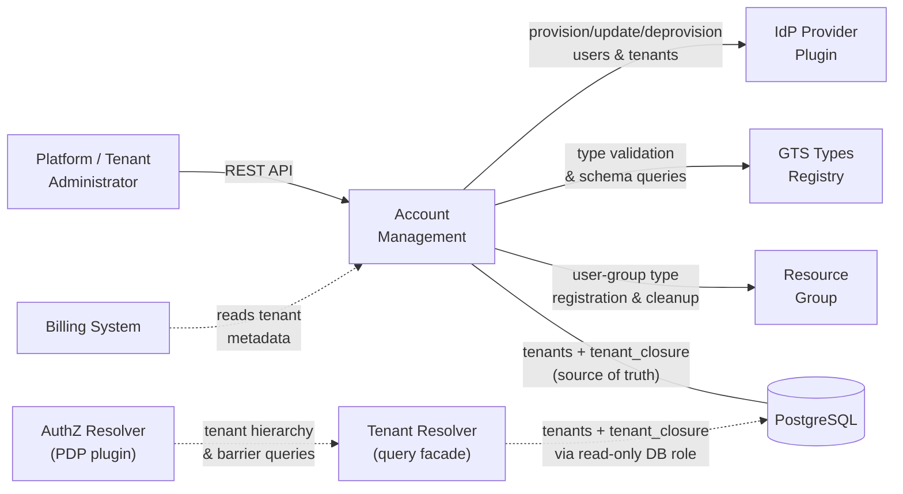
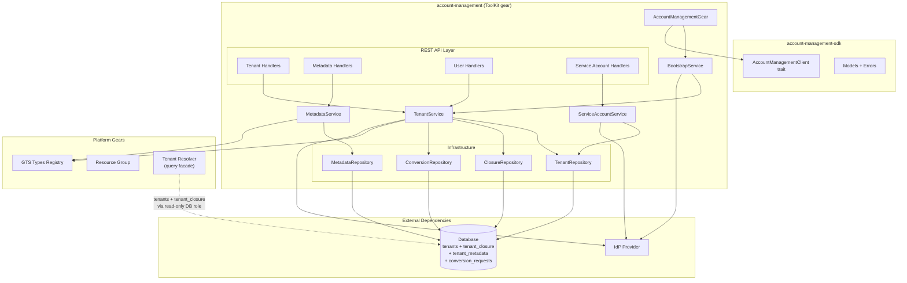
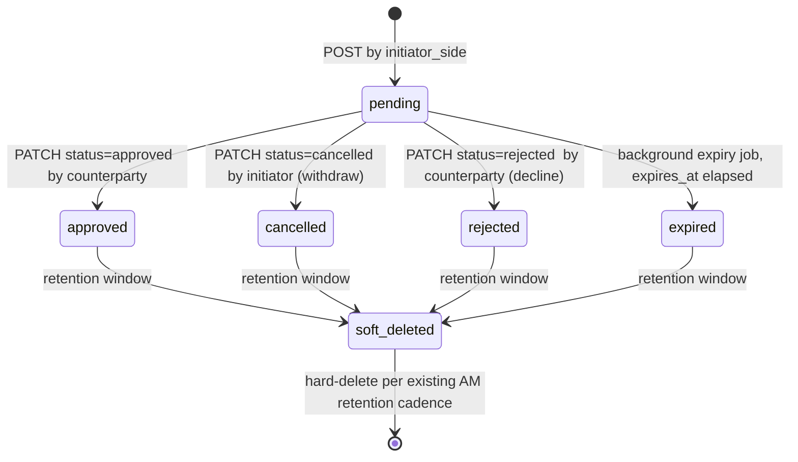
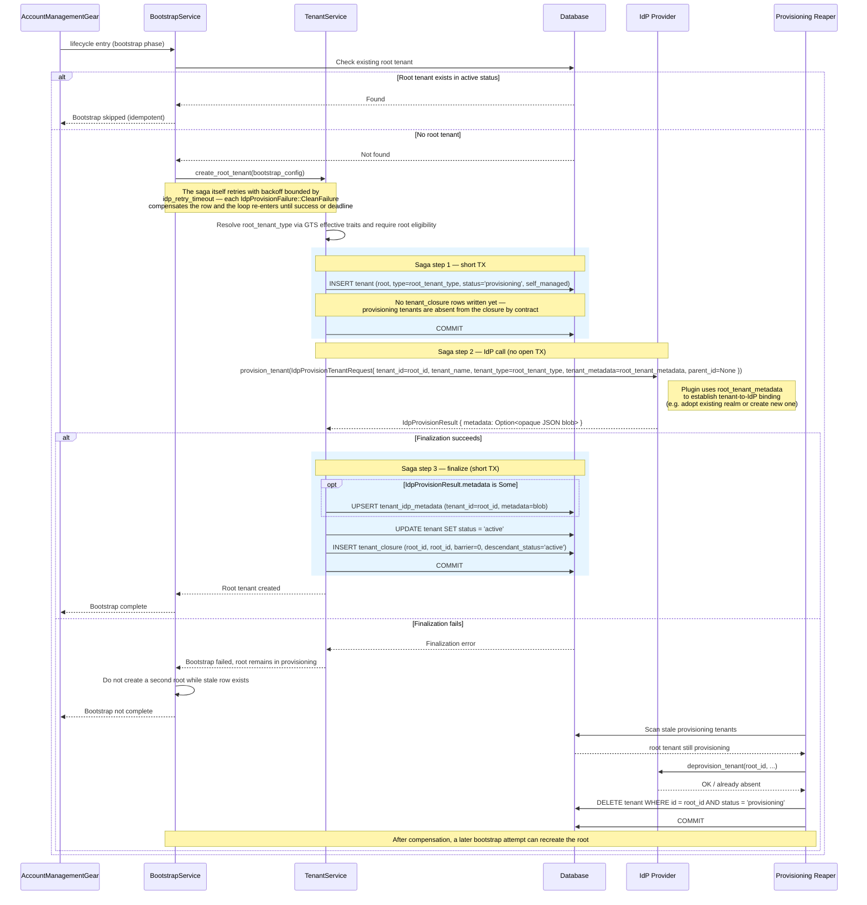
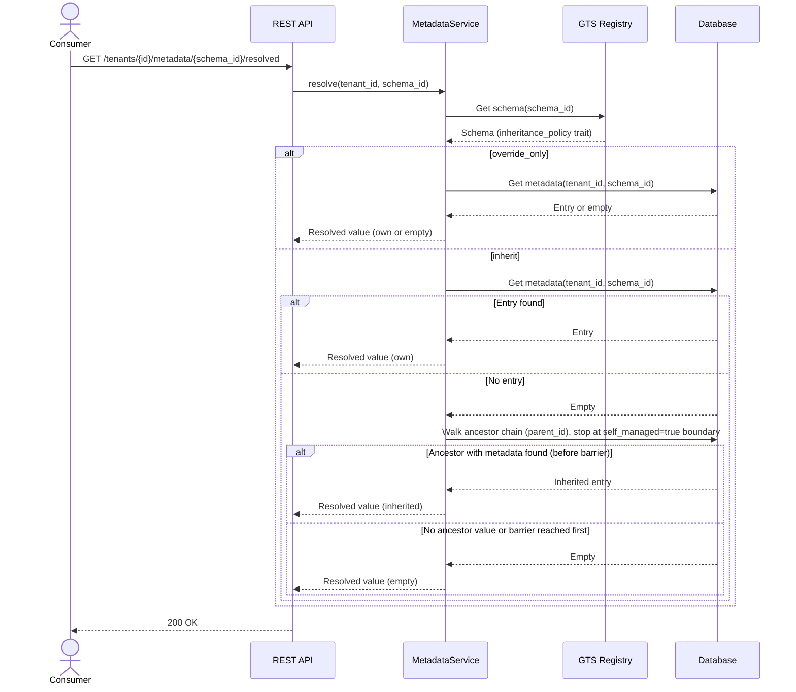
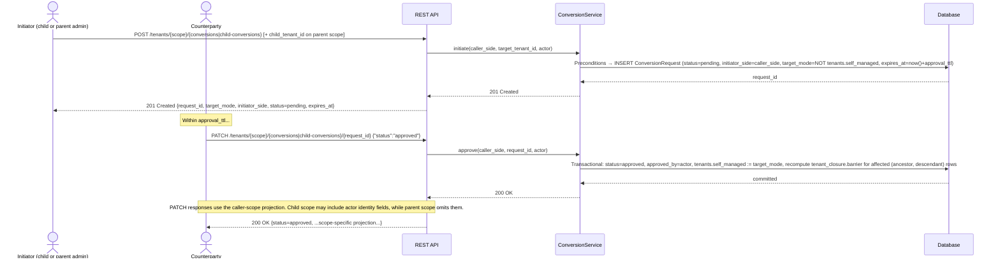
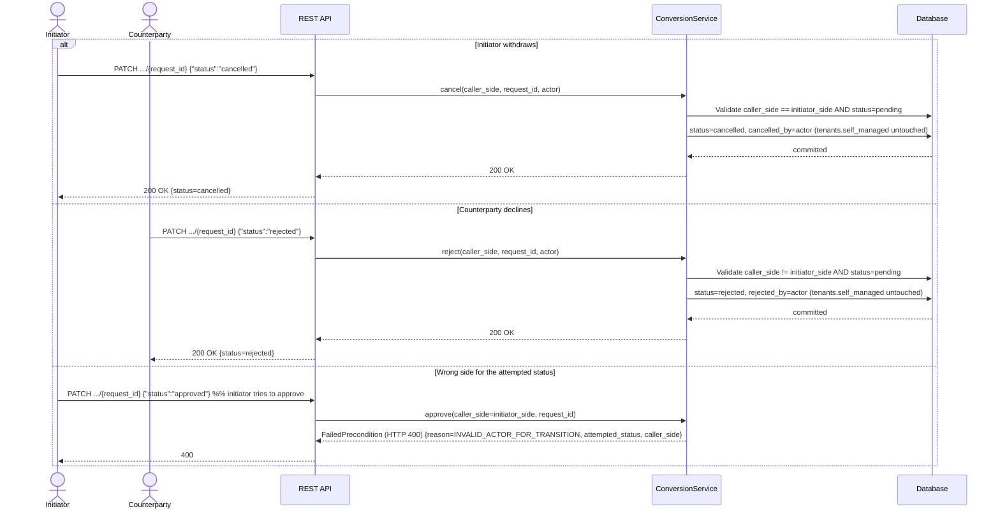
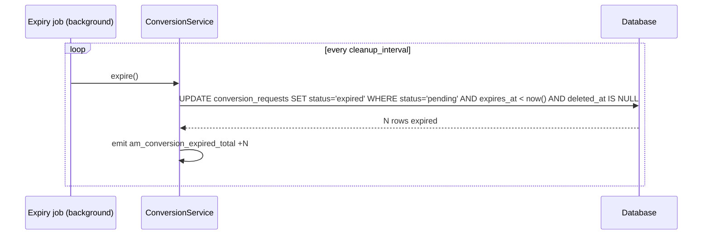

Created:  2026-04-01 by Virtuozzo International GmbH
Updated:  2026-08-17 by Virtuozzo International GmbH

# Technical Design — Account Management (AM)

- [ ] `p3` - **ID**: `cpt-cf-account-management-design-am`

<!-- toc -->

- [1. Architecture Overview](#1-architecture-overview)
  - [1.1 Architectural Vision](#11-architectural-vision)
  - [1.2 Architecture Drivers](#12-architecture-drivers)
  - [1.3 Architecture Layers](#13-architecture-layers)
- [2. Principles & Constraints](#2-principles--constraints)
  - [2.1 Design Principles](#21-design-principles)
  - [2.2 Constraints](#22-constraints)
- [3. Technical Architecture](#3-technical-architecture)
  - [3.1 Domain Model](#31-domain-model)
  - [3.2 Component Model](#32-component-model)
  - [3.3 API Contracts](#33-api-contracts)
  - [3.4 Internal Dependencies](#34-internal-dependencies)
  - [3.5 External Dependencies](#35-external-dependencies)
  - [3.6 Interactions & Sequences](#36-interactions--sequences)
  - [3.7 Database schemas & tables](#37-database-schemas--tables)
  - [3.8 Error Codes Reference](#38-error-codes-reference)
- [4. Additional Context](#4-additional-context)
  - [4.1 Applicability and Delegations](#41-applicability-and-delegations)
  - [4.2 Security Architecture](#42-security-architecture)
  - [Threat Modeling](#threat-modeling)
  - [4.3 Reliability and Operations](#43-reliability-and-operations)
  - [Data Governance](#data-governance)
  - [Testing Architecture](#testing-architecture)
  - [Open Questions](#open-questions)
  - [Documentation Strategy](#documentation-strategy)
  - [Known Limitations & Technical Debt](#known-limitations--technical-debt)
- [5. Traceability](#5-traceability)

<!-- /toc -->

> **Abbreviation**: Account Management = **AM**. Used throughout this document.

## 1. Architecture Overview

### 1.1 Architectural Vision

AM is the foundational multi-tenancy source-of-truth gear for the Gears platform. It owns the tenant hierarchy, tenant type enforcement, barrier metadata, delegated IdP user operations, and extensible tenant metadata. AM follows the standard ToolKit gear pattern under `gears/system/account-management/`: a planned SDK crate (`account-management-sdk`) exposes transport-agnostic traits and models, and a planned implementation crate (`account-management`) provides the gearifecycle, REST API, domain logic, and infrastructure adapters.

The architecture separates data ownership from enforcement. AM stores and validates the tenant tree structure, barrier flags, and type constraints. It does not evaluate authorization policies, generate SQL predicates, or validate bearer tokens on the per-request path. Tenant Resolver and AuthZ Resolver consume AM source-of-truth data for runtime enforcement. This separation keeps AM focused on administrative correctness while letting specialized resolvers optimize the hot path independently.

IdP integration uses the Gears gateway + plugin pattern, analogous to AuthN Resolver (see `cpt-cf-account-management-adr-idp-contract-separation`). AM defines an `IdpPluginClient` trait for tenant and user administrative operations (tenant provisioning/deprovisioning, user provision/update/deprovision, tenant-scoped query). The plugin is discovered via GTS types-registry and resolved through `ClientHub`. The platform ships a default provider plugin; vendors substitute their own implementation behind the same trait. The IdP provider plugin is intentionally separate from the AuthN Resolver plugin — the two target different concerns (admin operations vs hot-path token validation) with different performance profiles and protocols. The contract is one-directional: AM calls IdP, IdP does not call AM.

User group management is handled by the [Resource Group](../../resource-group/docs/PRD.md) gear. AM registers a dedicated Resource Group type for user groups during gear initialization; consumers call `ResourceGroupClient` directly for group lifecycle, membership, and hierarchy operations.

#### System Context



**System actors by PRD ID**

- `cpt-cf-account-management-actor-tenant-resolver` reads AM-owned `tenants` and `tenant_closure` directly via a read-only database role and serves the SDK-facing query facade over that data.
- `cpt-cf-account-management-actor-authz-resolver` consumes tenant context, barrier inputs, and metadata authorization attributes for access decisions.
- `cpt-cf-account-management-actor-billing` consumes read-only hierarchy and billing-relevant metadata views under platform-authorized barrier-bypass policy.

### 1.2 Architecture Drivers

#### Functional Drivers

| Requirement | Design Response |
|-------------|-----------------|
| `cpt-cf-account-management-fr-root-tenant-creation` | Bootstrap runs as the first action inside the gear's `lifecycle(entry = ...)` method, creating the initial root tenant with IdP linking before signalling ready. |
| `cpt-cf-account-management-fr-root-tenant-idp-link` | Bootstrap calls `provision_tenant` for the root tenant (same contract as all tenants), forwarding deployer-configured `root_tenant_metadata` so the IdP provider plugin can establish the tenant-to-IdP binding. Any provider-returned `IdpProvisionResult` metadata is persisted as tenant metadata. AM does not validate binding sufficiency — binding establishment is the provider's responsibility, whether via returned metadata, external configuration, or convention. |
| `cpt-cf-account-management-fr-bootstrap-idempotency` | Bootstrap checks for existing root tenant before creation; no-op when already present. |
| `cpt-cf-account-management-fr-bootstrap-ordering` | Bootstrap retries IdP availability with configurable backoff and timeout before proceeding. |
| `cpt-cf-account-management-fr-create-child-tenant` | `TenantService::create_child_tenant` validates parent status, GTS type constraints, and depth threshold. |
| `cpt-cf-account-management-fr-hierarchy-depth-limit` | Configurable advisory threshold with optional strict mode; depth computed from parent at creation time. |
| `cpt-cf-account-management-fr-tenant-status-change` | `TenantService::update_status` applies `active` ↔ `suspended` transitions without cascading to children. Transition to `deleted` is rejected — deletion goes through `TenantService::delete_tenant` which enforces child/resource-ownership preconditions. |
| `cpt-cf-account-management-fr-tenant-soft-delete` | `TenantService::delete_tenant` validates the target tenant is non-root, has no non-deleted children, and has no remaining tenant-owned resource associations in the Resource Group ownership graph before soft delete; schedules hard deletion after retention period. |
| `cpt-cf-account-management-fr-children-query` | Paginated direct-children query with status filtering via OData `$filter` on `parent_id` index. |
| `cpt-cf-account-management-fr-tenant-read` | `TenantService::get_tenant` returns tenant details by identifier within the caller's authorized scope. |
| `cpt-cf-account-management-fr-tenant-update` | `TenantService::update_tenant` mutates only `name` and `status` (`active` ↔ `suspended`); immutable hierarchy-defining fields are rejected with `CanonicalError::InvalidArgument` (HTTP 400); `status=deleted` is rejected with `CanonicalError::FailedPrecondition` (HTTP 400) — use `DELETE` endpoint. |
| `cpt-cf-account-management-fr-tenant-type-enforcement` | `TenantService` queries `TypesRegistryClient` for type constraints at child creation time. |
| `cpt-cf-account-management-fr-tenant-type-nesting` | Same-type nesting permitted when GTS type definition allows it; acyclicity guaranteed by tree structure. |
| `cpt-cf-account-management-fr-managed-tenant-creation` | Tenant created with `self_managed=false`; no barrier flag set. |
| `cpt-cf-account-management-fr-self-managed-tenant-creation` | Tenant created with `self_managed=true`; the barrier flag is stored on the tenant row and materialized into `tenant_closure.barrier` on the same transaction for every `(ancestor, descendant)` pair whose path `(ancestor, descendant]` contains the new tenant. |
| `cpt-cf-account-management-fr-tenant-closure` | AM owns `tenant_closure` with the platform-canonical shape `(ancestor_id, descendant_id, barrier, descendant_status)`. `TenantService` and `ConversionService::approve` maintain closure rows transactionally with every hierarchy or lifecycle mutation so downstream readers observe tree and closure as one consistent state. |
| `cpt-cf-account-management-fr-mode-conversion-approval` | `ConversionService` owns the dual-consent lifecycle for any post-creation toggle of `tenants.self_managed`. Each side acts from its own authorized scope and root tenants are excluded from the flow. |
| `cpt-cf-account-management-fr-mode-conversion-expiry` | A background expiry task closes unresolved conversion requests after the configured approval window without changing tenant mode. |
| `cpt-cf-account-management-fr-mode-conversion-single-pending` | A partial unique invariant on the conversion store plus service-level conflict handling ensure at most one pending conversion request per tenant. |
| `cpt-cf-account-management-fr-mode-conversion-consistent-apply` | Approval updates both conversion status and tenant barrier state as one consistent transaction outcome. |
| `cpt-cf-account-management-fr-conversion-creation-time-self-managed` | `TenantService::create_tenant` accepts `self_managed=true` directly at creation time and stores the flag without a `ConversionRequest`; the parent's explicit creation call is the consent. Only post-creation toggles are routed through `ConversionService`. |
| `cpt-cf-account-management-fr-child-conversions-query` | `ConversionService::list_inbound_for_parent` joins `conversion_requests` with `tenants` on `parent_id`. Operates within parent tenant AuthZ scope; no barrier bypass required. Exposes only conversion-request metadata (conversion `id`, `child_tenant_id`, `child_tenant_name`, `initiator_side`, `target_mode`, `status`, `requested_by`, terminal-actor fields as applicable, timestamps), not full child tenant data. |
| `cpt-cf-account-management-fr-conversion-cancel` | `ConversionService::cancel` transitions a pending `ConversionRequest` to `cancelled` only when `caller_side == initiator_side`. Exposed via `PATCH .../conversions/{r}` (child scope) and `PATCH .../child-conversions/{r}` (parent scope) with body `{"status": "cancelled"}`. Role-check failures return `CanonicalError::FailedPrecondition` (HTTP 400) with `reason=INVALID_ACTOR_FOR_TRANSITION`. |
| `cpt-cf-account-management-fr-conversion-reject` | `ConversionService::reject` transitions a pending `ConversionRequest` to `rejected` only when `caller_side != initiator_side`. Exposed via the same `PATCH` endpoints with body `{"status": "rejected"}`. Role-check failures return `CanonicalError::FailedPrecondition` (HTTP 400) with `reason=INVALID_ACTOR_FOR_TRANSITION`. |
| `cpt-cf-account-management-fr-conversion-retention` | Background job `ConversionService::soft_delete_resolved` stamps `deleted_at` on resolved rows older than `resolved_retention` (default 30d); default queries filter `deleted_at IS NULL`. Hard-delete follows AM's existing retention cadence. |
| `cpt-cf-account-management-fr-idp-tenant-provision` | Tenant creation uses a saga pattern: (1) short TX inserts the tenant with `status=provisioning`, (2) `IdpPluginClient::provision_tenant` is called outside any transaction, (3) a second short TX persists provider-returned metadata and transitions the tenant to `active`. If the IdP call returns a clean compensable failure proving no provider state was retained, a compensating TX deletes the `provisioning` row. If the IdP outcome is ambiguous, or if the finalization TX fails after IdP success, AM does not retry the DB completion step; the tenant remains in `provisioning` state until the background reaper compensates (see Reliability Architecture — Data Consistency). `POST /tenants` remains intentionally non-idempotent. |
| `cpt-cf-account-management-fr-idp-tenant-provision-failure` | The tenant-creation saga distinguishes clean compensation from ambiguous external outcomes and maps both paths into deterministic public failure behavior plus reaper-backed reconciliation. |
| `cpt-cf-account-management-fr-idp-tenant-deprovision` | Background hard-deletion job calls `IdpPluginClient::deprovision_tenant` for every hard-deleted tenant. Provider implementations clean up tenant-scoped IdP resources, guided by tenant type traits such as `idp_provisioning`. Providers **MUST NOT** silently no-op on mutating operations — unsupported deprovisioning **MUST** fail with `idp_unsupported_operation`. Failure retries rather than skips. |
| `cpt-cf-account-management-fr-idp-user-provision` | `IdpPluginClient::provision_user` with tenant scope binding and resolved tenant metadata (for IdP context resolution, e.g., effective Keycloak realm). |
| `cpt-cf-account-management-fr-idp-user-deprovision` | `IdpPluginClient::deprovision_user` with session revocation; an already-absent IdP user is treated as a successful no-op so `DELETE /tenants/{id}/users/{user_id}` remains idempotent. |
| `cpt-cf-account-management-fr-idp-user-update` | `IdpPluginClient::update_user` applies a JSON Merge Patch of mutable attributes (`username`, `email`, `display_name`, `first_name`, `last_name`, `password`) as a pass-through; AM persists no user state. An absent user surfaces as `not_found` (NOT folded into success, unlike deprovision); a `username` collision as `already_exists`. Backed by `cpt-cf-account-management-adr-user-attribute-update`. |
| `cpt-cf-account-management-fr-idp-user-query` | `IdpPluginClient::list_users` with tenant filter; supports optional user-ID filter for single-user lookups. |
| `cpt-cf-account-management-fr-service-account-provision` | `ServiceAccountService::create` gates on the `create` action, resolves the tenant through the guard shared with the user pass-through, caps the payload, then calls `IdpPluginClient::provision_service_account`. The 201 carries `Location` plus `Cache-Control: no-store` and discloses the secret once — there is no read-back path. A name already live in the tenant comes back from the provider as the invalid-input category (400) and the existing account is never resumed or revealed; the `(tenant_id, name)` uniqueness the provider enforces atomically is what makes the name a usable correlation key. |
| `cpt-cf-account-management-fr-service-account-list` | `ServiceAccountService::list` calls `IdpPluginClient::list_service_accounts` and returns the tenant's whole collection unpaginated, each entry carrying the caller-supplied name verbatim. Unpaginated on purpose: this listing doubles as the ambiguous-outcome reconciliation path, and no field carries a secret. |
| `cpt-cf-account-management-fr-service-account-rotate` | `ServiceAccountService::rotate_secret` gates on the separately grantable `rotate_secret` action and calls `IdpPluginClient::rotate_service_account_secret`; the 200 carries `Cache-Control: no-store` and a new one-time secret with the account's identity unchanged. Unlike revoke, a provider-reported absence is surfaced as `not_found` (404) carrying the addressed `client_id` — a rotation that found nothing minted no usable credential. |
| `cpt-cf-account-management-fr-service-account-revoke` | `ServiceAccountService::revoke` calls `IdpPluginClient::revoke_service_account` and folds a provider-reported absence into the same 204 as a removal (idempotency by error-mapping: the adapter maps vendor errors, AM assigns meaning), which also makes revoke useless as a probe for accounts owned by other tenants. A clean failure or an ambiguous outcome is NOT absence-equivalent. |
| `cpt-cf-account-management-fr-service-account-secret-confidentiality` | The secret is wrapped in `secrecy::SecretString` (redacted `Debug`, zeroize-on-drop, no Serde) from the contract boundary to the single DTO conversion that serialises it; nothing persists it and no endpoint reads it back. `ServiceAccountFailureExt` discards every provider `detail` and `field` rather than digesting them, substituting fixed AM-owned messages and logging only category, length, and whether a field was attributed — see §4.2 Credential Handling on the Machine-Identity Surface. |
| `cpt-cf-account-management-fr-user-group-rg-type` | `AccountManagementGear` idempotently registers the user-group Resource Group type `gts.cf.core.rg.type.v1~cf.core.am.user_group.v1~` during gear initialization, with `allowed_memberships` including the platform user resource type (`gts.cf.core.am.user.v1~`). |
| `cpt-cf-account-management-fr-user-group-lifecycle` | Consumers call `ResourceGroupClient` directly for group create/update/delete. AM does not proxy these operations. |
| `cpt-cf-account-management-fr-user-group-membership` | Consumers call `ResourceGroupClient` directly for membership add/remove. Callers verify user existence via AM's user-list endpoint; RG treats `resource_id` as opaque. |
| `cpt-cf-account-management-fr-nested-user-groups` | Nested groups via Resource Group parent-child hierarchy; cycle detection enforced by Resource Group forest invariants. No AM involvement at runtime. |
| `cpt-cf-account-management-fr-tenant-metadata-schema` | `MetadataService` validates metadata payloads against the GTS-registered schema identified by `schema_id`, using the schema's `inheritance_policy` trait to drive resolution. |
| `cpt-cf-account-management-fr-tenant-metadata-crud` | `MetadataService` provides CRUD for metadata entries keyed by `(tenant_id, schema_id)` with GTS schema validation. |
| `cpt-cf-account-management-fr-tenant-metadata-api` | `MetadataService::resolve` walks the hierarchy when the schema's `inheritance_policy` trait is `inherit`; returns the tenant's own value (or empty) when `override_only`. |
| `cpt-cf-account-management-fr-tenant-metadata-list` | `MetadataService::list_for_tenant` returns paginated own-entries for a tenant; REST endpoint `GET /api/account-management/v1/tenants/{id}/metadata` is tenant-scope-filtered by the platform layer, so self-managed barriers apply without AM-specific logic. |
| `cpt-cf-account-management-fr-tenant-metadata-permissions` | REST handlers pass `schema_id` into `PolicyEnforcer::enforce` as a resource attribute (`SCHEMA_ID`) on `Metadata.read`, `Metadata.write`, `Metadata.delete`, and `Metadata.list` actions, so external AuthZ policy can express per-`schema_id` grants without AM evaluating policy itself. |
| `cpt-cf-account-management-fr-deterministic-errors` | Unified error mapper translates domain and infrastructure failures to stable public categories; the authoritative HTTP/code mapping is published in the OpenAPI contract. |
| `cpt-cf-account-management-fr-observability-metrics` | OpenTelemetry metrics for domain-internal latencies (IdP calls, GTS validation, metadata resolution, bootstrap), background job throughput, error rates, closure-maintenance counters, and security counters. Per-endpoint CRUD counts and children-query latency are captured by platform HTTP middleware; capacity gauges (active tenants) are derivable from DB queries. |

#### NFR Allocation

| NFR ID | NFR Summary | Allocated To | Design Response | Verification Approach |
|--------|-------------|--------------|-----------------|----------------------|
| `cpt-cf-account-management-nfr-context-validation-latency` | End-to-end tenant-context validation p95 ≤ 5ms | Schema design + indexes on `tenants` / `tenant_closure` + bounded reverse-hydration caches for UUID-backed public GTS identifiers | Composite indexes on `(parent_id, status)`, the single-root invariant backing `parent_id IS NULL`, `(tenant_type_uuid)`, `tenant_closure(ancestor_id, barrier, descendant_status)`, and `tenant_closure(descendant_id)`; denormalized `depth` avoids recursive checks on write paths. AM provides the indexed source-of-truth schema; the end-to-end p95 ≤ 5ms target assumes indexed resolver reads and warm reverse-hydration mappings for `tenant_type_uuid` / `schema_uuid`, not hierarchy caching. | AM: integration tests verify indexed query baselines and deterministic reverse-hydration miss behavior. Platform: pre-GA load test benchmark (end-to-end through Tenant Resolver) against approved deployment profile. |
| `cpt-cf-account-management-nfr-tenant-isolation` | Zero cross-tenant data leaks | SecureConn + PolicyEnforcer on all API endpoints | All database access through `SecureConn` with tenant-scoped queries; `PolicyEnforcer` PEP pattern on every REST handler. | Automated security test suite with cross-tenant access attempts |
| `cpt-cf-account-management-nfr-audit-completeness` | 100% tenant config changes audited | Platform append-only audit infrastructure | AM relies on the platform append-only audit infrastructure as the single audit sink. Request handlers emit audit records via the platform request pipeline; AM-owned non-request flows emit into the same sink with `actor=system` (bootstrap completion, conversion expiry, provisioning-reaper compensation, hard-delete / tenant-deprovision cleanup). Database-level `created_at`/`updated_at` timestamps provide additional chronology but are not the audit system. **v1 deferral**: the platform append-only audit sink is not yet wired, so AM-owned non-request flows emit a structured log on the `am.events` target with `actor=system` as the v1 stand-in for the audit envelope; full sink integration is tracked as a follow-up. | Verify platform audit entries exist for state-changing API operations and for AM-owned system-actor lifecycle events in integration tests once the audit sink lands; until then, verify the structured-log stand-in carries `actor=system` and the expected `kind` for each AM-owned non-request transition |
| `cpt-cf-account-management-nfr-barrier-enforcement` | Barrier state sufficient for downstream enforcement; AM-owned barrier-state changes audited | `self_managed` column on `tenants` + `barrier` column on `tenant_closure` | AM exposes `self_managed` on tenant rows and the materialized `barrier` column on `tenant_closure`; Tenant Resolver and AuthZ Resolver consume both directly for barrier traversal and access decisions. AM commits `self_managed` on the tenant row and the affected `tenant_closure.barrier` rows inside the same conversion transaction, so barrier-aware queries reflect the new state as soon as the transaction commits. Platform request audit logging captures all barrier-state-changing operations (mode conversions) per `cpt-cf-account-management-nfr-audit-completeness`; cross-tenant access auditing is a platform AuthZ concern. | Integration tests validating barrier data completeness across `tenants` and `tenant_closure`; verify platform audit log entries exist for mode conversion operations |
| `cpt-cf-account-management-nfr-tenant-model-versatility` | Both managed and self-managed in same tree | `self_managed` boolean per tenant, independent of siblings | Sibling tenants under the same parent can have different `self_managed` values; mode conversion is a per-tenant operation. | Integration tests with mixed-mode hierarchies |
| `cpt-cf-account-management-nfr-compatibility` | No breaking changes within minor release | Path-based API versioning + stable SDK trait contract | REST API uses `/api/account-management/v1/` prefix; SDK trait changes require new major version with migration path. | Contract tests on SDK trait + API schema regression tests |
| `cpt-cf-account-management-nfr-production-scale` | Approved deployment profile before DESIGN sign-off | Schema design + index strategy | Approved deployment profile: 100K tenants, depth 5 (advisory threshold 10), 300K users (IdP-stored), 30K user groups / 300K memberships (RG-stored), 1K rps peak. All targets within planning envelope. Schema impact assessment confirms existing indexes and B-tree depths are sufficient for that profile; no partitioning is required. | Capacity test against approved profile (100K tenants, 300K users, 1K rps) |
| `cpt-cf-account-management-nfr-data-classification` | Persisted data classes documented; no credentials/profile PII stored by AM | Security architecture + data model boundaries | Tenant hierarchy metadata is classified as commercially sensitive; metadata schema classification is derived per `schema_id`; AM persists IdP-issued UUID identity references only where required for traceability and never stores credentials or IdP profile data outside the platform audit infrastructure. Service-account client secrets are restricted authentication credentials: never persisted, wrapped in a redacting non-serializable type in process, and present in exactly two responses. Text an IdP adapter returns with a service-account failure is treated as unclassifiable and therefore discarded rather than digested. | Design review of persisted fields and audit payloads; integration checks confirm user lifecycle paths do not create local user/profile records, that credential-bearing responses set `Cache-Control: no-store`, and that a credential-shaped provider `detail` appears in neither the response body nor any log record |
| `cpt-cf-account-management-nfr-reliability` | Reads stay available during IdP outages; retry contract is explicit | Saga-based tenant creation + degraded-mode reads + reaper compensation | Non-IdP-dependent reads and admin operations continue during IdP outages. Tenant creation uses the three-step provisioning saga; clean step-2 compensation returns `idp_unavailable` and is retryable, while transport failure, timeout, or finalization failure after IdP-side success leave `POST /tenants` in an ambiguous, non-idempotent state that callers must reconcile before retry. | Integration tests for clean compensation, ambiguous finalization failure, provisioning reaper cleanup, and degraded reads during IdP outage |
| `cpt-cf-account-management-nfr-data-lifecycle` | Tenant deprovisioning cascades cleanup | `TenantService::delete_tenant` + background hard-delete job | Soft delete transitions to `deleted` status; background job hard-deletes after retention period; cascade triggers IdP `deprovision_tenant` (with retry on failure), Resource Group cleanup for tenant-scoped user groups (via `ResourceGroupClient`), and metadata entry deletion. | Integration tests verifying cascaded cleanup |
| `cpt-cf-account-management-nfr-authentication-context` | Authenticated requests via platform SecurityContext; MFA for admin ops deferred to platform AuthN policy | `SecurityContext` requirement on all REST handlers via framework middleware | AM does not validate tokens or enforce MFA directly. All REST endpoints require a valid `SecurityContext` provided by the framework AuthN pipeline. MFA enforcement for administrative operations such as tenant creation and mode conversion is a platform AuthN policy concern — AM relies on the framework to reject requests that do not meet the configured authentication strength. | API tests: every endpoint returns 401 without valid `SecurityContext`; E2E: admin operations succeed only with authenticated requests |
| `cpt-cf-account-management-nfr-data-quality` | Transactional consistency across `tenants` and `tenant_closure`; hierarchy integrity checks | Transactional DB writes spanning `tenants` and `tenant_closure` + Rust-side integrity check over a SecureSelect snapshot | AM commits hierarchy changes and the corresponding `tenant_closure` updates in a single transaction, so a committed write is observable as one consistent `(tenants, tenant_closure)` state across every reader. Schema stability per `cpt-cf-account-management-nfr-compatibility` ensures the database-level data contract remains intact. AM provides a hierarchy integrity check via 8 pure-Rust classifiers over a `(tenants, tenant_closure)` snapshot with single-flight gating (see §3.2 *Diagnostic Capabilities* for the classifier set, transaction isolation, gate lifecycle, and memory footprint). Memory footprint is bounded by the snapshot size plus the violation count; the trade-off is explicit avoidance of a raw-SQL escape hatch in the production runtime. | Unit: per-classifier in-source tests over hand-built `Snapshot` fixtures; Integration: end-to-end audit over both backends detects seeded anomalies (orphan, missing self-row, missing strict-ancestor edge); Integration: committed writes are immediately visible across both tables via direct query |
| `cpt-cf-account-management-nfr-data-integrity-diagnostics` | Diagnostic checks for observable hierarchy anomalies | `TenantService::check_hierarchy_integrity()` (8 pure-Rust classifiers over a SecureSelect snapshot with uniform single-flight) + observability surface | AM exposes explicit integrity diagnostics via 8 pure-Rust classifiers that run over a `(tenants, tenant_closure)` snapshot with single-flight enforcement (see §3.2 *Diagnostic Capabilities* for classifier details, transaction model, and gate mechanism). Contention surfaces uniformly across PostgreSQL and SQLite as HTTP `429 Too Many Requests` (`DomainError::IntegrityCheckInProgress` → `CanonicalError::ResourceExhausted`). | Unit tests cover each classifier in isolation over fixture snapshots. SQLite integration tests seed and verify all 8 anomaly categories end-to-end plus the single-flight `429` path. Postgres integration tests are intentionally a backend-specific subset (`RootCountAnomaly` partial-index + repair under real `SERIALIZABLE` snapshot isolation) — running every category twice would cost a container per case without surfacing new behaviour, so the SQLite suite is the canonical full-coverage gate. |
| `cpt-cf-account-management-nfr-data-remediation` | Operator-visible remediation path for AM-owned integrity anomalies | Observability + runbook-owned lifecycle handling | Compensation failures and integrity anomalies emit telemetry quickly, remain visible until addressed, and map to runbook-driven triage owned by platform operations. | Alert simulation and operational review |
| `cpt-cf-account-management-nfr-ops-metrics-treatment` | Minimum operational treatment for AM domain metrics | Shared dashboards + alert routing | AM publishes the minimum metric set required for operator treatment: IdP failures, bootstrap not-ready, provisioning reaper activity, integrity violations, and cleanup failures. | Dashboard/alert review plus smoke checks in staging |

#### Key ADRs

The following architecture decisions are adopted in this DESIGN:

| Decision Area | Adopted Approach | ADR |
|---------------|-----------------|-----|
| IdP contract design | Separate IdP provider plugin (`IdpPluginClient`) from AuthN Resolver plugin, both following Gears gateway + plugin pattern with independent GTS schemas. | `cpt-cf-account-management-adr-idp-contract-separation` — [ADR-0001](ADR/0001-cpt-cf-account-management-adr-idp-contract-separation.md) |
| Metadata inheritance | Walk-up resolution at read time via `parent_id` ancestor chain. The walk stops at self-managed barriers and otherwise continues to the root; no write amplification, always consistent. | `cpt-cf-account-management-adr-metadata-inheritance` — [ADR-0002](ADR/0002-cpt-cf-account-management-adr-metadata-inheritance.md) |
| Conversion approval | Stateful `ConversionRequest` entity with a configurable approval window (default 72h), partial unique index for at-most-one pending row per tenant, background expiry and soft-delete retention jobs. Symmetric collection-based REST API (`/conversions` child-scope, `/child-conversions` parent-scope, each with `{request_id}`) lets each side initiate via `POST` and resolve via `PATCH` from its own AuthZ scope. Lifecycle enum is five-valued (`pending`/`approved`/`cancelled`/`rejected`/`expired`) with explicit actor-per-status semantics. | `cpt-cf-account-management-adr-conversion-approval` — [ADR-0003](ADR/0003-cpt-cf-account-management-adr-conversion-approval.md) |
| User identity source of truth | IdP is the single source of truth for user identity data (credentials, profile, authentication state, user existence). AM does not maintain a local user table, projection, or cache. | `cpt-cf-account-management-adr-idp-user-identity-source-of-truth` — [ADR-0005](ADR/0005-cpt-cf-account-management-adr-idp-user-identity-source-of-truth.md) |
| User-tenant binding | IdP stores the user-tenant binding as a tenant identity attribute on the user record. AM coordinates binding via the IdP contract but does not independently store or cache the relationship. | `cpt-cf-account-management-adr-idp-user-tenant-binding` — [ADR-0006](ADR/0006-cpt-cf-account-management-adr-idp-user-tenant-binding.md) |
| Tenant hierarchy closure ownership | AM owns both the canonical tenant tree and the platform-canonical `tenant_closure` table `(ancestor_id, descendant_id, barrier, descendant_status)`. Closure maintenance is transactional with tenant writes in `TenantService` and `ConversionService::approve`. AM does not expose a sync capability (canonical enumeration or revision/change token); Tenant Resolver reads AM-owned storage directly via a **dedicated SecureConn connection pool** bound to a read-only database role — distinct from AM's writer pool, so plugin hot-path reads and AM writer traffic are isolated at the pool layer and cannot starve each other. | `cpt-cf-tr-plugin-adr-p1-tenant-hierarchy-closure-ownership` — [ADR-001](tr-plugin/ADR/ADR-001-tenant-hierarchy-closure-ownership.md) |
| Provisioning tenants excluded from `tenant_closure` | Closure rows are inserted transactionally with the `provisioning → active` transition (saga step 3) and removed with hard-deletion. Provisioning tenants never appear in `tenant_closure`; `descendant_status` domain tightens to `{active, suspended, deleted}`. The Tenant Resolver Plugin's unconditional `descendant_status <> 'provisioning'` filter goes away — provisioning invisibility becomes structural on closure-driven reads. | `cpt-cf-account-management-adr-provisioning-excluded-from-closure` — [ADR-0007](ADR/0007-cpt-cf-account-management-adr-provisioning-excluded-from-closure.md) |

Rejected prospective direction: `cpt-cf-account-management-adr-resource-group-tenant-hierarchy-source` — [ADR-0004](ADR/0004-cpt-cf-account-management-adr-resource-group-tenant-hierarchy-source.md) considered moving canonical tenant hierarchy storage from the AM `tenants` table to Resource Group, but rejected it because it splits tenant structure and tenant lifecycle ownership across gears. This DESIGN intentionally retains the dedicated `tenants` table as the AM source of truth.

### 1.3 Architecture Layers

- [ ] `p3` - **ID**: `cpt-cf-account-management-tech-toolkit-stack`

| Layer | Responsibility | Technology |
|-------|---------------|------------|
| REST API | HTTP endpoints, request/response DTOs, OpenAPI docs | OperationBuilder + Axum handlers |
| SDK | Public client trait, transport-agnostic models, error types | Rust traits + ClientHub registration |
| Domain | Business logic, invariants, tenant lifecycle, metadata resolution | Rust domain services |
| Infrastructure | Database access, IdP adapter, migrations | SeaORM via SecureConn, IdP contract implementations |

## 2. Principles & Constraints

### 2.1 Design Principles

#### Source-of-Truth, Not Enforcer

- [ ] `p2` - **ID**: `cpt-cf-account-management-principle-source-of-truth`

AM owns the canonical tenant hierarchy, barrier state, type constraints, and extensible metadata. It validates structural invariants (tree structure, type compatibility, depth thresholds) on writes. AM does not evaluate authorization decisions, interpret policies, or enforce per-request access control. Tenant Resolver and AuthZ Resolver are the enforcement points that consume AM data.

**Drivers**: `cpt-cf-account-management-fr-tenant-read`, `cpt-cf-account-management-fr-tenant-update`, `cpt-cf-account-management-fr-tenant-soft-delete`, `cpt-cf-account-management-fr-mode-conversion-consistent-apply`, `cpt-cf-account-management-nfr-compatibility`

**ADR Trace**: local ADR not required; principle inherits the platform AuthN/AuthZ separation documented in [docs/arch/authorization/DESIGN.md](../../../../docs/arch/authorization/DESIGN.md) and the rejected data-ownership split recorded in [ADR-0004](ADR/0004-cpt-cf-account-management-adr-resource-group-tenant-hierarchy-source.md).

#### IdP-Agnostic

- [ ] `p2` - **ID**: `cpt-cf-account-management-principle-idp-agnostic`

All user lifecycle operations go through the `IdpPluginClient` trait. AM never hard-codes IdP-specific logic, never stores user credentials, and never caches user-tenant membership locally. If the IdP is unavailable, user operations fail with `idp_unavailable` — AM does not fall back to stale data.

**Drivers**: `cpt-cf-account-management-fr-idp-tenant-provision`, `cpt-cf-account-management-fr-idp-tenant-provision-failure`, `cpt-cf-account-management-fr-idp-user-provision`, `cpt-cf-account-management-fr-idp-user-deprovision`, `cpt-cf-account-management-fr-idp-user-update`, `cpt-cf-account-management-fr-idp-user-query`, `cpt-cf-account-management-nfr-authentication-context`

**ADR Trace**: `cpt-cf-account-management-adr-idp-contract-separation` — accepted in [ADR-0001](ADR/0001-cpt-cf-account-management-adr-idp-contract-separation.md); `cpt-cf-account-management-adr-idp-user-identity-source-of-truth` — accepted in [ADR-0005](ADR/0005-cpt-cf-account-management-adr-idp-user-identity-source-of-truth.md); `cpt-cf-account-management-adr-idp-user-tenant-binding` — accepted in [ADR-0006](ADR/0006-cpt-cf-account-management-adr-idp-user-tenant-binding.md)

#### Tree Invariant Preservation

- [ ] `p2` - **ID**: `cpt-cf-account-management-principle-tree-invariant`

Every tenant write validates that the resulting hierarchy remains a valid tree: each tenant has at most one parent, no cycles exist, type constraints are satisfied, exactly one root tenant exists, that root has `parent_id = NULL`, and the root tenant is undeletable. The tree structure is enforced at the domain layer, with the single-root invariant additionally backed by a database partial unique index.

**Drivers**: `cpt-cf-account-management-fr-create-child-tenant`, `cpt-cf-account-management-fr-hierarchy-depth-limit`, `cpt-cf-account-management-fr-tenant-soft-delete`, `cpt-cf-account-management-nfr-data-integrity-diagnostics`, `cpt-cf-account-management-nfr-data-quality`

**ADR Trace**: local ADR not required; principle is derived from the platform tenant model in [TENANT_MODEL.md](../../../../docs/arch/authorization/TENANT_MODEL.md) and preserved by the rejected alternative in [ADR-0004](ADR/0004-cpt-cf-account-management-adr-resource-group-tenant-hierarchy-source.md).

#### Barrier as Data

- [ ] `p2` - **ID**: `cpt-cf-account-management-principle-barrier-as-data`

AM does not enforce access-control barriers. It stores the `self_managed` flag on `tenants` rows, materializes the same barrier state into `tenant_closure.barrier` for every affected `(ancestor, descendant)` pair, returns both in reads consumed by downstream gears, and exposes `self_managed` in API responses. Barrier enforcement is resource-type dependent and applied at the platform AuthZ layer rather than inside AM domain logic: barrier-enforced subtree/resource reads use Tenant Resolver / AuthZ semantics, while parent-side tenant metadata visibility remains policy-defined per the platform tenant model. AM domain logic does not implement gear-specific barrier filtering, but its services do read hierarchy data that may include barrier-hidden tenants for two internal purposes: (1) **metadata inheritance boundary** — the ancestor walk stops at self-managed boundaries so that a self-managed tenant never inherits metadata from ancestors above its barrier (see `cpt-cf-account-management-fr-tenant-metadata-api`); (2) **structural invariant validation** — hierarchy-owner operations (parent-child type validation during creation, child-count pre-checks during deletion, child-state validation for the parent-scoped conversion endpoint) require full hierarchy visibility regardless of barrier state. Neither purpose constitutes access-control filtering — the results are used for internal precondition checks and are not exposed to API callers. These reads are performed via unscoped hierarchy lookups on the `tenants` table (see Security Architecture, Data Protection), distinct from the platform's `BarrierMode::Ignore` concept which AM does not use. AM's storage contract defines `tenant_closure.barrier = 1` iff some tenant on `(ancestor, descendant]` is self-managed (ancestor excluded, descendant included), with self-rows fixed to `barrier = 0` (the `barrier` column is `SMALLINT` per TENANT_MODEL.md — 16 bits of bitmask headroom for future multi-dimensional barriers, portable across PostgreSQL and MySQL; v1 uses bit 0 for self_managed). `tenant_closure` contains rows only for SDK-visible tenants (`active`, `suspended`, `deleted`); provisioning tenants are absent from the closure entirely and their barrier materialization happens at the `provisioning → active` transition, inserted in the same transaction as the status update. When a tenant converts to self-managed, AM commits `self_managed=true` on the tenant row and flips the `barrier` column on every affected non-self `(ancestor, descendant)` row of `tenant_closure` inside the same conversion transaction, so barrier-aware queries observe the new state as soon as the transaction commits.

**Drivers**: `cpt-cf-account-management-fr-self-managed-tenant-creation`, `cpt-cf-account-management-fr-mode-conversion-approval`, `cpt-cf-account-management-fr-mode-conversion-expiry`, `cpt-cf-account-management-fr-child-conversions-query`, `cpt-cf-account-management-nfr-barrier-enforcement`

**ADR Trace**: local ADR not required; principle inherits the barrier-enforcement split from [docs/arch/authorization/DESIGN.md](../../../../docs/arch/authorization/DESIGN.md) and the platform tenant semantics in [TENANT_MODEL.md](../../../../docs/arch/authorization/TENANT_MODEL.md).

#### Delegation to Resource Group

- [ ] `p2` - **ID**: `cpt-cf-account-management-principle-delegation-to-rg`

User group hierarchy, membership storage, cycle detection, and tenant-scoped isolation are handled by the Resource Group gearAM registers the user-group RG type at gear initialization and triggers RG cleanup during tenant hard-deletion. Consumers call `ResourceGroupClient` directly for all group and membership operations — AM does not proxy or coordinate these calls. AM's user-list endpoint (`GET /tenants/{id}/users`) provides the valid user set; callers combine it with RG's membership API.

**Drivers**: `cpt-cf-account-management-fr-user-group-rg-type`, `cpt-cf-account-management-fr-user-group-lifecycle`, `cpt-cf-account-management-fr-user-group-membership`, `cpt-cf-account-management-fr-nested-user-groups`

**ADR Trace**: local ADR not required; delegation aligns with [Resource Group PRD](../../resource-group/docs/PRD.md) and the rejected ownership alternative recorded in [ADR-0004](ADR/0004-cpt-cf-account-management-adr-resource-group-tenant-hierarchy-source.md).

**Principle conflict resolution**: No conflicts exist among the current five principles. If future design decisions create tension between principles, conflicts will be resolved through the ADR process. Tree Invariant Preservation and Source-of-Truth Not Enforcer take precedence as the foundational architectural commitments.

### 2.2 Constraints

#### No Direct User Data Storage

- [ ] `p2` - **ID**: `cpt-cf-account-management-constraint-no-user-storage`

AM does not maintain a local user table, user projection, or cached user-tenant membership. User existence and tenant binding are verified against the IdP at operation time. User identifiers appear in AM only as IdP-issued UUID references in the platform audit infrastructure and as arguments passed to Resource Group for group membership. If the IdP is unavailable, user operations fail rather than degrade to cached state.

**ADRs**: `cpt-cf-account-management-adr-idp-user-identity-source-of-truth` — accepted in [ADR-0005](ADR/0005-cpt-cf-account-management-adr-idp-user-identity-source-of-truth.md); `cpt-cf-account-management-adr-idp-user-tenant-binding` — accepted in [ADR-0006](ADR/0006-cpt-cf-account-management-adr-idp-user-tenant-binding.md)

#### SecurityContext Propagation

- [ ] `p2` - **ID**: `cpt-cf-account-management-constraint-security-context`

All AM API endpoints require a valid `SecurityContext` propagated by the Gears middleware. `PolicyEnforcer` PEP pattern is applied on every REST handler. AM does not construct, validate, or modify `SecurityContext` — it consumes the context provided by the framework.

**ADRs**: None yet — framework convention.

#### GTS Availability for Type Resolution

- [ ] `p2` - **ID**: `cpt-cf-account-management-constraint-gts-availability`

Tenant creation and type validation require the GTS Types Registry to be available. If GTS is unreachable, tenant creation operations that require type validation fail with a deterministic error. AM does not cache type definitions locally — type constraints are evaluated against GTS at write time to ensure consistency with runtime type changes.

**ADRs**: None yet — runtime validation trade-off.

#### No AuthZ Evaluation

- [ ] `p2` - **ID**: `cpt-cf-account-management-constraint-no-authz-eval`

AM does not evaluate allow/deny decisions, interpret authorization policies, validate bearer tokens, or generate SQL predicates for tenant scoping. These responsibilities belong to AuthZ Resolver, Tenant Resolver, and the Gears middleware respectively.

**ADRs**: None yet — platform architecture boundary.

#### Platform Versioning Policy

- [ ] `p2` - **ID**: `cpt-cf-account-management-constraint-versioning-policy`

Published REST APIs follow path-based versioning (`/api/account-management/v1/`). The SDK trait (`AccountManagementClient`) and IdP contract (`IdpPluginClient`) are stable interfaces — breaking changes require a new major version with a documented migration path for consumers. Within a version, only additive changes are permitted (new optional fields, new endpoints). Deprecated endpoints receive a minimum one-major-version notice period before removal. API lifecycle: v1 remains supported until v2 reaches GA; no concurrent support for more than two major versions.

**ADRs**: None yet — platform policy.

#### Data Handling and Regulatory Compliance

- [ ] `p2` - **ID**: `cpt-cf-account-management-constraint-data-handling`

AM acts as a data processor for identity-linked payloads. Data protection regulations (GDPR processor obligations) are enforced at the platform level. AM minimizes persisted user attributes (no local user table), treats IdP identity payloads as transient data, and delegates data residency to platform infrastructure per PRD Section 6.9. Tenant hierarchy metadata is classified as commercially sensitive; access is governed by `SecureConn` + `PolicyEnforcer` scoping.

**ADRs**: None yet — compliance boundary defined in PRD NFR exclusions.

#### Resource Constraints

Resource constraints (team size, timeline) are not applicable at gear level — tracked at project level. Regulatory constraints (GDPR processor obligations) are enforced at the platform level per `cpt-cf-account-management-constraint-data-handling`. Data residency is delegated to platform infrastructure per PRD Section 6.9.

#### Vendor and Licensing

- [ ] `p2` - **ID**: `cpt-cf-account-management-constraint-vendor-licensing`

AM uses only platform-approved open-source dependencies (SeaORM, Axum, OpenTelemetry via ToolKit). Vendor lock-in is limited to the IdP provider plugin contract, which is intentionally pluggable — vendors substitute their own implementation. No proprietary or copyleft-licensed dependencies are introduced at the gear level.

**ADRs**: None yet — platform dependency policy.

#### Legacy System Integration

- [ ] `p2` - **ID**: `cpt-cf-account-management-constraint-legacy-integration`

Legacy system integration is handled through the pluggable IdP provider contract, which allows AM to integrate with existing organizational directories and identity providers without gear-level changes. No additional legacy integration constraints exist for v1.

**ADRs**: None yet — covered by IdP-Agnostic principle.

## 3. Technical Architecture

### 3.1 Domain Model

**Technology**: Rust structs (SeaORM entities for persistence, SDK models for transport)

**Planned location**: `gears/system/account-management/account-management-sdk/src/models.rs` (SDK models), `gears/system/account-management/account-management/src/infra/storage/entity.rs` (persistence entities)

**Core Entities**:

| Entity | Description | Schema |
|--------|-------------|--------|
| Tenant | Core tenant node in the hierarchy tree. Holds identity, parent reference, status, mode, type, and depth. | `account-management-sdk` models |
| TenantClosureEntry | Row of the AM-owned `tenant_closure` table capturing an `(ancestor_id, descendant_id)` pair together with the materialized `barrier` value (`SMALLINT`, v1 uses bit 0 for self_managed — `barrier = 1` when any tenant on `(ancestor, descendant]` is self-managed; self-rows are always `0`) and the denormalized `descendant_status` copied from the descendant's `tenants.status`. Closure rows exist only for SDK-visible tenants (`active`, `suspended`, `deleted`) — provisioning tenants are absent from the closure entirely. Every SDK-visible tenant owns a self-row `(id, id)` in addition to strict-ancestor rows. Closure entries are an internal storage projection for Tenant Resolver query paths; they are not exposed through the public AM REST API. | AM-owned table; internal entity (not part of the public SDK surface) |
| TenantMetadata | Extensible metadata entry scoped to a tenant, validated against a GTS-registered schema. | `account-management-sdk` models |
| ConversionRequest | Durable record of a dual-consent mode conversion for a single tenant. Captures `target_mode`, `initiator_side`, the five-valued status (`pending` / `approved` / `cancelled` / `rejected` / `expired`), approval window, resolver identities, and soft-delete tombstone. At most one `pending` row per tenant (partial unique index). | `account-management-sdk` models |

**Relationships**:
- Tenant → Tenant: Self-referential parent-child (via `parent_id`). A tenant has zero or one parent and zero or more children. The root tenant has `parent_id = NULL`.
- Tenant → TenantClosureEntry: Each SDK-visible tenant participates in closure rows as both ancestor and descendant; every SDK-visible tenant has a self-row `(id, id)`. Closure rows are lifecycle-bound to the descendant — the self-row and strict-ancestor rows are inserted on the `provisioning → active` transition (one row per step up the `parent_id` chain), and all rows where the tenant appears as descendant are removed on hard-delete. Provisioning tenants have no closure rows at all.
- Tenant → TenantMetadata: One-to-many. A tenant can have multiple metadata entries, at most one per `schema_id`.
- Tenant → ConversionRequest: One-to-many overall, at most one **pending** request per tenant at any time (enforced by partial unique index). A conversion request references the target tenant; `initiator_side` records which side (`child` or `parent`) issued the `POST`. Resolved rows remain attached to the tenant until the soft-delete retention window elapses and the cleanup job hard-deletes them.
- Tenant → GTS Type: Many-to-one (via internal `tenant_type_uuid`, projected publicly as chained `tenant_type`). Each tenant references a GTS-registered type that defines parent-child constraints.
- Tenant → IdP: Logical relationship via opaque tenant identifier used for IdP linking. No local foreign key — IdP is external.
- Tenant → Resource Group (User Groups): Logical relationship. User groups are Resource Group entities scoped to a tenant. AM registers the RG type at init; consumers call `ResourceGroupClient` directly. `TenantService` triggers RG group cleanup during tenant hard-deletion.

#### Value Objects and Invariants

| Value Object / Invariant | Definition | Enforced By |
|--------------------------|------------|-------------|
| `TenantId` | Stable UUID identifying a tenant within AM and downstream contracts. | Database primary key + SDK model |
| `TenantTypeSchemaId` | Full chained GTS schema identifier exposed through the public API and configuration surface for tenant placement rules and IdP provisioning traits. | GTS validation + domain service |
| `TenantTypeUuid` | Deterministic UUIDv5 derived from `TenantTypeSchemaId`, used as the internal storage/index key on tenant rows. | Domain service + storage constraint |
| `TenantMode` | Binary v1 barrier value represented operationally by `self_managed` and exposed semantically as `managed` / `self_managed`. | Domain service + source table |
| `TenantStatus` | Lifecycle status of a tenant: `provisioning`, `active`, `suspended`, `deleted`. `provisioning` is internal only. | Domain service + storage constraint |
| `HierarchyDepth` | Denormalized depth derived from parent placement. Root depth is 0. | Domain service + storage constraint |
| `MetadataSchemaId` | Full chained GTS schema identifier for metadata validation and per-schema authorization. | GTS validation + metadata service |
| `ConversionRequestStatus` | `pending`, `approved`, `cancelled`, `rejected`, `expired`, plus tombstoned historical state via `deleted_at`. | Conversion service + storage constraint |
| Single root invariant | Exactly one tenant has `parent_id = NULL`; root is undeletable. | Bootstrap + domain validation + partial unique index |
| Tree invariant | Each tenant has at most one parent and no cycles. | Domain service + FK structure |
| Closure provisioning exclusion invariant | `tenant_closure` contains rows **only** for tenants whose `tenants.status` is SDK-visible (`active`, `suspended`, `deleted`). Tenants in the transient `provisioning` state have no closure rows. Rows are inserted in a single transaction with the `provisioning → active` transition and removed in a single transaction with hard-deletion. Rationale: the closure is a publication contract (future replication to business gears), and provisioning is internal AM saga state that must not leak across that boundary. | `TenantService::activate_tenant` (insert) + hard-deletion flow (remove) |
| Closure self-row invariant | Every tenant with SDK-visible status has a `(id, id)` row in `tenant_closure`, with `barrier = 0` and `descendant_status = tenants.status`. | `TenantService::activate_tenant` + integrity check |
| Closure coverage invariant | For every tenant row with SDK-visible status, `tenant_closure` contains one row per strict ancestor along the `parent_id` chain in addition to the self-row. | `TenantService::activate_tenant` + integrity check |
| Closure barrier materialization invariant | `tenant_closure.barrier` is `1` on `(A, D)` when any tenant on the strict `A → D` path (excluding A, including D) has `self_managed = true`; otherwise `0`. The column is `SMALLINT` (bit 0 = self_managed in v1). | `TenantService::create_child_tenant` + `ConversionService::approve` |
| Closure status denormalization invariant | `tenant_closure.descendant_status` tracks `tenants.status` for the row identified by `descendant_id`. Domain is `{active, suspended, deleted}` only — the `provisioning` value is never written because those tenants have no closure rows. | `TenantService::update_status` + hard-deletion flow |
| Pending conversion invariant | At most one pending conversion request exists per tenant. | Conversion service + partial unique index |
| Metadata uniqueness invariant | At most one direct metadata entry exists per `(tenant_id, schema_id)`. | Metadata service + unique constraint |
| User identity ownership invariant | AM never becomes the system of record for credentials or user profiles. | IdP contract boundary + no local user table |

#### Tenant Types — GTS Schema with Traits

Tenant types are **not a compile-time enum**. They are registered at runtime through the [GTS (Global Type System)](https://github.com/GlobalTypeSystem/gts-spec) types registry, enabling deployments to define their own business hierarchy topology without code changes. The type topology is deployment-specific (see PRD §5.3 for examples: flat, cloud hosting, education, enterprise).

**Base Type Schema:** `gts.cf.core.am.tenant_type.v1~` — [tenant_type.v1.schema.json](./schemas/tenant_type.v1.schema.json)

The base type defines behavioral traits via standard [GTS Schema Traits](https://github.com/GlobalTypeSystem/gts-spec?tab=readme-ov-file#97---schema-traits-x-gts-traits-schema--x-gts-traits) (`x-gts-traits-schema`). Derived tenant type schemas resolve trait values via `x-gts-traits`. Traits are not part of the tenant instance data model — they configure system behavior for processing tenants of each type.

**Base type traits** (defined in `x-gts-traits-schema`):

| Trait | Type | Default | Description |
|-------|------|---------|-------------|
| `allowed_parent_types` | string[] | `[]` | GTS instance identifiers of tenant types allowed as parent. Empty array means the type is root-only or leaf-only. The root tenant type has `allowed_parent_types: []` by convention. |
| `idp_provisioning` | boolean | `false` | Whether tenants of this type typically require dedicated IdP-side resources. AM still invokes `provision_tenant` / `deprovision_tenant`; provider implementations may use this trait to decide whether to create dedicated resources or reuse shared ones. Mutating IdP methods **MUST NOT** silently no-op — providers that do not support a required operation **MUST** return `idp_unsupported_operation`. |

Derived type schemas resolve their behavioral traits via `x-gts-traits` (per [GTS spec §9.7](https://github.com/GlobalTypeSystem/gts-spec?tab=readme-ov-file#97---schema-traits-x-gts-traits-schema--x-gts-traits)). Properties not specified fall back to defaults from the base type's `x-gts-traits-schema`.

**Example — Cloud Hosting Deployment:**

| GTS Schema ID (chained, public) | Description | `x-gts-traits` |
|---------------------------------|-------------|----------------|
| `gts.cf.core.am.tenant_type.v1~cf.core.am.provider.v1~` | Platform operator; root tenant | `allowed_parent_types: []`, `idp_provisioning: true` |
| `gts.cf.core.am.tenant_type.v1~cf.core.am.reseller.v1~` | Reseller; nestable under provider or other resellers | `allowed_parent_types: [cf.core.am.provider.v1~, cf.core.am.reseller.v1~]`, `idp_provisioning: true` |
| `gts.cf.core.am.tenant_type.v1~cf.core.am.customer.v1~` | End customer; leaf tenant | `allowed_parent_types: [cf.core.am.provider.v1~, cf.core.am.reseller.v1~]` |

**Runtime Registration:** New tenant types are registered via the GTS REST API (`POST /schemas`) or programmatically via `GtsStore.register_schema()`.

**Enforcement scope (PR1 vs strict mode):** AM's `GtsTenantTypeChecker` is gated on the `strict_barriers` config flag. The checker is consulted **only by flows that examine tenant types** — tenant creation (`createTenant`), root-bootstrap preflight, and any future type-changing API. Ordinary `update_tenant` PATCH is name/status-only by §3.1 contract and does **not** consult the checker. When `strict_barriers = false` (default for PR1), the checker still performs a Types Registry reachability probe (a list probe) on each consulting call; if the registry is reachable it stub-admits every `(parent_type, child_type)` pair without per-pair compatibility evaluation, and if the registry is unreachable it surfaces `CanonicalError::ServiceUnavailable` (HTTP 503) — the unconditional per-pair rejection language below describes the **target behavior** that activates only when `strict_barriers = true` and the UUID-keyed Types Registry lookup pipeline lands. The unavailability surface (GTS unreachable → `CanonicalError::ServiceUnavailable`, HTTP 503) is fully wired today in either mode per [feature-tenant-type-enforcement §6 staging note](features/feature-tenant-type-enforcement.md). Until strict mode is enabled, `INVALID_TENANT_TYPE` and `TYPE_NOT_ALLOWED` rejections are emitted only by the bootstrap-owned root-type preflight (which runs unconditionally) and by deployments that flipped `strict_barriers = true`.

When strict-mode enforcement is active, AM validates the chained schema identifier against the GTS registry at tenant creation time and rejects unregistered types with `CanonicalError::InvalidArgument` (HTTP 400, `reason=INVALID_TENANT_TYPE`).

**Input and storage format:** The API accepts the **full chained `GtsSchemaId`** (e.g., `gts.cf.core.am.tenant_type.v1~x.core.am.reseller.v1~`). Short-name aliases are not supported — GTS identifiers can contain multiple chained segments (up to 1024 characters per `GTS_MAX_LENGTH`), making short-name derivation ambiguous. AM validates the chained schema identifier against the GTS registry and derives a deterministic UUIDv5 `tenant_type_uuid` from that GTS identifier using the shared GTS namespace convention. The `tenants` table stores `tenant_type_uuid`; the public chained `tenant_type` is re-hydrated from Types Registry when AM needs to emit tenant projections back through the API or operator-facing diagnostics. The `allowed_parent_types` trait values in `x-gts-traits` use GTS instance identifiers (per GTS spec); AM resolves them to chained schema IDs for comparison against the requested public tenant type before persisting the derived UUID key.

**Trait-driven validation at tenant creation (active only under `strict_barriers = true`; PR1 default stub-admits):**

1. Validate `tenant_type` (full chained `GtsSchemaId`) against the GTS registry — reject unregistered identifiers with `CanonicalError::InvalidArgument` (HTTP 400, `reason=INVALID_TENANT_TYPE`)
2. Build effective traits by merging `x-gts-traits` values along the schema chain with defaults from `x-gts-traits-schema`
3. Validate the requested parent-child type relationship against the GTS `allowed_parent_types` rules — reject with `CanonicalError::FailedPrecondition` (HTTP 400, `reason=TYPE_NOT_ALLOWED`) if not permitted
4. Call `IdpPluginClient::provision_tenant`; provider implementations create tenant-scoped resources or reuse shared ones based on deployment-specific behavior and tenant traits such as `idp_provisioning`. Providers **MUST NOT** silently no-op — unsupported operations **MUST** fail with `CanonicalError::Unimplemented` (HTTP 501)

**User-group Resource Group type schema:** AM registers the chained RG type `gts.cf.core.rg.type.v1~cf.core.am.user_group.v1~` — [user_group.v1.schema.json](./schemas/user_group.v1.schema.json). It lives in the flat AM docs schema list, reuses the RG base contract, and defines no AM-specific `metadata` fields in v1. The `user_group` schema uses a chained GTS `$id` (`gts://gts.cf.core.rg.type.v1~cf.core.am.user_group.v1~`) because user groups are delegated to Resource Group per the Delegation-to-RG principle; the chain expresses that AM's user-group type extends the RG base resource-group type.

**Referenced user resource schema:** The user-group type's `allowed_memberships` points at the platform user resource type `gts.cf.core.am.user.v1~` — [user.v1.schema.json](./schemas/user.v1.schema.json).

| Trait | Value | Meaning |
|-------|-------|---------|
| `can_be_root` | `true` | Allows top-level user groups inside a tenant's RG subtree. |
| `allowed_parents` | [`gts.cf.core.rg.type.v1~cf.core.am.user_group.v1~`] | Allows nested user groups, but only under the same user-group type. |
| `allowed_memberships` | [`gts.cf.core.am.user.v1~`] | Restricts direct memberships to platform users. |

Tenant-scoped placement is intentionally **not** encoded as a GTS trait on this schema. Resource Group's ownership-graph profile enforces tenant compatibility and scope isolation at write time, while the schema is responsible only for type topology and membership type constraints.

#### Tenant Metadata — GTS Schema with Traits

Tenant metadata schemas are registered at runtime through the GTS types registry, the same way tenant types are. Each derived schema declares its validation rules (JSON Schema body) and its behavioral traits via `x-gts-traits`; MetadataService resolves those traits from the registered schema with no side configuration.

> **Scope**: the `tenant_metadata` schema family models the **public**, tenant-admin-visible metadata surface. Plugin-private state returned by `IdpPluginClient::provision_tenant` is **not** modeled as a `tenant_metadata` schema — it is persisted as an opaque AM-managed JSON blob in the separate `tenant_idp_metadata` store (DESIGN §3.7), owned by the plugin and never validated, namespaced, or interpreted by AM. The two stores are orthogonal: writes to `tenant_metadata` go through `MetadataService` with GTS validation; writes to `tenant_idp_metadata` are AM's side effect of forwarding the plugin's opaque `IdpProvisionResult::metadata` blob.

**Base Type Schema:** `gts.cf.core.am.tenant_metadata.v1~` — [tenant_metadata.v1.schema.json](./schemas/tenant_metadata.v1.schema.json)

The base schema defines behavioral traits via `x-gts-traits-schema`. Derived metadata schemas resolve trait values via `x-gts-traits`; properties not specified fall back to the base defaults.

**Base schema traits** (defined in `x-gts-traits-schema`):

| Trait | Type | Enum | Default | Description |
|-------|------|------|---------|-------------|
| `inheritance_policy` | string | `override_only` \| `inherit` | `override_only` | How `MetadataService` resolves values across the tenant hierarchy for this schema. `override_only` returns the tenant's own entry or empty; `inherit` walks ancestors via `parent_id`, stopping at self-managed barriers. Enum (not bool) so future policies — e.g. `merge`, `readonly`, `computed` — can be added without a breaking contract change. |

**Example — Branding Metadata Schema:**

| GTS Schema ID (chained, public) | Description | `x-gts-traits` |
|---------------------------------|-------------|----------------|
| `gts.cf.core.am.tenant_metadata.v1~z.cf.metadata.branding.v1~` | Tenant branding payload (logo, colors) inherited by descendants unless overridden | `inheritance_policy: inherit` |

MetadataService resolves the policy from the registered schema's traits via the same GTS traits resolution path tenant-type traits already use for `idp_provisioning` — no side configuration, no service-local policy table.

**Input and storage format:** The API accepts the **full chained `GtsSchemaId`** as the `schema_id` path parameter (e.g. `gts.cf.core.am.tenant_metadata.v1~z.cf.metadata.branding.v1~`). AM validates the identifier against the GTS registry and derives a deterministic UUIDv5 `schema_uuid` from that GTS identifier using the shared GTS namespace convention. `tenant_metadata` stores only `schema_uuid`; the public chained `schema_id` is re-hydrated from Types Registry when AM needs to emit it in list/read responses, audit payload enrichment, or diagnostics. All public API responses and policy inputs continue to use the full chained `GtsSchemaId`.

**Trait roadmap (non-v1, informational):**

- **`merge` inheritance policy** — field-level layering of child over parent (useful for feature-flag and notification-preference schemas). Deliberately not in v1 because it requires a deterministic merge algebra (array handling, null semantics, conflict resolution) shared with consumers; `inheritance_policy` is an enum so adding `merge` later is additive.
- **`sensitive` trait** — flag a schema as containing sensitive data for response redaction, encryption-at-rest, and audit handling. **Not a v1 feature**: v1 tenant metadata is explicitly **not** a secret store (see [PRD §1.4 Non-goals](./PRD.md#14-non-goals)); secrets live in the platform secret manager and metadata may only carry opaque references (IDs, URIs) to them. The `sensitive` trait is reserved for a future iteration if and when non-secret-but-PII-adjacent categories (e.g. tax IDs, contact emails under GDPR-strict tenants) require first-class redaction support.
- **`readonly` / `computed` traits** — platform-managed or derived schemas that tenant admins can read but not write directly. Reserved placeholder; no concrete v1 consumer.

These are listed so the trait namespace is understood as intentionally reserved; adding them later is an additive change and does not require renaming or re-typing existing traits.

### 3.2 Component Model



#### AccountManagementGear

- [ ] `p2` - **ID**: `cpt-cf-account-management-component-gear`

##### Why this component exists

Entry point for the ToolKit lifecycle. Initializes all internal services, registers routes, runs bootstrap, and exposes `AccountManagementClient` via ClientHub.

##### Responsibility scope

Gear lifecycle (`init()` for wiring; `lifecycle(entry = ...)` for startup bootstrap and background jobs; `CancellationToken` for graceful shutdown), REST route registration via OperationBuilder, ClientHub registration of `AccountManagementClient` implementation, database migration registration, bootstrap orchestration on first start.

##### Responsibility boundaries

Does not contain business logic. Does not directly access the database. Delegates all domain operations to `TenantService` and `MetadataService`.

##### Related components (by ID)

- `cpt-cf-account-management-component-tenant-service` — owns; creates and wires during initialization
- `cpt-cf-account-management-component-metadata-service` — owns; creates and wires during initialization
- `cpt-cf-account-management-component-bootstrap-service` — owns; invokes at the start of the `lifecycle(entry = ...)` method before signalling ready

#### TenantService

- [ ] `p2` - **ID**: `cpt-cf-account-management-component-tenant-service`

##### Why this component exists

Central domain service for all tenant lifecycle operations. Encapsulates tree invariant validation, type enforcement, status management, mode conversion, and IdP tenant provisioning. IdP user operations (provision / deprovision / query) live in the sibling `UserService` (`domain/user/service.rs`) and are not handled here.

##### Responsibility scope

TenantService owns tenant lifecycle orchestration, tenant-related IdP operations, and hierarchy integrity rules.

- Tenant CRUD: create child tenant, read tenant, update mutable tenant fields, and soft-delete tenants.
- Tenant creation saga: insert the tenant in `provisioning`, call `IdpPluginClient::provision_tenant` outside the transaction, then persist provider-returned metadata and finalize the tenant as `active`. If provisioning returns a clean compensable failure proving no IdP-side state was retained, a compensating transaction removes the `provisioning` row. Ambiguous provisioning outcomes leave the row for reaper compensation.
- Provisioning recovery: if finalization fails after the IdP step succeeds, or an ambiguous provisioning outcome leaves external state uncertain, the tenant remains in internal `provisioning` state. A background provisioning reaper compensates by calling `deprovision_tenant` and deletes the row only after deprovision succeeds or reports already-absent state; failed deprovision retains the row for retry/remediation. The reaper does not retry finalization. `provisioning` tenants are hidden from API queries and rejected for all normal operations.
- Hierarchy and lifecycle rules: validate depth against advisory and strict thresholds, allow only `active` ↔ `suspended` status changes on PATCH, and require the `DELETE` flow for deletion so child and resource-ownership preconditions are enforced.
- Closure maintenance: every write path that changes tenant SDK-visibility also mutates `tenant_closure` in the same transaction as the owning `tenants` write, and `tenant_closure` never contains rows for tenants in the internal `provisioning` state. **Activation** (the `provisioning → active` transition at the end of the tenant-create saga) inserts the descendant's self-row with `barrier = 0` plus one strict-ancestor row per step up the `parent_id` chain, materializing `barrier` as `1` iff some tenant on `(ancestor, descendant]` is self-managed, and setting `descendant_status = active`. **Compensation** (provisioning reaper rolling back a stuck `provisioning` row) removes the `tenants` row only; no closure work is needed because no closure rows were ever written. **Status change** (between SDK-visible states `active` / `suspended` / `deleted`) rewrites `descendant_status` on every row where `descendant_id = X`. **Hard-deletion** (leaves only) removes every row where the hard-deleted tenant appears as descendant. Soft-delete flips both `tenants.status` and the matching `tenant_closure.descendant_status` rows; no closure row is inserted or removed. Subtree moves are not supported in v1 (`update_tenant` mutates only `name` and `status`), so no subtree-wide closure rebuild is needed.
- Mode conversion delegation: post-creation toggles of `self_managed` are not applied directly by `TenantService`; they are routed to `ConversionService` (see below), which owns the `ConversionRequest` state machine, role-per-transition validation, and the atomic toggle-at-approval step. `TenantService::create_tenant` still accepts `self_managed=true` at creation time without a `ConversionRequest` — the parent's explicit creation call is the consent.
- IdP integration: execute tenant deprovisioning during hard deletion through `IdpPluginClient`. IdP user operations (provision, update, deprovision, query) are owned by the sibling `UserService` and are not invoked from `TenantService`. Providers **MUST NOT** silently no-op on mutating operations; failures are retried rather than skipped.
- Tenant-facing queries: provide paginated children queries with status filtering. Conversion-request listing endpoints are implemented by `ConversionService` (see below) and do not bypass the self-managed barrier.
- Background cleanup: schedule hard deletion after the retention period, process hard deletes in leaf-first order (`depth DESC`) so the `parent_id` FK is respected, and remove stale `provisioning` tenants after the configurable timeout (default: 5 minutes).
- Cross-cutting behavior: apply deterministic error mapping for failure paths and rely on the platform audit infrastructure to capture all state-changing operations, including AM-emitted `actor=system` lifecycle events.

##### Responsibility boundaries

Does not evaluate authorization policies — relies on `PolicyEnforcer` PEP in the REST handler layer. Does not implement barrier filtering in domain logic — barrier enforcement is handled by `PolicyEnforcer` → AuthZ Resolver → Tenant Resolver before domain logic executes. Does not store user data locally — all user operations pass through the IdP contract.

##### Related components (by ID)

- `cpt-cf-account-management-component-gear` — called by; registered during gear initialization
- `cpt-cf-account-management-component-metadata-service` — related; metadata entries cascade-deleted via DB `ON DELETE CASCADE` when tenant row is removed; MetadataService used for tenant metadata resolution in user operations

##### Diagnostic Capabilities

**Hierarchy integrity check mechanism**: Exposed as an internal SDK method `TenantService::check_hierarchy_integrity()`. Implementation is Rust-side: 8 pure-Rust classifier functions run synchronously over a `(tenants, tenant_closure)` snapshot loaded via SecureSelect (`secure().scope_with(...).all(tx)`). The snapshot load itself is read-only, but it runs inside a transaction whose backend isolation is the strongest the engine offers (`REPEATABLE READ` on PostgreSQL; transparently `SERIALIZABLE` on SQLite per `toolkit-db`'s `TxIsolationLevel` backend-notes mapping). The `integrity_check_runs` PK gate that enforces single-flight is acquired and released in **separate** committed transactions wrapping the snapshot transaction (lifecycle: committed acquire → snapshot/work → committed release), so the gate row is visible to concurrent contenders for the duration of the work and they receive `DomainError::IntegrityCheckInProgress` rather than queueing on an uncommitted PK. Single-flight is enforced uniformly on both PostgreSQL and SQLite via the `integrity_check_runs` singleton PK gate using SecureORM `secure_insert`. Each classifier returns a `Vec<Violation>` directly; the audit's memory footprint is `O(tenants + closure_rows + violations)` — bounded by the snapshot's tenant rows, the strict-ancestor closure rows, and the violation count. Closure-row count grows with hierarchy depth (a tenant at depth `d` contributes `d + 1` closure rows), so on deep or dense trees the snapshot is dominated by `closure_rows`, not `tenants` — operator sizing guidance MUST account for the closure side. The trade-off is explicit avoidance of a raw-SQL escape hatch in the production runtime (no `query_raw_all` consumers in production source). The repository contract is `TenantRepo::run_integrity_check(&AccessScope) -> Result<Vec<(IntegrityCategory, Violation)>, DomainError>`; the trait surface returns a flat per-violation vector tagged with category, and the service layer rebuckets it into a per-category `IntegrityReport`. The trait intentionally hides the loader, single-flight gate, and snapshot transaction so callers see only the typed result. The closure-shape categories below are what enforce the **Closure self-row invariant** and **Closure coverage invariant** recorded in the `TenantService` invariants table earlier in this DESIGN; provisioning exclusion (`tenant_closure` never contains rows for tenants in `provisioning` status) is enforced by [AM ADR-0007](ADR/0007-cpt-cf-account-management-adr-provisioning-excluded-from-closure.md) and the closure-write call sites in `TenantService` (provisioning rows have no closure rows by construction; rows are inserted in the `provisioning → active` transition and removed on hard-delete). The DB-level guard `CHECK (descendant_status IN (1, 2, 3))` in [migration.sql](migration.sql) rejects the `provisioning` enum value in the stored `descendant_status` column, but cannot itself prove that a closure row points at a tenant currently in `provisioning` status (the application-level invariant has to enforce that). Stale closure rows referencing a transient provisioning tenant are therefore an integrity-check target rather than a normal state.

*Rust-side classifiers — 8 categories* (each is a synchronous, DB-free function over the loaded `Snapshot`; results assembled into a structured report):

- **Orphan child** (`orphan`) — single classifier that walks `tenants[].parent_id` once and emits **two** distinct metric labels based on the parent-row state in the snapshot:
  - `orphaned_child` — `parent_id` references a tenant **absent** from the snapshot (covers two operationally distinct cases collapsed by the loader's SDK-visibility filter — a true dangling reference left by a concurrent hard-delete that beat the closure cleanup, AND a parent that is currently in `provisioning` status, which the loader filters out per ADR-0007 so it never enters the snapshot).
  - `broken_parent_reference` — `parent_id` resolves to a tenant **present** in the snapshot whose `status = Deleted` while the child itself is still SDK-visible (status `<>` `Deleted`). PRD §2 forbids deletion cascades, so a non-deleted child under a deleted parent is a corruption signal independent of the closure-side checks.
  - Offending fields (both labels): `tenant_id`, `parent_id`.
- **Parent-id cycle** (`cycle`) — DFS with seen-set over `tenants[].parent_id`; surfaces tenants reachable from themselves via the `parent_id` chain. Offending fields: `tenant_id`, `cycle_path[]`.
- **Depth mismatch** (`depth`) — `tenants.depth` rows whose stored value disagrees with the depth derived by walking `parent_id` from the row up to the root in the snapshot (a non-negative count of strict ancestors). The `tenant_closure` table has no persistent depth column (its shape is `(ancestor_id, descendant_id, barrier, descendant_status)`), so the check is exclusively against `tenants.depth`. Offending fields: `tenant_id`, `stored_depth` (the value read from `tenants.depth`), `expected_depth` (the value derived by the parent-id walk).
- **Missing self-row** (`self_row`) — an SDK-visible tenant that has no `(id, id)` row in `tenant_closure`. Offending fields: `tenant_id`, `tenants_status`.
- **Missing strict-ancestor row** (`strict_ancestor`) — strict `(ancestor, descendant)` pairs (with `ancestor_id <> descendant_id`) present in the `parent_id` walk but absent from `tenant_closure`. Offending fields: `descendant_tenant_id`, `missing_ancestor_tenant_ids[]`.
- **Extra closure edge** (`extra_edge`) — closure rows whose `(ancestor, descendant)` pair is not produced by the `parent_id` walk (closure EXCEPT parent-walk); includes orphan closure rows whose endpoints are absent from `tenants` (or whose descendant is in `provisioning` status, which is excluded from closure by construction). Offending fields: `ancestor_id`, `descendant_id`, `closure_descendant_status`, `tenants_status` (or `"missing"`).
- **Root anomaly** (`root`) — single-root invariant. A violation is **zero** `parent_id IS NULL` rows (no root) or **two or more** such rows (multi-root). Offending fields: `tenant_ids[]`.
- **Barrier + descendant-status coverage** (`barrier`) — single classifier that performs two walks over the same `(ancestor_id, descendant_id)` closure rows in one pass and emits **two** distinct metric labels:
  - `barrier_column_divergence` — the materialized `tenant_closure.barrier` flag disagrees with the parent-walk-derived barrier coverage (`tenants[].self_managed` propagated along the ancestor chain). Offending fields: `ancestor_id`, `descendant_id`, `stored_barrier` (value in `tenant_closure.barrier`), `expected_barrier` (value derived from the parent-walk).
  - `descendant_status_divergence` — the materialized `tenant_closure.descendant_status` denormalization column disagrees with the descendant tenant's current `tenants.status`. Offending fields: `ancestor_id`, `descendant_id`, `stored_status` (value in `tenant_closure.descendant_status`), `expected_status` (value in `tenants.status`).

Results are returned as structured diagnostic output — per-category `Vec<Violation>` arrays carrying the offending-row fields listed above — and aggregated into the `am.hierarchy_integrity_violations` gauge metric with a `category` label drawn from the 10 fixed-shape categories emitted by the 8 classifiers. Two of the eight classifiers emit two categories each (the others emit one), so 8 functions produce 10 metric labels. The mapping is:

| Classifier | Emitted `category` label(s) |
|---|---|
| `orphan` | `orphaned_child`, `broken_parent_reference` |
| `cycle` | `cycle_detected` |
| `depth` | `depth_mismatch` |
| `self_row` | `missing_closure_self_row` |
| `strict_ancestor` | `closure_coverage_gap` |
| `extra_edge` | `stale_closure_row` |
| `root` | `root_count_anomaly` |
| `barrier` | `barrier_column_divergence`, `descendant_status_divergence` |

Each category is alerted and dashboarded distinctly. Zero-value emissions occur on clean runs so alert rules see a known baseline.

**Single-flight**: AM enforces at-most-one concurrent integrity check so a long-running run cannot pile up against itself. The mechanism is uniform across PostgreSQL and SQLite and uses a **three-transaction lifecycle** so the gate row is committed (and therefore visible) for the duration of the work: a short *acquire* transaction inserts a row into `integrity_check_runs` keyed by the synthetic singleton id (`id = 1`, enforced by a `CHECK` constraint) and commits before the snapshot transaction begins; the *snapshot/work* transaction performs the SecureSelect load + classifiers (and, for repair, the closure-side writes); a final short *release* transaction deletes the gate row keyed by `worker_id`. The PRIMARY KEY on the singleton `id` is the atomic claim primitive — concurrent acquires receive a unique-violation that maps to `DomainError::IntegrityCheckInProgress` (boundary-converted to `CanonicalError::ResourceExhausted`, HTTP 429). The acquire path also sweeps stale rows whose `started_at` is older than `MAX_LOCK_AGE` so a row left behind by a crashed worker does not block indefinitely; the release path warns when the DELETE affected zero rows so an eviction by stale-lock sweep is observable in telemetry. The legacy `pg_try_advisory_xact_lock` path is intentionally not used — uniform single-flight semantics across both backends is the whole point of the gate. Contention surfaces are translated by the REST and SDK error-mapping layers to HTTP `429 Too Many Requests` per `errors-observability`; callers retry with backoff, AM does not queue.

**Test strategy**: a single feature-gated integration test file (`tests/integrity_integration.rs`) hosts two `#[cfg(feature = "integration")] mod pg` and `#[cfg(feature = "sqlite")] mod sqlite` blocks plus a shared seed/assertion `common` gear. Each backend exercises a positive and a negative case per category plus a single-flight contention test asserting the `429` path. Postgres coverage uses a testcontainers Postgres image (workspace pattern via `cf-gears-toolkit-db` dev-dependencies); SQLite coverage uses `:memory:` databases (portable across SQLite >= 3.8.3). The Rust-side cycle detector (DFS with seen-set, bounded by `tenants.len()`) is unit-tested in `audit/classifiers/cycle.rs` against both true cycles and deep linear chains to guard against false positives.

#### ConversionService

- [ ] `p2` - **ID**: `cpt-cf-account-management-component-conversion-service`

##### Why this component exists

Owns the `ConversionRequest` state machine for post-creation toggles of `tenants.self_managed`. Keeping the state machine, role-per-transition validation, approval window, and soft-delete retention in a dedicated component isolates the mutable conversion lifecycle from the otherwise mostly-declarative `TenantService` and provides a single choke-point for audit and metrics emission.

##### Responsibility scope

The ConversionService owns everything about pending and resolved conversion requests, while `TenantService` continues to own `tenants` CRUD.

- `initiate(caller_side, tenant_id, actor)`: validates preconditions (tenant is non-root, is `active`, caller's side has a valid scope for `tenant_id`, no pending row exists), derives `target_mode = NOT tenants.self_managed`, inserts a `pending` row with `initiator_side = caller_side` and `expires_at = now() + approval_ttl`. Partial unique index `UNIQUE (tenant_id) WHERE status='pending' AND deleted_at IS NULL` guarantees the at-most-one invariant at the DB level; service layer translates the conflict into `CanonicalError::FailedPrecondition` (HTTP 400) with `reason=PENDING_EXISTS` and the existing `request_id` carried in the precondition-violation entry.
- `approve(caller_side, request_id, actor)`: valid only when `status = pending` and `caller_side != initiator_side`. In a single transaction: sets `status = approved`, `approved_by = actor`, toggles `tenants.self_managed` to `target_mode`, recomputes `tenant_closure.barrier` for every `(ancestor_id, descendant_id)` pair where the converted tenant lies on the strict `ancestor → descendant` path (excluding the ancestor itself, including the converted tenant as descendant) — the new barrier is derived from the canonical invariant (`barrier = 1` iff any tenant on `(ancestor, descendant]` *still* has `self_managed = true` after the flip), not copied from the converted tenant's flag, so nested self-managed boundaries on the same path remain correctly enforced when one of them converts back — and writes the audit entry. Atomicity across the request status, the tenant flag, and the closure barrier columns is what removes the "crash between approval and barrier removal" hazard. Write amplification is bounded by `O(strict_ancestors × (1 + descendants))` on the converted tenant, which is the ADR-001 envelope.
- `cancel(caller_side, request_id, actor)`: valid only when `status = pending` and `caller_side == initiator_side`. Sets `status = cancelled`, `cancelled_by = actor`. Does **not** touch `tenants.self_managed`.
- `reject(caller_side, request_id, actor)`: valid only when `status = pending` and `caller_side != initiator_side`. Sets `status = rejected`, `rejected_by = actor`. Does **not** touch `tenants.self_managed`.
- `list_own_for_tenant(tenant_id, status_filter, pagination)`: tenant-scoped list for the child-scope collection. Default `status_filter = pending`; `any` returns all non-soft-deleted rows.
- `list_inbound_for_parent(parent_id, status_filter, pagination)`: joins `conversion_requests` with `tenants` on `parent_id`. Projects the conversion-request row — `request_id`, `tenant_id`, `child_tenant_name`, `initiator_side`, `target_mode`, `status`, the actor uuids (`requested_by`, `approved_by`, `cancelled_by`, `rejected_by`), and timestamps — and nothing from the child's tenant record beyond its name. **Trade-off — dual-consent vs. barrier purity:** the actor uuids cross the self-managed barrier deliberately, because the parent admin has to know which counterparty in the child tenant initiated the request and who later cancelled / rejected / approved it in order to act on it within the dual-consent workflow. The fields exposed are opaque IdP uuids with no profile data attached — AM stores none per `cpt-cf-account-management-nfr-data-classification` — and resolving any uuid to a human identity still requires separate authorization against IdP, governed by platform AuthZ. The child's full tenant record, its metadata, and its subtree remain behind the barrier. "Minimal conversion-request metadata" elsewhere in this DESIGN and in the PRD means *"only the conversion-request row, not the child tenant record"*; it does not mean stripping the request's own audit-actor fields.
- `expire` (background): scans `status = 'pending' AND expires_at < now() AND deleted_at IS NULL`, transitions matching rows to `expired`, emits an audit record with `system` actor and the `am_conversion_expired_total` counter.
- `soft_delete_resolved` (background): scans resolved rows (`status IN ('approved','cancelled','rejected','expired')`) whose `updated_at + resolved_retention < now() AND deleted_at IS NULL`, stamps `deleted_at = now()`, and emits the `am_conversion_soft_deleted_total` counter. Hard deletion follows AM's existing retention cadence on `deleted_at`-tombstoned rows.

Role-per-transition validation (initiator vs. counterparty) lives in the service layer, not in the REST dispatcher and not in AuthZ. The single PEP action on `ConversionRequest` is `write`; the service is what distinguishes legal transitions per caller side, so the rules apply uniformly to both URL collections. Role-check failures surface as `CanonicalError::FailedPrecondition` (HTTP 400) with `reason=INVALID_ACTOR_FOR_TRANSITION` plus `attempted_status` and `caller_side` carried in the precondition-violation entry; operations on already-resolved rows surface as `CanonicalError::FailedPrecondition` (HTTP 400) with `reason=ALREADY_RESOLVED`.

##### Responsibility boundaries

Does not evaluate authorization policies — the REST handler calls `PolicyEnforcer::enforce` on `ConversionRequest.read` / `ConversionRequest.write` first, then the service runs the role-per-transition check. Does not bypass self-managed barriers — the `list_inbound_for_parent` carve-out is a structural hierarchy-owner read (`parent_id` lookup on AM-owned data), the same pattern AM already uses for deletion pre-checks and child-count validation. Does not manage tenant creation-time `self_managed=true` — that path is handled directly by `TenantService::create_tenant` and never touches `conversion_requests`.

##### Configuration — AM gear config

The approval window, resolved-retention window, and cleanup interval are bounded gear configuration, not hardcoded and not tenant-type-specific in v1. `AccountManagementGear::init` validates these settings before the mogearecomes ready and fails fast when the requested operating envelope is incoherent.

Invariants enforced at startup:

- `approval_ttl ∈ [1h, 30d]`. Below 1h the approver-response window becomes unusable; above 30d a pending request would outlive any reasonable soft-delete retention and pollute the partial unique index.
- `resolved_retention ∈ [1d, 365d]`. Below 1d history disappears faster than typical audit reads; above 365d the table grows unbounded without operator intent.
- `resolved_retention <= tenant hard-delete retention period`. `conversion_requests.tenant_id` is `ON DELETE CASCADE`, so resolved-request history cannot outlive the tenant row. `AccountManagementGear::init` cross-validates the conversion window against the tenant deletion-retention configuration and fails fast if the requested history window is unattainable.
- `cleanup_interval ∈ [10s, 10m]`. Matches the bounds already used by AM's existing retention-cleanup job.

v1 does not introduce a per-tenant-type TTL override. The enum-style `inheritance_policy` precedent is applicable in principle, but there is no concrete v1 consumer — keeping the configuration single-valued avoids speculative contract surface.

##### State machine



##### Related components (by ID)

- `cpt-cf-account-management-component-tenant-service` — collaborates; `approve` transaction toggles `tenants.self_managed` alongside the request status update; the conversion service reads `tenants` for precondition validation.
- `cpt-cf-account-management-component-gear` — called by; register routes and bind the background expiry/retention jobs during gear initialization.

#### MetadataService

- [ ] `p2` - **ID**: `cpt-cf-account-management-component-metadata-service`

##### Why this component exists

Manages extensible **public** tenant metadata with GTS-schema validation and per-schema `inheritance_policy` trait resolution. Plugin-private state returned by IdP `provision_tenant` is **out of scope** here — it is persisted opaquely in `tenant_idp_metadata` (DESIGN §3.7), not through `MetadataService`, and bypasses GTS validation, namespacing, and inheritance entirely.

##### Responsibility scope

Metadata CRUD (create, read, update, delete), per-tenant listing, and hierarchy-aware resolution for any GTS-registered tenant metadata schema.

**Schema-to-storage mapping:** `schema_id` remains the public key into the GTS types registry, the REST URL, the SDK, and AuthZ resource attributes. For persistence, `MetadataService` derives a deterministic UUIDv5 `schema_uuid` from that GTS identifier and `tenant_metadata` enforces uniqueness on `UNIQUE (tenant_id, schema_uuid)`. The row does not retain `schema_id`; when AM must return the public identifier from stored metadata rows, it reverse-resolves `schema_uuid` through Types Registry (or a bounded local cache populated from it).

**Per-operation flow:**

1. Fetch the schema by `schema_id` from the GTS registry → if unregistered, surface `CanonicalError::NotFound` (HTTP 404) qualified with `resource_type = gts.cf.core.am.tenant_metadata.v1~` and `resource_name` carrying the missing `schema_id`. Per the Section 3.8 canonical-category contract, callers distinguish "unknown metadata schema" from "schema known but no entry on this tenant" by the resource-typed shape of the NotFound, not by a separate AM-private code. Validate the schema body/traits and derive `schema_uuid` deterministically from the same `schema_id`.
2. Resolve the schema's `inheritance_policy` trait (from `x-gts-traits`, falling back to the base schema default `override_only`).
3. On writes, validate the request body against the schema and upsert `(tenant_id, schema_uuid, value)`.
4. On reads of a specific entry, select the tenant's row by `(tenant_id, schema_uuid)`; if none exists (with the schema already resolved), surface `CanonicalError::NotFound` (HTTP 404) qualified with `resource_type = gts.cf.core.am.tenant_metadata.v1~` and `resource_name` carrying the unset `(tenant_id, schema_id)` pair so clients can tell schema absence from entry absence by the resource identifiers alone.
5. On listing (`list_for_tenant`), return all rows from `tenant_metadata` for `tenant_id`, paginated, and reverse-hydrate each distinct `schema_uuid` to its public chained `schema_id` through Types Registry before building the response payload. `list_for_tenant` does **not** walk the ancestor chain — inherited values are observable only through `/resolved`.
6. On `/resolved`, apply the `inheritance_policy` trait: `override_only` returns the tenant's own value or empty; `inherit` walks the ancestor chain via `parent_id`, querying metadata rows by `schema_uuid` and stopping at self-managed boundaries. Empty resolution is **not** a `not_found` — it is the normal terminal state of the walk. Cascade deletion of all metadata entries happens via `ON DELETE CASCADE` when the tenant row is removed.

##### Responsibility boundaries

Does not define metadata schemas — schemas are registered in GTS. Does not interpret metadata content — treats values as opaque GTS-validated payloads. Does not maintain a local inheritance-policy table — the policy is always resolved from the registered schema's `x-gts-traits`. Reads the `self_managed` flag during inheritance resolution to stop the ancestor walk at self-managed boundaries — a self-managed tenant's resolved value never includes ancestors above its barrier. Metadata inheritance walks skip tenants whose status is `suspended` and continue to their ancestors (suspension is a lifecycle state, not a barrier). The walk stops only at self-managed barriers or the root.

**Enforcement layer — application-only, by design.** Per ADR-0002 `cpt-cf-account-management-adr-metadata-inheritance`, inheritance semantics are enforced exclusively inside `MetadataService::resolve` at read time. There is no DB-level CHECK, trigger, or materialized-inheritance column on `tenant_metadata` — the `tenant_metadata` table stores only values written directly on `tenant_id`, and ancestor walk-up lives entirely in application code. This is deliberate (walk-up resolution has no write amplification and is always consistent with the current `parent_id` chain), and the storage comment in `migration.sql` documents the consequence: any SQL reader that bypasses `MetadataService` will see only directly-written values, not the inherited view. Consumers requiring inherited values **MUST** use the `/resolved` API boundary or the `MetadataService::resolve` entry point; direct `SELECT ... FROM tenant_metadata` is the direct-write view only. No reconciliation job is needed — inheritance is derived on every read rather than materialized.

##### Related components (by ID)

- `cpt-cf-account-management-component-tenant-service` — related; metadata entries cascade-deleted via DB `ON DELETE CASCADE` when tenant row is removed; MetadataService called by TenantService for tenant metadata resolution in user operations
- `cpt-cf-account-management-component-gear` — called by; for route registration

#### ServiceAccountService

- [ ] `p2` - **ID**: `cpt-cf-account-management-component-service-account-service`

##### Why this component exists

Owns the machine-identity half of the IdP contract: tenant-scoped provision, list, rotate-secret, and revoke of confidential `client_credentials` clients. It is a separate component from `TenantService` and from the user pass-through because what crosses its boundary is a live credential rather than a profile, and that difference drives two obligations neither sibling carries — one-time secret disclosure with no read-back path, and outright discard of provider-supplied failure text (see §4.2 and §3.8).

##### Responsibility scope

Per request: run the PEP gate for the operation's own action (`create` / `list` / `rotate_secret` / `revoke`) against the explicit owning tenant; resolve that tenant to an `active` one through the guard shared with the user pass-through, under the PDP-compiled `AccessScope`; bound the caller's payload; invoke the corresponding `IdpPluginClient` method with the resolved `TenantContext` (including the plugin-private `metadata` replay); and map the outcome. Emits `am.events` audit lines carrying `tenant_id`, `client_id`, the submitted name, and the actor — never the credential.

Ordering is fixed: gate, then tenant guard, then input caps, then the provider call. The gate runs first so a denied caller is refused before any tenant read; the tenant guard precedes the caps so a request against an invisible tenant does not surface as a payload-shape error.

Object-level scoping needs no separate assertion: the tenant read runs under the compiled `AccessScope`, so a caller whose grant does not cover the target cannot resolve it and receives a `NotFound` — the tenant is invisible rather than merely forbidden, which also keeps tenant topology from leaking through a 403. That clamp resolves against `tenant_closure`, so it is strictly stronger than comparing the target against a scope's uuid set. Below the tenant, `(tenant_id, client_id)` addressing is the provider's to enforce.

Revoke folds a provider-reported absence into success (idempotency by error-mapping, as on the tenant side: adapters map vendor errors 1:1, AM assigns meaning); rotate-secret does not, because a rotation that found nothing minted no usable credential.

##### Responsibility boundaries

Holds no storage handle and no credential: there is no account table, inventory projection, provider-state replica, or credential cache, so a restart loses nothing and a provider outage yields an error rather than a stale inventory. Does not validate name charset, scope-allowlist membership, or per-tenant quota — those belong to the adapter, which owns client-id derivation and its own limits; AM applies only size caps so an oversized payload never rides the wire. Does not reconcile an ambiguous outcome: it surfaces the category and the caller reconciles by matching its submitted name in the listing. Does not orchestrate tenant offboarding — a tenant's accounts are removed by the adapter through the existing `deprovision_tenant` hook.

##### Related components (by ID)

- `cpt-cf-account-management-component-tenant-service` — related; owns the `TenantRepo` and the tenant-resolve guard this component reuses verbatim, and owns the `deprovision_tenant` hook through which accounts are removed at tenant offboarding
- `cpt-cf-account-management-component-gear` — called by; for route registration and service wiring

#### BootstrapService

- [ ] `p2` - **ID**: `cpt-cf-account-management-component-bootstrap-service`

##### Why this component exists

Handles one-time platform initialization: creating the initial root tenant and linking it to the IdP.

##### Responsibility scope

Checks whether the initial root tenant already exists (idempotency). Bounds the bootstrap saga's `provision_tenant` retry envelope by configurable backoff/timeout — `provision_tenant` is itself the readiness signal, so a `IdpProvisionFailure::CleanFailure` deletes the provisioning row and the saga reschedules until either the saga succeeds or the retry deadline elapses (surfacing `CanonicalError::ServiceUnavailable`). Preflights `root_tenant_type` through GTS effective-trait resolution before writing any tenant row, requiring a registered chained tenant type whose effective `allowed_parent_types` is `[]`. Creates the initial root tenant through the same internal provisioning saga used for API-created tenants: internal `provisioning` state first, then finalization to visible `active` status once bootstrap completes successfully. Calls `provision_tenant` with deployer-configured `root_tenant_metadata` (same contract as all tenants) so the IdP provider plugin can establish the tenant-to-IdP binding. The opaque `IdpProvisionResult::metadata` blob returned by the plugin (if any) is upserted into `tenant_idp_metadata` at finalization and replayed back to the plugin on every subsequent `IdpPluginClient` call via `TenantContext::metadata` / `IdpDeprovisionTenantRequest::tenant_context`; if the provider returns no metadata, bootstrap proceeds normally. When classification observes a stuck `provisioning` root (age > `2 × idp_retry_timeout`) the saga attempts one synchronous in-band `deprovision_tenant` + `compensate_provisioning` pass before declaring `deferred_to_reaper`; on confirmed cleanup it restarts on `no-root` and activates a fresh root within the same `run()`. Bootstrap completion emits a platform audit event with `actor=system`. Concurrent-replica safety is provided by the `ux_tenants_single_root` unique partial index: if two replicas race on a fresh deployment, the second insert fails the constraint and falls through to the idempotency path on its next classification attempt.

##### Responsibility boundaries

Root tenant creation is exclusively handled by BootstrapService — no API endpoint creates root tenants. Does not interpret the `root_tenant_metadata` content — the bootstrap config is a pass-through for the IdP provider plugin; AM neither validates nor namespaces the input or the returned blob (the plugin owns its shape end-to-end). Does not provision the Platform Administrator user — that identity is pre-provisioned in the IdP during infrastructure setup. Runs only at the start of `AccountManagementGear`'s `lifecycle(entry = ...)` method, before the ready signal.

##### Related components (by ID)

- `cpt-cf-account-management-component-tenant-service` — calls; for tenant creation during bootstrap
- `cpt-cf-account-management-component-gear` — called by; at the start of the lifecycle entry method

### 3.3 API Contracts

The authoritative machine-readable REST contract is [account-management-v1.yaml](./account-management-v1.yaml). DESIGN owns interface boundaries, consistency guarantees, and dependency expectations; the OpenAPI file owns concrete paths, payloads, status mappings, and examples. JSON schemas under [schemas/](./schemas/) remain the authoritative schema artifacts consumed by metadata validation and provider-returned metadata entries, while [migration.sql](./migration.sql) is the reference DDL and index source for persistence detail.

| Artifact | Authoritative for |
|----------|-------------------|
| [account-management-v1.yaml](./account-management-v1.yaml) | HTTP paths, parameters, request and response bodies, RFC 9457 problem shapes, pagination objects |
| [schemas/tenant_metadata.v1.schema.json](./schemas/tenant_metadata.v1.schema.json) and related JSON schemas | GTS-registered metadata payload schemas and traits referenced by metadata validation |
| [migration.sql](./migration.sql) | Reference DDL, indexes, and storage-level constraints |
| `DESIGN.md` | Interface ownership, lifecycle boundaries, auth expectations, dependency contracts, and storage responsibilities |

#### Tenant Management REST API

- [ ] `p1` - **ID**: `cpt-cf-account-management-interface-tenant-mgmt-rest`

- **Interfaces**: `cpt-cf-account-management-interface-tenant-mgmt-api`
- **Contracts**: `cpt-cf-account-management-contract-tenant-resolver`, `cpt-cf-account-management-contract-authz-resolver`, `cpt-cf-account-management-contract-billing`
- **Technology**: REST / OpenAPI
- **Location**: `gears/system/account-management/account-management/src/api/rest/`

This interface owns tenant CRUD, direct-child discovery, and the public tenant view consumed by downstream readers. The architectural rules are:

- root-tenant creation is excluded from the public API and remains a bootstrap-only responsibility of `cpt-cf-account-management-component-bootstrap-service`
- tenant creation is externally observable only after the provisioning saga finalizes; transient `provisioning` state is internal and hidden from public reads
- generic update operations may change mutable presentation and lifecycle fields only; hierarchy-defining fields and mode changes remain outside the generic update path
- soft delete is the public delete boundary; retention cleanup, IdP deprovision, and RG cleanup remain background responsibilities
- all tenant reads and writes require framework-authenticated `SecurityContext`; token parsing, session renewal, and federation remain platform-owned and are documented in Section 4

#### Mode Conversion Interface

- [ ] `p3` - **ID**: `cpt-cf-account-management-interface-conversions-api`

Mode conversion is modeled as a first-class `ConversionRequest` resource exposed through two scope-specific collections, one owned by the child scope and one owned by the parent scope. The OpenAPI contract defines the concrete endpoints; the architecture-level rules are:

- caller side is derived from the collection being used, not from caller-supplied payload fields
- the only public mutation path for `tenants.self_managed` is approval of a pending `ConversionRequest`
- parent-scope discovery is a narrow structural-read exception that exposes only the minimal child request metadata required for dual-consent workflows
- role-per-transition validation is enforced by `cpt-cf-account-management-component-conversion-service`, while `PolicyEnforcer` governs whether the caller may read or write conversion resources in the selected scope
- resolved requests remain queryable only for their retention window; the OpenAPI and storage artifacts define their concrete projection and tombstone handling

#### User Operations REST API

- [ ] `p2` - **ID**: `cpt-cf-account-management-interface-user-ops-rest`

- **Interfaces**: `cpt-cf-account-management-interface-user-ops-api`
- **Contracts**: `cpt-cf-account-management-contract-idp-provider`, `cpt-cf-account-management-contract-authz-resolver`
- **Technology**: REST / OpenAPI
- **Location**: `gears/system/account-management/account-management/src/api/rest/`

This interface is an orchestration boundary over the IdP contract rather than a local user-management store. The architectural rules are:

- AM does not create or maintain a local user projection; the IdP remains the source of truth for user existence and tenant binding
- user operations require an existing tenant context and use resolved tenant metadata to select the effective provider-side identity context
- user lifecycle errors are surfaced as deterministic public problem categories, but provider-specific request and response shapes remain behind the IdP plugin contract
- group lifecycle and membership remain delegated to Resource Group; AM does not expose user-group storage from this interface

#### Service Account REST API

- [ ] `p2` - **ID**: `cpt-cf-account-management-interface-service-account-rest`

- **Interfaces**: `cpt-cf-account-management-interface-service-account-api`
- **Contracts**: `cpt-cf-account-management-contract-idp-provider`, `cpt-cf-account-management-contract-authz-resolver`
- **Technology**: REST / OpenAPI
- **Location**: `gears/system/account-management/account-management/src/api/rest/`

This interface is the tenant-scoped machine-identity lifecycle over the same IdP contract, not a local credential store. The architectural rules are:

- four operations only — provision and list on the collection, rotate-secret as a named action on the item, revoke on the item. Secret rotation is an action rather than a `PUT`/`PATCH` body because it mints a new credential and invalidates the old one, which no state-edit shape expresses honestly
- the item path registers no `GET`: the contract exposes no by-id read, so the URL a provision returns in `Location` answers `DELETE` and prefixes rotate-secret but 405s a read. RFC 9110 §10.2.2 has `Location` *identify* the created resource without promising it is `GET`-able, and the collection listing covers reads
- the plaintext secret appears in exactly two responses (provision, rotate-secret), each carrying `Cache-Control: no-store`; no path reads back an existing secret, and no listing field carries one
- the listing is unpaginated by contract, because it is also the reconciliation path after an ambiguous outcome — "is my name already live here?" must not become a multi-round-trip question with a cursor to invalidate
- each listing entry reports the caller-supplied name verbatim; that is the only contractual bridge from a submitted name to a provider-assigned client id, whose format is an adapter convention and never contract
- an ambiguous provider outcome renders as `Aborted` (409, `reason = AMBIGUOUS_OUTCOME`) rather than `ServiceUnavailable`, so the envelope does not invite the retry that would collide with a landed provision
- no provider-supplied failure text reaches the response body; each category is answered with a fixed AM-owned message (see §3.8 and §4.2)

#### Tenant Metadata REST API

- [ ] `p2` - **ID**: `cpt-cf-account-management-interface-metadata-rest`

- **Interfaces**: `cpt-cf-account-management-interface-tenant-metadata-api`
- **Contracts**: `cpt-cf-account-management-contract-gts-registry`, `cpt-cf-account-management-contract-authz-resolver`
- **Technology**: REST / OpenAPI
- **Location**: `gears/system/account-management/account-management/src/api/rest/`

This interface exposes raw and resolved tenant metadata keyed by registered GTS schema identifiers. The architectural rules are:

- `schema_id` remains the stable public identifier in REST, SDK, and AuthZ requests; AM deterministically derives `schema_uuid` from it for storage uniqueness and indexed lookups
- writes are replace-style updates of the value stored for a tenant and schema pair; field-level merge semantics are intentionally out of scope for v1
- `/metadata` lists only values written directly on the tenant, while `/resolved` is the inheritance-aware read boundary
- inheritance evaluation stops at self-managed barriers and never requires AM to perform platform-level barrier bypass
- metadata is explicitly not a secret store; secret material belongs in the platform secret-management plane with metadata carrying only references where needed

#### AccountManagementClient SDK Trait

- [ ] `p2` - **ID**: `cpt-cf-account-management-interface-sdk-client`

- **Technology**: Rust trait + ClientHub
- **Location**: `gears/system/account-management/account-management-sdk/src/client.rs`

`AccountManagementClient` is the transport-agnostic in-process contract for gear-to-gear reads and administrative calls. It mirrors the public capability groups of the REST surface, including tenant-scoped service-account create, list, rotate-secret, and revoke, but does not supersede the OpenAPI file as the public wire contract. Consumers resolve it through the global ClientHub registration so that AM remains replaceable behind a stable capability interface; the implementation delegates service-account calls to the same `ServiceAccountService` used by REST, preserving authorization and canonical-error behavior without an HTTP loopback.

#### IdP Provider Plugin

- [ ] `p1` - **ID**: `cpt-cf-account-management-interface-idp-plugin`

- **Contracts**: `cpt-cf-account-management-contract-idp-provider`, `cpt-cf-account-management-contract-gts-registry`
- **Technology**: Gears plugin (Rust trait + GTS discovery + ClientHub registration)
- **Location**: `gears/system/account-management/account-management-sdk/src/idp.rs`
- **ADR**: `cpt-cf-account-management-adr-idp-contract-separation`

`IdpPluginClient` is the deployment-specific outbound identity boundary for tenant provisioning, tenant deprovisioning, user lifecycle operations, and the service-account (machine-identity) lifecycle. Every method ships a default implementation returning the `UnsupportedOperation` category for its half, so a partial adapter — tenant-only, or users without machine identities — compiles and declines explicitly rather than no-opping silently; AM renders that category as `Unimplemented` (501). `provision_tenant` IS the readiness signal — there is no separate availability probe; plugins return `IdpProvisionFailure::CleanFailure` for failures that proved no `IdP`-side state was retained and `IdpProvisionFailure::Ambiguous` for uncertain outcomes, and AM's saga handles retry vs reaper-deferral per variant. The architecture expects:

- provider implementations to be discoverable and replaceable without changing AM's public API contract
- tenant provisioning and user lifecycle calls to accept AM-owned tenant identifiers plus resolved tenant metadata, with provider-specific interpretation remaining outside AM
- provider-returned metadata to use pre-registered schema identifiers so AM can validate and persist it safely
- outbound identity credentials, federation setup, session semantics, and service authentication to remain owned by the provider implementation and the platform AuthN layer rather than by AM

### 3.4 Internal Dependencies

| Dependency Gear    | Interface Used | Purpose |
|-------------------|----------------|---------|
| [Resource Group](../../resource-group/docs/PRD.md) | `ResourceGroupClient` (SDK trait via ClientHub) | AM registers a user-group RG type at gear initialization, uses RG ownership-graph reads to verify that no tenant-owned resource associations remain before soft deletion, and triggers tenant-scoped group cleanup during hard-deletion. If RG is unavailable during deletion validation, AM fails the operation with `service_unavailable` rather than proceeding. Consumers call `ResourceGroupClient` directly for all group lifecycle, membership, and hierarchy operations. |
| GTS Types Registry | `TypesRegistryClient` (SDK trait via ClientHub) | Runtime tenant type definitions, parent-child constraint validation, metadata schema registration and validation. |

**Dependency Rules** (per project conventions):
- No circular dependencies
- Always use SDK gears for inter-gear communication
- No cross-category sideways deps except through contracts
- `SecurityContext` must be propagated across all in-process calls

### 3.5 External Dependencies

#### IdP Provider

- **Contract**: `cpt-cf-account-management-contract-idp-provider`

| Aspect | Detail |
|--------|--------|
| **Type** | External service (pluggable via trait) |
| **Direction** | Outbound (AM → IdP) |
| **Protocol / Driver** | Pluggable: in-process trait or adapter to remote IdP (REST/SCIM/admin API) |
| **Data Format** | Provider-specific; abstracted behind `IdpPluginClient` trait |
| **Compatibility** | Provider implementations are vendor-replaceable. AM tolerates IdP unavailability during bootstrap with retry/backoff. |
| **SLA** | Provider-specific; not prescribed by AM. |
| **Resilience** | Per-call timeouts and retry budgets. At the approved administrative traffic profile (~1K rps peak), circuit breakers and gear-level rate limiting are not warranted. |

IdP provider plugin credentials are managed by the plugin implementation and the platform secret management infrastructure; AM does not handle, store, or configure provider credentials.

#### GTS Registry

- **Contract**: `cpt-cf-account-management-contract-gts-registry`

| Aspect | Detail |
|--------|--------|
| **Type** | Platform shared service |
| **Direction** | Outbound read from AM |
| **Protocol / Driver** | `TypesRegistryClient` via ClientHub |
| **Data Format** | GTS type definitions, schema bodies, and traits |
| **Compatibility** | Registered schema identifiers remain the stable external contract key for tenant types and metadata kinds across AM and OpenAPI; tenant rows and metadata rows derive deterministic UUIDv5 storage surrogates from those identifiers for compact indexing without changing the public contract |
| **Availability / Fallback** | GTS-backed writes validate against current registry data. Reads that do not require fresh schema/type projection can continue during a registry outage, but tenant and metadata projections that must reverse-hydrate chained identifiers from stored UUID keys depend on Types Registry (or a bounded AM cache fed from it) and fail deterministically on cache miss rather than returning opaque UUIDs. |

#### Tenant Resolver

- **Contract**: `cpt-cf-account-management-contract-tenant-resolver`

| Aspect | Detail |
|--------|--------|
| **Type** | Downstream platform consumer (query facade) |
| **Direction** | Tenant Resolver reads AM-owned storage |
| **Protocol / Driver** | Read-only PostgreSQL role provisioned by AM with `SELECT`-only grants scoped to `tenants` and `tenant_closure` |
| **Data Format** | Rows from `tenants` (`id`, `parent_id`, `name`, `tenant_type_uuid`, `status`, `self_managed`, `depth`, timestamps, and any resolver-mapped metadata fields) and `tenant_closure` (`ancestor_id`, `descendant_id`, `barrier`, `descendant_status`) — the platform-canonical closure shape defined in [TENANT_MODEL.md](../../../../docs/arch/authorization/TENANT_MODEL.md). Public chained `tenant_type` identifiers are re-hydrated by Tenant Resolver from `tenant_type_uuid` via Types Registry. |
| **Compatibility** | Schema changes to `tenants` and `tenant_closure` are coordinated contract changes between AM and Tenant Resolver; rolling-upgrade compatibility constraints apply to both gears simultaneously |
| **Availability / Fallback** | Tenant Resolver query availability tracks AM database availability. AM commits tree and closure updates as one transaction, so Tenant Resolver observes every committed non-`provisioning` hierarchy change the moment it becomes visible in the database — there is no projection, no sync job, no drift-detection loop, and no revision or change token. Internal `provisioning` rows may exist transiently during bootstrap and tenant-create sagas, but they are outside the resolver-facing contract and remain non-visible until finalized to `active` or compensated away. |

#### AuthZ Resolver

- **Contract**: `cpt-cf-account-management-contract-authz-resolver`

| Aspect | Detail |
|--------|--------|
| **Type** | Platform shared service |
| **Direction** | Bidirectional integration through framework PEP/PDP flow |
| **Protocol / Driver** | `PolicyEnforcer` plus `SecurityContext` propagation through the framework |
| **Data Format** | Tenant-scoped access requests, `OWNER_TENANT_ID` / `RESOURCE_ID` / `SCHEMA_ID` attributes, and resolver-produced access scopes |
| **Compatibility** | AM resource types and action names are stable design-time contracts defined in Section 4 `Authorization Model`; changes require coordinated updates with AuthZ policies and resolver behavior |
| **Availability / Fallback** | AM does not implement a local authorization fallback. When AuthZ is unavailable, protected operations fail as platform-owned authorization failures. |

#### Billing System

- **Contract**: `cpt-cf-account-management-contract-billing`

| Aspect | Detail |
|--------|--------|
| **Type** | Downstream business consumer |
| **Direction** | AM provides read-only hierarchy and metadata views |
| **Protocol / Driver** | AM public read APIs and/or `AccountManagementClient`, subject to platform policy |
| **Data Format** | Tenant identifiers, hierarchy position, status, mode, and billing-relevant metadata by schema identifier |
| **Compatibility** | Billing integrations consume the stable AM versioned read contract rather than AM storage internals |
| **Availability / Fallback** | Billing must not invent new hierarchy state when AM is unavailable. It may continue on previously synchronized billing snapshots where platform policy allows, but fresh hierarchy-dependent reads wait for AM availability. |

#### Database

| Aspect | Detail |
|--------|--------|
| **Type** | Database |
| **Direction** | Bidirectional |
| **Protocol / Driver** | SeaORM via SecureConn (tenant-scoped database access) |
| **Data Format** | Relational; reference DDL and indexes are defined in [migration.sql](./migration.sql) |
| **Compatibility** | Schema migrations managed via ToolKit migration framework. Tenant Resolver consumes source-of-truth tables via database-level data contract. |

### 3.6 Interactions & Sequences

#### Platform Bootstrap

**ID**: `cpt-cf-account-management-seq-bootstrap`

**Use cases**: `cpt-cf-account-management-usecase-root-bootstrap`, `cpt-cf-account-management-usecase-bootstrap-idempotent`, `cpt-cf-account-management-usecase-bootstrap-waits-idp`

**Actors**: `cpt-cf-account-management-actor-platform-admin`, `cpt-cf-account-management-actor-idp`



**Bootstrap configuration:**

| Parameter | Type | Required | Description |
|-----------|------|----------|-------------|
| `root_tenant_type` | string (chained `GtsSchemaId`) | Yes | Full chained GTS schema identifier for the initial root tenant type. Must be registered in GTS. Deployment-specific — e.g., `gts.cf.core.am.tenant_type.v1~cf.core.am.provider.v1~` for cloud hosting, `gts.cf.core.am.tenant_type.v1~cf.core.am.root.v1~` for flat deployments. |
| `root_tenant_name` | string | Yes | Human-readable name for the initial root tenant. |
| `root_tenant_metadata` | object | No (default: `null`) | Provider-specific metadata forwarded as-is to `provision_tenant` during bootstrap. Guides the IdP provider plugin's behavior — e.g., a Keycloak provider may expect `{ "adopt_realm": "master" }` to adopt an existing realm, while omitting it or providing different metadata may trigger fresh resource creation. The choice is entirely provider-specific. AM does not interpret, namespace, or validate this value; the content contract is between the deployer and the provider plugin (the plugin owns both the input shape and any returned `IdpProvisionResult::metadata` blob persisted in `tenant_idp_metadata`). When omitted, `provision_tenant` receives `null` metadata and the provider proceeds with its default behavior. |
| `idp_retry_backoff_initial` | duration | No (default: 2s) | Initial backoff for IdP availability retry. |
| `idp_retry_backoff_max` | duration | No (default: 30s) | Maximum backoff for IdP availability retry. |
| `idp_retry_timeout` | duration | No (default: 5min) | Total timeout for IdP availability wait. Bootstrap fails if exceeded. |

**Description**: On first platform start, AM creates the initial root tenant using the configured `root_tenant_type`. `provision_tenant` is itself the readiness signal: each `IdpProvisionFailure::CleanFailure` compensates the provisioning row and the saga retries with exponential backoff bounded by `idp_retry_timeout` — there is no separate availability probe. Bootstrap preflights the type through GTS effective-trait resolution before writing any row: it must be a registered chained tenant type under `gts.cf.core.am.tenant_type.v1~`, and its effective `allowed_parent_types` must be `[]` so it is root-eligible. GTS unavailability, an unregistered type, or a non-root-eligible type fails bootstrap without DB or IdP side effects. Tenant creation follows the same saga pattern as API-created tenants: (1) a short transaction inserts the `tenants` row with `status=provisioning` — no `tenant_closure` rows are written yet, because provisioning tenants are absent from the closure by contract; (2) `provision_tenant` is called outside any transaction with the deployer-configured `root_tenant_metadata`; (3) a second short transaction upserts any plugin-returned opaque blob (`IdpProvisionResult::metadata`) into `tenant_idp_metadata` keyed by `tenant_id`, transitions the tenant to visible `active` status, and inserts the root's self-row into `tenant_closure` (`ancestor_id = descendant_id = root_id`, `barrier = 0`, `descendant_status = active`) — the root has no strict ancestors, so only the self-row is created. Both the deployer-supplied input and the plugin-returned blob are **semantically opaque to AM** — AM never inspects, namespaces, or validates either side; the content contract is owned entirely by the deployer and the provider plugin (e.g., a Keycloak provider receiving `{ "adopt_realm": "master" }` may adopt an existing realm, while other metadata may trigger fresh resource creation). If the provider returns no metadata (binding established through external configuration or convention), bootstrap proceeds normally without writing a `tenant_idp_metadata` row. On subsequent starts, bootstrap detects the existing root (in `active` status) and is a no-op. A root tenant observed in `provisioning` status whose age exceeds `2 × idp_retry_timeout` triggers one synchronous in-band `deprovision_tenant` + `compensate_provisioning` pass; on confirmed cleanup the saga restarts on `no-root` and activates a fresh root within the same `run()`, otherwise the stale row is left for provisioning-reaper compensation. Successful bootstrap emits a platform audit event with `actor=system`. If IdP retries exhaust `idp_retry_timeout`, bootstrap returns `CanonicalError::ServiceUnavailable` (HTTP 503) with no row left behind (each retry's `CleanFailure` already compensated). Concurrent-replica safety is provided by the `ux_tenants_single_root` unique partial index: if two replicas race on a fresh deployment, the second insert fails the constraint and falls through to the idempotency path on its next classification attempt.

#### Create Child Tenant with Type Validation

**ID**: `cpt-cf-account-management-seq-create-child`

**Use cases**: `cpt-cf-account-management-usecase-create-child-tenant`, `cpt-cf-account-management-usecase-reject-type-not-allowed`, `cpt-cf-account-management-usecase-warn-depth-exceeded`

**Actors**: `cpt-cf-account-management-actor-tenant-admin`, `cpt-cf-account-management-actor-gts-registry`

```mermaid
sequenceDiagram
    actor Admin as Tenant Admin
    participant API as REST API
    participant TS as TenantService
    participant GTS as GTS Registry
    participant DB as Database

    participant IDP as IdP Provider
    participant PR as Provisioning Reaper

    Admin->>API: POST /tenants {parent_id, type, name, self_managed}
    API->>TS: create_child_tenant(request)
    TS->>DB: Get parent tenant
    DB-->>TS: Parent (status, type, depth)
    TS->>TS: Validate parent is active
    TS->>GTS: Get type definition(child_type)
    GTS-->>TS: Type rules (allowed_parent_types, idp_provisioning)
    TS->>TS: Validate parent type in allowed_parent_types
    TS->>TS: Check depth vs advisory threshold
    alt Depth exceeds threshold (advisory mode)
        TS->>TS: Emit advisory warning signal (metric + structured log)
    end

    rect rgb(230, 245, 255)
        Note over TS,DB: Saga step 1 — short TX
        TS->>DB: INSERT tenant (status = 'provisioning', self_managed)
        Note over TS,DB: No tenant_closure rows written yet —<br/>provisioning tenants are absent from the closure by contract
        TS->>DB: COMMIT
    end

    Note over TS,IDP: Saga step 2 — IdP call (no open TX)
    TS->>IDP: provision_tenant(IdpProvisionTenantRequest{ tenant_id=child_id, tenant_name, tenant_type, parent_id=Some, tenant_metadata=provisioning_metadata })

        alt IdP provisioning cleanly fails with no retained provider state
            IDP-->>TS: Clean failure
            rect rgb(255, 230, 230)
                Note over TS,DB: Compensate — short TX
                TS->>DB: DELETE tenant WHERE id = child_id AND status = 'provisioning'
                Note over TS,DB: No tenant_closure cleanup needed — no rows were written
                TS->>DB: COMMIT
            end
            TS-->>API: Error: idp_unavailable
            API-->>Admin: 503 Service Unavailable
        else IdP provisioning outcome is ambiguous
            IDP-->>TS: Timeout / transport error / ambiguous 5xx
            TS-->>API: Error: internal, reconciliation required
            API-->>Admin: 500 Internal Server Error
            PR->>DB: Scan stale provisioning tenants
            DB-->>PR: child tenant still provisioning
            PR->>IDP: deprovision_tenant(child_id, ...)
            IDP-->>PR: OK / already absent
            PR->>DB: DELETE tenant WHERE id = child_id AND status = 'provisioning'
            Note over PR,DB: Failed deprovision retains the row for retry/remediation
            PR->>DB: COMMIT
        else IdP provisioning succeeds
        IDP-->>TS: IdpProvisionResult { metadata: Option<opaque JSON blob> }
        alt Finalization succeeds
            rect rgb(230, 245, 255)
                Note over TS,DB: Saga step 3 — finalize (short TX)
                opt IdpProvisionResult.metadata is Some
                    TS->>DB: UPSERT tenant_idp_metadata (tenant_id=child_id, metadata=blob)
                end
                TS->>DB: UPDATE tenant SET status = 'active'
                TS->>DB: INSERT tenant_closure (self-row with barrier=0 + one row per strict ancestor along parent chain,<br/>barrier materialized from self_managed on (ancestor, descendant],<br/>descendant_status = 'active')
                TS->>DB: COMMIT
            end
            TS-->>API: Tenant response
            API-->>Admin: 201 Created
        else Finalization fails
            DB-->>TS: Finalization error
            TS-->>API: Error response
            API-->>Admin: 500 Internal Server Error
            PR->>DB: Scan stale provisioning tenants
            DB-->>PR: child tenant still provisioning
            PR->>IDP: deprovision_tenant(child_id, ...)
            IDP-->>PR: OK / already absent
            PR->>DB: DELETE tenant WHERE id = child_id AND status = 'provisioning'
            Note over PR,DB: No tenant_closure cleanup needed — provisioning rows never enter the closure
            PR->>DB: COMMIT
            Note over TS,PR: Step 3 failure is routed to reaper compensation; AM does not retry finalization
        end
    end
```

**Description**: Tenant creation validates parent status, type constraints via GTS, and hierarchy depth. The creation itself follows a three-step saga to avoid holding a DB transaction open during the external IdP call: (1) a short transaction inserts the tenant row with `status=provisioning` — no `tenant_closure` rows are written yet, because the closure contract excludes provisioning tenants entirely (`cpt-cf-account-management-fr-tenant-closure`); (2) `IdpPluginClient::provision_tenant` is called outside any transaction to set up IdP-side resources (e.g., a Keycloak realm); (3) a second short transaction upserts the plugin-returned opaque `IdpProvisionResult::metadata` blob into `tenant_idp_metadata` (one row per tenant, keyed by `tenant_id`; AM never inspects the contents), transitions the tenant to visible `active` status, and atomically inserts the matching `tenant_closure` rows (self-row with `barrier=0` plus one row per strict ancestor along the `parent_id` chain, with `barrier` set to `1` iff some tenant on `(ancestor, descendant]` is self-managed, and `descendant_status=active`). If step 2 returns a clean compensable failure proving no IdP-side state was retained, a compensating transaction deletes the `provisioning` row — no closure cleanup is needed because nothing was ever written there — and the caller receives `idp_unavailable`. If step 2 has an ambiguous outcome (transport failure, timeout, or generic `5xx` where provider state may have been retained), the tenant remains in `provisioning` and the caller receives `internal` / reconciliation-required semantics. If the finalization transaction at step 3 fails, the tenant also remains in `provisioning` status with no closure rows. A background provisioning reaper compensates by calling `deprovision_tenant` (idempotent), emitting a platform audit event with `actor=system`, and deleting the `tenants` row only after deprovision succeeds or reports already absent; failed deprovision retains the row for retry/remediation. AM does not retry the finalization step (see Reliability Architecture). `POST /tenants` is intentionally non-idempotent: only the clean compensated `idp_unavailable` path is retry-safe; transport failure, timeout, or generic `5xx` require reconciliation before retry. If the advisory threshold is exceeded, AM emits the v1 advisory warning signal (metric increment plus structured warning log entry) and creation proceeds. In strict mode, creation is rejected when the hard limit is exceeded.

#### Resolve Inherited Metadata

**ID**: `cpt-cf-account-management-seq-resolve-metadata`

**Use cases**: `cpt-cf-account-management-usecase-resolve-inherited-metadata`, `cpt-cf-account-management-usecase-write-override_only-metadata`

**Actors**: `cpt-cf-account-management-actor-tenant-admin`



**Description**: Metadata resolution applies the schema's `inheritance_policy` trait. For `override_only` schemas, returns the tenant's own value. For `inherit` schemas, walks up the hierarchy to find the nearest ancestor value if the tenant has no entry of its own.

**Query strategy**: The ancestor walk uses a recursive CTE over the tenant's full ancestor chain, stopping only at the first `self_managed` barrier or at the root. It is not bounded by the advisory depth threshold, because deep-but-valid hierarchies must still resolve metadata correctly in non-strict mode. At the approved hierarchy depth (5, advisory 10), this remains a single database round-trip with predictable performance; deeper valid hierarchies remain functionally correct with correspondingly deeper walks.

#### Mode Conversion — Symmetric Dual Consent

**ID**: `cpt-cf-account-management-seq-convert-dual-consent`

**Use cases**: `cpt-cf-account-management-usecase-convert-dual-consent`, `cpt-cf-account-management-usecase-conversion-expires`, `cpt-cf-account-management-usecase-cancel-conversion-by-initiator`, `cpt-cf-account-management-usecase-reject-conversion-by-counterparty`, `cpt-cf-account-management-usecase-invalid-actor-for-transition`

**Actors**: `cpt-cf-account-management-actor-tenant-admin`

**Happy path (counterparty approves)**



**Initiator withdraws (cancel) vs. counterparty declines (reject)**



**Expiry**



**Description**: Any post-creation toggle of `tenants.self_managed` goes through a durable `ConversionRequest` with dual consent. Initiation and resolution are split at the HTTP level between `POST` (create) and `PATCH` (drive the state machine). `caller_side` is derived by the server from the URL collection; `ConversionService` checks role-per-transition rules (initiator-only for `cancelled`, counterparty-only for `approved`/`rejected`) before mutating the row. Approval atomically flips both the request status and the tenant's `self_managed` flag in a single transaction, eliminating the crash window between approval and barrier change. Expiry is a background job; no API caller ever drives a request to `expired`. Neither `cancelled` nor `rejected` touches the tenant's mode.

#### Use-Case Coverage Map

The sequences above are the canonical interaction views. The table below closes the remaining PRD-to-DESIGN use-case references without introducing separate diagrams for every variant.

| PRD Use Case ID | Primary DESIGN coverage | Notes |
|-----------------|-------------------------|-------|
| `cpt-cf-account-management-usecase-create-managed-child` | `cpt-cf-account-management-seq-create-child`, `cpt-cf-account-management-component-tenant-service` | Managed child creation is the default create flow with `self_managed = false`. |
| `cpt-cf-account-management-usecase-create-self-managed-child` | `cpt-cf-account-management-seq-create-child`, `cpt-cf-account-management-component-tenant-service` | Same creation architecture, with the resulting tenant entering the tree with a barrier flag set. |
| `cpt-cf-account-management-usecase-create-user-group` | `cpt-cf-account-management-interface-sdk-client`, Section 3.4 `ResourceGroupClient` dependency | Group creation is delegated to Resource Group; AM only exposes the tenant context and ownership boundary. |
| `cpt-cf-account-management-usecase-manage-group-membership` | `cpt-cf-account-management-interface-sdk-client`, Section 3.4 `ResourceGroupClient` dependency | Membership management is delegated to Resource Group under the caller's tenant scope. |
| `cpt-cf-account-management-usecase-reject-circular-nesting` | Section 3.4 `ResourceGroupClient` dependency | Cycle detection for nested groups is owned by Resource Group, not AM. |
| `cpt-cf-account-management-usecase-provision-user` | `cpt-cf-account-management-interface-user-ops-rest`, `cpt-cf-account-management-interface-idp-plugin` | User provisioning is an AM-to-IdP orchestration flow. |
| `cpt-cf-account-management-usecase-deprovision-user` | `cpt-cf-account-management-interface-user-ops-rest`, `cpt-cf-account-management-interface-idp-plugin` | Deprovisioning remains delegated to the IdP contract, with AM owning tenant context and audit emission. |
| `cpt-cf-account-management-usecase-query-users-by-tenant` | `cpt-cf-account-management-interface-user-ops-rest`, `cpt-cf-account-management-interface-idp-plugin` | User queries are tenant-scoped IdP reads, not local AM projections. |
| `cpt-cf-account-management-usecase-read-tenant` | `cpt-cf-account-management-interface-tenant-mgmt-rest`, `cpt-cf-account-management-component-tenant-service` | Public tenant reads are part of the stable tenant management interface. |
| `cpt-cf-account-management-usecase-update-tenant` | `cpt-cf-account-management-interface-tenant-mgmt-rest`, `cpt-cf-account-management-component-tenant-service` | Generic update is limited to mutable tenant fields and enforced by `TenantService`. |
| `cpt-cf-account-management-usecase-suspend-no-cascade` | `cpt-cf-account-management-interface-tenant-mgmt-rest`, `cpt-cf-account-management-component-tenant-service` | Suspension changes only the targeted tenant and is explicitly non-cascading. |
| `cpt-cf-account-management-usecase-reject-delete-has-children` | `cpt-cf-account-management-interface-tenant-mgmt-rest`, `cpt-cf-account-management-component-tenant-service` | Delete preconditions are enforced against the AM hierarchy before the soft-delete transition. |
| `cpt-cf-account-management-usecase-soft-delete-leaf` | `cpt-cf-account-management-interface-tenant-mgmt-rest`, Section 4.3 Reliability and Operations | Leaf soft delete is the public lifecycle boundary; hard deletion remains a background concern. |
| `cpt-cf-account-management-usecase-reject-delete-root` | `cpt-cf-account-management-interface-tenant-mgmt-rest`, `cpt-cf-account-management-component-bootstrap-service` | The single-root invariant is protected across bootstrap, CRUD, and retention cleanup. |
| `cpt-cf-account-management-usecase-reject-depth-exceeded` | `cpt-cf-account-management-seq-create-child`, `cpt-cf-account-management-component-tenant-service` | Strict-mode depth enforcement is part of the child creation path. |
| `cpt-cf-account-management-usecase-discover-child-conversions` | `cpt-cf-account-management-seq-convert-dual-consent`, `cpt-cf-account-management-interface-conversions-api` | Parent-scope conversion discovery is the only additional AM-owned structural-read carve-out beyond the platform's generic tenant-metadata visibility rules. |
| `cpt-cf-account-management-usecase-retention-of-resolved-conversion` | `cpt-cf-account-management-component-conversion-service`, Section 4.3 Reliability and Operations | Resolved conversion rows remain queryable only for their configured retention window. |
| `cpt-cf-account-management-usecase-write-tenant-metadata` | `cpt-cf-account-management-interface-metadata-rest`, `cpt-cf-account-management-component-metadata-service` | Metadata writes remain schema-driven and tenant-scoped. |
| `cpt-cf-account-management-usecase-list-tenant-metadata` | `cpt-cf-account-management-interface-metadata-rest`, `cpt-cf-account-management-component-metadata-service` | Listing returns direct entries only; inherited resolution is a separate boundary. |
| `cpt-cf-account-management-usecase-metadata-schema-vs-entry-not-found` | `cpt-cf-account-management-interface-metadata-rest`, Section 3.8 Error Codes Reference | The contract distinguishes unregistered schema identifiers from missing tenant entries. |
| `cpt-cf-account-management-usecase-metadata-permission-denied-per-schema` | `cpt-cf-account-management-interface-metadata-rest`, Section 4 Security Architecture | Authorization on metadata includes `SCHEMA_ID` as a first-class policy attribute. |
| `cpt-cf-account-management-usecase-resolve-metadata-multi-barrier` | `cpt-cf-account-management-seq-resolve-metadata`, `cpt-cf-account-management-component-metadata-service` | Metadata resolution stops at the nearest self-managed barrier and never crosses it. |

### 3.7 Database schemas & tables

- [ ] `p3` - **ID**: `cpt-cf-account-management-db-schema`

The reference DDL and index definitions live in [migration.sql](./migration.sql). This section defines the storage responsibilities and invariants that the physical schema must preserve.

#### Table: tenants

**ID**: `cpt-cf-account-management-dbtable-tenants`

`tenants` is the AM source-of-truth table for hierarchy structure, tenant type assignment, lifecycle state, and the `self_managed` boolean barrier flag. Tenant rows store internal `tenant_type_uuid`; the public chained `tenant_type` identifier is re-hydrated from Types Registry when AM projects tenant data through the API. It exists to support:

- direct-child reads and lifecycle mutations without recursive recomputation on every request
- direct reads by `cpt-cf-account-management-contract-tenant-resolver` over a read-only database role with `SELECT`-only grants scoped to `tenants` and `tenant_closure`
- background retention cleanup in leaf-first order
- durable storage of the `self_managed` boolean consumed by `cpt-cf-account-management-actor-tenant-resolver` and `cpt-cf-account-management-actor-authz-resolver` (materialized into the `tenant_closure.barrier` `SMALLINT` column as bit 0 — see [TENANT_MODEL.md §Closure Table](../../../../docs/arch/authorization/TENANT_MODEL.md#closure-table))

#### Table: tenant_closure

**ID**: `cpt-cf-account-management-dbtable-tenant-closure`

`tenant_closure` is the AM-owned transitive-ancestry table with the platform-canonical shape `(ancestor_id, descendant_id, barrier, descendant_status)` defined in [TENANT_MODEL.md](../../../../docs/arch/authorization/TENANT_MODEL.md). Closure rows exist **only** for tenants whose `tenants.status` is SDK-visible (`active`, `suspended`, `deleted`); tenants in the internal `provisioning` state are absent from the closure entirely. Every SDK-visible tenant owns a self-row `(id, id)` in addition to one strict-ancestor row per step up the `parent_id` chain. The `barrier` column is `SMALLINT` (v1 encodes bit 0 = self_managed per TENANT_MODEL.md §Closure Table; 16 bits of bitmask headroom is retained for future multi-dimensional barriers, and the type is portable across PostgreSQL and MySQL without dialect-specific type mapping); `barrier = 1` materializes whether any tenant on the strict `ancestor → descendant` path (excluding the ancestor, including the descendant) has `self_managed = true`, and `barrier = 0` otherwise. The `descendant_status` column denormalizes `tenants.status` for the row identified by `descendant_id`; its domain is `{active, suspended, deleted}` only, since provisioning tenants never enter the closure. Rows are inserted in one transaction with the `provisioning → active` transition and removed in one transaction with hard-deletion — see [`cpt-cf-account-management-fr-tenant-closure`](PRD.md#transitive-ancestry-storage). The table exists to support:

- direct barrier-aware subtree and ancestor queries by `cpt-cf-account-management-contract-tenant-resolver` over the same read-only database role used for `tenants`
- one-step evaluation of `BarrierMode::Respect` / `BarrierMode::Ignore` semantics without walking the tree at query time
- transactional co-maintenance with `tenants` writes in `TenantService` and `ConversionService::approve`, so barrier changes and hierarchy changes become visible together

Closure maintenance write amplification is bounded per ADR-001:

| Operation | Amplification |
|-----------|---------------|
| Create child | O(depth) inserts: self-row plus one row per strict ancestor |
| Soft delete | O(depth) updates on `descendant_status`; no row insert or delete |
| Hard delete (leaves only) | O(depth) deletes where the target appears as descendant |
| Status change | O(depth) updates on `descendant_status` |
| Convert (toggle `self_managed`) | O(strict_ancestors × (1 + descendants)) barrier updates along every path through the converted tenant |
| Subtree move | Not supported in v1 |

#### Table: tenant_metadata

**ID**: `cpt-cf-account-management-dbtable-tenant-metadata`

`tenant_metadata` stores opaque, schema-validated **public** metadata values keyed internally by `(tenant_id, schema_uuid)`. The public chained `schema_id` is re-hydrated from Types Registry when AM needs to project stored rows back through the public API. It exists to support:

- direct raw reads of tenant-owned metadata
- inheritance-aware resolution through `cpt-cf-account-management-component-metadata-service`
- cascade cleanup when a tenant is hard-deleted

Plugin-private state returned by IdP `provision_tenant` is **not** stored here — see `dbtable-tenant-idp-metadata` below.

#### Table: tenant_idp_metadata

**ID**: `cpt-cf-account-management-dbtable-tenant-idp-metadata`

`tenant_idp_metadata` is the AM-owned, plugin-private per-tenant state store: one row per tenant (PK `tenant_id`), one nullable opaque `metadata` JSON column owned and shaped by the resolved `IdpPluginClient`. AM persists the blob returned by `IdpProvisionResult::metadata` at provisioning finalization and replays it back to the plugin on every subsequent IdP call via `TenantContext::metadata` and `IdpDeprovisionTenantRequest::tenant_context`. AM does **not** validate, namespace, or interpret the JSON — the plugin owns the shape end-to-end; size is capped at the AM service boundary. The table exists to support:

- opaque opaque-proxy persistence of plugin-private per-tenant state isolated from the public `tenant_metadata` surface
- deterministic replay of the same blob on every IdP call so plugins can stay stateless across AM redeployments
- cascade cleanup when a tenant is hard-deleted (Postgres FK `ON DELETE CASCADE`; the SQLite migration variant relies on an explicit `delete_many` from `TenantRepoImpl::hard_delete_one` because `toolkit-db` does not enable `PRAGMA foreign_keys`)

`tenant_idp_metadata` deliberately omits a `plugin_id` column: AM resolves at most one `IdpPluginClient` from `ClientHub` per deployment today, and persisting a value no current caller owns would be misleading. A future multi-plugin design will land the disambiguator column together with a backfill migration.

#### Table: conversion_requests

**ID**: `cpt-cf-account-management-dbtable-conversion-requests`

`conversion_requests` stores the durable approval state for post-creation mode changes. It exists to support:

- at-most-one pending conversion per tenant
- atomic approval of the request and the barrier-mode flip
- scoped historical reads for child-side and parent-side conversion discovery
- expiry and retention cleanup without mutating tenant history in place

#### Cross-Table Storage Invariants

The physical schema in [migration.sql](./migration.sql) must preserve these invariants:

- exactly one root tenant row may exist at a time
- tenant depth is derived from the hierarchy and remains consistent with the stored parent relationship
- `provisioning` tenants are durable enough for recovery logic but not part of the public read model
- a tenant may have at most one metadata value per public `schema_id` (enforced physically through the derived `schema_uuid`)
- a tenant may have at most one pending conversion request visible to normal API queries
- resolved conversion rows cannot outlive their owning tenant and are eventually tombstoned and purged
- metadata, IdP-metadata, conversion, and closure rows are lifecycle-bound to the owning tenant so retention cleanup cannot leave AM-owned orphan rows behind
- a tenant has at most one `tenant_idp_metadata` row (PK `tenant_id`); the column is nullable and the row is written only when the resolved `IdpPluginClient` returns a non-empty `IdpProvisionResult::metadata` blob — AM neither inspects nor namespaces the JSON
- every tenant whose `tenants.status` is SDK-visible (`active`, `suspended`, `deleted`) has exactly one `(id, id)` self-row in `tenant_closure` with `barrier = 0` and `descendant_status = tenants.status`
- tenants in the internal `provisioning` state have **no** rows in `tenant_closure` — neither as ancestor nor as descendant
- for every SDK-visible tenant, `tenant_closure` contains one row per strict ancestor along the `parent_id` chain in addition to the self-row, with no gaps and no extra rows
- `tenant_closure.barrier` is `1` on `(A, D)` when and only when any tenant on the strict `A → D` path (excluding A, including D) has `self_managed = true`
- `tenant_closure.descendant_status` equals `tenants.status` for the row identified by `descendant_id` at every committed point in time (by construction, the value is never `provisioning`)
- closure rows are inserted in the same transaction as the `provisioning → active` status transition and removed in the same transaction as hard-deletion, so external readers never observe divergent `(tenants, tenant_closure)` state and never observe `provisioning` rows in the closure

#### Why This Storage Model Supports the Design

- The tenant tree stays normalized enough for integrity checks and stored `depth` keeps hierarchy-mutating validations and retention ordering cheap at the approved scale, while the co-located `tenant_closure` table provides the transitive query shape `cpt-cf-account-management-contract-tenant-resolver` needs without any projection, sync job, or external derived store.
- Metadata is separated from tenant core fields so schema-extensible payloads do not destabilize the tenant data contract or require schema churn for every new metadata kind.
- Metadata persistence uses fixed-width `schema_uuid` keys for compact indexes and predictable joins while keeping the public API/AuthZ contract anchored on the human-readable chained `schema_id`.
- Conversion lifecycle state is separated from `tenants` so dual-consent history, expiry, and retention can evolve independently of core tenant CRUD.
- The public contract depends on stable resource projections for administrative reads — Billing and other integrators consume versioned AM APIs rather than the underlying storage. Tenant Resolver is the single platform consumer that reads AM-owned storage directly, and does so over a read-only database role scoped to `tenants` and `tenant_closure`; the canonical closure shape is the contract.

### 3.8 Error Codes Reference

All errors follow the platform RFC 9457 Problem Details format and the
Google AIP-193 canonical error model implemented by
[`toolkit-canonical-errors`](../../../../libs/toolkit-canonical-errors/). AM
does not invent a private HTTP-status table — the status code is a
property of the canonical category, fixed by AIP-193, and the AM SDK
re-exports `CanonicalError` (as `AccountManagementError`) verbatim.

The Problem envelope carries (fields required by the OpenAPI schema +
populated unconditionally by `am_error_to_problem`):

- `status` — HTTP status, fixed by the canonical category below
- `type` — GTS resource-type tag
  (`gts.cf.core.am.{tenant|tenant_metadata|conversion_request|user|service_account}.v1~`,
  exported as `account_management_sdk::gts::{TENANT_RESOURCE_TYPE, TENANT_METADATA_RESOURCE_TYPE, CONVERSION_REQUEST_RESOURCE_TYPE, USER_RESOURCE_TYPE, SERVICE_ACCOUNT_RESOURCE_TYPE}`)
  identifying the resource the failure pertains to. A machine-identity failure never rides the user type: the `resource_type` is what a client keys "can I grant this?" off, and collapsing the two would advertise credential minting as user management
- `title` — canonical category title (`Invalid Argument`, `Failed
  Precondition`, `Aborted`, `Service Unavailable`, …)
- `code` — stable category snake_case token (`invalid_argument`,
  `failed_precondition`, `aborted`, `service_unavailable`, …) —
  required by the OpenAPI schema and populated unconditionally for
  backwards compatibility with existing clients; kept in lockstep
  with the canonical category and **not** an AM-private taxonomy
- `detail` — human-readable, non-leaky summary
- `errors[]` (where applicable) — structured violations list:
  field violations on `InvalidArgument`, precondition violations on
  `FailedPrecondition`, quota violations on `ResourceExhausted`. Each
  carries a stable `reason` token (e.g. `INVALID_TENANT_TYPE`,
  `TENANT_HAS_CHILDREN`, `SERIALIZATION_CONFLICT`) — that is the
  fine-grained discriminator clients switch on for sub-category
  routing; the `code` field disambiguates by category, the
  `errors[].reason` field disambiguates within a category

| Canonical category | HTTP | When AM emits it |
|--------------------|------|------------------|
| `InvalidArgument` | 400 | Validation failures: schema validation, name length, invalid tenant type, root-tenant-cannot-delete, root-tenant-cannot-convert. `errors[]` carries field-level violations with `reason` tokens (`INVALID_TENANT_TYPE`, `ROOT_TENANT_CANNOT_DELETE`, `ROOT_TENANT_CANNOT_CONVERT`, …). |
| `NotFound` | 404 | Tenant, conversion request, metadata schema, or metadata entry not found. `type` selects the specific resource (`tenant.v1~` / `tenant_metadata.v1~` / `conversion_request.v1~`), `resource_name` carries the missing identifier. |
| `FailedPrecondition` | 400 | State precondition violations: `TENANT_HAS_CHILDREN`, `TENANT_HAS_RESOURCES`, `TYPE_NOT_ALLOWED`, `TENANT_DEPTH_EXCEEDED`, `PENDING_EXISTS`, `INVALID_ACTOR_FOR_TRANSITION`, `ALREADY_RESOLVED`, generic precondition. The `errors[]` precondition-violation list carries the discriminating `reason`. |
| `Aborted` | 409 | Two distinct situations. (a) Concurrency conflict — SERIALIZABLE retry budget exhausted on a hierarchy-mutating transaction (`reason = "SERIALIZATION_CONFLICT"`); the losing writer receives a deterministic 409 per `feature-tenant-hierarchy-management §6 / AC line 711`, and retrying is always safe. (b) Ambiguous IdP outcome on a service-account operation (`reason = "AMBIGUOUS_OUTCOME"`, `type = service_account.v1~`); the provider may have retained state, so retrying the same request is **not** safe — it would come back as a 400 name collision. The caller reconciles by listing the tenant and matching the name it submitted. The two reasons are what separate "retry" from "reconcile" within this category. |
| `AlreadyExists` | 409 | Unique-constraint violation on a tenant write (Postgres `23505` / SQLite `2067`). Currently funnels through `From<DbErr>` classification at the boundary — direct domain emission is reserved for future flows. |
| `PermissionDenied` | 403 | Barrier violation or unauthorized cross-tenant access (`reason = "CROSS_TENANT_DENIED"`). Cross-tenant denials originating from the PEP/PDP chain land here. |
| `ResourceExhausted` | 429 | Integrity audit single-flight refusal — the `integrity_check_runs` singleton PK gate enforces single-flight, and concurrent callers receive this category. The 429 envelope carries `quota_violations[].subject = "integrity_check"` so the client can disambiguate this contention category; the gate itself is observable via that subject token rather than a public reason discriminator. Safe to retry with backoff. |
| `ServiceUnavailable` | 503 | Transient infrastructure outage: IdP contract call failed/timed out, AuthZ PDP transport failure, DB connectivity loss. `retry_after_seconds` populated when the caller has a defensible retry-budget hint (e.g. IdP-supplied `Retry-After`); absent for DB outages where no SLA hint is available. |
| `Unimplemented` | 501 | IdP plugin does not support the requested administrative operation — including the whole service-account half, which a tenant-only or user-only adapter declines through the contract's default implementations. Never a simulated success. |
| `Internal` | 500 | Unexpected internal failure. The audit-only `diagnostic` field is recorded server-side; the public `detail` is generic. |

Renaming the canonical-error mapping above requires a contract-version bump (per `dod-errors-observability-versioning-discipline`).

## 4. Additional Context

### 4.1 Applicability and Delegations

| Concern | Disposition | Owning artifact / system | AM-specific note |
|---------|-------------|--------------------------|------------------|
| End-user UX and portal workflows | Out of scope | Portal/UI products | AM exposes REST and SDK contracts only. |
| Token validation, federation, session renewal, MFA | Inherited | [OIDC AuthN Plugin DESIGN.md](../../authn-resolver/plugins/oidc-authn-plugin/docs/DESIGN.md), [docs/arch/authorization/DESIGN.md](../../../../docs/arch/authorization/DESIGN.md) | AM trusts the normalized `SecurityContext`; it never validates bearer tokens itself. |
| Compliance program, privacy orchestration, DSAR, legal hold | Inherited with gear contribution | [docs/security/SECURITY.md](../../../../docs/security/SECURITY.md) | AM contributes data-minimization, audit hooks, and explicit ownership boundaries, but is not the legal or policy control plane. |
| API gateway rate limiting and request shaping | Inherited | [docs/toolkit_unified_system/README.md](../../../../docs/toolkit_unified_system/README.md) | AM relies on shared gateway and framework controls rather than gear-specific throttling. |
| Deployment topology and load balancing | Inherited with AM coordination notes below | Platform runtime and SRE practice | AM only defines bootstrap and recurring-job coordination requirements. |
| Event bus and tenant lifecycle CloudEvents | Deferred | Future EVT gear | v1 remains synchronous and request-driven. |
| Consumer-facing publication flow for contracts | Explicitly handled here | Documentation Strategy section below | OpenAPI, JSON schemas, migration reference, PRD, and DESIGN have separate owners and sync rules. |

### 4.2 Security Architecture

AM is a control-plane authority for tenant data, not an authentication or authorization engine. It depends on the platform security boundary and exposes a narrow set of tenant-scoped administrative capabilities within that boundary.

#### Authentication Boundary

| Caller / path | Trust boundary at AM | Session / federation owner | Outbound auth expectation |
|---------------|----------------------|----------------------------|---------------------------|
| Human administrators using REST APIs | AM receives an already-authenticated `SecurityContext` from the platform AuthN pipeline | Platform AuthN per [OIDC AuthN Plugin DESIGN.md](../../authn-resolver/plugins/oidc-authn-plugin/docs/DESIGN.md) | None; AM does not mint, refresh, or validate user tokens |
| Bootstrap and background jobs | AM treats these as trusted runtime-owned flows and emits `actor=system` where required | Platform runtime and deployment controls | None beyond internal service startup and lifecycle wiring |
| AM -> IdP provider | AM calls the provider contract; the provider authenticates to its IdP using deployment-managed credentials | Provider implementation and platform secret management | AM must never persist or log raw IdP credentials |
| AM -> GTS / Resource Group / other platform services | In-process ClientHub or platform-managed service auth | Platform runtime and authorization framework | `SecurityContext` is propagated where the downstream contract requires caller identity; AM does not invent service identities ad hoc |

The authentication split follows [docs/arch/authorization/ADR/0002-split-authn-authz-resolvers.md](../../../../docs/arch/authorization/ADR/0002-split-authn-authz-resolvers.md): AuthN owns credentials and validated identity, while AM consumes identity context for administrative decisions only.

#### Authorization Model

AM uses `PolicyEnforcer` as the PEP boundary. AuthZ decisions are delegated to the platform resolver, while AM contributes stable resource types, stable actions, and structural precondition checks that happen after authorization. This section is the authoritative AM vocabulary for resource types, actions, and PEP properties.

| Resource Type | GTS Schema ID | PEP Properties |
|--------------|---------------|----------------|
| Tenant | `gts.cf.core.am.tenant.v1~` | `OWNER_TENANT_ID`, `RESOURCE_ID` |
| User (IdP proxy) | `gts.cf.core.am.user.v1~` | `OWNER_TENANT_ID` |
| TenantMetadata | `gts.cf.core.am.tenant_metadata.v1~` | `OWNER_TENANT_ID`, `RESOURCE_ID`, `SCHEMA_ID` |
| ConversionRequest | `gts.cf.core.am.conversion_request.v1~` | `OWNER_TENANT_ID`, `RESOURCE_ID` |
| ServiceAccount (IdP-backed machine identity) | `gts.cf.core.am.service_account.v1~` | `OWNER_TENANT_ID`, `RESOURCE_ID` |

| Action | Resource Type | Purpose |
|--------|---------------|---------|
| `create`, `read`, `update`, `delete`, `list_children` | Tenant | Tenant lifecycle and direct-child discovery |
| `read`, `write` | ConversionRequest | Create, discover, and resolve dual-consent conversion requests |
| `create`, `update`, `delete`, `list` | User | IdP-backed user lifecycle operations exposed through the AM user proxy surface |
| `read`, `write`, `delete`, `list` | TenantMetadata | Schema-scoped metadata CRUD and listing |
| `create`, `list`, `rotate_secret`, `revoke` | ServiceAccount | IdP-backed machine-identity lifecycle. Per-verb rather than a read/write/delete triad: minting a credential and re-keying an existing account are separately grantable, so an operator who may rotate need not be able to create |

`Tenant.list_children` remains separate from `Tenant.read` because hierarchy enumeration exposes collection-level structure and barrier-sensitive topology, not just one tenant object.

`ServiceAccount` is a resource type of its own rather than a flavour of `User`, and the separation is a security boundary rather than taxonomy: a grant over users must not confer machine-credential minting, and `rotate_secret` has no user-side action to inherit a permission from. It is also distinct from the service-account *subject* classification type (`cf.core.security.subject_service.v1~`) — that is what an account IS when it authenticates, this is what RBAC protects when it is managed — and the two sit in separate namespaces (`cf.core.am` vs `cf.core.security`) and are compared for equality wherever either is classified, so neither can stand in for the other. The per-account `client_id` is not policy-visible: it is an IdP-side identifier in an adapter-chosen format, so a policy keyed on it could not be written portably; `RESOURCE_ID` carries the tenant id, which is also what lets the compiled subtree clamp resolve through the `tenants` entity.

#### Credential Handling on the Machine-Identity Surface

Service-account operations are the only AM path that carries a live credential, and two rules follow from that rather than from the general control-plane posture:

**One-time disclosure.** A client secret enters AM only in a successful provision or rotate result and remains wrapped in a redacting, zeroize-on-drop, non-serializable secret type through the public boundary. There is no read-back path in the REST surface, the SDK, or the plugin contract, so recovery from a lost secret is a rotation. REST serialises the one-time value into the two credential-bearing responses, both carrying `Cache-Control: no-store`; an in-process `AccountManagementClient` caller may expose it only to transfer it into its own credential custodian. AM never persists, logs, caches, audits, or re-reads the plaintext.

**Provider failure text is discarded, not digested.** The tenant and user halves of the IdP contract forward a non-reversible FNV digest of the provider's `detail` so operators can correlate a redacted envelope with the raw vendor response. The machine-identity half forwards nothing: each failure category is answered with a fixed AM-owned message, and the only record kept is the category label, the discarded text's length, and whether a field was attributed. Character filtering was tried and removed — a credential such as `secret=abc123` is ordinary ASCII graphic text, so no filter or length cap distinguishes it from operator prose; each only launders or bounds a leak. Adapter-attributed field names are discarded on the same grounds, so every provider-sourced rejection is attributed to `request` as a whole. The obligation this shifts onto adapters is stated normatively in the contract: **log your own diagnostics in-process**, where you alone know what is safe to emit.

AM performs unscoped hierarchy reads only for structural validation that cannot be expressed through a single tenant access scope, such as parent-status checks, root invariants, child-count validation, and metadata inheritance stopping at barriers. Those reads do not bypass policy for data disclosure and do not replace AuthZ.

#### Least-Privilege Guidance

The following bundles are design guidance for policy authors. They are not hardcoded AM roles, but they define the separation-of-duty expectations needed for least privilege.

| Policy bundle | Intended holder | Allowed actions | Explicit exclusions |
|---------------|-----------------|-----------------|---------------------|
| Tenant lifecycle admin | Tenant administrator in a scoped subtree | `Tenant.create`, `Tenant.read`, `Tenant.update`, `Tenant.delete`, `Tenant.list_children` | No user lifecycle, no metadata beyond separately granted schemas, no barrier bypass outside normal scope |
| Child-side conversion initiator | Administrator of the tenant whose mode is changing | `ConversionRequest.read`, `ConversionRequest.write` on child-scope collection | No parent-scope discovery of other tenants, no implicit approval right on self-initiated requests |
| Parent oversight admin | Administrator of the parent tenant | `ConversionRequest.read`, `ConversionRequest.write` on parent-scope collection | No raw reads through self-managed barriers beyond the minimal conversion metadata projection |
| User administrator | Tenant admin or delegated identity operator | `User.create`, `User.update`, `User.delete`, `User.list` | No tenant-topology mutation, no metadata write unless separately granted |
| Metadata steward | Tenant admin or delegated schema owner | `Metadata.read`, `Metadata.write`, `Metadata.delete`, `Metadata.list` for allowed `SCHEMA_ID` values | No implicit access to all metadata schemas; per-schema grants remain explicit |
| Billing / reporting reader | Platform-operated downstream consumer | Read-only AM views through `cpt-cf-account-management-contract-billing` | No AM write actions, no dependence on internal storage tables |

#### Audit, Privacy, and Inherited Controls

| Control area | Owner | AM contribution |
|--------------|-------|-----------------|
| Credential handling, federation, session policy | Platform AuthN docs above | AM stores no credentials, no session state, and no user-profile cache |
| Audit retention, tamper evidence, immutable storage | [docs/security/SECURITY.md](../../../../docs/security/SECURITY.md) and platform audit sink | AM emits request-driven and `actor=system` lifecycle audit records with tenant and resource context |
| Encryption in transit and at rest, secret management | [docs/security/SECURITY.md](../../../../docs/security/SECURITY.md) | AM relies on shared TLS, DB protection, and provider-managed credentials rather than custom gear crypto |
| Security monitoring and alert routing | Platform SRE / security monitoring | AM exports domain metrics and traces so platform monitoring can detect IdP failures, integrity anomalies, and cleanup failures |
| Privacy / legal process handling | Platform compliance program | AM minimizes persisted identity data, keeps audit user identities UUID-based, and does not store DSAR-heavy profile data locally |

### Threat Modeling

AM is the foundational multi-tenancy gear handling tenant hierarchy, barrier state, and IdP integration. The following threat catalog identifies key threats and maps them to existing mitigations.

#### Threat Catalog

| Threat | Attack Vector | Mitigation | Status |
|--------|--------------|------------|--------|
| Tenant isolation bypass | Crafted API request targeting another tenant's resources | SecureConn enforces tenant-scoped queries via `AccessScope` from PolicyEnforcer | Mitigated |
| Unauthorized root tenant creation | A misconfigured deployment attempts bootstrap unexpectedly | Root tenant creation is exclusively a bootstrap operation — no API endpoint creates root tenants; bootstrap is a trusted startup path guarded by deployment control and the `ux_tenants_single_root` unique partial index, which prevents duplicate roots even under concurrent replica starts | Mitigated |
| IdP plugin trust boundary violation | Malicious IdP plugin returns fabricated metadata | IdP plugins are trusted in-process code discovered via GTS; plugin registration is a platform-level operation | Accepted risk (trust boundary) |
| Conversion request manipulation | Tampered approval of mode conversion | Dual-scope authorization: either side may initiate from its own scope, only the counterparty may approve, and conversion requests expire after 72h | Mitigated |
| Metadata inheritance poisoning | Injecting malicious metadata values via inherited chain | GTS schema validation at write time; barrier-aware walk-up resolution stops at self-managed boundaries | Mitigated |
| Orphaned IdP resource exploitation | Exploiting IdP resources left after saga finalization failure | Bounded risk; background provisioning reaper compensates via `deprovision_tenant` within configurable timeout (default: 5 min); `am_provisioning_reaper_cleaned_total` metric for detection | Mitigated (reaper) |

#### Security Assumptions

- SecurityContext provided by the platform AuthN pipeline is unforgeable by the time it reaches AM
- SecureConn correctly enforces tenant-scoped SQL predicates
- IdP provider plugins are trusted code running in-process, discovered via GTS types-registry
- GTS types-registry integrity is maintained by the platform — AM trusts registered schemas and types
- PolicyEnforcer correctly evaluates authorization policies before AM handlers execute

### 4.3 Reliability and Operations

#### Fault Domains and Redundancy

| Fault domain | Redundancy / owner | AM behavior | Operator signal |
|--------------|--------------------|-------------|-----------------|
| AM database | Platform-managed HA / backups | Core writes and source-of-truth reads stop when DB is unavailable; AM cannot degrade around loss of its own authority store | Readiness failure, DB errors, missed cleanup cycles |
| GTS registry | Platform shared service | Existing reads continue, but type-validating writes and metadata writes that require fresh schema lookup fail deterministically | GTS call latency and error metrics |
| IdP provider path | Deployment-specific external dependency | Tenant creation, user ops, and bootstrap fail or retry by contract; AM-owned tenant and metadata reads continue | IdP failure-rate and latency metrics |
| AuthZ / PEP path | Platform shared service | Protected operations fail closed; AM does not provide a local authorization fallback | Authorization error rate and platform auth alerts |
| Resource Group dependency for delete prechecks and cleanup | Platform gear | Tenant deletion waits until RG ownership checks and cleanup steps succeed; AM does not guess missing ownership state | Delete failure metrics and background cleanup failures |
| Background-job coordination | Platform runtime plus AM idempotent jobs | Missed or duplicated schedules may delay cleanup, but jobs must remain idempotent and safe to rerun | Cleanup lag, expired-row backlog, integrity diagnostics |

#### Replica and Background-Job Coordination

- AM HTTP handlers are stateless across replicas. Any replica may serve a request once the gear has reached ready state.
- Bootstrap is a singleton workflow, but coordination is provided by the `ux_tenants_single_root` unique partial index rather than a runtime lease (see §3.2 Bootstrap Service). Replicas may race on a fresh deployment; the index lets exactly one root insert win, and the losing replica falls through to the idempotency path on its next classification attempt.
- Recurring jobs such as provisioning reaper, conversion expiry, integrity diagnostics, and retention cleanup require single-run coordination per cycle. The implementation may use a database-backed lease or platform scheduler, but the design requires idempotent work units rather than a specific primitive.
- A repeated or delayed job execution may slow cleanup, but it must not corrupt tenant state, duplicate mode changes, or create additional roots.

#### Reliability and Concurrency Model

- Tenant creation uses a durable intermediate `provisioning` state plus compensation, because AM must coordinate its own store with an external IdP without long-lived distributed transactions.
- The only blindly retry-safe create failure is the clean path where the external provisioning step failed before any tenant became visible. Ambiguous failures after external success require reconciliation rather than automatic retries.
- State changes on AM-owned entities occur in short transactions and re-evaluate committed state before mutation. For overlapping writes, AM relies on storage-backed single-writer coordination and uniqueness guarantees rather than optimistic HTTP versioning in v1.
- Conversion approval changes both the request status and barrier mode together as one logical state change. Cancellation, rejection, expiry, and retention cleanup never mutate tenant mode.
- Hard deletion runs in leaf-first order so the hierarchy cannot be torn down out of referential order.

#### Recovery Architecture

- Backup, PITR, and replica recovery are inherited from the platform database layer. `tenant_closure` is backed up and restored as part of the same database snapshot as `tenants`, so restore produces a self-consistent `(tenants, tenant_closure)` pair by construction.
- After database restore, AM is authoritative again immediately. `cpt-cf-account-management-actor-tenant-resolver` begins serving reads over the restored `(tenants, tenant_closure)` tables with no intermediate resync step because it holds no derived state of its own.
- IdP-side resources created after the restore point may require manual reconciliation because AM does not yet implement automated reverse-discovery of provider state.
- Platform RPO / RTO targets apply to AM. No AM-specific disaster-recovery topology is required beyond the platform baseline.

#### Performance, Cost, and Error Budget

| Concern | Guidance |
|---------|----------|
| Connection pools | AM inherits platform pool defaults. Background jobs must use bounded batches so they do not monopolize request-serving connections. |
| Paging and batching | Public list APIs remain bounded and paginated. Background sweeps process ordered, bounded windows rather than full-table scans in one unit of work. |
| Query shapes | Request-path reads should remain index-friendly: direct children by parent/status, metadata by `(tenant_id, schema_uuid)` after one GTS lookup from the public `schema_id`, conversions by tenant/status/time window. Unbounded full-tree scans are not part of the public request path. |
| N+1 avoidance | AM resolves tenant preconditions, metadata, and dependency checks once per work unit where possible rather than per row in a page. |
| Hot-path performance boundaries | AM is an administrative service. Request-path tenant-context caching and high-frequency subtree evaluation are delegated to `cpt-cf-account-management-actor-tenant-resolver` and `cpt-cf-account-management-actor-authz-resolver`. |

The approved planning envelope remains 100K tenants, 300K users, and 1K peak administrative requests per second. Within that envelope, AM expects:

- no partitioning or dedicated storage tier for AM-owned tables
- no gear-specific rate limiter or custom caching layer for correctness
- IdP calls, not local storage, to be the dominant variable cost for user-heavy administrative workloads

Cost and architecture review is mandatory when any of the following occurs:

- AM-owned storage exceeds roughly 1 GB or grows faster than retention cleanup can control
- sustained administrative traffic exceeds the approved 1K rps envelope or background work consumes more than a minor share of the request-serving DB pool
- IdP-backed admin operations become the dominant latency or cost source for normal tenant administration

Error-budget interpretation:

- At 25% burn of the monthly reliability budget for AM-owned operations, the team opens an investigation and pauses non-essential operational tuning changes.
- At 50% burn, the team prioritizes dependency mitigation and background-job stabilization over new contract-surface expansion.
- Missed cleanup or integrity-remediation windows are treated as operational incidents even when customer-facing APIs remain up, because AM is a source-of-truth gear.

### Data Governance

| Data set | System of record | Consumer boundary |
|----------|------------------|-------------------|
| Tenant hierarchy, tenant type, status, barrier mode, `tenant_closure` | AM | Tenant Resolver (reads `tenants` + `tenant_closure` directly via a read-only database role), AuthZ Resolver (via Tenant Resolver), Billing (AM public/API reads), and AM public/API consumers |
| Tenant metadata | AM | AM metadata APIs, IdP provider context resolution, Billing schema-driven reads |
| Conversion requests | AM | Child-side and parent-side conversion workflows |
| User identity and tenant binding | IdP | AM orchestrates lifecycle calls but does not become the canonical store |
| Group hierarchy and group membership | Resource Group | AM delegates user-group lifecycle through RG contracts |

AM-owned data quality expectations:

- integrity diagnostics cover anomalies AM can observe directly via the 8 pure-Rust classifiers detailed in §3.2 *Diagnostic Capabilities* — `orphan`, `cycle`, `depth`, `self_row`, `strict_ancestor`, `extra_edge`, `root`, and `barrier` — each surfacing as a `Vec<Violation>` from a synchronous Rust function over a `(tenants, tenant_closure)` SecureSelect snapshot with single-flight gating (transaction model and gate lifecycle authoritative in §3.2)
- AM-owned anomalies and compensation failures must become operator-visible within 15 minutes of detection and have a documented remediation path triaged within one business day
- cross-gear inconsistencies that AM cannot safely repair, such as orphaned RG memberships or post-restore IdP drift, remain explicit telemetry and debt items rather than silent fixes

Data classification and privacy posture:

- tenant hierarchy and tenant metadata are business-sensitive control-plane data
- AM persists no credentials and no local user profiles
- audit records emitted by AM use platform actor identifiers and tenant/resource context; when a human user is referenced, AM uses the IdP-issued UUID rather than a provider-specific opaque token

### Testing Architecture

DESIGN defines verification ownership, not exhaustive test cases. Detailed test matrices belong in implementation-facing artifacts later in the SDLC.

| Layer | Primary proof responsibility |
|-------|------------------------------|
| Unit / domain tests | State-machine rules, invariants, and deterministic error mapping inside `TenantService`, `MetadataService`, and `ConversionService` |
| Integration / persistence tests | SQL constraints, lifecycle persistence, tenant scoping, retention ordering, and recovery semantics against a real database |
| API / contract tests | OpenAPI conformance, RFC 9457 problem mapping, authorization wiring, and tenant-scoped HTTP behavior |
| End-to-end tests | Bootstrap, IdP integration, cross-gear cleanup, and mixed-mode hierarchy flows in a production-like stack |

Non-mockable architectural boundaries:

- hierarchy integrity and single-root enforcement in the real database
- tenant-scoped data access produced by the framework and `SecureConn`
- at-most-one pending conversion invariant
- metadata lifecycle cleanup tied to tenant deletion

Risk-to-test ownership:

- source-of-truth correctness and retention behavior are proven at integration level
- public contract and authorization boundary behavior are proven at API and E2E levels
- IdP and RG dependency behavior are proven through integration stubs plus production-like E2E runs where the deployment stack allows it

### Open Questions

- **Do we need managed-tenant impersonation in v1?** The current review-ready baseline excludes impersonation from the stable REST surface, auth vocabulary, and IdP plugin expectations. If v1 requires it, PRD, DESIGN, OpenAPI, auth vocabulary, IdP contract, threat model, and E2E scope must be updated together as one coordinated contract change.

### Documentation Strategy

| Artifact | Owner | Update when | Validation expectation |
|----------|-------|-------------|------------------------|
| [PRD.md](./PRD.md) | Product / gear owner | Externally observable behavior, scope, actors, or NFR commitments change | `cpt validate --artifact` and TOC regeneration |
| [DESIGN.md](./DESIGN.md) | Architecture owner | Boundaries, invariants, dependency model, or review-level operational guidance change | `cpt validate --artifact` and TOC regeneration |
| [account-management-v1.yaml](./account-management-v1.yaml) | API contract owner | Public REST paths, request/response schemas, or public error mappings change | OpenAPI linting plus Cypilot artifact validation |
| [migration.sql](./migration.sql) | Persistence owner | Reference schema, indexes, or physical invariants change | Manual review plus consistency with DESIGN storage responsibilities |
| [schemas/](./schemas/) JSON schema artifacts | Schema owner | GTS-registered metadata or related schema artifacts change | Schema validation and cross-reference review |
| [ADR/](./ADR/) | Architecture owner | A design decision changes, is superseded, or gains a new tradeoff outcome | ADR checklist validation |

Sync rules:

- behavioral API changes update OpenAPI in the same change set; PRD changes are needed only when externally observable behavior or promises change
- storage-detail changes update `migration.sql` in the same change set; `DESIGN.md` changes only when the storage responsibility or invariant changes
- new GTS schema usage updates the relevant JSON schemas and the OpenAPI references; DESIGN changes only when the new schema kind introduces a new architectural boundary or invariant
- every changed Markdown artifact in this gear must keep its generated TOC in sync and pass Cypilot validation before review

### Known Limitations & Technical Debt

| Item | Category | Owner | Revisit trigger | Target milestone | Exit condition | Status |
|------|----------|-------|-----------------|------------------|----------------|--------|
| Stale `provisioning` recovery beyond the normal reaper path | Reliability | AM maintainers | Repeated compensation failures or persistent stale rows in production | First post-v1 reliability hardening cycle | Automated or operator-assisted recovery path exists for provider cleanup failures | Deferred |
| Extended barrier types beyond binary `self_managed` | Extensibility | AM + AuthZ architecture owners | First product need for barrier semantics beyond managed/self-managed | Major-version planning for AM / Tenant Resolver / AuthZ Resolver | Versioned contract and resolver support exist across all three components | Deferred |
| Hierarchy reparenting | Feature | AM maintainers | First product requirement to move tenant subtrees | Post-v1 capability planning | Safe subtree move semantics and cross-gear consistency model are specified | Deferred |
| Automated IdP reconciliation after restore | Recovery | Platform ops + AM maintainers | Restore exercises reveal recurring manual reconciliation effort | Recovery hardening milestone | Automated diff and repair flow exists for AM versus provider state | Deferred |
| Group-membership orphan cleanup after user deprovision | Cross-gear consistency | AM + Resource Group owners | User-deprovision workflows require automatic cleanup guarantees | Cross-gear lifecycle follow-up | RG and AM expose a coordinated cleanup contract or background repair path | Deferred |

Hierarchy reparenting remains intentionally out of scope for the review-ready v1 baseline because it is a subtree operation with cross-cutting invariants, not a generic `PATCH` of `parent_id`. The expected future implementation shape is an explicit `TenantService::move_subtree(subtree_root_id, new_parent_id, actor)` workflow that:

- rejects moves of the root tenant and any tenant not in `active` status, and rejects targets that are not `active`
- validates that `new_parent_id` is outside the moved subtree so the result remains a tree with no cycles
- re-runs the same GTS `allowed_parent_types` compatibility checks used at create time against the new parent
- recomputes `depth` for the moved root and all descendants in one transaction so stored hierarchy depth remains consistent with the new ancestry
- serializes against concurrent create, delete, and conversion flows on the affected branch by taking a subtree-aware lock before applying the move
- emits a dedicated audit event carrying `subtree_root_id`, `old_parent_id`, `new_parent_id`, and the affected subtree size / depth delta

The main design pitfalls are:

- pending `ConversionRequest` rows become ambiguous after a move because the counterparty side is derived from the current parent-child relationship; the conservative first rule should therefore reject subtree moves while any tenant in the moved subtree has a pending conversion request, rather than silently re-binding review rights
- moves that would cross an effective IdP provisioning boundary are unsafe until the IdP contract defines tenant rebind / migration semantics; the first supported version should reject moves when source and target imply different dedicated provider-side tenant contexts
- direct tenant metadata rows remain valid, but any schema with `inheritance_policy=inherit` may resolve differently after the move because the ancestor chain changes; this is an intended consequence that must be reflected immediately in AM reads and in the co-maintained `tenant_closure` rows for the moved subtree
- self-managed barrier effects may change for the moved subtree because ancestor visibility and inherited metadata resolution are evaluated along the new hierarchy
- Tenant Resolver, AuthZ Resolver, and Billing must observe the move as one coherent hierarchy change for the whole subtree; the future contract therefore needs a single-transaction closure-rewrite model that replaces the affected `tenant_closure` rows together with the `parent_id` change, rather than any separate invalidation or polling step

## 5. Traceability

- **PRD**: [PRD.md](./PRD.md)
- **Authoritative REST contract**: [account-management-v1.yaml](./account-management-v1.yaml)
- **Reference storage contract**: [migration.sql](./migration.sql)
- **Schema artifacts**: [schemas/](./schemas/)
- **ADRs**: [ADR/](./ADR/)
- **Accepted residual gap**: `DECOMPOSITION.md` and FEATURE artifacts are intentionally not part of this review-readiness pass. Full downstream `PRD -> DESIGN -> DECOMPOSITION -> FEATURE -> CODE` traceability remains an acknowledged follow-up item rather than a claim of completion.
