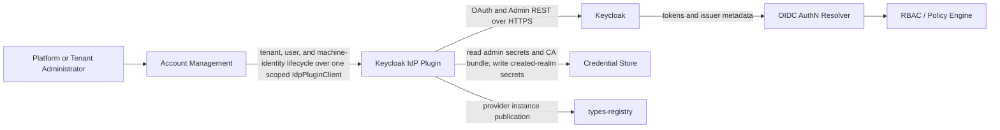

Created:  2026-08-17 by Virtuozzo International GmbH
Updated:  2026-08-17 by Virtuozzo International GmbH

# PRD — Keycloak IdP Plugin

<!-- toc -->

- [1. Overview](#1-overview)
  - [1.1 Purpose](#11-purpose)
  - [1.2 Background / Problem Statement](#12-background--problem-statement)
  - [1.3 Goals (Business Outcomes)](#13-goals-business-outcomes)
  - [1.4 Glossary](#14-glossary)
- [2. Actors](#2-actors)
  - [2.1 Human Actors](#21-human-actors)
  - [2.2 System Actors](#22-system-actors)
- [3. Operational Concept & Environment](#3-operational-concept--environment)
  - [3.1 Gear-Specific Environment Constraints](#31-gear-specific-environment-constraints)
- [4. Scope](#4-scope)
  - [4.1 In Scope](#41-in-scope)
  - [4.2 Out of Scope](#42-out-of-scope)
- [5. Functional Requirements](#5-functional-requirements)
  - [5.1 Plugin Availability and Selection](#51-plugin-availability-and-selection)
  - [5.2 Tenant Lifecycle](#52-tenant-lifecycle)
  - [5.3 User Lifecycle](#53-user-lifecycle)
  - [5.4 Service-Account Lifecycle](#54-service-account-lifecycle)
  - [5.5 Provider Administration and Operations](#55-provider-administration-and-operations)
- [6. Non-Functional Requirements](#6-non-functional-requirements)
  - [6.1 Gear-Specific NFRs](#61-gear-specific-nfrs)
  - [6.2 NFR Exclusions](#62-nfr-exclusions)
- [7. Public Library Interfaces](#7-public-library-interfaces)
  - [7.1 Public API Surface](#71-public-api-surface)
  - [7.2 External Integration Contracts](#72-external-integration-contracts)
- [8. Use Cases](#8-use-cases)
- [9. Acceptance Criteria](#9-acceptance-criteria)
  - [V1 Acceptance](#v1-acceptance)
  - [P2 Promotion Acceptance](#p2-promotion-acceptance)
- [10. Dependencies](#10-dependencies)
- [11. Assumptions](#11-assumptions)
- [12. Risks](#12-risks)
- [13. Open Questions](#13-open-questions)
- [14. Traceability](#14-traceability)

<!-- /toc -->

## 1. Overview

### 1.1 Purpose

The Keycloak IdP Plugin (crate `cf-gears-keycloak-idp-plugin`) is a provider plugin for Account Management. It translates tenant and user lifecycle requests into administrative operations against Keycloak, and additionally provides tenant-scoped machine-identity (service-account) lifecycle through the service-account half of `IdpPluginClient` (§5.4). The plugin gives deployments a production provider while keeping Account Management independent of provider-specific behavior.

The plugin runs as a Gear in the host process. Account Management remains the public control-plane boundary. The plugin exposes no public REST API and does not authenticate requests, issue tokens, validate tokens, or make authorization decisions. It administers Keycloak directly over HTTPS using OAuth2 `client_credentials` administrator clients, with secret custody split between environment-expanded configuration and the platform Credential Store.

In this revision, user provisioning, deprovisioning, and querying are supported; **user profile update is not implemented** and returns `UnsupportedOperation` (p2).

### 1.2 Background / Problem Statement

Account Management defines stable provider contracts for tenant and user identity lifecycle operations. A deployment still needs a provider that can apply those requests to its selected identity system without placing Keycloak-specific concepts in Account Management.

An identity-management platform also needs tenant isolation, clear realm ownership, and safe external-mutation handling. Three realm strategies are supported: `shared` (the default — tenants share an operator-provisioned realm, and a child tenant inherits its parent's realm), `adopted` (an existing empty operator-owned realm is bound to one tenant without ownership transfer), and `created` (the plugin creates and lifecycle-manages a dedicated realm per tenant). Machine-identity lifecycle is provided through the same Account Management provider contract as tenants and users, on a resource type (`gts.cf.core.am.service_account.v1~`) deliberately distinct from the user type — so a grant over users never confers machine-credential minting, and secret custody stays with the caller rather than with either Account Management or this plugin.

The Keycloak IdP Plugin solves this gap for Keycloak. It owns the provider-facing lifecycle behavior while preserving the boundaries of Account Management, the OIDC authentication resolver, Keycloak, the Credential Store, and the platform Policy Engine.

### 1.3 Goals (Business Outcomes)

- Pass 100% of the Account Management `IdpPluginClient` contract suite for the supported operations of every v1 release.
- Produce zero successful cross-tenant reads or mutations across the automated negative-isolation suite.
- Produce expected SDK outcomes for 100% of failure-injection cases, with zero ambiguous tenant-provisioning outcomes classified as clean failures and zero pre-mutation failures classified as ambiguous.
- Expose zero administrator secrets, user passwords, or service-account secrets across automated log, metric, audit, and debug-output scans.
- Qualify every plugin release against the supported Keycloak 26.x releases before publication.
- Meet the v1 lifecycle latency budgets in §6.1 on the release qualification profile.

### 1.4 Glossary

| Term | Definition |
|------|------------|
| Account Management (AM) | The system gear that owns public tenant and user operations and delegates provider-specific identity work. |
| IdP | Identity provider; Keycloak is the provider targeted by this plugin. |
| Realm | A Keycloak isolation and administration boundary containing identities and related configuration. |
| Shared realm | An operator-owned realm that contains more than one tenant. The default binding; child tenants inherit their parent's realm. |
| Adopted realm | An existing operator-owned realm bound to a single tenant without transferring realm ownership to the plugin. |
| Created realm | A realm created and lifecycle-managed by the plugin, marked with a plugin ownership attribute. Child tenants get the generated name `realm-{tenant_id}`; a root-target created realm is operator-named. |
| Tenant group | The plugin-owned Keycloak group (under `/tenants` by default) that forms a tenant's identity boundary inside a realm. |
| Bootstrap admin | The operator-provisioned confidential client (default `keycloak-idp-plugin-bootstrap` in `master`) the plugin uses for realm-level administration. |
| Realm admin | The per-realm confidential client (default `keycloak-idp-plugin-realm-admin`) used for tenant and user administration inside a bound realm. |
| Service account | A tenant-owned machine identity: a confidential OAuth `client_credentials` client named `svc-{tenant_id}-{name}`. |
| Ambiguous outcome | A failed or lost response where an external mutation might have completed and reconciliation is required before retry; stage-attributed with an `ambig:` token. |
| Credential Store | The platform secret-storage gear (OpenBao-backed) holding adopted/created realm-admin secrets and the optional TLS CA bundle. |
| OIDC AuthN Resolver Plugin | The separate runtime component that validates incoming OIDC tokens offline; v1 does not require it to check per-identity revocation state. |

## 2. Actors

### 2.1 Human Actors

#### Platform Operator

**ID**: `cpt-cf-keycloak-idp-plugin-actor-platform-operator`

- **Role**: Configures and operates the plugin, Keycloak administration clients and secrets, realm ownership and bootstrap, and provider dependencies.
- **Needs**: Predictable startup, least-privilege administration, safe reconciliation, and actionable operational signals.

#### Tenant Administrator

**ID**: `cpt-cf-keycloak-idp-plugin-actor-tenant-admin`

- **Role**: Manages tenant users through Account Management.
- **Needs**: Identity lifecycle operations that remain inside the authorized tenant boundary.

### 2.2 System Actors

#### Account Management

**ID**: `cpt-cf-keycloak-idp-plugin-actor-account-management`

- **Role**: Authorizes and orchestrates identity-lifecycle requests, selects the active provider through the types-registry catalogue and scoped ClientHub resolution, supplies resolved tenant context and replayed provider metadata, and delegates provider-specific work.

#### Service-Account Consumer

**ID**: `cpt-cf-keycloak-idp-plugin-actor-service-account-consumer`

- **Role**: The owner of the machine-identity product, which resolves the provider through ClientHub and delegates to this plugin as its registered adapter. Account Management fills this role today: it exposes both `/tenants/{tenant_id}/service-accounts` and the corresponding methods on its global `AccountManagementClient`, gates each verb on its own permission (`create` / `list` / `rotate_secret` / `revoke`) against the service-account resource type, and resolves the machine-identity methods on the same scoped `IdpPluginClient` it already uses for tenants and users. The actor is kept distinct from `cpt-cf-keycloak-idp-plugin-actor-account-management` because the authorization surface differs — a separate resource type and permission set — not because a separate system is involved. The plugin treats the forwarded security context as audit evidence only.

#### Keycloak

**ID**: `cpt-cf-keycloak-idp-plugin-actor-keycloak`

- **Role**: Stores and administers identity boundaries, human and machine identities, sessions, and provider credentials. Administered directly by the plugin over HTTPS.

#### Credential Store

**ID**: `cpt-cf-keycloak-idp-plugin-actor-credstore`

- **Role**: Protects adopted/created realm-administrator secrets and the optional TLS CA bundle. The plugin reads these secrets itself under a stable plugin-owned system actor authorized through ordinary RBAC, and writes the realm-admin secret for realms it creates.

#### OIDC AuthN Resolver Plugin

**ID**: `cpt-cf-keycloak-idp-plugin-actor-authn-resolver`

- **Role**: Validates issued tokens offline before producing an authenticated security context, consuming the `tenant_id`/`user_type` claims projected by the realm's protocol mappers. In v1, it does not manage sessions or check per-identity revocation state.

## 3. Operational Concept & Environment

The plugin follows the repository-wide architecture and security baselines in [Architecture Manifest](../../../../../../docs/ARCHITECTURE_MANIFEST.md) and [Security Guidelines](../../../../../../guidelines/SECURITY.md). Its parent product contract is [Account Management PRD](../../../docs/PRD.md).

The plugin adds a provider-specific boundary beneath Account Management. It does not change the platform-owned authentication, authorization, REST, or tenant-resolution paths.

### 3.1 Gear-Specific Environment Constraints

- The deployment must provide a reachable Keycloak administration surface and the bootstrap admin client credentials. When the plugin is enabled, module initialization pre-warms the bootstrap admin token with a bounded retry budget and fails host initialization if the budget is exhausted; deployments that must start without Keycloak disable the plugin (`enabled: false`).
- Operator realm bootstrap must provision the authentication profile of shared and adopted realms: required clients, client scopes, the protocol mappers that project the `tenant_id` and `user_type` claims, signing/session/token policy, and the realm-admin client with its secret.
- Account Management must provide the tenant context and replayed provider-owned metadata required to route existing-tenant operations.
- The Credential Store must be available for operations that resolve adopted/created realm-admin secrets, for created-realm provisioning and teardown, and at initialization when a TLS CA bundle reference is configured.
- The deployment must select one unambiguous active provider. Account Management's `idp.vendor` defaults to `cf`, which selects the built-in static echo plugin — it **MUST** be explicitly set to this plugin's configured vendor (default `keycloak`); otherwise Account Management selects another provider or, with `idp.required = false`, silently falls back to the no-op provider without any error from this plugin. Changing the provider while tenant metadata exists requires an explicit operator migration.

## 4. Scope

### 4.1 In Scope

- Selectable Keycloak provider registration for Account Management (types-registry catalogue instance plus scoped ClientHub client).
- Tenant binding to shared (default, inherited by child tenants), adopted (single-tenant, operator-owned), and created (plugin-owned, per-tenant) realms.
- Tenant identity-boundary creation, binding, and cleanup, including created-realm lifecycle and Credential Store custody of created-realm admin secrets.
- Tenant-scoped user creation, deletion, provider-session revocation, listing, filtering, and cursor pagination.
- Two-tier administrator credential handling (bootstrap admin, per-realm admin) with rotation convergence via reactive re-authentication, without process restart.
- Tenant-scoped service-account creation, secret rotation, revocation, listing, and purge-on-tenant-deprovision through the service-account half of `IdpPluginClient`.
- Deterministic failure classification, retry safety, and stage-attributed ambiguous-outcome reconciliation signals.
- Privacy-conscious outcome evidence, bounded-cardinality metrics, and structured audit events (development stand-in pending the platform audit sink).

### 4.2 Out of Scope

The user-update, realm-profile-verification, and provider-version-gate bullets below are out of v1 scope but retained as p2 requirements. All other bullets are product-level exclusions.

- Starting, deploying, upgrading, backing up, or scaling Keycloak.
- Running code inside Keycloak or packaging Keycloak server extensions.
- Issuing access or refresh tokens; Keycloak owns token issuance.
- Validating incoming JWTs; the OIDC AuthN Resolver Plugin owns validation.
- Making authorization decisions; RBAC and the Policy Engine own authorization.
- Exposing public REST endpoints; Account Management and other owning gears expose public APIs.
- User profile updates through `IdpPluginClient::update_user`; the current implementation returns `UnsupportedOperation` (p2).
- Runtime verification of the operator-provisioned realm authentication profile; operator realm bootstrap owns the profile (verification is p2).
- A runtime Keycloak version gate; release qualification owns the compatibility matrix (a runtime gate is p2).
- Moving a user between tenants or changing a user's tenant binding through any operation.
- Cross-realm browser SSO between shared, adopted, and created realms unless a separate federation product establishes it.
- Persisting a local user directory or a local copy of Keycloak credentials beyond the in-memory administrator token cache.
- Real-time or per-identity rejection of already-issued JWTs; v1 relies on provider-session revocation and access-token expiry within 15 minutes.
- Managing external identity-provider federation, login themes, or end-user self-service portals.
- Fine-grained resource authorization, tenant hierarchy policy, or Account Management data ownership.

## 5. Functional Requirements

> **Testing strategy**: All requirements are verified through automated unit, contract, integration, and end-to-end tests unless a requirement states another method.

### 5.1 Plugin Availability and Selection

#### Provider Instance Publication

- [ ] `p1` - **ID**: `cpt-cf-keycloak-idp-plugin-fr-provider-publication`

The plugin **MUST** be selectable by Account Management without requiring Account Management or its consumers to depend on the plugin implementation. It **MUST** publish a `PluginV1<IdpPluginSpecV1>` instance (id `cf.builtin.keycloak_idp.plugin.v1`) to the types-registry carrying its configured vendor (default `keycloak`) and priority (default 50), and register the scoped `IdpPluginClient` under that instance id. The published instance identifier **MUST** be stable for the lifetime of tenant metadata produced by that instance. On restart, re-registration **MUST** accept an existing catalogue entry only when the stored spec matches the current serialization; a mismatch **MUST** fail initialization rather than silently drift.

- **Rationale**: Provider-neutral selection permits replacement without changing consumers, while a stable instance identity and drift detection prevent existing tenant metadata from being rebound silently.
- **Actors**: `cpt-cf-keycloak-idp-plugin-actor-account-management`

#### Initialization and Operation-Based Readiness

- [ ] `p1` - **ID**: `cpt-cf-keycloak-idp-plugin-fr-readiness`

Module initialization **MUST** validate static configuration fail-fast (unknown keys rejected, secret-reference template validated, service-account section validated) and **MUST** pre-warm the bootstrap admin token with a bounded, configurable retry budget (default 5 attempts × 3 s backoff). Transient causes (provider 5xx/429, transport, timeout, Credential Store readiness) **MUST** be retried within the budget; permanent causes (non-429 4xx, malformed configuration) **MUST** fail on the first attempt. Budget exhaustion **MUST** fail initialization with the attempt count in the error. A disabled plugin (`enabled: false`) **MUST** skip initialization and register nothing.

After successful initialization, readiness **MUST** be operation-based: tenant sagas **MUST** begin with a provider health probe, dependency loss **MUST** block only the operations that require that dependency, and a later operation **MUST** retry dependency checks so recovery does not require process restart.

- **Rationale**: Failing initialization on an unusable provider surfaces deployment-ordering problems immediately, while per-operation probes and reactive re-authentication keep recovery restart-free afterward.
- **Actors**: `cpt-cf-keycloak-idp-plugin-actor-account-management`, `cpt-cf-keycloak-idp-plugin-actor-platform-operator`, `cpt-cf-keycloak-idp-plugin-actor-keycloak`, `cpt-cf-keycloak-idp-plugin-actor-credstore`

### 5.2 Tenant Lifecycle

#### Explicit Realm Binding

- [ ] `p1` - **ID**: `cpt-cf-keycloak-idp-plugin-fr-tenant-realm-binding`

Provisioning intent arrives through the `IdpProvisionTenantRequest.metadata` value forwarded from `TenantCreateRequest.provisioning_metadata` and **MUST** be parsed fail-closed: unknown keys and unknown modes **MUST** be rejected without provider mutation. Absent `mode` **MUST** default to `shared`. The effective realm **MUST** be resolved per mode: root provisioning requires an explicit `realm_name`; a `shared` child tenant inherits its parent's realm from replayed parent metadata (an explicit `realm_name` is ignored, and a parent without metadata is rejected); `created` generates `realm-{tenant_id}` (supplying `realm_name` is rejected); `adopted` requires an explicit `realm_name`. An `admin_user_id` binding request **MUST** be accepted only in `shared` mode. The effective realm name **MUST** satisfy the identifier shape `[A-Za-z0-9_-]{1,200}`.

- **Rationale**: Explicit fail-closed intent prevents the plugin from inferring a realm or accepting contradictory instructions, while parent inheritance keeps child-tenant creation free of caller-supplied routing.
- **Actors**: `cpt-cf-keycloak-idp-plugin-actor-account-management`, `cpt-cf-keycloak-idp-plugin-actor-platform-operator`

#### Shared Realm Admissibility

- [ ] `p1` - **ID**: `cpt-cf-keycloak-idp-plugin-fr-shared-realm-admissibility`

The target shared realm **MUST** already exist; the plugin verifies existence with the bootstrap admin before any mutation. A failed existence check performs no mutation. A provider 4xx **MUST** be reported as a clean failure and a 403 as unsupported; a 5xx, transport, or timeout failure on the check **MUST** also be reported as a clean failure, because the check is a read: its answer is unknown but no provider state can have been retained, so retry is harmless and no reconciliation is owed. The plugin **MUST NOT** create, repair, or reconfigure a shared realm.

- **Rationale**: The plugin must not claim an unknown realm or mutate operator-owned realm configuration.
- **Actors**: `cpt-cf-keycloak-idp-plugin-actor-account-management`, `cpt-cf-keycloak-idp-plugin-actor-platform-operator`

#### Adopted Realm Admissibility

- [ ] `p1` - **ID**: `cpt-cf-keycloak-idp-plugin-fr-adopted-realm-admissibility`

An `adopted` target realm **MUST** already exist and **MUST** contain no existing tenant boundary (no subgroups under the configured tenant-group root). The realm-admin secret **MUST** be operator-provisioned in the Credential Store under the templated reference before adoption; the plugin **MUST NOT** write it. A rejected precondition **MUST** produce a no-side-effect outcome. Realm ownership stays with the operator; the plugin never deletes an adopted realm.

- **Rationale**: Explicit admissibility rules prevent the plugin from claiming unrelated resources or manufacturing credentials for realms it does not own.
- **Actors**: `cpt-cf-keycloak-idp-plugin-actor-account-management`, `cpt-cf-keycloak-idp-plugin-actor-platform-operator`, `cpt-cf-keycloak-idp-plugin-actor-credstore`

#### Created Realm Admissibility

- [ ] `p1` - **ID**: `cpt-cf-keycloak-idp-plugin-fr-created-realm-admissibility`

In `created` mode the plugin **MUST** probe the target realm name first — generated as `realm-{tenant_id}` for a child tenant, operator-supplied for a root target: an absent realm is created with the plugin ownership marker (`cf.provisioning.tenant_id = {tenant_id}`); a realm already marked for the same tenant **MUST** be adopted idempotently (provisioning replay); a realm owned by another tenant or lacking the marker **MUST** be rejected without mutation. Operator `realm_defaults` pass-through **MUST** be restricted to a fail-closed allowlist (`displayNameHtml`, `defaultLocale`, `supportedLocales`, `internationalizationEnabled`); any other key fails before provider access. A create attempt whose response is lost **MUST** reconcile by re-probing before classifying the outcome: a definitive 404 proves no realm was retained and **MUST** yield `CleanFailure`, while a failed or inconclusive re-probe **MUST** preserve the staged `Ambiguous` outcome.

- **Rationale**: The plugin must not overwrite or assume ownership of an existing realm, and replayed provisioning must converge instead of failing or duplicating.
- **Actors**: `cpt-cf-keycloak-idp-plugin-actor-account-management`, `cpt-cf-keycloak-idp-plugin-actor-platform-operator`

#### Tenant Identity Boundary Provisioning

- [ ] `p1` - **ID**: `cpt-cf-keycloak-idp-plugin-fr-tenant-provision`

The plugin **MUST** establish a stable, isolated provider-side identity boundary for each successfully provisioned tenant: a per-tenant group named `{tenant_id}` under the configured group root (default `/tenants`), created idempotently (an existing same-named group is reused). In `created` mode the plugin **MUST** additionally create the realm, create the realm-admin client, grant it exactly the required `realm-management` roles, and store the generated client secret in the Credential Store before reporting success. In `shared` mode with an operator-declared `admin_user_id`, the plugin **MUST** bind that user's `tenant_id`/`user_type` attributes idempotently and **MUST** reject a binding that would overwrite a different tenant's binding or a multi-valued attribute. The reported outcome **MUST** reflect only completed provider work.

- **Rationale**: Every identity operation needs a stable and isolated provider-side tenant boundary with unambiguous ownership.
- **Actors**: `cpt-cf-keycloak-idp-plugin-actor-account-management`, `cpt-cf-keycloak-idp-plugin-actor-keycloak`, `cpt-cf-keycloak-idp-plugin-actor-credstore`

#### Realm Authentication Profile

- [ ] `p2` - **ID**: `cpt-cf-keycloak-idp-plugin-fr-realm-authentication-profile`

Operator realm bootstrap owns the platform authentication profile of shared and adopted realms: trusted discoverable issuer, platform-required clients and scopes, the `tenant_id` and `user_type` protocol mappers, compatible signing and session policy, and the applicable login and password controls. The v1 plugin assumes this profile rather than verifying it. A read-only runtime profile verifier that fails tenant binding on a profile mismatch is a p2 extension.

- **Rationale**: A realm that stores users but cannot issue platform-accepted tokens is not a usable identity boundary; today that guarantee is an operator obligation, not a plugin check.
- **Actors**: `cpt-cf-keycloak-idp-plugin-actor-platform-operator`, `cpt-cf-keycloak-idp-plugin-actor-keycloak`

#### Provider Metadata Continuity

- [ ] `p1` - **ID**: `cpt-cf-keycloak-idp-plugin-fr-provider-metadata`

The plugin **MUST** return versioned, provider-owned tenant metadata after provisioning (`version = "v1"`, realm name, realm binding, tenant group id, optional admin-secret reference, admin client id) and **MUST** use replayed metadata as the authoritative routing context for later tenant and user operations. Decoding **MUST** fail closed without provider access on a missing version, an unsupported version, or a malformed shape, and the failure class **MUST** be observable (decode-failure metric with the observed version label). The metadata **MUST NOT** contain administrator secrets, tokens, passwords, or user profile values — the Credential Store reference name is the only secret-related content. Every supported plugin upgrade **MUST** read metadata written by all versions in its declared compatibility window, including metadata needed to deprovision an existing tenant. Changing the selected provider instance while such metadata exists is unsupported until an operator-approved migration rewrites or retires every affected binding.

- **Rationale**: Account Management remains an opaque metadata proxy while the plugin retains fail-closed interpretation authority.
- **Actors**: `cpt-cf-keycloak-idp-plugin-actor-account-management`, `cpt-cf-keycloak-idp-plugin-actor-platform-operator`

#### Ownership-Preserving Tenant Deprovisioning

- [ ] `p1` - **ID**: `cpt-cf-keycloak-idp-plugin-fr-tenant-deprovision`

During hard deprovisioning the plugin **MUST** remove the tenant's provider-owned resources in a safe order: the service-account purge barrier of `cpt-cf-keycloak-idp-plugin-fr-tenant-service-account-cleanup` first, then the tenant group. The ordering is load-bearing rather than cosmetic: the purge enumerates the tenant's owned clients, so deleting the group first would remove the scope the enumeration relies on and could leave live `client_credentials` credentials behind their tenant. For `created` bindings only, when no other tenant group remains, the plugin **MUST** then delete the plugin-owned realm and its Credential Store secret. It **MUST NOT** delete operator-owned shared or adopted realms, and **MUST NOT** delete resources belonging to another tenant. Missing metadata and already-absent resources **MUST** be success-equivalent.

- **Rationale**: Cleanup must remove retired tenant access — including machine credentials once those exist — without destroying operator-owned or other-tenant resources.
- **Actors**: `cpt-cf-keycloak-idp-plugin-actor-account-management`, `cpt-cf-keycloak-idp-plugin-actor-platform-operator`

#### Service-Account Cleanup Ordering

- [ ] `p1` - **ID**: `cpt-cf-keycloak-idp-plugin-fr-tenant-service-account-cleanup`

Tenant deprovisioning **MUST** delete every service-account client owned by the retiring tenant (identified by the `svc-{tenant_id}-` prefix and the ownership marker) before removing the tenant identity boundary. A purge failure **MUST** abort the deprovisioning saga with a retryable or terminal classification — it **MUST NOT** be reported as success-equivalent — so that no live machine credential survives its tenant.

- **Rationale**: No live machine credential can survive its tenant, and skipping the barrier on error would leak credentials past tenant retirement.
- **Actors**: `cpt-cf-keycloak-idp-plugin-actor-account-management`, `cpt-cf-keycloak-idp-plugin-actor-service-account-consumer`

#### Tenant User Access Termination

- [ ] `p1` - **ID**: `cpt-cf-keycloak-idp-plugin-fr-tenant-user-access-termination`

Account Management does not invoke this plugin for tenant suspension or soft deletion, so those transitions **MUST NOT** be presented as plugin-enforced access termination. Human identities are removed through per-user `deprovision_user` calls issued by Account Management's hard-delete pipeline before the tenant boundary is retired; tenant deprovisioning itself removes the boundary (group, service accounts, and — for created bindings — the realm). Failure classification for the deprovisioning saga follows `cpt-cf-keycloak-idp-plugin-fr-tenant-failure-contract`. An access JWT issued before hard deprovisioning can remain valid until its `exp`, bounded per `cpt-cf-keycloak-idp-plugin-fr-offline-token-lifetime`.

- **Rationale**: This contract matches Account Management's hard-deletion pipeline and the OIDC resolver's offline JWT model without promising an unavailable suspension or real-time revocation path.
- **Actors**: `cpt-cf-keycloak-idp-plugin-actor-account-management`, `cpt-cf-keycloak-idp-plugin-actor-keycloak`, `cpt-cf-keycloak-idp-plugin-actor-platform-operator`

#### Tenant Lifecycle Failure Contract

- [ ] `p1` - **ID**: `cpt-cf-keycloak-idp-plugin-fr-tenant-failure-contract`

The plugin **MUST** distinguish invalid pre-mutation requests (`InvalidInput` with a field reference), clean failures proven to retain no provider state (`CleanFailure`, including permanent provider 4xx, pre-saga failures, every failure — 5xx, transport loss, or timeout included — occurring before the saga attempts its first provider mutation, and a failed realm create followed by a definitive absent re-probe), ambiguous provisioning outcomes (`Ambiguous`, stage-attributed with an `ambig:` token, covering provider 5xx, transport loss, and timeout once a mutation has been attempted and retained state cannot be ruled out, including an unsuccessful realm-create re-probe and the Credential-Store-write-after-Keycloak-success window), unsupported operations, retryable deprovisioning failures, terminal deprovisioning failures, and already-absent resources (`NotFound`, success-equivalent). It **MUST NOT** invite blind retry after an ambiguous result.

- **Rationale**: External administration can fail after side effects, so callers need deterministic recovery behavior.
- **Actors**: `cpt-cf-keycloak-idp-plugin-actor-account-management`, `cpt-cf-keycloak-idp-plugin-actor-platform-operator`

### 5.3 User Lifecycle

#### Tenant-Scoped User Provisioning

- [ ] `p1` - **ID**: `cpt-cf-keycloak-idp-plugin-fr-user-provision`

The plugin **MUST** create a user inside the resolved tenant identity boundary: the created representation carries the immutable `tenant_id` attribute and `user_type = "user"`, the configured required actions (default `VERIFY_EMAIL`, plus `UPDATE_PASSWORD` for temporary initial passwords), a coupled `emailVerified` derivation, and the optional initial password embedded in the create request; the user is then joined to the tenant group. If the group join fails after creation, the plugin **MUST** attempt best-effort orphan compensation (delete the created identity), report the compensation outcome on a dedicated metric, and return the original failure. A provider uniqueness conflict **MUST** be returned as `DuplicateUser` with the conflicting field refined from provider evidence where possible (`Username`, `Email`, or `UsernameOrEmail`). On success the plugin returns the provider-issued user id together with the submitted profile fields; it does not read the created representation back, so provider-side normalization is not reflected.

- **Rationale**: Account Management needs a provider-neutral way to create identities while Keycloak remains the identity source of truth and half-created identities do not linger unbound.
- **Actors**: `cpt-cf-keycloak-idp-plugin-actor-tenant-admin`, `cpt-cf-keycloak-idp-plugin-actor-account-management`

#### Tenant-Scoped User Update

- [ ] `p2` - **ID**: `cpt-cf-keycloak-idp-plugin-fr-user-update`

User profile update is not implemented in this revision: `IdpPluginClient::update_user` returns `UnsupportedOperation`. When implemented, partial updates to `username`, `email`, `display_name`, `first_name`, `last_name`, and `password` **MUST** apply within the existing tenant binding, omitted fields **MUST** remain unchanged, nullable profile fields **MUST** support clearing, and the user identifier and tenant binding **MUST** remain immutable.

- **Rationale**: A production provider eventually needs a complete administrative user lifecycle; until then callers receive a deterministic unsupported outcome rather than partial behavior.
- **Actors**: `cpt-cf-keycloak-idp-plugin-actor-tenant-admin`, `cpt-cf-keycloak-idp-plugin-actor-account-management`

#### User Update Outcome Classification

- [ ] `p2` - **ID**: `cpt-cf-keycloak-idp-plugin-fr-user-update-outcomes`

When user update is implemented, the plugin **MUST** distinguish an absent user, duplicate username or email, password-policy rejection, unsupported behavior, invalid input, and provider unavailability. A missing user **MUST NOT** be treated as a successful update.

- **Rationale**: Tenant administrators need actionable and stable outcomes for corrective action.
- **Actors**: `cpt-cf-keycloak-idp-plugin-actor-tenant-admin`, `cpt-cf-keycloak-idp-plugin-actor-account-management`

#### Tenant-Scoped User Deprovisioning

- [ ] `p1` - **ID**: `cpt-cf-keycloak-idp-plugin-fr-user-deprovision`

Before any mutation, user deprovisioning **MUST** verify that the target user's stored `tenant_id` attribute matches the resolved tenant; a mismatch **MUST** perform no mutation and **MUST** return success-equivalently without disclosing whether the identity exists (the cross-tenant deletion guard). It then revokes provider sessions (best-effort, configurable, default on) and deletes the identity. An already-absent provider identity (404/410) **MUST** produce a success-equivalent outcome. The plugin **MUST NOT** claim that it invalidates a previously issued access JWT; such a token can remain valid until its `exp`, bounded per `cpt-cf-keycloak-idp-plugin-fr-offline-token-lifetime`.

- **Rationale**: Deprovisioning blocks refresh and new provider sessions, stays idempotent, and cannot be used to delete another tenant's identity.
- **Actors**: `cpt-cf-keycloak-idp-plugin-actor-tenant-admin`, `cpt-cf-keycloak-idp-plugin-actor-account-management`

#### Tenant-Scoped User Query

- [ ] `p1` - **ID**: `cpt-cf-keycloak-idp-plugin-fr-user-query`

The plugin **MUST** list only users belonging to the resolved tenant group. The supported filter surface is `eq` (exact) and `contains` (case-insensitive) over `username`, `email`, `first_name`, `last_name`, and `display_name`, an `id` point filter, and `and`/`or` composition; unsupported filter shapes **MUST** return `UnsupportedOperation` before any provider call. Requested ordering **MUST** be honored: results are globally sorted on the effective `IdpListUsersRequest.order` over the orderable field set (`id`, `username`, `email`, `display_name`, `first_name`, `last_name`), with per-key direction applied and absent optional fields ordering ahead of any non-empty value under `ASC`. Account Management supplies the default `username ASC` and always appends an `id ASC` tiebreaker before dispatch, so a well-formed request arrives totally ordered; if `order` is nonetheless absent the plugin **MUST** apply `username ASC, id ASC` itself, and an order key naming a field outside the orderable set **MUST** return `UnsupportedOperation` before any provider call. Continuation **MUST** use a `CursorV1` token that pins the effective sort order, direction, last-emitted key, and a hash of the tenant, realm, and complete filter tree, so a cursor replayed with a different order, filter, or tenant context is rejected as invalid. One bounded exception applies: cursors minted by the immediately preceding release **MUST** remain accepted during a rolling-deploy grace window under that release's weaker validation scope (tenant, realm, and id-filter only — string filters are not revalidated) until in-flight pagination drains, after which the fallback is retired (mechanism in [DESIGN §3.6](./DESIGN.md#36-interactions--sequences)). Page size **MUST** be capped (default cap 200). The per-request membership scan **MUST** be bounded by a hard cap (10,000 members); exceeding the cap truncates the scan and emits a loud operational warning rather than failing or silently hiding members.

- **Rationale**: Tenant administration and downstream membership checks need stable, correctly ordered queries without cross-tenant disclosure, with explicit and observable capacity bounds.
- **Actors**: `cpt-cf-keycloak-idp-plugin-actor-tenant-admin`, `cpt-cf-keycloak-idp-plugin-actor-account-management`

#### Keycloak as User Source of Truth

- [ ] `p1` - **ID**: `cpt-cf-keycloak-idp-plugin-fr-user-source-of-truth`

The plugin **MUST** read and mutate user state in Keycloak and **MUST NOT** maintain a separate persistent user directory.

- **Rationale**: One identity source avoids stale projections and conflicting lifecycle outcomes.
- **Actors**: `cpt-cf-keycloak-idp-plugin-actor-account-management`, `cpt-cf-keycloak-idp-plugin-actor-keycloak`

### 5.4 Service-Account Lifecycle

> **Implemented and in v1 scope.** The contract these requirements implement ships in `account-management-sdk` as the service-account half of `IdpPluginClient`, and this plugin implements it: the four methods delegate to a Keycloak facade covering create, rotate, revoke, list, and the purge-on-tenant-deprovision cascade. The published trait remains authoritative wherever it differs from the behaviour specified below.

Service-account lifecycle is exposed through the same scoped `IdpPluginClient` registration this plugin already publishes — there is no second provider trait and no separate provider ClientHub entry. Account Management owns the REST and inter-gear `AccountManagementClient` product surfaces and authorizes each verb against the service-account resource type before delegating; the plugin performs no authorization of its own.

#### Complete Service-Account Operations

- [ ] `p1` - **ID**: `cpt-cf-keycloak-idp-plugin-fr-service-account-lifecycle`

The plugin **MUST** implement creation, secret rotation, revocation, and listing of tenant-scoped service accounts as confidential OAuth `client_credentials` clients in the configured service-account realm (default `platform` — the shared realm whose issuer tenants trust). Regular product consumers **MUST NOT** depend on this plugin directly; they use Account Management's machine-identity REST or `AccountManagementClient` surface, either of which resolves this plugin as the registered provider.

- **Rationale**: Machine identities authenticate through the same trusted issuer as human identities without adding machine-identity semantics to Account Management.
- **Actors**: `cpt-cf-keycloak-idp-plugin-actor-service-account-consumer`, `cpt-cf-keycloak-idp-plugin-actor-keycloak`

#### Service-Account Identity and State

- [ ] `p1` - **ID**: `cpt-cf-keycloak-idp-plugin-fr-service-account-state`

The final client id **MUST** be server-built as `svc-{tenant_id}-{name}`, where `name` is caller-chosen, non-empty, at most 40 characters, and restricted to lowercase alphanumerics and `-`. Successful creation **MUST** return a stable client id, the account's subject id (the service-account user UUID, usable for RBAC bindings), the OAuth token endpoint, and the client secret. A taken client id **MUST** be rejected as invalid input without side effects — including a half-created account left by an earlier ambiguous failure; recovery is revoke-then-create. After successful revocation, the account **MUST** disappear from active listings; reusing the same name **MUST** create a distinct provider identity with a new credential.

- **Realizes**: the service-account product's name-policy requirement, which that contract leaves to the registered adapter.
- **Rationale**: Stable identity and explicit lifecycle outcomes prevent duplicate or accidentally resurrected machine credentials, and a name collision must never hand out another consumer's live secret.
- **Actors**: `cpt-cf-keycloak-idp-plugin-actor-service-account-consumer`

#### Service-Account Tenant and Scope Safeguards

- [ ] `p1` - **ID**: `cpt-cf-keycloak-idp-plugin-fr-service-account-safeguards`

Every service account **MUST** be associated with exactly one tenant: the client carries the ownership marker (`cf.provisioning.tenant_id`), and its service-account user carries the `tenant_id` attribute and the configured service-account subject type, so issued tokens identify the account, its owning tenant, and the machine subject class through the realm's protocol mappers. Requested client scopes **MUST** be validated against the configured allowlist (empty allowlist = none attachable), and an allowlisted scope missing from the realm **MUST** fail cleanly with an operator-actionable message. A best-effort per-tenant quota (default 10) **MUST** bound creation; it is an operational guard, not a security boundary. Ownership **MUST** be enforced on every read and mutation: an account that is absent or owned by another tenant is reported as not found, without distinguishing the two.

- **Realizes**: the service-account product's scope-allowlist and per-tenant-quota requirements, both of which that contract leaves to the registered adapter.
- **Rationale**: Explicit tenant ownership and authentication compatibility prevent cross-tenant machine access and cross-tenant existence disclosure.
- **Actors**: `cpt-cf-keycloak-idp-plugin-actor-service-account-consumer`, `cpt-cf-keycloak-idp-plugin-actor-platform-operator`, `cpt-cf-keycloak-idp-plugin-actor-keycloak`

#### Secret Rotation and Token Consequences

- [ ] `p1` - **ID**: `cpt-cf-keycloak-idp-plugin-fr-service-account-rotation`

Successful rotation **MUST** preserve the account identity (client id, subject id) and tenant association, disclose the replacement credential in the rotation result, and prevent the old credential from obtaining new tokens. Rotation of an account whose managed attributes are incomplete or corrupt **MUST** be rejected as invalid input with revoke-and-recreate guidance rather than returning a credential for a partially repaired identity. Successful revocation **MUST** prevent new token issuance; revocation of an already-absent account is success-equivalent (`NotFound`). Tokens issued before rotation or revocation can remain valid until their configured expiry and **MUST NOT** exceed the platform maximum access-token lifetime.

- **Rationale**: The credential cutover contract must match offline JWT validation rather than promise real-time token revocation.
- **Actors**: `cpt-cf-keycloak-idp-plugin-actor-service-account-consumer`, `cpt-cf-keycloak-idp-plugin-actor-keycloak`

#### Service-Account Listing

- [ ] `p1` - **ID**: `cpt-cf-keycloak-idp-plugin-fr-service-account-list`

Listing **MUST** return only accounts owned by the requested tenant (prefix plus ownership-marker check enforced client-side over the provider's search results) and **MUST** omit credentials. The listing reports each account's client id, enabled state, and attached client scopes as reported by the provider (including realm-default scopes). Listing is unpaginated by decision of the owning contract (service-account PRD §4.2 places pagination out of scope); adding it would require an SPI change owned by the service-account gear.

- **Rationale**: A bounded query contract prevents cross-tenant disclosure; today's consumer population per tenant is small enough for unpaginated listing.
- **Actors**: `cpt-cf-keycloak-idp-plugin-actor-service-account-consumer`

#### Service-Account Mutation Safety

- [ ] `p1` - **ID**: `cpt-cf-keycloak-idp-plugin-fr-service-account-mutation-safety`

Repeating a creation with a taken name **MUST NOT** apply a second provider mutation or disclose another credential (it is rejected as invalid input). An uncertain creation, rotation, or revocation outcome **MUST** be reported as ambiguous with a stage token, **MUST NOT** contain a credential, and **MUST NOT** invite blind retry until the external outcome is resolved. A service-account user found already bound to a different tenant during creation **MUST** abort without overwriting (hijack guard).

- **Rationale**: Concurrency-safe outcomes prevent duplicate identities and credential resurrection.
- **Actors**: `cpt-cf-keycloak-idp-plugin-actor-service-account-consumer`, `cpt-cf-keycloak-idp-plugin-actor-platform-operator`

#### One-Time Secret Disclosure

- [ ] `p1` - **ID**: `cpt-cf-keycloak-idp-plugin-fr-service-account-secret-disclosure`

A service-account credential **MUST** be disclosed to consumers only in a successful creation or rotation result, carried in a redacted secret wrapper. The plugin **MUST NOT** persist, cache, log, or audit the plaintext credential; Keycloak holds the authoritative credential. Listing, reconciliation evidence, and failure results **MUST NOT** return it. The consumer owns durable custody (typically the Credential Store); a lost secret is recovered by explicit rotation, never by re-disclosure.

- **Rationale**: Limiting plaintext exposure reduces credential leakage risk.
- **Actors**: `cpt-cf-keycloak-idp-plugin-actor-service-account-consumer`

#### Service-Account Recovery

- [ ] `p1` - **ID**: `cpt-cf-keycloak-idp-plugin-fr-service-account-recovery`

After reconciliation confirms provider state, an absent identity **MUST** permit a new creation attempt. A valid identity with an undelivered credential **MUST** be recovered by explicitly authorized rotation. An incomplete identity (taken name, missing or corrupt managed attributes) **MUST** require revoke-then-create before another creation attempt. An unresolved ambiguous state **MUST** remain blocked for operator action.

- **Rationale**: Recovery must follow observed provider state without redisclosing or guessing a credential.
- **Actors**: `cpt-cf-keycloak-idp-plugin-actor-service-account-consumer`, `cpt-cf-keycloak-idp-plugin-actor-platform-operator`

#### Service-Account Failure Contract

- [ ] `p1` - **ID**: `cpt-cf-keycloak-idp-plugin-fr-service-account-failure-contract`

The plugin **MUST** classify every failed service-account call into the `IdpServiceAccountFailure` taxonomy: `InvalidInput` (bad name, disallowed scope, quota exceeded, taken client id — permanent, no vendor state retained by the call), `NotFound` (absent or foreign target; success-equivalent for revoke), `CleanFailure` (pre-mutation failure, retry harmless), and `Ambiguous` (transport uncertainty after a mutation may have landed — never reported as success, never containing a credential). The enum is `#[non_exhaustive]` and additionally carries `UnsupportedOperation`, which is what the default implementations return while this surface is unimplemented.

- **Rationale**: Credential mutation requires clear retry and recovery behavior with no invented variants.
- **Actors**: `cpt-cf-keycloak-idp-plugin-actor-service-account-consumer`, `cpt-cf-keycloak-idp-plugin-actor-platform-operator`

### 5.5 Provider Administration and Operations

#### Administrator Credentials

- [ ] `p1` - **ID**: `cpt-cf-keycloak-idp-plugin-fr-administrator-credentials`

The plugin **MUST** administer Keycloak through two confidential-client tiers with `client_credentials` grants: an operator-provisioned bootstrap admin (default `keycloak-idp-plugin-bootstrap` in `master`) for realm-level work, and a per-realm realm admin (default `keycloak-idp-plugin-realm-admin`) for tenant/user work. Realm-admin clients created by the plugin (created mode) **MUST** be granted exactly the least-privilege role set (`view-realm`, `view-clients`, `query-groups`, `manage-realm`, `manage-users`, `query-users`, `manage-clients`). Secrets **MUST** enter the process only through environment-expanded configuration (bootstrap, default shared realm) or the Credential Store (adopted/created realms). Operator secret rotation **MUST** converge without process restart. Administrator secrets and cached tokens **MUST NOT** appear in any log, metric, or debug output (mechanism in [DESIGN §3.6](./DESIGN.md#36-interactions--sequences)).

- **Rationale**: Provider administrator compromise can affect every identity in the authorized realm; tiered least privilege, typed secret custody, and reactive rotation bound that risk.
- **Actors**: `cpt-cf-keycloak-idp-plugin-actor-platform-operator`, `cpt-cf-keycloak-idp-plugin-actor-keycloak`, `cpt-cf-keycloak-idp-plugin-actor-credstore`

#### External Mutation Resilience

- [ ] `p1` - **ID**: `cpt-cf-keycloak-idp-plugin-fr-external-mutation-resilience`

Automatic retry **MUST** be bounded by a configurable policy, and a request whose outcome is unknown (transport loss) **MUST NOT** be replayed unless it is idempotent; in particular, administrative `POST`s are never replayed on transport failure (retry mechanics in [DESIGN §3.6](./DESIGN.md#36-interactions--sequences)). Tenant provisioning **MUST** preserve the SDK distinction between clean and ambiguous outcomes and **MUST** stop automatic retry after an ambiguous result. User operations **MUST** return only outcomes exposed by `IdpUserOperationFailure`; the plugin **MUST NOT** invent an ambiguity variant. Repeated user deprovisioning remains idempotent, and provider diagnostics **MUST** be redacted and truncated before leaving the plugin.

- **Rationale**: Unbounded or unsafe retry can duplicate resources, leak realms, or invalidate credentials.
- **Actors**: `cpt-cf-keycloak-idp-plugin-actor-platform-operator`, `cpt-cf-keycloak-idp-plugin-actor-keycloak`, `cpt-cf-keycloak-idp-plugin-actor-credstore`

#### Operator-Owned Reconciliation

- [ ] `p1` - **ID**: `cpt-cf-keycloak-idp-plugin-fr-operator-reconciliation`

For v1, ambiguous-state reconciliation **MUST** be an operator-owned workflow rather than a public mutation API. The plugin **MUST** provide sufficient non-secret evidence — the machine-parsable `ambig:{stage}` token (realm create, client create, role mapping, secret read, credential-store write, admin-user bind, service-account attribute set, scope attach, secret rotate, client delete, timeout), the realm, and redacted provider detail — to determine resource ownership and whether the mutation completed. The workflow **MUST** end in one audited outcome: compensated and safe to retry, accepted as complete, still blocked for further investigation, or escalated for controlled cleanup. Production enablement **MUST** include a reconciliation runbook keyed on the stage tokens.

- **Rationale**: Operators need a safe resolution path even where current contracts cannot automatically distinguish an orphan from an already-clean resource.
- **Actors**: `cpt-cf-keycloak-idp-plugin-actor-platform-operator`, `cpt-cf-keycloak-idp-plugin-actor-account-management`, `cpt-cf-keycloak-idp-plugin-actor-keycloak`, `cpt-cf-keycloak-idp-plugin-actor-credstore`

#### Offline Token Lifetime Alignment

- [ ] `p1` - **ID**: `cpt-cf-keycloak-idp-plugin-fr-offline-token-lifetime`

The operator's v1 realm authentication profile **MUST** limit access-token lifetime to 15 minutes. User deprovisioning revokes Keycloak sessions to block refresh and new session use. The plugin **MUST NOT** claim immediate rejection of an access JWT issued before deprovisioning. The OIDC AuthN Resolver can accept that token until `exp` when its signature and claims remain valid.

- **Rationale**: This bounded exposure matches the OIDC resolver's offline JWT validation contract and its explicit exclusion of session and revocation management.
- **Actors**: `cpt-cf-keycloak-idp-plugin-actor-account-management`, `cpt-cf-keycloak-idp-plugin-actor-authn-resolver`, `cpt-cf-keycloak-idp-plugin-actor-keycloak`

#### Audit Evidence

- [ ] `p1` - **ID**: `cpt-cf-keycloak-idp-plugin-fr-audit-metrics`

The plugin **MUST** return a classified, redacted outcome for every supported call and **MUST** emit structured audit events on the dedicated `keycloak_idp.events` tracing target for every mutating tenant and user lifecycle transition: `tenant.bound`, `realm.created`, `admin_user.bound`, `tenant.unbound`, `realm.removed`, `service_accounts.purged`, `user.provisioned`, and `user.deprovisioned`, each carrying the acting subject (id, classified type, raw type, tenant) and provider identifiers. `user.provisioned` additionally records the username as operational evidence; no event carries secrets, passwords, tokens, or raw provider bodies. These emitters are a development stand-in: Account Management and the platform audit owner **MUST** create and durably deliver the terminal audit outcome for each mutating plugin call before production enablement.

- **Rationale**: A single owner for each durable record prevents duplicate or missing audit events while preserving plugin-level diagnostic evidence.
- **Actors**: `cpt-cf-keycloak-idp-plugin-actor-account-management`, `cpt-cf-keycloak-idp-plugin-actor-platform-operator`

#### Operational Metrics

- [ ] `p1` - **ID**: `cpt-cf-keycloak-idp-plugin-fr-operational-metrics`

The plugin **MUST** emit bounded-cardinality operational metrics (`keycloak_idp_plugin_*`): operation duration histograms, a failure counter labeled by operation and stable failure variant, token/credential refresh counters split by tier so Credential Store and Keycloak failures are separately attributable, credential-store write outcomes, metadata decode failures, orphan-compensation outcomes, and a bound-realms gauge. Every metric label **MUST** be a closed set except two: the realm label, which **MUST** be subject to a configurable cardinality cap (default 500) after which it is dropped with an observable warning; and `version_observed` on the metadata-decode counter, which carries the observed version string uncapped. No metric **MUST** carry secrets or user profile values.

- **Rationale**: Bounded, stable-labeled metrics keep the operational surface alertable without cost or cardinality surprises.
- **Actors**: `cpt-cf-keycloak-idp-plugin-actor-platform-operator`, `cpt-cf-keycloak-idp-plugin-actor-credstore`

## 6. Non-Functional Requirements

Global reliability, security, and observability baselines come from the [Architecture Manifest](../../../../../../docs/ARCHITECTURE_MANIFEST.md), [Security Guidelines](../../../../../../guidelines/SECURITY.md), and [Account Management PRD](../../../docs/PRD.md). This section defines stricter plugin-specific targets.

### 6.1 Gear-Specific NFRs

#### Tenant Isolation Integrity

- [ ] `p1` - **ID**: `cpt-cf-keycloak-idp-plugin-nfr-tenant-isolation`

The plugin **MUST** prevent an operation resolved for one tenant from reading or mutating identities bound to another tenant: listing is scoped to the tenant group, user deletion is guarded by the stored `tenant_id` attribute, and realm/service-account mutations are guarded by ownership markers.

- **Threshold**: Zero successful cross-tenant operations across the automated negative-isolation suite.
- **Rationale**: Identity administration is a security boundary for every tenant.
- **Architecture Allocation**: See [DESIGN.md §4.1](./DESIGN.md#41-security-and-data-protection).

#### Secret Non-Disclosure

- [ ] `p1` - **ID**: `cpt-cf-keycloak-idp-plugin-nfr-secret-nondisclosure`

The plugin **MUST** prevent administrator tokens, administrator secrets, user passwords, and service-account secrets from appearing in logs, metrics, audit events, list responses, or debug output. Provider diagnostics **MUST** be redacted and size-bounded before leaving the plugin (mechanism in [DESIGN §4.1](./DESIGN.md#41-security-and-data-protection)).

- **Threshold**: Zero secret values detected by automated redaction tests and security scanning across all named output surfaces.
- **Rationale**: These credentials can grant user or machine access across a tenant or realm.
- **Architecture Allocation**: See [DESIGN.md §3.6](./DESIGN.md#36-interactions--sequences) and [§4.1](./DESIGN.md#41-security-and-data-protection).

#### Lifecycle Latency

- [ ] `p1` - **ID**: `cpt-cf-keycloak-idp-plugin-nfr-lifecycle-latency`

On the release qualification profile, shared-realm tenant provisioning **MUST** complete within 5 seconds at p95; created-realm provisioning within 10 seconds at p95. User creation, deprovisioning, and a full query page **MUST** each complete within 1 second at p95. The profile **MUST** use 20 concurrent operations, an operator-equivalent Keycloak 26.x node backed by PostgreSQL, at most 5 ms network round-trip time between the plugin and Keycloak, and up to 1,000 human identities, enabled or disabled, in one tenant group. The query run matrix (filter-selectivity mix and token-cache states) is defined in [DESIGN §4.2](./DESIGN.md#42-verification-architecture). Operational bounds enforced by the implementation and validated by the profile: per-request provider timeout, bounded retry policy, saga timeout, caller page size cap, and the membership-scan hard cap with loud truncation (values in [DESIGN §§2.2, 3.6](./DESIGN.md#22-constraints)).

- **Threshold**: Shared provisioning p95 ≤ 5 s; created provisioning p95 ≤ 10 s; each named user operation p95 ≤ 1 s; 20 concurrent operations; scan cap 10,000 members per tenant group with observable truncation.
- **Rationale**: A fixed population, topology, filter mix, and bound set make the linear-scan acceptance test reproducible.
- **Architecture Allocation**: See [DESIGN.md §1.2](./DESIGN.md#12-architecture-drivers), [§2.2](./DESIGN.md#22-constraints), and [§3.6](./DESIGN.md#36-interactions--sequences).

#### Deterministic Failure Classification

- [ ] `p1` - **ID**: `cpt-cf-keycloak-idp-plugin-nfr-failure-classification`

The plugin **MUST** classify every failed supported lifecycle call into an outcome exposed by the applicable SDK contract, through its closed internal error taxonomy and fixed translation tables. Tenant provisioning **MUST** preserve `Ambiguous` whenever retained external state cannot be ruled out — that is, whenever a provider 5xx, transport loss, or timeout strikes after a mutation has been attempted and reconciliation cannot prove absence, and for the post-Keycloak credential-store failure. The same causes arising before the first attempted mutation **MUST** be `CleanFailure`; so **MUST** a failed realm create whose follow-up probe definitively reports the realm absent. User operations **MUST** use the available `IdpUserOperationFailure` variants and rely on idempotent replay where that contract has no ambiguity variant. Every failure variant **MUST** carry a stable metric label.

- **Threshold**: 100% of automated failure-injection cases produce an expected SDK category; zero ambiguous tenant-provisioning cases are classified as clean failures, and zero failures injected before the saga's first mutation are classified as ambiguous.
- **Rationale**: Correct recovery depends on the difference between safe retry and reconciliation.
- **Architecture Allocation**: See [DESIGN.md §3.3](./DESIGN.md#33-api-contracts) and [§3.6](./DESIGN.md#36-interactions--sequences).

#### Audit Completeness

- [ ] `p1` - **ID**: `cpt-cf-keycloak-idp-plugin-nfr-audit-completeness`

The plugin **MUST** emit one structured event per mutating tenant/user lifecycle transition (including already-absent outcomes) and return classified evidence for every call. Account Management and the platform audit owner **MUST** turn that evidence into one durable terminal audit outcome per mutating call before production enablement; the plugin's tracing-based emitters are not a production substitute. Service-account mutations currently produce plugin audit evidence only for the tenant-deprovision purge; per-operation service-account audit is owned by the consuming platform module.

- **Threshold**: 100% correlation between mutating contract-test calls and one durable terminal audit outcome, excluding calls rejected before actor context exists.
- **Rationale**: Identity and credential mutations require traceable accountability with one unambiguous durable emitter.
- **Architecture Allocation**: See [DESIGN.md §3.6](./DESIGN.md#36-interactions--sequences) and [§4.3](./DESIGN.md#43-risks-and-enablement-gates).

#### Provider Compatibility

- [ ] `p1` - **ID**: `cpt-cf-keycloak-idp-plugin-nfr-provider-compatibility`

V1 **MUST** be qualified against Keycloak 26.x: every supported 26.x release in the release matrix passes the provider contract suite before plugin publication. The implementation performs no runtime provider-version check; a runtime operation-level version gate is a p2 extension. Expansion to another major version **MUST** require a versioned compatibility update and re-qualification.

- **Threshold**: Every supported Keycloak 26.x release in the release matrix passes the provider contract suite.
- **Rationale**: An explicit compatibility window gives operators predictable installation, upgrade, and rollback support.
- **Architecture Allocation**: See [DESIGN.md §4.3](./DESIGN.md#43-risks-and-enablement-gates).

#### Personal Data Minimization and Lifecycle

- [ ] `p1` - **ID**: `cpt-cf-keycloak-idp-plugin-nfr-personal-data-lifecycle`

The plugin **MUST** process only identity attributes required by its contracts and **MUST NOT** retain a separate persistent copy of user PII. Metrics **MUST** carry no profile values. Audit events use provider-issued identity references; the `user.provisioned` event additionally records the username as operational evidence, and no event carries email addresses, display names, passwords, or raw provider payloads. Keycloak user records remain governed by Account Management's soft-delete window and **MUST** be removed when hard deprovisioning is invoked. The plugin **MUST NOT** create a separate audit store; the platform audit sink **MUST** enforce a finite, operator-configured retention period documented before production enablement.

- **Threshold**: Zero profile values in metrics and debug output; audit events limited to provider references plus the username on `user.provisioned`; 100% of hard-deletion cases produce a classified identity-deletion outcome; production configuration contains a finite audit-retention period.
- **Rationale**: User identity administration processes personal data even though the plugin owns no local directory.
- **Architecture Allocation**: See [DESIGN.md §4.1](./DESIGN.md#41-security-and-data-protection).

#### Availability and Recovery

- [ ] `p1` - **ID**: `cpt-cf-keycloak-idp-plugin-nfr-availability-recovery`

When required dependencies meet their objectives, the plugin **MUST** support the parent Account Management target of 99.9% monthly availability for provider-dependent lifecycle operations. After successful initialization, each call **MUST** fail closed when its own critical dependency is unavailable while leaving operations with unaffected dependencies usable, and unambiguous operations **MUST** recover on a later call — including after credential rotation — without process restart, within the inherited 15-minute recovery objective. Initialization itself depends on the provider: the bootstrap pre-warm budget (≈37 s worst case by default) **MUST** be compatible with the deployment's ordering guarantees, or the plugin **MUST** be disabled for that deployment. Because the plugin owns no local identity database, a local recovery-point objective is not applicable. Ambiguous tenant provisioning **MUST** be reconciled before provisioning resumes for the affected tenant.

- **Threshold**: Dependency-failure tests prove capability-specific availability and fail-closed mutations after init; recovery tests restore unambiguous operations without restart and keep uncertain resources reconciliation-blocked; init-ordering tests prove the pre-warm budget and the disabled path.
- **Rationale**: Per-call errors alone do not define safe degraded operation or restoration, and the init-time provider dependency is an explicit deployment constraint.
- **Architecture Allocation**: See [DESIGN.md §2.2](./DESIGN.md#22-constraints), [§3.2](./DESIGN.md#32-component-model), and [§3.6](./DESIGN.md#36-interactions--sequences).

### 6.2 NFR Exclusions

| Quality category | Disposition | Product rationale or obligation |
|------------------|-------------|---------------------------------|
| Performance and capacity | Required here | V1 lifecycle latency and scan bounds are defined in §6.1. Service-account listing is unpaginated by the owning contract's decision. Owning gears carry public REST latency. |
| Reliability and availability | Required here | Failure classification, audit completeness, and availability recovery are defined in §6.1. |
| Security and privacy | Required here and inherited | Tenant isolation, secret protection, and PII minimization are defined here; platform controls come from the Security Guidelines. |
| Observability and operations | Required here | Releases must provide readiness, dependency-health, ambiguous-outcome, and audit signals plus operator alert guidance and a reconciliation runbook. |
| Deployment and upgrade | Partly required | Keycloak deployment is out of scope; plugin releases must document supported provider versions, metadata compatibility, the init pre-warm dependency, and rollback constraints. |
| Documentation and support | Required here | Production enablement requires configuration, least-privilege credentials, secret rotation, failure classification, reconciliation, and troubleshooting guidance. |
| UX, accessibility, and internationalization | Not applicable | The plugin exposes no end-user UI or human-language interface. Owning product surfaces carry these obligations. |
| Regulatory and geographic controls | Inherited | The plugin introduces no placement decision; platform security, audit, privacy, and deployment policies control residency and regulatory obligations. |
| Physical safety | Not applicable | This administrative software controls identities and has no physical actuation or safety-critical function. |
| Offline behavior | Not applicable | Supported lifecycle operations require live Account Management context and provider dependencies. |
| Public REST latency | Not applicable | The plugin exposes no public REST endpoint; owning gears carry public API SLOs. |
| JWT validation and token issuance | Not applicable | The OIDC AuthN Resolver validates incoming tokens, and Keycloak owns token and session availability. |
| Persistent database durability | Not applicable | The plugin owns no local identity database. |

## 7. Public Library Interfaces

### 7.1 Public API Surface

#### Identity Provider Plugin Contract

- [ ] `p1` - **ID**: `cpt-cf-keycloak-idp-plugin-interface-idp-plugin-client`

- **Type**: Rust SDK trait (`IdpPluginClient`)
- **Stability**: stable
- **Description**: Provides tenant provisioning, tenant deprovisioning, user provisioning, user deprovisioning, and user query behavior to Account Management. `update_user` is not implemented and returns `UnsupportedOperation` (p2).
- **Breaking Change Policy**: Incompatible request, result, or failure changes require a versioned contract and coordinated Account Management migration.

#### Service-Account Lifecycle Contract

- [ ] `p1` - **ID**: `cpt-cf-keycloak-idp-plugin-interface-service-account-client`

- **Type**: the service-account half of `IdpPluginClient` (`account-management-sdk`), served through the same scoped ClientHub registration as tenant and user lifecycle
- **Stability**: published and stable, and implemented by this plugin
- **Description**: Provides tenant-scoped creation, secret rotation, revocation, and listing of machine identities. Account Management owns the REST and inter-gear `AccountManagementClient` product surfaces plus the authorization gate; this plugin supplies the Keycloak translation.
- **Breaking Change Policy**: Incompatible behavior or data changes require a versioned contract and a consumer migration path.

#### Provider Instance Contract

- [ ] `p1` - **ID**: `cpt-cf-keycloak-idp-plugin-interface-provider-instance`

- **Type**: Selectable provider contract (`PluginV1<IdpPluginSpecV1>` catalogue instance `cf.builtin.keycloak_idp.plugin.v1`)
- **Stability**: stable
- **Description**: Makes the Keycloak provider selectable by Account Management through vendor/priority matching without exposing plugin implementation details to consumers.
- **Breaking Change Policy**: Provider identity and selection semantics remain backward-compatible within a major contract version.

### 7.2 External Integration Contracts

#### Account Management Contract

- [ ] `p1` - **ID**: `cpt-cf-keycloak-idp-plugin-contract-account-management`

- **Direction**: required from client
- **Protocol/Format**: Versioned Account Management provider contract
- **Compatibility**: The plugin follows Account Management's tenant and user request, result, failure, idempotency, tenant-context, and provider-metadata semantics.

#### Keycloak Administration Contract

- [ ] `p1` - **ID**: `cpt-cf-keycloak-idp-plugin-contract-keycloak-admin`

- **Direction**: required from external provider
- **Protocol/Format**: Keycloak Admin REST and OAuth token endpoints over HTTPS, authenticated with `client_credentials` confidential clients; optional operator CA bundle from the Credential Store
- **Compatibility**: V1 is qualified against Keycloak 26.x; another major version requires a versioned compatibility update and re-qualification. The implementation performs no runtime version check (p2).

#### Credential Store Contract

- [ ] `p1` - **ID**: `cpt-cf-keycloak-idp-plugin-contract-credstore`

- **Direction**: required from client (`CredStoreClientV1` via ClientHub)
- **Protocol/Format**: Platform secret-storage contract, invoked under the plugin's stable system actor
- **Compatibility**: The plugin reads adopted/created realm-admin secrets and the optional TLS CA bundle, and writes/deletes created-realm admin secrets under the templated reference (`keycloak-idp-realm-admin-{realm_name}-secret` by default). References remain stable across rotation; secret values never enter provider metadata, logs, or metrics.

## 8. Use Cases

#### Bind a Tenant to a Shared Realm

- [ ] `p1` - **ID**: `cpt-cf-keycloak-idp-plugin-usecase-bind-shared-tenant`

**Actor**: `cpt-cf-keycloak-idp-plugin-actor-account-management`

**Preconditions**:
- The shared realm exists and its authentication profile, admin clients, and secrets are operator-provisioned.
- Root bootstrap named the realm explicitly, or the child tenant's parent carries replayed metadata naming it.

**Main Flow**:
1. Account Management requests tenant provisioning with the resolved tenant identity (and, for child tenants, the parent context).
2. The plugin parses intent fail-closed, health-probes Keycloak, and verifies the realm exists.
3. The plugin ensures the per-tenant group idempotently and, when an admin user was declared, binds that user's tenant attributes with hijack protection.
4. The plugin returns the versioned metadata envelope required for later lifecycle operations.

**Postconditions**:
- The tenant has an isolated identity boundary (group) in the shared realm.
- Later tenant and user operations route through the returned metadata.

**Alternative Flows**:
- **Realm missing**: The plugin returns a clean failure without mutation.
- **Provider unreachable mid-saga**: A pre-saga probe failure is clean, and so is a 5xx or transport failure on the existence check itself — both precede any mutation, so retry is harmless and neither blocks on reconciliation. Only a failure after the tenant-group mutation is attempted is reported ambiguous.
- **Admin user already bound elsewhere**: The plugin returns a stage-attributed ambiguous outcome for reconciliation without overwriting the binding.

#### Adopt an Existing Tenant Realm

- [ ] `p1` - **ID**: `cpt-cf-keycloak-idp-plugin-usecase-adopt-tenant-realm`

**Actor**: `cpt-cf-keycloak-idp-plugin-actor-account-management`

**Preconditions**:
- The operator-owned realm exists, contains no tenant boundary under the group root, and has the required authentication configuration.
- The operator pre-provisioned the realm-admin secret in the Credential Store under the templated reference.
- Account Management supplies explicit `adopted` intent with the realm name.

**Main Flow**:
1. Account Management requests tenant provisioning with adopted-realm intent.
2. The plugin verifies realm existence and emptiness without changing realm ownership.
3. The plugin ensures the tenant group using the operator-provisioned Credential Store secret.
4. The plugin returns metadata carrying the secret reference and realm binding.

**Postconditions**:
- The tenant is the only tenant boundary in the adopted realm.
- The operator retains realm and administrator-credential ownership.

**Alternative Flows**:
- **Realm contains an existing tenant boundary**: The plugin rejects adoption without mutation (clean failure).
- **Secret reference missing in the Credential Store**: The affected operation fails without mutation and recovers once the operator provisions it.

#### Provision a Plugin-Owned Tenant Realm

- [ ] `p1` - **ID**: `cpt-cf-keycloak-idp-plugin-usecase-create-tenant-realm`

**Actor**: `cpt-cf-keycloak-idp-plugin-actor-account-management`

**Preconditions**:
- Account Management supplies valid `created` provisioning intent: without a realm name for a child tenant, or with an explicit realm name for a root target.
- The bootstrap admin has realm-creation authority.

**Main Flow**:
1. Account Management requests tenant provisioning with created-realm intent.
2. The plugin probes the target realm (`realm-{tenant_id}` for a child tenant, the operator-supplied name for a root target): absent → creates it with the ownership marker and allowlisted operator defaults; already ours → adopts idempotently.
3. The plugin creates the realm-admin client and grants it the least-privilege role set.
4. The plugin places the realm-admin secret in the Credential Store under the templated reference before reporting success, then ensures the tenant group under the new realm admin.
5. The plugin returns metadata carrying the realm binding and secret reference.

**Postconditions**:
- The tenant has a plugin-owned realm marked for it, with a least-privileged realm admin whose secret lives in the Credential Store.
- Metadata supports safe future cleanup.

**Alternative Flows**:
- **Existing foreign realm under the generated name**: The plugin rejects the request before claiming ownership (clean failure).
- **Uncertain provider or Credential Store mutation mid-saga**: The plugin returns a stage-attributed ambiguous outcome for the provisioning reaper.

#### Update a Tenant User

- [ ] `p2` - **ID**: `cpt-cf-keycloak-idp-plugin-usecase-update-user`

**Actor**: `cpt-cf-keycloak-idp-plugin-actor-tenant-admin`

Not available in this revision: `update_user` returns `UnsupportedOperation`. When implemented, Account Management sends the tenant context, user identifier, and partial update; the plugin applies only the supplied mutable fields within the resolved tenant binding and returns the updated provider projection, distinguishing not-found, duplicate-attribute, and password-policy outcomes.

#### Create and Rotate a Service Account

- [ ] `p1` - **ID**: `cpt-cf-keycloak-idp-plugin-usecase-service-account-credentials`

**Actor**: `cpt-cf-keycloak-idp-plugin-actor-service-account-consumer`

**Preconditions**:
- The consuming platform module has authorized its caller and supplies the owning tenant id, a valid name, and requested scopes.
- Requested scopes are on the configured allowlist and provisioned in the service-account realm; the tenant quota is not exhausted.

**Main Flow**:
1. The consumer calls `create` with tenant id, name, and scopes.
2. The plugin validates name and scopes, enforces the best-effort quota, and creates the confidential client `svc-{tenant}-{name}` with the ownership marker.
3. The plugin binds the service-account user's tenant and subject-type attributes, attaches the requested scopes, and reads the generated secret.
4. The plugin returns the client id, subject id, token endpoint, and secret.
5. The consumer later calls `rotate_secret`; the plugin verifies ownership and attribute integrity, regenerates the secret, and returns the replacement once.

**Postconditions**:
- Only the current credential can obtain new tokens.
- Issued tokens identify the account, owning tenant, and machine subject class via realm mappers.
- The plugin retains no plaintext credential; the consumer owns durable custody.

**Alternative Flows**:
- **Name taken, scope disallowed, or quota exceeded**: The plugin returns `InvalidInput` without mutation.
- **Allowlisted scope missing from the realm**: The plugin returns a clean failure naming the scope for the operator.
- **Corrupt or incomplete account at rotation**: The plugin returns `InvalidInput` with revoke-and-recreate guidance instead of a credential.
- **Uncertain creation or rotation**: The plugin returns a stage-attributed `Ambiguous` outcome with no credential.

#### List and Revoke Service Accounts

- [ ] `p1` - **ID**: `cpt-cf-keycloak-idp-plugin-usecase-list-revoke-service-accounts`

**Actor**: `cpt-cf-keycloak-idp-plugin-actor-service-account-consumer`

**Preconditions**:
- The consuming platform module has authorized its caller and supplies the owning tenant id.

**Main Flow**:
1. The consumer calls `list`; the plugin returns the tenant's accounts (client id, enabled state, provider-reported scopes), enforcing ownership client-side and omitting every credential.
2. The consumer calls `revoke` for an account; the plugin verifies ownership and deletes the client, preventing new token issuance.

**Postconditions**:
- The revoked credential cannot obtain a new token; previously issued tokens can remain valid until expiry.
- The revoked name can be recreated only as a new provider identity.

**Alternative Flows**:
- **Account already absent or owned by another tenant**: The plugin returns `NotFound` without disclosing which; revoke callers treat it as success-equivalent.
- **Uncertain revocation (5xx/429 on delete)**: The plugin returns a stage-attributed `Ambiguous` outcome and prohibits blind retry.

#### Retire a Tenant Identity Boundary

- [ ] `p1` - **ID**: `cpt-cf-keycloak-idp-plugin-usecase-retire-tenant`

**Actor**: `cpt-cf-keycloak-idp-plugin-actor-account-management`

**Preconditions**:
- Account Management starts hard tenant deprovisioning with replayed provider metadata, after its pipeline has deprovisioned the tenant's users.

**Main Flow**:
1. The plugin resolves and decodes the replayed metadata and health-probes the provider.
2. The plugin purges every service account owned by the tenant.
3. The plugin deletes the per-tenant group.
4. For created bindings with no remaining tenant groups, the plugin deletes the plugin-owned realm and then its Credential Store secret.

**Postconditions**:
- No tenant-owned machine credential and no tenant boundary survive retirement.
- Shared and adopted realms and other tenants' resources are untouched.
- An access JWT issued before retirement can remain valid until its `exp`.

**Alternative Flows**:
- **Metadata missing or resources already absent**: The plugin returns a success-equivalent outcome with `already_absent` audit evidence.
- **Malformed metadata**: The plugin returns terminal for operator action without provider access.
- **Provider unreachable before any mutation**: The plugin returns retryable for the next retention tick.
- **Service-account purge fails**: The plugin aborts with retryable or terminal classification; boundary teardown does not proceed.

#### Reconcile an Ambiguous Provider Mutation

- [ ] `p1` - **ID**: `cpt-cf-keycloak-idp-plugin-usecase-reconcile-ambiguous-mutation`

**Actor**: `cpt-cf-keycloak-idp-plugin-actor-platform-operator`

**Preconditions**:
- Tenant provisioning or a service-account mutation ended with an `Ambiguous` outcome carrying an `ambig:{stage}` token.
- Automatic retries for the affected resource are blocked.

**Main Flow**:
1. The operator follows the reconciliation runbook, keyed on the stage token (realm create, client create, role mapping, secret read, credential-store write, admin-user bind, service-account attribute set, scope attach, secret rotate, client delete, timeout).
2. The operator reviews non-secret evidence (stage, realm, redacted provider detail) to determine resource and ownership state.
3. The operator applies an approved resolution and records the terminal outcome.

**Postconditions**:
- An absent resource is safe for a new attempt; a complete resource is accepted; an incomplete one is cleaned up before retry; an unresolved state remains blocked and escalated.
- The resolution has one correlated audit outcome and exposes no credential or user profile value.

**Alternative Flows**:
- **Ownership cannot be proven**: Cleanup is prohibited and the case remains blocked for escalation.
- **Dependency remains unavailable**: Reconciliation pauses without mutating uncertain state.

## 9. Acceptance Criteria

### V1 Acceptance

- [ ] Account Management selects the plugin through its published catalogue instance and vendor/priority configuration; catalogue drift on restart fails initialization instead of silently rebinding.
- [ ] Provisioning intent is parsed fail-closed: unknown modes and keys are rejected; absent mode defaults to shared; shared child tenants inherit the parent realm; created mode generates `realm-{tenant_id}` for child tenants and rejects an explicit realm name there, while a root target requires one; adopted mode requires an existing empty realm.
- [ ] Metadata envelopes decode fail-closed (missing/unsupported version, malformed shape) with observable decode-failure metrics, and metadata from every version in the supported window remains readable for normal operations and hard deprovisioning.
- [ ] Created-mode provisioning is replay-safe: a marked realm is adopted idempotently, a foreign realm is rejected cleanly, a lost create reconciles by re-probe, and the realm-admin secret lands in the Credential Store before success is reported.
- [ ] Hard deprovisioning deletes the tenant group, tears down created realms and their secrets on last-tenant retirement, and never deletes shared/adopted realms or other tenants' resources. (The service-account purge barrier that precedes boundary removal is p2, gated with §5.4.)
- [ ] User provisioning binds `tenant_id`/`user_type` attributes and group membership, compensates orphans on group-join failure, and classifies duplicates with field refinement; user deprovisioning enforces the tenant-attribute guard, revokes sessions best-effort, and treats 404/410 as success-equivalent.
- [ ] `update_user` deterministically returns `UnsupportedOperation`.
- [ ] User queries return only tenant-group members, honor the supported filter surface (rejecting unsupported shapes with `UnsupportedOperation` before provider access), sort on the requested order over the orderable field set (Account-Management default `username ASC, id ASC`), page via `CursorV1` with order- and filter-hash validation and the rolling-deploy legacy fallback, and truncate loudly at the scan hard cap.
- [ ] Cross-tenant negative tests produce zero successful reads or mutations across the tenant and user surfaces.
- [ ] Failure injection proves ambiguous tenant provisioning is never reported as clean, each user failure maps to an `IdpUserOperationFailure` outcome, and every variant carries its stable metric label.
- [ ] Secret scanning finds no credential values in plugin logs, metrics, audit events, listings, or debug output; provider error bodies are redacted and truncated.
- [ ] With the plugin enabled, initialization fails within the pre-warm budget when Keycloak is unreachable and the failure names the attempt count; with `enabled: false` the host starts without the plugin. After initialization, provider and Credential Store outages block only affected operations, and recovery — including operator secret rotation — needs no restart.
- [ ] Every supported Keycloak 26.x release in the release matrix passes the provider contract suite.
- [ ] The §6.1 latency profile passes, including the page cap and scan-cap behavior.
- [ ] The plugin exposes no public REST routes and performs no JWT validation or authorization decisions.

### P2 Promotion Acceptance

- [ ] The four service-account methods are implemented on this plugin's `IdpPluginClient` impl against the contract as shipped in `account-management-sdk`, and the purge cascade runs on tenant deprovisioning.
- [ ] Service-account create/rotate/revoke/list enforce naming, allowlist, quota, ownership markers, and the hijack guard; secrets appear only in create/rotate results inside redacted wrappers; ambiguous outcomes carry stage tokens and no credential.
- [ ] Hard deprovisioning purges the tenant's service accounts before boundary removal, and a purge failure aborts the saga with a retryable or terminal classification rather than a success-equivalent outcome.
- [ ] Cross-tenant negative tests extend to the service-account surface with zero successful reads or mutations.
- [ ] Failure injection maps each service-account failure to the `IdpServiceAccountFailure` set, with every variant carrying its stable metric label.
- [ ] `update_user` implements the SDK contract (partial update semantics, immutable identity/tenant binding, duplicate/password-policy/not-found classification) and passes the provider contract suite.
- [ ] A read-only realm authentication-profile verifier gates tenant binding on shared/adopted realms before promotion of profile verification.
- [ ] A runtime provider-version gate fails affected operations deterministically on unsupported majors without preventing host startup.

## 10. Dependencies

| Dependency | Description | Criticality |
|------------|-------------|-------------|
| Account Management provider contract | Defines v1 tenant, user, and service-account lifecycle requests, outcomes, failure semantics, and provider context. It has no tenant-suspension plugin hook. | p1 |
| Account Management orchestration | Provides authorization, tenant resolution, provider selection, per-user deprovisioning before tenant retirement, hard-deprovision invocation, and reconciliation behavior. | p1 |
| Keycloak 26.x | Provides realm, group, user, session, client, and credential administration over Admin REST and OAuth token endpoints, reached directly over HTTPS. | p1 |
| Credential Store | Holds adopted/created realm-admin secrets and the optional TLS CA bundle; written by the plugin for created realms under its stable system actor. | p1 |
| types-registry | Hosts the provider catalogue instance; publication is a hard initialization prerequisite. | p1 |
| account-management (machine-identity surface) | Owns the machine-identity product — REST and inter-gear `AccountManagementClient` surfaces, resource type, and the four grantable permissions — and consumes this plugin through the same scoped `IdpPluginClient` registration it already uses. | p1 |
| OIDC AuthN Resolver Plugin | Validates Keycloak-issued tokens offline and consumes the claims projected by the realm mappers. It does not manage sessions or check per-identity revocation state. | p1 |
| Operator realm bootstrap / IaC | Provisions shared/adopted realms, their authentication profile and protocol mappers, admin clients and secrets, and service-account realm scopes. | p1 |
| RBAC / Policy Engine | Makes authorization decisions outside this plugin, including the plugin system actor's Credential Store grants. | p1 |

## 11. Assumptions

- Keycloak is the identity provider implemented by this plugin, and v1 targets Keycloak 26.x.
- Account Management authorizes public user and tenant operations before invoking the plugin and supplies an active resolved tenant context with replayed metadata for existing-tenant operations.
- Account Management's hard-delete pipeline deprovisions a tenant's users before invoking tenant deprovisioning.
- Operators provision the shared/adopted realms, their authentication profile (including the `tenant_id`/`user_type` mappers and 15-minute access-token lifetime), the bootstrap admin client, and the shared-realm admin secret they own.
- Deployment ordering makes Keycloak's token endpoint reachable within the plugin's init pre-warm budget, or the plugin is disabled for that deployment.
- Deployments explicitly set `account-management.idp.vendor` to this plugin's vendor; Account Management's default (`cf`) selects the static echo plugin, and misselection is silent.
- Provider-owned metadata is persisted and replayed opaquely by Account Management.
- The OIDC AuthN Resolver validates access tokens offline and does not depend on current per-identity revocation state.
- Service-account consumers are trusted platform modules that authorize their own callers and take immediate durable custody of returned credentials.
- The plugin's system-actor identity and its Credential Store RBAC grants are provisioned at deployment bootstrap and remain stable across upgrades.

## 12. Risks

| Risk | Impact | Mitigation |
|------|--------|------------|
| An external mutation completes after the caller loses the response. | Duplicate or orphaned identity resources or credentials. | Idempotent replay paths (realm ensure re-probe, group 409 reuse), stage-attributed ambiguous outcomes, no blind retry, reconciliation runbook. |
| Administrator credentials grant broader access than required. | Compromise can affect unrelated tenants or realms. | Two-tier admin model, exact least-privilege role grants on created realms, typed secret custody, rotation convergence, and secret non-disclosure tests. |
| Provider metadata becomes unreadable after upgrade or rollback. | Existing tenants cannot be administered or retired safely. | Versioned fail-closed envelope, decode-failure metrics, and compatibility coverage for supported upgrade paths. |
| The Credential Store write fails after created-realm Keycloak state exists. | Realm exists without retrievable admin credentials. | A dedicated ambiguity stage token for the post-provider secret-write window, the reconciliation runbook, and replay-safe provisioning that restores the stored secret. |
| A service account survives tenant retirement. | Machine access remains active after tenant deletion. | Purge barrier ordered before boundary teardown; purge failure aborts deprovisioning with retryable/terminal classification. Not a v1 exposure — the plugin creates no service accounts until the p2 surface lands — but the barrier must be verified as part of that promotion. |
| Keycloak 26.x administration behavior changes across releases. | Lifecycle operations fail or produce different outcomes. | Qualify every supported 26.x release before publication; p2 runtime version gate. |
| The plugin's init-time provider dependency breaks deployment ordering. | Host initialization fails when Keycloak is slow to become ready. | Bounded, tunable pre-warm budget with fast-bail on permanent errors; `enabled: false` escape hatch. |
| Tenant-group membership grows past the scan cap. | Listings truncate (loudly) and hide the tail. | Hard-cap warning as the operational signal; realm-wide attribute-query evolution before larger populations are supported. |
| An access JWT remains valid after user or tenant hard deprovisioning. | Access can continue until token expiry. | Limit v1 access-token lifetime to 15 minutes, revoke provider sessions, block refresh, and document the bounded exposure. |
| Metric realm-label cardinality explodes in large fleets. | Metrics backend overload. | Configurable cardinality cap with label drop and a warning naming the tripping realm on every over-cap observation. |
| The `version_observed` metadata-decode label carries a value taken from replayed metadata, so a malformed or hostile blob can mint unbounded time series. | Metrics backend overload from a caller-influenced label. | Emitted only on decode failure, so volume is low in normal operation; the label is not capped today. Bounding it to a closed classification is tracked as a follow-up against the implementation. |
| §5.4 was written against an anticipated trait shape before the contract shipped in `account-management-sdk` with a different one — one trait rather than two, request structs carrying resolved tenant context, and an `IdpServiceAccountFailure` enum that is `#[non_exhaustive]`. | Residual divergence between this section and the published contract. | Reconciled against the shipped contract, and the implementation now binds to it directly, so a divergence would fail to compile rather than lurk in prose. The published trait remains authoritative wherever the two disagree. |

## 13. Open Questions

No open question blocks v1. V1 uses the three realm bindings above, Keycloak 26.x qualification, the latency profile in §6.1, and offline JWT validation with a 15-minute maximum access-token lifetime. The machine-identity surface is not a v1 blocker either: the contract ships and §5.4 is implemented, so it carries ordinary v1 acceptance criteria (§9).

The following questions gate only p2 promotion:

| # | Question | Impact | Owner | Target Date |
|---|----------|--------|-------|-------------|
| 1 | When is `update_user` promoted, and does it adopt JSON Merge Patch semantics end to end? | Determines profile-editing support through this provider. | Account Management Owner and Plugin Owner | Before user-update DESIGN |
| 2 | Should realm authentication-profile verification become a plugin-side runtime gate, and what profile format does the operator publish for it? | Determines whether misconfigured realms fail binding deterministically. | Platform Architect and Plugin Owner | Before profile-verifier DESIGN |
| 3 | Does a runtime Keycloak version gate replace release-time qualification as the compatibility guarantee? | Determines unsupported-version failure behavior. | Plugin Owner | Before compatibility-gate DESIGN |
| 4 | Will a future authentication component enforce real-time token revocation? | Determines whether any future release can promise rejection before JWT expiry. | Security Architect and AuthN Owner | Before real-time revocation requirements are added |

## 14. Traceability

- **Parent PRD**: [Account Management PRD](../../../docs/PRD.md)
- **Identity Provider SDK**: [`idp.rs`](../../../account-management-sdk/src/idp.rs) and [`idp_user.rs`](../../../account-management-sdk/src/idp_user.rs)
- **Service-Account product (owning contract)**: the service-account module's PRD and DESIGN
- **Implementation**: crate `cf-gears-keycloak-idp-plugin`, in this repository at `gears/system/account-management/plugins/keycloak-idp-plugin`
- **OIDC AuthN contract**: [OIDC AuthN Resolver Plugin PRD](../../../../authn-resolver/plugins/oidc-authn-plugin/docs/PRD.md)
- **Realm-strategy relationship**: V1 supports explicit `shared` (default, parent-inherited for children), `adopted`, and `created` provisioning intent with fail-closed parsing.
- **Migration requirements**: Tenant hard deprovisioning requires the service-account purge barrier and boundary teardown ordering; user removal happens through per-user deprovisioning before tenant retirement.
- **Service-account allocation**: Machine-identity lifecycle is exposed through the service-account half of Account Management's provider contract, on a resource type distinct from the user type.
- **AuthN allocation**: V1 follows the OIDC AuthN Resolver's offline JWT model. Keycloak sessions are revoked on user deprovisioning, but an already-issued access token can remain valid until its `exp`, bounded by the 15-minute profile maximum.
- **Design**: [Keycloak IdP Plugin DESIGN](./DESIGN.md)
- **Future ADRs**: `ADR/` in this directory
- **Future Features**: `features/` in this directory
- **UPSTREAM_REQS coverage**: Not applicable because this child plugin has no `UPSTREAM_REQS.md`; parent contract requirements are linked above.
