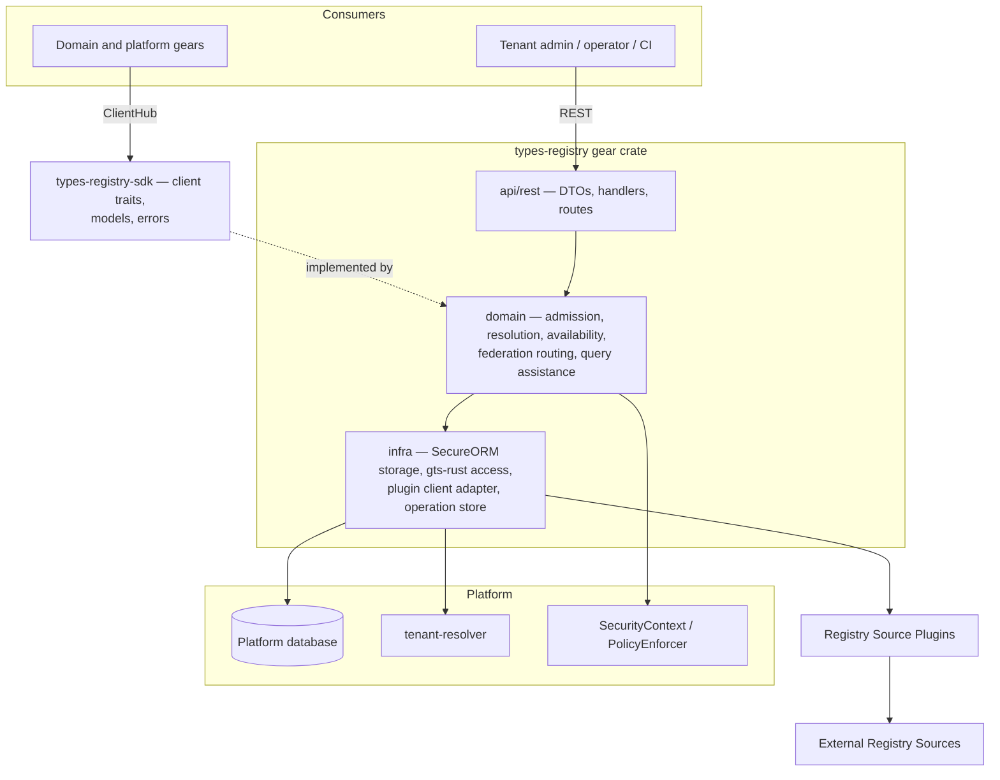
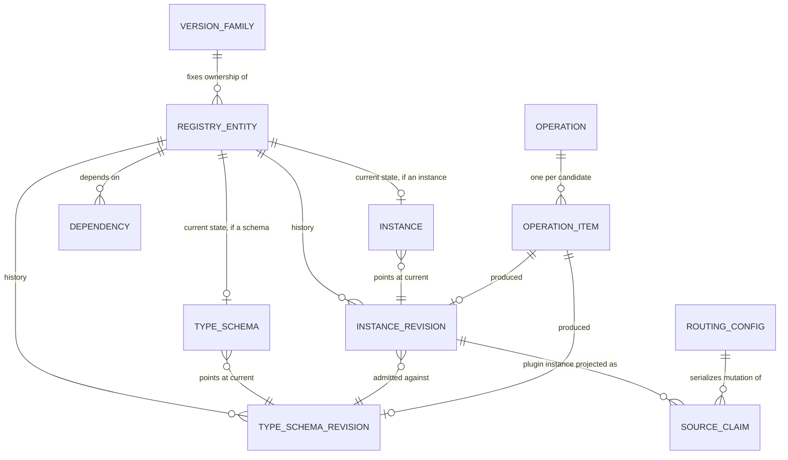
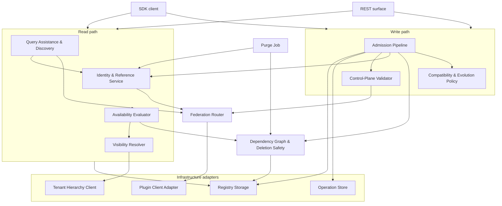
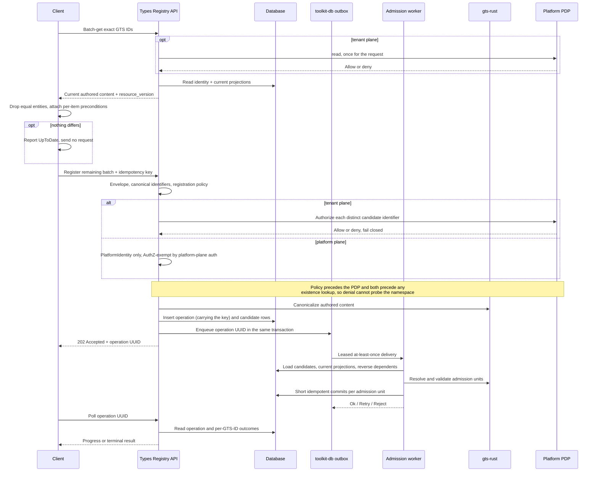
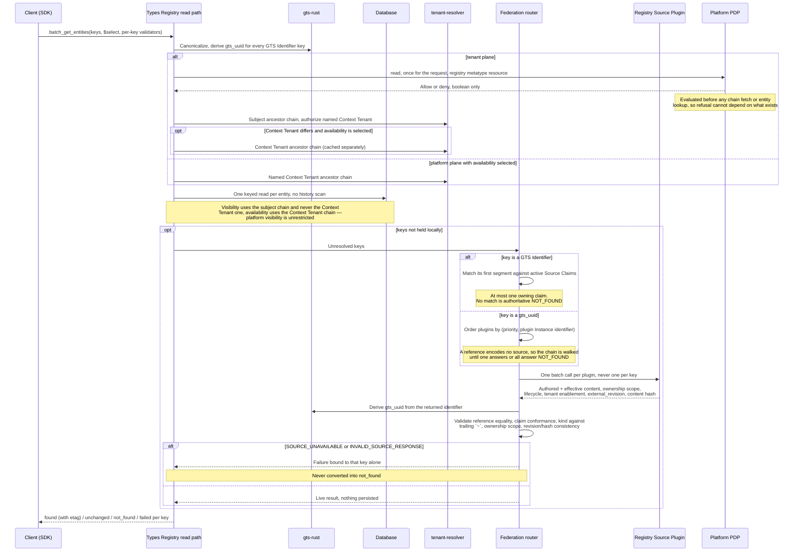
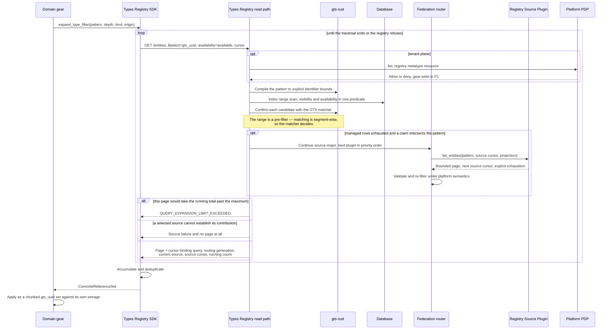

# Technical Design — Types Registry

- [ ] `p1` - **ID**: `cpt-cf-types-registry-design-types-registry`

> Checklist `p1`/`p2` values are specification-item priorities inherited from the DESIGN template, not product delivery phases. Product P1/P2 scope is stated in the PRD and explicitly in this document's prose.

## Table of Contents

<!-- toc -->

- [1. Architecture Overview](#1-architecture-overview)
  - [1.1 Architectural Vision](#11-architectural-vision)
  - [1.2 Architecture Drivers](#12-architecture-drivers)
  - [1.3 Architecture Layers](#13-architecture-layers)
- [2. Principles & Constraints](#2-principles--constraints)
  - [2.1 Design Principles](#21-design-principles)
  - [2.2 Constraints](#22-constraints)
- [3. Technical Architecture](#3-technical-architecture)
  - [3.1 Domain Model](#31-domain-model)
  - [3.2 Component Model](#32-component-model)
  - [3.3 API Contracts](#33-api-contracts)
  - [3.4 Internal Dependencies](#34-internal-dependencies)
  - [3.5 External Dependencies](#35-external-dependencies)
  - [3.6 Interactions & Sequences](#36-interactions--sequences)
  - [3.7 Database schemas & tables](#37-database-schemas--tables)
  - [3.8 Deployment Topology](#38-deployment-topology)
- [4. Additional context](#4-additional-context)
  - [Open questions](#open-questions)
  - [Benchmark profile](#benchmark-profile)
  - [Implementation prerequisites](#implementation-prerequisites)
- [5. Traceability](#5-traceability)

<!-- /toc -->

## 1. Architecture Overview

### 1.1 Architectural Vision

Types Registry is a control plane for type contracts. It owns the identity, definition, evolution, and platform-facing usability of GTS Type Schemas and registered GTS Instances, but none of the runtime objects that conform to them. Consumers use one versioned SDK and REST surface regardless of origin. Managed guarantees are decided entirely from registry-owned state; externally managed definitions are delegated live to their owning Registry Source Plugin and never projected locally. The identifier spaces are disjoint: managed admission enforces the closed boundary, while external sources contractually owe the same rule and their returned content is not parsed to re-enforce it (ADR-0002, ADR-0007, ADR-0011).

A Registry Reference is a deterministic UUID derived from the canonical GTS Identifier and persisted by domain gears in place of the identifier string (ADR-0001). A managed identifier names a logical entity with immutable authored history: a major-only identifier is mutable through retained revisions, while a minor-bearing identifier is admitted once and pins references at that minor. Minor sequences are contiguous; compatibility is enforced across each stable Type Schema major except where a cross-minor waiver is explicitly recorded, while major 0 is exempt and quarantined from stable entities (ADR-0003, ADR-0004, ADR-0005, ADR-0006, ADR-0015). Revisions retain admission snapshots, while the current-state projection materializes effective artifacts and may change when floating dependencies advance.

Registration and deletion use one asynchronous read/reconcile/conditional-write protocol. Acceptance binds the `Idempotency-Key` to the request fingerprint, persists the operation and candidates with a ToolKit outbox message in one transaction, and returns the operation; a worker performs dependency-aware partial admission and records an outcome for every candidate. Purge is the only mutation outside this path: synchronous, operator-invoked, and disabled by default (ADR-0012, ADR-0013). The read and query shape follows from GTS identity: `chain_ids()` derives hierarchy without graph traversal, canonical identifiers support indexed range prefilters confirmed by the GTS matcher, and relationships needed for deletion safety and impact analysis are stored as flat managed dependency edges.

### 1.2 Architecture Drivers

#### Functional Drivers

| Requirement | Design Response |
|-------------|------------------|
| `cpt-cf-types-registry-fr-id-resolution` | Deterministic Registry References; durable managed forward/reverse mappings and tombstones; federated fallback for unresolved keys. See *Identity & Reference Service* in §3.2. |
| `cpt-cf-types-registry-fr-register-schemas`, `cpt-cf-types-registry-fr-register-instances` | Always-asynchronous read/reconcile/conditional-write with request idempotency, per-candidate outcomes, and dependency-aware partial admission. See *Admission Pipeline* in §3.2 and *Batch admission* in §3.6. |
| `cpt-cf-types-registry-fr-dry-run` | A mode of the same admission operation that runs every check and suppresses the commit. See *Admission Pipeline* in §3.2. |
| `cpt-cf-types-registry-fr-validate-schema-compat` | `BACKWARD` comparison of resolved effective schemas against one baseline, with checker provenance recorded; major 0 and explicit cross-minor waivers follow their separate profiles. See *Compatibility & Evolution Policy* in §3.2. |
| `cpt-cf-types-registry-fr-minor-version-profile` | Per-major choice between mutable major-only identity and a gap-free immutable minor sequence opening at `M.0`; `force` waives one cross-minor check and is recorded. See *Compatibility & Evolution Policy* and *Dependency-aware partial admission* in §3.2. |
| `cpt-cf-types-registry-fr-validate-type-derivation` | Identifier-derived chain validation against every managed base under one resolution-closure dialect. See *Compatibility & Evolution Policy* in §3.2. |
| `cpt-cf-types-registry-fr-gts-validation` | All GTS semantics come from `gts-rust`; the managed profile adds Draft-07 and identifier restrictions, while federation does not reinterpret source content. See §2.2, *Admission Pipeline*, and *Compatibility & Evolution Policy* in §3.2. |
| `cpt-cf-types-registry-fr-ref-tracking` | Flat managed dependency edges for derivation, `$ref`, `x-gts-ref`, and Instance-to-schema relationships; used for deletion safety, impact analysis, and the major-0 quarantine. See *Dependency Graph & Deletion Safety* in §3.2. |
| `cpt-cf-types-registry-fr-type-query-assistance` | Indexed identifier-range prefilter plus authoritative GTS matching, source-major federation, and a bounded complete Registry Reference set. See *Query Assistance & Discovery* in §3.2. |
| `cpt-cf-types-registry-fr-tenant-ownership` | Global or tenant ownership stored on each Managed Entity; tenant visibility follows the directed descendant relation, computed from the subject tenant; boolean `read`/`list` grants gate the operation without altering that relation. See *Visibility Resolver* and *Read authorization* in §3.2. |
| `cpt-cf-types-registry-fr-registration-authority` | Global writes use `PlatformSecurityContext`; tenant writes use PDP grants over the candidate identifier, evaluated before identifier availability. See *Tenant-plane authorization* and *Platform-plane authorization* in §3.2. |
| `cpt-cf-types-registry-fr-registration-policy` | Closed-by-default creation policy over admitted vendors and tenant ownership, resolved exact-then-longest per parameter before authorization. See *Registration policy* in §3.2. |
| `cpt-cf-types-registry-fr-tenant-availability` | Registry-computed verdict from entity state and the Context Tenant's ancestor chain; P1 requires no dependency-closure traversal. See *Availability Evaluator* in §3.2. |
| `cpt-cf-types-registry-fr-lifecycle` | Managed `ACTIVE`/`DELETED` lifecycle, exact family enumeration, and deletion blocked by registered dependents. See *Dependency Graph & Deletion Safety* in §3.2. |
| `cpt-cf-types-registry-fr-externally-managed-entities` | Live, non-persisted source results validated at the managed–external boundary; typed origin data exposes no external write precondition. See *Federation Router* in §3.2 and *Registry Source Plugin contract* in §3.3. |
| `cpt-cf-types-registry-fr-registry-federation`, `cpt-cf-types-registry-fr-registry-source-routing` | Managed-first resolution followed by deterministic, non-overlapping Source Claims; plugins are read-only and bound to the total federation contract. See *Federation Router* and *Registry Source Plugin registration* in §3.2. |
| `cpt-cf-types-registry-fr-cache-freshness-metadata` | Per-request opaque validators scoped to origin, Context Tenant, and normalized projection for exact reads, never discovery pages. See *What a validator is made of* in §3.3. |
| `cpt-cf-types-registry-fr-client-cache` | Bounded per-client representation cache with batched conditional revalidation and fail-closed expiry handling. See *The client-side cache* in §3.3. |
| `cpt-cf-types-registry-fr-two-phase-init` | Caller-side inventory reconciliation, dependency-aware batches, and per-registrant readiness without a global startup barrier. See *Inventory and startup reconciliation* in §3.3. |
| `cpt-cf-types-registry-fr-validation-hooks` | P2 hook execution and declaration semantics remain open; D1 records the required control-plane type decision. |
| `cpt-cf-types-registry-fr-aliasing` | P2 Alias projection remains open; D2 records the construction decision while PRD question 6 retains chaining and retargeting policy. |
| `cpt-cf-types-registry-fr-tenant-enablement` | P2 adds stored managed enablement as an availability input; external enablement already remains source-owned. ADR-0010 fixes the semantic propagation and the implementation consequence. |
| `cpt-cf-types-registry-fr-casting` | P2 casting uses `gts-rust`; the admissible transition set remains PRD open question 3 and no P1 API is defined here. |

#### NFR Allocation

| NFR ID | NFR Summary | Allocated To | Design Response | Verification Approach |
|--------|-------------|--------------|-----------------|----------------------|
| `cpt-cf-types-registry-nfr-lookup-latency` | Exact lookup p95 < 10 ms | Identity, current-state read, availability | Derived references, keyed current-state joins, SQL availability evaluation, no plugin call on managed reads, and one cached authorization decision per request rather than per entity. | Benchmark profile in §4. |
| `cpt-cf-types-registry-nfr-query-latency` | Bounded search p95 < 100 ms (P2) | Discovery and query assistance | Indexed identifier ranges, GTS post-filtering, and bounded source-major federation. | Benchmark profile in §4. |
| `cpt-cf-types-registry-nfr-multi-pod-correctness` | Every pod's first post-commit read sees the mutation | Database, outbox worker, derived caches | One authoritative database, leased outbox dispatch, idempotent guarded commits, and no process-local authority. | Integration tests for duplicate delivery, lease expiry, concurrent family admission, and cross-pod read-after-commit. |
| `cpt-cf-types-registry-nfr-cache-correctness` | No invalidated result accepted as current after the client observes the mutation | SDK client cache | Projection-scoped validators, fail-closed revalidation, immediate invalidation of submitted keys, and bounded freshness for indirectly affected keys. | Integration tests in §3.3, *The client-side cache*. |

#### Key ADRs

| ADR ID | Decision Summary |
|--------|-----------------|
| `cpt-cf-types-registry-adr-storage-identity-query-model` | Domain gears persist an opaque Registry Reference UUID derived deterministically from the exact client-supplied GTS Identifier. |
| `cpt-cf-types-registry-adr-external-source-live-delegation` | Externally managed definitions and tenant state are delegated live to the owning Registry Source Plugin, never projected. |
| `cpt-cf-types-registry-adr-type-schema-evolution-compatibility` | Managed Type Schemas evolve under `BACKWARD` compatibility, compared against one baseline rather than against history, and the guarantee that follows is a statement about a major. |
| `cpt-cf-types-registry-adr-gts-minor-version-identity-evolution` | A major is either one mutable major-only entity or a gap-free sequence of immutable minors opening at `M.0`, chosen by its first member; a minor is the boundary at which references stop floating, and `force` waives the cross-minor check. |
| `cpt-cf-types-registry-adr-type-schema-revisions` | Every admitted Type Schema definition is an immutable retained revision with optimistic concurrency on the logical entity. |
| `cpt-cf-types-registry-adr-registered-instance-revisions` | A registered Instance is a mutable logical entity whose every admitted value is an immutable revision bound to the Type Schema revision that validated it. |
| `cpt-cf-types-registry-adr-federated-source-routing-query` | Ordered resolver chain over non-overlapping Source Claims, managed storage first, source-major federated traversal. |
| `cpt-cf-types-registry-adr-managed-version-family-lifecycle` | Several majors of a family may be `ACTIVE`; the registry names no newest member, and managed deprecation is deferred past P1. |
| `cpt-cf-types-registry-adr-tenant-ownership-visibility-authority` | Two ownership scopes; tenant-owned entities visible down the tenant subtree; visibility never implies authority. |
| `cpt-cf-types-registry-adr-tenant-availability-evaluation` | Availability follows the live semantic dependency closure, independently of whether effective artifacts are materialized, and propagates transitively along outgoing edges only. |
| `cpt-cf-types-registry-adr-managed-external-boundary` | The managed–external boundary is closed in both directions; Source Claims are rooted single-segment patterns, plugins are read-only, and a retired Source Claim reserves its space until the plugin is purged. |
| `cpt-cf-types-registry-adr-write-path-admission-protocol` | Read/reconcile/conditional-write, one always-asynchronous acceptance shape, immutable request-key replay on the operation itself, per-candidate optimistic preconditions and outcomes, dependency-aware partial admission, and control-plane records with built-in validators. |
| `cpt-cf-types-registry-adr-platform-purge-of-deleted-entities` | Physical removal exists only as one explicit operator-invoked purge, which releases the GTS Identifier and is disabled by default. |
| `cpt-cf-types-registry-adr-managed-type-schema-dialect-profile` | Managed Type Schemas declare Draft-07 in P1, the dialect is pinned at initial admission, and P2 widening is governed by dialect uniformity across the resolution closure. |
| `cpt-cf-types-registry-adr-major-zero-unstable-profile` | Major 0 marks a Type Schema whose evolution is unenforced; nothing outside the profile may depend on one, and graduation is an ordinary registration of v1. |

### 1.3 Architecture Layers

- [ ] `p2` - **ID**: `cpt-cf-types-registry-tech-layering`



The gear follows the canonical DDD-light layout of [`02_gear_layout_and_sdk_pattern.md`](../../../../docs/toolkit_unified_system/02_gear_layout_and_sdk_pattern.md): a public `types-registry-sdk` crate beside the `types-registry` gear crate, which holds `gear.rs`, `config.rs`, and the three layers below.

| Layer | Responsibility | Technology |
|-------|---------------|------------|
| SDK (`types-registry-sdk/`) | The public API surface consumers link and resolve through the typed ClientHub: `TypesRegistryClient` and `PlatformTypesRegistryClient`, transport-agnostic models, canonical errors. A separate crate rather than a layer of the gear, which is what lets a consumer depend on the contract without depending on the implementation | Rust traits and plain models; no serde, no HTTP types, no REST DTOs |
| Presentation (`api/rest/`) | Authenticated REST surface for management, discovery, resolution, validation, and operations; DTOs with OpenAPI schemas | Axum via ToolKit `OperationBuilder`, utoipa, RFC-9457 problem details |
| Domain (`domain/`) | Admission and compatibility, revision and concurrency control, identity and reference resolution, dependency and deletion safety, availability evaluation, federation routing, query assistance, built-in control-plane validators | Rust, `gts-rust` for all GTS semantics |
| Infrastructure (`infra/`) | Authoritative persistence, operation and idempotency store, tenant hierarchy client, Registry Source Plugin clients | SeaORM through the secure ORM layer over SQLite / PostgreSQL / MySQL, ToolKit scoped ClientHub, `tenant-resolver` SDK |

Two rules constrain the layering beyond the standard gear structure. All GTS semantics — parsing, canonicalization, pattern matching, reference extraction, resolution, compatibility, content-model classification — come from `gts-rust`, and no layer reimplements or approximates them. `gts-rust` is a pure library and part of this gear's domain vocabulary rather than an infrastructure concern, so the rule is about substance and not about placement: the domain calls it directly. And no authoritative decision is ever taken from process-local state: registry-side caches are derived projections validated against committed tokens; the client cache has the explicit bounded-freshness contract of §3.3.

## 2. Principles & Constraints

### 2.1 Design Principles

#### Authority is local

- [ ] `p2` - **ID**: `cpt-cf-types-registry-principle-local-authority`

Every authoritative decision about a Managed Entity — admission, deletion, availability, and routing activation — is derived exclusively from registry-owned state. Registry Source Plugins never participate in those decisions; their declared outputs are authoritative, and an unavailable or incomplete external answer fails closed.

The closed boundary removes an unobservable diligence dependency: a plugin that fails to report a dependency is indistinguishable from one that has none, so a managed deletion could otherwise be approved on incomplete evidence.

**ADRs**: `cpt-cf-types-registry-adr-managed-external-boundary`, `cpt-cf-types-registry-adr-external-source-live-delegation`, `cpt-cf-types-registry-adr-federated-source-routing-query`

#### Derive facts, materialize computations

- [ ] `p2` - **ID**: `cpt-cf-types-registry-principle-derive-not-store`

Facts derivable from authoritative state are not stored as independent authority: this includes the derivation chain, Registry Reference, version ordering, availability, and freshness validators. A verified indexed copy such as `entity.gts_uuid` may materialize a derivation for lookup and collision enforcement without becoming its source of truth. The registry likewise does not recompute facts already carried by identifiers; it exposes exact family enumeration instead of a stored or computed "newest" member.

Expensive computations over a closed, transactionally known input set may be materialized, including effective schemas and dependency projections. A result whose truth depends on state outside registry control is never materialized as authority.

**ADRs**: `cpt-cf-types-registry-adr-managed-version-family-lifecycle`, `cpt-cf-types-registry-adr-storage-identity-query-model`, `cpt-cf-types-registry-adr-tenant-availability-evaluation`

#### Fail closed on incomplete information

- [ ] `p2` - **ID**: `cpt-cf-types-registry-principle-fail-closed`

Absence of evidence is never evidence of absence. Source unavailability is not `NOT_FOUND`; undecidable compatibility is rejected; unconfirmed external state is not `AVAILABLE`; and a query whose completeness cannot be established fails rather than returning a partial result. The P1 contract exposes no advisory result tier.

**ADRs**: `cpt-cf-types-registry-adr-external-source-live-delegation`, `cpt-cf-types-registry-adr-type-schema-evolution-compatibility`, `cpt-cf-types-registry-adr-tenant-availability-evaluation`, `cpt-cf-types-registry-adr-managed-external-boundary`

#### Identity is permanent

- [ ] `p2` - **ID**: `cpt-cf-types-registry-principle-permanent-identity`

An admitted GTS Identifier never names a different logical entity. Deletion is terminal and retains both the tombstone and reverse resolution; a retired Source Claim likewise reserves its identifier space. Explicit platform purge is the only exception, because releasing and reusing an identifier reproduces its Registry Reference and can rebind persisted domain data; purge is therefore disabled by default.

**ADRs**: `cpt-cf-types-registry-adr-storage-identity-query-model`, `cpt-cf-types-registry-adr-platform-purge-of-deleted-entities`, `cpt-cf-types-registry-adr-managed-external-boundary`

#### One public vocabulary per concept

- [ ] `p2` - **ID**: `cpt-cf-types-registry-principle-single-vocabulary`

Each client-visible concept has one public vocabulary. The operation resource is the sole mutation-progress and request-identity contract: operation status reports progress, while per-candidate status reports outcomes, including `unchanged`. There is no pending entity, separate admission-status resource, or synchronous no-op receipt. Conversely, Lifecycle Status, Tenant Enablement State, and Tenant Availability State remain separate because they have different owners and transition independently.

**ADRs**: `cpt-cf-types-registry-adr-write-path-admission-protocol`, `cpt-cf-types-registry-adr-tenant-availability-evaluation`

#### The registry governs contracts, not objects

- [ ] `p2` - **ID**: `cpt-cf-types-registry-principle-contract-not-object`

Types Registry decides what a type contract is, who may see it, and whether a tenant may use it. It never deletes, hides, or rewrites data owned by another gear on the strength of that verdict. An owning gear defines what happens to its runtime objects whose referenced entity became unavailable, and Types Registry supplies only the verdict it needs to decide.

**ADRs**: `cpt-cf-types-registry-adr-tenant-availability-evaluation`, `cpt-cf-types-registry-adr-storage-identity-query-model`

### 2.2 Constraints

#### GTS semantics belong to the platform implementation

- [ ] `p2` - **ID**: `cpt-cf-types-registry-constraint-gts-implementation`

Types Registry does not implement GTS. Parsing, canonicalization, chain derivation, pattern matching and coverage, reference extraction, schema resolution, trait merging, content-model classification, compatibility, and casting all come from `gts-rust`. Any behaviour the registry needs and the implementation lacks is a change request against `gts-rust`, not a local approximation.

The design depends on the behaviours enumerated in §4, *Implementation prerequisites*, rather than on a named library version. In particular, compatibility is accepted-instance-set inclusion and content models are classified on resolved effective schemas. Identifier range scans are candidate prefilters only; every managed and external result is confirmed by the GTS matcher.

**ADRs**: `cpt-cf-types-registry-adr-type-schema-evolution-compatibility`, `cpt-cf-types-registry-adr-managed-external-boundary`

#### Managed Type Schemas are Draft-07 in P1

- [ ] `p2` - **ID**: `cpt-cf-types-registry-constraint-schema-dialect`

Managed Type Schemas MUST declare JSON Schema Draft-07 in P1. The dialect is fixed across every revision and minor member of one major, making the compatibility relation well-defined. Admission validates the top-level declaration synchronously; the value is retained in the authored document and is not stored separately.

This is a correctness constraint rather than a format preference: `resolve_schema_refs` strips non-root `$schema`, and JSON Schema ignores unrecognised keywords, so a mixed-dialect closure can silently lose constraints instead of failing.

Any future widening preserves dialect uniformity across the managed resolution closure: the `$id` chain and `$ref` targets, including references inside `x-gts-traits-schema`, but excluding `x-gts-ref` targets because they are not inlined. Externally Managed Entities are outside this profile, cannot enter a managed closure, and their returned content is never parsed by the registry.

**ADRs**: `cpt-cf-types-registry-adr-managed-type-schema-dialect-profile`, `cpt-cf-types-registry-adr-type-schema-evolution-compatibility`, `cpt-cf-types-registry-adr-managed-external-boundary`

#### One authoritative database per installation

- [ ] `p2` - **ID**: `cpt-cf-types-registry-constraint-single-installation`

An installation has one authoritative database served by many pods; every guarantee and Dry Run verdict is relative to that database and the deployment configuration in force. Deterministic Registry References provide portability across installations, not shared state or coordination: installations may contain different entities and enforce different input bounds. Compatibility fixtures pin representative `GTS Identifier → UUID` mappings across implementation upgrades.

**ADRs**: `cpt-cf-types-registry-adr-storage-identity-query-model`, `cpt-cf-types-registry-adr-platform-purge-of-deleted-entities`

#### Three database backends

- [ ] `p2` - **ID**: `cpt-cf-types-registry-constraint-multi-backend`

Storage behaves identically on SQLite, PostgreSQL, and MySQL. The repository layer owns explicit identifier-range bounds, UUID representation, backend-safe set chunking, and compare-and-swap; none leaks into the domain.

Transitive dependency queries use one repository-owned recursive CTE over `dependency`; no closure is materialized. ToolKit outbox already requires MySQL 8.0+ for `FOR UPDATE SKIP LOCKED`, so the recursive CTE does not raise the backend floor. Because the graph may contain cycles, the CTE uses `UNION`, never `UNION ALL`, and its recursive term carries no depth or per-row accumulator that would defeat deduplication. The normative query constraints live beside the table in [database.sql](./database.sql); §4 records the outstanding `sea-query` and MySQL verification.

**ADRs**: `cpt-cf-types-registry-adr-storage-identity-query-model`

#### Types Registry is on every gear's boot path

- [ ] `p2` - **ID**: `cpt-cf-types-registry-constraint-boot-path`

Because every other gear may depend on it, anything Types Registry waits for during startup is something the platform waits for. It publishes ready when its own storage is ready, has no notion of an expected registration set, and never blocks on a registrant. Registrants retry and gate their own readiness.

**ADRs**: `cpt-cf-types-registry-adr-write-path-admission-protocol`

#### The tenant hierarchy is a read-path dependency

- [ ] `p2` - **ID**: `cpt-cf-types-registry-constraint-tenant-hierarchy`

Visibility of a tenant-owned entity is the directed descendant relation, so most reads require the requesting subject tenant's ancestor chain. It is obtained from `tenant-resolver` with barrier traversal disabled, cached within the 10 ms lookup budget, and versioned into the resolution validator.

The tenant PDP is the second read-path dependency, added by `cpt-cf-types-registry-tech-read-authorization`: an unreachable one fails a read closed exactly as it fails a registration, and because this gear precedes every registrant, that outage is platform-wide rather than local. Both dependencies are cached, and neither is consulted on the platform plane.

**ADRs**: `cpt-cf-types-registry-adr-tenant-ownership-visibility-authority`, `cpt-cf-types-registry-adr-tenant-availability-evaluation`

#### Admitted content is retained without limit

- [ ] `p2` - **ID**: `cpt-cf-types-registry-constraint-unbounded-retention`

Admitted revisions have no TTL and no background sweep. Deleted entities retain both identity and content because domain data may still require the contract; the only physical removal is the explicit platform purge that also releases the identifier and is disabled by default.

The registry does not decide which data classes may be retained under these terms. Content that cannot be retained indefinitely requires a different storage owner or an explicit platform policy outside Types Registry.

**ADRs**: `cpt-cf-types-registry-adr-registered-instance-revisions`, `cpt-cf-types-registry-adr-type-schema-revisions`, `cpt-cf-types-registry-adr-platform-purge-of-deleted-entities`

## 3. Technical Architecture

### 3.1 Domain Model

**Technology**: GTS identity and schema semantics through `gts-rust`; plain Rust domain types; SeaORM entities in `infra/storage`.

**Location**: persisted half in [database.sql](./database.sql); the Rust types do not exist yet.

A managed GTS Identifier names a logical entity that is mutable when major-only and immutable when minor-bearing; its admitted content history is immutable in either case (ADR-0004, ADR-0005, ADR-0006). Identity, current state, and history are therefore separate records. Registry References are derived, availability and validators are computed per request, and Externally Managed Entities are never persisted.

#### Core entities

- [ ] `p2` - **ID**: `cpt-cf-types-registry-entity-model`

| Entity | Description | Schema |
|---|---|---|
| Registry Entity | One admitted managed GTS Identifier, of kind Type Schema or registered Instance. Carries identity, ownership, the owning gear, lifecycle, and the `resource_version` that write preconditions test. Survives deletion as the tombstone that keeps a previously issued reference resolvable | `entity`, plus the kind-specific current-state row `type_schema` or `instance` |
| Revision | One immutable admitted definition or value, with the content hash and the specification and implementation versions in force at its admission | `type_schema_revision`, `instance_revision` |
| Version Family | The set of Version Successors of one another, named by the family key of ADR-0004. Holds an ownership scope and nothing else | `version_family` |
| Dependency | A direct edge between two Registry Entities: `$ref`, `x-gts-ref`, immediate derivation base, or Instance conformance. Nothing transitive is stored | `dependency` |
| Operation | One accepted mutation: its scoped request identity, its client-visible progress, and one durable outcome per candidate identifier | `operation`, `operation_item` |
| Registry Source | Where an identifier is authoritative — managed storage, or an External Registry Source behind a claim. Managed storage is implicit; a claim is a projection of a plugin's registered Instance and outlives it as a reservation | `source_claim`, `routing_config` |

#### Current state is not a cache of the revision

`type_schema_revision` holds the immutable authored admission snapshot and retains neither effective artifacts nor a dependency-revision vector. `type_schema` holds the artifacts resolved against dependencies current now; a floating dependency may therefore update it without creating a revision or changing `resource_version`. An Instance has no such artifact, so `instance` is the current-revision pointer and nothing more.

#### Derived values and projections

| Value | Derivation and storage rule |
|---|---|
| Registry Reference (`gts_uuid`) | Derived deterministically from the canonical identifier. A persisted indexed copy supports reverse resolution, and its unique constraint detects identity collisions (ADR-0001). |
| Tenant Availability State | Computed per request from lifecycle, visibility, the Context Tenant's ancestor chain, and live source state where applicable; no single per-entity value exists to store. |
| Freshness validator | Computed from entity, tenant, origin, and projection state as specified in §3.3; issued validators are never stored. |
| Per-level content model | Computed from the resolved effective schema during admission as an unpersisted compatibility input; Dry Run reports the level that prevents admission (ADR-0003). |
| Derivation chain | Reconstructed with `chain_ids()`; only the immediate base is projected as a dependency edge so recursive queries can span every edge kind. |
| Unstable profile | Derived from major 0 in the identifier's last segment; no `stability` column is stored, and immutable identity preserves the admission-time quarantine. |
| Major shape and predecessor | Keyed `entity.gts_id` lookups under the family lock: `vM~`/`vM.0~` determine shape and `vM.(n-1)~` determines the predecessor. No shape or highest-minor column is stored. |

#### Externally Managed Entities are not in this model

Externally Managed Entities have no row, projection, or cached identifier. They enter as live results, are validated, and leave; no dependency, derivation, or availability-blocking relationship crosses the boundary (ADR-0011). Managed and external entities share the §3.3 read contract, whose origin variant carries the managed-only `resource_version` and timestamps.

#### Relationships



Four of these carry an invariant worth stating outright, because none of them is enforced by the relationship alone.

**A Version Family fixes ownership before its first member.** Admission creates or locks the family row before admitting a member, preventing concurrent first registrations under different owners. Entity owner columns are a SecureORM projection maintained under that lock because a composite foreign key would not cover the nullable global scope. `owning_gear` remains mutable per-entity attribution; family ownership is write-once and controls visibility.

**An Instance records one Type Schema revision:** the exact revision that admitted its value, on the immutable revision row. The number is not public. Which revision last revalidated the value is not stored, because a schema revision cannot become current while an affected Instance would become invalid (ADR-0005, ADR-0006) and ADR-0015 forbids an Instance on a v0 schema, so a current value is valid against its schema's current revision by invariant rather than by record.

**Every dependency edge has Managed Entities at both ends.** Deletion is decided from direct edges only; a transitive-only dependent does not block because it disappears with the intermediate entity.

**A Source Claim outlives its plugin Instance.** Deletion retires the claim into an identifier-space reservation; only ADR-0013 purge releases it, preventing a managed registration from rebinding previously issued references.

### 3.2 Component Model

The components below are internal modules of one gear with distinct responsibilities, not deployable units — the gear itself runs as its own process and is horizontally scaled, as §3.8 describes. Of everything inside that process, Registry Source Plugins are the only part that may later move out, and §3.3, *Registry Source Plugin contract*, says why that move is a transport change rather than a semantic one.



#### Admission Pipeline

- [ ] `p2` - **ID**: `cpt-cf-types-registry-component-admission-pipeline`

##### Responsibility scope

Every state mutation — initial admission, content revision, lifecycle transition, and control-plane write — passes through this component's ordered checks. Purge is the only exception: it admits nothing, runs synchronously, and re-evaluates deletion preconditions itself (ADR-0013).

The pipeline is the sole writer of entity state. It owns request identity, operation and candidate lifecycle, dry-run commit suppression, dependency ordering, authored-content equality, validation, entity and dependency concurrency guards, revision allocation, and durable per-candidate outcomes. Registration policy and authorization precede identifier availability; the context type selects the tenant or platform plane.

##### Acceptance path

The endpoint has one successful acceptance shape: `202 Accepted` with an operation UUID, never an inline result. Admission is asynchronous because dependent revalidation is intentionally unbounded; P2 hooks may add further long-running work. For registration, the caller first batch-reads its identifiers, omits equal authored content, and submits missing entities without `expected_resource_version` and updates with the version it observed. Deletion always supplies the positive version observed for the existing entity. Tenant ownership comes from `SecurityContext`; global registration uses `PlatformSecurityContext`.

Acceptance reads no registry entity state. It decides only from the request, plane, and startup configuration, so the following failures are synchronous:

1. **Envelope and batch size** — refuses more than 100 candidates.
2. **Candidate identifiers** — refuses a non-canonical GTS Identifier, or a duplicate within the batch.
3. **Registration policy** — for a declared creation, requires the region to admit the candidate's last-segment vendor and, for tenant ownership, `tenant_ownable`; revisions and deletions bypass this gate.
4. **Registration authority** — refuses a batch mixing planes, actions, or ownership scopes, a global candidate off the platform plane, and any tenant-plane candidate not covered by a grant. Authorization is evaluated for every distinct identifier; one successful check never authorizes its batch neighbours.
5. **Managed identifier profile** — refuses an explicit UUID tail on any candidate (ADR-0001), and a minor or major 0 in the **last segment** of a registered Instance identifier (ADR-0004, ADR-0015). A minor on a Type Schema identifier is admissible under any prefix.
6. **Declared dialect, Type Schema candidates** — refuses an absent top-level `$schema`, a value outside the closed Draft-07 spelling set, and a `$schema` below the document root that differs from it (ADR-0014). The set is canonical `http://json-schema.org/draft-07/schema#`, that URI without `#`, and either form under `https`; every accepted form normalizes to the canonical one.
7. **`force`, per candidate** — refuses the flag where `allow_compatibility_force` is off, and where the candidate has no cross-minor check to waive: major-only, the first minor of its major, or major 0 (ADR-0004).
8. **ADR-0015 quarantine** — refuses a stable candidate whose immediate derivation base, `$ref` targets, or `x-gts-ref` targets include a major-0 identifier.
9. **Canonicalization and request identity** — canonicalizes each authored schema or Instance value through `gts-rust`, computes the request fingerprint, and resolves the mandatory `Idempotency-Key`.

Three ordering invariants are load-bearing:

- Steps 3 and 4 precede existence lookup, preventing namespace probing; policy precedes the PDP because a grant cannot open a closed region.
- Steps 5 and 7 are request-static. Family shape and whether a waived comparison would fail remain worker decisions under the version-family lock.
- Step 8 checks direct references. The closure property follows inductively, with the base case coming from the release boundary: the release that introduces the check is the release that first persists an entity, so no stored edge predates it (ADR-0015).

The request fingerprint covers the canonical body, operation kind, authorization scope, owner, optimistic preconditions, and each `force` flag. The key identifies that request and is scoped to authorization scope, owning tenant, and principal. A matching replay returns the stored operation without reading entity state (`202` while active, `200` when terminal); another fingerprint under the same key returns `409 Conflict`. A new reconciliation uses a new key.

A dry run follows the same path and suppresses entity-state commit. Its mode is part of the fingerprint and is copied to candidate rows so `ck_tr_operation_item_state` can constrain its result fields. The worker performs the ordinary commit-time reads, locks, and rechecks in a rollback-only evaluation transaction, then records the predicted outcome in a separate short transaction. The verdict is relative to that observed state, not a reservation; §3.3 defines the one result-shape difference.

The acceptance transaction inserts the operation and candidates and enqueues an outbox message containing only the operation UUID. Candidate content never enters outbox or dead-letter payloads. Atomic enqueue prevents an undispatchable operation or an orphan message; uniqueness on `(idempotency_scope_hash, idempotency_key)` resolves concurrent acceptance, with the loser returning the winner after fingerprint verification.

Authored-content equality is established once by the worker per candidate. The hash is only a prefilter; effective artifacts are excluded because they are projections over current dependencies.

##### Dispatch and the outbox

The leased ToolKit outbox owns multi-pod claiming, lease expiry, retry, and dead letters. Delivery is at least once, so admission-unit commits are idempotent and guarded by operation-item identity, authored equality, unique revisions, and compare-and-swap; outbox lease state is not duplicated in `operation`. The operation status index only terminalizes work abandoned after outbox retries and is not a second dispatcher.

Candidate rejection is a successful dispatch outcome. Transient database or infrastructure failure returns `Retry`; `Reject` is reserved for a permanently invalid internal message. Long-running P2 hooks split into bounded durable stages rather than retaining one lease. P1 use of the `toolkit-db/preview-outbox` feature requires the §4 sign-off.

The end-to-end flow this pipeline drives — read, reconcile, submit, dispatch, admit, poll — is `cpt-cf-types-registry-seq-batch-admission` in §3.6.

##### Operation and candidate status

Operation status reports progress only: `pending`, `running`, or `completed`, with `completed` meaning every item is terminal. Per-candidate status carries the outcome: `pending`, `running`, `succeeded`, `unchanged`, or `failed`, keyed by exact GTS Identifier. Outcomes are not aggregated onto the operation (`cpt-cf-types-registry-principle-derive-not-store`).

A status distinguishes effects; a structured reason distinguishes causes. `succeeded` committed an entity-state change, or in Dry Run passed every check and predicts one; `unchanged` proved an update equal to current authored content without a revision or `resource_version` increment; `failed` produced no change. `unchanged` is valid only for an update; create and delete have no redundant-success branch, as constrained in the candidate row and enforced by the worker.

The vocabulary has no cancellation or expiry state. Leases are redelivered, and a stalled operation past its timeout completes with unfinished items `failed`. A dependency-blocked candidate is likewise `failed`, with `blocked_by_dependency` or `blocked_by_predecessor` identifying the cause rather than adding a `blocked` status.

##### Operation retention

- [ ] `p1` - **ID**: `cpt-cf-types-registry-tech-operation-retention`

A terminal operation is removable when its completion is older than `operation_retention` (§3.8, default **30 days**) and no revision points to one of its items. Age is measured from terminality. Revision foreign keys are `NOT NULL ON DELETE RESTRICT`, so they pin the operation and retain the admitting principal until purge. The sweep tests pinning with indexed anti-joins on both revision tables rather than candidate outcome; dry runs and successful deletions have successful items but no revision.

Deletion cascades to operation items and releases `(idempotency_scope_hash, idempotency_key)`, so a later replay executes afresh:

| Removable class | Why it holds no revision | What a replay does after the sweep |
|---|---|---|
| Dry run | wrote nothing, by construction | nothing, by definition |
| No candidate succeeded | admitted nothing | fails again, or succeeds because the world has since changed |
| Successful deletion | a lifecycle transition creates no content revision | fails `precondition_failed`: the entity is already `DELETED` and `resource_version` has moved past what the replay carries |
| Revisions removed by a purge | ADR-0013 leaves operation items in place, subject to this ordinary sweep once their revisions no longer pin them | registers a new logical entity under a name purge freed — not a restore of what was released |

The sweep reaches no admitted content, identity, or tombstone and therefore does not weaken ADR-0013. Extending retention to revisions and their pinned operations is D4 in §4.

##### Bounded inputs

- [ ] `p1` - **ID**: `cpt-cf-types-registry-tech-input-bounds`

All five bounds are deployment configuration (§3.8); this section fixes their defaults and purpose.

| Input | Default | Purpose |
|---|---:|---|
| Authored document | **256 KB** | Bounds retained input; repository schemas are 3–7 KB typically and 14 KB at most. |
| Resolved document | **1 MB** | Separately bounds derivation expansion, which the authored limit cannot constrain. |
| Resolution closure | **64 documents** | Bounds reference resolution and composition work. This also bounds derivation depth because each level contributes a document. |
| Batch | **100 candidates** | Rejected synchronously before storage. It covers the largest current gear (26 definitions) and is also the largest admissible dependency cycle, whose members cannot be split. |
| Type-filter expansion | **1000 references** | Bounds the server-side result; about 36 KB of JSON and practical to chunk into a consumer's `IN` predicate. |

Dependents and retained revisions remain unbounded. Capping dependents would prevent new uses of widely shared base types; their recursive-CTE processing already runs off the request path and outside a transaction. Revision count does not affect admission cost because ADR-0003 selects one comparison baseline. Entities per tenant is an abuse-control or billing quota, not a correctness guard, and is outside this design.

##### Dependency-aware partial admission

The P1 batch mode is **dependency-aware partial admission**, deterministic for one committed baseline:

1. build the candidate graph from the authored references between candidates, plus the one implicit edge described below;
2. condense it into strongly connected components and process them in topological order;
3. treat each acyclic candidate as one admission unit and every cyclic component as one **atomic** unit;
4. validate each unit outside a long-lived transaction and commit only database rechecks and writes; §4 records the still-open bound for an unbounded reverse-impact write set;
5. record a durable outcome for every candidate GTS Identifier.

Independent passing branches commit despite failures elsewhere. In-batch references resolve against the candidate overlay, never a previously committed revision. A failed selected dependency produces `blocked_by_dependency`; failure within an atomic component fails or blocks the whole component.

For determinism, the graph adds an implicit edge `vM.(n-1)~` → `vM.n~`. It makes a failed lower minor block the higher one as `blocked_by_predecessor`; without it, the higher minor would fail retryably and succeed on the next reconciliation cycle. The edge is acyclic by construction and is not stored in `dependency` (§3.7).

**Committing one admission unit**

Outside the transaction, the worker runs parsing, resolution, compatibility, derivation, reference, and dependent-revalidation checks through `gts-rust`, recording the target revision, the complete reverse-impact identifier set for each updated schema, and a revision vector for every correctness-relevant dependency or dependant. That vector contains each entity's `resource_version` and, where effective Type Schema content was consumed, its `resolution_fingerprint`.

A registered Instance is rejected when its conforming Type Schema is in the major-0 unstable profile, even though the minor or major marker is in a preceding identifier segment rather than the Instance's own last segment. This is distinct from the stable-reference quarantine: an unstable schema cannot carry a registered Instance because later unchecked evolution would make its current validation record untruthful (ADR-0006, ADR-0015).

The registration commit transaction then:

1. enforces the caller precondition: creation requires the exact identifier to remain absent; update requires `entity.resource_version == expected_resource_version`;
2. locks or creates every candidate family in canonical order, then locks candidate and revision-vector entity/current rows in canonical identifier order; deletion uses the same family-then-entity order;
3. under each update target's entity lock, re-derives its reverse-impact identifier set and compares both membership and the complete revision vector; a new, removed, or moved dependency/dependant rolls the transaction back and restarts validation within the bounded retry policy;
4. for each new managed identifier, locks `routing_config` after all family locks and rechecks that no active or retired Source Claim covers it;
5. repeats the predecessor test for each minor-bearing candidate;
6. inserts the immutable revision, replaces the current-state projection, and replaces the entity's dependency edges;
7. refreshes the affected current effective schemas;
8. increments `resource_version` and records the outcome and resulting version.

The three guards cover distinct races:

- The caller precondition detects target movement since the caller's read; mismatch is terminal per-item `precondition_failed`, with no silent rebase.
- The reverse-impact set and revision vector detect both movement of a known dependency/dependant and a phantom dependant created after the initial scan; the worker reloads and revalidates within a bounded retry policy.
- Canonically ordered `version_family` locks serialize first registration under competing owners, predecessor removal by purge, and multi-family units. Locking dependency entity rows serializes a new edge against target deletion. When routing state also participates, every path takes family locks, then entity/current rows, then the singleton routing lock.

Deletion has its own short commit protocol. It requires a positive `expected_resource_version`, locks the target family and entity row, rechecks the target is `ACTIVE` at that version and has no direct registered dependants, then changes lifecycle to `DELETED`, increments `resource_version`, and records the outcome atomically. Because admission locks every dependency target entity before writing its edges, a new dependent cannot appear between the deletion check and lifecycle transition. Deleting a Registry Source Plugin additionally locks `routing_config` after the family and entity locks, stamps `retired_at` on its active claims — the only column deletion touches, so each reservation keeps the projection recording which plugin revision issued it — and increments the routing generation in the same transaction; source unreachability never triggers this path.

The unique family row is the ownership authority. Creation uses backend-specific insert-if-absent followed by a locked read; admission requires the requested owner to equal the stored one. The entity's owner is only a SecureORM projection and changes while this lock is held.

Under the same lock, ADR-0004's version-stripped family key (`v1~`, `v1.4~`, and `v2~` reach one row) enforces three non-stored rules:

- **Kind** must match the family; read any member through `idx_tr_entity_family`.
- **Shape** is refused by `vM~` existing for a minor-bearing candidate, or `vM.0~` existing for a major-only one.
- **Contiguity** is refused by `vM.(n-1)~` being absent for a candidate with `n > 0`.

Shape and contiguity are keyed lookups, not scans. There is no revision-reservation rule: a minor-bearing entity accepts no content revision.

The commit-time predecessor recheck handles concurrent delete-and-purge: during validation the new candidate does not yet pin its baseline. Absence is retryable, like a not-yet-registered base, and is not a caller-precondition failure. The predecessor is excluded from both the dependency vector and `dependency`; storing that edge would forbid deletion of `v1.0~` while `v1.1~` exists, contrary to ADR-0008.

##### Tenant-plane authorization

- [ ] `p1` - **ID**: `cpt-cf-types-registry-tech-registration-authority`

Authority over part of the GTS namespace is granted, never acquired by registering first.

At acceptance step 4, before any existence lookup, Types Registry asks the PDP once **per distinct candidate identifier**, with the subject, batch action, and canonical GTS Identifier as a resource property. The result is boolean (`require_constraints: false`). The batch authorization scope is server-derived from plane, action, and owning tenant; it is not a request field and does not replace per-identifier checks. A grant reaches that identifier through its GTS Identifier Region, carried as a predicate over the property rather than as a wildcard in `resource_type`, so a grant such as `gts.<vendor>.<package>.*` authorizes only that Region without exposing registry storage to the PDP. *The PDP resource shape* below fixes the form and the two obligations it puts on the PDP.

For a declared creation, registration policy runs first and may close the region before the PDP call. Revisions and deletions still reach authorization even if policy later closes their region, so existing entities do not become frozen. This also keeps platform contracts under `gts.cf.toolkit.*` closed without separate Source Claim or permission-Instance ownership rules.

The Region is a GTS pattern, not an equality-only Types Registry attribute. Its persistence belongs to the identity-to-permission binding, whose model [`PERMISSION_GTS_TYPE.md`](../../../../docs/arch/authorization/PERMISSION_GTS_TYPE.md) still defers; this unresolved binding is a P1 implementation prerequisite, not authority delegated to registry storage. A `resource_type` per vendor prefix would not scale. The relation check that permits an ancestor to name a descendant Context Tenant is separate from registry read authorization; result visibility remains governed by ADR-0009.

The actions are `register` and `delete`. `register` covers creation and revision because authorization precedes the existence lookup; a future split can use the declared precondition (absent or present `expected_resource_version`) without adding a lookup. `purge` exists only on the grant-free platform plane and is gated by deployment policy. Dry Run uses the action it rehearses. Reads carry their own two actions, below.

##### The PDP resource shape

- [ ] `p1` - **ID**: `cpt-cf-types-registry-tech-pdp-resource-shape`

Every registry evaluation, under either action set, names one resource type — `gts.cf.toolkit.types_registry.entity.v1~` — and carries the identifier or pattern under discussion in the `gts_id` resource property, as `cpt-cf-types-registry-fr-registration-authority` already requires of writes.

The metatype is load-bearing rather than a formality. A request naming `gts.acme.billing.invoice.v1~` as its resource type would be indistinguishable from the billing gear asking about an invoice object, so one grant would cover both the contract and the objects governed by it. Registry-specific verbs hid this: `register` and `delete` collide with nothing, while `read` and `list` are verbs every gear uses.

A GTS Identifier Region therefore constrains that property rather than appearing as a wildcard in `resource_type`. It is the same notion registration policy and Source Claims use — one trailing wildcard on a token boundary, so any two Regions are nested or disjoint — applied here to a grant. Every declared permission carries the bare metatype, and the Region belongs to the grant binding an identity to one. Its form is a [GTS](https://github.com/GlobalTypeSystem/gts-spec/blob/main/README.md) §3.3 predicate over the property, `gts.cf.toolkit.types_registry.entity.v1~[gts_id="gts.acme.*"]`: §3.5 gives exactly that shape for access control, and §3.3 admits predicates in policy evaluation while keeping them out of stored identifiers. One property name serves all four actions; a second name for the pattern case would force one grant per action.

Two obligations on the PDP follow. Both belong to the §4 binding prerequisite, because [`PERMISSION_GTS_TYPE.md`](../../../../docs/arch/authorization/PERMISSION_GTS_TYPE.md) settles neither today:

- **A Region predicate is resolved against the request property and never returned as a constraint.** That document's worked example compiles a predicate into a PEP constraint over an advertised property, which cannot work here: `supported_properties` declares what a PEP can map to **SQL**, an authorization check on one candidate identifier has no query to filter, and no standard predicate expresses a wildcard match at all. `gts_id` is therefore absent from `supported_properties` under both action sets, and a constraint carrying a Region is refused rather than applied.
- **A decision resolves no registry state.** `resource.type` and a granted permission identifier are strings the PDP matches. Nothing on the authorization path looks either up here — otherwise a read would authorize by reading, and `cpt-cf-types-registry-constraint-boot-path` puts this gear ahead of every registrant.

Only writes are Region-scoped in P1. `cpt-cf-types-registry-fr-registration-authority` requires it — a grant governs a Region, and registering first grants nothing — and registration policy cannot substitute, because it tests the vendor named by the candidate rather than the tenant writing. Reads carry `gts_id` for audit and for the upgrade below, but no read grant is evaluated against it.

The metatype is declared through the ordinary inventory path of §3.3, marked `x-gts-abstract` because nothing conforms to it at runtime: it names a resource class for the permission catalogue, not a wire object. Registration is what lets an administrative view resolve a declared `resource_type`; by the second obligation above, no decision waits on it, so neither the asynchronous admission window nor a purged metatype can close an authorization loop. Kind-specific narrowing would derive from it, which GTS §3.6 implicit derived-type coverage makes additive to grants already issued.

##### Read authorization

- [ ] `p1` - **ID**: `cpt-cf-types-registry-tech-read-authorization`

Reads are authorized under two actions of their own, `read` and `list`. `cpt-cf-types-registry-fr-tenant-ownership` makes a global entry readable subject to lifecycle, availability, **and authorization** and requires platform-plane reads to stay authorized while spanning tenants; `cpt-cf-types-registry-fr-externally-managed-entities` names authorization in the invariant list every result passes before exposure.

Visibility cannot stand in for that check because it is a property of the requesting **tenant**. Without a grant, every subject of a tenant — an ordinary end user, a narrowly scoped third-party token, a leaked service credential — reads every contract that tenant can see, and type names and schemas describe a product's structure. `cpt-cf-adr-two-plane-auth` also puts the `PolicyEnforcer` on the tenant-plane path for entity state; AuthZ exemption belongs to the platform plane alone.

**One evaluation covers one request, not one key.** A `batchGet` of 500 keys is a single `read` decision, because a Region-free grant cannot answer differently per key and 500 round trips would end `cpt-cf-types-registry-nfr-lookup-latency` outright. A denial is therefore one `403` for the request rather than a per-key outcome, and `EntityLookup` keeps its four states. The grant is evaluated before the ancestor chain is fetched and before any entity lookup, as on the write path and for the same reason: a refusal must not depend on what exists. Preceding existence is also what makes one denial shape cover a free, visible, invisible, or reserved identifier alike.

A read decision is a bare boolean: `require_constraints` is `false`, and `capabilities` and `supported_properties` are both empty. `false` is the documented pattern for a read whose PEP wants no SQL-level enforcement, and here the fence is not PDP-derived at all — the registry builds it from the tenant hierarchy and applies it whatever the answer was, so the boolean gates the operation while the scope stays local. A constraint arriving anyway is refused rather than applied, by the ordinary rule that a constraint naming a property the PEP never advertised is a contract violation resolved as a denial. The cost is that a deployment cannot express a data-scoping read policy at all: such a policy can only come back as a whole-request deny.

```text
ownership_scope = GLOBAL OR owner_tenant_id IN ancestors_inclusive(subject_tenant)
```

The block is schematic over logical values; `database.sql` encodes the scope as a smallint and forces `owner_tenant_id` NULL for a global row. The chain comes from the Tenant Hierarchy Client of §3.2 — cached, barrier traversal disabled, its version in the resolution validator — and the predicate rides `idx_tr_entity_visibility` on `(ownership_scope, owner_tenant_id, lifecycle_status, gts_id)`, whose chunking that file already describes as one global range plus one range per ancestor. Lifecycle is not part of visibility: a deleted entity still resolves, carrying deleted state.

**The chain is the subject's, never the Context Tenant's**, which `cpt-cf-types-registry-fr-tenant-ownership` states as a requirement rather than leaving to design. The two coincide by default on this plane, so the difference surfaces only when a caller names a descendant — and there, using the Context Tenant would hand an ancestor that descendant's private contracts for the asking. A boolean decision cannot express a tenant restriction to compensate, which is exactly why the rule lives here rather than in policy. The Context Tenant's chain is fetched only when one is named and availability is selected, cached separately, and used for availability alone (ADR-0010).

P1 accepts what a boolean cannot say. A policy cannot restrict a subject to its own contracts while hiding inherited ones — that shape exists as the §3.3 discovery scope selector, but as caller intent the caller may drop, not as policy. Nor can it let an ancestor read a descendant's catalogue, which would take a vantage tenant of its own, capped locally at `descendants_inclusive(subject_tenant)`. Both are additive: the first restores `owner_tenant_id` to `supported_properties`, the second adds a property. ADR-0009 leaves cross-boundary reads to the platform plane and no requirement asks for either.

`in_tenant_subtree` deserves one note, since it looks like the predicate this gear should be taking. It requires a `tenant_closure` projection the registry does not hold, and its direction is the opposite of the one needed: it scopes owners downward from a root, while contract visibility runs upward from the subject.

Both read actions are gear-wide: the grant says whether this subject may read the registry, not which Region of it. A `list` therefore needs no pattern reasoning at all, which is why P1 stops here — a Region-scoped read grant would have to decide whether a requested pattern is contained in a granted one, and then whether a wider request is refused or narrowed to the intersection. Adding it later is a binding and configuration change, not a protocol one. What P1 cannot express meanwhile is "this third-party token reads only `gts.acme.*`"; the grant closes the registry to a subject or opens it, and the subject's visible set stays the fence in between.

The decision is cached, because `cpt-cf-types-registry-nfr-lookup-latency` does not survive a PDP round trip per read. The key covers subject, `token_scopes`, action, and Context Tenant. This is the one authoritative decision the gear takes from process-local state, so §1.3's rule against that is bounded here rather than excepted: no entry outlives the presenting token, and allow and deny are cached alike, so a revoked grant keeps working and a freshly issued one stays inert until that token expires. `gts_id` joins the key only when a read grant becomes Region-scoped; keying on it while every decision is gear-wide would fragment the cache per identifier for one answer.

Naming a Context Tenant travels in `tenant_context.root_id` so that policy may condition on it. It does not move the relation check: the platform must authorize the subject-to-context relation, and §3.3 discharges that through the PDP-authorized `tenant-resolver.is_ancestor` call, which the read decision neither replaces nor duplicates. A cached boolean could not stand in for it anyway, because that call also yields the chain version the validator carries.

Planes divide as everywhere else. A platform gear's startup reconciliation batch-reads under `PlatformSecurityContext` and is exempt; a tenant-plane registrant's reconciliation read needs `read` like any other tenant read, which is why `cpt-cf-types-registry-tech-inventory-registration` step 1 is subject to this subsection.

##### Declared permissions

Four Instances of `gts.cf.toolkit.authz.permission.v1~`, submitted through the same inventory path as any other gear's. Being repository-declared under `gts.cf.*`, each is major-only per *Platform identifiers and the lint* in §3.3:

| Instance identifier | `action` | Evaluated |
|---|---|---|
| `gts.cf.toolkit.authz.permission.v1~cf.types_registry._.entity_register.v1` | `register` | per distinct candidate identifier, at acceptance step 4 |
| `gts.cf.toolkit.authz.permission.v1~cf.types_registry._.entity_delete.v1` | `delete` | per distinct candidate identifier, at acceptance step 4 |
| `gts.cf.toolkit.authz.permission.v1~cf.types_registry._.entity_read.v1` | `read` | once per request, Region-free in P1 |
| `gts.cf.toolkit.authz.permission.v1~cf.types_registry._.entity_list.v1` | `list` | once per request, Region-free in P1 |

`resource_type` is the bare metatype in all four. A write grant is narrowed to a Region through the binding; a read grant is not narrowed at all in P1. The release ships baseline `read` and `list` for every authenticated tenant subject, because a domain gear expanding a type filter under an end user's context would otherwise be refused. That baseline travels by the same deferred binding, so §4's prerequisite gates the documented default posture and not only the Region-scoped case. Once it lands the default is indistinguishable from a registry without read grants, and what the two actions add is a gate that exists — one a deployment can close for a subject, and later narrow by Region.

Three absences are deliberate. `purge` has no permission because the grant-free platform plane gates it by deployment policy (ADR-0013). `GET /operations/{operation_id}` has none because it returns a request receipt rather than entity state, and its idempotency scope already binds plane, owning tenant, and principal more tightly than a grant would — the enforcer governs the entity-state reads above, not this receipt. Derivation has none because it is a `register` of the derived candidate, bounded by registration policy.

##### Platform-plane authorization

Under `cpt-cf-adr-two-plane-auth`, `PlatformSecurityContext` never reaches the tenant `PolicyEnforcer`; `cpt-cf-adr-platform-plane-auth` makes these handlers AuthZ-exempt. `InternalAuthMiddleware` authenticates the workload using an `X-ToolKit-Internal-Token` service-account token initially and mTLS SPIFFE identity later, producing `PlatformIdentity`.

Consequently, any authenticated platform workload may author, revise, or delete any global entity. `owning_gear` is attribution, not authority. Per-gear narrowing belongs to external workload policy over `PlatformIdentity`; mutations remain audited. Purge additionally exists only where deployment policy enables it (ADR-0013).

##### Registration policy

Registration policy is a deployment allowlist for **new logical entities**. For each GTS Identifier Region it resolves two independent parameters:

1. Which vendors may appear in the candidate's last identifier segment?
2. May an entity in this region be tenant-owned?

Both default closed: no vendor and no tenant ownership. The only exception is global platform-vendor (`cf`) registration. Policy determines **what** a region admits; authorization determines **who** may write there. Policy runs before the PDP and any registry lookup, so a grant cannot open a closed region.

An entry key is an exact canonical GTS Identifier or a GTS pattern with one trailing wildcard on a token boundary. Each entry may define either or both parameters:

| Entry | `allowed_vendors` | `tenant_ownable` | Meaning |
|---|---|---|---|
| `gts.acme.*` | `[acme]` | `true` | Onboard `acme` in its own namespace, including derivations |
| `gts.cf.core.rg.type.v1~*` | `[acme]` | `true` | Let `acme` create tenant-owned derivations of the resource-group type |
| `gts.cf.core.rg.type.v1~` | `[]` | `false` | Keep the base type itself closed |
| `gts.cf.toolkit.plugins.plugin.v1~*` | `["*"]` | `false` | Allow any vendor globally in the plugin region, but not tenant ownership |

The exact entry separates the base type from `…~*`, which also matches that base.

Resolution is per parameter:

1. Find the matching entry with the longest literal prefix that names the parameter. An exact key is more specific than any pattern.
2. Skip matching entries that omit that parameter; a less-specific entry may still provide it.
3. If no entry provides it, use the closed default.

The selected `allowed_vendors` set replaces, rather than extends, a less-specific set. Trailing-only wildcards make matching regions nested, so ties are impossible.

Entries come from the platform release and deployment `registration_policy` (§3.8). At the same key, deployment values override corresponding release parameters; omitted parameters retain their release values. Matching runs after this merge.

Exact keys use equality, not GTS pattern semantics, so a bare Type key governs only the base while `~*` governs its subtree.

The vendor comes from the candidate's last segment, never the caller:

| Candidate | Vendor rule | Ownership rule |
|---|---|---|
| Global, platform vendor (`cf`) | Always admitted | Global by construction |
| Global, any other vendor | Vendor must be in `allowed_vendors` | Global by construction |
| Tenant-owned, including vendor `cf` | Vendor must be in `allowed_vendors` | `tenant_ownable` must be `true` |

The `cf` exception applies only globally; tenant-owned `cf` must be explicit. `allowed_vendors: ["*"]` includes every vendor. Minors inherit their Version Family owner (§3.3), so policy needs no per-minor entries.

The release ships only the closed `gts.*` default. The implicit global `cf` allowance admits platform contracts without opening `gts.cf.*` to other vendors or tenants.

Onboarding another vendor normally requires entries for more than its own namespace. Permissions and plugins declared by its gears live below platform base types, so the deployment must also name the vendor in those regions:

```yaml
"gts.acme.*":                            { allowed_vendors: [acme], tenant_ownable: true }
"gts.cf.toolkit.authz.permission.v1~*":  { allowed_vendors: [acme] }
"gts.cf.toolkit.plugins.plugin.v1~*":    { allowed_vendors: [acme] }
```

These regions do not ship open because `~*` matches both Instances and derived types; a blanket opening would pre-approve third-party extensions. A missing entry refuses the first registration and names the region and parameter. Cross-gear release entries remain D5 in §4.

Policy gates declared creation: absent `expected_resource_version` means creation; present means revision. Revisions and deletions bypass policy, so closing a region blocks new entities without freezing existing ones. Correcting an accidental opening requires deletion and ADR-0013 purge. Policy is not stored on revisions (§3.8).

**The bypass is conditional on the claim being verified, not on the claim.** `expected_resource_version` is what the caller *says*; the entity's existence is what makes it true. The gate may only be skipped where the commit transaction enforces the precondition — creation requires the identifier absent, a revision requires the stored `resource_version` to match — so that a candidate whose identifier does not exist is refused rather than committed as a creation the gate never saw. Without that pairing, naming a version is enough to register inside a closed region, which is a control bypass and not a cosmetic gap: until the precondition lands, acceptance refuses a positive `expected_resource_version` on a *registration* candidate outright and the gate stays unconditional; deletion, which is exempt from the gate and always names a positive version, is unaffected.

A policy refusal is a configuration error returned before the PDP. It names the failed region and parameter, differs from invalid identifier and denied grant, and reveals no existence state.

**Four matcher properties this relies on** are pinned by §4, *Implementation prerequisites*:

- `X~*` matches both `X~` and everything derived from it;
- `X~acme.*` requires the `acme` segment and does not match `X~`;
- a trailing wildcard matches derived types and Instances alike;
- a major-only pattern such as `…v1~*` also matches that major's minors, such as `…v1.3~`.

##### Responsibility boundaries

It sequences checks; it does not implement them. Compatibility verdicts come from the Compatibility policy, GTS validity from `gts-rust`, dependency safety from the dependency graph, control-plane invariants from the built-in validator, and authorization from the platform enforcer. It never rewrites a dependent's `$ref` or synthesises a derived type.

##### Related components (by ID)

- `cpt-cf-types-registry-component-compatibility-policy` — calls
- `cpt-cf-types-registry-component-dependency-graph` — calls, and writes edges through
- `cpt-cf-types-registry-component-identity-service` — calls for identifier profile and reference allocation
- `cpt-cf-types-registry-component-control-plane-validator` — calls for platform-defined types
- `cpt-cf-types-registry-component-operation-store` — owns data for


#### Compatibility & Evolution Policy

- [ ] `p2` - **ID**: `cpt-cf-types-registry-component-compatibility-policy`

##### Responsibility scope

Selects the baseline from the identifier: the entity's current revision for a major-only candidate, or the `ACTIVE` or `DELETED` definition of `vM.(n-1)~` for a minor-bearing one. ADR-0004 contiguity makes the latter a keyed name, not a search, so concurrent admission cannot move it. It compares resolved effective schemas through the document-level compatibility entry point and rejects an indeterminate verdict.

Each admitted revision records the specification version, implementation version, and whether `force` waived cross-minor compatibility. Per-level content-model classification is an input to the verdict. ADR-0003 defers reinterpretation if compatibility semantics later change; this component stores those versions but does not read them back.

ADR-0015 exempts candidates whose final segment has major 0: they get no baseline or verdict, although per-level classification is still computed for use when stable dependants are evaluated.

##### Responsibility boundaries

Type Derivation Compatibility belongs to admission-chain validation; set inclusion belongs to the compatibility library. Producer conventions, reader tolerance, casting, and default materialization are not compatibility verdicts.

##### Related components (by ID)

- `cpt-cf-types-registry-component-admission-pipeline` — called by

#### Identity & Reference Service

- [ ] `p2` - **ID**: `cpt-cf-types-registry-component-identity-service`

##### Responsibility scope

Derives the reference from the canonical identifier, enforces the managed identity profile — no explicit UUID tail anywhere, a minor admissible on any Type Schema identifier and no configuration that narrows where, and neither a minor nor major 0 in the last segment of a registered Instance one — maintains the durable forward and reverse mapping and its tombstones, and performs forward and reverse resolution: locally for Managed Entities, then through the federation router in deterministic order for references it does not hold. It rejects every collision the registry co-observes, including two results in one operation or an external answer conflicting with a managed mapping; a collision between external sources never co-observed remains ADR-0001's accepted residual.

##### Responsibility boundaries

It resolves identity, not content or usability: the revision returned and the verdict attached to it come from storage and the availability evaluator. It does not decide whether the caller may see the result — it reports what exists, and the visibility resolver decides what may be said about it.

##### Related components (by ID)

- `cpt-cf-types-registry-component-federation-router` — delegates to
- `cpt-cf-types-registry-component-visibility-resolver` — results filtered by

#### Visibility Resolver

- [ ] `p2` - **ID**: `cpt-cf-types-registry-component-visibility-resolver`

##### Responsibility scope

Gates every read on the `read` or `list` grant, then evaluates the directed descendant relation from the requesting **subject** tenant's ancestor chain, filters every read, discovery, and resolution result by it, and owns the shape of the responses that touch the disclosure boundary: an out-of-scope reverse resolution indistinguishable from an unissued reference, a registration conflict that reveals only that the name is unavailable, and a blocked deletion that reports a count without identities.

##### Responsibility boundaries

Visibility is not authority. It decides what a caller may learn, never what a caller may do; operation authorization stays with the platform enforcer. It also does not decide usability — a visible entity may still be unavailable.

This component owns the read-path half of that split in execution: it calls the enforcer for `read` and `list` before fetching a chain or touching an entity, under `cpt-cf-types-registry-tech-read-authorization`. That subsection sits beside the write-path authorization of the Admission Pipeline so the four actions are specified in one place, but the Admission Pipeline remains the sole writer and evaluates only `register` and `delete`.

##### Related components (by ID)

- `cpt-cf-types-registry-component-tenant-hierarchy-client` — depends on
- `cpt-cf-types-registry-component-availability-evaluator` — supplies visibility input to

#### Availability Evaluator

- [ ] `p2` - **ID**: `cpt-cf-types-registry-component-availability-evaluator`

##### Responsibility scope

Computes the verdict for one entity and the Context Tenant from the entity's own state and that Context Tenant's ancestor chain; for an Externally Managed Entity, from the live assertions of the owning plugin plus that chain, since no blocking edge crosses the boundary. Owns the reason vocabulary and the rule that identifies the nearest blocking target only when the caller may see it.

##### Responsibility boundaries

It computes and returns; it does not act. It never mutates an entity, filters gear-owned data, or treats unconfirmed external state as available. In P1, ADR-0010 reduces managed availability to the entity's own inputs and requires no dependency traversal. When a future availability input activates semantic propagation, this component traverses authoritative direct edges; no closure is materialized.

##### Related components (by ID)

- `cpt-cf-types-registry-component-dependency-graph` — reads dependency edges from
- `cpt-cf-types-registry-component-visibility-resolver` — depends on
- `cpt-cf-types-registry-component-federation-router` — depends on for external entities

#### Dependency Graph & Deletion Safety

- [ ] `p2` - **ID**: `cpt-cf-types-registry-component-dependency-graph`

##### Responsibility scope

Maintains every direct managed-to-managed dependency: `$ref`, `x-gts-ref`, Instance conformance, and immediate derivation base. For `x-gts-ref`, the target is the exact identifier or the pattern's longest valid identifier prefix—not its open match set. Patterns naming no entity (`gts.*`) and GTS §9.6 relative JSON pointers (`/$id`, `./properties/id`) create no edge. New matches therefore require no re-expansion.

Both endpoints are always Managed Entities. Direct rows decide deletion safety. A recursive CTE finds the reverse impact set for a revision; a second edge read supports the worker's SCC condensation and topological ordering. Dry Run exposes the resulting mutation verdict, so no separate graph API is provided.

##### Responsibility boundaries

No transitive relation is materialized. Derivation and conformance are stored as direct edges even though identifiers imply them: all three backends allow only one recursive self-reference, preventing a second prefix-range branch. The immediate-base edge is immutable because identifiers are immutable. External plugins have no write path here.

##### Related components (by ID)

- `cpt-cf-types-registry-component-availability-evaluator` — owns data for
- `cpt-cf-types-registry-component-admission-pipeline` — called by

#### Federation Router

- [ ] `p2` - **ID**: `cpt-cf-types-registry-component-federation-router`

##### Responsibility scope

Matches a canonical identifier against active Source Claims by its first **GTS chain segment** — the whole substring before the first `~`, not one dot-delimited field; for `A~B~`, routing is decided from `A` — orders plugins deterministically, selects at most one source for an exact identifier and every intersecting source for a pattern, fans out batch resolution so each plugin is called at most once, validates every response against the platform boundary — identifier integrity, derived reference equality, claim conformance, agreement between the reported kind and the trailing `~` of the returned identifier, revision and hash consistency — mints and validates federation cursors bound to the plugin configuration revision, and maps source outcomes onto the platform failure vocabulary without ever converting unavailability into absence.

##### Responsibility boundaries

It persists no external definitions, revisions, hashes, mappings, tombstones, or tenant state, and source-owned validation stays with the source. It never parses returned content, including to detect references across the managed–external boundary. ADR-0011 rejects that live-read-path check; the external half of the rule remains declared but unenforced, with withheld guarantees listed in `cpt-cf-types-registry-fr-externally-managed-entities`. Claim activation belongs to the control-plane validator, and managed resolution never reaches this router.

##### Related components (by ID)

- `cpt-cf-types-registry-component-plugin-client-adapter` — depends on
- `cpt-cf-types-registry-component-identity-service` — called by
- `cpt-cf-types-registry-component-control-plane-validator` — routing configuration validated by

#### Query Assistance & Discovery

- [ ] `p2` - **ID**: `cpt-cf-types-registry-component-query-assistance`

##### Responsibility scope

Compiles a validated pattern into a bounded range predicate over the canonical identifier, post-filters candidates through the GTS matcher, expands version-family membership and derivation-hierarchy constraints from the identifier chain — membership rather than compatibility, since a reference set carries no per-edge provenance — traverses sources source-major, and returns one complete deduplicated set of Registry References — or `QUERY_EXPANSION_LIMIT_EXCEEDED`, or a failure when completeness cannot be established. Paginated discovery shares the routing and matching but exposes cursors, which query assistance never does.

##### Responsibility boundaries

It returns concrete references, never a normalized predicate or an executable plan, and never a truncated or paginated constraint. It does not apply the result to any gear's storage, and it does not decide what a gear does with references whose entities are unavailable.

##### Related components (by ID)

- `cpt-cf-types-registry-component-federation-router` — depends on
- `cpt-cf-types-registry-component-visibility-resolver` — filtered by

#### Control-Plane Validator

- [ ] `p2` - **ID**: `cpt-cf-types-registry-component-control-plane-validator`

##### Responsibility scope

A closed, in-process validator set for platform-defined control-plane types. It enforces Source Claim invariants — pattern grammar and non-overlap — rejects tenant-scoped control-plane types and instances, and rejects claims overlapping retired reservations because ADR-0011 provides no runtime transfer.

##### Responsibility boundaries

It is not the P2 Validation Hook mechanism. Validators are compiled in and keyed by platform-defined type identifier; their schemas still use ordinary admission, so no validator depends on a user-defined extension. In-process validation avoids requiring the hook system to validate itself.

##### Related components (by ID)

- `cpt-cf-types-registry-component-admission-pipeline` — called by
- `cpt-cf-types-registry-component-federation-router` — governs configuration of

#### Registry Source Plugin registration

- [ ] `p2` - **ID**: `cpt-cf-types-registry-tech-source-plugin-registration`

A Registry Source Plugin registers as a well-known GTS Instance of a Types Registry-owned schema derived from `gts.cf.toolkit.plugins.plugin.v1~`; it is declared with `toolkit-gts` and startup-reconciled through ordinary admission (§3.3), never inserted specially or configured in a separate file.

The base schema provides the plugin `id`, `vendor`, lower-wins `priority`, and generic `properties`. The derived schema adds one thing: a set of Source Claims, each a GTS Identifier pattern. Nothing else is declared — the federation contract is total, so implementing the trait is the whole obligation and there is no profile to state or check, and entity kind is not declared either because the trailing `~` of each identifier already carries it (ADR-0007). `source_claim.priority` and `source_claim.plugin_entity_gts_id` project the base `priority` and `id`.

Registration is ordinary platform-plane Instance admission under ADR-0012, including operation, idempotency, and audit; there is no separate plugin API. Outside the transaction, the Control-Plane Validator rejects claims overlapping an active claim, retired reservation, or managed identifier range (checked by prefix range over `entity.gts_id`) and rejects a malformed pattern.

The commit transaction atomically:

1. takes every affected `version_family` lock, then locks `routing_config`;
2. rechecks the proposed patterns against active and retired claims and against managed `entity.gts_id` rows while no competing claim or managed creation can commit;
3. admits the Instance and writes its `source_claim` projection;
4. increments `routing_config.generation`.

The lock serializes overlap validation because intersecting patterns such as `gts.acme.*` and `gts.acme.foo.*` cannot be constrained by string uniqueness. The generation reloads in-memory claims and invalidates federated cursors. P1 compilation into the same binary changes neither this contract nor ADR-0011's managed–external boundary.

Retirement is explicit governance, never a liveness reaction: an unreachable plugin retains its claims and dependent requests fail closed. A retired reservation cannot transfer at runtime. The registry stores none of the predecessor's external identifiers, revisions, or hashes with which to verify a successor's continuity claim, so ADR-0011 defines no takeover operation.

Replacing code behind the same plugin GTS Identity is an ordinary Instance revision: projection and generation change, with no reservation. Changing the plugin identity instead requires either ADR-0013 purge, which releases the namespace, or preferably a shipped migration that retargets it while continuously reserved. Such a migration must:

- increment `routing_config.generation` under its row lock, reloading routing and invalidating cursors and freshness validators;
- keep the successor Instance document consistent with `source_claim`, because ordinary validation later re-derives the projection and would remove undeclared rows.

The P2 Validation Hook declaration remains D1 in §4.

#### Supporting components

These policy-free adapters and maintenance job are defined together to avoid empty component subsections. `gts-rust` is a pure library called directly (§1.3), not a component seam.

| Component | ID | Responsibility | Boundary |
|---|---|---|---|
| Registry Storage | `cpt-cf-types-registry-component-registry-storage` | SeaORM repositories over the authoritative database; owns backend-portable range predicates, UUID representation, set-membership chunking, and compare-and-swap | Contains no domain rules; never consulted as a cache |
| Operation Store | `cpt-cf-types-registry-component-operation-store` | Public async operations with scoped key/fingerprint, per-ID preconditions, state, results, and diagnostics; atomically enqueues operation UUIDs through dedicated `toolkit-db` outbox tables. Times out stalled operations and sweeps retained, unpinned terminal ones | The operation is the request receipt. Outbox tables own leases, attempts, retries, and dead letters; registry tables own client-visible state. Payloads contain no candidate content. Sweeping touches neither admitted content nor identity and is not ADR-0013 purge |
| Tenant Hierarchy Client | `cpt-cf-types-registry-component-tenant-hierarchy-client` | Ancestor chain of a tenant from `tenant-resolver` with barrier traversal disabled, cached with a version participating in the resolution validator | Does not interpret tenancy semantics; supplies the chain only |
| Plugin Client Adapter | `cpt-cf-types-registry-component-plugin-client-adapter` | Scoped ClientHub access to Registry Source Plugins, timeouts, concurrency limits, and per-source failure classification | Applies no platform policy to responses; conformance validation belongs to the federation router |
| Purge Job | `cpt-cf-types-registry-component-purge-job` | Synchronous operator purge/dry run by GTS pattern on the platform plane. Expands the pattern; locks all affected `version_family` rows in canonical order through commit; when purging a Registry Source Plugin, locks `routing_config` next and removes that plugin's claims first, so the rows go before the revisions they reference; then removes Instances before Type Schemas, their revisions, entity rows, and empty families, and increments the routing generation in the same transaction. It leaves operation history to ordinary retention and returns a per-ID report | Never scheduled; disabled by default. Rechecks deletion preconditions and refuses to release a minor below another admitted minor (ADR-0013). The family-then-routing lock order matches admission. Creates no operation, candidate, or request-identity row: the sole mutation outside ADR-0012's async path |

### 3.3 API Contracts

- [ ] `p1` - **ID**: `cpt-cf-types-registry-interface-registration`

- **Contracts**: `cpt-cf-types-registry-interface-rest`, `cpt-cf-types-registry-interface-sdk`
- **Technology**: REST/OpenAPI over Axum through the ToolKit `OperationBuilder`; transport-agnostic Rust SDK trait resolved through the typed ClientHub
- **Location**: generated from the route registrations; no checked-in API specification file yet

This section covers the gear-facing REST and SDK surface—registration, deletion, reads, discovery, type-filter expansion, and operation polling—followed by the separate operator purge-job contract. Deletion is a mutation like registration and goes through ADR-0012 with an operation and `Idempotency-Key`. Purge is not gear-facing: ADR-0013 makes it a synchronous platform maintenance job with no operation, candidate, or request-identity record, available only where deployment policy enables it.

#### Tenant REST contract

The tenant surface runs on the business listener with `SecurityContext`. `owner_tenant_id` comes only from that context; this plane cannot create global entities. Registration policy blocks new entities in closed regions before authorization, but not revisions or deletions.

**Endpoints Overview**:

| Method | Path | Description | Success | Stability |
|---|---|---|---|---|
| `GET` | `/types-registry/v1/entities/{entity_key}` | Read one visible current entity | `200` with the selected fields, or the default set; `404` when not visible or absent | unstable |
| `GET` | `/types-registry/v1/entities` | Discover visible entities by pattern and filters | `200` with one page and a cursor | unstable |
| `POST` | `/types-registry/v1/entities:batchGet` | Read an exact bounded set without GET-body or URL-length ambiguity | `200` with one result per requested key, keyed by that key | unstable |
| `POST` | `/types-registry/v1/entities` | Submit one tenant-owned registration batch with required `Idempotency-Key` | `202` with the operation, always; `200` only when replaying a key whose operation is already terminal | unstable |
| `POST` | `/types-registry/v1/entities:batchDelete` | Submit one deletion batch, each item carrying its own precondition | `202` with the operation; `200` only when replaying a key whose operation is already terminal | unstable |
| `DELETE` | `/types-registry/v1/entities/{entity_key}` | Delete exactly one entity, its precondition in the query | `202` with the operation; `200` only when replaying a key whose operation is already terminal | unstable |
| `GET` | `/types-registry/v1/operations/{operation_id}` | Poll an operation in the same authorization scope | `200` with progress and all per-GTS-ID results known so far | unstable |

`GET /entities` performs content-free discovery. Three intentionally absent routes are worth recording:

- **Type filter expansion** is paged discovery with `$select=gts_uuid&availability=available`; SDK `expand_type_filter` accumulates and deduplicates pages. Pagination bounds memory but yields completeness over the traversal, not one instant, as ADR-0001 and `cpt-cf-types-registry-fr-type-query-assistance` specify. The server tracks the running cursor count and fails the page exceeding `limits.expansion_references` (default 1000) with `QUERY_EXPANSION_LIMIT_EXCEEDED`; no up-front federated count capability is required. Results have no validator and must not be cached because ADR-0010 availability may change without entity mutation. Direct REST callers accumulate pages themselves.
- **Dependent enumeration** is replaced by mutation Dry Run, which executes the same revalidation and reports blockers. Platform-plane deletion Dry Run covers hidden dependants under ADR-0009; no requirement needs the non-blocking remainder.
- **Kind-specific collections** are unnecessary because trailing `~` encodes kind and would let path and identifier disagree. SDK conveniences remain kind-narrowed.

Deletion has two spellings of one operation. `:batchDelete` is a body-based custom action because each item carries its own precondition and no single header could express several; `DELETE /entities/{entity_key}` is the single-entity case, where one precondition fits in the query string. Both are batched-and-asynchronous in the same sense — like registration they go through ADR-0012, store one outcome per identifier, and require `Idempotency-Key` — so `DELETE` is sugar over a one-item batch and not a second deletion model.

##### Conditional reads

For one read, the validator is both HTTP `ETag` and SDK `Validator`; matching `If-None-Match` returns a bodyless `304` **carrying the `ETag`**, per [RFC 9110 §15.4.5](https://www.rfc-editor.org/rfc/rfc9110#name-304-not-modified) and for the same reason the batch returns one on `unchanged`. Batch validators travel beside individual keys, in each item's `if_none_match`, because one header cannot represent them; each result may be `unchanged`, and the response remains `200` even when all are unchanged. The two body fields are the two header names, lowercased — `if_none_match` going out and `etag` coming back — so a reader who knows the single-read surface already knows this one, and a caller copying a value between them cannot misread which direction it travels. An `If-None-Match` **header** on `:batchGet` is refused rather than ignored, because a caller that sent one believes the batch is conditional and it is not. A validator is scoped to its projection, detected by recomputation rather than stored reader state.

**Where a client gets the validator it later sends back.** The loop closes inside each exact-read surface and never across two of them:

| Surface | Hands the validator out as | Takes it back as |
|---|---|---|
| `GET /entities/{entity_key}` | `ETag` response header | `If-None-Match` request header → bodyless `304` |
| `POST /entities:batchGet` | `etag` on each `found` result | `if_none_match` on each request item → `unchanged` |
| `GET /entities` | **nothing** | — |

The third row is a decision, not a gap. A discovery page is a changing, paginated set rather than an answer about an exact key, so no token could describe "this page, still"; and the page is content-free besides, so a client that wants either the content or a validator asks `:batchGet` for the identifiers the page gave it. That second round trip is the hydration path the SDK read helpers take, and the client cache absorbs it on repeat.

##### What a validator is made of

- [ ] `p1` - **ID**: `cpt-cf-types-registry-tech-freshness-validator`

Per `cpt-cf-types-registry-principle-derive-not-store`, validators are computed per request from entity, tenant, and projection. Managed inputs are locally digestible. ADR-0002 forbids storing external revisions, so an external validator carries the source token **verbatim and recoverably** for delegation back to the plugin.

| | Managed | Externally managed |
|---|---|---|
| `entity.resource_version` | ✓ | — |
| `type_schema.resolution_fingerprint` | ✓, Type Schemas only | — |
| subject visibility-chain version | ✓, tenant plane only | ✓, tenant plane only |
| Context Tenant availability-chain version | ✓, when availability is selected | ✓, when availability is selected |
| routing generation | — | ✓ |
| `external_revision`, `content_hash` | — | ✓, verbatim |
| normalized projection | ✓ | ✓ |

Routing generation appears only externally: claim changes cannot affect managed results under ADR-0011, but must invalidate tokens tied to an old source. `resolution_fingerprint` appears only for Type Schemas, because Instances have no derived form. When subject and Context Tenant are the same, one chain version fills both roles; a platform read has no subject visibility chain and includes a Context Tenant chain only when it requests availability.

The plugin token must be scoped to `(entity, tenant)` and change whenever exposed content or availability—including tenant enablement—changes. A plugin unable to guarantee this must always answer conditional reads as changed. The registry cannot verify that source-owned state, so it delegates the comparison.

##### Projection as a validator input

Projection prevents a narrow `$select` token from producing false `unchanged` for a wider representation, consistent with [RFC 9110 §8.8.3](https://www.rfc-editor.org/rfc/rfc9110#name-etag). The digest uses the normalized field set, not the query string: field order is irrelevant, and absent `$select` equals an explicit default set.

##### Wire form

A validator is base64url of a versioned JSON object, with identical bytes in `ETag` and batch bodies. JSON keeps variable-length external revisions inspectable and avoids custom binary framing; its roughly 2× overhead remains small relative to a snapshot.

| | Typical length |
|---|---|
| Managed, 128-bit digest | 48 characters |
| Externally managed, ~32-character source revision | 152 characters |
| Externally managed, source revision at its cap | 792 characters |

A 128-bit managed digest has a 2⁶⁴-state birthday bound; a collision can only produce false `unchanged`, not disclosure.

Wire rules:

- Compare decoded fields, not serialization-sensitive encoded strings.
- Unrecognized or superseded versions return a full result, never an error.
- Tokens are unauthenticated because authorization, visibility, and availability all run first; plugins must still treat decoded source tokens as untrusted input.
- The plugin contract caps opaque `external_revision`, thereby bounding the validator.

The schema is internal: callers only retain and compare opaque values. Its version lets old shapes fall back to a full result.

##### `batchGet`

`batchGet` is a read-only custom action because it needs one validator and one explicit result—including absence—per key. It may report source failure for one key while answering others, whereas `cpt-cf-types-registry-fr-registry-source-routing` forbids partial discovery pages. Up to 1024-character identifiers make a query string unsuitable, and portable `GET` has no body. The name reflects exact per-key answers rather than search.

Its body field is `items`, the same name registration and `:batchDelete` use, so the three batch surfaces differ in what an item carries and not in what the array is called.

##### The registration request

Optional `dry_run` defaults false and preserves the `202` operation shape. It runs full admission through the commit boundary, so it is not cheaper validation.

`items` is non-empty and synchronously capped by `limits.batch_candidates` (default 100). Splitting removes the candidate overlay between batches: acyclic dependencies can converge through retry as `cpt-cf-types-registry-fr-two-phase-init` requires, but a dependency cycle cannot be split and the limit is therefore also the maximum cycle size.

Each item contains authored GTS JSON and optional `expected_resource_version`: present requires that version; absent requires nonexistence. Literal `0` is invalid because absence already expresses creation and versions never equal zero.

Registration has one operation model:

```text
RegistrationOperation {
    operation_id: UUID,
    status: pending | running | completed,   // progress; the outcome is in items
    items: [RegistrationItemResult]
}

RegistrationItemResult {
    gts_id,
    status: pending | running | succeeded | unchanged | failed,
    gts_uuid?,
    resource_version?,
    error?                 // structured canonical error, including precondition_failed
}
```

Results preserve request order but remain keyed by `gts_id`. Real `succeeded` and `unchanged` results contain `gts_uuid` and `resource_version`.

Dry-run `succeeded` omits `resource_version` because none was allocated; dry-run `unchanged` returns the existing version because the real operation would also write nothing. Both return identifier-derived `gts_uuid`. `ck_tr_operation_item_state` enforces the stored `result_revision_no` and `result_resource_version` states. Public results omit revision number; future writes precondition on `resource_version`.

Errors use canonical RFC-9457 vocabulary and stable reasons. Optimistic-lock failure is an async item result, not HTTP `412`; envelope, authorization, malformed precondition, batch limit, and idempotency failures are synchronous. Reusing a scoped key with another fingerprint returns `409`.

`202` returns operation `Location` and advisory `Retry-After`. Same-key replay returns the immutable stored operation (`202` non-terminal, `200` terminal), independent of current content. Scope includes authorization scope, owning tenant, and principal, preventing cross-principal receipt reuse.

#### Platform REST contract

Served to authenticated platform workloads on the platform listener under [`cpt-cf-adr-platform-plane-auth`](../../../../docs/arch/toolkit-oop/ADR/0006-cpt-cf-adr-platform-plane-auth.md), using `PlatformIdentity` rather than a tenant token. ADR-0013 purge is deliberately absent: it is an operator maintenance job, not gear-facing REST.

| Method | Path | Description | Success | Stability |
|---|---|---|---|---|
| `GET` | `/types-registry/v1/entities/{entity_key}` | Read one entity, any owner | `200`; `404` only when genuinely absent | unstable |
| `GET` | `/types-registry/v1/entities` | Discover across every tenant, not visibility-filtered | `200` with one page and a cursor | unstable |
| `POST` | `/types-registry/v1/entities:batchGet` | Cross-tenant batch read | `200` with one result per requested key | unstable |
| `POST` | `/types-registry/v1/entities` | Submit one **global** registration batch | `202` with the operation; `200` on terminal replay | unstable |
| `POST` | `/types-registry/v1/entities:batchDelete` | Submit one global deletion batch | `202` with the operation; `200` on terminal replay | unstable |
| `DELETE` | `/types-registry/v1/entities/{entity_key}` | Delete one global entity, its precondition in the query | `202` with the operation; `200` on terminal replay | unstable |
| `GET` | `/types-registry/v1/operations/{operation_id}` | Poll an operation | `200` | unstable |

Paths match the tenant surface, but listeners, credentials, and OpenAPI documents are separate. Misrouting fails authentication because workload and tenant identities cannot cross planes. Semantics differ as follows:

- Reads span owners without visibility filtering; `404` means absent.
- Reads and batches may name a Context Tenant to obtain its exact Tenant Availability verdict.
- `owned_by_context_tenant` is absent because no Context Tenant was supplied.
- Authoring is global-only. The separate operator purge job is the sole cross-tenant mutation.

#### Parameters

Plane-specific parameters are rejected on the other plane, never ignored. Registration and deletion — both spellings of it — require `Idempotency-Key`, scoped to plane, tenant, and principal and bound to the request fingerprint; replay returns the operation and conflicting reuse returns `409`. Every `202` includes operation `Location` and advisory `Retry-After`.

##### Naming a single entity in a batch

Every batch item names its entity in one `key` field, exactly as `GET /entities/{entity_key}` names it in one path segment. `EntityKey` is an enum over a *single* value, so one field is its faithful wire form; two exclusive fields would encode one value twice and buy an envelope rule — both-or-neither — that has no reason to exist.

Classification is by shape and is total: a value that parses as a UUID is a Registry Reference, and anything else is an identifier. The two vocabularies cannot collide, because every GTS identifier segment carries dots and a version and no UUID does. A syntactically impossible identifier is therefore answered exactly as the single read answers it, on purpose — one classifier, one behaviour, and no way for the batch and the exact read to disagree about the same string.

The batch arrays are all named `items`, matching the operation result, the discovery page, and the platform's `Page<T>`: the surfaces differ in what an item carries, never in what the array is called.

##### `GET /entities/{entity_key}`

| Parameter | Where | Meaning |
|---|---|---|
| `$select` | query | Exactly what to return; absent, the default set |
| `tenant_id` | query | The Context Tenant the availability verdict is evaluated for. On the tenant plane it defaults to the subject's own tenant and may name a descendant; on the platform plane there is no default, and omitting it leaves the verdict absent — there is no not-evaluated value |
| `If-None-Match` | request header | The validator from an earlier read. `304` with no body while it still matches |
| `ETag` | response header | The validator for this result |

##### `POST /entities:batchGet`

| Parameter | Where | Meaning |
|---|---|---|
| `items[]` | body | Non-empty, at most 500 items. Each names one entity in `key` and may carry `if_none_match`, the validator from an earlier read of that key. The higher-than-write limit lets reconciliation read every potential write before selecting its ≤100 candidates |
| `$select` | body | As above, applied to every key in the batch |
| `tenant_id` | body | The Context Tenant, as above |

```jsonc
{
  "items": [
    { "key": "gts.acme.core.events.user_created.v1~", "if_none_match": "…" },
    { "key": "3f2a…" }                         // a UUID key; unconditional
  ]
}
```

Each result echoes the `key` it was asked by and carries the next validator in the same position, so a caller copies it straight back into `if_none_match` on the following poll:

```jsonc
{
  "items": [
    { "key": "…", "status": "unchanged", "etag": "…" },   // validator, no snapshot
    { "key": "3f2a…", "status": "found",
      "etag": "…", "entity": { /* the selected fields */ } },
    { "key": "…", "status": "not_found" }
  ]
}
```

The `If-None-Match` **header** is unavailable here, and refused rather than ignored, because validators and `unchanged` results are per key and one header cannot carry them. A key with no `if_none_match` is read unconditionally, which is how a caller mixes cached and uncached keys in one round trip. An `unchanged` result **does** carry its `etag`, matching [RFC 9110 §15.4.5](https://www.rfc-editor.org/rfc/rfc9110#name-304-not-modified), which has a `304` send the validator a `200` would have sent. Every result but `not_found` therefore has one, so a caller's refresh loop reads the same field in every branch instead of remembering which token it sent for which key.

##### `GET /entities`

| Parameter | Where | Meaning |
|---|---|---|
| `pattern` | query | A GTS wildcard pattern. Compiles to a range predicate over the canonical identifier, which the GTS matcher then confirms |
| `depth` | query | Maximum chain length. A GTS wildcard is greedy across `~`, so a pattern alone cannot exclude types derived from what it matches; pattern plus depth is also how a version family is enumerated exactly, which is what ADR-0008 asks of discovery. A version-less pattern collects every major and, where the family carries them, every minor |
| `kind` | query | `type_schema` or `instance` |
| `origin` | query | `managed` or `external`. Restricting to `managed` selects no Registry Source, so that view survives a plugin outage which `cpt-cf-types-registry-fr-registry-source-routing` would otherwise fail closed on |
| `availability` | query | `available` or `unavailable`, evaluated for the Context Tenant. An enum rather than an available-only flag, so the vocabulary can grow with the verdict. Type filter expansion fixes it to `available` |
| `scope` | query | *Tenant plane only.* `mine` or `all`. Never a tenant identifier — accepting one would let a caller find its ancestors by observing whether a filtered result is empty |
| `tenant_id` | query | The Context Tenant, as above |
| `$select` | query | As above, applied to every item on the page |
| `limit`, `cursor` | query | Page size and position. `limit` defaults to 100 and may not exceed 1000 — the same value as the expansion maximum, so a full type filter expansion can complete in a single page. The bound is on items, not on bytes: a caller selecting documents on a thousand-item page should page smaller |

The cursor binds query, subject visibility context, Context Tenant, authorization scope, routing generation, per-source position, and running item count. It is rejected after routing or context changes rather than splicing distinct traversals, and the count enforces expansion limits across pages. Results exclude deleted entities and sort by canonical identifier. Unstable Type Schemas remain discoverable because no stability filter exists; D3 addresses that additive gap.

The `fr-type-query-assistance` filter forms map as follows:

- **Derivation hierarchy:** normalize the supplied base to explicit `~*`, then apply `pattern` plus `max_chain_depth`. This is platform normalization, not generic GTS matching; a bare identifier remains literal elsewhere. Bases need no query because `chain_ids()` reconstructs them from the identifier.
- **Version membership:** the same parameters collect every major/minor member, not only compatible or upward versions. Upgrade safety requires reading `provenance` for `compat_forced` across intervening minors; major-0 establishes no compatibility, and ADR-0004 forbids interpreting external version order.
- **Exact identifiers:** use non-paginated `:batchGet`, since repeatable query parameters cannot safely carry up to 1024-character identifiers. Combine pattern and exact results client-side when needed.

##### `POST /entities`

| Parameter | Where | Meaning |
|---|---|---|
| `items[]` | body | Each the authored GTS JSON plus an optional `expected_resource_version` — present, the entity must still be at that version; absent, it must not exist, and `0` is rejected — and an optional `force` waiving the cross-minor compatibility check for that candidate alone (ADR-0004), rejected where the deployment has not enabled the waiver (§3.8) or where the candidate has no such check to waive. Non-empty, at most 100 |
| `dry_run` | body | Runs the whole check sequence and commits nothing. Defaults to false |

On the tenant plane the owner is derived from the `SecurityContext` and is never a body field; on the platform plane every candidate is global, because there is no tenant context to derive an owner from.

##### `POST /entities:batchDelete`

| Parameter | Where | Meaning |
|---|---|---|
| `items[]` | body | Each names one entity in `key` and carries a required positive `expected_resource_version`; deletion only targets an entity the caller read, so `must_not_exist` has no meaningful delete case |
| `dry_run` | body | As above. Defaults to false |

```jsonc
{
  "items": [
    { "key": "gts.acme.core.events.user_created.v1~", "expected_resource_version": 7 },
    { "key": "3f2a…", "expected_resource_version": 2 }
  ]
}
```

The operation this returns keys its items by `gts_id`, as every operation does, so a caller that deleted by UUID matches results to requests by position — which is why request order is preserved and said to be.

The precondition is in the body and not in `If-Match` for the reason the name gives: one header cannot express several preconditions, and a batch has one per item. `:batchDelete` rather than `:delete` because the name should say what a reader will find in the body — an array — and because it then reads as the sibling of `:batchGet` that it is.

##### `DELETE /entities/{entity_key}`

The single-entity spelling: one item's worth of `:batchDelete`, with the item spread across the path and the query.

| Parameter | Where | Meaning |
|---|---|---|
| `entity_key` | path | A GTS Identifier or a `gts_uuid`, resolved exactly as `GET /entities/{entity_key}` resolves it. The two-field mutual exclusion does not arise: a path segment is one value |
| `expected_resource_version` | query | Required and positive, the same field the batch item carries and with the same meaning |
| `dry_run` | query | As above. Defaults to false |
| `Idempotency-Key` | request header | Required, exactly as on the batch routes |

**The precondition is not `If-Match`,** even though one entity would fit in one header. `If-None-Match` on the read of this same resource already carries a *validator* — projection-scoped, and including `resolution_fingerprint`, which optimistic concurrency deliberately excludes. Putting a `resource_version` in `If-Match` would give one resource two unrelated token vocabularies in two conditional headers, and a caller that reasonably fed the `ETag` back into `If-Match` would be refused for a reason the shape does not explain. So `If-Match` is not merely unused here: it is **refused** if sent, rather than ignored, because a caller that sent one believes the request is conditional in the RFC 9110 §13.1.1 sense — and it is not, per the next paragraph. `expected_resource_version` is the same name the batch body uses, taken from the entity body rather than from any response header.

**A precondition failure stays asynchronous.** The split is by mistake class, not by route:

| | Where it surfaces |
|---|---|
| `expected_resource_version` absent, non-numeric, or `0` | synchronous `400` — a malformed precondition is an envelope error, and `0` expresses creation, which has no delete meaning |
| The version does not match at admission | `202`, then the operation item reports `precondition_failed` |

Answering `412` would mean checking the version twice — once synchronously and again at admission, where it is the only check that can be authoritative — and would give one logical failure two shapes depending on which of the two deletion routes the caller used.

##### `GET /operations/{operation_id}`

No parameters. The operation is returned with every per-candidate result known so far.

#### Operator purge job contract

Purge is a platform maintenance-job entry point outside both OpenAPI documents and outside `PlatformTypesRegistryClient`. The deployment's operator/job mechanism authenticates a `PlatformSecurityContext` and invokes the Purge Job component directly; ordinary gears cannot link or call this contract.

The input is a GTS `pattern` and `dry_run`, which defaults to **true**. Selecting a Type Schema necessarily selects every conforming Instance because the Instance identifier begins with its schema's, allowing the job to remove Instances first. The synchronous report gives matched, eligible, and skipped counts satisfying `matched = eligible + skipped` and, for each identifier, `gts_id`, `gts_uuid`, owner on Dry Run, and either `released` or a skip reason: not `DELETED`, registered dependent, or higher minor still admitted. ADR-0013 permits releasing only a suffix of a major's minors; exact middle purges name the blocking higher minors.

The job performs local database work only: no hook, resolution, plugin call, operation, candidate row, outbox message, `Idempotency-Key`, or request-identity record. Re-running it reports released identifiers as unmatched. It does not delete `operation_item` rows; they remain receipts until the ordinary operation-retention sweep removes an unpinned terminal operation. Work processed after purge either registers a new logical entity or fails deletion as absent.

#### Rust SDK contract

The SDK is the transport-agnostic contract crate. It exposes plain Rust models and canonical errors, contains no Axum, HTTP status, or REST DTO types, and keeps the security context as the first argument. Tenant and platform authority remain distinct at the type level:

```rust
#[async_trait]
pub trait TypesRegistryClient: Send + Sync {
    /// The one required read. Single and kind-narrowed reads are provided
    /// methods over it, so the trait stays object-safe for `ClientHub`.
    /// `tenant_id` is the Context Tenant the availability verdict is
    /// evaluated for; `None` means the subject's own tenant. Naming a
    /// descendant is legitimate and authorized by the platform PDP.
    async fn batch_get_entities(
        &self,
        ctx: &SecurityContext,
        tenant_id: Option<TenantId>,
        request: BatchGet,
    ) -> Result<EntityLookups, CanonicalError>;

    async fn list_entities(
        &self,
        ctx: &SecurityContext,
        tenant_id: Option<TenantId>,
        query: EntityQuery,
    ) -> Result<EntityPage, CanonicalError>;

    /// Provided, not required: pages `list_entities` under `$select=gts_uuid`
    /// and `availability=available`, which `ExpansionFilter` fixes rather than
    /// accepting from the caller, accumulating until the traversal ends or
    /// the registry refuses with `QUERY_EXPANSION_LIMIT_EXCEEDED`. The result
    /// is complete with respect to the traversal, not to an instant.
    async fn expand_type_filter(
        &self,
        ctx: &SecurityContext,
        tenant_id: Option<TenantId>,
        filter: ExpansionFilter,
    ) -> Result<ConcreteReferenceSet, CanonicalError> { /* … */ }

    async fn register_entities(
        &self,
        ctx: &SecurityContext,
        key: IdempotencyKey,
        request: RegisterEntities,
    ) -> Result<RegistrationOperation, CanonicalError>;

    async fn delete_entities(
        &self,
        ctx: &SecurityContext,
        key: IdempotencyKey,
        request: DeleteEntities,
    ) -> Result<RegistrationOperation, CanonicalError>;

    /// Provided, not required: a one-item `delete_entities`, mirroring
    /// `DELETE /entities/{entity_key}`. One deletion model, two spellings.
    async fn delete_entity(
        &self,
        ctx: &SecurityContext,
        key: IdempotencyKey,
        entity: DeleteItem,
        dry_run: bool,
    ) -> Result<RegistrationOperation, CanonicalError> { /* … */ }

    async fn get_operation(
        &self,
        ctx: &SecurityContext,
        operation_id: Uuid,
    ) -> Result<RegistrationOperation, CanonicalError>;
}

#[async_trait]
pub trait PlatformTypesRegistryClient: Send + Sync {
    // Reads span every tenant. `tenant_id` names the Context Tenant an
    // availability verdict is evaluated for; there is no default here.
    async fn batch_get_entities(
        &self,
        ctx: &PlatformSecurityContext,
        tenant_id: Option<TenantId>,
        request: BatchGet,
    ) -> Result<EntityLookups, CanonicalError>;

    async fn list_entities(
        &self,
        ctx: &PlatformSecurityContext,
        tenant_id: Option<TenantId>,
        query: EntityQuery,
    ) -> Result<EntityPage, CanonicalError>;

    // Creates global entities only — a consequence of the plane, not a
    // separate rule, so the name does not repeat it.
    async fn register_entities(
        &self,
        ctx: &PlatformSecurityContext,
        key: IdempotencyKey,
        request: RegisterEntities,
    ) -> Result<RegistrationOperation, CanonicalError>;

    async fn delete_entities(
        &self,
        ctx: &PlatformSecurityContext,
        key: IdempotencyKey,
        request: DeleteEntities,
    ) -> Result<RegistrationOperation, CanonicalError>;

    /// Provided, as on the tenant trait.
    async fn delete_entity(
        &self,
        ctx: &PlatformSecurityContext,
        key: IdempotencyKey,
        entity: DeleteItem,
        dry_run: bool,
    ) -> Result<RegistrationOperation, CanonicalError> { /* … */ }

    async fn get_operation(
        &self,
        ctx: &PlatformSecurityContext,
        operation_id: Uuid,
    ) -> Result<RegistrationOperation, CanonicalError>;
}
```

##### Models

```rust
// ---- keys and selection -------------------------------------------------

pub enum EntityKey { GtsId(GtsId), GtsUuid(Uuid) }

pub struct BatchGet {
    pub items: Vec<BatchGetItem>,
    pub projection: Projection,
    /// SDK-only: bypasses the cache window and revalidates every key.
    pub fresh: bool,
}

pub struct BatchGetItem {
    /// One value, one field — `EntityKey` is an enum, and the wire spells it
    /// as the single string `key`, classified exactly as the path segment is.
    pub key: EntityKey,
    /// A validator makes the read conditional for that key alone; `None`
    /// reads it unconditionally.
    pub if_none_match: Option<Validator>,
}

/// Default yields the service default set; Select yields exactly its fields.
pub enum Projection {
    Default,
    Select(FieldSelection),
}

// ---- results ------------------------------------------------------------

pub struct EntityLookups(pub HashMap<EntityKey, EntityLookup>);

pub enum EntityLookup {
    /// `etag` is metadata outside `$select`, but is scoped to the normalized
    /// projection and therefore changes when that projection does. Named for
    /// the header it is carried in rather than for its `Validator` type, so
    /// that it pairs by sight with `BatchGetItem::if_none_match`.
    Found { snapshot: Box<EntitySnapshot>, etag: Validator },
    /// Validator matched; the snapshot was not transferred. The `etag` is
    /// still returned — RFC 9110 §15.4.5 — so every result but `NotFound`
    /// carries one and a caller's refresh loop has no special case.
    Unchanged { etag: Validator },
    /// Absent, or outside the caller's visible scope — indistinguishably.
    NotFound,
    /// A source could not answer. Never collapsed into `NotFound`.
    Failed(CanonicalError),
}

/// Fields are optional because `$select` returns only selected fields.
pub struct EntitySnapshot {
    // The default set.
    pub gts_id: Option<GtsId>,
    pub gts_uuid: Option<Uuid>,
    pub kind: Option<EntityKind>,
    pub origin: Option<Origin>,
    pub lifecycle_status: Option<LifecycleStatus>,
    pub availability: Option<Availability>,
    /// Whether the Context Tenant owns it; absent without a Context Tenant.
    pub owned_by_context_tenant: Option<bool>,
    pub content_hash: Option<ContentHash>,

    // Explicitly selected; absent when not selected or inapplicable.
    /// The authored document, whichever kind it is. `content` and not
    /// `authored`, because this is the same field the write path sends under
    /// that name and one set of bytes should not have two names on one
    /// resource; and one field and not a two-variant enum, because both
    /// variants carried exactly one document and the discriminant only
    /// restated `kind`, which the trailing `~` already gives for free.
    pub content: Option<JsonDocument>,

    /// Type Schemas only; all three absent for an Instance, which has no
    /// derived form. Flat rather than one `effective` group: `resolved_schema`
    /// is bounded at 1 MB while the two trait documents are small, so a group
    /// would make every caller that wants traits pay for the schema — across a
    /// 500-key batch that is the difference between kilobytes and hundreds of
    /// megabytes.
    pub resolved_schema: Option<JsonDocument>,
    pub effective_traits: Option<JsonDocument>,
    pub effective_traits_schema: Option<JsonDocument>,

    /// The one surviving group: four small fields that always travel together
    /// and have one consumer.
    pub provenance: Option<Provenance>,
}

pub enum EntityKind { TypeSchema, Instance }

pub enum Origin {
    /// Managed-only write precondition and timestamps.
    Managed { resource_version: u64, created_at: Timestamp, updated_at: Timestamp },
    External { source: GtsId },
}

pub enum LifecycleStatus { Active, Deleted }

pub struct Availability { pub state: AvailabilityState, pub reason: Option<UnavailableReason> }

pub enum AvailabilityState { Available, Unavailable }

/// Opaque. Equality is the only operation; it carries no order.
pub struct Validator(Vec<u8>);

// ---- selectable groups --------------------------------------------------

/// Type Schemas only, and grouped **here alone**: the plugin contract below
/// selects by what a source must produce, and a source derives the three as
/// one unit, whereas `EntitySnapshot` selects by what crosses the wire. The
/// two boundaries have different costs, so they granulate differently.
pub struct EffectiveArtifacts {
    pub resolved_schema: JsonDocument,
    pub effective_traits: JsonDocument,
    pub effective_traits_schema: JsonDocument,
}

/// Managed-only admission provenance. `owning_gear` is attribution.
/// `compat_forced`: false when no waiver applied, true when it did, and None
/// only for Instances. Safe multi-minor upgrades inspect every crossed minor.
pub struct Provenance {
    pub gts_spec_version: String,
    pub gts_impl_version: String,
    pub owning_gear: Option<String>,
    pub compat_forced: Option<bool>,
}

// ---- discovery ----------------------------------------------------------

/// Shared discovery filter; pattern plus depth expresses hierarchy and family.
pub struct EntityFilter {
    pub pattern: Option<GtsIdPattern>,
    pub max_chain_depth: Option<u8>,
    pub kind: Option<EntityKind>,
    pub origin: Option<OriginFilter>,        // Managed | External
    pub availability: Option<AvailabilityState>,
    /// Tenant-only; the platform endpoint accepts only None.
    pub scope: Option<OwnershipScopeFilter>, // Mine | All
}

/// Expansion requires a pattern, fixes availability to Available, and is
/// tenant-only; therefore it exposes neither availability nor scope.
pub struct ExpansionFilter {
    pub pattern: GtsIdPattern,
    pub max_chain_depth: Option<u8>,
    pub kind: Option<EntityKind>,
    pub origin: Option<OriginFilter>,
}

pub struct EntityQuery {
    pub filter: EntityFilter,
    pub projection: Projection,
    pub page: PageRequest,
}

pub struct EntityPage { pub items: Vec<EntitySnapshot>, pub next: Option<Cursor> }

/// Deduplicated, unordered, complete, ≤1000; never truncated or cached.
pub struct ConcreteReferenceSet { pub references: Vec<Uuid> }

// ---- write path ---------------------------------------------------------

pub struct RegisterEntities { pub items: Vec<RegisterItem>, pub dry_run: bool }

pub struct DeleteEntities {
    pub items: Vec<DeleteItem>,
    pub dry_run: bool,
}

/// `EntityKey` rather than `GtsId`: deletion names an entity the same way a
/// read does, so a caller holding only a `gts_uuid` needs no resolution step.
pub struct DeleteItem {
    pub key: EntityKey,
    /// Required and positive. Absence expresses creation on the write path and
    /// has no delete meaning, so there is no `Option` here.
    pub expected_resource_version: u64,
}

pub enum OwnershipScope { Global, Tenant(TenantId) }

pub struct RegisterItem {
    pub content: JsonDocument,
    /// Some(v): must remain at v. None: must not exist.
    pub expected_resource_version: Option<u64>,
    /// Per-item ADR-0004 cross-minor waiver only. Requires deployment enablement
    /// and an applicable stable successor; participates in request fingerprint.
    pub force: bool,
}

pub struct RegistrationOperation {
    pub operation_id: Uuid,
    pub status: OperationStatus,
    pub items: Vec<RegistrationItemResult>,
}

pub struct RegistrationItemResult {
    pub gts_id: GtsId,
    pub status: CandidateStatus,
    pub gts_uuid: Option<Uuid>,
    pub resource_version: Option<u64>,
    pub error: Option<CanonicalError>,
}
```

`expand_type_filter` exists only on the tenant trait because it returns references available to its requesting tenant (`cpt-cf-types-registry-fr-type-query-assistance`); platform callers page `list_entities`. Neither trait exposes dependent enumeration; mutation Dry Run replaces it.

##### Platform trait differences

Platform reads cross tenant visibility for diagnostics; the PDP is not substituted. Both planes use `EntitySnapshot`: `owned_by_context_tenant` exists only with a Context Tenant, while owning tenant is absent from SDK snapshots and appears only in the separate operator purge report defined by ADR-0013. Platform availability is present only when `tenant_id` is supplied; tenant calls default it to the subject tenant.

`cpt-cf-types-registry-fr-registration-authority` and `cpt-cf-adr-platform-plane-auth` separate planes by listener and context type, not path prefix. The same `PlatformTypesRegistryClient` signature supports embedded or remote use without exposing credentials. Callers are authenticated workloads; humans act through jobs.

##### Read results

- [ ] `p1` - **ID**: `cpt-cf-types-registry-tech-read-result`

A mixed batch accepts canonical GTS Identifiers and `gts_uuid` references as one `EntityKey`, implementing both directions of `cpt-cf-types-registry-fr-id-resolution`. Each key maps to `found`, `unchanged`, `not_found`, or per-key `failed`; ADR-0002 forbids mapping source failure to absence. Duplicate keys collapse and order is not contractual.

That gives three read operations with three different completeness contracts:

| Operation | Input | What completeness means | Response |
|---|---|---|---|
| Batch read | exact keys, each with an optional validator | an answer for every key asked | map |
| Discovery | pattern and filters | a page, plus a cursor for the rest | ordered page |
| Query assistance | a type filter | the whole set or a structured failure, never a page | complete reference set |

They remain separate because filters cannot carry per-key validators, page absence is not a key answer, and their failure/completeness rules differ.

Exact reads return deleted entities as deleted/unavailable rather than conflating them with never-issued IDs; discovery and expansion exclude them. Their `content` and derived documents remain readable because live gear-owned data may still conform under `cpt-cf-types-registry-fr-lifecycle` and `cpt-cf-types-registry-principle-contract-not-object`.

`lifecycle_status: DELETED` is mandatory exact-read metadata, outside `$select` — like the freshness validator below. A projection that names only `content` still carries the deleted status on a deleted entity, because a caller selecting documents must be able to distinguish a retired contract from an identifier that never existed; stripping it would make the two responses identical.

Authorization runs first, then visibility, so a denial is uniform and out-of-scope remains indistinguishable from absent.

##### Field selection

- [ ] `p1` - **ID**: `cpt-cf-types-registry-tech-field-projection`

`$select` returns exactly named fields. Its document-free default is `gts_id`, `gts_uuid`, `kind`, `origin`, `lifecycle_status`, `availability` and reason, ownership view, `content_hash`, plus managed `resource_version` and timestamps. Callers may narrow further, for example to `availability` alone.

**Selectable documents are flat, with one group left**, cut by transfer cost rather than by consumer:

| Selectable | Kind | Asked for by |
|---|---|---|
| `content` | either | startup reconciliation |
| `resolved_schema` | Type Schemas | validating data against the type |
| `effective_traits` | Type Schemas | reading trait values without the schema they came from |
| `effective_traits_schema` | Type Schemas | validating those trait values |
| `provenance` — a group, managed only | either; `compat_forced` Type Schemas only | diagnostics, a catalogue view, a caller deciding whether a minor step was checked |

`resolved_schema` is bounded at 1 MB (§3.6) while the two trait documents are small, so an `effective` group would make every caller that wants traits pay for the schema — across a 500-key `batchGet` that is the difference between kilobytes and hundreds of megabytes. The group also bought nothing that flatness does not: per-field selection inside it was already spelled `$select=effective/resolved_schema`, so all the group contributed was a path segment.

`content` is not a group and never was: a schema and an Instance value are both exactly one document, and a two-variant wrapper would only restate `kind`, which the trailing `~` already gives for free.

`provenance` stays grouped because its fields are small, always travel together, and serve one consumer — the case that justifies a group, and the only one here that does. Names are kind-independent for mixed batches; the three Type Schema documents are absent for an Instance.

The freshness validator is mandatory read metadata, outside `$select`: single-read `ETag` or batch result envelope.

Callers needing platform guarantees should select `origin` with `effective`; unlike `kind`, origin is not derivable. The server does not enforce the pairing.

`content_hash` requires one kind-selected revision join on primary key `(entity_id, revision_no)`, but enables reconciliation without documents. Caller/registry `gts-rust` skew may cause a benign false mismatch; submission then terminates `unchanged`.

SDK selection uses field constants and a value projection with `light()`, `with(&[…])`, and `full()`. A type parameter would break object-safe `hub.get::<dyn TypesRegistryClient>()`.

Projection changes naturally cause validator mismatch and a full result. Inapplicable fields are absent; `kind` disambiguates them.

##### Resolution and availability

Forward and reverse resolution are batch reads: `EntityKey` accepts either form and results carry both. `$select=gts_id` or `$select=gts_id,availability` supplies the narrow form without another operation.

Deleted reverse resolution succeeds with deleted state; invisible and never-issued references both return `not_found` (ADR-0009). Since references encode no source, unresolved ones walk plugins in order, batched once per plugin, without ADR-0007 memo or circuit breaker.

Availability is also a read and is in the default set. Tenant-plane `tenant_id` defaults to the subject tenant. Naming another calls `tenant-resolver.is_ancestor` with the propagated `SecurityContext`, subject tenant as ancestor, named Context Tenant as descendant, and barrier traversal disabled; `false`, authorization denial, absence, or resolver failure is a fail-closed refusal. This is the platform-authorized relation check required by the PRD, not a registry `read` grant. The platform plane has no default.

Visibility always uses the subject; availability uses the Context Tenant. Mixing them would let an ancestor disclose a descendant's private contracts by naming it.

##### Provided methods

`batch_get_entities` is the only required exact-read primitive; single reads and the kind-narrowed `get_type_schema` / `get_instance` are provided methods over it, which keeps the trait object-safe for `hub.get::<dyn TypesRegistryClient>()`. `delete_entity` stands in the same relation to `delete_entities`, for the same reason and with the same consequence: one implementation to get right per plane.

Kind narrowing costs no round trip: the kind is the trailing `~` of the identifier, so `get_type_schema` given an Instance identifier fails locally. Callers compare only canonical authored content when deciding whether a definition needs registration; dependency-derived effective content is not part of content equality.

##### The client-side cache

- [ ] `p1` - **ID**: `cpt-cf-types-registry-tech-sdk-cache`

The P1 SDK cache required by `cpt-cf-types-registry-fr-client-cache` lives in each consumer, not the registry. Server-side and replica caches validate against committed tokens before use. The SDK cache instead makes the explicit bounded-freshness trade below and offers authoritative reads through `fresh` or a zero window.

Each client instance stores entries by `(EntityKey, visibility context, Context Tenant, normalized projection)`, containing snapshot, validator, and last-confirmed instant. Plane is implicit in the client instance. On the tenant plane, visibility context is the subject tenant from `SecurityContext`; on the platform plane it is a fixed unrestricted marker. Principal identity is otherwise absent because results are not grant-filtered: a `read` grant is gear-wide, so two subjects of one tenant that both hold it see identical content. The consequence is that this cache is not an authorization boundary — within the freshness window a subject whose grant was revoked may still be served an entry an authorized one populated, which is accepted because the consumer process legitimately holds that content already and a strict caller uses `fresh`. Keying by subject instead would multiply entries per end user for the same bytes. This prevents a shared client instance from serving a snapshot visible to one tenant subject to another subject that names the same Context Tenant.

Found entries are indexed by both identifier and UUID so either resolution direction hits the same snapshot.

##### Freshness window

Within the window, reads use the entry; afterward, conditional revalidation must confirm it. Cache terminology follows the PRD NFR: a client observes a mutation when polling or a reconciliation helper returns a terminal successful candidate outcome—not when the POST is merely accepted—when a conditional/fresh read returns a newer validator, or when a future invalidation channel delivers it. At that point every local entry for the affected entity is **invalidated** across identifier/UUID keys, projections, visibility contexts, and Context Tenants; a remote mutation not yet observed may produce a stale snapshot within the bounded window but is not described as an invalidated entry accepted as current.

For stable content, ADR-0003 gives `Valid(old) ⊆ Valid(current)`, so stale validation may reject newly valid data but cannot admit newly invalid data.

Major-0 lacks that guarantee under ADR-0015 but uses the same cache: within the window an old unstable schema may accept data the current one rejects.

Availability drives the default because ADR-0010 may change it without entity mutation: a retired contract can appear available inside the window. Sensitive callers use `fresh` or a zero window.

##### Configuration

| Knob | Default | Why this value |
|---|---|---|
| Freshness window | 30 s | Bounds how long a retired contract can be served as available, while letting a hot path serving hundreds of requests a second revalidate a given entity twice a minute rather than on every call. `0` is meaningful and supported |
| Store bound | 64 MB of cached snapshots, evicted least-recently-used | §3.2, *Bounded inputs*, caps one resolved document at 1 MB, so an entry-count bound would bound memory to nothing useful — sixty-four entries could be 64 KB or 64 MB |
| `fresh` on a read | false | Bypasses the window for one call and revalidates unconditionally. One boolean, and it is what makes the cache safe to leave enabled for a caller that occasionally needs an authoritative verdict |

##### What is not cached

- **`NotFound`.** Registration is followed by a read often enough that caching absence would make a newly admitted entity invisible for the length of the window.
- **`Failed`.** A source that could not answer said nothing about the entity; retaining that as knowledge is the conversion of unavailability into absence that ADR-0002 forbids.
- **A `ConcreteReferenceSet`.** It is not a snapshot, and a validator over it would have to cover the availability inputs of every member.
- **A discovery page or its items.** A page is a changing, paginated set rather than an exact-key answer and carries no validators.
- **An operation resource.** `get_operation` reads progress that changes precisely because it is being polled.

##### Revalidation

Revalidation is demand-driven, with no timer. One batch serves fresh entries locally and sends all expired keys and validators in one conditional `batchGet`; this is the batch poll scheduling required by `cpt-cf-types-registry-fr-client-cache`.

Failed revalidation propagates the error and never extends the window (`cpt-cf-types-registry-principle-fail-closed`).

When registration or deletion terminates successfully, each returned identifier/UUID pair invalidates all local variants of that entity, not only the projection used by the mutation workflow. A mutation may also refresh effective projections of dependants that are absent from the operation result; their SDK entries remain bounded by the ordinary window, and callers requiring an authoritative dependent projection use `fresh`. No claim is made that a client can infer those indirect keys from a target-only mutation result.

##### Known ceiling

Content duplicates across Context Tenants even when only availability and ownership differ. The store bound turns this into a hit-rate ceiling, not exhaustion. If needed, add projection-specific windows or content-addressed sharing by `content_hash`; neither is justified without measured tenant fan-out.

##### Verification

`cpt-cf-types-registry-nfr-cache-correctness` is verified by integration tests over a real client and registry:

- a mutation followed by a read inside the window serves the previous snapshot, and the same read after the window serves the new one;
- the same read with `fresh` serves the new one immediately, and with a window of zero every read revalidates and an unchanged result transfers no document;
- a deleted entity is not served as available past the window;
- an expired entry whose revalidation fails is not served at all;
- a terminal `register_entities` or `delete_entities` drops the affected entries, so the next read reflects the mutation with no window elapsing;
- a batch read of cached and expired keys issues exactly one conditional `batchGet`, carrying validators only for the expired ones;
- a validator or snapshot obtained under one projection, subject visibility context, or Context Tenant is never presented under another.

##### Inventory and startup reconciliation

- [ ] `p2` - **ID**: `cpt-cf-types-registry-tech-inventory-registration`

A gear declares Type Schemas and well-known Instances through `#[gts_type_schema(...)]` and `gts_instance!` link-time inventory. The SDK filters records by `owning_gear` and reconciles them, replacing the current registry-side process-wide pull with a per-gear push that works across processes. Types Registry's own control-plane types use the same admission path, without privileged seeding.

The SDK provides the reconciliation workflow for gear startup:

1. batch-get every desired exact identifier;
2. omit authored content equal to the corresponding current snapshot;
3. leave `expected_resource_version` unset for missing entities and set it from the read for differing ones;
4. return `UpToDate` without a POST when no candidates remain — this, and not a server-side inline response, is where the no-op is handled;
5. otherwise submit once with one idempotency key, poll the operation, and return the terminal per-GTS-ID result.

One generated idempotency key spans retries and polling for an invocation. Cross-process-loss resumption requires the caller to persist it; a new cycle rereads and generates another. Each gear gates only its own readiness.

vNext replaces `register(Vec<Value>) -> Vec<RegisterResult>` without compatibility adapters, sequential local loops, or kind-specific duplicates. It removes internal-service inventory seeding and **ready mode**, whose `post_init` global barrier conflicts with `cpt-cf-types-registry-fr-two-phase-init` and `cpt-cf-types-registry-constraint-boot-path`.

##### `owning_gear`

Each gear submits only inventory records whose `owning_gear` matches its generated `MODULE_NAME`. This prevents process-global collectors—including linked `toolkit-gts` base types—from causing unauthorized submissions. The value is persisted on the entity.

`toolkit-gts` base types default to `types-registry` ownership, allowing its federation control-plane type and base to be dependency-ordered in one batch. `owning_gear` is mutable across revisions, so a later dedicated owner can replace the default.

`owning_gear` is unverifiable caller-declared attribution, never authorization, visibility, or a second ownership axis. It is required globally, optional for tenant-owned entities, absent externally, and answers whom to contact about a contract.

##### Platform identifiers and the lint

Repository-declared `gts.cf.*` Type Schemas and Instances must be major-only, enforced by a new `cargo-gears` `DE09xx` architecture lint over macro literals. ADR-0004 deliberately keeps this house style out of registry admission. API-submitted `gts.cf.*` identifiers therefore follow ordinary policy, whose vendor and tenant-ownership parameters say nothing about versions.

#### Registry Source Plugin contract

- [ ] `p1` - **ID**: `cpt-cf-types-registry-interface-source-plugin`

- **Contracts**: `cpt-cf-types-registry-contract-toolkit-plugins`
- **Technology**: ToolKit plugin trait resolved through the scoped ClientHub
- **Location**: to be published as a versioned SDK crate alongside the consumer SDK

Although P1 plugins are in-process, this contract is remote-ready: batched calls, absolute deadlines, and `SOURCE_UNAVAILABLE` distinct from `NOT_FOUND`. Moving a plugin out of process changes only transport and deployment.

##### The trait

The contract is total: both operations are mandatory across the whole claimed identifier space, nothing in it is optional, and implementing this trait is therefore the whole obligation — there is nothing to declare at registration. Kind-dependent requirements, such as the effective artifacts a Type Schema result must carry, follow from each identifier's trailing `~` and are enforced on every response as `INVALID_SOURCE_RESPONSE`; behavioral ones are covered by conformance tests. A source holding no entity of one kind in its space answers `NotFound` for it, exactly as for any other absent identifier. Tenant enablement travels with the entity result rather than through a race-prone second call.

`TenantEnablement` is a state-only input and carries no source reason or expiry. The Availability Evaluator maps `NotInitialized` and `Disabled` to platform-owned reasons; a source with time-based policy returns the state effective at call time, and any state change changes its token for that `(entity, tenant)`.

Plugin conformance tests verify effective artifacts semantically, not only their presence and stability: `$ref` inlining, `allOf` composition along the `$id` chain, RFC 7396 JSON Merge Patch for trait values, and declared-default materialization before completeness checking must match GTS. Types Registry still treats returned external content as source authority and does not recompute these artifacts on the live read path.

The object-safe scoped-ClientHub trait reuses consumer SDK models where semantics match. The Federation Router validates identifier integrity, derived reference equality, claim conformance, kind, revision, and hash before exposure. Shared operation names remain `batch_get_entities` and `list_entities`; source-specific shapes use `SourceLookup`, `SourceQuery`, and `SourcePage`.

Federation is available on both planes, so invocation carries a plane-neutral wrapper over the already-authenticated caller context. It does not convert a platform workload into a tenant subject; `SourceCall.tenant_id` independently names the optional Context Tenant for availability.

ADR-0011 permits no plugin writes, operation polling, or dependency-impact lookup, and no advisory answers. Type-filter expansion remains registry composition over `list_entities`: it pages sources, applies platform availability, and enforces the 1000-reference running limit (§3.6).

```rust
#[async_trait]
pub trait RegistrySourcePlugin: Send + Sync {
    /// Batched forward/reverse resolution, at most one call per plugin.
    /// Revisions are untrusted conditional tokens. Deleted entities are Found
    /// with Deleted lifecycle under either key kind.
    async fn batch_get_entities(
        &self,
        ctx: SourceSecurityContext<'_>,
        call: &SourceCall,
        keys: Vec<(EntityKey, Option<SourceRevision>)>,
    ) -> Result<HashMap<EntityKey, SourceLookup>, SourceError>;

    /// Complete candidate feed: over-returning is allowed; false negatives are not.
    async fn list_entities(
        &self,
        ctx: SourceSecurityContext<'_>,
        call: &SourceCall,
        query: SourceQuery,
    ) -> Result<SourcePage, SourceError>;

}
```

##### Models

```rust
// ---- what every call carries --------------------------------------------

pub enum SourceSecurityContext<'a> {
    Tenant(&'a SecurityContext),
    Platform(&'a PlatformSecurityContext),
}

pub struct SourceCall {
    /// Context Tenant; None means no tenant-specific verdict.
    pub tenant_id: Option<TenantId>,
    /// Absolute deadline, never a per-hop restarted budget.
    pub deadline: Timestamp,
    /// Caller projection widened by registry-required document groups.
    pub projection: SourceProjection,
}

/// Only document groups are selectable. Missing a requested group is
/// INVALID_SOURCE_RESPONSE; extra groups are dropped.
pub struct SourceProjection {
    pub content: bool,
    /// Type Schemas only; ignored for an Instance, which has no derived form.
    pub effective: bool,
}

// ---- results ------------------------------------------------------------

pub enum SourceLookup {
    Found(Box<SourceEntity>),
    /// Token still covers content and enablement for this (entity, tenant).
    Unchanged,
    /// Definitively absent in this source; inability to answer is SourceError.
    NotFound,
}

/// Metadata through content_hash is mandatory for filtering and validation.
pub struct SourceEntity {
    pub gts_id: GtsId,
    /// Must agree with the trailing `~` of `gts_id`; disagreement is
    /// INVALID_SOURCE_RESPONSE. No claim declares which kinds a source serves.
    pub kind: EntityKind,
    /// Registry applies authoritative descendant visibility. Unknown or absent
    /// ownership is INVALID_SOURCE_RESPONSE.
    pub ownership: OwnershipScope,
    /// P1 is two-valued. Source-local deprecation reports Active; Deleted is
    /// terminal and still resolvable (`cpt-cf-types-registry-fr-lifecycle`).
    pub lifecycle: LifecycleStatus,
    /// Present exactly when `SourceCall::tenant_id` was.
    pub tenant_enablement: Option<TenantEnablement>,
    /// Equal revisions identify equal content; both fields feed the validator.
    pub revision: SourceRevision,
    pub content_hash: ContentHash,

    // Selected by SourceProjection.
    pub content: Option<JsonDocument>,
    /// Required when selected for Type Schemas; always absent for Instances.
    pub effective: Option<EffectiveArtifacts>,
}

pub enum TenantEnablement {
    NotInitialized,
    Enabled,
    Disabled,
}

/// Opaque source token carried verbatim in the bounded validator.
pub struct SourceRevision(String);
pub const MAX_SOURCE_REVISION_LEN: usize = 256;

// ---- discovery ----------------------------------------------------------

pub struct SourceQuery {
    pub pattern: GtsIdPattern,
    pub kind: Option<EntityKind>,
    pub cursor: Option<SourceCursor>,
    /// Page hint: more is allowed; fewer requires a continuation cursor.
    pub limit: u32,
}

pub struct SourcePage { pub items: Vec<SourceEntity>, pub next: Option<SourceCursor> }

/// Opaque and capped because federation cursors carry it verbatim.
pub struct SourceCursor(String);
pub const MAX_SOURCE_CURSOR_LEN: usize = 4096;

// ---- failures -----------------------------------------------------------

/// Call-level failure, mapped to affected owned keys only.
pub enum SourceError {
    /// Maps to fail-closed SOURCE_UNAVAILABLE, never absence.
    Unavailable,
    DeadlineExceeded,
    /// Minted by obsolete source state.
    CursorExpired,
    /// Registry request defect, not source unavailability.
    InvalidRequest(String),
}
```

Only document groups are projected; all metadata is required for registry filtering and validation. `list_entities` returns a candidate feed: over-returning is expected, and the registry wraps opaque `SourceCursor` state in its routing-generation-bound cursor.

`SourceQuery` omits platform-owned predicates: availability, descendant scope, origin, and derivation depth are applied by the registry. Nothing about the contract is negotiated per call or declared at registration: its version is the version of the SDK crate the plugin compiles against. `INVALID_SOURCE_RESPONSE` is a registry verdict and therefore is not a `SourceError`.

##### What the plugin does not decide

The plugin supplies lifecycle, owner, and source-owned per-tenant enablement; Types Registry composes availability and its reason. ADR-0002 forbids persisting enablement, so the source token covers it. A plugin may pre-filter visibility only to deny, but must return ownership for the authoritative platform check.

It supplies neither `resource_version`—there is no external write precondition—nor per-level compatibility classification, because the platform enforces no external compatibility mode.

##### Conditional reads put three obligations on the plugin

As detailed in *What a validator is made of*, the plugin must:

- treat the presented token as unauthenticated, untrusted input;
- respect the `external_revision` length cap;
- scope tokens to `(entity, tenant)` and change them for every exposed change, including tenant enablement. Sources unable to do so must always return `Found`, never `Unchanged`.

##### Federation observability

*Observability of a fail-closed federated control plane is PRD open question 2.*

### 3.4 Internal Dependencies

Every internal dependency sits on a read or write path rather than on startup. `cpt-cf-types-registry-constraint-boot-path` forbids Types Registry from waiting for any registrant, and `cpt-cf-types-registry-constraint-tenant-hierarchy` puts the tenant ancestor chain inside the 10 ms lookup budget.

| Dependency Gear | Interface Used | Purpose |
|---|---|---|
| `tenant-resolver` | SDK client | Subject ancestor chain for tenant-plane visibility; optional Context Tenant chain for availability; and the authorized subject→Context Tenant `is_ancestor` check. Barrier traversal is disabled. Chains are cached independently per tenant and their versions occupy their respective validator fields |
| `api-gateway` | Axum router registration | Hosts the authenticated tenant-plane REST surface of §3.3 |
| Registry Source Plugins | ToolKit scoped ClientHub | Live delegation to External Registry Sources. Read-only with respect to Types Registry state under ADR-0011, and compiled into the same binary in P1 |

Consuming gears depend on Types Registry the same way, through `cpt-cf-types-registry-interface-sdk` over the typed ClientHub. No ordinary gear reaches a Registry Source Plugin directly.

**Dependency Rules** (per project conventions):
- No circular dependencies
- Always use sdk modules for inter-gear communication
- No cross-category sideways deps except through contracts
- Only integration/adapter gears talk to external systems
- Propagate the plane-appropriate authenticated context across every in-process call: `SecurityContext` on the tenant plane and `PlatformSecurityContext` on the platform plane; the source-plugin wrapper preserves that distinction

### 3.5 External Dependencies

#### GTS implementation

- **Contract**: `cpt-cf-types-registry-contract-gts-rust`

`gts-rust` supplies parsing, canonicalization, chain derivation, pattern matching and coverage, reference extraction, schema resolution and trait merging, content-model classification, compatibility, and casting. `cpt-cf-types-registry-constraint-gts-implementation` forbids local substitutes. §4 lists the eight required capabilities; every admitted revision records reported specification and implementation versions for future semantic reinterpretation (ADR-0003).

#### Platform AuthN/AuthZ

- **Contract**: `cpt-cf-types-registry-contract-platform-auth`

`SecurityContext` and `PlatformSecurityContext` carry the plane and the requesting subject. The platform PDP authorizes tenant-plane registration, deletion, and reads against the identifier or pattern carried in the `gts_id` resource property under the registry metatype of §3.2. For a tenant read naming another Context Tenant, the authorized `tenant-resolver.is_ancestor` call proves the subject→context relation described in §3.3. Every path fails closed on denial, absence, or infrastructure failure, and refuses a returned constraint the registry cannot enforce — on reads that is any constraint at all, since they advertise no properties.

#### ToolKit plugin architecture

- **Contract**: `cpt-cf-types-registry-contract-toolkit-plugins`

Registry Source Plugins are registered as well-known GTS Instances and resolved through the scoped ClientHub. The federation contract they implement is §3.3, *Registry Source Plugin contract*.

#### Platform database

The single authoritative store of §3.7, served by many pods, on SQLite, PostgreSQL, or MySQL. Durable dispatch uses the `toolkit-db` outbox with the `types_registry_outbox` table prefix, currently gated by the experimental `toolkit-db/preview-outbox` feature. `cpt-cf-types-registry-constraint-multi-backend` governs how portability is preserved across the three backends.

#### External Registry Sources

Vendor registries outside the platform ownership boundary. Types Registry never contacts one directly: every interaction is delegated through the owning Registry Source Plugin, and nothing about an external entity is persisted. The managed–external boundary is closed in both directions under ADR-0011, so no external system appears on a managed read or write path.

### 3.6 Interactions & Sequences

#### Batch admission

- [ ] `p2` - **ID**: `cpt-cf-types-registry-seq-batch-admission`

**Use cases**: `cpt-cf-types-registry-usecase-register-type-schema`, `cpt-cf-types-registry-usecase-validate-type-evolution`

**Actors**: `cpt-cf-types-registry-actor-platform-gear`, `cpt-cf-types-registry-actor-gears-developer`, `cpt-cf-types-registry-actor-tenant-admin`, `cpt-cf-types-registry-actor-ci-pipeline`



**Description**: ADR-0012 reconciliation costs one batch read on no-op. Otherwise acceptance returns `202` with an idempotent operation; the worker validates outside long transactions and commits each dependency-aware admission unit briefly.

#### Federated resolution

- [ ] `p2` - **ID**: `cpt-cf-types-registry-seq-federated-resolution`

**Use cases**: `cpt-cf-types-registry-usecase-use-externally-managed-entity`

**Actors**: `cpt-cf-types-registry-actor-domain-gear`, `cpt-cf-types-registry-actor-platform-gear`, `cpt-cf-types-registry-actor-registry-source-plugin`



**Description**: Managed-first resolution keeps the 10 ms local budget free of plugin latency. Unresolved identifiers select one first-segment claim; source-less references walk plugins in order. Platform validation precedes exposure, and source failure affects only its key.

#### Type filter expansion

- [ ] `p2` - **ID**: `cpt-cf-types-registry-seq-type-filter-expansion`

**Use cases**: `cpt-cf-types-registry-usecase-resolve-type-filter`

**Actors**: `cpt-cf-types-registry-actor-domain-gear`



**Description**: The SDK accumulates a paged, traversal-consistent rather than instant-atomic set (`cpt-cf-types-registry-fr-type-query-assistance`, ADR-0001). Cursor count enforces the server limit without truncation; any selected source failure aborts the traversal rather than returning an incomplete query constraint.

### 3.7 Database schemas & tables

- [ ] `p1` - **ID**: `cpt-cf-types-registry-db-requirements`

**Location**: [database.sql](./database.sql)

The P1 reference schema is a PostgreSQL document, not a migration; backend migrations map identity, UUID, binary, timestamp, and binary-collation types to the SQLite, PostgreSQL, and MySQL representation. It holds 11 tables and 5 indexes and stores nothing about an Externally Managed Entity. ToolKit outbox tables are created by outbox migrations and are deliberately not duplicated there.

| Table | Holds |
|---|---|
| `version_family` | Family key bound to one ownership scope; the single ownership authority |
| `operation` | Request identity and client-visible workflow state as one record |
| `operation_item` | One durable candidate and public result per exact GTS Identifier |
| `entity` | The logical registry entity, and the tombstone of a deleted identifier |
| `type_schema_revision` | Immutable admission snapshot of an authored Type Schema |
| `instance_revision` | Immutable admission snapshot of one registered Instance value |
| `type_schema` | Current Type Schema state: artifacts resolved against dependencies current now |
| `instance` | Current Instance state: the current-revision pointer, with no derived artifact to hold |
| `dependency` | The single direct dependency relation between Managed Entities |
| `routing_config` | Singleton row serializing claim mutation and carrying the routing generation |
| `source_claim` | Active claims and permanent retired reservations |

`database.sql` is the normative physical-schema target except for the explicitly identified platform-principal alignment prerequisite below; implementation must update that file before treating the schema as ready. The inventory above supplies table purpose without duplicating its blocks. The initial migration must seed `routing_config` with `(id = 1, generation = 1)` before any claim mutation; a singleton constraint alone does not create the row that `SELECT … FOR UPDATE` must lock.

#### Persistence alignment

The reference schema supports the write protocol without reading revision history on the normal reconciliation path:

| Protocol need | Authoritative storage |
|---|---|
| Immutable scoped request key and fingerprint, plus asynchronous progress | `operation`, with `UNIQUE (idempotency_scope_hash, idempotency_key)`; per-candidate results live only in `operation_item` |
| Per-GTS-ID authored candidate, optimistic precondition, result, and diagnostics | `operation_item`, whose `kind` and `dry_run` copies constrain nullable result fields for registration, deletion, and Dry Run |
| Logical-entity compare-and-swap token | `entity.resource_version` |
| Exact current Type Schema read, including the authored document and the resolved/effective artifacts | `entity` joined to `type_schema`, and through it to `type_schema_revision` on `(entity_id, revision_no)` for the authored document and its hash |
| Exact current Instance read | `entity` joined to `instance`, and through it to `instance_revision` on `(entity_id, revision_no)` for the canonical value and its hash |
| Immutable audit and compatibility baseline | `type_schema_revision`, `instance_revision` |
| Reverse impact set for target-schema update checks | recursive CTE over `dependency`, reverse index `(to_entity_id, from_entity_id)` |
| Single owner for every version family under concurrent first admission | unique `version_family.family_key` plus locked ownership check |
| Kind exclusivity | the same locked read, over `entity.gts_id` of any one family member through `idx_tr_entity_family` |
| Per-major shape, and contiguity of a candidate minor | keyed lookups on `uq_tr_entity_gts_id` for `vM~`, `vM.0~`, and `vM.(n-1)~`; no column stores any of them, and the last is re-asked inside the commit transaction |
| A waived cross-minor compatibility check | `type_schema_revision.compat_forced`, the one fact of ADR-0004's profile that is not derivable |
| Durable at-least-once dispatch and multi-pod lease | ToolKit outbox tables, linked by an operation-UUID-only message |

Update commit compares `entity.resource_version` with `expected_resource_version` and atomically increments it with revision insert, projection/dependency refresh, and item completion. Create requires unique canonical identifier and absent precondition; deletion requires a positive version. Database checks constrain result-field combinations, but cannot prove cross-table meaning. The application transaction therefore enforces that a revision row exists only for a non-Dry-Run `succeeded` registration item, belongs to that item, and matches its reported revision. The `instance` current pointer needs no such rule, because it carries no second reference to reconcile with the pointed `instance_revision`. Repository-specific code implements these invariants, compare-and-swap, and lock ordering consistently across SQLite, PostgreSQL, and MySQL.

### 3.8 Deployment Topology

- [ ] `p2` - **ID**: `cpt-cf-types-registry-topology-single-installation`

Types Registry scales as identical replicas over one authoritative database per installation (`cpt-cf-types-registry-constraint-single-installation`). §3.2 components are internal modules; replica caches are derived and token-validated.

Each replica exposes tenant REST on the authenticated business listener and workload-authenticated platform REST on a separate listener (`cpt-cf-adr-platform-plane-auth`: service-account token initially, mTLS SPIFFE later). Listener separation makes `cpt-cf-types-registry-fr-registration-authority` structural.

The leased ToolKit outbox gives multi-pod exclusion without leader election. Database-only authority makes each committed mutation visible on every replica's first post-commit read (`cpt-cf-types-registry-nfr-multi-pod-correctness`).

#### Gear configuration

- [ ] `p1` - **ID**: `cpt-cf-types-registry-tech-deployment-config`

Two capability switches, one retention window, one registration policy, and five input bounds are per-deployment rather than per-request, and they live in the gear's typed configuration at the ToolKit path `gears.<name>.config`, the gear's registered name being `types-registry`:

```yaml
gears:
  types-registry:
    config:
      allow_compatibility_force: false   # ADR-0004
      allow_purge: false                 # ADR-0013
      operation_retention: 30d           # §3.2, Operation retention
      limits:                            # §3.2, Bounded inputs
        authored_document: 256KB
        resolved_document: 1MB
        resolution_closure: 64
        batch_candidates: 100
        expansion_references: 1000
      registration_policy:               # §3.2, Registration policy
        "gts.acme.*":                     # onboard one vendor
          allowed_vendors: [acme]
          tenant_ownable: true
        "gts.cf.core.rg.type.v1~*":       # open one platform type to it
          allowed_vendors: [acme]
          tenant_ownable: true
        "gts.cf.toolkit.authz.permission.v1~*":   # its gear's own permissions
          allowed_vendors: [acme]
        "gts.cf.toolkit.plugins.plugin.v1~*":     # and its own plugins
          allowed_vendors: [acme]
```

`ctx.config_or_default()` makes absent configuration and `config: {}` equivalent to these defaults; stock deployments start with `force` and purge disabled.

| Value | Type | Default | Governs |
|---|---|---|---|
| `allow_compatibility_force` | bool | `false` | Enables candidate `force`. When disabled, real and Dry Run requests receive a deployment-configuration refusal rather than silent ignore |
| `allow_purge` | bool | `false` | Whether the operator purge-job entry point exists in this deployment. Where false the job refuses execution before scanning |
| `operation_retention` | duration | `30d` | How long a terminal, unpinned operation is kept before the sweep may remove it |
| `limits.*` | size or count | §3.2 | The five admission and query bounds of §3.2, *Bounded inputs*, which records what each default is derived from |
| `registration_policy` | map of GTS pattern to `allowed_vendors` and `tenant_ownable` | empty | Opens otherwise closed regions (§3.2). Invalid patterns or parameters fail startup. `allowed_vendors: ["*"]` admits every vendor; omitted parameters inherit by the per-parameter resolution rule. Operators document effective values; refusals name region and parameter |

Limits change request admissibility, so Dry Run is relative to both installation state and configuration (`cpt-cf-types-registry-constraint-single-installation`). A refusal names the bound and configured value.

Configuration is read at process start and requires restart to change. Disabled controls are explicit:

- purge has no gear-facing route or OpenAPI operation in any configuration; when disabled, its operator-job entry point refuses execution before scanning;
- `force` is rejected with a deployment-configuration reason, including on Dry Run;
- registration policy refusal names the region and parameter. The full policy is not exposed on the tenant plane because it discloses served vendors.

Acceptance is the authority point for `allow_compatibility_force`: it is checked synchronously, stored with the candidate request, and not rechecked by a worker on another replica. Disabling it therefore affects new acceptances only. The purge job checks `allow_purge` at invocation. During a rolling restart, replicas may temporarily disagree on accepting `force` and permitting purge; drain first for a hard cutover. No shared per-request configuration dependency or persisted generation is introduced. `type_schema_revision.compat_forced` records the durable outcome.

Configuration values themselves are not stored: the waiver outcome, purge effect, policy refusal or admitted ownership, and operation retention state already record the relevant facts. Registration policy alone is region-scoped; ADR-0004 keeps `force` global and leaves any future regional authority to grants.

SDK cache settings belong to each consuming process. P1 plugins are in the same binary; moving them out later changes topology, not the contract or ADR-0011 boundary.

## 4. Additional context

### Open questions

Only P2 construction questions belong here. Known P1 blockers are stated separately as implementation prerequisites below; unresolved product scope or policy remains in the PRD.

| # | Question | Affects |
|---|----------|---------|
| D1 | Define the P2 owning-gear Validation Hook GTS Type: binding selector and built-in validation. Its shape depends on P2 execution, authentication, timeout, and failure policy in `cpt-cf-types-registry-fr-validation-hooks`; federation is already settled in §3.2 | `cpt-cf-types-registry-component-control-plane-validator` |
| D2 | Define Alias projection: whether target authored/effective content is inline, referenced, or absent, and whether `$select` addresses Alias or target. Alias keeps its own Registry Reference and exact reverse-resolved identifier (ADR-0001); chaining and retargeting remain PRD question 6 | `cpt-cf-types-registry-fr-aliasing` |
| D3 | Add discovery filtering for adoption/stability, which wildcard matching cannot express (ADR-0015). Decide parameter shape, external-entity semantics, and compatibility with future deprecation rather than adding adjacent booleans | `cpt-cf-types-registry-fr-type-query-assistance` |
| D4 | Decide whether retention may remove earlier admitted revisions and their pinned operations. Define when history is unnecessary, where admitting principal then lives, and how background retention can coexist with ADR-0013's operator-only content removal. Current revisions remain needed after deletion for gear-owned data | `cpt-cf-types-registry-component-operation-store`, ADR-0005, ADR-0006, ADR-0013 |
| D5 | Define how another gear contributes build-time registration-policy entries: declaration location, duplicate/nested-key aggregation, and whether a gear may name a region it does not own. P1 avoids aggregation because release policy opens nothing | `cpt-cf-types-registry-fr-registration-policy`, ADR-0009 |

### Benchmark profile

*Pending: a versioned production profile for `cpt-cf-types-registry-nfr-lookup-latency` and `cpt-cf-types-registry-nfr-query-latency`, fixing backend, entity counts by kind/owner, derivation depth, dependency fan-out, tenant depth, revision history, active source count, and non-local reference share. ADR-0007 uses its measurements to reconsider memoization or circuit breaking.*

### Implementation prerequisites

Eight prerequisites block implementation: the benchmark profile above; three external confirmations below; and the four protocol/contract/schema alignments below.

The ADR-0015 quarantine preflight is **not** among them. A scan for stable subjects directly referencing major-0 targets would establish the rule's base case over pre-existing state, and there is no pre-existing state: the release that introduces the check is the release that first persists a managed entity. The obligation it leaves behind is a negative one — the rule must not be enabled against a registry populated by a build that had the storage but not the check, because those edges were admitted under no rule at all.

**Finalize the identity-to-permission binding used by the PDP.** [`PERMISSION_GTS_TYPE.md`](../../../../docs/arch/authorization/PERMISSION_GTS_TYPE.md) currently defers the durable grant model, so it cannot yet serve as the P1 authority contract for namespace grants. The accepted binding must preserve GTS-pattern resource expressions and the per-identifier check in §3.2, and must additionally satisfy the two PDP obligations of *The PDP resource shape*: a Region predicate resolved against `resource.properties.gts_id` rather than returned as a constraint, and a decision that resolves no registry state. It is also what delivers the baseline `read` and `list` grants the release must ship, since a tenant subject holding none cannot resolve even a platform contract.

**Align operation principal persistence with the two authentication planes.** The audit and idempotency scope require a versioned canonical representation of either the tenant subject UUID or the full `PlatformIdentity` variant. `database.sql` currently exposes only UUID `principal_id`; before implementation it must gain a lossless tagged representation, and `idempotency_scope_hash` must cover those exact canonical bytes. This is a schema alignment with the accepted two-plane contract, not a new authorization choice.

**Bound worker liveness.** Fix the operation timeout and the maximum dependency-revalidation attempts, their configuration/defaults, and the atomic terminalization rule that marks every unfinished item `failed` after exhaustion. The public status vocabulary is settled; these remaining values decide when it reaches a terminal state.

**Resolve the unbounded activation write set.** Semantic validation stays outside the transaction, but a widely used schema may have an unbounded reverse-impact set whose effective projections must become current consistently with the new revision. Before implementation, choose and document either the permitted transaction-size/timeout profile for that atomic write or a generation/staging protocol that exposes no mixed current state; “short transaction” alone is not a bound.

**Confirm these eight GTS implementation capabilities** required by `cpt-cf-types-registry-constraint-gts-implementation`. Missing behavior requires an upstream change, never local approximation:

1. **OP#8 tri-state verdict**: compatible, incompatible, and distinct undecided, required for `cpt-cf-types-registry-principle-fail-closed`.
2. **Per-level resolved-schema classification** as open, closed, or partially open after reference resolution (ADR-0003).
3. **A partially open level reported as such**, rather than forced into a verdict.
4. **Per-content-model property addition/removal**, discriminated in both directions.
5. **Checker specification and implementation versions**, persisted on admission for future reinterpretation under ADR-0003.
6. **Document-level comparison** that resolves both sides and fails instead of comparing unresolved documents.
7. **Registration-policy matching properties**: trailing wildcard includes its root; a prefixed wildcard requires a suffix; trailing wildcard ignores the type marker; major-only pattern includes its minors. These are pinned in `gts-id` `GtsIdPattern::matches_views` tests `test_trailing_chain_wildcard_matches_empty_suffix`, `test_prefixed_chain_wildcard_requires_a_suffix`, and `test_trailing_wildcard_ignores_type_marker`.
8. **Pattern containment** for Source Claim overlap. Rooted grammar provides anchoring, and ADR-0011 prevents claims slicing into a chain.

**Approve reliance on `toolkit-db/preview-outbox`.** P1 will reuse its leased outbox rather than implement another. `ledger`, `file-storage`, and `chat-engine` already use it; Types Registry needs the same sign-off.

**Verify parameterized recursive CTE support in `sea-query`** for `cpt-cf-types-registry-component-dependency-graph` under `cpt-cf-types-registry-constraint-multi-backend`. Benchmark MySQL, the weakest backend; if inadequate, add transitive closure only as a cache over authoritative direct rows.

## 5. Traceability

- **PRD**: [PRD.md](./PRD.md)
- **ADRs**: [ADR/](./ADR/)
- **Database reference schema**: [database.sql](./database.sql)

Features are not yet decomposed; there is no `features/` directory for this gear.
